# CONTINUATION.md — Stateless handoff for new sessions

> Drop this file's contents into a new Claude session (or any LLM with file access) and it has everything it needs to pick up the repo's pending work. The four pillar `TEMPLATE-v2.md` files do the heavy lifting — this file routes you to the right one and lists what's actually left to do.

Last updated: 2026-06-01

---

## 1. Repo state at a glance

| Vertical | State | Question count | Walkthrough count | Path |
|---|---|---:|---:|---|
| **DSA** | ✅ v2 migration COMPLETE | 226 | 226 | `DSA/Topics/<Topic>/learn/<Problem>.md` |
| **JavaScript** | 🚧 Phase A done · Phase B partial | 232 | ~46 v2 (in 2 folders) | `javascript-interview-prep/questions/<NN-topic>/` |
| **Backend** | 🚧 Partial | ~110 (5 topics done) | matches questions | `backend-data-prep/questions/<topic>/` |
| **LLD** (greenfield) | 🌱 Exemplar only | 145 (manifests) | **1** (Parking_Lot) | `LLD/Topics/<Bucket>/<Question>.md` |
| **HLD** (greenfield) | 🌱 Exemplar only | 336 (manifests) | **1** (URL_Shortener) | `HLD/Topics/<Bucket>/<Question>.md` |
| **LeetLens import** | ✅ Categorized | 785 DSA+LLD+HLD | (manifests, not walkthroughs) | `leetlens-import/` |

**Walkthroughs** are the deep teaching files (v2 format). **Manifests** are metadata-only lists from the LeetLens DB ready for future authoring.

---

## 2. The five v2 templates (single source of truth)

Every walkthrough is authored against one of these. They are the contract — if a template says something, that's the rule.

| Template | Use for | Key conventions |
|---|---|---|
| [`DSA/TEMPLATE-v2.md`](./DSA/TEMPLATE-v2.md) | Algorithmic problems | 11 sections · brute → pivot → optimal · mini-refreshers · no LaTeX (plain ASCII math) · transfer table with YES/NO column · self-check question |
| [`LLD/TEMPLATE-v2.md`](./LLD/TEMPLATE-v2.md) | Design-pattern questions (Parking Lot, Chess, Splitwise, ...) | Iteration 1 naive → pain points → pivots → final UML · C++17 skeleton · pattern-discrimination cheatsheets · mermaid `classDiagram` · canonical theme block (§3 below) |
| [`HLD/TEMPLATE-v2.md`](./HLD/TEMPLATE-v2.md) | System-design questions (URL shortener, chat, feed, ...) | **§0 glossary mandatory** · capacity estimation · architecture in **named sub-steps** (§10.A/B/C, max 4-5 new components per step) · mermaid `flowchart` and `sequenceDiagram` · tradeoff table |
| [`TEMPLATE-v2.md`](./TEMPLATE-v2.md) (repo root, JS-flavored) | JavaScript concept questions | 13 sections · mental model BEFORE solution · brute force walked through · "unlocking insight" sentence · try-it-yourself prompts |
| [`CONTRIBUTING-v2.md`](./CONTRIBUTING-v2.md) | Repo-level conventions | Five verticals, layout, naming, external link policy (HTML `<a target="_blank">`), runbook, generator info |

When in doubt: **the template wins, this file is just an index.**

---

## 3. Mermaid diagram convention (final — copy verbatim)

This is the canonical block. Copy it as the YAML frontmatter of EVERY mermaid diagram in LLD and HLD walkthroughs:

````markdown

```mermaid
---
config:
  theme: neutral
  themeVariables:
    background: '#ffffff'
    primaryColor: '#cfe2ff'
    primaryTextColor: '#1f2937'
    primaryBorderColor: '#084298'
    secondaryColor: '#fff3cd'
    secondaryTextColor: '#1f2937'
    secondaryBorderColor: '#664d03'
    tertiaryColor: '#d1e7dd'
    tertiaryTextColor: '#1f2937'
    tertiaryBorderColor: '#0a3622'
    lineColor: '#0d47a1'
    textColor: '#1f2937'
    noteBkgColor: '#fff3cd'
    noteTextColor: '#1f2937'
    noteBorderColor: '#997404'
    actorBkg: '#cfe2ff'
    actorBorder: '#084298'
    actorTextColor: '#1f2937'
    signalColor: '#0d47a1'
    signalTextColor: '#1f2937'
    labelBoxBkgColor: '#ffffff'
    labelBoxBorderColor: '#d3d3d3'
    labelTextColor: '#1f2937'
    edgeLabelBackground: '#ffffff'
    labelBackground: '#ffffff'
    classText: '#1f2937'
    fontFamily: 'system-ui, -apple-system, Segoe UI, Helvetica, Arial, sans-serif'
---
flowchart TB
  ...
```

````

### Why each piece exists

1. **`theme: neutral`** — light theme baseline (not `theme: base` which requires you to set every var; not `theme: default` which can flip dark on dark-mode viewers).
2. **Soft pastels for box fills** (`#cfe2ff` blue, `#fff3cd` yellow, `#d1e7dd` green) — visible against both white AND dark page backgrounds. Slate-800 (`#1f2937`) in-box text contrasts cleanly on every pastel.
3. **`lineColor: '#0d47a1'`** (Material blue-900, deep navy) — matches `primaryBorderColor` `#084298` for visual unity. Bold on light bg. On GitHub dark, the 2.5 px stroke width (next bullet) compensates for the lower contrast.
4. **`edgeLabelBackground` / `labelBackground` = white** — gives flowchart `|miss → origin|` style arrow labels a white card backdrop, so they're readable in dark-mode viewers.
5. **`themeCSS` is INTENTIONALLY OMITTED** (removed 2026-06-15). Earlier versions of this block had a `themeCSS: |` multi-line entry inside the YAML frontmatter to render a white halo around sequence labels and thicker (2.5 px) arrows. Per the official mermaid spec, **`themeCSS` is NOT a valid YAML frontmatter key** — it's only allowed via the `%%{init: ...}%%` init directive. GitHub's parser tries to apply it as a config key, fails, then calls `.startsWith()` on `undefined`, producing the error `Cannot read properties of undefined (reading 'startsWith')`. Keeping themeCSS in YAML broke renders on GitHub while delivering zero benefit there (GitHub strips themeCSS for XSS anyway). It's gone. To boost arrow thickness on a single flowchart, append `linkStyle default stroke-width:2.5px` to that diagram's body (GitHub-compatible). Halo on sequence labels is no longer applied anywhere — slate text on the default white-ish background reads cleanly enough.
6. **`look: handDrawn` is INTENTIONALLY OMITTED** — that combination caused a dark background rendering on multiple viewers. Sketch aesthetic isn't worth the readability hit. Also: `look:` is mermaid v11+; GitHub is on v10 and rejects it the same way it rejected themeCSS.

### Color semantics

| Mermaid var | Hex | Role | Used for |
|---|---|---|---|
| `primaryColor` | `#cfe2ff` | Concrete domain class / service | Client, API, Lot, Ticket |
| `secondaryColor` | `#fff3cd` | Interface / abstract / coordinator | `<<interface>>`, Kafka, Counter |
| `tertiaryColor` | `#d1e7dd` | Concrete impl / leaf / consumer | FlatRate, ActiveState, Analytics |
| `noteBkgColor` | `#fff3cd` | Note / annotation | `Note over X,Y: ...` |
| `lineColor` `signalColor` | `#0d47a1` | All arrows | flowchart edges, sequence messages |
| All text | `#1f2937` | In-box text on pastel fills | Every box label |

**Canonical exemplars:**
- LLD: [`LLD/Topics/Object_Oriented_Design/Parking_Lot.md`](./LLD/Topics/Object_Oriented_Design/Parking_Lot.md) — 8 mermaid diagrams (class + sequence)
- HLD: [`HLD/Topics/URL_Shortener/URL_Shortener_Design.md`](./HLD/Topics/URL_Shortener/URL_Shortener_Design.md) — 9 mermaid diagrams (data model + flowcharts + sequence)

---

## 4. Pending work, by vertical

### A. DSA — gap-fill from LeetLens (~188 net-new questions)

The 226 existing DSA walkthroughs are complete. The LeetLens cross-reference identified **188 LeetLens DSA questions that are NOT covered** by existing bosscode reference cards. They live in each topic's `EXTRACTED_QUESTIONS.md` under §1 "Net-new questions to author."

| Topic folder | Net-new questions |
|---|---:|
| Arrays_and_Matrices | 38 |
| Searching_Binary_Search | 34 |
| Hashing_Sliding_Window | 45 |
| Graph_BFS_DFS_Dijkstra_DSU | 42 |
| Stack | 6 |
| Heap_Priority_Queue | 8 |
| Trie_Bit_Manipulation_Trie | 5 |
| Trees_Binary_Trees | 4 |
| Linked_List | 4 |
| Queues_Deque_Monotonic_Queue | 3 |
| Plus 56 JS-coding overflow + 24 distributed-systems overflow (in other manifests) | 80 |

Each EXTRACTED_QUESTIONS.md row has: difficulty, company, full question text, topics, LeetLens ID, overlap flags. Pick a row, author against [`DSA/TEMPLATE-v2.md`](./DSA/TEMPLATE-v2.md), drop the new file in `DSA/Topics/<Topic>/learn/<Problem>.md`, update the topic's `LEARNING.md`.

### B. LLD — author per-bucket walkthroughs (automated loop in progress)

> **⚙️ Automated authoring loop (added 2026-06-01).** The 145 raw manifest rows were deduplicated to **89 canonical authorable walkthroughs + 1 done** (collapsing ~48 Min-*/LRU near-dupes and 9 parking-lot dupes). The canonical work-list, status, scores, and rubric live in **[`LLD/AUTHORING_LEDGER.md`](./LLD/AUTHORING_LEDGER.md)** — the single source of truth.
>
> **Engine:** [`tools/lld-batch-workflow.js`](./tools/lld-batch-workflow.js) — a Workflow script that takes a batch of canonical questions (args `{batch:[...]}`) and runs, per question: **author** (against `LLD/TEMPLATE-v2.md` + the Parking_Lot exemplar) → **judge** (0–100 against a 7-dimension rubric, with critical gates) → **rectify** (fix gaps, re-judge, max 2 rounds) → **polish** (one cleanup pass if it passes but still has gaps). Pass bar = ≥85 and no critical gap.
>
> **To resume the loop in a fresh session:** read `LLD/AUTHORING_LEDGER.md`, take the next 3 `pending` rows, and invoke `Workflow({scriptPath:"tools/lld-batch-workflow.js", args:{batch:[<those rows as {gid,bucket,title,difficulty,patternFocus,file,leetlens,raw}>]}})`. When it returns, write each result's `status`/`score` back to the ledger row and append a Batch-log line. Repeat until `pending` = 0. Each batch of 3 ≈ ~590k tokens / ~10 min. **Calibration note:** the length rubric rewards exemplar-depth (~700–1650 lines); the real failure mode is being too THIN, not too long.
>
> **Progress so far:** batches 1–2 done (OOD1–OOD6, all passed, avg ~98.8). See ledger Batch log for the live count.
>
> **HLD is next** after LLD: same pattern — run a dedup pre-pass on `HLD/Topics/*/EXTRACTED_QUESTIONS.md` → write `HLD/AUTHORING_LEDGER.md` → clone the workflow as `tools/hld-batch-workflow.js` (swap template/exemplar/rubric for the HLD §0-glossary + capacity + progressive-architecture rules).

Currently only `LLD/Topics/Object_Oriented_Design/Parking_Lot.md` existed at the start. Every other bucket has metadata manifests; walkthroughs are now being authored by the loop above. Recommended priority order:

| Bucket | Questions | Why prioritize |
|---|---:|---|
| `Object_Oriented_Design` | 26 | Foundational; covers parking lot, ATM, elevator, vending machine — most-asked LLD shapes |
| `LLD_DataStructures` | 60 | "Implement LRU cache / min stack / observable list" — bridges DSA → LLD |
| `Strategy_Pattern` | 17 | Most common GoF pattern in interviews |
| `Observer_Pattern` | 12 | High-impact, asked at notification-system / pub-sub design |
| `State_Pattern` | 10 | Most-confused-with-Strategy pattern |
| (15 more buckets) | 20 | Smaller buckets, niche patterns |

Use [`LLD/TEMPLATE-v2.md`](./LLD/TEMPLATE-v2.md). Per-bucket question lists in `LLD/Topics/<Bucket>/EXTRACTED_QUESTIONS.md`.

### C. HLD — author per-bucket walkthroughs (336 questions, 17 buckets)

Only `HLD/Topics/URL_Shortener/URL_Shortener_Design.md` exists. Recommended priority order (infra primitives first, then archetypes):

| Bucket | Questions | Why prioritize |
|---|---:|---|
| `Caching` | 34 | Lego brick of every HLD answer — once you have this, the rest is easier |
| `Rate_Limiting` | 20 | Infra primitive, frequently asked |
| `Load_Balancing` | 19 | Same |
| `Messaging_StreamProcessing` | 34 | Notification system, chat, fan-out |
| `Data_Storage_Retrieval` | 24 | Time-series, analytics pipelines, distributed file storage |
| `Session_Management` | 8 | Auth / JWT / SSO |
| `Search_Recommendation` | 7 | Feed ranking, typeahead |
| (10 more buckets) | 190 | Includes `HLD_Algorithmic_Foundations` (128) which is algo-heavy HLD |

Use [`HLD/TEMPLATE-v2.md`](./HLD/TEMPLATE-v2.md). §0 glossary is MANDATORY. Architecture must derive progressively in 3+ sub-steps. Per-bucket question lists in `HLD/Topics/<Bucket>/EXTRACTED_QUESTIONS.md`.

### D. JavaScript — Phase B v2 migration (7 folders remaining)

| Folder | Existing | v2 status |
|---|---:|---|
| `01-hoisting` | 18 | ⏳ pending |
| `02-closures` | 22 | ✅ v2 migrated |
| `03-prototype` | 22 | ⏳ pending |
| `04-promises` | 26 | ✅ v2 migrated |
| `05-event-loop` | 22 | ⏳ pending |
| `06-streams` | 20 | ⏳ pending |
| `07-arrays` | 23 | ⏳ pending |
| `08-maps-sets` | 19 | ⏳ pending |
| `09-recursion` | 22 | ⏳ pending |
| `10-machine-coding-patterns` | 38 | 🚧 in-progress |

Use [`TEMPLATE-v2.md`](./TEMPLATE-v2.md) (root JS template). Canonical exemplar: [`javascript-interview-prep/questions/02-closures/counter.md`](./javascript-interview-prep/questions/02-closures/counter.md).

### E. Backend — finish in-progress topics (4 of 9)

| Topic | Status |
|---|---|
| `system-design/` | 🚧 in-progress |
| `messaging/` | 🚧 in-progress |
| `distributed-systems/` | 🚧 in-progress |
| `observability/` | 🚧 in-progress |

Per-question authoring continues using the existing `backend-data-prep/` conventions (each question is its own .md file in `questions/<topic>/`). Coverage targets are in [`COVERAGE.md`](./COVERAGE.md) under each topic's section. Note: backend questions don't currently use the v2 template — they're shorter reference-card-style. If a backend question is HLD-flavored (e.g., "design Twitter"), prefer authoring it under `HLD/` using HLD/TEMPLATE-v2.md instead.

### F. LeetLens categorization extension (optional)

The 79 System-Design freeform + 38 Behavioral + 3 Other LeetLens rows are NOT bucketed. If you want them, extend [`leetlens-import/categorization-method.md`](./leetlens-import/categorization-method.md) with new bucket lists and re-run the categorizer.

---

## 5. Reference prompts for new sessions

Copy any of these into a new Claude session as your first message. Each is self-contained — it tells the agent which template to use, where to find the work-list, and what conventions to follow.

### 5.1 Author next DSA walkthrough

```
I want to author the next DSA v2 walkthrough.

Context:
- Repo: /Users/prateek/Documents/personal-repos/bosscode-dsa-notes/bosscode-question-bank
- Template: DSA/TEMPLATE-v2.md
- Pending question list: DSA/Topics/<topic>/EXTRACTED_QUESTIONS.md (§1 "Net-new questions to author")
- Output path: DSA/Topics/<topic>/learn/<Problem>.md
- After authoring, update DSA/Topics/<topic>/LEARNING.md to add the new file under "Problems in study order" with both the reference card link and walkthrough link.

Pick the highest-priority Easy or Medium question from one of these topics (in order):
1. Arrays_and_Matrices  (38 net-new)
2. Hashing_Sliding_Window  (45 net-new)
3. Searching_Binary_Search  (34 net-new)

Read the template, read 2 existing exemplars (DSA/Topics/Arrays_and_Matrices/learn/Total_Hamming_Distance.md is the canonical reference), then propose the question you'll author. Wait for my approval before writing.
```

### 5.2 Author next LLD walkthrough

```
I want to author the next LLD v2 walkthrough.

Context:
- Repo: /Users/prateek/Documents/personal-repos/bosscode-dsa-notes/bosscode-question-bank
- Template: LLD/TEMPLATE-v2.md
- Canonical exemplar: LLD/Topics/Object_Oriented_Design/Parking_Lot.md
- Pending question list: LLD/Topics/<Bucket>/EXTRACTED_QUESTIONS.md
- Output path: LLD/Topics/<Bucket>/<Question>.md
- All diagrams use inline mermaid blocks with the canonical theme block from CONTINUATION.md §3 (or LLD/TEMPLATE-v2.md). DO NOT use look: handDrawn. DO NOT add themeCSS to the YAML frontmatter (it breaks GitHub renders). Light bg + soft pastel fills + #0d47a1 navy arrows + edgeLabelBackground:#ffffff.

Pick a question from one of these buckets (priority order):
1. Object_Oriented_Design  (26 questions — atm, elevator, vending machine, etc.)
2. Strategy_Pattern  (17 questions — payment processing, sort strategy, etc.)
3. State_Pattern  (10 questions — order state machine, document workflow)

Propose: which bucket and which specific question. Wait for my approval before writing.
```

### 5.3 Author next HLD walkthrough

```
I want to author the next HLD v2 walkthrough.

Context:
- Repo: /Users/prateek/Documents/personal-repos/bosscode-dsa-notes/bosscode-question-bank
- Template: HLD/TEMPLATE-v2.md
- Canonical exemplar: HLD/Topics/URL_Shortener/URL_Shortener_Design.md  (re-read this; it shows the §0 glossary, capacity math, progressive iterations §10.A→B→C with sub-steps, and three sequence flows §12.A/B/C)
- Pending question list: HLD/Topics/<Bucket>/EXTRACTED_QUESTIONS.md

MANDATORY conventions (any new walkthrough that skips these will be rejected):
1. §0 "Concepts you'll meet" glossary — list every piece of HLD jargon used later, one-line definition each.
2. Mini-refresher boxes for each piece of jargon at first inline use.
3. Architecture derived progressively. §10.A naive → §10.B add the smallest fix → §10.C final. If §10.C jumps from 5 to 12 components, split into §10.C.1 / §10.C.2 / §10.C.3 — max 4-5 new components per sub-step.
4. Capacity estimation in §6 (DAU → QPS, storage, bandwidth, cache size).
5. Mermaid diagrams use the canonical theme block (see HLD/TEMPLATE-v2.md Rule 3 OR CONTINUATION.md §3). No look:handDrawn.
6. Tradeoff table in §16: Decision / Benefit / Cost columns.

Pick from these buckets (priority — infra primitives before archetypes):
1. Caching  (34 Qs)
2. Rate_Limiting  (20 Qs)
3. Load_Balancing  (19 Qs)
4. Messaging_StreamProcessing  (34 Qs)

Propose: bucket + specific question. Wait for approval before writing.
```

### 5.4 Author next JS v2 walkthrough

```
I want to author the next JS Phase-B v2 walkthrough.

Context:
- Repo: /Users/prateek/Documents/personal-repos/bosscode-dsa-notes/bosscode-question-bank
- Template: TEMPLATE-v2.md (repo root, JS-flavored)
- Canonical exemplar: javascript-interview-prep/questions/02-closures/counter.md
- Pending folders (priority): 10-machine-coding-patterns (in-progress, 38 files) > 05-event-loop (22) > 01-hoisting (18) + 03-prototype (22) > others
- Output path: same folder as the existing v1 file; rewrite in place to the v2 13-section structure.

Pick the next pending file in 10-machine-coding-patterns (continuing the in-progress work). List 3 candidates, pick one, write the v2 file replacing the existing v1 content.
```

### 5.5 Continue backend topic

```
I want to continue authoring backend question files for the in-progress topics.

Context:
- Repo: /Users/prateek/Documents/personal-repos/bosscode-dsa-notes/bosscode-question-bank
- In-progress topics (4): system-design, messaging, distributed-systems, observability
- Per-topic target file lists are in COVERAGE.md.
- Backend files are shorter reference-card style (not the v2 template; see existing files in backend-data-prep/questions/sql/ for the convention).
- Exception: if a question is HLD-flavored (e.g., "Design Twitter feed"), prefer authoring it under HLD/ using HLD/TEMPLATE-v2.md.

For each in-progress topic, list the pending files (ADD entries from COVERAGE.md not yet present in backend-data-prep/questions/<topic>/). Pick one topic, propose the next 3 files to author, wait for approval.
```

### 5.6 LeetLens — categorize the remaining 120 rows

```
I want to extend LeetLens categorization to cover System Design (79), Behavioral (38), and Other (3) — the rows currently NOT bucketed.

Context:
- Repo: /Users/prateek/Documents/personal-repos/bosscode-dsa-notes/bosscode-question-bank
- Method doc: leetlens-import/categorization-method.md
- Existing categorizer: /tmp/leetlens_refine.py (probably needs to be recreated from the method doc since /tmp is ephemeral)
- LeetLens DB: localhost:5433, user leetlens, container leetlens-db. Access via: docker exec leetlens-db psql -U leetlens -d leetlens

Tasks:
1. Connect to DB, sample the 79 System Design rows — these are freeform "design X" questions that don't map cleanly to URL_Shortener / Caching / etc. archetypes.
2. Propose 6-10 new buckets for them (e.g., "Multi-tenant SaaS", "Event-driven pipelines", "Real-time collaborative editing", etc.).
3. Recreate the refined categorizer with the new bucket map.
4. Run and produce a new leetlens-import/System_Design_freeform-questions.md file.

Behavioral and Other are smaller — propose 4-5 buckets for behavioral (e.g., "conflict / disagreement", "ambiguity / failure", "leadership / mentoring", "scope-cut decisions") and route Other (3 rows) into Uncategorized.
```

---

## 6. Repo conventions cheat sheet (one-screen reference)

### File paths
- DSA walkthrough: `DSA/Topics/<Title_Case_With_Underscores>/learn/<Problem_Name>.md`
- DSA reference card (generator output): `DSA/Topics/<Topic>/<Problem>.md`
- LLD walkthrough: `LLD/Topics/<Pattern_Name>/<Question_Name>.md`
- HLD walkthrough: `HLD/Topics/<Archetype>/<Question_Name>.md`
- JS walkthrough: `javascript-interview-prep/questions/<NN-kebab>/`*.md`
- Backend question: `backend-data-prep/questions/<kebab-topic>/<kebab-name>.md`

### Naming
- DSA topic folders: `Title_Case_With_Underscores` (e.g., `Dynamic_Programming_DP`)
- Problem filenames: match LeetCode title, non-alphanumeric → `_` (e.g., `Two_Sum.md`)
- JS topic folders: `NN-kebab-name` (e.g., `02-closures`)
- JS files: `lowercase-kebab.md` (e.g., `counter.md`, `debounce.md`)
- Backend topic folders: `lowercase-kebab` (e.g., `transactions-concurrency`)
- LLD/HLD bucket folders: `Title_Case_With_Underscores` (mirrors DSA convention)

### External link policy (REPO-WIDE)
Use HTML anchors so links open in a new tab:
```html
<a href="https://example.com" target="_blank" rel="noopener noreferrer">example</a>
```
Internal relative links stay as plain markdown.

### House style
- Mentor voice, not corporate. ✅ "This signals strong fundamentals." ❌ "Whiff this and you fail."
- No LaTeX. Plain ASCII arithmetic.
- Code blocks: ```js, ```cpp, ```python, plain ``` for ASCII diagrams. Inline `// step N` comments on canonical solutions.
- Tables: 3 columns max for narrow viewports.
- Every walkthrough ends with a "Self-check — the question to ask next time" block.

### Cross-references at bottom of every walkthrough
```markdown
## Cross-references
- **Parent topic manifest:** [`./EXTRACTED_QUESTIONS.md`](./EXTRACTED_QUESTIONS.md)  (LLD/HLD only)
- **Reference card (post-mastery):** [`../<Problem>.md`](../<Problem>.md)  (DSA only)
- **Topic navigator:** [`../LEARNING.md`](../LEARNING.md)
- **Template:** [`<path-to-template>`](<path>)
- **Related v2 walkthroughs:** ...
```

---

## 7. What NOT to do (lessons learned)

- ❌ Do NOT use `look: handDrawn` in mermaid configs. Causes dark-bg rendering on some viewers.
- ❌ Do NOT use `theme: base`. It's a meta-theme that requires every variable to be set; missing ones fall back to dark defaults.
- ❌ Do NOT build excalidraw rendering pipelines / programmatic diagram generators. Tried both — programmatic layout can't match human visual taste, and rendered snapshots stale relative to sources. Mermaid inline is the right tradeoff.
- ❌ Do NOT skip the §0 glossary in HLD walkthroughs. First-time learners get overwhelmed by jargon.
- ❌ Do NOT introduce more than 4-5 new components in one architecture iteration step. Split into sub-steps.
- ❌ Do NOT redundantly label inheritance / composition arrows with text like "extends" or "◆ composes". The arrowhead glyph already communicates this. Only label arrows when the relationship is non-obvious.
- ❌ Do NOT use slate-gray (`#495057`) for mermaid arrows. Invisible against dark-mode page backgrounds. Use `#0d47a1` deep navy.

---

## 8. What this session converged on (palette + conventions)

A condensed history so a future-you understands why specific choices were made:

| Iteration | Approach | Why dropped |
|---|---|---|
| Mermaid + handDrawn + theme:base | sketchy aesthetic + custom palette | Dark background rendering on some viewers |
| Mermaid + theme:default | light theme baseline | Same issue + some color overrides leaked through |
| ASCII art with detailed walkthroughs | text-based, fully portable | Not as "intuitive" as user wanted; arrows hard to draw |
| `.excalidraw` source + PNG render engine | true excalidraw look | Programmatic layout had label overlaps; required Node engine + manual export step; PNGs stale vs sources |
| Mermaid + theme:neutral + themeVariables + themeCSS (halo + 2.5 px arrows) | almost converged | Beautiful in VS Code, but GitHub's mermaid v10 rejected themeCSS as an invalid YAML key → `Cannot read properties of undefined (reading 'startsWith')` on a sporadic subset of diagrams |
| **Mermaid + theme:neutral + soft pastel themeVariables (NO themeCSS)** | converged 2026-06-15 | Same palette + navy arrows + edgeLabelBackground, themeCSS stripped repo-wide (662 blocks across 94 files). Renders identically on GitHub, VS Code, and mermaid.live. Lost the white halo on sequence labels; slate text reads fine on the soft pastel notes. |

The **last row is the final state.** Anything that contradicts it should be rejected.

---

## 9. Useful one-liners

```bash
# Count walkthroughs per vertical
find DSA/Topics -path '*/learn/*.md' | wc -l                # ~226
find LLD/Topics -name '*.md' ! -name 'EXTRACTED_QUESTIONS.md' | wc -l
find HLD/Topics -name '*.md' ! -name 'EXTRACTED_QUESTIONS.md' | wc -l

# Find pending LLD questions to author
cat LLD/Topics/Object_Oriented_Design/EXTRACTED_QUESTIONS.md | head -50

# Connect to LeetLens DB (read-only)
docker exec leetlens-db psql -U leetlens -d leetlens -c \
  "SELECT category, COUNT(*) FROM processed.extracted_questions GROUP BY category;"
```

---

## 10. End-state contract

If a future session adds new walkthroughs, the following invariants must hold:

- Every new walkthrough uses its vertical's template (no exceptions).
- Every LLD/HLD diagram uses the canonical mermaid block from §3 of this file.
- HLD walkthroughs have a §0 glossary.
- HLD architecture is derived in NAMED sub-steps (§10.A/B/C, with 10.C.1/2/3 if needed).
- LLD walkthroughs follow the naive → pain → pivots → final arc.
- Every walkthrough ends with a Self-check question.
- External links in markdown use `<a target="_blank" rel="noopener noreferrer">`.
- Walkthroughs are added to their topic's `LEARNING.md` (DSA) or `EXTRACTED_QUESTIONS.md` (LLD/HLD).

If any of these is violated, the contract is broken and the new walkthrough should be brought into compliance before merging.
