# HLD v2 Teaching Template

**Purpose.** A High-Level Design (HLD) interview is a **breadth + depth + tradeoffs** exercise. The interviewer wants to see: can you scope a system, estimate scale, sketch an architecture, identify bottlenecks, and explicitly defend the tradeoffs you make? This template structures every HLD walkthrough so a first-time learner builds *that judgment* — not just memorizes a canned answer for "design URL shortener."

**Companion templates.** For DSA use [`../DSA/TEMPLATE-v2.md`](../DSA/TEMPLATE-v2.md). For LLD use [`../LLD/TEMPLATE-v2.md`](../LLD/TEMPLATE-v2.md). HLD differs from LLD in **two non-negotiables**: capacity numbers and architecture diagrams. Without those, you're describing software, not designing a system.

**Canonical exemplar:** [`Topics/URL_Shortener/URL_Shortener_Design.md`](./Topics/URL_Shortener/URL_Shortener_Design.md). Every v2 HLD file should feel like that.

---

## Audience assumption (zero-prior-knowledge contract)

A v2 HLD file MAY assume the reader knows:

- The basics of HTTP, REST, JSON, DNS, TCP/UDP.
- Common storage families: relational SQL, key-value, document, column-family, search index.
- The existence (but not internals) of: Redis, Kafka, Postgres, Cassandra, S3, Elasticsearch, CDN.
- Front-of-mind concepts: load balancer, cache, message queue, database.

A v2 HLD file MAY NOT assume the reader knows, without an inline refresher:

- **CAP theorem** (and PACELC).
- **Consistency models:** strong, eventual, causal, read-your-writes.
- **Sharding** (range vs hash) and **rebalancing** (consistent hashing).
- **Replication:** leader-follower, multi-leader, leaderless; sync vs async.
- **Quorum math:** N/W/R, why W+R>N gives strong consistency.
- **Two-phase commit / Saga / Outbox pattern.**
- **Idempotency keys / exactly-once vs at-least-once delivery.**
- **WAL (write-ahead log) / LSM tree / B-tree** at intuition level.
- **Vector clocks / Lamport timestamps.**
- **Leader election / consensus** (Raft/Paxos at intuition level).
- **CDN cache invalidation models.**
- **Rate-limiting algorithms** (token bucket, leaky bucket, sliding window).
- **Geo-DNS / anycast / cross-region replication.**
- **Read amplification / write amplification / hot keys.**
- **CRDTs.**

**If the design invokes any of these, embed a mini-refresher box where it first appears.** Same convention as DSA/LLD templates.

---

## The 16 required sections

Every v2 HLD file follows this skeleton. None may be omitted (use "N/A — out of scope for this design" with a 1-sentence justification for explicit waivers).

### Section header (top of file)

```markdown
# Problem Name — HLD Walkthrough

> **Difficulty:** Medium / Hard / Senior   |   **Time:** ~45/60/90 min   |   **Archetype focus:** URL Shortener (or Cache, Rate Limiter, Feed, Geospatial, etc.)
>
> **Problem source(s):** linked LeetLens IDs from the parent `EXTRACTED_QUESTIONS.md`.
```

### Section "How to use this file"

```markdown
## How to use this file

Paced for a candidate seeing this design problem for the first time. Reading time: ~N minutes if you sketch the architecture by hand. The lesson: **<one-sentence tradeoff-naming takeaway>**.

**Map of this file (16 sections):**

1. Problem statement + clarifying questions
2. Plain-English restatement
3. Why this matters
4. Functional requirements
5. Non-functional requirements
6. Capacity estimation
7. High-level mental model
8. Try it yourself first
9. Data model
10. Architecture diagram + component overview
11. Component deep-dives
12. Key user flow — sequence diagram
13. Bottleneck analysis
14. Failure modes
15. Scaling story (10x, 100x)
16. Tradeoffs, anti-patterns, and how to think aloud
```

### Required body sections

1. **Problem statement + clarifying questions.** Restate the prompt. List 6-10 clarifying questions a senior candidate would ask in the FIRST 5 MINUTES. These are: what's IN scope, what's OUT, what's the scale, what are the latency/availability SLOs, what's the read:write ratio. If the interviewer dodges, **make assumptions out loud and write them down**.

2. **Plain-English restatement.** One paragraph. "We're building a [thing] that handles [N RPS / X users] with [strong/eventual] consistency, [SLO ms] p99 latency, and [availability target]."

3. **Why this matters.** 3-5 sentences on what this system tests. Where the archetype appears in production.

4. **Functional requirements.** Numbered list. 3-7 things the system MUST do (e.g., "1. Shorten a URL. 2. Redirect on a short URL. 3. Provide click analytics."). Mark stretch goals separately.

5. **Non-functional requirements.** Numbered list with TARGETS:
   - **Availability:** 99.9% / 99.99% (cost the difference!)
   - **Consistency:** strong / read-your-writes / eventual (justify based on the FRs)
   - **Latency:** p50 / p95 / p99 with explicit numbers
   - **Durability:** can we afford to lose any data?
   - **Throughput:** target RPS, both reads and writes

6. **Capacity estimation.** Required. Back-of-envelope math, not exact numbers. Compute at least:
   - **DAU → QPS** (assume each user does N requests/day, divide by 86400)
   - **Storage:** new records/day × bytes/record × retention years
   - **Bandwidth:** request size × QPS
   - **Cache size:** working-set estimate (often 20% of total)
   - Round to a unit a human can hold: "12 TB total, 30 K QPS peak, 200 GB working set."

7. **High-level mental model.** 2-3 sentences. What KIND of system is this? "A read-heavy KV store with a heavy hot-key tail" (URL shortener). "A write-heavy fan-out with eventual ordering" (notification system). "A spatial index over moving entities" (Uber).

8. **Try it yourself first.** 2-3 prediction prompts:
   - "What's the dominant traffic pattern — reads or writes?"
   - "Where will the FIRST bottleneck appear at 10x scale?"
   - "Pick the storage layer. Why?"

9. **Data model.** Tables/collections with columns, types, primary keys, and **access patterns**. Access patterns drive the choice of storage primitive — show how. ASCII table is fine; if the data model is graph-shaped, add a tiny diagram.

10. **Architecture — derived progressively in NAMED SUB-STEPS.** **REQUIRED.** The architecture is built up in **iterations** (§10.A → §10.B → §10.C → …), not asserted in one final diagram. Each iteration:
    - Names ONE concrete problem from the previous iteration's "what's still wrong" list
    - Adds **at most 4-5 new components** (more than that = split into sub-step 10.C.1 / 10.C.2 / etc.)
    - Has its own small mermaid diagram showing the design AT THAT POINT
    - Closes with: ✓ what this fixes · ⚠ what's still wrong · → pivot question into the next iteration
    
    The final iteration is the full architecture. A reader who sees only the final diagram with 12 boxes is overwhelmed; the same reader walking through 4 incremental diagrams arrives at 12 boxes calmly.

11. **Component deep-dives.** For each box in the architecture diagram, a 2-4 paragraph deep-dive answering:
    - **What does it do?**
    - **What's INSIDE the box?** (algorithm / data structure / library)
    - **What are the 2-3 design decisions you made for THIS component?**
    - **What's its failure mode?**

12. **Key user flows — sequence diagrams.** Pick the 1-3 flows that exercise the system most. Best practice: cover the FAST path (cache hit) AND the SLOW path (full miss) — both are interesting; combining them in one diagram is too dense. Use inline mermaid `sequenceDiagram` blocks (see Rule 3 for diagram conventions).

13. **Bottleneck analysis.** Required. Walk through the system and name where bottlenecks appear at 10x/100x scale:
    - **Read amplification:** N reads per logical request
    - **Hot keys:** which records/users disproportionately concentrate load
    - **Write contention / lock contention:** any global counters?
    - **Cross-region latency:** if multi-region
    - **Storage growth:** does retention vs growth math work?
    Name each + give the mitigation.

14. **Failure modes.** What breaks if X dies? At least 4 cases:
    - One service replica dies → graceful?
    - Whole cache layer dies → what happens to backend?
    - DB primary dies → RPO/RTO?
    - Cross-region link severs → what's the user experience?

15. **Scaling story (10x, 100x).** Walk forward in time. At 10x current load, what's the FIRST thing that breaks and what's the fix? At 100x, the next? This is where you show you can EVOLVE a system, not just design one.

16. **Tradeoffs + anti-patterns + how to think aloud + self-check.** Four sub-blocks:
    - **Tradeoffs called out:** the 3-5 explicit decisions you made + the cost of each (e.g., "Eventual consistency on analytics: faster writes, but click counts may lag 5 min.").
    - **Anti-patterns:** common bad answers ("a single Postgres instance for 1B URLs", "no rate limit on redirect endpoint").
    - **How to think aloud:** 5-7 beats of the candidate's monologue during the interview.
    - **Self-check:** the ONE archetype-recognition question for next time.

### Required §0 — "Concepts you'll meet in this walkthrough"

Place between the "How to use this file" map and §1. A table-style glossary listing every HLD-specific term used later, with a one-line definition and a column linking to the section where it first appears. This serves two purposes:

- **Forewarning:** a first-time reader skims the glossary and recognizes ~30% of the terms, mentally flags the other ~70% as "things to look up if confused" — they no longer feel ambushed by jargon mid-walkthrough.
- **Mini-glossary anchor:** when a term re-appears in §11, the reader can scroll up to §0 instead of re-reading the inline mini-refresher.

**Format:**

```markdown
## 0. Concepts you'll meet in this walkthrough

> Read this first if HLD is new. Each term gets a 30-second definition inline the first time it appears below.

| Term | One-line meaning | Where it first appears |
|---|---|---|
| **HTTP 302 redirect** | Server response telling browser "go to this other URL." | §1 |
| **CDN (Content Delivery Network)** | Global cache servers near users; absorbs popular responses at the edge. | §10.C.2 |
| **Anycast DNS** | Same IP announced from many locations; network routes you to the nearest. | §10.C.2 |
| (... and so on for ~20-30 terms ...) | | |
```

See [`Topics/URL_Shortener/URL_Shortener_Design.md`](./Topics/URL_Shortener/URL_Shortener_Design.md) §0 for the exemplar.

### Cross-references (bottom)

```markdown
## Cross-references

- **Parent topic manifest:** [`./EXTRACTED_QUESTIONS.md`](./EXTRACTED_QUESTIONS.md)
- **Vertical overview:** [`../../LEARNING.md`](../../LEARNING.md)
- **Related v2 walkthroughs:** [`<sibling>.md`]
```

---

## Style rules

### Rule 1 — Always give scale numbers, never "many"

❌ "We have many users."
❌ "Storage will be large."
❌ "Read traffic is heavy."

✅ "10M DAU → ~70 K reads/sec peak."
✅ "200 bytes/record × 100M records = 20 GB."
✅ "Read:write ratio 100:1 → cache layer is non-negotiable."

If the question doesn't supply numbers, **invent reasonable ones aloud** in §1 (clarifying questions) and proceed.

### Rule 2 — Mini-refresher boxes for HLD concepts (REQUIRED for first-time learners)

HLD has more jargon than DSA or LLD, and most readers seeing a walkthrough for the first time have NOT internalized terms like CDN / Anycast DNS / consistent hashing / fire-and-forget / CDC / LWT. **The §0 "Concepts you'll meet" glossary lists every term up-front.** Mini-refreshers re-explain each at the point of FIRST INLINE USE so the reader doesn't have to scroll back to §0.

A walkthrough that uses N HLD jargon terms should have N mini-refreshers. Skipping them is the #1 cause of "this walkthrough is overwhelming."

**Format** (embed at first appearance, blockquote):

```markdown
> **Mini-refresher: consistent hashing.**
>
> A hashing scheme where adding/removing a node only reshuffles ~1/N of keys. Imagine nodes and keys placed on a ring by their hash value; each key is owned by the next clockwise node. Add a node, and only the keys on its arc move.
>
> Quick example: 4 nodes on a ring, 1000 keys. Add a 5th node → ~200 keys (one node's arc) get reassigned, not 1000.
```

**HLD concepts that virtually always need a refresher (when touched by the design):**

- CAP / PACELC
- Consistency models (strong / eventual / read-your-writes / causal)
- Consistent hashing
- Sharding (range vs hash vs directory)
- Replication (leader-follower / multi-leader / leaderless)
- Quorum (N/W/R, W+R>N)
- Sync vs async replication, RPO/RTO
- Two-phase commit / Saga / Outbox / Inbox patterns
- Idempotency, at-least-once vs exactly-once
- WAL / LSM tree / B-tree (intuition level)
- Vector clocks / Lamport timestamps
- Consensus (Raft/Paxos intuition)
- CDN cache invalidation (TTL / explicit purge / surrogate keys)
- Rate-limiting algorithms (token bucket / leaky bucket / sliding window)
- Geo-DNS / anycast
- Hot key mitigation (key splitting / per-shard caches)
- CRDTs

### Rule 3 — Diagrams: inline mermaid with `look: handDrawn` + explicit light theme

All HLD diagrams are **inline mermaid code blocks** in the walkthrough `.md` file. No external sources (`.excalidraw`, PNG, SVG). No ASCII fallback. Mermaid renders natively in GitHub, VS Code, and most markdown viewers — zero rendering step, zero binary artifacts in the repo.

**Why mermaid (and not excalidraw renders).** Prior iterations of this template tried programmatically-generated excalidraw PNGs. That approach fights two losing battles: (a) programmatic layout can't match what human visual taste produces; (b) PNG snapshots get stale relative to their sources. Mermaid trades artistic polish for **always-correct + always-inline + zero-workflow** rendering. That's the right tradeoff here.

**Canonical theme block** — copy verbatim at the top of every mermaid diagram. Uses `theme: neutral` (a guaranteed-light-bg theme) plus an explicit light pastel palette, ensuring legibility regardless of GitHub / VS Code dark mode. `look: handDrawn` is INTENTIONALLY OMITTED — empirically it caused dark-bg rendering on some viewers, and the tradeoff isn't worth the readability hit:

````markdown

```mermaid
---
config:
  theme: neutral
  themeVariables:
    background: '#ffffff'
    primaryColor: '#cfe2ff'
    primaryTextColor: '#1f2937'
    primaryBorderColor: '#084298'
    secondaryColor: '#fff3cd'
    secondaryTextColor: '#1f2937'
    secondaryBorderColor: '#664d03'
    tertiaryColor: '#d1e7dd'
    tertiaryTextColor: '#1f2937'
    tertiaryBorderColor: '#0a3622'
    lineColor: '#495057'
    textColor: '#1f2937'
    noteBkgColor: '#fff3cd'
    noteTextColor: '#1f2937'
    noteBorderColor: '#997404'
    actorBkg: '#cfe2ff'
    actorBorder: '#084298'
    actorTextColor: '#1f2937'
    signalColor: '#495057'
    signalTextColor: '#1f2937'
    labelBoxBkgColor: '#ffffff'
    labelBoxBorderColor: '#d3d3d3'
    labelTextColor: '#1f2937'
    classText: '#1f2937'
    fontFamily: 'system-ui, -apple-system, Segoe UI, Helvetica, Arial, sans-serif'
---
flowchart TB
  ...
```

````

**Color semantics** (from the themeVariables above):

| Mermaid var | Hex | Role | Use for |
|---|---|---|---|
| `primaryColor` | `#cfe2ff` (soft blue) | Concrete domain class / service | Client, API, Lot, Ticket |
| `secondaryColor` | `#fff3cd` (soft yellow) | Interface / abstract / coordinator | Interfaces, Kafka, Counter |
| `tertiaryColor` | `#d1e7dd` (soft green) | Concrete impl / leaf / consumer | FlatRate, Active state, Analytics |
| `noteBkgColor` | `#fff3cd` (soft yellow) | Note / annotation / pivot question | `Note over X,Y: ...` |
| All text | `#1f2937` (slate-800) | High-contrast on every pastel above | |

**Recommended diagrams per HLD walkthrough:**

| Diagram | When | Mermaid type |
|---|---|---|
| Data model | §9 | `erDiagram` |
| Iteration 1 — naive | §10.A | `flowchart TB` (3-4 components) |
| Iteration 2 — added cache | §10.B | `flowchart TB` (4-5 components) |
| Iteration 3 sub-steps (10.C.1, 10.C.2, …) | §10.C | `flowchart TB` (incremental — see incrementality rule in §10 above) |
| Sequence — fast path (cache hit) | §12.B | `sequenceDiagram` |
| Sequence — slow path (full miss) | §12.C | `sequenceDiagram` |
| Sequence — create flow | §12.A | `sequenceDiagram` |

**See:** [`Topics/URL_Shortener/URL_Shortener_Design.md`](./Topics/URL_Shortener/URL_Shortener_Design.md) for the canonical exemplar with 9 mermaid diagrams across 5 sections.

### Rule 4 — Capacity estimation is REQUIRED

Every HLD walkthrough must show 4 lines of math (DAU → QPS, storage, bandwidth, cache). If the design "scales infinitely" without math, it doesn't scale.

Format:

```
DAU:          10M
Requests/user/day:  20 (16 reads, 4 writes)
Total req/day:      200M
Peak QPS:           200M / 86400 * 2.5 (peak factor) = ~5800 RPS
Reads QPS:          ~4640
Writes QPS:         ~1160
```

### Rule 5 — Component deep-dives must answer 4 questions

For each box in the architecture diagram:

1. **What does it do?** (One sentence — its responsibility.)
2. **What's inside?** (Algorithm or data structure, e.g., "consistent-hashed Redis cluster" or "Postgres with B-tree index on short_code").
3. **What 2-3 design decisions did I make?** (e.g., "chose Redis over Memcached for built-in eviction policies; chose 5GB shards for fast failover.")
4. **How does this component fail?** (e.g., "a Redis shard outage → fallback to DB with 5x latency hit; not catastrophic.")

If you can't answer all four for a component, you don't understand it well enough.

### Rule 6 — Tradeoff names

Every design decision must be NAMED with its cost. The most common HLD failure mode is presenting a design as if it has no downsides.

```markdown
**Tradeoffs called out in this design:**

| Decision | Benefit | Cost |
|---|---|---|
| Eventually-consistent analytics | Click writes don't block | Counts may lag 5 min |
| Single-region writes | Simpler consistency | Higher write latency for distant users |
| Async DB writes via queue | Higher throughput | Risk of losing un-flushed batch on broker crash |
| Cache TTL of 24h | Lower DB load | URLs deleted within 24h still resolve briefly |
```

### Rule 7 — How-to-think-aloud is first-person

Show the EXACT words a candidate would say at the whiteboard. 5-7 beats.

```markdown
> "OK — URL shortener. First thing I want to clarify: do we need custom aliases or are auto-generated short codes fine? I'll assume both for now. Let me get scale numbers — let's say 100M URLs created per year, 100x reads. So 10 K reads/sec peak, 100/sec writes. Read-heavy, latency-sensitive.
>
> Data model: a KV store from short_code → long_url + metadata. Reads dominate, so I want a cache layer in front of whatever durable store I pick.
>
> Short code generation: I'll use base62 over a monotonic counter, so codes are 7 chars for ~3.5T total — plenty. The counter needs to be distributed; I'll use a sharded counter with batched allocation per service instance, so each instance grabs 1000 codes at a time from a central allocator.
>
> ..."
```

### Rule 8 — Self-check ends every file

```markdown
> **Self-check — the question to ask next time.**
>
> When you see a system-design question, before sketching boxes, ask:
>
> > **"What's the read:write ratio, and what's the dominant traffic pattern?"**
>
> The answer shapes every choice that follows — storage primitive, caching strategy, write-path optimizations, replication mode.
```

---

## Length targets

| Difficulty | Lines | Reading time |
|---|---|---|
| Medium (URL Shortener, Rate Limiter at single region) | 500-700 | ~30 min |
| Hard (Chat / Feed / Geospatial / Payments) | 700-1000 | ~45-60 min |
| Senior bar (multi-region replication, ad-counter at scale, low-latency leaderboards) | 900-1200 | ~75 min |

Going UNDER on §6 (capacity), §10 (architecture diagram), §13 (bottleneck analysis), or §16 (tradeoffs) is the most common failure mode.

---

## Sub-concept inventory by HLD bucket

| Bucket | Likely sub-concepts |
|---|---|
| Caching | TTL / eviction policies (LRU/LFU/ARC), write-through vs write-back, cache stampede / single-flight, hot keys |
| Load_Balancing | L4 vs L7, round-robin vs least-conn vs consistent-hash, health checks, sticky sessions |
| Consistent_Hashing | ring layout, virtual nodes, key reassignment math |
| Rate_Limiting | token / leaky / sliding-window-log / sliding-window-counter; distributed rate limiter strategies |
| Session_Management | server-side sessions vs JWTs vs encrypted cookies, refresh-token rotation, revocation |
| Messaging_StreamProcessing | at-least-once vs exactly-once, ordering, partitioning, consumer groups, backpressure |
| Data_Storage_Retrieval | OLTP vs OLAP, hot vs cold storage, time-series collections, tiered retention |
| URL_Shortener | base62 encoding, monotonic counter sharding, cache hit ratio math |
| Search_Recommendation | inverted indices, vector embeddings, ranking pipelines, A/B test integration |
| Geospatial | geohash, quadtree, S2, R-tree; nearest-neighbor queries |
| Payments_Inventory | idempotency keys, double-entry ledgers, inventory reservation patterns |
| AB_Testing | bucketing strategies, statistical significance, exposure logging |
| Image_Media_Processing | CDN signed URLs, transcoding pipelines, progressive loading |
| Versioning_Schema | schema evolution, backwards/forwards compat, expand-then-contract |
| HLD_Algorithmic_Foundations | graph algorithms inside systems (e.g., feed ranking), DP for capacity planning |
| Distributed_Systems_General | CAP, consensus, vector clocks, CRDTs, gossip, anti-entropy |

---

## Checklist for each new v2 HLD file

Before submitting:

- [ ] Header with Difficulty / Time / Archetype focus
- [ ] "How to use this file" with reading-time + map of 16 sections
- [ ] At least 6 clarifying questions in §1
- [ ] Numbered functional requirements in §4
- [ ] Non-functional requirements WITH NUMBERS in §5
- [ ] §6 capacity estimation: DAU→QPS, storage, bandwidth, cache size with math shown
- [ ] §9 data model: tables/columns/keys + access patterns
- [ ] Sibling `.architecture.excalidraw` exists; ASCII matches it inline in §10
- [ ] Each box in the architecture has a deep-dive in §11 answering all 4 questions
- [ ] Sibling `.sequence.excalidraw` for the key flow; ASCII matches inline in §12
- [ ] §13 bottleneck analysis names at least 3 concrete bottlenecks + mitigations
- [ ] §14 failure modes covers at least 4 scenarios
- [ ] §15 scaling story addresses 10x AND 100x growth
- [ ] §16 tradeoffs table with Decision / Benefit / Cost columns
- [ ] At least 2 mini-refresher boxes on first-appearance HLD concepts
- [ ] Anti-patterns block with named bad answers
- [ ] How-to-think-aloud block (first-person, 5-7 beats)
- [ ] Self-check question at the very end
- [ ] Cross-references link to manifest + LEARNING.md + diagrams

---

## Workflow for applying this template

1. **Read the LeetLens question(s)** in `EXTRACTED_QUESTIONS.md` §1 (Net-new) for this bucket. Pick the one to author. For archetype buckets like URL Shortener with many LeetLens variants, pick ONE canonical phrasing and cross-reference the variants.
2. **Score against the rubric.** The most common gaps: §6 (capacity), §13 (bottleneck analysis), §16 (tradeoffs). Force yourself to write them first.
3. **List sub-concepts the design touches.** For each, decide if a refresher is needed.
4. **Draft on paper first:** functional/non-functional reqs, capacity math, architecture sketch.
5. **Sketch the architecture in excalidraw**, then transcribe to ASCII for the markdown.
6. **Write the v2 file** in `Topics/<Bucket>/<Problem>.md`.
7. **Run the checklist above** before considering done.
8. **Update the bucket's `EXTRACTED_QUESTIONS.md`** to cross-reference covered LeetLens rows.

---

## See also

- [`../CONTRIBUTING-v2.md`](../CONTRIBUTING-v2.md) — repo-level conventions
- [`../DSA/TEMPLATE-v2.md`](../DSA/TEMPLATE-v2.md) — DSA flavor
- [`../TEMPLATE-v2.md`](../TEMPLATE-v2.md) — JS flavor
- [`../LLD/TEMPLATE-v2.md`](../LLD/TEMPLATE-v2.md) — LLD flavor (sibling-of-this template)
- [`./LEARNING.md`](./LEARNING.md) — HLD vertical overview + bucket study order
