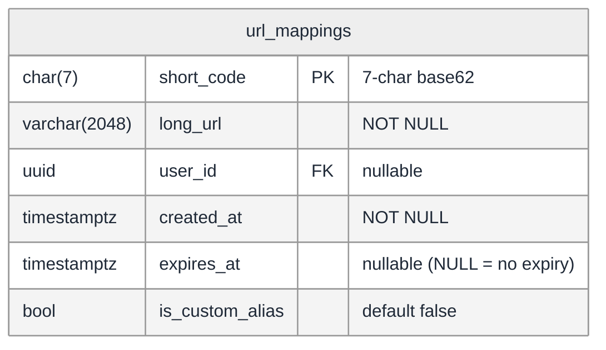
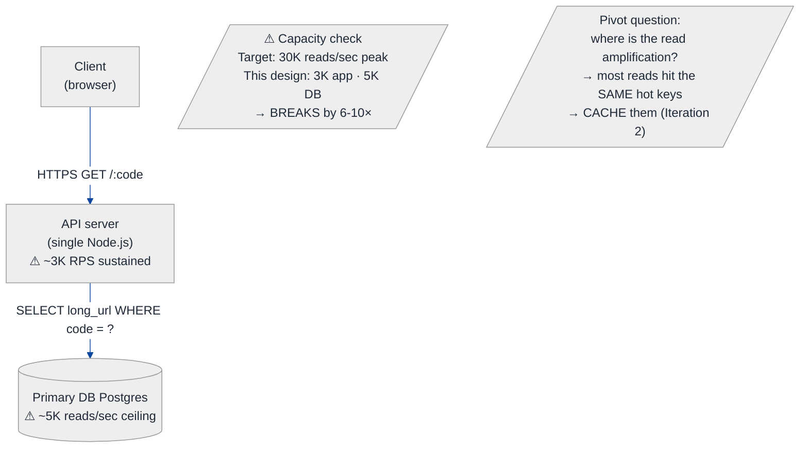
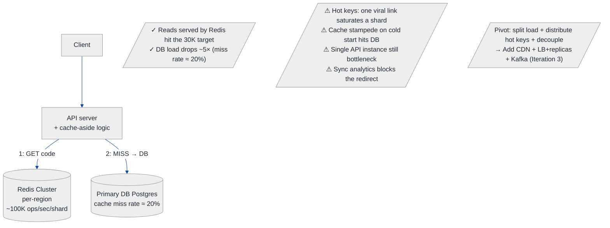
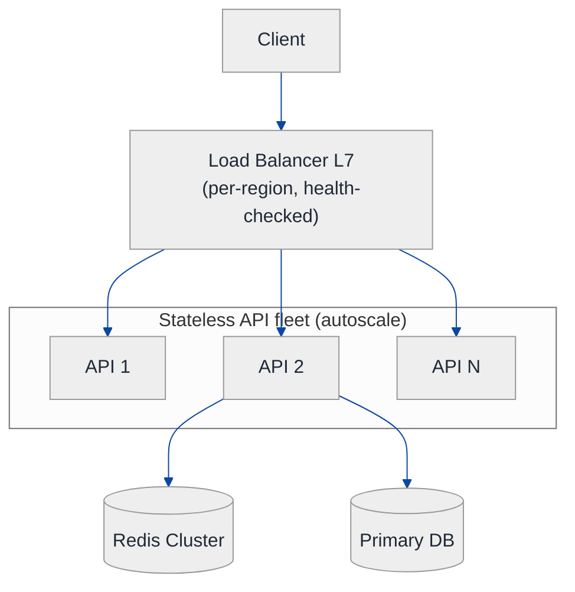
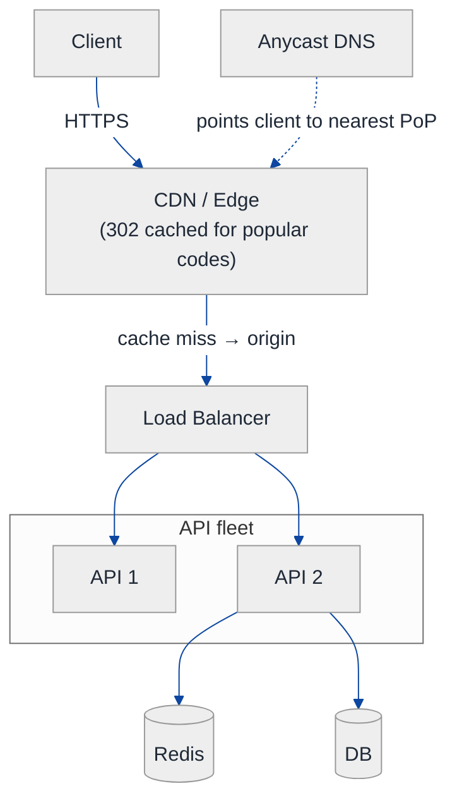
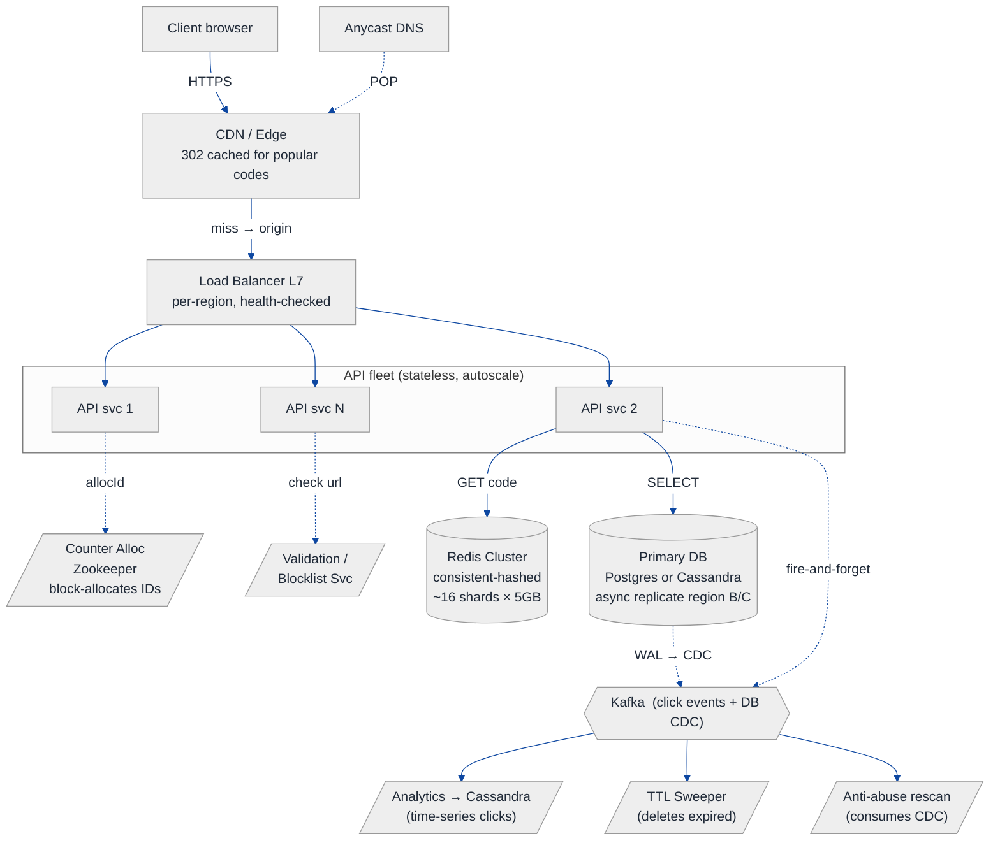
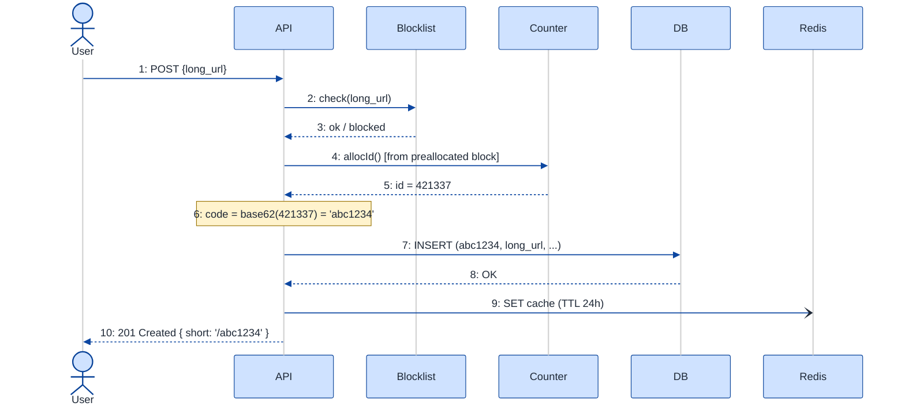
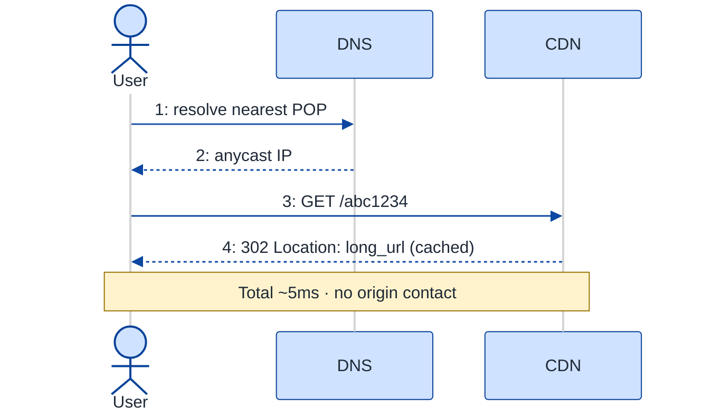
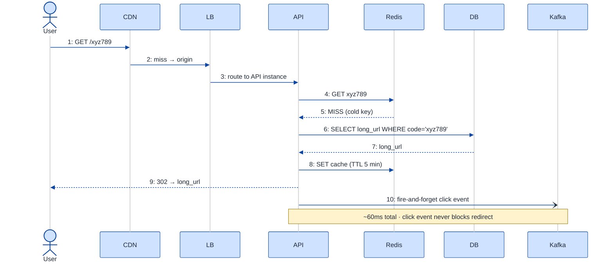

# URL Shortener — HLD Walkthrough

> **Difficulty:** Hard · **Time:** ~45 min · **Archetype focus:** read-heavy KV store with low-latency redirect + asynchronous analytics
>
> **Problem source(s):** 24 LeetLens rows in [`./EXTRACTED_QUESTIONS.md`](./EXTRACTED_QUESTIONS.md) (Google ×17, Meta ×3, ...). The most canonical HLD interview question.

---

## How to use this file

Paced for a candidate seeing the URL shortener question for the first time. Reading time: ~40 minutes if you sketch the architecture by hand. **The lesson: how to derive every architecture choice from ONE number — the read:write ratio — and how to explicitly call out the tradeoff that comes with each choice.**

**Map of this file (16 sections):**

1. Problem statement + clarifying questions
2. Plain-English restatement
3. Why this matters
4. Functional requirements
5. Non-functional requirements
6. Capacity estimation
7. High-level mental model
8. Try it yourself first
9. Data model
10. Architecture diagram + component overview
11. Component deep-dives
12. Key user flow — sequence diagram
13. Bottleneck analysis
14. Failure modes
15. Scaling story (10x, 100x)
16. Tradeoffs + anti-patterns + how to think aloud

---

## 0. Concepts you'll meet in this walkthrough

> **Read this first if you're seeing HLD for the first time.** Below is every piece of jargon used later in this file, with a one-line definition. Don't try to memorize them — skim, recognize, and come back here whenever a term re-appears. Each is also re-explained INLINE the first time it shows up.

| Term | One-line meaning | Where it appears |
|---|---|---|
| **HTTP 302 redirect** | A server response that says "the thing you asked for lives at this other URL — go there." The browser follows it automatically. | §1, §10.A |
| **QPS** | "Queries per second" — the number of requests per second the system must handle. Used for sizing. | §5, §6 |
| **p50 / p95 / p99 latency** | If you sort all request response-times, p50 = median, p95 = 95th percentile, p99 = the slowest 1% threshold. Tail latency matters because tails are what users notice. | §5 |
| **Read:write ratio** | Reads vs writes. 100:1 means 100 reads per write — drives every caching decision in this design. | §1, §5, §7 |
| **CDN (Content Delivery Network)** | A global network of cache servers (PoPs = "points of presence") sitting close to users. Caches responses at the network edge so users get them in 5-30ms instead of 100-300ms. Examples: Cloudflare, Fastly, CloudFront. | §10.C, §11.1 |
| **Anycast DNS** | A DNS scheme where the SAME IP address is announced from many physical locations; the network routes you to the closest one. | §10.C, §11.1 |
| **Load Balancer (LB) — L4 vs L7** | A box that distributes incoming requests across many backend servers. L4 = "transport layer" (TCP only, fast but dumb). L7 = "application layer" (knows HTTP, can route by URL path). | §10.C, §11.2 |
| **Stateless service** | An app server that holds no in-memory data tied to a specific user/session. Any instance can serve any request → trivial horizontal scaling. | §10.C, §11.3 |
| **Redis** | An in-memory key-value store. ~100K ops/sec per shard. Used as a cache (data evicted under memory pressure). | §10.B, §11.4 |
| **Cache hit / miss / cache-aside** | Hit = data was in the cache. Miss = we have to go to the DB. Cache-aside = "look in cache first, fall back to DB on miss, populate the cache after the DB hit." | §10.B, §12.C |
| **Cache stampede / thundering herd** | When the cache goes cold (e.g., deploy), many API instances all hit the DB simultaneously for the same key → DB melts. | §10.B, §13 |
| **Hot key** | One specific key in a cache/DB that gets disproportionate traffic (e.g., a viral link). Can saturate a single Redis shard or DB partition. | §13 |
| **Consistent hashing** | A way to map keys to N nodes such that adding/removing a node only reshuffles ~1/N of keys. Used by Redis Cluster and many DBs to add capacity without re-balancing everything. | §11.4 |
| **Base62 encoding** | Encode a number using the alphabet `[0-9A-Za-z]` (62 characters). A 7-char base62 string represents up to 62⁷ ≈ 3.5 trillion values, all URL-safe. | §11.5 |
| **Zookeeper (or any distributed coordinator)** | A small cluster (3-5 nodes) that gives you reliable distributed counters, locks, leader election. Slow per operation; we use it sparingly. | §11.5 |
| **Kafka** | A distributed log / message queue. Producers write events; consumers read them later, possibly hours later. Decouples write paths from downstream processing. | §10.C, §11.8 |
| **Fire-and-forget write** | The API writes to Kafka without waiting for an ack. If Kafka is slow or down, the write is dropped. Used when losing the occasional message is OK (e.g., click analytics). | §11.3, §12.C |
| **At-least-once vs exactly-once delivery** | Most queues (incl. Kafka) deliver at-least-once: the same message may arrive 2+ times. Consumers must be **idempotent** (de-duping by id) for exactly-once SEMANTICS. | §11.9 |
| **CDC (Change Data Capture)** | Tailing the database's write-ahead log to emit a stream of "row X changed" events. Used to feed search indexes, blocklist re-scans, audit logs. | §10.C, §11.8 |
| **WAL (Write-Ahead Log)** | Database's append-only log of every change, used for crash recovery AND as the source for CDC. | §11.8 |
| **Postgres vs Cassandra** | Postgres = single-leader SQL, strong consistency, transactions, easier to operate but harder to scale past one writer. Cassandra = multi-leader NoSQL, eventual consistency, linear scalability, native multi-region. Pick by your write throughput + consistency needs. | §11.7 |
| **LWT (Lightweight Transactions, Cassandra)** | Cassandra's `INSERT ... IF NOT EXISTS` — slow but rare; used for unique-alias creation. | §11.7 |
| **Replication / RPO / RTO** | Replication = copy DB to another node. RPO = Recovery Point Objective (how much data you can afford to lose, in time). RTO = Recovery Time Objective (how long the system can be down). | §11.7, §14 |
| **Sharding** | Splitting a table across multiple DB nodes by some key (hash or range). Each node owns a fraction; queries are routed by the key. | §11.7, §15 |
| **TTL (Time To Live)** | A duration after which a record is auto-deleted. Used here both for cache entries (so deletes propagate) and for the URL records themselves. | §11.4, §11.10 |
| **Safe Browsing** | Google's API that tells you whether a URL is on a malware/phishing list. ~30ms lookup. | §11.6 |

If you want a deeper refresher on any of these, the **Distributed Systems General** bucket in this repo will eventually have dedicated walkthroughs. For now, each term gets a 30-second mini-refresher inline the first time it appears below.

---

## 1. Problem statement + clarifying questions

**Prompt (typical phrasing):** "Design a URL shortener like bit.ly: take a long URL, return a short alias, and redirect users from the short alias to the long URL. Handle billions of redirects per day."

**Clarifying questions to ask in the first 5 minutes:**

1. **Scale?** How many URLs created per day? Total URLs after N years? (Drives storage + key-space sizing.)
2. **Read:write ratio?** Is it 100:1, 1000:1, 10:1? (Drives every caching + replication decision.)
3. **Custom aliases?** Can users choose their own short codes (`bit.ly/myteam`)? Or only system-generated?
4. **Expiration?** Do short URLs live forever, or have TTLs? Can users delete them?
5. **Analytics?** Just click count, or full per-click metadata (geo, referrer, user-agent, time)?
6. **Latency SLO?** Redirect latency target? (Usually p99 < 100 ms — non-negotiable since redirects are in user critical path.)
7. **Availability target?** 99.9% (8.7 h/yr downtime) or 99.99% (52 min/yr)? (Cost differs by ~10x.)
8. **Regional or global?** Single region or multi-region with anycast? (Affects DB choice.)
9. **Abuse?** Do we need to block malicious URLs / handle phishing reports? (Affects validation pipeline.)
10. **Authentication?** Anonymous shortening vs logged-in only?

**Assumptions if interviewer dodges:**

- 100 M URLs created per year, growing 50% YoY.
- 100:1 read:write ratio.
- 7-char codes from a base62 alphabet → 62⁷ ≈ 3.5 trillion possible codes.
- Custom aliases allowed (premium feature).
- Click analytics required at "approximate count + last-N-clicks per code" granularity.
- p99 redirect < 100 ms.
- 99.99% availability for redirects, 99.9% for creation.
- Multi-region read replicas, single-region writes (simplicity).

---

## 2. Plain-English restatement

We're building a service that translates billions of short URLs into long ones every day. The critical path is the REDIRECT, not the CREATE — reads outnumber writes 100:1, and a redirect must complete in well under 100 ms or users will notice. We'll architect for that asymmetry: a heavily-cached read path, with the write path doing extra work upfront (encoding, validation, analytics fan-out) to keep reads dumb and fast.

---

## 3. Why this matters

Universally asked HLD question; tests whether you can derive architecture from access patterns rather than recite a stack. The shape — "read-heavy KV with hot-key tail + asynchronous analytics" — reappears in feature-flag services, dictionary lookups, profile-page reads, and link-preview generators. If you can do URL shortener, you can do all of those.

---

## 4. Functional requirements

**Must-have:**

1. `POST /shorten` — given a long URL, return a 7-char short code.
2. `GET /:code` — redirect (HTTP 301/302) from short code to long URL.
3. `POST /shorten` with optional `alias` field — user-chosen custom code (validate uniqueness).
4. `GET /:code/stats` — return aggregate click count + last-N click events for the code.

**Stretch:**

5. `DELETE /:code` — user removes their own short URL.
6. URL expiration via TTL.
7. Malicious-URL blocklist enforced on shorten.

**Explicitly out of scope (state this!):**

- User registration / authentication system (we assume a separate identity service).
- UI for the dashboard.
- Real-time per-click streaming to the analytics dashboard (we'll batch).

---

## 5. Non-functional requirements

| Dimension | Target | Justification |
|---|---|---|
| **Availability — redirects** | 99.99% (52 min/yr downtime) | Redirects are user-facing critical path. |
| **Availability — creation** | 99.9% (8.7 h/yr) | Lower bar — users can retry creation. |
| **Consistency — code → URL** | Read-your-writes | Once you've shortened a URL, the redirect must work immediately. |
| **Consistency — analytics** | Eventual (≤ 5 min lag) | Click counts can lag; nobody dies if they're 3 minutes behind. |
| **Latency — redirect** | p50 < 20 ms, p99 < 100 ms | Anything more and users feel "the page is slow." |
| **Latency — creation** | p99 < 300 ms | Less critical. |
| **Durability** | 11 nines on URL mappings | Losing a URL mapping = broken bookmark forever. |
| **Throughput** | 30 K reads/sec peak, 300 writes/sec peak | See §6. |

---

## 6. Capacity estimation

**Writes (URL creation):**

```
URLs created per year:  100 M
Per day:                100M / 365 ≈ 274 K
Per second (average):   274K / 86400 ≈ 3.2 writes/sec
Peak (2.5x average):    ≈ 8 writes/sec
```

Wait — that's tiny. At 8 writes/sec the write path needs nothing fancy. Let me recompute assuming we want to design for the 100 M/year mark, where bitly-like services land.

Let me be more aggressive — assume we're designing for 5x current bitly scale (so the design has runway):

```
URLs created per year:  500 M
Per day:                ≈ 1.4 M
Per second (avg):       ≈ 16
Peak:                   ≈ 40 writes/sec    ← still small
```

**Reads (redirects):**

```
Read:write ratio:       100:1
Total redirects/year:   500M × 100 = 50 B
Per second (avg):       50B / (365 * 86400) ≈ 1585 reads/sec
Peak (5-10x for hot links / time-of-day): ≈ 10-30 K reads/sec
```

**Storage:**

```
Per record:
  short_code  (7 bytes)
  long_url    (avg 100 bytes, max 2 KB)
  created_at  (8 bytes)
  user_id     (16 bytes)
  ttl         (8 bytes)
  ─────────────────────
  ~140 bytes/record average

5 years of records:     2.5 B records × 140 B  ≈ 350 GB
With 2x replication overhead + indexes: ~1 TB total
```

**Bandwidth:**

```
Redirect response:      ~200 bytes (HTTP 302 + minimal body)
Peak redirect QPS:      30 K
Peak egress bandwidth:  30K × 200B = 6 MB/sec ≈ 50 Mbps
```

**Cache (working set):**

```
Hot subset assumed:     20% of records receive 80% of traffic
Cache size required:    0.2 × 2.5B = 500M records × 140B ≈ 70 GB
Round to:               80 GB (16 × 5GB Redis shards comfortably)
```

**Numbers to hold in your head: ~1 TB storage, ~30 K reads/sec peak, ~80 GB working set.** Everything that follows derives from these.

---

## 7. High-level mental model

> A **read-heavy KV store** (code → URL) with a **fat cache layer** and **fire-and-forget analytics fan-out**. The redirect path is one cache lookup + 302 in the happy case; the create path does the heavy lifting (encoding, validation, fanout). Writes go through a primary; reads serve from regional read-replicas + per-region cache.

---

## 8. Try it yourself first

> **Predict before reading on:**
>
> 1. Where will the FIRST bottleneck appear at 10x scale — cache, DB, or the code-generation step?
> 2. If you had to drop the cache layer entirely, what would break first?
> 3. How do you guarantee that two requests creating the same custom alias don't both succeed?

---

## 9. Data model

**Primary table — `url_mappings`:**

| Column | Type | Notes |
|---|---|---|
| short_code | char(7) | PRIMARY KEY |
| long_url | varchar(2048) | NOT NULL |
| user_id | uuid | nullable for anonymous; FK to identity service |
| created_at | timestamptz | NOT NULL |
| expires_at | timestamptz | nullable; NULL = no expiry |
| is_custom_alias | bool | for analytics segmentation |

**Indexes:**

- PK on `short_code` (the only access pattern that matters for redirect).
- Secondary index on `user_id` for "list my URLs."
- Partial index on `expires_at WHERE expires_at IS NOT NULL` for the TTL sweeper.

**Access patterns (the only thing that matters):**

| Pattern | Frequency | Latency budget |
|---|---|---|
| `SELECT long_url FROM url_mappings WHERE short_code = ?` | 30 K/sec | < 5 ms (else cache miss) |
| `INSERT INTO url_mappings ...` | 40/sec | < 50 ms |
| `SELECT * WHERE user_id = ? LIMIT 50` | rare | < 200 ms |

**Secondary table — `click_events` (analytics, eventually-consistent):**

| Column | Type |
|---|---|
| short_code | char(7) |
| clicked_at | timestamptz |
| referrer | text |
| user_agent | text |
| ip_geo | text |
| (partition key) | `(short_code, date_bucket)` |

Written async via Kafka → batch consumer → time-series DB (Cassandra or ClickHouse). Aggregate counts maintained in Redis with periodic flush.

### Data model — visualized



**Indexes:**
- PK on `short_code` — every redirect uses this
- Secondary INDEX on `user_id` — "list my URLs"
- PARTIAL INDEX on `expires_at WHERE expires_at IS NOT NULL` — TTL sweep

**Access patterns (the only thing that matters):**

| Pattern | Frequency | Latency budget |
|---|---|---|
| `SELECT long_url WHERE short_code = ?` | ~30K/sec | < 5 ms p99 |
| `INSERT INTO url_mappings (...)` | ~40/sec | < 50 ms |
| `SELECT WHERE user_id = ? LIMIT 50` | rare | < 200 ms |
| `DELETE WHERE expires_at < now()` (batched) | periodic | background |

---

## 10. Architecture — derived progressively

Instead of presenting the final architecture as a fait accompli, let's DERIVE it. Start with the simplest possible thing that could work. Compute where it breaks against the capacity numbers from §6 (30K reads/sec peak, 100:1 read:write). Add the smallest fix. Repeat until we land.

### 10.A — Iteration 1: naive (single Postgres + single app)

What does the absolute simplest version look like?



**Where it breaks.** Two ceilings hit before we approach the target:

| Component | Capacity | Target | Verdict |
|---|---|---|---|
| Single Node.js API instance | ~3K RPS sustained | 30K | breaks 10× |
| Single Postgres for full-row SELECT | ~5K reads/sec | 30K | breaks 6× |

**Pivot question:** where's the read amplification, and what can absorb it?

The answer comes from observation: short codes follow a power-law distribution — a small fraction of codes get most of the traffic. We don't actually need to LOOK UP each redirect; we need to CACHE the popular ones. Redis is the smallest thing that changes.

### 10.B — Iteration 2: add a Redis cache in front



**What this fixes:** Redis absorbs the 30K read load. DB load drops to ~20% (cache miss rate).

**What's still wrong:**
- **Hot keys.** A single viral link can saturate ONE Redis shard. Need cache layer ABOVE Redis for extreme hot keys → CDN.
- **Cache stampede.** If Redis goes cold (deploy, eviction wave), N API instances all hit DB simultaneously → DB melts. Need single-flight or pre-warm.
- **Single API instance.** Still a bottleneck. Need LB + horizontally-scaled API fleet.
- **Synchronous analytics.** Click counts written inline block the redirect. Need fire-and-forget via Kafka.

**Pivot question:** how do we split the load, distribute the hot keys, and decouple analytics? Three additions, in parallel: CDN (absolute hot keys), LB + replicas (horizontal scale), Kafka (async).

### 10.C — Iteration 3: the final architecture (built in THREE sub-steps so the jump isn't huge)

Iteration 2 left us with three problems: single-API-instance bottleneck, no edge caching for hot keys, and synchronous analytics blocking the redirect. Rather than draw the full 12-box system in one go (which is a lot to absorb), we'll add components in **three named sub-steps**. Each fixes one concrete problem.

#### 10.C.1 — Horizontal scaling: Load Balancer + stateless API fleet

**Problem to fix:** one API instance saturates around 3K RPS. We need MANY API instances behind a router.

> **Mini-refresher: stateless service.**
> An app server holding **no per-user / per-session data in memory**. Every request is independent. Consequence: ANY instance can serve ANY request — so you can add more boxes to handle more load without re-routing users. The opposite (stateful) requires sticky sessions and is hard to scale.

> **Mini-refresher: Load Balancer (L4 vs L7).**
> A box sitting in front of the API fleet that distributes incoming requests across instances. **L4** ("transport layer") only sees TCP/IP — fast but blind to HTTP. **L7** ("application layer") understands HTTP — can route by URL path, rate-limit per route, return 503 if all backends are down. We use L7 here because we want to rate-limit `/shorten` more strictly than `/:code`.



**What this fixes.** API now scales horizontally — add more instances under the LB until you hit the next bottleneck (DB writes, or Redis CPU). New ceiling: ~30K reads/sec is no problem at all, because each API instance is doing little CPU work (mostly forwarding Redis responses).

**What's still wrong.**
1. Every request still travels to your origin (region). For users far from your data center, network latency dominates (think: 200ms+ from Sydney to a us-east-1 origin).
2. A truly viral link still hits ONE Redis shard hard.
3. Synchronous analytics still blocks the redirect.

→ Fix latency-from-distance next (CDN + DNS); then fix sync analytics (Kafka).

#### 10.C.2 — Edge layer: CDN + Anycast DNS (absorbs popular codes at the network edge)

**Problem to fix:** the redirect for `/abc1234` shouldn't have to travel to your origin region if the answer is "always go to `https://example.com/article`."

> **Mini-refresher: CDN (Content Delivery Network).**
> A global network of cache servers (called **PoPs**, "points of presence") sitting close to users. The CDN can cache an HTTP response near you so the next user 100ms away gets it in 5-10ms. For URL shortener: we cache the 302 response for popular codes at the CDN. Commercial CDNs: Cloudflare, Fastly, AWS CloudFront, Google Cloud CDN.

> **Mini-refresher: Anycast DNS.**
> A DNS scheme where the SAME IP address is announced from many physical locations (e.g., `1.1.1.1` from datacenters on six continents). The internet's routing layer (BGP) picks the path with fewest network hops, sending each user to their nearest PoP automatically — no application logic involved.



**What this fixes.** Top ~5% of codes by traffic (the ones that dominate by Zipf's-law distribution) are served entirely from the CDN edge — ~5ms latency, never touch the origin. CDN absorbs hot keys at planet scale.

**What's still wrong.**
1. Synchronous click analytics still blocks the redirect (we want to track every click, but blocking on Kafka per request is bad).
2. Creating a new short code still needs ID generation (without collisions) + spam/malware validation. Where do those happen?

→ Fix both via Kafka (async) + Counter + Blocklist (sync but fast).

#### 10.C.3 — Final piece: async write path (Kafka + 3 consumers) + create-flow side services (Counter, Blocklist)

**Two problems, three additions:**

> **Mini-refresher: Kafka.**
> A distributed log + message queue. Producers append events; consumers read them whenever they want (seconds, minutes, or hours later). Decouples writers from readers. We use it for: (a) click events fired by the redirect path — those don't block the user; (b) DB Change-Data-Capture (CDC) events — downstream services that don't need to be in the write path subscribe here.

> **Mini-refresher: fire-and-forget write.**
> The producer (here: our API) writes the message and immediately moves on — it doesn't wait for the broker to confirm receipt. If the broker is slow or down, the message is silently dropped. Used when missing a few messages is OK (click counting tolerates dropping 0.1% of events).

> **Mini-refresher: CDC (Change Data Capture).**
> Tailing the database's write-ahead log (WAL) to emit "row X was inserted/updated/deleted" events to Kafka. Downstream services (search index updater, anti-abuse re-scanner, audit log) consume those events instead of writing to multiple destinations from the API.

> **Mini-refresher: Counter Allocator (Zookeeper) for ID generation.**
> When creating a new short code, each API instance grabs a **block of 1000 unused IDs** from a central counter (Zookeeper). The instance then assigns IDs from that block in-memory. Result: ID generation is ~99.9% in-memory (no Zookeeper RTT on the hot path); Zookeeper is touched only every 1000th create. No collisions ever.

Adding all three sub-systems gets us to the final architecture:



**Components at a glance (boxes in the diagram, deep-dived in §11):**

| # | Component | Purpose |
|---|---|---|
| 1 | Anycast DNS | Route users to nearest POP |
| 2 | CDN / Edge | Cache 302 for very-popular codes |
| 3 | Load Balancer | L7 distribution per region |
| 4 | API Service | Stateless app servers |
| 5 | Redis Cluster | Per-region hot-cache, code → URL |
| 6 | Counter Allocator | Hands out blocks of base62 IDs to API instances |
| 7 | Validation / Blocklist | Phishing / malware detection on create |
| 8 | Primary DB | Durable code → URL mapping |
| 9 | Kafka | Click events + DB CDC |
| 10 | Analytics consumer → C* | Aggregate clicks, store time-series |
| 11 | TTL sweeper | Delete expired records |

---

## 11. Component deep-dives

For each component: what it does · what's inside · 2-3 design decisions · failure mode.

### 11.1 CDN / Edge

- **What:** Caches `GET /:code → 302 Location: <long_url>` responses at PoPs close to users.
- **Inside:** Cloudflare / Fastly / CloudFront. Cache key = short_code. TTL = 5 min for typical codes, no caching for new codes (< 1 min old).
- **Design decisions:**
  1. Cache 302 responses, not the long_url itself, so the browser still navigates to the origin.
  2. Short TTL (5 min) — long enough to absorb traffic spikes, short enough that user-initiated deletes propagate quickly.
  3. Honor `Cache-Control: no-store` for premium accounts that need real-time revocation.
- **Failure mode:** CDN miss → falls back to origin LB. Latency hit ~50 ms but redirect still works.

### 11.2 Load Balancer

- **What:** L7 LB distributes redirect + create requests to a fleet of stateless API services.
- **Inside:** AWS ALB / nginx with weighted round-robin + active health checks every 5 s.
- **Design decisions:**
  1. L7 (not L4) so we can rate-limit per path (`/shorten` gets stricter limits than `/:code`).
  2. Sticky-session OFF — services are stateless; sticky reduces resilience.
  3. Surge-pool capacity at 2× steady-state to absorb hot links.
- **Failure mode:** LB redundant (multi-AZ). One AZ loss → other AZs absorb traffic; capacity headroom must be ≥ failure-AZ size.

### 11.3 API Service (stateless app servers)

- **What:** Handles both `POST /shorten` and `GET /:code`. Stateless — any instance can serve any request.
- **Inside:** Go / Java / Node service. Connection-pool to Redis + DB. Reads pre-allocated counter blocks from Zookeeper.
- **Design decisions:**
  1. Stateless → horizontal scaling is free. No session affinity needed.
  2. Each instance pre-allocates 1000-id blocks from the counter service → in-memory id generation amortizes allocator pressure.
  3. Read path: Redis first, DB on miss, set Redis on miss-load (cache-aside).
- **Failure mode:** Single instance dies → LB removes it, others absorb. Counter block on dying instance is "wasted" (codes never used) — acceptable since key space is 3.5 T.

### 11.4 Redis Cluster (read cache)

- **What:** Per-region cache mapping short_code → long_url.
- **Inside:** Sharded Redis cluster (consistent-hashed). ~16 shards × 5 GB ≈ 80 GB total. Eviction policy: LRU.

> **Mini-refresher: consistent hashing.**
>
> A scheme where keys are placed on a ring by their hash, and each key is owned by the next clockwise node. Adding/removing a node only reshuffles ~1/N of keys (a single arc), instead of nearly all keys (as with `hash(key) % N`).

- **Design decisions:**
  1. Sharded over consistent-hashing ring → adding a shard moves ~1/N of keys, not 100%.
  2. Replication factor 2 within region → single shard loss is non-fatal.
  3. Cache-aside (not write-through) → simpler invalidation; ~5-min TTL on cache entries handles late updates.
- **Failure mode:** Entire cluster down → all reads hit DB. With DB sized for 4× steady-state read load, this is survivable for ~10 min before DB CPU saturates. Page oncall at 50% cache-miss rate.

### 11.5 Counter Allocator (id generation)

- **What:** Hands out monotonically-increasing id BLOCKS to API instances. Each instance converts ids to base62.

> **Mini-refresher: base62 encoding.**
>
> Encode a number in base 62 using `[0-9A-Za-z]` as digits. A 7-char base62 string represents up to 62⁷ ≈ 3.5 trillion distinct codes. Compared to base64 (which includes `+/=`), base62 is URL-safe without any escaping.

- **Inside:** Zookeeper holding a single counter. API instances call `allocateBlock(1000)` → ZK atomically increments and returns `[N, N+1000)`. Instance generates short codes locally from that block.
- **Design decisions:**
  1. Block allocation (not per-id) → ZK QPS is 1/1000th of write QPS, so ZK is not a bottleneck.
  2. Monotonic counter → no collision possible by design (vs hash-of-URL, which collides).
  3. Block sizes are configurable per-instance (1000 default, larger for high-throughput pods).
- **Failure mode:** ZK quorum loss → allocator stops; new shortens fail. ZK is 5-node ensemble across 3 AZs → tolerates 2 node losses. Existing instances can use their pre-allocated blocks to keep serving for ~5 min.

### 11.6 Validation / Blocklist Service

- **What:** Synchronously checks long_url against malware/phishing blocklists during `POST /shorten`.
- **Inside:** Google Safe Browsing API + internal allow/deny lists in Redis. p99 lookup < 30 ms.
- **Design decisions:**
  1. Synchronous on create → catches bad URLs before they enter the system (cheaper than retroactive cleanup).
  2. Cached blocklist (Redis) with 1 h TTL → resilient if Safe Browsing API is slow.
  3. Async re-scan on existing URLs every 24 h (consumer reads from Kafka CDC).
- **Failure mode:** Blocklist down → fail-open on shorten (allow the URL but flag for re-scan). Risk: brief window of malicious shortens; mitigated by 24-h async re-scan.

### 11.7 Primary DB (Postgres or Cassandra)

- **What:** Durable storage of code → URL mappings.
- **Inside (two valid choices, depending on tradeoff):**
  - **Postgres:** strong consistency, transactional alias uniqueness. Sharded by hash(short_code). One primary per shard, async replicas.
  - **Cassandra:** eventual consistency, no transactions, but linearly scalable and multi-region native. Use LWT for alias uniqueness.

> **Mini-refresher: Cassandra LWT.**
>
> Cassandra's "lightweight transactions" use Paxos to guarantee compare-and-set on a single partition key (e.g. `INSERT ... IF NOT EXISTS`). Slower than normal writes but rare — perfect for the custom-alias uniqueness check that happens ~1% of writes.

- **Design decisions (if we pick Postgres):**
  1. Shard by `hash(short_code) % N` → 8 shards initially, doubles by adding replicas first.
  2. Read replicas in every region; writes go to region A primary.
  3. Auto-vacuum scheduled per shard outside peak hours.
- **Failure mode:** Primary failover via streaming-replication → 30 s RTO, 5-min-old data RPO. Multi-region writes only on Cassandra path.

### 11.8 Kafka (event stream + DB CDC)

- **What:** Two topics: `click_events` (push from API at redirect time, fire-and-forget) and `db_cdc` (debezium tails the DB WAL).
- **Inside:** 3-broker cluster, replication factor 3, retention 7 days for click events.
- **Design decisions:**
  1. Click events are fire-and-forget from the redirect path — DO NOT block redirect on Kafka write. If Kafka is slow, drop the event.
  2. CDC topic enables blocklist re-scan, downstream search index, analytics — separation of concerns.
  3. Partition click events by short_code → ordering preserved per code.
- **Failure mode:** Broker outage → producers buffer in-memory ~30 s, then drop. Cluster failure for >30 s → analytics gap (acceptable per §5 eventual-consistency budget).

### 11.9 Analytics Consumer → Cassandra

- **What:** Consumes click events, aggregates counts per (short_code, date), writes time-series rows.
- **Inside:** Stream processor (Flink / Kafka Streams). Tumbling 1-min windows, append to Cassandra time-series partition.
- **Design decisions:**
  1. 1-min windowing — gives 1-min aggregate query freshness while batching writes.
  2. Partition key = `(short_code, day_bucket)` — bounds partition size; queries are per-code-per-day.
  3. Idempotency via `(short_code, click_ts)` deduplication — duplicate Kafka deliveries don't double-count.
- **Failure mode:** Consumer lag → click counts stale by lag amount. Alerts on lag > 5 min (the SLO).

### 11.10 TTL Sweeper

- **What:** Periodic job that deletes records past `expires_at`.
- **Inside:** Cron job on K8s, every 5 min, batches deletes via partial index on `expires_at`.
- **Design decisions:**
  1. Soft-delete first (set deleted_at), hard-delete after grace period of 24 h.
  2. Invalidate Redis cache on soft-delete.
  3. Backlog tolerance: 1-h lag is fine; deleted URLs continue to resolve from cache briefly (acceptable).
- **Failure mode:** Sweeper down → expired URLs still resolve. Acceptable for hours; alert at 6 h.

---

## 12. Key user flows — sequence diagrams

Three flows worth tracing explicitly. They span the full latency budget — from ~5 ms (CDN hit) to ~60 ms (full miss to DB) to ~300 ms (create).

### 12.A — Create flow (POST /shorten)



**Key things to notice in the create flow:**
- **Counter allocation is in-memory** for the API instance. Zookeeper is touched only when a block runs out (every 1000 codes per instance), not per request.
- **Cache SET on create** seeds the cache so the FIRST redirect is fast. Cache-aside doesn't usually pre-populate, but for newly-created codes the cost is one extra Redis call vs cold-cache-miss-on-redirect.
- **Blocklist check is synchronous on create** — better to reject phishing URLs up-front than retroactively (much cheaper to clean).

### 12.B — Redirect with CDN hit (~5 ms total)



**Why this matters:** for popular codes (the top ~5% by traffic), the redirect never leaves the CDN edge. Most of your 30K reads/sec at peak are absorbed here, never reaching the origin. The CDN tier is what makes 99.99% availability affordable.

### 12.C — Redirect with full miss to DB (~60 ms)



**Three things to notice in the miss path:**

1. **The click event is FIRE-AND-FORGET.** API does NOT block the redirect on Kafka acknowledgment. If Kafka is slow, the click event is dropped — better than slowing the user.
2. **Cache-aside, not write-through.** API populates Redis ONLY on miss, not on insert (though create flow §12.A also sets the cache). The slight inconsistency is absorbed by the create flow seeding the cache.
3. **Three latency tiers, well-separated.** ~5ms (CDN), ~15ms (Redis), ~60ms (DB). The DB is your SLO ceiling — sized to absorb 4× steady-state read load so that a cache outage doesn't kill the service.

---

## 13. Bottleneck analysis

| # | Bottleneck | Where it shows up | Mitigation |
|---|---|---|---|
| 1 | **Hot keys (viral links)** — one short code gets 90% of cluster traffic | Redis shard overheats → single-shard CPU at 100% | CDN absorbs most; for the tail, in-process LRU cache in the API service (50ms TTL); cross-shard replication of hot keys via `key_split` (10 copies of `abc1234` under suffixed keys, randomized at read) |
| 2 | **Counter allocator contention** | Zookeeper at write-saturation | Already mitigated by 1000-id block allocation; if pushed further, allocate larger blocks or shard ZK by region |
| 3 | **DB write saturation** at >5K writes/sec | Insert queue depth grows | Shard count goes from 8 → 16; horizontal sharding by hash(short_code). Cassandra path scales further. |
| 4 | **Cache cold-start after deploy** | Every API restart → cold Redis → DB stampede | Pre-warm via replay of last hour's logs into Redis before LB sends traffic; staged rollout one POD at a time |
| 5 | **Cross-region write latency** | Multi-region requires async replication; users in region B see ~50 ms write penalty | Single-region writes for simplicity OR Cassandra with tunable consistency; accept eventual on cross-region reads |
| 6 | **Analytics consumer lag** at traffic spike | Kafka consumer can't keep up → backlog | Scale consumer fleet horizontally (Kafka partitions = parallelism cap); pre-provision 3× steady-state |
| 7 | **CDN cache invalidation latency** when a URL is deleted | Up to TTL (5 min) lag before deletion is global | Premium accounts get explicit purge; everyone else accepts 5-min lag |

---

## 14. Failure modes

1. **One API service instance dies.** LB health-check removes it within 10 s. Others absorb. Counter block held by the dead instance is "wasted" (codes never used) — acceptable, codespace is 3.5 trillion.
2. **Whole Redis cluster dies.** All reads fall to DB. DB sized at 4× steady-state read load can absorb this for ~10 min. Page oncall at >50% cache-miss rate. Recovery: spin up new Redis cluster, replay last-hour log to pre-warm before pointing API at it.
3. **DB primary dies.** Streaming-replication promotes a replica in ~30 s. Worst-case window: 30 s of write rejections + 5 min of stale reads from last replica before promotion. Acceptable for 99.9% creation SLO.
4. **Whole region offline (rare but real — AWS us-east-1 outage style).** DNS removes the region's anycast endpoint within ~60 s. Users redirected to next-nearest POP. Region B has read replicas of the primary DB; serves stale-but-correct redirects. Writes globally degrade until region A returns (or we promote region B as new primary, ~15 min runbook).
5. **Kafka cluster offline.** Click events buffered in producer for 30 s, then dropped. Click counts permanently lose 30 s of data. No redirect impact. Acceptable per eventual-consistency budget.
6. **Counter allocator (Zookeeper) quorum lost.** New shortens fail. Existing API instances still serve from in-memory block (~5 min runway). Recovery: restart ZK ensemble, rejoin nodes.

---

## 15. Scaling story (10x, 100x)

**Current design supports:** 30 K redirects/sec, 100 M URLs/year. What breaks at 10x? At 100x?

### At 10x (300 K redirects/sec, 1B URLs/year)

- **First break:** Redis cluster CPU (especially hot-key shards).
- **Fix:** CDN cache TTL extended from 5 min → 1 h for popular codes; hot-key sharding (key splitting); double the Redis cluster size (32 shards × 5 GB).
- **Second:** DB write throughput at peak (~400/sec → 4 K/sec).
- **Fix:** Postgres shard count 8 → 32, OR migrate writes to Cassandra (already a debated tradeoff in §11.7).
- **Third:** Counter allocator under more pressure.
- **Fix:** Increase block size to 10,000; or shard ZK by region.

### At 100x (3 M redirects/sec, 10B URLs/year)

- **Postgres becomes untenable;** Cassandra or DynamoDB is the only choice for the primary store. Operationally we should have made that call at 10x.
- **Redis sharding crosses ~100 shards** — operationally painful (rebalances, hot-spot whack-a-mole). Migrate to a managed cache (DAX / Elasticache cluster) or build hot-key-aware client routing.
- **Multi-region writes become non-optional** for tail latency. Cassandra multi-DC replication or active-active with CRDTs.
- **CDN architecture re-thought:** prefetch popular codes to all PoPs during creation, not on cold miss.

The honest answer in an interview: "I'd evolve this in three steps. Right now Postgres + Redis is the simplest correct design. At 10x I'd reshard. At 100x I'd migrate the storage layer to a multi-region NoSQL and accept eventual consistency on creation. Each step pays off ~one year of runway."

---

## 16. Tradeoffs + anti-patterns + how to think aloud + self-check

### Tradeoffs called out

| Decision | Benefit | Cost |
|---|---|---|
| Cache-aside (not write-through) | Simpler invalidation | Brief miss → DB hit after every write |
| Counter-based ids (vs hash-of-URL) | No collisions ever | Sequential ids are guessable (privacy concern); mitigate by random offset within block |
| Eventually-consistent analytics | Click writes don't block redirects | Counts may lag 1-5 min |
| Single-region writes | Simpler consistency | Cross-region writes have ~50 ms penalty |
| Fire-and-forget click events | Redirect is independent of Kafka health | Up to 30 s of clicks lost on Kafka outage |
| 5-min CDN TTL | Lower DB load, smaller hot-key blast radius | URL deletes propagate slowly |

### Anti-patterns

- **"Hash the URL with MD5, take first 7 chars."** Collisions inevitable at scale; collision-handling pulls in retry logic; defeats predictability.
- **"Single Postgres instance for 1B records."** Tablespace, autovacuum, and replication lag become operational nightmares.
- **"No rate limit on `/shorten`."** Lets attackers exhaust the keyspace or pollute the system with phishing URLs.
- **"Synchronous analytics write on redirect path."** Adds 20-50 ms tail latency per redirect for no user benefit.
- **"Custom alias uniqueness check via SELECT-then-INSERT."** Race condition — two simultaneous custom-alias creates both succeed. Use `INSERT ... ON CONFLICT DO NOTHING` (Postgres) or LWT (Cassandra).

### How to think aloud

> "OK — URL shortener. First clarifying: scale target? Read:write ratio? Custom aliases? Click analytics granularity? Multi-region? [Asks 6-8 questions from §1.]
>
> Assuming 100M URLs/year, 100:1 read:write, custom aliases yes, click counts at minute granularity, p99 redirect < 100ms, multi-region reads, single-region writes.
>
> Capacity. 100M/year × 5 years = 500M records × 140 bytes ≈ 70 GB raw, ~200 GB with indexes and replication. Reads at 100:1 → ~1.5K avg, ~30K peak. That's a small DB, big cache problem.
>
> Code generation. I want 7-char base62 codes → 3.5T keyspace, plenty. Source of ids: monotonic counter sharded via Zookeeper, block-allocated 1000 at a time per instance.
>
> Architecture. Three tiers of caching: CDN at the edge, Redis cluster per region, in-process LRU on API for hot keys. Redirect serves from whichever cache hits first; DB is last resort.
>
> Writes. POST /shorten → validate against blocklist → allocate id from in-memory block → base62 encode → INSERT into Postgres → set Redis → return 201. Total budget < 100ms; blocklist check is the slowest hop (~30ms).
>
> Reads. GET /:code → CDN, then Redis, then DB. On cache miss, populate cache. Fire-and-forget click event to Kafka; never block redirect.
>
> Bottlenecks: hot keys (viral links), counter allocator at very high write QPS, cache cold-start on deploy. Hot keys handled by CDN + key splitting; allocator by larger blocks; cold-start by pre-warm script.
>
> Failure modes: lose Redis → DB absorbs read load if sized for it (we'd size for 4×). Lose DB primary → 30s replica promote. Lose region → DNS removes endpoint.
>
> Tradeoff I'd flag explicitly: I'm assuming eventual consistency on analytics is OK. If real-time per-click analytics is required, the design changes — we'd need a sync write to a counter, which becomes the bottleneck."

### Self-check

> **Self-check — the question to ask next time.**
>
> When you see a system-design question, before sketching any boxes, ask:
>
> > **"What's the read:write ratio, and what's the dominant traffic pattern?"**
>
> For URL shortener it's 100:1 read-heavy. Every design choice — cache layer thickness, replica count, write-path complexity — falls out of that one number. If you can't state it confidently, your clarifying questions weren't sharp enough.

---

## Cross-references

- **Parent topic manifest:** [`./EXTRACTED_QUESTIONS.md`](./EXTRACTED_QUESTIONS.md)
- **Vertical overview:** [`../../LEARNING.md`](../../LEARNING.md)
- **Template:** [`../../TEMPLATE-v2.md`](../../TEMPLATE-v2.md)
- **Diagrams:**
  - All diagram sources live in [`../../diagrams/URL_Shortener/URL_Shortener_Design/`](../../diagrams/URL_Shortener/URL_Shortener_Design/):
    - `data-model.excalidraw` — table schema + access patterns (§9)
    - `iteration-1-naive.excalidraw` — naive single-DB design (§10.A)
    - `iteration-2-with-cache.excalidraw` — added Redis (§10.B)
    - `final-architecture.excalidraw` — full system (§10.C)
    - `sequence-shorten.excalidraw` — POST /shorten create flow (§12.A)
    - `sequence-redirect-hit.excalidraw` — CDN hit (§12.B)
    - `sequence-redirect-miss.excalidraw` — full DB miss (§12.C)
- **Engine:** [`../../../tools/render-diagrams/`](../../../tools/render-diagrams/) — `npm run diagrams` regenerates every PNG from its `.excalidraw` source.
- **Related HLD walkthroughs (future):**
  - Caching deep-dive (in `../Caching/`)
  - Rate Limiting deep-dive (in `../Rate_Limiting/`)
  - Consistent Hashing deep-dive (in `../Consistent_Hashing/`)
