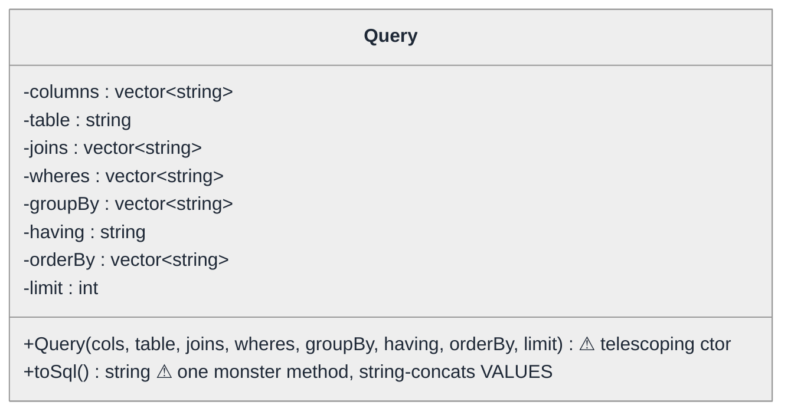
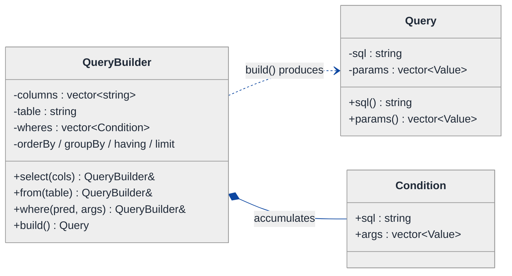
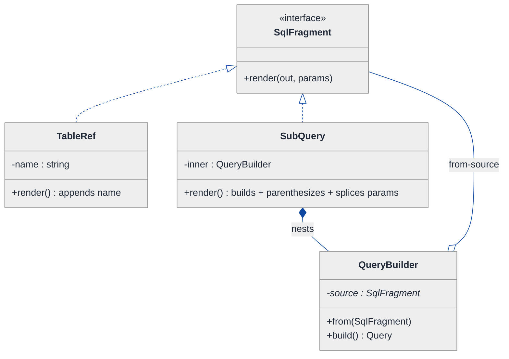
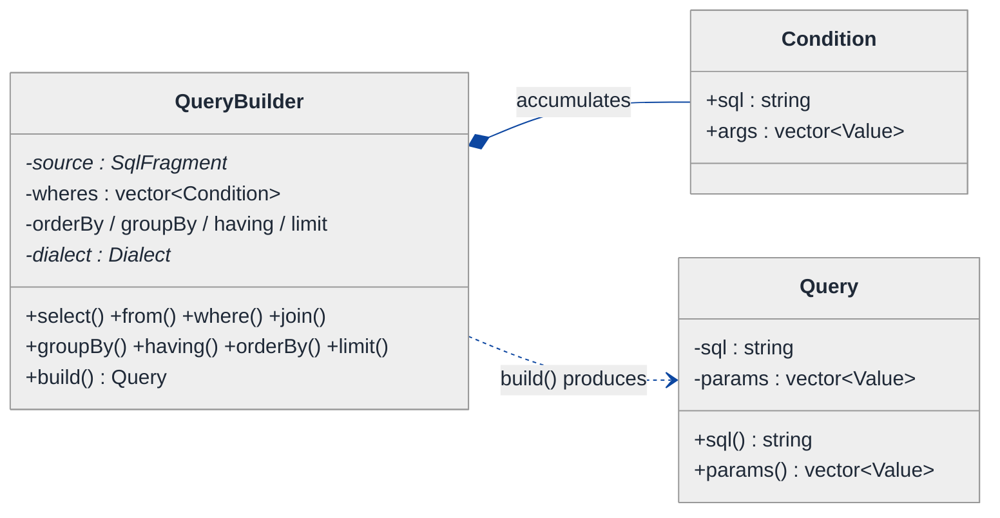
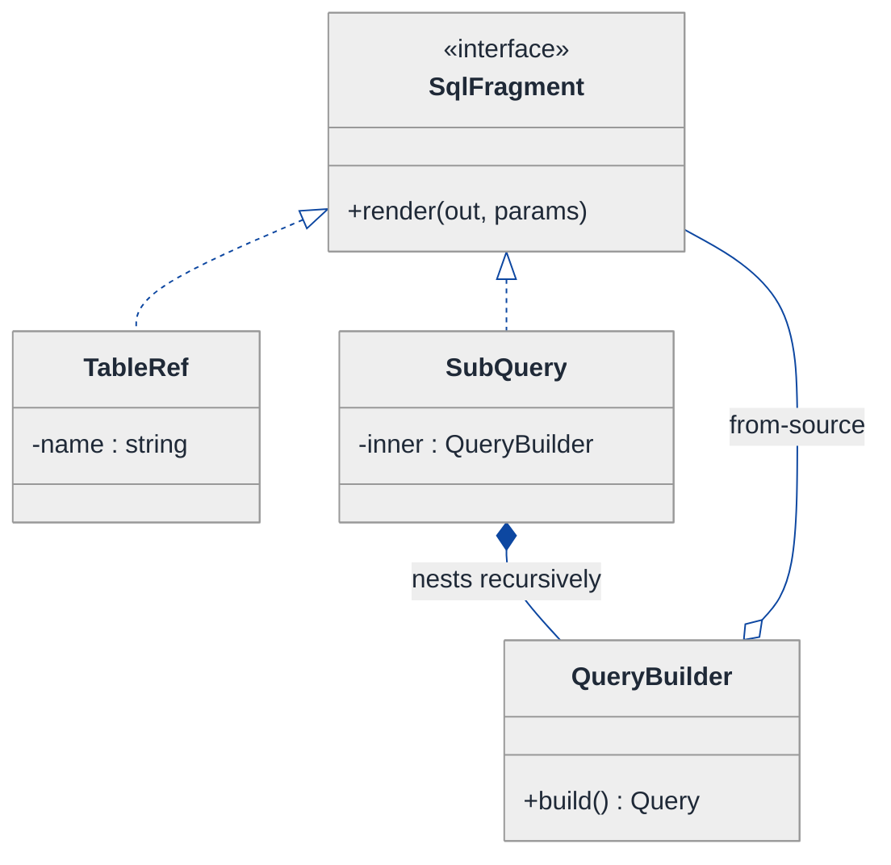
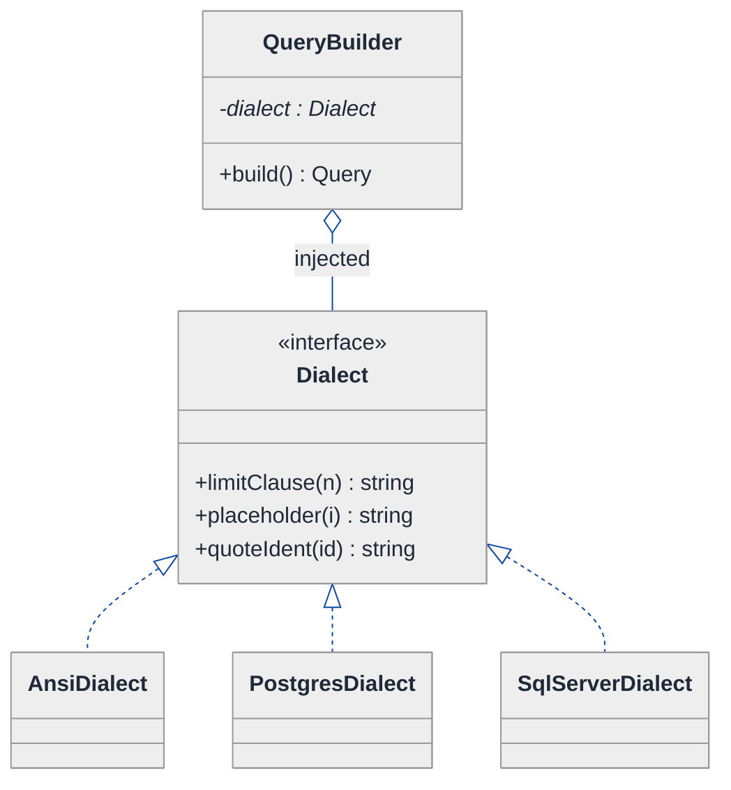
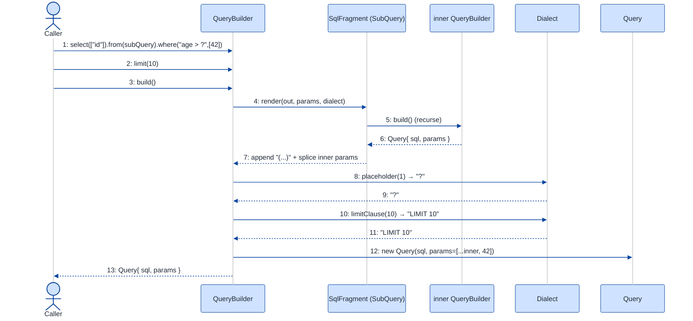

# SQL Query Builder — LLD Walkthrough

> **Difficulty:** Medium · **Time:** ~30 min · **Pattern focus:** Builder (fluent API) + a touch of Composite (subqueries) and Strategy (dialects)
>
> **Problem source(s):** GID **B1**, bucket `Builder_Pattern` — representative of the "design a fluent query builder" family of LLD prompts.
>
> **Diagrams:** inline mermaid (renders natively in GitHub / VS Code). Canonical theme block copied verbatim into every diagram.

---

## How to use this file

Paced for a candidate seeing "design a query builder" for the first time. Reading time: ~30 minutes if you sketch each iteration by hand. **The lesson: don't reach for the Builder pattern because the prompt says "Builder" — DERIVE it. Write the naive design first, watch it collapse under telescoping constructors and parameter explosion, and only then introduce the fluent Builder as the fix for the most painful axis.**

**Map of this file (15 sections):**

1. Problem statement + clarifying questions
2. Plain-English restatement
3. Why this matters
4. Mental model
5. Try it yourself first
6. Entity & verb extraction
7. **Iteration 1: the naive design** — one giant constructor / setter bag
8. **Where the naive design hurts** — four future requirements, one painful diff each
9. **Pivot 1: Builder for fluent assembly** — the most painful axis first
10. **Pivot 2: Composite for subqueries** — a query inside a query
11. **Pivot 3: Strategy for SQL dialects + parameter binding** — remaining variability
12. Final UML class diagram
13. Skeleton code (C++)
14. Key flow — sequence diagram
15. Extensibility re-check + anti-patterns + how to think aloud + self-check

---

## 1. Problem statement + clarifying questions

**Prompt (typical phrasing):** "Design a database query builder that supports SELECT, WHERE, JOIN, ORDER BY, GROUP BY, HAVING, LIMIT, and subqueries. Use the Builder pattern to provide a fluent API and generate valid SQL strings with parameterized queries."

**Clarifying questions to ask BEFORE drawing anything:**

1. **Read-only or full DML?** Just `SELECT`, or also `INSERT` / `UPDATE` / `DELETE`? (Changes whether one builder type suffices or we need a family.)
2. **Which dialect(s)?** ANSI SQL only, or do we need MySQL / PostgreSQL / SQLite quirks (`LIMIT` vs `TOP`, identifier quoting, placeholder syntax `?` vs `$1`)?
3. **Parameterization contract?** Do we emit positional placeholders (`?`), named (`:id`), or driver-numbered (`$1`)? Who owns the bound-value list — the builder or the caller?
4. **Subquery depth?** Subqueries in `FROM`, in `WHERE ... IN (...)`, in the `SELECT` list (scalar subquery)? Arbitrary nesting?
5. **Validation timing?** Should the builder reject an invalid query at build time (e.g. `HAVING` without `GROUP BY`), or trust the caller and just stringify?
6. **Immutability / reuse?** Can a half-built query be cloned and forked into two variants? Is the builder single-use or reusable?
7. **Identifier safety?** Do column / table names need escaping, or do we trust callers (and only parameterize *values*)?

**Assumptions if interviewer dodges:** `SELECT`-focused builder, ANSI SQL as the default dialect with a pluggable dialect hook, positional `?` placeholders with a builder-owned bound-value vector, subqueries allowed in `FROM` and `WHERE`, build-time validation of obvious illegal combinations, single-use builder per query (cloneable if needed). We parameterize values only; identifiers are quoted but trusted.

---

## 2. Plain-English restatement

We're building the object that lets application code assemble a SQL statement piece by piece — pick columns, add a table, chain `WHERE` conditions, attach joins, order, group, filter groups, limit — and then hand back a `(sql_string, bound_values)` pair that a driver can execute safely. Crucially the values the user filters on (the `42` in `age > 42`) must NEVER be concatenated into the string; they go out as parameters so we don't open an SQL-injection hole. The design must let us add new clause types, new SQL dialects, and nested subqueries **without rewriting the assembly code**.

---

## 3. Why this matters

This question probes whether you understand the Builder pattern's actual reason to exist: **taming the construction of an object that has many optional, order-sensitive parts.** A weak candidate writes a 14-argument constructor or a setter bag and calls it "Builder." The senior bar is recognizing *which* construction problems Builder solves (optional parts, fluent chaining, immutable product, step validation) versus the ones it does not (Builder is not a Factory, and not a god-object). The same shape reappears in HTTP request builders, test-data builders, protobuf message builders, and UI-config DSLs.

---

## 4. Mental model

A SQL statement is a **fixed-skeleton document with many optional slots**. Every `SELECT` has the same grammar order — `SELECT ... FROM ... JOIN ... WHERE ... GROUP BY ... HAVING ... ORDER BY ... LIMIT` — but almost every slot is optional and some repeat (many `WHERE` conditions, many joins). We're modeling a **scribe** that collects the slots in any order the caller chooses, then renders them in the ONE legal grammar order at the end.

```
Real-world sketch (NOT a UML diagram yet):

   caller chats with the scribe (any order):           scribe assembles in grammar order:
   ┌───────────────────────────────┐                   ┌──────────────────────────────────┐
   │ .select("id","name")          │                   │ SELECT id, name                  │
   │ .from("users")                │  ───render()──►   │ FROM users                       │
   │ .where("age > ?", 42)         │                   │ JOIN orders ON ...               │
   │ .join("orders","users.id=...")│                   │ WHERE age > ?                    │
   │ .orderBy("name")              │                   │ ORDER BY name                    │
   │ .limit(10)                    │                   │ LIMIT 10                         │
   └───────────────────────────────┘                   └──────────────────────────────────┘
                                                         params: [42]   ← values travel apart
```

The KEY insight: the caller's *call order* and SQL's *grammar order* are decoupled. The builder accumulates fragments; rendering imposes the grammar. And the values ride in a SEPARATE channel from the string.

---

## 5. Try it yourself first

> **Predict before reading on:**
>
> 1. List 5 nouns you'd promote to a class and 3 nouns you'd leave as fields/strings.
> 2. **If a query can have zero, one, or eight `WHERE` conditions and zero-to-many joins, what's wrong with passing them all through a single constructor?**
> 3. Where do the bound values (`42`) live so they never get concatenated into the SQL text? Who appends `?` to the string and the `42` to the list — and how do you keep those two in sync?

---

## 6. Entity & verb extraction

> **Mini-refresher: noun → class, but not every noun.**
>
> Naive OOD promotes every noun to a class. Senior OOD promotes a noun only if it has both BEHAVIOR and STATE that need to live together. A "column name" stays a string; a "query" becomes a class because it has assembly behavior + accumulated state.

**Nouns from the prompt:**

| Noun | Decision | Why |
|---|---|---|
| Query (the finished SQL) | Class — the immutable *product* | Holds the final `sql` + `params`; nothing else |
| QueryBuilder | Class — the *builder* | Accumulates fragments, exposes the fluent API |
| Condition (WHERE / HAVING predicate) | Small value type | `"age > ?"` + its bound values |
| Join | Small value type | join type + table + on-clause |
| OrderBy term | Field (string + ASC/DESC) | No behavior of its own |
| Column / Table name | Field (`std::string`) | No behavior |
| Subquery | A *nested Query / builder* | A query that appears where a table or value can |
| Dialect | Class (abstract) + concrete impls | Rendering varies per database |
| Bound value | Field on the product (`vector<Value>`) | Travels alongside the SQL string |

**Verbs (and the class they live on):**

| Verb | Owner class (naive answer — we'll re-examine) |
|---|---|
| select(cols...) | QueryBuilder |
| from(table) | QueryBuilder |
| where(pred, args...) | QueryBuilder |
| join(table, on) | QueryBuilder |
| groupBy / having / orderBy / limit | QueryBuilder |
| build() / toSql() | QueryBuilder → returns Query |
| render() | Dialect (introduced in Pivot 3) |

**We have NOT introduced any design patterns yet.** Pure nouns + verbs.

---

## 7. <a id="iter-1"></a>Iteration 1: the naive design

Let's write the simplest thing that could possibly work. No patterns — one class, one big constructor (and a few setters because nobody can remember 12 positional args).



**Reader's tour (read top to bottom; ~45 seconds).**

1. **One box, everything in it.** `Query` holds eight fields — columns, table, joins, wheres, group-by, having, order-by, limit. Every clause is just a `string` or `vector<string>`.

2. **The constructor is the first ⚠.** To create a query you pass all eight arguments positionally. Most are optional, so callers pass empty vectors and `""` and `-1` for "not set." `Query({"id"}, "users", {}, {"age > 42"}, {}, "", {}, -1)` — quick, which arg was `having`?

3. **`toSql()` is the second ⚠.** One method walks every field and concatenates the SQL. Worse: the value `42` is baked straight into the string `"age > 42"`. **That's an SQL-injection hole** — a caller who builds `"name = '" + userInput + "'"` is one quote away from disaster.

4. **No subqueries, no dialects.** A subquery would be "just another string" the caller hand-writes. `LIMIT` is hardcoded ANSI syntax.

Skeleton code for the naive design (C++):

```cpp
#include <string>
#include <vector>
#include <sstream>

class Query {
public:
    // Telescoping constructor — every clause positional, most optional.
    Query(std::vector<std::string> columns,
          std::string table,
          std::vector<std::string> joins   = {},
          std::vector<std::string> wheres  = {},
          std::vector<std::string> groupBy = {},
          std::string having               = "",
          std::vector<std::string> orderBy = {},
          int limit                        = -1)
        : columns_(std::move(columns)), table_(std::move(table)),
          joins_(std::move(joins)), wheres_(std::move(wheres)),
          groupBy_(std::move(groupBy)), having_(std::move(having)),
          orderBy_(std::move(orderBy)), limit_(limit) {}

    std::string toSql() const {                 // one monster method
        std::ostringstream os;
        os << "SELECT " << join(columns_, ", ") << " FROM " << table_;
        for (auto& j : joins_)  os << " JOIN " << j;        // caller hand-writes ON clause
        if (!wheres_.empty())   os << " WHERE " << join(wheres_, " AND ");   // VALUES inline! injection risk
        if (!groupBy_.empty())  os << " GROUP BY " << join(groupBy_, ", ");
        if (!having_.empty())   os << " HAVING " << having_;
        if (!orderBy_.empty())  os << " ORDER BY " << join(orderBy_, ", ");
        if (limit_ >= 0)        os << " LIMIT " << limit_;   // ANSI-only syntax, hardcoded
        return os.str();
    }
private:
    static std::string join(const std::vector<std::string>& v, const char* sep); // elided
    std::vector<std::string> columns_, joins_, wheres_, groupBy_, orderBy_;
    std::string table_, having_;
    int limit_;
};
```

**This works.** It has zero design patterns and produces a SQL string. So what's wrong with it?

---

## 8. <a id="naive-pain"></a>Where the naive design hurts

The interviewer slides four requirements across the desk: "These ship next quarter. Walk me through what changes."

### Change A: "Conditions must be parameterized — no values in the string, ever"

In the naive design:
- `wheres_` is `vector<string>` and `toSql()` concatenates `"age > 42"` directly. There is no separate value channel.
- To fix this you'd have to thread a `vector<Value> params_` through the constructor AND every clause AND `toSql()`, and rewrite every call site to split `"age > ?"` from `42`.
- **The change touches the constructor signature, `toSql()`, and EVERY caller.** The telescoping constructor now needs a ninth argument.

### Change B: "Conditions are built incrementally and conditionally"

Real call sites look like: *"always filter by tenant; if the user typed a search term, add a name filter; if they picked a date range, add two more."* In the naive design:
- You can't half-construct a `Query` and keep adding — the constructor demands everything at once.
- So callers build temporary `vector<string>` locals, push conditionally, then call the giant constructor at the end. **The accumulation logic leaks into every caller**, duplicated everywhere.

### Change C: "Support a subquery in FROM and in WHERE ... IN (...)"

In the naive design:
- `table_` is a `string` and `wheres_` are strings. A subquery is "just text" the caller hand-assembles — including its own parameters, which now must be spliced into the parent's param list in the right position.
- **There is no place for a nested query as a first-class thing.** Callers do string surgery and get the `?`-ordering wrong.

### Change D: "Ship MySQL and SQL Server dialects" (`LIMIT 10` vs `TOP 10`, `?` vs `@p1`)

In the naive design:
- `toSql()` hardcodes ANSI `LIMIT n` and `?`-free concatenation.
- **You'd add `if (dialect == MYSQL) ... else if (dialect == SQLSERVER) ...` branches throughout `toSql()`.** Classic tag-driven switch; every new dialect is surgery in the same method.

### The pattern of pain

| Change | Files / lines touched | Smell |
|---|---|---|
| A. Parameterize values | ctor signature + `toSql()` + every call site | "Values and SQL text are entangled; no separate channel." |
| B. Incremental build | accumulation logic duplicated in every caller | "Telescoping constructor can't express optional, order-free assembly." |
| C. Subqueries | string surgery in callers; `?`-ordering bugs | "No first-class nested query; a query can't contain a query." |
| D. Dialects | branches scattered through `toSql()` | "Rendering rules hardcoded to one database." |

**Three axes of pain dominate:** (1) *assembly* — optional, order-free, incremental construction with values kept apart; (2) *recursion* — a query can appear inside a query; (3) *rendering* — the same query stringifies differently per dialect.

> **Pivot question:** "What pattern lets a caller assemble an object from many optional parts, in any order, fluently, and hand back an immutable product? What pattern lets a part contain a whole of the same type? What pattern swaps the rendering algorithm per database?"
>
> The answers are Builder, Composite, and Strategy. We introduce them one at a time, starting with the most painful axis: assembly.

---

## 9. <a id="pivot-1"></a>Pivot 1: Builder for fluent assembly

> **Mini-refresher: Builder pattern.**
>
> Separates the *construction* of a complex object from its *representation*. A `Builder` exposes one method per optional part, each returning `*this` so calls chain fluently. When the caller is done, `build()` validates and returns an immutable *product*. The builder holds the messy half-built state; the product is clean and final.
>
> Quick example: `StringRequest req = HttpRequestBuilder().method("GET").url(u).header("Accept","json").build();` — optional headers, fluent chain, one immutable `req` at the end.

**Why Builder fits here.** Our construction problem has every Builder hallmark: many parts (`select/from/where/join/...`), most optional, repeatable (`where` called N times), order-free at the call site but order-FIXED in the product, and we want an immutable, safe-to-share product (`Query`) at the end. The telescoping constructor (Change A/B pain) is the exact anti-pattern Builder exists to kill.

**The refactor (just the affected part).** Two types now: a mutable `QueryBuilder` and an immutable `Query` product. The builder owns a parallel `params_` vector so values are split from text the moment they enter — solving Change A by construction.

```cpp
#include <string>
#include <vector>
#include <variant>

using Value = std::variant<int, double, std::string>;   // a bound parameter

struct Condition { std::string sql; std::vector<Value> args; };  // "age > ?" + [42]

// The immutable PRODUCT — nothing but the finished text + its params.
class Query {
public:
    Query(std::string sql, std::vector<Value> params)
        : sql_(std::move(sql)), params_(std::move(params)) {}
    const std::string&        sql()    const { return sql_; }
    const std::vector<Value>& params() const { return params_; }
private:
    std::string        sql_;
    std::vector<Value> params_;
};

// The BUILDER — mutable, fluent, single responsibility: accumulate then render.
class QueryBuilder {
public:
    QueryBuilder& select(std::vector<std::string> cols) { columns_ = std::move(cols); return *this; }
    QueryBuilder& from(std::string table)               { table_ = std::move(table);  return *this; }

    QueryBuilder& where(std::string pred, std::vector<Value> args = {}) {
        wheres_.push_back({ std::move(pred), std::move(args) });   // "age > ?" + [42] kept TOGETHER
        return *this;                                             // fluent: return self
    }
    QueryBuilder& orderBy(std::string term) { orderBy_.push_back(std::move(term)); return *this; }
    QueryBuilder& limit(int n)              { limit_ = n; return *this; }
    // groupBy(), having(), join() elided — same shape

    Query build() const {                       // validates + renders ONCE, returns immutable product
        if (table_.empty()) throw std::logic_error("FROM clause required");
        std::string sql = "SELECT " + join(columns_, ", ") + " FROM " + table_;
        std::vector<Value> params;
        if (!wheres_.empty()) {
            sql += " WHERE ";
            for (size_t i = 0; i < wheres_.size(); ++i) {
                if (i) sql += " AND ";
                sql += wheres_[i].sql;                                  // "age > ?"  — placeholder only
                for (auto& a : wheres_[i].args) params.push_back(a);    // 42         — value to param list
            }
        }
        // ... orderBy / limit appended; params stay in clause order ...
        return Query(std::move(sql), std::move(params));
    }
private:
    static std::string join(const std::vector<std::string>&, const char*); // elided
    std::vector<std::string> columns_, orderBy_;
    std::string table_;
    std::vector<Condition> wheres_;
    int limit_ = -1;
};
```

**What changed — visualized.** Just the assembly slice:



**Tour of the after-state.**

1. **Two boxes, one arrow.** The `QueryBuilder` (left) is mutable and messy; the `Query` (right) is immutable and clean. `build()` is the one-way door between them — once you have a `Query`, you can't mutate it.

2. **Every setter returns `QueryBuilder&`.** That's what makes the API *fluent*: `b.select(...).from(...).where(...)`. The reference return is the whole trick.

3. **`Condition` keeps text and value together.** A `where("age > ?", {42})` stores `"age > ?"` and `[42]` in one `Condition`. At `build()` time the placeholder goes into the SQL and the value goes into `params` — **they never touch.** Change A solved structurally.

4. **Incremental build is now natural.** You can `if (searchTerm) b.where("name LIKE ?", {term});` mid-chain. Change B's "accumulation logic in every caller" disappears — the builder IS the accumulator.

5. **Validation has a home.** `build()` is the single place to reject `HAVING` without `GROUP BY` or a missing `FROM`. The naive design had nowhere to put this.

**Pattern-discrimination cheatsheet — Builder vs Factory.**
- *Builder:* assembles ONE complex object step-by-step over many calls; the caller controls which optional parts are set; returns at `build()`.
- *Factory:* returns a fully-formed object in ONE call; the caller picks a *type/variant*, not the parts; construction is hidden, not staged.
- *Rule of thumb:* "many optional parts, assembled over time" → Builder. "pick one of N concrete types in a single call" → Factory.

We chose Builder because the problem is *part-by-part assembly with optional, repeatable clauses* — not "give me one of N pre-shaped objects." (A Factory would still be useful to *create* dialect-specific builders — see Pivot 3.)

---

## 10. <a id="pivot-2"></a>Pivot 2: Composite for subqueries

Change C is still painful — a subquery is a query that lives where a table or a value can. Builder alone doesn't express "a part that is itself a whole."

> **Mini-refresher: Composite pattern.**
>
> Lets you treat individual objects and *compositions* of objects uniformly through a common interface. A leaf and a container both implement the same `render()` (or `operation()`), so client code recurses without caring which it holds. Classic example: a file-system `Node` where `File` (leaf) and `Folder` (composite holding `Node[]`) both answer `size()`.

**Why Composite fits subqueries.** A subquery in `FROM ( ... ) AS t` or `WHERE id IN ( ... )` is structurally identical to a top-level query — it has its own select/from/where and its own params. If we make the "table source" and the "value list" polymorphic over a common `SqlFragment` that can `render(out_sql, out_params)`, then a plain table name and a nested query both satisfy it, and **the parent renders children recursively, splicing each child's params into the parent's list in clause order.** That last bit — recursive param splicing — is exactly the `?`-ordering bug Change C hit in the naive design, now handled for free.

**The refactor (just the recursion part):**

```cpp
// Common interface: anything that can render into (sql, params).
class SqlFragment {
public:
    virtual ~SqlFragment() = default;
    // Append this fragment's SQL to `out`, and its bound values to `params`.
    virtual void render(std::string& out, std::vector<Value>& params) const = 0;
};

// LEAF: a plain identifier (table or column reference). No params.
class TableRef : public SqlFragment {
public:
    explicit TableRef(std::string name) : name_(std::move(name)) {}
    void render(std::string& out, std::vector<Value>&) const override { out += name_; }
private:
    std::string name_;
};

// COMPOSITE: a subquery wraps a whole QueryBuilder and renders it parenthesized.
class SubQuery : public SqlFragment {
public:
    explicit SubQuery(QueryBuilder inner) : inner_(std::move(inner)) {}
    void render(std::string& out, std::vector<Value>& params) const override {
        Query q = inner_.build();                      // recurse: build the nested query
        out += "(" + q.sql() + ")";                    // parenthesize
        for (auto& p : q.params()) params.push_back(p); // splice nested params in order
    }
private:
    QueryBuilder inner_;
};

// QueryBuilder.from() now takes a SqlFragment, not a raw string:
//   b.from(std::make_unique<SubQuery>(innerBuilder), "t")
//   b.from(std::make_unique<TableRef>("users"))
```

**What changed — visualized.** Just the subquery slice:



**Tour of the after-state.**

1. **`SqlFragment` is the uniform interface.** One method, `render(out, params)`. A table name and a nested query both implement it; the parent's `build()` calls `source_->render(...)` and doesn't care which it got.

2. **`TableRef` is the LEAF.** Appends its name, contributes zero params. The base case of the recursion.

3. **`SubQuery` is the COMPOSITE.** Note the `*--` back to `QueryBuilder` — a subquery *contains* a whole builder. Its `render()` builds the inner query, wraps it in parentheses, and **splices the child's params into the parent's vector in order.** Nesting is now unbounded: a `SubQuery` can hold a builder whose `from` is another `SubQuery`.

4. **Param ordering is correct by construction.** Because rendering walks the tree depth-first in clause order, the `?` placeholders and the `params` list stay in lockstep. Change C's manual `?`-splicing bug is gone.

**Pattern-discrimination cheatsheet — Composite vs Decorator.**
- *Composite:* builds a TREE; a node holds *many* children of the same interface; the point is uniform recursion over a hierarchy.
- *Decorator:* builds a CHAIN; a wrapper holds *one* wrapped object of the same interface; the point is adding behavior to a single object.
- *Rule of thumb:* "treat one-and-many uniformly in a tree" → Composite. "wrap one thing to add a responsibility" → Decorator.

We chose Composite because a subquery is a genuine *tree* of query nodes, not a behavior-wrapper around a single query.

---

## 11. <a id="pivot-3"></a>Pivot 3: Strategy for SQL dialects + parameter binding

Changes A, B, C are solved. Change D (MySQL `LIMIT` vs SQL Server `TOP`, `?` vs `@p1`) is not — and it's not an assembly or recursion problem. It's a *rendering* problem: the same accumulated query stringifies differently per database.

> **Mini-refresher: Strategy pattern.**
>
> Encapsulates an algorithm behind an interface so it can be swapped at runtime. The CALLER decides which strategy to use; the strategy doesn't know about its peers. Quick example: a `Sorter` takes a `CompareStrategy*`; pass `Ascending` or `Descending` and the sorter doesn't care.

**Why Strategy fits dialects.** "Render this query to a SQL string" is an algorithm that varies by database (limit syntax, identifier quoting, placeholder style). The choice is made externally (you know which DB you're targeting). That's textbook Strategy. We inject a `Dialect` into the builder; `build()` asks the dialect for each dialect-specific fragment instead of hardcoding ANSI.

```cpp
class Dialect {
public:
    virtual ~Dialect() = default;
    virtual std::string limitClause(int n) const = 0;          // "LIMIT 10" vs "" (TOP handled in select)
    virtual std::string placeholder(int oneBasedIndex) const = 0; // "?"  vs "$1" vs "@p1"
    virtual std::string quoteIdent(const std::string& id) const = 0; // `col` vs "col" vs [col]
};

class AnsiDialect : public Dialect {
public:
    std::string limitClause(int n) const override { return "LIMIT " + std::to_string(n); }
    std::string placeholder(int) const override   { return "?"; }
    std::string quoteIdent(const std::string& id) const override { return "\"" + id + "\""; }
};

class PostgresDialect : public Dialect {
public:
    std::string limitClause(int n) const override { return "LIMIT " + std::to_string(n); }
    std::string placeholder(int i) const override { return "$" + std::to_string(i); } // numbered
    std::string quoteIdent(const std::string& id) const override { return "\"" + id + "\""; }
};
// SqlServerDialect (TOP n, [ident], @pN) elided — same shape

// QueryBuilder holds an injected dialect; build() consults it.
//   QueryBuilder(std::unique_ptr<Dialect> d) : dialect_(std::move(d)) {}
//   ... build(): out += dialect_->limitClause(limit_); placeholder = dialect_->placeholder(++n); ...
```

**The lesson.** Once Pivot 1 isolated *assembly* into the builder, swapping *rendering* is a clean injection — the accumulated state (`wheres_`, `orderBy_`, ...) is dialect-agnostic; only `build()`'s string-emission consults the strategy. Change D becomes one new `Dialect` subclass, zero edits to the accumulation API.

> **Mini-refresher: why Dialect and SqlFragment are different hierarchies.**
>
> They are both polymorphic, but they answer different questions. `SqlFragment::render` answers "what text am *I*?" (structure / recursion — Composite). `Dialect` answers "how does *this database* spell a placeholder/limit?" (rendering policy — Strategy). Don't fuse them into one "SqlThing" interface; they vary along independent axes.

---

## 12. <a id="fig-class-diagram"></a>Final class diagram

Showing everything in one diagram becomes a wall of boxes. Here are **three focused sub-views**; the structural insight at the end ties them together.

### 12.1 The build pipeline — Builder produces an immutable Query



**Tour of 12.1.** The builder accumulates `Condition`s (filled diamond — it owns them) and, on `build()`, produces a `Query` (dashed dependency — it creates but doesn't own the product's lifetime). The product carries only `sql` + `params`; all the messy half-built state stays behind in the builder. This is the Builder pattern's core split: mutable assembler, immutable result.

### 12.2 The fragment tree — Composite for subqueries



**Tour of 12.2.** `SqlFragment` is the uniform render interface; `TableRef` is the leaf, `SubQuery` is the composite that nests a whole `QueryBuilder`. The `SubQuery *-- QueryBuilder` edge is the recursion that makes arbitrary subquery depth possible — and because rendering is depth-first in clause order, nested params splice in correctly.

### 12.3 The rendering policy — Strategy for dialects



**Tour of 12.3.** `QueryBuilder` aggregates an injected `Dialect` (open diamond — used, not lifetime-owned the same way). `build()` consults it for placeholder spelling, limit syntax, and identifier quoting. Adding SQL Server is one new subclass; the accumulation API never moves.

### Structural insight (ties 12.1 + 12.2 + 12.3 together)

| Concern | Pattern used | Why |
|---|---|---|
| **Assembly** (optional, repeatable, order-free clauses) | Builder — `QueryBuilder` → immutable `Query` | Many optional parts, fluent chaining, validate-at-build, immutable product |
| **Recursion** (subquery is a query) | Composite — `SqlFragment` leaf/composite | A part can be a whole of the same interface; uniform recursive render |
| **Rendering** (dialect differences) | Strategy — injected `Dialect` | Same query, swappable stringification picked by the caller |
| **Parameter safety** | Builder invariant (`Condition` holds `?` + value) | Values enter split from text and never re-merge |

The big lesson: **Builder owns the assembly axis; the other two patterns plug into well-defined seams the Builder exposes** (`from(SqlFragment)`, injected `Dialect`). *Builder for construction, Composite for self-similar structure, Strategy for swappable rendering* — three orthogonal axes, three patterns.

---

## 13. Skeleton code (C++)

> Show the SHAPES, not the full impl. ~120 lines.

```cpp
#include <memory>
#include <stdexcept>
#include <string>
#include <variant>
#include <vector>

// ── Bound value + a where/having predicate ──────────────────────────
using Value = std::variant<int, double, std::string>;
struct Condition { std::string sql; std::vector<Value> args; };  // "age > ?" + [42]

// ── Rendering policy (Strategy) ─────────────────────────────────────
class Dialect {
public:
    virtual ~Dialect() = default;
    virtual std::string limitClause(int n) const = 0;
    virtual std::string placeholder(int oneBasedIdx) const = 0;
    virtual std::string quoteIdent(const std::string& id) const = 0;
};
class AnsiDialect : public Dialect {
public:
    std::string limitClause(int n) const override { return "LIMIT " + std::to_string(n); }
    std::string placeholder(int) const override   { return "?"; }
    std::string quoteIdent(const std::string& id) const override { return "\"" + id + "\""; }
};
// PostgresDialect ("$1"), SqlServerDialect ("TOP n", "@pN") elided — same shape

// ── Fragment tree (Composite) — anything that renders into (sql, params) ─
class QueryBuilder;  // forward — SubQuery nests one

class SqlFragment {
public:
    virtual ~SqlFragment() = default;
    virtual void render(std::string& out, std::vector<Value>& params,
                        const Dialect& d) const = 0;
};
class TableRef : public SqlFragment {            // LEAF
public:
    explicit TableRef(std::string n) : name_(std::move(n)) {}
    void render(std::string& out, std::vector<Value>&, const Dialect& d) const override {
        out += d.quoteIdent(name_);
    }
private:
    std::string name_;
};
// SubQuery (COMPOSITE) defined after QueryBuilder — it nests one.

// ── The immutable PRODUCT ───────────────────────────────────────────
class Query {
public:
    Query(std::string sql, std::vector<Value> params)
        : sql_(std::move(sql)), params_(std::move(params)) {}
    const std::string&        sql()    const { return sql_; }
    const std::vector<Value>& params() const { return params_; }
private:
    std::string        sql_;
    std::vector<Value> params_;
};

// ── The BUILDER ─────────────────────────────────────────────────────
class QueryBuilder {
public:
    explicit QueryBuilder(std::shared_ptr<Dialect> d = std::make_shared<AnsiDialect>())
        : dialect_(std::move(d)) {}

    QueryBuilder& select(std::vector<std::string> cols) { columns_ = std::move(cols); return *this; }
    QueryBuilder& from(std::unique_ptr<SqlFragment> src){ source_ = std::move(src);   return *this; }
    QueryBuilder& from(std::string table) { return from(std::make_unique<TableRef>(std::move(table))); }
    QueryBuilder& where(std::string pred, std::vector<Value> args = {}) {
        wheres_.push_back({ std::move(pred), std::move(args) }); return *this;
    }
    QueryBuilder& groupBy(std::vector<std::string> cols) { groupBy_ = std::move(cols); return *this; }
    QueryBuilder& having(std::string pred, std::vector<Value> args = {}) {
        having_ = { std::move(pred), std::move(args) }; return *this;
    }
    QueryBuilder& orderBy(std::string term) { orderBy_.push_back(std::move(term)); return *this; }
    QueryBuilder& limit(int n)              { limit_ = n; return *this; }
    // join() elided — accumulates a Join value, same shape

    Query build() const {                               // validate + render ONCE
        if (!source_)                       throw std::logic_error("FROM required");
        if (!having_.sql.empty() && groupBy_.empty())
                                            throw std::logic_error("HAVING needs GROUP BY");
        std::string out = "SELECT " + join(columns_, ", ") + " FROM ";
        std::vector<Value> params;
        source_->render(out, params, *dialect_);        // recurse into table / subquery
        emitWheres(out, params);                         // appends "?"/"$1" via dialect_
        // ... groupBy / having / orderBy appended ...
        if (limit_ >= 0) out += " " + dialect_->limitClause(limit_);
        return Query(std::move(out), std::move(params));
    }
private:
    void emitWheres(std::string&, std::vector<Value>&) const; // elided — placeholder via dialect_
    static std::string join(const std::vector<std::string>&, const char*); // elided
    std::shared_ptr<Dialect>      dialect_;
    std::unique_ptr<SqlFragment>  source_;
    std::vector<std::string>      columns_, groupBy_, orderBy_;
    std::vector<Condition>        wheres_;
    Condition                     having_;
    int                           limit_ = -1;
};

// COMPOSITE that nests a whole builder — defined now that QueryBuilder is complete.
class SubQuery : public SqlFragment {
public:
    explicit SubQuery(std::shared_ptr<QueryBuilder> inner) : inner_(std::move(inner)) {}
    void render(std::string& out, std::vector<Value>& params, const Dialect&) const override {
        Query q = inner_->build();                       // recurse
        out += "(" + q.sql() + ")";
        for (auto& p : q.params()) params.push_back(p);  // splice nested params in order
    }
private:
    std::shared_ptr<QueryBuilder> inner_;
};
```

---

## 14. <a id="fig-sequence"></a>Key flow — sequence diagram

What does a single fluent build look like when a subquery and a dialect are both in play? Read the numbered messages.



**Tour of the flow — read slowly; this is where all three patterns cooperate.**

1. **Steps 1–2: fluent accumulation.** Each call returns `*this`, so the caller chains. Crucially, `where("age > ?", [42])` puts `"age > ?"` aside as text and `42` aside as a value — they enter the builder already separated. **No string concatenation of values, ever.**

2. **Step 3: `build()` is the one-way door.** Everything before this was mutation; after it the caller holds an immutable `Query`.

3. **Steps 4–7: the Composite recursion.** `build()` asks the FROM-source to render. The source is a `SubQuery`, so it recursively builds its inner query (step 5–6) and splices the inner params into the parent's list (step 7) — in clause order, so placeholders and values stay in lockstep.

4. **Steps 8–11: the Strategy consults.** The dialect decides how a placeholder is spelled (`?` vs `$1`) and how `LIMIT` is written. Swap the injected dialect and the same accumulated state renders differently — the builder's accumulation code never changes.

5. **Steps 12–13: the immutable product.** `Query` carries `sql` plus an ordered `params` vector. The driver binds them safely. **The value `42` reached the product without ever being in the SQL string.**

### What the Builder HIDES from the caller

You never see the caller manage clause order, placeholder numbering, or param splicing. The fluent chain hides the grammar-ordering and the parameter-binding bookkeeping behind `build()` — the caller thinks in *clauses*, the builder thinks in *SQL grammar + safe parameters*.

---

## 15. Extensibility re-check + anti-patterns + how to think aloud + self-check

### Extensibility re-check

Revisit the four changes from [§8](#naive-pain). For each, name the SINGLE seam that changes.

| Change | Naive design impact | Final design impact |
|---|---|---|
| A. Parameterize values | ctor + `toSql()` + every caller | Built-in: `Condition` holds `?` + value; `build()` splits them. Nothing to add. |
| B. Incremental build | accumulation logic duplicated everywhere | The builder IS the accumulator; conditional `.where()` mid-chain. Done. |
| C. Subqueries | string surgery + `?`-ordering bugs | New `SubQuery : SqlFragment`; recursion + param splice handled. Done. |
| D. New dialect | branches scattered in `toSql()` | New `Dialect` subclass injected at construction. Done. |

Every change is built-in or exactly ONE new class. That's the open/closed principle in practice.

> **Mini-refresher: Open/Closed Principle (the "O" in SOLID).**
>
> Software entities should be OPEN for extension but CLOSED for modification. You add behavior by adding new code (a subclass / a new fragment), not by editing existing, tested code. Builder + Composite + Strategy each give a seam where new behavior plugs in without touching `build()`.

If a future requirement makes you edit `build()` AND `QueryBuilder`'s fields AND a `Dialect` together — go back to §6 and re-identify the variability point you missed.

### Common confusion + traps

1. **"Isn't a setter bag (`setColumns`, `setTable`) already a Builder?"** No — a setter bag has no fluent chaining, no immutable product, and no single validation point. The fluent `return *this` + the `build()` door are what make it a Builder.

2. **"Should I concatenate values for simple integers — surely `42` is safe?"** Never special-case. The moment one path concatenates, a caller will route user input through it. Parameterize uniformly.

3. **"Why a separate immutable `Query` instead of just returning a string?"** The product also carries the `params` vector, and immutability lets you cache / reuse / fork it. A bare string loses the param channel.

4. **"Make `QueryBuilder` a singleton — there's one builder."** No. Each query under construction needs its own builder state; a singleton would let two concurrent builds clobber each other.

5. **"Why is Dialect `shared_ptr` but `source_` `unique_ptr`?"** A dialect is stateless policy shared across many builders (shared ownership); the FROM-source belongs to exactly one builder (exclusive ownership).

### Anti-patterns

- **"Telescoping constructor"** — the 8-arg ctor of §7. The exact thing Builder kills.
- **"Stringly-typed everything"** — modeling joins/conditions as raw strings the caller hand-writes, re-opening the injection hole. Use small value types (`Condition`, `Join`).
- **"God builder"** — a single `QueryBuilder` that also opens connections, executes, and maps rows. Keep it to assembly; execution is a separate concern.
- **"Mutable product"** — handing back a `Query` whose `sql` can still be edited. Make the product immutable so it's safe to share/cache.
- **"Dialect `if/else` in build()"** — tag-driven branching on a `DbType` enum. Inject a `Dialect` strategy instead.
- **"Premature genericism"** — fusing `SqlFragment` and `Dialect` into one interface because both are polymorphic. They vary on independent axes.

### How to think aloud

> "OK, query builder. Let me clarify scope. [Asks Qs from §1: SELECT-only? dialects? placeholder style? subquery depth?] Got it.
>
> Nouns: Query (the product), QueryBuilder, Condition, Join, Subquery, Dialect. Values are NOT strings — they're bound parameters.
>
> I'll write the NAIVE design first — one `Query` class, a telescoping constructor, a `toSql()` that concatenates. It works but it bakes values into the string (injection!), can't be built incrementally, and hardcodes ANSI.
>
> Stress test. A: parameterize values — touches ctor + toSql + every caller. B: conditional incremental build — accumulation leaks into callers. C: subqueries — string surgery, param-ordering bugs. D: dialects — branches in toSql.
>
> Three axes: assembly, recursion, rendering. Pivot 1: Builder — mutable `QueryBuilder` with fluent setters returning `*this`, `build()` returns an immutable `Query{sql, params}`; `Condition` keeps `?` and value together so they never merge. Pivot 2: Composite — `SqlFragment` with `TableRef` leaf and `SubQuery` composite, recursive render splices params in order. Pivot 3: Strategy — inject a `Dialect` for placeholder/limit/quoting.
>
> Final: Builder owns assembly; Composite and Strategy plug into seams it exposes. All four requirements become built-in behavior or one new class each. Open/closed."

### Self-check

> **Self-check — the question to ask next time.**
>
> When you see "design a [thing] that's assembled from many optional, order-sensitive parts," before reaching for a big constructor, ask:
>
> > **"Are the parts optional/repeatable/order-free at the call site but order-FIXED in the result, and do I want an immutable product with one validation point?"**
>
> If yes → Builder. If a part can itself be a whole of the same type → add Composite. If the *rendering* of the same data varies → add Strategy. The class diagram falls out for free.

---

## Cross-references

- **Parent topic manifest:** [`./EXTRACTED_QUESTIONS.md`](./EXTRACTED_QUESTIONS.md)
- **Vertical overview:** [`../../LEARNING.md`](../../LEARNING.md)
- **Template:** [`../../TEMPLATE-v2.md`](../../TEMPLATE-v2.md)
- **Canonical exemplar:** [`../Object_Oriented_Design/Parking_Lot.md`](../Object_Oriented_Design/Parking_Lot.md)
- **Mermaid theme block source:** [`../../../CONTINUATION.md`](../../../CONTINUATION.md) §3
- **Related v2 walkthroughs (future):**
  - Factory Pattern deep-dive (in `../Factory_Pattern/`) — Builder vs Factory contrast
  - Composite Pattern deep-dive (in `../Composite_Pattern/`) — the subquery tree generalized
  - Strategy Pattern deep-dive (in `../Strategy_Pattern/`) — the dialect axis generalized
- **External references:**
  - <a href="https://refactoring.guru/design-patterns/builder" target="_blank" rel="noopener noreferrer">Builder pattern (refactoring.guru)</a>
  - <a href="https://refactoring.guru/design-patterns/composite" target="_blank" rel="noopener noreferrer">Composite pattern (refactoring.guru)</a>
  - <a href="https://owasp.org/www-community/attacks/SQL_Injection" target="_blank" rel="noopener noreferrer">OWASP — SQL injection (why parameterize)</a>
