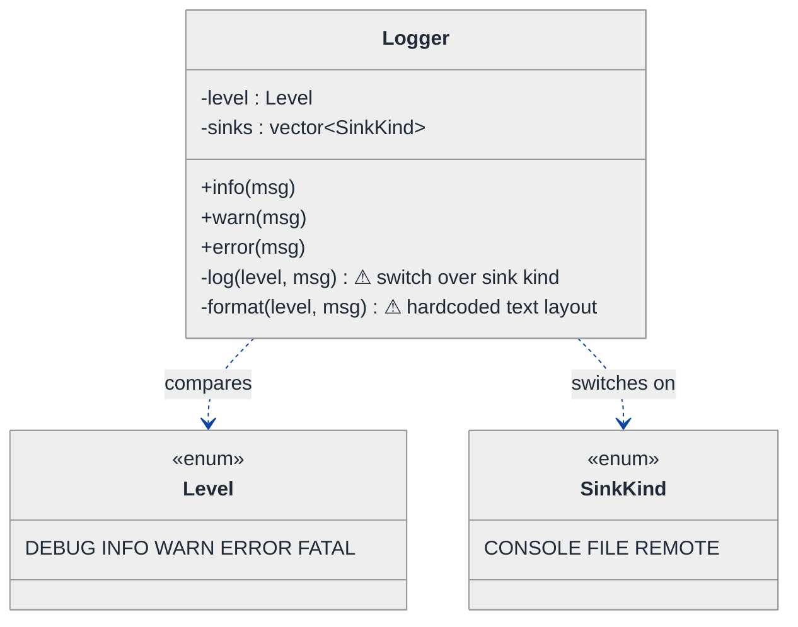
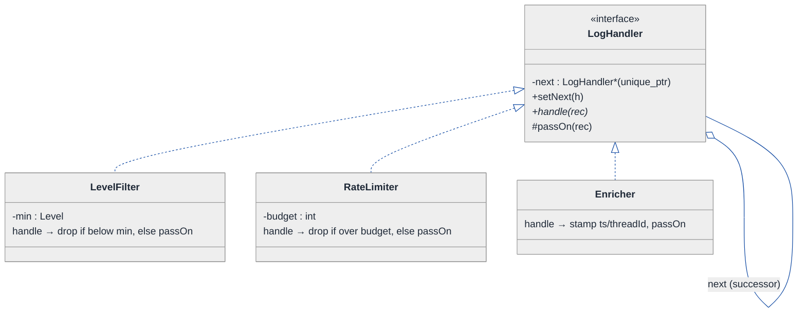
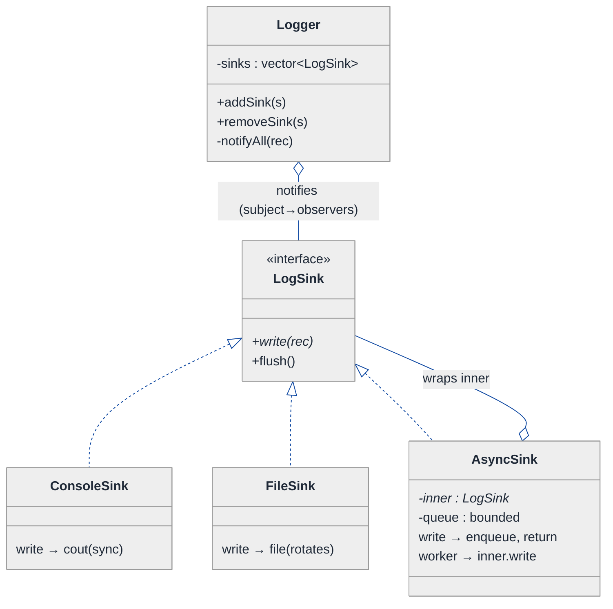
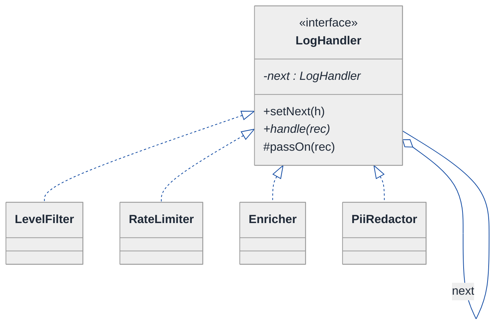
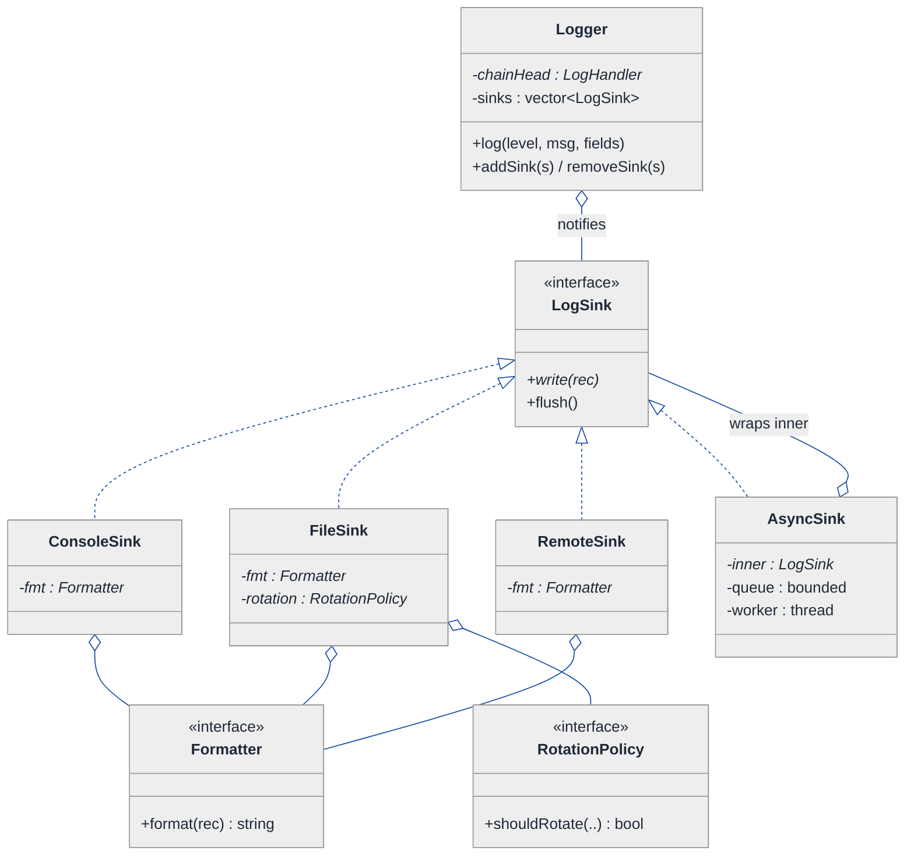
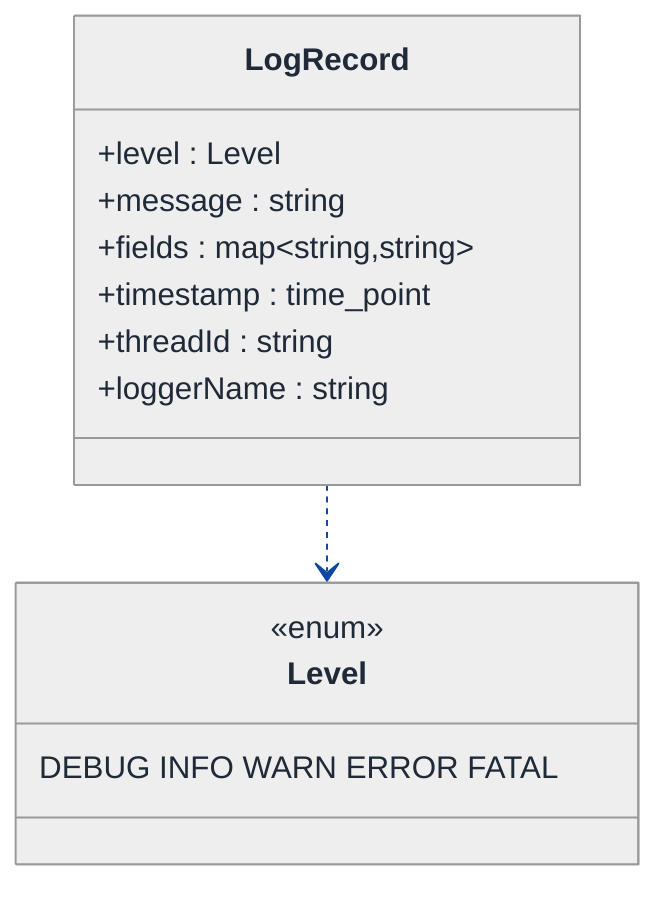
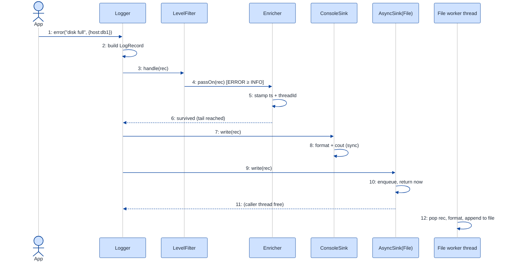

# Logging Framework — LLD Walkthrough

> **Difficulty:** Medium · **Time:** ~30 min · **Pattern focus:** Chain of Responsibility (level filtering / handler pipeline) + Observer (fan-out to sinks, async writes)
>
> **Problem source(s):** bucket `Chain_of_Responsibility`, GID **C1**. See parent manifest [`./EXTRACTED_QUESTIONS.md`](./EXTRACTED_QUESTIONS.md).
>
> **Diagrams:** inline mermaid (renders natively in GitHub / VS Code). No external sources.

---

## How to use this file

Paced for a candidate who has built a logger by hand (the 4 a.m. `printf`) but never had to make one *extensible*. Reading time: ~30 minutes if you sketch each iteration. **The lesson: a logging framework is two pipelines wearing a trench coat — a FILTER pipeline (does this message survive?) and a FAN-OUT pipeline (who gets to write it?). Don't model either with `if/else` over an enum. Derive Chain of Responsibility for the first and Observer for the second by watching a naive enum-switch logger break under four product asks.**

**Map of this file (15 sections):**

1. Problem statement + clarifying questions
2. Plain-English restatement
3. Why this matters
4. Mental model
5. Try it yourself first
6. Entity & verb extraction
7. **Iteration 1: the naive design** — one `Logger` class, a switch, a `for` loop
8. **Where the naive design hurts** — four future requirements, one painful diff each
9. **Pivot 1: Chain of Responsibility** for level filtering + per-stage handling
10. **Pivot 2: Observer** for sink fan-out + async writes
11. **Pivot 3: remaining variability** — formatting (Strategy), sink construction (Factory), rotation (State-ish)
12. Final class diagram (three sub-views)
13. Skeleton code (C++17)
14. Key flow — sequence diagram
15. Extensibility re-check + anti-patterns + how to think aloud + self-check

---

## 1. Problem statement + clarifying questions

**Prompt (typical phrasing):** "Design a logging framework supporting multiple log levels (DEBUG, INFO, WARN, ERROR, FATAL), multiple output sinks (console, file, remote), structured logging, log rotation, and async writes."

**Clarifying questions to ask BEFORE drawing anything:**

1. **Level semantics — threshold or exact match?** Is a sink configured with `WARN` supposed to accept WARN *and above* (ERROR, FATAL), or only WARN? (Almost always "and above" — that decision shapes the whole filter.)
2. **Per-sink levels or one global level?** Can the console show DEBUG while the file only keeps WARN+? (Yes, in any real framework — so the threshold can't be a single global field.)
3. **Structured logging shape?** Are we logging free-text strings, or key/value records (`user_id=42 latency_ms=88`) that a sink may render as JSON vs. plaintext? (This separates the *record* from its *rendering*.)
4. **Async — drop or block when the queue is full?** Under back-pressure, do we drop messages (lossy, never blocks the app) or block the caller (lossless, can stall a request thread)? What queue bound?
5. **Rotation trigger?** Size-based (roll at 100 MB), time-based (roll at midnight), or both? Does rotation rename + reopen, or hand off to a background compressor?
6. **Ordering guarantee across sinks?** If a message goes to console + file + remote, must they observe the same order? (Per-sink order yes; cross-sink global order usually no.)
7. **Thread-safety contract?** Many threads call `log()` concurrently — is that the framework's problem or the caller's? (The framework's — that is half the reason async exists.)

**Assumptions if the interviewer dodges:** threshold semantics ("WARN and above"), per-sink levels, structured records that sinks format, async with a *bounded* queue that **drops** with a dropped-count counter (favor app latency over completeness), size-based rotation on the file sink, per-sink ordering only, framework owns thread-safety.

---

## 2. Plain-English restatement

We're building the thing every service imports on line one: `log.info("started")`. A caller hands us a level + a message (+ maybe some key/value fields). The framework must decide whether the message is important enough to bother with, enrich it (timestamp, thread id, logger name), render it into text or JSON, and deliver it to one or more destinations — a terminal, a rolling file, a remote collector — **without making the calling thread wait on disk or network I/O**. New levels, new sinks, new formats, and new filtering rules must each drop in **without editing the core `log()` path**.

---

## 3. Why this matters

This is the canonical interview probe for *two* behavioral patterns at once, and most candidates conflate them. Filtering ("should this message proceed, and which stage handles it?") is a **Chain of Responsibility** problem; delivery ("ship one accepted message to N independent destinations") is an **Observer** problem. Reaching for an enum `switch` and a `for` loop works for a toy but collapses the moment levels, sinks, and formats start varying independently — which they always do. Getting this right shows you can spot *two* axes of variation in one prompt and pick a *different* pattern for each instead of forcing everything through inheritance.

---

## 4. Mental model

A logging framework is a **conveyor belt with a quality-control gate, then a sorting depot**.

```
Real-world sketch (NOT a UML diagram yet):

   log.error("disk full", {host:"db1"})
            │
            ▼
   ┌──────────────────────────────┐   the GATE (Chain of Responsibility):
   │  [Level≥INFO?]→[RateLimit?]   │   each station either drops the parcel,
   │   →[Enrich ts/tid]→ pass on   │   stamps it, or waves it through
   └───────────────┬──────────────┘
                   ▼  (one accepted record)
   ┌──────────────────────────────┐   the DEPOT (Observer fan-out):
   │   Subject notifies all sinks  │
   │    ├─► Console  (sync)        │   each sink is an independent
   │    ├─► File     (async+roll)  │   subscriber; it formats + writes
   │    └─► Remote   (async+batch) │   on its own terms
   └──────────────────────────────┘
```

The KEY insight: **the gate is a linear pipeline where each stage may halt or transform the item (Chain of Responsibility); the depot is a one-to-many broadcast where each subscriber acts independently (Observer).** Two different shapes — never collapse them into one `for` loop.

---

## 5. Try it yourself first

> **Predict before reading on:**
>
> 1. List 5 nouns you'd promote to a class. Which 2 nouns stay as plain fields?
> 2. **If the console should print DEBUG+ but the file should keep only WARN+, what breaks about storing a single `currentLevel` enum on the logger?**
> 3. Where does the "don't block the calling thread on disk I/O" requirement force a *new object* into your design — and what does that object own?

---

## 6. Entity & verb extraction

> **Mini-refresher: noun → class, but not every noun.**
>
> Promote a noun to a class only when it has BEHAVIOR and STATE that belong together. "Level" is just a rank — it stays an `enum class`. "Sink" has behavior (write) plus state (file handle, buffer) — it becomes a class hierarchy.

**Nouns from the prompt:**

| Noun | Decision | Why |
|---|---|---|
| Logger | Class (front door) | Caller-facing API: `info()`, `error()`; orchestrates the gate + depot |
| Log level | `enum class Level` (ordered) | A rank, not an object. DEBUG < INFO < WARN < ERROR < FATAL |
| Log record | Class (struct-ish) | Carries level + message + fields + timestamp + thread id |
| Sink | Class (abstract) + concrete (Console/File/Remote) | Has write behavior + owned resources |
| Handler / filter stage | Class (abstract) + concretes | Each gate station; the Chain links them |
| Formatter | Class (abstract) + concretes (Text/JSON) | Renders a record to a string; varies per sink |
| Async queue / worker | Class | Owns the background thread + bounded buffer |
| Timestamp / thread id | Fields on LogRecord | No behavior of their own |
| File path / rotation size | Fields/config on FileSink | Not classes |

**Verbs (and the class they live on — naive answer; we'll re-examine):**

| Verb | Owner class (naive) |
|---|---|
| info() / warn() / error() | Logger |
| shouldLog(level) | Logger |
| format(record) | Logger (naively) |
| write(text) | Sink |
| rotate() | FileSink |
| enqueue(record) / drain() | AsyncQueue |

**No design patterns yet.** Pure nouns + verbs.

---

## 7. <a id="iter-1"></a>Iteration 1: the naive design

The simplest thing that could possibly work: one `Logger` with a global level, a hardcoded format, and a `for` loop over a vector of sinks selected by a `switch`.



**Reader's tour (top to bottom; ~45 seconds).**

1. **`Logger` is the whole system.** It holds two fields — a single `level` threshold and a `vector<SinkKind>` listing which destinations are on. Every decision lives inside its private `log()`.
2. **`Level` is an ordered enum.** DEBUG=0 … FATAL=4. The threshold check is a single integer comparison, `level >= this->level`. That part is actually fine and will survive.
3. **The two ⚠ markers are the trouble zone.** `format()` bakes one text layout for everyone. `log()` carries a `switch` over `SinkKind`: write to `std::cout`, or `ofstream`, or an HTTP client, inline. Both are future-pain entry points.
4. **No `Sink` class, no `Handler`, no `Formatter`, no async.** The naive design doesn't even *acknowledge* that sinks, formats, and filters are independent axes — it hardcodes one answer for each in `Logger`.

Skeleton code for the naive design (C++17):

```cpp
#include <chrono>
#include <fstream>
#include <iostream>
#include <string>
#include <vector>

enum class Level    { DEBUG, INFO, WARN, ERROR, FATAL };
enum class SinkKind { CONSOLE, FILE, REMOTE };

class Logger {
public:
    Logger(Level threshold, std::vector<SinkKind> sinks, std::string path)
        : level_(threshold), sinks_(std::move(sinks)), file_(path, std::ios::app) {}

    void info (const std::string& m) { log(Level::INFO,  m); }
    void warn (const std::string& m) { log(Level::WARN,  m); }
    void error(const std::string& m) { log(Level::ERROR, m); }

private:
    std::string format(Level lvl, const std::string& msg) {           // ⚠ one layout for all
        auto now = std::chrono::system_clock::now().time_since_epoch().count();
        return std::to_string(now) + " [" + std::to_string((int)lvl) + "] " + msg;
    }

    void log(Level lvl, const std::string& msg) {
        if (lvl < level_) return;                                     // global threshold — OK
        std::string line = format(lvl, msg);
        for (auto kind : sinks_) {
            switch (kind) {                                           // ⚠ tag-driven dispatch
                case SinkKind::CONSOLE: std::cout << line << '\n';        break;
                case SinkKind::FILE:    file_ << line << '\n';            break;
                case SinkKind::REMOTE:  /* synchronous HTTP POST here */  break;  // ⚠ blocks caller
            }
        }
    }

    Level                 level_;
    std::vector<SinkKind> sinks_;
    std::ofstream         file_;
};
```

**This works.** It has zero design patterns. We can log to console + file at a threshold. So what's wrong with it?

---

## 8. <a id="naive-pain"></a>Where the naive design hurts

The interviewer slides four product asks across the desk: "These ship next quarter. Walk me through what changes."

### Change A: "Console shows DEBUG+, but the file keeps only WARN+"

In the naive design:
- There is ONE `level_` field. A single global threshold can't express *per-sink* thresholds.
- You'd bolt a parallel `vector<Level>` aligned by index to `sinks_`, then thread that into the `switch`. The `log()` loop now reads two vectors in lockstep.
- **Touches the field set, the constructor, AND the `switch`.** And it still can't express "this sink wants WARN+ *and* only from logger `db.*`".

### Change B: "Add a rate-limiter — at most 100 ERROR logs/sec, drop the rest"

In the naive design:
- This filtering lives *before* fan-out and applies to all sinks. There's nowhere to put it except more code inside `log()`.
- `log()` grows a token-bucket check, a timestamp window, a dropped counter. The method is now part filter, part dispatcher.
- **Next cross-cutting filter (dedup, sampling, redaction of PII) → more lines in the same `log()`.** The gate logic and the delivery logic are tangled in one function.

### Change C: "Add a remote sink that batches + retries, and don't block the request thread on it"

In the naive design:
- The `REMOTE` case does a synchronous HTTP POST inside `log()`. Every `error()` call now pays network latency on the caller's thread. A slow collector stalls request handling.
- Making it async means spawning a thread + a queue — but there's no `Sink` object to *own* that thread. The async machinery has nowhere to live except as more fields on `Logger`, shared awkwardly across sink kinds.
- **Touches `log()`, adds threading state to `Logger`, and there's still no clean per-sink lifecycle (open/flush/close).**

### Change D: "The remote collector wants JSON; the console wants colored text"

In the naive design:
- `format()` returns one string for everyone. Now the format must vary *per sink*.
- You'd add a `SinkKind`→format `switch` inside `format()`, or duplicate `format()` per kind. Either way the layout logic and the level/dispatch logic fuse together.
- **Touches `format()` and couples it to `SinkKind`.** Adding a new sink now means editing formatting too.

### The pattern of pain

| Change | What it touches in the naive design | Smell |
|---|---|---|
| A. Per-sink levels | `level_` field + ctor + `switch` | "One global threshold can't model per-destination filtering." |
| B. Rate-limit / redact | `log()` body grows | "Cross-cutting filters pile up in one function; no stage boundary." |
| C. Async remote | `log()` + threading fields on Logger | "No object owns a sink's I/O thread + lifecycle; delivery blocks the caller." |
| D. Per-sink format | `format()` + couples to `SinkKind` | "One layout for all; rendering can't vary independently of dispatch." |

**Two axes of pain dominate.** (1) **Filtering** — a *sequence* of stages, each of which may drop, transform, or pass the message along (A, B). (2) **Delivery** — *one* accepted message broadcast to *many* independent destinations, each with its own format + lifecycle + threading (C, D).

> **Pivot question:** "What pattern models 'a linear sequence of stages where each one may handle, transform, or forward a request'? And what pattern models 'one event broadcast to many independent subscribers'?"
>
> The answers are **Chain of Responsibility** and **Observer**. We introduce them one at a time, starting with the most foundational: the filter gate.

---

## 9. <a id="pivot-1"></a>Pivot 1: Chain of Responsibility for the filter gate

> **Mini-refresher: Chain of Responsibility.**
>
> A request travels down a linked list of handlers. Each handler decides: HANDLE it (and maybe stop), TRANSFORM it and pass on, or PASS unchanged to `next_`. The sender doesn't know which handler (if any) deals with the request — it just hands it to the head of the chain. Add/remove/reorder behavior = relink the chain, no edits to existing handlers.
>
> Quick example: middleware in a web server — `Auth → RateLimit → Logging → Router`. Auth can short-circuit a 401; if it passes, it calls `next_->handle(req)`.

**Why Chain of Responsibility fits the gate.** Changes A and B are both "a stage that inspects a record and decides whether/how it continues." Level-threshold, rate-limit, PII-redaction, sampling, enrichment — each is an independent stage, the order matters (redact before you ship), and any stage can short-circuit (drop). That is *exactly* a chain: each `LogHandler` either drops the record, mutates it, or forwards to `next_`.

**The refactor (just the filter slice):**

```cpp
class LogRecord;  // forward — defined in §13

class LogHandler {
public:
    virtual ~LogHandler() = default;
    void setNext(std::unique_ptr<LogHandler> next) { next_ = std::move(next); }

    // Walk the chain. A handler that wants to DROP simply does not call passOn().
    virtual void handle(LogRecord& rec) = 0;

protected:
    void passOn(LogRecord& rec) { if (next_) next_->handle(rec); }   // forward to successor

private:
    std::unique_ptr<LogHandler> next_;   // owns the rest of the chain
};

// Stage 1: threshold filter — drop anything below the configured level.
class LevelFilter : public LogHandler {
public:
    explicit LevelFilter(Level min) : min_(min) {}
    void handle(LogRecord& rec) override {
        if (rec.level < min_) return;     // DROP: do not call passOn → chain stops
        passOn(rec);                      // survives → next stage
    }
private:
    Level min_;
};

// Stage 2: rate-limiter — token bucket; drop ERRORs beyond the budget.
class RateLimiter : public LogHandler {
public:
    explicit RateLimiter(int perSec) : budget_(perSec) {}
    void handle(LogRecord& rec) override {
        if (!allow()) return;             // DROP silently (could bump a dropped counter)
        passOn(rec);
    }
private:
    bool allow();                         // token-bucket math elided
    int  budget_;
};

// Stage 3: enricher — TRANSFORM, never drop.
class Enricher : public LogHandler {
public:
    void handle(LogRecord& rec) override {
        rec.threadId  = currentThreadId();    // mutate in place
        rec.timestamp = std::chrono::system_clock::now();
        passOn(rec);                          // always forwards
    }
};
// other handlers (Sampler, PiiRedactor) elided — same shape
```

**What changed — visualized.** Just the gate slice:



**Tour of the after-state.**

1. **`LogHandler` is the interface** — one pure-virtual `handle(rec)` plus a `next_` successor it owns via `unique_ptr`. The self-aggregation arrow (`o-- next`) is the spine of the pattern: a handler holds the *rest of the chain*.
2. **Each concrete handler does exactly one thing.** `LevelFilter` drops below-threshold. `RateLimiter` drops over-budget. `Enricher` mutates and always forwards. A handler DROPS simply by *not* calling `passOn()` — there is no `return false` protocol to remember.
3. **Order is data, not code.** The chain `LevelFilter → RateLimiter → Enricher` is built by linking; swap the order or insert a `PiiRedactor` by relinking. No existing handler changes.
4. **`Logger` shrinks.** Its `log()` no longer contains filter logic — it builds a `LogRecord` and hands it to `chainHead_->handle(rec)`. The tangled gate code from §8 (changes A + B) is gone.

**Changes A and B now land cleanly.** Per-sink levels? A `LevelFilter` *per sink* (we'll see in §10 that each sink can own its own tail-filter). Rate-limit / redact / sample? Each is one new `LogHandler` spliced into the chain. Open/closed.

**Pattern-discrimination cheatsheet — Chain of Responsibility vs Pipeline (Pipes & Filters) vs Decorator.**
- *Chain of Responsibility:* a request walks handlers; **any handler may STOP the walk** (drop/short-circuit). The sender doesn't know who handles it.
- *Pipeline:* every stage transforms and **always** forwards; no short-circuit. (A chain whose handlers never drop *is* a pipeline.)
- *Decorator:* wraps an object to ADD behavior around the SAME interface call (`base_->op()` ± extras), returning a value up the stack — not a forward-down-a-chain.
- *Rule of thumb:* if a stage can say "I'm dropping this, stop" → Chain of Responsibility. If every stage must run → Pipeline. If you're augmenting one call's result → Decorator.

We chose Chain of Responsibility because the gate's defining behavior is **short-circuit**: `LevelFilter` and `RateLimiter` exist precisely to *stop* messages, which a pure pipeline can't express.

---

## 10. <a id="pivot-2"></a>Pivot 2: Observer for sink fan-out + async writes

A record that survives the chain must reach console + file + remote — destinations that are independent, vary in count, and (change C) must not block the caller. The chain is the wrong shape here: fan-out isn't a linear "drop or forward," it's a **broadcast** where every subscriber runs.

> **Mini-refresher: Observer pattern.**
>
> A **Subject** keeps a list of **Observers** and, on an event, notifies each one. Observers subscribe/unsubscribe at runtime; they don't know about each other; the subject doesn't know what they do with the event. One-to-many broadcast with loose coupling.
>
> Quick example: a spreadsheet cell (subject) notifies a chart, a sum formula, and a CSV exporter (observers) when its value changes. Add a fourth observer without touching the cell.

**Why Observer fits delivery.** "One accepted record → N sinks, each acting independently" is the textbook one-to-many. Sinks subscribe to the `Logger` (the subject). Adding a sink = `addSink()`; removing one = `removeSink()`. No `switch`, no edits to delivery code. **The "don't block the caller" requirement (change C) is solved *inside* a sink**, not in the subject: an async sink's `write()` just enqueues onto its own bounded queue and returns; a background worker thread drains the queue and does the real I/O.

**The refactor (the sink/observer slice):**

```cpp
class LogRecord;  // forward

// Observer
class LogSink {
public:
    virtual ~LogSink() = default;
    virtual void write(const LogRecord& rec) = 0;   // called by the subject
    virtual void flush() {}
};

// A concrete SYNC observer.
class ConsoleSink : public LogSink {
public:
    explicit ConsoleSink(std::unique_ptr<Formatter> fmt) : fmt_(std::move(fmt)) {}
    void write(const LogRecord& rec) override {
        std::cout << fmt_->format(rec) << '\n';      // formatting is a Strategy (Pivot 3)
    }
private:
    std::unique_ptr<Formatter> fmt_;
};

// An ASYNC observer: write() returns immediately; a worker thread does the I/O.
// This is the heart of change C — async lives INSIDE a sink, not in the subject.
class AsyncSink : public LogSink {
public:
    explicit AsyncSink(std::unique_ptr<LogSink> inner, size_t cap)
        : inner_(std::move(inner)), cap_(cap),
          worker_([this]{ drainLoop(); }) {}
    ~AsyncSink() override { stop_ = true; cv_.notify_all(); worker_.join(); }

    void write(const LogRecord& rec) override {       // called on the CALLER's thread
        std::lock_guard<std::mutex> lk(m_);
        if (queue_.size() >= cap_) { ++dropped_; return; }   // bounded → DROP under back-pressure
        queue_.push(rec);
        cv_.notify_one();                             // never blocks on I/O
    }
private:
    void drainLoop();                                 // pops + inner_->write() on worker thread; elided
    std::unique_ptr<LogSink> inner_;                  // decorates a real sink (File/Remote)
    size_t cap_; std::atomic<long> dropped_{0}; std::atomic<bool> stop_{false};
    std::queue<LogRecord> queue_; std::mutex m_; std::condition_variable cv_;
    std::thread worker_;
};

// Subject
class Logger {
public:
    void addSink(std::shared_ptr<LogSink> s) { sinks_.push_back(std::move(s)); }
    void removeSink(const std::shared_ptr<LogSink>& s);   // elided
private:
    void notifyAll(const LogRecord& rec) {            // fan-out
        for (auto& s : sinks_) s->write(rec);         // each sink decides sync vs async
    }
    std::vector<std::shared_ptr<LogSink>> sinks_;     // the observer list
};
```

**What changed — visualized.** The fan-out slice:



**Tour of the after-state.**

1. **`Logger` is the Subject.** It holds a `vector<LogSink>` and a `notifyAll(rec)` that loops calling `write()` on each. That's the entire fan-out — no `switch`, no `SinkKind` enum.
2. **`LogSink` is the Observer interface** — one `write(rec)`. Console/File/Remote are subscribers; the subject is blind to what each does.
3. **`AsyncSink` is the clever bit** — it's *also* a `LogSink`, so it slots into the observer list, but it **wraps an inner sink** (decorator-flavored). Its `write()` enqueues and returns immediately on the caller's thread; a worker drains the queue and calls `inner_->write()`. Wrap *any* sink — `AsyncSink(FileSink)`, `AsyncSink(RemoteSink)` — to make it non-blocking. Change C solved without the subject knowing.
4. **Back-pressure policy is explicit and local.** Bounded queue + drop-with-counter lives in `AsyncSink`. Want block-instead-of-drop? It's a one-class change there; the subject and other sinks don't care.

**Changes C and D now land cleanly.** Async remote = `AsyncSink(RemoteSink)`. Per-sink format = each sink holds its own `Formatter` (Pivot 3). Adding a sink is `addSink()`.

**Pattern-discrimination cheatsheet — Observer vs Chain of Responsibility vs Mediator.**
- *Observer:* one event → **ALL** subscribers run, independently, order-insensitive (broadcast).
- *Chain of Responsibility:* one request → **AT MOST a few** handlers run; any can stop the walk (filter).
- *Mediator:* many-to-many coordination routed through a central hub; the hub knows the participants and their interactions.
- *Rule of thumb:* "everyone gets a copy" → Observer. "drop or forward down a line" → Chain. "objects need to talk to each other and you want to decouple the wiring" → Mediator.

We use Chain for the *gate* (short-circuit filtering) and Observer for the *depot* (broadcast delivery). **Same record, two patterns, because the two stages have opposite shapes.**

---

## 11. <a id="pivot-3"></a>Pivot 3: the remaining variability axes

Changes A–D are solved. Three smaller axes remain — each a quick application of a pattern we (or the reader) already know.

| Axis | Pattern | One sentence why |
|---|---|---|
| Rendering a record to text/JSON (structured logging) | **Strategy** | Each sink picks a `Formatter`; algorithm swapped by the caller/config |
| Building sinks from a config file | **Factory** | Hide `new ConsoleSink` / `new AsyncSink(FileSink)` behind a `kind → object` map |
| File rotation (size/time triggers) | **State-ish / Strategy** | Rotation policy varies; the FileSink delegates "should I roll now?" |

```cpp
// --- Strategy: structured logging is just "which Formatter does the sink hold" ---
class Formatter {
public:
    virtual ~Formatter() = default;
    virtual std::string format(const LogRecord& rec) const = 0;
};
class TextFormatter : public Formatter {
    std::string format(const LogRecord& rec) const override; // "ts [LEVEL] msg k=v ..." ; elided
};
class JsonFormatter : public Formatter {                      // structured output for the collector
    std::string format(const LogRecord& rec) const override;  // {"ts":..,"level":..,"fields":{..}} ; elided
};

// --- Strategy: rotation policy the FileSink delegates to ---
class RotationPolicy {
public:
    virtual ~RotationPolicy() = default;
    virtual bool shouldRotate(size_t bytesWritten, std::chrono::system_clock::time_point opened) const = 0;
};
class SizeRotation : public RotationPolicy { /* bytesWritten >= maxBytes_ */ };
class DailyRotation : public RotationPolicy { /* opened crossed midnight */ };

// --- Factory: turn config rows into wired sinks ---
class SinkFactory {
public:
    static std::shared_ptr<LogSink> create(const SinkConfig& cfg);  // "remote" → AsyncSink(RemoteSink(JsonFormatter))
};
```

> **Mini-refresher: Strategy vs the Chain we already built.**
>
> *Strategy* swaps ONE algorithm behind an interface, chosen by the caller (`sink.setFormatter(json)`). *Chain of Responsibility* links MANY handlers, each free to drop/forward. A `Formatter` is a single pluggable algorithm → Strategy. The filter gate is a sequence with short-circuit → Chain. Don't model the formatter as a one-link chain — there's nothing to forward.

> **Mini-refresher: Factory pattern.**
>
> A factory encapsulates object *construction* so callers say "give me a sink for this config" instead of `new`-ing concrete types. The benefit here: the `kind → class` mapping lives in ONE place; adding a sink type registers it once instead of editing every call site. Pairs naturally with reading sinks from YAML/JSON config.

**The lesson.** Once the two heavyweight patterns (Chain for filtering, Observer for delivery) are in place, the residual variability is small Strategy/Factory plug-ins. **Spotting the two big axes first makes everything after cheap.**

---

## 12. <a id="fig-class-diagram"></a>Final class diagram

One mega-diagram would be a wall of boxes. Three focused sub-views; the structural insight at the end ties them together.

### 12.1 The filter gate — Chain of Responsibility



**Tour of 12.1.** One interface, a family of handlers, and the self-referential `next` aggregation that *is* the chain. A record enters at the head; each station drops (no `passOn`) or forwards. Adding a filter = one new `LogHandler` linked into the chain — nothing existing changes.

### 12.2 The delivery depot — Observer + sink internals



**Tour of 12.2.**

1. **`Logger` holds BOTH ends** — the `chainHead` (gate) and the `sinks` vector (depot). Its `log()` runs the record through the chain, and if it survives, `notifyAll()` broadcasts to sinks.
2. **The observer list is `LogSink`** with four implementations. `AsyncSink` wraps any inner sink to make it non-blocking — note the `o-- inner` self-into-interface arrow.
3. **Each writing sink aggregates a `Formatter` (Strategy)** so structured logging varies per destination — JSON to remote, colored text to console.
4. **`FileSink` additionally aggregates a `RotationPolicy`** — size or time triggers, swappable without touching write logic.

### 12.3 The data object — LogRecord (what flows through both pipelines)



**Tour of 12.3.** `LogRecord` is the single value object that travels the whole journey: handlers mutate it (the `Enricher` stamps `timestamp`/`threadId`), formatters read it (`fields` is the structured-logging payload). Keeping the record separate from its *rendering* is what lets JSON and text formatters coexist — the same record, two outputs.

### Structural insight (ties 12.1 + 12.2 + 12.3 together)

| Concern | Pattern used | Why |
|---|---|---|
| **Filter gate** (level, rate-limit, redact, enrich) | Chain of Responsibility | Linear stages, each may DROP or transform — short-circuit is the defining trait |
| **Delivery depot** (console/file/remote fan-out) | Observer | One accepted record broadcast to N independent subscribers |
| **Non-blocking I/O** | Decorator-flavored `AsyncSink` over a sink | Async is a *property of a sink*, not of the subject; wrap to opt in |
| **Rendering** (text/JSON, structured) | Strategy (`Formatter`) | Each sink picks its own algorithm; record stays format-agnostic |
| **Rotation** (size/time) | Strategy (`RotationPolicy`) | FileSink delegates "roll now?" to a swappable policy |
| **Construction from config** | Factory (`SinkFactory`) | `kind → wired object` mapping lives in one place |

The big lesson: **two stages with opposite shapes get two different patterns.** Filtering is "drop or forward down a line" → Chain. Delivery is "everyone gets a copy" → Observer. Everything else is small, swappable Strategy/Factory plug-ins hanging off the sinks.

---

## 13. Skeleton code (C++17)

> Show the SHAPES, not the full impl. `// elided` for the rest.

```cpp
#include <atomic>
#include <chrono>
#include <condition_variable>
#include <map>
#include <memory>
#include <mutex>
#include <queue>
#include <string>
#include <thread>
#include <vector>

// ── Level + the value object that flows through both pipelines ──────────
enum class Level { DEBUG, INFO, WARN, ERROR, FATAL };

struct LogRecord {
    Level                                          level;
    std::string                                    message;
    std::map<std::string, std::string>             fields;       // structured logging
    std::chrono::system_clock::time_point          timestamp{};  // set by Enricher
    std::string                                    threadId;     // set by Enricher
    std::string                                    loggerName;
};

// ── Strategy: rendering ─────────────────────────────────────────────────
class Formatter {
public:
    virtual ~Formatter() = default;
    virtual std::string format(const LogRecord& rec) const = 0;
};
class TextFormatter : public Formatter {
public:
    std::string format(const LogRecord& rec) const override;     // "ts [LEVEL] name: msg k=v" ; elided
};
class JsonFormatter : public Formatter { /* {"ts":..,"level":..,"fields":{..}} ; elided */ };

// ── Chain of Responsibility: the filter gate ───────────────────────────
class LogHandler {
public:
    virtual ~LogHandler() = default;
    void setNext(std::unique_ptr<LogHandler> n) { next_ = std::move(n); }
    virtual void handle(LogRecord& rec) = 0;
protected:
    void passOn(LogRecord& rec) { if (next_) next_->handle(rec); }
private:
    std::unique_ptr<LogHandler> next_;
};

class LevelFilter : public LogHandler {
public:
    explicit LevelFilter(Level min) : min_(min) {}
    void handle(LogRecord& rec) override {
        if (rec.level < min_) return;        // DROP — chain stops here
        passOn(rec);
    }
private:
    Level min_;
};

class Enricher : public LogHandler {
public:
    void handle(LogRecord& rec) override {
        rec.timestamp = std::chrono::system_clock::now();
        rec.threadId  = currentThreadId();   // elided helper
        passOn(rec);                          // always forwards (transform-only)
    }
};
// RateLimiter, Sampler, PiiRedactor — same shape, elided

// ── Observer: the delivery depot ────────────────────────────────────────
class LogSink {                               // Observer interface
public:
    virtual ~LogSink() = default;
    virtual void write(const LogRecord& rec) = 0;
    virtual void flush() {}
};

class ConsoleSink : public LogSink {
public:
    explicit ConsoleSink(std::unique_ptr<Formatter> f) : fmt_(std::move(f)) {}
    void write(const LogRecord& rec) override; // std::cout << fmt_->format(rec) ; elided
private:
    std::unique_ptr<Formatter> fmt_;
};

class FileSink : public LogSink {             // owns rotation (Strategy)
public:
    FileSink(std::string path, std::unique_ptr<Formatter> f,
             std::unique_ptr<RotationPolicy> rot);
    void write(const LogRecord& rec) override; // format → maybe rotate → append ; elided
    void flush() override;
private:
    // file handle, bytesWritten_, fmt_, rotation_ ; elided
};

class RemoteSink : public LogSink { /* batches; POSTs to collector ; elided */ };

// AsyncSink — decorator that makes ANY inner sink non-blocking (change C).
class AsyncSink : public LogSink {
public:
    AsyncSink(std::unique_ptr<LogSink> inner, size_t cap)
        : inner_(std::move(inner)), cap_(cap), worker_([this]{ drainLoop(); }) {}
    ~AsyncSink() override { stop_ = true; cv_.notify_all(); worker_.join(); }

    void write(const LogRecord& rec) override {        // runs on the CALLER's thread
        std::unique_lock<std::mutex> lk(m_);
        if (q_.size() >= cap_) { ++dropped_; return; }  // bounded → drop under back-pressure
        q_.push(rec);
        lk.unlock();
        cv_.notify_one();                                // returns without doing I/O
    }
    void flush() override { /* wait for q_ to drain ; elided */ }
private:
    void drainLoop() {                                   // runs on the worker thread
        while (true) {
            std::unique_lock<std::mutex> lk(m_);
            cv_.wait(lk, [this]{ return !q_.empty() || stop_; });
            if (stop_ && q_.empty()) return;
            LogRecord rec = std::move(q_.front()); q_.pop();
            lk.unlock();
            inner_->write(rec);                          // real I/O happens here, off the hot path
        }
    }
    std::unique_ptr<LogSink> inner_;
    size_t                   cap_;
    std::queue<LogRecord>    q_;
    std::mutex               m_;
    std::condition_variable  cv_;
    std::atomic<long>        dropped_{0};
    std::atomic<bool>        stop_{false};
    std::thread              worker_;            // declared LAST so members above are ready
};

// ── Subject + front door ────────────────────────────────────────────────
class Logger {
public:
    Logger(std::string name, std::unique_ptr<LogHandler> chainHead)
        : name_(std::move(name)), chainHead_(std::move(chainHead)) {}

    void addSink(std::shared_ptr<LogSink> s) { sinks_.push_back(std::move(s)); }
    void removeSink(const std::shared_ptr<LogSink>& s);   // elided

    void info (const std::string& m, std::map<std::string,std::string> f = {}) { log(Level::INFO,  m, std::move(f)); }
    void error(const std::string& m, std::map<std::string,std::string> f = {}) { log(Level::ERROR, m, std::move(f)); }
    // debug/warn/fatal — same shape, elided

private:
    void log(Level lvl, const std::string& msg, std::map<std::string,std::string> fields) {
        LogRecord rec{ lvl, msg, std::move(fields), {}, {}, name_ };
        bool survived = true;
        // The chain may DROP rec by not forwarding. We detect survival via a tail handler
        // that flips a flag (or: have the chain return a bool). Simplified here:
        runChain(rec, survived);
        if (survived) notifyAll(rec);          // Observer fan-out only if it passed the gate
    }
    void runChain(LogRecord& rec, bool& survived);   // walks chainHead_ ; elided
    void notifyAll(const LogRecord& rec) {
        for (auto& s : sinks_) s->write(rec);  // each sink: sync or async, its choice
    }

    std::string                            name_;
    std::unique_ptr<LogHandler>            chainHead_;   // owns the chain
    std::vector<std::shared_ptr<LogSink>>  sinks_;       // the observer list
};

// ── Factory: build wired sinks from config ──────────────────────────────
class SinkFactory {
public:
    static std::shared_ptr<LogSink> create(const SinkConfig& cfg); // "remote" → AsyncSink(RemoteSink(Json)) ; elided
};
```

---

## 14. <a id="fig-sequence"></a>Key flow — sequence diagram

One `log.error(...)` call, end to end: through the gate, then the fan-out.



**Tour of the flow. Read slowly — this is where both patterns cooperate.**

1. **App calls `error()` with a message + structured fields.** The caller never names a sink or a level threshold.
2. **Logger builds one `LogRecord`** — the value object that will travel everything.
3. **Logger hands the record to the chain head** (`LevelFilter`). This is the Chain of Responsibility entry. **Pattern #1 in play.**
4. **`LevelFilter` sees ERROR ≥ INFO and forwards** via `passOn`. Had this been a DEBUG record below threshold, the walk would STOP here — no sink ever sees it, no `if` ladder in `Logger`.
5–6. **`Enricher` mutates the record** (timestamp, thread id) and forwards; reaching the tail means the record SURVIVED the gate.
7–8. **Logger broadcasts to sinks** (`notifyAll`). `ConsoleSink` formats synchronously and writes to stdout. **Pattern #2 (Observer) in play.**
9–11. **`AsyncSink` is also notified — but it just enqueues and returns.** The caller's thread is free *immediately*; it never touches disk. This is change C's whole payoff, and it happens *inside the sink*, invisible to the subject.
12. **Later, on a different thread,** the file worker pops the record, formats it, checks rotation, and appends. **Per-sink ordering is preserved; cross-sink global order is not guaranteed — exactly the contract we set in §1.**

### What's NOT shown — and why it matters

You don't see `if (level >= threshold)` or `switch (sinkKind)` anywhere. The threshold decision is a *handler that drops by not forwarding*; the sink selection is *iteration over subscribers*. **The class structure IS the control flow** — no scattered conditionals, which is precisely what the naive `log()` was drowning in.

---

## 15. Extensibility re-check + anti-patterns + how to think aloud + self-check

### Extensibility re-check

Revisit the four changes from [§8](#naive-pain). For each, name the SINGLE class that changes.

| Change | Naive design impact | Final design impact |
|---|---|---|
| A. Per-sink levels | `level_` + ctor + `switch` | A `LevelFilter` per sink (a sink owns a tail filter), or per-sink config. No core edits. |
| B. Rate-limit / redact | `log()` body grows | New `RateLimiter` / `PiiRedactor : LogHandler`, spliced into the chain. Done. |
| C. Async remote | `log()` + threading on Logger | Wrap: `AsyncSink(RemoteSink)`. Done. |
| D. Per-sink JSON/text | `format()` couples to kind | Each sink holds its own `Formatter` (`JsonFormatter` / `TextFormatter`). Done. |

Plus the new asks the prompt named directly: **structured logging** = `LogRecord.fields` + a `JsonFormatter` (one Strategy). **Rotation** = a `RotationPolicy` Strategy on `FileSink`. **New level (TRACE)** = add to the enum + the chain still works (it's an ordered comparison). Every change is ONE new class or config line. Open/closed.

If a future requirement forces you to edit `Logger`, a `LogHandler`, AND a `LogSink` together — go back to §6; you've put logic on the wrong object.

### Common confusion + traps

1. **"Why not one chain that also writes to sinks at the tail?"** Because the tail would do *fan-out*, which is broadcast, not drop-or-forward. Cramming Observer behavior into the last handler hides the second pattern and re-tangles filtering with delivery. Keep the two pipelines distinct.
2. **"Should `Logger` be a Singleton?"** Tempting ("there's one logger"). But real apps have many named loggers (`db.*`, `http.*`) with different chains/sinks. Prefer a registry/factory; if you *do* expose a global, make it a thin facade over an injected `Logger`.
3. **"Why drop under back-pressure instead of block?"** A logging call must not stall a request thread. Bounded queue + drop-with-counter trades completeness for latency — the right default for app logs. Make it a policy so a lossless mode is one swap away.
4. **"Can sinks share one async worker thread?"** Yes (a single `AsyncDispatcher` subject-side), but then cross-sink ordering and a slow sink head-of-line-blocking everyone become concerns. Per-sink `AsyncSink` isolates failures — a stuck remote collector can't stall the file.
5. **"Is `AsyncSink` a Decorator or an Observer?"** Both hats fit: it's an `Observer` (a `LogSink` in the list) that *decorates* an inner sink to add async behavior. Naming it doesn't matter; recognizing it adds behavior over the same interface does.

### Anti-patterns

- **"God Logger"** — one class holding threshold logic, formatting, file handles, threads, and HTTP. Split into chain + sinks + formatters.
- **"Tag-driven dispatch"** — `switch (sinkKind)` / `switch (level)` in the hot path. Polymorphism (handlers, sinks) replaces both.
- **"Sync I/O on the caller's thread"** — a remote POST inside `log()`. Wrap in `AsyncSink`.
- **"Anemic record passed by value everywhere"** — copying a big `LogRecord` into every sink. Pass by `const&` through the chain (mutated in place) and to sinks; the async sink is the one place a copy/move into the queue is justified.
- **"Unbounded async queue"** — OOMs under a log storm. Always bound + define a drop/block policy.
- **"Formatter as a one-link chain"** — over-applying Chain to a single algorithm. A lone swappable algorithm is Strategy.

### How to think aloud

> "Logging framework. Let me clarify scope. [Asks §1 questions: threshold vs exact, per-sink levels, structured shape, async drop-vs-block, rotation trigger, ordering, thread-safety.] Good.
>
> Nouns: Logger, Level (enum), LogRecord, Sink, Handler, Formatter, async queue. I'll start NAIVE — one Logger with a global level field, a hardcoded format, and a `for` loop over a `switch` on sink kind. It logs to console + file. Works, zero patterns.
>
> Now stress it. Per-sink levels — the single global threshold breaks. A rate-limiter — `log()` grows cross-cutting filter code. Async remote — no object owns the I/O thread; the POST blocks the caller. Per-sink JSON vs text — `format()` couples to sink kind.
>
> Two axes. Filtering is a *sequence with short-circuit* → Chain of Responsibility: each `LogHandler` drops or forwards. Delivery is *one-to-many broadcast* → Observer: Logger is the subject, sinks subscribe. Two different shapes, two patterns.
>
> Pivot 1: chain of `LevelFilter → RateLimiter → Enricher`. A handler drops by not forwarding. Pivot 2: `LogSink` observers; `AsyncSink` wraps any sink to enqueue-and-return so the caller never blocks. Pivot 3: `Formatter` Strategy for structured/JSON, `RotationPolicy` Strategy for rolling, `SinkFactory` to build from config.
>
> Final: Logger holds a chain head + a sink list. A record runs the gate; survivors fan out. Every future ask — new level, new filter, new sink, new format — is one new class. Open/closed."

### Self-check

> **Self-check — the question to ask next time.**
>
> When you see "process X through some stages, then deliver it to some destinations," before writing a `for` loop, ask:
>
> > **"Is this stage allowed to STOP the flow (drop/short-circuit) → Chain of Responsibility? Or does EVERY destination get a copy independently → Observer?"**
>
> Short-circuit sequence → Chain. One-to-many broadcast → Observer. A logging framework needs BOTH — a filter gate (Chain) feeding a delivery depot (Observer) — so name them separately and don't let one `for` loop pretend to be both.

---

## Cross-references

- **Parent topic manifest:** [`./EXTRACTED_QUESTIONS.md`](./EXTRACTED_QUESTIONS.md)
- **Vertical overview:** [`../../LEARNING.md`](../../LEARNING.md)
- **Template:** [`../../TEMPLATE-v2.md`](../../TEMPLATE-v2.md)
- **Canonical exemplar:** [`../Object_Oriented_Design/Parking_Lot.md`](../Object_Oriented_Design/Parking_Lot.md)
- **Related v2 walkthroughs:**
  - Observer Pattern deep-dives (sibling bucket): [`../Observer_Pattern/Event_Driven_Framework.md`](../Observer_Pattern/Event_Driven_Framework.md), [`../Observer_Pattern/PubSub_Messaging_System.md`](../Observer_Pattern/PubSub_Messaging_System.md)
  - Strategy / State pattern walkthroughs in `../Strategy_Pattern/` and `../State_Pattern/`
- **Further reading:** <a href="https://refactoring.guru/design-patterns/chain-of-responsibility" target="_blank" rel="noopener noreferrer">Chain of Responsibility (refactoring.guru)</a> · <a href="https://refactoring.guru/design-patterns/observer" target="_blank" rel="noopener noreferrer">Observer (refactoring.guru)</a>
