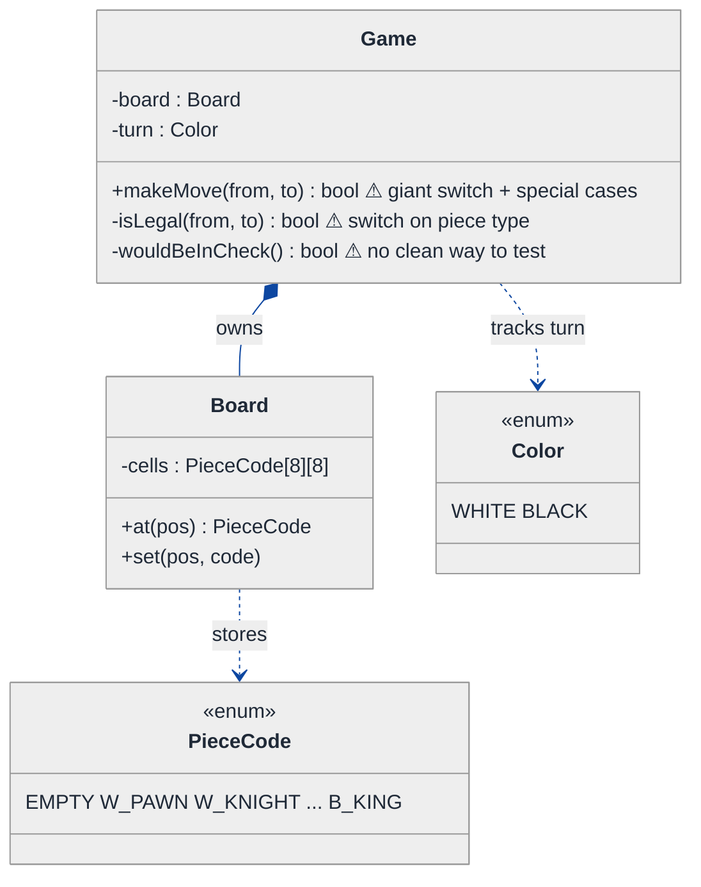
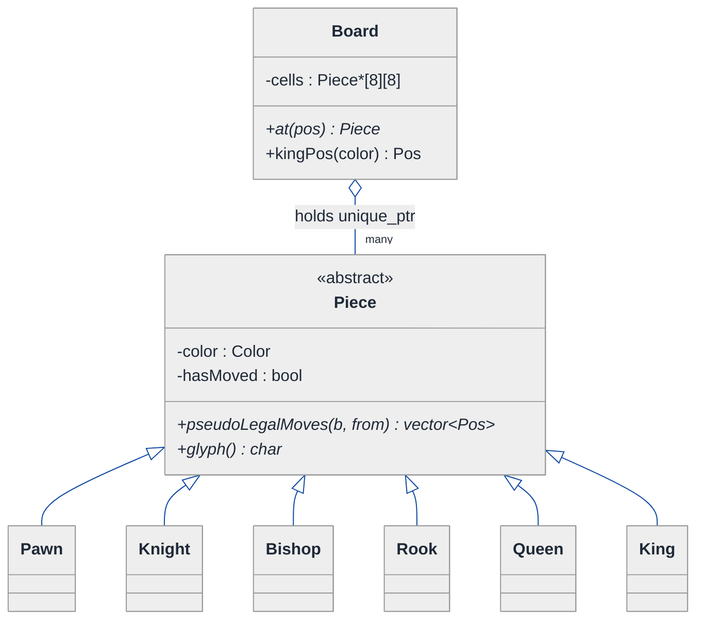
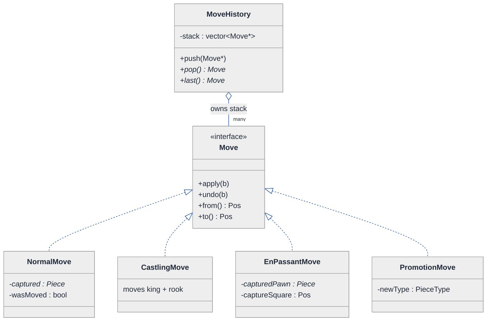
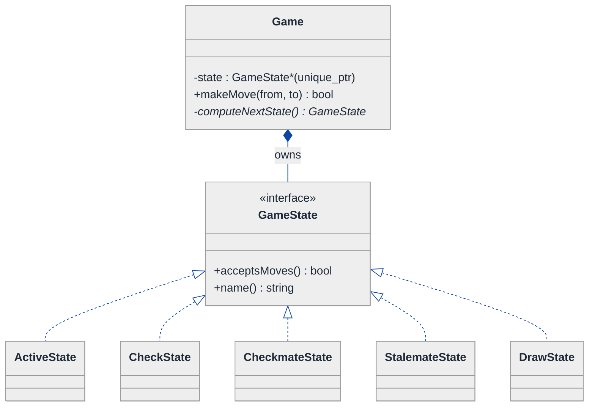
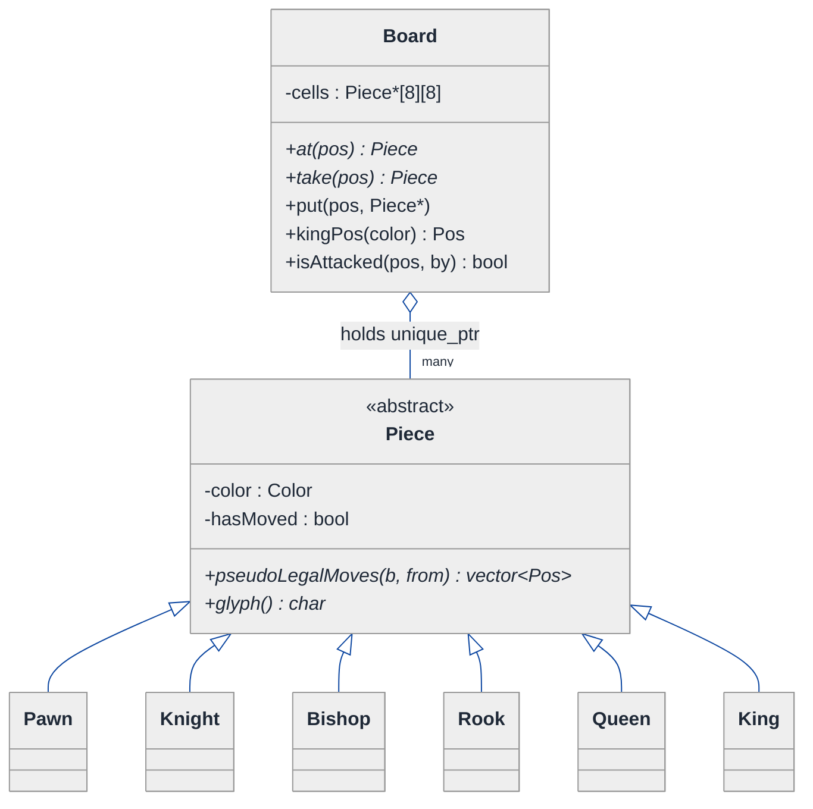
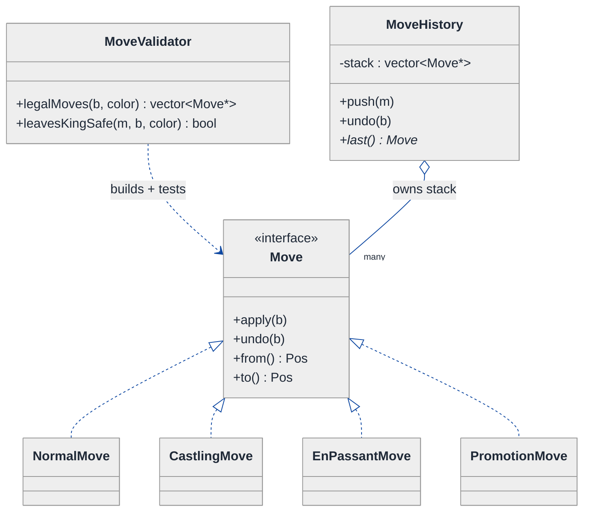
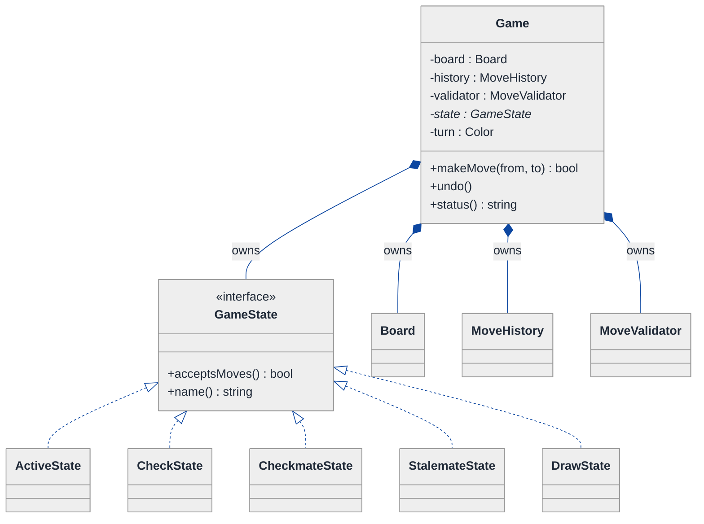
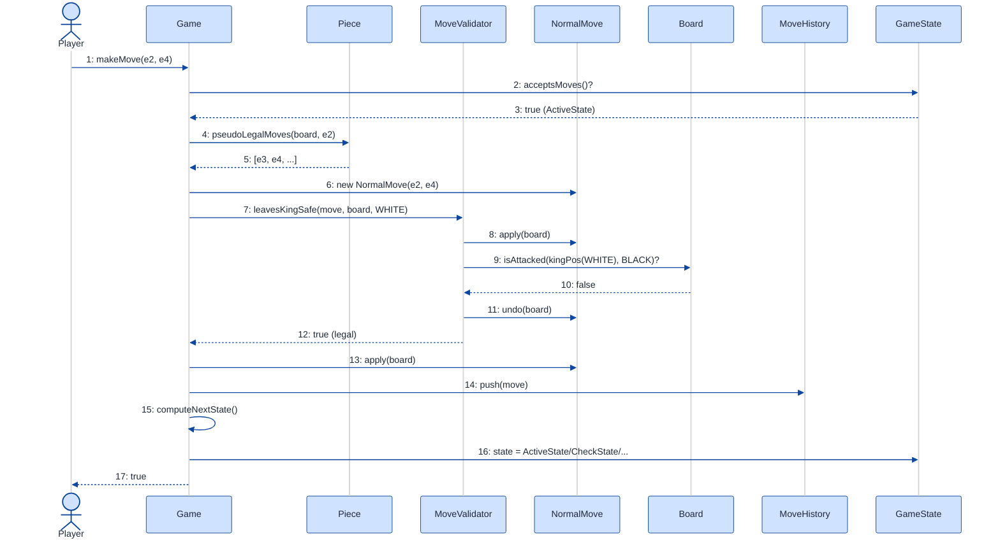

# Chess Game — LLD Walkthrough

> **Difficulty:** Hard · **Time:** ~60 min · **Pattern focus:** Command (moves as objects) + polymorphism (piece move-generation) — with a State pattern for game phase and a Strategy for check detection.
>
> **Problem source(s):** GID `CM2`, bucket `Command_Pattern`. Representative of the "model a full board game with undo/redo" family in [`./EXTRACTED_QUESTIONS.md`](./EXTRACTED_QUESTIONS.md).
>
> **Diagrams:** inline mermaid (renders natively in GitHub / VS Code). No `look: handDrawn`.

---

## How to use this file

Paced for a candidate seeing "design chess" for the first time. Reading time: ~55 minutes if you sketch each iteration by hand. **The lesson: don't model chess as a 64-cell array smothered in if/else. DERIVE the design — build the naive version, watch it collapse under undo, en passant, and "is this move legal," and reach for ONE pattern per painful axis: polymorphism for move generation, Command for moves themselves, State for the game phase.**

Chess is the canonical "Command + polymorphism" interview because it has BOTH a clean polymorphic hierarchy (six piece types, each generates moves differently) AND a clean Command axis (every move must be reversible — for undo, and more importantly for the legality check "does this move leave my own king in check?").

**Map of this file (15 sections):**

1. Problem statement + clarifying questions
2. Plain-English restatement
3. Why this matters
4. Mental model
5. Try it yourself first
6. Entity & verb extraction
7. **Iteration 1: the naive design** — one giant `movePiece()` with switch-on-type
8. **Where the naive design hurts** — five future requirements, one painful diff each
9. **Pivot 1: polymorphism for move generation** — kill the type switch
10. **Pivot 2: Command for moves** — make every move a reversible object (undo + legality)
11. **Pivot 3: State for the game phase** — Active / Check / Checkmate / Stalemate / Draw
12. Final UML class diagram (three sub-views)
13. Skeleton code (C++)
14. Key flow — sequence diagram
15. Extensibility re-check + anti-patterns + how to think aloud + self-check

---

## 1. Problem statement + clarifying questions

**Prompt (typical phrasing):** "Design a chess game with all standard rules including castling, en passant, pawn promotion, check, checkmate, and stalemate detection. Model the board, pieces, moves, and game state."

**Clarifying questions to ask BEFORE drawing anything:**

1. **Scope of rules?** Just legal-move enforcement and end-game detection, or also clocks, the 50-move rule, threefold repetition, and PGN import/export?
2. **Undo / takeback?** Do we need to undo moves (casual play, analysis board)? This single answer decides whether moves are objects or imperative mutations.
3. **Two humans hot-seat, human-vs-engine, or networked?** Affects who calls `makeMove` but not the core board model — I'll assume the engine exposes a clean `Game` API and stay agnostic about the driver.
4. **Variants?** Standard chess only, or do we need to leave room for Chess960, three-check, or custom pieces? Cheap to leave the door open; expensive to retrofit.
5. **How is "legal move" defined for us?** Pseudo-legal (piece movement rules only) versus fully legal (also "must not leave your own king in check")? The king-safety rule is the hard part and drives the whole design.
6. **Move input format?** Algebraic notation ("Nf3"), from-square/to-square coordinates, or a `Move` object? I'll take coordinates and build `Move` objects internally.
7. **Single-threaded?** One game, one thread of play. I'll assume yes and note concurrency in §15.

**Assumptions if the interviewer dodges:** standard rules only, undo IS required (it is the natural way to implement the king-safety check anyway), hot-seat two-player with a clean `Game` facade, single-threaded, coordinate input. We leave a seam for variants but do not build them.

---

## 2. Plain-English restatement

We are building the rules engine behind a chessboard. Given a board position and a proposed move, the engine must decide whether the move is legal, apply it (including the three irregular moves — castling, en passant, promotion), then look at the resulting position and announce the game state: normal, check, checkmate, stalemate, or draw. Critically, "legal" includes "you may not make a move that leaves your own king attacked," which means the engine must be able to *try a move, look, and take it back*. The design must let us add the irregular moves and the end-game detection **without turning one function into a thousand-line swamp of special cases.**

---

## 3. Why this matters

Chess is a senior-bar LLD question because it punishes the reflex to model everything as data + one big procedure. It rewards two specific recognitions: (a) the six pieces are a genuine polymorphic hierarchy — "generate my moves" is the same question with six different answers — and (b) a move is not an event that happened, it is an *object you can apply and reverse*, which is the Command pattern. The candidates who shine are the ones who realize the king-safety rule ("don't move into check") is impossible to implement cleanly *without* reversible moves, and who therefore derive Command from a requirement rather than name-dropping it. That derivation is the whole interview.

---

## 4. Mental model

A chess engine is three things layered: an **8×8 grid of squares** (inventory), a **deck of move-objects** the rules let you play (operations), and a **referee** who, after every move, looks at the board and declares the game's status (state machine).

```
Real-world sketch (NOT a UML diagram yet):

   8x8 Board (inventory)          The "move deck" (operations)        The referee (state)
   +--+--+--+--+--+--+--+--+
 8 |r |n |b |q |k |b |n |r |       normal slide/capture            ┌──────────────┐
 7 |p |p |p |p |p |p |p |p |       castle (king + rook together) →  │  ACTIVE      │
 6 |  |  |  |  |  |  |  |  |       en passant (capture empty sq) →  │  CHECK       │
 5 |  |  |  |  |  |  |  |  |       promotion (pawn becomes queen)→  │  CHECKMATE   │
 ..|..|..|..|..|..|..|..|..|                                       │  STALEMATE   │
 1 |R |N |B |Q |K |B |N |R |       each one APPLIES and UNDOES  →    │  DRAW        │
   +--+--+--+--+--+--+--+--+                                       └──────────────┘
    a  b  c  d  e  f  g  h
```

The KEY insight from this picture: the grid is dumb storage; the *interesting variability* is in the move-objects (some touch one square, some touch four) and in the referee's verdict. The naive design crams all three layers into one function. We will pry them apart.

---

## 5. Try it yourself first

> **Predict before reading on:**
>
> 1. List 6 nouns you'd promote to a class and 3 you'd leave as fields or library types.
> 2. **The rule "you may not make a move that leaves your own king in check" requires the engine to evaluate a hypothetical position. How would you implement that WITHOUT permanently changing the board?** Your answer here basically picks your central pattern.
> 3. Castling moves two pieces and en passant captures a pawn that isn't on the destination square. If `movePiece(from, to)` just copies one square to another, where do these two rules force you to bolt on special cases?

---

## 6. Entity & verb extraction

> **Mini-refresher: noun → class, but not every noun.**
>
> Naive OOD promotes every noun to a class. Senior OOD promotes a noun only if it has both BEHAVIOR and STATE that must live together. "Color" stays an `enum`; "Move" becomes a class because — as we'll discover in §10 — it has the behavior `apply()` and `undo()`.

**Nouns from the prompt:**

| Noun | Decision | Why |
|---|---|---|
| Game | Class (top-level facade) | Orchestrates turns, owns board + history + state |
| Board | Class | 8×8 grid; knows what's on each square, can find the king |
| Square / Position | Small value type (`struct {row, col}`) | No behavior; pure coordinate |
| Piece | Class (abstract) + 6 concrete subclasses | Each generates moves differently — genuine "is-a" |
| Move | Class (abstract) + concrete subclasses | Has lifecycle behavior `apply`/`undo` (derived in §10) |
| Player / Color | `enum class Color {WHITE, BLACK}` | A turn marker, not behavior |
| Check / Checkmate / Stalemate | Game *states*, not classes-of-thing | Become a State hierarchy in §11 |
| MoveHistory | Class | Stack of executed moves — enables undo + threefold repetition |

**Verbs (and the class they live on — naive answer, re-examined later):**

| Verb | Owner class (naive — we'll re-examine) |
|---|---|
| makeMove(from, to) | Game |
| isLegal(move) | Game (naive) → derived elsewhere |
| generateMoves(piece) | Game's giant switch (naive) → Piece (§9) |
| apply() / undo() | Move (§10) |
| isInCheck(color) | Board |
| status() | Game → GameState (§11) |
| promote(pawn, type) | Game (naive) |

**No design patterns yet.** Just nouns and verbs.

---

## 7. <a id="iter-1"></a>Iteration 1: the naive design

The simplest thing that could possibly work: a `Board` that is a 2D array of an enum, and a `Game` with one big `makeMove` that switches on piece type to validate, then mutates the array in place.



**Reader's tour (read top to bottom; ~60 seconds).**

1. **`Game` is the root** and holds two fields: a `Board` and whose `turn` it is. Every decision — legality, special moves, check — lives inside `makeMove`.
2. **`Board` is a 2D array of `PieceCode`.** A piece isn't an object; it's an enum value like `W_KNIGHT`. The board is pure data with `at()` / `set()`.
3. **Three warning markers (⚠) on `Game`.** `makeMove` is destined to become a giant switch-on-type plus bolted-on branches for castling/en-passant/promotion. `isLegal` switches on the piece code to know how it moves. `wouldBeInCheck` has *no clean way* to test a hypothetical — that's the smell §8 will detonate.

**What's deliberately missing.** No `Piece` hierarchy — knights and bishops are just enum tags. No `Move` object — a move is a transient `(from, to)` pair that mutates the array and vanishes. No `GameState` — status is computed ad hoc. The naive design doesn't even acknowledge these as axes of variation.

Skeleton code for the naive design (C++):

```cpp
#include <array>
#include <cmath>
#include <optional>

enum class Color { WHITE, BLACK, NONE };
enum class PieceCode {
    EMPTY,
    W_PAWN, W_KNIGHT, W_BISHOP, W_ROOK, W_QUEEN, W_KING,
    B_PAWN, B_KNIGHT, B_BISHOP, B_ROOK, B_QUEEN, B_KING
};

struct Pos { int row, col; };

class Board {
public:
    PieceCode at(Pos p) const          { return cells_[p.row][p.col]; }
    void      set(Pos p, PieceCode c)  { cells_[p.row][p.col] = c; }
private:
    std::array<std::array<PieceCode, 8>, 8> cells_{};  // EMPTY-initialized
};

class Game {
public:
    bool makeMove(Pos from, Pos to) {
        PieceCode pc = board_.at(from);
        if (!isLegal(from, to)) return false;          // ⚠ switch-on-type inside

        // ⚠ special cases bolted on:
        if (isCastle(pc, from, to))   { doCastle(from, to);   return finish(); }
        if (isEnPassant(pc, from, to)){ doEnPassant(from, to); return finish(); }

        board_.set(to, pc);                            // normal move = copy square
        board_.set(from, PieceCode::EMPTY);

        if (isPromotion(pc, to)) board_.set(to, promoteCode(pc));  // ⚠ another branch
        return finish();
    }
private:
    bool isLegal(Pos from, Pos to) const {
        PieceCode pc = board_.at(from);
        switch (pc) {                                  // ⚠ the type switch
            case PieceCode::W_KNIGHT: case PieceCode::B_KNIGHT:
                return knightOk(from, to);
            case PieceCode::W_BISHOP: case PieceCode::B_BISHOP:
                return bishopOk(from, to);
            // ... rook, queen, king, pawn (pawn alone is ~40 lines: pushes,
            //     double-push, diagonal capture, en-passant window) ...
            default: return false;
        }
        // and NOWHERE here have we checked "does this leave my king in check?"
    }
    bool finish() { turn_ = (turn_ == Color::WHITE ? Color::BLACK : Color::WHITE); return true; }
    // knightOk / bishopOk / doCastle / doEnPassant / isPromotion ... elided

    Board board_;
    Color turn_ = Color::WHITE;
};
```

**This works** for the legal-move basics. It has zero design patterns. We can push pawns and move knights. So what's wrong with it?

---

## 8. <a id="naive-pain"></a>Where the naive design hurts

The interviewer slides over five requirements: "Standard chess. Walk me through what each costs in this design."

### Change A: "Reject any move that leaves your OWN king in check"

This is not optional — it is a core rule. In the naive design:
- To know if a move is legal, you must *make it, look at the board, and decide.* But `makeMove` mutates `cells_` in place and discards the old values (`from` becomes `EMPTY`).
- So you'd manually save the destination's old code, the source code, mutate, scan for check, then *manually restore both squares* — and that restore is itself buggy for captures and en passant (you destroyed the captured pawn).
- **The change touches `isLegal`, `makeMove`, and forces hand-rolled save/restore logic that is wrong for exactly the special moves.** There is no "undo" — so you're inventing a fragile one inline.

### Change B: "Implement castling"

In the naive design:
- Castling moves TWO pieces (king two squares, rook jumps over). `board_.set(to, pc); board_.set(from, EMPTY)` models exactly one piece moving.
- It also has preconditions: neither piece has moved, squares between are empty, the king isn't in/through/into check.
- **Add an `isCastle` branch in `makeMove`, a `doCastle` that mutates four squares, and "has this piece ever moved" tracking that the `PieceCode` enum cannot hold.** The enum has no room for per-piece history.

### Change C: "Implement en passant"

In the naive design:
- The captured pawn is NOT on the destination square — it's beside it. `board_.set(from, EMPTY)` leaves the captured pawn standing.
- Whether en passant is even legal depends on what the *immediately previous move* was (a two-square pawn push landing alongside). The naive design keeps no move history.
- **Add an `isEnPassant` branch, a `doEnPassant` that clears a third square, and previous-move tracking the design doesn't have.**

### Change D: "Add full undo / takeback (analysis mode)"

In the naive design:
- A move left no record of what it changed. Undo is impossible without replaying the whole game from the start.
- **You'd have to store, per move, every square it touched and its prior contents — i.e. reinvent a Move object — and write a reverse-mutator for each special case.** Every special move needs a matching un-special move.

### Change E: "Detect checkmate vs stalemate vs draw and lock the game"

In the naive design:
- After a move you must answer: is the side-to-move in check with no legal reply (checkmate), or not in check with no legal reply (stalemate)? Both require *generating all of that side's moves and testing each for king-safety* — i.e. Change A applied 30+ times.
- And once the game ends, `makeMove` must refuse further moves. There's a single `turn_` flag and no notion of "game over."
- **Add status computation inside `makeMove`, plus `if (gameOver) return false` guards sprinkled around.** Status logic and move logic fuse into one method.

### The pattern of pain

| Change | Files / methods touched | Smell |
|---|---|---|
| A. King safety | `isLegal` + `makeMove` + hand-rolled save/restore | "I need to try a move and take it back, but moves aren't reversible." |
| B. Castling | `makeMove` + `doCastle` + per-piece moved-flag | "A move can touch >1 piece; one enum square can't model it." |
| C. En passant | `makeMove` + `doEnPassant` + previous-move state | "The captured square ≠ destination; and legality depends on history." |
| D. Undo | reinvent move records + reverse mutators everywhere | "No move object → no undo → king-safety check stays fragile." |
| E. Checkmate/stalemate | status logic fused into `makeMove`; `gameOver` guards | "Move execution and game-status verdict are tangled." |

**Three axes of pain dominate:**
1. *Per-type behavior* — "how does THIS piece move?" is answered by a switch (Changes A, B's preconditions, E's move-generation).
2. *Reversible operations* — "try a move, look, undo it" and "takeback" both need a move to be an object with `apply`/`undo` (Changes A, B, C, D).
3. *Game phase* — the verdict and the lock are a state machine, not a flag (Change E).

> **Pivot question:** "What lets six piece types answer 'generate my moves' without a switch? What turns a move into something you can *apply and reverse*? And what models 'the game is now in checkmate, refuse input'?"
>
> The answers are polymorphism, the Command pattern, and the State pattern — introduced one at a time, hardest axis first. Move generation is the foundation everything else stands on, so start there.

---

## 9. <a id="pivot-1"></a>Pivot 1: polymorphism for move generation

> **Mini-refresher: polymorphism (subtype) + the Liskov substitution principle.**
>
> Polymorphism means a caller holds a base-class pointer (`Piece*`) and calls a virtual method (`piece->pseudoLegalMoves(...)`); the *runtime type* (Knight, Bishop, …) decides which implementation runs. The LISKOV substitution principle (the "L" in SOLID) says any subtype must be usable wherever the base is expected — every `Piece` subclass must honor the same `pseudoLegalMoves` contract so the board never asks "which kind are you?"

**Why polymorphism fits move generation.** The question "what squares can this piece reach?" is the *same question* with six different answers. That is the textbook trigger for a virtual method: one signature, many implementations, dispatched by runtime type. Replacing `switch(pieceCode)` with `piece->pseudoLegalMoves(board, from)` deletes the central type switch and makes "add a new piece type" a matter of writing one new class.

> **Mini-refresher: open/closed principle (the "O" in SOLID).**
>
> Software should be *open for extension, closed for modification.* The enum-switch in §7 violated it: a new piece type forced edits to the existing `isLegal` switch. A `Piece` hierarchy satisfies it: a new piece is a new subclass — zero edits to existing code.

A piece is now a real object (it carries its `Color` and a `hasMoved` flag — which immediately solves Change B's bookkeeping problem). The board stores `Piece*` (owned via `unique_ptr`), not enum tags.

**The refactor (just the move-generation slice):**

```cpp
class Board;          // forward
struct Pos { int row, col; };

class Piece {
public:
    Piece(Color c) : color_(c) {}
    virtual ~Piece() = default;

    // Pseudo-legal = obeys this piece's movement rules, IGNORES king safety.
    // King safety is layered on top in Pivot 2 — keep responsibilities separate.
    virtual std::vector<Pos> pseudoLegalMoves(const Board& b, Pos from) const = 0;
    virtual char glyph() const = 0;             // 'N', 'B', ... for display/notation

    Color color() const { return color_; }
    bool  hasMoved() const { return hasMoved_; }
    void  markMoved() { hasMoved_ = true; }     // solves Change B's tracking
private:
    Color color_;
    bool  hasMoved_ = false;
};

class Knight : public Piece {
public:
    using Piece::Piece;
    char glyph() const override { return 'N'; }
    std::vector<Pos> pseudoLegalMoves(const Board& b, Pos from) const override {
        std::vector<Pos> out;
        static const int d[8][2] = {{1,2},{2,1},{-1,2},{-2,1},{1,-2},{2,-1},{-1,-2},{-2,-1}};
        for (auto& m : d) {
            Pos t{from.row + m[0], from.col + m[1]};
            if (onBoard(t) && !occupiedBySameColor(b, t, color())) out.push_back(t);
        }
        return out;
    }
};

class Bishop : public Piece {  // slides diagonally until blocked
public:
    using Piece::Piece;
    char glyph() const override { return 'B'; }
    std::vector<Pos> pseudoLegalMoves(const Board& b, Pos from) const override {
        return slide(b, from, color(), {{1,1},{1,-1},{-1,1},{-1,-1}});  // helper elided
    }
};
// Rook, Queen, King, Pawn elided — Pawn is the gnarly one (double-push,
// diagonal capture, en-passant target square, promotion rank).
```

**What changed — visualized.** Just the piece slice:



**Tour of the after-state.**

1. **`Board` holds `Piece*` instead of enum tags.** Each cell is either `nullptr` (empty) or a pointer to an owned `Piece`. `kingPos(color)` is a new helper Change A/E will lean on.
2. **`Piece` is an abstract base** with two pure-virtual methods. `pseudoLegalMoves` is the polymorphic core; `glyph` is for notation/printing.
3. **Six concrete subclasses, one per type.** Knight enumerates 8 jumps; Bishop slides diagonally; the sliders (Bishop/Rook/Queen) share a `slide()` helper. Each subclass is self-contained.
4. **`hasMoved` now lives on the piece** — Change B's "neither king nor rook has moved" precondition is a field read, not enum gymnastics.
5. **The type switch is GONE.** `Game` no longer asks "what kind of piece is this?" It calls `piece->pseudoLegalMoves(...)` and lets dispatch do the work.

**"Pseudo-legal," not "legal."** Note the deliberate split: `pseudoLegalMoves` obeys the *movement* rules but ignores king safety. Why? Because king safety needs the move *applied and inspected* — and that machinery is Pivot 2. Keeping the piece ignorant of king safety is the single-responsibility principle: a Knight knows how knights move, not whether the position is legal.

**Pattern-discrimination cheatsheet — polymorphism (inheritance) vs Strategy (composition).**
- *Polymorphism via inheritance:* the variation IS the object's identity. A Knight *is-a* Piece; "how I move" is intrinsic and permanent.
- *Strategy via composition:* the variation is a pluggable behavior the object *has*, swappable at runtime.
- *Rule of thumb:* if the variants are a closed, identity-defining set fixed at creation (the six chess pieces) → inheritance. If they're swapped on the same object at runtime (pricing rules on a parking lot) → Strategy.

We chose inheritance because a piece's movement is its identity — a knight never becomes a bishop. (Promotion *replaces* the object; it doesn't mutate a strategy field.)

---

## 10. <a id="pivot-2"></a>Pivot 2: Command for moves — apply + undo

Changes A, C, D are still painful, and they share one root cause: **a move is not an object, so it cannot be reversed.** Change A (king safety) needs to *try a move and take it back*. Change C (en passant) and Change B (castling) touch squares the naive copy-one-square model can't express. Change D (undo) needs reversibility directly. All three want the same thing: a move that knows how to `apply()` itself and `undo()` itself.

> **Mini-refresher: Command pattern.**
>
> Encapsulate a request as an object — `execute()` does the work, and (in the undoable variant) `undo()` reverses it. The object captures *everything needed to redo or undo*, so callers can queue commands, log them, replay them, or roll them back without knowing what each one does internally. Classic uses: editor undo stacks, transaction logs, macro recording.
>
> Quick example: a text editor's `InsertTextCommand` stores the inserted string and position. `execute()` inserts it; `undo()` deletes exactly those characters. The editor keeps a stack of commands and pops to undo.

**Why Command fits a chess move perfectly.** A chess move IS a request that must be reversible. The killer requirement is king safety: the *only clean way* to ask "does this move leave my king in check?" is — apply the move, ask the board "is my king attacked?", then undo. That is a Command with `undo()`. And once a move is a Command, the special moves stop being `if`-branches in one function and become *subclasses*: `CastlingMove` is a Command that moves two pieces; `EnPassantMove` is a Command that captures a third square; `PromotionMove` is a Command that swaps a pawn for a queen. Each implements its own `apply`/`undo`. Change D (undo) becomes free — the history is a stack of Commands.

Critically, each Command **captures the information it needs to undo** — the captured piece, the old `hasMoved` flag, the previous en-passant target. Undo is not "recompute the previous position"; it is "restore exactly what I changed."

**The refactor (the move slice):**

```cpp
class Board;  // forward

class Move {                                   // the Command interface
public:
    virtual ~Move() = default;
    virtual void apply(Board& b) = 0;
    virtual void undo(Board& b)  = 0;          // <-- the king-safety enabler
    virtual Pos  from() const = 0;
    virtual Pos  to()   const = 0;
};

class NormalMove : public Move {
public:
    NormalMove(Pos f, Pos t) : from_(f), to_(t) {}
    void apply(Board& b) override {
        moving_   = b.take(from_);             // detach the moving piece
        captured_ = b.take(to_);               // remember what we captured (may be null)
        wasMoved_ = moving_->hasMoved();
        moving_->markMoved();
        b.put(to_, std::move(moving_));        // place it on the destination
    }
    void undo(Board& b) override {
        auto p = b.take(to_);                  // pull it back
        if (!wasMoved_) p->unmarkMoved();      // restore the moved-flag exactly
        b.put(from_, std::move(p));
        if (captured_) b.put(to_, std::move(captured_));  // resurrect the captured piece
    }
    Pos from() const override { return from_; }
    Pos to()   const override { return to_; }
private:
    Pos from_, to_;
    std::unique_ptr<Piece> moving_;            // captured at apply-time for undo
    std::unique_ptr<Piece> captured_;
    bool wasMoved_ = false;
};

class CastlingMove : public Move {             // touches FOUR squares — Change B
    // moves king two squares AND the rook to its far side; undo() reverses both.
    // stores king-from/to, rook-from/to. Implementation elided.
};

class EnPassantMove : public Move {            // captures a pawn NOT on `to` — Change C
    // apply(): move pawn to `to`, remove the captured pawn from its actual square.
    // undo(): restore both. Stores the captured pawn + its real square. Elided.
};

class PromotionMove : public Move {            // pawn -> chosen piece
    // apply(): remove pawn from board, put new Queen/Rook/... on `to`.
    // undo(): remove the promoted piece, restore the original pawn. Elided.
};
```

Now the king-safety check — the requirement that *forced* this pattern — is four lines and works for every move type uniformly:

```cpp
// "Is `move` legal?" = pseudo-legal AND does not leave my own king in check.
bool MoveValidator::leavesKingSafe(Move& move, Board& b, Color me) {
    move.apply(b);                                   // try it
    bool safe = !b.isAttacked(b.kingPos(me), opponentOf(me));
    move.undo(b);                                    // take it back — board restored exactly
    return safe;
}
```

**What changed — visualized.** The move slice:



**Tour of the after-state.**

1. **`Move` is the Command interface** — `apply` / `undo` plus `from`/`to` accessors. Every move type implements it.
2. **`NormalMove` captures undo information at apply-time.** Look at its fields: `captured_` (the piece it took, possibly null) and `wasMoved_` (the moving piece's prior flag). `undo()` restores both *exactly* — it does not recompute, it rewinds.
3. **The three irregular moves are now subclasses, not `if`-branches.** `CastlingMove` moves two pieces; `EnPassantMove` remembers the captured pawn's *real* square; `PromotionMove` swaps the pawn for the chosen piece. Each one's `undo()` mirrors its `apply()`. **Changes B and C land as new classes — zero edits to the others.**
4. **`MoveHistory` is a stack of Commands** — Change D (undo) is now `history.pop()->undo(board)`. It also gives us the *previous move*, which en-passant legality needs ("was the last move a two-square pawn push beside me?").
5. **King safety is uniform.** `leavesKingSafe` calls `apply` then `undo` and never asks what *kind* of move it is. Castling-into-check, en-passant-that-exposes-the-king — all handled by the same four lines, because every Command reverses itself.

> **Mini-refresher: who OWNS the pieces during apply/undo?**
>
> When a piece is captured, it's detached from the board but must survive until the Command is undone — so the `Move` holds the captured piece in a `unique_ptr`. Ownership *transfers* board → move on capture, and back move → board on undo. `std::move` makes this transfer explicit and leak-free. This is why moves can't be plain value structs: they hold owned pieces.

**Pattern-discrimination cheatsheet — Command vs Memento.**
- *Command:* stores the *operation* (apply/undo). Undo reverses by knowing what it did.
- *Memento:* stores a *full snapshot* of the object's state; undo restores by overwriting with the snapshot.
- *Rule of thumb:* if reversing is cheap to express as "do the opposite" (move a piece back, un-capture) → Command. If state is huge or reversal is hard to express incrementally → Memento (snapshot the whole board).
- *For chess:* Command wins. A move touches at most a handful of squares; storing the inverse is far cheaper than snapshotting all 64 squares per move. (Engines do sometimes snapshot a tiny "irreversible-state" record — castling rights, en-passant target — alongside the Command; that's a hybrid, and a great senior-level remark.)

---

## 11. <a id="pivot-3"></a>Pivot 3: State for the game phase

Change E remains: after each move, declare the verdict — Active, Check, Checkmate, Stalemate, Draw — and once the game is over, refuse further input. In the naive design this was a `gameOver` flag plus status logic fused into `makeMove`. The variability here is not an algorithm and not a reversible operation — it's *which operations are legal right now and what the game reports*. That is a lifecycle.

> **Mini-refresher: State pattern.**
>
> Each lifecycle phase is its own class behind a shared interface. The context (here, `Game`) delegates to its current state object, and THE STATE decides the next state. Transitions are internal, driven by what happens — not chosen by the caller. Distinct from Strategy: with Strategy the caller swaps the behavior; with State the object swaps itself.

**Why State (not Strategy) for the game phase.** The caller does not pick "we're now in checkmate" — the *position* drives it. After a move, the engine inspects the board and the new phase falls out. A `CheckmateState` must *reject* further moves; an `ActiveState` accepts them. The set of legal operations changes with the phase — the defining signature of State.

**How the verdict is computed** (this is the chess content the state machine wraps): after a move, look at the side to move. Generate all its *fully legal* moves (pseudo-legal, filtered through `leavesKingSafe` from Pivot 2). Then:
- has legal moves, king attacked → **Check**
- has legal moves, king safe → **Active**
- no legal moves, king attacked → **Checkmate** (terminal)
- no legal moves, king safe → **Stalemate** (terminal, draw)
- insufficient material / 50-move / threefold → **Draw** (terminal)

Notice every branch reuses Pivot 2's `leavesKingSafe`. The whole engine rests on reversible moves.

**The refactor (the phase slice):**

```cpp
class Game;  // forward

class GameState {
public:
    virtual ~GameState() = default;
    virtual bool acceptsMoves() const = 0;
    virtual std::string name()  const = 0;
    // After a move is played, the Game asks the *new* phase to be computed:
    // (factory-ish) examine the board, return the next state object.
};

class ActiveState : public GameState {
public:
    bool acceptsMoves() const override { return true; }
    std::string name()  const override { return "ACTIVE"; }
};

class CheckState : public GameState {       // in check but has escapes
public:
    bool acceptsMoves() const override { return true; }   // must respond to check
    std::string name()  const override { return "CHECK"; }
};

class CheckmateState : public GameState {   // terminal
public:
    bool acceptsMoves() const override { return false; }  // game over — locked
    std::string name()  const override { return "CHECKMATE"; }
};

class StalemateState : public GameState {   // terminal draw
public:
    bool acceptsMoves() const override { return false; }
    std::string name()  const override { return "STALEMATE"; }
};
// DrawState elided

// Game delegates to the current state instead of checking a flag:
class Game {
public:
    bool makeMove(Pos from, Pos to) {
        if (!state_->acceptsMoves()) return false;       // terminal phases refuse input
        // ... validate, build the Move command, apply, push to history ...
        state_ = computeNextState();                     // State transition, board-driven
        return true;
    }
private:
    std::unique_ptr<GameState> computeNextState();       // runs the verdict table above
    Board                         board_;
    MoveHistory                   history_;
    std::unique_ptr<GameState>    state_ = std::make_unique<ActiveState>();
    Color                         turn_  = Color::WHITE;
};
```

**What changed — visualized.** The phase slice:



**Tour of the after-state.**

1. **The `gameOver` flag is gone.** Replaced by a `GameState*` (`unique_ptr` — the Game owns its current phase).
2. **`makeMove`'s first line delegates the guard:** `if (!state_->acceptsMoves()) return false`. No scattered `if (gameOver)` checks — terminal phases simply answer `false` to `acceptsMoves()`.
3. **Five phases, each its own class.** `ActiveState` and `CheckState` accept moves; `CheckmateState`, `StalemateState`, `DrawState` are terminal and refuse. Adding a new phase (e.g. a draw-offer-pending phase) is one new class.
4. **The transition is board-driven.** `computeNextState()` runs the verdict table and returns the next phase object — the State, not the caller, decides what comes next.

**Pattern-discrimination cheatsheet — State vs Strategy (the most-confused pair).**
- *Strategy:* the CALLER picks which one to use (`game.setStyle(aggressive)`). Strategies are usually unaware of each other.
- *State:* the OBJECT picks its next state internally, driven by events/inspection. States imply each other (Active → Check → Checkmate).
- *Rule of thumb:* swap happens because external code says so → Strategy. Swap happens because of an internal flow → State. Here the phase is computed from the board after every move → State.

---

## 12. <a id="fig-class-diagram"></a>Final class diagram

One diagram for the whole engine is a wall of boxes. Here are **three focused sub-views**: the inventory (board + pieces), the operations (the Command hierarchy + history + validator), and the phase (the State machine + the facade that ties everything together).

### 12.1 The inventory — what the game OWNS

> Same hierarchy as Pivot 1, now exposing the `kingPos`/`isAttacked` queries the validator needs.



**Tour of 12.1.** The board owns its pieces (open diamond — aggregation of `unique_ptr`s that the board can detach during a move and hand to a `Move` command). Each cell is a `Piece*` or null. `isAttacked` and `kingPos` are the two queries the king-safety and verdict logic depend on. The Piece hierarchy is genuine inheritance — six identities, one `pseudoLegalMoves` contract.

### 12.2 The operations — the Command hierarchy + history + validator



**Tour of 12.2.**

1. **`Move` is the Command interface** — `apply`/`undo` are the heart of the design. Four concrete commands; each special move is a class, not a branch.
2. **`MoveValidator` is where Command pays off.** `leavesKingSafe` applies a move, queries `Board::isAttacked`, undoes it. `legalMoves` builds every pseudo-legal move and filters through `leavesKingSafe` — the foundation of checkmate/stalemate detection.
3. **`MoveHistory` owns the executed commands** as a stack. `undo(b)` pops and reverses (takeback). `last()` feeds en-passant legality. This is the redo/undo log straight out of the Command playbook.
4. **The structural insight:** *every* hard chess rule — king safety, the irregular moves, undo, end-game detection — funnels through this one Command abstraction. Reversibility is the load-bearing wall.

### 12.3 The phase + facade — State machine wired to the Game



**Tour of 12.3.** `Game` is the facade: it composes the Board (inventory), the MoveHistory + MoveValidator (operations), and the current GameState (phase). `makeMove` first asks the state `acceptsMoves()`, then validates via the validator, applies the Command and pushes it to history, then recomputes the state from the board. `undo()` is a one-liner onto MoveHistory. `status()` reads the state's `name()`. **Inheritance is used only where identity varies (pieces, move-commands, game-phases); everything else is composition.**

### Structural insight (ties 12.1 + 12.2 + 12.3 together)

| Concern | Pattern used | Why |
|---|---|---|
| **Inventory** (Board, six Piece types) | Polymorphism (inheritance) | "Generate my moves" is one contract, six identities |
| **Operations** (every move, incl. castling/en-passant/promotion) | Command (`apply`/`undo`) | A move must be reversible — for king-safety testing AND undo |
| **King safety + checkmate/stalemate** | Built ON Command | Apply → inspect → undo; generate-and-filter all replies |
| **Phase** (Active/Check/Mate/Stale/Draw) | State, owned by Game | The position drives the next phase; terminal phases lock input |

The big lesson: **the king-safety rule forces reversible moves, reversible moves ARE the Command pattern, and once you have it, undo, the irregular moves, and end-game detection all fall out for free.** That single derivation is the spine of the whole design.

---

## 13. Skeleton code (C++)

> Show the SHAPES, not the full impl. ~130 lines.

```cpp
#include <array>
#include <memory>
#include <string>
#include <vector>
#include <utility>

// ── Value types & forward decls ─────────────────────────────────────
enum class Color { WHITE, BLACK };
enum class PieceType { PAWN, KNIGHT, BISHOP, ROOK, QUEEN, KING };
struct Pos { int row, col; };
inline Color opponentOf(Color c) { return c == Color::WHITE ? Color::BLACK : Color::WHITE; }

class Board;   // defined below
class Piece;

// ── Pivot 1: polymorphic pieces ─────────────────────────────────────
class Piece {
public:
    explicit Piece(Color c) : color_(c) {}
    virtual ~Piece() = default;
    virtual std::vector<Pos> pseudoLegalMoves(const Board& b, Pos from) const = 0;
    virtual PieceType type() const = 0;
    virtual char      glyph() const = 0;

    Color color()    const { return color_; }
    bool  hasMoved() const { return hasMoved_; }
    void  markMoved()   { hasMoved_ = true; }
    void  unmarkMoved() { hasMoved_ = false; }   // used by Move::undo
private:
    Color color_;
    bool  hasMoved_ = false;
};

class Knight : public Piece {
public:
    using Piece::Piece;
    PieceType type()  const override { return PieceType::KNIGHT; }
    char      glyph() const override { return 'N'; }
    std::vector<Pos> pseudoLegalMoves(const Board&, Pos) const override; // L-jumps; elided
};
// Pawn, Bishop, Rook, Queen, King elided — same shape.

// ── Board: dumb storage + two queries the rules need ────────────────
class Board {
public:
    Piece* at(Pos p) const { return cells_[p.row][p.col].get(); }
    std::unique_ptr<Piece> take(Pos p) { return std::move(cells_[p.row][p.col]); }
    void put(Pos p, std::unique_ptr<Piece> pc) { cells_[p.row][p.col] = std::move(pc); }

    Pos  kingPos(Color c) const;                 // scan for the king — elided
    bool isAttacked(Pos sq, Color by) const;     // any `by` piece's pseudo-moves hit sq?
private:
    std::array<std::array<std::unique_ptr<Piece>, 8>, 8> cells_;
};

// ── Pivot 2: Command — every move is a reversible object ────────────
class Move {
public:
    virtual ~Move() = default;
    virtual void apply(Board& b) = 0;
    virtual void undo(Board& b)  = 0;
    virtual Pos  from() const = 0;
    virtual Pos  to()   const = 0;
};

class NormalMove : public Move {
public:
    NormalMove(Pos f, Pos t) : from_(f), to_(t) {}
    void apply(Board& b) override {
        moving_   = b.take(from_);
        captured_ = b.take(to_);
        wasMoved_ = moving_->hasMoved();
        moving_->markMoved();
        b.put(to_, std::move(moving_));
    }
    void undo(Board& b) override {
        auto p = b.take(to_);
        if (!wasMoved_) p->unmarkMoved();
        b.put(from_, std::move(p));
        if (captured_) b.put(to_, std::move(captured_));
    }
    Pos from() const override { return from_; }
    Pos to()   const override { return to_; }
private:
    Pos from_, to_;
    std::unique_ptr<Piece> moving_, captured_;
    bool wasMoved_ = false;
};
// CastlingMove (4 squares), EnPassantMove (3 squares), PromotionMove (swap) — elided.

// ── Validator: where Command pays off ───────────────────────────────
class MoveValidator {
public:
    // pseudo-legal AND king stays safe (apply → inspect → undo)
    bool leavesKingSafe(Move& m, Board& b, Color me) const {
        m.apply(b);
        bool safe = !b.isAttacked(b.kingPos(me), opponentOf(me));
        m.undo(b);
        return safe;
    }
    std::vector<std::unique_ptr<Move>> legalMoves(Board& b, Color me) const; // generate + filter; elided
};

class MoveHistory {
public:
    void push(std::unique_ptr<Move> m) { stack_.push_back(std::move(m)); }
    void undo(Board& b) { if (!stack_.empty()) { stack_.back()->undo(b); stack_.pop_back(); } }
    Move* last() const { return stack_.empty() ? nullptr : stack_.back().get(); }
private:
    std::vector<std::unique_ptr<Move>> stack_;
};

// ── Pivot 3: State — game phase ─────────────────────────────────────
class GameState {
public:
    virtual ~GameState() = default;
    virtual bool        acceptsMoves() const = 0;
    virtual std::string name()         const = 0;
};
class ActiveState    : public GameState { public: bool acceptsMoves() const override { return true; }  std::string name() const override { return "ACTIVE"; } };
class CheckmateState : public GameState { public: bool acceptsMoves() const override { return false; } std::string name() const override { return "CHECKMATE"; } };
// CheckState, StalemateState, DrawState — elided.

// ── Facade ──────────────────────────────────────────────────────────
class Game {
public:
    bool makeMove(Pos from, Pos to);   // guard via state_, validate, apply, push, recompute state
    void undo() { history_.undo(board_); /* recompute turn_/state_ — elided */ }
    std::string status() const { return state_->name(); }
private:
    std::unique_ptr<GameState> computeNextState();   // runs the verdict table from §11
    Board                      board_;
    MoveHistory                history_;
    MoveValidator              validator_;
    std::unique_ptr<GameState> state_ = std::make_unique<ActiveState>();
    Color                      turn_  = Color::WHITE;
};
```

---

## 14. <a id="fig-sequence"></a>Key flow — sequence diagram

The most instructive flow is `makeMove` for a *normal* move, because it shows all three patterns cooperating and — crucially — shows the king-safety check applying and undoing a Command behind the caller's back.



**Tour of the flow. Read it slowly — it's the moment all three patterns cooperate.**

1. **Player calls `makeMove(e2, e4)`.** The Game facade is the only entry point.
2. **Game asks the State whether moves are accepted** (steps 2–3). If the phase were `CheckmateState`, this returns `false` and the move is rejected immediately — the State pattern *is* the game-over guard.
3. **Game asks the Piece for its pseudo-legal moves** (steps 4–5). Pure polymorphism — Game holds a `Piece*` and doesn't know it's a pawn. The target `e4` must be in this list, or the move is rejected as not-a-pawn-move.
4. **Game builds a `NormalMove` Command** (step 6). The move is now an object.
5. **The king-safety check is the heart** (steps 7–12). The Validator `apply`s the Command, asks the Board "is my king attacked?", then `undo`s it. The board is restored *exactly* — captured pieces resurrected, moved-flags reset. **This is why Command was non-negotiable: there is no clean king-safety check without reversible moves.** The caller never sees the board flicker.
6. **The real apply + record** (steps 13–14). Now that it's legal, the Command is applied for real and pushed onto the history stack — enabling undo and feeding en-passant legality on the next turn.
7. **The State transition** (steps 15–16). Game recomputes the phase from the resulting position: still Active, now Check, or terminal (Checkmate/Stalemate/Draw). The State decides; the caller just reads `status()` later.

### The validation that's NOT shown — and why it matters

You don't see a `switch (pieceType)` anywhere. You don't see hand-rolled save/restore of board squares. You don't see an `if (gameOver)` flag. All three were deleted by the three pivots: **the type switch became polymorphic dispatch (step 4), the fragile save/restore became `Move::apply`/`undo` (steps 8/11), and the game-over flag became `GameState::acceptsMoves` (step 2).** The class hierarchies *are* the logic.

---

## 15. Extensibility re-check + anti-patterns + how to think aloud + self-check

### Extensibility re-check

Revisit the five changes from [§8](#naive-pain). For each, name what changes in the final design.

| Change | Naive design impact | Final design impact |
|---|---|---|
| A. King safety | `isLegal` + `makeMove` + fragile save/restore | Reuse `Move::apply`/`undo`; `leavesKingSafe` is 4 lines. Done. |
| B. Castling | `makeMove` branch + 4-square mutator + enum can't hold moved-flag | New `CastlingMove : Move`; `hasMoved` already on Piece. Done. |
| C. En passant | `makeMove` branch + clear 3rd square + history | New `EnPassantMove : Move`; reads `MoveHistory::last()`. Done. |
| D. Undo | impossible without full replay | `MoveHistory::undo()` pops + reverses one Command. Done. |
| E. Checkmate/stalemate/draw | status logic fused into `makeMove` | `MoveValidator::legalMoves` + `GameState` subclass + `computeNextState`. Done. |

A new piece type (Chess960 / fairy chess) is one new `Piece` subclass. A new move kind is one new `Move`. A new end condition is one new `GameState`. That's the open/closed principle across all three axes.

If a future requirement makes you change `Piece`, `Move`, AND `GameState` together — go back to §6 and re-identify the variability point you missed.

### Common confusion + traps

1. **"Why not put king-safety inside `Piece::pseudoLegalMoves`?"** Because a piece shouldn't know about the whole-board king-safety rule — that's a different responsibility (SRP). Pseudo-legal stays pure movement; the Validator layers safety on top using Command apply/undo.
2. **"Should castling be two `NormalMove`s pushed together?"** Tempting, but undo/legality treat it as ONE atomic move (you can't be "mid-castle"). Model it as a single `CastlingMove` Command that internally touches both pieces. (This is also why some call it a Composite-Command — a single command that performs several sub-actions atomically.)
3. **"Why Command and not just snapshot the board each move (Memento)?"** A move touches a few squares; storing the inverse is far cheaper than copying all 64. See the §10 cheatsheet. Snapshotting the tiny irreversible-state record (castling rights, en-passant target) alongside the Command is the pragmatic hybrid.
4. **"Why is `state_` a `unique_ptr<GameState>` and not an `enum`?"** An enum drags a switch behind it everywhere phase matters; the State class puts the per-phase behavior (`acceptsMoves`) on the phase itself. Enum works at 2 states, rots at 5.
5. **"Promotion changes the piece type — does that break polymorphism?"** No: `PromotionMove::apply` *replaces* the pawn `unique_ptr` with a new `Queen` (or Rook/...). Identity is swapped by creating a new object, not by mutating a type field. `undo` puts the pawn back.

### Anti-patterns

- **"God object `Game`"** — one class doing validation, move execution, AND status. Split into Board / Move / Validator / GameState collaborators (as here).
- **"Switch-on-type"** — `switch (pieceType)` to decide how a piece moves. Use polymorphic `pseudoLegalMoves`.
- **"Moves as transient mutations"** — `board[to] = board[from]`. You lose undo and king-safety. Make moves Command objects.
- **"Boolean soup"** — `bool gameOver, bool inCheck, bool isDraw` tracked by hand. Use a `GameState` machine.
- **"Recompute the previous position on undo"** — replaying from move 1, or guessing the inverse. Each Command must *capture* exactly what it changed (captured piece, prior flags) and restore it.
- **"Raw owning pointers"** — `new`ing pieces/moves and storing `T*`. Use `unique_ptr`; ownership of a captured piece transfers board → Move → board across apply/undo.

### How to think aloud

> "Chess. Let me clarify scope — standard rules, undo needed, fully-legal moves including king safety. [Asks §1 questions.]
>
> Nouns: Board, Piece (a hierarchy — six types), Move, Game. Color is an enum. Square is a coordinate.
>
> I'll start NAIVE: Board is an 8×8 enum array, Game has one `makeMove` with a switch-on-piece-type and bolted-on branches for castling/en-passant/promotion.
>
> Now stress-test. King-safety: I need to *try a move, look, and take it back* — but my moves mutate in place and vanish, so I'd hand-roll a buggy save/restore. Castling touches two pieces; en passant captures off the destination square; both need state the enum can't hold. Undo is impossible. Checkmate/stalemate fuse status logic into makeMove.
>
> Three axes: per-type behavior, reversible operations, game phase.
>
> Pivot 1: pieces become a polymorphic hierarchy — `pseudoLegalMoves` virtual. Type switch gone; `hasMoved` lives on the piece.
>
> Pivot 2: a move becomes a Command with `apply`/`undo`. This is forced by king safety — apply, check `isAttacked`, undo. Castling/en-passant/promotion become subclasses; undo is a history stack. This is the spine.
>
> Pivot 3: game phase becomes a State machine — Active/Check/Checkmate/Stalemate/Draw — computed from the board after each move; terminal states refuse input.
>
> Final: Game composes Board + MoveHistory + MoveValidator + GameState. Every hard rule funnels through the reversible Command. All five future requirements are one new class each. Open/closed."

### Self-check

> **Self-check — the question to ask next time.**
>
> When you see "design a game / editor / workflow with undo, or with a rule that depends on a hypothetical 'what if I did this' position," before reaching for in-place mutation, ask:
>
> > **"Does a core requirement need me to APPLY an operation, INSPECT the result, and REVERSE it? If yes, the operation must be an object with `apply()`/`undo()` — that's the Command pattern, and undo/redo/history fall out for free."**
>
> Then ask the two companion questions: is the per-item behavior an *identity* (→ polymorphism / inheritance) and is the lifecycle a *phase machine* (→ State)? In chess, all three answers are yes.

---

## Cross-references

- **Parent topic manifest:** [`./EXTRACTED_QUESTIONS.md`](./EXTRACTED_QUESTIONS.md)
- **Vertical overview:** [`../../LEARNING.md`](../../LEARNING.md)
- **Template:** [`../../TEMPLATE-v2.md`](../../TEMPLATE-v2.md)
- **Canonical exemplar:** [`../Object_Oriented_Design/Parking_Lot.md`](../Object_Oriented_Design/Parking_Lot.md)
- **Related v2 walkthroughs:**
  - State Pattern deep-dive (in `../State_Pattern/`) — the game-phase machine here
  - Strategy Pattern deep-dive (in `../Object_Oriented_Design/Parking_Lot.md`) — contrast with the polymorphism choice in §9
  - Observer Pattern (in `../Observer_Pattern/`) — for wiring a UI to board changes
- **External reading:**
  - <a href="https://refactoring.guru/design-patterns/command" target="_blank" rel="noopener noreferrer">Command pattern (refactoring.guru)</a>
  - <a href="https://refactoring.guru/design-patterns/state" target="_blank" rel="noopener noreferrer">State pattern (refactoring.guru)</a>
  - <a href="https://www.chessprogramming.org/Make_Move" target="_blank" rel="noopener noreferrer">Make/Unmake Move (Chess Programming Wiki)</a>
