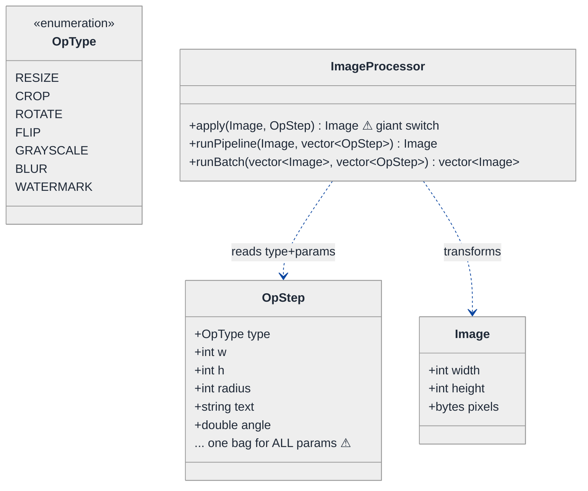
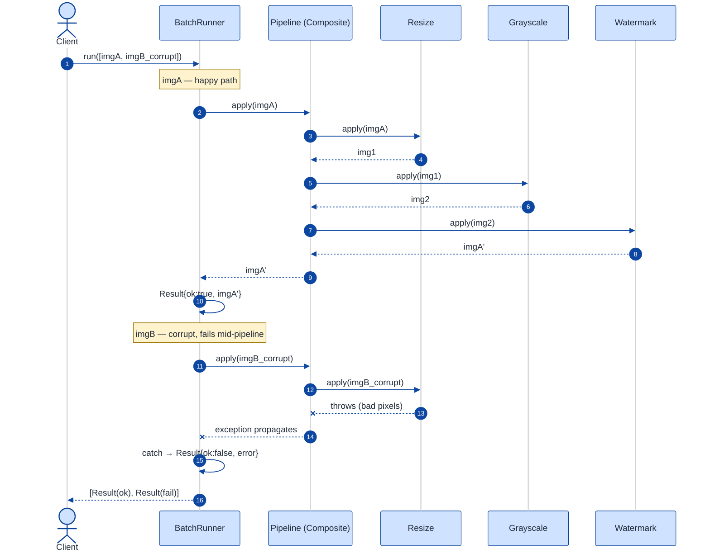

# Image Processing Pipeline — LLD Walkthrough

> **Difficulty:** Medium   |   **Time:** ~40 min   |   **Pattern focus:** Command (+ Composite for macros, + lazy/deferred execution, + Builder for fluent assembly)
>
> **Problem source(s):** LeetLens `78c1aa5d` (Adobe) — see parent [`./EXTRACTED_QUESTIONS.md`](./EXTRACTED_QUESTIONS.md) Seq 1. Also fits `Object_Oriented_Design`.
>
> **Diagrams:** inline mermaid (canonical theme block — light bg, soft pastels, `#0d47a1` navy arrows, no `look: handDrawn`). See [`../../TEMPLATE-v2.md`](../../TEMPLATE-v2.md) diagram convention.

---

## How to use this file

**Reading time:** ~40 minutes if you read the code; ~20 if you skim the diagrams and pivot questions.

**The one lesson:** When a problem says "operations should be **composable**, **lazily evaluated**, and **replayable across single OR batch inputs**," the variability is *the operation as a first-class value* — something you can store, queue, defer, undo, and group. That is the textbook trigger for the **Command pattern**. We will arrive there by watching a naive `switch`-over-an-`enum` design rot under five realistic Adobe-style requirements.

**Map of the file:**

| § | What it covers |
|---|---|
| 1 | Problem statement + clarifying questions |
| 2 | Plain-English restatement |
| 3 | Why this matters |
| 4 | Mental model + domain sketch |
| 5 | Try it yourself first |
| 6 | Entity & verb extraction (nouns → classes, verbs → methods) |
| 7 | Iteration 1: the naive `enum + switch` design (+ class diagram) |
| 8 | Where the naive design hurts — 5 future requirements + pivot questions |
| 9 | Pivot 1: **Command** — operation as a first-class object |
| 10 | Pivot 2: **Composite / Macro Command** — pipelines and batches |
| 11 | Pivot 3: **lazy evaluation + Builder** — defer and fuse the work |
| 12 | Final class diagram (`#fig-class-diagram`) |
| 13 | Skeleton code (C++17 shapes) |
| 14 | Key flow — sequence diagram (`#fig-sequence`) |
| 15 | Extensibility re-check + anti-patterns + think-aloud + self-check |

---

## 1. Problem statement + clarifying questions

**Restated.** Design an image processing pipeline. It must support operations such as **resize, crop, rotate, flip, grayscale, blur, watermark**. Operations must be **composable** (chain them into a pipeline), **lazily evaluated** (build the recipe now, run pixels later), and work on both a **single image** and a **batch** of images.

A senior candidate does NOT start drawing. They ask:

1. **Is the pipeline definition reusable across many images, or built fresh per image?** This decides whether an operation may hold image-specific state. (Assume: a pipeline is *defined once* — "resize→grayscale→watermark" — and applied to many images. Therefore operations must be **stateless w.r.t. the image** and take the image as a parameter.)
2. **What does "lazily evaluated" buy us — deferral, or fusion?** Pure deferral just postpones work. Fusion lets us *merge* adjacent ops (two crops → one crop) before touching pixels. (Assume: we want **deferral now, with a hook for fusion later** — the design must not preclude it.)
3. **Do we need undo/redo, or only forward application?** Undo turns this into an editor (the sibling Text-Editor question). (Assume: **forward-only application** for the pipeline, but I'll keep `undo()` on the operation interface because it is nearly free and the interviewer flagged Command — see §15.)
4. **Is batch processing just "loop over images," or does it need parallelism / partial-failure handling?** (Assume: batch must report **per-image success/failure** and be **parallelizable** — so a batch result is a vector of outcomes, not a single throw.)
5. **Are operations parameterised (resize *to 800x600*, blur *radius 3*)?** (Assume: **yes** — each operation captures its own parameters at construction time. This is what makes "operation as a value" non-trivial.)
6. **Do operations have ordering/validity constraints** (e.g., watermark must be last)? (Assume: **no hard constraints** in v1; validity is the caller's responsibility, but the design should make a validation hook cheap to add.)

If the interviewer dodges, I state these assumptions out loud and move on.

---

## 2. Plain-English restatement

> We are building the engine behind a "save your edit recipe and apply it to 10,000 photos" feature. The user assembles a recipe — resize, then grayscale, then stamp a watermark — and that recipe is a *thing* we can store, name, reorder, and run later against any image or a whole folder. The hard part is not the pixel math (assume a library does that); the hard part is the **shape of the recipe** so that adding a new operation, or grouping operations, or deferring execution, doesn't force us to rewrite the engine.

---

## 3. Why this matters

This problem is a near-perfect **Command pattern** probe disguised as graphics. The interviewer wants to see whether you recognise that "an operation you can store and replay" is an *object*, not a `case` label. The same shape powers undo/redo stacks, job queues, transactional outboxes, macro recorders, and database migration runners. If you can derive Command here, you can derive it everywhere it hides. The secondary probe is **composition**: can a pipeline of commands itself be a command (Composite)? Getting that recursion right is the difference between a junior and a senior answer.

---

## 4. Mental model + domain sketch

Think of a **conveyor belt in a photo lab**. Each station on the belt does one transformation and hands the photo to the next station. A *recipe card* lists which stations, in which order, with which settings. You can:

- run one photo down the belt,
- run a stack of photos down the same belt,
- swap in a new station type without rebuilding the belt,
- photocopy a recipe card and tweak it.

Domain sketch (not code — boxes and arrows):

```
            ┌──────────── Recipe (Pipeline) ────────────┐
  Image ──▶ │  [Resize 800×600] ▶ [Grayscale] ▶ [Watermark "©"]  │ ──▶ Image'
            └────────────────────────────────────────────┘
                         ▲ same recipe ▼
  Image[] (batch) ──────┘  applied to each, per-image result

  Each [ box ] is an OPERATION: a self-contained, parameterised, replayable unit.
```

The recipe card is the key object. Each `[ box ]` is a parameterised, replayable unit — that is our Command.

---

## 5. Try it yourself first

Before reading on, predict:

1. In a naive design where `applyOperation(img, OpType, params)` is one big `switch`, **how many places change** when product asks for a new "sepia" operation? Count the files/functions.
2. If a pipeline is "a list of operations" and a batch is "a list of images," what is the type of "apply pipeline P to batch B"? Could the *pipeline itself* be treated as a single operation? (This is the Composite insight.)
3. "Lazily evaluated" — where in the call path does the actual pixel work happen if we defer it? What object holds the *intent* between definition time and execution time?

Hold your answers. We'll hit each one.

---

## 6. Entity & verb extraction

Straight from the problem text. **No patterns yet** — just nouns and verbs.

**Nouns → class / field candidates**

| Noun | Becomes | Note |
|---|---|---|
| Image | `Image` class | holds pixel buffer, width, height, channels |
| Operation (resize, crop, rotate, flip, grayscale, blur, watermark) | one type *each*, or one enum? | **this is the design fork** — see §7 vs §9 |
| Pipeline | `Pipeline` class | ordered collection of operations |
| Batch | `Batch` / `vector<Image>` | many images, one pipeline |
| Parameters (800×600, radius 3, "©2026") | per-operation fields | each op captures its own |
| Result / outcome | `Result` | success+image, or failure+error |

**Verbs → method owners**

| Verb | Owner | Signature sketch |
|---|---|---|
| resize / crop / rotate / … | the operation | `Image apply(const Image&)` |
| add operation to pipeline | `Pipeline` | `add(op)` |
| run pipeline on image | `Pipeline` | `Image execute(const Image&)` |
| run pipeline on batch | `Pipeline` / `BatchRunner` | `vector<Result> executeBatch(images)` |
| defer / materialise | `Pipeline` (lazy) | `LazyImage build(img)` then `.materialize()` |
| undo (optional) | the operation | `Image undo(const Image&)` |

Notice the verb table already wants every operation to share **one signature** — `apply(const Image&) -> Image`. That uniformity is the seed of the Command interface, but a beginner won't see it yet. Let's write what they'd write.

---

## 7. Iteration 1: the naive design

What a beginner writes first: an `enum class OpType`, a parameter bag, and one `ImageProcessor::apply` method that `switch`es over the enum.

### Class diagram — iteration 1



### C++ skeleton — iteration 1 (no patterns)

```cpp
#include <vector>
#include <string>
#include <stdexcept>

struct Image {                       // pixel buffer + dims (math elided)
    int width = 0, height = 0;
    std::vector<unsigned char> pixels;
};

enum class OpType { Resize, Crop, Rotate, Flip, Grayscale, Blur, Watermark };

struct OpStep {                      // ONE param bag for every op type ⚠
    OpType  type;
    int     w = 0, h = 0;            // resize / crop
    int     radius = 0;              // blur
    double  angle = 0;               // rotate
    std::string text;                // watermark
    // every new op adds another field here ⚠
};

class ImageProcessor {
public:
    Image apply(const Image& in, const OpStep& step) {
        switch (step.type) {                                // the giant switch ⚠
            case OpType::Resize:    return doResize(in, step.w, step.h);
            case OpType::Crop:      return doCrop(in, step.w, step.h);
            case OpType::Rotate:    return doRotate(in, step.angle);
            case OpType::Flip:      return doFlip(in);
            case OpType::Grayscale: return doGrayscale(in);
            case OpType::Blur:      return doBlur(in, step.radius);
            case OpType::Watermark: return doWatermark(in, step.text);
        }
        throw std::logic_error("unknown op");
    }

    Image runPipeline(const Image& in, const std::vector<OpStep>& steps) {
        Image cur = in;
        for (const auto& s : steps) cur = apply(cur, s);    // eager — runs immediately ⚠
        return cur;
    }

    std::vector<Image> runBatch(const std::vector<Image>& imgs,
                                const std::vector<OpStep>& steps) {
        std::vector<Image> out;
        for (const auto& img : imgs) out.push_back(runPipeline(img, steps));
        return out;                                         // throws abort the whole batch ⚠
    }
private:
    Image doResize(const Image&, int, int);   // pixel math elided
    Image doCrop(const Image&, int, int);
    Image doRotate(const Image&, double);
    Image doFlip(const Image&);
    Image doGrayscale(const Image&);
    Image doBlur(const Image&, int);
    Image doWatermark(const Image&, const std::string&);
};
```

**This works.** It has zero design patterns. It resizes, crops, blurs, batches. Ship it to a demo and it's fine. Now let's see what's wrong with it the moment product comes back with the second sprint.

---

## 8. Where the naive design hurts

Five realistic Adobe-flavoured requirements. For each: the change, the files/lines that bleed, the smell, and a **pivot question** naming the variability axis.

### 8.1 "Add a sepia tone operation."

- **Touch points:** add `Sepia` to `enum OpType` (1); add a `case` in `ImageProcessor::apply` (1); maybe add a tint field to `OpStep` (1); add `doSepia` (1). Every team that `switch`es on `OpType` elsewhere (serialization, UI dropdown) must add a case too.
- **Smell:** **Open/Closed violation.** Adding a behaviour edits existing, tested code instead of adding a new file. The `switch` is a magnet — every new op makes it longer.
- **Pivot question:** *the thing that varies is the operation itself.* How do I make "add an operation" mean "add a class," not "edit a switch"?

> **Mini-refresher: Open/Closed Principle (the O in SOLID).**
> Software entities should be **open for extension, closed for modification.** You should add new behaviour by adding new code (a new class), not by editing code that already works (a `switch`). A long `switch` that grows with every feature is the canonical OCP smell.

### 8.2 "Let users save a recipe and re-apply it tomorrow / send it to a colleague."

- **Touch points:** a recipe is a `vector<OpStep>`. To persist it you serialize the param bag — but `OpStep` is a *union of all possible fields*, so the serializer must know which fields matter for which `type`. Editing a recipe means hand-editing structs. There is no object that says "I am a resize-to-800×600."
- **Smell:** **no first-class operation.** Behaviour and parameters are smeared across an enum + a fat struct. You can't pass "a watermark op" around as a value with a clean identity.
- **Pivot question:** *can an operation, with its parameters baked in, be a standalone object I can store, name, copy, and queue?*

### 8.3 "Group [crop, grayscale] into a reusable 'thumbnail' sub-recipe, and nest it inside bigger pipelines."

- **Touch points:** `runPipeline` takes a flat `vector<OpStep>`. To nest, you'd need `vector<variant<OpStep, vector<OpStep>>>` and recursive flattening in `runPipeline` — a second `switch`, this time on "is it a step or a sub-pipeline?"
- **Smell:** **a pipeline and an operation are different types**, so you can't treat "run the thumbnail recipe" as just another step. No uniformity → recursion gets ugly.
- **Pivot question:** *can a pipeline of operations BE an operation, so nesting is free?* (This is the Composite axis.)

### 8.4 "Don't touch pixels until the user clicks Export — and if they crop then crop again, fuse it into one crop."

- **Touch points:** `runPipeline` is **eager** — it allocates a new `Image` on every step. To defer, you'd thread a "should I run now?" flag through every method, and to fuse you'd special-case adjacent `OpType`s inside the loop. Both bleed into the one method that already holds the giant switch.
- **Smell:** **execution policy is tangled with execution mechanism.** "When to run" and "how to run" live in the same function. No object holds the *deferred intent* between definition and export.
- **Pivot question:** *what object captures the recipe as un-run intent, so I can choose to run it later, or rewrite it before running?*

### 8.5 "Batch of 10,000 photos: keep going if one is corrupt, and report which failed; later, run them in parallel."

- **Touch points:** `runBatch` is a `for` loop that `push_back`s and lets exceptions abort everything. Per-image error capture means wrapping each call in try/catch *inside* the loop; parallelism means the loop body must be a self-contained callable with no shared mutable state.
- **Smell:** **the unit of work is not reified.** "Process image i with recipe R" isn't an object you can hand to a thread pool or wrap with error handling — it's an inlined loop body.
- **Pivot question:** *if "apply recipe R to image i" were a single callable object, could I queue it, retry it, parallelise it, and capture its result uniformly?*

**Reading the axes together:** 8.1/8.2 say *the operation must be a first-class object.* 8.3 says *a group of operations must also be that same kind of object.* 8.4/8.5 say *because it's an object, I can defer it, rewrite it, queue it, and parallelise it.* Three pivots fall out: **Command**, then **Composite over commands**, then **lazy execution + a Builder to assemble them.**

---

## 9. Pivot 1: Command — the operation as a first-class object

The most painful axis (8.1 + 8.2) is *the operation itself varies, and I want to store/replay it as a value.* That is the definition of the Command pattern.

> **Mini-refresher: Command pattern.**
> Encapsulate a request as an **object**. The object bundles the action *and* its parameters behind a uniform interface (typically `execute()`), so callers can store it, queue it, log it, undo it, or compose it — all without knowing what it actually does. The classic GoF roles: **Command** (interface), **ConcreteCommand** (Resize, Blur, …), **Receiver** (the thing acted on — here the `Image`/pixel library), **Invoker** (whoever calls `execute`, here the `Pipeline`).

We replace the enum + switch with one interface and one class per operation. Parameters are captured in the constructor — that is the "request frozen as an object" move.

```cpp
// The Command interface. One operation = one object that knows how to apply itself.
class ImageOp {
public:
    virtual ~ImageOp() = default;
    virtual Image apply(const Image& in) const = 0;   // the "execute" of Command
    virtual std::string name() const = 0;             // for logging / serialization
    // optional inverse for editor-style undo (see §15):
    virtual bool reversible() const { return false; }
    virtual Image undo(const Image& in) const { return in; }
};

// ConcreteCommand: parameters baked in at construction. No image-specific state.
class Resize : public ImageOp {
public:
    Resize(int w, int h) : w_(w), h_(h) {}
    Image apply(const Image& in) const override;       // pixel math elided
    std::string name() const override { return "Resize(" + std::to_string(w_)
                                             + "x" + std::to_string(h_) + ")"; }
private:
    int w_, h_;
};

class Blur : public ImageOp {
public:
    explicit Blur(int radius) : radius_(radius) {}
    Image apply(const Image& in) const override;       // elided
    std::string name() const override { return "Blur(r=" + std::to_string(radius_) + ")"; }
private:
    int radius_;
};

class Watermark : public ImageOp {
public:
    explicit Watermark(std::string text) : text_(std::move(text)) {}
    Image apply(const Image& in) const override;       // elided
    std::string name() const override { return "Watermark"; }
private:
    std::string text_;
};
// Crop, Rotate, Flip, Grayscale, Sepia … each its own class. // elided
```

**Re-check the §8.1 pain:** adding Sepia is now *one new file* (`class Sepia : public ImageOp`). The engine never changes. OCP satisfied. **Re-check §8.2:** a recipe is now `vector<unique_ptr<ImageOp>>` — each element is a real object with a `name()` identity, trivially iterable for serialization (each op serializes its own fields; no central switch).

> **Pattern-discrimination cheatsheet — Command vs Strategy.**
> - *Strategy:* swaps **how one step is done** and is usually held **once** by a context that calls it (e.g., a `CompareStrategy` inside a `Sorter`). You don't queue strategies; you pick one.
> - *Command:* turns **a request into a storable object** you collect, queue, log, undo, and replay. The point is the *list of them over time*, not picking one.
> - *Rule of thumb:* if you keep a **list/stack/queue of them** (pipeline, undo stack, job queue) → Command. If a context holds exactly **one swappable algorithm** → Strategy. Here we keep an ordered *list* of ops → Command.

> **Pattern-discrimination cheatsheet — Command vs Chain of Responsibility.**
> - *Chain of Responsibility:* each handler decides **whether to handle or pass on**; usually exactly one handler acts; handlers don't all run.
> - *Command:* every command in the pipeline runs, in order; none "declines." There's no handle-or-pass decision.
> - *Rule of thumb:* "all of them run, in sequence" → Command pipeline. "first one that matches handles it" → Chain of Responsibility. Our resize→grayscale→watermark all run → Command, not CoR.

---

## 10. Pivot 2: Composite — a pipeline of commands IS a command

The §8.3 axis: *group operations into a reusable sub-recipe and nest it.* If `Pipeline` and `ImageOp` were different types, nesting needs special-casing. So we make **`Pipeline` itself an `ImageOp`.** That is the Composite pattern applied to Command (a "Macro Command").

> **Mini-refresher: Composite pattern.**
> Compose objects into **tree structures** and let clients treat **individual objects and compositions uniformly** through a shared interface. A `Leaf` and a `Composite` both implement the same interface; the `Composite` holds children of that interface and, in each operation, delegates to its children. The win: recursion is free and the client never branches on "leaf or group?"

```cpp
// Pipeline IS-A ImageOp (Composite / Macro Command).
// So a pipeline can be nested inside another pipeline with zero special-casing.
class Pipeline : public ImageOp {
public:
    Pipeline& add(std::unique_ptr<ImageOp> op) {        // fluent: returns *this
        ops_.push_back(std::move(op));
        return *this;
    }
    Image apply(const Image& in) const override {       // run children in order
        Image cur = in;
        for (const auto& op : ops_) cur = op->apply(cur);
        return cur;
    }
    std::string name() const override {
        std::string s = "Pipeline[";
        for (const auto& op : ops_) s += op->name() + ",";
        return s + "]";
    }
    const std::vector<std::unique_ptr<ImageOp>>& steps() const { return ops_; }
private:
    std::vector<std::unique_ptr<ImageOp>> ops_;          // children are ImageOps — leaf OR pipeline
};
```

**Re-check §8.3:** a "thumbnail" sub-recipe is just a `Pipeline`. Nesting it inside a bigger pipeline is `big.add(std::move(thumbnail))` — because a `Pipeline` *is* an `ImageOp`. No recursive flattening, no `variant`, no second switch. The tree handles arbitrary depth for free.

> **Pattern-discrimination cheatsheet — Composite vs Decorator.**
> - *Composite:* a node holds **many children** of the interface and aggregates them (a *tree*); structural grouping. Our `Pipeline` holds N ops.
> - *Decorator:* a wrapper holds **exactly one** wrapped object and adds behaviour around it (a *chain*); each layer = one extra responsibility (e.g., a `Timed(op)` that logs duration around any op).
> - *Rule of thumb:* "a group of N treated as one" → Composite. "wrap one to augment it" → Decorator. (We could *also* use Decorator for cross-cutting concerns like timing/caching per op — orthogonal to the Composite, mentioned in §15.)

---

## 11. Pivot 3: lazy evaluation + Builder

Two §8 axes remain: **defer/fuse** (8.4) and **reified, parallelisable batch unit** (8.5). Because every operation (and every pipeline) is now a Command object, both become small additions rather than surgery.

### 11.1 Lazy evaluation — separate intent from execution

The Command objects already *are* the deferred intent: building a `Pipeline` allocates zero pixels. Eagerness lived only in *calling* `apply`. So lazy evaluation is just "hold the pipeline + the input, run on demand."

```cpp
// A thunk: holds the recipe (Command tree) + input, runs only when forced.
class LazyImage {
public:
    LazyImage(const Pipeline& p, Image src) : p_(p), src_(std::move(src)) {}
    const Image& materialize() {                 // forces the computation, memoizes
        if (!done_) { cached_ = p_.apply(src_); done_ = true; }
        return cached_;
    }
private:
    const Pipeline& p_;
    Image  src_;
    Image  cached_;
    bool   done_ = false;
};
```

Because the recipe is a tree of Command objects, **fusion** (8.4's "two crops → one crop") becomes an *optimization pass over the tree* (walk `pipeline.steps()`, fold adjacent compatible ops) — a separate visitor, not a change to any operation. The design doesn't preclude it; that was clarifying-question #2's whole point. (Optimizer itself // elided.)

> **Mini-refresher: lazy evaluation, in OO terms.**
> Don't compute a value until something *forces* it. The trick is to keep an **object that represents the un-run computation** (here `LazyImage` wrapping a Command tree) and a single `materialize()`/`force()` that runs it once and caches the result. Command makes this natural: the command IS the suspended computation.

### 11.2 Builder — fluent, validated assembly

Assembling `vector<unique_ptr<ImageOp>>` by hand is noisy and easy to get wrong (e.g., watermark-not-last per clarifying-Q6). A Builder gives a readable API and a single place for validation.

> **Mini-refresher: Builder pattern.**
> Separate the **construction** of a complex object from its representation, via a fluent step-by-step API that returns a finished product on `build()`. Avoids telescoping constructors and gives one chokepoint for invariants/validation.

```cpp
class PipelineBuilder {
public:
    PipelineBuilder& resize(int w, int h)   { return add(std::make_unique<Resize>(w, h)); }
    PipelineBuilder& blur(int r)            { return add(std::make_unique<Blur>(r)); }
    PipelineBuilder& grayscale()            { return add(std::make_unique<Grayscale>()); }
    PipelineBuilder& watermark(std::string t){ return add(std::make_unique<Watermark>(std::move(t))); }
    PipelineBuilder& nest(std::unique_ptr<Pipeline> sub) { return add(std::move(sub)); }

    std::unique_ptr<Pipeline> build() {
        // single chokepoint for validation hooks (e.g., watermark-last). // elided
        return std::move(p_);
    }
private:
    PipelineBuilder& add(std::unique_ptr<ImageOp> op) { p_->add(std::move(op)); return *this; }
    std::unique_ptr<Pipeline> p_ = std::make_unique<Pipeline>();
};
```

### 11.3 Batch — reify the unit of work

§8.5 wanted "apply recipe R to image i" as a single callable so it can be queued, error-wrapped, and parallelised. Command already gives us that: a `Pipeline*` plus an image *is* a callable unit. The `BatchRunner` wraps each in try/catch and returns a per-image result vector (trivially swappable for a thread pool).

```cpp
struct Result {
    bool ok = false;
    Image image;            // valid iff ok
    std::string error;      // valid iff !ok
};

class BatchRunner {
public:
    explicit BatchRunner(const Pipeline& p) : p_(p) {}
    std::vector<Result> run(const std::vector<Image>& imgs) const {
        std::vector<Result> out;
        out.reserve(imgs.size());
        for (const auto& img : imgs) {                 // swap for parallel_for later
            try   { out.push_back({true, p_.apply(img), ""}); }
            catch (const std::exception& e) { out.push_back({false, {}, e.what()}); }
        }
        return out;                                    // one corrupt image no longer aborts the batch
    }
private:
    const Pipeline& p_;     // same recipe, applied to every image (clarifying-Q1)
};
```

> **Pattern-discrimination cheatsheet — Command vs plain `std::function`.**
> - A `std::function<Image(const Image&)>` *could* hold each op. Why a class hierarchy instead?
> - *Because* we need more than `execute`: `name()` for logging/serialization, `reversible()`/`undo()`, and a stable type to nest in Composite and to walk for fusion. `std::function` erases all that. When a request needs **metadata + multiple operations (run/undo/describe)**, use Command; when it's *only* "call this once," a lambda is fine.

---

## <a id="fig-class-diagram"></a>12. Final class diagram



```mermaid
---
config:
  theme: neutral
  themeVariables:
    background: '#ffffff'
    primaryColor: '#cfe2ff'
    primaryTextColor: '#1f2937'
    primaryBorderColor: '#084298'
    secondaryColor: '#fff3cd'
    secondaryTextColor: '#1f2937'
    secondaryBorderColor: '#664d03'
    tertiaryColor: '#d1e7dd'
    tertiaryTextColor: '#1f2937'
    tertiaryBorderColor: '#0a3622'
    lineColor: '#0d47a1'
    textColor: '#1f2937'
    noteBkgColor: '#fff3cd'
    noteTextColor: '#1f2937'
    noteBorderColor: '#997404'
    actorBkg: '#cfe2ff'
    actorBorder: '#084298'
    actorTextColor: '#1f2937'
    signalColor: '#0d47a1'
    signalTextColor: '#1f2937'
    labelBoxBkgColor: '#ffffff'
    labelBoxBorderColor: '#d3d3d3'
    labelTextColor: '#1f2937'
    edgeLabelBackground: '#ffffff'
    labelBackground: '#ffffff'
    classText: '#1f2937'
    fontFamily: 'system-ui, -apple-system, Segoe UI, Helvetica, Arial, sans-serif'
---
classDiagram
  class ImageOp {
    <<interface>>
    +apply(Image) Image
    +name() string
    +reversible() bool
    +undo(Image) Image
  }
  class Resize {
    -int w
    -int h
    +apply(Image) Image
  }
  class Blur {
    -int radius
    +apply(Image) Image
  }
  class Grayscale {
    +apply(Image) Image
  }
  class Watermark {
    -string text
    +apply(Image) Image
  }
  class Pipeline {
    -vector~ImageOp~ ops
    +add(ImageOp) Pipeline
    +apply(Image) Image
    +steps() vector~ImageOp~
  }
  class PipelineBuilder {
    +resize(w,h) PipelineBuilder
    +blur(r) PipelineBuilder
    +grayscale() PipelineBuilder
    +watermark(t) PipelineBuilder
    +nest(Pipeline) PipelineBuilder
    +build() Pipeline
  }
  class LazyImage {
    -Pipeline p
    -Image src
    -Image cached
    +materialize() Image
  }
  class BatchRunner {
    -Pipeline p
    +run(vector~Image~) vector~Result~
  }
  class Result {
    +bool ok
    +Image image
    +string error
  }
  class Image {
    +int width
    +int height
    +bytes pixels
  }

  ImageOp <|.. Resize
  ImageOp <|.. Blur
  ImageOp <|.. Grayscale
  ImageOp <|.. Watermark
  ImageOp <|.. Pipeline : Composite (Pipeline IS-A ImageOp)
  Pipeline o-- ImageOp : children (leaf or nested Pipeline)
  PipelineBuilder ..> Pipeline : builds
  LazyImage --> Pipeline : holds recipe
  BatchRunner --> Pipeline : applies per image
  BatchRunner ..> Result : returns
  ImageOp ..> Image : transforms
```

**Reading guide (1/2).** The spine is `ImageOp` — the Command interface every concrete operation implements. `Resize`, `Blur`, `Grayscale`, `Watermark` (and Crop/Rotate/Flip/Sepia, elided) are leaf Commands with their parameters baked in. The key relationship is the open diamond from `Pipeline` to `ImageOp`: `Pipeline` *aggregates* a list of `ImageOp` children, **and** `Pipeline` itself realises `ImageOp` — that dual role (the `<|..` realization plus the `o--` aggregation) is the Composite, and it's why a pipeline can contain another pipeline.

**Reading guide (2/2).** Around the core sit three convenience collaborators, none of which the operations know about: `PipelineBuilder` (fluent assembly + validation chokepoint), `LazyImage` (holds a recipe + input and runs once on `materialize()`), and `BatchRunner` (applies one recipe across many images, returning a `Result` per image so one failure can't abort the batch). Each was a §8 pain point dissolved by treating the operation as a first-class object.

---

## 13. Skeleton code (C++17 shapes)

Interfaces + one or two concretes per pattern. Bodies are `// elided` — the point is the *shape*, not the pixel math.

```cpp
#include <memory>
#include <string>
#include <vector>

struct Image { int width = 0, height = 0; std::vector<unsigned char> pixels; };

// ---- Command interface ----
class ImageOp {
public:
    virtual ~ImageOp() = default;
    virtual Image apply(const Image& in) const = 0;
    virtual std::string name() const = 0;
    virtual bool  reversible() const { return false; }
    virtual Image undo(const Image& in) const { return in; }
};

// ---- ConcreteCommands (params frozen at construction) ----
class Resize : public ImageOp {
public:
    Resize(int w, int h) : w_(w), h_(h) {}
    Image apply(const Image& in) const override;     // elided
    std::string name() const override { return "Resize"; }
private: int w_, h_;
};

class Watermark : public ImageOp {
public:
    explicit Watermark(std::string t) : text_(std::move(t)) {}
    Image apply(const Image& in) const override;     // elided
    std::string name() const override { return "Watermark"; }
private: std::string text_;
};
// Crop, Rotate, Flip, Grayscale, Blur, Sepia … each its own class. // elided

// ---- Composite (Macro Command): a Pipeline IS-A ImageOp ----
class Pipeline : public ImageOp {
public:
    Pipeline& add(std::unique_ptr<ImageOp> op) { ops_.push_back(std::move(op)); return *this; }
    Image apply(const Image& in) const override {
        Image cur = in;
        for (const auto& op : ops_) cur = op->apply(cur);
        return cur;
    }
    std::string name() const override { return "Pipeline"; }
    const std::vector<std::unique_ptr<ImageOp>>& steps() const { return ops_; }
private:
    std::vector<std::unique_ptr<ImageOp>> ops_;
};

// ---- Builder (fluent assembly + validation chokepoint) ----
class PipelineBuilder {
public:
    PipelineBuilder& resize(int w, int h)    { return add(std::make_unique<Resize>(w, h)); }
    PipelineBuilder& watermark(std::string t){ return add(std::make_unique<Watermark>(std::move(t))); }
    PipelineBuilder& nest(std::unique_ptr<Pipeline> sub) { return add(std::move(sub)); }
    std::unique_ptr<Pipeline> build() { /* validate invariants // elided */ return std::move(p_); }
private:
    PipelineBuilder& add(std::unique_ptr<ImageOp> op) { p_->add(std::move(op)); return *this; }
    std::unique_ptr<Pipeline> p_ = std::make_unique<Pipeline>();
};

// ---- Lazy thunk: recipe + input, forced once ----
class LazyImage {
public:
    LazyImage(const Pipeline& p, Image src) : p_(p), src_(std::move(src)) {}
    const Image& materialize() { if (!done_) { cached_ = p_.apply(src_); done_ = true; } return cached_; }
private:
    const Pipeline& p_; Image src_, cached_; bool done_ = false;
};

// ---- Batch runner: per-image Result, parallel-ready ----
struct Result { bool ok = false; Image image; std::string error; };

class BatchRunner {
public:
    explicit BatchRunner(const Pipeline& p) : p_(p) {}
    std::vector<Result> run(const std::vector<Image>& imgs) const {
        std::vector<Result> out; out.reserve(imgs.size());
        for (const auto& img : imgs) {
            try   { out.push_back({true, p_.apply(img), ""}); }
            catch (const std::exception& e) { out.push_back({false, {}, e.what()}); }
        }
        return out;
    }
private:
    const Pipeline& p_;
};

// ---- Usage ----
// auto recipe = PipelineBuilder().resize(800,600).grayscale().watermark("(c)2026").build();
// Image one  = recipe->apply(src);                 // single, eager
// LazyImage lz(*recipe, src); auto& out = lz.materialize();  // deferred
// auto results = BatchRunner(*recipe).run(folder);  // batch, per-image results
```

---

## <a id="fig-sequence"></a>14. Key flow — sequence diagram

Batch export of two images through `resize → grayscale → watermark`, one of which is corrupt.



**What the patterns HIDE from the caller.** The `Client` calls `run` once and gets a clean `vector<Result>` back — it never sees that `Pipeline` is a *Composite* recursing through three Command objects, nor that one image threw mid-chain. The Command interface hides *what each step does*; the Composite hides *how many steps there are and how deep they nest*; the `BatchRunner` hides *iteration and error isolation*. Swapping `resize→grayscale→watermark` for a 12-step nested recipe changes nothing in this diagram's `Client` lane — that invariance is the whole payoff.

---

## 15. Extensibility re-check + anti-patterns + how to think aloud + self-check

### 15.1 Extensibility re-check (re-run the §8 pains against the final design)

| §8 requirement | Naive cost | Final-design cost |
|---|---|---|
| 8.1 Add Sepia | edit enum + switch + struct + every external switch | **1 new file** (`class Sepia : public ImageOp`) |
| 8.2 Save/share recipe | serialize a fat union struct, switch on type | iterate `Pipeline.steps()`; each op serializes itself via `name()`/own fields |
| 8.3 Nest a sub-recipe | `variant` + recursive flatten + 2nd switch | `builder.nest(thumbnail)` — Pipeline IS-A ImageOp |
| 8.4 Defer + fuse | thread a flag through every method | `LazyImage`; fusion = a visitor over `steps()` |
| 8.5 Resilient/parallel batch | inline try/catch, abort on throw | `BatchRunner` returns per-image `Result`; loop → parallel_for |

Genuinely new asks the design absorbs cheaply: **undo/redo** (the `reversible()`/`undo()` hooks already on `ImageOp` + an undo stack of applied commands — this is exactly the sibling Text-Editor question); **per-op timing/caching** via a `Decorator` (`class Timed : public ImageOp` wrapping one op); **operation registry / deserialization** via a `Factory` keyed on `name()`.

### 15.2 Named anti-patterns to avoid

- **God `switch` / type-code:** the original `switch (step.type)` — every new op edits tested code (OCP violation). Killed by Command.
- **Fat parameter bag:** one `OpStep` struct holding every possible field for every op — most fields unused per instance, no type safety. Killed by per-op constructors.
- **Stateful operation:** letting an op cache the specific image it last processed. Breaks reuse across a batch (clarifying-Q1). Ops must be stateless w.r.t. the image.
- **Anemic Composite:** making `Pipeline` *not* an `ImageOp` and special-casing nesting. Reintroduces the very branching Composite removes.
- **`std::function` everywhere:** erasing the op's type loses `name()`, `undo()`, and the ability to walk the tree for fusion. Use Command when you need metadata + multiple verbs per request.

### 15.3 How to think aloud (interview narration)

> "Operations are composable, replayable, deferrable, batchable — so the *operation itself* is the thing that varies and that I want to store as a value. That's Command: one `ImageOp` interface, one class per operation, parameters frozen in the constructor. Adding a new op becomes adding a file, not editing a switch — Open/Closed. Then: a *group* of operations should be reusable and nestable, so I make `Pipeline` implement `ImageOp` too — that's Composite, and nesting becomes free. Lazy eval falls out because the Command tree already *is* deferred intent; I just wrap it in a `LazyImage` thunk that forces once. Batch becomes a runner that applies the same recipe per image and returns a per-image `Result`, so one corrupt file doesn't abort the run, and the loop is trivially parallelisable later. I'd reach for a Builder for fluent, validated assembly. If undo were required, the `undo()` hook on the interface plus an applied-command stack gives it almost for free."

### 15.4 Self-check

> **Self-check — the question to ask next time.**
>
> When you see "design a system of **operations** that are composable / replayable / queueable / undoable," before reaching for an `enum` + `switch`, ask:
>
> > **"Do I keep these operations around as a list/stack/queue over time (store, replay, undo, batch)? And should a *group* of them be usable wherever a single one is?"**
>
> First yes → **Command** (operation as a first-class object). Second yes → **Composite** over those commands (a pipeline IS a command). Deferral then falls out for free, because a command already is suspended computation. If instead a context holds exactly one swappable algorithm, that's **Strategy**, not Command.

---

## Cross-references

- **Parent topic manifest:** [`./EXTRACTED_QUESTIONS.md`](./EXTRACTED_QUESTIONS.md)
- **Vertical overview:** [`../../LEARNING.md`](../../LEARNING.md)
- **Template:** [`../../TEMPLATE-v2.md`](../../TEMPLATE-v2.md)
- **Canonical LLD exemplar:** [`../Object_Oriented_Design/Parking_Lot.md`](../Object_Oriented_Design/Parking_Lot.md)
- **Related v2 walkthroughs (same bucket, Command pattern):** `./Chess_Game.md` (Command + polymorphism), `./Text_Editor.md` (Command + Memento + rope — where the `undo()` hook becomes central)
- **Optional editable diagrams:** sibling `.excalidraw` files (supplementary, not required)
