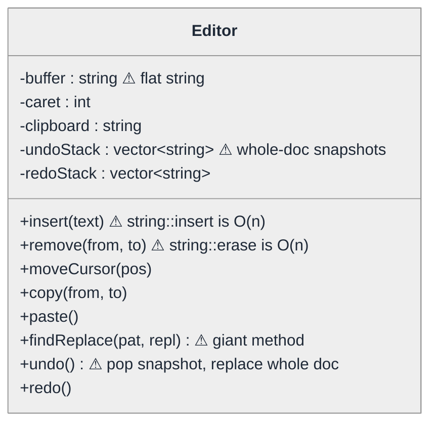
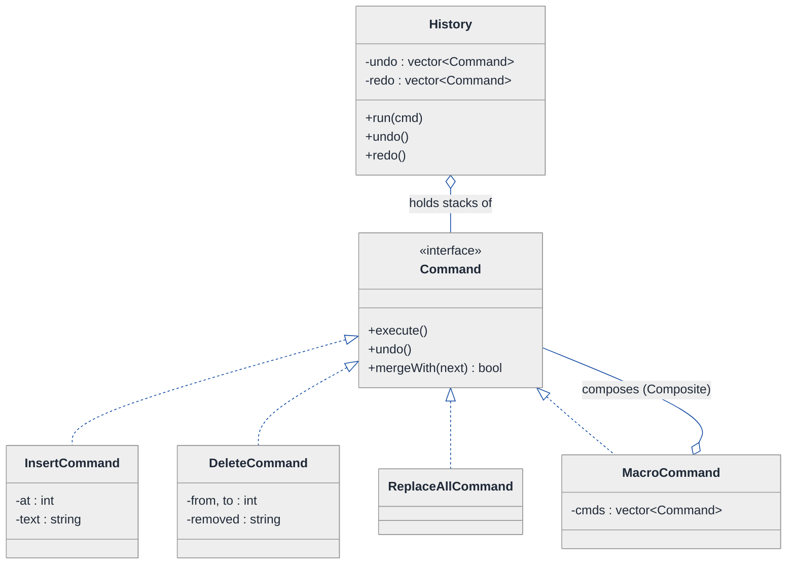
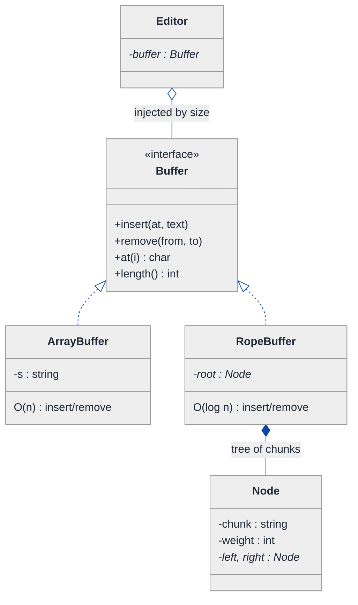
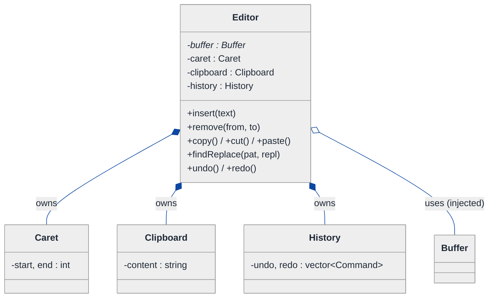
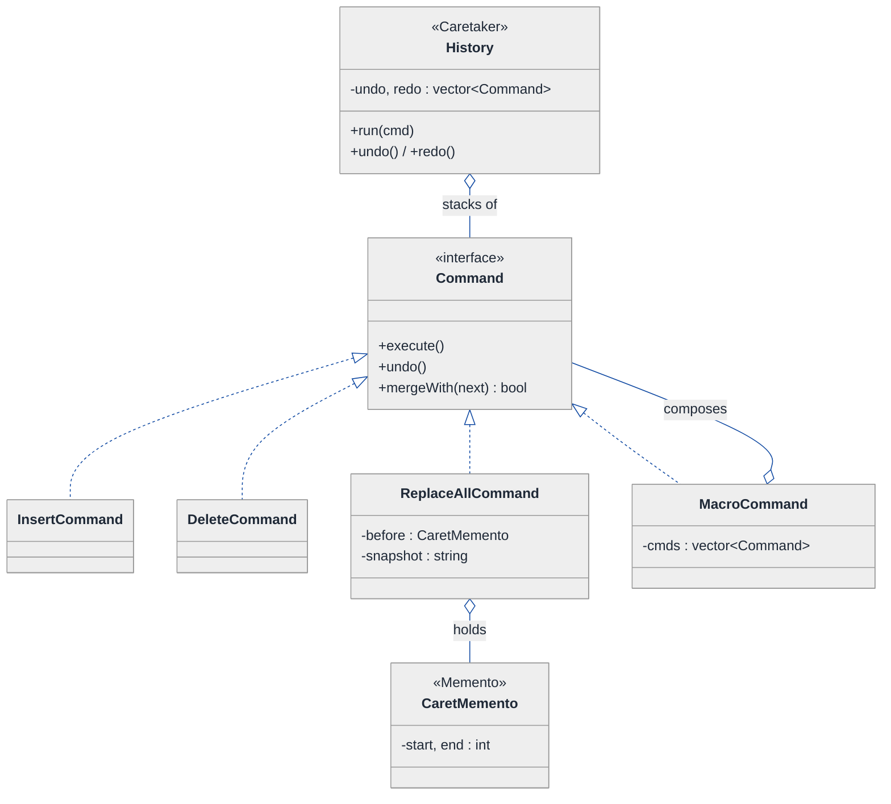
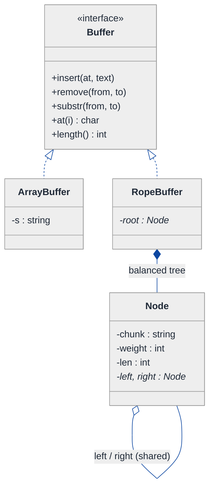
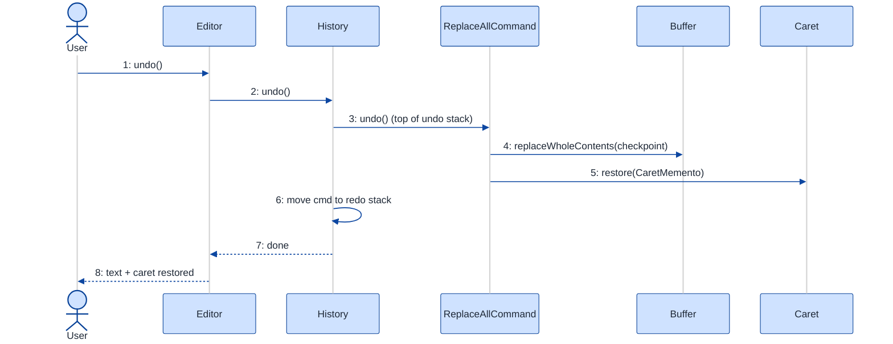

# Text Editor — LLD Walkthrough

> **Difficulty:** Hard · **Time:** ~45 min · **Pattern focus:** Command (undo/redo + macros) + Memento (snapshot/restore) + Rope (the text buffer data structure)
>
> **Problem source(s):** GID `CM3` in the `Command_Pattern` bucket of [`./EXTRACTED_QUESTIONS.md`](./EXTRACTED_QUESTIONS.md). A canonical Hard LLD question — it forces you to defend a *data structure* choice AND a *behavioral pattern* choice in the same breath.
>
> **Diagrams:** inline mermaid (renders natively in GitHub / VS Code). Optional editable freehand sources are sibling `.excalidraw` files.

---

## How to use this file

Paced for a candidate seeing the text-editor question for the first time. Reading time: ~45 minutes if you sketch each iteration by hand. **The lesson: a text editor question is two problems wearing one trench-coat — (a) what data structure stores the text so insert/delete are cheap, and (b) how do operations become reversible. Don't answer either with a reflex. DERIVE the rope by watching a flat string melt under large-file edits, and DERIVE Command + Memento by watching a hardcoded undo-stack collapse under the third feature request.**

**Map of this file (15 sections):**

1. Problem statement + clarifying questions
2. Plain-English restatement
3. Why this matters
4. Mental model
5. Try it yourself first
6. Entity & verb extraction
7. **Iteration 1: the naive design** — a flat string + an op-log
8. **Where the naive design hurts** — five future requirements, one painful diff each
9. **Pivot 1: Command for every edit** — make operations first-class + reversible
10. **Pivot 2: Memento for snapshot/restore** — when inverse-by-hand gets dangerous
11. **Pivot 3: the Rope buffer** — fix the O(n) data-structure axis
12. Final UML class diagram
13. Skeleton code (C++)
14. Key flow — sequence diagram
15. Extensibility re-check + anti-patterns + how to think aloud + self-check

---

## 1. Problem statement + clarifying questions

**Prompt (typical phrasing):** "Design a text editor supporting insert, delete, cursor movement, undo/redo, copy/paste, and find/replace. Use appropriate data structures for efficient text manipulation."

**Clarifying questions to ask BEFORE drawing anything:**

1. **Document size?** Are we editing a 200-character note, or a 2-GB log file? This decides the buffer data structure outright — a flat `std::string` is fine for the first, catastrophic for the second.
2. **Undo/redo depth?** Unlimited history, or a bounded ring (last N operations)? Bounded depth changes how aggressively we can keep memory-heavy snapshots.
3. **Granularity of undo?** Does one undo revert a single character, or a whole "typing burst" / a whole find-replace-all? (Most editors coalesce keystrokes.)
4. **Multiple cursors / selections?** One caret, or VS-Code-style multi-cursor? Is cursor position itself part of the undo state?
5. **Find/replace scope?** Literal substring only, or regex? Replace-one vs replace-all? Case sensitivity toggle?
6. **Persistence / collaboration?** Single-user in-memory, or do we need save/load and (eventually) real-time collaborative editing? (The latter pushes toward operation-based CRDTs — out of scope today, but worth naming.)
7. **Concurrency?** Single editing thread, or background syntax-highlighting / autosave threads reading the buffer?

**Assumptions if interviewer dodges:** potentially large documents (so the buffer must scale), unlimited undo with keystroke coalescing, a single caret whose position is restorable, literal + regex find/replace with replace-all, single-user in-memory with a save hook, single editing thread (we discuss concurrency in §15).

---

## 2. Plain-English restatement

We're building the engine behind a text editor — not the GUI, the *model*. It holds the document's characters, tracks where the caret is, and applies edits (insert, delete, paste, replace). Crucially, **every edit must be undoable and redoable**, and the operations must stay fast even when the document is large. The design must let us add new kinds of edits (say, "uppercase the selection" or "auto-indent") and new history behaviors (coalescing, bounded depth) **without rewriting the core edit loop**.

---

## 3. Why this matters

This question separates candidates who memorized "use the Command pattern for undo" from those who can *justify* it against a flat op-log AND defend a buffer data structure in the same answer. It probes three skills at once: choosing a data structure under asymptotic pressure (rope vs string vs gap buffer), making behavior reversible without scattering inverse-logic everywhere (Command + Memento), and recognizing when two patterns *compose* (a macro command IS a command). It reappears any time you build something with an audit trail, an undo stack, or replayable actions — spreadsheets, drawing tools, transaction logs, event-sourced systems.

---

## 4. Mental model

A text editor is a **mutable buffer of characters** plus a **caret** plus a **time machine**. The buffer is inventory. The caret is a position. The time machine is a pair of stacks: "things I did" and "things I undid." Each entry on those stacks is not *data* — it's an *action that knows how to undo itself*.

```
Real-world sketch (NOT a UML diagram yet):

   Document buffer:  "The quick brown fox"
                              ▲ caret at index 10
                              │
        ┌─────────────────────┴─────────────────────┐
        │  insert("very ") at 10                      │ ← an ACTION,
        │  delete(4..9)                               │   not a string.
        │  replaceAll("fox","dog")                    │   It can apply
        └─────────────────────────────────────────────┘   AND reverse itself.

   Undo stack (done):   [insert] [delete] [replaceAll]   ← top = most recent
   Redo stack (undone): [ ]                               ← refilled on undo
```

The KEY insight from this picture: the things on the stacks are not snapshots of text and not raw strings — they are **reversible verbs**. Once "an edit is an object that can do and undo itself" clicks, undo/redo, macros, and a scriptable command palette all fall out of the same abstraction. The buffer choice is a *separate* axis — efficiency of insert/delete — that we solve independently.

---

## 5. Try it yourself first

> **Predict before reading on:**
>
> 1. List 4 nouns you'd promote to a class. Which "noun" (hint: it's really a verb) is the one most people miss?
> 2. **If undo must revert a `replaceAll("fox","dog")` that hit 300 places, would you store the inverse operation, or store a snapshot of the before-text? What's the tradeoff?**
> 3. You type 5,000 characters at the front of a 100-MB file held in a `std::string`. How many bytes get shuffled per keystroke, and what's that cost over 5,000 keystrokes?

---

## 6. Entity & verb extraction

> **Mini-refresher: noun → class, but not every noun. And watch for verbs that want to be nouns.**
>
> Naive OOD promotes every noun to a class. Senior OOD promotes a noun only if it has BEHAVIOR and STATE that belong together. The twist in *this* problem: the most important class comes from a **verb** — "edit." An edit looks like an action, but to support undo it must become a thing you can hold, stack, and reverse. Promoting a verb to an object is exactly the Command pattern (we derive it in §9).

**Nouns from the prompt:**

| Noun | Decision | Why |
|---|---|---|
| Document / Editor | Class (top-level coordinator) | Owns the buffer, the caret, the history; exposes the public API |
| Buffer (text storage) | Class (abstract behind an interface) | The data-structure axis; swappable (string → rope) |
| Caret / Cursor | Class (or small struct) | Has a position + selection range; restorable |
| Clipboard | Class (or field) | Holds copied text for paste |
| History / UndoManager | Class | Owns the done/undone stacks |
| Character / Text | Library type (`std::string` fragments) | No behavior of its own |
| Selection range | Field on Caret (`{start, end}`) | A pair of indices, not a class |

**Verbs (and the class they live on — naive answer, we'll re-examine):**

| Verb | Owner class (naive — re-examined in §9) |
|---|---|
| insert(text) | Editor, mutating Buffer |
| delete(range) | Editor, mutating Buffer |
| moveCursor(pos) | Caret |
| copy() / cut() / paste() | Editor + Clipboard |
| findReplace(pat, repl) | Editor |
| undo() / redo() | Editor / History |

**We have NOT introduced any design patterns yet.** Pure nouns + verbs. Notice already that `insert`, `delete`, `paste`, and `findReplace` all share a shape: "mutate the buffer, and we'll want to take it back later." Hold that thought.

---

## 7. <a id="iter-1"></a>Iteration 1: the naive design

Let's write the simplest thing that could possibly work. No design patterns — a `std::string` buffer, a caret index, and an undo stack of *snapshots* (copy the whole document before each edit). A beginner reaches for this because it's obviously correct.



**Reader's tour (read top to bottom; ~60 seconds).**

1. **One class, `Editor`, holds everything.** The buffer (`std::string`), the caret (an `int` index), the clipboard, and two stacks of *whole-document snapshots*. There is exactly ONE object and a pile of methods. No collaborators, no interfaces.

2. **Undo works by brute force.** Before each mutating method, push a full copy of `buffer` onto `undoStack`. To undo, pop a snapshot and overwrite `buffer` wholesale. This is genuinely correct — and it's why beginners love it. It also has zero design patterns.

3. **The four warning markers (⚠) are the trouble zones:**
   - `buffer : string` — a flat contiguous string. `insert`/`erase` in the middle are O(n) because everything after the edit point shifts.
   - `undoStack : vector<string>` — each entry is a full copy of the document. Undo memory is O(history × docSize).
   - `findReplace(...)` — one giant method doing scan + match + splice + record-undo, all inline.
   - `undo()` — replaces the whole document on every undo, even if the edit touched one character.

4. **The caret is an afterthought.** It's a bare `int`. Notice it is NOT saved in the snapshot — so undo restores the text but leaves the caret wherever it happened to be. That bug is invisible at this size and becomes a §8 requirement.

**What's deliberately missing.** No notion of an "operation" as an object. No `Command`. No `Memento`. No buffer abstraction — the data structure is welded into `Editor`. The naive design doesn't even *acknowledge* that "kinds of edit," "how undo stores history," and "how text is stored" are three independent axes. It bakes one answer for each into one class.

Skeleton code for the naive design (C++):

```cpp
#include <string>
#include <vector>
#include <stdexcept>

class Editor {
public:
    void insert(const std::string& text) {
        undoStack_.push_back(buffer_);          // snapshot WHOLE doc — O(n) copy
        redoStack_.clear();
        buffer_.insert(caret_, text);           // std::string::insert — O(n) shift
        caret_ += text.size();
    }

    void remove(int from, int to) {             // [from, to)
        undoStack_.push_back(buffer_);
        redoStack_.clear();
        buffer_.erase(from, to - from);         // O(n) shift
        caret_ = from;
    }

    void copy(int from, int to) { clipboard_ = buffer_.substr(from, to - from); }
    void paste() { insert(clipboard_); }

    void findReplace(const std::string& pat, const std::string& repl) {
        undoStack_.push_back(buffer_);
        redoStack_.clear();
        size_t pos = 0;                          // scan + splice inline — O(n*m)
        while ((pos = buffer_.find(pat, pos)) != std::string::npos) {
            buffer_.replace(pos, pat.size(), repl);
            pos += repl.size();
        }
    }

    void undo() {
        if (undoStack_.empty()) return;
        redoStack_.push_back(buffer_);
        buffer_ = undoStack_.back();             // restore WHOLE doc
        undoStack_.pop_back();
        // NOTE: caret_ is NOT restored — silent bug
    }

    void redo() {
        if (redoStack_.empty()) return;
        undoStack_.push_back(buffer_);
        buffer_ = redoStack_.back();
        redoStack_.pop_back();
    }

private:
    std::string              buffer_;
    int                      caret_ = 0;
    std::string              clipboard_;
    std::vector<std::string> undoStack_;  // each entry = full doc copy
    std::vector<std::string> redoStack_;
};
```

**This works.** It has zero design patterns. We can type, delete, copy/paste, find-replace, and undo/redo. So what's wrong with it?

---

## 8. <a id="naive-pain"></a>Where the naive design hurts

The interviewer slides a piece of paper across the desk: "Here are five things product wants next quarter. Walk me through what changes."

### Change A: "The document can be 200 MB (a server log). Editing must stay snappy."

In the naive design:
- `buffer_.insert(caret_, text)` shifts every byte after the caret. Inserting at the front of a 200-MB string moves ~200 MB **per keystroke**.
- The undo snapshot copies the **entire** 200-MB string before every edit.
- **The cost is in the data structure itself** (`std::string` in `Editor`) and in the snapshot strategy. Both are O(n) in document size. This is fatal, not merely slow.

### Change B: "Coalesce typing — 'hello' typed as five keystrokes should undo as ONE word, not five."

In the naive design:
- There is no "operation" to coalesce — only opaque snapshots. To merge keystrokes you'd have to inspect adjacent snapshots and diff them, then decide they're the same "burst."
- **The change forces you to reconstruct intent from snapshots that threw the intent away.** You'd add burst-tracking flags inside `insert()` and special-case the stack in `undo()`.

### Change C: "Add a 'macro' — record a sequence of edits and replay/undo them as a unit."

In the naive design:
- A macro is a *list of operations*, but the naive design has no operation object to put in a list.
- You'd snapshot before the macro and after, losing the ability to step inside it, and you'd duplicate the record/replay logic.
- **No first-class operation = no composition.** Macros are impossible to express cleanly.

### Change D: "Add 'uppercase selection' and 'auto-indent' edit commands, plus a command palette."

In the naive design:
- Each new edit is another method on the already-bloated `Editor`, plus another `undoStack_.push_back(buffer_)` line copy-pasted in.
- A command palette wants to *enumerate* and *invoke* edits uniformly — but each edit is a differently-shaped method. **There's no common type to put in a registry.**

### Change E: "Undo must also restore the caret position and current selection."

In the naive design:
- Snapshots store only `buffer_`. The caret is a separate field that undo ignores.
- **Fixing it means widening every snapshot to a `(text, caret, selection)` tuple** and editing every push/pop site. The snapshot already copies the whole document; now it copies more.

### The pattern of pain

| Change | Where it hurts (file/method) | Smell |
|---|---|---|
| A. Huge document | `buffer_` type + every `insert`/`erase` + every snapshot | "O(n) data structure and O(n) history; doesn't scale." |
| B. Coalesce typing | `insert()` + `undo()` | "History stores results, not intent — can't merge what you threw away." |
| C. Macros | everywhere; no operation object exists | "No first-class operation → no composition." |
| D. New edits + palette | new methods on `Editor`; no common type | "Open/closed violation; can't enumerate edits uniformly." |
| E. Restore caret | every snapshot push/pop | "Snapshot captures too little; widening it touches every site." |

**Two axes of pain dominate.** First, **behavioral**: edits are not first-class, so they can't be reversed cleanly, coalesced, composed into macros, or enumerated. Second, **structural**: the buffer is an O(n) flat string and history is O(docSize) snapshots.

> **Pivot question:** "What pattern turns an action into a first-class, reversible, composable object? What pattern captures-and-restores an object's state without exposing its internals? And what data structure makes mid-document insert/delete sub-linear?"
>
> The answers are **Command**, **Memento**, and the **Rope**. We introduce them one at a time, starting with the most pervasive pain: edits aren't objects.

---

## 9. <a id="pivot-1"></a>Pivot 1: Command for every edit

> **Mini-refresher: Command pattern.**
>
> Wrap an action and everything it needs to run into an object with a uniform interface — typically `execute()` (and here, `undo()`). The object that *invokes* the command doesn't know what it does; it just calls `execute()`. Because the action is now a thing you can hold, you can queue it, log it, put it in a list (a macro), or push it on a stack to reverse later.
>
> Quick example: a GUI button holds a `Command*`. Click → `command->execute()`. The button doesn't know if it saves a file or formats a disk.

**Why Command fits edits.** Every mutating verb from §6 (`insert`, `delete`, `paste`, `replaceAll`) shares one shape: "do something to the buffer, and be able to take it back." That is *exactly* a command with `execute()` + `undo()`. Promoting each edit to a Command object solves Change C (a macro is a `vector<Command>`), Change D (new edit = new Command subclass; the palette holds `Command*`s uniformly), and gives Change B a thing to coalesce.

The history stack stops storing snapshots and starts storing **commands that know their own inverse**.

**The refactor (just the affected slice):**

```cpp
class Buffer;  // forward — the text storage (still a flat string for now; fixed in Pivot 3)

class Command {
public:
    virtual ~Command() = default;
    virtual void execute() = 0;
    virtual void undo()    = 0;
    // Optional: lets the history try to merge adjacent same-kind edits (Change B).
    virtual bool mergeWith(const Command&) { return false; }
};

class InsertCommand : public Command {
public:
    InsertCommand(Buffer& buf, int at, std::string text)
        : buf_(buf), at_(at), text_(std::move(text)) {}
    void execute() override { buf_.insert(at_, text_); }
    void undo()    override { buf_.remove(at_, at_ + (int)text_.size()); }  // exact inverse
    bool mergeWith(const Command& next) override {                          // coalesce typing
        if (auto* ic = dynamic_cast<const InsertCommand*>(&next);
            ic && ic->at_ == at_ + (int)text_.size()) {
            text_ += ic->text_;     // 'h'+'e'+'l'+'l'+'o' → one InsertCommand
            return true;
        }
        return false;
    }
private:
    Buffer&     buf_;
    int         at_;
    std::string text_;
};

class DeleteCommand : public Command {
public:
    DeleteCommand(Buffer& buf, int from, int to)
        : buf_(buf), from_(from), to_(to) {}
    void execute() override { removed_ = buf_.substr(from_, to_); buf_.remove(from_, to_); }
    void undo()    override { buf_.insert(from_, removed_); }  // re-insert what we cut
private:
    Buffer&     buf_;
    int         from_, to_;
    std::string removed_;   // captured at execute() so undo can restore it
};
// PasteCommand, ReplaceAllCommand elided — same shape

// A macro IS a command. Change C falls out for free.
class MacroCommand : public Command {
public:
    explicit MacroCommand(std::vector<std::unique_ptr<Command>> cmds)
        : cmds_(std::move(cmds)) {}
    void execute() override { for (auto& c : cmds_) c->execute(); }
    void undo()    override { for (auto it = cmds_.rbegin(); it != cmds_.rend(); ++it) (*it)->undo(); }
private:
    std::vector<std::unique_ptr<Command>> cmds_;   // reverse order on undo!
};

class History {
public:
    void run(std::unique_ptr<Command> cmd) {
        cmd->execute();
        if (!undo_.empty() && undo_.back()->mergeWith(*cmd)) return;  // coalesced (Change B)
        undo_.push_back(std::move(cmd));
        redo_.clear();
    }
    void undo() { if (undo_.empty()) return; undo_.back()->undo(); redo_.push_back(std::move(undo_.back())); undo_.pop_back(); }
    void redo() { if (redo_.empty()) return; redo_.back()->execute(); undo_.push_back(std::move(redo_.back())); redo_.pop_back(); }
private:
    std::vector<std::unique_ptr<Command>> undo_, redo_;
};
```

**What changed — visualized.** Just the command slice:



**Tour of the after-state.**

1. **`History` replaces the two snapshot stacks.** It holds two stacks of `Command*` — done and undone. Its `run()` executes a command and pushes it; `undo()` pops the top and calls `cmd->undo()`. **No whole-document copies.**

2. **The `<<interface>>` box, `Command`.** Three methods: `execute()`, `undo()`, and `mergeWith()`. Each concrete edit implements its own *inverse* in `undo()` — `InsertCommand::undo` removes what it inserted; `DeleteCommand::undo` re-inserts what it cut (which it captured at `execute()` time into `removed_`).

3. **Concrete commands across the bottom.** `InsertCommand`, `DeleteCommand`, `ReplaceAllCommand` — one class per edit kind. **Change D (new edit) is now one new subclass**; the command palette holds a list of `Command*` and calls `execute()` uniformly.

4. **`MacroCommand` is itself a `Command`.** Look at the bottom arrow: it COMPOSES a `vector<Command>` and is a `Command`. That's the Command + Composite combo — **Change C (macros) falls out for free**. Undo runs the children in reverse order.

5. **Coalescing lives on the command, not in `Editor`.** `History::run` asks the previous command "can you absorb this one?" via `mergeWith`. `InsertCommand` says yes if the new insert is contiguous — so `h-e-l-l-o` collapses into one undoable unit. **Change B solved, with the intent preserved in the object** instead of reconstructed from snapshots.

**Pattern-discrimination cheatsheet — Command vs Strategy.**
- *Command:* encapsulates an ACTION to perform later/undo/queue/log. The interface is verb-shaped: `execute()`. Identity = "a thing that happened."
- *Strategy:* encapsulates an ALGORITHM CHOICE plugged into a host. The interface is noun-of-policy-shaped: `computeFee()`. Identity = "how to do one step."
- *Rule of thumb:* if you push it on a history stack, replay it, or undo it → Command. If the host swaps it to change *how* a fixed operation behaves → Strategy. (Find/replace's matching algorithm could be a Strategy *inside* a `ReplaceAllCommand` — the two patterns nest happily.)

---

## 10. <a id="pivot-2"></a>Pivot 2: Memento for snapshot/restore

Command solved coalescing, macros, and new edits. Two §8 items remain awkward: **Change E (restore caret + selection)** and the *correctness* of undoing a `replaceAll` that hit 300 sites. For most commands, a hand-written inverse (`undo()`) is cheap and exact. But two situations make inverse-by-hand dangerous:

- **Complex/lossy edits.** A `ReplaceAllCommand` could store every (position, oldText) pair to invert precisely — bookkeeping that's easy to get subtly wrong. Sometimes it's safer to capture a *checkpoint* of the affected region and restore it.
- **State that isn't the buffer.** The caret and selection are part of "where I was," and undo should restore them. They don't belong in any single command's inverse logic — they belong to the editor.

> **Mini-refresher: Memento pattern.**
>
> Capture an object's internal state into an opaque token (the *memento*) WITHOUT exposing the object's internals, so it can be restored later. Three roles: the **Originator** (creates and restores from mementos — here the `Editor`/`Caret`), the **Memento** (the opaque snapshot), and the **Caretaker** (holds mementos but never peeks inside — here the `History`).
>
> Quick example: a game `Player` exposes `createCheckpoint()` returning an opaque `Checkpoint`; later `restore(checkpoint)`. The save-game system stores checkpoints without knowing what's in them.

**Why Memento, and why it COMPLEMENTS Command (not replaces it).** Command captures *intent* and is cheap when the inverse is simple. Memento captures *state* and is the right tool when the inverse is hard or when you need to restore auxiliary state like the caret. We use both: each command still has `undo()`, AND it can snapshot the editor's caret/selection into a memento so undo lands you exactly where you were.

**The refactor (the editor-state slice):**

```cpp
// Memento — opaque to everyone but its Originator. Caret is the Originator here.
class CaretMemento {
public:
    int start() const { return start_; }
    int end()   const { return end_; }
private:
    friend class Caret;                 // only Caret can build/read the fields
    CaretMemento(int s, int e) : start_(s), end_(e) {}
    int start_, end_;
};

class Caret {  // Originator
public:
    CaretMemento save() const               { return CaretMemento(start_, end_); }
    void restore(const CaretMemento& m)      { start_ = m.start(); end_ = m.end(); }
    void moveTo(int pos)                      { start_ = end_ = pos; }
    void select(int s, int e)                 { start_ = s; end_ = e; }
private:
    int start_ = 0, end_ = 0;            // start==end → plain caret, no selection
};

// A command can now wrap a Memento for the editor state it disturbs (Change E).
class ReplaceAllCommand : public Command {
public:
    ReplaceAllCommand(Buffer& buf, Caret& caret, std::string pat, std::string repl)
        : buf_(buf), caret_(caret), pat_(std::move(pat)), repl_(std::move(repl)) {}
    void execute() override {
        before_ = caret_.save();              // MEMENTO: capture editor state
        snapshot_ = buf_.toString();          // checkpoint of buffer (safe inverse for a wide edit)
        buf_.replaceAll(pat_, repl_);
        caret_.moveTo(0);
    }
    void undo() override {
        buf_.replaceWholeContents(snapshot_); // restore from checkpoint, not hand-rolled inverse
        caret_.restore(before_);              // MEMENTO: restore editor state
    }
private:
    Buffer&       buf_;
    Caret&        caret_;
    std::string   pat_, repl_;
    std::string   snapshot_;                  // checkpoint (only for wide/lossy edits)
    CaretMemento  before_{0, 0};
};
```

**What changed — visualized.** The originator/caretaker slice:

```mermaid
---
config:
  theme: neutral
  themeVariables:
    background: '#ffffff'
    primaryColor: '#cfe2ff'
    primaryTextColor: '#1f2937'
    primaryBorderColor: '#084298'
    secondaryColor: '#fff3cd'
    secondaryTextColor: '#1f2937'
    secondaryBorderColor: '#664d03'
    tertiaryColor: '#d1e7dd'
    tertiaryTextColor: '#1f2937'
    tertiaryBorderColor: '#0a3622'
    lineColor: '#0d47a1'
    textColor: '#1f2937'
    noteBkgColor: '#fff3cd'
    noteTextColor: '#1f2937'
    noteBorderColor: '#997404'
    actorBkg: '#cfe2ff'
    actorBorder: '#084298'
    actorTextColor: '#1f2937'
    signalColor: '#0d47a1'
    signalTextColor: '#1f2937'
    labelBoxBkgColor: '#ffffff'
    labelBoxBorderColor: '#d3d3d3'
    labelTextColor: '#1f2937'
    edgeLabelBackground: '#ffffff'
    labelBackground: '#ffffff'
    classText: '#1f2937'
    fontFamily: 'system-ui, -apple-system, Segoe UI, Helvetica, Arial, sans-serif'
---
classDiagram
  direction TB
  class Caret {
    -start, end : int
    +save() CaretMemento
    +restore(m)
    +moveTo(pos)
  }
  class CaretMemento {
    -start, end : int
    (opaque; friend Caret)
  }
  class ReplaceAllCommand {
    -before : CaretMemento
    -snapshot : string
    +execute()
    +undo()
  }
  class History {
    (Caretaker)
    -undo : vector~Command~
  }
  Caret ..> CaretMemento : creates / restores
  ReplaceAllCommand o-- CaretMemento : holds (originator=Caret)
  History o-- ReplaceAllCommand : holds (never peeks inside memento)
```

**Tour of the after-state.**

1. **`Caret` is the Originator.** It exposes `save()` → `CaretMemento` and `restore(memento)`. Nobody else can read the memento's fields — `CaretMemento`'s constructor and accessors that matter are `friend`-gated to `Caret`. That's the *encapsulation guarantee* of Memento: the caretaker holds it blind.

2. **`CaretMemento` is opaque.** It's a sealed token carrying `(start, end)`. The `History` (caretaker, via the command) stores it without ever understanding it. If `Caret` grows a third field tomorrow, no caretaker code changes.

3. **The command holds the memento + an optional buffer checkpoint.** `ReplaceAllCommand::execute` snapshots the caret AND a checkpoint of the buffer; `undo` restores both. **Change E solved** — undo now lands the caret exactly where it was, and the wide edit is reverted from a checkpoint rather than a fragile hand-rolled inverse.

4. **Cheap commands still skip the checkpoint.** `InsertCommand`/`DeleteCommand` from Pivot 1 keep their exact, O(edit-size) inverses and don't snapshot the buffer. **We pay for a Memento only where the hand-written inverse is risky.** Mixing the two is the senior move.

**Pattern-discrimination cheatsheet — Command-undo vs Memento.**
- *Command's own `undo()`:* reverses by *re-deriving* the previous state from the action (re-insert what was deleted). Cheap, exact, but YOU must write a correct inverse.
- *Memento:* reverses by *restoring a captured snapshot* of state. No inverse logic to get wrong, but costs memory proportional to what you captured.
- *Rule of thumb:* simple, locally-invertible edit → command `undo()`. Wide/lossy edit, or auxiliary state (caret, selection, scroll) → capture a Memento. Real editors use both, exactly as above.

---

## 11. <a id="pivot-3"></a>Pivot 3: the Rope buffer

Changes B, C, D, E are solved. **Change A — the 200-MB document — is untouched.** It's a *data-structure* problem, orthogonal to the command/memento behavior. The flat `std::string` makes mid-document `insert`/`remove` O(n): every byte after the edit point shifts. Type at the front of a big file and you copy the whole file per keystroke.

> **Mini-refresher: the Rope data structure.**
>
> A rope stores text as the leaves of a balanced binary tree. Each **leaf** holds a short string chunk; each **internal node** stores the total length of its LEFT subtree ("weight"), so you can navigate to character index `i` in O(log n). `insert` and `delete` split and join subtrees — O(log n) — instead of shifting bytes. Concatenation is O(1)-ish (make a new parent). The tradeoff: random *single-char* access is O(log n) instead of O(1), and there's node overhead, so it only pays off for large/heavily-edited documents.
>
> Quick contrast: `std::string` = one contiguous array (fast scan, slow mid-edit). Rope = tree of chunks (slightly slower scan, fast mid-edit + cheap structural sharing).

**Why this is a Strategy boundary, not a rewrite.** Notice that *nothing above this section names `std::string`* — commands call `buf_.insert(at, text)` and `buf_.remove(from, to)` against a `Buffer` interface. So we introduce a `Buffer` abstract base and make the storage **a swappable strategy**: `ArrayBuffer` (the old flat string, great for small docs) and `RopeBuffer` (for large ones). The `Editor` picks one at construction based on the answer to clarifying question #1.

> **Mini-refresher: Strategy pattern (since the buffer choice becomes one).**
>
> Encapsulate a family of interchangeable implementations behind one interface so the host can swap them without changing its own code. Here the host is `Editor`; the family is "how text is stored"; the swap criterion is document size.

**Bonus from the rope: cheaper Mementos.** Because rope subtrees are immutable and shared, a `RopeBuffer` snapshot can be a pointer to the current root (O(1)) instead of a full copy — *persistent* data structure. That retro-actively makes the §10 buffer-checkpoint cheap on large docs. The two pivots reinforce each other.

**The refactor (the buffer slice):**

```cpp
class Buffer {                              // the storage Strategy interface
public:
    virtual ~Buffer() = default;
    virtual void insert(int at, const std::string& text) = 0;
    virtual void remove(int from, int to)                = 0;   // [from, to)
    virtual std::string substr(int from, int to) const   = 0;
    virtual int  length() const                          = 0;
    virtual char at(int i) const                         = 0;
    virtual std::string toString() const                 = 0;
};

class ArrayBuffer : public Buffer {         // old flat string — fine for small docs
public:
    void insert(int at, const std::string& t) override { s_.insert(at, t); }       // O(n)
    void remove(int from, int to) override             { s_.erase(from, to-from);} // O(n)
    std::string substr(int from, int to) const override{ return s_.substr(from, to-from); }
    int  length() const override                       { return (int)s_.size(); }
    char at(int i) const override                      { return s_[i]; }
    std::string toString() const override              { return s_; }
private:
    std::string s_;
};

class RopeBuffer : public Buffer {          // tree of chunks — O(log n) mid-edit
public:
    void insert(int at, const std::string& t) override { root_ = ropeInsert(root_, at, t); }
    void remove(int from, int to) override             { root_ = ropeDelete(root_, from, to); }
    char at(int i) const override                      { return ropeIndex(root_, i); }    // O(log n)
    int  length() const override                       { return root_ ? root_->len : 0; }
    // substr / toString walk leaves in order; elided
private:
    struct Node {
        std::string                  chunk;   // non-empty only at leaves
        int                          weight;  // length of LEFT subtree (for indexing)
        int                          len;     // total length of this subtree
        std::shared_ptr<const Node>  left, right;   // shared → persistent snapshots
    };
    std::shared_ptr<const Node> root_;
    // ropeInsert / ropeDelete / ropeIndex: split at weight, rejoin; rebalance — elided
};
```

**What changed — visualized.** The storage slice:



**Tour of the after-state.**

1. **`Editor` now talks to a `Buffer` interface**, not a concrete string. The open diamond marks aggregation — the editor uses an injected buffer; the buffer is chosen at construction based on document size.

2. **Two implementations.** `ArrayBuffer` wraps the old `std::string` (O(n) mid-edit, but zero overhead — correct for small docs). `RopeBuffer` is the tree (O(log n) mid-edit). **Every command from Pivot 1 is unchanged** — they only ever called `Buffer::insert`/`remove`.

3. **`RopeBuffer` COMPOSES a tree of `Node`.** Each node carries `weight` (left-subtree length, for O(log n) indexing) and `shared_ptr` children. The `shared_ptr<const Node>` is the persistence trick: an insert builds a few new nodes and *shares* the untouched subtrees, so old roots remain valid snapshots.

4. **Change A solved without touching behavior.** Front-of-file insert is now O(log n + chunkSize) instead of O(n). And because subtrees are shared, the §10 Memento checkpoint for a `RopeBuffer` is just a saved root pointer — O(1).

**Pattern-discrimination cheatsheet — Rope vs Gap Buffer vs Piece Table.**
- *Rope:* tree of chunks. Best for very large files + edits scattered anywhere; cheap structural sharing for snapshots.
- *Gap buffer:* one array with a movable "gap" at the cursor. Excellent when edits cluster near one caret (classic Emacs); poor for edits far apart.
- *Piece table:* original text + an append-only "add" buffer + a list of pieces. Great for huge files with append-heavy editing and trivial undo (VS Code uses one).
- *Rule of thumb:* "edits anywhere + need snapshots" → rope; "edits near one caret" → gap buffer; "huge file, append-mostly, persistence" → piece table. We pick rope because the question stresses general efficiency *and* undo/redo, which the rope's structural sharing serves directly.

---

## 12. <a id="fig-class-diagram"></a>Final class diagram

One mega-diagram would be a wall of boxes. Here are **three focused sub-views** — orchestration, behavior (Command + Memento), and storage. Read them in order; the structural insight ties them together.

### 12.1 The orchestration spine — what the Editor OWNS



**Tour of 12.1.** `Editor` is the coordinator. Filled diamonds (`◆`) mark composition — it OWNS the caret, clipboard, and history (same lifetime). The open diamond to `Buffer` marks aggregation — the buffer is injected (chosen by size). The public methods are thin: each mutating one builds a `Command` and hands it to `history.run(...)`; it never mutates the buffer directly.

### 12.2 The behavior — Command (with Composite) + Memento



**Tour of 12.2.**

1. **`History` is the Caretaker** holding two stacks of `Command`. It calls `execute()`/`undo()` and never inspects what a command does — it's blind to intent.

2. **Five command types** implement the interface. `MacroCommand` is also a `Command` and composes a `vector<Command>` — the **Command + Composite** combo that makes macros first-class. New edits (uppercase, auto-indent) are new leaves under `Command` with no other change.

3. **`CaretMemento` is the Memento.** Commands that disturb editor state (like `ReplaceAllCommand`) hold one so undo restores the caret. Simple commands skip it and use their cheap hand-written inverse.

4. **The structural point.** Behavior (what an edit is and how to reverse it) is fully separated from storage (12.3) and orchestration (12.1). Adding an edit type touches only this view.

### 12.3 The storage — Buffer Strategy + the Rope



**Tour of 12.3.** The `Buffer` interface is the contract every command depends on. `ArrayBuffer` is the flat string (small docs). `RopeBuffer` composes a balanced tree of `Node`; each `Node` holds a `weight` for O(log n) indexing and `shared_ptr` children for persistent snapshots. Swapping the implementation changes nothing above the interface.

### Structural insight (ties 12.1 + 12.2 + 12.3 together)

| Concern | Pattern used | Why |
|---|---|---|
| **Orchestration** (Editor, Caret, Clipboard) | Plain ownership/composition | These have one lifetime tied to the document; no variability to abstract |
| **Reversible actions** (insert, delete, replace, macro) | Command (+ Composite for macros) | Edits must be held, stacked, replayed, undone, composed, enumerated |
| **State capture** (caret/selection, wide-edit checkpoint) | Memento | Restore auxiliary state and lossy edits without exposing internals or hand-rolling fragile inverses |
| **Text storage** (efficiency) | Strategy (Buffer) + Rope structure | Mid-document insert/delete must be sub-linear; choice depends on doc size |

The big lesson: **a text editor is THREE orthogonal axes** — *what an edit is* (Command), *how state is captured* (Memento), and *how text is stored* (Buffer/rope). The naive design fused all three into one `Editor` class; the senior design separates them so each can change alone. *Command for actions, Memento for state, the right data structure for efficiency.*

---

## 13. Skeleton code (C++)

> Show the SHAPES, not the full impl. ~130 lines.

```cpp
#include <memory>
#include <string>
#include <vector>

// ── Forward declarations ────────────────────────────────────────────
class Buffer;

// ── Storage Strategy ────────────────────────────────────────────────
class Buffer {
public:
    virtual ~Buffer() = default;
    virtual void        insert(int at, const std::string& text) = 0;
    virtual void        remove(int from, int to)                = 0;  // [from, to)
    virtual std::string substr(int from, int to) const          = 0;
    virtual int         length() const                          = 0;
    virtual char        at(int i) const                         = 0;
    virtual std::string toString() const                        = 0;
    virtual void        replaceWholeContents(const std::string& s) = 0;
};

class ArrayBuffer : public Buffer { /* wraps std::string; O(n) mid-edit — elided */ };

class RopeBuffer : public Buffer {
public:
    void insert(int at, const std::string& t) override;   // O(log n): split + join
    void remove(int from, int to) override;               // O(log n)
    char at(int i) const override;                        // O(log n) via node weights
    // substr/length/toString/replaceWholeContents elided
private:
    struct Node {
        std::string                 chunk;     // non-empty at leaves only
        int                         weight = 0;// length of LEFT subtree
        int                         len    = 0;// total subtree length
        std::shared_ptr<const Node> left, right;  // shared → persistent snapshots
    };
    std::shared_ptr<const Node> root_;
};

// ── Memento (caret state) ───────────────────────────────────────────
class CaretMemento {
    friend class Caret;
    CaretMemento(int s, int e) : start_(s), end_(e) {}
    int start_, end_;
public:
    int start() const { return start_; }
    int end()   const { return end_; }
};

class Caret {  // Originator
public:
    CaretMemento save() const            { return CaretMemento(start_, end_); }
    void restore(const CaretMemento& m)  { start_ = m.start(); end_ = m.end(); }
    void moveTo(int pos)                 { start_ = end_ = pos; }
    void select(int s, int e)            { start_ = s; end_ = e; }
    int  pos() const                     { return end_; }
private:
    int start_ = 0, end_ = 0;
};

// ── Command (with Composite for macros) ─────────────────────────────
class Command {
public:
    virtual ~Command() = default;
    virtual void execute() = 0;
    virtual void undo()    = 0;
    virtual bool mergeWith(const Command&) { return false; }
};

class InsertCommand : public Command {
public:
    InsertCommand(Buffer& b, int at, std::string text)
        : buf_(b), at_(at), text_(std::move(text)) {}
    void execute() override { buf_.insert(at_, text_); }
    void undo()    override { buf_.remove(at_, at_ + (int)text_.size()); }
    bool mergeWith(const Command& next) override;   // coalesce contiguous typing — elided
private:
    Buffer&     buf_;
    int         at_;
    std::string text_;
};

class DeleteCommand : public Command {  // captures removed text at execute() — elided
public:
    DeleteCommand(Buffer& b, int from, int to);
    void execute() override;
    void undo()    override;            // re-insert removed_
private:
    Buffer&     buf_;
    int         from_, to_;
    std::string removed_;
};

class ReplaceAllCommand : public Command {  // uses a Memento + buffer checkpoint
public:
    ReplaceAllCommand(Buffer& b, Caret& c, std::string pat, std::string repl);
    void execute() override;            // save caret + checkpoint, then replaceAll
    void undo()    override;            // restore checkpoint + caret memento
private:
    Buffer&      buf_;
    Caret&       caret_;
    std::string  pat_, repl_, snapshot_;
    CaretMemento before_{0, 0};
};

class MacroCommand : public Command {   // Command + Composite
public:
    explicit MacroCommand(std::vector<std::unique_ptr<Command>> cmds)
        : cmds_(std::move(cmds)) {}
    void execute() override { for (auto& c : cmds_) c->execute(); }
    void undo()    override { for (auto it = cmds_.rbegin(); it != cmds_.rend(); ++it) (*it)->undo(); }
private:
    std::vector<std::unique_ptr<Command>> cmds_;
};

// ── History (Caretaker / Invoker) ───────────────────────────────────
class History {
public:
    void run(std::unique_ptr<Command> cmd) {
        cmd->execute();
        if (!undo_.empty() && undo_.back()->mergeWith(*cmd)) return;  // coalesced
        undo_.push_back(std::move(cmd));
        redo_.clear();
    }
    void undo() { if (undo_.empty()) return;
                  undo_.back()->undo(); redo_.push_back(std::move(undo_.back())); undo_.pop_back(); }
    void redo() { if (redo_.empty()) return;
                  redo_.back()->execute(); undo_.push_back(std::move(redo_.back())); redo_.pop_back(); }
private:
    std::vector<std::unique_ptr<Command>> undo_, redo_;
};

// ── Editor (coordinator) ────────────────────────────────────────────
class Editor {
public:
    explicit Editor(std::unique_ptr<Buffer> buf) : buffer_(std::move(buf)) {}

    void insert(const std::string& text) {
        history_.run(std::make_unique<InsertCommand>(*buffer_, caret_.pos(), text));
        caret_.moveTo(caret_.pos() + (int)text.size());
    }
    void remove(int from, int to) {
        history_.run(std::make_unique<DeleteCommand>(*buffer_, from, to));
        caret_.moveTo(from);
    }
    void copy(int from, int to) { clipboard_ = buffer_->substr(from, to); }
    void paste()                { insert(clipboard_); }
    void findReplace(const std::string& pat, const std::string& repl) {
        history_.run(std::make_unique<ReplaceAllCommand>(*buffer_, caret_, pat, repl));
    }
    void undo() { history_.undo(); }
    void redo() { history_.redo(); }

private:
    std::unique_ptr<Buffer> buffer_;     // injected: ArrayBuffer (small) or RopeBuffer (large)
    Caret                   caret_;
    std::string             clipboard_;
    History                 history_;
};
```

Notice the `Editor` methods are thin: each builds a `Command` and hands it to `history_.run(...)`. The editor never touches the buffer directly for a mutation, never branches on edit type, and never copies the whole document. Every responsibility lives with the class that owns it.

---

## 14. <a id="fig-sequence"></a>Key flow — sequence diagram

Two flows worth tracing: a normal find-replace (Command + Memento cooperating), then an undo (the State-free reversal). Read the numbered messages.

### Phase 1 — findReplace("fox","dog")

```mermaid
---
config:
  theme: neutral
  themeVariables:
    background: '#ffffff'
    primaryColor: '#cfe2ff'
    primaryTextColor: '#1f2937'
    primaryBorderColor: '#084298'
    secondaryColor: '#fff3cd'
    secondaryTextColor: '#1f2937'
    secondaryBorderColor: '#664d03'
    tertiaryColor: '#d1e7dd'
    tertiaryTextColor: '#1f2937'
    tertiaryBorderColor: '#0a3622'
    lineColor: '#0d47a1'
    textColor: '#1f2937'
    noteBkgColor: '#fff3cd'
    noteTextColor: '#1f2937'
    noteBorderColor: '#997404'
    actorBkg: '#cfe2ff'
    actorBorder: '#084298'
    actorTextColor: '#1f2937'
    signalColor: '#0d47a1'
    signalTextColor: '#1f2937'
    labelBoxBkgColor: '#ffffff'
    labelBoxBorderColor: '#d3d3d3'
    labelTextColor: '#1f2937'
    edgeLabelBackground: '#ffffff'
    labelBackground: '#ffffff'
    classText: '#1f2937'
    fontFamily: 'system-ui, -apple-system, Segoe UI, Helvetica, Arial, sans-serif'
---
sequenceDiagram
  actor User
  participant Ed as Editor
  participant Hist as History
  participant Cmd as ReplaceAllCommand
  participant Caret
  participant Buf as Buffer
  User->>Ed: 1: findReplace("fox","dog")
  Ed->>Hist: 2: run(new ReplaceAllCommand)
  Hist->>Cmd: 3: execute()
  Cmd->>Caret: 4: save() (Memento)
  Caret-->>Cmd: 5: CaretMemento{10,10}
  Cmd->>Buf: 6: toString() checkpoint
  Buf-->>Cmd: 7: "...fox..."
  Cmd->>Buf: 8: replaceAll("fox","dog")
  Cmd->>Caret: 9: moveTo(0)
  Hist->>Hist: 10: push cmd on undo stack; clear redo
```

**Tour of Phase 1.**

1. **User triggers find-replace; Editor builds a command, not a mutation.** `Editor::findReplace` does NOT touch the buffer — it constructs a `ReplaceAllCommand` and hands it to `History::run`. The editor is a thin coordinator.

2. **History executes the command blind.** `History` calls `cmd->execute()` without knowing what "replace all" means. That blindness is what lets it treat every edit identically.

3. **The command captures state via Memento (msgs 4-7).** Before mutating, it asks `Caret::save()` for an opaque `CaretMemento` and takes a buffer checkpoint. **This is the Memento pattern doing exactly one job: snapshot now so undo can restore later.**

4. **Then it mutates (msgs 8-9)** — `replaceAll` on the buffer, and moves the caret. All buffer access is through the `Buffer` interface, so a `RopeBuffer` is indistinguishable from an `ArrayBuffer` here.

5. **History records the command (msg 10)** and clears the redo stack (a new edit invalidates any redo future). No document copy lands on the stack — just the command object.

### Phase 2 — undo()



**Tour of Phase 2.**

1. **User hits undo; History pops the top command.** `History::undo` doesn't know or care that the top is a replace-all — it just calls `cmd->undo()`. **The same blindness as execute.**

2. **The command reverses itself (msgs 4-5).** `ReplaceAllCommand::undo` restores the buffer from its checkpoint and restores the caret from its Memento. **Both halves of "where I was" come back** — text AND cursor — which the naive design got wrong (Change E).

3. **History moves the command to the redo stack (msg 6).** Redo simply re-runs `execute()`. The command is the single source of truth for both directions.

### The branching that's NOT shown — and why it matters

You don't see `if (editType == REPLACE_ALL)` or `switch (op)` anywhere in either diagram. `History` calls `execute()` and `undo()` polymorphically; it never inspects the command. **Adding "uppercase selection" or a recorded macro adds a new `Command` subclass and changes nothing in `History` or `Editor`.** The polymorphism IS the dispatch — no tag-driven branching, no growing switch.

---

## 15. Extensibility re-check + anti-patterns + how to think aloud + self-check

### Extensibility re-check

Revisit the five changes from [§8](#naive-pain). For each, name the SINGLE thing that changes.

| Change | Naive design impact | Final design impact |
|---|---|---|
| A. 200-MB document | `buffer_` type + every edit + every snapshot | Inject `RopeBuffer` instead of `ArrayBuffer`. Commands unchanged. |
| B. Coalesce typing | `insert()` + `undo()` special-cased | `InsertCommand::mergeWith` already merges contiguous inserts. Done. |
| C. Macros | impossible — no operation object | `MacroCommand` (Command + Composite). Done. |
| D. New edits + palette | new methods on bloated Editor; no common type | New `Command` subclass; palette holds `Command*`. Done. |
| E. Restore caret/selection | widen every snapshot tuple | `CaretMemento` captured/restored by the command. Done. |

Every change is one new class or one injected choice. That's the open/closed principle in practice. If a future requirement forces you to change `Editor`, `History`, AND the buffer together, go back to §6 — you fused an axis that should be separate.

### Common confusion + traps

1. **"Why not just store every command and skip Mementos entirely?"** For simple, locally-invertible edits, you should — `InsertCommand::undo` is exact and cheap. Mementos earn their keep only for wide/lossy edits and auxiliary state (caret). Using both is correct; using only one everywhere is the mistake.

2. **"Isn't a rope overkill?"** For a 1-KB note, yes — that's why `ArrayBuffer` exists and the buffer is a Strategy chosen by size. The senior answer is "it depends on document size," not "always rope."

3. **"Where does find/replace's regex-vs-literal choice go?"** Inside the command — a `MatchStrategy` (Strategy pattern) injected into `ReplaceAllCommand`. Command and Strategy nest; don't force the matching algorithm onto the history stack.

4. **"Should the clipboard be a Command?"** Copy is a *read*, not a mutation — it doesn't go on the undo stack. Paste IS a mutation, so paste becomes an `InsertCommand` (or a `MacroCommand` if it replaces a selection: delete-then-insert).

5. **"Why `shared_ptr<const Node>` in the rope?"** Immutable shared nodes give *persistent* snapshots: an edit reuses untouched subtrees, so a Memento checkpoint is O(1) (save the root) instead of O(n). `const` enforces the immutability the sharing relies on.

### Anti-patterns

- **"God class Editor"** — one class holding buffer logic, undo logic, and edit logic. Split into Editor / Buffer / History / Command.
- **"Snapshot-everything undo"** — copying the whole document before each edit. O(docSize) memory per step; lethal on big files. Store reversible commands instead.
- **"Tag-driven dispatch"** — `switch (opType)` inside `undo()`. Use the `Command` interface; let polymorphism dispatch.
- **"Anemic Command"** — a command that's a data bag the History interprets. The command must own its `execute`/`undo`; History stays blind.
- **"Leaky Memento"** — exposing the memento's fields so the caretaker reads them. Keep it opaque (`friend`-gated); the caretaker holds, never inspects.
- **"Premature rope"** — reaching for a tree on a tiny document. Pick the buffer by size; default to the simple array.

### How to think aloud

> "Text editor. Let me clarify scope. [Asks the §1 questions, especially document SIZE and undo granularity.] Got it — large docs possible, unlimited undo, coalesced keystrokes, restorable caret.
>
> Nouns: Editor, Buffer, Caret, Clipboard, History. The sneaky one is a verb — 'edit' — which I'll promote to an object because undo needs it.
>
> I'll write the NAIVE design first: flat `std::string`, an `int` caret, and undo by snapshotting the whole document. Correct, zero patterns.
>
> Now I stress-test it. A: 200-MB file — O(n) string edits AND O(docSize) snapshots, fatal. B: coalesce typing — no operation to merge. C: macros — no operation to compose. D: new edits + palette — no common type. E: restore caret — snapshots store too little.
>
> The pain splits into two axes. Behavioral: edits aren't first-class. Structural: O(n) buffer + O(docSize) history.
>
> Pivot 1: every edit becomes a Command with execute/undo. History stores commands, not snapshots. Macros = MacroCommand (Composite). Coalescing = mergeWith. New edit = new subclass.
>
> Pivot 2: caret/selection and wide-edit checkpoints become Mementos — restore state without exposing internals. Cheap commands keep their hand-written inverse; risky ones snapshot.
>
> Pivot 3: the buffer is a Strategy. ArrayBuffer for small, RopeBuffer for large — O(log n) mid-edit and persistent snapshots via shared immutable nodes. Commands don't change; they only ever called the Buffer interface.
>
> Final: Editor coordinates; History is the blind caretaker/invoker; Command (+Composite) is behavior; Memento captures state; Buffer/rope is storage. All five future requirements land as one class or one injected choice each. Open/closed."

### Self-check

> **Self-check — the question to ask next time.**
>
> When you see "design a [thing] with undo/redo and efficient mutation," before reaching for one big class, ask TWO questions:
>
> > **"Is the unit-of-change a first-class ACTION I must hold, replay, compose, and reverse (Command)? And do I need to RESTORE captured state without exposing internals (Memento)?"**
> >
> > Then, separately: **"What's the access/mutation pattern on the data, and which data structure makes it sub-linear (rope / gap buffer / piece table)?"**
>
> Behavior and storage are independent axes. Solve each with its own abstraction — Command + Memento for the time machine, the right data structure for efficiency — and the class diagram falls out for free.

---

## Cross-references

- **Parent topic manifest:** [`./EXTRACTED_QUESTIONS.md`](./EXTRACTED_QUESTIONS.md)
- **Vertical overview:** [`../../LEARNING.md`](../../LEARNING.md)
- **Template:** [`../../TEMPLATE-v2.md`](../../TEMPLATE-v2.md)
- **Canonical exemplar:** [`../Object_Oriented_Design/Parking_Lot.md`](../Object_Oriented_Design/Parking_Lot.md)
- **Related v2 walkthroughs:**
  - Observer Pattern — Event-Driven Framework (in [`../Observer_Pattern/`](../Observer_Pattern/))
  - Observer Pattern — Pub/Sub Messaging System (in [`../Observer_Pattern/`](../Observer_Pattern/))
  - LRU Cache (in [`../LLD_DataStructures/`](../LLD_DataStructures/)) — another data-structure-driven LLD
- **Further reading (external):**
  - <a href="https://refactoring.guru/design-patterns/command" target="_blank" rel="noopener noreferrer">Command pattern (refactoring.guru)</a>
  - <a href="https://refactoring.guru/design-patterns/memento" target="_blank" rel="noopener noreferrer">Memento pattern (refactoring.guru)</a>
  - <a href="https://en.wikipedia.org/wiki/Rope_(data_structure)" target="_blank" rel="noopener noreferrer">Rope (data structure) — Wikipedia</a>
</content>
</invoke>
