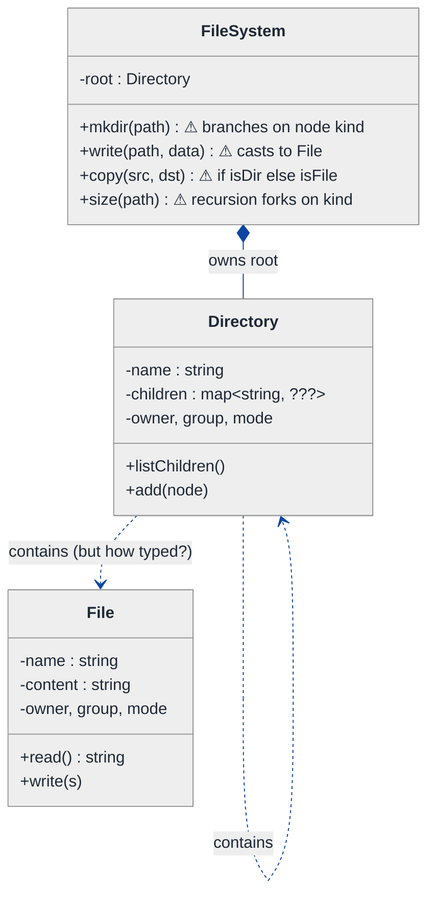
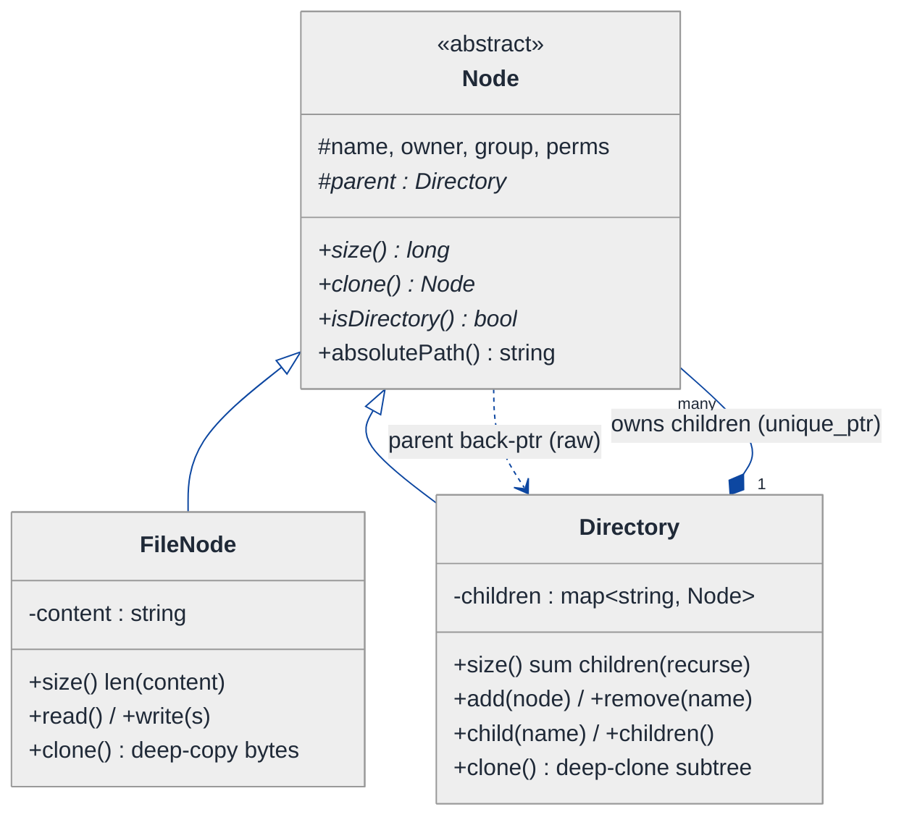
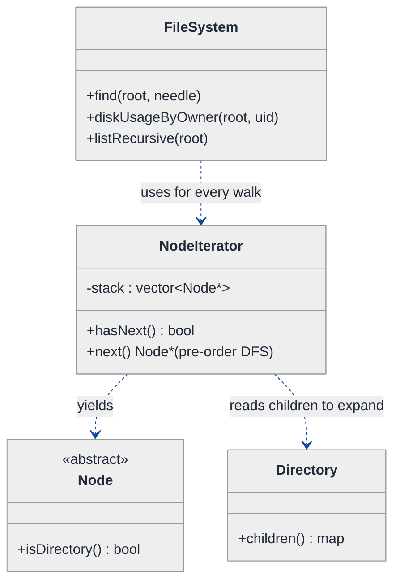
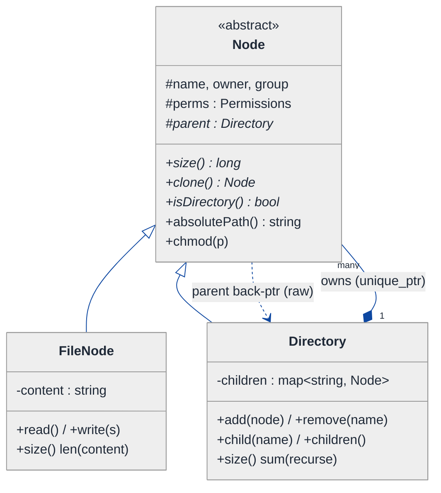
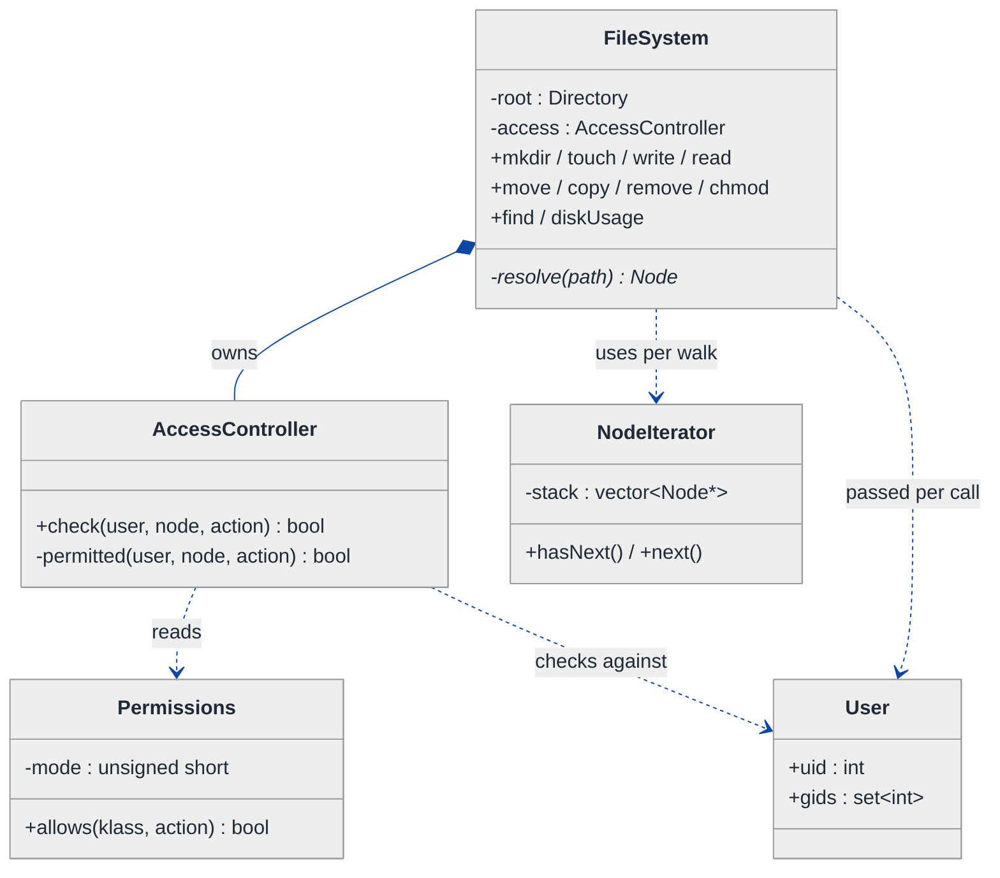
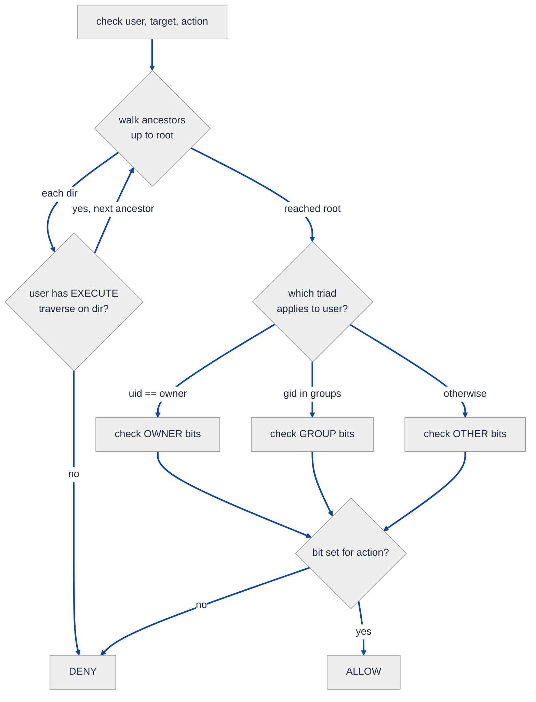
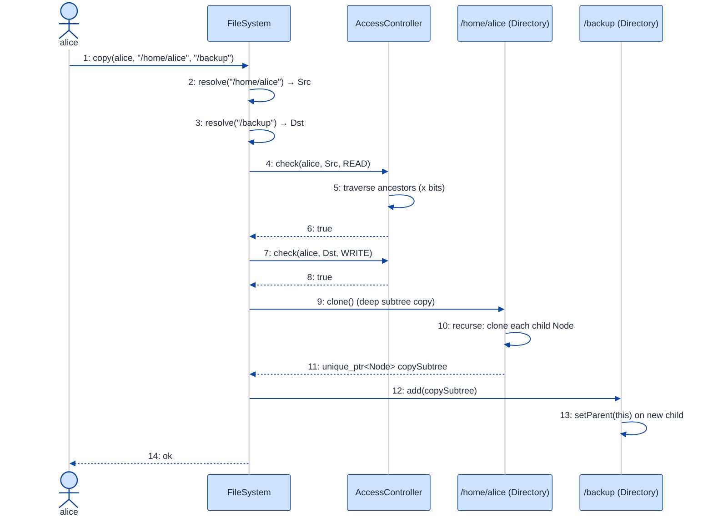

# In-Memory File System — LLD Walkthrough

> **Difficulty:** Hard · **Time:** ~45 min · **Pattern focus:** Composite (the directory tree) + Iterator (recursive traversal) + Strategy/Chain (permission checks) + a State-ish flavor for the permission triad
>
> **Problem source(s):** GID **CP1**, bucket `Composite_Pattern`. Representative of the "design an in-memory file system" family of LLD prompts.
>
> **Diagrams:** inline mermaid (renders natively in GitHub / VS Code). The canonical light-theme block is copied verbatim into every diagram.

---

## How to use this file

Paced for a candidate seeing "design a file system" for the first time. Reading time: ~45 minutes if you sketch each iteration by hand. **The lesson: a file system is a TREE where the interior nodes (directories) and the leaf nodes (files) must answer the SAME operations — that's the textbook signal for the Composite pattern. But don't reach for it up front. Build the naive two-class design, watch it fork every operation into `if (isDirectory)` ladders, and let the pain pull you toward Composite. Then layer permissions on top without polluting the tree.**

**Map of this file (15 sections):**

1. Problem statement + clarifying questions
2. Plain-English restatement
3. Why this matters
4. Mental model
5. Try it yourself first
6. Entity & verb extraction
7. **Iteration 1: the naive design** — File and Directory as two unrelated classes
8. **Where the naive design hurts** — four future requirements, one painful diff each
9. **Pivot 1: Composite** — one `Node` interface, uniform tree operations
10. **Pivot 2: Iterator** — recursive traversal without leaking the tree shape
11. **Pivot 3: permissions** — a permission model + a Chain/Strategy access check
12. Final UML class diagram (three sub-views)
13. Skeleton code (C++)
14. Key flow — sequence diagram
15. Extensibility re-check + anti-patterns + how to think aloud + self-check

---

## 1. Problem statement + clarifying questions

**Prompt (typical phrasing):** "Design an in-memory file system supporting directories, files, file content read/write, move, copy, and permission management (read, write, execute for owner, group, others)."

**Clarifying questions to ask BEFORE drawing anything:**

1. **Tree or graph?** Are hard links / symlinks in scope (a node reachable via two paths), or is it a strict tree (one parent per node)? This decides whether a child can have multiple parents — and therefore `unique_ptr` vs `shared_ptr` ownership.
2. **Permission model — full POSIX?** Do we need the classic 9-bit `rwxrwxrwx` (owner / group / others), plus an owner uid and a group gid per node? Do directories interpret `x` as "may traverse into" (POSIX semantics) the way real Unix does?
3. **Who is the "caller"?** Is there a notion of a current user (uid + gid set) that every operation is checked against, or is permission purely metadata we store but don't enforce yet?
4. **Move vs copy semantics?** Is `move` a pure re-parent (same node, new location) and `copy` a deep clone (new subtree)? What happens to permissions on a copy — inherit from destination, or carry from source?
5. **Path syntax?** Absolute paths from `/`, relative paths, `.` and `..`? Case sensitivity?
6. **Content model?** Files hold raw bytes / a string? Is there a size limit? Append vs overwrite on write?
7. **Concurrency?** Multiple threads mutating the tree at once, or single-threaded for now?
8. **What's the read/write surface?** A programmatic API (`fs.mkdir`, `fs.write`) or a shell-like command parser?

**Assumptions if the interviewer dodges:** strict tree (one parent per node, `unique_ptr` children); full 9-bit POSIX permission model with owner uid + group gid; every operation carries a `User` (uid + group set) that is access-checked; `move` = re-parent, `copy` = deep clone carrying source permissions; absolute + relative paths with `.`/`..`; files hold a `std::string` body; single-threaded for now (concurrency discussed in §15); a programmatic API.

---

## 2. Plain-English restatement

We're building the data structure and logic that backs `mkdir`, `touch`, `cat`, `echo > file`, `mv`, `cp`, and `chmod`. Internally it's a tree: directories are interior nodes that contain other nodes; files are leaves that hold content. Both kinds of node share metadata — a name, an owner, a group, and a permission triad. Every operation either reads or mutates the tree, and **before it does so it must check that the calling user is allowed**. The design must let us add new node kinds (symlink, device file), new operations (search, `du` disk usage), and richer permission rules **without rewriting the traversal core**.

---

## 3. Why this matters

This question is the canonical Composite-pattern interview because the domain screams "tree of two node types that must behave uniformly." The skill being probed is: do you recognize that `File` and `Directory` should answer a *common* interface so that `size()`, `path()`, `copy()`, and `delete()` recurse without the caller ever branching on node type? The second skill is **layering a cross-cutting concern (permissions) onto a recursive structure** without smearing `if (allowed)` checks through every method. Composite shows up again in GUI widget trees, org charts, AST nodes, and bill-of-materials systems — recognize it once and you recognize it everywhere.

---

## 4. Mental model

A file system is a **rooted tree** where every node, leaf or interior, presents the *same face* to the world: it has a name, knows its parent, can report its size, and can be asked for its permissions. The difference between a file and a directory is *what's inside* (bytes vs. children) and *which operations make sense* (you can't `cd` into a file) — but the **shared surface** is what lets `cp -r /a /b` recurse blindly.

```
Real-world sketch (NOT a UML diagram yet):

                      / (root dir, owner=root rwxr-xr-x)
                      │
        ┌─────────────┼──────────────┐
        ▼             ▼               ▼
     home/         etc/            bin/      ← directories (interior)
        │             │
   ┌────┴────┐        ▼
   ▼         ▼     hosts (file)    ← a leaf, owner=root rw-r--r--
 alice/    bob/
   │
   ▼
notes.txt (file, owner=alice rw-r-----, content="...")

Every box — dir or file — answers: name(), parent(), size(), perms().
Directories ALSO answer: children(), add(), remove().
```

The KEY insight from this picture: **the operations that recurse (`size`, `copy`, `delete`, `walk`) don't want to know whether they're standing on a file or a directory.** They want one polymorphic call. That uniformity is the Composite pattern, and the permission triad riding on every node is an orthogonal concern we'll bolt on without disturbing the tree.

---

## 5. Try it yourself first

> **Predict before reading on:**
>
> 1. List 4 nouns you'd promote to a class and 3 nouns you'd leave as fields.
> 2. **If I asked you to implement `cp -r` (recursive copy) AND `du` (recursive size), how much of your code would have to ask "is this a file or a directory?" — and what does that tell you?**
> 3. Where would you put the permission check for `write(path, content)` so it isn't duplicated for `mkdir`, `mv`, and `rm`?

---

## 6. Entity & verb extraction

> **Mini-refresher: noun → class, but not every noun.**
>
> Naive OOD promotes every noun to a class. Senior OOD promotes a noun only if it has both BEHAVIOR and STATE that need to live together. "Name" is a field; "permission triad" is borderline — it has behavior (`check(action, user)`), so it earns a small class.

**Nouns from the prompt:**

| Noun | Decision | Why |
|---|---|---|
| File | Class (a leaf node) | Holds content + the shared node behavior |
| Directory | Class (an interior node) | Holds children + the shared node behavior |
| FileSystem | Class (top-level façade) | Owns the root, parses paths, orchestrates ops |
| Permission set | Class (`Permissions`) | rwx × {owner, group, other}; has a `check()` behavior |
| User | Class (small) | uid + the set of gids the user belongs to |
| Content | Field on File (`std::string`) | No behavior of its own |
| Name | Field on every node (`std::string`) | A label, not a class |
| Path | Library type / value (`std::string` parsed to segments) | Parsed, not modeled as a class |
| Owner / group | Fields on every node (`uid`, `gid`) | Identity tags, not classes |

**Verbs (and the class they live on — naive answer, we'll re-examine):**

| Verb | Owner class (naive answer) |
|---|---|
| mkdir(path) / touch(path) | FileSystem |
| read(path) / write(path, content) | FileSystem → File |
| move(src, dst) / copy(src, dst) | FileSystem |
| remove(path) | FileSystem |
| chmod(path, mode) | FileSystem → node |
| size() | File and Directory (recursive on Directory) |
| listChildren() | Directory only |
| check(action, user) | Permissions |

**We have NOT introduced any design patterns yet.** Pure nouns + verbs. Notice already that `size()` appears on BOTH File and Directory — that duplication is the first whiff of Composite.

---

## 7. <a id="iter-1"></a>Iteration 1: the naive design

Let's write the simplest thing that could possibly work. Two concrete classes — `File` and `Directory` — with no shared base, and a `FileSystem` that branches on which one it's holding.



**Reader's tour (read top to bottom; ~60 seconds).**

1. **`FileSystem` at the top is the façade.** It owns the `root` directory and exposes the public API: `mkdir`, `write`, `copy`, `size`. Every one of those methods carries a ⚠ — because each has to figure out, at runtime, whether the node it's touching is a `File` or a `Directory`.

2. **The killer problem is `Directory::children`.** What's the value type of that map? `File` and `Directory` have NO common base, so you can't store them in one container. You're forced into one of three bad options: (a) two separate maps `files` and `subdirs`; (b) a `std::variant<File, Directory>`; (c) a tagged struct with an `enum NodeKind`. All three push a "which kind is this?" decision into *every* traversal.

3. **`File` and `Directory` duplicate metadata.** Both carry `name`, `owner`, `group`, `mode`. That's copy-pasted state with no shared home.

4. **Recursion forks on kind.** `size(path)`: if it's a File, return `content.length()`; if it's a Directory, sum the sizes of children — but to sum children you must again branch on each child's kind. The fork metastasizes.

**What's deliberately missing.** No common `Node` abstraction. No uniform `size()` call. No permission *enforcement* (the bits are stored but nothing checks them). The naive design doesn't even acknowledge that "file and directory are two shapes of the same thing." That's what we'll expose and fix.

Skeleton code for the naive design (C++):

```cpp
#include <map>
#include <memory>
#include <stdexcept>
#include <string>
#include <variant>
#include <vector>

enum class NodeKind { FILE, DIRECTORY };

struct File {
    std::string name;
    std::string content;
    int owner, group, mode;
    std::string read() const { return content; }
    void write(const std::string& s) { content = s; }
};

struct Directory {
    std::string name;
    int owner, group, mode;
    // The pain: children can be either kind, no common type.
    std::map<std::string, std::variant<File, Directory>> children;
};

class FileSystem {
public:
    long size(const std::string& path) {
        auto& node = resolve(path);                 // returns variant&
        if (std::holds_alternative<File>(node)) {   // ⚠ fork on kind
            return std::get<File>(node).content.size();
        }
        long total = 0;
        for (auto& [name, child] : std::get<Directory>(node).children) {
            if (std::holds_alternative<File>(child))          // ⚠ fork again
                total += std::get<File>(child).content.size();
            else
                total += sizeOfDir(std::get<Directory>(child)); // ⚠ recurse, more forks
        }
        return total;
    }

    void write(const std::string& path, const std::string& data) {
        auto& node = resolve(path);
        if (!std::holds_alternative<File>(node))     // ⚠ must check kind
            throw std::runtime_error("Not a file");
        std::get<File>(node).write(data);
        // NOTE: no permission check anywhere. We just stored the bits.
    }

    void copy(const std::string& src, const std::string& dst) {
        auto& node = resolve(src);
        if (std::holds_alternative<File>(node)) { /* copy file ... */ }
        else { /* recursively copy dir — fork on every descendant ... */ } // ⚠
    }
private:
    std::variant<File, Directory>& resolve(const std::string& path); // elided
    long sizeOfDir(const Directory& d);                              // elided
    Directory root_;
};
```

**This works.** It has zero design patterns. We can `mkdir`, `write`, `size`. So what's wrong with it?

---

## 8. <a id="naive-pain"></a>Where the naive design hurts

The interviewer slides four upcoming requirements across the desk: "Walk me through what changes."

### Change A: "Implement `du` (recursive disk usage) and `find` (recursive search)"

In the naive design:
- Both are recursive walks. Each must branch `if (holds_alternative<File>)` at every node.
- `du` already exists as `size`; `find` is a near-copy with the same fork structure.
- **Every new recursive operation re-implements the same "is it a file or a dir?" ladder.** The tree shape leaks into every algorithm.

### Change B: "Implement `cp -r` (recursive copy of a subtree)"

In the naive design:
- Copying a `variant<File, Directory>` deep-copies, but re-parenting names, fixing back-pointers, and recursing requires forking on kind at every level.
- `move` is similar but must also delete from source.
- **`copy` and `move` are both 30-line fork-laden functions in `FileSystem`.**

### Change C: "Add symlinks (a third node kind that points to another path)"

In the naive design:
- `std::variant<File, Directory>` becomes `std::variant<File, Directory, Symlink>`.
- **Every `holds_alternative` / `std::get` site in the entire file must grow a third case** — `size`, `write`, `copy`, `move`, `resolve`, `find`. That's the classic "new type → shotgun surgery across every switch" smell.

### Change D: "Actually ENFORCE permissions — a `write` must fail if the user lacks `w`"

In the naive design:
- There is no `User`, no `check()`. We'd add an `if (!hasPermission(...))` at the top of `write`, `read`, `mkdir`, `remove`, `copy`, `move`...
- **The same access-check boilerplate gets pasted at the top of every mutating method.** Forget one and you have a security hole. POSIX directory-traversal semantics (`x` on every ancestor directory) make this even worse — the check is itself a recursive walk up the path.

### The pattern of pain

| Change | Files / sites touched | Smell |
|---|---|---|
| A. `du` / `find` | new fork-laden method per op | "Tree shape leaks into every algorithm." |
| B. `cp -r` / `mv` | `copy` + `move`, fork at every level | "Recursion forks on node kind everywhere." |
| C. Symlinks | every `holds_alternative` site | "New node type → shotgun surgery across all switches." |
| D. Enforce perms | top of every mutating method | "Cross-cutting check copy-pasted; easy to forget." |

**Two axes of pain dominate.** First, *structural*: file and directory have no common type, so every traversal branches on kind and every new kind is shotgun surgery. Second, *cross-cutting*: permission enforcement wants to wrap every operation but has nowhere clean to live.

> **Pivot question:** "What pattern lets a tree's leaves and interior nodes answer the SAME interface so recursive operations never branch on kind? And once we have that uniform tree, where does a cross-cutting permission check belong?"
>
> The answers are Composite (for the tree) and a small access-control collaborator (for the check). Let's introduce them one at a time, starting with the structural axis.

---

## 9. <a id="pivot-1"></a>Pivot 1: Composite for the node tree

> **Mini-refresher: Composite pattern.**
>
> Composite lets you treat individual objects (leaves) and compositions of objects (containers) **uniformly** through a single interface. The interface declares the operations that make sense for BOTH; the container's implementations recurse into its children. The caller holds a pointer to the interface and never asks "leaf or container?"
>
> Quick example: a drawing app has `Shape` with `draw()`. `Circle` (leaf) draws itself; `Group` (composite) draws each child. `canvas.draw(rootGroup)` recurses without the canvas knowing the tree shape.

**Why Composite fits a file system.** The whole-vs-part relationship is exact: a directory *is a* node AND *contains* nodes. Operations like `size()`, `path()`, `delete()`, and `walk()` are defined for every node and recurse naturally on directories. The caller (`cp -r`, `du`) wants ONE polymorphic call. That's textbook Composite.

**The refactor — introduce a common abstract base `Node`:**

```cpp
class Directory;  // forward — a node needs to know its parent

class Node {
public:
    Node(std::string name, int owner, int group, Permissions perms)
        : name_(std::move(name)), owner_(owner), group_(group), perms_(perms) {}
    virtual ~Node() = default;

    // ── operations that BOTH files and directories answer ──
    virtual long size() const = 0;                 // file: content len; dir: sum of children
    virtual std::unique_ptr<Node> clone() const = 0; // deep copy of the subtree
    virtual bool isDirectory() const = 0;

    // ── shared metadata lives HERE, once ──
    const std::string& name() const { return name_; }
    void rename(std::string n)      { name_ = std::move(n); }
    Directory* parent() const       { return parent_; }
    void setParent(Directory* p)    { parent_ = p; }
    const Permissions& perms() const { return perms_; }
    void chmod(Permissions p)        { perms_ = p; }
    int owner() const { return owner_; }
    int group() const { return group_; }
    std::string absolutePath() const;  // walk parent pointers up to root

protected:
    std::string name_;
    int         owner_, group_;
    Permissions perms_;
    Directory*  parent_ = nullptr;  // raw back-ptr (non-owning); root's parent is null
};

class FileNode : public Node {
public:
    FileNode(std::string name, int owner, int group, Permissions p)
        : Node(std::move(name), owner, group, p) {}
    long size() const override { return static_cast<long>(content_.size()); }
    bool isDirectory() const override { return false; }
    std::unique_ptr<Node> clone() const override {
        auto c = std::make_unique<FileNode>(name_, owner_, group_, perms_);
        c->content_ = content_;  // deep copy of bytes
        return c;
    }
    const std::string& read() const { return content_; }
    void write(const std::string& s) { content_ = s; }
private:
    std::string content_;
};

class Directory : public Node {
public:
    Directory(std::string name, int owner, int group, Permissions p)
        : Node(std::move(name), owner, group, p) {}
    long size() const override {                    // recursion lives HERE, no fork
        long total = 0;
        for (const auto& [n, child] : children_) total += child->size();
        return total;
    }
    bool isDirectory() const override { return true; }
    std::unique_ptr<Node> clone() const override {  // deep clone whole subtree
        auto c = std::make_unique<Directory>(name_, owner_, group_, perms_);
        for (const auto& [n, child] : children_) c->add(child->clone());
        return c;
    }
    void add(std::unique_ptr<Node> child) {
        child->setParent(this);
        children_[child->name()] = std::move(child);
    }
    std::unique_ptr<Node> remove(const std::string& name) {  // detach + return ownership
        auto it = children_.find(name);
        if (it == children_.end()) throw std::runtime_error("No such entry");
        auto node = std::move(it->second);
        children_.erase(it);
        node->setParent(nullptr);
        return node;                                // caller now owns it (used by move)
    }
    Node* child(const std::string& name) const {
        auto it = children_.find(name);
        return it == children_.end() ? nullptr : it->second.get();
    }
    const std::map<std::string, std::unique_ptr<Node>>& children() const { return children_; }
private:
    std::map<std::string, std::unique_ptr<Node>> children_;  // ONE container, ONE type
};
```

> **Mini-refresher: `std::unique_ptr` ownership.**
>
> `unique_ptr<Node>` means exactly one owner. A directory OWNS its children — when the directory dies, the whole subtree dies with it (composition). `remove()` *transfers* ownership out by returning the `unique_ptr`; that's how `move` re-parents a node without copying it. The non-owning `parent_` back-pointer is a raw `Directory*` precisely because the child must NOT own (or co-own) its parent — that would be a cycle.

**What changed — visualized.** The structural slice:



**Tour of the after-state.**

1. **`Node` is now the common abstract base.** It declares the three operations that BOTH kinds answer (`size`, `clone`, `isDirectory`) as pure virtual, and it OWNS the shared metadata (name, owner, group, perms, parent) so nothing is duplicated.

2. **`Directory` composes `Node`, not `File`/`Directory` separately.** The children map is `map<string, unique_ptr<Node>>` — **one container, one element type.** A directory can hold files, sub-directories, and tomorrow symlinks, all through the same pointer.

3. **Recursion lives in exactly one place.** `Directory::size()` sums `child->size()` — and because `child` is a `Node*`, that one call dispatches correctly whether the child is a file or a directory. **No `holds_alternative`, no fork.** Same for `clone()` (deep subtree copy) — the recursion is structural, not type-driven.

4. **The composition arrow (filled diamond) from Directory to Node** says "the directory owns its children's lifetimes." The dashed arrow back (`parent`) is a non-owning raw pointer — it breaks the ownership cycle.

5. **`remove()` returns the `unique_ptr`** — it transfers ownership to the caller. That single method is the foundation for both `mv` (re-add elsewhere) and `rm` (let it drop).

**Changes A and B from §8 now land cleanly.** `du` is just `node->size()`. `cp -r` is `node->clone()` then `add()` to the destination. `mv` is `remove()` then `add()`. No forks anywhere — the polymorphic `Node*` does the dispatch.

**Pattern-discrimination cheatsheet — Composite vs Decorator.**
- *Composite:* a tree of part-whole relationships; a container holds *many* children of the same interface and recurses over them.
- *Decorator:* a chain where each wrapper holds *exactly one* wrapped object of the same interface and adds behavior around it.
- *Rule of thumb:* "has a LIST of children, recursion fans out" → Composite. "wraps a SINGLE component, adds a layer" → Decorator. Both share the "wrapper and wrapped implement the same interface" trick — the difference is *one vs many* and *tree vs chain*.

We chose Composite because a directory genuinely holds *many* children and operations *fan out* recursively — that's a tree, not a wrap-chain.

---

## 10. <a id="pivot-2"></a>Pivot 2: Iterator for recursive traversal

Change A (`find`, `du`) is structurally solved by Composite, but there's a subtler issue: operations like `find name == "*.txt"`, "list everything recursively", or "compute total size by owner" all need to **walk the whole subtree**. If each of those re-writes the recursion (a manual stack or a recursive helper that knows `children()`), the tree's internal shape leaks into every caller again — just one level up from where it leaked before.

> **Mini-refresher: Iterator pattern.**
>
> Iterator provides a way to access the elements of an aggregate sequentially **without exposing its underlying representation**. The aggregate hands out an iterator; the caller pulls elements one at a time and never touches the internal container (here: the recursive child maps).
>
> Quick example: `for (auto x : collection)` works whether `collection` is a vector, a tree, or a hash set — the iterator hides the shape.

**Why Iterator fits here.** We have multiple recursive operations (`find`, `du`-by-owner, "list -R", search) that all want the same thing: *visit every node in the subtree once.* Encapsulate that traversal ONCE behind an iterator, and every operation becomes a simple loop. The caller never writes recursion or touches `children()`.

**The refactor — a depth-first iterator over the subtree:**

```cpp
// A lazy depth-first walk over a subtree rooted at `start`.
class NodeIterator {
public:
    explicit NodeIterator(Node* start) {
        if (start) stack_.push_back(start);
    }
    bool hasNext() const { return !stack_.empty(); }
    Node* next() {                       // pre-order DFS
        Node* cur = stack_.back();
        stack_.pop_back();
        if (cur->isDirectory()) {
            auto* dir = static_cast<Directory*>(cur);
            // push children so traversal order is stable
            const auto& kids = dir->children();
            for (auto it = kids.rbegin(); it != kids.rend(); ++it)
                stack_.push_back(it->second.get());
        }
        return cur;
    }
private:
    std::vector<Node*> stack_;
};

// Now EVERY recursive op is a flat loop. No op re-implements recursion:
std::vector<Node*> FileSystem::find(const std::string& root, const std::string& needle) {
    std::vector<Node*> hits;
    for (NodeIterator it(resolve(root)); it.hasNext(); ) {
        Node* n = it.next();
        if (n->name().find(needle) != std::string::npos) hits.push_back(n);
    }
    return hits;
}

long FileSystem::diskUsageByOwner(const std::string& root, int uid) {
    long total = 0;
    for (NodeIterator it(resolve(root)); it.hasNext(); ) {
        Node* n = it.next();
        if (!n->isDirectory() && n->owner() == uid) total += n->size();
    }
    return total;
}
```

**What changed — visualized.** The traversal slice:



**Tour of the after-state.**

1. **`NodeIterator` holds a `stack` of `Node*`.** It does pre-order DFS: pop a node, yield it, and if it's a directory push its children. The recursion is now an explicit stack inside ONE class.

2. **`FileSystem` operations became flat loops.** `find`, `diskUsageByOwner`, `listRecursive` all share the identical `for (NodeIterator it(...); it.hasNext();)` skeleton. **None of them knows the tree is a map-of-maps.**

3. **Adding a new recursive operation is now a 5-line loop, not a recursive function.** Want "count files larger than 1 MB"? One loop with a filter. The traversal contract is fixed; only the per-node predicate changes.

4. **The iterator reads `children()` but the caller never does.** That's the encapsulation win — the internal container type (`std::map`) could change to a hash map or a sorted vector and only `NodeIterator::next()` would change.

**Pattern-discrimination cheatsheet — Iterator vs the Visitor pattern.**
- *Iterator:* pulls nodes out one at a time; the *caller* decides what to do with each (`if name matches ...`). Great when operations are open-ended and simple.
- *Visitor:* pushes a double-dispatch `visit(FileNode)` / `visit(Directory)` into the structure; centralizes a family of type-specific operations.
- *Rule of thumb:* "I just need to enumerate and the per-node logic is trivial" → Iterator. "I have many operations that each behave differently per node type and I want them grouped" → Visitor. We chose Iterator because our recursive ops are simple filters, and Visitor would force a `visit` overload per node kind — re-introducing exactly the per-kind branching Composite removed.

---

## 11. <a id="pivot-3"></a>Pivot 3: a permission model + an access-control check

Change D from §8 is still open: permissions are stored but not enforced, and a naive fix pastes an `if (!allowed)` at the top of every mutating method. We need (a) a real permission model and (b) a single place the check lives.

### 11.1 The permission model

POSIX permissions are 9 bits — `rwx` for each of {owner, group, other}. Model them as a small value type with one behavior: "given an action and the relationship between the user and the node, is it allowed?"

```cpp
enum class Action { READ, WRITE, EXECUTE };
enum class Klass  { OWNER, GROUP, OTHER };   // which permission triad applies

class Permissions {
public:
    explicit Permissions(unsigned short mode = 0644) : mode_(mode) {} // octal, like chmod
    // bit layout: owner=bits 8-6, group=5-3, other=2-0; r=4 w=2 x=1
    bool allows(Klass who, Action what) const {
        int shift = (who == Klass::OWNER) ? 6 : (who == Klass::GROUP) ? 3 : 0;
        int bit   = (what == Action::READ) ? 4 : (what == Action::WRITE) ? 2 : 1;
        return ((mode_ >> shift) & 0b111) & bit;
    }
    unsigned short mode() const { return mode_; }
private:
    unsigned short mode_;
};

struct User {
    int uid;
    std::set<int> gids;   // a user belongs to several groups
};
```

### 11.2 Where the check lives — a Chain of Responsibility up the path

POSIX semantics are unforgiving: to touch `/a/b/file`, the user needs **`x` (traverse) on every ancestor directory** `/`, `/a`, `/b`, AND the right bit on `file` itself. That's a recursive check up the parent chain — a natural Chain of Responsibility.

> **Mini-refresher: Chain of Responsibility.**
>
> A request travels down a chain of handlers; each handler either deals with it or passes it to the next. No single handler needs to know the whole chain. Here the "chain" is the path from the target node up to the root — each ancestor must grant traverse permission, or the whole request is denied.

> **Mini-refresher: SOLID — Single Responsibility Principle (SRP).**
>
> A class should have one reason to change. By pulling access control into its own `AccessController`, the `FileSystem` orchestration logic and the access *policy* change independently. Tomorrow's "add ACLs" or "add sticky-bit semantics" touches only `AccessController` — not `mkdir`, `write`, or `move`.

```cpp
class AccessController {
public:
    // returns true iff `user` may perform `action` on `target`,
    // including traverse (x) on every ancestor directory.
    bool check(const User& user, const Node& target, Action action) const {
        // 1. walk ancestors: every directory on the path needs EXECUTE (traverse)
        for (Directory* d = target.parent(); d != nullptr; d = d->parent())
            if (!permitted(user, *d, Action::EXECUTE)) return false;
        // 2. the target itself needs the requested action bit
        return permitted(user, target, action);
    }
private:
    bool permitted(const User& user, const Node& node, Action action) const {
        if (node.owner() == user.uid)
            return node.perms().allows(Klass::OWNER, action);
        if (user.gids.count(node.group()))
            return node.perms().allows(Klass::GROUP, action);
        return node.perms().allows(Klass::OTHER, action);
    }
};
```

Now the `FileSystem` façade calls the controller **once per operation**, in the only place it should:

```cpp
class FileSystem {
public:
    FileSystem() { root_ = std::make_unique<Directory>("", 0, 0, Permissions(0755)); }

    void write(const User& u, const std::string& path, const std::string& data) {
        Node* n = resolve(path);
        if (!n || n->isDirectory()) throw std::runtime_error("Not a file");
        if (!access_.check(u, *n, Action::WRITE))               // ← the ONE check
            throw std::runtime_error("Permission denied");
        static_cast<FileNode*>(n)->write(data);
    }

    void move(const User& u, const std::string& src, const std::string& dst) {
        Node* s = resolve(src);
        Directory* srcParent = s->parent();
        Directory* dstDir     = asDir(resolve(dst));
        // need WRITE on both the source's parent dir and the destination dir
        if (!access_.check(u, *srcParent, Action::WRITE) ||
            !access_.check(u, *dstDir,    Action::WRITE))
            throw std::runtime_error("Permission denied");
        dstDir->add(srcParent->remove(s->name()));   // re-parent: no copy
    }
    // copy(), mkdir(), remove(), read() — same shape: resolve → access_.check → mutate
private:
    Node* resolve(const std::string& path);   // splits on '/', walks children, handles . / ..
    static Directory* asDir(Node* n);          // checked cast, elided
    std::unique_ptr<Directory> root_;
    AccessController           access_;
};
```

**The win.** The access decision is **one collaborator** invoked at the top of each mutating method. Adding ACLs, a root-bypass, or sticky-bit semantics is a change to `AccessController` alone. The recursive ancestor-traverse check is written once, not pasted six times.

**Pattern-discrimination cheatsheet — Chain of Responsibility vs Strategy here.**
- *Chain of Responsibility:* the request walks a *sequence* of handlers (here, ancestor dirs) and any one can veto. Used for the path-traversal check.
- *Strategy:* a single swappable algorithm. If you wanted to switch the WHOLE permission scheme (POSIX bits vs ACL lists vs role-based) at runtime, you'd make `AccessController` an interface with `PosixController` / `AclController` implementations — Strategy.
- *Rule of thumb:* "many handlers, any can stop the request" → Chain. "one pluggable policy object" → Strategy. We used Chain for ancestor traversal and left the *door open* to make the controller itself a Strategy if a second permission scheme appears.

---

## 12. <a id="fig-class-diagram"></a>Final class diagram

Drawing the whole design in one box becomes a wall. Here are **three focused sub-views**; the structural insight at the end ties them together.

### 12.1 The Composite tree — what the file system OWNS



**Tour of 12.1.** Two leaves of one base. `FileNode` is the leaf (content); `Directory` is the composite (children map). The filled diamond from Directory to Node marks composition — the directory owns its children's lifetimes, so destroying a directory destroys its whole subtree. The dashed back-arrow (`parent`) is a non-owning raw pointer that breaks the cycle. This spine is the *entire* structural answer to "files and directories must behave uniformly."

### 12.2 The traversal + permission collaborators — what the file system USES



**Tour of 12.2.**

1. **`FileSystem` is the façade.** It owns the `root` directory (from 12.1) and an `AccessController`. Every public method follows the same recipe: `resolve(path)` → `access_.check(user, node, action)` → mutate via the polymorphic `Node*`.

2. **`AccessController` is the single home of access policy.** It reads `Permissions` and checks them against a `User`. The recursive ancestor-traverse logic lives here once (Chain of Responsibility up the parent chain). SRP: changing the permission policy touches only this box.

3. **`Permissions` is a value object** — 9 bits + one `allows(klass, action)` method. `User` is uid + gids.

4. **`NodeIterator` is a dependency, not owned.** `FileSystem` constructs one per recursive walk (`find`, `diskUsage`). It encapsulates the DFS so no operation re-implements recursion.

5. **`User` is passed PER CALL, not stored.** Like the payment method in the parking-lot design, the acting user is a per-request parameter — the file system isn't "logged in as" anyone.

### 12.3 The permission decision detail — how a check resolves



**Tour of 12.3.** A permission check is two phases. **Phase 1 (the chain):** walk every ancestor directory from the target up to the root; each must grant EXECUTE (traverse) or the whole request is DENIED — that's the Chain of Responsibility, any link can veto. **Phase 2 (the triad):** pick exactly ONE triad based on the user's relationship to the target — owner bits if `uid` matches, else group bits if any `gid` matches, else other bits — and test the action's bit. POSIX picks the *first matching* triad, not the most permissive, which is why an owner with `r--` can be *denied* even when `other` has `rw-`.

### Structural insight (ties 12.1 + 12.2 + 12.3 together)

| Concern | Pattern used | Why |
|---|---|---|
| **Tree shape** (file vs directory) | Composite — one `Node` base | Both kinds answer `size`/`clone`/`isDirectory`; recursion never forks on kind |
| **Recursive traversal** (`find`, `du`) | Iterator — `NodeIterator` | Walk encapsulated once; ops are flat loops, tree shape stays hidden |
| **Access control** (the path-traverse check) | Chain of Responsibility, in `AccessController` | Every ancestor can veto; check written once, SRP-isolated |
| **Permission storage** | `Permissions` value object on every `Node` | 9 POSIX bits + one `allows()` behavior, no duplication |

The big lesson: **inheritance is used only for the genuine "is-a" — File IS a Node, Directory IS a Node — and everything else is composition.** Permissions are composed onto every node; the access controller and iterator are collaborators the façade *uses*. *Inheritance for the node identity, composition for every cross-cutting concern.*

---

## 13. Skeleton code (C++)

> Show the SHAPES, not the full impl. ~130 lines.

```cpp
#include <map>
#include <memory>
#include <set>
#include <stdexcept>
#include <string>
#include <vector>

// ── Forward declarations ────────────────────────────────────────────
class Directory;   // a Node holds a Directory* parent

// ── Permission model ────────────────────────────────────────────────
enum class Action { READ, WRITE, EXECUTE };
enum class Klass  { OWNER, GROUP, OTHER };

class Permissions {
public:
    explicit Permissions(unsigned short mode = 0644) : mode_(mode) {}
    bool allows(Klass who, Action what) const {
        int shift = (who == Klass::OWNER) ? 6 : (who == Klass::GROUP) ? 3 : 0;
        int bit   = (what == Action::READ) ? 4 : (what == Action::WRITE) ? 2 : 1;
        return ((mode_ >> shift) & 0b111) & bit;
    }
    unsigned short mode() const { return mode_; }
private:
    unsigned short mode_;
};

struct User { int uid; std::set<int> gids; };

// ── Composite: the node hierarchy ───────────────────────────────────
class Node {
public:
    Node(std::string name, int owner, int group, Permissions p)
        : name_(std::move(name)), owner_(owner), group_(group), perms_(p) {}
    virtual ~Node() = default;

    virtual long                   size()        const = 0;   // recurses on Directory
    virtual std::unique_ptr<Node>  clone()       const = 0;   // deep subtree copy
    virtual bool                   isDirectory() const = 0;

    const std::string& name() const  { return name_; }
    void  rename(std::string n)      { name_ = std::move(n); }
    Directory* parent() const        { return parent_; }
    void  setParent(Directory* p)    { parent_ = p; }
    int   owner() const              { return owner_; }
    int   group() const              { return group_; }
    const Permissions& perms() const { return perms_; }
    void  chmod(Permissions p)       { perms_ = p; }
    std::string absolutePath() const;                          // walks parent_ chain — elided
protected:
    std::string name_;
    int         owner_, group_;
    Permissions perms_;
    Directory*  parent_ = nullptr;   // non-owning back-ptr
};

class FileNode : public Node {
public:
    using Node::Node;
    long size() const override { return static_cast<long>(content_.size()); }
    bool isDirectory() const override { return false; }
    std::unique_ptr<Node> clone() const override {
        auto c = std::make_unique<FileNode>(name_, owner_, group_, perms_);
        c->content_ = content_;
        return c;
    }
    const std::string& read() const     { return content_; }
    void write(const std::string& s)    { content_ = s; }
private:
    std::string content_;
};

class Directory : public Node {
public:
    using Node::Node;
    long size() const override {
        long t = 0; for (auto& [n, c] : children_) t += c->size(); return t;
    }
    bool isDirectory() const override { return true; }
    std::unique_ptr<Node> clone() const override {
        auto c = std::make_unique<Directory>(name_, owner_, group_, perms_);
        for (auto& [n, ch] : children_) c->add(ch->clone());
        return c;
    }
    void add(std::unique_ptr<Node> child) {
        child->setParent(this);
        children_[child->name()] = std::move(child);
    }
    std::unique_ptr<Node> remove(const std::string& name) {     // transfers ownership out
        auto it = children_.find(name);
        if (it == children_.end()) throw std::runtime_error("No such entry");
        auto n = std::move(it->second); children_.erase(it); n->setParent(nullptr); return n;
    }
    Node* child(const std::string& name) const {
        auto it = children_.find(name); return it == children_.end() ? nullptr : it->second.get();
    }
    const std::map<std::string, std::unique_ptr<Node>>& children() const { return children_; }
private:
    std::map<std::string, std::unique_ptr<Node>> children_;
};

// ── Iterator: DFS over a subtree (pre-order) ────────────────────────
class NodeIterator {
public:
    explicit NodeIterator(Node* start) { if (start) stack_.push_back(start); }
    bool  hasNext() const { return !stack_.empty(); }
    Node* next() {
        Node* cur = stack_.back(); stack_.pop_back();
        if (cur->isDirectory()) {
            auto& kids = static_cast<Directory*>(cur)->children();
            for (auto it = kids.rbegin(); it != kids.rend(); ++it)
                stack_.push_back(it->second.get());
        }
        return cur;
    }
private:
    std::vector<Node*> stack_;
};

// ── Chain-of-Responsibility access control ──────────────────────────
class AccessController {
public:
    bool check(const User& u, const Node& target, Action action) const {
        for (Directory* d = target.parent(); d; d = d->parent())     // ancestor chain
            if (!permitted(u, *d, Action::EXECUTE)) return false;
        return permitted(u, target, action);
    }
private:
    bool permitted(const User& u, const Node& n, Action a) const {
        if (n.owner() == u.uid)        return n.perms().allows(Klass::OWNER, a);
        if (u.gids.count(n.group()))   return n.perms().allows(Klass::GROUP, a);
        return n.perms().allows(Klass::OTHER, a);
    }
};

// ── Façade ──────────────────────────────────────────────────────────
class FileSystem {
public:
    FileSystem() : root_(std::make_unique<Directory>("", 0, 0, Permissions(0755))) {}

    void write(const User& u, const std::string& path, const std::string& data) {
        Node* n = resolve(path);
        if (!n || n->isDirectory())              throw std::runtime_error("Not a file");
        if (!access_.check(u, *n, Action::WRITE)) throw std::runtime_error("Permission denied");
        static_cast<FileNode*>(n)->write(data);
    }
    void move(const User& u, const std::string& src, const std::string& dst);   // elided — see §11.2
    void copy(const User& u, const std::string& src, const std::string& dst);   // resolve → check → clone+add
    // mkdir / touch / read / remove / chmod / find / diskUsage — same recipe, elided
private:
    Node* resolve(const std::string& path);    // split on '/', walk children, handle . and .. — elided
    std::unique_ptr<Directory> root_;
    AccessController           access_;
};
```

---

## 14. <a id="fig-sequence"></a>Key flow — sequence diagram

The flow worth tracing is `cp -r /home/alice /backup` — a recursive copy that exercises Composite (clone), the access check, and re-parenting in one shot.



**Tour of the flow. Read slowly — Composite, the access check, and ownership transfer all meet here.**

1. **`alice` requests `copy`** with herself as the acting user, a source path, and a destination path. The user is a per-call parameter.

2-3. **`FileSystem::resolve` turns each path into a `Node*`.** Resolution itself walks the tree (splitting on `/`, following `child()`), handling `.` and `..`.

4-6. **Access check on the SOURCE (READ) — the Chain of Responsibility.** `AccessController` walks every ancestor directory verifying the EXECUTE/traverse bit, then checks READ on the source itself. Any ancestor lacking `x` → DENY. **This is the only place permission logic runs.**

7-8. **Access check on the DESTINATION (WRITE).** You may read the source but you also need write permission on where it's going. Two independent checks, one collaborator.

9-11. **`Src->clone()` — the Composite recursion.** This is the heart of `cp -r`: `Directory::clone()` allocates a new directory and recursively clones each child via the polymorphic `Node::clone()`. **No `if (file) else (dir)` anywhere** — the virtual call dispatches per node. The whole subtree comes back as one `unique_ptr<Node>`.

12-13. **`Dst->add(copySubtree)` — ownership transfer + re-parent.** The destination directory takes ownership of the cloned subtree (move of the `unique_ptr`) and stamps itself as the new child's parent.

### The branching that's NOT shown — and why it matters

You don't see a single `if (isDirectory)` in steps 9-13. That's the payoff of Composite: **`clone()` recurses through a tree of unknown shape using one virtual call.** And you don't see permission checks scattered inside the recursion — the access decision happened once, up front, in `AccessController`. **The tree structure does the dispatch; the controller does the policy; the façade just orchestrates.**

---

## 15. Extensibility re-check + anti-patterns + how to think aloud + self-check

### Extensibility re-check

Revisit the four changes from [§8](#naive-pain). For each, name the SINGLE place that changes.

| Change | Naive design impact | Final design impact |
|---|---|---|
| A. `du` / `find` | new fork-laden method each | One flat loop over `NodeIterator`. Done. |
| B. `cp -r` / `mv` | fork at every level | `clone()` + `add()`, or `remove()` + `add()`. No forks. Done. |
| C. Symlinks | every `holds_alternative` site | New `SymlinkNode : Node` overriding `size`/`clone`/`isDirectory`. No edits to File, Directory, or any traversal. Done. |
| D. Enforce perms | check pasted everywhere | Already centralized in `AccessController`. New scheme (ACL) → swap the controller. Done. |

Adding a node kind (symlink, device file, FIFO) is exactly ONE new subclass of `Node`. Adding a recursive operation is exactly ONE loop. Changing the permission policy is exactly ONE class. That's open/closed in practice.

If a future requirement makes you change `Node`, `Directory`, `NodeIterator`, AND `AccessController` together — go back to §6 and re-identify the variability point you missed.

### Common confusion + traps

1. **"Should `Node` declare `add()`/`remove()` so files and dirs are *fully* uniform?"** This is the classic Composite design tension. Putting `add`/`remove` on the base (*transparent* Composite) lets callers treat everything identically but forces `FileNode::add()` to throw at runtime. Keeping them only on `Directory` (*safe* Composite) means callers cast/check before adding. We chose safe — `add` is genuinely meaningless on a file, and a compile-time-ish split beats a runtime throw. Name this tradeoff in the interview.

2. **"Why a raw `Directory* parent` and not `shared_ptr`?"** Because a child must not own its parent — that's a reference cycle that leaks. The parent owns the child (`unique_ptr`); the back-link is non-owning. If you allowed hard links (one node, many parents), you'd switch children to `shared_ptr<Node>` and parent to `weak_ptr` — and you'd note the tree became a DAG.

3. **"Why is `User` passed per call, not stored on `FileSystem`?"** Because the same file system serves many users; "who is acting" is request scope, not object scope. Storing it would make the API stateful and un-thread-safe.

4. **"Isn't centralizing the permission check a single point of failure?"** It's a single point of *enforcement* — which is exactly what you want for security. One place to audit, one place to fix, impossible to forget.

5. **"Why Iterator instead of just exposing `children()` and letting callers recurse?"** Exposing `children()` leaks the `std::map` representation and pushes recursion into every caller — the very leak we removed. Iterator keeps the shape hidden.

### Anti-patterns

- **"`variant`/`enum NodeKind` + switch"** — the naive design. Every new node type is shotgun surgery. Use the `Node` base and polymorphism.
- **"God façade `FileSystem`"** — letting it hold path parsing, traversal recursion, AND permission policy. Pull traversal into `NodeIterator` and policy into `AccessController`.
- **"Permission check copy-pasted per method"** — guarantees you'll forget one. One `AccessController.check()` call per operation.
- **"Anemic Directory"** — a directory that's just a `map` getter with all recursion living in `FileSystem`. The recursion (`size`, `clone`) belongs ON the composite.
- **"Inheritance for spot/file variation that's really data"** — e.g., `ReadOnlyFile : FileNode`. Read-only is a *permission*, not a type. Model it with bits, not subclasses.
- **"Owning `parent` pointer"** — creates a cycle; the subtree never frees. Back-pointers are non-owning.

### How to think aloud

> "In-memory file system. Let me clarify scope. [Asks about tree-vs-graph, the POSIX permission model, the acting user, move-vs-copy semantics — §1.] Got it: strict tree, 9-bit POSIX perms, per-call user.
>
> Nouns: File, Directory, FileSystem, Permissions, User. The standout: File and Directory both answer `size`, `clone`, `path`, `perms` — same surface, different innards. That's the Composite smell, but I'll earn it.
>
> Naive design first: two unrelated classes, a `variant<File, Directory>` for children. It works. Then I stress it: `du`/`find` fork on kind everywhere; `cp -r` forks at every level; a new symlink type is shotgun surgery across every switch; and enforcing permissions pastes a check at the top of every method.
>
> Two axes of pain: structural (no common type → forks + shotgun surgery) and cross-cutting (permission enforcement has no home).
>
> Pivot 1: Composite. One `Node` abstract base with `size`/`clone`/`isDirectory`; Directory holds `map<string, unique_ptr<Node>>`. Recursion lives on the composite and never forks. `cp -r` is `clone()` + `add()`; `mv` is `remove()` + `add()` — `remove` transfers the unique_ptr out.
>
> Pivot 2: Iterator. A `NodeIterator` does DFS once; `find`/`du`/`ls -R` become flat loops that never see the tree shape.
>
> Pivot 3: permissions. A `Permissions` value object (9 bits + `allows()`), and an `AccessController` that runs the POSIX check — traverse `x` on every ancestor (Chain of Responsibility up the parent chain) then the action bit on the target. One call per operation. SRP-isolated, so swapping to ACLs touches only the controller.
>
> Final design: FileSystem owns the root Directory and an AccessController; every op is resolve → check → polymorphic mutate. Symlinks, new ops, new permission schemes each land as ONE new class. Open/closed."

### Self-check

> **Self-check — the question to ask next time.**
>
> When you see "design a [thing] made of parts where the parts and the wholes must answer the same operations," before reaching for `enum kind` + switch, ask:
>
> > **"Do leaves and containers share an interface, with operations that recurse over a list of children? And is there a cross-cutting concern (auth, logging, validation) that wants to wrap every operation?"**
>
> Shared interface + recursive list → Composite. Cross-cutting wrap → pull it into one collaborator (Chain / Strategy), never paste it per method. Recursive enumeration → Iterator. If all three, use all three — the class diagram falls out for free.

---

## Cross-references

- **Parent topic manifest:** [`./EXTRACTED_QUESTIONS.md`](./EXTRACTED_QUESTIONS.md)
- **Vertical overview:** [`../../LEARNING.md`](../../LEARNING.md)
- **Template:** [`../../TEMPLATE-v2.md`](../../TEMPLATE-v2.md)
- **Canonical exemplar:** [`../Object_Oriented_Design/Parking_Lot.md`](../Object_Oriented_Design/Parking_Lot.md) — the gold-standard derivation arc (Strategy + State)
- **Related v2 walkthroughs:**
  - Composite sibling — GUI widget tree / org chart (in this `../Composite_Pattern/` bucket)
  - Iterator Pattern deep-dive (in `../Iterator_Pattern/`)
  - Chain of Responsibility deep-dive (in `../Chain_of_Responsibility/`)
  - Decorator Pattern — the most-confused sibling of Composite (in `../Decorator_Pattern/`)
- **External references:**
  - <a href="https://refactoring.guru/design-patterns/composite" target="_blank" rel="noopener noreferrer">Composite pattern (refactoring.guru)</a>
  - <a href="https://man7.org/linux/man-pages/man7/inode.7.html" target="_blank" rel="noopener noreferrer">POSIX permission bits (man7.org inode(7))</a>
