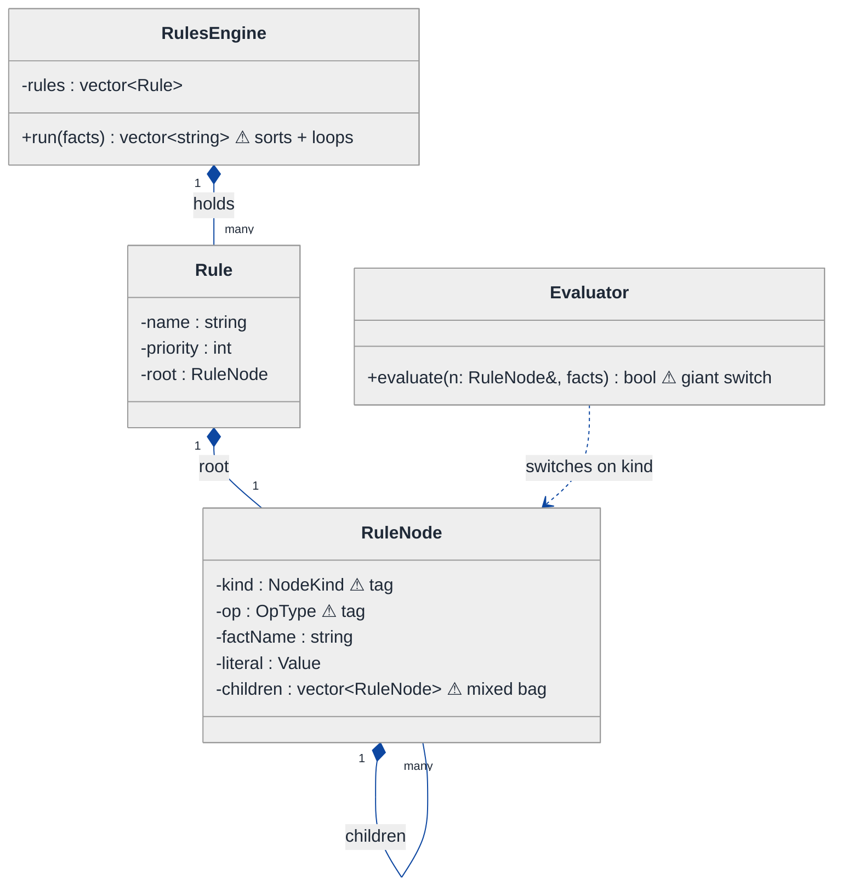
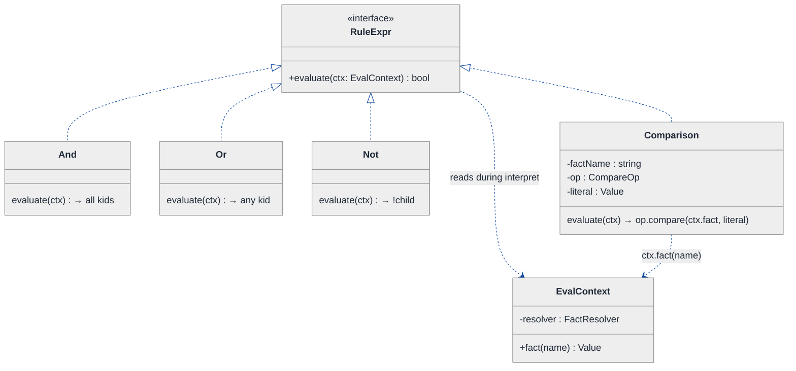
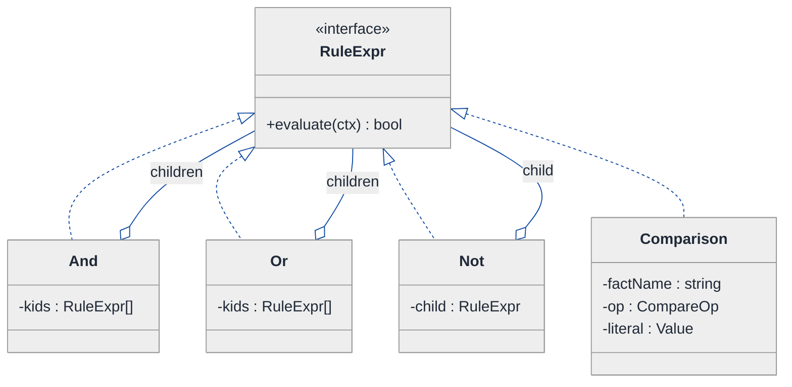
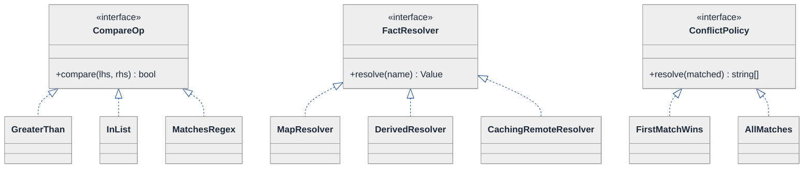
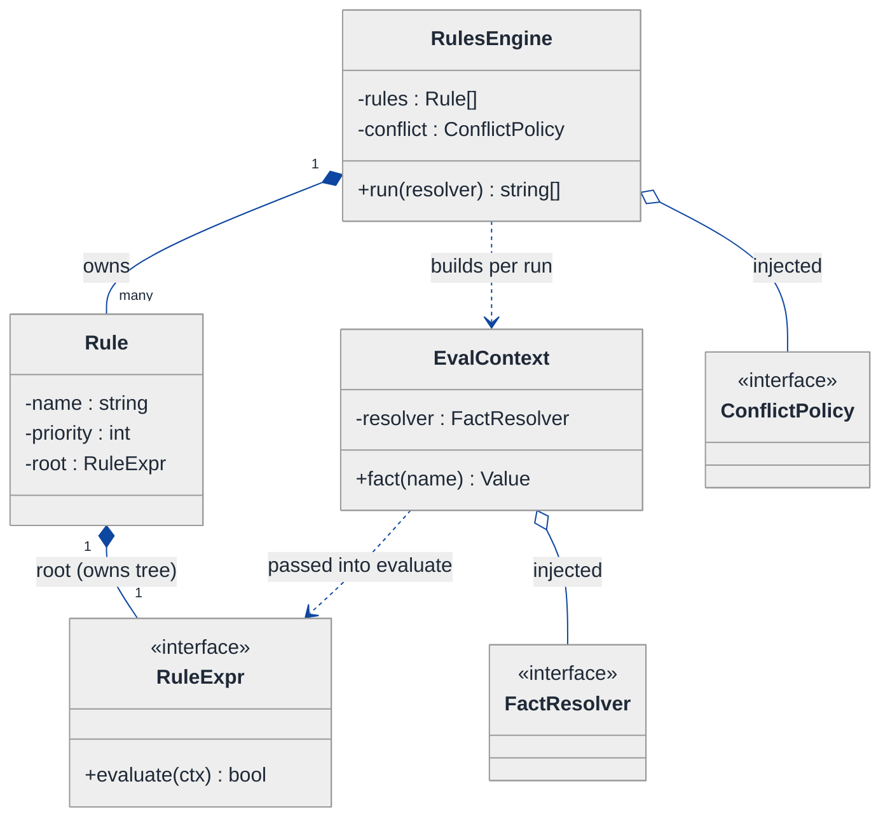

# Rules Engine (DSL / config-driven) — LLD Walkthrough

> **Difficulty:** Hard · **Time:** ~45 min · **Pattern focus:** Interpreter + Composite (with Strategy for fact resolution)
>
> **Problem source(s):** GID CP2, bucket `Composite_Pattern`. Representative of "build a rules engine / DSL evaluator" LLD prompts.
>
> **Diagrams:** inline mermaid (renders natively in GitHub / VS Code). Light theme + soft pastel fills + navy arrows — the repo-canonical block.

---

## How to use this file

Paced for a candidate seeing "design a rules engine" for the first time. Reading time: ~45 minutes if you sketch each iteration by hand. **The lesson: a rules engine is a TREE of expressions, and the two patterns that turn a tree into an evaluator are Composite (uniform tree shape) and Interpreter (uniform `evaluate` on every node). Don't reach for them up front — DERIVE them by writing the naive flat evaluator first, watching it collapse under nesting and new operators, and reaching for ONE pattern per painful axis.**

**Map of this file (15 sections):**

1. Problem statement + clarifying questions
2. Plain-English restatement
3. Why this matters
4. Mental model
5. Try it yourself first
6. Entity & verb extraction
7. **Iteration 1: the naive design** — a flat evaluator with a type tag
8. **Where the naive design hurts** — five future requirements, one painful diff each
9. **Pivot 1: Composite for the AND/OR/NOT tree** — the structural axis first
10. **Pivot 2: Interpreter for uniform evaluation** — one `evaluate(Context&)` on every node
11. **Pivot 3: Strategy for dynamic fact resolution (+ priority & short-circuit)**
12. Final UML class diagram (three sub-views)
13. Skeleton code (C++17)
14. Key flow — sequence diagram
15. Extensibility re-check + anti-patterns + how to think aloud + self-check

---

## 1. Problem statement + clarifying questions

**Prompt (typical phrasing):** "Design a rules engine that evaluates business rules defined in a DSL or configuration. Support AND/OR/NOT composition, comparison operators, dynamic fact resolution, rule priority, and short-circuit evaluation."

A concrete rule, in some config DSL, might read:

```
RULE "premium-fraud-hold" PRIORITY 100:
  (order.amount > 5000 AND customer.tenureDays < 30)
  OR NOT customer.isVerified
```

**Clarifying questions to ask BEFORE drawing anything:**

1. **What are the fact types?** Just numbers and strings, or also booleans, dates, lists, nested objects (`order.items[*].sku`)?
2. **Where do facts come from?** A flat map passed in by the caller, or resolved lazily (DB lookup, remote service, derived/computed facts)? Can resolving a fact fail or be expensive?
3. **What operators?** Comparison only (`> < >= <= == !=`), or also `IN`, `BETWEEN`, `MATCHES regex`, `CONTAINS`? Boolean composition is given (AND/OR/NOT) — anything beyond that?
4. **What does "evaluate" return?** Just a boolean per rule, or a matched-rule set, or the first matching rule by priority (conflict resolution)?
5. **What does priority MEAN?** Order of evaluation, or order of the resulting action when several rules match? Do we stop at the first match (short-circuit across rules) or collect all matches?
6. **Short-circuit semantics?** Standard boolean short-circuit (`false AND x` skips `x`)? Does the engine guarantee left-to-right, and does that matter because fact resolution has side effects / cost?
7. **Who authors rules?** Engineers in code, or non-engineers via a config file / UI that we must parse? (Parsing is a separate concern from evaluation — I'll assume rules arrive as an already-parsed tree unless told otherwise.)
8. **Mutability / hot reload?** Are rules loaded once at startup, or reloaded at runtime without a redeploy?

**Assumptions if the interviewer dodges:** facts are typed values (number / string / bool) resolved lazily through a `FactResolver` that may be a flat map OR a remote lookup; operators are the comparison set plus `IN`; AND/OR short-circuit left-to-right; each rule yields a boolean and rules are evaluated highest-priority-first with "first match wins" conflict resolution; rules arrive as a parsed expression tree (we focus on evaluation, not lexing/parsing the DSL text); rules can be hot-reloaded as a new tree.

---

## 2. Plain-English restatement

We're building the engine that takes a business rule — a boolean expression over facts about the world — and answers "does this rule fire for this situation?" The expression nests arbitrarily: ANDs of ORs of NOTs of comparisons. The leaves are comparisons like `order.amount > 5000`; the `order.amount` part is a fact we must look up (maybe from a map, maybe from a service). The engine must support adding new operators and new fact sources **without rewriting the evaluator**, must evaluate the highest-priority rules first, and must short-circuit (stop evaluating an AND the moment a child is false) so we don't do expensive fact lookups we don't need.

---

## 3. Why this matters

This question separates candidates who model data from candidates who model *behavior over a recursive structure*. A rules engine is the textbook case where the problem itself is a tree (the expression) and the operation (`evaluate`) must run uniformly over leaves and internal nodes alike. It's the canonical pairing of Composite (the tree) and Interpreter (the operation on the tree). The same shape reappears in query planners, validation frameworks, feature-flag engines, pricing engines, and every config-driven "if X then Y" system. Get this and you can design half the policy engines you'll ever meet.

---

## 4. Mental model

A rule is a **boolean expression tree**. Internal nodes are boolean combinators (AND, OR, NOT); leaf nodes are comparisons that read a fact and compare it to a value. "Evaluate the rule" means "walk the tree, ask each node for its truth value, let the combinators fold their children's answers."

```
Real-world sketch (NOT a UML diagram yet) — the rule from §1:

                    ┌──────── OR ────────┐
                    │                    │
              ┌──── AND ────┐          ┌ NOT ┐
              │             │          │     │
       amount > 5000   tenureDays<30   isVerified == true
        (leaf)            (leaf)            (leaf)

Facts resolved on demand:  order.amount → 7200
                           customer.tenureDays → 12
                           customer.isVerified → false
```

The KEY insight from this picture: **leaves and internal nodes must answer the SAME question** — "what's your boolean value?" — so the parent can treat all children uniformly. If a leaf and an AND-node have different shapes, the parent needs a type-switch. Make them the same shape and the type-switch disappears. That uniformity is the whole game.

---

## 5. Try it yourself first

> **Predict before reading on:**
>
> 1. List the nouns you'd promote to a class. Which ones are "internal node" vs "leaf"?
> 2. **If I told you the engine will need a new operator `BETWEEN` and a new combinator `XOR` next quarter, what would change about how you write the evaluator?**
> 3. Where does "short-circuit: stop evaluating an AND once a child is false" physically live in the code? Is it in the engine, or in the AND itself?

---

## 6. Entity & verb extraction

> **Mini-refresher: noun → class, but not every noun.**
>
> Naive OOD promotes every noun to a class. Senior OOD promotes a noun only if it has both BEHAVIOR and STATE that need to live together. "Operator symbol" usually stays a field or an enum; "AND node" becomes a class because it has evaluation behavior AND owns child nodes.

**Nouns from the prompt:**

| Noun | Decision | Why |
|---|---|---|
| Rule | Class | Has a name, a priority, and an expression tree root + the fire decision |
| Expression (AND/OR/NOT/comparison) | Class hierarchy (abstract + concretes) | Each evaluates; the recursive heart of the design |
| Comparison (leaf) | Class | Reads a fact, compares to a literal |
| Fact | NOT a class — a resolved value | A typed value (number/string/bool); the *name* is a field |
| FactResolver | Class (abstract) + concretes | "Where do facts come from" varies — map, remote, derived |
| Operator (`> < == IN ...`) | Strategy/enum behind comparison | Varies; the comparison delegates the actual compare |
| Priority | Field on Rule (int) | No behavior of its own |
| Engine / RulesEngine | Class (top-level coordinator) | Holds rules, orders by priority, drives evaluation |

**Verbs (and the class they live on):**

| Verb | Owner class (naive answer — we'll re-examine) |
|---|---|
| evaluate(facts) | Expression node (naive: a flat `Evaluator`) |
| resolve(factName) | FactResolver |
| compare(lhs, rhs) | Comparison (naive: inline switch on operator) |
| run(facts) → matched rules | RulesEngine |
| addRule(rule) / orderByPriority() | RulesEngine |

**We have NOT introduced any design patterns yet.** Pure nouns + verbs.

---

## 7. <a id="iter-1"></a>Iteration 1: the naive design

Let's write the simplest thing that could possibly work. A rule is a struct holding a "kind" tag and some children; one big `evaluate()` function switches on the kind. No patterns.



**Reader's tour (read top to bottom; ~60 seconds).**

1. **`RuleNode` is one struct doing four jobs.** Look at the warning markers (⚠). A single node type carries a `kind` tag (AND / OR / NOT / COMPARE), an `op` tag (the comparison operator), a `factName`, a `literal`, AND a `children` vector. A COMPARE node uses `factName`/`literal`/`op` and ignores `children`; an AND node uses `children` and ignores the rest. **Half the fields are dead on any given node.** This is the "struct with a kind tag" smell.

2. **`Evaluator::evaluate` is a giant switch.** It takes a node, switches on `kind`, recurses for AND/OR/NOT, and for COMPARE switches *again* on `op`. Two nested switches in one function. Every new combinator or operator adds a case here.

3. **`Rule` is thin** — name, priority, and a root node. Fine for now.

4. **`RulesEngine::run` sorts rules by priority and loops**, calling the Evaluator on each. The priority logic and the conflict-resolution logic ("first match wins"? "all matches"?) are baked inline here.

5. **The composition spine** is real: a Rule owns its root node; a node owns its children; the engine owns its rules. That part is fine — it's the *uniformity* that's missing.

**What's deliberately missing.** No `Expression` interface — leaves and internal nodes are the same struct distinguished by a tag. No `FactResolver` — facts are a flat `map<string, Value>` passed around. No operator abstraction — comparison is an inline switch. The naive design doesn't acknowledge that "node kind," "operator," and "fact source" are three independent axes of variation; it bakes a hardcoded answer for each into the evaluator.

Skeleton code for the naive design (C++17):

```cpp
#include <map>
#include <memory>
#include <stdexcept>
#include <string>
#include <variant>
#include <vector>
#include <algorithm>

using Value = std::variant<double, std::string, bool>;
using Facts = std::map<std::string, Value>;

enum class NodeKind { AND, OR, NOT, COMPARE };
enum class OpType   { GT, LT, GE, LE, EQ, NE };

struct RuleNode {
    NodeKind kind;
    OpType   op{};                 // used only when kind == COMPARE
    std::string factName;          // used only when kind == COMPARE
    Value    literal;              // used only when kind == COMPARE
    std::vector<std::unique_ptr<RuleNode>> children;  // used only for AND/OR/NOT
};

struct Rule {
    std::string name;
    int priority = 0;
    std::unique_ptr<RuleNode> root;
};

class Evaluator {
public:
    bool evaluate(const RuleNode& n, const Facts& facts) const {
        switch (n.kind) {                                  // ⚠ switch #1: node kind
            case NodeKind::AND:
                for (auto& c : n.children)
                    if (!evaluate(*c, facts)) return false; // short-circuit baked in here
                return true;
            case NodeKind::OR:
                for (auto& c : n.children)
                    if (evaluate(*c, facts)) return true;
                return false;
            case NodeKind::NOT:
                return !evaluate(*n.children.front(), facts);
            case NodeKind::COMPARE: {
                auto it = facts.find(n.factName);           // flat-map fact lookup
                if (it == facts.end()) throw std::runtime_error("missing fact: " + n.factName);
                double lhs = std::get<double>(it->second);  // assumes number!
                double rhs = std::get<double>(n.literal);
                switch (n.op) {                             // ⚠ switch #2: operator
                    case OpType::GT: return lhs >  rhs;
                    case OpType::LT: return lhs <  rhs;
                    case OpType::GE: return lhs >= rhs;
                    case OpType::LE: return lhs <= rhs;
                    case OpType::EQ: return lhs == rhs;
                    case OpType::NE: return lhs != rhs;
                }
            }
        }
        throw std::runtime_error("unknown node kind");
    }
};

class RulesEngine {
public:
    void addRule(Rule r) { rules_.push_back(std::move(r)); }
    std::vector<std::string> run(const Facts& facts) {
        std::sort(rules_.begin(), rules_.end(),
                  [](const Rule& a, const Rule& b){ return a.priority > b.priority; });
        std::vector<std::string> fired;
        Evaluator ev;
        for (auto& r : rules_)
            if (ev.evaluate(*r.root, facts)) fired.push_back(r.name);  // collects all matches
        return fired;
    }
private:
    std::vector<Rule> rules_;
};
```

**This works.** It has zero design patterns. We can build a tree, evaluate AND/OR/NOT, compare numbers, sort by priority. So what's wrong with it?

---

## 8. <a id="naive-pain"></a>Where the naive design hurts

The interviewer slides a piece of paper across the desk: "Here are five things the rules team wants next quarter. Walk me through what changes."

### Change A: "Add a `BETWEEN` operator and an `IN` operator (value in a list)"

In the naive design:
- `OpType` enum gains `BETWEEN`, `IN`.
- `RuleNode` needs a *second* literal (for BETWEEN's upper bound) and a *list* literal (for IN) — but the struct only has one `Value literal`. So you bolt on `Value literal2;` and `vector<Value> list;`, growing the dead-field problem.
- `Evaluator::evaluate`'s inner switch (`switch #2`) gains two cases.
- **Touches the enum, the struct shape, AND the evaluator switch. Three places, and the struct gets more fields that are dead on every other node.**

### Change B: "Add an `XOR` combinator and a `MAJORITY` combinator (true if >half children true)"

In the naive design:
- `NodeKind` enum gains `XOR`, `MAJORITY`.
- `Evaluator::evaluate`'s outer switch (`switch #1`) gains two cases — and `MAJORITY` needs a counting loop inline.
- **Every new combinator is surgery in the one function that already knows about every other combinator. The function only grows.**

### Change C: "Facts aren't a flat map anymore — `customer.tenureDays` must be fetched from a service; `cart.total` is computed from line items"

In the naive design:
- The COMPARE case does `facts.find(n.factName)` against a `std::map`. There's nowhere to plug in "this fact comes from a remote call" or "this fact is derived."
- You'd thread a lookup function through `evaluate(... , const Facts&)` everywhere, or make `Facts` a class with virtual methods — but `evaluate` is hardcoded to `std::map` semantics.
- **Fact resolution is fused into the evaluator. Changing the source means changing the evaluator's signature and body.**

### Change D: "Comparisons must work on strings and dates, not just numbers"

In the naive design:
- `evaluate` does `std::get<double>(...)` unconditionally — it ASSUMES numbers.
- Supporting strings means branching on the `Value` variant's held type inside every operator case.
- **The single compare path explodes into a type-by-operator matrix inside one function.**

### Change E: "Stop at the first matching rule by priority (conflict resolution), and make short-circuit configurable"

In the naive design:
- `run()` collects ALL matches. Switching to "first match wins" means editing the loop.
- Short-circuit lives inside `evaluate`'s AND/OR cases. Making it configurable (e.g., evaluate-all to collect every failed sub-condition for an audit log) means a flag threaded into `evaluate`.
- **Conflict-resolution policy is hardcoded in `run`; short-circuit policy is hardcoded in `evaluate`. Two policies welded to two functions.**

### The pattern of pain

| Change | Files / lines touched | Smell |
|---|---|---|
| A. New operators | `OpType` + `RuleNode` fields + `evaluate` switch #2 | "Struct grows dead fields; one switch knows every operator." |
| B. New combinators | `NodeKind` + `evaluate` switch #1 | "Adding a node type edits the function that knows all node types." |
| C. Lazy/remote facts | `evaluate` signature + body | "Fact source fused into the evaluator." |
| D. Typed comparisons | `evaluate` COMPARE case | "Type×operator matrix in one function." |
| E. Conflict + short-circuit policy | `run` + `evaluate` | "Two policies hardcoded into two methods." |

**Three axes of pain dominate.** (1) *Structural*: leaves and internal nodes are one tagged struct, so adding a node type edits a central switch. (2) *Operation*: `evaluate` is one giant function that knows every node kind AND every operator. (3) *Policy*: fact resolution, conflict resolution, and short-circuit are all hardcoded.

> **Pivot question:** "What pattern lets me add new node types WITHOUT editing a central switch — by making every node, leaf or branch, respond to the same call? And once nodes are uniform, what pattern lets each node carry its OWN evaluation logic instead of one mega-function carrying all of it?"
>
> The answers are Composite (uniform tree shape) and Interpreter (each node interprets itself). Let's introduce them one at a time, starting with the most painful axis: the structural one.

---

## 9. <a id="pivot-1"></a>Pivot 1: Composite for the AND/OR/NOT tree

> **Mini-refresher: Composite pattern.**
>
> Lets you treat individual objects (leaves) and compositions of objects (branches) UNIFORMLY through a common interface. The branch holds a collection of the same interface type and, in its operation, recurses over its children. The CALLER can't tell a leaf from a branch — both answer the same method.
>
> Quick example: a filesystem. `File` (leaf) and `Folder` (composite) both implement `size()`. A `Folder::size()` sums its children's `size()`. Client code calls `node.size()` without caring which it holds.

**Why Composite fits the rule tree.** The pain in Change B was: adding a combinator edits the central switch because nodes aren't uniform — the evaluator must *know* whether it's holding an AND or a leaf to decide whether to recurse. Composite kills that: define a common `RuleExpr` interface; make `And`, `Or`, `Not` composites that hold `vector<RuleExpr>` children; make `Comparison` a leaf. Now a parent recurses over children *through the interface* without knowing their concrete type. Adding `Xor` is a new leaf-or-branch class — **no central switch to edit.**

> **Mini-refresher: open/closed principle (the "O" in SOLID).**
>
> Software entities should be OPEN for extension but CLOSED for modification. You should be able to add behavior by adding code (new classes), not by editing existing, tested code. The naive `switch (n.kind)` violates this — every new kind forces an edit to a function that already works. Composite restores it: a new node kind is a new class.

**The refactor (just the tree structure):**

```cpp
class RuleExpr {                                   // the uniform interface
public:
    virtual ~RuleExpr() = default;
    virtual bool evaluate(/* context — added in Pivot 2 */) const = 0;
};

// ── Composites (internal nodes): hold children of the SAME interface ──
class And : public RuleExpr {
public:
    explicit And(std::vector<std::unique_ptr<RuleExpr>> kids) : kids_(std::move(kids)) {}
    bool evaluate() const override {
        for (const auto& k : kids_)
            if (!k->evaluate()) return false;       // short-circuit lives HERE, in the And
        return true;
    }
private:
    std::vector<std::unique_ptr<RuleExpr>> kids_;
};

class Or : public RuleExpr {
public:
    explicit Or(std::vector<std::unique_ptr<RuleExpr>> kids) : kids_(std::move(kids)) {}
    bool evaluate() const override {
        for (const auto& k : kids_)
            if (k->evaluate()) return true;
        return false;
    }
private:
    std::vector<std::unique_ptr<RuleExpr>> kids_;
};

class Not : public RuleExpr {
public:
    explicit Not(std::unique_ptr<RuleExpr> child) : child_(std::move(child)) {}
    bool evaluate() const override { return !child_->evaluate(); }
private:
    std::unique_ptr<RuleExpr> child_;             // NOT has exactly one child
};

// Comparison is the LEAF — fleshed out in Pivot 2. For now it's a stub that returns its truth.
class Comparison : public RuleExpr { /* leaf — see Pivot 2 */ };
```

**What changed — visualized.** Just the structural slice:

```mermaid
---
config:
  theme: neutral
  themeVariables:
    background: '#ffffff'
    primaryColor: '#cfe2ff'
    primaryTextColor: '#1f2937'
    primaryBorderColor: '#084298'
    secondaryColor: '#fff3cd'
    secondaryTextColor: '#1f2937'
    secondaryBorderColor: '#664d03'
    tertiaryColor: '#d1e7dd'
    tertiaryTextColor: '#1f2937'
    tertiaryBorderColor: '#0a3622'
    lineColor: '#0d47a1'
    textColor: '#1f2937'
    noteBkgColor: '#fff3cd'
    noteTextColor: '#1f2937'
    noteBorderColor: '#997404'
    actorBkg: '#cfe2ff'
    actorBorder: '#084298'
    actorTextColor: '#1f2937'
    signalColor: '#0d47a1'
    signalTextColor: '#1f2937'
    labelBoxBkgColor: '#ffffff'
    labelBoxBorderColor: '#d3d3d3'
    labelTextColor: '#1f2937'
    edgeLabelBackground: '#ffffff'
    labelBackground: '#ffffff'
    classText: '#1f2937'
    fontFamily: 'system-ui, -apple-system, Segoe UI, Helvetica, Arial, sans-serif'
  themeCSS: |
    .messageText, .labelText, .sequenceNumber {
      paint-order: stroke fill;
      stroke: #ffffff;
      stroke-width: 5px;
      stroke-linejoin: round;
      stroke-linecap: round;
    }
    .edgePath path,
    .flowchart-link,
    .messageLine0,
    .messageLine1,
    .relation,
    .composition,
    .aggregation,
    .extension,
    .dependency {
      stroke-width: 2.5px !important;
    }
    marker path {
      stroke-width: 1.5px !important;
    }
---
classDiagram
  direction TB
  class RuleExpr {
    <<interface>>
    +evaluate() bool
  }
  class And {
    -kids : RuleExpr[]
    evaluate → all kids true
  }
  class Or {
    -kids : RuleExpr[]
    evaluate → any kid true
  }
  class Not {
    -child : RuleExpr
    evaluate → !child
  }
  class Comparison {
    (leaf — see Pivot 2)
  }
  RuleExpr <|.. And
  RuleExpr <|.. Or
  RuleExpr <|.. Not
  RuleExpr <|.. Comparison
  And o-- RuleExpr : children
  Or o-- RuleExpr : children
  Not o-- RuleExpr : child
```

**Tour of the after-state.**

1. **Top: the `<<interface>>` `RuleExpr`.** One pure-virtual method, `evaluate()`. This is the uniform contract — the thing that makes a leaf and a branch indistinguishable to a caller.

2. **`And`, `Or`, `Not` are composites.** Each holds children *of type `RuleExpr`* (the open diamond `◇` marks aggregation of the interface). Crucially, a child can itself be an `And` or a `Comparison` — the branch neither knows nor cares. That's what lets the tree nest arbitrarily.

3. **`Not` holds exactly one child**, the others hold many. The interface is the same; the arity differs. That's fine — arity is each composite's private business.

4. **`Comparison` is the leaf** — implements `RuleExpr` but holds no children. To the parent `And`, a `Comparison` and a nested `Or` look identical: both are `RuleExpr*` that answer `evaluate()`.

5. **Short-circuit now lives in the right place.** Look back at the code: `And::evaluate` returns `false` the instant a child is false; `Or::evaluate` returns `true` the instant a child is true. **The short-circuit is a property of the combinator itself**, not a flag in a central function. Change B from §8 (add `Xor`, `Majority`) is now ONE new class each implementing `evaluate()` — zero edits to `And`, `Or`, `Not`.

**Change B from §8 now lands cleanly.** A new combinator is a new `RuleExpr` subclass. No switch to edit anywhere.

**Pattern-discrimination cheatsheet — Composite vs Decorator.**
- *Composite:* a branch holds MANY children of the interface; the operation FOLDS over them (sum, all-true, any-true). Models a part-whole tree.
- *Decorator:* a wrapper holds ONE wrapped object of the interface; it ADDS behavior around a single delegate. Models layered enhancement.
- *Rule of thumb:* if the node aggregates a *collection* and the meaning is "combine my children" → Composite. If it wraps *one* thing to augment it → Decorator. `Not` looks decorator-ish (one child) but it's a degenerate composite — it's part of the same tree algebra as And/Or, not an add-on layer.

We chose Composite because AND/OR genuinely fold over a *set* of sub-rules and the tree nests — that's a part-whole hierarchy, not a wrapping chain.

---

## 10. <a id="pivot-2"></a>Pivot 2: Interpreter for uniform evaluation

Composite gave us a uniform tree shape. But notice the `evaluate()` in Pivot 1 took no arguments and the `Comparison` leaf was a stub. Changes A (new operators), C (lazy facts), and D (typed comparisons) are still painful — because we haven't said WHAT a leaf does when it evaluates, or HOW the boolean value flows down with context. That's the Interpreter pattern's job.

> **Mini-refresher: Interpreter pattern.**
>
> Given a language (here, the boolean-rule DSL), represent each grammar rule as a class, and give every class an `interpret(context)` method. The TREE of these objects (built by a parser) IS the program; calling `interpret` on the root recursively evaluates the whole expression. The "context" carries everything the leaves need to produce a value (variable bindings — i.e., facts).
>
> Quick example: an arithmetic evaluator. `NumberExpr`, `PlusExpr`, `TimesExpr` each implement `interpret(ctx)`. `PlusExpr::interpret` returns `left->interpret(ctx) + right->interpret(ctx)`. The tree of expr objects evaluates itself.

**Why Interpreter (and how it rides on Composite).** Composite is the *structure* (uniform tree of nodes). Interpreter is the *operation* (`evaluate(context)` defined per node-class). They are siblings that almost always travel together for language/expression problems: Composite says "every node has the same interface"; Interpreter says "that interface is `interpret(context)` and each node implements its own grammar rule." We promote `evaluate()` to take an `EvalContext&` that carries the facts, and we give the `Comparison` leaf real evaluation logic. The giant `switch (n.kind)` from the naive design is now distributed across the node classes — each node interprets *itself*.

> **Mini-refresher: Single Responsibility Principle (the "S" in SOLID).**
>
> A class should have one reason to change. The naive `Evaluator` had FIVE reasons to change (one per node kind plus operators). After Interpreter, `And` changes only if AND's semantics change; `Comparison` changes only if comparison semantics change. Each node owns one grammar rule.

**The refactor — the context + the leaf + the promoted interface:**

```cpp
// Context carries the bindings (facts) that leaves read during interpretation.
class EvalContext {
public:
    explicit EvalContext(const FactResolver& resolver) : resolver_(resolver) {}
    Value fact(const std::string& name) const { return resolver_.resolve(name); }  // see Pivot 3
private:
    const FactResolver& resolver_;
};

// The interface gains the context parameter — THIS is the Interpreter contract.
class RuleExpr {
public:
    virtual ~RuleExpr() = default;
    virtual bool evaluate(const EvalContext& ctx) const = 0;     // interpret(context)
};

// Composites now thread the context down to children:
class And : public RuleExpr {
public:
    explicit And(std::vector<std::unique_ptr<RuleExpr>> kids) : kids_(std::move(kids)) {}
    bool evaluate(const EvalContext& ctx) const override {
        for (const auto& k : kids_)
            if (!k->evaluate(ctx)) return false;     // short-circuit: skips remaining fact lookups
        return true;
    }
private:
    std::vector<std::unique_ptr<RuleExpr>> kids_;
};
// Or, Not elided — same shape, threading ctx

// The LEAF: a Comparison interprets itself. It pulls a fact from context and compares.
class Comparison : public RuleExpr {
public:
    Comparison(std::string factName, std::unique_ptr<CompareOp> op, Value literal)
        : factName_(std::move(factName)), op_(std::move(op)), literal_(std::move(literal)) {}
    bool evaluate(const EvalContext& ctx) const override {
        Value lhs = ctx.fact(factName_);             // dynamic fact resolution (Pivot 3)
        return op_->compare(lhs, literal_);          // operator is a Strategy (Pivot 3)
    }
private:
    std::string                  factName_;
    std::unique_ptr<CompareOp>   op_;                // pluggable operator — Pivot 3
    Value                        literal_;
};
```

**What changed — visualized.** The evaluation slice, now with context flowing through:



**Tour of the after-state.**

1. **`evaluate` now takes an `EvalContext&`.** This is the Interpreter "context" — the bag of bindings the leaves read. It flows DOWN the tree unchanged: `And::evaluate(ctx)` passes the same `ctx` to each child. Internal nodes never touch facts; only leaves do.

2. **The giant naive switch is GONE — distributed across classes.** `And` interprets the AND rule, `Or` the OR rule, `Comparison` the comparison rule. Each class is the home of exactly one grammar production. To read "what does OR mean," you open `Or` — not a 60-line switch.

3. **`Comparison` is where facts meet operators.** Its `evaluate` does two delegations: `ctx.fact(factName_)` to resolve the left-hand side, and `op_->compare(lhs, literal_)` to apply the operator. Both of those are about to become pluggable in Pivot 3 — but note the SHAPE is already right: the leaf doesn't hardcode `std::get<double>` or a `switch(op)` anymore.

4. **Short-circuit is now a performance feature, not just correctness.** Because `And::evaluate` returns on the first false child, and because facts are resolved lazily inside `Comparison::evaluate` (Pivot 3), a short-circuited branch **never resolves its facts**. If `customer.isVerified == true` is false and it's the first child of an AND, the expensive `order.riskScore` lookup in the second child never runs. The structure delivers the optimization for free.

**Changes A, C, D from §8 are now reachable** — the leaf is the single place that knows about operators (A, D) and fact lookup (C), and it delegates both. Pivot 3 makes those delegations pluggable.

**Pattern-discrimination cheatsheet — Interpreter vs Visitor.**
- *Interpreter:* the operation (`evaluate`) lives ON each node class. Adding a new node type is easy (new class); adding a new *operation* over the tree means touching every node class.
- *Visitor:* the operation lives in a separate visitor object; nodes just `accept(visitor)`. Adding a new operation is easy (new visitor); adding a new node type means touching every visitor.
- *Rule of thumb:* if you expect MANY node types but FEW operations → Interpreter. If you expect FEW node types but MANY operations (pretty-print, validate, optimize, evaluate, serialize) → Visitor.

We chose Interpreter because a rules engine adds *node types / operators* constantly but has essentially ONE operation: evaluate. If we later need many operations over the same tree (lint rules, explain-why, cost-estimate), we'd add a Visitor layer — but that's premature now.

---

## 11. <a id="pivot-3"></a>Pivot 3: Strategy for dynamic fact resolution (+ priority & short-circuit)

Changes A, B, C, D are structurally reachable; let's make the last two delegations pluggable and then handle the engine-level policy (priority, conflict resolution). Three remaining axes, all the same shape as the operator/fact delegations the leaf already does.

> **Mini-refresher: Strategy pattern.**
>
> Encapsulates an algorithm behind an interface so it can be swapped at runtime. The CALLER (or config) decides which strategy to use; the strategy doesn't know about its peers.
>
> Quick example: a `Comparison` takes a `CompareOp*`. Pass `GreaterThan`, `InList`, or `MatchesRegex` — the comparison delegates and doesn't care which.

**The remaining axes:**

| Axis | Pattern | One sentence why |
|---|---|---|
| Comparison operator (`> IN BETWEEN MATCHES`) | Strategy | Each operator is an algorithm `compare(lhs, rhs) → bool`, picked when the rule is built |
| Fact resolution (map / remote / derived) | Strategy | "Where a fact comes from" varies; injected, not hardcoded into the leaf |
| Conflict resolution at the engine (first-match / all-match / weighted) | Strategy | Engine-wide policy chosen by config, not baked into `run()` |

**Operator as Strategy** — solves Changes A and D (new operators, typed comparisons):

```cpp
class CompareOp {
public:
    virtual ~CompareOp() = default;
    virtual bool compare(const Value& lhs, const Value& rhs) const = 0;
};

class GreaterThan : public CompareOp {
public:
    bool compare(const Value& lhs, const Value& rhs) const override {
        return std::get<double>(lhs) > std::get<double>(rhs);   // numeric overload
    }
};

class InList : public CompareOp {                                // Change A: value in a list
public:
    explicit InList(std::vector<Value> allowed) : allowed_(std::move(allowed)) {}
    bool compare(const Value& lhs, const Value&) const override {
        return std::find(allowed_.begin(), allowed_.end(), lhs) != allowed_.end();
    }
private:
    std::vector<Value> allowed_;
};
// Equals, LessThan, Between, MatchesRegex, StringContains ... elided — each a new class
```

**FactResolver as Strategy** — solves Change C (lazy / remote / derived facts):

```cpp
class FactResolver {
public:
    virtual ~FactResolver() = default;
    virtual Value resolve(const std::string& name) const = 0;
};

class MapResolver : public FactResolver {                        // the simple case
public:
    explicit MapResolver(Facts f) : facts_(std::move(f)) {}
    Value resolve(const std::string& name) const override {
        auto it = facts_.find(name);
        if (it == facts_.end()) throw std::runtime_error("missing fact: " + name);
        return it->second;
    }
private:
    Facts facts_;
};

// Composite-style resolver: try a chain of resolvers (map → derived → remote).
class CachingRemoteResolver : public FactResolver { /* memoize remote lookups — elided */ };
class DerivedResolver       : public FactResolver { /* cart.total = sum(items) — elided */ };
```

**Conflict resolution as Strategy** at the engine — solves Change E:

```cpp
struct Rule {
    std::string name;
    int priority = 0;
    std::unique_ptr<RuleExpr> root;
};

class ConflictPolicy {
public:
    virtual ~ConflictPolicy() = default;
    // given matched rules (already in priority order), pick the winners
    virtual std::vector<std::string> resolve(const std::vector<const Rule*>& matched) const = 0;
};
class FirstMatchWins : public ConflictPolicy {                  // stop at top-priority match
public:
    std::vector<std::string> resolve(const std::vector<const Rule*>& m) const override {
        return m.empty() ? std::vector<std::string>{} : std::vector<std::string>{ m.front()->name };
    }
};
class AllMatches : public ConflictPolicy { /* return every matched name — elided */ };
```

> **Mini-refresher: dependency injection.**
>
> Instead of a class constructing its collaborators (`new MapResolver(...)` inside the engine), the collaborators are PASSED IN (via constructor). This lets the caller choose the implementation and lets tests inject fakes. The engine below receives its `ConflictPolicy`; the `EvalContext` receives its `FactResolver`. Neither hardcodes a concrete class.

**The lesson.** Once Pivot 1 (Composite) and Pivot 2 (Interpreter) made the tree uniform and self-evaluating, every remaining "this varies" axis is the SAME move: pull it behind an interface and inject it. Operator, fact source, conflict policy — three Strategies, identical shape.

> **Mini-refresher: why three independent Strategy hierarchies don't share one interface.**
>
> Strategy is a *role*, not a type. `CompareOp`, `FactResolver`, and `ConflictPolicy` have nothing in common at the type level (different inputs, different outputs). Don't unify them under a single `Strategy<T>` template — that's premature genericism that buys nothing.

---

## 12. <a id="fig-class-diagram"></a>Final class diagram

Showing the entire design in one diagram is a wall of boxes. Here are **three focused sub-views**: the expression tree (Composite + Interpreter), the pluggable policies (Strategy), and the engine that drives it all. Read in order; the structural insight at the end ties them together.

### 12.1 The expression tree — Composite shape + Interpreter operation



**Tour of 12.1.** This is the Composite spine. `RuleExpr` is the uniform interface; `And`/`Or`/`Not` are composites that aggregate `RuleExpr` children (open diamond `◇` — they reference the interface, the parser owns lifetimes via `unique_ptr`); `Comparison` is the leaf. The Interpreter pattern is the `evaluate(ctx)` method on every box — the operation lives ON the nodes. A new combinator (`Xor`, `Majority`) or a new leaf kind is a new subclass of `RuleExpr` and NOTHING else changes.

### 12.2 The pluggable policies — three independent Strategy hierarchies



**Tour of 12.2.** Three independent Strategy families, one per varying axis. `CompareOp` (the leaf delegates to it — new operators land here), `FactResolver` (the `EvalContext` delegates to it — new fact sources land here, including a composite resolver that chains map → derived → remote), and `ConflictPolicy` (the engine delegates to it — first-match vs all-match). They share NO base class because they're different roles. Each new variant is a new leaf class under the relevant interface — open/closed across all three axes.

### 12.3 The engine and the rule — what drives evaluation



**Tour of 12.3.**

1. **`RulesEngine` owns the rules and a `ConflictPolicy`.** The filled diamond (`◆`) to `Rule` is composition — the engine owns rule lifetimes. The open diamond to `ConflictPolicy` is aggregation — injected, swappable.

2. **`Rule` owns its expression tree root** (`◆ RuleExpr`). Priority is just an int field; the engine reads it to sort. The root is the top of the Composite tree from 12.1.

3. **`EvalContext` is built per `run()`** and wraps an injected `FactResolver`. The engine creates a context, hands it to each rule's `root->evaluate(ctx)`. The same context (same resolver) serves all rules in one run — so a remote fact resolved for rule 1 can be cached and reused by rule 5.

4. **The drive loop is policy-free.** `run()` sorts rules by priority, evaluates each root with the context, collects matches in priority order, then hands them to the `ConflictPolicy` to pick winners. The engine doesn't decide "first wins vs all win" — the policy does.

### Structural insight (ties 12.1 + 12.2 + 12.3 together)

| Concern | Pattern used | Why |
|---|---|---|
| **Tree shape** (AND/OR/NOT/leaf uniformity) | Composite | Leaves and branches share `RuleExpr`; branches recurse over children |
| **Evaluation** (`evaluate(ctx)` per node) | Interpreter | Each node interprets its own grammar rule; context flows down |
| **Operators** (`> IN BETWEEN MATCHES`) | Strategy | Leaf delegates the compare; new operator = new class |
| **Fact resolution** (map/remote/derived) | Strategy | Context delegates the lookup; new source = new class |
| **Conflict resolution** (first/all/weighted) | Strategy | Engine delegates the winner-pick; new policy = new class |
| **Priority & short-circuit** | Plain fields + combinator logic | Priority is a Rule int sorted by engine; short-circuit is intrinsic to And/Or |

The big lesson: **Composite + Interpreter is the inseparable pair for expression trees** — Composite gives uniform structure, Interpreter gives uniform operation. Everything that *varies* beyond the tree (operators, fact sources, conflict policy) becomes a Strategy injected at the right level. Note where each Strategy is injected: operator into the *leaf*, fact resolver into the *context*, conflict policy into the *engine* — each at the layer that owns that decision.

---

## 13. Skeleton code (C++17)

> Show the SHAPES, not the full impl. ~140 lines. Abstract bases + 1-2 concretes per pattern; the rest `// elided`.

```cpp
#include <algorithm>
#include <map>
#include <memory>
#include <stdexcept>
#include <string>
#include <variant>
#include <vector>

// ── Value type & forward decls ──────────────────────────────────────
using Value = std::variant<double, std::string, bool>;
using Facts = std::map<std::string, Value>;

class EvalContext;   // forward — defined below

// ── Strategy 1: comparison operators ────────────────────────────────
class CompareOp {
public:
    virtual ~CompareOp() = default;
    virtual bool compare(const Value& lhs, const Value& rhs) const = 0;
};
class GreaterThan : public CompareOp {
public:
    bool compare(const Value& l, const Value& r) const override {
        return std::get<double>(l) > std::get<double>(r);
    }
};
class Equals : public CompareOp {
public:
    bool compare(const Value& l, const Value& r) const override { return l == r; }
};
// LessThan, Between, InList, MatchesRegex ... elided

// ── Strategy 2: fact resolution ─────────────────────────────────────
class FactResolver {
public:
    virtual ~FactResolver() = default;
    virtual Value resolve(const std::string& name) const = 0;
};
class MapResolver : public FactResolver {
public:
    explicit MapResolver(Facts f) : facts_(std::move(f)) {}
    Value resolve(const std::string& name) const override {
        auto it = facts_.find(name);
        if (it == facts_.end()) throw std::runtime_error("missing fact: " + name);
        return it->second;
    }
private:
    Facts facts_;
};
// CachingRemoteResolver, DerivedResolver, ChainResolver ... elided

// ── Interpreter context ─────────────────────────────────────────────
class EvalContext {
public:
    explicit EvalContext(const FactResolver& r) : resolver_(r) {}
    Value fact(const std::string& name) const { return resolver_.resolve(name); }
private:
    const FactResolver& resolver_;
};

// ── Composite + Interpreter: the expression tree ────────────────────
class RuleExpr {
public:
    virtual ~RuleExpr() = default;
    virtual bool evaluate(const EvalContext& ctx) const = 0;   // interpret(context)
};

class And : public RuleExpr {                                  // composite
public:
    explicit And(std::vector<std::unique_ptr<RuleExpr>> kids) : kids_(std::move(kids)) {}
    bool evaluate(const EvalContext& ctx) const override {
        for (const auto& k : kids_)
            if (!k->evaluate(ctx)) return false;               // short-circuit
        return true;
    }
private:
    std::vector<std::unique_ptr<RuleExpr>> kids_;
};

class Or : public RuleExpr {                                   // composite
public:
    explicit Or(std::vector<std::unique_ptr<RuleExpr>> kids) : kids_(std::move(kids)) {}
    bool evaluate(const EvalContext& ctx) const override {
        for (const auto& k : kids_)
            if (k->evaluate(ctx)) return true;                 // short-circuit
        return false;
    }
private:
    std::vector<std::unique_ptr<RuleExpr>> kids_;
};

class Not : public RuleExpr {                                  // degenerate composite (1 child)
public:
    explicit Not(std::unique_ptr<RuleExpr> child) : child_(std::move(child)) {}
    bool evaluate(const EvalContext& ctx) const override { return !child_->evaluate(ctx); }
private:
    std::unique_ptr<RuleExpr> child_;
};

class Comparison : public RuleExpr {                           // leaf
public:
    Comparison(std::string fact, std::unique_ptr<CompareOp> op, Value literal)
        : fact_(std::move(fact)), op_(std::move(op)), literal_(std::move(literal)) {}
    bool evaluate(const EvalContext& ctx) const override {
        return op_->compare(ctx.fact(fact_), literal_);        // resolve fact, then compare
    }
private:
    std::string                fact_;
    std::unique_ptr<CompareOp> op_;
    Value                      literal_;
};

// ── Rule + Strategy 3: conflict resolution ──────────────────────────
struct Rule {
    std::string name;
    int priority = 0;
    std::unique_ptr<RuleExpr> root;
};

class ConflictPolicy {
public:
    virtual ~ConflictPolicy() = default;
    virtual std::vector<std::string> resolve(const std::vector<const Rule*>& matched) const = 0;
};
class FirstMatchWins : public ConflictPolicy {
public:
    std::vector<std::string> resolve(const std::vector<const Rule*>& m) const override {
        return m.empty() ? std::vector<std::string>{} : std::vector<std::string>{ m.front()->name };
    }
};
// AllMatches ... elided

// ── The engine (orchestrator) ───────────────────────────────────────
class RulesEngine {
public:
    explicit RulesEngine(std::unique_ptr<ConflictPolicy> policy) : policy_(std::move(policy)) {}
    void addRule(Rule r) { rules_.push_back(std::move(r)); }

    std::vector<std::string> run(const FactResolver& resolver) {
        std::sort(rules_.begin(), rules_.end(),
                  [](const Rule& a, const Rule& b){ return a.priority > b.priority; });
        EvalContext ctx(resolver);                 // one context (one resolver) per run
        std::vector<const Rule*> matched;
        for (const auto& r : rules_)
            if (r.root->evaluate(ctx)) matched.push_back(&r);   // priority order preserved
        return policy_->resolve(matched);          // policy picks the winners
    }
private:
    std::vector<Rule>                rules_;
    std::unique_ptr<ConflictPolicy>  policy_;
};
```

---

## 14. <a id="fig-sequence"></a>Key flow — sequence diagram

This is the moment of truth: watch Composite, Interpreter, and the two leaf-level Strategies cooperate as a single rule evaluates — and watch short-circuit SKIP a fact lookup.

We evaluate the rule from §1 against facts where `customer.isVerified == false`. Tree: `(amount > 5000 AND tenureDays < 30) OR NOT isVerified`.

```mermaid
---
config:
  theme: neutral
  themeVariables:
    background: '#ffffff'
    primaryColor: '#cfe2ff'
    primaryTextColor: '#1f2937'
    primaryBorderColor: '#084298'
    secondaryColor: '#fff3cd'
    secondaryTextColor: '#1f2937'
    secondaryBorderColor: '#664d03'
    tertiaryColor: '#d1e7dd'
    tertiaryTextColor: '#1f2937'
    tertiaryBorderColor: '#0a3622'
    lineColor: '#0d47a1'
    textColor: '#1f2937'
    noteBkgColor: '#fff3cd'
    noteTextColor: '#1f2937'
    noteBorderColor: '#997404'
    actorBkg: '#cfe2ff'
    actorBorder: '#084298'
    actorTextColor: '#1f2937'
    signalColor: '#0d47a1'
    signalTextColor: '#1f2937'
    labelBoxBkgColor: '#ffffff'
    labelBoxBorderColor: '#d3d3d3'
    labelTextColor: '#1f2937'
    edgeLabelBackground: '#ffffff'
    labelBackground: '#ffffff'
    classText: '#1f2937'
    fontFamily: 'system-ui, -apple-system, Segoe UI, Helvetica, Arial, sans-serif'
  themeCSS: |
    .messageText, .labelText, .sequenceNumber {
      paint-order: stroke fill;
      stroke: #ffffff;
      stroke-width: 5px;
      stroke-linejoin: round;
      stroke-linecap: round;
    }
    .edgePath path,
    .flowchart-link,
    .messageLine0,
    .messageLine1,
    .relation,
    .composition,
    .aggregation,
    .extension,
    .dependency {
      stroke-width: 2.5px !important;
    }
    marker path {
      stroke-width: 1.5px !important;
    }
---
sequenceDiagram
  participant Engine as RulesEngine
  participant Or
  participant And
  participant CmpAmt as Comparison(amount)
  participant Ctx as EvalContext
  participant Not
  participant CmpVer as Comparison(isVerified)
  participant Res as FactResolver
  Engine->>Or: 1: evaluate(ctx)
  Or->>And: 2: evaluate(ctx)
  And->>CmpAmt: 3: evaluate(ctx)
  CmpAmt->>Ctx: 4: fact("order.amount")
  Ctx->>Res: 5: resolve("order.amount")
  Res-->>Ctx: 6: 7200
  CmpAmt-->>And: 7: false (7200 > 5000 is true, but tenure check...)
  Note over And: amount>5000 true, then tenureDays<30 → false ⇒ AND short-circuits false
  And-->>Or: 8: false
  Or->>Not: 9: evaluate(ctx)
  Not->>CmpVer: 10: evaluate(ctx)
  CmpVer->>Ctx: 11: fact("customer.isVerified")
  Ctx->>Res: 12: resolve("customer.isVerified")
  Res-->>CmpVer: 13: false
  CmpVer-->>Not: 14: false (isVerified == true → false)
  Not-->>Or: 15: true (NOT false)
  Or-->>Engine: 16: true (short-circuit: OR stops, rule fires)
```

**Tour of the flow. Read it slowly — this is where all the patterns meet.**

1. **Engine calls `evaluate(ctx)` on the ROOT only.** The engine has no idea the root is an `Or` — it just calls the `RuleExpr` interface. That's Composite + Interpreter doing their job: the caller is blind to the tree's shape.

2. **`Or` recurses into its first child, the `And`.** It does this through the interface — `Or` doesn't know `And` is an AND; it just holds `RuleExpr` children and calls `evaluate` on them.

3. **`And` evaluates its first child** (`amount > 5000`). The `Comparison` leaf asks the `EvalContext` for the fact, which delegates to the injected `FactResolver` (Strategy). Resolver returns 7200; `7200 > 5000` is true via the `GreaterThan` operator (Strategy).

4. **`And` short-circuits on the SECOND child.** The `tenureDays < 30` child returns false (steps compressed in the note), so `And::evaluate` returns false immediately — it does NOT evaluate any further children it might have. Composite owns the short-circuit.

5. **`Or` moves to its second child, the `Not`.** First child (the And) was false, so OR can't short-circuit yet — it must check the next.

6. **`Not` evaluates its single child** (`isVerified == true`). The leaf resolves `customer.isVerified` → false, compares `false == true` → false. `Not` inverts → true.

7. **`Or` short-circuits TRUE and returns to the engine.** The rule fires. Notice: **the OR never needed to evaluate anything past the point a true child appeared.**

### The optimization that's NOT shown — and why it matters

Imagine the And's children were ordered `(riskScore > 900 AND isVerified == true)` where `riskScore` is an EXPENSIVE remote lookup, and `isVerified` is cheap and false. If `isVerified == true` were the *first* child and evaluated false, `And::evaluate` would short-circuit and **never call `resolve("order.riskScore")`** — the expensive remote call is skipped. **The Composite structure delivers the cost optimization for free**, with no special-casing in the engine. Rule authors who put cheap/likely-false conditions first get faster evaluation automatically. That's why short-circuit lives in the combinator, not in a central flag: it's intrinsic to what AND and OR *mean*.

---

## 15. Extensibility re-check + anti-patterns + how to think aloud + self-check

### Extensibility re-check

Revisit the five changes from [§8](#naive-pain). For each, name the SINGLE class that changes.

| Change | Naive design impact | Final design impact |
|---|---|---|
| A. New operators (`BETWEEN`, `IN`) | `OpType` + struct fields + `evaluate` switch #2 | New `CompareOp` subclass (e.g., `InList`). Done. |
| B. New combinators (`XOR`, `MAJORITY`) | `NodeKind` + `evaluate` switch #1 | New `RuleExpr` subclass (e.g., `Xor`). Done. |
| C. Lazy / remote / derived facts | `evaluate` signature + body | New `FactResolver` subclass (e.g., `CachingRemoteResolver`). Done. |
| D. Typed comparisons (string/date) | `evaluate` COMPARE case | New / overloaded `CompareOp` subclass per type. Done. |
| E. Conflict + short-circuit policy | `run` + `evaluate` | New `ConflictPolicy` subclass; short-circuit already intrinsic to And/Or. Done. |

Every change is ONE new class. That's open/closed in practice. If a future requirement makes you edit `And`, `Comparison`, AND `RulesEngine` together — go back to §6 and re-identify variability points; you missed an axis.

### Common confusion + traps

1. **"Why is `Not` a Composite and not a Decorator?"** It holds one child, which *looks* decorator-ish. But `Not` is part of the same boolean-tree algebra as `And`/`Or` — it transforms a sub-tree's truth value, it doesn't *layer behavior onto a service*. It's a degenerate (arity-1) composite. A Decorator would be something like a `LoggingExpr` that wraps any `RuleExpr` to log its result — *that* is a true decorator, orthogonal to the tree's meaning.

2. **"Should each operator be a method on `Comparison` (a big enum + switch)?"** That's the naive design. The point of the operator Strategy is that adding `MATCHES regex` doesn't touch `Comparison` at all.

3. **"Where does parsing the DSL text go?"** Not in any of these classes. A separate `Parser` (recursive-descent or a parser-combinator) turns the DSL string into a `RuleExpr` tree. Evaluation and parsing are separate concerns — the Interpreter pattern operates on the *already-built* tree. Keep them apart.

4. **"Why inject `FactResolver` into `EvalContext` and not into each `Comparison`?"** Because fact resolution is a per-evaluation-run concern (and benefits from caching across all rules in a run), not a per-leaf concern. One resolver serves the whole tree for one `run()`.

5. **"Why `unique_ptr` everywhere?"** The tree is a strict ownership hierarchy: a `Rule` owns its root, a composite owns its children. Exclusive ownership = `unique_ptr`. We'd only reach for `shared_ptr` if two rules shared a sub-tree — they don't, so `unique_ptr` is correct and cheaper.

### Anti-patterns

- **"Tagged-union node"** — one struct with a `kind` enum and dead fields. The whole reason Composite exists is to kill this.
- **"God evaluator"** — a single `evaluate()` that switches on every node kind AND every operator. Distribute the logic onto the node and operator classes.
- **"Facts as a global"** — a static `map<string, Value>` the leaves read directly. Inject a `FactResolver`; it makes remote/derived facts and testing possible.
- **"Short-circuit as a config flag in the engine"** — short-circuit is the *meaning* of AND/OR; it belongs in the combinator, not a flag threaded through a central function.
- **"Priority baked into the tree"** — priority is a Rule-level concern (which rule wins), not an expression-level one. Keep it a field on `Rule`, resolved by the `ConflictPolicy`.
- **"Premature Visitor"** — adding an `accept(Visitor)` layer before you have multiple operations. Until you need pretty-print/explain/cost on the same tree, Interpreter's `evaluate` is enough.

### How to think aloud

> "Rules engine. Let me clarify scope. [Asks the §1 questions about fact types, fact sources, operators, what 'priority' and 'evaluate' mean, short-circuit semantics.] Got it.
>
> A rule is a boolean expression tree — internal nodes are AND/OR/NOT, leaves are comparisons. Nouns: Rule, Expression, Comparison, FactResolver, Operator, Engine.
>
> I'll start NAIVE — no patterns. One `RuleNode` struct with a `kind` tag and a `children` vector; one `Evaluator::evaluate` that switches on kind, recurses, and for COMPARE switches again on operator. It works.
>
> Now stress-test it. New operator → edits the inner switch + grows the struct. New combinator → edits the outer switch. Facts from a service → the evaluator's flat-map lookup has nowhere to plug in. Typed comparisons → the compare path explodes. Conflict + short-circuit policy → hardcoded in run() and evaluate().
>
> Three axes of pain: structure (one tagged struct), operation (one mega-switch), policy (everything hardcoded).
>
> Pivot 1: Composite. A `RuleExpr` interface; `And`/`Or`/`Not` hold `RuleExpr` children; `Comparison` is the leaf. Adding a combinator is a new class — no switch. Short-circuit now lives inside And/Or.
>
> Pivot 2: Interpreter. Promote `evaluate` to take an `EvalContext` carrying the facts; each node interprets its own grammar rule. The mega-switch is gone, distributed onto the classes. Because facts resolve lazily in the leaf, short-circuit skips expensive lookups.
>
> Pivot 3: Strategy, three times. Operator behind `CompareOp` (injected into the leaf), fact source behind `FactResolver` (injected into the context), conflict resolution behind `ConflictPolicy` (injected into the engine). Priority is just a Rule int the engine sorts on.
>
> Final: a Rule owns a Composite/Interpreter tree; the engine sorts by priority, evaluates each root with one context, and lets the ConflictPolicy pick winners. All five future changes land as ONE new class each."

### Self-check

> **Self-check — the question to ask next time.**
>
> When you see "design an engine that evaluates [expressions / rules / queries] built from composable parts," before reaching for a tagged struct + a switch, ask:
>
> > **"Is the problem a TREE where leaves and branches must answer the same call (Composite), and is the operation a recursive `evaluate(context)` that each node owns (Interpreter)?"**
>
> If yes — and for rules/DSL/query problems it almost always is — reach for Composite for the SHAPE and Interpreter for the OPERATION, then push every remaining 'this varies' axis (operators, data sources, policies) behind injected Strategies at the layer that owns the decision.

---

## Cross-references

- **Parent topic manifest:** [`./EXTRACTED_QUESTIONS.md`](./EXTRACTED_QUESTIONS.md)
- **Vertical overview:** [`../../LEARNING.md`](../../LEARNING.md)
- **Template:** [`../../TEMPLATE-v2.md`](../../TEMPLATE-v2.md)
- **Canonical exemplar:** [`../Object_Oriented_Design/Parking_Lot.md`](../Object_Oriented_Design/Parking_Lot.md)
- **Related v2 walkthroughs:**
  - Decorator Pattern deep-dive (in `../Decorator_Pattern/`) — the part-whole vs wrapping-chain contrast from §9
  - Strategy Pattern deep-dive (in `../Strategy_Pattern/`) — the three injected policy axes from §11
  - Interpreter / expression-tree variants (arithmetic evaluator, query planner) in this bucket
- **Further reading:** <a href="https://en.wikipedia.org/wiki/Interpreter_pattern" target="_blank" rel="noopener noreferrer">Interpreter pattern (Wikipedia)</a> · <a href="https://en.wikipedia.org/wiki/Composite_pattern" target="_blank" rel="noopener noreferrer">Composite pattern (Wikipedia)</a> · <a href="https://refactoring.guru/design-patterns/composite" target="_blank" rel="noopener noreferrer">Composite at Refactoring.Guru</a>
