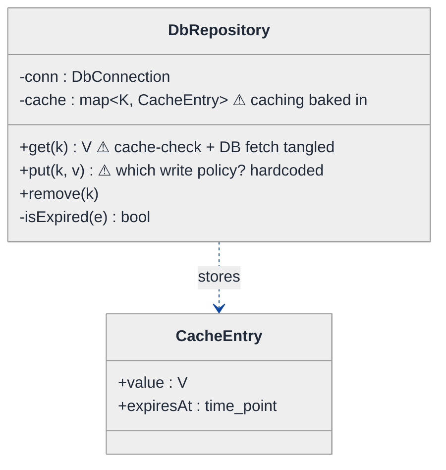
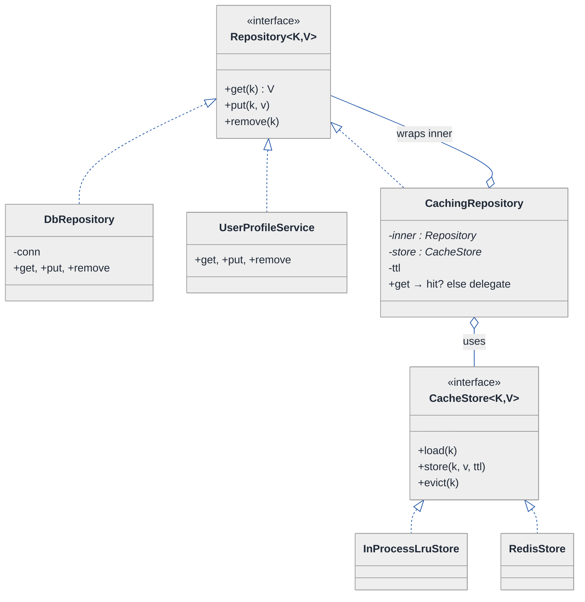
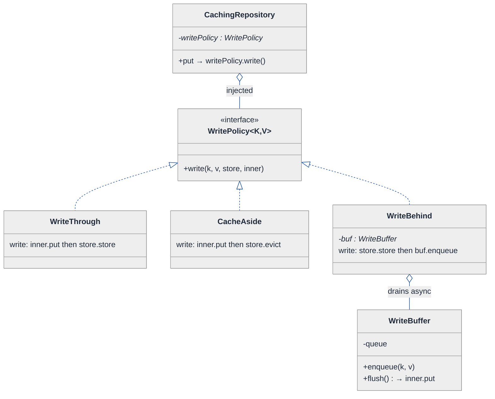
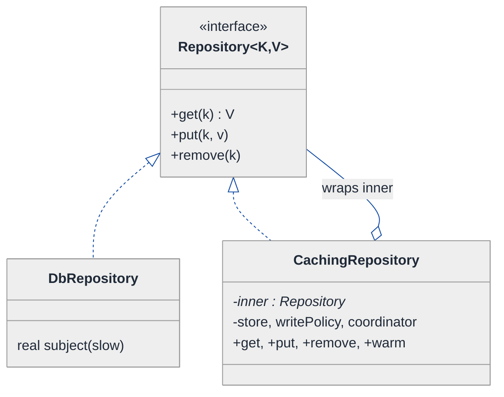
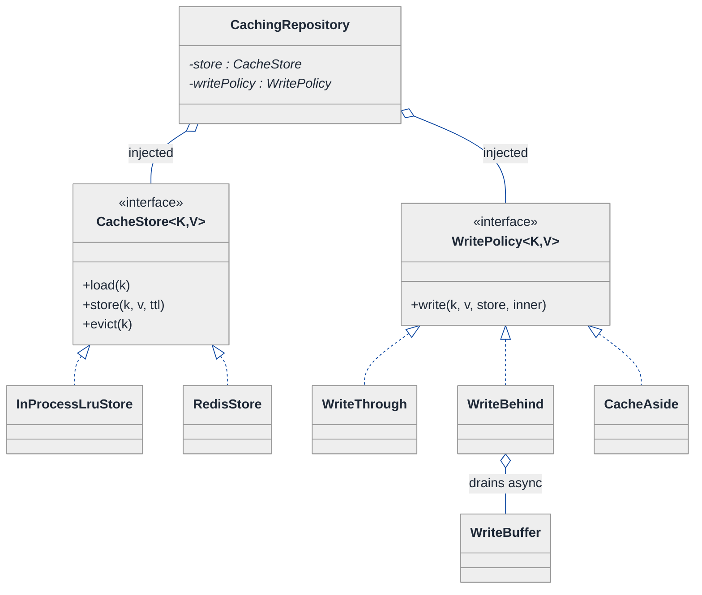
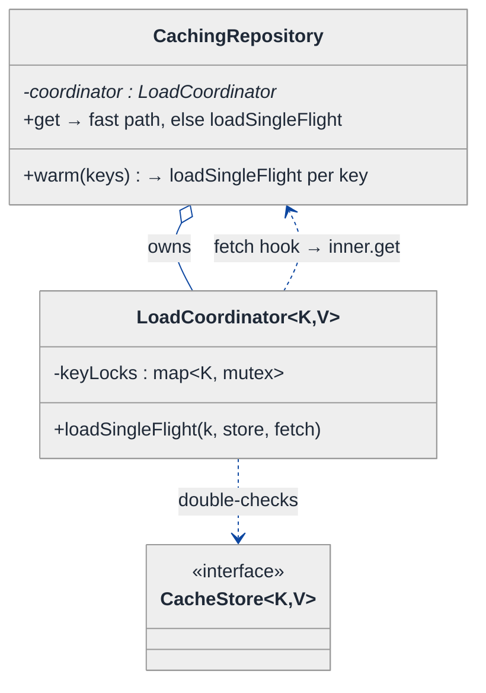
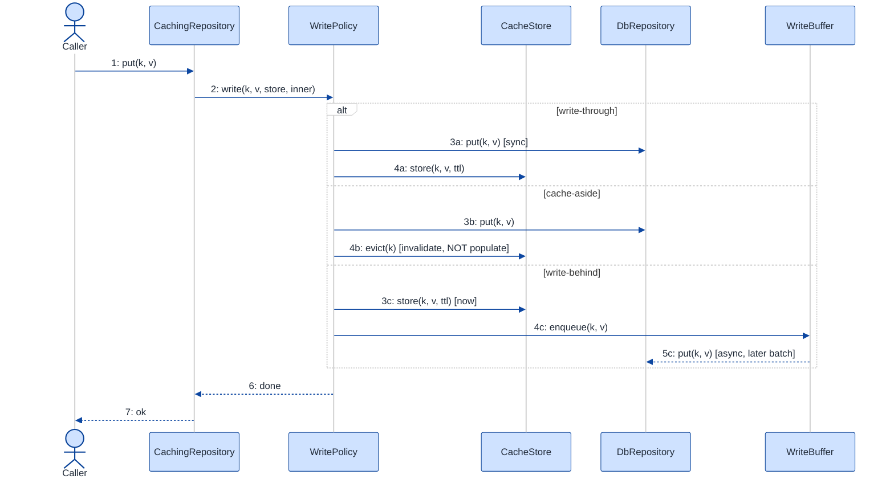

# Caching Decorator / Proxy — LLD Walkthrough

> **Difficulty:** Hard · **Time:** ~45 min · **Pattern focus:** Decorator + Proxy (with Strategy for policy + Template Method for the load path)
>
> **Problem source(s):** GID D1 in the parent [`./EXTRACTED_QUESTIONS.md`](./EXTRACTED_QUESTIONS.md) (Decorator_Pattern bucket). A perennial "wrap any service with caching" senior LLD prompt.
>
> **Diagrams:** inline mermaid (renders natively in GitHub / VS Code). The canonical light-theme block is copied verbatim into every diagram per the repo convention.

---

## How to use this file

Paced for a candidate who knows what a cache is but has never *designed the wrapper that adds caching to an arbitrary service*. Reading time: ~45 minutes if you sketch each iteration by hand. **The lesson: caching is a cross-cutting concern. Don't bolt it into the service — wrap the service. The wrapper that adds behavior without changing the wrapped object's interface is the Decorator; the wrapper that controls access to a real subject is the Proxy. They are the SAME shape with different intent, and this problem needs both.**

**Map of this file (15 sections):**

1. Problem statement + clarifying questions
2. Plain-English restatement
3. Why this matters
4. Mental model
5. Try it yourself first
6. Entity & verb extraction
7. **Iteration 1: the naive design** — caching baked into the service
8. **Where the naive design hurts** — five future requirements, one painful diff each
9. **Pivot 1: Decorator/Proxy for the cache wrapper** — the most painful axis first
10. **Pivot 2: Strategy for the write/invalidation policy** — write-through vs write-behind vs cache-aside
11. **Pivot 3: Template Method + single-flight for the thundering herd** — the load path
12. Final UML class diagram
13. Skeleton code (C++)
14. Key flow — sequence diagram
15. Extensibility re-check + anti-patterns + how to think aloud + self-check

---

## 1. Problem statement + clarifying questions

**Prompt (typical phrasing):** "Design a caching decorator/proxy that wraps any service call with configurable caching. Support TTL, cache invalidation patterns (write-through, write-behind), cache-aside, and cache warming. Handle the thundering herd problem."

**Clarifying questions to ask BEFORE drawing anything:**

1. **What does "any service" mean?** A single `get(key) -> value` repository, or arbitrary methods with arbitrary signatures? (This decides whether we wrap a *narrow interface* or need per-method key derivation. I'll assume a key-value-shaped `Repository<K,V>` contract — that's what's wrappable cleanly.)
2. **Read-heavy or read-write?** If the wrapped service also takes writes, the cache must stay coherent — that's where write-through / write-behind / cache-aside differ. Are writes in scope? (Yes — the prompt names three write policies.)
3. **What's the cache backing store?** In-process map, Redis, or both tiers? Does the design need to be store-agnostic? (Assume store-agnostic via a `CacheStore` interface; default to an in-process LRU + TTL store.)
4. **Consistency tolerance?** Is stale data for up to one TTL acceptable, or do writes need to invalidate immediately? (Assume TTL-bounded staleness is OK for cache-aside, immediate coherence for write-through.)
5. **Concurrency model?** Single-threaded or many threads hitting the same key at once? (Many threads — otherwise the thundering-herd requirement is meaningless.)
6. **Eviction policy?** LRU, LFU, FIFO, size-bounded vs count-bounded? (Assume pluggable; default LRU + TTL.)
7. **Write-behind durability?** If the process crashes with un-flushed writes in the buffer, is data loss acceptable? (Flag this as a real risk; assume a bounded buffer with periodic flush and best-effort on shutdown.)

**Assumptions if interviewer dodges:** the wrapped thing is a `Repository<K,V>` with `get/put/remove`; caching must be addable WITHOUT touching the repository; store-agnostic via a `CacheStore` interface; multi-threaded; default LRU+TTL store; pluggable read/write policy.

---

## 2. Plain-English restatement

We're building the *thing that sits in front of a slow service and remembers answers*. A caller asks for a value; if we've seen it recently and it hasn't expired, hand back the cached copy; otherwise fetch from the real service, remember it, and return it. Writes are the hard part: when someone updates a value, the cache must not keep serving the old one — and there are three different strategies for keeping it honest (write-through, write-behind, cache-aside). We also need to *pre-load* hot keys (warming) and make sure that when a popular key expires, a thousand simultaneous callers don't all stampede the backend at once (thundering herd). The whole thing must be addable to an existing service **without modifying that service's code**.

---

## 3. Why this matters

This question is a litmus test for whether you understand *cross-cutting concerns*. A junior bakes caching into the service and couples the two forever. A senior recognizes that caching, like logging, retry, and auth, is a wrapper — and that the wrapper must implement the SAME interface as the thing it wraps so callers never know it's there. That's the Decorator/Proxy insight, and it reappears everywhere: middleware stacks, HTTP interceptors, ORM lazy-loading, RPC client stubs. Getting the wrapping right, and then keeping the cache coherent under writes and concurrency, is exactly what separates "I've used a cache" from "I can design one."

---

## 4. Mental model

A cache is a **fast notebook in front of a slow oracle**, plus a **rule-book** for keeping the notebook honest. The notebook (cache store) is just a map with expiry stamps. The oracle (real service) is authoritative but slow. The interesting design lives in the *layer between them*: it decides when to trust the notebook, when to ask the oracle, and what to do with the notebook when someone changes the underlying truth.

```
Real-world sketch (NOT a UML diagram yet):

   caller ──get(K)──►  ┌───────────────────────────┐
                       │   Caching layer (wrapper) │   same interface
                       │   ┌──────────┐  miss       │   as the real service
                       │   │ notebook │──────────┐  │
       hit ◄───────────│   │ (store)  │          │  │
                       │   └──────────┘          ▼  │
                       └────────────────────┐   ask oracle
                                            ─┘   then jot it down
                                                  │
                                                  ▼
                                          ┌────────────────┐
                                          │  real service  │  slow, authoritative
                                          │  (DB / API)    │
                                          └────────────────┘
```

The KEY insight from this picture: the wrapper has the *same shape* as the real service — so it can slot in transparently — but it owns a notebook and a rule-book the real service knows nothing about. **Transparent wrapping + injected policy** is the separation we'll bake into the design.

---

## 5. Try it yourself first

> **Predict before reading on:**
>
> 1. If the caching wrapper must be invisible to callers, what is the ONE constraint that forces on its type?
> 2. **If I told you we need write-through today and write-behind next quarter, what part of the wrapper should vary — the whole class, or just one method's body?**
> 3. A key with a 60-second TTL expires at noon. At 12:00:00.000, one thousand requests for it arrive in the same millisecond. How many of them should hit the backend? How do you enforce that number?

---

## 6. Entity & verb extraction

> **Mini-refresher: noun → class, but not every noun.**
>
> Naive OOD promotes every noun to a class. Senior OOD promotes a noun only if it owns BEHAVIOR and STATE that belong together. "TTL" stays a field on an entry; "cache store" becomes a class because it has eviction behavior + occupancy state.

**Nouns from the prompt:**

| Noun | Decision | Why |
|---|---|---|
| Service / Repository | Interface (`Repository<K,V>`) + concrete `DbRepository` | The thing being wrapped; the contract everyone shares |
| Caching wrapper | Class implementing the same interface | The whole point — it IS a Repository to callers |
| Cache store | Interface (`CacheStore`) + concrete in-process LRU/TTL store | Has occupancy state + eviction behavior |
| Cache entry | Small struct (value + expiry stamp) | Data, not behavior — stays a value type |
| TTL | Field / duration on the entry or the wrapper config | No behavior of its own |
| Write/invalidation policy | Interface (`WritePolicy`) + concrete strategies | Varies independently — write-through / behind / aside |
| Warmer | Class / one method (`warm(keys)`) | Pre-loads hot keys; thin behavior |
| Single-flight guard | Class owned by the wrapper | Owns per-key locks + in-flight promises |

**Verbs (and the class they live on):**

| Verb | Owner class (naive answer — we'll re-examine) |
|---|---|
| get(key) | CachingRepository, delegating to the real Repository on miss |
| put(key, value) | CachingRepository (which also touches the store per policy) |
| remove(key) | CachingRepository |
| store / load / evict | CacheStore |
| isExpired() | CacheEntry |
| warm(keys) | CachingRepository |
| onWrite(key, value, store, delegate) | WritePolicy (introduced later) |

**We have NOT introduced any design patterns yet.** Pure nouns + verbs.

---

## 7. <a id="iter-1"></a>Iteration 1: the naive design

Let's write the simplest thing that could possibly work. A repository that *has* a cache field and checks it inside every method. No design patterns — just one class with a map and some `if`s.



**Reader's tour (read top to bottom; ~45 seconds).**

1. **One box does everything.** `DbRepository` holds the database connection AND the cache map. Reads, writes, expiry checks, and the actual DB I/O all live in the same class. There is no seam between "talk to the database" and "remember answers."

2. **The three warning markers (⚠).**
   - The `cache` field means caching is *baked into* the repository. You cannot have an uncached `DbRepository` — caching is welded on.
   - `get()` tangles the cache lookup with the DB fetch in one method body.
   - `put()` has to pick a write policy, and there's nowhere to put that choice except a hardcoded branch.

3. **`CacheEntry` is the only clean part.** A value plus an expiry stamp — a pure data type with no behavior beyond `isExpired`. This stays in every later iteration.

**What's deliberately missing.** No interface that callers depend on. No way to wrap a *different* service. No swappable write policy. No store abstraction. No concurrency control. The naive design doesn't acknowledge that caching is a separable layer — it fuses it to one concrete repository.

Skeleton code for the naive design (C++):

```cpp
#include <chrono>
#include <optional>
#include <string>
#include <unordered_map>

using Clock = std::chrono::steady_clock;

struct CacheEntry {
    std::string value;
    Clock::time_point expiresAt;
    bool isExpired() const { return Clock::now() > expiresAt; }
};

class DbRepository {
public:
    explicit DbRepository(std::chrono::seconds ttl) : ttl_(ttl) {}

    std::optional<std::string> get(const std::string& key) {
        auto it = cache_.find(key);                       // cache + I/O tangled
        if (it != cache_.end() && !it->second.isExpired())
            return it->second.value;                      // HIT
        auto value = fetchFromDb(key);                    // MISS → slow path
        if (value) cache_[key] = { *value, Clock::now() + ttl_ };
        return value;
    }

    void put(const std::string& key, const std::string& value) {
        writeToDb(key, value);                            // write policy hardcoded:
        cache_[key] = { value, Clock::now() + ttl_ };     // this is write-through, baked in
    }

    void remove(const std::string& key) {
        deleteFromDb(key);
        cache_.erase(key);
    }
private:
    std::optional<std::string> fetchFromDb(const std::string&) { /* slow SELECT */ return "row"; }
    void writeToDb(const std::string&, const std::string&)     { /* slow UPSERT */ }
    void deleteFromDb(const std::string&)                      { /* slow DELETE */ }

    std::chrono::seconds                          ttl_;
    std::unordered_map<std::string, CacheEntry>   cache_;
};
```

**This works.** It has zero design patterns. We can read with TTL caching and write through. So what's wrong with it?

---

## 8. <a id="naive-pain"></a>Where the naive design hurts

The interviewer slides five requirements across the desk: "Here's the roadmap. Walk me through what changes."

### Change A: "Add caching to a *second* service — the `UserProfileService`, which we can't modify"

In the naive design:
- There's no shared interface. `DbRepository`'s caching logic is glued to its own DB code.
- You'd **copy-paste the entire cache lookup / expiry / store block into `UserProfileService`** — duplicated cache code in every service, and you can't even touch a third-party service you don't own.
- The smell: caching is not reusable. It's not a layer; it's a copy-paste.

### Change B: "Switch from write-through to write-behind for the orders table" (buffer writes, flush async)

In the naive design:
- `put()` hardcodes write-through (`writeToDb` then update cache).
- Write-behind means: update the cache now, queue the DB write, flush later. That's a **rewrite of `put()`** plus a background flusher plus a buffer field.
- And cache-aside (only invalidate on write, never populate) is a *third* `put()` body. **Three policies → three forks of one method, selected by... what? Another field and an `if` ladder.**

### Change C: "Pre-warm the top 1000 keys at startup"

In the naive design:
- You add a `warm()` method that loops and calls `fetchFromDb` then stuffs the cache.
- Fine in isolation — but it must duplicate the exact expiry-stamp logic from `get()`. **Two places now compute `Clock::now() + ttl_`.** Drift waiting to happen.

### Change D: "A hot key expires and 1,000 threads all miss simultaneously — they all hammer the DB"

In the naive design:
- `get()` has no concurrency control. On expiry, every concurrent caller sees a miss and every one of them calls `fetchFromDb`. **The cache amplifies load instead of absorbing it** — the thundering herd.
- Fixing it means adding per-key locking inside `get()`, tangling synchronization with the already-tangled cache+I/O logic. The method becomes unreadable.

### Change E: "Swap the in-process map for Redis"

In the naive design:
- The cache is a raw `std::unordered_map` field. Every method touches it directly.
- Going to Redis means **rewriting every cache access in every method** — there's no store abstraction to swap.

### The pattern of pain

| Change | Files / methods touched | Smell |
|---|---|---|
| A. Second service | New copy of all cache logic per service | "Caching isn't reusable — it's copy-paste glued to one class." |
| B. Write-behind | `put()` rewritten + buffer + flusher | "Write policy is hardcoded; every policy is a fork of one method." |
| C. Warming | New `warm()` duplicating expiry logic | "Expiry stamping computed in two places." |
| D. Thundering herd | Locking tangled into `get()` | "No concurrency seam; cache amplifies load on expiry." |
| E. Redis | Every cache access rewritten | "No store abstraction; the map is welded in." |

**Three axes of pain dominate:** (1) caching is *welded to the service* instead of being a separable layer (A, E); (2) the *write/invalidation policy* is hardcoded (B); (3) the *load path* has no place for warming or concurrency control (C, D).

> **Pivot question:** "What pattern lets me add behavior (caching) to a service WITHOUT changing the service's code or interface? What pattern lets the write policy be swapped at runtime? And where does the single-flight load logic live so it isn't copy-pasted?"
>
> The answers are Decorator/Proxy, Strategy, and Template Method. Let's introduce them one at a time, starting with the most painful axis: the welding (A + E).

---

## 9. <a id="pivot-1"></a>Pivot 1: Decorator/Proxy for the cache wrapper

The deepest pain is that caching is fused to the service. To unweld it, both the cache layer and the real service must share ONE interface — then the cache layer can *wrap* the real service transparently.

> **Mini-refresher: Decorator pattern.**
>
> A Decorator implements the SAME interface as the object it wraps, holds a reference to that wrapped object, and adds behavior before/after delegating to it. Because it shares the interface, callers can't tell the difference — and decorators can stack (logging → caching → retry → real service).
>
> Quick example: a `BufferedReader` wraps a `Reader`, adds buffering, and forwards `read()` to the inner reader. Callers still just see a `Reader`.

> **Mini-refresher: Proxy pattern.**
>
> A Proxy ALSO implements the same interface as a "real subject" and holds a reference to it — but its intent is *access control*: it decides whether/when to call the real subject at all (lazy init, remote stub, permission check, **caching**). A caching proxy may serve a request entirely without ever touching the real subject.

> **Decorator vs Proxy — the pair people confuse.**
> - *Decorator:* adds responsibilities; *always* forwards to the wrapped object (it augments the call).
> - *Proxy:* controls access; *may not* forward at all (it can short-circuit — e.g., return a cache hit).
> - *Rule of thumb:* if the wrapper sometimes answers without delegating → it's acting as a Proxy. If it always delegates and only adds side-behavior → Decorator.
> - **For a cache this is genuinely both:** on a HIT it behaves as a caching *Proxy* (answers without delegating); on a MISS it behaves as a *Decorator* (delegates, then adds the "remember it" side-effect). Same class, same shape — that's why interviewers pose this as "decorator/proxy."

**Why this fits.** Both the real service and the cache wrapper become a `Repository<K,V>`. The wrapper holds an inner `Repository*` and adds caching around it. Now:
- Adding caching to *any* `Repository` = wrap it. (Solves Change A and E — even third-party services, as long as they implement the interface or can be adapted to it.)
- The store becomes its own `CacheStore` interface field (solves Change E for real — swap map for Redis).

**The refactor (just the affected part):**

```cpp
// The shared contract every service AND the cache layer implements.
template <class K, class V>
class Repository {
public:
    virtual ~Repository() = default;
    virtual std::optional<V> get(const K& key) = 0;
    virtual void put(const K& key, const V& value) = 0;
    virtual void remove(const K& key) = 0;
};

// The store is a separate axis — map today, Redis tomorrow.
template <class K, class V>
class CacheStore {
public:
    virtual ~CacheStore() = default;
    virtual std::optional<V> load(const K& key) = 0;          // honors TTL internally
    virtual void store(const K& key, const V& v, std::chrono::seconds ttl) = 0;
    virtual void evict(const K& key) = 0;
};
// InProcessLruStore : CacheStore (LRU + TTL); RedisStore : CacheStore — both elided

// The wrapper IS a Repository, and it WRAPS a Repository. Decorator + Proxy.
template <class K, class V>
class CachingRepository : public Repository<K, V> {
public:
    CachingRepository(std::unique_ptr<Repository<K, V>> inner,
                      std::unique_ptr<CacheStore<K, V>> store,
                      std::chrono::seconds ttl)
        : inner_(std::move(inner)), store_(std::move(store)), ttl_(ttl) {}

    std::optional<V> get(const K& key) override {
        if (auto hit = store_->load(key)) return hit;          // PROXY: answer, no delegate
        auto value = inner_->get(key);                         // DECORATOR: delegate
        if (value) store_->store(key, *value, ttl_);           //   then add side-effect
        return value;
    }
    void put(const K& key, const V& value) override { /* Pivot 2 owns this */ }
    void remove(const K& key) override { inner_->remove(key); store_->evict(key); }
private:
    std::unique_ptr<Repository<K, V>> inner_;   // the wrapped real subject
    std::unique_ptr<CacheStore<K, V>> store_;   // the notebook (swappable)
    std::chrono::seconds              ttl_;
};
```

**What changed — visualized.** Just the wrapping slice:



**Tour of the after-state.**

1. **One interface, three implementers.** `Repository<K,V>` is now the contract. `DbRepository`, `UserProfileService`, AND `CachingRepository` all implement it. Callers depend only on the interface.

2. **`CachingRepository` both IS-A and HAS-A `Repository`.** It implements the interface (the open triangle, realization) *and* holds a `Repository*` it wraps (the open diamond, aggregation). That dual relationship is the literal definition of Decorator/Proxy. **Caching `UserProfileService` now means `new CachingRepository(userService, ...)` — zero edits to `UserProfileService`.** Change A solved.

3. **The store is its own interface.** `CacheStore<K,V>` has `InProcessLruStore` and `RedisStore` implementations. Swapping backends is now a constructor argument. **Change E solved.**

4. **Wrappers stack.** Because `CachingRepository` is a `Repository`, you can wrap it again: `new RetryRepository(new CachingRepository(inner, ...))`. Cross-cutting concerns compose like a pipeline.

**Pattern-discrimination cheatsheet — Decorator vs Composite.**
- *Decorator:* wraps ONE inner object, adds behavior; the chain is linear (A wraps B wraps C).
- *Composite:* holds MANY children and treats the group uniformly with the leaf; the structure is a tree.
- *Rule of thumb:* one wrapped object that you augment → Decorator. A collection of objects addressed as one → Composite.

We chose Decorator/Proxy because there's exactly one real service behind the cache, and we're *augmenting/controlling access to it*, not aggregating a tree.

---

## 10. <a id="pivot-2"></a>Pivot 2: Strategy for the write / invalidation policy

Change B from §8 is still painful — write-through, write-behind, and cache-aside are three different write behaviors, and the naive `put()` hardcodes one. The wrapper from Pivot 1 left `put()` empty on purpose. The variability here is *the write algorithm*, chosen by config — that's not Decorator's job. That's Strategy.

> **Mini-refresher: Strategy pattern.**
>
> Encapsulates an algorithm behind an interface so it can be swapped at runtime. The CALLER (here, the wrapper's config) decides which strategy to use; the strategy doesn't know about its peers.
>
> Quick example: a `Sorter` takes a `CompareStrategy*` in its constructor — pass `Ascending` or `Descending`; the sorter doesn't care which.

**Why Strategy fits the write policy.** A write policy is an algorithm: `given (key, value, store, inner-service), do the right thing`. It varies along a closed set — write-through, write-behind, cache-aside — and which one is in force is a deployment/config decision, made externally, possibly different per table. That is textbook Strategy.

The three policies, stated precisely so the code below is obvious:
- **Write-through:** write to the backing service *synchronously*, then update the cache. Cache and DB stay coherent; writes pay full latency.
- **Write-behind (write-back):** update the cache *now*, enqueue the DB write, flush asynchronously in batches. Fast writes; risk of loss if the buffer isn't flushed before a crash.
- **Cache-aside (lazy):** on write, write the DB and *invalidate* (evict) the cache entry — never populate it on write. Next read repopulates lazily. Simplest coherence story; one extra miss after each write.

**The refactor (just the write slice):**

```cpp
template <class K, class V>
class WritePolicy {
public:
    virtual ~WritePolicy() = default;
    // Given the store and the wrapped service, perform the write the policy's way.
    virtual void write(const K& key, const V& value,
                       CacheStore<K, V>& store, Repository<K, V>& inner) = 0;
};

template <class K, class V>
class WriteThrough : public WritePolicy<K, V> {
public:
    explicit WriteThrough(std::chrono::seconds ttl) : ttl_(ttl) {}
    void write(const K& k, const V& v, CacheStore<K, V>& store, Repository<K, V>& inner) override {
        inner.put(k, v);                 // synchronous DB write first
        store.store(k, v, ttl_);         // then refresh cache — coherent
    }
private:
    std::chrono::seconds ttl_;
};

template <class K, class V>
class CacheAside : public WritePolicy<K, V> {
public:
    void write(const K& k, const V& v, CacheStore<K, V>& store, Repository<K, V>& inner) override {
        inner.put(k, v);                 // DB write
        store.evict(k);                  // invalidate — DO NOT populate; next read reloads
    }
};

template <class K, class V>
class WriteBehind : public WritePolicy<K, V> {
public:
    WriteBehind(std::shared_ptr<WriteBuffer<K, V>> buf, std::chrono::seconds ttl)
        : buf_(std::move(buf)), ttl_(ttl) {}
    void write(const K& k, const V& v, CacheStore<K, V>& store, Repository<K, V>& inner) override {
        store.store(k, v, ttl_);         // cache updated immediately
        buf_->enqueue(k, v);             // DB write deferred; background flusher drains buf_ → inner
    }
private:
    std::shared_ptr<WriteBuffer<K, V>> buf_;   // bounded queue + periodic flush thread
    std::chrono::seconds               ttl_;
};

// The wrapper just holds the policy and delegates put() to it:
template <class K, class V>
void CachingRepository<K, V>::put(const K& key, const V& value) {
    writePolicy_->write(key, value, *store_, *inner_);   // no if-ladder, polymorphism dispatches
}
```

**What changed — visualized.** Just the write-policy slice:



**Tour of the after-state.**

1. **`CachingRepository::put` is now a one-liner** — it forwards to `writePolicy_->write(...)`. No `if (mode == THROUGH) ... else if (mode == BEHIND)`. The branch is gone; polymorphism dispatches.

2. **Three concrete policies, each self-contained.** `WriteThrough` writes the DB then refreshes the cache. `CacheAside` writes the DB then *evicts* (note: evict, not store — the defining difference). `WriteBehind` updates the cache immediately and hands the DB write to a `WriteBuffer`.

3. **`WriteBuffer` is the write-behind machinery, isolated.** A bounded queue plus a periodic flush that drains into `inner.put`. **Change B is now a constructor choice**, not a rewrite. Per-table policy is just a different `WritePolicy` injected into each table's wrapper.

4. **Durability caveat lives in one class.** All the "what if we crash with un-flushed writes" risk is confined to `WriteBuffer` — flush-on-shutdown, bounded size, back-pressure all live there, not smeared across `put()`.

**Pattern-discrimination cheatsheet — Strategy vs State.**
- *Strategy:* the CALLER / config picks which algorithm to use; it doesn't change on its own.
- *State:* the OBJECT picks its next behavior internally, driven by events it receives.
- *Rule of thumb:* `cache.setWritePolicy(writeBehind)` set once at construction → Strategy. If the wrapper *flipped* policy itself based on load → State.

We chose Strategy: the write policy is a fixed configuration decision, not a self-driven lifecycle.

---

## 11. <a id="pivot-3"></a>Pivot 3: Template Method + single-flight for warming and the thundering herd

Changes C (warming) and D (thundering herd) remain. Both live on the *read/load path* — the "I missed, now go fetch and remember" sequence. In Pivot 1, that path appeared inline in `get()`. Warming needs the *same* fetch-and-store logic; the herd fix needs to wrap that logic in a per-key guard. Duplicating it (as the naive `warm()` did in Change C) is the smell. The fix: name the load path *once* and reuse it.

> **Mini-refresher: Template Method pattern.**
>
> Defines the skeleton of an algorithm in one place, deferring specific steps to hooks. Here the skeleton is "lock the key → re-check cache → fetch from inner → store → unlock"; the only thing that varies per call site is the fetch step. Define the skeleton once; both `get()` (on miss) and `warm()` call it.

> **Mini-refresher: the thundering herd (a.k.a. cache stampede).**
>
> When a hot key expires, every concurrent reader misses at the same instant and they ALL call the backend. The cache momentarily *amplifies* load instead of shielding it. The fix is **single-flight**: of N concurrent misses for the same key, exactly ONE does the fetch; the other N-1 wait on its result. (Variants: per-key mutex, promise-sharing, or probabilistic early-expiration to spread the renewal.)

**Why a `LoadCoordinator` with a Template-Method load.** The single-flight guard owns per-key locks and in-flight promises. The load skeleton ("ensure only one fetch happens, others await it") is identical whether triggered by a miss in `get()` or proactively by `warm()`. So we lift it into one method.

**The refactor (just the load slice):**

```cpp
template <class K, class V>
class LoadCoordinator {
public:
    // Template Method: the skeleton is fixed; the `fetch` step is the injected hook.
    std::optional<V> loadSingleFlight(const K& key,
                                      CacheStore<K, V>& store,
                                      const std::function<std::optional<V>()>& fetch) {
        // 1. one waiter per key acquires the lock; the rest block here
        std::shared_ptr<std::mutex> keyLock = lockFor(key);
        std::lock_guard<std::mutex> guard(*keyLock);

        // 2. double-check: a prior winner may have populated the cache while we waited
        if (auto hit = store.load(key)) return hit;        // herd absorbed — no backend call

        // 3. exactly ONE thread reaches here per key → the single flight
        auto value = fetch();                              // the varying hook
        if (value) store.store(key, *value, ttl_);
        return value;
    }
private:
    std::shared_ptr<std::mutex> lockFor(const K& key);     // striped/per-key lock registry — elided
    std::chrono::seconds        ttl_;
};

// get() on miss now routes through the coordinator:
template <class K, class V>
std::optional<V> CachingRepository<K, V>::get(const K& key) {
    if (auto hit = store_->load(key)) return hit;          // fast path, no lock
    return coordinator_->loadSingleFlight(
        key, *store_, [this, &key] { return inner_->get(key); });   // miss → single flight
}

// warming reuses the SAME load path — no duplicated expiry logic:
template <class K, class V>
void CachingRepository<K, V>::warm(const std::vector<K>& keys) {
    for (const auto& key : keys)
        coordinator_->loadSingleFlight(
            key, *store_, [this, &key] { return inner_->get(key); });
}
```

**The lesson.** Once the load path is a single Template-Method routine guarded by single-flight, both the miss path and warming reuse it. Change C (warming) becomes a loop over that one routine, and Change D (thundering herd) is solved *inside* that routine for every caller at once. **Naming the algorithm once makes both requirements nearly free.**

> **Mini-refresher: why single-flight and write-behind don't share a lock.**
>
> The single-flight lock is per-*read*-key and held only for the duration of one fetch. The write-behind buffer is a separate concurrency domain (a producer/consumer queue). Don't fuse them into one "cache lock" — they protect different invariants and fusing them serializes reads behind writes for no reason.

**Pattern-discrimination cheatsheet — Template Method vs Strategy (for the load path).**
- *Template Method:* fixed skeleton in one method, one varying step passed as a hook (here, the `fetch` lambda). Inheritance OR a passed callable.
- *Strategy:* the *whole* algorithm is swappable as an object.
- *Rule of thumb:* if only one step varies and the rest is invariant → Template Method. If the entire procedure has interchangeable variants → Strategy.

The load skeleton is invariant (lock → double-check → fetch → store); only the fetch step varies, so Template Method is the right tool — and we express the hook as a `std::function` rather than subclassing, which is the idiomatic C++ form.

---

## 12. <a id="fig-class-diagram"></a>Final class diagram

One mega-diagram would be a wall of boxes. Here are **three focused sub-views**, each addressing one concern; the structural insight at the end ties them together.

### 12.1 The wrapping spine — the same-interface chain



**Tour of 12.1.** Two implementers of one interface, with the cache wrapper holding a pointer back to a `Repository` (the open diamond — aggregation, "uses but the chain owner controls lifetime"). This is the Decorator/Proxy backbone: same interface in, same interface out, real subject inside. Everything in 12.2 and 12.3 hangs off `CachingRepository`'s other fields.

### 12.2 The policy + store injection — what the wrapper USES



**Tour of 12.2.**

1. **Two injected interfaces, two axes.** `CacheStore` (where answers live) and `WritePolicy` (how writes propagate) are both pointers injected at construction. The open diamonds mark aggregation — the wrapper uses them; a builder/config owns their lifetime.

2. **`CacheStore` family.** `InProcessLruStore` (LRU eviction + TTL, the default) and `RedisStore`. Eviction policy (LRU/LFU/FIFO) is itself a sub-axis *inside* the store — keep it there, don't leak it up.

3. **`WritePolicy` family.** The three policies from Pivot 2. `WriteBehind` is the only one with extra machinery (`WriteBuffer`), and that machinery is hidden behind the policy.

4. **Structural insight.** Everything the naive `DbRepository` hardcoded — the store, the write behavior — is now an injected interface. **The wrapper's core is orchestration; the variation is hot-swap policy.**

### 12.3 The load path — single-flight + warming



**Tour of 12.3.**

1. **`CachingRepository` owns a `LoadCoordinator`.** Filled-relationship in spirit (the wrapper owns it via `unique_ptr`); the coordinator holds the per-key lock registry.

2. **`loadSingleFlight` is the Template Method.** Its skeleton is fixed (lock → double-check the store → fetch → store). The varying step is the `fetch` hook, passed as a `std::function` from the call site.

3. **Two call sites, one routine.** `get()` (on miss) and `warm()` both call `loadSingleFlight`. The dashed dependency back to `CachingRepository` is the fetch hook closing over `inner_->get`. **No duplicated expiry logic; the herd is absorbed for every caller in one place.**

### Structural insight (ties 12.1 + 12.2 + 12.3 together)

| Concern | Pattern used | Why |
|---|---|---|
| **Transparent wrapping** (add caching to any service) | Decorator + Proxy, same interface | Hit → Proxy (answer, no delegate); miss → Decorator (delegate + remember) |
| **Where answers live** (map / Redis, eviction) | Strategy via `CacheStore` interface | Store + eviction vary by deployment; injected |
| **How writes propagate** (through / behind / aside) | Strategy via `WritePolicy` interface | Policy is a config choice, picked externally |
| **The load path** (warming + thundering herd) | Template Method + single-flight | One invariant skeleton, one varying fetch hook, one lock domain |

The big lesson: **caching is a layer, not a feature of the service.** Inheritance is used only for the interface-realization hierarchies; every "varies independently" axis (store, write policy) becomes composition over an interface, and the cross-cutting wrapping is Decorator/Proxy. *Wrap for cross-cutting concerns; inject for policy variation; name the load path once.*

---

## 13. Skeleton code (C++)

> Show the SHAPES, not the full impl. ~140 lines.

```cpp
#include <chrono>
#include <functional>
#include <memory>
#include <mutex>
#include <optional>
#include <unordered_map>
#include <vector>

using Clock = std::chrono::steady_clock;

// ── The shared contract: real service AND cache layer both implement this ──
template <class K, class V>
class Repository {
public:
    virtual ~Repository() = default;
    virtual std::optional<V> get(const K& key) = 0;
    virtual void put(const K& key, const V& value) = 0;
    virtual void remove(const K& key) = 0;
};

// ── Store axis: where cached answers live (map today, Redis tomorrow) ──
template <class K, class V>
class CacheStore {
public:
    virtual ~CacheStore() = default;
    virtual std::optional<V> load(const K& key) = 0;                          // honors TTL
    virtual void store(const K& key, const V& v, std::chrono::seconds ttl) = 0;
    virtual void evict(const K& key) = 0;
};

class InProcessLruStore /* : public CacheStore<K,V> */ {
    // LRU list + map<key, {value, expiresAt}>; load() drops expired entries;
    // store() inserts + evicts LRU when over capacity. Full body elided.
};
// class RedisStore : public CacheStore<K,V> { /* RESP calls */ };   // elided

// ── Write-policy axis: Strategy ──
template <class K, class V>
class WritePolicy {
public:
    virtual ~WritePolicy() = default;
    virtual void write(const K& k, const V& v,
                       CacheStore<K, V>& store, Repository<K, V>& inner) = 0;
};

template <class K, class V>
class WriteThrough : public WritePolicy<K, V> {
public:
    explicit WriteThrough(std::chrono::seconds ttl) : ttl_(ttl) {}
    void write(const K& k, const V& v, CacheStore<K, V>& store, Repository<K, V>& inner) override {
        inner.put(k, v);            // DB first
        store.store(k, v, ttl_);    // then cache — coherent
    }
private:
    std::chrono::seconds ttl_;
};
// class CacheAside  : inner.put then store.evict;   // elided (see Pivot 2)
// class WriteBehind : store.store then buffer.enqueue; background flush; // elided

// ── Load path: Template Method + single-flight (thundering-herd guard) ──
template <class K, class V>
class LoadCoordinator {
public:
    explicit LoadCoordinator(std::chrono::seconds ttl) : ttl_(ttl) {}
    std::optional<V> loadSingleFlight(const K& key, CacheStore<K, V>& store,
                                      const std::function<std::optional<V>()>& fetch) {
        auto lock = lockFor(key);
        std::lock_guard<std::mutex> guard(*lock);
        if (auto hit = store.load(key)) return hit;   // double-check: herd absorbed
        auto value = fetch();                         // exactly one flight per key
        if (value) store.store(key, *value, ttl_);
        return value;
    }
private:
    std::shared_ptr<std::mutex> lockFor(const K& key) {
        std::lock_guard<std::mutex> g(registryMtx_);
        auto& slot = keyLocks_[key];
        if (!slot) slot = std::make_shared<std::mutex>();
        return slot;
    }
    std::mutex                                                       registryMtx_;
    std::unordered_map<K, std::shared_ptr<std::mutex>>               keyLocks_;
    std::chrono::seconds                                             ttl_;
};

// ── The wrapper: IS-A Repository, HAS-A Repository. Decorator + Proxy. ──
template <class K, class V>
class CachingRepository : public Repository<K, V> {
public:
    CachingRepository(std::unique_ptr<Repository<K, V>> inner,
                      std::unique_ptr<CacheStore<K, V>>  store,
                      std::unique_ptr<WritePolicy<K, V>> writePolicy,
                      std::unique_ptr<LoadCoordinator<K, V>> coordinator)
        : inner_(std::move(inner)), store_(std::move(store)),
          writePolicy_(std::move(writePolicy)), coordinator_(std::move(coordinator)) {}

    std::optional<V> get(const K& key) override {
        if (auto hit = store_->load(key)) return hit;            // fast path — Proxy short-circuit
        return coordinator_->loadSingleFlight(                   // miss — single flight
            key, *store_, [this, &key] { return inner_->get(key); });
    }

    void put(const K& key, const V& value) override {
        writePolicy_->write(key, value, *store_, *inner_);       // Strategy dispatch
    }

    void remove(const K& key) override {
        inner_->remove(key);
        store_->evict(key);
    }

    void warm(const std::vector<K>& keys) {                      // reuses the load path
        for (const auto& key : keys)
            coordinator_->loadSingleFlight(
                key, *store_, [this, &key] { return inner_->get(key); });
    }
private:
    std::unique_ptr<Repository<K, V>>     inner_;        // wrapped real subject
    std::unique_ptr<CacheStore<K, V>>     store_;        // notebook (swappable)
    std::unique_ptr<WritePolicy<K, V>>    writePolicy_;  // write behavior (swappable)
    std::unique_ptr<LoadCoordinator<K, V>> coordinator_; // single-flight guard
};
```

---

## 14. <a id="fig-sequence"></a>Key flow — sequence diagram

Two phases: a hot-key read under the thundering herd, then a write under each policy.

### Phase 1 — concurrent miss on an expired hot key (single-flight)

```mermaid
---
config:
  theme: neutral
  themeVariables:
    background: '#ffffff'
    primaryColor: '#cfe2ff'
    primaryTextColor: '#1f2937'
    primaryBorderColor: '#084298'
    secondaryColor: '#fff3cd'
    secondaryTextColor: '#1f2937'
    secondaryBorderColor: '#664d03'
    tertiaryColor: '#d1e7dd'
    tertiaryTextColor: '#1f2937'
    tertiaryBorderColor: '#0a3622'
    lineColor: '#0d47a1'
    textColor: '#1f2937'
    noteBkgColor: '#fff3cd'
    noteTextColor: '#1f2937'
    noteBorderColor: '#997404'
    actorBkg: '#cfe2ff'
    actorBorder: '#084298'
    actorTextColor: '#1f2937'
    signalColor: '#0d47a1'
    signalTextColor: '#1f2937'
    labelBoxBkgColor: '#ffffff'
    labelBoxBorderColor: '#d3d3d3'
    labelTextColor: '#1f2937'
    edgeLabelBackground: '#ffffff'
    labelBackground: '#ffffff'
    classText: '#1f2937'
    fontFamily: 'system-ui, -apple-system, Segoe UI, Helvetica, Arial, sans-serif'
---
sequenceDiagram
  actor T1 as Thread A
  actor T2 as Thread B
  participant Cache as CachingRepository
  participant Co as LoadCoordinator
  participant Store as CacheStore
  participant Db as DbRepository
  T1->>Cache: 1: get(hotKey)
  T2->>Cache: 2: get(hotKey)
  Cache->>Store: 3: load(hotKey)
  Store-->>Cache: 4: miss (expired)
  Cache->>Co: 5: loadSingleFlight(hotKey, fetch)
  Co->>Co: 6: A acquires keyLock; B blocks
  Co->>Store: 7: double-check load(hotKey)
  Store-->>Co: 8: still miss
  Co->>Db: 9: get(hotKey)  [the ONE flight]
  Db-->>Co: 10: row
  Co->>Store: 11: store(hotKey, row, ttl)
  Co-->>Cache: 12: row  (to A)
  Co->>Co: 13: B wakes, re-checks store
  Co->>Store: 14: load(hotKey)
  Store-->>Co: 15: HIT (A populated it)
  Co-->>Cache: 16: row  (to B, no DB call)
```

**Tour of Phase 1. Read slowly — this is the thundering-herd fix in motion.**

1. **Two threads request the same expired hot key at once** (steps 1-2). In the naive design both would hit the DB.
2. **Both see a store miss** (3-4). The fast path fails for both.
3. **Both enter `loadSingleFlight`, but the per-key lock serializes them** (5-6). Thread A wins the lock; Thread B blocks. **This is the single-flight gate.**
4. **A double-checks the store** (7-8) — still a miss, so A is the legitimate single flight.
5. **A — and ONLY A — calls the DB** (9-10), then stores the result (11) and returns (12).
6. **B wakes, re-checks the store, and finds A's freshly stored value** (13-15). **B returns the value WITHOUT ever calling the DB** (16). One backend call served a thousand callers. Herd absorbed.

### Phase 2 — a write under each policy



**Tour of Phase 2.** The caller's `put` is identical regardless of policy (steps 1-2, 6-7) — that's the Strategy payoff. The `alt` block shows the three divergent bodies: **write-through** writes the DB synchronously then refreshes the cache (coherent, slower); **cache-aside** writes the DB then *evicts* (the next read repopulates — note it does NOT store); **write-behind** updates the cache immediately and defers the DB write through the buffer (fast, with the crash-loss caveat the buffer must manage). Three behaviors, one call site, zero `if` ladder in the wrapper.

### The validation that's NOT shown — and why it matters

You don't see `if (policy == THROUGH)` anywhere in `CachingRepository`, and you don't see a `for` loop hammering the DB in Phase 1. **The policy branch is replaced by polymorphic dispatch; the herd is replaced by the lock + double-check.** The wrapper's code stays a handful of one-liners — all the complexity lives behind the interfaces.

---

## 15. Extensibility re-check + anti-patterns + how to think aloud + self-check

### Extensibility re-check

Revisit the five changes from [§8](#naive-pain). For each, name what changes.

| Change | Naive design impact | Final design impact |
|---|---|---|
| A. Second service | Copy all cache logic per service | `new CachingRepository(otherService, ...)`. Done. |
| B. Write-behind | Rewrite `put()` | Inject `WriteBehind` instead of `WriteThrough`. Done. |
| C. Warming | New `warm()` duplicating expiry | `warm()` reuses `loadSingleFlight`. No duplication. Done. |
| D. Thundering herd | Locking tangled into `get()` | Solved inside `loadSingleFlight` for all callers. Done. |
| E. Redis | Rewrite every cache access | Inject `RedisStore` instead of `InProcessLruStore`. Done. |

Every change is a constructor argument or one new class. That's the open/closed principle in practice.

> **Mini-refresher: Open/Closed Principle.**
>
> Software entities should be open for extension but closed for modification. You add behavior by adding new classes (a new `WritePolicy`, a new `CacheStore`), not by editing the wrapper's existing methods. The naive design violated this — every new requirement edited `get()`/`put()`.

If a future requirement makes you change `CachingRepository`, `WritePolicy`, AND `CacheStore` together — go back to §6 and re-identify the variability points; you fused two axes.

### Common confusion + traps

1. **"Is this a Decorator or a Proxy?"** Both, and that's fine. On a hit it short-circuits (Proxy intent); on a miss it delegates and augments (Decorator intent). Interviewers ask precisely because the line blurs for caches — say so out loud.

2. **"Why not just put a `bool useCache` flag on `DbRepository`?"** That re-welds caching to the service and gives you no way to cache a service you don't own. Wrapping is what makes it reusable and stackable.

3. **"Why is `WritePolicy::write` given both the store and the inner service?"** Because the three policies touch them in different orders (through: inner then store; aside: inner then evict; behind: store then buffer). Handing both to the policy keeps the wrapper ignorant of the order.

4. **"Won't the per-key lock serialize ALL reads?"** No — the fast path (`store.load`) is lock-free; only the *miss* path takes the per-key lock, and only callers for the *same* key contend. Different keys proceed in parallel.

5. **"What about a stale write-behind buffer on crash?"** Real risk. Confine it to `WriteBuffer`: bound the queue, flush on shutdown, and accept the documented loss window. Don't pretend it's free.

### Anti-patterns

- **"Caching baked into the service"** — the naive design. Caching is cross-cutting; wrap, don't embed.
- **"Policy if-ladder"** — `if (mode == THROUGH) ... else if (mode == BEHIND)` inside `put()`. Use the `WritePolicy` interface; let polymorphism dispatch.
- **"Store welded in"** — a raw `unordered_map` field touched everywhere. Hide it behind `CacheStore` so Redis is a swap.
- **"No single-flight"** — letting every concurrent miss hit the backend. The cache must absorb the herd, not amplify it.
- **"Duplicated load logic"** — `warm()` re-implementing the fetch-and-store path. Name it once (Template Method) and reuse.
- **"God wrapper"** — `CachingRepository` doing eviction, TTL math, locking, and write buffering inline. Push each into its collaborator (store, coordinator, policy, buffer).

### How to think aloud

> "Caching decorator. Let me clarify scope. [Asks the §1 questions.] I'll assume a `Repository<K,V>` contract, store-agnostic, multi-threaded, pluggable write policy.
>
> Nouns: the service, the cache wrapper, the store, the entry, the write policy, the single-flight guard. The wrapper must be invisible to callers — that forces it to share the service's interface.
>
> Naive design first: a `DbRepository` with a cache map field and `if`s inside `get`/`put`. It works, no patterns. Then I stress it: cache a second service (copy-paste), switch to write-behind (rewrite `put`), warm keys (duplicate expiry), thundering herd (no locking), swap to Redis (rewrite every access).
>
> Three axes: caching is welded to the service, the write policy is hardcoded, and the load path has no seam. Pivot 1: make both the service and the wrapper a `Repository`, and have the wrapper hold an inner `Repository*` — Decorator on a miss, Proxy on a hit. Pull the store behind a `CacheStore` interface. Pivot 2: write-through/behind/aside become a `WritePolicy` Strategy injected into the wrapper. Pivot 3: the miss path and warming share one `loadSingleFlight` Template Method, guarded by a per-key lock so exactly one thread fetches on expiry — that's the herd fix.
>
> Final: `CachingRepository` wraps a `Repository`, aggregates a `CacheStore` and a `WritePolicy`, and owns a `LoadCoordinator`. All five future requirements land as a constructor choice or one new class. Open/closed."

### Self-check

> **Self-check — the question to ask next time.**
>
> When you see "add [cross-cutting behavior] to [some service] without changing it," before reaching for a flag or a subclass, ask:
>
> > **"Can the new behavior share the service's interface and WRAP it (Decorator/Proxy), with the parts that vary by config injected as Strategies — and is there one load/effect path I should name once instead of duplicating?"**
>
> Cross-cutting → wrap. Varies by config → inject a Strategy. Repeated effect path → Template Method. If the wrapper sometimes answers without delegating, you're building a Proxy as much as a Decorator — and that's correct for a cache.

---

## Cross-references

- **Parent topic manifest:** [`./EXTRACTED_QUESTIONS.md`](./EXTRACTED_QUESTIONS.md)
- **Vertical overview:** [`../../LEARNING.md`](../../LEARNING.md)
- **Template:** [`../../TEMPLATE-v2.md`](../../TEMPLATE-v2.md)
- **Canonical exemplar:** [`../Object_Oriented_Design/Parking_Lot.md`](../Object_Oriented_Design/Parking_Lot.md)
- **Related v2 walkthroughs:**
  - Strategy Pattern deep-dive (in `../Strategy_Pattern/`) — the write-policy and store axes
  - Proxy / Interceptor patterns (in `../Interceptor_Pattern/`) — sibling cross-cutting wrappers
  - Retry Pattern (in `../Retry_Pattern/`) — another stackable `Repository` decorator
- **Further reading:**
  - <a href="https://refactoring.guru/design-patterns/decorator" target="_blank" rel="noopener noreferrer">Decorator pattern (refactoring.guru)</a>
  - <a href="https://refactoring.guru/design-patterns/proxy" target="_blank" rel="noopener noreferrer">Proxy pattern (refactoring.guru)</a>
  - <a href="https://en.wikipedia.org/wiki/Cache_stampede" target="_blank" rel="noopener noreferrer">Cache stampede / thundering herd (Wikipedia)</a>
