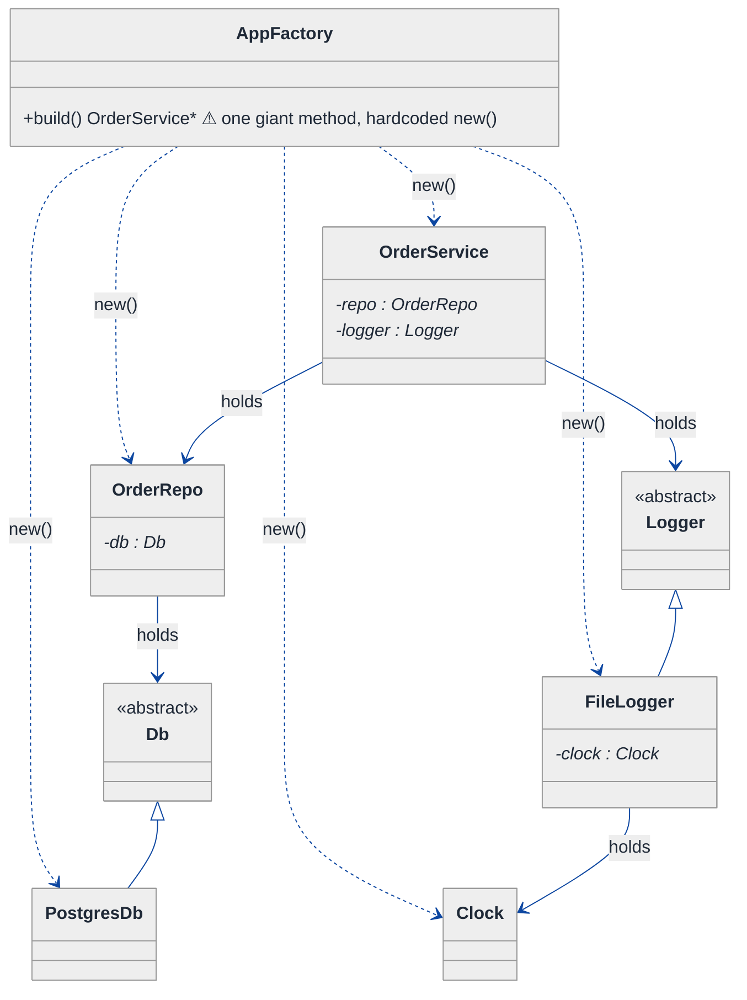
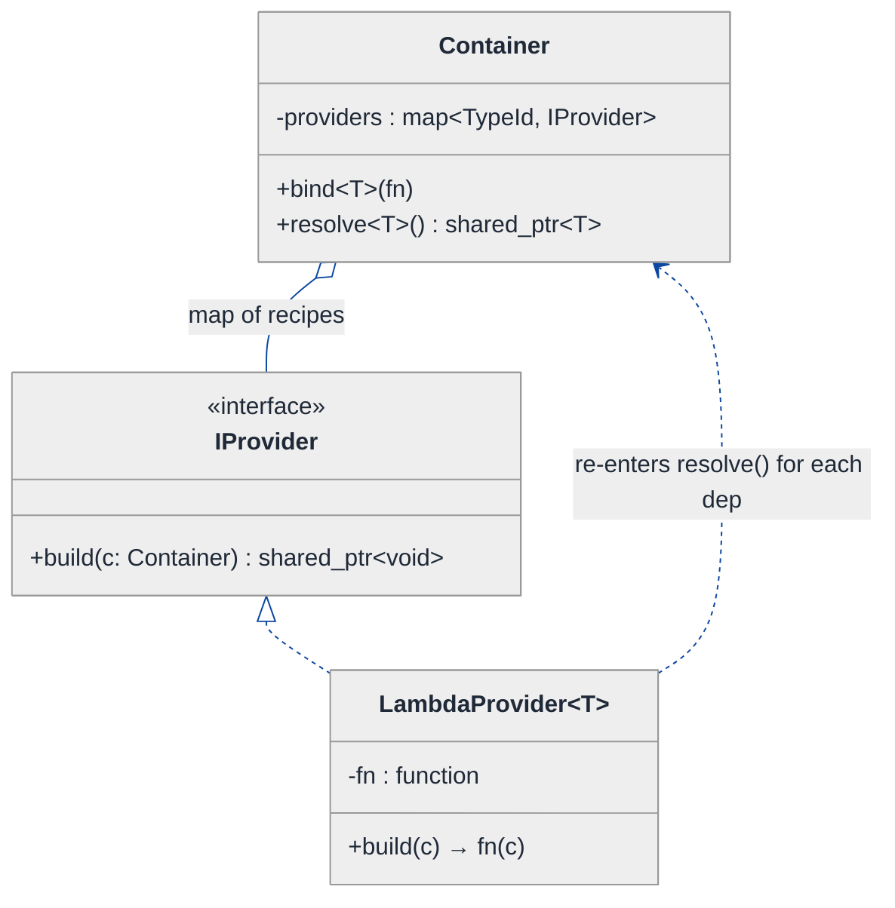
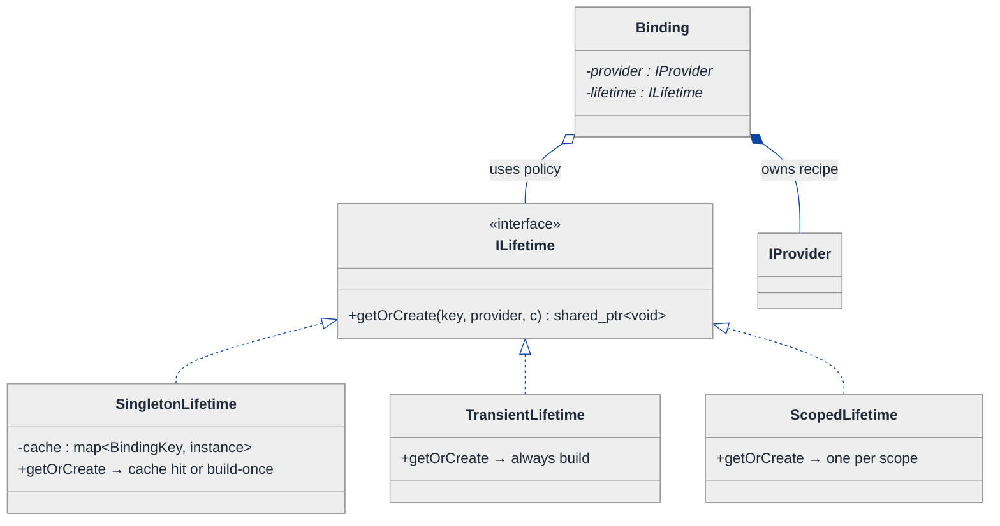
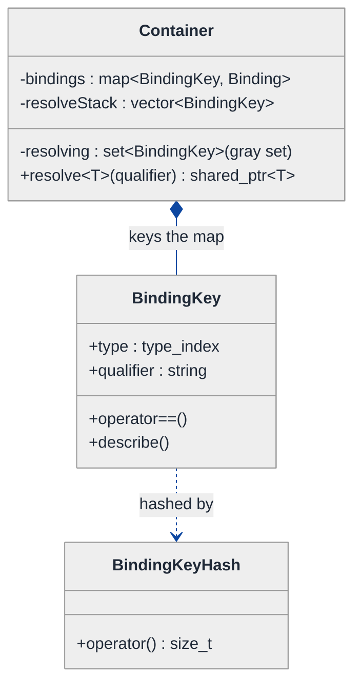
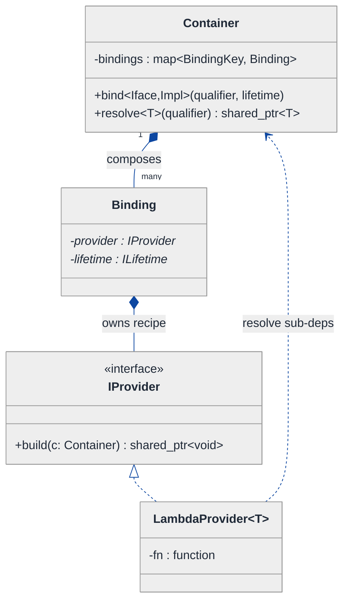
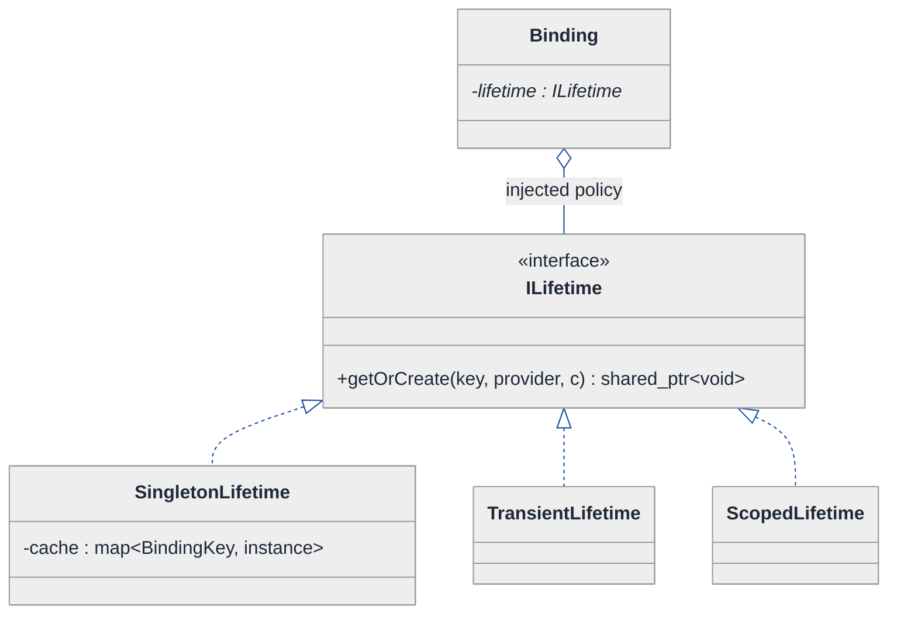
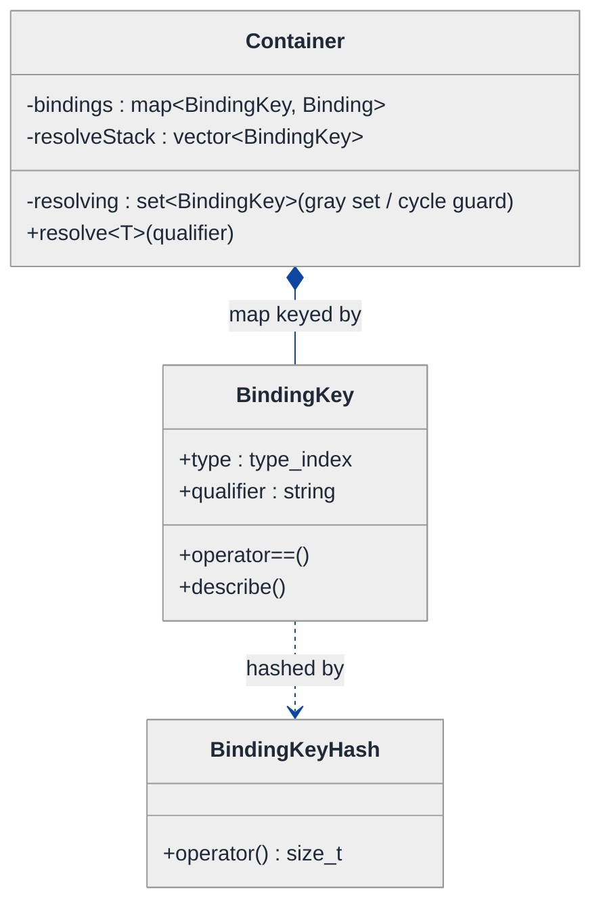
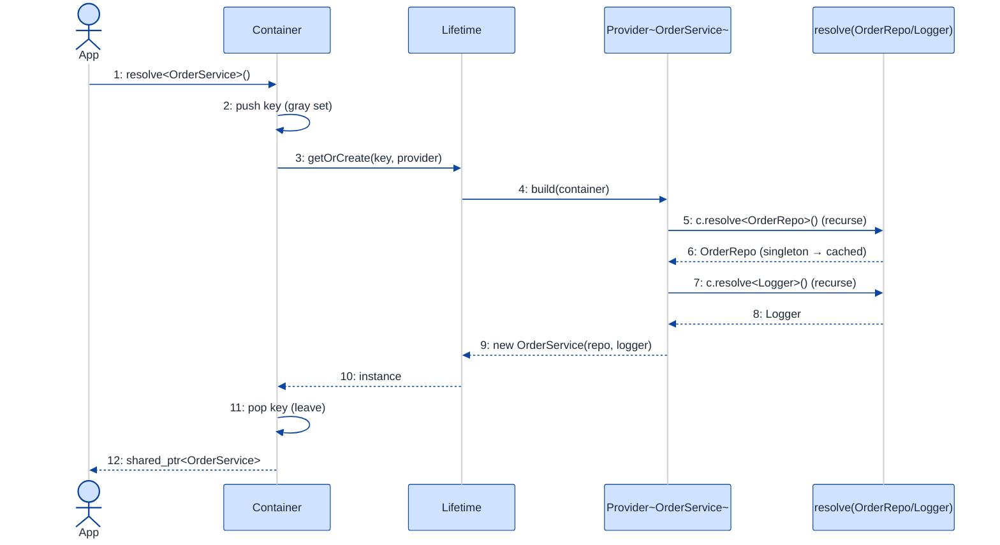
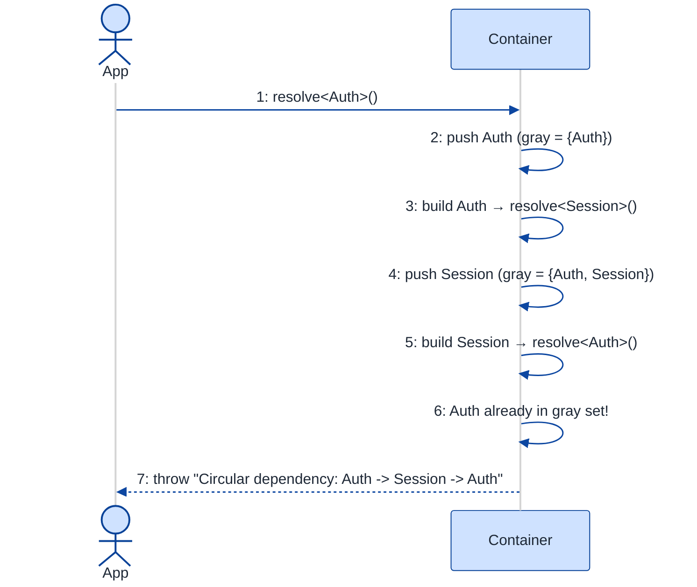

# Dependency Injection Container — LLD Walkthrough

> **Difficulty:** Hard · **Time:** ~45 min · **Pattern focus:** Dependency Injection + Factory + reflection (type registry)
>
> **Problem source(s):** GID **DI1**, bucket `Dependency_Injection`. Representative of "build the framework, not the app" LLD prompts — the senior bar question for this bucket.
>
> **Diagrams:** inline mermaid (renders natively in GitHub / VS Code). Optional editable freehand sources are sibling `.excalidraw` files.

---

## How to use this file

Paced for a candidate who has *used* a DI container (Spring, Guice, Dagger, .NET's `IServiceCollection`) but never *built* one. Reading time: ~45 minutes if you sketch each iteration by hand. **The lesson: a DI container is not magic — it is a `map<type, recipe>` plus a recursive resolver. We derive it by writing the naive "new everything by hand" wiring first, watching it rot under four hypothetical changes, and reaching for ONE mechanism at a time: a Factory-per-type registry, then lifecycle scopes, then a cycle detector, then qualified bindings.**

This is a *framework* design, not an application design. That flips one thing: the "domain entities" are themselves type metadata and recipes, not parking spots and tickets. Keep that in mind in §6.

**Map of this file (15 sections):**

1. Problem statement + clarifying questions
2. Plain-English restatement
3. Why this matters
4. Mental model
5. Try it yourself first
6. Entity & verb extraction
7. **Iteration 1: the naive design** — hand-wired `new`, no container
8. **Where the naive design hurts** — four future requirements, one painful diff each
9. **Pivot 1: a Factory registry** — `map<TypeId, Provider>` + recursive resolve
10. **Pivot 2: lifecycle scopes** — Singleton vs Transient via a Lifetime policy
11. **Pivot 3: cycle detection + qualified bindings** — a resolution stack + a binding key
12. Final UML class diagram
13. Skeleton code (C++)
14. Key flow — sequence diagram
15. Extensibility re-check + anti-patterns + how to think aloud + self-check

---

## 1. Problem statement + clarifying questions

**Prompt (typical phrasing):** "Design a dependency injection container supporting constructor injection, field injection, singleton and transient lifecycles, circular dependency detection, and named/qualified bindings."

**Clarifying questions to ask BEFORE drawing anything:**

1. **Static or runtime resolution?** Compile-time wiring (Dagger-style codegen) or runtime resolution (Spring/Guice-style)? This decides whether we lean on real reflection or a registration API. I'll assume **runtime**, since C++ has no built-in reflection — we'll simulate it with explicit registration.
2. **What gets injected — interfaces or concretes?** Do callers ask for `Logger` (interface) and get `FileLogger` (impl), or do they ask for concretes directly? Almost always interface → impl binding. I'll assume **bind interface to implementation**.
3. **Which injection styles?** The prompt names two: **constructor injection** (deps passed to the constructor) and **field injection** (deps set on public/annotated fields after construction). Any setter injection? I'll support constructor + field and mention setter as a trivial variant of field.
4. **Lifecycle scopes?** The prompt names **singleton** (one instance per container) and **transient** (a fresh instance every resolve). Do we also need a "scoped" lifetime (one per request/scope)? I'll design the Lifetime as an extension point so scoped drops in later.
5. **Qualified / named bindings?** When two implementations satisfy one interface (e.g. `@Primary` DB vs `@Replica` DB), how does the caller disambiguate? By a **name/qualifier**. I'll assume a string qualifier keyed alongside the type.
6. **Thread safety?** Is the container resolved concurrently? Singletons especially need safe lazy init. I'll assume **single-threaded resolution for the core derivation**, and call out the locking in §15.
7. **What happens on a missing binding or a cycle?** Throw a descriptive error (which type, which dependency chain) vs return null? I'll **throw with the full resolution path**, because a silent null in a DI container is a debugging nightmare.

**Assumptions if interviewer dodges:** runtime container, interface→impl bindings, constructor + field injection, singleton + transient lifecycles (extensible to scoped), string qualifiers, single-threaded core with a noted locking strategy, throw-with-path on errors.

---

## 2. Plain-English restatement

We're building the thing that *constructs your object graph for you*. Today, somewhere in `main()`, you write `new OrderService(new PaymentGateway(new HttpClient(...)), new OrderRepo(new Db(...)))` — a deeply nested hand-assembled tree. A DI container inverts that: each component declares **what it needs**, you **register** how to build each type once, and then you ask the container `resolve<OrderService>()` and it figures out the whole tree, builds each dependency in the right order, reuses singletons, makes fresh transients, refuses to build a cycle, and picks the right implementation when a qualifier is given. The design must let you add new components, new lifecycles, and new qualified bindings **without editing the resolver's core loop**.

---

## 3. Why this matters

This is the question that separates "I can use a framework" from "I understand what the framework *is*." A DI container is one of the most pattern-dense small systems you can be asked to build: it's a **Factory registry** (one provider per type), a **recursive graph resolver**, a **lifecycle policy** (Strategy), a **cycle detector** (the classic graph-coloring / visited-stack algorithm), and a **lookup keyed by a composite (type, qualifier)**. Interviewers love it because the naive version is trivially writable and the "real" version forces you to name Inversion of Control, the open/closed principle, and the difference between a Factory and a Service Locator. Where it reappears: plugin hosts, ORM session factories, test-double injection, serverless cold-start wiring.

---

## 4. Mental model

A DI container is a **recipe book** plus a **kitchen with a pantry**. The recipe book maps "I want a `Logger`" to "here's how you make one, and by the way it needs a `Clock`." The kitchen reads a recipe, recursively makes every sub-ingredient first, then assembles the dish. The pantry holds the singletons you only ever make once. A circular recipe ("to make A you need B, to make B you need A") is caught because the kitchen keeps a stack of "dishes currently in progress" and screams if it sees one twice.

```
Real-world sketch (NOT a UML diagram yet):

   register():  Logger      -> recipe: FileLogger(needs Clock)
   the recipe   Clock       -> recipe: SystemClock()           [singleton]
   book         OrderSvc    -> recipe: OrderSvc(needs Repo, Logger)
                Repo        -> recipe: SqlRepo(needs Db)
                Db@primary  -> recipe: PostgresDb()            [qualifier!]
                Db@replica  -> recipe: ReadReplicaDb()

   resolve<OrderSvc>():
                          ┌─ in-progress stack (cycle guard) ─┐
        OrderSvc ─needs─► │  [OrderSvc, Repo, Db]             │
           │              └───────────────────────────────────┘
           ├─needs─► Repo ─needs─► Db@primary  (pantry: reuse if singleton)
           └─needs─► Logger ─needs─► Clock (pantry: built once, reused)
```

The KEY insight from this picture: **registration and resolution are two different phases.** Registration fills a `map`. Resolution is a depth-first walk over that map that builds leaves before roots, consults a pantry for singletons, and guards a stack for cycles. Separate those two phases cleanly and the whole design falls out.

---

## 5. Try it yourself first

> **Predict before reading on:**
>
> 1. List the nouns you'd promote to a class. Which "noun" is really just a `map` entry, not a class?
> 2. **If I told you the container must support both "one shared instance forever" and "a brand-new instance every time," what is the smallest thing that has to vary, and where does it live?**
> 3. A cycle `A → B → A` will infinite-loop a naive recursive resolver. What single data structure, threaded through the recursion, turns the infinite loop into a clean thrown error?

---

## 6. Entity & verb extraction

> **Mini-refresher: noun → class, but in a *framework* the nouns are meta.**
>
> In an application LLD (parking lot) the nouns are domain objects (Spot, Ticket). In a *framework* LLD the nouns are about *other people's types*: a "binding," a "provider," a "scope." Promote a noun to a class only if it has behavior + state that belong together. A "qualifier" is just a string field on a key; a "binding" is a real class because it bundles a provider + a lifetime + a key.

**Nouns from the prompt:**

| Noun | Decision | Why |
|---|---|---|
| Container | Class (top-level coordinator) | Owns the registry, runs resolution, holds the singleton cache |
| Binding / Registration | Class | Bundles: how to build it (provider) + lifetime + key. Has behavior. |
| Provider / Factory | Interface + concrete impls | The "recipe": `T build(Container&)`. Varies per type → polymorphic. |
| Lifetime / Scope | Interface (Strategy) | Singleton vs transient is a *policy* over "do I cache or rebuild?" |
| BindingKey | Class (value type) | Composite of `(typeId, qualifier)`. Equality + hash. |
| TypeId | Field (`std::type_index`) | C++'s stand-in for reflection. Not a class of our own. |
| Qualifier / name | Field on BindingKey (`std::string`) | No behavior of its own |
| Resolution stack | Field on Container (during resolve) | Data structure for cycle detection, not a domain class |
| Injection point (ctor arg / field) | Encoded inside the Provider's body | The provider *knows* what to ask the container for |

**Verbs (and the class they live on):**

| Verb | Owner class (naive answer — we'll re-examine) |
|---|---|
| bind<Iface, Impl>(qualifier, lifetime) | Container (registration phase) |
| resolve<T>(qualifier) | Container (resolution phase) |
| build(container) | Provider (the recipe body) |
| getOrCreate(key, provider) | Lifetime (decides cache vs rebuild) |
| enter(key) / leave(key) | Container's cycle guard (push/pop the stack) |

**We have NOT introduced any design patterns by name yet** beyond noticing that "provider" and "lifetime" want to be polymorphic. Pure nouns + verbs.

---

## 7. <a id="iter-1"></a>Iteration 1: the naive design

Let's write the simplest thing that could possibly work: no container at all. Just hand-wire the graph in `main()`, the way every codebase starts. To keep it honest, we'll wrap the wiring in a single `AppFactory` class with one giant `build()` method — that's the realistic "naive container."



**Reader's tour (read top to bottom; ~60 seconds).**

1. **At the top — `AppFactory` with one method, `build()`.** This is the "container." It has zero registry, zero lifecycle logic. It just calls `new` in the right nesting order and hands back the root object. Every wiring decision is baked into this one method's body.

2. **The dependency arrows fan out (the `..>` dashed arrows).** `AppFactory` depends on EVERY concrete type — `OrderService`, `OrderRepo`, `FileLogger`, `PostgresDb`, `Clock`. To wire the graph, the factory must `#include` and `new` each one. **It is coupled to the entire concrete world.**

3. **The domain `holds` arrows (down the middle/right).** `OrderService` holds a `Repo` and a `Logger`; `OrderRepo` holds a `Db`; `FileLogger` holds a `Clock`. This is the genuine object graph — it's fine. The smell isn't here.

4. **Two genuine "is-a" inheritances.** `FileLogger` is a `Logger`; `PostgresDb` is a `Db`. These are real abstractions. Not the smell either.

5. **The smell is entirely inside `build()`** (the ⚠). It hardcodes construction order, hardcodes which impl satisfies which interface, has no notion of "build this once and share it," and would infinite-loop if anyone introduced a cycle. §8 turns each of those into a concrete future requirement.

**What's deliberately missing.** No registry mapping `type → recipe`. No `Lifetime` (everything is implicitly "new every time"). No qualifier (you can't have two `Db`s). No cycle guard. The naive design doesn't even *acknowledge* these are axes — it bakes one hardcoded answer into the assembly method.

Skeleton code for the naive design (C++):

```cpp
#include <memory>
#include <string>

// ── Genuine domain interfaces + impls ───────────────────────────────
class Clock { public: virtual ~Clock() = default; virtual long now() const = 0; };
class SystemClock : public Clock { public: long now() const override { return 0; } };

class Logger { public: virtual ~Logger() = default; virtual void log(const std::string&) = 0; };
class FileLogger : public Logger {
public:
    explicit FileLogger(std::shared_ptr<Clock> c) : clock_(std::move(c)) {}
    void log(const std::string&) override { /* write line with clock_->now() */ }
private:
    std::shared_ptr<Clock> clock_;
};

class Db { public: virtual ~Db() = default; };
class PostgresDb : public Db { /* ... */ };

class OrderRepo {
public:
    explicit OrderRepo(std::shared_ptr<Db> db) : db_(std::move(db)) {}
private:
    std::shared_ptr<Db> db_;
};

class OrderService {
public:
    OrderService(std::shared_ptr<OrderRepo> r, std::shared_ptr<Logger> l)
        : repo_(std::move(r)), logger_(std::move(l)) {}
private:
    std::shared_ptr<OrderRepo> repo_;
    std::shared_ptr<Logger>    logger_;
};

// ── The "naive container": one giant hand-wired method ──────────────
class AppFactory {
public:
    std::shared_ptr<OrderService> build() {            // hardcoded — will hurt
        auto clock  = std::make_shared<SystemClock>();          // leaf
        auto logger = std::make_shared<FileLogger>(clock);      // needs clock
        auto db     = std::make_shared<PostgresDb>();           // leaf
        auto repo   = std::make_shared<OrderRepo>(db);          // needs db
        return std::make_shared<OrderService>(repo, logger);    // root
    }
};
```

**This works.** It has zero framework machinery. We can build the whole graph. So what's wrong with it?

---

## 8. <a id="naive-pain"></a>Where the naive design hurts

The interviewer slides four requirements across the desk: "Here's next quarter. Walk me through what changes in `AppFactory`."

### Change A: "Make `FileLogger` and `Db` shared singletons; everything else stays per-request"

In the naive design:
- `build()` already happens to share `clock`/`db` *within one call* — but call `build()` twice and you get two of everything. There is no cache that survives across `resolve` calls.
- To make a true singleton you'd hoist `clock`, `logger`, `db` into member fields of `AppFactory`, lazy-init them with `if (!db_) db_ = ...`, and leave the rest local.
- **The change scatters `if (!x_)` lazy-init ladders through `build()` and mixes two lifecycles in one method.** Add a third lifetime later and the method is a swamp.

### Change B: "We now need a second database — `@primary` (writes) and `@replica` (reads)"

In the naive design:
- `OrderRepo` takes a `Db`. Which one? `build()` has to know that `OrderRepo` wants the primary while `ReportRepo` wants the replica.
- There is no way to say "this `Db*` parameter means the replica." You hardcode `auto primary = ...; auto replica = ...;` and manually thread the right one into each constructor.
- **Every new consumer that needs a specific impl is another hand-routed `new` in `build()`.** The factory becomes the single point that must know every routing decision.

### Change C: "A new module wires `Auth → Session → Auth` and the app hangs on startup"

In the naive design:
- Someone introduces a cycle. `build()` calls `new Auth(new Session(new Auth(...)))` — infinite recursion, stack overflow, **no diagnostic telling you which types form the cycle.**
- There is nowhere to detect it. The recursion is hand-written, so the only "fix" is a human noticing the stack trace.

### Change D: "Swap `FileLogger` for `CloudLogger` in production, keep `FileLogger` in tests"

In the naive design:
- `build()` hardcodes `make_shared<FileLogger>`. To vary by environment you add `#ifdef PROD` or an `if (env == "prod")` branch inside `build()`.
- **Every impl swap is surgery in the assembly method, and tests can't substitute a fake without editing production wiring code.**

### The pattern of pain

| Change | Files / sites touched | Smell |
|---|---|---|
| A. Mixed lifecycles | `build()` grows `if (!x_)` ladders | "Lifecycle policy is tangled into the assembly code." |
| B. Two databases | every consumer hand-routed in `build()` | "No way to name/disambiguate which impl satisfies an interface." |
| C. Cycle hangs | nowhere — silent stack overflow | "No resolution bookkeeping; cycles are undiagnosable." |
| D. Impl swap | `#ifdef`/`if(env)` inside `build()` | "Concrete choice hardcoded; can't substitute for tests/prod." |

**Three axes of pain dominate:** (1) *who knows how to build a type* is hardcoded into one method (B, D); (2) *how long an instance lives* is tangled into the same method (A); (3) *resolution has no bookkeeping*, so cycles can't be caught (C).

> **Pivot question:** "What lets us register 'how to build each type' once and look it up by demand instead of hand-wiring? What makes 'how long does it live' a swappable policy instead of inline `if`s? And what bookkeeping turns infinite recursion into a clean error?"
>
> The answers are: a **Factory-per-type registry** with **recursive resolution** (Pivot 1), a **Lifetime Strategy** (Pivot 2), and a **resolution stack + composite binding key** (Pivot 3). Let's take the most painful axis first: the hardcoded, scattered construction logic.

---

## 9. <a id="pivot-1"></a>Pivot 1: a Factory registry + recursive resolution (Inversion of Control)

The deepest pain is that `build()` *is* the wiring: it knows every concrete type and the exact order to assemble them. We want to register each "how to build" once and let a generic resolver assemble on demand.

> **Mini-refresher: the Factory pattern.**
>
> A Factory encapsulates object creation behind a uniform interface so the caller asks "make me a T" without knowing the concrete type or the construction steps. Here each registered type gets its own tiny factory — a `Provider` whose `build(container)` returns an instance, asking the container for whatever sub-dependencies it needs.

> **Mini-refresher: Dependency Injection & Inversion of Control.**
>
> *Dependency Injection* = a component receives its collaborators from the outside instead of `new`-ing them itself. *Inversion of Control* = the framework, not your code, decides when and how objects are created. The naive `AppFactory` had IoC for *one* hardcoded graph; a real container inverts control for *any* graph you register. The component declares "I need a Repo and a Logger" (in its constructor signature) and the container satisfies that.

**Why a registry + recursive resolve fits.** Construction is the thing that varies per type. Lift each type's construction into its own `Provider` object, store them in a `map<TypeId, Provider>`, and write ONE recursive `resolve()` that: looks up the provider, runs it, and the provider re-enters `resolve()` for each sub-dependency. Leaves bottom out (no deps); the recursion assembles the tree. `AppFactory`'s giant method is replaced by N tiny providers + one generic loop.

> **Mini-refresher: the open/closed principle (the O in SOLID).**
>
> *Open for extension, closed for modification.* Adding a new component should mean adding a new registration, not editing the resolver. After this pivot, `resolve()` never changes when you add a type — you only call `bind()` once more. That's open/closed in action.

**The refactor (just the affected part):**

```cpp
#include <functional>
#include <memory>
#include <typeindex>
#include <unordered_map>

class Container;  // forward — providers receive it to resolve sub-deps

// A Provider is the per-type "recipe". Type-erased to void-shared so the
// registry can hold heterogeneous types in one map.
class IProvider {
public:
    virtual ~IProvider() = default;
    virtual std::shared_ptr<void> build(Container& c) = 0;
};

// A lambda-backed provider: the lambda body calls c.resolve<Dep>() for
// each constructor argument — that's "constructor injection".
template <typename T>
class LambdaProvider : public IProvider {
public:
    using Fn = std::function<std::shared_ptr<T>(Container&)>;
    explicit LambdaProvider(Fn fn) : fn_(std::move(fn)) {}
    std::shared_ptr<void> build(Container& c) override { return fn_(c); }
private:
    Fn fn_;
};

class Container {
public:
    // Registration phase: bind interface T to a recipe.
    template <typename T>
    void bind(typename LambdaProvider<T>::Fn fn) {
        providers_[std::type_index(typeid(T))] =
            std::make_unique<LambdaProvider<T>>(std::move(fn));
    }

    // Resolution phase: recursively build T and all its deps.
    template <typename T>
    std::shared_ptr<T> resolve() {
        auto key = std::type_index(typeid(T));
        auto it  = providers_.find(key);
        if (it == providers_.end())
            throw std::runtime_error("No binding for requested type");
        // The provider's body re-enters resolve() for each dependency:
        return std::static_pointer_cast<T>(it->second->build(*this));
    }
private:
    std::unordered_map<std::type_index, std::unique_ptr<IProvider>> providers_;
};
```

Registration now reads like a recipe book, and the construction order is **derived** by the recursion, not hand-sequenced:

```cpp
Container c;
c.bind<Clock>     ([](Container&)   { return std::make_shared<SystemClock>(); });
c.bind<Logger>    ([](Container& c) { return std::make_shared<FileLogger>(c.resolve<Clock>()); });
c.bind<Db>        ([](Container&)   { return std::make_shared<PostgresDb>(); });
c.bind<OrderRepo> ([](Container& c) { return std::make_shared<OrderRepo>(c.resolve<Db>()); });
c.bind<OrderService>([](Container& c) {
    return std::make_shared<OrderService>(c.resolve<OrderRepo>(), c.resolve<Logger>());
});
auto svc = c.resolve<OrderService>();   // whole tree assembled top-down, built bottom-up
```

> **A note on "reflection."** Languages like Java/C# read constructor parameter types at runtime via reflection and auto-fill them. C++ has no such reflection, so the `bind` lambda is our **explicit stand-in for reflection** — it names the dependencies the reflector would have discovered. The shape of the container is identical; only the dependency-discovery mechanism differs. `std::type_index(typeid(T))` is the closest thing C++ gives us to a runtime type token.

**What changed — visualized.** Just the registry slice:



**Tour of the after-state.**

1. **`Container` holds a `map<TypeId, IProvider>`.** That map IS the recipe book. `bind<T>` inserts; `resolve<T>` looks up. The giant `AppFactory::build()` is gone.

2. **`IProvider` is the Factory interface.** One method, `build(Container&) → shared_ptr<void>`. Type-erased to `void` so heterogeneous types live in one map; `resolve<T>` casts back.

3. **`LambdaProvider<T>` is the concrete factory.** Its body calls `c.resolve<Dep>()` for each constructor argument — **that recursive re-entry is the entire trick.** The provider for `OrderService` resolves `OrderRepo` and `Logger`, which resolve *their* deps, all the way down to leaves.

4. **The dashed arrow back to `Container`** is the recursion: a provider depends on the container to satisfy its sub-dependencies. Construction order is no longer written by a human — it's whatever order the depth-first walk visits.

**Change D from §8 now lands cleanly.** Swap impls by changing ONE `bind`: `c.bind<Logger>(... CloudLogger ...)` in prod, `FileLogger` in tests. The resolver never changes.

**Pattern-discrimination cheatsheet — Factory (DI container) vs Service Locator.**
- *DI container / Factory:* the component declares its needs (constructor args) and the container *pushes* them in. The component never references the container.
- *Service Locator:* the component holds a reference to the container/locator and *pulls* dependencies (`locator.get<Logger>()`) from inside its own methods.
- *Rule of thumb:* if a class has a `Container&` field and calls `resolve()` in its business methods → Service Locator (an anti-pattern, hides dependencies). If deps arrive via the constructor and the class never sees the container → DI. **We're building DI; only providers touch the container, never the domain objects.**

---

## 10. <a id="pivot-2"></a>Pivot 2: lifecycle scopes via a Lifetime Strategy

Change A from §8 is still painful: some types must be one shared singleton, others a fresh transient each time. Right now `resolve<T>()` always runs the provider, i.e. always builds new. The variability is "**do I cache the result or rebuild it?**" — and that's a *policy* attached to each binding, not something the resolver should `if`-branch on.

> **Mini-refresher: the Strategy pattern.**
>
> Encapsulates an interchangeable algorithm behind an interface so it can be swapped without touching the caller. Here the "algorithm" is *get-or-create*: a `Singleton` lifetime caches and returns the same instance; a `Transient` lifetime ignores the cache and rebuilds. The container delegates to the binding's lifetime and stays oblivious to which one it is.

**Why Strategy (not an enum + switch).** The naive instinct is `enum Lifetime { SINGLETON, TRANSIENT }` and `if (lt == SINGLETON) {...} else {...}` inside `resolve()`. That violates open/closed — adding "scoped" (one-per-request) or "pooled" means editing the resolver. Make `Lifetime` an interface with a single `getOrCreate(key, provider, container)` method and each scope is one class; the resolver just calls `lifetime->getOrCreate(...)`.

**The refactor (just the lifecycle part):**

```cpp
class ILifetime {
public:
    virtual ~ILifetime() = default;
    // Given a way to build, decide whether to reuse a cached instance.
    virtual std::shared_ptr<void> getOrCreate(
        const BindingKey& key,
        IProvider& provider,
        Container& c) = 0;
};

// Transient: never cache — build fresh every resolve.
class TransientLifetime : public ILifetime {
public:
    std::shared_ptr<void> getOrCreate(const BindingKey&, IProvider& p, Container& c) override {
        return p.build(c);
    }
};

// Singleton: build once, cache by key, return the same instance forever.
class SingletonLifetime : public ILifetime {
public:
    std::shared_ptr<void> getOrCreate(const BindingKey& key, IProvider& p, Container& c) override {
        auto it = cache_.find(key);
        if (it != cache_.end()) return it->second;        // pantry hit
        auto inst = p.build(c);                            // build once...
        cache_.emplace(key, inst);                         // ...and remember
        return inst;
    }
private:
    std::unordered_map<BindingKey, std::shared_ptr<void>, BindingKeyHash> cache_;
};
// ScopedLifetime (one-per-request) elided — same shape, cache cleared per scope.
```

A `Binding` now bundles a provider with a lifetime, and `resolve()` delegates:

```cpp
struct Binding {
    std::unique_ptr<IProvider> provider;
    std::shared_ptr<ILifetime> lifetime;   // shared: a SingletonLifetime owns the cache
};

// inside Container::resolve<T>():
//   Binding& b = bindings_.at(key);
//   return std::static_pointer_cast<T>( b.lifetime->getOrCreate(key, *b.provider, *this) );
```

**What changed — visualized.** Just the lifetime slice:



**Tour of the after-state.**

1. **`Binding` now bundles two things:** the `provider` (HOW to build — owned, `unique_ptr`) and the `lifetime` (WHETHER to cache — shared, because a `SingletonLifetime` *holds the cache* and must outlive a single resolve).

2. **`ILifetime` is a Strategy interface** with one method, `getOrCreate(key, provider, container)`. The container calls it and does NOT know which lifetime answered.

3. **Two concrete policies (plus a stubbed third).** `TransientLifetime::getOrCreate` ignores the cache and calls `provider.build()` every time. `SingletonLifetime::getOrCreate` checks its cache first (pantry hit), builds once on a miss, and stores the result. `ScopedLifetime` is the same shape with a cache cleared per request-scope — **adding it is one new class, zero resolver edits.**

4. **The resolver shrank to a delegation.** `resolve()` reads the binding and calls `lifetime->getOrCreate(...)`. No `if (singleton)` anywhere.

**Change A from §8 now lands cleanly.** `c.bind<Db>(..., singleton())` and `c.bind<OrderService>(..., transient())`. Mixed lifecycles, zero lazy-init ladders, one policy object per binding.

**Pattern-discrimination cheatsheet — Strategy vs State.**
- *Strategy:* the binding is *configured* with one lifetime at registration and it never changes; the caller (registration) picks it.
- *State:* an object transitions between states internally based on events it receives.
- *Rule of thumb:* lifetime is fixed at `bind()` time and chosen externally → Strategy, not State. A Lifetime never decides to become a different Lifetime mid-run.

---

## 11. <a id="pivot-3"></a>Pivot 3: cycle detection + qualified/named bindings

Two §8 changes remain: **Change C** (a cycle hangs the resolver with no diagnostic) and **Change B** (two `Db` impls, no way to disambiguate). Neither is an "algorithm to swap" — they're about the *bookkeeping of resolution* and the *shape of the lookup key*. We fix both inside the container, no new interface needed.

### 11a. Cycle detection — a resolution stack (graph coloring)

> **Mini-refresher: cycle detection in a dependency graph.**
>
> A dependency graph is a directed graph; a valid object graph must be a DAG. The textbook way to catch a back-edge during a depth-first build is to keep a set of nodes "currently on the recursion stack" (the *gray* set in graph-coloring terms). Before resolving a type, check if it's already on the stack — if so, the edge you're about to follow closes a cycle. Push on enter, pop on leave.

The resolver maintains a `std::unordered_set<BindingKey>` (plus an ordered vector for a readable error path). On entering `resolve(key)`, if `key` is already in the set, throw with the full chain (`OrderService → Auth → Session → Auth`). Otherwise insert, recurse, and erase on the way out.

```cpp
template <typename T>
std::shared_ptr<T> Container::resolve(const std::string& qualifier) {
    BindingKey key{ std::type_index(typeid(T)), qualifier };

    if (resolving_.count(key))                       // back-edge → cycle
        throw std::runtime_error("Circular dependency: " + pathString(key));

    auto it = bindings_.find(key);
    if (it == bindings_.end())
        throw std::runtime_error("No binding for " + key.describe());

    resolving_.insert(key);  resolveStack_.push_back(key);   // enter (gray)
    auto inst = it->second.lifetime->getOrCreate(key, *it->second.provider, *this);
    resolveStack_.pop_back(); resolving_.erase(key);         // leave (black)

    return std::static_pointer_cast<T>(inst);
}
```

The cycle guard wraps the *recursive descent*, so it naturally catches cycles at any depth — `A → B → C → A` is caught when the second `A` tries to enter.

### 11b. Qualified bindings — a composite `BindingKey`

The lookup key was `TypeId` alone, so two `Db` impls collided. Promote the key to a **composite of `(TypeId, qualifier)`**. An unqualified bind uses the empty string; `@primary` and `@replica` are distinct keys for the same type.

> **Mini-refresher: a value-type key needs equality + hash.**
>
> To use a struct as an `unordered_map` key, give it `operator==` and a `std::hash` specialization. `BindingKey` combines the hash of the `type_index` with the hash of the qualifier string (e.g. via `hash_combine`). This is the same discipline as any composite map key.

```cpp
struct BindingKey {
    std::type_index type;
    std::string     qualifier;   // "" = default/unqualified
    bool operator==(const BindingKey& o) const {
        return type == o.type && qualifier == o.qualifier;
    }
    std::string describe() const { return std::string(type.name()) +
        (qualifier.empty() ? "" : "@" + qualifier); }
};
struct BindingKeyHash {
    size_t operator()(const BindingKey& k) const {
        size_t h = std::hash<std::type_index>{}(k.type);
        h ^= std::hash<std::string>{}(k.qualifier) + 0x9e3779b97f4a7c15ULL + (h << 6) + (h >> 2);
        return h;  // hash_combine
    }
};
```

Registration and resolution now carry an optional qualifier:

```cpp
c.bind<Db>("primary", [](Container&){ return std::make_shared<PostgresDb>();   }, singleton());
c.bind<Db>("replica", [](Container&){ return std::make_shared<ReadReplicaDb>();}, singleton());

c.bind<OrderRepo>([](Container& c){
    return std::make_shared<OrderRepo>(c.resolve<Db>("primary"));   // writes
});
c.bind<ReportRepo>([](Container& c){
    return std::make_shared<ReportRepo>(c.resolve<Db>("replica"));  // reads
});
```

### 11c. Field injection — the second injection style

The prompt also asks for **field injection** (deps set on the object *after* construction, not passed to the constructor). In a reflection language this means scanning `@Inject`-annotated fields; in our explicit model the provider does a post-build pass:

```cpp
c.bind<Dashboard>([](Container& c) {
    auto d = std::make_shared<Dashboard>();      // default-constructed, fields null
    d->logger = c.resolve<Logger>();             // field injection: set after construction
    d->metrics = c.resolve<MetricsSink>("realtime");
    return d;
});
```

Constructor injection is preferred (immutable, no half-built object), but field injection is the escape hatch for objects you can't change the constructor of, or to break a construction-time cycle by deferring one edge to a setter.

**What changed — visualized.** The composite key + cycle guard slice:



**Tour of the after-state.**

1. **`Container` gained two bookkeeping fields:** `resolving_` (the gray set — "currently on the stack") and `resolveStack_` (ordered, for a human-readable cycle path). They live only during a resolve and are pushed/popped around the recursive descent.

2. **`BindingKey` is now the map key, not a bare `TypeId`.** It carries the qualifier string and supplies `operator==` + a `describe()` for error messages. Two `Db` impls coexist as `(Db, "primary")` and `(Db, "replica")`.

3. **`BindingKeyHash`** makes the composite key usable in an `unordered_map` by combining the type hash and qualifier hash.

4. **No new interface was needed.** Cycle detection and qualifiers are *resolution mechanics*, not swappable policies — so they live as data structures inside the container, unlike pricing/lifetime which became Strategy hierarchies.

**Changes B and C from §8 now land cleanly.** Two databases → two qualified binds. A cycle → a thrown error naming the exact chain instead of a stack overflow.

---

## 12. <a id="fig-class-diagram"></a>Final class diagram

One mega-diagram becomes a wall of boxes. Here are **three focused sub-views**: the registry, the lifecycle policy, and the resolution bookkeeping. The structural insight at the end ties them together.

### 12.1 The registry spine — what the container OWNS



**Tour of 12.1.** The `Container` composes many `Binding`s (filled diamond — same lifetime). Each `Binding` owns an `IProvider` (the recipe). The only concrete provider shown, `LambdaProvider<T>`, depends back on the `Container` (dashed) because its body re-enters `resolve()` for each dependency. This recursion is the engine of the whole system.

### 12.2 The lifecycle policy — what the binding USES



**Tour of 12.2.** Each `Binding` aggregates an `ILifetime` (open diamond — the lifetime can be shared across bindings and outlives a single resolve). `SingletonLifetime` carries the per-key instance cache; `TransientLifetime` is stateless and rebuilds; `ScopedLifetime` is the extension point. Adding a new scope is one new class — the resolver never changes (open/closed).

### 12.3 The resolution bookkeeping — how the container RESOLVES



**Tour of 12.3.** The `Container` keys its map by the composite `BindingKey` (`type` + `qualifier`), enabling named bindings. During a resolve it threads `resolving_` (the gray set) and `resolveStack_` through the recursion: enter pushes, leave pops, and a re-entry of an already-gray key throws a cycle error naming the full path via `describe()`.

### Structural insight (ties 12.1 + 12.2 + 12.3 together)

| Concern | Mechanism used | Why |
|---|---|---|
| **HOW to build a type** | Factory (`IProvider` per type) + recursive resolve | Construction varies per type; lift it into one recipe object each |
| **HOW LONG it lives** | Strategy (`ILifetime`), injected into each `Binding` | Singleton vs transient is a swappable get-or-create policy |
| **WHICH impl satisfies an interface** | Composite `BindingKey` (type + qualifier) | Named bindings disambiguate competing impls |
| **Is the graph valid** | A gray-set + stack threaded through recursion | Cycle detection is bookkeeping, not a swappable policy |

The big lesson: **a DI container is a Factory registry wrapped in a recursive graph walk, with a Strategy for lifecycle and a composite key for disambiguation.** The two things that are *swappable policies* (how to build, how long it lives) became interfaces; the two things that are *resolution mechanics* (cycle guard, key shape) stayed as data structures inside the container. *Interfaces for what varies independently, plain data structures for the algorithm's bookkeeping.* Knowing which is which is the senior signal.

---

## 13. Skeleton code (C++)

> Show the SHAPES, not the full impl. ~140 lines.

```cpp
#include <functional>
#include <memory>
#include <stdexcept>
#include <string>
#include <typeindex>
#include <unordered_map>
#include <unordered_set>
#include <utility>
#include <vector>

// ── Forward declaration ─────────────────────────────────────────────
class Container;  // providers + lifetimes receive it to resolve sub-deps

// ── Composite lookup key: (type, qualifier) ─────────────────────────
struct BindingKey {
    std::type_index type;
    std::string     qualifier;               // "" == default binding
    bool operator==(const BindingKey& o) const {
        return type == o.type && qualifier == o.qualifier;
    }
    std::string describe() const {
        return std::string(type.name()) + (qualifier.empty() ? "" : "@" + qualifier);
    }
};
struct BindingKeyHash {
    size_t operator()(const BindingKey& k) const {
        size_t h = std::hash<std::type_index>{}(k.type);
        h ^= std::hash<std::string>{}(k.qualifier) + 0x9e3779b97f4a7c15ULL + (h << 6) + (h >> 2);
        return h;
    }
};

// ── Provider: the per-type Factory ("recipe") ───────────────────────
class IProvider {
public:
    virtual ~IProvider() = default;
    virtual std::shared_ptr<void> build(Container& c) = 0;  // type-erased
};

template <typename T>
class LambdaProvider : public IProvider {
public:
    using Fn = std::function<std::shared_ptr<T>(Container&)>;
    explicit LambdaProvider(Fn fn) : fn_(std::move(fn)) {}
    std::shared_ptr<void> build(Container& c) override { return fn_(c); }
private:
    Fn fn_;
};

// ── Lifetime: the Strategy for get-or-create ────────────────────────
class ILifetime {
public:
    virtual ~ILifetime() = default;
    virtual std::shared_ptr<void> getOrCreate(const BindingKey& key,
                                              IProvider& provider,
                                              Container& c) = 0;
};

class TransientLifetime : public ILifetime {
public:
    std::shared_ptr<void> getOrCreate(const BindingKey&, IProvider& p, Container& c) override {
        return p.build(c);                         // always fresh
    }
};

class SingletonLifetime : public ILifetime {
public:
    std::shared_ptr<void> getOrCreate(const BindingKey& key, IProvider& p, Container& c) override {
        auto it = cache_.find(key);
        if (it != cache_.end()) return it->second; // reuse
        auto inst = p.build(c);
        cache_.emplace(key, inst);                 // build once, remember
        return inst;
    }
private:
    std::unordered_map<BindingKey, std::shared_ptr<void>, BindingKeyHash> cache_;
};
// class ScopedLifetime : public ILifetime { ... }  // elided — one-per-scope

// ── Binding: provider + lifetime, owned by the Container ────────────
struct Binding {
    std::unique_ptr<IProvider> provider;
    std::shared_ptr<ILifetime> lifetime;
};

// ── The Container ───────────────────────────────────────────────────
class Container {
public:
    // Registration. The fn body calls c.resolve<Dep>() for each ctor arg.
    template <typename T>
    void bind(typename LambdaProvider<T>::Fn fn,
              std::shared_ptr<ILifetime> lifetime = std::make_shared<TransientLifetime>(),
              const std::string& qualifier = "") {
        BindingKey key{ std::type_index(typeid(T)), qualifier };
        bindings_[key] = Binding{
            std::make_unique<LambdaProvider<T>>(std::move(fn)),
            std::move(lifetime)
        };
    }

    // Resolution. Recursive, with a cycle guard threaded through.
    template <typename T>
    std::shared_ptr<T> resolve(const std::string& qualifier = "") {
        BindingKey key{ std::type_index(typeid(T)), qualifier };

        if (resolving_.count(key))                                   // back-edge
            throw std::runtime_error("Circular dependency: " + pathString() + " -> " + key.describe());

        auto it = bindings_.find(key);
        if (it == bindings_.end())
            throw std::runtime_error("No binding for " + key.describe());

        resolving_.insert(key);  resolveStack_.push_back(key);       // enter (gray)
        std::shared_ptr<void> inst =
            it->second.lifetime->getOrCreate(key, *it->second.provider, *this);
        resolveStack_.pop_back(); resolving_.erase(key);             // leave (black)

        return std::static_pointer_cast<T>(inst);
    }

private:
    std::string pathString() const {
        std::string s;
        for (const auto& k : resolveStack_) s += k.describe() + " -> ";
        return s;
    }
    std::unordered_map<BindingKey, Binding, BindingKeyHash> bindings_;
    std::unordered_set<BindingKey, BindingKeyHash>          resolving_;    // gray set
    std::vector<BindingKey>                                 resolveStack_; // for error path
};

// ── Convenience factories for lifetimes (reads nicely at bind site) ─
inline std::shared_ptr<ILifetime> singleton() { return std::make_shared<SingletonLifetime>(); }
inline std::shared_ptr<ILifetime> transient() { return std::make_shared<TransientLifetime>(); }

// ── Usage (registration is a recipe book; resolution is one call) ───
//   Container c;
//   c.bind<Clock>([](Container&){ return std::make_shared<SystemClock>(); }, singleton());
//   c.bind<Logger>([](Container& c){ return std::make_shared<FileLogger>(c.resolve<Clock>()); });
//   c.bind<Db>([](Container&){ return std::make_shared<PostgresDb>(); }, singleton(), "primary");
//   c.bind<OrderService>([](Container& c){
//       return std::make_shared<OrderService>(c.resolve<OrderRepo>(), c.resolve<Logger>());
//   });
//   auto svc = c.resolve<OrderService>();   // whole graph built, singletons shared, cycles caught
```

---

## 14. <a id="fig-sequence"></a>Key flow — sequence diagram

Two phases: a normal resolve that exercises the recursion, the lifetime cache, and the cycle guard; then a cycle that gets caught.

### Phase 1 — `resolve<OrderService>()` (the happy path)



**Tour of Phase 1.**

1. **App asks for the root, `resolve<OrderService>()`.** The app never sees the dependency tree — it asks for one type and gets a fully-assembled graph. That's Inversion of Control.

2. **Container pushes the key onto the gray set.** Before doing any work, it records "OrderService is in progress." This is the cycle guard arming itself.

3. **Container delegates to the Lifetime, not to the provider directly.** `getOrCreate` decides whether to build or reuse. For a transient it forwards to `build`; for a singleton it would short-circuit on a cache hit. **The container doesn't know which lifetime it's talking to** — that's the Strategy at work.

4. **The provider's `build` re-enters `resolve()` for each constructor argument (steps 5–8).** This is the recursion: `OrderRepo` resolves first (its own sub-tree builds and, being a singleton, is cached for reuse), then `Logger`. Each sub-resolve pushes and pops its own key on the gray set.

5. **The provider constructs `OrderService` with the resolved deps (step 9)** and hands it back up. The Lifetime caches it if singleton, then returns it.

6. **Container pops the key (step 11) and returns the shared_ptr.** The gray set is now empty — resolution is complete and balanced.

### Phase 2 — a cycle gets caught



**Tour of Phase 2.** The resolver descends `Auth → Session → Auth`. On step 6, the second `resolve<Auth>()` checks the gray set and finds `Auth` already in progress — that's a back-edge. Instead of recursing forever (the naive design's stack overflow), it throws with the full path from `resolveStack_`. **The cycle is diagnosed, not survived.**

### What the container HIDES from the caller

The app called `resolve<OrderService>()` and got a wired object. It never saw: the order dependencies were built in, that `Clock` and `Db` were shared singletons while `OrderService` was transient, that a qualifier picked `Db@primary`, or that the resolver guarded against cycles the whole time. **The entire object graph's assembly is invisible to the consumer — that's the value of the container.**

---

## 15. Extensibility re-check + anti-patterns + how to think aloud + self-check

### Extensibility re-check

Revisit the four changes from [§8](#naive-pain). For each, name what changes.

| Change | Naive design impact | Final design impact |
|---|---|---|
| A. Mixed lifecycles | `if (!x_)` ladders in `build()` | Pass `singleton()` / `transient()` at each `bind`. Done. |
| B. Two databases | every consumer hand-routed | Two qualified binds `Db@primary`, `Db@replica`; consumers `resolve<Db>("...")`. Done. |
| C. Cycle hangs | silent stack overflow | Already handled by the gray-set guard; throws with the chain. Zero new code. |
| D. Impl swap | `#ifdef`/`if(env)` inside `build()` | Change ONE `bind<Logger>(...)`. Resolver untouched. Done. |

A genuinely new lifecycle (scoped, pooled) is **one new `ILifetime` subclass** — the resolver never changes. That's open/closed.

If a future requirement makes you edit `Container::resolve()` itself — pause. Either it's a new *policy* (make it an `ILifetime` or a provider variant) or it's genuinely new resolution mechanics (rare). Editing the core loop for every new component means you missed an extension point.

### Common confusion + traps

1. **"Isn't this just a Service Locator?"** No — and the distinction is the whole point. Domain classes (`OrderService`) never hold a `Container&` and never call `resolve()`. Only *providers* touch the container. Dependencies are pushed via constructors. A Service Locator would have business code pulling deps and hiding them from the signature.

2. **"Why type-erase to `shared_ptr<void>`?"** Because a single `unordered_map` must hold providers for heterogeneous types. We erase the type at storage and `static_pointer_cast` back at `resolve<T>()`, where `T` is known. This is the C++ price for the runtime registry.

3. **"Why `shared_ptr` not `unique_ptr` for resolved instances?"** Because a singleton is shared by definition — multiple consumers hold the same instance. Transients *could* be `unique_ptr`, but a uniform `shared_ptr` interface keeps the registry homogeneous. Note the difference: the container owns *providers* via `unique_ptr` (exclusive), and hands out *instances* via `shared_ptr` (shared).

4. **"Constructor vs field injection — which is better?"** Constructor injection is preferred: dependencies are explicit in the signature, the object is never half-constructed, and fields can be `const`. Field injection exists for objects whose constructor you can't change, or to break a construction-time cycle by deferring one edge to a post-build setter.

5. **"Can field injection break a cycle the cycle-detector would otherwise reject?"** Yes — that's its legitimate use. If `A` and `B` genuinely reference each other, build both with no-arg constructors, then field-inject the back-edge after both exist. The graph is no longer a construction cycle.

### Anti-patterns

- **Service Locator** — injecting the container itself and pulling deps inside business methods. Hides dependencies, defeats the point. Inject collaborators, not the container.
- **Container as a global singleton** — `Container::instance().resolve<T>()` sprinkled everywhere. Re-introduces global state and untestability. Pass the container only at the composition root.
- **Resolving in a hot loop** — `resolve<T>()` walks the graph each call for transients. Resolve once at startup (the composition root) and hand instances to long-lived objects.
- **Captive dependency** — a singleton holding a transient. The transient is effectively promoted to singleton lifetime, silently. Validate lifetime compatibility (singleton must not depend on a shorter-lived scope).
- **`enum Lifetime` + switch in the resolver** — the temptation we rejected in Pivot 2. Every new scope edits the core. Use the `ILifetime` Strategy.
- **Ignoring thread safety on singletons** — two threads racing `getOrCreate` build two "singletons." Guard `SingletonLifetime::cache_` with a mutex (or `std::call_once` per key) in a concurrent container.

### How to think aloud

> "DI container — first, scope. Runtime resolution (C++ has no reflection, so I'll register recipes explicitly). Bind interface to impl. Constructor + field injection. Singleton + transient, extensible to scoped. String qualifiers. Throw with the resolution path on missing binding or cycle.
>
> I'll start NAIVE: one `AppFactory::build()` that hand-wires `new` in nesting order. Works, but: lifecycles tangle into it, no way to name two impls of one interface, cycles silently stack-overflow, impl swaps are `#ifdef`s.
>
> Three axes of pain. Axis 1: construction is hardcoded — pivot to a Factory registry, `map<TypeId, Provider>`, and ONE recursive `resolve()` where each provider re-enters resolve for its deps. That's Inversion of Control and open/closed: new component = new bind, resolver untouched.
>
> Axis 2: lifecycle. 'Cache or rebuild' is a policy — Strategy. `ILifetime::getOrCreate`; `SingletonLifetime` caches by key, `TransientLifetime` rebuilds. Container delegates, doesn't `if`.
>
> Axis 3: cycles + qualifiers. Cycle detection is graph coloring — a gray set threaded through the recursion; re-entry of an in-progress key throws with the chain. Qualifiers promote the map key from `TypeId` to a composite `(TypeId, qualifier)` with equality + hash.
>
> Final shape: Container composes Bindings; each Binding owns a Provider (Factory) and aggregates a Lifetime (Strategy); the map is keyed by a composite BindingKey; resolution threads a cycle guard. Two swappable policies became interfaces; two resolution mechanics stayed as data structures. All four future changes land as a one-line bind or zero new code."

### Self-check

> **Self-check — the question to ask next time.**
>
> When you're asked to "design a container / framework that wires things together," before writing any `resolve` loop, ask:
>
> > **"Which parts are *swappable policies* (→ make them interfaces / Strategy / Factory) and which parts are *resolution bookkeeping* (→ keep them as data structures inside the resolver)?"**
>
> How-to-build and how-long-it-lives are policies → Factory + Strategy. Cycle detection and key disambiguation are bookkeeping → a gray set and a composite key. Get that split right and the class diagram falls out for free.

---

## Cross-references

- **Parent topic manifest:** [`./EXTRACTED_QUESTIONS.md`](./EXTRACTED_QUESTIONS.md)
- **Vertical overview:** [`../../LEARNING.md`](../../LEARNING.md)
- **Template:** [`../../TEMPLATE-v2.md`](../../TEMPLATE-v2.md)
- **Canonical exemplar:** [`../Object_Oriented_Design/Parking_Lot.md`](../Object_Oriented_Design/Parking_Lot.md)
- **Related v2 walkthroughs:**
  - Factory Pattern deep-dive (in `../Factory_Pattern/`) — the per-type provider generalized
  - Singleton Pattern deep-dive (in `../Singleton_Pattern/`) — lifecycle caching + thread-safety, and why container-managed singletons beat the global-singleton anti-pattern
  - Strategy Pattern deep-dive (in `../Strategy_Pattern/`) — the `ILifetime` policy mechanism
  - Plugin Architecture (in `../Plugin_Architecture/`) — extension points and dynamic registration, a close cousin of the binding registry
- **Further reading (external):**
  - <a href="https://martinfowler.com/articles/injection.html" target="_blank" rel="noopener noreferrer">Martin Fowler — Inversion of Control Containers and the Dependency Injection pattern</a>
  - <a href="https://en.wikipedia.org/wiki/Dependency_injection" target="_blank" rel="noopener noreferrer">Dependency injection (Wikipedia)</a>
