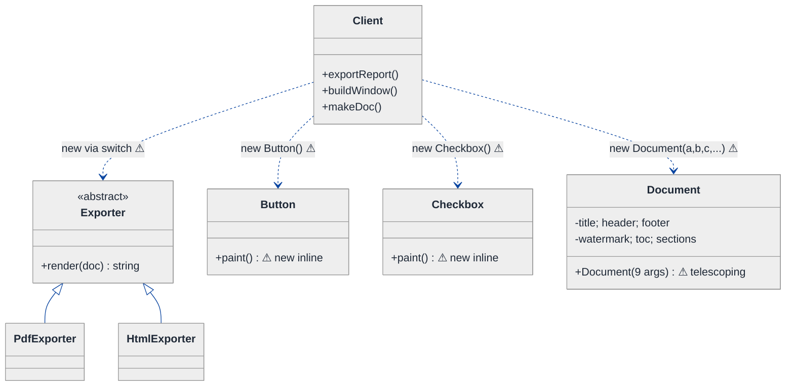
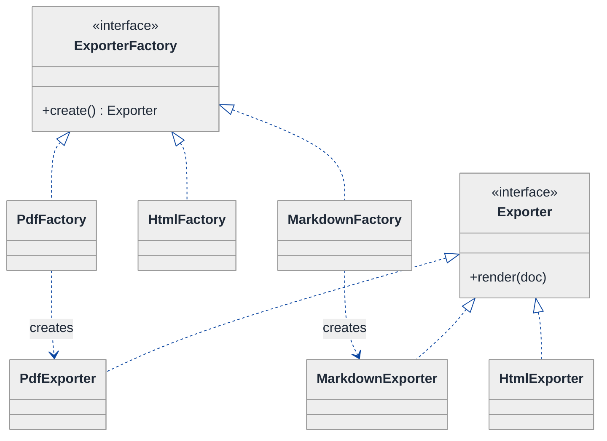
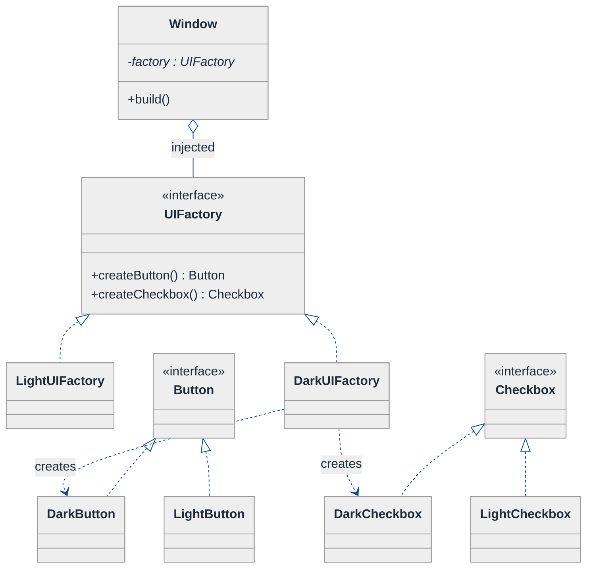
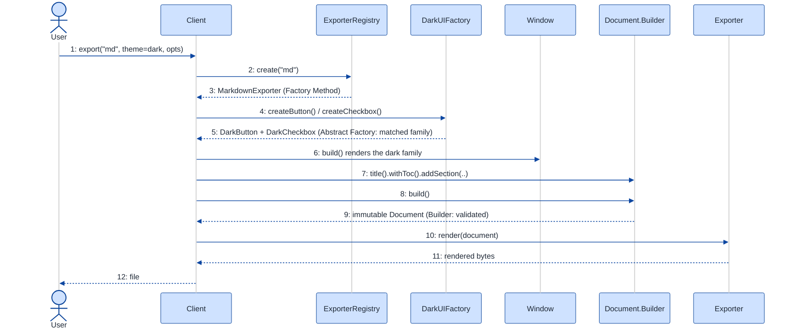

# Factory vs Abstract Factory vs Builder — LLD Walkthrough

> **Difficulty:** Medium · **Time:** ~30 min · **Pattern focus:** Factory-family discrimination (Factory Method vs Abstract Factory vs Builder)
>
> **Problem source(s):** GID F1 in [`./EXTRACTED_QUESTIONS.md`](./EXTRACTED_QUESTIONS.md). "Compare and contrast the Factory, Abstract Factory, and Builder patterns; implement a real-world example where using the wrong pattern leads to maintenance issues."
>
> **Diagrams:** inline mermaid (renders natively in GitHub / VS Code). Optional editable freehand sources are sibling `.excalidraw` files.

---

## How to use this file

This question is unusual: the interviewer is not asking you to design ONE system, they are asking you to demonstrate that you can **tell three creation patterns apart** and pick the right one. The trap is reciting GoF definitions. The senior move is to take a single concrete system, build it naively, watch it break in THREE different directions, and notice that each break wants a DIFFERENT creation pattern. Reading time: ~30 minutes if you sketch each iteration by hand.

**The lesson: Factory Method, Abstract Factory, and Builder solve three DIFFERENT creation problems. Reaching for the wrong one (e.g. Builder where you needed Abstract Factory) does not fail loudly — it quietly scatters `new` statements and breaks family-consistency. We derive the discrimination rule by watching the wrong choice rot.**

**Map of this file (15 sections):**

1. Problem statement + clarifying questions
2. Plain-English restatement
3. Why this matters
4. Mental model
5. Try it yourself first
6. Entity & verb extraction
7. **Iteration 1: the naive design** — `new` scattered everywhere
8. **Where the naive design hurts** — three future requirements, three DIFFERENT creation pains
9. **Pivot 1: Factory Method** — vary WHICH ONE subclass to instantiate
10. **Pivot 2: Abstract Factory** — vary a CONSISTENT FAMILY of related objects
11. **Pivot 3: Builder** — assemble ONE complex object step by step
12. Final class diagram (three focused sub-views)
13. Skeleton code (C++17)
14. Key flow — sequence diagram
15. Extensibility re-check + the wrong-pattern case study + anti-patterns + how to think aloud + self-check

---

## 1. Problem statement + clarifying questions

**Prompt (typical phrasing):** "Compare and contrast the Factory, Abstract Factory, and Builder patterns. When would you use each? Implement a real-world example where using the wrong pattern leads to maintenance issues."

A good candidate refuses to answer in the abstract and pins down a concrete system to reason over. Here we'll use a **cross-platform UI/document export toolkit** — it naturally exercises all three patterns.

**Clarifying questions to ask BEFORE drawing anything:**

1. **Single product or a family?** Are we creating one kind of object (e.g. a `Button`), or a set of objects that must match each other (a `Button` + `Checkbox` + `Menu` that all share a look)? This is the Factory-Method-vs-Abstract-Factory fork.
2. **Does the object have many optional parts?** Is construction a one-liner, or does the object have 8 optional fields, validation, and an immutable result? That's the Builder fork.
3. **Who decides the concrete type — compile time or runtime?** If a config string or user choice picks the variant at runtime, we need polymorphic creation, not a hardcoded `new`.
4. **How many product variants today, and how many expected?** Two themes that never grow may not justify a pattern; a plugin ecosystem definitely does.
5. **Is the created object immutable once built?** Immutability strongly nudges toward Builder (assemble, then freeze).
6. **Are the products related by a common consistency rule?** "All widgets in a window must share a theme" is the signature of Abstract Factory.

**Assumptions if interviewer dodges:** a cross-platform toolkit that (a) creates a single `Exporter` chosen at runtime (Factory Method axis), (b) creates families of themed widgets that must stay consistent — Light vs Dark (Abstract Factory axis), and (c) assembles a complex `Document` with many optional sections (Builder axis). One system, three creation problems.

---

## 2. Plain-English restatement

We are building a toolkit that has to *create objects* in three different shapes of "create." Sometimes we need to pick ONE concrete subclass at runtime (which exporter — PDF, HTML, Markdown?). Sometimes we need a whole MATCHING SET of objects that belong together (all the widgets of a dark theme). And sometimes we need to assemble a SINGLE big object from many optional pieces (a document with an optional header, optional footer, optional watermark, optional table of contents). The skill is recognizing that these are three distinct problems and that each maps to a distinct creation pattern.

---

## 3. Why this matters

Creation patterns are the most-confused family in GoF, and interviewers know it. The failure mode is not "candidate cannot define Factory" — most can. The failure mode is the candidate who uses Abstract Factory where Builder was needed, or wraps a Builder around something that should have been a one-line Factory Method, and then cannot say *why* their choice rots over time. This question probes whether you understand the **forces** behind each pattern: one-of-many selection, family consistency, and step-wise assembly. Get the discrimination right and the design is obvious; get it wrong and the maintenance bill arrives quietly.

---

## 4. Mental model

Think of three different counters at a hardware store:

```
Real-world sketch (NOT a UML diagram yet):

  (A) "Give me A drill."          -> Factory Method
      You name the kind; the clerk hands you ONE tool.
      Vary: WHICH concrete tool.

  (B) "Outfit me for WINTER."     -> Abstract Factory
      Clerk hands you a MATCHING SET: coat + gloves + boots,
      all winter-grade. Never a winter coat with summer gloves.
      Vary: the whole consistent FAMILY at once.

  (C) "Build me a custom PC."     -> Builder
      Same product type, but assembled step by step from
      many optional parts; result validated, then sealed.
      Vary: the CONFIGURATION of one complex object.
```

The KEY insight: Factory Method varies **which one**; Abstract Factory varies **which family**; Builder varies **how one thing is assembled**. Three different verbs of creation.

---

## 5. Try it yourself first

> **Predict before reading on:**
>
> 1. You need to create a `PdfExporter` or `HtmlExporter` based on a runtime string `"pdf"` / `"html"`. Which pattern, and why not the other two?
> 2. A window must render either an all-light or an all-dark set of widgets, and a light button must NEVER appear next to a dark checkbox. What goes wrong if you create each widget with its OWN factory method?
> 3. A `Document` has 9 optional sections and must be immutable once finished. What goes wrong if you add a 10-argument constructor, then an 11th?

---

## 6. Entity & verb extraction

> **Mini-refresher: noun → class, but not every noun.**
>
> Promote a noun to a class only if it has BEHAVIOR and STATE that belong together. A "theme name" is a field; a "widget" is a class because it renders.

**Nouns from the prompt:**

| Noun | Decision | Why |
|---|---|---|
| Exporter | Class (abstract) + concrete subclasses | PDF/HTML/Markdown each render differently — genuine "is-a" |
| Widget (Button, Checkbox, Menu) | Classes (abstract + concrete per theme) | Each renders; theme variants are real subtypes |
| Theme | A *selector*, not a class | "light" / "dark" picks a family — modeled by the factory, not a data class |
| Document | Class (immutable, complex) | Many optional parts; assembled then frozen |
| Section / Header / Footer / Watermark | Fields/parts of Document | Optional pieces, not independent lifecycles |
| Window | Class (the client of widget creation) | Orchestrates a set of widgets |

**Verbs (and the class they live on):**

| Verb | Owner class (naive answer — we'll re-examine) |
|---|---|
| createExporter(kind) | (naive) free function with a switch |
| createButton() / createCheckbox() | (naive) Window, with `new` inline |
| render() | each Widget / Exporter |
| addHeader() / addWatermark() / build() | (naive) Document constructor — telescoping |

**No design patterns yet.** Pure nouns and verbs.

---

## 7. <a id="iter-1"></a>Iteration 1: the naive design

The simplest thing that could possibly work: a switch statement to pick exporters, `new` calls sprinkled wherever widgets are needed, and a fat constructor for the document.



**Reader's tour (~60 seconds).**

1. **The `Client` is doing all the creating.** It has three jobs: pick an exporter, build a window of widgets, and make a document. Every one of those involves a raw `new` or a switch inside the client.
2. **Exporter hierarchy (top).** A genuine "is-a": `PdfExporter` and `HtmlExporter` both `render`. The inheritance is fine. The smell is HOW the client chooses between them — a `switch (kind)` with `new` in each branch.
3. **Widgets (middle).** `Button` and `Checkbox` are created with bare `new Button()` / `new Checkbox()` wherever a window is assembled. Nothing enforces that they belong to the same theme.
4. **Document (bottom).** A single class with a 9-argument constructor — the classic telescoping constructor. Every optional part is a positional argument.

**What's deliberately missing.** No factory abstraction, no family selector, no step-wise assembly. Three different creation problems are all solved with the same blunt tool: `new` in the caller.

Skeleton code for the naive design (C++17):

```cpp
#include <memory>
#include <string>
#include <vector>
#include <stdexcept>

// ── Single-product creation: a switch in the caller ─────────────────
enum class ExportKind { PDF, HTML };

class Exporter {
public:
    virtual ~Exporter() = default;
    virtual std::string render(const std::string& doc) const = 0;
};
class PdfExporter  : public Exporter { public: std::string render(const std::string& d) const override { return "PDF:"  + d; } };
class HtmlExporter : public Exporter { public: std::string render(const std::string& d) const override { return "HTML:" + d; } };

std::unique_ptr<Exporter> makeExporter(ExportKind k) {   // ⚠ switch in caller
    switch (k) {
        case ExportKind::PDF:  return std::make_unique<PdfExporter>();
        case ExportKind::HTML: return std::make_unique<HtmlExporter>();
    }
    throw std::runtime_error("unknown export kind");
}

// ── Family creation: nothing keeps the set consistent ───────────────
class LightButton {}; class DarkButton {};
class LightCheckbox {}; class DarkCheckbox {};

void buildWindow(bool dark) {
    // ⚠ theme decision repeated at EVERY new-site; easy to mismatch
    if (dark) { auto b = new DarkButton();  auto c = new DarkCheckbox();  /* ... */ }
    else      { auto b = new LightButton(); auto c = new LightCheckbox(); /* ... */ }
    // nothing stops:  new DarkButton(); new LightCheckbox();  // inconsistent!
}

// ── Complex object: telescoping constructor ─────────────────────────
class Document {
public:
    // ⚠ 9 positional args; add a 10th and every call-site breaks
    Document(std::string title, std::string header, std::string footer,
             std::string watermark, bool toc, std::vector<std::string> sections,
             bool numbered, std::string font, int margin) { /* ... */ }
};
```

**This works.** It compiles, it exports, it builds windows. It has zero creation patterns. So what's wrong with it?

---

## 8. <a id="naive-pain"></a>Where the naive design hurts

The interviewer slides three requirements across the desk. The crucial observation: **each one hurts in a DIFFERENT way, and each wants a DIFFERENT creation pattern.**

### Change A: "Add a `MarkdownExporter`, and let plugins register new exporter kinds at runtime"

In the naive design:
- `makeExporter` is a switch — add a `case MARKDOWN`. Fine for one.
- But "plugins register kinds at runtime" means the switch CANNOT know all cases at compile time. A `switch` over a closed `enum` is the wrong structure entirely.
- **The variability is: WHICH ONE concrete `Exporter` subclass to instantiate, decided by a subclass/plugin — not by a switch the library owns.**

### Change B: "Ship a Dark theme alongside Light; a window must never mix a light button with a dark checkbox"

In the naive design:
- The `if (dark)` decision is repeated at *every* `new`-site across the codebase.
- Nothing structurally prevents `new DarkButton()` next to `new LightCheckbox()`. The first time someone adds a widget and forgets the branch, you ship a mismatched window.
- **The variability is: a CONSISTENT FAMILY of related widgets that must vary together. A per-widget factory method does not help — it would let each widget choose its theme independently, which is exactly the bug.**

### Change C: "Document gains a watermark, a TOC, page numbering, and 3 more optional sections"

In the naive design:
- The constructor grows from 9 args to 12. Call-sites pass `Document("t","","","",false,{},false,"",0)` — a wall of empty defaults.
- Optional combinations explode; nobody can read a call-site; you cannot validate "footer requires page numbering" in one place.
- **The variability is: ONE complex object assembled from many optional parts, ideally immutable once complete. Neither a factory method nor a family factory addresses *assembly*.**

### The pattern of pain

| Change | Files / sites touched | Smell | Variability axis |
|---|---|---|---|
| A. Markdown + plugins | `makeExporter` switch | "Closed switch can't admit runtime-registered subclasses." | *which one* concrete subclass |
| B. Dark theme | every widget `new`-site | "Family consistency unenforced; theme branch duplicated." | *which family* of matching objects |
| C. Document options | `Document` constructor + every call-site | "Telescoping constructor; no place to validate." | *how* one object is assembled |

> **Pivot question:** "Three creation pains, three axes. Which pattern handles 'pick one of many subclasses (extensibly)'? Which handles 'create a consistent family that varies together'? Which handles 'assemble one complex object step by step'?"
>
> The answers are Factory Method, Abstract Factory, and Builder — in that order. Let's introduce them one axis at a time.

---

## 9. <a id="pivot-1"></a>Pivot 1: Factory Method for "which one exporter"

> **Mini-refresher: Factory Method pattern.**
>
> Define an interface for creating an object, but let SUBCLASSES decide which concrete class to instantiate. The creation call (`create()`) is a virtual method; each subclass overrides it to return its own product. The caller programs against the abstract product and the abstract creator — it never names a concrete product.
>
> Quick example: an abstract `Dialog` has `virtual Button* createButton() = 0`. `WindowsDialog` returns a `WindowsButton`; `WebDialog` returns an `HtmlButton`. `Dialog::render()` calls `createButton()` without knowing which.

**Why Factory Method fits Change A.** The pain was a closed `switch` choosing ONE concrete `Exporter`. The variability is *which single subclass to instantiate*, and we want NEW kinds to be addable without editing the chooser. Factory Method moves the `new` behind a virtual method (or a registry of creators) so a subclass / plugin supplies its own product. The library calls `create()`; it never sees `MarkdownExporter` by name.

**The refactor (just the exporter slice):**

```cpp
// Abstract creator: the factory method is virtual.
class ExporterFactory {
public:
    virtual ~ExporterFactory() = default;
    virtual std::unique_ptr<Exporter> create() const = 0;   // the factory method
};

class PdfFactory : public ExporterFactory {
public:
    std::unique_ptr<Exporter> create() const override { return std::make_unique<PdfExporter>(); }
};
// MarkdownExporter ships its OWN factory — library code never edited:
class MarkdownFactory : public ExporterFactory {
public:
    std::unique_ptr<Exporter> create() const override { return std::make_unique<MarkdownExporter>(); }
};
// other factories elided

// Plugin-friendly variant: a registry of named creators (open for extension).
class ExporterRegistry {
public:
    using Creator = std::function<std::unique_ptr<Exporter>()>;
    void registerKind(std::string name, Creator c) { creators_[std::move(name)] = std::move(c); }
    std::unique_ptr<Exporter> create(const std::string& name) const {
        return creators_.at(name)();   // no switch; plugins add entries at runtime
    }
private:
    std::unordered_map<std::string, Creator> creators_;
};
```

**What changed — visualized.** Just the exporter slice:



**Tour of the after-state.**

1. **Two parallel hierarchies.** On the left, a hierarchy of *creators* (`ExporterFactory` + subclasses). On the right, a hierarchy of *products* (`Exporter` + subclasses). Each concrete factory creates exactly ONE concrete product.
2. **The `switch` is gone.** Adding `MarkdownExporter` means adding `MarkdownFactory` — a new pair of classes. No existing file is edited. Open/closed.
3. **The registry variant** lets a plugin call `registry.registerKind("md", ...)` at load time, so even the set of factories is open at runtime.

**Pattern-discrimination cheatsheet — Factory Method vs a plain `switch`/static factory.**
- *Static factory / switch:* one function knows ALL concrete types; closed to extension; fine for a fixed, small set.
- *Factory Method:* creation is virtual / registered; new products arrive as new subclasses or registry entries; the chooser is never touched.
- *Rule of thumb:* if new variants will keep arriving (especially from plugins) → Factory Method. If the set is fixed forever → a simple static factory is honest and cheaper.

We chose Factory Method because Change A explicitly demands runtime-registered, library-unaware extension.

---

## 10. <a id="pivot-2"></a>Pivot 2: Abstract Factory for "which consistent family"

Change B is still painful, and notice that **Factory Method does NOT solve it.** A per-widget factory method would let `createButton()` and `createCheckbox()` each pick a theme independently — that is the very mismatch bug. We need a creator that produces a WHOLE FAMILY that varies together.

> **Mini-refresher: Abstract Factory pattern.**
>
> Provide an interface for creating FAMILIES of related objects without naming their concrete classes. One factory object has multiple create-methods (`createButton`, `createCheckbox`, `createMenu`), and a given concrete factory returns products from a SINGLE consistent family. Swap the factory → the entire family swaps together.
>
> Quick example: `UIFactory` with `createButton()` + `createCheckbox()`. `DarkUIFactory` returns `DarkButton` + `DarkCheckbox`; `LightUIFactory` returns the light pair. The client holds one `UIFactory*` and physically cannot mix themes.

**Why Abstract Factory fits (not Factory Method).** The variability is a *set* of related products that must stay consistent. Abstract Factory bundles all the create-methods onto ONE factory, so choosing the factory once fixes the whole family. There is no code path that yields a dark button with a light checkbox.

**The refactor (just the widget-family slice):**

```cpp
// Abstract products
class Button   { public: virtual ~Button()   = default; virtual void paint() const = 0; };
class Checkbox { public: virtual ~Checkbox() = default; virtual void paint() const = 0; };

// Abstract factory: one object, many create-methods, ONE family per factory
class UIFactory {
public:
    virtual ~UIFactory() = default;
    virtual std::unique_ptr<Button>   createButton()   const = 0;
    virtual std::unique_ptr<Checkbox> createCheckbox() const = 0;
};

class DarkUIFactory : public UIFactory {
public:
    std::unique_ptr<Button>   createButton()   const override { return std::make_unique<DarkButton>();   }
    std::unique_ptr<Checkbox> createCheckbox() const override { return std::make_unique<DarkCheckbox>(); }
};
// LightUIFactory elided — mirrors Dark, returns the light pair

// Client holds ONE factory; the family is guaranteed consistent.
class Window {
public:
    explicit Window(const UIFactory& f) : factory_(f) {}
    void build() {
        auto b = factory_.createButton();     // dark
        auto c = factory_.createCheckbox();   // ALSO dark — cannot mismatch
        b->paint(); c->paint();
    }
private:
    const UIFactory& factory_;
};
```

**What changed — visualized.** Just the family slice:



**Tour of the after-state.**

1. **One factory, two create-methods.** `UIFactory` declares `createButton()` AND `createCheckbox()`. A single concrete factory answers both — so both come from the same family.
2. **`Window` holds ONE `UIFactory*`.** Inject `DarkUIFactory` once; every widget the window builds is dark. The mismatch bug is now structurally impossible — there is no place to choose a per-widget theme.
3. **Two product hierarchies, partitioned by family.** `DarkUIFactory` only ever touches `DarkButton`/`DarkCheckbox`. Adding a third theme (e.g. `HighContrast`) is one new factory + its product set.

**Pattern-discrimination cheatsheet — Factory Method vs Abstract Factory.**
- *Factory Method:* ONE create-method; produces ONE product; vary *which subclass* of that one product.
- *Abstract Factory:* MANY create-methods on one object; produces a CONSISTENT FAMILY; vary *which family*.
- *Rule of thumb:* creating a single thing → Factory Method. Creating several things that must match each other → Abstract Factory. (An Abstract Factory's individual create-methods are often each implemented as Factory Methods — they compose.)

We chose Abstract Factory because the consistency constraint ("never mix themes") is exactly what binding all create-methods to one factory enforces.

---

## 11. <a id="pivot-3"></a>Pivot 3: Builder for "how one complex object is assembled"

Change C remains, and neither factory pattern touches it. A factory decides WHICH class to make; it does not help ASSEMBLE one object from many optional parts. That is Builder's job.

> **Mini-refresher: Builder pattern.**
>
> Separate the construction of a complex object from its representation, so the same construction process can build different configurations. A builder exposes step methods (`withHeader(...)`, `withWatermark(...)`) that return `*this` for chaining, accumulate state, and a terminal `build()` that validates and produces the (often immutable) product.
>
> Quick example: `Document::Builder().title("Q3").withToc().withFooter("p.").build()`. Optional parts are named, not positional; the result is sealed.

**Why Builder fits (not a factory).** The pain was a telescoping constructor with many optional args and no validation point. Builder replaces positional args with named, chainable steps, centralizes validation in `build()`, and yields an immutable `Document`. There is no "which subclass" decision here — the product type is fixed; only its CONFIGURATION varies.

**The refactor (just the document slice):**

```cpp
class Document {
public:
    // Immutable: only the Builder can construct one.
    class Builder {
    public:
        explicit Builder(std::string title) : title_(std::move(title)) {}
        Builder& withHeader(std::string h)    { header_    = std::move(h); return *this; }
        Builder& withFooter(std::string f)    { footer_    = std::move(f); return *this; }
        Builder& withWatermark(std::string w) { watermark_ = std::move(w); return *this; }
        Builder& withToc()                    { toc_       = true;         return *this; }
        Builder& addSection(std::string s)    { sections_.push_back(std::move(s)); return *this; }
        Document build() const {                 // single validation point
            if (!footer_.empty() && !toc_) throw std::runtime_error("footer requires TOC");
            return Document(*this);
        }
    private:
        friend class Document;
        std::string title_, header_, footer_, watermark_;
        bool        toc_ = false;
        std::vector<std::string> sections_;
    };
    const std::string& title() const { return title_; }   // getters only — immutable
private:
    explicit Document(const Builder& b)
        : title_(b.title_), header_(b.header_), footer_(b.footer_),
          watermark_(b.watermark_), toc_(b.toc_), sections_(b.sections_) {}
    std::string title_, header_, footer_, watermark_;
    bool        toc_;
    std::vector<std::string> sections_;
};

// Usage: only the parts you want, named, then sealed.
// auto doc = Document::Builder("Q3 Report").withToc().withFooter("page").addSection("Intro").build();
```

**What changed — visualized.** Just the document slice:

```mermaid
---
config:
  theme: neutral
  themeVariables:
    background: '#ffffff'
    primaryColor: '#cfe2ff'
    primaryTextColor: '#1f2937'
    primaryBorderColor: '#084298'
    secondaryColor: '#fff3cd'
    secondaryTextColor: '#1f2937'
    secondaryBorderColor: '#664d03'
    tertiaryColor: '#d1e7dd'
    tertiaryTextColor: '#1f2937'
    tertiaryBorderColor: '#0a3622'
    lineColor: '#0d47a1'
    textColor: '#1f2937'
    noteBkgColor: '#fff3cd'
    noteTextColor: '#1f2937'
    noteBorderColor: '#997404'
    actorBkg: '#cfe2ff'
    actorBorder: '#084298'
    actorTextColor: '#1f2937'
    signalColor: '#0d47a1'
    signalTextColor: '#1f2937'
    labelBoxBkgColor: '#ffffff'
    labelBoxBorderColor: '#d3d3d3'
    labelTextColor: '#1f2937'
    edgeLabelBackground: '#ffffff'
    labelBackground: '#ffffff'
    classText: '#1f2937'
    fontFamily: 'system-ui, -apple-system, Segoe UI, Helvetica, Arial, sans-serif'
---
classDiagram
  direction TB
  class Document {
    -title; header; footer
    -watermark; toc; sections
    +title() getter (immutable)
  }
  class Builder {
    -accumulating fields
    +withHeader(h) Builder
    +withFooter(f) Builder
    +withWatermark(w) Builder
    +withToc() Builder
    +addSection(s) Builder
    +build() Document
  }
  Document +-- Builder : nested
  Builder ..> Document : build() creates & validates
```

**Tour of the after-state.**

1. **`Builder` is nested inside `Document`** so only it can call the private constructor — the product is immutable; you cannot build a half-formed `Document` any other way.
2. **Each `with...` step returns `Builder&`** for fluent chaining and sets exactly one optional part. Adding a 10th option is ONE new method — no call-site breaks, because every existing chain is still valid.
3. **`build()` is the single validation gate.** Cross-field rules ("footer requires TOC") live in one place, not scattered across constructor overloads.

**Pattern-discrimination cheatsheet — Builder vs Factory (Method/Abstract).**
- *Factory (Method/Abstract):* decides WHICH concrete class(es) to instantiate; creation is usually a one-shot call; product type varies.
- *Builder:* product type is FIXED; you assemble it step by step from many optional parts, often immutable, with a validation step.
- *Rule of thumb:* "which class do I make?" → Factory family. "how do I assemble this one complex thing?" → Builder. If construction needs many optional parameters or staged validation → Builder, even if there's only one product type.

We chose Builder because Change C is purely about *assembly and validation* of a single, fixed product type.

---

## 12. <a id="fig-class-diagram"></a>Final class diagram

One diagram would be three unrelated islands, because these are three independent creation problems sharing one toolkit. Here are **three focused sub-views**, then a discrimination table that ties them together.

### 12.1 Factory Method slice — which one exporter

See the [exporter slice diagram in Pivot 1](#pivot-1): two parallel hierarchies (`ExporterFactory` creators, `Exporter` products), one factory per product, extensible via subclass or registry. That diagram IS the final shape for this axis; nothing was added afterward.

### 12.2 Abstract Factory slice — which consistent family

See the [widget-family diagram in Pivot 2](#pivot-2): one `UIFactory` with multiple create-methods, two concrete factories each bound to a single family, `Window` injected with exactly one factory. Final shape for this axis.

### 12.3 Builder slice — how one document is assembled

See the [document diagram in Pivot 3](#pivot-3): immutable `Document` with a nested fluent `Builder`, named optional steps, a single validating `build()`. Final shape for this axis.

### Structural insight (ties 12.1 + 12.2 + 12.3 together)

| Creation problem | Pattern | Varies | Tell-tale sign in requirements |
|---|---|---|---|
| Pick ONE concrete subclass, extensibly | **Factory Method** | *which subclass* of one product | "choose at runtime", "plugins add kinds", "no switch" |
| Create a CONSISTENT SET of related objects | **Abstract Factory** | *which family* (all members switch together) | "must match", "never mix", "theme/platform/skin" |
| Assemble ONE complex object from optional parts | **Builder** | *configuration* of one fixed product | "many optional fields", "immutable result", "validate on build" |

The big lesson: **all three are "creation" patterns, but they answer three different questions** — *which one?*, *which family?*, *how assembled?*. Reaching for the wrong one does not crash; it quietly reintroduces the exact smell you were trying to remove (a hidden switch, a mismatched family, or a telescoping constructor). The discrimination, not the syntax, is the senior skill. We make the wrong-pattern failure concrete in §15.

---

## 13. Skeleton code (C++17)

> The full per-pattern code lives in the pivot slices (§9 Factory Method, §10 Abstract Factory, §11 Builder). Here is the consolidated SHAPE — the three creators side by side so the contrast is one glance. Abstract base + 1 concrete each; rest `// elided`.

```cpp
#include <functional>
#include <memory>
#include <stdexcept>
#include <string>
#include <unordered_map>
#include <vector>

// ── Factory Method: ONE create-method, varies WHICH subclass ─────────
class Exporter { public: virtual ~Exporter() = default; virtual std::string render(const std::string&) const = 0; };
class PdfExporter : public Exporter { public: std::string render(const std::string& d) const override { return "PDF:" + d; } };
// MarkdownExporter, HtmlExporter elided

class ExporterFactory {                       // abstract creator
public:
    virtual ~ExporterFactory() = default;
    virtual std::unique_ptr<Exporter> create() const = 0;            // the factory method
};
class PdfFactory : public ExporterFactory {
public:
    std::unique_ptr<Exporter> create() const override { return std::make_unique<PdfExporter>(); }
};
// Plugin-friendly variant: a registry of named creators (open for runtime extension)
class ExporterRegistry {
public:
    using Creator = std::function<std::unique_ptr<Exporter>()>;
    void registerKind(std::string n, Creator c) { creators_[std::move(n)] = std::move(c); }
    std::unique_ptr<Exporter> create(const std::string& n) const { return creators_.at(n)(); }   // no switch
private:
    std::unordered_map<std::string, Creator> creators_;
};

// ── Abstract Factory: MANY create-methods, varies WHICH FAMILY ───────
class Button   { public: virtual ~Button()   = default; virtual void paint() const = 0; };
class Checkbox { public: virtual ~Checkbox() = default; virtual void paint() const = 0; };
class DarkButton   : public Button   { public: void paint() const override {} };
class DarkCheckbox : public Checkbox { public: void paint() const override {} };
// Light variants elided

class UIFactory {                             // creates a CONSISTENT family
public:
    virtual ~UIFactory() = default;
    virtual std::unique_ptr<Button>   createButton()   const = 0;
    virtual std::unique_ptr<Checkbox> createCheckbox() const = 0;
};
class DarkUIFactory : public UIFactory {      // one factory => one matched family
public:
    std::unique_ptr<Button>   createButton()   const override { return std::make_unique<DarkButton>();   }
    std::unique_ptr<Checkbox> createCheckbox() const override { return std::make_unique<DarkCheckbox>(); }
};
// LightUIFactory elided; Window holds one UIFactory& => cannot mismatch (see §10)

// ── Builder: fixed product type, varies HOW it is ASSEMBLED ──────────
class Document {                              // immutable; nested fluent Builder
public:
    class Builder {
    public:
        explicit Builder(std::string title) : title_(std::move(title)) {}
        Builder& withFooter(std::string f) { footer_ = std::move(f); return *this; }
        Builder& withToc()                 { toc_ = true;            return *this; }
        Builder& addSection(std::string s) { sections_.push_back(std::move(s)); return *this; }
        // other with-steps elided
        Document build() const {                                     // single validation gate
            if (!footer_.empty() && !toc_) throw std::runtime_error("footer requires TOC");
            return Document(*this);
        }
    private:
        friend class Document;
        std::string title_, footer_;
        bool        toc_ = false;
        std::vector<std::string> sections_;
    };
    const std::string& title() const { return title_; }              // getters only — immutable
private:
    explicit Document(const Builder& b)
        : title_(b.title_), footer_(b.footer_), toc_(b.toc_), sections_(b.sections_) {}
    std::string title_, footer_;
    bool        toc_;
    std::vector<std::string> sections_;
};
```

---

## 14. <a id="fig-sequence"></a>Key flow — sequence diagram

The flow that exercises all three patterns: the client picks an exporter (Factory Method), builds a themed window (Abstract Factory), assembles a document (Builder), then exports.



**Tour of the flow. Notice how each pattern HIDES a different decision from the client.**

1. **Steps 2-3 (Factory Method).** The client says `create("md")` and gets back an `Exporter`. It never names `MarkdownExporter`. The registry hides *which subclass* was built — the open-for-extension win.
2. **Steps 4-5 (Abstract Factory).** The client asks one `DarkUIFactory` for a button and a checkbox. It receives a MATCHED pair. The factory hides *family membership* — the client could not produce a mismatch even if it tried.
3. **Steps 7-9 (Builder).** The client chains optional steps and calls `build()`. The builder hides *assembly order and validation* — the client never touches a 12-arg constructor and cannot observe a half-built document.
4. **Steps 10-11.** The fixed business action — render — is the same regardless of which exporter, theme, or document config was chosen. The three creation patterns front-loaded all the variability.

### What's NOT in the diagram — and why it matters

You never see a `switch`, a per-widget theme `if`, or a positional constructor. Those are exactly the three naive-design smells from §8, each dissolved by the matching pattern. **The creation patterns made the wrong constructions unrepresentable.**

---

## 15. Extensibility re-check + the wrong-pattern case study + anti-patterns + how to think aloud + self-check

### Extensibility re-check

Revisit the three changes from [§8](#naive-pain). For each, name the SINGLE thing that changes.

| Change | Naive design impact | Final design impact |
|---|---|---|
| A. Markdown + plugin kinds | `makeExporter` switch grows; closed to plugins | New `MarkdownFactory` class OR one `registry.registerKind(...)` call. Done. |
| B. Dark theme | every `new`-site branches; mismatch possible | New `DarkUIFactory` + dark product set; inject once. Mismatch impossible. Done. |
| C. Document options | constructor grows; call-sites break | New `with...()` step on Builder; existing chains untouched. Done. |

### The wrong-pattern case study (the heart of this question)

The prompt explicitly asks for an example where the WRONG pattern causes maintenance issues. Here is the canonical one.

**Suppose we had used Builder for the themed widgets (Change B) instead of Abstract Factory.** A `WidgetSetBuilder` with `.button(...)` and `.checkbox(...)` steps looks tempting — it's "creation," after all. But Builder is per-instance assembly; it does NOT bind the family. So a caller can write:

```cpp
auto set = WidgetSetBuilder().button(new DarkButton()).checkbox(new LightCheckbox()).build();
```

Nothing stops the mismatch — the dark/light decision is made at each step, exactly the §8 bug we set out to kill. The maintenance issue: every new widget type adds another builder step where someone can pick the wrong theme, and the inconsistency only surfaces at runtime as a visual glitch, not a compile error. **Builder optimizes assembly flexibility; here we needed assembly RIGIDITY (one family, no choices).** Abstract Factory provides exactly that rigidity by removing the per-widget choice.

**The mirror-image mistake: Abstract Factory where you needed Builder.** Modeling the `Document`'s 9 optional parts as a family of factories forces you to either enumerate every combination as a concrete factory (combinatorial explosion) or fall back to a fat constructor — reintroducing the telescoping smell. Family selection is the wrong axis when the real variability is *optional configuration of one product*.

> **The discrimination rule the case study proves:** match the pattern to the *axis of variability*, not to the word "create." Wrong axis = the original smell quietly returns.

### Anti-patterns

- **"Builder for everything."** A two-field, no-validation object does not need a Builder; a plain constructor is honest. Builder earns its keep only with many optional parts or validation.
- **"Abstract Factory with one product."** If the factory has a single create-method and no family-consistency constraint, you wanted Factory Method (or a static factory). The extra interface is ceremony.
- **"Factory Method as a disguised switch."** If your "factory" is one function with a `switch` over a closed enum and you'll never add variants, you do not have Factory Method — and that's fine; don't pretend otherwise.
- **"Leaky concrete types."** A factory whose return type is the concrete class (`PdfExporter* create()`) defeats the purpose. Return the abstraction (`Exporter`).
- **"Mutable Builder product."** If `build()` returns a mutable object with public setters, you've added a Builder AND kept the telescoping risk. Make the product immutable.
- **"Raw owning pointers."** Factories and builders should hand back `unique_ptr` (or values), never a `new`'d raw pointer the caller must remember to delete.

### How to think aloud

> "The interviewer wants discrimination, not definitions. Let me pin it to one system — a cross-platform export toolkit — so I can show all three.
>
> Naive design: a switch picks exporters, `new` is scattered for widgets, the Document has a 12-arg constructor. It works, zero patterns.
>
> Now three requirements, each hurting differently. (A) Plugins register new exporters — a closed switch can't admit them; the axis is 'which subclass', so Factory Method: virtual create() or a registry. (B) Dark theme must never mix with light — the axis is 'consistent family', so Abstract Factory: one factory with createButton + createCheckbox, swap the factory swaps the whole set. (C) Document gains many optional parts — the axis is 'assembly of one product', so Builder: fluent steps, validate in build(), immutable result.
>
> The trap the question sets: pick the wrong one and the smell returns. Builder for the widget family lets callers mix themes — back to bug B. Abstract Factory for the document explodes into a factory per combination. So the rule is: Factory Method = which subclass; Abstract Factory = which family; Builder = how assembled. Match the pattern to the axis of variability."

### Self-check

> **Self-check — the question to ask next time.**
>
> When you see "create [something]," before reaching for any creation pattern, ask:
>
> > **"Am I choosing WHICH ONE subclass (Factory Method), creating a CONSISTENT FAMILY that must vary together (Abstract Factory), or ASSEMBLING ONE complex object from optional parts (Builder)?"**
>
> Which one → Factory Method. Which family → Abstract Factory. How assembled → Builder. If you can't name the axis, you'll pick by vibe — and the wrong choice quietly reintroduces the very smell you meant to remove.

---

## Cross-references

- **Parent topic manifest:** [`./EXTRACTED_QUESTIONS.md`](./EXTRACTED_QUESTIONS.md)
- **Vertical overview:** [`../../LEARNING.md`](../../LEARNING.md)
- **Template:** [`../../TEMPLATE-v2.md`](../../TEMPLATE-v2.md)
- **Canonical exemplar:** [`../Object_Oriented_Design/Parking_Lot.md`](../Object_Oriented_Design/Parking_Lot.md)
- **Related v2 walkthroughs (future):**
  - Builder Pattern deep-dive (in `../Builder_Pattern/`)
  - Singleton Pattern deep-dive (in `../Singleton_Pattern/`) — the other common creation pattern
  - Strategy / State derivation in Parking Lot (sibling behavioral-pattern arc)
