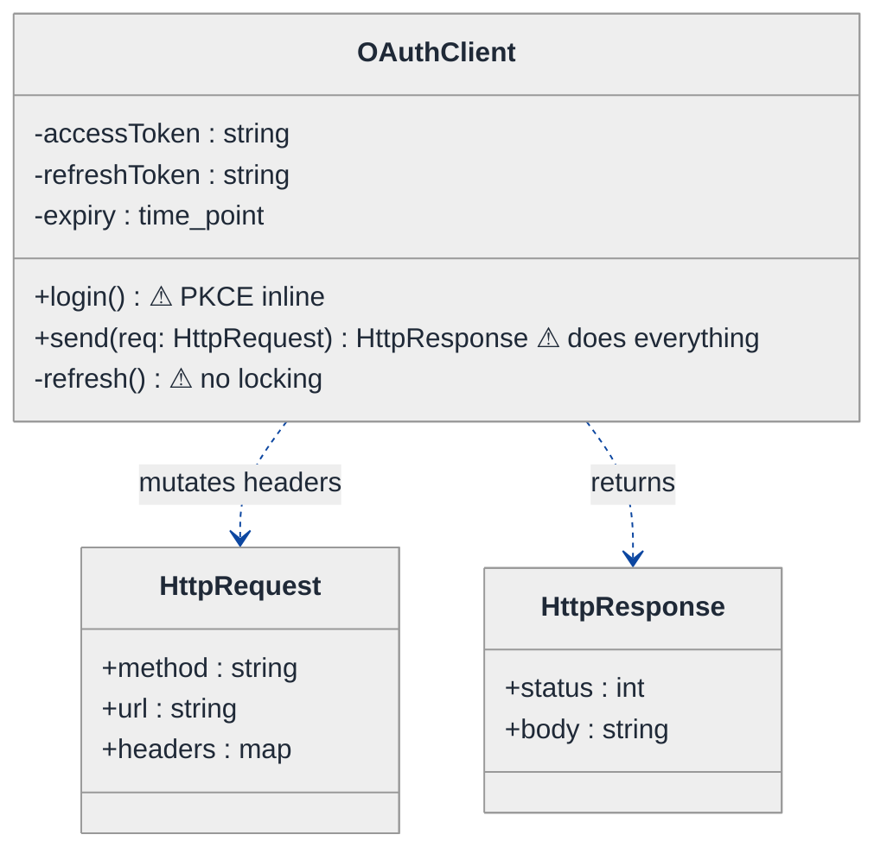
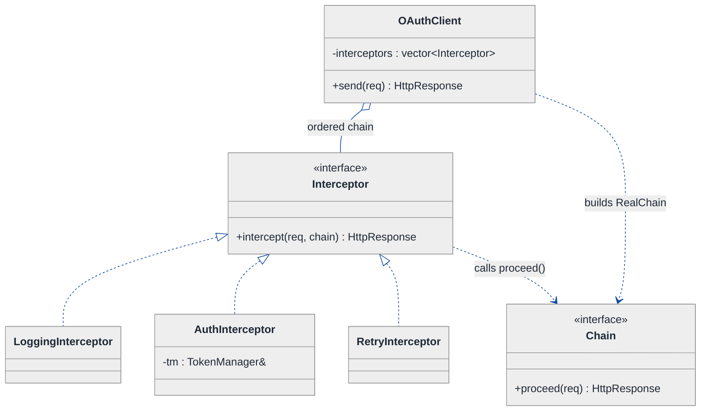
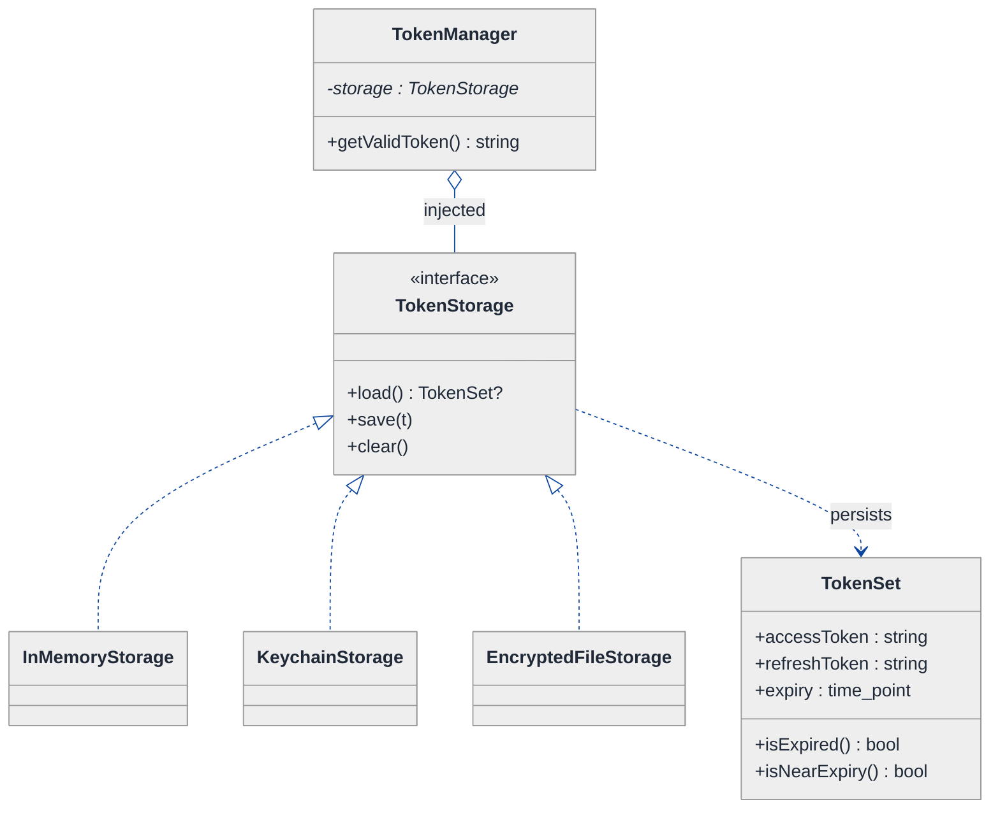
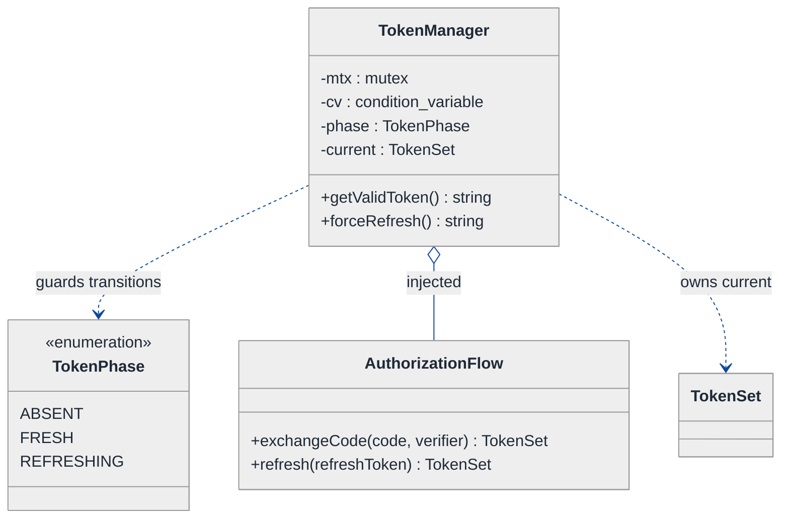
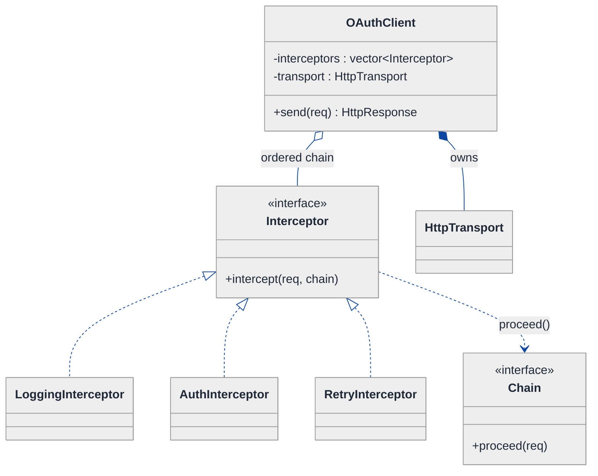
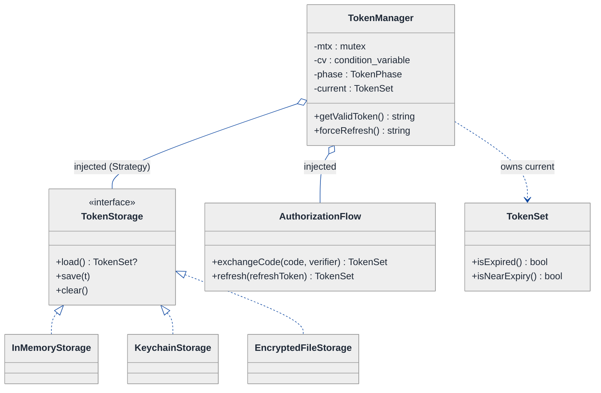
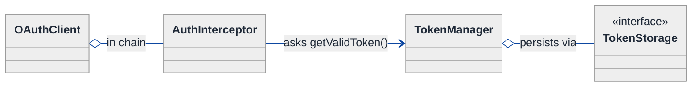
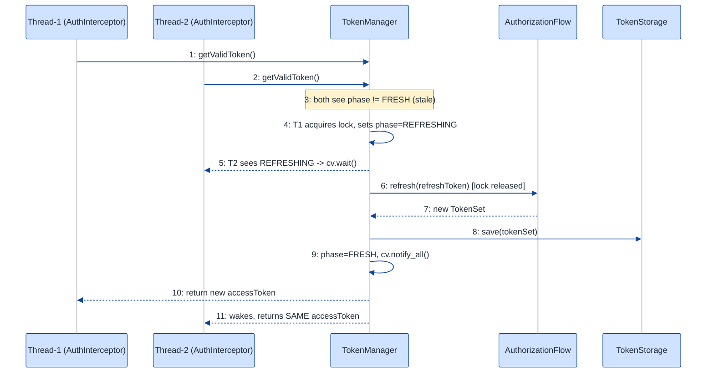

# OAuth Client Library — LLD Walkthrough

> **Difficulty:** Medium · **Time:** ~30 min · **Pattern focus:** Interceptor (cross-cutting token attachment) + token management (Strategy for storage, State + single-flight for refresh races)
>
> **Problem source(s):** GID **I1** in [`./EXTRACTED_QUESTIONS.md`](./EXTRACTED_QUESTIONS.md), bucket `Interceptor_Pattern`.
>
> **Diagrams:** inline mermaid (renders natively in GitHub / VS Code). Theme block is the canonical one from [`../../../CONTINUATION.md`](../../../CONTINUATION.md) §3.

---

## How to use this file

Paced for a candidate who has used OAuth as a *consumer* (clicked "Sign in with Google") but has never *built the client library* that sits between an app and an HTTP layer. Reading time: ~30 minutes if you sketch each iteration by hand. **The lesson: an OAuth client is not "a function that fetches a token." It is a cross-cutting concern wrapped around every outbound request — so the design pressure is "where do I attach behavior to a request without the call site knowing," and the answer DERIVES the Interceptor pattern, not the other way around.**

**Map of this file (15 sections):**

1. Problem statement + clarifying questions
2. Plain-English restatement
3. Why this matters
4. Mental model
5. Try it yourself first
6. Entity & verb extraction
7. **Iteration 1: the naive design** — token logic stuffed into the call site
8. **Where the naive design hurts** — four future requirements, one painful diff each
9. **Pivot 1: Interceptor (Chain of Responsibility)** — lift auth out of the call site
10. **Pivot 2: Strategy for token storage** — memory vs keychain vs file, swapped at construction
11. **Pivot 3: State + single-flight** — model the token lifecycle and kill the refresh race
12. Final UML class diagram
13. Skeleton code (C++)
14. Key flow — sequence diagram
15. Extensibility re-check + anti-patterns + how to think aloud + self-check

---

## 1. Problem statement + clarifying questions

**Prompt (typical phrasing):** "Design an OAuth client library supporting the authorization-code flow with PKCE, token storage, automatic token refresh, intercepting HTTP requests to attach tokens, and handling concurrent token refresh races."

**Clarifying questions to ask BEFORE drawing anything:**

1. **Which grant types?** Just authorization-code-with-PKCE, or also client-credentials and refresh-token? (PKCE implies a public client — mobile/SPA — so probably no client secret.)
2. **Where do tokens live?** In-memory only, OS keychain, encrypted file, browser storage? Different platforms have different secure-storage primitives — is the library cross-platform?
3. **What HTTP layer am I wrapping?** Do we own the transport, or do we plug into an existing client (libcurl, OkHttp, fetch) via an interceptor hook?
4. **Refresh trigger:** proactive (refresh when within N seconds of expiry) or reactive (refresh on a 401), or both?
5. **Concurrency model:** multiple threads or coroutines firing requests at once? If two requests both see an expired token, do we want ONE refresh call or two? (Almost always one — this is the "race" in the prompt.)
6. **Token rotation:** does the auth server rotate the refresh token on each use (one-time-use refresh tokens)? That changes the locking story.
7. **Failure policy:** if refresh fails, do we retry, surface the error, or force re-login?

**Assumptions if interviewer dodges:** authorization-code + PKCE for login and refresh-token grant for renewal; pluggable secure storage; we plug into an existing HTTP client via an interceptor seam; refresh is *both* proactive (near expiry) and reactive (on 401); multi-threaded callers; refresh token may rotate; on refresh failure we surface an error and clear the session. We will treat concurrency seriously in §11.

---

## 2. Plain-English restatement

We are building the library an app links against so that "make an authenticated HTTP request" just works. The app should never hand-roll an `Authorization: Bearer …` header, never think about expiry, and never trigger two refreshes when ten requests fire at once. Under the hood the library runs the PKCE login dance once, stashes the resulting tokens somewhere safe, attaches the access token to every outbound request, and silently swaps in a fresh token when the current one is near (or past) expiry — collapsing concurrent refresh attempts into a single network call.

---

## 3. Why this matters

This question probes whether you understand **cross-cutting concerns**: behavior that every request needs but that does not belong at any single call site. Reaching for an Interceptor (a request-scoped Chain of Responsibility) instead of copy-pasting auth code is the senior move. It also probes **concurrency hygiene** — the refresh race is a classic "thundering herd" that separates candidates who can reason about shared mutable state from those who only draw boxes. The same skills reappear in HTTP middleware, gRPC interceptors, servlet filters, and database connection pools.

---

## 4. Mental model

An OAuth client is a **gatekeeper standing in the request pipeline**. Every request walks past it on the way out; the gatekeeper stamps a token onto the request and, if its stamp is stale, steps aside briefly to get a fresh stamp before waving everyone through.

```
Real-world sketch (NOT a UML diagram yet):

   app.get("/me")  app.post("/order")  app.get("/feed")   <- many call sites
         \              |              /
          \             |             /
           ▼            ▼            ▼
        ┌─────────────────────────────────┐
        │   Interceptor chain (per req)    │
        │   [ Logging ] -> [ Auth ] -> ... │   Auth stamps Bearer <token>
        └──────────────┬──────────────────┘
                       │  needs a token
                       ▼
        ┌─────────────────────────────────┐
        │   TokenManager                   │
        │   - current token + expiry       │   one shared mutable thing
        │   - "is it stale?" -> refresh    │   <- the race lives HERE
        └──────────────┬──────────────────┘
                       ▼
                  TokenStorage (memory / keychain / file)
```

The KEY insight from this picture: the **many call sites** must stay dumb. All the smarts (attach, detect-staleness, refresh, store) collapse into a narrow column the requests pass through. Separating "the pipeline seam" from "the shared token state" is the separation we will bake into the design.

---

## 5. Try it yourself first

> **Predict before reading on:**
>
> 1. List 5 nouns you would promote to a class. List 3 nouns you would leave as fields.
> 2. **If ten requests fire simultaneously and all see an expired token, how do you make sure exactly ONE refresh network call happens — and the other nine wait for its result?**
> 3. If the same library must store tokens in memory on a server but in the OS keychain on a phone, where does that choice live, and who makes it?

---

## 6. Entity & verb extraction

> **Mini-refresher: noun → class, but not every noun.**
>
> Naive OOD promotes every noun to a class. Senior OOD promotes a noun only if it has both BEHAVIOR and STATE that need to live together. "access_token" is a string field; "TokenManager" is a class because it owns the refresh lifecycle and the lock.

**Nouns from the prompt:**

| Noun | Decision | Why |
|---|---|---|
| OAuthClient | Class (facade) | Top-level entry the app holds; wires the pieces together |
| TokenManager | Class | Owns current token + expiry + the refresh lifecycle (+ the lock) |
| TokenStorage | Interface + concrete impls | Memory / keychain / file vary independently |
| TokenSet | Class / struct | access + refresh token + expiry; has a `isExpired()` query |
| Interceptor | Interface + concrete impls | The seam where auth (and logging, retry) attach to a request |
| HttpRequest / HttpResponse | Class / struct | Carries headers, method, url; the thing we mutate |
| AuthorizationFlow (PKCE) | Class | The one-time login dance; produces the first TokenSet |
| access_token / refresh_token | Fields on TokenSet (`std::string`) | No behavior of their own |
| expiry instant | Field on TokenSet (`time_point`) | Just data + a comparison |

**Verbs (and the class they live on):**

| Verb | Owner class (naive answer — we will re-examine) |
|---|---|
| send(request) | OAuthClient → HTTP layer |
| intercept(request, chain) | Interceptor |
| attachToken(request) | AuthInterceptor (after Pivot 1) |
| getValidToken() | TokenManager |
| refresh() | TokenManager |
| load() / save(tokenSet) | TokenStorage |
| isExpired() / isNearExpiry() | TokenSet |
| exchangeCode(code, verifier) | AuthorizationFlow |

**We have NOT introduced any design patterns yet.** Pure nouns + verbs.

---

## 7. <a id="iter-1"></a>Iteration 1: the naive design

Let's write the simplest thing that could possibly work. No patterns — one client class that does everything inline.



**Reader's tour (read top to bottom; ~45 seconds).**

1. **`OAuthClient` is the whole library.** It holds the three token fields directly (`accessToken`, `refreshToken`, `expiry`) and exposes `login()` and `send()`. Notice: NO storage abstraction, NO interceptor seam, NO lock. Every concern lives inside `send()`.

2. **`send()` is the trouble zone.** Look at the three warning markers (⚠). `send()` checks expiry, maybe refreshes, sets the `Authorization` header, fires the request, and on a 401 refreshes and retries — all in one method. That is four responsibilities welded together.

3. **`refresh()` has no locking.** Two threads can both read `expiry`, both see it stale, and both POST to the token endpoint. With one-time-use refresh tokens, the second call fails and corrupts the session. The naive design does not even *acknowledge* concurrency.

4. **HttpRequest / HttpResponse are dumb data carriers.** That part is fine — they stay structs.

**What's deliberately missing.** No `TokenStorage`. No `Interceptor`. No `TokenManager` with a lock. No `TokenState`. The naive design bakes a hardcoded answer for each axis into `send()`. §8 turns each into a concrete future requirement that exposes the brittleness.

Skeleton code for the naive design (C++):

```cpp
#include <chrono>
#include <map>
#include <stdexcept>
#include <string>

struct HttpRequest  { std::string method, url; std::map<std::string,std::string> headers; };
struct HttpResponse { int status; std::string body; };

class HttpTransport { public: HttpResponse fire(const HttpRequest&); };  // wraps libcurl, elided

class OAuthClient {
public:
    OAuthClient(std::string clientId, std::string authUrl)
        : clientId_(std::move(clientId)), authUrl_(std::move(authUrl)) {}

    void login() {
        // PKCE inline: make verifier, hash -> challenge, open browser, get code,
        // POST code+verifier -> {access, refresh, expires_in}.  ~40 lines elided.
    }

    HttpResponse send(HttpRequest req) {                 // does EVERYTHING — will hurt
        if (std::chrono::system_clock::now() >= expiry_) // 1. staleness check
            refresh();                                   // 2. proactive refresh (NO LOCK)
        req.headers["Authorization"] = "Bearer " + accessToken_;  // 3. attach
        HttpResponse res = transport_.fire(req);         // 4. send
        if (res.status == 401) {                         // 5. reactive refresh + retry
            refresh();
            req.headers["Authorization"] = "Bearer " + accessToken_;
            res = transport_.fire(req);
        }
        return res;
    }
private:
    void refresh() {                                     // NO mutex — race lives here
        // POST refresh_token grant -> new {access, refresh, expires_in}
        // accessToken_ = ...; refreshToken_ = ...; expiry_ = now + expires_in;
    }
    std::string clientId_, authUrl_;
    std::string accessToken_, refreshToken_;
    std::chrono::system_clock::time_point expiry_;
    HttpTransport transport_;
};
```

**This works** in a single-threaded demo. It has zero design patterns. We can log in, send, and auto-refresh. So what's wrong with it?

---

## 8. <a id="naive-pain"></a>Where the naive design hurts

The interviewer slides four requirements across the desk: "Here's what's coming next quarter. Walk me through what changes."

### Change A: "Also log every request, and add a retry-with-backoff on 5xx"

In the naive design:
- Logging and retry are MORE cross-cutting concerns. They go… where? Inside `send()`, alongside the auth code.
- `send()` grows from 5 responsibilities to 7. The auth/logging/retry logic is interleaved in one method with no separation.
- **The change touches `send()` and makes an already-overloaded method unreadable.**

### Change B: "Run on mobile — tokens must live in the OS keychain, not RAM"

In the naive design:
- `accessToken_` / `refreshToken_` / `expiry_` are plain fields. To use the keychain we must replace every read and write of those three fields with keychain calls.
- **The change touches every line that reads or writes a token field — `login()`, `send()`, `refresh()` — and there is no seam to swap the backend per platform.**

### Change C: "Ten requests fire at once on a cold token — we must do ONE refresh, not ten"

In the naive design:
- `refresh()` has no lock. Ten threads each see `now() >= expiry_`, ten POSTs go out.
- With rotating refresh tokens, nine of those fail and the session is bricked.
- **The fix is not a one-line `mutex` — we need single-flight: one thread refreshes while the other nine WAIT for and reuse its result. The naive structure has nowhere to put that coordination.**

### Change D: "Add client-credentials grant for service-to-service calls"

In the naive design:
- `login()` hardcodes the PKCE dance. A second grant type means a second branch inside `login()` and a flag to pick between them.
- **Every new grant type = another `if` in `login()`.** The flow algorithm is not pluggable.

### The pattern of pain

| Change | Files / methods touched | Smell |
|---|---|---|
| A. Logging + retry | `send()` | "One method accumulates every cross-cutting concern." |
| B. Keychain storage | `login()` + `send()` + `refresh()` | "Token persistence hardcoded; no seam to swap backends." |
| C. Refresh race | `refresh()` (needs single-flight) | "Shared mutable token with no coordination — thundering herd." |
| D. New grant type | `login()` | "Flow algorithm hardcoded; new grant = new branch." |

**Three axes of pain dominate:** cross-cutting per-request behavior (auth, logging, retry), pluggable token persistence, and the refresh-lifecycle race.

> **Pivot question:** "What pattern attaches behavior to a request without the call site knowing (axis A)? What pattern swaps a persistence backend chosen at construction (axis B)? What structure models a token's lifecycle so exactly one thread refreshes (axis C)?"
>
> The answers are Interceptor (a request-scoped Chain of Responsibility), Strategy, and State + single-flight. Let's introduce them one at a time, starting with the most painful axis: the overloaded `send()`.

---

## 9. <a id="pivot-1"></a>Pivot 1: Interceptor for cross-cutting per-request behavior

> **Mini-refresher: Interceptor pattern (a request-scoped Chain of Responsibility).**
>
> An Interceptor wraps a single unit of work (here, one HTTP request) so behavior can run BEFORE and AFTER it without the caller knowing. Interceptors are arranged in a chain; each one does its bit, then calls `chain.proceed(request)` to pass control to the next, and finally the transport fires the request. On the way back, each interceptor sees the response. It is Chain of Responsibility specialized for "every link handles part of the request, then hands off."
>
> Quick example: an `OkHttpClient` builds a list of interceptors `[Logging, Auth, Retry]`. A request walks the list in order; the last link is the network call. Each link can short-circuit, mutate, or observe.

> **Mini-refresher: Open/Closed Principle (the "O" in SOLID).**
>
> Software entities should be OPEN for extension but CLOSED for modification. Adding logging should mean *adding a new class*, not *editing `send()`*. Pivot 1 is the OCP fix for axis A.

**Why Interceptor fits axis A.** Auth, logging, and retry are all "do something around a request." They differ in WHAT they do but share the SHAPE: receive a request, optionally mutate it, proceed, optionally inspect the response. That shared shape is an interface; the variation is the implementation. Stacking them is composition, not a longer `send()`.

**The refactor (just the affected part):**

```cpp
class Interceptor;  // forward

// The "rest of the chain" handed to each interceptor.
class Chain {
public:
    virtual ~Chain() = default;
    virtual HttpResponse proceed(HttpRequest req) = 0;  // call the NEXT link
};

class Interceptor {
public:
    virtual ~Interceptor() = default;
    virtual HttpResponse intercept(HttpRequest req, Chain& chain) = 0;
};

class LoggingInterceptor : public Interceptor {
public:
    HttpResponse intercept(HttpRequest req, Chain& chain) override {
        // log(req);                 // BEFORE
        HttpResponse res = chain.proceed(std::move(req));
        // log(res);                 // AFTER
        return res;
    }
};

class AuthInterceptor : public Interceptor {
public:
    explicit AuthInterceptor(TokenManager& tm) : tm_(tm) {}
    HttpResponse intercept(HttpRequest req, Chain& chain) override {
        req.headers["Authorization"] = "Bearer " + tm_.getValidToken();  // attach
        HttpResponse res = chain.proceed(std::move(req));
        if (res.status == 401) {                       // reactive refresh + retry
            req.headers["Authorization"] = "Bearer " + tm_.forceRefresh();
            res = chain.proceed(std::move(req));
        }
        return res;
    }
private:
    TokenManager& tm_;
};
// RetryInterceptor (5xx backoff) elided — same shape
```

**What changed — visualized.** Just the request-pipeline slice:



**Tour of the after-state.**

1. **`OAuthClient::send()` shrank to a one-liner.** It builds a `Chain` over the ordered interceptor list and calls `chain.proceed(req)`. The four-responsibility blob is gone.

2. **The `<<interface>>` boxes are the seam.** `Interceptor::intercept(req, chain)` is the contract. Each link mutates the request, calls `chain.proceed(...)`, then inspects the response. The `Chain` knows which link is next.

3. **`AuthInterceptor` is the OAuth-relevant link.** It asks a `TokenManager` for a valid token, stamps the header, and handles the 401-refresh-retry. **All the auth logic that polluted `send()` now lives in ONE class with ONE job.**

4. **Adding logging or retry is now a new class + one line in the chain list** — not surgery in `send()`. Change A from §8 lands cleanly.

**Change A from §8 now lands cleanly.** Logging → `LoggingInterceptor`. Retry → `RetryInterceptor`. Order them in the chain. No edits to auth.

**Pattern-discrimination cheatsheet — Interceptor vs Decorator.**
- *Interceptor:* links share ONE interface (`intercept(req, chain)`); the chain hands a *continuation* (`chain`) so each link controls whether/when to proceed and can act BEFORE and AFTER. Built for a request pipeline.
- *Decorator:* a wrapper that has the SAME interface as the thing it wraps (`PricingStrategy` wrapping `PricingStrategy`); it adds behavior to a method call but does not pass around a "rest of the chain" object.
- *Rule of thumb:* if links need to run before AND after the inner work and decide whether to continue → Interceptor/Chain. If you are just layering extra behavior onto one method with the same type → Decorator.

**Pattern-discrimination cheatsheet — Interceptor vs plain Chain of Responsibility.**
- *Classic CoR:* a link either HANDLES the request or passes it on; usually exactly one link handles it (e.g., an approval chain).
- *Interceptor:* EVERY link participates (logs, stamps, retries) and the terminal link is the actual work (the network call). Interceptor is CoR where everyone handles a slice.

---

## 10. <a id="pivot-2"></a>Pivot 2: Strategy for token storage

Change B from §8 is still painful — tokens must live in RAM on a server but in the OS keychain on a phone, and maybe an encrypted file for a CLI. The Interceptor did nothing for this; the variability here is not "behavior around a request," it is "where bytes are persisted."

> **Mini-refresher: Strategy pattern.**
>
> Encapsulates an algorithm (or policy) behind an interface so it can be swapped at runtime. The CALLER decides which strategy to use; the strategy does not know about its peers.
>
> Quick example: a `Cache` takes an `EvictionPolicy*` in its constructor — pass `LRU` or `LFU`; the cache does not care.

**Why Strategy fits token storage.** "Load the token set / save the token set" is a small fixed contract with multiple interchangeable implementations (memory, keychain, encrypted file). The choice is made externally — by the app, at construction, based on platform. That is textbook Strategy. The `TokenManager` depends only on the `TokenStorage` interface; it never names a concrete backend (Dependency Inversion — the "D" in SOLID).

> **Mini-refresher: Dependency Injection.**
>
> Instead of a class constructing its collaborators (`new KeychainStorage()`), the collaborator is PASSED IN (via constructor). The class depends on the interface, not the concrete type — so tests can inject an in-memory fake and production can inject the keychain.

**The refactor (just the affected part):**

```cpp
struct TokenSet {
    std::string accessToken;
    std::string refreshToken;
    std::chrono::system_clock::time_point expiry;
    bool isExpired()    const { return std::chrono::system_clock::now() >= expiry; }
    bool isNearExpiry() const { return std::chrono::system_clock::now() >= expiry - std::chrono::seconds(30); }
};

class TokenStorage {
public:
    virtual ~TokenStorage() = default;
    virtual std::optional<TokenSet> load() = 0;
    virtual void save(const TokenSet& t) = 0;
    virtual void clear() = 0;
};

class InMemoryStorage : public TokenStorage {
public:
    std::optional<TokenSet> load() override { return cached_; }
    void save(const TokenSet& t) override   { cached_ = t; }
    void clear() override                    { cached_.reset(); }
private:
    std::optional<TokenSet> cached_;
};

class KeychainStorage : public TokenStorage {
public:
    std::optional<TokenSet> load() override; // SecItemCopyMatching, elided
    void save(const TokenSet& t) override;   // SecItemAdd / Update, elided
    void clear() override;                   // SecItemDelete, elided
};
// EncryptedFileStorage elided — same shape
```

**What changed — visualized.** Just the storage slice:



**Tour of the after-state.**

1. **`TokenManager` gained an injected `TokenStorage*`.** Open diamond (`◇`) — aggregation. The manager USES storage but the app decides which concrete backend to construct and inject.

2. **The interface is tiny:** `load()`, `save()`, `clear()`. Anything that can round-trip a `TokenSet` qualifies. The manager never says `KeychainStorage` anywhere.

3. **Three concrete impls, one each per platform.** `InMemoryStorage` for servers/tests, `KeychainStorage` for mobile, `EncryptedFileStorage` for CLIs. Each is self-contained.

4. **`TokenSet` is now a real value type** with the `isExpired()` / `isNearExpiry()` queries that the naive design left as a loose `expiry_` field comparison. Behavior moved next to its data.

**Change B from §8 now lands cleanly.** Mobile → inject `KeychainStorage`. Server → inject `InMemoryStorage`. The manager and interceptors are untouched.

**Pattern-discrimination cheatsheet — Strategy vs Interceptor.**
- *Strategy:* swaps ONE policy (where to store) chosen by the caller at construction; one strategy active at a time.
- *Interceptor:* a CHAIN of behaviors that all run, in order, around a request.
- *Rule of thumb:* "pick one of N implementations" → Strategy. "run all of N behaviors around the work" → Interceptor.

---

## 11. <a id="pivot-3"></a>Pivot 3: State + single-flight for the refresh race

Change C from §8 is the hardest and the whole reason the prompt mentions "concurrent token refresh races." Strategy and Interceptor did nothing for it: the variability here is the token's **lifecycle** plus **coordination** so that exactly one thread refreshes.

> **Mini-refresher: State pattern.**
>
> Model each lifecycle phase as its own object. The context delegates an operation to its current state, and THE STATE decides the next state. Transitions are internal, driven by what the context has been through — not picked by the caller.

**Why State fits the token lifecycle.** A token is `FRESH` (usable), `REFRESHING` (a refresh is in flight; new callers must WAIT, not start a second refresh), or `STALE/ABSENT` (must refresh before use). The legal action depends on the phase, and the phase changes because of internal events, not because the caller asked. That is State, not Strategy. The single-flight coordination — "the first thread that finds the token stale flips to REFRESHING and does the network call; everyone else blocks on the same future and reuses the result" — lives in `TokenManager` and is the answer to the race.

> **Mini-refresher: single-flight / mutex + condition variable.**
>
> `std::mutex` guards the shared token + state. The first caller to see `REFRESHING` was just set by itself; subsequent callers see `REFRESHING` and wait on a `std::condition_variable` (or `std::shared_future<TokenSet>`) until the refresh completes, then read the new token. One network call, N waiters. This is "single-flight."

**The refactor (just the lifecycle + coordination):**

```cpp
enum class TokenPhase { ABSENT, FRESH, REFRESHING };

class TokenManager {
public:
    TokenManager(std::unique_ptr<TokenStorage> storage,
                 std::unique_ptr<AuthorizationFlow> flow)
        : storage_(std::move(storage)), flow_(std::move(flow)) {}

    // Called by AuthInterceptor on every request.
    std::string getValidToken() {
        std::unique_lock<std::mutex> lk(mtx_);
        if (phase_ == TokenPhase::FRESH && !current_.isNearExpiry())
            return current_.accessToken;        // common fast path

        if (phase_ == TokenPhase::REFRESHING) { // single-flight: WAIT for the in-flight one
            cv_.wait(lk, [&]{ return phase_ != TokenPhase::REFRESHING; });
            return current_.accessToken;
        }

        // We are the FIRST to notice staleness — own the refresh.
        phase_ = TokenPhase::REFRESHING;
        lk.unlock();                            // do network OUTSIDE the lock
        TokenSet fresh = flow_->refresh(current_.refreshToken);  // 1 network call
        lk.lock();
        current_ = fresh;
        storage_->save(fresh);
        phase_ = TokenPhase::FRESH;
        cv_.notify_all();                       // wake the N waiters
        return current_.accessToken;
    }

    std::string forceRefresh() {                // reactive path from a 401
        { std::unique_lock<std::mutex> lk(mtx_); if (phase_ == TokenPhase::FRESH) phase_ = TokenPhase::ABSENT; }
        return getValidToken();
    }
private:
    std::mutex                          mtx_;
    std::condition_variable             cv_;
    TokenPhase                          phase_ = TokenPhase::ABSENT;
    TokenSet                            current_;
    std::unique_ptr<TokenStorage>       storage_;
    std::unique_ptr<AuthorizationFlow>  flow_;
};
```

**What changed — visualized.** The token-lifecycle state machine plus the manager that coordinates it:



**Tour of the after-state.**

1. **`TokenPhase` replaces the loose `expiry_` check.** ABSENT → must refresh; FRESH → usable; REFRESHING → a refresh is in flight, callers must wait. The phase is guarded by `mtx_`.

2. **`getValidToken()` is the single-flight engine.** Read the three branches: (a) FRESH and not near expiry → return immediately (the 99% fast path); (b) REFRESHING → `cv_.wait` until done, then reuse the result; (c) first to notice staleness → flip to REFRESHING, do the network call OUTSIDE the lock, store, flip to FRESH, `notify_all`. **Ten threads → one network call, nine waiters.**

3. **The network call happens with the lock released.** We hold the lock only to read/flip state, not during the slow HTTP round-trip — otherwise every request would serialize behind the refresh. This is the non-obvious bit interviewers probe.

4. **`AuthorizationFlow` is injected** (aggregation) and owns BOTH the PKCE first-login (`exchangeCode`) and the refresh-grant (`refresh`). Making it its own object also fixes Change D from §8 — a new grant type is a new `AuthorizationFlow` impl, not a branch in `login()`.

**Change C from §8 now lands cleanly.** The race is gone: the mutex + condition variable + REFRESHING phase guarantee single-flight. **Change D** also lands — grant types are pluggable behind `AuthorizationFlow`.

**Pattern-discrimination cheatsheet — State vs Strategy (the classic trap).**
- *Strategy:* the CALLER picks which one (`new TokenManager(KeychainStorage())`); strategies are peers and unaware of each other.
- *State:* the OBJECT picks its next phase internally (`getValidToken` flips FRESH→REFRESHING→FRESH based on expiry + events); phases know the transition graph.
- *Rule of thumb:* swap because external code said so → Strategy (that is why storage is a Strategy). Swap because of an internal event/condition → State (that is why the token phase is State).

> **Note on modeling.** We kept the token phase as an `enum` + guarded transitions inside `TokenManager` rather than three full `TokenState` classes. With only three phases and the transitions being trivial, the enum is the right weight — a full State-object hierarchy would be over-engineering here. The State *thinking* (what is legal in each phase) is what matters; promote to classes only when transitions get behavior-heavy.

---

## 12. <a id="fig-class-diagram"></a>Final class diagram

One diagram would be a wall of boxes. Here are **three focused sub-views**; the structural insight at the end ties them together.

### 12.1 The request pipeline — what each request walks through



**Tour of 12.1.** `OAuthClient` owns an ordered list of `Interceptor`s (aggregation `◇`) and the `HttpTransport` (composition `◆` — same lifetime). A request walks `[Logging → Auth → Retry → transport]`. The `Chain` is the continuation each link calls. This is the Interceptor slice from Pivot 1.

### 12.2 Token management — the manager, its storage Strategy, and its flow



**Tour of 12.2.** `TokenManager` is the heart. It aggregates a `TokenStorage` Strategy (Pivot 2) and an `AuthorizationFlow` (Pivot 3), and owns the `mutex` + `condition_variable` + `TokenPhase` that enforce single-flight. The `AuthInterceptor` from 12.1 holds a reference to exactly this manager — that reference is the bridge between the two sub-views.

### 12.3 How the slices connect



**Tour of 12.3.** The whole library is three responsibilities chained: `OAuthClient` runs the interceptor pipeline; `AuthInterceptor` is the one link that needs a token and asks the `TokenManager`; the `TokenManager` enforces single-flight and persists through the `TokenStorage` Strategy. The arrow `AuthInterceptor → TokenManager` is the seam between "request pipeline" and "token state."

### Structural insight (ties 12.1 + 12.2 + 12.3 together)

| Concern | Pattern used | Why |
|---|---|---|
| **Per-request cross-cutting** (auth, logging, retry) | Interceptor / Chain of Responsibility | Behavior runs around every request without the call site knowing |
| **Token persistence** (memory / keychain / file) | Strategy, INJECTED into TokenManager | Caller/platform picks the backend at construction |
| **Grant flow** (PKCE login, refresh grant, client-credentials) | Strategy (`AuthorizationFlow`), INJECTED | New grant type = new impl, no branch in a god method |
| **Token lifecycle + refresh race** | State (enum-modeled) + single-flight mutex/cv | Phase changes internally; one refresh, N waiters |

The big lesson: **the Interceptor is the spine** that keeps call sites dumb; everything OAuth-specific hangs off one link (`AuthInterceptor`) which delegates to a `TokenManager` that owns the concurrency. *Cross-cutting behavior → Interceptor; pluggable policy → Strategy; lifecycle + coordination → State.*

---

## 13. Skeleton code (C++)

> Show the SHAPES, not the full impl. ~120 lines.

```cpp
#include <chrono>
#include <condition_variable>
#include <map>
#include <memory>
#include <mutex>
#include <optional>
#include <string>
#include <vector>

// ── HTTP primitives ─────────────────────────────────────────────────
struct HttpRequest  { std::string method, url; std::map<std::string,std::string> headers; };
struct HttpResponse { int status; std::string body; };

class HttpTransport { public: HttpResponse fire(const HttpRequest&); };  // libcurl, elided

// ── Token value type ────────────────────────────────────────────────
struct TokenSet {
    std::string accessToken, refreshToken;
    std::chrono::system_clock::time_point expiry;
    bool isExpired()    const { return std::chrono::system_clock::now() >= expiry; }
    bool isNearExpiry() const { return std::chrono::system_clock::now() >= expiry - std::chrono::seconds(30); }
};

// ── Storage Strategy (Pivot 2) ──────────────────────────────────────
class TokenStorage {
public:
    virtual ~TokenStorage() = default;
    virtual std::optional<TokenSet> load() = 0;
    virtual void save(const TokenSet& t) = 0;
    virtual void clear() = 0;
};
class InMemoryStorage : public TokenStorage {
public:
    std::optional<TokenSet> load() override { return cached_; }
    void save(const TokenSet& t) override   { cached_ = t; }
    void clear() override                    { cached_.reset(); }
private:
    std::optional<TokenSet> cached_;
};
// KeychainStorage, EncryptedFileStorage elided — same shape

// ── Authorization flow (PKCE + refresh grant) ───────────────────────
class AuthorizationFlow {
public:
    virtual ~AuthorizationFlow() = default;
    virtual TokenSet exchangeCode(const std::string& code, const std::string& verifier) = 0;  // PKCE
    virtual TokenSet refresh(const std::string& refreshToken) = 0;
};
class AuthCodePkceFlow : public AuthorizationFlow { /* makeVerifier/challenge, POST token endpoint */ };
// ClientCredentialsFlow elided — same shape (Change D)

// ── TokenManager: State (enum) + single-flight (Pivot 3) ────────────
enum class TokenPhase { ABSENT, FRESH, REFRESHING };

class TokenManager {
public:
    TokenManager(std::unique_ptr<TokenStorage> storage,
                 std::unique_ptr<AuthorizationFlow> flow)
        : storage_(std::move(storage)), flow_(std::move(flow)) {
        if (auto t = storage_->load()) { current_ = *t; phase_ = TokenPhase::FRESH; }
    }
    std::string getValidToken();   // fast path / wait / own-the-refresh (see §11)
    std::string forceRefresh();    // reactive 401 path
private:
    std::mutex                          mtx_;
    std::condition_variable             cv_;
    TokenPhase                          phase_ = TokenPhase::ABSENT;
    TokenSet                            current_;
    std::unique_ptr<TokenStorage>       storage_;
    std::unique_ptr<AuthorizationFlow>  flow_;
};

// ── Interceptor chain (Pivot 1) ─────────────────────────────────────
class Chain {
public:
    virtual ~Chain() = default;
    virtual HttpResponse proceed(HttpRequest req) = 0;
};
class Interceptor {
public:
    virtual ~Interceptor() = default;
    virtual HttpResponse intercept(HttpRequest req, Chain& chain) = 0;
};
class AuthInterceptor : public Interceptor {
public:
    explicit AuthInterceptor(TokenManager& tm) : tm_(tm) {}
    HttpResponse intercept(HttpRequest req, Chain& chain) override {
        req.headers["Authorization"] = "Bearer " + tm_.getValidToken();
        HttpResponse res = chain.proceed(req);
        if (res.status == 401) {
            req.headers["Authorization"] = "Bearer " + tm_.forceRefresh();
            res = chain.proceed(std::move(req));
        }
        return res;
    }
private:
    TokenManager& tm_;
};
// LoggingInterceptor, RetryInterceptor elided — same shape

// RealChain walks the interceptor vector, terminal link = transport.fire().
class RealChain : public Chain {
public:
    RealChain(const std::vector<std::unique_ptr<Interceptor>>& chain, size_t idx, HttpTransport& t)
        : chain_(chain), idx_(idx), transport_(t) {}
    HttpResponse proceed(HttpRequest req) override {
        if (idx_ >= chain_.size()) return transport_.fire(req);   // terminal: real network call
        RealChain next(chain_, idx_ + 1, transport_);
        return chain_[idx_]->intercept(std::move(req), next);
    }
private:
    const std::vector<std::unique_ptr<Interceptor>>& chain_;
    size_t idx_;
    HttpTransport& transport_;
};

// ── Facade ──────────────────────────────────────────────────────────
class OAuthClient {
public:
    OAuthClient(std::vector<std::unique_ptr<Interceptor>> chain)
        : interceptors_(std::move(chain)) {}
    HttpResponse send(HttpRequest req) {
        RealChain chain(interceptors_, 0, transport_);
        return chain.proceed(std::move(req));        // one line — the chain does the work
    }
private:
    std::vector<std::unique_ptr<Interceptor>> interceptors_;
    HttpTransport transport_;
};
```

---

## 14. <a id="fig-sequence"></a>Key flow — sequence diagram

The scenario that matters: **ten concurrent requests on a stale token.** Two of the ten threads are shown — one wins the refresh, one waits.



**Tour of the concurrent-refresh flow. Read this slowly — it is the whole point of the prompt.**

1. **Two threads call `getValidToken()` at nearly the same time.** Both are `AuthInterceptor` instances on different request threads.

2. **Both observe a stale token** (phase != FRESH). In the naive design this is exactly where two refreshes would launch.

3. **Thread-1 wins the lock first and flips `phase = REFRESHING`.** This is the single-flight gate. The flip happens under `mtx_`, so it is atomic w.r.t. Thread-2.

4. **Thread-2 acquires the lock next, sees `REFRESHING`, and parks on `cv_.wait()`.** It does NOT start a second refresh. It will sleep until notified.

5. **Thread-1 releases the lock and does the network refresh** (message 6). Releasing the lock first is critical — otherwise Thread-2 (and every other request) would block on the mutex for the entire HTTP round-trip, serializing the whole client.

6. **Thread-1 stores the new token, flips `phase = FRESH`, and `notify_all()`s** (messages 8-9). Persistence goes through the injected `TokenStorage` Strategy — memory or keychain, the manager does not care.

7. **Thread-1 returns the fresh access token; Thread-2 wakes and returns the SAME token** (messages 10-11). One network call, two satisfied callers. Scale to ten and it is still one call, nine waiters.

### The race that is NOT shown — and why it matters

You do not see two `refresh()` calls in this diagram. That is the point: the `REFRESHING` phase + `cv_.wait` make the second refresh *impossible*, not merely *unlikely*. There is no "if we are lucky the second thread loses the timing" — the lock-guarded phase flip is the guarantee. **The state machine IS the concurrency control.**

---

## 15. Extensibility re-check + anti-patterns + how to think aloud + self-check

### Extensibility re-check

Revisit the four changes from [§8](#naive-pain). For each, name the SINGLE class that changes.

| Change | Naive design impact | Final design impact |
|---|---|---|
| A. Logging + retry | `send()` grows to 7 responsibilities | New `LoggingInterceptor` / `RetryInterceptor`; add to chain list. Done. |
| B. Keychain storage | every token read/write across 3 methods | New `KeychainStorage : TokenStorage`; inject it. Done. |
| C. Refresh race | `refresh()` has no coordination | Already solved by `TokenManager` phase + mutex/cv. Done at design time. |
| D. New grant type | another `if` in `login()` | New `ClientCredentialsFlow : AuthorizationFlow`; inject it. Done. |

Every change is exactly ONE new class (or already handled). That is the open/closed principle in practice. If a future requirement makes you edit `AuthInterceptor`, `TokenManager`, AND a storage class together — go back to §6 and re-identify variability points; you missed one.

### Common confusion + traps

1. **"Why not just put a mutex around `refresh()` and call it done?"** A plain mutex serializes but does NOT single-flight: ten threads would each take the lock in turn and each do a refresh. You need the REFRESHING phase + condition variable so waiters *reuse* the first refresh's result instead of doing their own.

2. **"Should `AuthInterceptor` hold the tokens?"** No. Interceptors are per-request, stateless-ish behavior. The shared mutable token + lock belong in ONE place: `TokenManager`. Many interceptors can reference one manager.

3. **"Why is storage a Strategy but the token phase modeled as State?"** Storage is picked by the CALLER at construction (platform decides) → Strategy. The phase flips INTERNALLY based on expiry and refresh events → State.

4. **"Can I do the network refresh while holding the lock?"** No — that turns your client single-threaded for the duration of every refresh. Hold the lock only to read/flip phase; release it for the HTTP call.

5. **"PKCE needs a code verifier — where does it live?"** Inside `AuthCodePkceFlow`, created per login attempt and discarded after `exchangeCode`. It is not long-lived token state, so it does not belong on `TokenManager`.

### Anti-patterns

- **"God `send()`"** — one method doing auth + logging + retry + transport. Split into interceptors.
- **"Token fields on the client"** — raw `accessToken_` strings sprinkled across methods. Centralize in `TokenManager` + `TokenSet`.
- **"Thundering-herd refresh"** — no single-flight, so N stale requests fire N refreshes. Use phase + condition variable.
- **"Lock held across I/O"** — holding the refresh mutex during the HTTP call, serializing the whole client.
- **"Hardcoded storage"** — keychain/file calls inline, with no seam. Use the `TokenStorage` Strategy.
- **"Grant-type `if` ladder"** — branching in `login()` per grant. Use the `AuthorizationFlow` Strategy.

### How to think aloud

> "OK, OAuth client library. Let me clarify scope. [Asks the §1 questions — grant types, storage backend, which HTTP layer, refresh trigger, concurrency model.] Got it.
>
> Nouns: OAuthClient, TokenManager, TokenStorage, TokenSet, Interceptor, AuthorizationFlow. The interesting verbs are send, getValidToken, refresh, attach-token.
>
> I'll start NAIVE — one `OAuthClient` whose `send()` checks expiry, refreshes, stamps the header, fires, and retries on 401. It works single-threaded and has zero patterns.
>
> Now stress-test it. Change A: add logging + retry — `send()` balloons. Change B: keychain storage — token fields are smeared across three methods. Change C: ten concurrent requests on a cold token — `refresh()` has no lock, so ten refreshes fire and rotating tokens brick the session. Change D: new grant type — another `if` in `login()`.
>
> Three axes: cross-cutting per-request behavior, pluggable storage, and the refresh race + lifecycle.
>
> Pivot 1: Interceptor — a request-scoped Chain of Responsibility. `send()` becomes one line that runs `[Logging, Auth, Retry, transport]`. Auth logic lives in `AuthInterceptor`.
>
> Pivot 2: Strategy for `TokenStorage` — memory/keychain/file injected at construction; `TokenManager` depends on the interface.
>
> Pivot 3: the token phase is a small State machine (ABSENT/FRESH/REFRESHING) guarded by a mutex + condition variable. First thread to see staleness flips to REFRESHING and refreshes outside the lock; the rest wait and reuse the result. One network call, N waiters — that kills the race.
>
> Final: `OAuthClient` runs the interceptor chain; `AuthInterceptor` delegates to a `TokenManager` that owns storage Strategy, flow Strategy, and the single-flight lock. All four future changes land as one new class each."

### Self-check

> **Self-check — the question to ask next time.**
>
> When you see "do X around every request / call / event," before copy-pasting logic into the call site, ask:
>
> > **"Is this behavior cross-cutting (runs around the unit of work) → Interceptor/Chain; a swappable policy the caller picks → Strategy; or a lifecycle with internal transitions and shared state → State + a lock?"**
>
> Cross-cutting → Interceptor. Pluggable policy → Strategy. Lifecycle + coordination → State + single-flight. The OAuth client needs all three — and the Interceptor is the spine that keeps every call site dumb.

---

## Cross-references

- **Parent topic manifest:** [`./EXTRACTED_QUESTIONS.md`](./EXTRACTED_QUESTIONS.md)
- **Vertical overview:** [`../../LEARNING.md`](../../LEARNING.md)
- **Template:** [`../../TEMPLATE-v2.md`](../../TEMPLATE-v2.md)
- **Canonical exemplar:** [`../Object_Oriented_Design/Parking_Lot.md`](../Object_Oriented_Design/Parking_Lot.md)
- **Diagram convention (theme block source):** [`../../../CONTINUATION.md`](../../../CONTINUATION.md) §3
- **Related v2 walkthroughs:**
  - Strategy Pattern deep-dive (in `../Strategy_Pattern/`)
  - State Pattern deep-dive (in `../State_Pattern/`)
  - Chain of Responsibility deep-dive (in `../Chain_of_Responsibility/`)
  - Retry Pattern (backoff + circuit breaker) (in `../Retry_Pattern/`)
- **External references:**
  - <a href="https://datatracker.ietf.org/doc/html/rfc7636" target="_blank" rel="noopener noreferrer">RFC 7636 — Proof Key for Code Exchange (PKCE)</a>
  - <a href="https://datatracker.ietf.org/doc/html/rfc6749" target="_blank" rel="noopener noreferrer">RFC 6749 — The OAuth 2.0 Authorization Framework</a>
  - <a href="https://square.github.io/okhttp/features/interceptors/" target="_blank" rel="noopener noreferrer">OkHttp Interceptors — the canonical real-world Interceptor chain</a>
