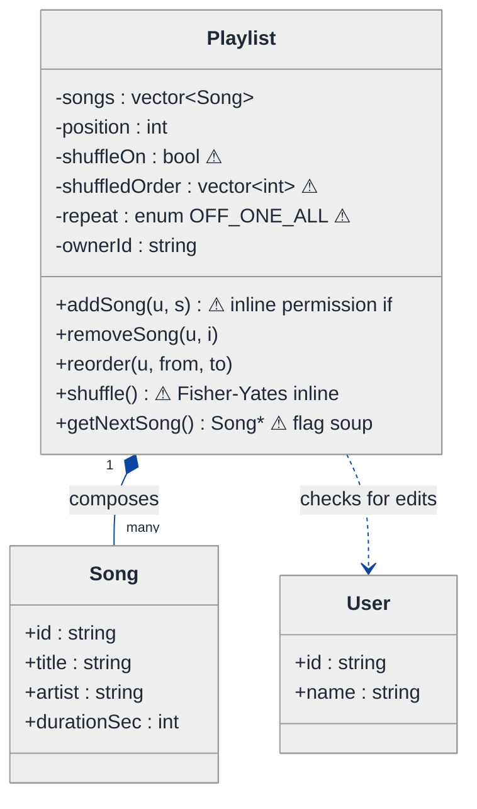
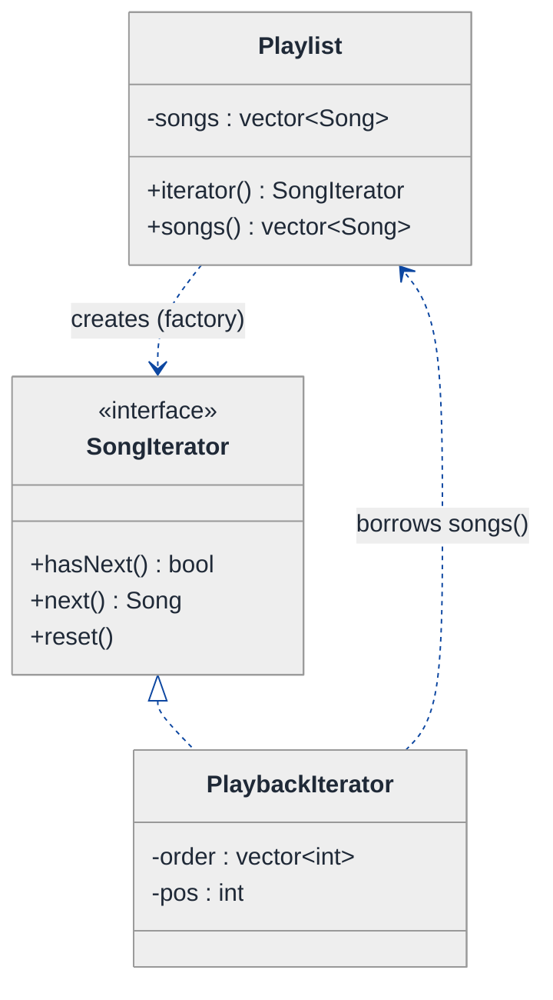
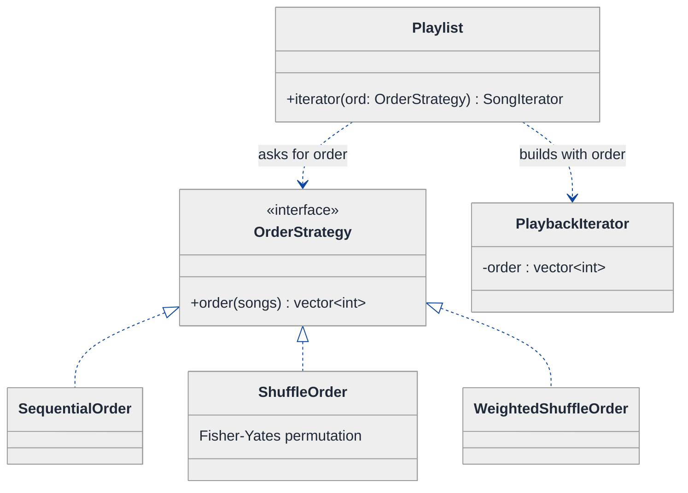
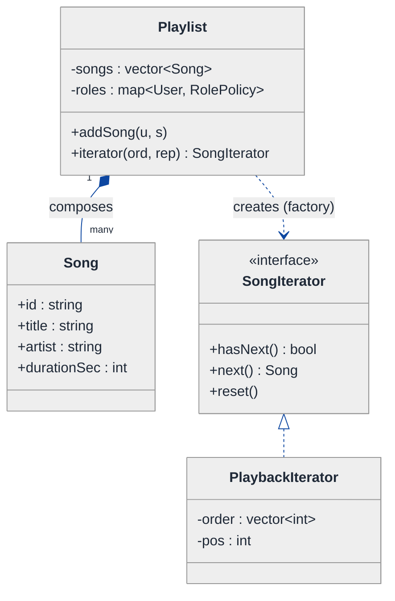
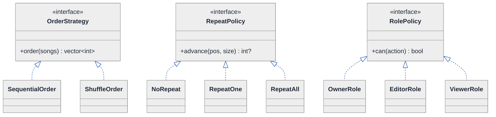
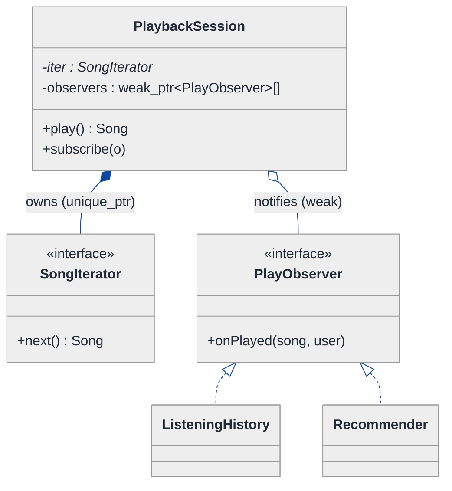
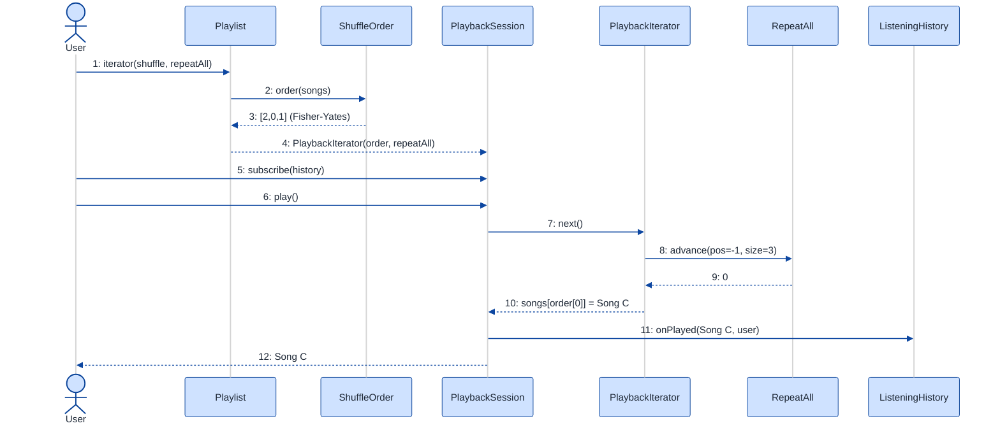

# Music Streaming Playlist Manager — LLD Walkthrough

> **Difficulty:** Medium · **Time:** ~30 min · **Pattern focus:** Iterator (playback traversal) + Strategy (shuffle / ordering)
>
> **Problem source(s):** GID IT1, bucket `Iterator_Pattern`. Representative of multiple LeetLens rows in [`./EXTRACTED_QUESTIONS.md`](./EXTRACTED_QUESTIONS.md).
>
> **Diagrams:** inline mermaid (renders natively in GitHub / VS Code). Theme block copied verbatim from the repo's canonical convention.

---

## How to use this file

Paced for a candidate seeing "playlist manager" for the first time. Reading time: ~30 minutes if you sketch each iteration by hand. **The lesson: the moment you hear "next song" plus "shuffle" plus "repeat," the brittle instinct is one fat `next()` method with flags. DERIVE the clean design instead — build the naive flag-driven version, watch it rot under four hypothetical changes, then reach for ONE pattern per painful axis: Iterator for "how do we walk the songs," Strategy for "in what order."**

**Map of this file (15 sections):**

1. Problem statement + clarifying questions
2. Plain-English restatement
3. Why this matters
4. Mental model
5. Try it yourself first
6. Entity & verb extraction
7. **Iteration 1: the naive design** — what we'd write first
8. **Where the naive design hurts** — four future requirements, one painful diff each
9. **Pivot 1: Iterator for playback traversal** — the most painful axis first
10. **Pivot 2: Strategy for ordering (shuffle / Fisher-Yates)** — order is an algorithm
11. **Pivot 3: repeat modes + collaborative edits + history** — remaining variability
12. Final UML class diagram
13. Skeleton code (C++)
14. Key flow — sequence diagram
15. Extensibility re-check + anti-patterns + how to think aloud + self-check

---

## 1. Problem statement + clarifying questions

**Prompt (typical phrasing):** "Design a music streaming playlist manager. Users create playlists, add/remove/reorder songs, play through them with shuffle and repeat modes, collaborate on shared playlists, and the system tracks listening history."

**Clarifying questions to ask BEFORE drawing anything:**

1. **Repeat modes?** Just off / repeat-one / repeat-all, or also smart "repeat the unfinished tail"? Does shuffle interact with repeat (shuffle-all-then-repeat vs reshuffle each loop)?
2. **Shuffle semantics?** A true random permutation (Fisher-Yates, no repeats until exhausted), or naive "random next each time" (can repeat the same song)? The interviewer said Fisher-Yates, so it's the former.
3. **Collaborative playlists?** Who can add/remove/reorder — any collaborator, or roles (owner / editor / viewer)? Do edits during playback affect the currently-playing cursor?
4. **History tracking?** Per-user or per-playlist? Do we record skips and partial plays, or only completed plays? Is history a feed other features subscribe to (recommendations, "recently played")?
5. **Scale / persistence?** In-memory model for the interview, or do we need a repository boundary? How big can one playlist get (10 songs vs 10,000)?
6. **Concurrency?** Two collaborators editing the same playlist simultaneously — last-write-wins, or do we care about conflict resolution here?

**Assumptions if interviewer dodges:** in-memory model; repeat modes off/one/all; shuffle is Fisher-Yates with no repeats until the list is exhausted; collaborative playlists have owner/editor/viewer roles; history is a per-user event stream other features subscribe to; single-threaded for now (concurrency discussed in §15).

---

## 2. Plain-English restatement

We're building the engine behind a playlist screen. It must hold an ordered bag of songs, let users mutate that bag (add, remove, reorder) with permission checks for shared playlists, and — the heart of it — walk through the songs during playback. That walk has TWO independent knobs: the **order** we visit songs (sequential or a Fisher-Yates shuffle) and the **repeat behavior** at the end (stop, replay the current song, or loop the whole list). Separately, every play should emit an event so listening history and downstream features can react. The design must let us add a new order, a new repeat mode, a new collaborator role, or a new history consumer **without rewriting the playback loop**.

---

## 3. Why this matters

This question is a magnet for the single worst LLD habit: cramming traversal logic, ordering logic, and repeat logic into one `getNextSong()` method full of booleans and mode enums. The interviewer is specifically probing whether you know that "how to walk a collection" is a textbook responsibility with a textbook name — the **Iterator** — and that "in what order" is an **algorithm** (Strategy), not a flag. Get those two separations right and collaborative edits, history, and new repeat modes fall out cheaply. Miss them and every feature is surgery on `getNextSong()`.

---

## 4. Mental model

A playlist is a **collection** plus a **playhead that moves through it**. The collection is just storage. The interesting object is the *cursor*: a thing that answers "what's the next song?" — and that answer depends on an ORDER (the permutation it walks) and an END-RULE (what happens after the last song).

```
Real-world sketch (NOT a UML diagram yet):

   Playlist "Roadtrip"  (storage — an ordered bag)
   ┌────────────────────────────────────────────┐
   │  [0] Song A   [1] Song B   [2] Song C  ...  │
   └────────────────────────────────────────────┘
                       ▲
                       │  asks "what's next?"
              ┌────────┴─────────┐
              │  Playback cursor │   knobs:
              │  position = 1    │   • ORDER: sequential | shuffled[2,0,1]
              └──────────────────┘   • END-RULE: off | repeat-one | repeat-all

   Every time the cursor advances → emits a "played(song)" event
                       │
                       ▼
              [History]  [Recommender]  [Recently-played]   (listeners)
```

The KEY insight from this picture: **storage, cursor, order, end-rule, and the event fan-out are five separate concerns.** The naive design fuses all five into the playlist class. We're going to pull them apart one at a time.

---

## 5. Try it yourself first

> **Predict before reading on:**
>
> 1. List 4 nouns you'd promote to a class. Which "noun" (hint: it's a verb in disguise) deserves to be its own object even though the prompt never names it?
> 2. **If I told you shuffle must be Fisher-Yates AND we'll later add "shuffle weighted by play count," what would change about how you write `getNextSong()`?**
> 3. Where does the "record this play in history" line of code go, and how many places call it?

---

## 6. Entity & verb extraction

> **Mini-refresher: noun → class, but not every noun.**
>
> Naive OOD promotes every noun to a class. Senior OOD promotes a noun only if it has BEHAVIOR and STATE that need to live together. "Title" stays a field on Song; "the act of walking the songs" becomes a class (the iterator) even though the prompt phrases it as a verb.

**Nouns from the prompt:**

| Noun | Decision | Why |
|---|---|---|
| Playlist | Class (storage + mutation API) | Owns songs, enforces edit permissions |
| Song | Class (mostly data) | Title, artist, duration; identity matters for history |
| User | Class | Owns playlists, is the subject of history |
| Collaborator role | Strategy/policy on Playlist | owner/editor/viewer — varies, so not an enum buried in `if` |
| "Playback" / "the next song" | **Class (the iterator)** | Verb-in-disguise: walking the songs is a responsibility with state (position) |
| Shuffle / ordering | Strategy | An algorithm (Fisher-Yates); swappable |
| Repeat mode | Policy on the iterator | off / one / all — varies the end-rule |
| Listening history | Class + observer fan-out | Records play events; other features subscribe |
| Duration / artist | Fields on Song | No behavior of their own |

**Verbs (and the class they live on — naive answer, re-examined later):**

| Verb | Owner class (naive — we'll re-examine) |
|---|---|
| addSong / removeSong / reorder | Playlist |
| canEdit(user) | Playlist (inline `if` in naive) |
| getNextSong() | Playlist (naive) → **PlaybackIterator** (final) |
| shuffle() | Playlist (naive) → **OrderStrategy** (final) |
| recordPlay(song, user) | Playlist (naive) → **History** via observer (final) |

**We have NOT introduced any design patterns yet.** Pure nouns + verbs.

---

## 7. <a id="iter-1"></a>Iteration 1: the naive design

The simplest thing that could possibly work: one `Playlist` class that stores songs, mutates them, and plays them via a `getNextSong()` driven by flags.



**Reader's tour (read top to bottom; ~60 seconds).**

1. **`Playlist` is doing everything.** It stores songs, tracks the play `position`, holds a `shuffleOn` bool plus a `shuffledOrder` index map, holds a `repeat` enum, and knows the `ownerId`. Five responsibilities in one box.

2. **The composition spine.** The filled diamond (`◆`) marks composition — Playlist owns its `Song[]`; if the playlist dies, the song entries die with it. That part is fine.

3. **The four warning markers (⚠) are the trouble.**
   - `shuffleOn` + `shuffledOrder`: a flag and a parallel index array. `getNextSong()` has to branch on the flag and translate through the index array.
   - `repeat`: an enum that `getNextSong()` switches on at the end-of-list boundary.
   - `addSong` does an inline `if (user.id != ownerId) throw` permission check.
   - `shuffle()` runs Fisher-Yates in place and flips the flag.

4. **`getNextSong()` is where it all collides.** It must consult `shuffleOn` to pick storage-order vs shuffled-order, advance `position`, then consult `repeat` to decide what happens past the last index. That's two orthogonal axes braided into one method.

**What's deliberately missing.** No iterator (the "walk" is inlined into the playlist). No order strategy (shuffle is a bool + a method). No repeat policy object (it's an enum + a switch). No history fan-out (we haven't even recorded plays yet). The naive design doesn't *acknowledge* these as axes — it bakes one answer for each into `getNextSong()`.

Skeleton code for the naive design (C++):

```cpp
#include <algorithm>
#include <optional>
#include <random>
#include <stdexcept>
#include <string>
#include <vector>

enum class RepeatMode { OFF, ONE, ALL };

struct Song {
    std::string id, title, artist;
    int durationSec = 0;
};
struct User { std::string id, name; };

class Playlist {
public:
    Playlist(std::string ownerId) : ownerId_(std::move(ownerId)) {}

    void addSong(const User& u, Song s) {
        if (u.id != ownerId_) throw std::runtime_error("not allowed");  // inline permission
        songs_.push_back(std::move(s));
    }
    void setRepeat(RepeatMode m) { repeat_ = m; }

    void shuffle() {                                  // Fisher-Yates, inline
        order_.resize(songs_.size());
        for (size_t i = 0; i < order_.size(); ++i) order_[i] = static_cast<int>(i);
        std::mt19937 rng{std::random_device{}()};
        for (int i = static_cast<int>(order_.size()) - 1; i > 0; --i)
            std::swap(order_[i], order_[std::uniform_int_distribution<int>(0, i)(rng)]);
        shuffleOn_ = true;
        position_  = 0;
    }

    Song* getNextSong() {                             // FLAG SOUP — this is the smell
        if (songs_.empty()) return nullptr;
        if (repeat_ == RepeatMode::ONE) {             // repeat-one: stay put
            return &resolve(position_);
        }
        ++position_;
        if (position_ >= static_cast<int>(songs_.size())) {
            if (repeat_ == RepeatMode::ALL) position_ = 0;   // loop
            else { position_ = static_cast<int>(songs_.size()); return nullptr; }  // stop
        }
        // (and we forgot to record the play in history — there's nowhere clean to put it)
        return &resolve(position_);
    }
private:
    Song& resolve(int pos) {                          // translate through shuffle map
        return shuffleOn_ ? songs_[order_[pos]] : songs_[pos];
    }
    std::vector<Song> songs_;
    std::vector<int>  order_;
    bool        shuffleOn_ = false;
    int         position_  = -1;
    RepeatMode  repeat_    = RepeatMode::OFF;
    std::string ownerId_;
};
```

**This works.** It has zero design patterns. We can add songs, shuffle, and play through with repeat. So what's wrong with it?

---

## 8. <a id="naive-pain"></a>Where the naive design hurts

The interviewer slides four next-quarter requirements across the desk: "Walk me through what changes."

### Change A: "Add 'smart shuffle' — weight the random order by play count, and later 'genre-clustered order'"

In the naive design:
- `shuffle()` hardcodes plain Fisher-Yates. A weighted variant means an `if (mode == SMART)` inside `shuffle()`, plus a new field for the weighting source.
- A third order (genre-clustered) adds another branch. **Every new order = surgery in `shuffle()` AND a new flag `getNextSong()` must understand.**

### Change B: "Add 'repeat the unplayed tail' and make repeat-all reshuffle each loop"

In the naive design:
- The end-of-list logic lives inside `getNextSong()` as a `repeat_ == ALL` check. A new mode means a new enum value AND a new branch at the boundary.
- "Reshuffle each loop" means `getNextSong()` now has to call back into `shuffle()` conditionally — **repeat logic and order logic, already tangled, now call each other.**

### Change C: "Collaborative playlists — owner / editor / viewer roles, editors can add/reorder but not delete"

In the naive design:
- The `if (u.id != ownerId_)` check is duplicated across `addSong`, `removeSong`, `reorder`.
- Roles with different rules mean each of those methods grows a role switch. **Permission logic scattered across three methods, with no single place that defines "what can an editor do."**

### Change D: "Listening history + a recommender that reacts to each completed play"

In the naive design:
- There is *no clean seam* to record a play. You'd jam `history_.push_back(song)` into `getNextSong()`.
- The recommender also needs each play → another line in `getNextSong()`. **Every new consumer is another hardcoded call inside the playback loop**, and `getNextSong()` now depends on History and Recommender directly.

### The pattern of pain

| Change | Methods/fields touched | Smell |
|---|---|---|
| A. New shuffle orders | `shuffle()` + `getNextSong()` flags | "Ordering algorithm is a bool + a method, not a swappable thing." |
| B. New repeat modes | `getNextSong()` boundary branch | "End-rule is an enum switch braided into traversal." |
| C. Collaborator roles | `addSong` + `removeSong` + `reorder` | "Permission logic duplicated; no single role authority." |
| D. History + recommender | `getNextSong()` grows dependencies | "Playback loop hardcodes every downstream consumer." |

**Three axes of pain dominate:** (1) *how we walk the songs* is fused with *what order* and *what end-rule* — that's the traversal axis; (2) *the order itself* is an algorithm that varies; (3) *who reacts to a play* is hardcoded.

> **Pivot question:** "What pattern OWNS 'walking a collection' so the playlist stops doing it? What pattern handles 'the order is an algorithm picked by the caller'? And what pattern lets new consumers react to plays without editing the loop?"
>
> The answers are Iterator, Strategy, and Observer. Start with the most painful: nobody owns the walk. That's the Iterator.

---

## 9. <a id="pivot-1"></a>Pivot 1: Iterator for playback traversal

> **Mini-refresher: Iterator pattern.**
>
> Encapsulates "walking a collection" behind a tiny interface — typically `hasNext()` / `next()` — so the CALLER traverses without knowing the collection's internal storage. The collection (the *aggregate*) exposes a factory method that hands back a fresh iterator. State of the walk (position) lives on the iterator, NOT on the collection.
>
> Quick example: `for (auto it = list.begin(); it != list.end(); ++it)` — `begin()`/`end()` are the C++ STL spelling of "give me an iterator." The loop never touches the list's nodes directly.

**Why Iterator fits.** "Get the next song" is the definition of traversal. In the naive design the playlist both *stores* songs and *tracks where playback is* — two responsibilities. Pull the walk into its own object: a `PlaybackIterator` that holds the `position` and answers `hasNext()` / `next()`. The `Playlist` goes back to being pure storage and hands out iterators.

Crucially, **the iterator is also where shuffle-order and repeat-end-rule belong** — they're both *properties of how this particular walk behaves*, not of the storage. That's why pulling out the iterator first unblocks Pivots 2 and 3.

**The refactor (just the affected slice):**

```cpp
class Song;  // forward

// The Iterator interface — the contract the player codes against.
class SongIterator {
public:
    virtual ~SongIterator() = default;
    virtual bool         hasNext() const = 0;
    virtual const Song&  next()          = 0;   // advances the cursor
    virtual void         reset()         = 0;
};

// One concrete iterator. It walks an EXTERNALLY-SUPPLIED order (vector of indices),
// so sequential vs shuffled is just a different order vector handed in (see Pivot 2).
class PlaybackIterator : public SongIterator {
public:
    PlaybackIterator(const std::vector<Song>& songs, std::vector<int> order)
        : songs_(songs), order_(std::move(order)) {}

    bool hasNext() const override { return pos_ + 1 < static_cast<int>(order_.size()); }
    const Song& next() override {
        if (!hasNext()) throw std::out_of_range("end of playlist");
        return songs_[order_[++pos_]];
    }
    void reset() override { pos_ = -1; }
private:
    const std::vector<Song>& songs_;   // borrows storage; does NOT own it
    std::vector<int>         order_;
    int                      pos_ = -1;
};

// Playlist is now pure storage + an iterator factory.
class Playlist {
public:
    std::unique_ptr<SongIterator> iterator() const {
        std::vector<int> seq(songs_.size());
        std::iota(seq.begin(), seq.end(), 0);
        return std::make_unique<PlaybackIterator>(songs_, std::move(seq));
    }
    const std::vector<Song>& songs() const { return songs_; }
private:
    std::vector<Song> songs_;
};
```

**What changed — visualized.** Just the traversal slice:



**Tour of the after-state.**

1. **Top: Playlist shrank.** No more `position`, no `shuffleOn`, no `repeat` on the storage class. Its job is now storage + a single factory method `iterator()`.

2. **Middle: the `<<interface>>` SongIterator.** Three methods: `hasNext`, `next`, `reset`. The player loops against THIS, never against the playlist's internal vector.

3. **Bottom: PlaybackIterator** holds the walk state — `pos` and the `order` it's walking. The dotted arrow back to Playlist means it *borrows* the song storage (a `const&`); it does not own it. **Walk state moved off the collection.**

4. **The unlock.** Because the iterator walks an `order` vector handed to it, "sequential" is just `[0,1,2,...]` and "shuffled" is a permutation — same iterator class, different order. That's exactly the seam Pivot 2 plugs into.

**Pattern-discrimination cheatsheet — Iterator vs a public index getter.**
- *Iterator:* the walk is an object with its own state; multiple independent walks of the same playlist can coexist (queue preview + currently playing).
- *Exposing `getSongAt(i)` + a position int on the collection:* one shared cursor; two callers walking at once clobber each other; storage and traversal stay fused.
- *Rule of thumb:* if you need more than one simultaneous traversal, or want to vary HOW you traverse, you need an Iterator, not an index getter.

---

## 10. <a id="pivot-2"></a>Pivot 2: Strategy for ordering (shuffle / Fisher-Yates)

Change A from §8 is still painful — new orders meant surgery in `shuffle()`. The iterator walks *an* order, but who DECIDES the order? Right now `Playlist::iterator()` hardcodes the sequential `[0,1,2,...]`. The order is an algorithm, and it varies (sequential, Fisher-Yates shuffle, weighted, genre-clustered). That's textbook Strategy.

> **Mini-refresher: Strategy pattern.**
>
> Encapsulates an algorithm behind an interface so it can be swapped at runtime. The CALLER picks which strategy to use; the strategy doesn't know about its peers. Here the algorithm is "given N songs, produce the order (a permutation of indices) to walk them in."

**Why Strategy (not subclassing the iterator).** We do NOT want `SequentialIterator`, `ShuffleIterator`, `WeightedShuffleIterator` — that explodes the iterator hierarchy and re-fuses "walk" with "order." Instead, the iterator stays ONE class that walks any order vector; an `OrderStrategy` produces that vector. Fisher-Yates becomes one concrete strategy.

**The refactor (just the ordering slice):**

```cpp
class OrderStrategy {
public:
    virtual ~OrderStrategy() = default;
    // Produce the visiting order (indices into songs) for this walk.
    virtual std::vector<int> order(const std::vector<Song>& songs) const = 0;
};

class SequentialOrder : public OrderStrategy {
public:
    std::vector<int> order(const std::vector<Song>& songs) const override {
        std::vector<int> idx(songs.size());
        std::iota(idx.begin(), idx.end(), 0);
        return idx;
    }
};

class ShuffleOrder : public OrderStrategy {          // Fisher-Yates, isolated here
public:
    std::vector<int> order(const std::vector<Song>& songs) const override {
        std::vector<int> idx(songs.size());
        std::iota(idx.begin(), idx.end(), 0);
        std::mt19937 rng{std::random_device{}()};
        for (int i = static_cast<int>(idx.size()) - 1; i > 0; --i)
            std::swap(idx[i], idx[std::uniform_int_distribution<int>(0, i)(rng)]);
        return idx;   // a true permutation: no repeats until exhausted
    }
};
// WeightedShuffleOrder, GenreClusteredOrder elided — each is one new class.

// Playlist's factory now takes the strategy.
std::unique_ptr<SongIterator> Playlist::iterator(const OrderStrategy& ord) const {
    return std::make_unique<PlaybackIterator>(songs_, ord.order(songs_));
}
```

**What changed — visualized.** Just the ordering slice:



**Tour of the after-state.**

1. **`OrderStrategy` interface, one method:** `order(songs) → vector<int>`. It returns the *permutation of indices* to walk. Nothing about traversal — just the order.

2. **`ShuffleOrder` is where Fisher-Yates lives, alone.** The algorithm the interviewer named is isolated in one class. It returns a true permutation, so playback visits every song exactly once before exhausting — that's the "no repeats until exhausted" semantic.

3. **`SequentialOrder`** is the trivial `[0,1,...,n-1]`. Toggling shuffle is now `iterator(shuffle)` vs `iterator(sequential)` — no boolean on the playlist.

4. **The iterator is untouched.** It still walks whatever order vector it's handed. **Order varies; traversal doesn't.** That clean separation is the payoff of doing Iterator first.

**Change A lands cleanly now:** weighted shuffle and genre-clustered order are each ONE new `OrderStrategy` subclass. No edit to `PlaybackIterator`, none to `Playlist`.

**Pattern-discrimination cheatsheet — Strategy vs State.**
- *Strategy:* the CALLER picks which order to use (`iterator(shuffle)`); the strategies don't transition between themselves.
- *State:* the OBJECT flips its own behavior via internal events (no caller decision).
- *Rule of thumb:* `playlist.iterator(shuffleOrder)` is the caller choosing → Strategy. If the playlist auto-switched order based on internal events, that'd be State. Ordering is caller-chosen, so Strategy.

---

## 11. <a id="pivot-3"></a>Pivot 3: repeat modes, collaborative edits, and history

Changes B, C, D remain. They follow shapes we've now seen — apply them quickly.

### 11.1 Repeat mode — a small Strategy on the iterator (end-rule)

The end-of-list behavior is an algorithm too: "given we just hit the end, what's the next position (or stop)?" That's a `RepeatPolicy` the iterator consults at the boundary. We keep it as a Strategy (caller picks off/one/all), so the iterator's `hasNext`/`next` stay branch-free of repeat logic.

```cpp
class RepeatPolicy {
public:
    virtual ~RepeatPolicy() = default;
    // Given current pos and size, return next pos, or nullopt to stop.
    virtual std::optional<int> advance(int pos, int size) const = 0;
};
class NoRepeat   : public RepeatPolicy {
    std::optional<int> advance(int pos, int size) const override {
        return (pos + 1 < size) ? std::optional<int>(pos + 1) : std::nullopt;
    }
};
class RepeatOne  : public RepeatPolicy {
    std::optional<int> advance(int pos, int /*size*/) const override { return pos; }
};
class RepeatAll  : public RepeatPolicy {
    std::optional<int> advance(int pos, int size) const override { return (pos + 1) % size; }
};
// PlaybackIterator now holds a const RepeatPolicy& and calls advance() in next().
```

"Repeat the unplayed tail" or "reshuffle each loop" (Change B) become new `RepeatPolicy` classes — and a reshuffling policy can hold a reference to the playlist + an OrderStrategy to rebuild the order at the loop boundary. One new class each.

### 11.2 Collaborative roles — Strategy for permissions

The duplicated `if (u.id != ownerId)` (Change C) becomes a single role authority. Each playlist maps users to roles; a `RolePolicy` answers `can(action)`.

```cpp
enum class Action { ADD, REMOVE, REORDER, VIEW };

class RolePolicy {
public:
    virtual ~RolePolicy() = default;
    virtual bool can(Action a) const = 0;
};
class OwnerRole  : public RolePolicy { bool can(Action) const override { return true; } };
class EditorRole : public RolePolicy {
    bool can(Action a) const override { return a != Action::REMOVE; }   // editors can't delete
};
class ViewerRole : public RolePolicy {
    bool can(Action a) const override { return a == Action::VIEW; }
};
// Playlist::addSong now: if (!roleOf(user).can(Action::ADD)) throw; — ONE check, defined per role.
```

Now "what can an editor do" lives in exactly one place (`EditorRole`), not scattered across three methods.

### 11.3 History — Observer fan-out on each play

Change D: every play should notify history, recommender, recently-played — without the playback loop knowing them. That's the Observer pattern.

> **Mini-refresher: Observer pattern.**
>
> A *subject* maintains a list of *observers* and notifies all of them when something happens, without knowing their concrete types. New listeners subscribe; the subject's notify loop never changes. Use `weak_ptr` for observer back-references if lifetimes are independent, to avoid keeping a dead listener alive.

```cpp
class PlayObserver {
public:
    virtual ~PlayObserver() = default;
    virtual void onPlayed(const Song& s, const User& u) = 0;
};
class ListeningHistory : public PlayObserver {
    void onPlayed(const Song& s, const User& u) override { /* append to u's feed */ }
};
class Recommender : public PlayObserver { /* update model — elided */ };

// A PlaybackSession is the subject: it owns the iterator + policies and notifies observers.
class PlaybackSession {
public:
    void subscribe(std::weak_ptr<PlayObserver> o) { observers_.push_back(std::move(o)); }
    const Song& play() {
        const Song& s = iter_->next();
        for (auto& w : observers_) if (auto o = w.lock()) o->onPlayed(s, user_);
        return s;
    }
private:
    std::unique_ptr<SongIterator>          iter_;
    std::vector<std::weak_ptr<PlayObserver>> observers_;
    User                                   user_;
};
```

Adding the recommender (Change D) is one new `PlayObserver` + one `subscribe()` call. The `play()` loop never changes.

> **Mini-refresher: why three Strategy roles + Observer don't share one interface.**
>
> Strategy and Observer are *roles*, not types. `OrderStrategy`, `RepeatPolicy`, `RolePolicy`, and `PlayObserver` have different inputs and outputs — don't unify them under a generic `Policy<T>`. That's premature genericism; keep the four small, intention-revealing interfaces.

**The lesson.** Once Iterator separated *walk* from *order*, every remaining axis became "pick the right small abstraction": Strategy for caller-chosen variation (order, repeat, role) and Observer for the fan-out. Pattern recognition makes the back half of the design cheap.

---

## 12. <a id="fig-class-diagram"></a>Final class diagram

One wall of boxes hides the structure, so here are **three focused sub-views**. Read them in order; the structural insight ties them together.

### 12.1 Storage + traversal — Playlist hands out Iterators



**Tour of 12.1.** Playlist composes its `Song[]` (filled diamond = owns). It is now pure storage + a role map + an iterator factory. The dotted arrow to `SongIterator` is the factory relationship — Playlist *creates* iterators but doesn't own their lifetime (the caller does). `PlaybackIterator` is the single concrete walk.

### 12.2 The policy injection — order + repeat + role



**Tour of 12.2.** Three independent Strategy hierarchies, one per variability axis. `OrderStrategy` (with Fisher-Yates `ShuffleOrder`) decides the permutation; `RepeatPolicy` decides the end-rule; `RolePolicy` decides who-can-do-what. None shares an interface with the others — each is a distinct *role*. New variants in any column are additive: one new leaf class, zero edits to siblings or to the iterator.

### 12.3 Playback + history — Iterator driven by the session, Observer fan-out



**Tour of 12.3.** `PlaybackSession` is the runtime object the player holds. It OWNS the iterator (filled diamond / `unique_ptr`) and keeps a list of `PlayObserver` back-references (open diamond / `weak_ptr` — it notifies but doesn't own listeners). On each `play()` it pulls `next()` from the iterator and fans the event out. `ListeningHistory` and `Recommender` are interchangeable observers.

### Structural insight (ties 12.1 + 12.2 + 12.3 together)

| Concern | Pattern used | Why |
|---|---|---|
| **Storage** (Playlist owns Song[]) | Plain composition | Songs have the playlist's lifetime; no variation |
| **Traversal** (walk the songs) | **Iterator**, created by Playlist | Walk state belongs on a cursor, not the collection; multiple walks coexist |
| **Order** (sequential / Fisher-Yates / weighted) | **Strategy**, supplied to the iterator | Order is a caller-chosen algorithm |
| **Repeat end-rule** (off / one / all) | **Strategy** on the iterator | End-rule is a caller-chosen algorithm |
| **Permissions** (owner / editor / viewer) | **Strategy** (RolePolicy) per user | Role rules vary; one authority per role |
| **History fan-out** (history, recommender) | **Observer** on PlaybackSession | New consumers subscribe; the play loop never changes |

The big lesson: **the Iterator is the keystone.** Separating "walk" from "storage" is what let order and repeat become independent Strategies instead of flags in one method — *traverse once, vary the order and the end-rule freely.*

---

## 13. Skeleton code (C++)

> Show the SHAPES, not the full impl. ~130 lines.

```cpp
#include <algorithm>
#include <memory>
#include <numeric>
#include <optional>
#include <random>
#include <stdexcept>
#include <string>
#include <unordered_map>
#include <vector>

// ── Domain data ─────────────────────────────────────────────────────
struct Song { std::string id, title, artist; int durationSec = 0; };
struct User { std::string id, name; };
enum class Action { ADD, REMOVE, REORDER, VIEW };

// ── Iterator (the traversal abstraction) ───────────────────────────
class SongIterator {
public:
    virtual ~SongIterator() = default;
    virtual bool        hasNext() const = 0;
    virtual const Song& next()          = 0;
    virtual void        reset()         = 0;
};

// ── Strategy: ordering ──────────────────────────────────────────────
class OrderStrategy {
public:
    virtual ~OrderStrategy() = default;
    virtual std::vector<int> order(const std::vector<Song>& songs) const = 0;
};
class SequentialOrder : public OrderStrategy {
public:
    std::vector<int> order(const std::vector<Song>& s) const override {
        std::vector<int> i(s.size()); std::iota(i.begin(), i.end(), 0); return i;
    }
};
class ShuffleOrder : public OrderStrategy {            // Fisher-Yates
public:
    std::vector<int> order(const std::vector<Song>& s) const override {
        std::vector<int> i(s.size()); std::iota(i.begin(), i.end(), 0);
        std::mt19937 rng{std::random_device{}()};
        for (int k = static_cast<int>(i.size()) - 1; k > 0; --k)
            std::swap(i[k], i[std::uniform_int_distribution<int>(0, k)(rng)]);
        return i;
    }
};
// WeightedShuffleOrder, GenreClusteredOrder elided

// ── Strategy: repeat end-rule ───────────────────────────────────────
class RepeatPolicy {
public:
    virtual ~RepeatPolicy() = default;
    virtual std::optional<int> advance(int pos, int size) const = 0;
};
class NoRepeat  : public RepeatPolicy {
    std::optional<int> advance(int p, int n) const override { return p + 1 < n ? std::optional<int>(p + 1) : std::nullopt; }
};
class RepeatOne : public RepeatPolicy {
    std::optional<int> advance(int p, int)   const override { return p; }
};
class RepeatAll : public RepeatPolicy {
    std::optional<int> advance(int p, int n) const override { return (p + 1) % n; }
};

// ── Concrete iterator: walks an order, defers end-rule to RepeatPolicy ──
class PlaybackIterator : public SongIterator {
public:
    PlaybackIterator(const std::vector<Song>& songs, std::vector<int> order, const RepeatPolicy& rep)
        : songs_(songs), order_(std::move(order)), rep_(rep) {}
    bool hasNext() const override {
        return rep_.advance(pos_, static_cast<int>(order_.size())).has_value();
    }
    const Song& next() override {
        auto nxt = rep_.advance(pos_, static_cast<int>(order_.size()));
        if (!nxt) throw std::out_of_range("end of playlist");
        pos_ = *nxt;
        return songs_[order_[pos_]];
    }
    void reset() override { pos_ = -1; }
private:
    const std::vector<Song>& songs_;   // borrowed
    std::vector<int>         order_;
    const RepeatPolicy&      rep_;
    int                      pos_ = -1;
};

// ── Strategy: collaborator roles ────────────────────────────────────
class RolePolicy {
public:
    virtual ~RolePolicy() = default;
    virtual bool can(Action a) const = 0;
};
class OwnerRole  : public RolePolicy { bool can(Action)   const override { return true; } };
class EditorRole : public RolePolicy { bool can(Action a) const override { return a != Action::REMOVE; } };
class ViewerRole : public RolePolicy { bool can(Action a) const override { return a == Action::VIEW; } };

// ── Observer: listening history fan-out ─────────────────────────────
class PlayObserver {
public:
    virtual ~PlayObserver() = default;
    virtual void onPlayed(const Song& s, const User& u) = 0;
};
class ListeningHistory : public PlayObserver {
public:
    void onPlayed(const Song& s, const User& u) override { feed_[u.id].push_back(s.id); }
private:
    std::unordered_map<std::string, std::vector<std::string>> feed_;
};
// Recommender : public PlayObserver { ... } elided

// ── Aggregate: Playlist = storage + roles + iterator factory ────────
class Playlist {
public:
    explicit Playlist(std::string ownerId) {
        roles_[ownerId] = std::make_unique<OwnerRole>();
    }
    void addSong(const User& u, Song s) {
        require(u, Action::ADD);
        songs_.push_back(std::move(s));
    }
    void grant(const std::string& userId, std::unique_ptr<RolePolicy> role) {
        roles_[userId] = std::move(role);
    }
    std::unique_ptr<SongIterator> iterator(const OrderStrategy& ord, const RepeatPolicy& rep) const {
        return std::make_unique<PlaybackIterator>(songs_, ord.order(songs_), rep);
    }
    const std::vector<Song>& songs() const { return songs_; }
private:
    void require(const User& u, Action a) const {
        auto it = roles_.find(u.id);
        if (it == roles_.end() || !it->second->can(a)) throw std::runtime_error("not allowed");
    }
    std::vector<Song>                                          songs_;
    std::unordered_map<std::string, std::unique_ptr<RolePolicy>> roles_;
};

// ── Runtime: PlaybackSession = subject that owns iterator + notifies ──
class PlaybackSession {
public:
    PlaybackSession(std::unique_ptr<SongIterator> it, User u)
        : iter_(std::move(it)), user_(std::move(u)) {}
    void subscribe(std::weak_ptr<PlayObserver> o) { observers_.push_back(std::move(o)); }
    bool hasNext() const { return iter_->hasNext(); }
    const Song& play() {
        const Song& s = iter_->next();
        for (auto& w : observers_) if (auto o = w.lock()) o->onPlayed(s, user_);
        return s;
    }
private:
    std::unique_ptr<SongIterator>            iter_;
    std::vector<std::weak_ptr<PlayObserver>> observers_;
    User                                     user_;
};
```

---

## 14. <a id="fig-sequence"></a>Key flow — sequence diagram

This is the moment of truth — read across the swimlanes to see how Iterator, Strategy, and Observer COOPERATE in one `play()` call.



**Tour of the flow. Read slowly — all three patterns appear.**

1. **User asks the Playlist for an iterator, passing the order strategy and repeat policy.** This is the Strategy choice happening at the call site: `iterator(shuffle, repeatAll)`. The caller decides; the playlist doesn't store a "shuffle on" flag.

2. **Playlist asks the OrderStrategy for the order.** `ShuffleOrder` runs Fisher-Yates and returns a permutation `[2,0,1]`. **The Fisher-Yates algorithm is the only thing happening in step 2-3 — fully isolated in one class.**

3. **Playlist builds a PlaybackIterator with that order + the repeat policy and hands it back** (wrapped in a PlaybackSession). Note the iterator BORROWS the song storage; it doesn't copy songs.

4. **User subscribes the history observer to the session.** This is the Observer wiring — the session now knows to notify history, but the iterator and order strategy know nothing about history.

5. **`play()` pulls `next()` from the iterator.** The iterator asks its `RepeatPolicy` what the next position is (`advance(-1, 3) → 0`), then resolves `songs[order[0]]` = the song at shuffled index 0. **Iterator + repeat Strategy cooperate here; neither knows about shuffle vs sequential — they just see an order vector and an end-rule.**

6. **The session fans the play out to observers** (`onPlayed`) and returns the song. Adding a Recommender means one more `subscribe()` — step 11 simply loops once more.

### The validation that's NOT shown — and why it matters

You don't see `if (shuffleOn)` or `switch (repeatMode)` anywhere in this flow. That's the point: **the order and the end-rule are objects, not flags.** The iterator's `next()` is the same three lines whether you're playing sequentially with no repeat or shuffled on infinite loop. The variation lives in the strategy objects handed in at step 1 — *behavior selected by composition, not by branching.*

---

## 15. Extensibility re-check + anti-patterns + how to think aloud + self-check

### Extensibility re-check

Revisit the four changes from [§8](#naive-pain). For each, name the SINGLE class that changes.

| Change | Naive design impact | Final design impact |
|---|---|---|
| A. New shuffle orders (weighted, genre) | `shuffle()` + `getNextSong()` flags | New `OrderStrategy` subclass. Done. |
| B. New repeat modes (tail, reshuffle-loop) | `getNextSong()` boundary branch | New `RepeatPolicy` subclass. Done. |
| C. Collaborator roles | `addSong` + `removeSong` + `reorder` checks | New `RolePolicy` subclass + grant. Done. |
| D. History + recommender | `getNextSong()` grows dependencies | New `PlayObserver` + one `subscribe()`. Done. |

Every change is exactly ONE new class in the final design. That's the open/closed principle in practice.

> **Mini-refresher: Open/Closed Principle (the O in SOLID).**
>
> Software should be OPEN for extension but CLOSED for modification — you add behavior by adding new code (a new subclass), not by editing existing, tested code. The four "one new class" rows above are OCP made literal.

If a future requirement makes you change `Playlist`, `PlaybackIterator`, `OrderStrategy`, AND `RepeatPolicy` together — go back to §6 and re-identify variability points; you missed one.

### Common confusion + traps

1. **"Why not subclass the iterator — SequentialIterator, ShuffleIterator?"** That re-fuses "walk" with "order" and explodes when you cross order × repeat (you'd need ShuffleRepeatAllIterator...). Keep ONE iterator; vary the order and end-rule via injected strategies.

2. **"Can't shuffle just be a `bool` and a `random_shuffle` call?"** It can — until the second order (weighted) arrives and the bool becomes an enum and `getNextSong()` becomes a switch. The interviewer naming Fisher-Yates *specifically* is a hint they want the order isolated as a swappable algorithm.

3. **"Should the cursor live on Playlist?"** No. If it does, two simultaneous walks (the now-playing queue and a preview) clobber each other. The iterator owning its own `pos` is what makes concurrent traversals safe.

4. **"Why Observer for history and not just `history.record()` in `play()`?"** Because the second consumer (recommender) and third (recently-played) would each be another hardcoded call. Observer keeps the play loop closed to modification.

5. **"weak_ptr vs shared_ptr for observers?"** `weak_ptr` so the session doesn't keep a logged-out user's history object alive. The session checks `.lock()` and skips dead observers.

### Anti-patterns

- **"God Playlist"** — storage + cursor + order + repeat + permissions + history in one class. Split each into a collaborator (this whole walkthrough).
- **"Flag soup `getNextSong()`"** — booleans and mode enums braided into one method. Replace with Iterator + Strategy.
- **"Iterator subclass explosion"** — one iterator per (order × repeat) combination. Inject strategies instead.
- **"Permission checks copy-pasted"** — the same `if (user != owner)` in every mutator. One `RolePolicy` per role.
- **"Hardcoded fan-out"** — `history.add(); recommender.update();` inside the play loop. Use Observer.
- **"Naive random-next shuffle"** — `songs[rand() % n]` each call, which repeats songs. The spec wants Fisher-Yates: a true permutation, no repeats until exhausted.

### How to think aloud

> "Playlist manager. Let me clarify scope. [Asks the §1 questions — shuffle semantics, repeat modes, roles, history fan-out.] Fisher-Yates shuffle, three repeat modes, owner/editor/viewer, history as an event stream. Got it.
>
> Nouns: Playlist, Song, User. The verb 'get next song' is secretly an object — that's the iterator. Shuffle and repeat are knobs on the walk.
>
> Naive design first: one Playlist class with a `songs` vector, a `shuffleOn` bool, a `shuffledOrder` array, a `repeat` enum, and a `getNextSong()` that branches on all of them. It works, zero patterns.
>
> Stress-test: Change A — a second shuffle order means surgery in `shuffle()` and a new flag in `getNextSong()`. Change B — a new repeat mode is another branch at the end-of-list. Change C — role checks duplicated across three mutators. Change D — nowhere clean to record a play.
>
> Three axes: traversal is fused with order and repeat; the order is an algorithm; the fan-out is hardcoded.
>
> Pivot 1: Iterator. Pull the walk into a PlaybackIterator that holds `pos` and walks an order vector; Playlist becomes pure storage with an `iterator()` factory.
>
> Pivot 2: Strategy for order. OrderStrategy.order(songs) returns a permutation; ShuffleOrder is Fisher-Yates, alone. The iterator walks whatever order it's handed.
>
> Pivot 3: RepeatPolicy Strategy for the end-rule, RolePolicy Strategy for permissions, Observer (PlaybackSession notifies PlayObservers) for history.
>
> Final: Playlist composes Song[]; hands out iterators; the iterator takes an OrderStrategy and RepeatPolicy; PlaybackSession fans plays out to observers. All four future requirements land as ONE new class each. Open/closed."

### Self-check

> **Self-check — the question to ask next time.**
>
> When you see "play / traverse a collection with multiple orders and rules," before reaching for flags in one method, ask:
>
> > **"Who OWNS the walk (Iterator), and is the variation an ORDER/RULE the caller picks (Strategy) or a fan-out of an event (Observer)?"**
>
> Walk → Iterator. Caller-chosen order or end-rule → Strategy. New consumers reacting to an event → Observer. The class diagram falls out for free.

---

## Cross-references

- **Parent topic manifest:** [`./EXTRACTED_QUESTIONS.md`](./EXTRACTED_QUESTIONS.md)
- **Vertical overview:** [`../../LEARNING.md`](../../LEARNING.md)
- **Template:** [`../../TEMPLATE-v2.md`](../../TEMPLATE-v2.md)
- **Canonical exemplar:** [`../Object_Oriented_Design/Parking_Lot.md`](../Object_Oriented_Design/Parking_Lot.md)
- **Related v2 walkthroughs:**
  - Strategy Pattern deep-dive (in `../Strategy_Pattern/`)
  - Observer Pattern walkthroughs — [`../Observer_Pattern/Event_Driven_Framework.md`](../Observer_Pattern/Event_Driven_Framework.md), [`../Observer_Pattern/PubSub_Messaging_System.md`](../Observer_Pattern/PubSub_Messaging_System.md)
  - LRU Cache (iterator-adjacent intrusive structures) — [`../LLD_DataStructures/LRU_Cache.md`](../LLD_DataStructures/LRU_Cache.md)
- **Further reading:** <a href="https://refactoring.guru/design-patterns/iterator" target="_blank" rel="noopener noreferrer">Iterator pattern (Refactoring Guru)</a> · <a href="https://en.cppreference.com/w/cpp/iterator" target="_blank" rel="noopener noreferrer">C++ named iterator concepts (cppreference)</a>
