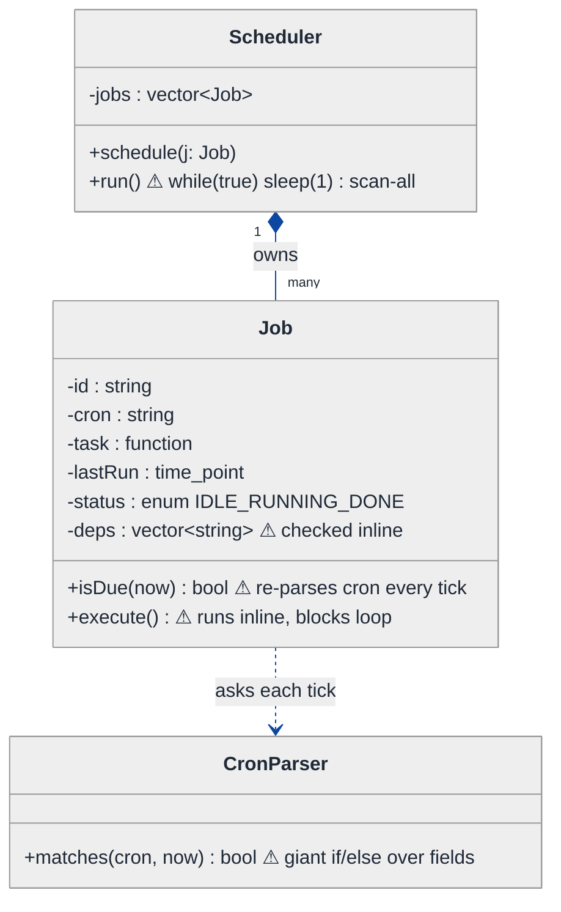
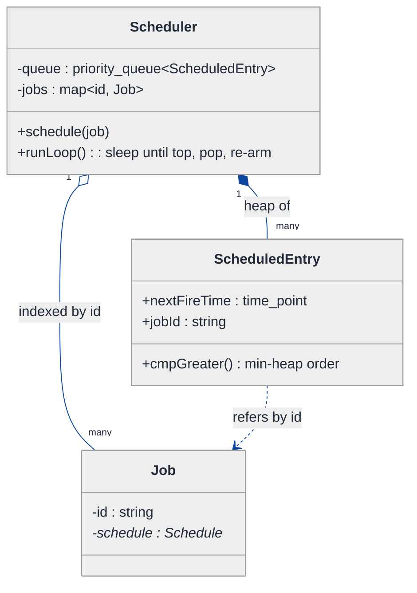
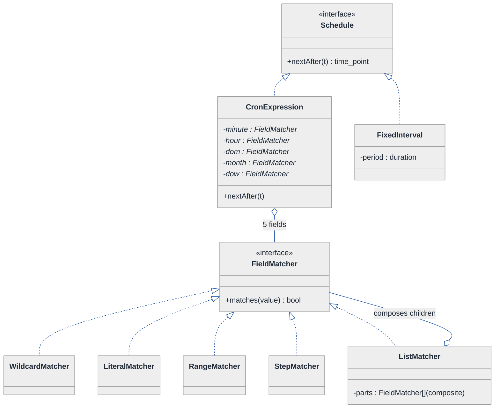
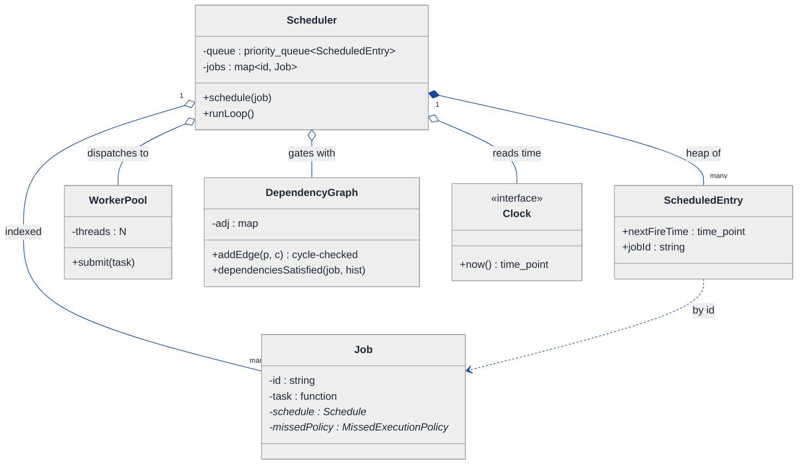
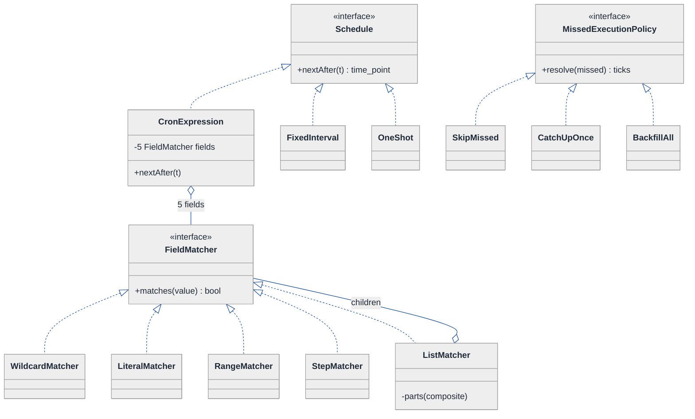
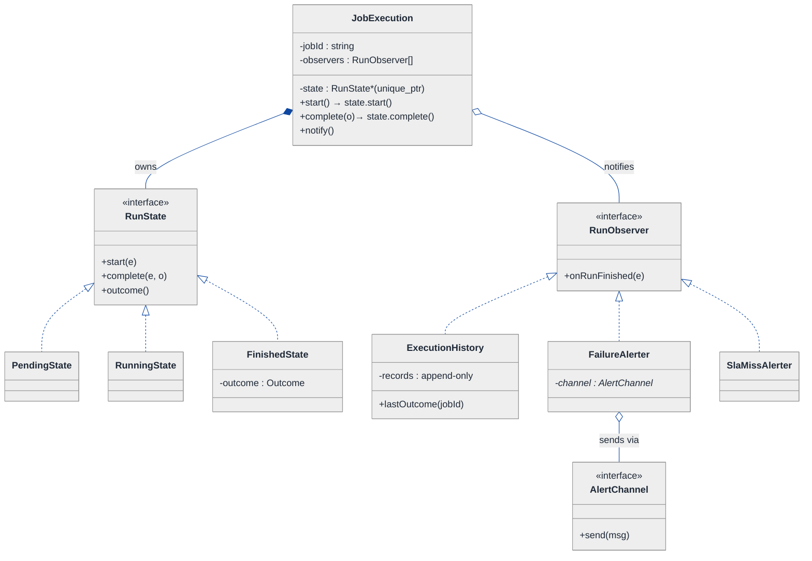
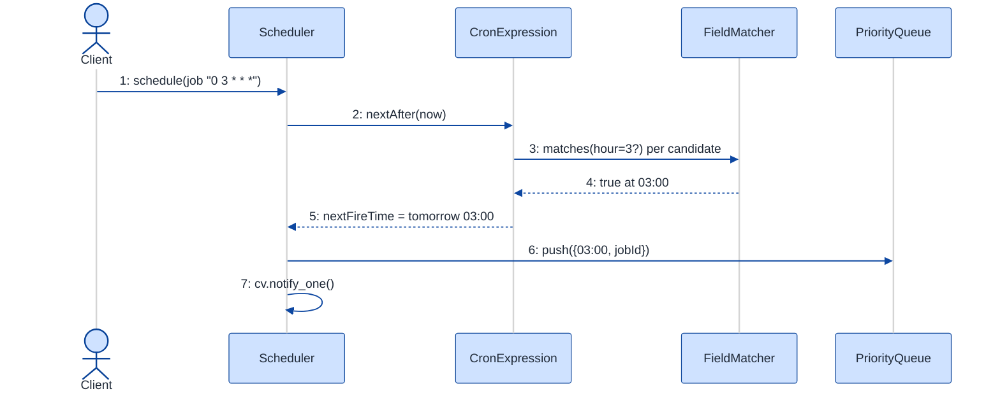
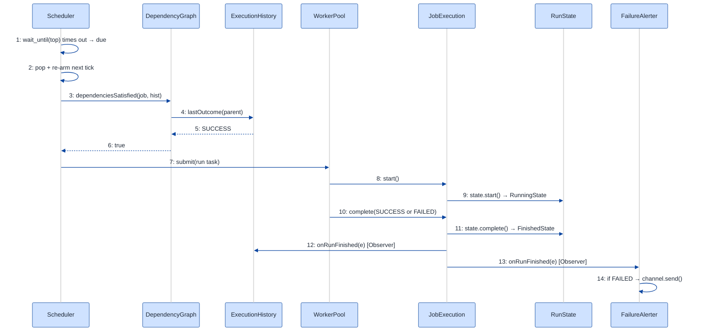

# Cron Job Scheduler — LLD Walkthrough

> **Difficulty:** Hard · **Time:** ~45 min · **Pattern focus:** Cron parser (Strategy for field matching) + Priority queue (next-fire scheduling) + DAG (dependency resolution) + State (run lifecycle) + Observer (alerting/history)
>
> **Problem source(s):** GID DS11, bucket `LLD_DataStructures`. Representative of the "design a scheduler / timer service" family of LLD interview rows.
>
> **Diagrams:** inline mermaid (renders natively in GitHub / VS Code). The canonical theme block is copied verbatim into every diagram per repo convention.

---

## How to use this file

Paced for a candidate seeing "design a cron scheduler" for the first time. Reading time: ~45 minutes if you sketch each iteration by hand. **The lesson: a scheduler looks like one problem, but it is FOUR independent axes of variation — when to fire (cron parse), what to fire next (priority queue), what is allowed to fire (DAG dependencies), and what happens around a fire (lifecycle, history, alerts). Don't draw the final design up front. Build the naive `sleep(1)` loop, watch it collapse under four realistic requirements, and reach for ONE pattern per axis.**

**Map of this file (15 sections):**

1. Problem statement + clarifying questions
2. Plain-English restatement
3. Why this matters
4. Mental model
5. Try it yourself first
6. Entity & verb extraction
7. **Iteration 1: the naive design** — the busy-wait scan loop
8. **Where the naive design hurts** — five future requirements, one painful diff each
9. **Pivot 1: a priority queue keyed on next-fire-time** — kill the O(N) scan
10. **Pivot 2: Strategy for cron-field matching + a Composite expression** — kill the parse `if` ladder
11. **Pivot 3: a DAG for dependencies + State for run lifecycle + Observer for history/alerts**
12. Final class diagram (3 sub-views)
13. Skeleton code (C++17)
14. Key flow — sequence diagram
15. Extensibility re-check + anti-patterns + how to think aloud + self-check

---

## 1. Problem statement + clarifying questions

**Prompt (typical phrasing):** "Design a cron job scheduler that parses cron expressions, schedules jobs at specified intervals, handles missed executions, supports job dependencies, and provides execution history and alerting."

**Clarifying questions to ask BEFORE drawing anything:**

1. **Cron dialect?** Classic 5-field (`min hour dom month dow`), or 6-field with seconds, or Quartz-style with `L`/`W`/`#`? Do we need `@hourly`/`@daily` macros and step (`*/5`) / range (`1-5`) / list (`1,3,5`) syntax?
2. **What does "handle missed executions" mean precisely?** If the process was down from 02:00 to 04:00 and a job was due at 03:00 — on restart do we (a) fire it once (catch-up), (b) fire it for every missed tick (backfill), or (c) skip and fire only the next future tick? Is this configurable per job?
3. **Dependency semantics?** "Job B runs after Job A" — does B run on B's own cron AND only if A succeeded most recently, or is B triggered purely by A's completion (no cron of its own)? Can dependencies form a cycle (they must not)?
4. **Concurrency model?** Single scheduler process with a worker pool, or distributed across nodes? If a job's previous run is still executing when its next tick arrives, do we skip, queue, or run concurrently (overlap policy)?
5. **Time semantics?** Wall-clock UTC, or per-job timezones? Do we worry about DST jumps (a 02:30 daily job on the spring-forward night)?
6. **History retention + alerting?** How long do we keep execution records? What triggers an alert — failure, timeout, SLA miss (didn't finish by X), or missed schedule? Where does an alert go (email, pager, webhook)?
7. **Persistence / durability?** In-memory only (lost on restart), or backed by a store so schedules and history survive a crash?
8. **At-least-once vs exactly-once firing?** Is a duplicate fire catastrophic, or merely wasteful?

**Assumptions if the interviewer dodges:** 5-field cron + step/range/list + `@daily`-style macros; missed-execution policy is **per-job configurable** (catch-up / backfill / skip); dependencies are a **DAG triggered by predecessor success, gated by the job's own cron**; single scheduler process with a bounded worker pool; UTC for now (timezone noted as an extension in §15); in-memory history with a pluggable sink; alerts fire on failure + SLA miss to a pluggable channel; at-least-once firing.

---

## 2. Plain-English restatement

We are building the engine that other systems hand a job and a schedule to ("run this backup every day at 03:00, but only after the snapshot job finished"). The engine must figure out *when* each job is next due from its cron string, *wake up* at exactly the right moment (not busy-spin), *check* that the job's upstream dependencies are satisfied before running it, *record* every run's outcome, and *shout* when something fails or misses its window. The design must let us add new cron syntax, new missed-execution policies, new dependency rules, and new alert channels **without rewriting the core scheduling loop**.

---

## 3. Why this matters

A scheduler is the canonical "deceptively simple" LLD prompt: every candidate can write a `while(true){ sleep(1); scan(); }` loop in two minutes, and that loop is wrong in five different ways. The interviewer is probing whether you can separate the FOUR orthogonal concerns hiding inside "cron scheduler" — temporal selection (parse), efficient next-event dispatch (priority queue / heap), ordering constraints (DAG / topological reasoning), and lifecycle/observability (State + Observer). This same decomposition reappears in event-loop libraries (libuv timers), CI systems (Jenkins/GitHub Actions), workflow engines (Airflow), and OS schedulers. Get the decomposition right here and you can design any of them.

---

## 4. Mental model

A cron scheduler is a **min-heap of alarm clocks** sitting next to a **dependency graph** and a **logbook**. The heap always tells you the single soonest thing to do, so you sleep until exactly then. When an alarm rings, you don't run the job blindly — you ask the graph "are this job's parents happy?" first. Whatever happens, you write a line in the logbook, and if that line says FAILED or LATE, a bell rings.

```
Real-world sketch (NOT a UML diagram yet):

   cron strings              min-heap by nextFireTime          dependency DAG
   "0 3 * * *"  ──parse──►  ┌───────────────────────┐         snapshot
   "*/5 * * * *"            │ 03:00 backup          │ ◄─top      │
   "0 0 1 * *"             │ 03:05 metrics         │            ▼
                            │ 04:00 cleanup         │          backup ──► report
                            └───────────┬───────────┘
                                        │ pop soonest
                                        ▼
                              [ run? check DAG parents ]
                                        │
                          ┌─────────────┴─────────────┐
                          ▼                            ▼
                     [ Worker pool ]              [ Logbook + Bell ]
                     execute job                  record outcome,
                     (success/fail/timeout)       alert on FAIL / LATE
```

The KEY insight from this picture: **the heap answers "when," the DAG answers "whether," the worker answers "how," and the logbook+bell answer "what then."** Four separable concerns. The naive design fuses all four into one loop; the final design gives each its own object.

---

## 5. Try it yourself first

> **Predict before reading on:**
>
> 1. List 6 nouns you'd promote to a class. Which 2 nouns are just fields (hint: a cron *field* like "minute")?
> 2. **If I told you the scheduler will manage 50,000 jobs, what is wrong with a loop that scans every job once per second to see if it's due?**
> 3. A job was due at 03:00 but the process was down until 04:00. Where in your design does the "did we miss it, and what do we do about it" decision live? Is it the same place for every job?

---

## 6. Entity & verb extraction

> **Mini-refresher: noun → class, but not every noun.**
>
> Naive OOD promotes every noun to a class. Senior OOD promotes a noun only if it has BEHAVIOR and STATE that belong together. A cron "minute field" is data with a tiny bit of behavior (does N match?) — it becomes a small matcher object, not a heavyweight class. "Execution history" becomes a class because it has query behavior + an append invariant.

**Nouns from the prompt:**

| Noun | Decision | Why |
|---|---|---|
| Scheduler | Class (top-level coordinator) | Owns the queue, runs the dispatch loop, orchestrates everything |
| Job | Class | Has an id, a schedule, a runnable task, a missed-policy, and dependency edges |
| CronExpression | Class | Parses a string once; answers `nextAfter(time)` |
| CronField (minute/hour/…) | Small matcher object (Strategy) | Pure behavior: "does value V match this field?" |
| Schedule | Interface | Cron is one kind; fixed-interval / one-shot are others |
| JobExecution / Run | Class | One firing: start, end, outcome, has lifecycle state |
| ExecutionHistory | Class | Append-only log + queries |
| DependencyGraph | Class | Holds edges; answers "are parents satisfied?" + cycle check |
| Alert / Alerter | Interface (Observer) | Reacts to run outcomes |
| MissedExecutionPolicy | Interface (Strategy) | catch-up / backfill / skip |
| WorkerPool | Class | Executes runnables off the dispatch thread |
| Clock | Interface | Abstracted time (testability) |
| `nextFireTime` | Field on the queue entry | Just a `time_point` |

**Verbs (and the class they live on — naive answer, we'll re-examine):**

| Verb | Owner class (naive) |
|---|---|
| schedule(job) | Scheduler |
| nextAfter(time) | CronExpression |
| matches(value) | CronField |
| isDue(now) | Job (naive) → the queue (final) |
| dependenciesSatisfied(job) | DependencyGraph |
| run() / execute() | WorkerPool, delegating to Job's task |
| record(run) | ExecutionHistory |
| onOutcome(run) | Alerter |
| handleMissed(job, now) | MissedExecutionPolicy |

**We have NOT introduced any design patterns yet.** Pure nouns + verbs.

---

## 7. <a id="iter-1"></a>Iteration 1: the naive design

The simplest thing that could possibly work: keep a list of jobs, loop once a second, and for each job ask "are you due now?" If yes, run it inline. Parse the cron string with a hand-rolled `if` ladder.



**Reader's tour (top to bottom; ~60 seconds).**

1. **`Scheduler` is the root.** It holds ONE field (`jobs`) and its `run()` is an infinite `sleep(1)` loop that scans *every* job *every* second. No heap, no "soonest event" notion. The ⚠ on `run()` flags the busy-wait scan.

2. **`Job` carries everything.** Cron string (re-parsed every tick), the task, `lastRun`, a `status` enum, and a raw list of dependency ids checked inline. Three warning markers: `isDue` re-parses the cron string on every tick (wasteful), `execute()` runs inline on the scheduler thread (one slow job stalls the whole loop), and `deps` is checked with ad-hoc inline logic.

3. **`CronParser` is a free function in disguise.** `matches(cron, now)` is a single giant `if/else` that splits the string and compares each field. Adding `*/5` or `1-5` syntax means surgery inside this one function.

4. **What's deliberately missing.** No priority queue (so dispatch is O(N) per second). No `Schedule` abstraction (cron is hardcoded). No DAG object (dependencies are a string list checked by hand). No run-lifecycle object (`status` is a flat enum). No history, no alerter, no missed-execution concept at all. The naive design doesn't even *acknowledge* these as axes — it bakes a hardcoded answer (or nothing) for each.

Skeleton code for the naive design (C++17):

```cpp
#include <chrono>
#include <functional>
#include <string>
#include <thread>
#include <vector>
#include <sstream>

using Clock = std::chrono::system_clock;

enum class JobStatus { IDLE, RUNNING, DONE };

struct Job {
    std::string                 id;
    std::string                 cron;       // e.g. "0 3 * * *"
    std::function<void()>       task;
    Clock::time_point           lastRun{};
    JobStatus                   status = JobStatus::IDLE;
    std::vector<std::string>    deps;       // ids that must have run

    // Re-parses the cron string EVERY tick. Hardcoded field handling.
    bool isDue(std::tm now) const {
        std::istringstream ss(cron);
        std::string min, hr, dom, mon, dow;
        ss >> min >> hr >> dom >> mon >> dow;
        auto fieldMatches = [](const std::string& f, int v) {
            if (f == "*") return true;
            return std::stoi(f) == v;          // no */5, no 1-5, no 1,3,5
        };
        return fieldMatches(min, now.tm_min)
            && fieldMatches(hr,  now.tm_hour)
            && fieldMatches(dom, now.tm_mday)
            && fieldMatches(mon, now.tm_mon + 1)
            && fieldMatches(dow, now.tm_wday);
    }
};

class Scheduler {
public:
    void schedule(Job j) { jobs_.push_back(std::move(j)); }

    [[noreturn]] void run() {
        while (true) {
            auto now = Clock::to_time_t(Clock::now());
            std::tm tm = *std::localtime(&now);
            for (auto& j : jobs_) {                       // O(N) scan EVERY second
                if (j.status == JobStatus::RUNNING) continue;
                if (!j.isDue(tm)) continue;
                // inline dependency check
                bool ready = true;
                for (auto& d : j.deps)
                    if (!ranRecently(d)) ready = false;
                if (!ready) continue;
                j.status = JobStatus::RUNNING;
                j.task();                                 // BLOCKS the loop
                j.lastRun = Clock::now();
                j.status = JobStatus::DONE;
            }
            std::this_thread::sleep_for(std::chrono::seconds(1));
        }
    }
private:
    bool ranRecently(const std::string& id) const { /* scan jobs_, compare lastRun */ return true; }
    std::vector<Job> jobs_;
};
```

**This works.** It has zero design patterns. It parses (badly), it fires (inefficiently), it even checks dependencies (sloppily). So what's wrong with it?

---

## 8. <a id="naive-pain"></a>Where the naive design hurts

The interviewer slides five requirements across the desk: "These are landing next quarter. Walk me through what changes."

### Change A: "We now manage 50,000 jobs"

In the naive design:
- `Scheduler::run()` scans all 50,000 jobs every second, calling `isDue()` (which re-parses a string) on each. That's 50,000 string parses per second to fire maybe one job.
- **The smell: O(N) work per tick regardless of how many jobs are actually due.** The loop does the most work when the fewest jobs fire.

### Change B: "Support `*/5`, `1-5`, `1,3,5`, and `@daily` cron syntax"

In the naive design:
- `Job::isDue`'s `fieldMatches` lambda only understands `*` and a literal int. Adding step/range/list means stuffing four new parsing branches into one lambda, for each of the five fields.
- `@daily` etc. need a pre-expansion step somewhere — there's no place for it.
- **The smell: every new syntax form is surgery inside one boolean-returning function. Classic tag-driven branching.**

### Change C: "Handle missed executions — and the policy differs per job"

In the naive design:
- There is no concept of "missed." The loop only ever looks at `now`. If the process was down at 03:00, the 03:00 job is simply never noticed.
- To add it you'd thread "what was the last time we checked?" into the loop AND branch per job: backup wants catch-up-once, metrics wants skip, billing wants backfill-every-tick.
- **The smell: a cross-cutting policy with no home. You'd sprinkle `if (job.policy == ...)` into `run()`.**

### Change D: "Job B must run only after Job A succeeds — and we must reject dependency cycles"

In the naive design:
- `deps` is a flat list and `ranRecently()` is a hand-wave. There's no notion of *success* vs *failure*, no topological ordering, and nothing prevents A→B→A.
- A cycle would deadlock the inline check or loop forever.
- **The smell: graph semantics modeled as a string list. No cycle detection, no "satisfied" definition.**

### Change E: "Record every run's outcome and alert on failure or SLA miss"

In the naive design:
- `status` is `IDLE/RUNNING/DONE` — it can't even express FAILED, TIMED_OUT, or SKIPPED.
- There is nowhere to record history, and `task()` is a `void()` that swallows exceptions silently.
- Alerting would mean wedging `try/catch` + `if (failed) sendEmail()` into the loop, hardcoding the channel.
- **The smell: a flat status enum can't model a lifecycle; observability is bolted onto the dispatch loop.**

### The pattern of pain

| Change | What's touched in the naive design | Smell |
|---|---|---|
| A. 50k jobs | `Scheduler::run()` scan loop | "O(N) per tick; no soonest-event structure." |
| B. Cron syntax | `Job::isDue` field lambda | "Every syntax form is surgery in one function." |
| C. Missed exec | `run()` + per-job branching | "Cross-cutting policy with no home." |
| D. Dependencies | `deps` list + `ranRecently` | "Graph semantics faked with a string list; no cycle check." |
| E. History + alerts | `status` enum + `run()` | "Flat enum can't model lifecycle; observability bolted onto dispatch." |

**The pains cluster onto four axes:** *dispatch efficiency* (A), *temporal-selection variability* (B), *ordering + missed-policy* (C, D), and *lifecycle + observability* (E).

> **Pivot question:** "What structure gives me the single soonest event in O(log N) (axis A)? What pattern handles 'a field-match rule that varies' and lets me COMPOSE rules (axis B)? What structure encodes ordering constraints and detects cycles (axis D)? What pattern models a lifecycle with state-specific behavior (axis E), and what pattern lets observers react to outcomes without the loop knowing them (alerts + history)?"
>
> The answers, in order: a **min-heap / priority queue**, the **Strategy + Composite** patterns, a **DAG** (with topological cycle detection), the **State** pattern, and the **Observer** pattern. Let's introduce them one axis at a time, starting with the most painful: dispatch efficiency.

---

## 9. <a id="pivot-1"></a>Pivot 1: a priority queue keyed on next-fire-time

**Why a priority queue fits dispatch.** The scheduler only ever cares about ONE thing at a time: the soonest job to fire. A structure that surfaces the minimum in O(1) and re-inserts in O(log N) is exactly a **min-heap**. We stop scanning all N jobs every second; instead we pop the soonest, sleep until *its* fire time, fire it, compute its *next* fire time, and push it back.

> **Mini-refresher: priority queue / binary min-heap.**
>
> A heap keeps a partially-ordered tree so the smallest element is always at the root: `top()` is O(1), `push()`/`pop()` are O(log N). In C++ it's `std::priority_queue` (a max-heap by default — supply a `Greater` comparator for a min-heap). Here the key is each job's `nextFireTime`.

The dispatch loop transforms from "scan everything every second" to "sleep until the top of the heap is due":

```cpp
#include <queue>
#include <condition_variable>

struct ScheduledEntry {
    Clock::time_point  nextFireTime;
    std::string        jobId;
    // min-heap: soonest fire time at the top
    bool operator>(const ScheduledEntry& o) const { return nextFireTime > o.nextFireTime; }
};

class Scheduler {
public:
    void schedule(std::shared_ptr<Job> job) {
        jobs_[job->id()] = job;
        auto next = job->schedule().nextAfter(clock_->now());   // Pivot 2 gives us this
        queue_.push({ next, job->id() });
        cv_.notify_one();
    }

    void runLoop() {
        std::unique_lock<std::mutex> lk(mu_);
        while (running_) {
            if (queue_.empty()) { cv_.wait(lk); continue; }
            auto top = queue_.top();
            // Sleep until the SOONEST event — not a fixed 1s tick.
            if (cv_.wait_until(lk, top.nextFireTime) != std::cv_status::timeout)
                continue;                         // woke early (new job inserted) → re-check top
            queue_.pop();
            auto job = jobs_.at(top.jobId);
            dispatch(job);                          // hand to worker pool (non-blocking)
            // Re-arm: compute the NEXT fire time and push back.
            auto next = job->schedule().nextAfter(clock_->now());
            queue_.push({ next, top.jobId });
        }
    }
private:
    void dispatch(std::shared_ptr<Job>);            // → WorkerPool (Pivot 3)
    std::priority_queue<ScheduledEntry,
        std::vector<ScheduledEntry>, std::greater<>> queue_;
    std::unordered_map<std::string, std::shared_ptr<Job>> jobs_;
    std::mutex mu_; std::condition_variable cv_; bool running_ = true;
    std::shared_ptr<Clock> clock_;
};
```

**What changed — visualized.** Just the dispatch slice:



**Tour of the after-state.**

1. **The heap replaces the scan.** `Scheduler` now owns a `priority_queue<ScheduledEntry>` ordered by `nextFireTime` (min-heap via `operator>`). `runLoop()` sleeps until the *top* entry is due — `cv_.wait_until(top.nextFireTime)` — so the CPU does nothing between events. 50,000 jobs no longer means 50,000 comparisons per second; it means one `top()` and a single timed wait.

2. **`ScheduledEntry` is a lightweight heap node**, not the whole job. It holds only the fire time + the job id. The fat `Job` lives once in a side map keyed by id (open diamond = aggregation; the heap refers to the job, it doesn't own it).

3. **Re-arming is the trick.** After firing, we ask the job's schedule for its *next* fire time and push a fresh entry. A job is therefore present in the heap exactly once at a time, representing its next occurrence.

4. **Early-wake handling.** Inserting a new job calls `cv_.notify_one()`; the loop wakes, sees a possibly-sooner top, and re-waits. This is why we re-check `top` after any non-timeout wake.

> **Pattern-discrimination cheatsheet — min-heap vs sorted list vs timing wheel.**
> - *Sorted list:* O(1) peek but O(N) insert — bad when jobs re-arm constantly.
> - *Min-heap (`priority_queue`):* O(1) peek, O(log N) insert/pop — the right default for "soonest event" dispatch.
> - *Hashed timing wheel:* O(1) amortized for many timers with coarse resolution — what you'd reach for at millions of timers (mention it as the scale-up answer, not the starting point).

We chose the heap because it's the simplest structure that makes dispatch sub-linear, and it composes cleanly with the re-arm step. Axis A is solved.

---

## 10. <a id="pivot-2"></a>Pivot 2: Strategy for cron-field matching + a Composite expression

Pivot 1 assumed `job->schedule().nextAfter(now)` exists. Building it correctly is axis B — and the naive `fieldMatches` lambda can't grow to handle `*/5`, `1-5`, `1,3,5`. The variability is *the matching rule for a single field*. That is an algorithm picked per-field, so it's **Strategy**; and because a field can be a *list of sub-rules* (`1,3,5`), the rules **compose** — that's **Composite**.

> **Mini-refresher: Strategy pattern.**
>
> Encapsulates an algorithm behind an interface so it can be swapped. The caller holds a pointer to the interface and doesn't know which concrete variant it has. Here: a `FieldMatcher` answers "does the integer V satisfy this cron field?" — `*`, a literal, a range, a step, or a list each implement it differently.

> **Mini-refresher: Composite pattern.**
>
> Lets you treat a group of objects the same way you treat a single one, by giving the group the SAME interface as the leaf. A `ListMatcher` IS a `FieldMatcher` that holds other `FieldMatcher`s and returns true if any child matches — so `1,3,5` and `*/5` and `7` are all just "a matcher" to the caller.

```cpp
// ── Strategy: one matcher per cron-field form ───────────────────────
class FieldMatcher {
public:
    virtual ~FieldMatcher() = default;
    virtual bool matches(int value) const = 0;
};

class WildcardMatcher : public FieldMatcher {        // "*"
public:
    bool matches(int) const override { return true; }
};

class LiteralMatcher : public FieldMatcher {         // "7"
public:
    explicit LiteralMatcher(int v) : v_(v) {}
    bool matches(int value) const override { return value == v_; }
private:
    int v_;
};

class RangeMatcher : public FieldMatcher {           // "1-5"
public:
    RangeMatcher(int lo, int hi) : lo_(lo), hi_(hi) {}
    bool matches(int value) const override { return value >= lo_ && value <= hi_; }
private:
    int lo_, hi_;
};

class StepMatcher : public FieldMatcher {            // "*/5" (every 5th)
public:
    explicit StepMatcher(int step) : step_(step) {}
    bool matches(int value) const override { return step_ != 0 && value % step_ == 0; }
private:
    int step_;
};

// ── Composite: "1,3,5" → list of matchers, OR-combined ──────────────
class ListMatcher : public FieldMatcher {
public:
    explicit ListMatcher(std::vector<std::unique_ptr<FieldMatcher>> parts)
        : parts_(std::move(parts)) {}
    bool matches(int value) const override {
        for (const auto& p : parts_) if (p->matches(value)) return true;
        return false;
    }
private:
    std::vector<std::unique_ptr<FieldMatcher>> parts_;
};

// A CronExpression is 5 matchers (one per field) + the iterate-to-next logic.
class CronExpression : public Schedule {
public:
    static CronExpression parse(const std::string& expr);   // factory: macro-expand + build matchers
    Clock::time_point nextAfter(Clock::time_point t) const override {
        // Step minute-by-minute from t+1min until all five matchers agree.
        // (Bounded: at most ~ a few years of minutes; in practice <1500 steps.)
        auto cand = t + std::chrono::minutes(1);
        while (!allFieldsMatch(cand)) cand += std::chrono::minutes(1);
        return cand;
    }
private:
    bool allFieldsMatch(Clock::time_point) const;           // min/hr/dom/mon/dow each ->matches()
    std::unique_ptr<FieldMatcher> minute_, hour_, dom_, month_, dow_;
};
```

**What changed — visualized.** Just the cron-parsing slice:



**Tour of the after-state.**

1. **`Schedule` is the new interface** with one method, `nextAfter(t)`. Cron is just one implementation; `FixedInterval` ("every 30s") is another, and a `OneShot` would be a third. The heap in Pivot 1 only ever calls `nextAfter` — it never knows it's dealing with cron. That decoupling is why Pivot 1 and Pivot 2 are independent.

2. **`CronExpression` holds five `FieldMatcher*`** — one per cron field — and computes `nextAfter` by stepping forward until all five agree. The hand-rolled `fieldMatches` lambda is gone.

3. **Five concrete matchers + one composite.** `Wildcard`, `Literal`, `Range`, `Step` are leaves. `ListMatcher` is the **Composite**: it holds child matchers and OR-combines them, yet it IS a `FieldMatcher`, so `CronExpression` treats `1,3,5` exactly like `*`. Adding a new syntax form (`L` for last-day, `#` for nth-weekday) is one new leaf class — no edits to existing matchers or to `CronExpression`.

4. **The parse step becomes a small factory** (`CronExpression::parse`) that expands `@daily` macros and builds the matcher tree once, at schedule time — not every tick. That alone removes the per-tick re-parse smell from §8.

> **Pattern-discrimination cheatsheet — Strategy vs State (we are NOT modeling state here).**
> - *Strategy:* the caller/builder picks the matcher once; it never changes itself. A `RangeMatcher` is always a range.
> - *State:* the object swaps its own behavior over time via internal transitions.
> - *Rule of thumb:* matcher chosen at parse time and fixed → Strategy. Behavior that flips as events arrive → State (that's the run lifecycle, coming in Pivot 3).

> **Pattern-discrimination cheatsheet — Composite vs Decorator (both wrap the same interface).**
> - *Composite:* a *collection* of children, treated as one. `ListMatcher` holds N matchers and aggregates their results.
> - *Decorator:* a *single* wrapped object with added behavior. (e.g. wrapping a matcher to log every call.)
> - *Rule of thumb:* "one-to-many, treat the group as a leaf" → Composite. "one-to-one, add a responsibility" → Decorator.

Axis B is solved. The same `MissedExecutionPolicy` will also be a Strategy — sketched in the next pivot.

---

## 11. <a id="pivot-3"></a>Pivot 3: a DAG for dependencies + State for run lifecycle + Observer for history/alerts

Three pains remain — D (dependencies + cycles), C (missed-execution policy), and E (lifecycle + history + alerts). Each gets its own structure or pattern, all the same *shape* of move: lift a hardcoded concern into its own object.

### 11a. DAG for dependencies

> **Mini-refresher: DAG + topological cycle detection.**
>
> A Directed Acyclic Graph encodes "X must precede Y" as an edge X→Y. "Acyclic" is the invariant: no path leads back to its start. You enforce it at insert time with a DFS that colors nodes WHITE/GRAY/BLACK — hitting a GRAY node means a back-edge, i.e. a cycle, so you reject the edge.

The flat `deps` string list becomes a `DependencyGraph` object that (1) rejects cycles when an edge is added and (2) answers "are `job`'s parents satisfied right now?" — where *satisfied* means each parent's most recent run succeeded.

```cpp
class DependencyGraph {
public:
    // Throws if adding parent→child would create a cycle.
    void addEdge(const std::string& parent, const std::string& child) {
        adj_[parent].push_back(child);
        if (hasCycle()) { adj_[parent].pop_back(); throw std::runtime_error("Cycle"); }
    }
    bool dependenciesSatisfied(const std::string& job, const ExecutionHistory& hist) const {
        for (const auto& parent : parentsOf(job))
            if (hist.lastOutcome(parent) != Outcome::SUCCESS) return false;
        return true;
    }
private:
    bool hasCycle() const;                              // WHITE/GRAY/BLACK DFS
    std::vector<std::string> parentsOf(const std::string&) const;
    std::unordered_map<std::string, std::vector<std::string>> adj_;
};
```

When the heap pops a job, the scheduler asks the graph `dependenciesSatisfied(job, history)` BEFORE dispatching. If not satisfied, the run is recorded as SKIPPED (or deferred) instead of executed. Cycle rejection happens once, at `addEdge` time — never in the hot loop.

### 11b. State for the run lifecycle

Change E said a flat enum can't model `PENDING → RUNNING → SUCCESS/FAILED/TIMED_OUT/SKIPPED`. The legal transitions depend on the current phase — that's a lifecycle the OBJECT owns, not the caller. **State pattern.**

> **Mini-refresher: State pattern.**
>
> Each lifecycle phase is its own class behind a shared interface. The context (`JobExecution`) delegates events to its current state, and the state decides the next state. Transitions are internal. Calling an illegal event (e.g. `complete()` on an already-finished run) is rejected by that state's own method, not by an `if` ladder.

```cpp
class JobExecution;  // forward

class RunState {
public:
    virtual ~RunState() = default;
    virtual void start(JobExecution&)                 = 0;
    virtual void complete(JobExecution&, Outcome)     = 0;
    virtual Outcome outcome() const                   = 0;
};

class PendingState : public RunState {
public:
    void start(JobExecution& e) override;                          // → RunningState
    void complete(JobExecution&, Outcome) override { throw std::runtime_error("Not started"); }
    Outcome outcome() const override { return Outcome::PENDING; }
};

class RunningState : public RunState {
public:
    void start(JobExecution&) override { throw std::runtime_error("Already running"); }
    void complete(JobExecution& e, Outcome o) override;            // → FinishedState(o), notify observers
    Outcome outcome() const override { return Outcome::RUNNING; }
};

class FinishedState : public RunState {                            // SUCCESS / FAILED / TIMED_OUT / SKIPPED
public:
    explicit FinishedState(Outcome o) : o_(o) {}
    void start(JobExecution&) override     { throw std::runtime_error("Run is over"); }
    void complete(JobExecution&, Outcome) override { throw std::runtime_error("Run is over"); }
    Outcome outcome() const override { return o_; }
private:
    Outcome o_;
};
```

### 11c. Observer for history + alerting

History recording and alerting both want to *react* to a run finishing, but the scheduler/loop must not know about them (open/closed). The job execution is the **Subject**; `ExecutionHistory` and each `Alerter` are **Observers** notified on completion.

> **Mini-refresher: Observer pattern.**
>
> A Subject keeps a list of Observers and calls `onEvent()` on each when something happens. Observers are added/removed without the Subject knowing their concrete types. Here, when a `JobExecution` reaches `FinishedState`, it notifies every registered `RunObserver`.

```cpp
class RunObserver {
public:
    virtual ~RunObserver() = default;
    virtual void onRunFinished(const JobExecution& e) = 0;
};

class ExecutionHistory : public RunObserver {           // also queried by DependencyGraph
public:
    void onRunFinished(const JobExecution& e) override { records_.push_back(snapshot(e)); }
    Outcome lastOutcome(const std::string& jobId) const;        // newest record for jobId
private:
    struct Record { std::string jobId; Outcome outcome; Clock::time_point start, end; };
    Record snapshot(const JobExecution&) const;
    std::vector<Record> records_;                       // append-only
};

class FailureAlerter : public RunObserver {             // one Observer per alert channel
public:
    explicit FailureAlerter(std::unique_ptr<AlertChannel> ch) : channel_(std::move(ch)) {}
    void onRunFinished(const JobExecution& e) override {
        if (e.outcome() == Outcome::FAILED || e.outcome() == Outcome::TIMED_OUT)
            channel_->send("Job failed: " + e.jobId());
    }
private:
    std::unique_ptr<AlertChannel> channel_;             // Email / Pager / Webhook (Strategy)
};
```

### 11d. Strategy for the missed-execution policy (axis C)

Same shape as the cron matcher — a per-job algorithm picked by config.

```cpp
class MissedExecutionPolicy {
public:
    virtual ~MissedExecutionPolicy() = default;
    // Given the ticks that elapsed while we were down, return which to actually fire.
    virtual std::vector<Clock::time_point>
        resolve(const std::vector<Clock::time_point>& missed) const = 0;
};
class SkipMissed     : public MissedExecutionPolicy { /* return {} */ };
class CatchUpOnce    : public MissedExecutionPolicy { /* return last missed only */ };
class BackfillAll    : public MissedExecutionPolicy { /* return all missed */ };
```

On startup (or after a long pause), the scheduler computes the missed ticks between `lastFireTime` and `now` from the job's `Schedule`, and asks the job's `MissedExecutionPolicy` which to actually fire. The policy has a home; the loop has no `if (policy == ...)`.

> **Pattern-discrimination cheatsheet — Observer vs Strategy (both are injected interfaces).**
> - *Observer:* notified that something HAPPENED; reacts. Many observers, fire-and-forget, the subject ignores return values. (history, alerts)
> - *Strategy:* asked to COMPUTE something; returns a value the caller uses. Usually one per axis. (pricing-of-fire-times, missed-policy, field-match)
> - *Rule of thumb:* "tell me what to do, I'll use your answer" → Strategy. "I'll tell you it happened, do what you like" → Observer.

> **Mini-refresher: why these don't share one interface.** Strategy is a *role*, not a type — `FieldMatcher`, `MissedExecutionPolicy`, and `Schedule` have different signatures and nothing to unify. Don't force a `Strategy<T>` template; that's premature genericism.

Axes C, D, E solved. Five pains, five homes.

---

## 12. <a id="fig-class-diagram"></a>Final class diagram

One diagram of everything would be a wall of boxes. Here are **three focused sub-views**: dispatch core, the cron/schedule hierarchy, and the run-lifecycle + observability cluster. The structural insight at the end ties them together.

### 12.1 The dispatch core — what the scheduler OWNS and ORCHESTRATES



**Tour of 12.1.** The `Scheduler` is pure orchestration: a min-heap of `ScheduledEntry` (filled diamond — it owns the heap), an id→`Job` map, and three injected collaborators (open diamonds — aggregation): a `WorkerPool` to run tasks off the dispatch thread, a `DependencyGraph` to gate firing, and a `Clock` so tests can fast-forward time. The loop's job is "pop soonest → ask the graph → dispatch to the pool → re-arm." It contains zero cron-parsing, zero lifecycle, zero alerting logic.

### 12.2 The schedule + cron hierarchy — what decides WHEN



**Tour of 12.2.** Two independent Strategy hierarchies live here. `Schedule` answers *when next* — cron is one impl (built from five `FieldMatcher`s, with `ListMatcher` as the Composite leaf-of-leaves); fixed-interval and one-shot are others. `MissedExecutionPolicy` answers *which missed ticks to fire*. Both are injected into a `Job`. Adding new cron syntax = one new `FieldMatcher` leaf; adding a new missed policy = one new `MissedExecutionPolicy`. Neither touches the dispatch core in 12.1.

### 12.3 The run lifecycle + observability cluster — what happens AROUND a fire



**Tour of 12.3.** A `JobExecution` is one firing of a job. It owns a `RunState` (filled diamond / `unique_ptr`) and delegates `start()`/`complete()` to it — `Pending → Running → Finished` transitions live in the states, so calling `complete()` twice throws from `FinishedState`, not from an `if`. On reaching `FinishedState`, the execution `notify()`s its `RunObserver`s. Two kinds of observer: `ExecutionHistory` (appends a record; also queried by the `DependencyGraph` for parent outcomes) and alerters (`FailureAlerter`, `SlaMissAlerter`), each sending through an injected `AlertChannel` Strategy (email/pager/webhook). The scheduler loop in 12.1 never references history or alerts — they subscribe themselves.

### Structural insight (ties 12.1 + 12.2 + 12.3 together)

| Concern | Structure / pattern | Why |
|---|---|---|
| **When next** (cron, interval, one-shot) | `Schedule` Strategy + `FieldMatcher` Strategy/Composite | Temporal selection varies and field rules compose; built once at parse time |
| **What soonest** (dispatch) | min-heap `priority_queue` | Need the single soonest event in O(log N); sleep until exactly then |
| **Whether allowed** (dependencies) | `DependencyGraph` DAG + topo cycle check | Ordering constraints with a no-cycle invariant enforced at edge-insert |
| **Missed ticks** | `MissedExecutionPolicy` Strategy | Cross-cutting policy varies per job; needs a home, not loop branches |
| **Lifecycle** (pending→running→finished) | State, owned by `JobExecution` | The object controls transitions; illegal events rejected polymorphically |
| **History + alerts** | Observer (Subject = execution) + `AlertChannel` Strategy | React to outcomes without the loop knowing about them; open/closed |

The big lesson: **"design a cron scheduler" is not one problem — it's a heap, a parser, a graph, and an observable lifecycle wired together by a thin orchestrator.** Inheritance appears only inside the matcher/schedule/state/observer families; every "varies independently" axis is composition over an interface. *Right structure for the data shape, composition for the behavior variation.*

---

## 13. Skeleton code (C++17)

> Show the SHAPES, not the full impl. Abstract bases + 1-2 concretes per pattern; the rest `// elided`. ~150 lines.

```cpp
#include <chrono>
#include <condition_variable>
#include <functional>
#include <memory>
#include <mutex>
#include <queue>
#include <string>
#include <unordered_map>
#include <vector>

using Clock = std::chrono::system_clock;
using TimePoint = Clock::time_point;

enum class Outcome { PENDING, RUNNING, SUCCESS, FAILED, TIMED_OUT, SKIPPED };

// ── Forward declarations ────────────────────────────────────────────
class Job;
class JobExecution;
class ExecutionHistory;

// ── Clock (abstracted for testability) ──────────────────────────────
class IClock {
public:
    virtual ~IClock() = default;
    virtual TimePoint now() const = 0;
};
class SystemClock : public IClock {
public:
    TimePoint now() const override { return Clock::now(); }
};

// ── Schedule Strategy (WHEN) ────────────────────────────────────────
class Schedule {
public:
    virtual ~Schedule() = default;
    virtual TimePoint nextAfter(TimePoint t) const = 0;
};

// FieldMatcher Strategy + Composite (cron field rules) — see Pivot 2.
class FieldMatcher {
public:
    virtual ~FieldMatcher() = default;
    virtual bool matches(int value) const = 0;
};
class WildcardMatcher : public FieldMatcher {
public: bool matches(int) const override { return true; }
};
class ListMatcher : public FieldMatcher {                  // Composite
public:
    explicit ListMatcher(std::vector<std::unique_ptr<FieldMatcher>> parts)
        : parts_(std::move(parts)) {}
    bool matches(int v) const override {
        for (auto& p : parts_) if (p->matches(v)) return true;
        return false;
    }
private:
    std::vector<std::unique_ptr<FieldMatcher>> parts_;
};
// LiteralMatcher, RangeMatcher, StepMatcher elided — same interface.

class CronExpression : public Schedule {
public:
    static CronExpression parse(const std::string& expr);  // factory: macros + matcher tree
    TimePoint nextAfter(TimePoint t) const override;       // step minutes until all 5 agree
private:
    std::unique_ptr<FieldMatcher> minute_, hour_, dom_, month_, dow_;
};
// FixedInterval, OneShot : public Schedule — elided.

// ── MissedExecutionPolicy Strategy ──────────────────────────────────
class MissedExecutionPolicy {
public:
    virtual ~MissedExecutionPolicy() = default;
    virtual std::vector<TimePoint> resolve(const std::vector<TimePoint>& missed) const = 0;
};
class SkipMissed : public MissedExecutionPolicy {
public: std::vector<TimePoint> resolve(const std::vector<TimePoint>&) const override { return {}; }
};
// CatchUpOnce, BackfillAll elided.

// ── Run lifecycle (State) + observability (Observer) ────────────────
class RunObserver {
public:
    virtual ~RunObserver() = default;
    virtual void onRunFinished(const JobExecution& e) = 0;
};

class RunState {
public:
    virtual ~RunState() = default;
    virtual void start(JobExecution&)             = 0;
    virtual void complete(JobExecution&, Outcome) = 0;
    virtual Outcome outcome() const               = 0;
};
class PendingState : public RunState {
public:
    void start(JobExecution& e) override;                                  // → RunningState
    void complete(JobExecution&, Outcome) override { throw std::runtime_error("Not started"); }
    Outcome outcome() const override { return Outcome::PENDING; }
};
class RunningState : public RunState {
public:
    void start(JobExecution&) override { throw std::runtime_error("Already running"); }
    void complete(JobExecution& e, Outcome o) override;                    // → FinishedState + notify
    Outcome outcome() const override { return Outcome::RUNNING; }
};
class FinishedState : public RunState {
public:
    explicit FinishedState(Outcome o) : o_(o) {}
    void start(JobExecution&) override     { throw std::runtime_error("Run is over"); }
    void complete(JobExecution&, Outcome) override { throw std::runtime_error("Run is over"); }
    Outcome outcome() const override { return o_; }
private:
    Outcome o_;
};

class JobExecution {
public:
    JobExecution(std::string jobId, std::vector<RunObserver*> obs)
        : jobId_(std::move(jobId)), observers_(std::move(obs)),
          state_(std::make_unique<PendingState>()) {}
    void start()                 { state_->start(*this); }
    void complete(Outcome o)     { state_->complete(*this, o); }
    void transitionTo(std::unique_ptr<RunState> s) { state_ = std::move(s); }
    void notifyFinished()        { for (auto* o : observers_) o->onRunFinished(*this); }
    Outcome outcome() const      { return state_->outcome(); }
    const std::string& jobId() const { return jobId_; }
private:
    std::string                 jobId_;
    std::vector<RunObserver*>   observers_;        // not owned (Subject → Observers)
    std::unique_ptr<RunState>   state_;            // owned
};

// ── DependencyGraph (DAG) ───────────────────────────────────────────
class DependencyGraph {
public:
    void addEdge(const std::string& parent, const std::string& child);     // cycle-checked
    bool dependenciesSatisfied(const std::string& job, const ExecutionHistory& h) const;
private:
    bool hasCycle() const;                          // WHITE/GRAY/BLACK DFS
    std::unordered_map<std::string, std::vector<std::string>> adj_;
};

// ── Job ─────────────────────────────────────────────────────────────
class Job {
public:
    Job(std::string id, std::function<void()> task,
        std::unique_ptr<Schedule> sched,
        std::unique_ptr<MissedExecutionPolicy> missed)
        : id_(std::move(id)), task_(std::move(task)),
          schedule_(std::move(sched)), missed_(std::move(missed)) {}
    const std::string& id() const { return id_; }
    const Schedule&    schedule() const { return *schedule_; }
    void run() const { task_(); }                   // throws on failure → caught by worker
private:
    std::string                            id_;
    std::function<void()>                  task_;
    std::unique_ptr<Schedule>              schedule_;
    std::unique_ptr<MissedExecutionPolicy> missed_;
};

// ── Worker pool ─────────────────────────────────────────────────────
class WorkerPool {
public:
    explicit WorkerPool(int n);
    void submit(std::function<void()> task);        // enqueue; worker threads drain
};

// ── Scheduler (orchestrator) ────────────────────────────────────────
struct ScheduledEntry {
    TimePoint   nextFireTime;
    std::string jobId;
    bool operator>(const ScheduledEntry& o) const { return nextFireTime > o.nextFireTime; }
};

class Scheduler {
public:
    Scheduler(std::shared_ptr<IClock> clock, std::shared_ptr<WorkerPool> pool,
              std::shared_ptr<DependencyGraph> deps, std::shared_ptr<ExecutionHistory> hist,
              std::vector<RunObserver*> observers)
        : clock_(std::move(clock)), pool_(std::move(pool)),
          deps_(std::move(deps)), hist_(std::move(hist)),
          observers_(std::move(observers)) {}

    void schedule(std::shared_ptr<Job> job) {
        jobs_[job->id()] = job;
        std::lock_guard<std::mutex> lk(mu_);
        queue_.push({ job->schedule().nextAfter(clock_->now()), job->id() });
        cv_.notify_one();
    }

    void runLoop() {
        std::unique_lock<std::mutex> lk(mu_);
        while (running_) {
            if (queue_.empty()) { cv_.wait(lk); continue; }
            auto top = queue_.top();
            if (cv_.wait_until(lk, top.nextFireTime) != std::cv_status::timeout) continue;
            queue_.pop();
            auto job = jobs_.at(top.jobId);
            // re-arm BEFORE running so a slow job doesn't delay its own next tick
            queue_.push({ job->schedule().nextAfter(clock_->now()), top.jobId });
            lk.unlock();
            fire(job);
            lk.lock();
        }
    }
private:
    void fire(std::shared_ptr<Job> job) {
        auto exec = std::make_shared<JobExecution>(job->id(), observers_);
        if (!deps_->dependenciesSatisfied(job->id(), *hist_)) {
            exec->start(); exec->complete(Outcome::SKIPPED); return;
        }
        pool_->submit([job, exec] {
            exec->start();
            try { job->run(); exec->complete(Outcome::SUCCESS); }
            catch (...)    { exec->complete(Outcome::FAILED); }
        });
    }

    std::priority_queue<ScheduledEntry, std::vector<ScheduledEntry>, std::greater<>> queue_;
    std::unordered_map<std::string, std::shared_ptr<Job>> jobs_;
    std::shared_ptr<IClock>            clock_;
    std::shared_ptr<WorkerPool>        pool_;
    std::shared_ptr<DependencyGraph>   deps_;
    std::shared_ptr<ExecutionHistory>  hist_;
    std::vector<RunObserver*>          observers_;
    std::mutex mu_; std::condition_variable cv_; bool running_ = true;
};

// ── State transitions (deferred until JobExecution complete) ────────
inline void PendingState::start(JobExecution& e) {
    e.transitionTo(std::make_unique<RunningState>());
}
inline void RunningState::complete(JobExecution& e, Outcome o) {
    e.transitionTo(std::make_unique<FinishedState>(o));
    e.notifyFinished();                              // Observer fan-out: history + alerts
}
```

---

## 14. <a id="fig-sequence"></a>Key flow — sequence diagram

Two phases: arming a job, then a tick firing with all patterns cooperating. Read across the lifelines.

### Phase 1 — schedule a job (arm the heap)



**Tour of Phase 1 (arm).** The client hands a job + cron string. The scheduler asks the job's `Schedule` (a `CronExpression`) for the next fire time; the cron walks candidate minutes, asking each `FieldMatcher` whether it matches, until all five agree on 03:00. That single `time_point` plus the job id becomes one heap entry. The `notify_one()` wakes the loop in case this job fires sooner than the current heap top. Note what the scheduler does NOT do: it never parses the string itself (the matcher tree was built at `parse`), and it never scans other jobs.

### Phase 2 — a tick fires (dependency gate + lifecycle + observers)



**Tour of Phase 2 (fire). Read slowly — this is where heap, DAG, State, and Observer cooperate.**

1. **The loop's timed wait expires** — the heap's top is now due. No polling; the thread slept until exactly this instant (heap payoff from Pivot 1).

2. **Pop + re-arm immediately.** The scheduler computes the job's *next* fire time and pushes it back before running, so a slow execution can't delay its own next occurrence.

3. **Gate on the DAG.** Before any work, `dependenciesSatisfied(job, history)` asks the graph whether every parent's most recent run SUCCEEDED — the graph queries `ExecutionHistory` for `lastOutcome(parent)`. If false, the run is recorded SKIPPED and the loop moves on. **The dispatch loop never re-implements graph logic.**

4. **Submit to the worker pool.** The actual task runs OFF the dispatch thread (fix for the §8 "one slow job blocks everyone" smell). The loop is free to handle the next tick immediately.

5. **State pattern drives the run.** `start()` flips Pending→Running; `complete(outcome)` flips Running→Finished. If something tried to `complete()` an already-finished run, `FinishedState::complete` throws — no status `if` ladder anywhere.

6. **Observer fan-out on finish.** Reaching `FinishedState`, the execution notifies its observers: `ExecutionHistory` appends a record (which feeds future dependency checks), and each `FailureAlerter` fires its channel only when the outcome is FAILED/TIMED_OUT. **The scheduler doesn't know history or alerts exist** — they subscribed themselves.

### The validation that's NOT shown — and why it matters

You don't see `if (run.status == RUNNING)` or `if (outcome == FAILED) sendEmail()` inside the scheduler loop. Lifecycle legality is enforced by the State classes (illegal events throw from the wrong state), and reaction-to-outcome is enforced by Observers (the alerter decides; the loop just notifies). **The class structure IS the validation and IS the routing.** That is the difference between a `while(true)` god-loop and a design that survives the next five requirements.

---

## 15. Extensibility re-check + anti-patterns + how to think aloud + self-check

### Extensibility re-check

Revisit the five changes from [§8](#naive-pain). For each, name the SINGLE class/structure that changes.

| Change | Naive design impact | Final design impact |
|---|---|---|
| A. 50k jobs | O(N) scan every second | None — `priority_queue` is already O(log N); sleep until top. Done. |
| B. New cron syntax (`L`, `#`) | Surgery in `isDue` lambda | One new `FieldMatcher` leaf (e.g. `LastDayMatcher`). Done. |
| C. Missed-execution policy | Loop branching per job | One new `MissedExecutionPolicy` impl, injected into the job. Done. |
| D. New dependency rule (e.g. "any-parent" instead of "all") | Faked with string list | Swap the predicate in `dependenciesSatisfied` / inject a `DependencyRule` Strategy. Done. |
| E. New alert channel (Slack) | Hardcoded `sendEmail` | One new `AlertChannel` impl; register an alerter observer. Done. |

Every change is one new class. That's the open/closed principle in practice. If a future requirement forces you to touch the heap loop AND the matcher AND the state classes together, go back to §6 — you fused two axes.

### Common confusion + traps

1. **"Why a heap instead of just `sleep(1)` and scan?"** The scan does O(N) work per second independent of how many jobs fire; the heap does O(log N) work per *event*. At 50k jobs that's the difference between melting a core and idling.

2. **"Where does timezone / DST live?"** In the `Schedule` implementation's `nextAfter`. A `CronExpression` can carry a timezone and compute fire times in local wall-clock, converting to UTC `time_point` for the heap. The heap stays timezone-agnostic — it only compares `time_point`s. Adding TZ is a change to one class.

3. **"Why is `ExecutionHistory` both an Observer AND queried by the DAG?"** Because it's the single source of truth for "what happened." Observer is how it gets WRITTEN (push on finish); the DAG READS it for parent outcomes. One class, two roles, no duplication.

4. **"Why re-arm before running, not after?"** If you re-arm after, a job that takes longer than its period would push its next tick relative to *completion*, drifting the schedule. Re-arming from the scheduled fire time keeps cadence stable (this is also where overlap policy decisions live).

5. **"`unique_ptr` for state but `shared_ptr` for Job?"** The execution OWNS its current state exclusively (`unique_ptr`). A `Job` is referenced from the heap entry, the jobs map, and a worker closure simultaneously — genuinely shared lifetime, so `shared_ptr`.

### Anti-patterns

- **"God-loop Scheduler"** — parsing, dependency checking, executing, logging, and alerting all inside `run()`. Pull each into a collaborator (this whole walkthrough is the antidote).
- **"Busy-wait / fixed-tick polling"** — `while(true){ sleep(1); scanAll(); }`. Sleep until the soonest event instead.
- **"Tag-driven cron parsing"** — one boolean function with a branch per syntax form. Use the `FieldMatcher` Strategy + `ListMatcher` Composite.
- **"Dependencies as a string list"** — no cycle detection, no success semantics. Use a `DependencyGraph` with topo cycle-check at insert.
- **"Flat status enum for lifecycle"** — `IDLE/RUNNING/DONE` can't grow to SKIPPED/TIMED_OUT cleanly and scatters `if`s. Use the State pattern.
- **"Alerting wired into the loop"** — `if (failed) sendEmail()`. Use Observer so the loop stays oblivious; add channels via the `AlertChannel` Strategy.
- **"Running tasks on the dispatch thread"** — one slow job stalls the whole scheduler. Submit to a worker pool.

### How to think aloud

> "Cron scheduler. Let me clarify scope. [Asks the cron-dialect, missed-execution, dependency-semantics, concurrency, and history/alert questions from §1.] Got it.
>
> Nouns: Scheduler, Job, CronExpression, the cron fields, JobExecution, ExecutionHistory, DependencyGraph, Alerter. Verbs: schedule, nextAfter, matches, dependenciesSatisfied, run, record, onOutcome.
>
> I'll start NAIVE: a Scheduler with a job list, a `while(true){ sleep(1); scanAll(); }` loop, a hand-rolled cron `if` ladder, dependencies as a string list, a flat status enum. It works.
>
> Now stress-test. (A) 50k jobs → the scan is O(N) per second. (B) `*/5`, `1-5`, `1,3,5` → the parse lambda explodes. (C) missed executions, per-job policy → no home for it. (D) 'B after A succeeds' + reject cycles → string list can't express it. (E) history + alerts → flat enum can't model lifecycle; alerting bolted onto the loop.
>
> Five pains, four axes. Pivot 1: replace the scan with a min-heap keyed on nextFireTime — sleep until the top, pop, re-arm. O(log N) per event. Pivot 2: cron-field matching becomes a `FieldMatcher` Strategy with a `ListMatcher` Composite for `1,3,5`; behind a `Schedule` interface so the heap never knows it's cron. Pivot 3: dependencies become a `DependencyGraph` DAG with cycle-check at insert; the run becomes a State machine (Pending→Running→Finished); history and alerts become Observers notified on finish, with an injected `AlertChannel`; missed policy is another Strategy on the Job.
>
> Final design: a thin Scheduler orchestrating heap + DAG + worker pool; a Schedule/matcher hierarchy deciding WHEN; a JobExecution State machine with Observer fan-out deciding what happens AROUND a fire. All five requirements land as one new class each. Open/closed."

### Self-check

> **Self-check — the question to ask next time.**
>
> When you see "design a scheduler / timer / dispatcher," before writing a polling loop, ask:
>
> > **"What are the FOUR separable questions — *when* (temporal selection), *what soonest* (dispatch structure), *whether allowed* (ordering constraints), and *what then* (lifecycle + observability) — and which pattern or data structure owns each?"**
>
> When → Strategy/Composite behind a Schedule interface. What soonest → a min-heap, not a scan. Whether allowed → a DAG with a cycle invariant. What then → State for the lifecycle, Observer for history/alerts. Wire them with a thin orchestrator and every new requirement becomes one new class.

---

## Cross-references

- **Parent topic manifest:** [`./EXTRACTED_QUESTIONS.md`](./EXTRACTED_QUESTIONS.md)
- **Vertical overview:** [`../../LEARNING.md`](../../LEARNING.md)
- **Template:** [`../../TEMPLATE-v2.md`](../../TEMPLATE-v2.md)
- **Canonical exemplar:** [`../Object_Oriented_Design/Parking_Lot.md`](../Object_Oriented_Design/Parking_Lot.md)
- **Related v2 walkthroughs:**
  - Observer Pattern — Event-Driven Framework: [`../Observer_Pattern/Event_Driven_Framework.md`](../Observer_Pattern/Event_Driven_Framework.md)
  - Observer Pattern — Pub/Sub Messaging System: [`../Observer_Pattern/PubSub_Messaging_System.md`](../Observer_Pattern/PubSub_Messaging_System.md)
  - LRU Cache (sibling `LLD_DataStructures`): [`./LRU_Cache.md`](./LRU_Cache.md)
- **Further reading (external):**
  - <a href="https://man7.org/linux/man-pages/man5/crontab.5.html" target="_blank" rel="noopener noreferrer">crontab(5) — the cron expression format</a>
  - <a href="https://en.wikipedia.org/wiki/Topological_sorting" target="_blank" rel="noopener noreferrer">Topological sorting (DAG ordering + cycle detection)</a>
  - <a href="https://en.wikipedia.org/wiki/Hashed_array_tree" target="_blank" rel="noopener noreferrer">Hierarchical / hashed timing wheels (scale-up beyond a heap)</a>
</content>
</invoke>
