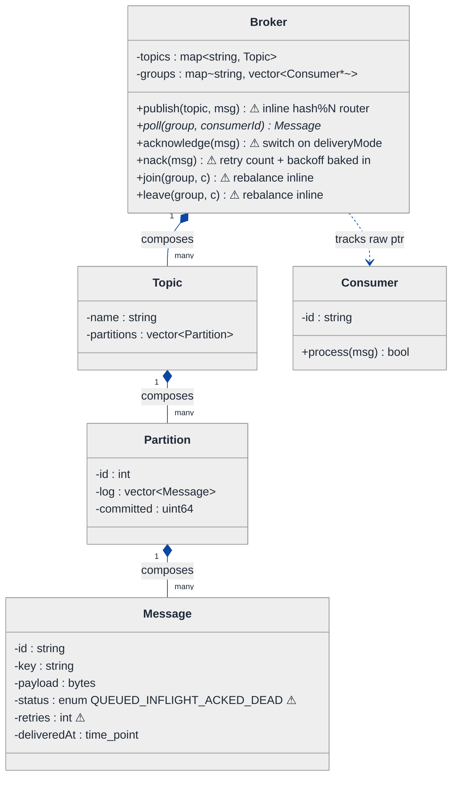
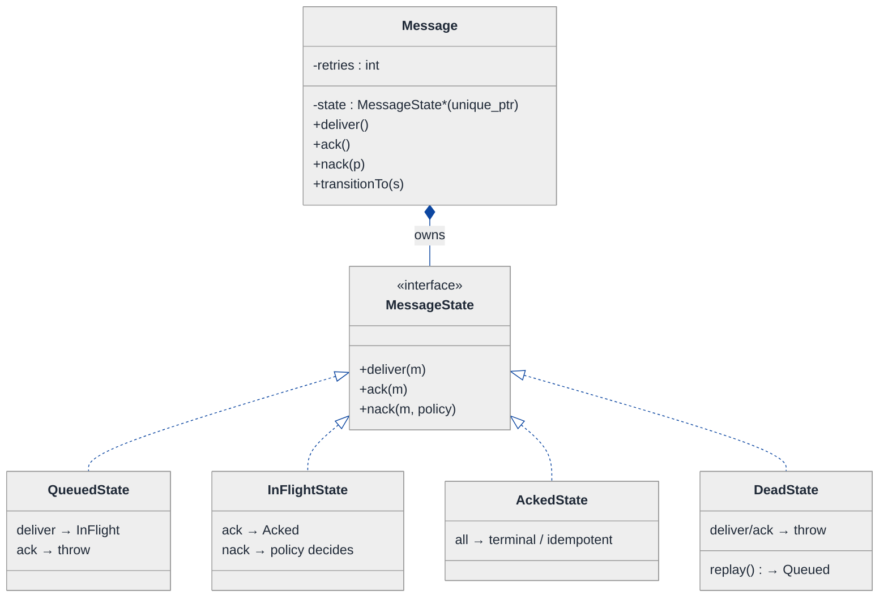
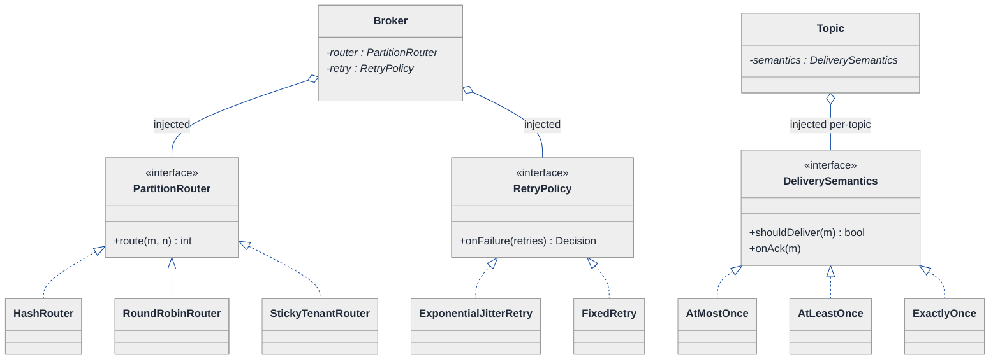
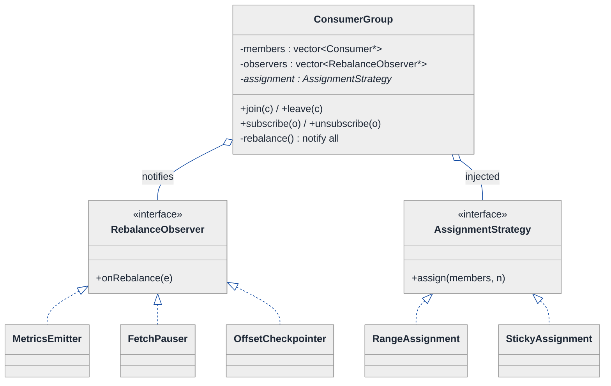
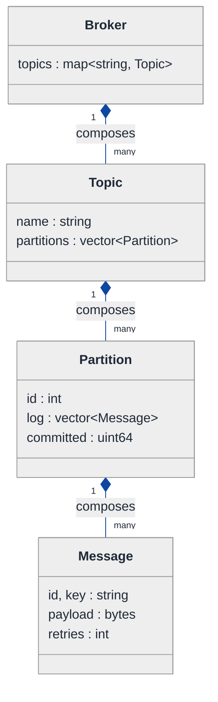
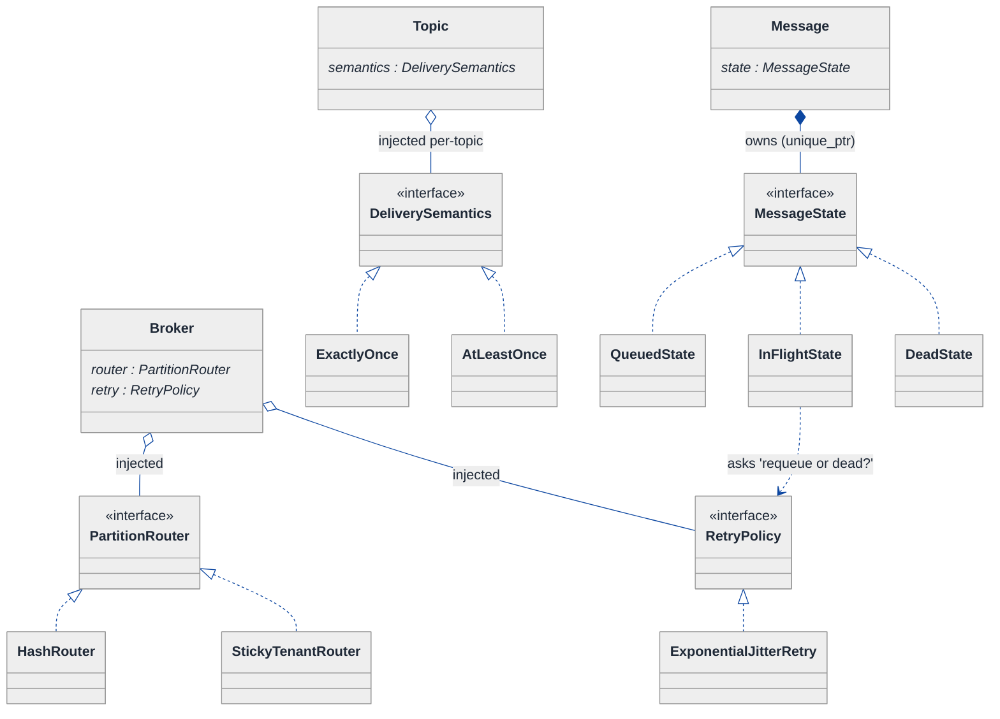
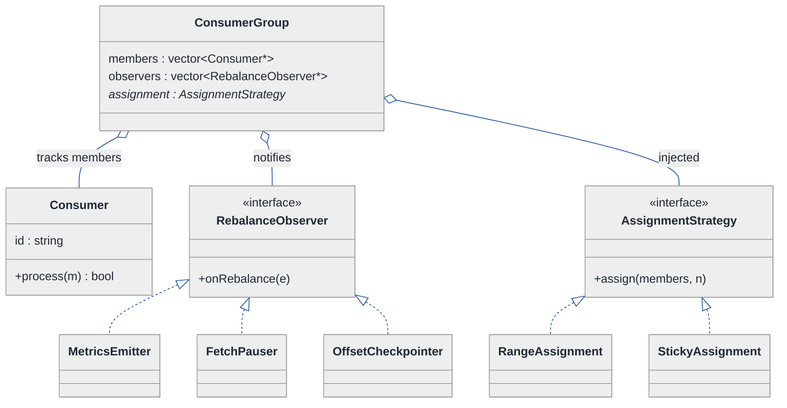
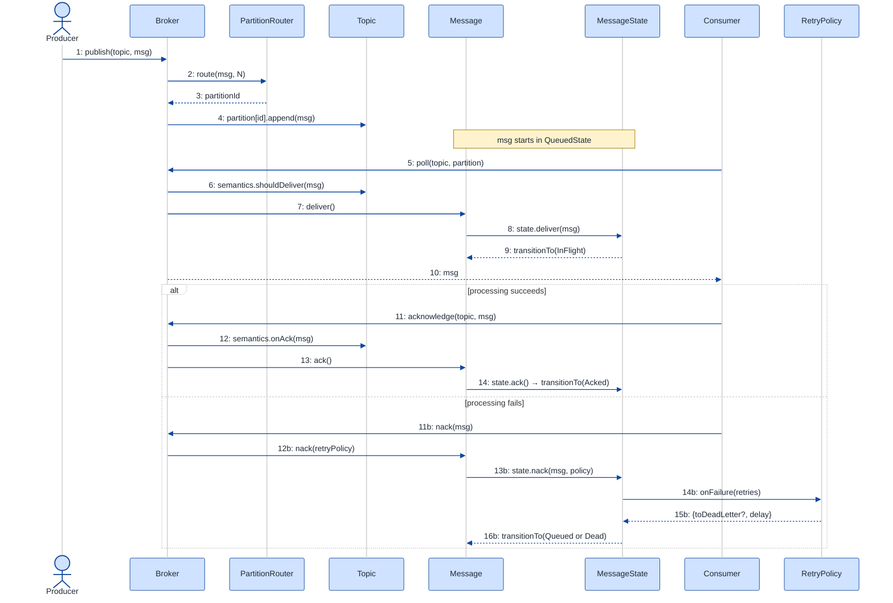

# Distributed Queue — LLD Walkthrough

> **Difficulty:** Hard · **Time:** ~50 min · **Pattern focus:** State (message lifecycle) + Strategy (delivery semantics / partition routing / retry backoff) + Observer (consumer-group rebalance)
>
> **Problem source(s):** LeetLens rows 56 / 57 / 59 in [`./EXTRACTED_QUESTIONS.md`](./EXTRACTED_QUESTIONS.md) — "Design a distributed queue for a microservices architecture" (Hard, Google). IDs `218c434f`, `57391323`, `bf931b9a`.
>
> **Diagrams:** inline mermaid (renders natively in GitHub / VS Code). No external sources, no PNG/SVG.

---

## How to use this file

Paced for a candidate who has used a message queue (SQS / Kafka / RabbitMQ) but has never had to *design the object model* behind one. Reading time: ~50 minutes if you sketch each iteration by hand.

**The lesson:** a "distributed queue" interview is NOT a distributed-systems-theory quiz — at the LLD altitude it is a **pattern-discrimination test wearing a systems costume**. The hard part is the same as parking lot: there are four or five axes that vary independently (how messages are delivered, how they are routed to partitions, what happens on failure, how a message moves through its lifecycle), and a beginner bakes a hardcoded answer for each into one god-class `Broker`. We will build that naive `Broker` first, watch it buckle under five realistic feature requests, then lift each variable axis onto its own pattern — one at a time, with the justification.

**Scope honesty.** We design the *object model and the in-process semantics* (enqueue, partition, deliver, ack, retry, dead-letter, consumer-group rebalance). We are explicit about where the network boundary sits and treat replication / consensus as a pluggable seam, not the focus. That is the right altitude for a 50-minute LLD round.

**Map of this file (15 sections):**

1. Problem statement + clarifying questions
2. Plain-English restatement
3. Why this matters
4. Mental model + domain sketch
5. Try it yourself first
6. Entity & verb extraction
7. **Iteration 1: the naive design** — one `Broker` class that does everything
8. **Where the naive design hurts** — five future requirements, one painful diff each
9. **Pivot 1: State for the message lifecycle** — the most painful axis first
10. **Pivot 2: Strategy for delivery semantics, partition routing, and retry backoff**
11. **Pivot 3: Observer for consumer-group membership & rebalance**
12. Final class diagram (three sub-views)
13. Skeleton code (C++17)
14. Key flow — sequence diagram
15. Extensibility re-check + anti-patterns + how to think aloud + self-check

---

## 1. Problem statement + clarifying questions

**Prompt (typical phrasing):** "Design a distributed queue for a microservices architecture. Producers publish messages; consumers process them. It should scale and be reliable."

That prompt is deliberately under-specified. A senior candidate does NOT start drawing — they pin down the axes that will dominate the class design. **Clarifying questions to ask BEFORE drawing anything:**

1. **Delivery guarantee?** At-most-once (fire and forget), at-least-once (redeliver on missing ack — duplicates possible), or exactly-once (dedupe + idempotency)? This single answer reshapes the whole ack path.
2. **Ordering guarantee?** Total order across the whole queue, per-partition order (Kafka-style), or no ordering at all (best-effort, like SQS standard)? Total order kills horizontal scale; per-key order is the usual compromise.
3. **Fan-out model?** Point-to-point (each message goes to exactly one consumer — a work queue) or pub-sub (each message goes to every subscribed consumer group)? Or both, like Kafka's consumer-group model?
4. **Consumer count is dynamic?** Do consumers join and leave at runtime, requiring partition reassignment (rebalance)? Almost always yes for microservices.
5. **Failure handling?** On a consumer crash mid-process, do we redeliver after a visibility timeout? How many retries before a message goes to a dead-letter queue (DLQ)? Backoff policy — fixed, linear, exponential-with-jitter?
6. **Persistence / durability?** In-memory only (lose on restart), or durable log with replication factor N? Where does the network/replication boundary sit?
7. **Throughput vs latency target?** Batched acks for throughput, or per-message acks for low latency? Affects whether ack is a method or a stream.

**Assumptions if the interviewer dodges (state them out loud):** at-least-once delivery, per-partition ordering, Kafka-style consumer groups (point-to-point WITHIN a group, pub-sub ACROSS groups), dynamic consumers with rebalance, exponential-backoff retry with a max-retry DLQ cutoff, a durable append-only log per partition with replication treated as a pluggable seam. Single coordinator process for the LLD; we will mark where the real network boundary is.

---

## 2. Plain-English restatement

We're building the software object model of a message broker. **Producers** hand messages to the broker against a named **topic**. The broker splits each topic into **partitions** (the unit of parallelism and ordering) and appends each message to one partition's log. **Consumers** belong to a **consumer group**; the broker hands each partition to exactly one consumer in the group, so the group as a whole processes every message once, in per-partition order. A consumer **acknowledges** a message after processing; if it crashes or times out, the message is redelivered. After too many failures the message is parked in a **dead-letter queue**. When consumers join or leave, the broker **rebalances** partitions across the surviving consumers. The design must let us change delivery guarantees, routing rules, and retry policy **without rewriting the broker's core loop**.

---

## 3. Why this matters

This is a senior-bar LLD because it has *more independent axes of variation than parking lot*, and they are easy to conflate. The interviewer is probing whether you can tell apart: behavior the **caller picks** (delivery semantics, routing) → Strategy; lifecycle the **message transitions through** (queued → in-flight → acked → dead) → State; and a **fan-out notification** when group membership changes (rebalance) → Observer. Candidates who reach for one big `enum MessageStatus` + a 200-line `Broker::poll()` with nested `if`s reveal that they pattern-match on the *domain noun* ("queue") instead of on the *shape of the variation*. The whole point of this walkthrough is to make those three shapes obvious by deriving them.

---

## 4. Mental model + domain sketch

A distributed queue is **a sharded append-only log + a rule-book**. The log is the inventory (messages, in partitions). The rule-book has axes that move independently: how a message is routed to a partition, how delivery is guaranteed, how failures retry, and how a message moves through its lifecycle. Group membership is a separate, *eventful* concern — consumers come and go, and several things must react when they do.

```
Real-world sketch (NOT a UML diagram yet):

  Producers                Topic "orders"                    Consumer Group "billing"
  ┌─────────┐    route     ┌──────────────────────────┐      ┌──────────────────────┐
  │ P1  P2  │ ───key────►  │ Partition 0: [m0 m3 m6 …] │ ───► │ C1  (owns P0, P1)    │
  └─────────┘              │ Partition 1: [m1 m4 m7 …] │ ───► │                      │
                           │ Partition 2: [m2 m5 m8 …] │ ───► │ C2  (owns P2)        │
                           └──────────────────────────┘      └──────────────────────┘
                                   ▲ append-only                     │ ack / nack
                                   │                                 ▼
                            each msg lives a lifecycle:      ┌──────────────────────┐
                            QUEUED → IN-FLIGHT → ACKED       │  Dead-Letter Queue   │
                                         └──nack×N──────────►│  (after max retries) │
                                                             └──────────────────────┘
```

The KEY insight from this picture: **inventory (the partitioned log) vs. orchestration (the broker handing partitions to consumers) vs. policy (routing, delivery, retry) vs. lifecycle (a single message's journey) vs. membership events (rebalance)** are five separable concerns. The naive design will smash them into one class; the final design keeps them apart.

---

## 5. Try it yourself first

> **Predict before reading on:**
>
> 1. List 5 nouns you'd promote to a class and 3 you'd leave as fields.
> 2. **If I told you the queue must support at-most-once AND at-least-once AND exactly-once delivery — configurable per topic — what would change about how you write `acknowledge()`?** Where does the duplicate-suppression live?
> 3. A message fails processing 3 times then must go to a dead-letter queue, and a "lost-message replay" admin tool must also exist. Where do you put the "what's a legal next step for this message" logic so that adding the replay path doesn't touch the happy path?
> 4. Five consumers, one dies. Who needs to be *told*, and what do they each do about it?

---

## 6. Entity & verb extraction

> **Mini-refresher: noun → class, but not every noun.**
>
> Naive OOD promotes every noun to a class. Senior OOD promotes a noun only when it has BEHAVIOR and STATE that must live together. "Offset" is just a number (field). "Message" has a lifecycle (class). The discipline of this step is to NOT introduce a single design pattern yet — just nouns and verbs.

**Nouns from the prompt:**

| Noun | Decision | Why |
|---|---|---|
| Broker | Class (top-level coordinator) | Owns topics, orchestrates publish/poll/ack |
| Topic | Class | Named stream; owns its partitions |
| Partition | Class | Append-only ordered log; the unit of parallelism + ordering |
| Message | Class | Has a lifecycle (queued → in-flight → acked / dead) + payload |
| Producer | Class (thin) | Holds routing key logic, calls `broker.publish` |
| Consumer | Class | Polls, processes, acks; can join/leave a group |
| ConsumerGroup | Class | Owns the partition→consumer assignment; the rebalance unit |
| DeadLetterQueue | Class | Terminal sink for poison messages |
| Offset | Field on a consumer's progress (`uint64`) | Just a position; no behavior |
| RoutingKey | Field on Message (`std::string`) | No behavior of its own |
| Payload | Field on Message (`std::vector<byte>`) | Opaque bytes |
| Visibility timeout | Field / config (`std::chrono::ms`) | A number, not a class |

**Verbs (and the class they live on — naive answer, we'll re-examine):**

| Verb | Owner class (naive — re-examined later) |
|---|---|
| publish(topic, msg) | Broker |
| route(msg) → partitionId | Broker (inline `hash % N`) |
| append(msg) | Partition |
| poll(group, consumer) → msg | Broker |
| acknowledge(msg) | Broker |
| nack(msg) / retry(msg) | Broker |
| deadLetter(msg) | Broker |
| join(group) / leave(group) | Broker |
| rebalance(group) | Broker |

Notice how **almost every verb landed on `Broker`** in the naive column. That concentration is exactly the smell we're going to expose.

**We have NOT introduced any design patterns yet.** Pure nouns + verbs.

---

## 7. <a id="iter-1"></a>Iteration 1: the naive design

Let's write the simplest thing that could possibly work. No patterns — one `Broker` class with `enum`-driven status, a hash-mod router baked into `publish`, and a `switch` on delivery mode inside `acknowledge`.



**Reader's tour (top to bottom; ~60 seconds).**

1. **`Broker` is the root god-object.** It holds `topics` and `groups`, and exposes SIX public methods that each contain a hardcoded decision. No injected policy objects anywhere. Every variable behavior is welded into a method body.

2. **The composition spine (left).** Filled diamonds (`◆`) mark composition / same lifetime. Broker composes `Topic[]`; Topic composes `Partition[]`; Partition composes `Message[]` (the log). This spine is genuinely fine — it survives into the final design.

3. **`Broker::publish` warning.** Routing is an inline `hash(msg.key) % partitionCount`. The MOMENT someone wants round-robin, or sticky-by-tenant, or a hot-partition split, you edit this method.

4. **`Broker::acknowledge` warning.** It `switch`es on a `deliveryMode` enum: at-most-once does nothing, at-least-once commits the offset, exactly-once also writes a dedup record. Three behaviors, one method, growing.

5. **`Broker::nack` warning.** Retry count + backoff math is baked in (`if (retries < 3) sleep(2^retries)`). Changing the backoff or the max-retry cutoff is surgery here.

6. **The `Message` box — the trouble zone (⚠ × 2).**
   - `status` is an `enum { QUEUED, INFLIGHT, ACKED, DEAD }`. Fine for four states; the lifecycle logic ("can I ack an INFLIGHT but not a DEAD?") lives as `if (status == …)` checks scattered across `Broker`.
   - `retries` is a bare int incremented in `nack`.

7. **`join` / `leave` warnings.** Each recomputes the partition→consumer assignment inline and there is no clean way for anything ELSE to react to a rebalance (e.g., a metrics emitter, a paused-fetch coordinator).

Skeleton code for the naive design (C++17):

```cpp
#include <chrono>
#include <cstdint>
#include <functional>
#include <map>
#include <stdexcept>
#include <string>
#include <vector>

enum class DeliveryMode { AT_MOST_ONCE, AT_LEAST_ONCE, EXACTLY_ONCE };
enum class MsgStatus    { QUEUED, INFLIGHT, ACKED, DEAD };

struct Message {
    std::string id;
    std::string key;
    std::vector<std::byte> payload;
    MsgStatus status = MsgStatus::QUEUED;          // ⚠ lifecycle as a tag
    int        retries = 0;                         // ⚠ retry math leaks out
    std::chrono::steady_clock::time_point deliveredAt;
};

struct Partition {
    int id;
    std::vector<Message> log;
    uint64_t committed = 0;
};

struct Topic {
    std::string name;
    std::vector<Partition> partitions;
};

class Consumer {
public:
    explicit Consumer(std::string id) : id_(std::move(id)) {}
    const std::string& id() const { return id_; }
    bool process(const Message& m);                 // user code
private:
    std::string id_;
};

class Broker {
public:
    DeliveryMode mode = DeliveryMode::AT_LEAST_ONCE;

    void publish(const std::string& topic, Message msg) {
        auto& t = topics_.at(topic);
        // ⚠ routing hardcoded — hash-mod only
        size_t p = std::hash<std::string>{}(msg.key) % t.partitions.size();
        msg.status = MsgStatus::QUEUED;
        t.partitions[p].log.push_back(std::move(msg));
    }

    Message* poll(const std::string& topic, int partition) {
        auto& log = topics_.at(topic).partitions[partition].log;
        for (auto& m : log) {
            if (m.status == MsgStatus::QUEUED) {    // ⚠ status-driven branch
                m.status = MsgStatus::INFLIGHT;
                m.deliveredAt = std::chrono::steady_clock::now();
                return &m;
            }
        }
        return nullptr;
    }

    void acknowledge(Message& m) {
        // ⚠ switch on delivery mode — grows with every new guarantee
        switch (mode) {
            case DeliveryMode::AT_MOST_ONCE:   m.status = MsgStatus::ACKED; break;
            case DeliveryMode::AT_LEAST_ONCE:  m.status = MsgStatus::ACKED; /* commit offset */ break;
            case DeliveryMode::EXACTLY_ONCE:   m.status = MsgStatus::ACKED; /* + dedup record */ break;
        }
    }

    void nack(Message& m) {
        // ⚠ retry policy + DLQ cutoff baked in
        if (m.retries < 3) {
            m.retries++;
            std::this_thread::sleep_for(std::chrono::seconds(1 << m.retries)); // fixed exp backoff
            m.status = MsgStatus::QUEUED;
        } else {
            m.status = MsgStatus::DEAD;             // straight to DLQ
        }
    }

    void join(const std::string& group, Consumer* c) {
        groups_[group].push_back(c);
        rebalance(group);                            // ⚠ inline, nothing else can react
    }
    void leave(const std::string& group, Consumer* c) {
        auto& v = groups_[group];
        v.erase(std::remove(v.begin(), v.end(), c), v.end());
        rebalance(group);
    }
private:
    void rebalance(const std::string& group) { /* recompute partition→consumer map inline */ }
    std::map<std::string, Topic>                 topics_;
    std::map<std::string, std::vector<Consumer*>> groups_;
};
```

**This works.** It has zero design patterns. We can publish, poll, ack, nack, and rebalance. So what's wrong with it? Slide the requirements across the desk.

---

## 8. <a id="naive-pain"></a>Where the naive design hurts

The interviewer: "Here are five requirements landing next quarter. Walk me through exactly what changes in your code."

### Change A: "Make delivery guarantee configurable PER TOPIC, and add exactly-once with idempotent dedup"

In the naive design:
- `Broker::mode` is a single field for the WHOLE broker — there is no per-topic granularity. You'd thread a `DeliveryMode` into `acknowledge` and look it up by topic.
- Exactly-once needs a dedup store consulted on BOTH `poll` (skip already-processed) AND `acknowledge` (record the key). The `switch` in `acknowledge` grows a case AND `poll` grows a new branch.
- **Touches `acknowledge` + `poll` + the `mode` field + introduces a dedup dependency.** Two methods plus a field, and the `switch` is now permanent.

### Change B: "Add sticky-by-tenant routing and a hot-partition splitter"

In the naive design:
- The router is one line *inside* `publish`: `hash(key) % N`. Sticky-by-tenant means a tenant→partition map; hot-partition splitting means consulting partition load.
- **`publish` balloons into a 20-line if/else over routing modes.** Every new routing rule is surgery in the one method every producer calls.

### Change C: "Retry policy must be exponential-with-jitter, configurable, with a max-retry cutoff to a named DLQ"

In the naive design:
- The backoff and the cutoff are hardcoded in `nack` (`1 << retries`, `< 3`).
- Jitter, a config-driven cap, and routing the poison message to a *specific* DLQ topic all pile into `nack`.
- **`nack` becomes the second growing god-method.** And the retry math is untestable in isolation because it's welded to status mutation.

### Change D: "Add a 'replay from DLQ' admin flow and a 'paused' state for backpressure"

In the naive design:
- The `MsgStatus` enum has four values. Replay needs DEAD → QUEUED but only via an admin path; backpressure needs an INFLIGHT → PAUSED → QUEUED path.
- Every place that reads `status` (in `poll`, `acknowledge`, `nack`) must now consider the new values, or silently mishandle them.
- **Adding two states forces edits to EVERY method that switches on status — three sites minimum — and there's no compile-time guarantee you covered them all.** A missed branch is a stuck message.

### Change E: "When a consumer joins/leaves, a metrics emitter, a fetch-pauser, and an offset-checkpointer all need to react to the rebalance"

In the naive design:
- `rebalance()` is private and self-contained. The only way to make three other subsystems react is to call them explicitly from inside `rebalance`.
- **`Broker::rebalance` now hard-depends on `Metrics`, `FetchPauser`, and `Checkpointer`.** The broker, which should only care about assignment, now imports three unrelated modules. Adding a fourth reactor edits `rebalance` again.

### The pattern of pain

| Change | Files / methods touched | Smell |
|---|---|---|
| A. Per-topic exactly-once | `acknowledge` switch + `poll` branch + dedup dep | "Delivery algorithm scattered across two methods; a switch that never stops growing." |
| B. Sticky / hot routing | `publish` (monstrous if/else) | "One method accumulates every routing rule." |
| C. Backoff + DLQ cutoff | `nack` (monstrous) | "Retry algorithm welded to status mutation; untestable." |
| D. Replay + paused states | `poll` + `acknowledge` + `nack` (every status reader) | "Status enum can't grow without touching every branch; no exhaustiveness guarantee." |
| E. React to rebalance | `rebalance` hard-coupled to 3 modules | "Broker imports unrelated subsystems just to notify them." |

**Three distinct shapes of pain emerge:**

- **Algorithm-the-caller-picks** (A delivery, B routing, C backoff) — a behavior that varies and is chosen by configuration. This is the Strategy shape, appearing three times.
- **Lifecycle-the-object-walks** (D message states) — what's a legal next step depends on where the message *is*, and the set of states grows. This is the State shape.
- **One-event-many-reactors** (E rebalance) — a single happening that an open-ended set of subsystems must hear about. This is the Observer shape.

> **Pivot question:** "Which pattern handles 'an algorithm that varies, picked by config'? Which handles 'a lifecycle whose legal transitions depend on current phase'? Which handles 'one event, an open set of listeners'?"
>
> Answers: Strategy, State, Observer. We introduce them one at a time, starting with the axis that corrupts the most code: the message lifecycle (Change D), because its `if (status == …)` checks are smeared across every other method and block the rest.

---

## 9. <a id="pivot-1"></a>Pivot 1: State for the message lifecycle

We start here because the `status` enum is load-bearing for `poll`, `acknowledge`, AND `nack`. Until the lifecycle is clean, every other refactor has to keep dodging status branches.

> **Mini-refresher: State pattern.**
>
> Each lifecycle phase becomes its own class implementing a common interface. The context object (here, `Message`) delegates each operation to its CURRENT state object, and THE STATE decides the next state. Transitions are INTERNAL — driven by what happens to the object, not chosen by an external caller.
>
> Quick example: a TCP connection delegates `send()`/`close()` to a `ConnectionState`; `EstablishedState::close()` transitions to `ClosedState`, while `ClosedState::send()` throws. The connection never `switch`es on a status int.

**Why State (not Strategy) for the lifecycle.** The legal next step is NOT picked by the caller — it's a function of where the message *is*. A `QUEUED` message can be `deliver`-ed (→ in-flight). An `INFLIGHT` message can be `ack`-ed (→ acked, terminal) or `nack`-ed (→ requeued or dead). An `ACKED` or `DEAD` message can do nothing. Calling `ack` on a `DEAD` message isn't a config choice — it's an illegal transition that must fail. The lifecycle is the MESSAGE'S concern.

**Why this beats the enum.** Each new state (PAUSED, the replay path) becomes ONE new class. The compiler forces every state to implement the full interface, so you cannot "forget a branch" — the failure mode that turns the enum into stuck messages.

**The refactor (just the lifecycle slice):**

```cpp
class Message;                 // forward
class RetryPolicy;             // forward — added in Pivot 2

class MessageState {
public:
    virtual ~MessageState() = default;
    virtual const char* name() const = 0;
    virtual void deliver(Message& m) = 0;                 // poll picked it up
    virtual void ack(Message& m) = 0;                     // consumer succeeded
    virtual void nack(Message& m, RetryPolicy& policy) = 0;// consumer failed
};

class QueuedState : public MessageState {
public:
    const char* name() const override { return "QUEUED"; }
    void deliver(Message& m) override;                    // → InFlight, stamp time
    void ack(Message&) override  { throw std::logic_error("ack on QUEUED"); }
    void nack(Message&, RetryPolicy&) override { /* no-op: not delivered yet */ }
};

class InFlightState : public MessageState {
public:
    const char* name() const override { return "INFLIGHT"; }
    void deliver(Message&) override { /* idempotent re-deliver within visibility window */ }
    void ack(Message& m) override;                        // → Acked (terminal)
    void nack(Message& m, RetryPolicy& policy) override;  // policy decides → Queued or Dead
};

class AckedState : public MessageState {                  // terminal
public:
    const char* name() const override { return "ACKED"; }
    void deliver(Message&) override            { /* ignore: already done */ }
    void ack(Message&) override                { /* idempotent */ }
    void nack(Message&, RetryPolicy&) override { /* ignore */ }
};

class DeadState : public MessageState {                   // terminal, but admin-replayable
public:
    const char* name() const override { return "DEAD"; }
    void deliver(Message&) override            { throw std::logic_error("deliver DEAD without replay"); }
    void ack(Message&) override                { throw std::logic_error("ack DEAD"); }
    void nack(Message&, RetryPolicy&) override { /* already dead */ }
    static void replay(Message& m);                       // admin path → Queued
};

class Message {
public:
    Message(std::string id, std::string key, std::vector<std::byte> payload)
        : id_(std::move(id)), key_(std::move(key)), payload_(std::move(payload)),
          state_(std::make_unique<QueuedState>()) {}

    void transitionTo(std::unique_ptr<MessageState> s) { state_ = std::move(s); }
    const char* statusName() const { return state_->name(); }

    void deliver()                       { state_->deliver(*this); }
    void ack()                           { state_->ack(*this); }
    void nack(RetryPolicy& policy)       { state_->nack(*this, policy); }

    int  retries() const { return retries_; }
    void bumpRetries()   { ++retries_; }
    const std::string& key() const { return key_; }
    // ... id(), payload(), deliveredAt() getters elided ...
private:
    std::string id_, key_;
    std::vector<std::byte> payload_;
    std::unique_ptr<MessageState> state_;     // OWNED, exclusive
    int retries_ = 0;
};

// Transition bodies (deferred until Message is complete):
inline void QueuedState::deliver(Message& m) {
    m.transitionTo(std::make_unique<InFlightState>());
}
inline void InFlightState::ack(Message& m) {
    m.transitionTo(std::make_unique<AckedState>());
}
// InFlightState::nack delegates the QUEUED-vs-DEAD decision to RetryPolicy — see Pivot 2.
```

**What changed — visualized (lifecycle slice only):**



**Tour of the after-state.**

1. **The `MsgStatus` enum is gone.** A `state_` field of type `std::unique_ptr<MessageState>` (exclusive ownership) replaces it.
2. **`Message::deliver/ack/nack` are one-liners** that delegate to the current state. There is no `if (status == …)` anywhere on `Message`, `poll`, `acknowledge`, or `nack` — Change D's pain evaporates.
3. **The interface declares the contract.** Every concrete state must implement `deliver`, `ack`, `nack` — even when the answer is "throw" (`QueuedState::ack` throws; you can't ack what hasn't been delivered). The compiler enforces exhaustiveness.
4. **Transitions live WITH the state.** `QueuedState::deliver` transitions to `InFlightState`; `InFlightState::ack` transitions to `AckedState`. The PAUSED state and the DLQ-replay path (Change D) are each one new class — no edits to the others.

**Pattern-discrimination cheatsheet — State vs Strategy.**
- *State:* the OBJECT picks its next state internally (`message.nack()` may flip it to Dead); states know each other.
- *Strategy:* the CALLER picks which one to use (`broker.setRouter(x)`); strategies are unaware of peers.
- *Rule of thumb:* swap happens because of an internal event flow → State. Swap happens because external config says so → Strategy.

We chose State because no external caller decides a message is `DEAD` — it gets there by failing `nack` enough times. That's an internal event flow.

---

## 10. <a id="pivot-2"></a>Pivot 2: Strategy for delivery semantics, partition routing, and retry backoff

Changes A, B, C are all the SAME shape: an algorithm that varies and is chosen by configuration, not by the object's internal lifecycle. Once we name it once, the other two are cheap.

> **Mini-refresher: Strategy pattern.**
>
> Encapsulates an algorithm behind an interface so it can be swapped at runtime. The CALLER (here, the broker / topic config) picks the strategy; the strategy doesn't know about its peers.
>
> Quick example: a `Compressor` takes a `CompressionStrategy*`; pass `Gzip` or `Lz4` — the compressor's flow doesn't change, only the plugged-in algorithm does.

**Why Strategy fits all three.**

| Axis (from §8) | Varies over | Chosen by | Why not State? |
|---|---|---|---|
| Delivery (A) | at-most / at-least / exactly-once | per-topic config | No lifecycle; it's "what does ack DO" — an algorithm |
| Routing (B) | hash / round-robin / sticky / hot-split | producer or topic config | Pure function `key → partitionId`; caller picks it |
| Backoff (C) | fixed / linear / exp-with-jitter + cutoff | broker config | Pure function `retries → {requeue after delay \| dead}`; caller picks it |

### 10.1 Routing strategy

```cpp
class PartitionRouter {
public:
    virtual ~PartitionRouter() = default;
    virtual int route(const Message& m, int partitionCount) const = 0;
};
class HashRouter : public PartitionRouter {        // per-key order (default)
public:
    int route(const Message& m, int n) const override {
        return static_cast<int>(std::hash<std::string>{}(m.key()) % n);
    }
};
class RoundRobinRouter : public PartitionRouter {  // max spread, no key order
public:
    int route(const Message&, int n) const override { return next_++ % n; }
private:
    mutable int next_ = 0;
};
class StickyTenantRouter : public PartitionRouter { /* tenant→partition map; elided */ };
```

### 10.2 Delivery-semantics strategy (per topic)

```cpp
class DeliverySemantics {
public:
    virtual ~DeliverySemantics() = default;
    virtual bool shouldDeliver(const Message& m) const = 0;   // exactly-once dedup check
    virtual void onAck(Message& m) = 0;                       // commit / record dedup key
};
class AtMostOnce  : public DeliverySemantics { /* deliver always; onAck no-op */ };
class AtLeastOnce : public DeliverySemantics { /* deliver always; onAck commits offset */ };
class ExactlyOnce : public DeliverySemantics {                // Change A lands here
public:
    bool shouldDeliver(const Message& m) const override { return !seen_.count(m.key()); }
    void onAck(Message& m) override { seen_.insert(m.key()); /* + commit offset */ }
private:
    std::unordered_set<std::string> seen_;                    // dedup store (pluggable to Redis)
};
```

### 10.3 Retry backoff strategy (drives the InFlightState::nack from Pivot 1)

```cpp
class RetryPolicy {
public:
    virtual ~RetryPolicy() = default;
    struct Decision { bool toDeadLetter; std::chrono::milliseconds delay; };
    virtual Decision onFailure(int retries) const = 0;
};
class ExponentialJitterRetry : public RetryPolicy {           // Change C lands here
public:
    ExponentialJitterRetry(int maxRetries, std::chrono::milliseconds base)
        : maxRetries_(maxRetries), base_(base) {}
    Decision onFailure(int retries) const override {
        if (retries >= maxRetries_) return { true, {} };       // → DLQ
        auto backoff = base_ * (1 << retries);
        auto jitter  = std::chrono::milliseconds(rand() % base_.count());
        return { false, backoff + jitter };
    }
private:
    int maxRetries_;
    std::chrono::milliseconds base_;
};
// FixedRetry, LinearRetry elided — same interface.
```

This is what `InFlightState::nack` from Pivot 1 calls — **State and Strategy cooperate**: the state asks the policy "requeue or dead?" and applies the answer as a transition:

```cpp
inline void InFlightState::nack(Message& m, RetryPolicy& policy) {
    m.bumpRetries();
    auto d = policy.onFailure(m.retries());
    if (d.toDeadLetter) m.transitionTo(std::make_unique<DeadState>());
    else                m.transitionTo(std::make_unique<QueuedState>());  // after d.delay, scheduled
}
```

**What changed — visualized (the three injected strategy families):**



**Tour of the after-state.**

1. **Three interfaces, three injection points.** `PartitionRouter` and `RetryPolicy` hang off `Broker` (open diamond `◇` = aggregation, injected at construction). `DeliverySemantics` hangs off `Topic`, not `Broker` — because Change A demanded PER-TOPIC granularity. Putting it on `Topic` is the design decision that satisfies that requirement structurally.
2. **`publish` shrank to one line:** `t.partitions[router_->route(msg, t.partitionCount())].append(msg)`. Change B's monstrous if/else is gone; new routing = new class.
3. **`acknowledge` shrank:** it asks the topic's semantics `onAck(m)` and the message's state to transition. Change A's switch is gone; exactly-once = the `ExactlyOnce` class holding its own dedup set.
4. **`nack`'s retry math left the broker entirely** — it now lives in `RetryPolicy`, testable in isolation, and is consulted by `InFlightState::nack`. Change C done.

**Pattern-discrimination cheatsheet — Strategy vs Template Method.**
- *Strategy:* whole algorithm in a swappable object; composed at runtime; multiple may even be combined.
- *Template Method:* fixed skeleton in a base class, subclasses fill hooks via inheritance.
- *Rule of thumb:* if the variants are picked/swapped at runtime by config → Strategy. If there's one stable skeleton with 2-3 hook overrides → Template Method.

We chose Strategy because delivery/routing/retry are picked from config at startup (and a test might inject a fake), and because three separate axes vary *independently* — Template Method would force them into one inheritance tree.

> **Mini-refresher: why three Strategy hierarchies don't share one interface.**
>
> Strategy is a ROLE, not a type. `PartitionRouter`, `DeliverySemantics`, and `RetryPolicy` take different inputs and return different outputs — they have nothing in common at the type level. Don't unify them under a generic `Strategy<T>`; that's premature genericism that buys nothing.

---

## 11. <a id="pivot-3"></a>Pivot 3: Observer for consumer-group membership & rebalance

Change E is the last unsolved axis: when a consumer joins or leaves, an OPEN-ENDED set of subsystems (metrics, fetch-pauser, offset-checkpointer, …) must react to the resulting rebalance. The naive `rebalance()` hard-coded calls to each, importing unrelated modules into the broker.

> **Mini-refresher: Observer pattern.**
>
> A SUBJECT maintains a list of OBSERVERS and notifies all of them when something happens — without knowing their concrete types. Observers subscribe/unsubscribe at runtime. The subject depends only on an abstract `Observer` interface, so new reactors are added without touching the subject.
>
> **Back-reference caution:** if observers also hold a pointer back to the subject, use `std::weak_ptr` for that back-edge to avoid an ownership cycle (the subject owns nothing of the observer's lifetime).

**Why Observer (not just calling them directly).** The reactors to a rebalance are a SET that grows (Change E names three; tomorrow there's a fourth). They are unrelated to the broker's core job (partition assignment). Observer inverts the dependency: the broker (subject) publishes a `RebalanceEvent`; each reactor (observer) decides what to do. The broker imports zero of their concrete types.

**The refactor (membership slice):**

```cpp
struct RebalanceEvent {
    std::string group;
    std::vector<std::pair<int, std::string>> assignment;   // partitionId → consumerId
};

class RebalanceObserver {
public:
    virtual ~RebalanceObserver() = default;
    virtual void onRebalance(const RebalanceEvent& e) = 0;
};

class MetricsEmitter   : public RebalanceObserver { /* emit gauge per consumer */ };
class FetchPauser      : public RebalanceObserver { /* pause fetch during reassignment */ };
class OffsetCheckpointer: public RebalanceObserver { /* flush offsets before handoff */ };

class ConsumerGroup {                                       // the SUBJECT
public:
    explicit ConsumerGroup(std::string name) : name_(std::move(name)) {}

    void subscribe(RebalanceObserver* o)   { observers_.push_back(o); }
    void unsubscribe(RebalanceObserver* o) {
        observers_.erase(std::remove(observers_.begin(), observers_.end(), o), observers_.end());
    }

    void join(Consumer* c)  { members_.push_back(c); rebalance(); }
    void leave(Consumer* c) {
        members_.erase(std::remove(members_.begin(), members_.end(), c), members_.end());
        rebalance();
    }
private:
    void rebalance() {
        RebalanceEvent e{ name_, assignment_->assign(members_, partitionCount_) };
        for (auto* o : observers_) o->onRebalance(e);       // notify; broker imports nobody
    }
    std::string name_;
    std::vector<Consumer*> members_;
    std::vector<RebalanceObserver*> observers_;
    std::unique_ptr<AssignmentStrategy> assignment_;        // range / round-robin / sticky — yes, ANOTHER Strategy
    int partitionCount_ = 0;
};
```

Note the bonus: the *assignment algorithm itself* (range vs round-robin vs sticky/cooperative) is — once you've seen Pivot 2 — obviously another Strategy (`AssignmentStrategy`), injected into the group. Recognizing the shape made it free.

**What changed — visualized (membership slice):**



**Tour of the after-state.**

1. **`ConsumerGroup` is now the SUBJECT** (the rebalance logic moved off the god-`Broker` to where it belongs). It holds an `observers_` list and a single `notify` loop in `rebalance()`.
2. **Three reactors implement `RebalanceObserver`.** The group calls `onRebalance(e)` on each — it imports NONE of their concrete types. Change E's fourth reactor is a new class + one `subscribe()` call.
3. **Assignment is another injected Strategy.** Recognizing the Pivot-2 shape made the range/sticky choice a drop-in.

**Pattern-discrimination cheatsheet — Observer vs Mediator.**
- *Observer:* one subject broadcasts to many independent listeners; listeners don't talk to each other.
- *Mediator:* a hub coordinates many-to-many interactions, encoding the *interaction logic* between colleagues.
- *Rule of thumb:* fan-out of one event to passive listeners → Observer. Centralizing complex back-and-forth between several objects → Mediator.

We chose Observer because the rebalance is a one-way broadcast — the metrics emitter and the fetch-pauser never coordinate with each other.

---

## 12. <a id="fig-class-diagram"></a>Final class diagram

One mega-diagram would be a wall of boxes. Here are **three focused sub-views**; the structural insight at the end ties them together.

### 12.1 The inventory spine — what the broker OWNS



**Tour of 12.1.** Four boxes, one chain. Filled diamonds (`◆`) mark composition (same lifetime). This spine is *unchanged from the naive design* — it was never the problem. Broker owns topics; topics own partitions; partitions own the message log. Everything we added lives elsewhere (12.2, 12.3).

### 12.2 The policy injection — the Strategy + State families



**Tour of 12.2.**

1. **Three Strategy interfaces, injected at different levels.** `PartitionRouter` + `RetryPolicy` on `Broker`; `DeliverySemantics` on `Topic` (per-topic, per Change A). Open diamonds = aggregation.
2. **`Message` OWNS its `MessageState`** (filled diamond / `unique_ptr`) — the State pattern from Pivot 1.
3. **The dashed dependency `InFlightState ..> RetryPolicy`** is where State and Strategy cooperate: the in-flight state asks the retry policy whether a failed message requeues or dies, then applies the answer as a transition.
4. **Variability the naive `Broker` hardcoded is now lifted into type hierarchies.** The broker's core became orchestration; the variation became hot-swap policy.

### 12.3 The membership eventing — Observer + assignment Strategy



**Tour of 12.3.** `ConsumerGroup` is the subject: it tracks member consumers, holds an observer list, and owns one injected assignment strategy. On join/leave it recomputes assignment via the strategy and broadcasts a `RebalanceEvent` to every observer — importing none of their concrete types. A new reactor is one class + one `subscribe()`.

### Structural insight (ties 12.1 + 12.2 + 12.3 together)

| Concern | Pattern used | Why |
|---|---|---|
| **Inventory** (Topic, Partition, Message-as-data) | Plain composition | Same-lifetime ownership; no variation |
| **Delivery / routing / retry** (algorithms picked by config) | Strategy, INJECTED (broker- or topic-level) | Caller/config picks the variant; axes vary independently |
| **Message lifecycle** (queued → in-flight → acked / dead / paused) | State, OWNED by Message | Message controls its own transitions; legal next step depends on phase |
| **Rebalance fan-out** (metrics, pauser, checkpointer) | Observer, on ConsumerGroup | One event, open-ended set of passive listeners |
| **Partition assignment** (range / sticky) | Strategy, INJECTED into ConsumerGroup | Same shape as delivery/routing — recognized, reused |

The big lesson: **inheritance shows up only inside the State / Strategy / Observer class families** (genuine "is-a" within each role). Every "varies independently" axis became composition over an interface. *Inheritance for role identity; composition for behavior variation.* That distinction is what makes the broker extensible without rewrites.

---

## 13. Skeleton code (C++17)

> Show the SHAPES, not full impls. Abstract bases + 1-2 concretes per pattern; the rest `// elided`.

```cpp
#include <chrono>
#include <cstdint>
#include <functional>
#include <memory>
#include <stdexcept>
#include <string>
#include <unordered_map>
#include <unordered_set>
#include <utility>
#include <vector>

// ── Forward declarations ────────────────────────────────────────────
class Message;          // defined below
class RetryPolicy;      // Strategy, used by InFlightState

// ── State pattern: message lifecycle ────────────────────────────────
class MessageState {
public:
    virtual ~MessageState() = default;
    virtual const char* name() const = 0;
    virtual void deliver(Message& m) = 0;
    virtual void ack(Message& m) = 0;
    virtual void nack(Message& m, RetryPolicy& policy) = 0;
};
class QueuedState   : public MessageState { /* deliver → InFlight; ack throws */ };
class InFlightState : public MessageState { /* ack → Acked; nack → policy decides */ };
class AckedState    : public MessageState { /* terminal */ };
class DeadState     : public MessageState { /* terminal; static replay() → Queued */ };

class Message {
public:
    Message(std::string id, std::string key, std::vector<std::byte> p)
        : id_(std::move(id)), key_(std::move(key)), payload_(std::move(p)),
          state_(std::make_unique<QueuedState>()) {}
    void transitionTo(std::unique_ptr<MessageState> s) { state_ = std::move(s); }
    void deliver()                 { state_->deliver(*this); }
    void ack()                     { state_->ack(*this); }
    void nack(RetryPolicy& policy) { state_->nack(*this, policy); }
    const std::string& key() const { return key_; }
    int  retries() const           { return retries_; }
    void bumpRetries()             { ++retries_; }
private:
    std::string id_, key_;
    std::vector<std::byte> payload_;
    std::unique_ptr<MessageState> state_;     // owned
    int retries_ = 0;
};

// ── Strategy: partition routing ─────────────────────────────────────
class PartitionRouter {
public:
    virtual ~PartitionRouter() = default;
    virtual int route(const Message& m, int partitionCount) const = 0;
};
class HashRouter : public PartitionRouter {
public:
    int route(const Message& m, int n) const override {
        return static_cast<int>(std::hash<std::string>{}(m.key()) % n);
    }
};
// RoundRobinRouter, StickyTenantRouter elided

// ── Strategy: delivery semantics (per topic) ────────────────────────
class DeliverySemantics {
public:
    virtual ~DeliverySemantics() = default;
    virtual bool shouldDeliver(const Message& m) const = 0;
    virtual void onAck(Message& m) = 0;
};
class ExactlyOnce : public DeliverySemantics {
public:
    bool shouldDeliver(const Message& m) const override { return !seen_.count(m.key()); }
    void onAck(Message& m) override { seen_.insert(m.key()); }
private:
    std::unordered_set<std::string> seen_;
};
// AtMostOnce, AtLeastOnce elided

// ── Strategy: retry / backoff ───────────────────────────────────────
class RetryPolicy {
public:
    struct Decision { bool toDeadLetter; std::chrono::milliseconds delay; };
    virtual ~RetryPolicy() = default;
    virtual Decision onFailure(int retries) const = 0;
};
class ExponentialJitterRetry : public RetryPolicy {
public:
    ExponentialJitterRetry(int maxR, std::chrono::milliseconds base) : maxR_(maxR), base_(base) {}
    Decision onFailure(int retries) const override {
        if (retries >= maxR_) return { true, {} };
        return { false, base_ * (1 << retries) };  // + jitter elided
    }
private:
    int maxR_;
    std::chrono::milliseconds base_;
};

// State↔Strategy cooperation:
inline void InFlightState::nack(Message& m, RetryPolicy& policy) {
    m.bumpRetries();
    auto d = policy.onFailure(m.retries());
    if (d.toDeadLetter) m.transitionTo(std::make_unique<DeadState>());
    else                m.transitionTo(std::make_unique<QueuedState>());
}

// ── Observer: consumer-group rebalance ──────────────────────────────
struct RebalanceEvent { std::string group; std::vector<std::pair<int,std::string>> assignment; };
class RebalanceObserver {
public:
    virtual ~RebalanceObserver() = default;
    virtual void onRebalance(const RebalanceEvent& e) = 0;
};
class MetricsEmitter : public RebalanceObserver { public: void onRebalance(const RebalanceEvent&) override {/*…*/} };
// FetchPauser, OffsetCheckpointer elided

class AssignmentStrategy {
public:
    virtual ~AssignmentStrategy() = default;
    virtual std::vector<std::pair<int,std::string>> assign(
        const std::vector<class Consumer*>& members, int partitionCount) const = 0;
};
// RangeAssignment, StickyAssignment elided

class Consumer {
public:
    explicit Consumer(std::string id) : id_(std::move(id)) {}
    const std::string& id() const { return id_; }
    bool process(const Message& m);   // user code
private:
    std::string id_;
};

class ConsumerGroup {                 // the SUBJECT
public:
    ConsumerGroup(std::string name, std::unique_ptr<AssignmentStrategy> a, int parts)
        : name_(std::move(name)), assignment_(std::move(a)), partitionCount_(parts) {}
    void subscribe(RebalanceObserver* o)   { observers_.push_back(o); }
    void join(Consumer* c)  { members_.push_back(c); rebalance(); }
    void leave(Consumer* c) { /* erase */ rebalance(); }
private:
    void rebalance() {
        RebalanceEvent e{ name_, assignment_->assign(members_, partitionCount_) };
        for (auto* o : observers_) o->onRebalance(e);
    }
    std::string name_;
    std::vector<Consumer*> members_;
    std::vector<RebalanceObserver*> observers_;
    std::unique_ptr<AssignmentStrategy> assignment_;
    int partitionCount_;
};

// ── Inventory + orchestration ───────────────────────────────────────
struct Partition { int id; std::vector<Message> log; uint64_t committed = 0; };
class Topic {
public:
    Topic(std::string n, int parts, std::unique_ptr<DeliverySemantics> sem)
        : name_(std::move(n)), semantics_(std::move(sem)) { partitions_.resize(parts); }
    int  partitionCount() const { return static_cast<int>(partitions_.size()); }
    Partition& partition(int i)  { return partitions_[i]; }
    DeliverySemantics& semantics() { return *semantics_; }
private:
    std::string name_;
    std::vector<Partition> partitions_;
    std::unique_ptr<DeliverySemantics> semantics_;   // per-topic
};

class Broker {                        // orchestration only — no baked-in policy
public:
    Broker(std::unique_ptr<PartitionRouter> r, std::unique_ptr<RetryPolicy> rp)
        : router_(std::move(r)), retry_(std::move(rp)) {}

    void publish(const std::string& topic, Message msg) {
        auto& t = topics_.at(topic);
        int p = router_->route(msg, t.partitionCount());     // Strategy
        t.partition(p).log.push_back(std::move(msg));
    }
    Message* poll(const std::string& topic, int partition) {
        auto& t = topics_.at(topic);
        for (auto& m : t.partition(partition).log)
            if (std::string(m_state_name(m)) == "QUEUED" && t.semantics().shouldDeliver(m)) {
                m.deliver();                                  // State transition
                return &m;
            }
        return nullptr;
    }
    void acknowledge(const std::string& topic, Message& m) {
        topics_.at(topic).semantics().onAck(m);               // Strategy
        m.ack();                                              // State transition
    }
    void nack(Message& m) { m.nack(*retry_); }                // State asks Strategy
private:
    static const char* m_state_name(const Message&);          // helper, elided
    std::unordered_map<std::string, Topic> topics_;
    std::unique_ptr<PartitionRouter> router_;
    std::unique_ptr<RetryPolicy>     retry_;
};
```

Notice the broker's methods are each two or three lines: route → append, check-semantics → transition, ask-policy → transition. **All the variation moved out; orchestration stayed in.**

---

## 14. <a id="fig-sequence"></a>Key flow — sequence diagram

The publish → poll → process → ack/nack path, showing how the patterns hide their machinery from the caller.



**What the patterns HIDE from the caller.** The `Consumer` calls only `poll`, `acknowledge`, `nack` — three verbs. It never sees: which partition the router chose (Strategy), whether delivery semantics suppressed a duplicate (Strategy), what state the message was in or where it transitioned (State), or whether a failure requeues vs dead-letters and after what backoff (State asking Strategy). A `Producer` calls only `publish` and never learns the partition. That collapse of a five-axis policy surface into a handful of verbs is the entire payoff of the derivation.

---

## 15. Extensibility re-check + anti-patterns + how to think aloud + self-check

### 15.1 Extensibility re-check — do the §8 changes land cleanly now?

| §8 change | Before (naive) | After (final) |
|---|---|---|
| A. Per-topic exactly-once | edit `acknowledge` switch + `poll` + add field | `ExactlyOnce : DeliverySemantics`, injected on the topic — 1 class |
| B. Sticky / hot routing | balloon `publish` if/else | `StickyTenantRouter : PartitionRouter` — 1 class |
| C. Exp-jitter backoff + DLQ cutoff | balloon `nack` | `ExponentialJitterRetry : RetryPolicy` — 1 class |
| D. Replay + paused states | edit every status reader | `PausedState` / `DeadState::replay` — 1 class each, no edits elsewhere |
| E. New rebalance reactor | edit `rebalance`, import module | `RebalanceObserver` subclass + `subscribe()` — 1 class |

Every future requirement is now **additive** (a new class) rather than **invasive** (surgery in a god-method). That is the open/closed principle made concrete.

> **Mini-refresher: Open/Closed Principle (the "O" in SOLID).**
>
> Software entities should be OPEN for extension but CLOSED for modification. You extend behavior by ADDING code (a new strategy/state/observer class), not by EDITING existing, tested code. Strategy, State, and Observer are the three classic vehicles for it.

### 15.2 Named anti-patterns we avoided

- **God Object.** The naive `Broker` knew routing, delivery, retry, lifecycle, and rebalance. We split those across Strategy/State/Observer collaborators.
- **Primitive Obsession / Tag-driven branching.** `enum MsgStatus` + `switch` everywhere → State classes; `enum DeliveryMode` + `switch` → Strategy classes. Adding a value no longer risks an unhandled branch.
- **Shotgun Surgery.** A single change (new delivery mode) touched two methods + a field. Now it's one new class.
- **Premature genericism.** We did NOT unify the three Strategy roles under one `Strategy<T>` template — different inputs/outputs, no shared contract.
- **Speculative generality** (the inverse caution). We added an interface for an axis ONLY after §8 proved it varies. Don't pre-abstract an axis the requirements never stress.

### 15.3 How to think aloud (first-person, in the room)

> "I won't draw yet — let me pin the axes that drive the model. *Delivery guarantee, ordering, fan-out, dynamic consumers, retry, durability.* Assume at-least-once, per-partition order, Kafka-style groups, exp-backoff with DLQ, replication as a seam.
>
> I'll start naive: one `Broker` with the partitioned log and `enum` status, so we can SEE the smells. Now five plausible feature requests… notice three shapes. Delivery, routing, and retry are *algorithms config picks* — that's Strategy, three times. The message's legal next step depends on its phase and the state set grows — that's State, so the status enum becomes state classes. Rebalance is *one event, many reactors* — Observer.
>
> Crucially, State and Strategy cooperate: the in-flight state ASKS the retry policy whether to requeue or dead-letter. And delivery semantics live on the Topic, not the Broker, because the requirement was per-topic — I let the requirement choose the injection point. Replication and exactly-once dedup are seams I'd back with a replicated log and an idempotency store respectively; I'll name them but not over-design them in 50 minutes."

### 15.4 Concurrency & distribution note (state the boundary)

LLD altitude, but flag it: each `Partition` is the concurrency unit — a single writer per partition preserves order; readers are one-consumer-per-partition-per-group, so per-partition processing needs no lock. The dedup store, offset commits, and the observer-notify on rebalance ARE shared state and would need synchronization (or a single-threaded coordinator). The network boundary sits at `publish`/`poll`/`ack` (RPC) and at log replication; in a real system the `Partition` log is a replicated append-only log (Raft/ISR), pluggable behind the same `append`/`read` interface so the object model above is unchanged.

> **Self-check — the question to ask next time.**
>
> When you see "design a [queue / broker / pipeline] with multiple [guarantees / routing rules / failure behaviors / lifecycle phases]," before reaching for one big class with enums and switches, ask, for EACH varying thing:
>
> > **"Is this an algorithm the CALLER/CONFIG picks (Strategy), a lifecycle phase the OBJECT transitions through (State), or one event an open set of listeners must hear (Observer)?"**
>
> Algorithm picked externally → Strategy. Internal lifecycle transition → State. One-to-many event fan-out → Observer. If several apply, use several — and let the *requirement* (e.g., "per-topic") choose where each one is injected.

---

## Cross-references

- **Parent topic manifest:** [`./EXTRACTED_QUESTIONS.md`](./EXTRACTED_QUESTIONS.md)
- **Vertical overview:** [`../../LEARNING.md`](../../LEARNING.md)
- **Template:** [`../../TEMPLATE-v2.md`](../../TEMPLATE-v2.md)
- **Canonical exemplar:** [`../Object_Oriented_Design/Parking_Lot.md`](../Object_Oriented_Design/Parking_Lot.md)
- **Related v2 walkthroughs (same bucket):** [`./Rate_Limiter_Middleware.md`](./Rate_Limiter_Middleware.md) · [`./Task_Scheduler.md`](./Task_Scheduler.md) · [`./Min_Queue.md`](./Min_Queue.md)
- **Optional editable diagrams:** sibling `.excalidraw` files (supplementary)
```
