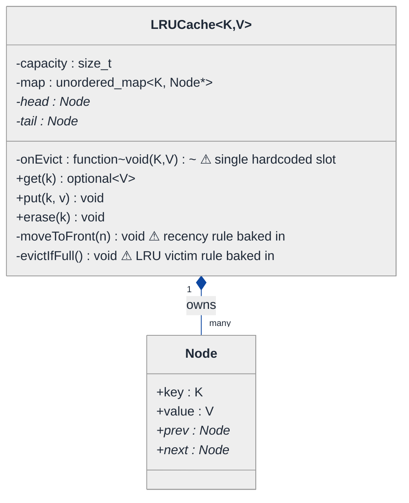
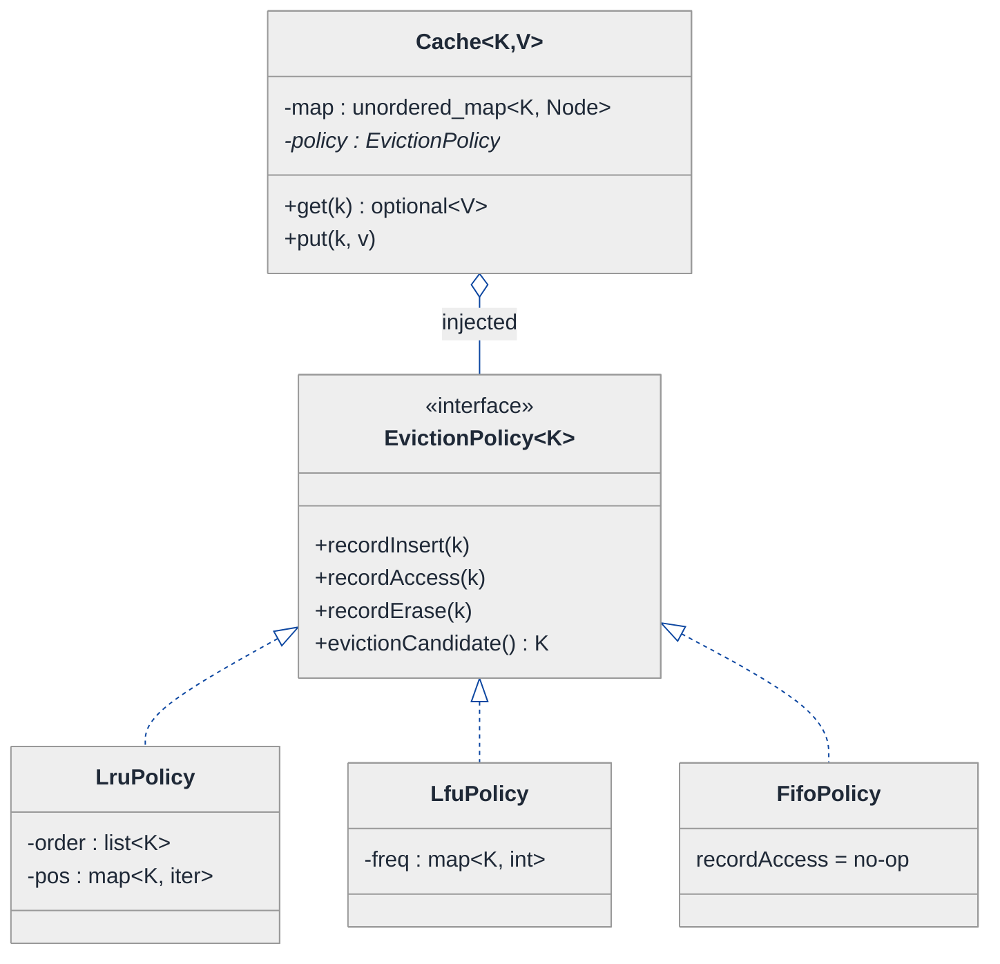
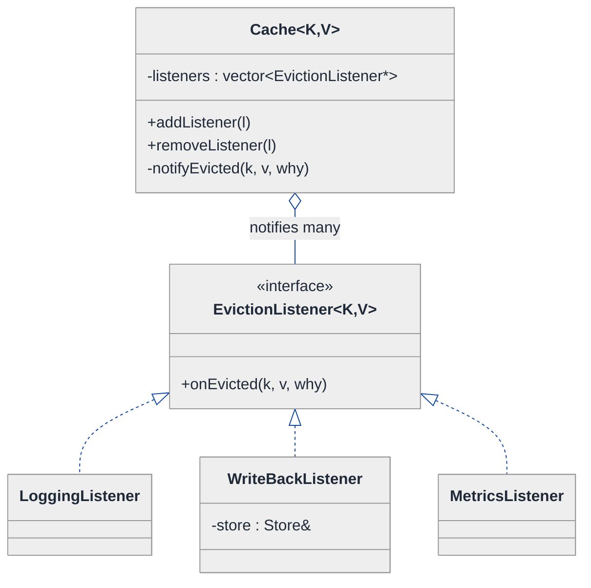
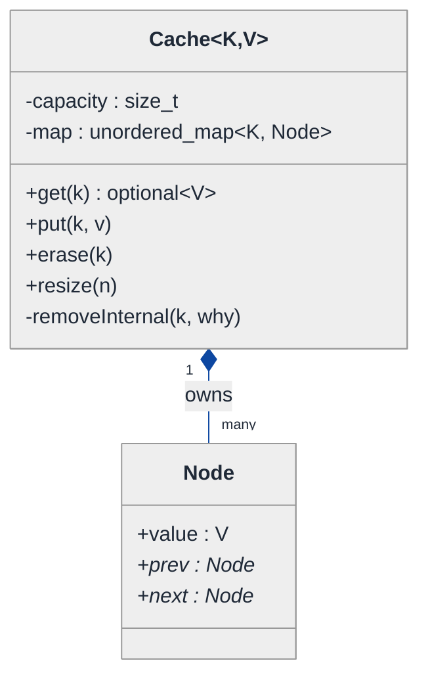
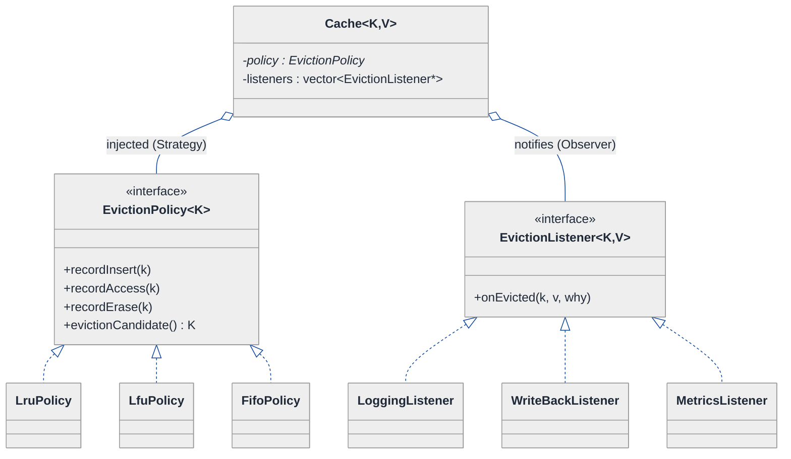
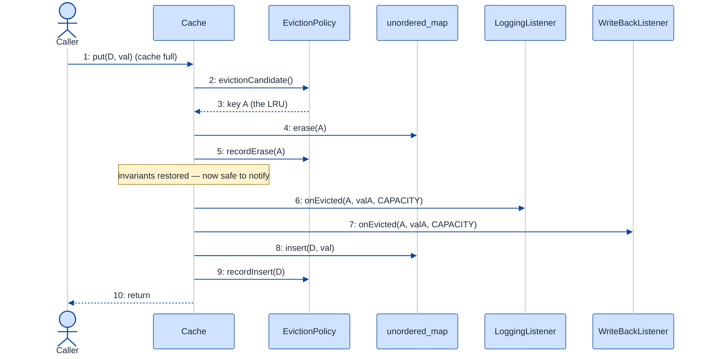

# LRU Cache — LLD Walkthrough

> **Difficulty:** Medium · **Time:** ~30 min · **Pattern focus:** doubly linked list + hash map · then Strategy (eviction policy) + Observer (eviction callbacks)
>
> **Problem source(s):** GID DS1 in [`./EXTRACTED_QUESTIONS.md`](./EXTRACTED_QUESTIONS.md), bucket `LLD_DataStructures`. The canonical "bridge DSA → LLD" question.
>
> **Diagrams:** inline mermaid (renders natively in GitHub / VS Code). Light theme, soft-pastel fills, navy arrows.

---

## How to use this file

Paced for a candidate who can already pass the LeetCode version of LRU Cache (the "get/put in O(1)" algorithm) but has never been asked the *design* version of it. Reading time: ~30 minutes if you sketch each iteration by hand. **The lesson: the data-structure trick (DLL + hashmap) is the EASY half. The interview is really probing whether you can keep that O(1) core clean while the surrounding policy — which entry to evict, what to do when one is evicted — varies independently. Don't bolt those onto the core; derive them out.**

**Map of this file (15 sections):**

1. Problem statement + clarifying questions
2. Plain-English restatement
3. Why this matters
4. Mental model
5. Try it yourself first
6. Entity & verb extraction
7. **Iteration 1: the naive design** — the textbook DLL + hashmap, no patterns
8. **Where the naive design hurts** — four future requirements, one painful diff each
9. **Pivot 1: Strategy for the eviction policy** — the most painful axis first
10. **Pivot 2: Observer for eviction callbacks** — reactions, not return values
11. **Pivot 3: small remaining axes** — capacity policy, thread-safety seam
12. Final class diagram
13. Skeleton code (C++)
14. Key flow — sequence diagram
15. Extensibility re-check + anti-patterns + how to think aloud + self-check

---

## 1. Problem statement + clarifying questions

**Prompt (typical phrasing):** "Design an LRU cache with O(1) `get` and `put`, a configurable capacity, and support for an eviction callback. Implement it with a doubly linked list and a hash map."

**Clarifying questions to ask BEFORE drawing anything:**

1. **Key/value types?** Fixed `(int,int)` like the LeetCode version, or generic `<K,V>` so it's reusable as a library? (Affects whether we template it.)
2. **What exactly fires the eviction callback?** Only capacity-driven eviction, or also explicit `erase`, `clear`, and overwrite-of-existing-key? Does the caller want the evicted key, the value, or both — and the *reason*?
3. **Is LRU the only policy we'll ever need?** Or should the structure also support LFU, FIFO, MRU later? (This is the difference between "implement LRU" and "design a cache.")
4. **Concurrency?** Single-threaded, or will multiple threads `get`/`put` at once? Is the eviction callback allowed to call back INTO the cache (re-entrancy)?
5. **What does `get` on a miss return?** `std::optional`, a sentinel, or throw? Does a miss count as a "use" for ordering purposes? (It shouldn't — but say so.)
6. **Can capacity be zero or changed at runtime?** A zero-capacity cache evicts on every `put`; a shrink-at-runtime evicts multiple entries at once.

**Assumptions if interviewer dodges:** generic `<K,V>`, callback fires on capacity-eviction AND on explicit erase (with a `reason` enum), single LRU policy first but designed so the policy is swappable, single-threaded core with a documented locking seam, `get` returns `std::optional<V>` and a miss does not reorder anything, capacity is fixed at construction.

---

## 2. Plain-English restatement

We're building a fixed-size key/value store that, when it runs out of room, throws away the entry that was used least recently to make space for a new one. Both lookups and inserts must be constant time — no scanning. On top of that raw behavior, the owner wants a hook that fires whenever an entry leaves the cache, so they can (say) flush it to disk or log it. The design must let us change the *which-entry-to-evict* rule and the *what-to-do-on-eviction* reaction **without touching the O(1) get/put machinery**.

---

## 3. Why this matters

This is the question that separates "I memorized the LeetCode solution" from "I can design." The algorithm — DLL for recency order, hashmap for O(1) lookup — is table stakes; a strong candidate writes it in five minutes. The *design* signal is whether you notice that "eviction policy" and "eviction reaction" are axes of variation that will change for reasons unrelated to the core, and structure them as collaborators rather than `if` ladders buried inside `put`. It reappears any time you build a cache layer, a connection pool, a session store, or a memoizer.

---

## 4. Mental model

A cache is **a fixed shelf with a recency queue stapled to it.** The shelf is the hashmap (instant "is key K here? where?"). The queue is the doubly linked list (cheap "move this to the front" and "who's at the back?"). Every entry lives in BOTH structures at once: the map points at the node, the node carries the value and its neighbors. The "least recently used" victim is always whatever sits at the tail of the queue.

```
Real-world sketch (NOT a UML diagram yet):

   map: { A -> •, B -> •, C -> • }        <- O(1) "where is K?"
           |       |       |
           v       v       v
   head <-> [C] <-> [B] <-> [A] <-> tail
         most-recent        least-recent (next victim)

   get(B):  move [B] next to head.   put(D) when full:  drop [A] (tail), insert [D] at head.
```

The KEY insight from this picture: **the map answers "where," the list answers "in what order."** Keep those two jobs married inside the core, and keep everything else (which order counts as "recent," what happens to a dropped entry) OUTSIDE it.

---

## 5. Try it yourself first

> **Predict before reading on:**
>
> 1. List the nouns you'd promote to a class. Which ones are just fields on a node?
> 2. **If I told you next quarter you'll need an LFU cache (evict least-FREQUENTLY used) sharing the same API, what would you NOT want to copy-paste?**
> 3. The owner wants three different things to happen on eviction (log it, flush to disk, emit a metric) — and the set changes per deployment. Where does that logic go so `put` doesn't grow an `if` for each?

---

## 6. Entity & verb extraction

> **Mini-refresher: noun → class, but not every noun.**
>
> Naive OOD promotes every noun to a class. Senior OOD promotes a noun only if it has BEHAVIOR and STATE that belong together. A list node is mostly data — but here it earns a tiny struct because it's the join point between the two data structures.

**Nouns from the prompt:**

| Noun | Decision | Why |
|---|---|---|
| Cache | Class (top-level coordinator) | Owns the map + list, exposes get/put/erase |
| Entry / Node | Small struct | Carries key, value, prev/next; the DLL/map join point |
| Doubly linked list | Internal mechanism of Cache (or a thin helper) | Order bookkeeping; not a public class |
| Hash map | Field on Cache (`unordered_map`) | Library type; no domain behavior |
| Capacity | Field (`size_t`) | A number, not a class |
| Key / Value | Template parameters `<K,V>` | Caller's types |
| Eviction callback | ⚠ starts as a field; becomes its own thing in §10 | It's behavior the owner supplies |

**Verbs (and the class they live on):**

| Verb | Owner class (naive answer — we'll re-examine) |
|---|---|
| get(key) | Cache |
| put(key, value) | Cache |
| erase(key) | Cache |
| moveToFront(node) | Cache (private DLL helper) |
| evict() — pick + remove victim | Cache (private) ⚠ |
| onEvicted(key, value) — fire callback | Cache (private) ⚠ |

**We have NOT introduced any design patterns yet.** Pure nouns + verbs. Two verbs already carry warning flags — those are the axes §8 will stress.

---

## 7. <a id="iter-1"></a>Iteration 1: the naive design

The simplest thing that passes the LeetCode test plus a callback field. No patterns — one class, a map, a list, a `std::function`.



**Reader's tour (read top to bottom; ~45 seconds).**

1. **One class does everything.** `LRUCache<K,V>` holds the capacity, the map, the two list sentinels (`head`/`tail`), and a single `onEvict` callback slot. Every decision lives inside its methods.

2. **`Node` is a plain data struct.** Key, value, and the two DLL pointers. The filled diamond (`◆`) marks composition — the cache OWNS its nodes; when the cache dies, the nodes die. No behavior of its own; it's the join point between map and list.

3. **The three warning markers (⚠) are the future-pain entry points:**
   - `onEvict` is ONE `std::function` slot. Want two reactions (log AND flush)? You overwrite the first or chain them by hand.
   - `moveToFront` hardcodes the recency rule — "most recently touched goes to the front." That IS the LRU policy, fused into the data-structure plumbing.
   - `evictIfFull` hardcodes the victim choice — "drop the tail." Also the LRU policy, in a second place.

**What's deliberately missing.** No `EvictionPolicy` interface. No list of observers. The naive design doesn't even acknowledge that "which entry to evict" and "what to do on eviction" are separate, changeable concerns — it fuses both into the get/put machinery. That's what we'll expose and fix.

Skeleton code for the naive design (C++):

```cpp
#include <functional>
#include <optional>
#include <unordered_map>

template <class K, class V>
class LRUCache {
public:
    explicit LRUCache(std::size_t capacity,
                      std::function<void(const K&, const V&)> onEvict = {})
        : capacity_(capacity), onEvict_(std::move(onEvict)) {
        head_->next = tail_; tail_->prev = head_;            // sentinel ring
    }

    std::optional<V> get(const K& key) {
        auto it = map_.find(key);
        if (it == map_.end()) return std::nullopt;
        moveToFront(it->second);                              // recency rule (baked in)
        return it->second->value;
    }

    void put(const K& key, const V& value) {
        if (auto it = map_.find(key); it != map_.end()) {
            it->second->value = value;
            moveToFront(it->second);
            return;
        }
        if (map_.size() >= capacity_) evictIfFull();          // victim rule (baked in)
        Node* n = new Node{key, value, nullptr, nullptr};
        insertFront(n);
        map_[key] = n;
    }

    void erase(const K& key) {
        auto it = map_.find(key);
        if (it == map_.end()) return;
        unlink(it->second);
        delete it->second;
        map_.erase(it);                                       // note: no callback here (bug seed)
    }

private:
    struct Node { K key; V value; Node* prev; Node* next; };

    void moveToFront(Node* n) { unlink(n); insertFront(n); }
    void insertFront(Node* n) { /* splice after head_ */ }
    void unlink(Node* n)      { n->prev->next = n->next; n->next->prev = n->prev; }

    void evictIfFull() {                                      // LRU: tail->prev is the victim
        Node* victim = tail_->prev;
        if (onEvict_) onEvict_(victim->key, victim->value);   // single slot
        map_.erase(victim->key);
        unlink(victim);
        delete victim;
    }

    std::size_t capacity_;
    std::unordered_map<K, Node*> map_;
    Node* head_ = new Node{};                                 // sentinels (cleanup elided)
    Node* tail_ = new Node{};
    std::function<void(const K&, const V&)> onEvict_;
};
```

**This works.** It passes the LeetCode test and fires one callback on capacity-eviction. It has zero design patterns. So what's wrong with it?

---

## 8. <a id="naive-pain"></a>Where the naive design hurts

The interviewer slides four requirements across the desk: "These are landing next quarter. Walk me through what changes."

### Change A: "Ship an LFU variant (evict least-FREQUENTLY used) with the same API"

In the naive design:
- The recency rule is welded into `moveToFront` and the victim rule into `evictIfFull`. There is no seam to swap.
- You'd copy the entire class to `LFUCache`, add a frequency counter to `Node`, and rewrite both helpers — **duplicating get/put/erase/map-management verbatim** just to change two lines of policy.
- **Smell:** the O(1) plumbing and the eviction policy are fused; you can't change one without re-typing the other.

### Change B: "On eviction, do THREE things — log it, flush to disk, emit a metric — and the set varies per deployment"

In the naive design:
- There's ONE `onEvict` slot. To do three things you cram them into one lambda, or chain by hand.
- Per-deployment variation means `if (config.logging) ...; if (config.flush) ...` inside that lambda — a growing conditional.
- **Smell:** one callback slot can't model "a set of independent reactions that subscribe and unsubscribe."

### Change C: "Fire the callback for ALL removals (explicit erase, clear, overwrite), each with a reason"

In the naive design:
- `evictIfFull` calls the callback; `erase` does NOT (see the bug-seed comment). They diverged.
- Adding a reason means changing the callback signature to `(K, V, Reason)` — touching every call site AND every caller's lambda.
- **Smell:** the "something left the cache" event is fired ad-hoc from whichever method remembered to, with no shared notion of *why*.

### Change D: "Make it thread-safe; the eviction callback might re-enter the cache"

In the naive design:
- A lock has to wrap get/put/erase. But `evictIfFull` calls `onEvict_` WHILE holding internal invariants half-updated — a re-entrant callback that calls `put` sees a corrupt list.
- **Smell:** the callback fires from deep inside a mutation, at the worst possible moment, with no defined ordering.

### The pattern of pain

| Change | Files / methods touched | Smell |
|---|---|---|
| A. LFU variant | whole class duplicated | "Policy fused into the O(1) core." |
| B. Three reactions | `onEvict` lambda balloons | "One callback slot can't hold a changing set." |
| C. Callback for all removals | `evictIfFull` + `erase` + signature | "No shared 'entry left' event or reason." |
| D. Thread-safety + re-entrancy | lock wraps everything; callback fires mid-mutation | "Reaction runs while invariants are broken." |

**Two axes of pain dominate:** *which entry to evict* (an algorithm that varies — A) and *what to do when one is evicted* (a changing set of reactions — B, C, D). Let's introduce one pattern per axis, most painful first.

> **Pivot question:** "What pattern handles 'an algorithm picked by the owner, swapped without touching the caller'? What pattern handles 'a changing set of independent reactions to an event'?"
>
> The answers are Strategy and Observer. Starting with the eviction policy.

---

## 9. <a id="pivot-1"></a>Pivot 1: Strategy for the eviction policy

> **Mini-refresher: Strategy pattern.**
>
> Encapsulates an algorithm behind an interface so it can be swapped at runtime. The CALLER (here, whoever constructs the cache) decides which strategy to use; the strategy doesn't know about its peers.
>
> Quick example: a `Sorter` takes a `CompareStrategy*` in its constructor — pass `Ascending` or `Descending`, the sorter doesn't care which.

**Why Strategy fits the eviction policy.** "Which entry to evict, and how recency/frequency is tracked" is exactly an algorithm: given the current entries and an access event, decide the victim. It varies (LRU, LFU, FIFO, MRU). The choice is made externally — by whoever builds the cache, not by `put` itself. That's textbook Strategy.

The trick is choosing the interface so the *core* keeps owning the map and the O(1) splicing, while the *policy* owns only the ordering bookkeeping and the victim choice. The policy gets told about three events — `recordInsert`, `recordAccess`, `recordErase` — and answers one question: `evictionCandidate()`.

**The refactor (just the affected slice):**

```cpp
template <class K> 
class EvictionPolicy {
public:
    virtual ~EvictionPolicy() = default;
    virtual void recordInsert(const K& key) = 0;   // key just added
    virtual void recordAccess(const K& key) = 0;   // key was get/updated
    virtual void recordErase(const K& key)  = 0;   // key removed out-of-band
    virtual K    evictionCandidate() const   = 0;  // who should leave next?
};

template <class K>
class LruPolicy : public EvictionPolicy<K> {
public:
    void recordInsert(const K& k) override { touch(k); }
    void recordAccess(const K& k) override { touch(k); }      // move to front
    void recordErase(const K& k)  override { order_.erase(pos_.at(k)); pos_.erase(k); }
    K    evictionCandidate() const override { return order_.back(); }  // tail = LRU
private:
    void touch(const K& k) {
        if (auto it = pos_.find(k); it != pos_.end()) order_.erase(it->second);
        order_.push_front(k);
        pos_[k] = order_.begin();
    }
    std::list<K> order_;                              // its OWN recency list
    std::unordered_map<K, typename std::list<K>::iterator> pos_;
};

// LfuPolicy : public EvictionPolicy<K>  — same interface, frequency buckets.  // elided
// FifoPolicy : public EvictionPolicy<K> — recordAccess() is a no-op.          // elided

template <class K, class V>
class Cache {
    // ...
    std::unique_ptr<EvictionPolicy<K>> policy_;   // injected at construction
    // moveToFront / evictIfFull are GONE — the policy answers evictionCandidate()
};
```

**What changed — visualized.** Just the policy slice:



**Tour of the after-state.**

1. **Top: `Cache` gained a field and lost two methods.** `policy_` is a pointer to the `EvictionPolicy` interface, INJECTED at construction (open diamond `◇` = aggregation; the cache uses the policy). `moveToFront` and `evictIfFull` are gone from the cache — that logic moved into the policy.

2. **Middle: the `<<interface>>`.** Four methods. Three are event sinks (`recordInsert/Access/Erase`) the cache calls to keep the policy informed; one is the query (`evictionCandidate`) the cache calls when it's full.

3. **Bottom: three concrete policies.** `LruPolicy` keeps its OWN recency list (the DLL ordering moved here, where it belongs). `LfuPolicy` keeps frequency buckets. `FifoPolicy` simply makes `recordAccess` a no-op — insertion order never changes, so the oldest insert is always the victim. **Each is one self-contained class.**

4. **Powerful consequence.** Change A from §8 ("ship LFU") is now ONE new class implementing the interface — zero edits to the cache's get/put/erase. The O(1) core and the policy are finally separable.

> **Subtle but important — who owns the linked list now?** In the naive design the DLL lived in the cache and encoded LRU order. After this pivot, the *ordering* DLL is the LRU policy's private business. The cache's map can hold values directly (or simple nodes) and never touches ordering. If the question literally demands "the cache implements a DLL," keep a thin DLL in the cache for value storage but let the POLICY own the ordering decision — the separation is the point.

**Pattern-discrimination cheatsheet — Strategy vs Template Method.**
- *Strategy:* the whole algorithm is one swappable object, chosen at runtime via composition.
- *Template Method:* the algorithm skeleton lives in a base class; subclasses fill in hooks via inheritance.
- *Rule of thumb:* if the owner injects the variant (`new Cache(LruPolicy)`) → Strategy. If you'd subclass the cache itself (`class LruCache : Cache` overriding a protected hook) → Template Method.

We chose Strategy because the policy is selected at construction and could even be swapped per-instance — and because subclassing the *cache* to change the *policy* would couple two things that vary for different reasons.

---

## 10. <a id="pivot-2"></a>Pivot 2: Observer for eviction callbacks

Changes B, C, D from §8 are still painful. Strategy doesn't help — the variability here isn't an algorithm, it's a *changing set of independent reactions* to the "an entry left" event. One `std::function` slot can't model that.

> **Mini-refresher: Observer pattern.**
>
> A subject maintains a list of observers and notifies all of them when an event occurs. Observers subscribe and unsubscribe at will; the subject doesn't know what any of them DO. Push (subject sends the data) vs pull (observer asks back) — we'll push the evicted key/value/reason.
>
> Quick example: a spreadsheet cell (subject) notifies every chart and formula (observers) when its value changes. Add a new chart → just subscribe it; the cell code never changes.

**Why Observer (not a bigger callback).** The requirements are "log AND flush AND emit a metric, varying per deployment" (B), "fire for every removal with a reason" (C), and "fire at a well-defined moment, possibly re-entrant" (D). That's a one-to-many notification with members that come and go — the definition of Observer. We replace the single `std::function` with a list of `EvictionListener`s and a single, well-defined `notify` point.

**The refactor (just the listener slice):**

```cpp
enum class EvictionReason { CAPACITY, EXPLICIT_ERASE, OVERWRITE, CLEAR };

template <class K, class V>
class EvictionListener {
public:
    virtual ~EvictionListener() = default;
    virtual void onEvicted(const K& key, const V& value, EvictionReason why) = 0;
};

template <class K, class V>
class LoggingListener : public EvictionListener<K, V> {
public:
    void onEvicted(const K& k, const V&, EvictionReason why) override {
        /* log "key k left, reason=why" */
    }
};

template <class K, class V>
class WriteBackListener : public EvictionListener<K, V> {
public:
    explicit WriteBackListener(Store& s) : store_(s) {}
    void onEvicted(const K& k, const V& v, EvictionReason why) override {
        if (why == EvictionReason::CLEAR) return;            // skip flush on full clear
        store_.flush(k, v);
    }
private:
    Store& store_;
};
// MetricsListener : public EvictionListener<K,V> — bumps a counter.  // elided

// On the cache: a registry + ONE notification site.
template <class K, class V>
class Cache {
public:
    void addListener(std::shared_ptr<EvictionListener<K, V>> l) { listeners_.push_back(std::move(l)); }
    void removeListener(const std::shared_ptr<EvictionListener<K, V>>& l) { /* erase-remove */ }
private:
    void notifyEvicted(const K& k, const V& v, EvictionReason why) {
        for (auto& l : listeners_) l->onEvicted(k, v, why);  // single, ordered fan-out
    }
    std::vector<std::shared_ptr<EvictionListener<K, V>>> listeners_;
};
```

**What changed — visualized.** Just the listener slice:



**Tour of the after-state.**

1. **The single `onEvict` slot became a `listeners` vector.** The cache is now the *subject*; it holds many observers and exposes `addListener` / `removeListener`. Per-deployment variation (Change B) is just "subscribe the ones this deployment wants" — no `if` ladder.

2. **One `notifyEvicted` site, carrying a `reason`.** Every removal path — capacity eviction, explicit erase, overwrite, clear — funnels through this one method with the right `EvictionReason`. Change C is solved: the event is unified and every listener gets the *why* (the `WriteBackListener` uses it to skip flushing on a full clear).

3. **Three concrete listeners, each one class.** Logging, write-back, metrics. Adding a fourth is one new class plus one `addListener` call.

4. **The re-entrancy fix (Change D) becomes a stated policy, not an accident.** Because notification is one explicit method, we can pin down WHEN it fires: *after* the cache's invariants are restored (victim already unlinked, map already updated), so a listener that re-enters with `put` sees a consistent structure. We'll show this ordering in the §14 sequence.

> **Mini-refresher: push vs pull, and the back-reference trap.**
>
> We PUSH `(key, value, reason)` to listeners rather than handing them the cache to pull from — pulling would let a listener read half-updated state. We hold listeners as `shared_ptr` (the listener may outlive a single call and is shared with the caller). If a listener needed a pointer BACK to the cache, that back-edge should be a `weak_ptr` to avoid an ownership cycle.

**Pattern-discrimination cheatsheet — Observer vs Strategy.**
- *Observer:* one-to-MANY; the subject notifies a changing set of subscribers who each REACT independently; return value ignored.
- *Strategy:* one-to-ONE; the context delegates a DECISION to exactly one plugged-in algorithm and USES its return value.
- *Rule of thumb:* "tell everyone something happened" → Observer. "ask the one expert what to do" → Strategy. Eviction *policy* decides (Strategy); eviction *reactions* are told (Observer). That's why this design needs both.

---

## 11. <a id="pivot-3"></a>Pivot 3: the small remaining axes

Changes A–D are solved. Two smaller variability points are worth a sentence each so the design is honest about them.

| Axis | Treatment | One sentence why |
|---|---|---|
| Capacity policy (fixed vs shrink-at-runtime) | A `resize(n)` method that evicts in a loop, reusing `evictionCandidate` + `notifyEvicted` | Shrinking is just N capacity-evictions; no new concept needed. |
| Thread-safety | A documented locking seam: wrap public ops in a `std::lock_guard`, fire listeners OUTSIDE the lock | Concurrency is a cross-cutting concern, not a per-policy one; keep it at the boundary. |

```cpp
void resize(std::size_t n) {
    capacity_ = n;
    while (map_.size() > capacity_) {                 // reuse the eviction machinery
        K victim = policy_->evictionCandidate();
        removeInternal(victim, EvictionReason::CAPACITY);
    }
}
```

> **Mini-refresher: don't fold thread-safety into the policy.**
>
> A tempting wrong turn is to make a `ThreadSafeLruPolicy`. But locking guards the *map + list mutation*, which lives in the cache, not in the policy. The Single Responsibility Principle says the eviction policy decides victims; it does not also own concurrency. Keep the lock at the cache boundary (or wrap with a `SynchronizedCache` decorator) so EVERY policy is automatically safe.

> **Mini-refresher: SRP (Single Responsibility Principle) — the "S" in SOLID.**
>
> A class should have one reason to change. The cache changes when storage mechanics change; a policy changes when an eviction rule changes; a listener changes when a reaction changes. Three reasons, three homes. The naive class had all three reasons fused — that's why every §8 change rippled.

**The lesson.** Once Pivot 1 named "algorithm picked by the owner → Strategy" and Pivot 2 named "changing set of reactions → Observer," the remaining axes either reuse existing machinery (resize) or sit clearly at a boundary (locking). **Pattern recognition makes the rest of the design cheap.**

---

## 12. <a id="fig-class-diagram"></a>12. Final class diagram

The full design splits cleanly into two concerns: the O(1) **core** (what the cache owns) and the two **plug-in axes** (what it uses and notifies). Two focused sub-views; the structural insight ties them together.

### 12.1 The O(1) core — what the cache OWNS



**Tour of 12.1.** The map + node storage is the constant-time machinery and it did NOT change shape from the naive design — that part was always fine. The filled diamond (`◆`) marks composition: the cache owns its nodes. What changed is everything we LIFTED OUT — see 12.2.

### 12.2 The two plug-in axes — what the cache USES and NOTIFIES



**Tour of 12.2.**

1. **Left axis — Strategy (one policy).** The cache aggregates exactly ONE `EvictionPolicy` (open diamond `◇`). It DECIDES the victim. LRU / LFU / FIFO are interchangeable; the owner picks at construction.

2. **Right axis — Observer (many listeners).** The cache aggregates MANY `EvictionListener`s. They REACT to removals; their return values are ignored. Logging / write-back / metrics all subscribe independently.

3. **The structural insight.** Read the two relationships side by side: `o-- EvictionPolicy` is "ask the ONE expert what to do"; `o-- EvictionListener` is "tell EVERYONE what happened." Same UML shape (aggregation over an interface), opposite intent — and that intent is exactly the Strategy-vs-Observer distinction from §10.

### Structural insight (ties 12.1 + 12.2 together)

| Concern | Pattern used | Why |
|---|---|---|
| **Storage** (map + DLL nodes, O(1) get/put) | Plain composition, no pattern | The data-structure trick was never the variable part. |
| **Which entry to evict** (LRU / LFU / FIFO) | Strategy, INJECTED | One algorithm picked by the owner; the cache uses its decision. |
| **What to do on eviction** (log / flush / metric) | Observer, SUBSCRIBED | A changing set of reactions told about an event; return ignored. |
| **Concurrency / resize** | Boundary concern (lock seam / loop) | Cross-cutting; reuses existing machinery, doesn't add a pattern. |

The big lesson: **the famous DLL+hashmap is the part that DOESN'T need a pattern** — it's stable. The design grade comes from spotting that *policy* and *reaction* vary for different reasons and giving each its own interface. Strategy for the decision, Observer for the broadcast.

---

## 13. Skeleton code (C++)

> Show the SHAPES, not the full impl. ~110 lines.

```cpp
#include <list>
#include <memory>
#include <optional>
#include <unordered_map>
#include <vector>

// ── The event vocabulary ────────────────────────────────────────────
enum class EvictionReason { CAPACITY, EXPLICIT_ERASE, OVERWRITE, CLEAR };

// ── Axis 1: Strategy — which entry leaves? ──────────────────────────
template <class K>
class EvictionPolicy {
public:
    virtual ~EvictionPolicy() = default;
    virtual void recordInsert(const K& key) = 0;
    virtual void recordAccess(const K& key) = 0;
    virtual void recordErase(const K& key)  = 0;
    virtual K    evictionCandidate() const   = 0;
};

template <class K>
class LruPolicy : public EvictionPolicy<K> {
public:
    void recordInsert(const K& k) override { touch(k); }
    void recordAccess(const K& k) override { touch(k); }
    void recordErase(const K& k)  override {
        if (auto it = pos_.find(k); it != pos_.end()) { order_.erase(it->second); pos_.erase(it); }
    }
    K evictionCandidate() const override { return order_.back(); }   // tail = least recent
private:
    void touch(const K& k) {
        if (auto it = pos_.find(k); it != pos_.end()) order_.erase(it->second);
        order_.push_front(k);
        pos_[k] = order_.begin();
    }
    std::list<K> order_;
    std::unordered_map<K, typename std::list<K>::iterator> pos_;
};
// class LfuPolicy / FifoPolicy : public EvictionPolicy<K> ... // elided — same interface

// ── Axis 2: Observer — what reacts to a removal? ────────────────────
template <class K, class V>
class EvictionListener {
public:
    virtual ~EvictionListener() = default;
    virtual void onEvicted(const K& key, const V& value, EvictionReason why) = 0;
};

template <class K, class V>
class LoggingListener : public EvictionListener<K, V> {
public:
    void onEvicted(const K& k, const V&, EvictionReason why) override { /* log */ }
};
// class WriteBackListener / MetricsListener ... // elided — same interface

// ── The core: storage + orchestration ──────────────────────────────
template <class K, class V>
class Cache {
public:
    Cache(std::size_t capacity, std::unique_ptr<EvictionPolicy<K>> policy)
        : capacity_(capacity), policy_(std::move(policy)) {}

    void addListener(std::shared_ptr<EvictionListener<K, V>> l) { listeners_.push_back(std::move(l)); }

    std::optional<V> get(const K& key) {
        auto it = map_.find(key);
        if (it == map_.end()) return std::nullopt;     // miss does NOT reorder
        policy_->recordAccess(key);
        return it->second;
    }

    void put(const K& key, const V& value) {
        if (auto it = map_.find(key); it != map_.end()) {       // overwrite path
            V old = it->second;
            it->second = value;
            policy_->recordAccess(key);
            notifyEvicted(key, old, EvictionReason::OVERWRITE);  // optional: report replaced value
            return;
        }
        if (map_.size() >= capacity_ && capacity_ > 0)
            removeInternal(policy_->evictionCandidate(), EvictionReason::CAPACITY);
        map_[key] = value;
        policy_->recordInsert(key);
    }

    void erase(const K& key) {
        if (map_.count(key)) removeInternal(key, EvictionReason::EXPLICIT_ERASE);
    }

    void resize(std::size_t n) {
        capacity_ = n;
        while (map_.size() > capacity_)
            removeInternal(policy_->evictionCandidate(), EvictionReason::CAPACITY);
    }

private:
    // The ONE removal funnel. Restore invariants FIRST, notify LAST (re-entrancy safe).
    void removeInternal(const K& key, EvictionReason why) {
        auto it = map_.find(key);
        if (it == map_.end()) return;
        V value = std::move(it->second);
        map_.erase(it);                 // 1. map invariant restored
        policy_->recordErase(key);      // 2. policy invariant restored
        notifyEvicted(key, value, why); // 3. NOW it's safe to fan out
    }

    void notifyEvicted(const K& k, const V& v, EvictionReason why) {
        for (auto& l : listeners_) l->onEvicted(k, v, why);
    }

    std::size_t                                          capacity_;
    std::unordered_map<K, V>                             map_;
    std::unique_ptr<EvictionPolicy<K>>                   policy_;
    std::vector<std::shared_ptr<EvictionListener<K, V>>> listeners_;
};
```

Note how `removeInternal` is the single chokepoint: every way an entry can leave (capacity, erase, overwrite, resize) goes through it, and the notify call is deliberately LAST — after the map and policy invariants are whole.

---

## 14. <a id="fig-sequence"></a>14. Key flow — sequence diagram

The interesting flow is a `put` that triggers an eviction, because it's where the Strategy and the Observer cooperate. Watch the ORDER: the policy is consulted, the entry is removed and invariants restored, and only THEN are listeners notified.



**Tour of the flow. Read slowly — it's where both patterns cooperate.**

1. **Caller does `put(D)` on a full cache.** The cache must make room first.

2. **Cache asks the Policy for a victim — `evictionCandidate()`.** This is the **Strategy** moment: the cache does NOT know HOW the victim was chosen. With `LruPolicy` it's the tail; with `LfuPolicy` it'd be the least-frequent key. The cache just uses the answer (key A).

3–5. **Cache removes A from the map and tells the Policy `recordErase(A)`.** Both invariants — the map's contents and the policy's ordering bookkeeping — are now consistent. The Note marks the critical line: *invariants are whole before any listener runs.*

6–7. **Cache fans out `onEvicted(A, valA, CAPACITY)` to every listener.** This is the **Observer** moment. LoggingListener logs; WriteBackListener flushes A to its store. Neither return value matters; neither knows about the other. If a deployment didn't want write-back, it simply wouldn't have subscribed L2.

8–9. **Only now does the new entry go in.** D is inserted and the policy records the insert.

10. **Return.** Note that step 6 happening AFTER step 4/5 is what makes a re-entrant listener safe: if L2 called `cache.put(X)` from inside `onEvicted`, the map and policy are already consistent, so the re-entrant call can't corrupt a half-finished eviction.

### The decisions that are NOT in the diagram — and why that's the point

You don't see `if (policy == LRU) dropTail() else if (policy == LFU) ...` anywhere — the Strategy hides the victim-selection algorithm behind one call. You don't see `log(); flush(); metric();` hardcoded in `put` — the Observer hides the reaction set behind one fan-out. **The cache's `put` reads the same whether you run LRU with three listeners or FIFO with none.** That invariance is the whole payoff.

---

## 15. Extensibility re-check + anti-patterns + how to think aloud + self-check

### Extensibility re-check

Revisit the four changes from [§8](#naive-pain). For each, name the SINGLE class that changes.

| Change | Naive design impact | Final design impact |
|---|---|---|
| A. LFU variant | whole class duplicated | New `LfuPolicy : EvictionPolicy`. Inject it. Done. |
| B. Three reactions, per-deployment | `onEvict` lambda balloons | Subscribe `Logging` + `WriteBack` + `Metrics` listeners. Done. |
| C. Callback for all removals + reason | scattered + signature change | Already routed through `removeInternal` + `EvictionReason`. Done. |
| D. Thread-safety + re-entrancy | corruption mid-mutation | Lock at boundary; notify-last ordering makes re-entry safe. Done. |

Every change is one new class or one subscription. That's the open/closed principle in practice.

> **Mini-refresher: Open/Closed Principle — the "O" in SOLID.**
>
> Software entities should be open for EXTENSION but closed for MODIFICATION. After the pivots, adding LFU or a new listener EXTENDS the design (new class) without MODIFYING the cache's get/put/erase. The naive design failed this — every new requirement edited `put`.

If a future requirement makes you change `Cache`, `EvictionPolicy`, AND `EvictionListener` together — go back to §6; you've fused an axis that should be separate.

### Common confusion + traps

1. **"Why not just chain lambdas instead of an Observer interface?"** Chaining works for a fixed set, but observers need to subscribe/unsubscribe at runtime, carry their own state (a `WriteBackListener` owns a `Store&`), and be testable in isolation. A vector of objects gives you all three; a chained lambda gives you none.

2. **"Shouldn't the policy own the values too?"** No. The policy only needs KEYS to decide ordering. Coupling it to `V` would force every policy to be re-templated on the value type for no reason. Keep `EvictionPolicy<K>`, not `<K,V>`.

3. **"Does a cache miss count as a use?"** Decide explicitly and say so. Here a miss returns `nullopt` and does NOT call `recordAccess` — a key you don't have can't become "recently used."

4. **"Why notify AFTER removal, not before?"** Notifying before means a listener sees a half-removed entry, and a re-entrant `put` corrupts the list. Restore invariants, THEN broadcast.

5. **"`unique_ptr` for the policy but `shared_ptr` for listeners — why the mismatch?"** The cache exclusively OWNS its one policy (`unique_ptr`). Listeners are typically shared with the caller who built them and may be attached to more than one cache, so `shared_ptr`. Ownership intent drives the smart-pointer choice.

### Anti-patterns

- **"God cache"** — one class owning storage, policy, and every reaction. Pull policy and reactions into collaborators.
- **"Boolean-flag policy"** — `bool isLRU` with `if/else` inside `put`. That's a Strategy begging to be born; every new policy adds a branch.
- **"Single callback slot"** — one `std::function onEvict`. Can't model a changing set of reactions. Use Observer.
- **"Notify while broken"** — firing the callback mid-mutation. Fire after invariants are restored.
- **"Thread-safe policy"** — folding locking into `LruPolicy`. Locking guards the cache's mutation, not the policy; keep it at the boundary (SRP).
- **"Templated Strategy soup"** — trying to unify `EvictionPolicy` and `EvictionListener` under one generic base because both are "pluggable." They have opposite intent (decide vs react); keep them separate.

### How to think aloud

> "LRU cache — but the *design* version. Let me clarify: generic K/V? What fires the callback — capacity only, or every removal, with a reason? Will we ever need LFU/FIFO? Concurrency? [Asks §1.] Good.
>
> Nouns: Cache, Node, the map, the list, capacity, the callback. The DLL+hashmap is the O(1) trick — I can write that fast. I'll start NAIVE: one class, map + list, a single `onEvict` lambda, `moveToFront` and `evictIfFull` baked in.
>
> Now stress-test. A: ship LFU — I'd have to duplicate the whole class because the policy is fused into the plumbing. B: three reactions per deployment — one lambda slot can't hold a changing set. C: fire for ALL removals with a reason — my erase forgot the callback; signature changes ripple. D: thread-safety with re-entrancy — the callback fires mid-mutation.
>
> Two axes: *which entry to evict* is an algorithm the owner picks → Strategy. *What happens on eviction* is a changing set of reactions → Observer.
>
> Pivot 1: `EvictionPolicy` interface — recordInsert/Access/Erase plus evictionCandidate. LRU/LFU/FIFO implement it; the cache injects one. moveToFront/evictIfFull GONE from the cache.
>
> Pivot 2: `EvictionListener` interface; the cache becomes a subject with a listener vector and ONE `notifyEvicted(k,v,reason)` site, fired AFTER invariants are restored so re-entry is safe.
>
> Pivot 3: resize reuses the eviction loop; thread-safety is a lock at the boundary, not in the policy (SRP).
>
> Final: the cache OWNS storage, USES one policy (Strategy), NOTIFIES many listeners (Observer). Every future requirement is one new class. Open/closed."

### Self-check

> **Self-check — the question to ask next time.**
>
> When you see "design a [data structure] with a configurable [rule] and a [callback]," before fusing them into the core, ask:
>
> > **"Is this variation a DECISION the owner delegates to one expert (Strategy), or an EVENT a changing set of subscribers react to (Observer)?"**
>
> Decide → Strategy. React → Observer. The famous data-structure trick stays a stable, pattern-free core; the variability lives in the collaborators around it.

---

## Cross-references

- **Parent topic manifest:** [`./EXTRACTED_QUESTIONS.md`](./EXTRACTED_QUESTIONS.md)
- **Vertical overview:** [`../../LEARNING.md`](../../LEARNING.md)
- **Template:** [`../../TEMPLATE-v2.md`](../../TEMPLATE-v2.md)
- **Canonical exemplar:** [`../Object_Oriented_Design/Parking_Lot.md`](../Object_Oriented_Design/Parking_Lot.md)
- **Related v2 walkthroughs (current / future):**
  - Strategy Pattern deep-dive (in `../Strategy_Pattern/`)
  - Observer Pattern deep-dive (in `../Observer_Pattern/`)
  - DSA companion: the algorithm-only LRU (DLL + hashmap, O(1)) under `../../../DSA/Topics/Linked_List/`
- **External reading:**
  - <a href="https://refactoring.guru/design-patterns/strategy" target="_blank" rel="noopener noreferrer">Strategy pattern (Refactoring Guru)</a>
  - <a href="https://refactoring.guru/design-patterns/observer" target="_blank" rel="noopener noreferrer">Observer pattern (Refactoring Guru)</a>
