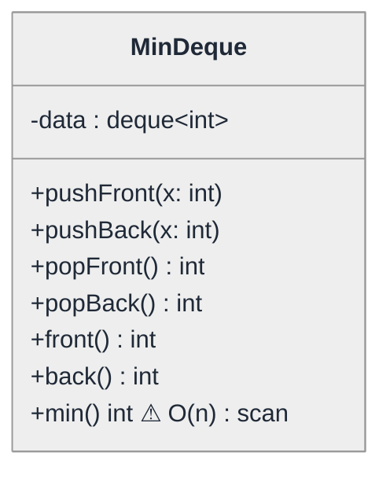
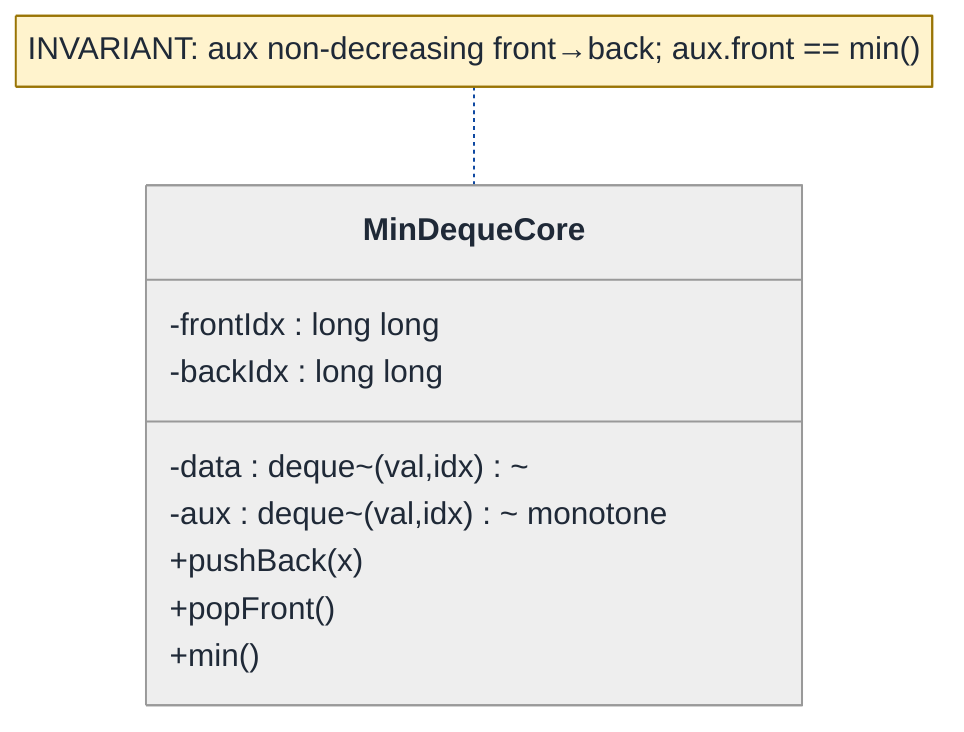
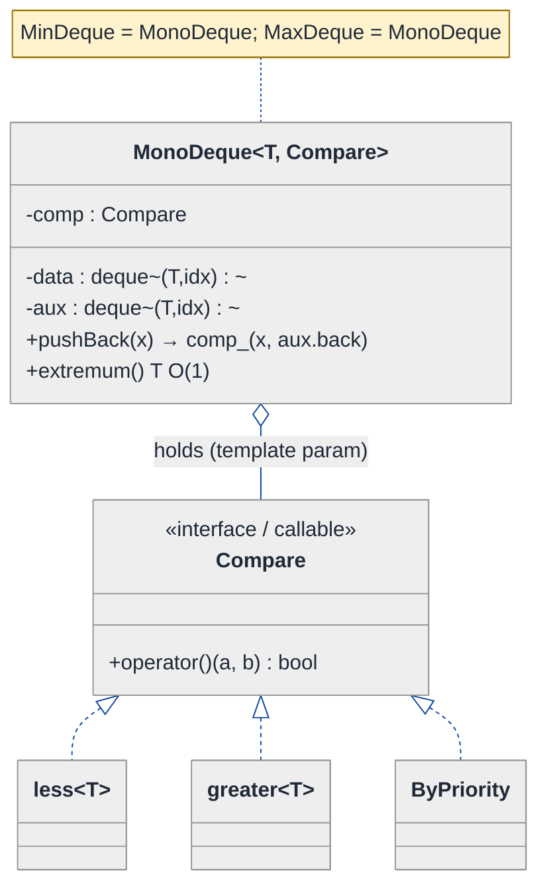
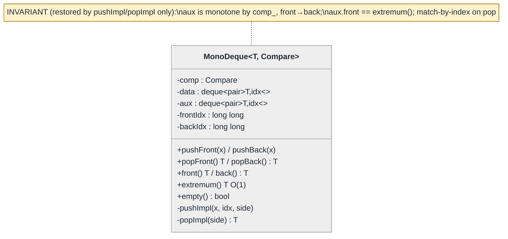
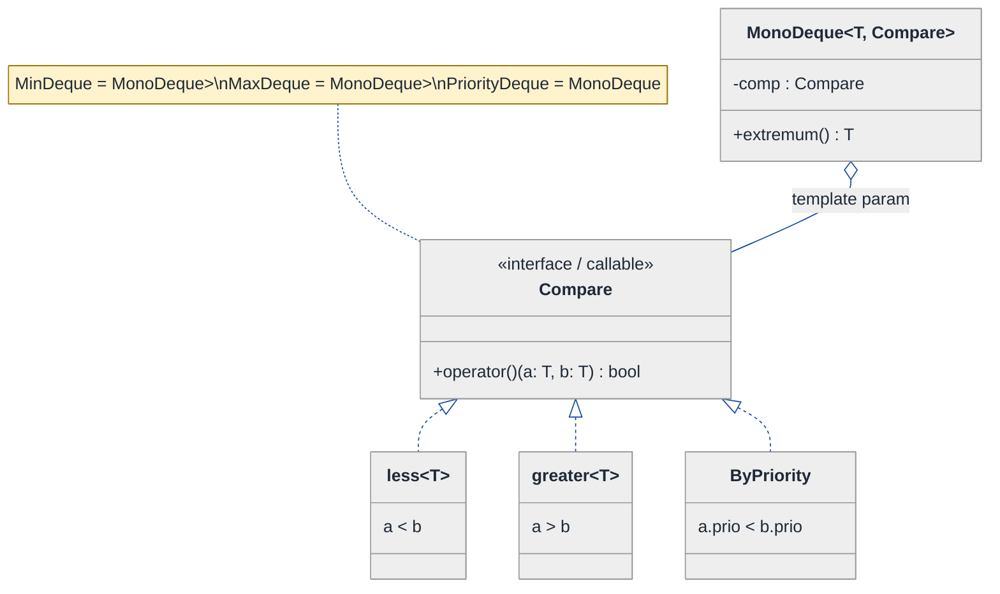
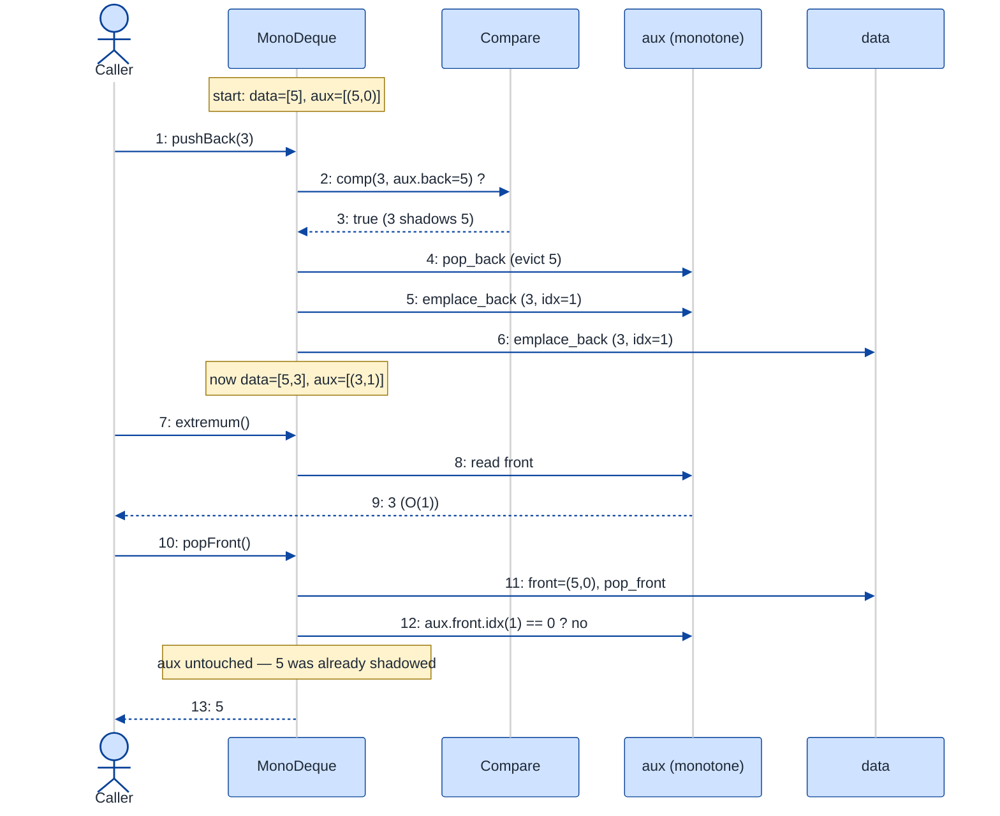

# Min Deque — LLD Walkthrough

> **Difficulty:** Medium · **Time:** ~30 min · **Pattern focus:** Monotonic deque invariant (encapsulated as an auxiliary structure) + Strategy for the comparator
>
> **Problem source(s):** GID **DS5**, bucket `LLD_DataStructures`. Representative of the "augmented data structure with an O(1) extremum query" family (Min Stack, Sliding-Window Maximum, Min Queue).
>
> **Diagrams:** inline mermaid (renders natively in GitHub / VS Code). No binary artifacts.

---

## How to use this file

Paced for a candidate who has used a deque but has never *designed* one with an O(1) `min()`. Reading time: ~30 minutes if you sketch each iteration by hand. **The lesson: the interesting work in a data-structure LLD is the INVARIANT — what must always be true between operations — and where you put the code that maintains it. We will derive a monotonic auxiliary deque by first writing the obvious slow version, watching it fail the O(1) bar, and then reaching for exactly one structural idea to fix it.**

**Map of this file (15 sections):**

1. Problem statement + clarifying questions
2. Plain-English restatement
3. Why this matters
4. Mental model
5. Try it yourself first
6. Entity & verb extraction
7. **Iteration 1: the naive design** — a deque with a linear-scan `min()`
8. **Where the naive design hurts** — four future requirements, one painful diff each
9. **Pivot 1: the monotonic auxiliary deque** — the core invariant, encapsulated
10. **Pivot 2: Strategy for the comparator** — `min` vs `max` vs custom is one axis
11. **Pivot 3: template the element type + harden the invariant** — genericity & safety
12. Final class diagram
13. Skeleton code (C++17)
14. Key flow — sequence diagram
15. Extensibility re-check + anti-patterns + how to think aloud + self-check

---

## 1. Problem statement + clarifying questions

**Prompt (typical phrasing):** "Design a Min Deque — a double-ended queue supporting push and pop at both ends, plus a `min()` that returns the smallest element currently in the deque in O(1)."

**Clarifying questions to ask BEFORE drawing anything:**

1. **Which operations exactly, and at which ends?** `pushFront` / `pushBack` / `popFront` / `popBack` all required, or only a subset? (Min Deque means all four; Min Queue would be a subset.)
2. **Amortized O(1) or strict worst-case O(1)?** A monotonic deque gives *amortized* O(1) push/pop; `min()` itself is true O(1). Is amortized acceptable, or do we need worst-case bounds (which changes the structure)?
3. **Duplicates allowed?** If two equal minimums exist and one is popped, must `min()` still return that value? (This dictates whether the invariant uses `<` or `<=`.)
4. **What should `min()` / `popFront()` do on an empty deque?** Throw, return a sentinel, or be UB the caller must guard? Same question for `front()` / `back()`.
5. **Element type?** Just `int`, or any comparable type (so we should template it)? Is the ordering always natural `<`, or could the caller want `max`, or a custom comparator?
6. **Thread safety?** Single-threaded for now, or concurrent producers/consumers? (Changes everything; we'll note it in §15 but assume single-threaded.)

**Assumptions if interviewer dodges:** all four end operations required; **amortized** O(1) push/pop and **true** O(1) `min()`; duplicates allowed and counted correctly; empty-deque queries throw `std::out_of_range`; element type is generic (templated) with a pluggable comparator defaulting to "smallest"; single-threaded.

---

## 2. Plain-English restatement

We are building a container that behaves like a normal double-ended queue — you can add and remove at both ends — but it answers one extra question instantly: "what is the current minimum?" The catch is that minimum can change every time you add or remove an element, and the prompt forbids us from scanning the whole container to recompute it. So the real design problem is: **maintain enough bookkeeping, incrementally, so that the answer is always sitting right there when asked** — and keep that bookkeeping correct across every one of the four mutation operations.

---

## 3. Why this matters

This question probes whether you can reason about an **invariant** — a property the structure guarantees between calls — and maintain it incrementally instead of recomputing. That skill is the backbone of half of all data-structure interviews (Min Stack, LRU cache, sliding-window extremum, order-statistics trees) and of real systems (rate limiters, streaming aggregates, monotonic-stack compilers). The senior signal is not "can you make `min()` O(1)" — it is "can you *prove* your invariant survives all four mutators, and can you put the invariant logic somewhere it can't be accidentally bypassed."

---

## 4. Mental model

Think of two parallel tracks. The **main track** is the real deque — every element you push lives here, in insertion order. The **shadow track** is a much shorter line of "candidates for the minimum," kept sorted so the smallest is always at one end. When you add to the main track, you discard any shadow candidates that can never again be the minimum (because the newcomer beats them and sits in front of them in queue-time). When you remove from the main track, you check whether the element leaving was *also* the current shadow leader — if so, the shadow leader steps down too.

```
Real-world sketch (NOT a UML diagram yet):

  main deque  (insertion order, both ends mutable)
  front  [ 5 ][ 3 ][ 8 ][ 3 ][ 9 ]  back

  shadow deque (a MONOTONE line of min-candidates, non-decreasing front→back)
  front  [ 3 ][ 3 ][ 9 ]  back        ← min() just reads the FRONT = 3
            └── the 5 and the 8 were "shadowed": a smaller/equal value
                arrived behind them, so they can never win again.
```

The key insight: the shadow track is **monotonic** (non-decreasing from the min-end). That single property is the whole trick. Maintaining it is the invariant; everything else is plumbing.

---

## 5. Try it yourself first

> **Predict before reading on:**
>
> 1. If the main deque is `pushBack`-ed with `5, 3, 8, 3, 9`, what does the monotone shadow line look like? Now `popFront` the `5` — does the shadow change?
> 2. **If duplicates are allowed and you must still report the right min after popping one of two equal minimums, should the shadow line evict with `<` or `<=` when a new element arrives? Pick one and justify.**
> 3. A Min Deque mutates at BOTH ends. A Min *Stack* mutates at one. Which extra piece of bookkeeping does the deque need that the stack does not?

---

## 6. Entity & verb extraction

> **Mini-refresher: noun → class, but not every noun.**
>
> Promote a noun to a class only when it owns both STATE and BEHAVIOR that belong together. In a data-structure problem most "nouns" are *fields* or *library types*; the rare promotions are the structure itself and any policy that varies (here, the comparator).

**Nouns from the prompt:**

| Noun | Decision | Why |
|---|---|---|
| MinDeque | Class (the structure) | Owns the data + the invariant; exposes the public API |
| Element / value | Templated field type `T` | No behavior of its own; it is the payload |
| Minimum | *Derived* — not stored as a standalone field | It is "the front of the shadow track," computed by the invariant |
| Main deque | Field (`std::deque<T>`) | Library container; insertion-order storage |
| Shadow / candidate line | Field (`std::deque<...>`) | The monotonic auxiliary; the heart of the design |
| Comparator / ordering | Class (Strategy) — varies | min vs max vs custom is an axis the caller picks |

**Verbs (and the class they live on):**

| Verb | Owner (naive answer — we'll re-examine) |
|---|---|
| pushFront(x) / pushBack(x) | MinDeque |
| popFront() / popBack() | MinDeque |
| front() / back() | MinDeque |
| min() | MinDeque |
| "is a < b under our ordering?" | (naive: inline `<`; later: Comparator strategy) |

**No design patterns yet.** Just nouns and verbs.

---

## 7. <a id="iter-1"></a>Iteration 1: the naive design

The simplest thing that could possibly work: store the elements in a `std::deque<int>`, and compute `min()` by scanning.



**Reader's tour (~30 seconds).**

1. **One box, one field.** `MinDeque` wraps a single `std::deque<int>` called `data`. There is no auxiliary structure and no comparator object — the ordering is a hardcoded `<` baked into `min()`.
2. **Six of the seven methods are trivial** — they forward straight to the underlying `std::deque`. `pushBack` is `data.push_back`, `popFront` is `data.pop_front`, and so on.
3. **The seventh method is the trouble.** `min()` carries a ⚠: it walks the entire `data` container with `std::min_element`. Correct, but **O(n)** — and the prompt demanded **O(1)**. This is the smell we will fix.

Skeleton code for the naive design (C++):

```cpp
#include <deque>
#include <algorithm>
#include <stdexcept>

class MinDeque {                       // naive: int-only, no patterns
public:
    void pushFront(int x) { data_.push_front(x); }
    void pushBack(int x)  { data_.push_back(x);  }

    int popFront() {
        if (data_.empty()) throw std::out_of_range("popFront on empty");
        int v = data_.front(); data_.pop_front(); return v;
    }
    int popBack() {
        if (data_.empty()) throw std::out_of_range("popBack on empty");
        int v = data_.back(); data_.pop_back(); return v;
    }

    int front() const { return data_.front(); }
    int back()  const { return data_.back();  }
    bool empty() const { return data_.empty(); }

    int min() const {                  // ⚠ O(n) — violates the spec
        if (data_.empty()) throw std::out_of_range("min on empty");
        return *std::min_element(data_.begin(), data_.end());
    }
private:
    std::deque<int> data_;
};
```

**This works.** It has zero design patterns and every operation is correct. Push, pop, peek, and yes, `min()` returns the right answer. So what's wrong with it? One thing screams immediately (the O(n) min), and three more problems are hiding.

---

## 8. <a id="naive-pain"></a>Where the naive design hurts

The interviewer slides four requirements across the desk: "Walk me through what changes."

### Change A: "`min()` must be O(1) — we call it after every operation in a hot loop"

In the naive design:
- `min()` scans all n elements every call. In a loop that pushes and queries n times, that's **O(n²)** total.
- There is no incremental state to read from — the minimum is recomputed from scratch each time.
- **This is a hard spec violation, not a nice-to-have.** Every other change below is secondary to this one.

### Change B: "We also need a Max Deque — same structure, opposite extremum"

In the naive design:
- `min()` hardcodes `<` via `std::min_element`. A Max Deque needs `>`.
- Naive fix: copy-paste the whole class into `MaxDeque` and flip one operator. **Two near-identical classes; every future bug fixed twice.**
- Or add a `bool wantMax_` flag and branch inside `min()`. **Tag-driven `if`, and the method name `min()` now lies.**

### Change C: "Store pairs `(priority, taskId)`, ordered by priority"

In the naive design:
- `data_` is `std::deque<int>`. Pairs don't fit. Re-typing to `std::deque<std::pair<int,string>>` breaks every signature.
- The comparison `<` on a pair compares lexicographically — not what we want (we want priority only).
- **The element type and the ordering are tangled together and both hardcoded.**

### Change D: "Guarantee the invariant can't be corrupted by a future maintainer"

In the naive design:
- There is no invariant to protect *yet* — but the moment we add the O(1) optimization (an auxiliary structure), a careless `pushBack` that forgets to update the auxiliary silently returns wrong answers.
- **Where does the bookkeeping live, and how do we stop any one mutator from skipping it?** The naive design has no answer because it has no bookkeeping.

### The pattern of pain

| Change | Files / methods touched | Smell |
|---|---|---|
| A. O(1) min | `min()` is fundamentally wrong shape | "No incremental state — recompute every call." |
| B. Max Deque | duplicate class or `if (wantMax)` branch | "Ordering is hardcoded into the method." |
| C. Pair payload | every signature; `data_` type | "Element type and ordering are baked in and entangled." |
| D. Invariant safety | nowhere yet — but soon everywhere | "No single place owns the correctness rule." |

**Two axes of variation dominate.** First, *how we keep the answer ready* (a structural/algorithmic axis — this is the big one). Second, *what counts as "smaller"* and *what type the elements are* (a policy/genericity axis).

> **Pivot question:** "What structure lets me read the current extremum in O(1) while still supporting removal from both ends — and where do I put the ordering rule so `min`, `max`, and custom orderings are one design, not three?"
>
> The first answer is a **monotonic auxiliary deque**. The second is **Strategy (comparator) + templates**. Let's fix the most painful axis first: the O(1) min.

---

## 9. <a id="pivot-1"></a>Pivot 1: the monotonic auxiliary deque

This is the heart of the design. We keep a *second* deque alongside the main one whose only job is to hold "candidates that could still be the minimum," maintained in **non-decreasing order from the min-end**.

> **Mini-refresher: invariant.**
>
> An *invariant* is a property your structure promises is true before and after every public operation (it may be temporarily broken *inside* a method). The design discipline is: identify the invariant, then make EVERY mutator restore it before returning. If a single mutator forgets, the structure is silently wrong.
>
> Our invariant: **the auxiliary deque is monotone non-decreasing front→back, and its front always equals `min()` of the main deque.**

> **Mini-refresher: monotonic deque.**
>
> A deque kept in sorted (here, non-decreasing) order by deliberately *discarding* elements that can never become the answer. When pushing value `x` at the back of the main deque, pop from the back of the auxiliary every candidate that is `> x` (it is now permanently shadowed by `x`), then push `x`. The front of the auxiliary is therefore always the smallest live element.

**The subtlety a Min Deque has that a Min Stack does not.** A stack only removes from one end, so a single monotone stack suffices. A deque removes from *both* ends, so when we `popFront` an element we must know whether it was the current minimum (sitting at the auxiliary's front). The clean way: the auxiliary stores **`(value, indexInMainDeque)`** so we can match a removed element to its candidate by position, instead of by value (which would be ambiguous with duplicates). We track a running `frontIndex_` / `backIndex_` cursor for the main deque.

**Why store an index, not just the value?** With duplicates, popping one `3` must not retire a *different* `3` that is still live. Index identity disambiguates. We use a virtual index space (a `long long` that only ever grows at the back and only ever shrinks at the front) so indices are stable as elements leave.

**The refactor (just the affected slice — back-side operations shown; front-side is symmetric):**

```cpp
#include <deque>
#include <utility>
#include <stdexcept>

class MinDequeCore {                       // still int-only; patterns come in Pivot 2/3
public:
    void pushBack(int x) {
        long long idx = backIdx_++;        // claim the next back index
        // INVARIANT RESTORE: drop shadowed candidates at the aux back
        while (!aux_.empty() && aux_.back().first > x)
            aux_.pop_back();
        aux_.emplace_back(x, idx);
        data_.emplace_back(x, idx);
    }

    int popFront() {
        if (data_.empty()) throw std::out_of_range("popFront on empty");
        auto [val, idx] = data_.front();
        data_.pop_front();
        // If the element leaving was the live minimum, retire it from aux too.
        if (!aux_.empty() && aux_.front().second == idx)
            aux_.pop_front();
        return val;
    }

    int min() const {                       // O(1) — just read the aux front
        if (aux_.empty()) throw std::out_of_range("min on empty");
        return aux_.front().first;
    }
    // pushFront / popBack are the mirror image (push at front side,
    // retire from aux front; pop from back, match aux back). // elided
private:
    std::deque<std::pair<int,long long>> data_;   // value + virtual index
    std::deque<std::pair<int,long long>> aux_;     // monotone non-decreasing
    long long frontIdx_ = 0;   // next index to hand out at the front (decrements)
    long long backIdx_  = 0;   // next index to hand out at the back  (increments)
};
```

> **A note on `<` vs `<=` (answers §5 prompt 2).** We evict with strict `>` on push (keep equal values), and match by **index** on pop. That combination is duplicate-safe: two equal minimums both survive in `aux_`, and popping one retires exactly the one whose index matches. Using value-matching on pop would have forced `<=` eviction and lost the ability to report the min correctly after a partial pop.

**What changed — visualized.** Just the storage slice:



**Tour of the after-state.**

1. **Two deques now, not one.** `data_` is the real storage; `aux_` is the monotone candidate line. Both store `(value, index)` pairs so a popped element can be matched to its candidate by identity, not by value.
2. **`min()` is now a single read** — `aux_.front().first`. True O(1). Change A is solved.
3. **The invariant note is attached to the class.** That note is not decoration: it is the contract every mutator must restore. `pushBack` restores it by evicting shadowed candidates; `popFront` restores it by retiring the front candidate iff its index matches.
4. **Amortized O(1) push.** Each element is pushed to `aux_` once and popped at most once, so the `while` loop's total work across n pushes is O(n) — amortized O(1) each.

**Why this beats the alternatives (pattern-discrimination, structural flavor).**

**Monotonic deque vs balanced BST / multiset.**
- *Monotonic deque:* O(1) extremum, amortized O(1) push/pop, but only the extremum is queryable — no "k-th smallest."
- *`std::multiset`:* O(log n) everything, supports order statistics and arbitrary erase.
- *Rule of thumb:* if the *only* query is the running extremum and removals follow queue/deque discipline → monotonic deque (it is strictly cheaper). If you need arbitrary-position queries or erases → multiset.

We chose the monotonic deque because the spec asks for exactly one query (`min`) under deque-discipline removals — the multiset's log factor and extra memory buy capabilities we don't need.

---

## 10. <a id="pivot-2"></a>Pivot 2: Strategy for the comparator

Change B (Max Deque) and Change C (order pairs by priority) are still open. Both are the *same* axis: **what does "smaller" mean?** In Pivot 1 we hardcoded `>` in the eviction loop and called the method `min`. That bakes the ordering into the structure.

> **Mini-refresher: Strategy pattern.**
>
> Encapsulate an algorithm behind an interface so it can be swapped without touching the code that uses it. The CALLER chooses the strategy; the user of the strategy doesn't know which concrete one it holds.
>
> Quick example: `std::sort(v.begin(), v.end(), cmp)` — `cmp` is a Strategy. `std::sort` doesn't know or care whether it's ascending, descending, or by-field; it just calls `cmp(a, b)`.

**Why Strategy fits the comparator.** "Smaller" is an algorithm (`given a, b → which wins the extremum?`). It varies (min, max, by-priority). The choice is made externally by the caller, and the structure's logic is identical regardless. That is textbook Strategy — and in C++ the idiomatic form is a comparator **type parameter** (like `std::priority_queue`'s third template argument), which is a zero-overhead, compile-time Strategy.

**The refactor (the eviction loop, now comparator-driven):**

```cpp
// Strategy as a callable. Default = "smaller wins" (a min-deque).
// The structure asks: "does the newcomer x shadow candidate c?"
//   shadow when c is NOT better-or-equal to x, i.e. when comp(x, c.value) is true.

template <class T, class Compare = std::less<T>>
class MonoDeque {
public:
    explicit MonoDeque(Compare comp = Compare{}) : comp_(std::move(comp)) {}

    void pushBack(const T& x) {
        long long idx = backIdx_++;
        // evict candidates that x now beats under the chosen ordering
        while (!aux_.empty() && comp_(x, aux_.back().first))
            aux_.pop_back();
        aux_.emplace_back(x, idx);
        data_.emplace_back(x, idx);
    }

    const T& extremum() const {            // was min(); now neutral name
        if (aux_.empty()) throw std::out_of_range("extremum on empty");
        return aux_.front().first;
    }
    // pop* and the front-side mirror elided
private:
    Compare comp_;
    std::deque<std::pair<T,long long>> data_;
    std::deque<std::pair<T,long long>> aux_;
    long long frontIdx_ = 0, backIdx_ = 0;
};

// Friendly aliases — the CALLER picks the ordering:
template <class T> using MinDeque = MonoDeque<T, std::less<T>>;     // extremum() == min
template <class T> using MaxDeque = MonoDeque<T, std::greater<T>>;  // extremum() == max
```

**What changed — visualized.**



**Tour of the after-state.**

1. **One structure, parameterized by `Compare`.** The eviction loop now calls `comp_(x, candidate)` instead of a hardcoded `>`. The structure no longer knows or cares whether it's a min-deque or a max-deque.
2. **The concrete comparators sit below the interface.** `std::less<T>` → min-deque, `std::greater<T>` → max-deque, a custom `ByPriority` functor → order pairs by priority field only (solving Change C's ordering). The caller picks one; the structure is untouched.
3. **`min()` became `extremum()`.** The neutral name stops the method from "lying" when the ordering is `greater`. The `MinDeque` / `MaxDeque` aliases give callers the friendly names back.
4. **Change B and Change C now land cleanly.** Max Deque = `MaxDeque<int>` (an alias, zero new code). Order pairs by priority = `MonoDeque<Task, ByPriority>`. No copy-paste, no `if (wantMax)`.

**Pattern-discrimination cheatsheet — Strategy vs Template Method.**
- *Strategy:* the varying algorithm is a separate object/type you compose in; the caller chooses it at construction (or compile time, via a template param).
- *Template Method:* the varying step is a virtual hook in a subclass; you choose by which subclass you instantiate, fixing it in the type hierarchy.
- *Rule of thumb:* "I want to swap the comparison without subclassing the container" → Strategy. "I have a fixed skeleton with one overridable step and inheritance is natural" → Template Method.

We chose Strategy (as a template comparator) because the ordering must vary freely without producing a subclass per ordering — and the compile-time template form costs zero runtime overhead, unlike a virtual-call comparator.

---

## 11. <a id="pivot-3"></a>Pivot 3: template the element type + harden the invariant

Change C's *type* half (store pairs, not ints) and Change D (protect the invariant) remain.

**The element type is the second half of genericity.** Pivot 2 already made the class `template <class T, class Compare>`, so `MonoDeque<Task, ByPriority>` works for any comparable payload — Change C is fully solved. The remaining concern is Change D: **stop a future mutator from silently corrupting the invariant.**

> **Mini-refresher: encapsulation as invariant protection.**
>
> Make the invariant *impossible to break from outside* by (a) keeping `data_` and `aux_` private, (b) exposing only the four mutators + read-only queries, and (c) funnelling all four mutators through a single private helper that owns the restore step. If there is exactly one place that touches `aux_`, there is exactly one place to get right.

**The hardening (funnel the invariant logic):**

```cpp
template <class T, class Compare = std::less<T>>
class MonoDeque {
public:
    void pushBack (const T& x) { pushImpl(x, backIdx_++,  Side::Back ); }
    void pushFront(const T& x) { pushImpl(x, frontIdx_--, Side::Front); }
    T    popBack ()            { return popImpl(Side::Back ); }
    T    popFront()            { return popImpl(Side::Front); }

    const T& extremum() const {
        if (aux_.empty()) throw std::out_of_range("extremum on empty");
        return aux_.front().first;        // INVARIANT guarantees this is the answer
    }
    bool empty() const { return data_.empty(); }

private:
    enum class Side { Front, Back };

    // The ONE place that restores the monotone invariant on insertion.
    void pushImpl(const T& x, long long idx, Side s) {
        auto& end = (s == Side::Back) ? auxBackEvict(x) : auxFrontEvict(x);
        (void)end;                         // (eviction done inside helpers)
        (s == Side::Back) ? data_.emplace_back(x, idx)
                          : data_.emplace_front(x, idx);
    }
    // popImpl + the two evict helpers retire the matching aux candidate by index. // elided

    Compare comp_;
    std::deque<std::pair<T,long long>> data_;
    std::deque<std::pair<T,long long>> aux_;
    long long frontIdx_ = -1, backIdx_ = 0;   // virtual index space, grows outward
};
```

> **Mini-refresher: `std::unique_ptr` (would we use it here?).**
>
> `unique_ptr` models *exclusive ownership* of a heap object and frees it automatically. We deliberately do NOT use it for `data_`/`aux_` — the elements are values living inside `std::deque`, which owns them by value (no heap indirection, better cache behavior). We'd reach for `unique_ptr` only if `T` were a polymorphic base needing heap storage. Knowing when *not* to add indirection is part of the design.

**The lesson.** Once Pivot 2 templated the comparator, templating the element `T` came for free — the same parameterization. And by routing all four mutators through one `pushImpl` / `popImpl` pair, the invariant lives in exactly two private helpers. A future maintainer adding, say, a `rotate()` operation calls those helpers and inherits correctness; they cannot accidentally touch `aux_` directly because it's private.

> **Mini-refresher: open/closed principle.**
>
> *Open for extension, closed for modification.* New orderings (extension) arrive as new comparator types — no edit to `MonoDeque`. New payload types arrive as new template instantiations — no edit. The class is closed to modification along both axes we found painful in §8.

---

## 12. <a id="fig-class-diagram"></a>Final class diagram

The whole design is small enough for two focused sub-views: the structure + its invariant, and the comparator Strategy axis.

### 12.1 The structure and its invariant



**Tour of 12.1.** One class owns everything. `data_` is insertion-order storage; `aux_` is the monotone candidate line; both hold `(value, index)`. The four public mutators are thin wrappers; the *only* code that touches `aux_` and restores the invariant lives in the two private helpers `pushImpl` / `popImpl`. The attached note is the contract — every method leaves it true on return.

### 12.2 The comparator Strategy axis



**Tour of 12.2.** The single varying axis — "what is smaller" — is lifted into the `Compare` callable. `MonoDeque` holds it as a template parameter (a compile-time Strategy: zero runtime cost). Three concrete comparators below cover min, max, and custom-field ordering. Friendly type aliases (`MinDeque`, `MaxDeque`) restore readable names without duplicating a single line of structure code.

### Structural insight (ties 12.1 + 12.2 together)

| Concern | Mechanism | Why |
|---|---|---|
| **O(1) extremum** | Monotonic auxiliary deque + match-by-index | The one structural idea that turns O(n) scan into O(1) read; survives both-ended removal |
| **Invariant safety** | Private `data_`/`aux_`, single `pushImpl`/`popImpl` funnel | Exactly one place to get right; encapsulation makes corruption impossible from outside |
| **Ordering varies** | Strategy via `Compare` template param | Min/Max/custom is the caller's choice, zero overhead, no subclass explosion |
| **Payload varies** | `template <class T>` | Any comparable type; free once the class was templated |

The big lesson: **in a data-structure LLD the "design" is the invariant and where its maintenance lives.** Get that into one encapsulated place, then let Strategy + templates absorb the orthogonal "what varies" axes.

---

## 13. Skeleton code (C++17)

> Show the SHAPES, not the full impl. ~120 lines. Back-side operations are written out; front-side mirrors them and is `// elided`.

```cpp
#include <deque>
#include <functional>
#include <stdexcept>
#include <utility>

// ── The single varying axis: "is a 'better' than b for the extremum?" ──
//   Default std::less<T> → the front of aux is the MINIMUM.
//   std::greater<T>      → the front of aux is the MAXIMUM.
//   A custom functor     → any field-based ordering.

template <class T, class Compare = std::less<T>>
class MonoDeque {
public:
    explicit MonoDeque(Compare comp = Compare{}) : comp_(std::move(comp)) {}

    // ── Public API: four mutators, three queries ──────────────────────
    void pushBack (const T& x) { pushImpl(x, backIdx_++,  Side::Back ); }
    void pushFront(const T& x) { pushImpl(x, frontIdx_--, Side::Front); }
    T    popBack ()            { return popImpl(Side::Back ); }
    T    popFront()            { return popImpl(Side::Front); }

    const T& front() const { ensureNonEmpty(); return data_.front().first; }
    const T& back()  const { ensureNonEmpty(); return data_.back().first;  }

    const T& extremum() const {            // O(1) — the whole point
        if (aux_.empty()) throw std::out_of_range("extremum on empty");
        return aux_.front().first;         // INVARIANT: this is the answer
    }
    bool   empty() const { return data_.empty(); }
    size_t size()  const { return data_.size();  }

private:
    enum class Side { Front, Back };
    using Node = std::pair<T, long long>;   // value + virtual index

    void ensureNonEmpty() const {
        if (data_.empty()) throw std::out_of_range("operation on empty deque");
    }

    // ── The ONE place that restores the monotone invariant on insert ──
    void pushImpl(const T& x, long long idx, Side s) {
        if (s == Side::Back) {
            while (!aux_.empty() && comp_(x, aux_.back().first))  aux_.pop_back();
            aux_.emplace_back(x, idx);
            data_.emplace_back(x, idx);
        } else {
            while (!aux_.empty() && comp_(x, aux_.front().first)) aux_.pop_front();
            aux_.emplace_front(x, idx);
            data_.emplace_front(x, idx);
        }
    }

    // ── The ONE place that retires the matching candidate on remove ───
    T popImpl(Side s) {
        ensureNonEmpty();
        Node n = (s == Side::Back) ? data_.back() : data_.front();
        (s == Side::Back) ? data_.pop_back() : data_.pop_front();
        // Retire from aux iff the removed element WAS the candidate at that end.
        if (s == Side::Back) {
            if (!aux_.empty() && aux_.back().second == n.second)  aux_.pop_back();
        } else {
            if (!aux_.empty() && aux_.front().second == n.second) aux_.pop_front();
        }
        return n.first;
    }

    Compare          comp_;
    std::deque<Node> data_;   // insertion-order storage
    std::deque<Node> aux_;    // monotone by comp_, front→back; aux_.front == extremum
    long long        frontIdx_ = -1;   // next front index (decrements)
    long long        backIdx_  = 0;    // next back index  (increments)
};

// ── Friendly aliases — the CALLER picks the ordering (Strategy choice) ──
template <class T> using MinDeque = MonoDeque<T, std::less<T>>;
template <class T> using MaxDeque = MonoDeque<T, std::greater<T>>;

// A custom comparator for Change C (order tasks by priority only):
struct Task { int priority; int id; };
struct ByPriority {
    bool operator()(const Task& a, const Task& b) const { return a.priority < b.priority; }
};
using PriorityDeque = MonoDeque<Task, ByPriority>;
// usage: PriorityDeque pd; pd.pushBack({3, 100}); auto top = pd.extremum();
```

Note the symmetry: `pushImpl` and `popImpl` each contain the front/back branch, so the invariant logic exists in exactly two methods. Nothing outside the class can touch `aux_`.

---

## 14. <a id="fig-sequence"></a>Key flow — sequence diagram

The moment of truth: watch the invariant get *restored* across a push that shadows candidates, and a pop that retires one.



**Tour of the flow. Read slowly — every step is invariant maintenance.**

1. **Start state** (the note): one element `5`, mirrored as `(5,0)` in `aux_`. Invariant holds: aux front `5` is the min.
2. **`pushBack(3)`** (steps 1-6). The structure asks the **Compare strategy**: does `3` beat the current aux back `5`? Yes — so `5` is permanently shadowed (any future query is satisfied by the smaller `3` that sits behind it in queue-time). Evict `5` from `aux_`, then append `(3,1)` to both `aux_` and `data_`.
3. **Invariant restored** (note after step 6): `data_=[5,3]`, `aux_=[(3,1)]`. The `5` still lives in `data_` (it hasn't left the deque) but is gone from `aux_` because it can never win again.
4. **`extremum()`** (steps 7-9) is a single front read: `3`. **True O(1)** — no scan, no comparison, just a memory read. This is the payoff for all the push-time work.
5. **`popFront()`** (steps 10-13). The departing element is `(5,0)`. We check: is it the current aux candidate? `aux_.front().second` is `1`, the popped index is `0` — **no match**, so `aux_` is left untouched. The `5` was already evicted at push time, so removing it costs nothing. We return `5`.
6. **The match-by-index check (step 12) is the deque-specific subtlety.** Had we popped the `3` instead, indices would match and `aux_` would retire its front — handing the next candidate the crown. This index check is exactly what a Min *Stack* doesn't need.

### The work that's NOT shown — and why it matters

You never see a loop over `data_` to find the minimum. That loop simply doesn't exist in this design — it was *paid forward* at push time, a little at a time, by evicting shadowed candidates. The amortized cost is O(1) per push because each element enters `aux_` once and leaves once. **The invariant turned a repeated O(n) query into a one-time O(1) read.**

---

## 15. Extensibility re-check + anti-patterns + how to think aloud + self-check

### Extensibility re-check

Revisit the four changes from [§8](#naive-pain). For each, name the single thing that changes.

| Change | Naive design impact | Final design impact |
|---|---|---|
| A. O(1) min | `min()` is O(n), fundamentally wrong | Built in: `extremum()` reads `aux_.front()`. O(1). Done. |
| B. Max Deque | duplicate class or `if (wantMax)` | `MaxDeque<T>` = `MonoDeque<T, greater<T>>` alias. Zero new code. |
| C. Pair payload | every signature breaks | `MonoDeque<Task, ByPriority>` — one comparator struct. Done. |
| D. Invariant safety | nowhere to enforce it | All `aux_` writes funnel through `pushImpl`/`popImpl`; `aux_` is private. Done. |

Every change is an alias, a small comparator type, or already built in. That is the open/closed principle for a data structure.

If a future requirement forces you to edit `pushImpl`, `popImpl`, AND `extremum()` together — you have found a *new* invariant the current one doesn't cover; re-derive it before patching.

### Common confusion + traps

1. **"Why two deques? Isn't that double the memory?"** `aux_` holds at most as many elements as `data_`, and usually far fewer (shadowed elements are evicted). The space is O(n) either way; the constant buys O(1) queries.
2. **"Why store an index instead of just the value in `aux_`?"** Duplicates. Popping one of two equal minimums must retire *that* one, not its twin. Index identity disambiguates; value-matching can't.
3. **"Is push really O(1)? There's a `while` loop."** Amortized O(1): each element is evicted at most once over its lifetime, so total eviction work across n pushes is O(n).
4. **"Can I use `std::priority_queue` instead?"** No — a priority queue can't remove from a specific end in O(1) and doesn't preserve deque order. Wrong tool for both-ended removal.
5. **"Should `extremum()` return by value or reference?"** Const reference avoids a copy for heavy `T`, but the caller must not hold it across a mutation (the element may be evicted). Document that, or return by value for safety.

### Anti-patterns

- **"Recompute-on-query"** — scanning `data_` inside `min()`. The whole point is to NOT do this; maintain incrementally.
- **"Public auxiliary"** — exposing `aux_` (or a `getAux()`). Any external write breaks the invariant silently. Keep it private.
- **"Scattered invariant"** — restoring the monotone property in four separate mutators copy-pasted. One funnel (`pushImpl`/`popImpl`), tested once.
- **"`min()` that lies"** — keeping the name `min()` while the comparator is `greater`. Use a neutral `extremum()` + friendly aliases.
- **"Value-match on pop"** — retiring an aux candidate by comparing values instead of indices. Breaks on duplicates.
- **"Premature thread safety"** — bolting a mutex onto every method before the spec asks for concurrency. Note it (§ below) and defer.

### How to think aloud

> "Min Deque. Let me clarify: all four end operations? Amortized or worst-case O(1)? Duplicates? Empty-query behavior? Templated element + custom ordering? [Asks §1.] Assume amortized push/pop, true O(1) min, duplicates allowed, throw on empty, templated with a comparator.
>
> Naive first: a `std::deque<int>` and a `min()` that scans. Correct, but O(n) per query — that violates the spec, so it's my brute force, not my answer.
>
> Stress it. (A) O(1) min — no incremental state. (B) Max deque — ordering is hardcoded. (C) pair payload — type and ordering entangled and baked in. (D) once I add bookkeeping, what stops a mutator from corrupting it?
>
> Pivot 1, the big one: a monotonic auxiliary deque. On push, evict every aux candidate the newcomer beats, then append; `min()` is just the aux front — O(1). Because a deque removes from both ends, I store `(value, index)` and match by index on pop so duplicates are handled. Invariant: aux is monotone, its front is the extremum.
>
> Pivot 2: 'what is smaller' is one axis. Make it a comparator template parameter — a compile-time Strategy. `MinDeque<T>`=less, `MaxDeque<T>`=greater, custom functor for by-field. Rename `min()` to `extremum()` so it doesn't lie.
>
> Pivot 3: templating `T` came free with the comparator, so pairs work. Then I funnel all four mutators through one `pushImpl`/`popImpl` pair and keep `aux_` private — the invariant lives in exactly one place and can't be bypassed.
>
> Final: one templated class, comparator Strategy, invariant encapsulated. All four future changes become an alias or a tiny comparator. Open/closed."

### Self-check

> **Self-check — the question to ask next time.**
>
> When you see "design a [structure] that answers [some aggregate query] fast," before reaching for a fresh scan, ask:
>
> > **"What INVARIANT, maintained incrementally by every mutator, would make this query a single read — and where can I put that maintenance so no operation can skip it?"**
>
> Extremum under deque/queue discipline → monotonic auxiliary. Running sum / count → a cached accumulator. Order statistics → a balanced tree. The query dictates the invariant; encapsulation protects it.

---

## Cross-references

- **Parent topic manifest:** [`./EXTRACTED_QUESTIONS.md`](./EXTRACTED_QUESTIONS.md)
- **Vertical overview:** [`../../LEARNING.md`](../../LEARNING.md)
- **Template:** [`../../TEMPLATE-v2.md`](../../TEMPLATE-v2.md)
- **Canonical exemplar:** [`../Object_Oriented_Design/Parking_Lot.md`](../Object_Oriented_Design/Parking_Lot.md)
- **Related LLD walkthroughs:**
  - LRU Cache (sibling in `./LRU_Cache.md`) — another invariant-driven augmented structure (hash map + intrusive list)
  - Strategy Pattern deep-dive (in `../Strategy_Pattern/`) — the comparator axis here, generalized
  - Iterator Pattern (in `../Iterator_Pattern/`) — exposing traversal over a structure like this one
- **Algorithmic cousin (DSA vertical):** Sliding-Window Maximum — the same monotonic-deque invariant applied to a fixed-width window.
