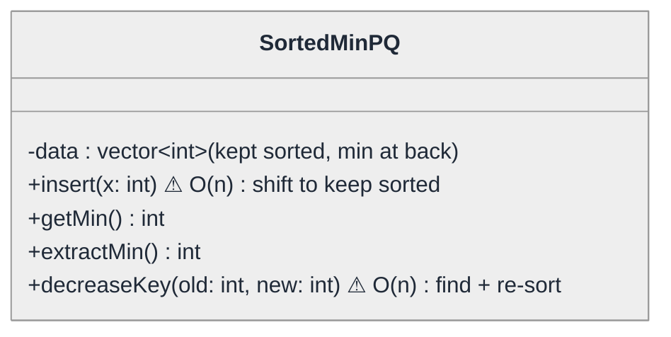
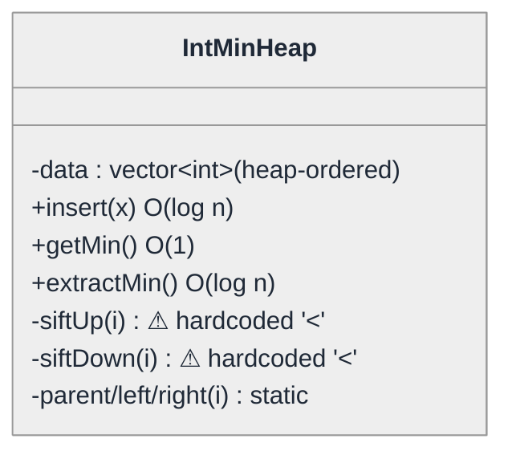
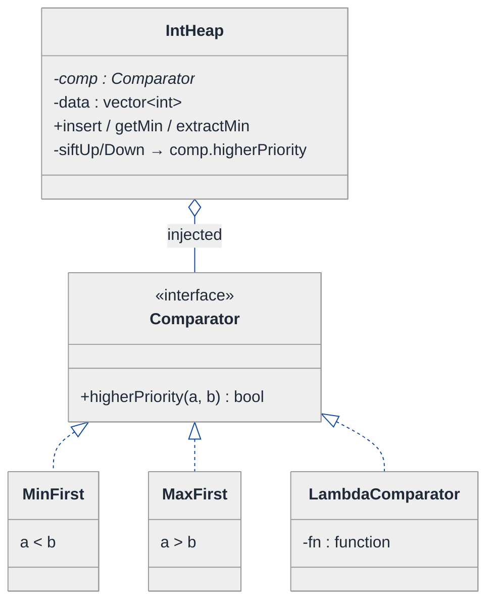
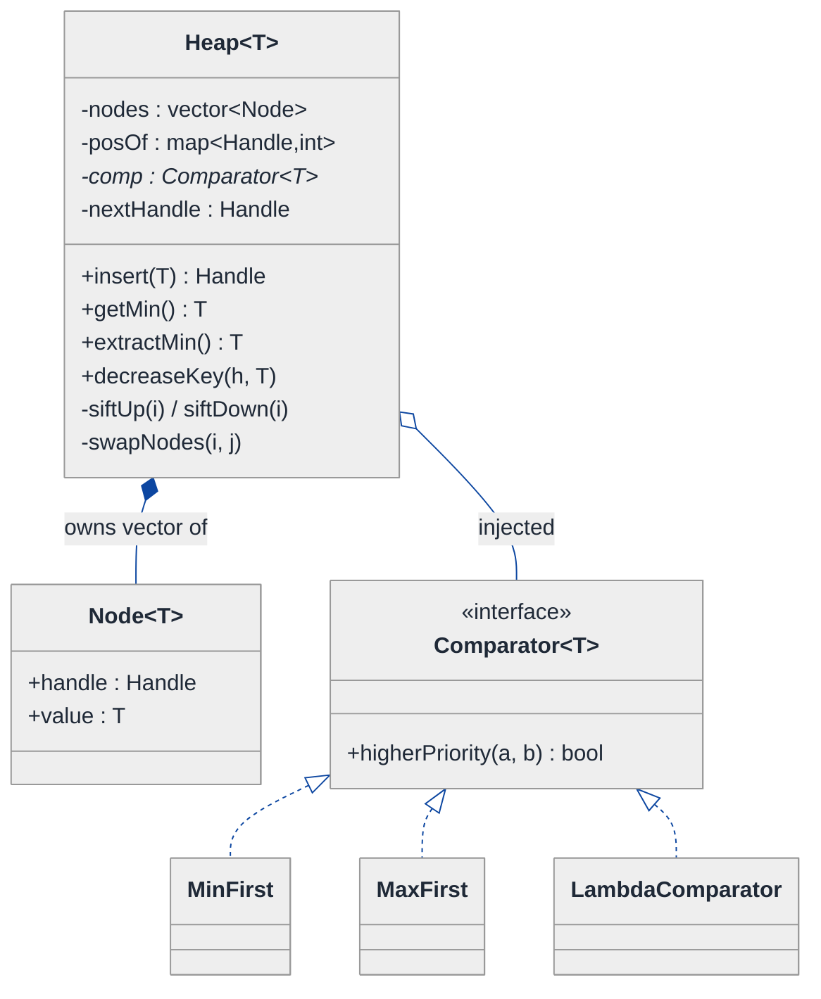
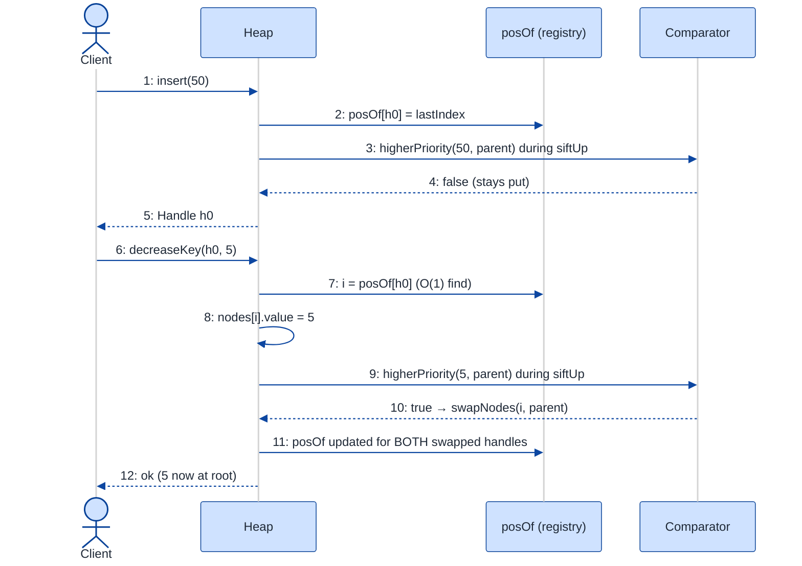

# Min Heap (Binary Heap) — LLD Walkthrough

> **Difficulty:** Medium · **Time:** ~30 min · **Pattern focus:** Binary heap from scratch + Strategy (comparator) + an index registry for O(log n) `decreaseKey`
>
> **Problem source(s):** GID DS6 in [`./EXTRACTED_QUESTIONS.md`](./EXTRACTED_QUESTIONS.md), bucket `LLD_DataStructures`. The canonical "implement a priority queue from scratch" question.
>
> **Diagrams:** inline mermaid (renders natively in GitHub / VS Code). No external image artifacts.

---

## How to use this file

Paced for a candidate who has *used* `std::priority_queue` but never *built* one. Reading time: ~30 minutes if you sketch the array-as-tree mapping by hand. **The lesson: a heap is not an algorithm question dressed as a class — it is an INVARIANT-MAINTENANCE problem. The hard part of LLD here is not the swim-up/swim-down code, it is deciding which axes vary (the ordering, the element type, the position lookup for `decreaseKey`) and encapsulating each so the invariant can never be violated from outside.**

**Map of this file (15 sections):**

1. Problem statement + clarifying questions
2. Plain-English restatement
3. Why this matters
4. Mental model
5. Try it yourself first
6. Entity & verb extraction
7. **Iteration 1: the naive design** — a class wrapping a sorted vector
8. **Where the naive design hurts** — four future requirements, one painful diff each
9. **Pivot 1: the array-as-tree + sift, encapsulating the invariant** — the most painful axis first
10. **Pivot 2: Strategy for the ordering** — Min vs Max vs custom, picked by the caller
11. **Pivot 3: an index registry + templating** — making `decreaseKey` O(log n) and the heap generic
12. Final UML class diagram
13. Skeleton code (C++17)
14. Key flow — sequence diagram
15. Extensibility re-check + anti-patterns + how to think aloud + self-check

---

## 1. Problem statement + clarifying questions

**Prompt (typical phrasing):** "Design a Min Heap (binary heap) from scratch supporting `insert`, `getMin`, `extractMin`, and `decreaseKey`, used as a Min Priority Queue."

**Clarifying questions to ask BEFORE writing anything:**

1. **What is an "element"?** Plain `int`, or `(key, payload)` pairs (e.g., Dijkstra's `(distance, node)`)? This decides whether we template the class.
2. **Min-only, or should the ordering be configurable?** Will the same code ever need to be a max-heap or order by a custom comparator (e.g., by task priority then by insertion time)?
3. **`decreaseKey` semantics — addressed how?** `decreaseKey` needs to find an existing element. By value? By an opaque handle returned at insert time? By a caller-supplied key? This is the single biggest design fork.
4. **Duplicate keys allowed?** If two elements compare equal, does `decreaseKey(value)` target an arbitrary one or is each element uniquely identified?
5. **Fixed capacity or dynamically growing?** Pre-sized array (like a scheduler with N tasks) or unbounded?
6. **Thread safety?** Single-threaded data structure, or concurrent producers/consumers?
7. **Error contract?** What does `getMin()` on an empty heap do — throw, return `optional`, or undefined behavior?

**Assumptions if the interviewer dodges:** elements are `(key, payload)` pairs; ordering must be configurable (default min); `decreaseKey` addresses an element via a stable handle returned at `insert` time; duplicates allowed; dynamically growing; single-threaded (concurrency discussed in §15); empty-heap access throws.

---

## 2. Plain-English restatement

We're building a container that always knows its smallest element and can hand it over in logarithmic time, while still allowing fast inserts and the ability to *lower* an element's key after it's already inside (that's `decreaseKey` — the operation Dijkstra and Prim lean on). The catch is the **heap invariant**: every parent must be `<=` its children. Every public operation must leave that invariant intact, and no caller should ever be able to reach in and break it. The design must let us swap the ordering rule (min/max/custom) and the element type without rewriting the sift logic.

---

## 3. Why this matters

This question probes whether you understand that a data structure is an **invariant plus the operations that preserve it** — not just an array with some methods bolted on. The senior signal is encapsulation: keeping the backing array private so the heap property can't be corrupted, and recognizing that `decreaseKey` is the operation that forces a real design decision (you need a position lookup). It reappears everywhere — schedulers, Dijkstra/Prim, median-of-stream, rate limiters, event-loop timer queues. Get the heap right and a dozen downstream systems get cheaper.

---

## 4. Mental model

A binary heap is a **complete binary tree** flattened into a plain array. "Complete" means every level is full except possibly the last, which fills left to right — and *that* is what lets us skip pointers entirely: a node at index `i` has its parent at `(i-1)/2` and children at `2i+1` and `2i+2`. The tree is a fiction we maintain over a contiguous array.

```
Real-world sketch (NOT a UML diagram yet):

        the LOGICAL tree                  the PHYSICAL array
              (2)                          index: 0  1  2  3  4  5
             /   \                         value: 2  5  3  8  9  7
          (5)     (3)                                ^parent of idx 3,4
          / \     /
       (8) (9) (7)                  parent(i) = (i-1)/2
                                    left(i)   = 2i+1
   invariant: parent <= children    right(i)  = 2i+2
```

The KEY insight from this picture: there is no tree object, no `Node` with pointers. The "shape" is implied by arithmetic on array indices, and the "order" is the invariant `parent <= child`. Two separate concerns — *shape* (kept correct by always inserting/removing at the array's end) and *order* (kept correct by sifting). Our design must protect both.

---

## 5. Try it yourself first

> **Predict before reading on:**
>
> 1. If you store the heap as a sorted `vector`, which of `insert / getMin / extractMin` is fast and which is slow? Now flip it: store it *unsorted*. Which flips?
> 2. **`decreaseKey(x, newKey)` has to FIND `x` first. In a bare array, that's an O(n) scan. What auxiliary structure turns that into O(1)?** (This is the crux of the whole design.)
> 3. If the interviewer says "now make it a max-heap, and also order tasks by `(priority, timestamp)`," what part of your code do you NOT want to be editing by hand?

---

## 6. Entity & verb extraction

> **Mini-refresher: noun → class, but not every noun.**
>
> Naive OOD promotes every noun to a class. Senior OOD promotes a noun only if it owns both STATE and the BEHAVIOR that guards it. "Index" stays an `int`; "the heap" becomes a class because it owns an invariant that behavior must protect.

**Nouns from the prompt:**

| Noun | Decision | Why |
|---|---|---|
| Heap / PriorityQueue | Class (the container) | Owns the array + the invariant + all operations |
| Element / (key, payload) | Type parameter `T` (eventually) | The thing stored; varies per use |
| Ordering rule (min/max/custom) | Strategy object (eventually) | An axis that varies independently of the heap |
| Handle | Small value type (eventually) | A stable address into the heap so `decreaseKey` can find an element |
| Index, parent, child | `int` arithmetic, NOT classes | No behavior or state of their own |
| Capacity / size | Fields on Heap | Just numbers |

**Verbs (and the class they live on):**

| Verb | Owner (naive answer — we'll re-examine) |
|---|---|
| insert(x) | Heap |
| getMin() | Heap |
| extractMin() | Heap |
| decreaseKey(handle, newKey) | Heap |
| siftUp(i) / siftDown(i) | Heap (private — the invariant guards) |
| less(a, b) | Heap (hardcoded `<` for now) |

**We have NOT introduced any design patterns yet.** Pure nouns + verbs.

---

## 7. <a id="iter-1"></a>Iteration 1: the naive design

Let's write the simplest thing a beginner reaches for: "a priority queue is a collection where I always grab the smallest — so keep it sorted." A class wrapping a sorted `vector<int>`, smallest at the back so removal is cheap.



**Reader's tour (~45 seconds).**

1. **One class, one field.** `SortedMinPQ` wraps a `vector<int>` it keeps sorted in DESCENDING order, so the minimum sits at the back where `pop_back()` is cheap.

2. **`getMin` and `extractMin` are genuinely fast** — `data.back()` and `pop_back()`, both O(1). So far so good; this is why a beginner finds the sorted approach seductive.

3. **The two warning markers (⚠) are where it rots.**
   - `insert(x)` must find x's sorted position and shift everything after it — O(n) per insert. Build a heap of n items: O(n²).
   - `decreaseKey(old, new)` must scan to find `old` (O(n)), change it, then re-establish sorted order (another O(n) shift).

4. **The element type is nailed to `int`.** A Dijkstra `(dist, node)` pair has nowhere to go.

5. **The ordering is nailed to "ascending by value."** Want a max-heap? Rewrite the comparisons.

Skeleton code for the naive design (C++):

```cpp
#include <algorithm>
#include <stdexcept>
#include <vector>

class SortedMinPQ {
public:
    void insert(int x) {                       // O(n): keep data sorted DESC (min at back)
        auto pos = std::lower_bound(data_.begin(), data_.end(), x,
                                    std::greater<int>{});
        data_.insert(pos, x);                  // vector::insert shifts the tail — O(n)
    }

    int getMin() const {                       // O(1)
        if (data_.empty()) throw std::runtime_error("empty");
        return data_.back();
    }

    int extractMin() {                         // O(1)
        if (data_.empty()) throw std::runtime_error("empty");
        int m = data_.back();
        data_.pop_back();
        return m;
    }

    void decreaseKey(int oldVal, int newVal) { // O(n): find, erase, re-insert
        auto it = std::find(data_.begin(), data_.end(), oldVal);
        if (it == data_.end()) throw std::runtime_error("not found");
        data_.erase(it);                       // O(n) shift
        insert(newVal);                        // another O(n)
    }

private:
    std::vector<int> data_;                    // sorted DESC; min at back
};
```

**This works.** It compiles, it answers `getMin` in O(1), and it has zero design patterns. So what's wrong with it? Two things hide in plain sight: the *performance* is wrong for the workload a priority queue is built for, and the *shape* of the class resists every realistic extension. §8 makes both concrete.

---

## 8. <a id="naive-pain"></a>Where the naive design hurts

The interviewer slides four upcoming requirements across the desk: "Walk me through what changes for each."

### Change A: "We're using this in Dijkstra — millions of inserts and extract-mins interleaved"

In the naive design:
- Every `insert` is O(n) because of the vector shift. A run of `n` inserts is O(n²).
- **The performance contract a priority queue is supposed to offer (O(log n) insert) is simply absent.** This isn't a "touch a few files" change — the entire storage strategy is wrong.
- Smell: **the data structure does not deliver the asymptotic guarantees its name implies.**

### Change B: "decreaseKey is now on the hot path — Dijkstra calls it once per relaxed edge"

In the naive design:
- `decreaseKey` is O(n): a linear scan to FIND the element, then an O(n) re-sort.
- With E edges, that's O(E·n) just in heap maintenance — worse than the graph traversal itself.
- Smell: **`decreaseKey` has no way to locate an element except scanning.** There's no "address" of an element inside the structure.

### Change C: "Make it a max-heap for one feature, and order tasks by (priority, then arrival time) for another"

In the naive design:
- The comparison `std::greater<int>{}` is hardcoded inside `insert`. A max-heap means rewriting it.
- A `(priority, timestamp)` ordering can't even be expressed — the element is an `int`.
- **You'd copy-paste the whole class into `SortedMaxPQ`, then again into `SortedTaskPQ`.** Three near-identical classes.
- Smell: **the ordering rule is fused into the operations.**

### Change D: "Store (key, payload) pairs, not bare ints — we need the node ID alongside the distance"

In the naive design:
- `vector<int>` becomes `vector<pair<int,int>>`, and now every comparison, every `find`, every method signature changes.
- Smell: **the element type is hardcoded; genericity was never designed in.**

### The pattern of pain

| Change | What breaks | Smell |
|---|---|---|
| A. Dijkstra workload | `insert` is O(n) | "Storage strategy gives wrong asymptotics." |
| B. Hot `decreaseKey` | O(n) find | "No addressable position for an element." |
| C. Max / custom order | hardcoded `std::greater` | "Ordering rule fused into operations." |
| D. (key, payload) | `vector<int>` everywhere | "Element type hardcoded." |

**Three axes of variability dominate:** the **storage strategy** (sorted array is the wrong shape), the **ordering rule** (min/max/custom), and the **element type** (int vs pair vs struct). Plus one missing capability: an **addressable position** so `decreaseKey` is fast.

> **Pivot question:** "What storage gives O(log n) insert AND extract while keeping getMin O(1)? Once we have that, how do we (1) let the caller pick the ordering without editing the operations, and (2) find an element in O(1) so `decreaseKey` is O(log n)?"
>
> The answers are: a binary heap (array-as-tree + sift), the Strategy pattern for ordering, and an index registry for addressing. We introduce them one at a time, starting with the most painful axis: storage.

---

## 9. <a id="pivot-1"></a>Pivot 1: the array-as-tree + sift, encapsulating the invariant

The most painful axis is storage. The fix is the actual binary-heap trick from §4: **stop keeping the array fully sorted; keep only the weaker heap invariant (`parent <= children`)**, which is cheap to restore after a single insert or removal.

> **Mini-refresher: encapsulated invariant.**
>
> An invariant is a property that must hold *between* every public operation (here: `parent <= child` for all nodes). You protect it by making the backing storage PRIVATE and routing every mutation through methods that restore the invariant before they return. No caller can hand you an array that violates it, because no caller can touch the array. The private `siftUp` / `siftDown` helpers are the invariant's enforcement arm.

**Why this is the right move.** A *fully* sorted array is a stronger property than we need and expensive to maintain. The heap invariant is *just enough* to make `getMin` O(1) (the min is always at index 0) while letting `insert` and `extractMin` repair the structure by walking a single root-to-leaf path — O(log n).

- **insert:** append at the end (preserves *shape*), then `siftUp` — bubble the new value toward the root while it's smaller than its parent.
- **extractMin:** swap root with the last element, `pop_back` (preserves *shape*), then `siftDown` the new root — sink it while it's larger than its smaller child.

**The refactor (just the storage + sift slice):**

```cpp
class IntMinHeap {
public:
    void insert(int x) {
        data_.push_back(x);          // keep the tree COMPLETE (shape invariant)
        siftUp(data_.size() - 1);    // restore ORDER invariant — O(log n)
    }

    int getMin() const {
        if (data_.empty()) throw std::runtime_error("empty");
        return data_[0];             // root is always the min — O(1)
    }

    int extractMin() {
        if (data_.empty()) throw std::runtime_error("empty");
        int m = data_[0];
        data_[0] = data_.back();     // move last element to root
        data_.pop_back();            // shrink — shape preserved
        if (!data_.empty()) siftDown(0);  // restore order — O(log n)
        return m;
    }

private:
    static int parent(int i) { return (i - 1) / 2; }
    static int left(int i)   { return 2 * i + 1; }
    static int right(int i)  { return 2 * i + 2; }

    void siftUp(int i) {
        while (i > 0 && data_[i] < data_[parent(i)]) {  // hardcoded '<' — still a smell
            std::swap(data_[i], data_[parent(i)]);
            i = parent(i);
        }
    }
    void siftDown(int i) {
        int n = data_.size();
        while (true) {
            int smallest = i, l = left(i), r = right(i);
            if (l < n && data_[l] < data_[smallest]) smallest = l;
            if (r < n && data_[r] < data_[smallest]) smallest = r;
            if (smallest == i) break;
            std::swap(data_[i], data_[smallest]);
            i = smallest;
        }
    }
    std::vector<int> data_;          // heap-ordered, NOT fully sorted
};
```

**What changed — visualized.** The storage slice:



**Tour of the after-state.**

1. **The field still exists, but its contract changed.** `data_` is no longer *sorted*; it's *heap-ordered*. Weaker property, far cheaper to maintain.

2. **Three private static helpers — `parent`, `left`, `right` — encode the tree-over-array fiction.** No `Node`, no pointers. Pure index arithmetic.

3. **`siftUp` and `siftDown` are PRIVATE.** They're the invariant's enforcement arm. The caller can never call them at the wrong time, and can never see a half-repaired heap.

4. **The asymptotics are now correct.** insert O(log n), extractMin O(log n), getMin O(1). Change A from §8 is solved — Dijkstra's interleaved insert/extract is now O(log n) each.

5. **But two warning markers remain.** `siftUp`/`siftDown` still hardcode `<`. That's Change C's pain (ordering fused into operations), untouched. And we haven't addressed `decreaseKey`'s O(n) find (Change B) or the `int` lock-in (Change D). Those are the next two pivots.

**Pattern-discrimination cheatsheet — heap vs balanced BST.**
- *Binary heap:* maintains the *partial* order "parent ≤ child." getMin O(1), insert/extractMin O(log n), but NO efficient ordered traversal or `find(x)`.
- *Balanced BST (e.g., `std::set`):* maintains *total* order. find/min/insert all O(log n); supports in-order traversal.
- *Rule of thumb:* if you only ever need the extreme element (min OR max) plus inserts → heap (less memory, better constants). If you need ordered iteration or arbitrary `find` → BST.

We chose a heap because the operation set (`getMin`/`extractMin`/`insert`) only ever touches the extreme — paying for a fully-ordered BST would be over-engineering.

---

## 10. <a id="pivot-2"></a>Pivot 2: Strategy for the ordering

Change C from §8 is still painful: `siftUp`/`siftDown` hardcode `<`, so a max-heap or a `(priority, timestamp)` ordering means rewriting the operations or copy-pasting the class. The variability here is **the comparison itself** — an algorithm, picked by the caller. That's textbook Strategy.

> **Mini-refresher: Strategy pattern.**
>
> Encapsulates an algorithm behind an interface so it can be swapped at runtime. The CALLER decides which strategy to use; the strategy doesn't know about its peers, and the context (here, the heap) treats every strategy identically.
>
> Quick example: a `Sorter` takes a `CompareStrategy*` in its constructor. Pass `Ascending` or `Descending` — the sorter never branches on which one it got.

**Why Strategy fits ordering.** "Which element is higher-priority" is a pure function `(a, b) -> bool`. It varies (min, max, by-field, by-tuple), the choice is made externally by the caller's use case, and the heap's sift logic shouldn't care which one it holds. We define the heap purely in terms of `comp(a, b)` meaning "a should sit ABOVE b." The whole class becomes a *priority* heap; min-ness is just one strategy.

**The refactor (the comparison slice):**

```cpp
class Comparator {                       // Strategy interface
public:
    virtual ~Comparator() = default;
    // returns true if 'a' has higher priority than 'b' (a should sit closer to root)
    virtual bool higherPriority(int a, int b) const = 0;
};

class MinFirst : public Comparator {     // smaller value = higher priority → min-heap
public:
    bool higherPriority(int a, int b) const override { return a < b; }
};

class MaxFirst : public Comparator {     // larger value = higher priority → max-heap
public:
    bool higherPriority(int a, int b) const override { return a > b; }
};
// LambdaComparator wrapping a std::function elided — same shape

class IntHeap {
public:
    explicit IntHeap(std::unique_ptr<Comparator> comp)   // INJECTED at construction
        : comp_(std::move(comp)) {}
    // insert / getMin / extractMin unchanged in SHAPE; only the comparison swaps:
private:
    void siftUp(int i) {
        while (i > 0 && comp_->higherPriority(data_[i], data_[parent(i)])) {
            std::swap(data_[i], data_[parent(i)]);
            i = parent(i);
        }
    }
    // siftDown: pick the child with higherPriority over its sibling, then over i — elided
    std::unique_ptr<Comparator> comp_;   // the ONLY thing min/max/custom heaps differ by
    std::vector<int>            data_;
};
```

**What changed — visualized.** The ordering slice:



**Tour of the after-state.**

1. **The heap gained one injected field.** `comp_` is a `unique_ptr<Comparator>` passed at construction. The open diamond (`◇`) is aggregation — the heap uses the comparator. (It happens to own it via `unique_ptr` here, but conceptually the *role* is "policy I was handed.")

2. **`siftUp`/`siftDown` lost their hardcoded `<`.** Every comparison now reads `comp_->higherPriority(a, b)`. The sift code is identical for a min-heap, a max-heap, or a custom one — only the injected object differs.

3. **Three concrete strategies.** `MinFirst` (`a < b`), `MaxFirst` (`a > b`), and `LambdaComparator` wrapping a `std::function` so the caller can pass `(priority, timestamp)` ordering inline. Change C from §8 is now ONE new strategy class, never a heap rewrite.

4. **The class renamed itself in spirit.** It's no longer a "min heap" — it's a *priority* heap. "Min" is the default strategy. This is the reframing the prompt's phrase "used as a Min Priority Queue" was hinting at.

**Pattern-discrimination cheatsheet — Strategy vs Template Method (for the comparison).**
- *Strategy:* the comparison is a separate object, injected at runtime; swap it without touching the heap. Composes (you can wrap one comparator in another).
- *Template Method:* you'd make `Heap` abstract with a protected virtual `higherPriority`, and subclass `MinHeap`/`MaxHeap` to override it.
- *Rule of thumb:* if the variant should be chosen at *runtime* by the caller (and a single heap class serves all orderings) → Strategy. If the ordering is fixed per-subclass at *compile time* and you're fine with `MinHeap`/`MaxHeap` types → Template Method.

We chose Strategy because the caller picks the ordering at runtime (sometimes from config) and we want exactly ONE heap class, not a subclass per ordering.

---

## 11. <a id="pivot-3"></a>Pivot 3: an index registry for O(log n) decreaseKey + templating the element

Two pains remain: Change B (`decreaseKey` is O(n) because it must scan to find the element) and Change D (the element type is hardcoded to `int`).

### 11a. The index registry — making decreaseKey fast

`decreaseKey` is the operation that *forces* a real design decision. To lower an element's key, you must first FIND it, then `siftUp` from its position. The find is the problem: a bare array offers nothing better than a linear scan.

> **Mini-refresher: an index registry (positions map).**
>
> Keep an auxiliary `unordered_map<Handle, int>` that maps each element's stable identity to its CURRENT index in the array. Now `find` is O(1). The catch: **every swap inside `siftUp`/`siftDown` must update the map** — otherwise it goes stale and silently corrupts the heap. So we funnel all swaps through one private `swapNodes(i, j)` helper that swaps in the array AND updates the map together. One choke point, one place to get it right.

So `decreaseKey(handle, newKey)` becomes: look up `pos = posOf_[handle]` (O(1)), lower the key at `pos`, then `siftUp(pos)` (O(log n)). Total O(log n). Because we only ever DECREASE the key in a min-heap, the element can only move UP — a `siftUp` alone suffices (no `siftDown` needed). The handle is the stable identity returned by `insert`.

### 11b. Templating the element

Change D wants `(key, payload)` pairs, not bare ints. The element type is an axis of variation orthogonal to ordering and storage — so make the class a template `Heap<T>`. The Comparator becomes `Comparator<T>`. The sift logic, the registry, and the operations are byte-for-byte identical; only the stored type changes. C++ templates are the language-native way to vary the type without runtime cost.

```cpp
template <typename T>
class Heap {
public:
    using Handle = std::size_t;          // stable id handed back at insert time

    explicit Heap(std::unique_ptr<Comparator<T>> comp) : comp_(std::move(comp)) {}

    Handle insert(T value) {
        Handle h = nextHandle_++;
        int idx = static_cast<int>(nodes_.size());
        nodes_.push_back({h, std::move(value)});
        posOf_[h] = idx;                 // register position
        siftUp(idx);
        return h;                        // caller keeps this to call decreaseKey later
    }

    const T& getMin() const {
        if (nodes_.empty()) throw std::runtime_error("empty");
        return nodes_[0].value;
    }

    T extractMin() {
        if (nodes_.empty()) throw std::runtime_error("empty");
        T result = std::move(nodes_[0].value);
        Handle goneHandle = nodes_[0].handle;
        swapNodes(0, static_cast<int>(nodes_.size()) - 1);
        nodes_.pop_back();
        posOf_.erase(goneHandle);
        if (!nodes_.empty()) siftDown(0);
        return result;
    }

    void decreaseKey(Handle h, T newValue) {
        auto it = posOf_.find(h);
        if (it == posOf_.end()) throw std::runtime_error("no such handle");
        int i = it->second;
        // contract: newValue must not LOWER priority vs the existing value
        nodes_[i].value = std::move(newValue);
        siftUp(i);                       // can only move up — O(log n)
    }

private:
    struct Node { Handle handle; T value; };

    void swapNodes(int i, int j) {       // THE single choke point that keeps posOf_ honest
        std::swap(nodes_[i], nodes_[j]);
        posOf_[nodes_[i].handle] = i;
        posOf_[nodes_[j].handle] = j;
    }
    void siftUp(int i) {
        while (i > 0 &&
               comp_->higherPriority(nodes_[i].value, nodes_[parent(i)].value)) {
            swapNodes(i, parent(i));     // NOT std::swap — must update posOf_
            i = parent(i);
        }
    }
    // siftDown symmetric, also via swapNodes — elided
    static int parent(int i) { return (i - 1) / 2; }
    static int left(int i)   { return 2 * i + 1; }
    static int right(int i)  { return 2 * i + 2; }

    std::vector<Node>                            nodes_;
    std::unordered_map<Handle, int>              posOf_;   // handle → current index (O(1) find)
    std::unique_ptr<Comparator<T>>               comp_;
    Handle                                       nextHandle_ = 0;
};
```

**The lesson.** Once we named the three axes in §8 — storage, ordering, element type — each pivot fixed exactly one, and the registry plugged the one missing capability (`decreaseKey`'s find). The single subtle correctness rule is the `swapNodes` choke point: a heap with a positions map that ANY swap can bypass is a bug factory.

> **Mini-refresher: why the registry funnels through ONE swap method.**
>
> The heap invariant and the registry invariant ("`posOf_[h]` is the true index of `h`") must stay in lockstep. If `siftDown` ever calls bare `std::swap(nodes_[i], nodes_[j])`, the array is fixed but the map lies — and the *next* `decreaseKey` writes to the wrong slot. Routing every swap through `swapNodes(i, j)` makes "fix array + fix map" atomic by construction. This is the same discipline as "all mutations go through one method that restores the invariant" from Pivot 1, applied to a second invariant.

---

## 12. <a id="fig-class-diagram"></a>Final class diagram

The whole design fits in one focused view — the heap is a single class composing a comparator strategy, a node array, and a position registry.



**Reading guide (two paragraphs).** `Heap<T>` is the root. The filled diamond to `Node<T>` is composition — the heap OWNS its node vector; nodes have no life outside the heap. The `posOf` map (handle → current index) lives inside the heap as a plain field and is kept honest by `swapNodes`, the single private choke point every sift routes through. The open diamond to `Comparator<T>` is aggregation: the ordering is an injected policy, the one thing a min-heap, max-heap, and custom-priority heap differ by.

The structural insight: **the heap class is pure orchestration of an invariant; everything that *varies* was lifted out.** The element type varies via the template parameter `T` (compile-time). The ordering varies via the injected `Comparator<T>` strategy (runtime). The "where is element X" capability that `decreaseKey` needs is a composed registry. What's LEFT inside the class — `siftUp`, `siftDown`, the index arithmetic — is the irreducible heap mechanism, and it never changes regardless of type or ordering.

---

## 13. Skeleton code (C++17)

> Shows the SHAPES — abstract base + representative concretes + the orchestration. ~110 lines.

```cpp
#include <functional>
#include <memory>
#include <stdexcept>
#include <unordered_map>
#include <utility>
#include <vector>

// ── Strategy: the ordering ──────────────────────────────────────────
template <typename T>
class Comparator {
public:
    virtual ~Comparator() = default;
    // true if 'a' has higher priority than 'b' (a belongs closer to the root)
    virtual bool higherPriority(const T& a, const T& b) const = 0;
};

template <typename T>
class MinFirst : public Comparator<T> {            // default → min-heap
public:
    bool higherPriority(const T& a, const T& b) const override { return a < b; }
};

template <typename T>
class MaxFirst : public Comparator<T> {            // → max-heap
public:
    bool higherPriority(const T& a, const T& b) const override { return b < a; }
};

template <typename T>
class LambdaComparator : public Comparator<T> {    // → arbitrary order, e.g. (prio, ts)
public:
    explicit LambdaComparator(std::function<bool(const T&, const T&)> fn)
        : fn_(std::move(fn)) {}
    bool higherPriority(const T& a, const T& b) const override { return fn_(a, b); }
private:
    std::function<bool(const T&, const T&)> fn_;
};

// ── The heap ────────────────────────────────────────────────────────
template <typename T>
class Heap {
public:
    using Handle = std::size_t;

    explicit Heap(std::unique_ptr<Comparator<T>> comp)
        : comp_(std::move(comp)) {
        if (!comp_) throw std::invalid_argument("comparator required");
    }

    bool   empty() const { return nodes_.empty(); }
    std::size_t size() const { return nodes_.size(); }

    Handle insert(T value) {
        const Handle h = nextHandle_++;
        const int idx = static_cast<int>(nodes_.size());
        nodes_.push_back(Node{h, std::move(value)});
        posOf_[h] = idx;
        siftUp(idx);
        return h;
    }

    const T& getMin() const {
        if (nodes_.empty()) throw std::runtime_error("getMin on empty heap");
        return nodes_[0].value;                    // root = highest priority
    }

    T extractMin() {
        if (nodes_.empty()) throw std::runtime_error("extractMin on empty heap");
        T result = std::move(nodes_[0].value);
        const Handle gone = nodes_[0].handle;
        const int last = static_cast<int>(nodes_.size()) - 1;
        swapNodes(0, last);
        nodes_.pop_back();
        posOf_.erase(gone);
        if (!nodes_.empty()) siftDown(0);
        return result;
    }

    // Precondition: newValue must NOT be lower-priority than the current value
    // (for a min-heap, newValue <= currentValue). Otherwise call increaseKey (elided).
    void decreaseKey(Handle h, T newValue) {
        const auto it = posOf_.find(h);
        if (it == posOf_.end()) throw std::runtime_error("decreaseKey: unknown handle");
        const int i = it->second;
        nodes_[i].value = std::move(newValue);
        siftUp(i);                                 // can only move toward root
    }

private:
    struct Node { Handle handle; T value; };

    static int parent(int i) { return (i - 1) / 2; }
    static int left(int i)   { return 2 * i + 1; }
    static int right(int i)  { return 2 * i + 2; }

    // The ONE place a swap happens — keeps posOf_ in lockstep with the array.
    void swapNodes(int i, int j) {
        std::swap(nodes_[i], nodes_[j]);
        posOf_[nodes_[i].handle] = i;
        posOf_[nodes_[j].handle] = j;
    }

    void siftUp(int i) {
        while (i > 0 &&
               comp_->higherPriority(nodes_[i].value, nodes_[parent(i)].value)) {
            swapNodes(i, parent(i));
            i = parent(i);
        }
    }

    void siftDown(int i) {
        const int n = static_cast<int>(nodes_.size());
        while (true) {
            int best = i, l = left(i), r = right(i);
            if (l < n && comp_->higherPriority(nodes_[l].value, nodes_[best].value)) best = l;
            if (r < n && comp_->higherPriority(nodes_[r].value, nodes_[best].value)) best = r;
            if (best == i) break;
            swapNodes(i, best);
            i = best;
        }
    }

    std::vector<Node>                nodes_;        // heap-ordered (composition)
    std::unordered_map<Handle, int>  posOf_;        // handle → current index
    std::unique_ptr<Comparator<T>>   comp_;         // injected ordering (aggregation)
    Handle                           nextHandle_ = 0;
};

// ── Usage ───────────────────────────────────────────────────────────
// Heap<int> minPq(std::make_unique<MinFirst<int>>());
// auto h = minPq.insert(50);
// minPq.insert(10);
// minPq.decreaseKey(h, 5);            // 50 → 5, now the min
// int m = minPq.extractMin();          // 5
```

---

## 14. <a id="fig-sequence"></a>Key flow — sequence diagram

This is the moment of truth — watch how the Strategy comparator and the position registry COOPERATE without the caller ever seeing the array.

### Phase 1 — insert then decreaseKey



**Tour of Phase 1.**

1. **Client inserts 50; the heap registers its position FIRST, then sifts.** Step 2 writes `posOf[h0]`; without it, `decreaseKey` later would have nowhere to look. The heap hands back an opaque `Handle h0` (step 5) — the client's only future reference to this element.

2. **Every comparison goes through the injected Comparator (step 3).** The heap never writes `<` itself. Swap the strategy and this same flow becomes a max-heap with zero other changes.

3. **`decreaseKey` starts with an O(1) registry lookup (step 7).** This is the payoff of Pivot 3 — no scan. The naive design's O(n) find is gone.

4. **The swap updates the registry for BOTH handles (step 11).** This is the `swapNodes` choke point doing its job: array and map move together, atomically. Miss this and the next `decreaseKey` corrupts silently.

### The validation that's NOT shown — and why it matters

You never see the client read or write `nodes_` or `posOf_`. They're private. The client holds a `Handle` — an opaque token — not an index, not a pointer into the array. **That indirection is what lets the heap shuffle elements freely during sifts without ever invalidating the client's reference.** The encapsulation IS the safety: the invariant can't be broken from outside because the outside can't touch the storage.

---

## 15. Extensibility re-check + anti-patterns + how to think aloud + self-check

### Extensibility re-check

Revisit the four changes from [§8](#naive-pain). For each, name what changes.

| Change | Naive design impact | Final design impact |
|---|---|---|
| A. Dijkstra workload | O(n) insert; O(n²) build | Heap storage → O(log n) insert. Already done by Pivot 1. |
| B. Hot `decreaseKey` | O(n) scan per call | O(1) registry find + O(log n) siftUp. Done by Pivot 3. |
| C. Max / custom order | rewrite comparisons | New `Comparator<T>` subclass (or a `LambdaComparator`). One class. |
| D. (key, payload) | rewrite every method | Instantiate `Heap<std::pair<int,int>>`. Zero code change. |

Every change is one new strategy class, one template instantiation, or already handled by the core mechanism. That's the open/closed principle in practice.

> **Mini-refresher: Open/Closed Principle (the "O" in SOLID).**
>
> Software entities should be OPEN for extension but CLOSED for modification. You add behavior by adding new code (a new `Comparator`), not by editing tested code (the sift logic). The Strategy injection is exactly what buys this here.

If a future requirement makes you edit `siftUp`/`siftDown` to support a new ordering — stop; you've leaked an ordering concern back into the mechanism. It belongs in a Comparator.

### Common confusion + traps

1. **"Why not just use `std::priority_queue`?"** In a real codebase, do. But `std::priority_queue` has NO `decreaseKey` and exposes no positions — so for Dijkstra you'd need the index-registry design we just built (or the "lazy deletion" trick: push duplicates, skip stale pops). The interview is asking you to show you understand the machinery `std::priority_queue` hides.

2. **"Can't `decreaseKey` find the element by value?"** Only if values are unique AND you scan (O(n)). Handles give a stable identity that survives swaps and tolerates duplicate keys — that's why we hand one back at insert.

3. **"Why a positions map and not store the index inside the element?"** You can (an intrusive handle), and it's marginally faster. The external map keeps `T` clean and non-intrusive, at the cost of one hash lookup. A reasonable tradeoff to state out loud.

4. **"Is `decreaseKey` allowed to RAISE a key?"** No — raising in a min-heap can violate the parent invariant and needs `siftDown` instead. We documented the precondition and would add a separate `increaseKey` / a general `changeKey` that picks the right sift based on direction.

### Anti-patterns

- **"Public backing array"** — exposing `data_` or a non-const iterator lets a caller corrupt the heap invariant. Keep storage private; offer only `getMin`/`extractMin`.
- **"Bare `std::swap` inside siftDown"** — the classic registry-desync bug. All swaps go through `swapNodes`.
- **"Comparator that isn't a strict weak ordering"** — a `higherPriority` that returns true for `(a,a)` or is inconsistent will loop or corrupt. State the contract.
- **"Re-sorting on every insert"** — the naive design. A heap needs only a single root-to-leaf sift, not a full sort.
- **"Subclass per ordering (`MinHeap`/`MaxHeap`)"** — inheritance for a runtime-chosen behavior. Use the injected Strategy; keep one heap class.
- **"`decreaseKey` by linear scan"** — defeats the entire point; build the registry.

### How to think aloud

> "Min heap from scratch. First, scope: are elements ints or pairs? Is ordering fixed min, or configurable? And `decreaseKey` — addressed by value or by a handle? Those three answers shape everything.
>
> I'll start naive: keep a sorted vector. getMin is O(1), but insert is O(n) and decreaseKey is O(n) — wrong for a priority queue's whole reason to exist.
>
> Pivot 1: store it as a binary heap — array as a complete tree, parent at (i-1)/2. Keep only the heap invariant, not full sort. insert = push_back + siftUp; extractMin = swap root with last, pop, siftDown. Now O(log n). Keep the array private so nobody breaks the invariant.
>
> Pivot 2: the comparison is hardcoded `<`. That's the ordering axis — make it a Strategy: a `Comparator` with `higherPriority(a,b)`, injected. MinFirst, MaxFirst, or a lambda. One heap class serves all orderings.
>
> Pivot 3: `decreaseKey` still has to FIND the element. Add a positions map handle→index, return a handle from insert, and funnel every swap through one `swapNodes` that updates the map. Now find is O(1), decreaseKey is O(log n). Template the class on T for the element type.
>
> Final: one `Heap<T>` composing a node vector + positions map, aggregating an injected Comparator. All four future requirements become one new class or one template instantiation."

### Self-check

> **Self-check — the question to ask next time.**
>
> When you see "implement a [data structure] with operation X," before writing any methods, ask:
>
> > **"What is the INVARIANT, what is the minimal way each operation restores it, and which axes (ordering, element type, addressing) vary — so I can encapsulate the invariant and inject the variation?"**
>
> Invariant → private storage + one restore path. Ordering that the caller picks → Strategy. Element type → template. "Find me element X fast" → an auxiliary registry kept honest by a single swap choke point.

---

## Cross-references

- **Parent topic manifest:** [`./EXTRACTED_QUESTIONS.md`](./EXTRACTED_QUESTIONS.md)
- **Vertical overview:** [`../../LEARNING.md`](../../LEARNING.md)
- **Template:** [`../../TEMPLATE-v2.md`](../../TEMPLATE-v2.md)
- **Canonical LLD exemplar:** [`../Object_Oriented_Design/Parking_Lot.md`](../Object_Oriented_Design/Parking_Lot.md)
- **Related v2 walkthroughs:**
  - LRU Cache — invariant + encapsulation sibling, in [`./LRU_Cache.md`](./LRU_Cache.md)
  - Strategy Pattern deep-dive (in `../Strategy_Pattern/`)
  - DSA companion: heap algorithms in `../../../DSA/Topics/Heap_Priority_Queue/`
- **External reading:**
  - <a href="https://en.wikipedia.org/wiki/Binary_heap" target="_blank" rel="noopener noreferrer">Binary heap (Wikipedia)</a>
  - <a href="https://en.cppreference.com/w/cpp/container/priority_queue" target="_blank" rel="noopener noreferrer">std::priority_queue (cppreference)</a>
