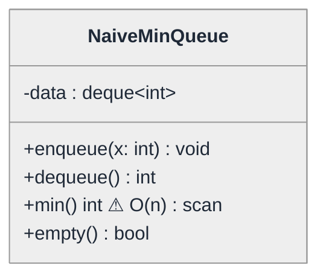
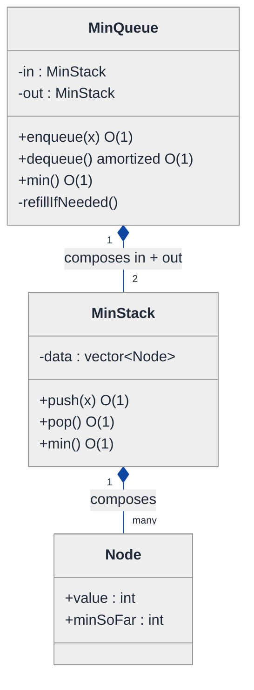
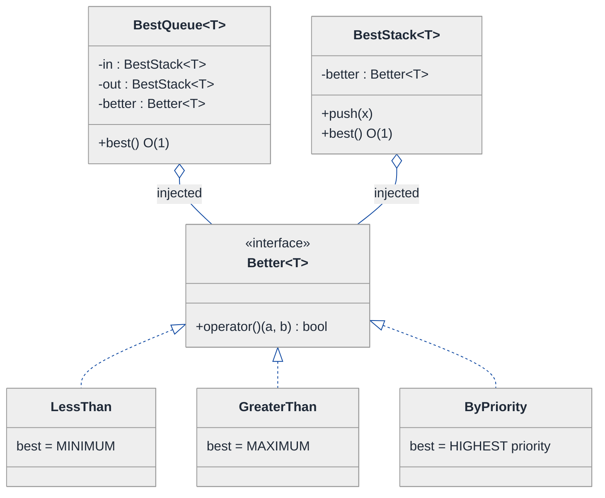
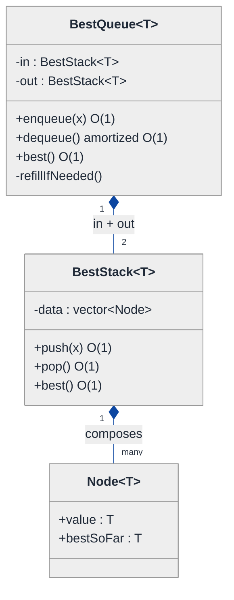
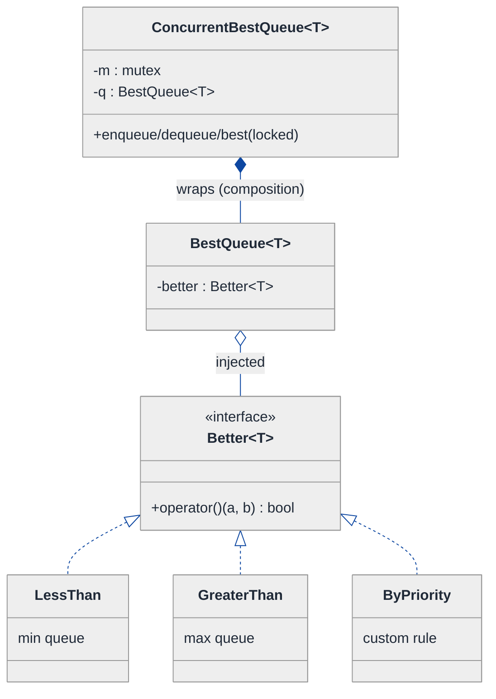
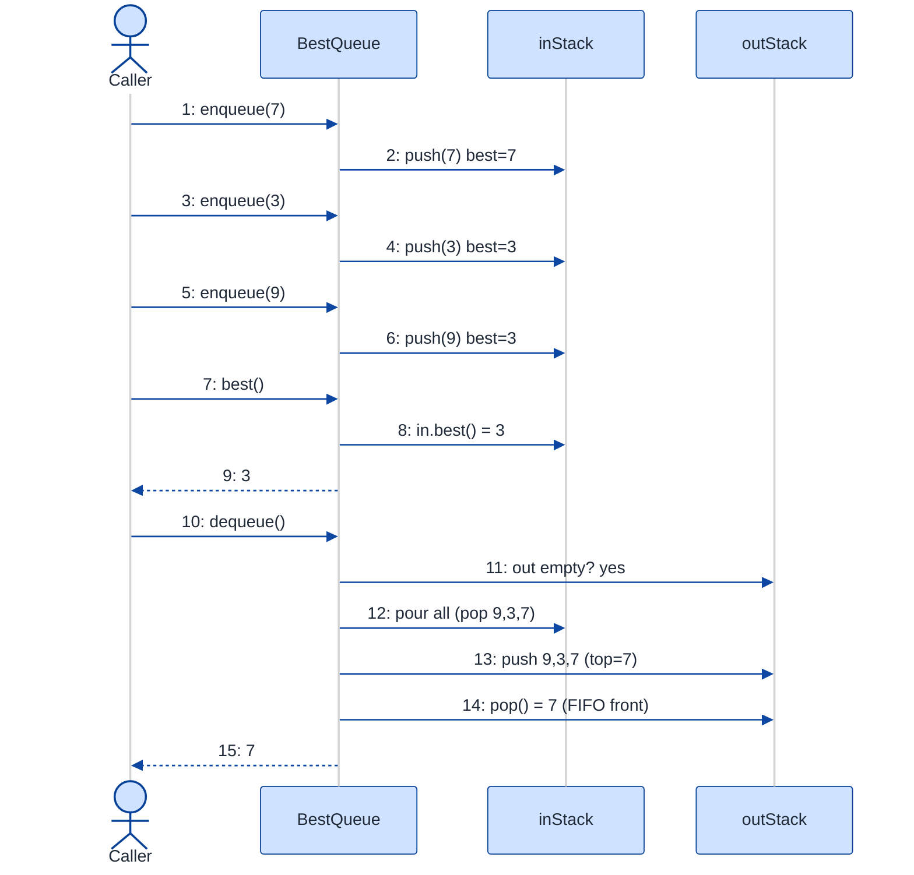

# Min Queue — LLD Walkthrough

> **Difficulty:** Medium · **Time:** ~30 min · **Pattern focus:** Two-stack / monotonic-deque invariant + Strategy (the ordering rule) + a template generalization
>
> **Problem source(s):** GID DS4 in [`./EXTRACTED_QUESTIONS.md`](./EXTRACTED_QUESTIONS.md) — "Design a Min Queue with Support for Enqueue and Dequeue Operations (O(1))".
>
> **Diagrams:** inline mermaid (renders natively in GitHub / VS Code). No external image sources.

---

## How to use this file

Paced for a candidate who knows what a queue is but has never had to keep a running minimum in O(1). Reading time: ~30 minutes if you trace each diagram by hand. **The lesson: in a data-structure LLD, the "design pattern" you're being tested on is INVARIANT MAINTENANCE — what property must hold after every operation, and how cheaply can you preserve it? Only after the invariant is nailed do the GoF patterns (Strategy, templates) earn their place.**

This is a different flavor from the parking-lot kind of LLD. There the variability was in behavior (pricing, payment). Here the variability is first in the *internal bookkeeping* — and the interview is won or lost on whether you can DERIVE the amortized-O(1) trick instead of asserting it.

**Map of this file (15 sections):**

1. Problem statement + clarifying questions
2. Plain-English restatement
3. Why this matters
4. Mental model
5. Try it yourself first
6. Entity & verb extraction
7. **Iteration 1: the naive design** — a queue plus a `min()` scan
8. **Where the naive design hurts** — four future requirements, one painful diff each
9. **Pivot 1: the two-stack min queue** — derive amortized O(1) from the invariant
10. **Pivot 2: Strategy for the ordering rule** — min, max, or custom, picked by the caller
11. **Pivot 3: a template-parameterized, thread-safe container** — generalize and protect the invariant
12. Final class diagram
13. Skeleton code (C++17)
14. Key flow — sequence diagram
15. Extensibility re-check + anti-patterns + how to think aloud + self-check

---

## 1. Problem statement + clarifying questions

**Prompt (typical phrasing):** "Design a queue that, in addition to `enqueue` and `dequeue`, supports `min()` — return the smallest element currently in the queue. All three operations should be O(1)."

**Clarifying questions to ask BEFORE writing anything:**

1. **Strict O(1) or amortized O(1)?** A true worst-case-O(1) min queue exists (monotonic deque), but the classic interview answer is the two-stack design which is *amortized* O(1). Which does the interviewer want? (This single question signals you know the difference.)
2. **`min` only, or also `max` / arbitrary "best"?** Does the structure need to support a configurable ordering, or is it hard-wired to minimum?
3. **Element type?** Integers only, or any comparable type (so the design should be a template / generic)?
4. **Duplicates allowed?** If the same value appears twice, must `min()` still be correct after one copy is dequeued? (It must — this constrains the design.)
5. **Empty-queue behavior?** Should `min()` / `dequeue()` on an empty queue throw, return a sentinel, or be undefined behavior the caller must guard?
6. **Concurrency?** Single-threaded, or do multiple producers/consumers hit it at once? (Affects whether we need locking around the invariant.)
7. **Bounded capacity?** Fixed-size ring or unbounded growth?

**Assumptions if the interviewer dodges:** amortized O(1) is acceptable (we'll mention the strict variant in §15), elements are any comparable type (template), duplicates are allowed, `min()`/`dequeue()` on empty throws, single-threaded first with a thread-safe variant discussed in §11, unbounded.

---

## 2. Plain-English restatement

We need a FIFO queue — first in, first out — that also answers "what is the smallest element I'm currently holding?" instantly. The trap is that a queue removes from the *front* and adds at the *back*, so the element that's leaving is not the one you just inserted. Keeping a running minimum is easy for a stack (you only touch one end); it's the *two-ended* access of a queue that makes the O(1) minimum non-trivial. The design must keep the min correct as elements enter at one end and leave at the other, without ever scanning the whole queue.

---

## 3. Why this matters

This question is the bridge from DSA to LLD. The algorithmic insight (two stacks, or a monotonic deque) is pure DSA; the LLD skill is packaging that insight as a class with a guarded invariant, a swappable ordering rule, and a clean API. Interviewers use it to see whether you (a) know the amortized-analysis argument cold, (b) can encapsulate a fragile invariant so callers can't corrupt it, and (c) recognize that "min vs max" is a Strategy axis rather than two copy-pasted classes. It reappears every time you build a sliding-window maximum, a streaming-stats buffer, or a priority-aware work queue.

---

## 4. Mental model

A min queue is **a FIFO line plus a running scoreboard of the best value still in line.** The hard part is that people leave from the *front* of the line, so when the current "best" person leaves, you need the next-best ready instantly — without re-polling everyone.

```
Real-world sketch (NOT a UML diagram yet):

   enqueue here →  [ 7 ][ 3 ][ 9 ][ 3 ][ 5 ]  → dequeue from here
        (back)                                       (front)

   Question: when the front '5' leaves, who is the min now?
   Naive answer: re-scan everyone → O(n).
   We want: a side structure that already knows → O(1).
```

The KEY insight from this picture: a *stack* can track its min in O(1) trivially (push records "min so far"; pop reveals the previous min). A *queue* cannot — but **a queue can be SIMULATED by two stacks** (an "in" stack and an "out" stack). If each of those stacks is a min-tracking stack, the queue's min is just `min(inStack.min, outStack.min)`. Two easy things compose into one hard thing. That decomposition — *queue = two stacks* — is the whole design.

---

## 5. Try it yourself first

> **Predict before reading on:**
>
> 1. A plain stack can return its minimum in O(1) if it stores a little extra per element. What's the extra thing each pushed element should remember?
> 2. **If a queue is "two stacks back to back," when the front (out) stack runs empty, what single bulk operation refills it — and why does that operation, despite being O(n), still leave every dequeue amortized O(1)?**
> 3. If I now ask for `max()` instead of `min()`, how much of your code should change? (Hint: the right answer is "one line, injected from outside.")

---

## 6. Entity & verb extraction

> **Mini-refresher: noun → class, but not every noun.**
>
> Promote a noun to a class only if it carries BOTH state and behavior that belong together. In a data-structure problem the nouns are sparse — most of the design is *one* class with a carefully maintained invariant, plus maybe a helper for the variability axis.

**Nouns from the prompt:**

| Noun | Decision | Why |
|---|---|---|
| Queue | Class (the top-level container) | Owns the elements + the min bookkeeping; exposes the API |
| Element | Template parameter `T` | No behavior of its own; just needs to be comparable |
| Minimum | Derived value, NOT a stored field at first | It's a *query result*; how we store it is the whole design question |
| Stack | Internal helper class (emerges in §9) | The min-tracking building block we compose two of |
| Ordering rule (min vs max) | Strategy object (emerges in §10) | Varies independently of the container mechanics |

**Verbs (and the class they live on):**

| Verb | Owner class (naive answer — we'll re-examine) |
|---|---|
| enqueue(x) | Queue |
| dequeue() | Queue |
| min() | Queue |
| empty() / size() | Queue |
| push(x) / pop() / top() / min() | Stack (internal, from §9) |
| compare(a, b) | the ordering Strategy (from §10) |

**No design patterns yet.** Just nouns and verbs.

---

## 7. <a id="iter-1"></a>Iteration 1: the naive design

The simplest thing that works: wrap a standard queue, and compute `min()` by scanning.



**Reader's tour (~40 seconds).**

1. **One class, one field.** `NaiveMinQueue` wraps a `std::deque<int>`. `enqueue` pushes to the back, `dequeue` pops the front — both genuinely O(1) on a deque.

2. **The warning marker (⚠) is on `min()`.** There is no min bookkeeping at all. To answer "what's the smallest?", the method walks every element. That's O(n). It WORKS — the answer is always correct — it's just slow, and it violates the explicit O(1) requirement.

3. **What's deliberately missing.** No side structure tracking the minimum. No notion that min and max are the same problem with a flipped comparison. No generality beyond `int`. The naive design doesn't even acknowledge that the minimum could be maintained incrementally.

Skeleton code for the naive design (C++17):

```cpp
#include <deque>
#include <stdexcept>
#include <algorithm>

class NaiveMinQueue {
public:
    void enqueue(int x) { data_.push_back(x); }      // O(1)

    int dequeue() {                                  // O(1)
        if (data_.empty()) throw std::runtime_error("empty");
        int front = data_.front();
        data_.pop_front();
        return front;
    }

    int min() const {                                // O(n) — the problem
        if (data_.empty()) throw std::runtime_error("empty");
        return *std::min_element(data_.begin(), data_.end());
    }

    bool empty() const { return data_.empty(); }
    std::size_t size() const { return data_.size(); }

private:
    std::deque<int> data_;
};
```

**This works.** Every query returns the right answer. It has zero design patterns and a clean API. So what's wrong with it? The `min()` scan — and three more things the interviewer is about to ask for.

---

## 8. <a id="naive-pain"></a>Where the naive design hurts

The interviewer slides four requirements across the desk: "Walk me through what changes."

### Change A: "`min()` must be O(1), not O(n)"

This is the requirement the prompt already stated, made explicit. In the naive design:
- `min()` is `std::min_element` over the whole deque — O(n).
- **There is no incremental bookkeeping to fix.** You can't "patch" the scan; you need a different data structure entirely.
- Smell: **the headline requirement is unmet, and there's no small diff that meets it.** This is the painful one.

### Change B: "Also support `max()` with the same guarantees"

In the naive design:
- Copy `min()` into a `max()` that calls `std::max_element`. Still O(n).
- If we later fix `min()` with bookkeeping, we now need a *second* parallel bookkeeping for max — duplicated logic.
- Smell: **min and max are the same algorithm with one flipped comparison, but the naive shape forces copy-paste.**

### Change C: "Make it generic — strings, custom structs, anything comparable"

In the naive design:
- `int` is baked into the field type, the parameter, and the return type. Generalizing means templating the whole class.
- Smell: **the element type is hard-wired**, so the class can't be reused for `string` keys or a `struct Order` without rewriting.

### Change D: "Two threads enqueue/dequeue concurrently"

In the naive design:
- `enqueue` and `dequeue` both mutate `data_` with no synchronization → data race.
- If we add the min bookkeeping from Change A, there are now TWO fields that must stay consistent — a partial update visible to another thread corrupts the invariant.
- Smell: **the invariant spans multiple fields and nothing guards it.**

### The pattern of pain

| Change | What it touches in the naive design | Smell |
|---|---|---|
| A. O(1) min | The entire `min()` strategy; no incremental fix exists | "Headline requirement unmet; needs a structural redesign." |
| B. Also max | Copy-paste a parallel `max()` + parallel bookkeeping | "Same algorithm, flipped compare, duplicated." |
| C. Generic T | Class is hard-wired to `int` | "Element type baked in." |
| D. Concurrency | Unguarded multi-field mutation | "Invariant spans fields with no lock." |

**Two axes of pain dominate:** (1) the *core mechanics* — how do we maintain the minimum incrementally so `min()` is O(1)? and (2) *configurability* — the ordering rule (min/max/custom) and the element type vary independently of the mechanics.

> **Pivot question:** "What data structure lets a FIFO queue surrender its minimum without scanning — and once we have it, what part of it is the *ordering rule* that the caller should be able to swap?"
>
> The mechanics answer is *two min-tracking stacks*. The ordering answer is *Strategy*. We tackle the mechanics first because it's the headline requirement.

---

## 9. <a id="pivot-1"></a>Pivot 1: the two-stack min queue

This pivot is mostly DSA, packaged as LLD. The pattern being applied isn't a GoF pattern — it's **invariant-driven decomposition**: pick an invariant that's cheap to maintain, then build the hard structure out of easy ones that each maintain it.

> **Mini-refresher: the min-tracking STACK.**
>
> A stack can report its minimum in O(1) if each element remembers "the minimum of everything at or below me." On `push(x)`, store the pair `(x, min(x, currentTop.minSoFar))`. On `pop`, the new top's `minSoFar` is *already* the correct running min — no recomputation. `min()` is just `top().minSoFar`. All O(1), because you only ever touch one end.

**Why a stack solves it but a queue doesn't.** A stack touches one end, so each element's `minSoFar` is monotone with depth — popping reveals a precomputed answer. A queue removes from the *opposite* end from where it inserts, so the element carrying the global min can leave first, and there's no precomputed "next min" waiting. The fix: **simulate the queue with two stacks.**

> **Mini-refresher: queue via two stacks.**
>
> Keep an `in` stack (receives `enqueue`) and an `out` stack (serves `dequeue`). To dequeue, if `out` is empty, pour ALL of `in` into `out` one element at a time — this reverses the order, so `out`'s top is the oldest element (correct FIFO front). Each element is moved from `in` to `out` at most once in its lifetime, so the expensive pour is *amortized* O(1) per element.

**The composition that wins:** make BOTH stacks min-tracking. Then:

```
queue.min() = min( inStack.min() , outStack.min() )   // O(1): each stack knows its own min
```

Pouring `in` into `out` preserves correctness because each `push` onto `out` recomputes that stack's `minSoFar` as it goes. The minimum is never scanned; it's always the smaller of two precomputed numbers.

**The refactor (the core slice):**

```cpp
#include <vector>
#include <stdexcept>
#include <algorithm>

// A stack that knows its minimum in O(1).
class MinStack {
public:
    void push(int x) {
        int m = empty() ? x : std::min(x, data_.back().minSoFar);
        data_.push_back({x, m});
    }
    int pop() {
        if (empty()) throw std::runtime_error("empty");
        int v = data_.back().value;
        data_.pop_back();
        return v;
    }
    int top()  const { return data_.back().value; }
    int min()  const { return data_.back().minSoFar; }  // O(1)
    bool empty() const { return data_.empty(); }
    std::size_t size() const { return data_.size(); }
private:
    struct Node { int value; int minSoFar; };
    std::vector<Node> data_;
};

class MinQueue {
public:
    void enqueue(int x) { in_.push(x); }               // O(1)

    int dequeue() {                                    // amortized O(1)
        refillIfNeeded();
        if (out_.empty()) throw std::runtime_error("empty");
        return out_.pop();
    }

    int min() const {                                  // O(1)
        if (in_.empty() && out_.empty()) throw std::runtime_error("empty");
        if (in_.empty())  return out_.min();
        if (out_.empty()) return in_.min();
        return std::min(in_.min(), out_.min());
    }

    bool empty() const { return in_.empty() && out_.empty(); }

private:
    void refillIfNeeded() {
        if (!out_.empty()) return;
        while (!in_.empty()) out_.push(in_.pop());     // reverse: oldest ends up on top
    }
    MinStack in_;
    MinStack out_;
};
```

**The amortized-O(1) argument (say this out loud in the interview).** Every element is pushed onto `in` once, moved to `out` at most once, and popped from `out` once — three constant-cost touches over its whole lifetime. A single `dequeue` can be O(n) when it triggers a pour, but the total work across *n* dequeues is O(n), so the *average* per dequeue is O(1). That's the definition of amortized O(1).

**What changed — visualized.** The core slice:



**Tour of the after-state.**

1. **`MinQueue` composes TWO `MinStack`s.** The filled diamond marks composition — the queue owns both stacks; they live and die with it. `in_` receives enqueues, `out_` serves dequeues.

2. **`MinStack` composes a vector of `Node`.** Each `Node` is `{value, minSoFar}`. `minSoFar` is the running minimum from the bottom of the stack up to that node — the trick that makes `min()` O(1).

3. **`MinQueue::min()` is a one-liner** over the two stack minima. It never scans elements; it compares two precomputed numbers.

4. **`refillIfNeeded` is the only "expensive" method**, and it's private — callers can't trigger it incorrectly. It runs only when `out_` is empty, and it amortizes away.

**Change A from §8 now lands.** `min()`, `enqueue`: strict O(1). `dequeue`: amortized O(1). The headline requirement is met by structure, not by patching a scan.

**Pattern-discrimination cheatsheet — two-stack queue vs monotonic deque.**
- *Two-stack min queue:* amortized O(1) dequeue; simplest to derive and explain; the canonical interview answer.
- *Monotonic deque:* keeps a deque of "candidates that could still be the min" in increasing order; gives *worst-case* O(1) for every op, but only supports min OR max, not arbitrary queries, and is fiddlier to get right.
- *Rule of thumb:* if the interviewer says "amortized is fine" → two stacks (cleaner story). If they insist on *strict* worst-case O(1) → monotonic deque. Name both; pick the two-stack version unless told otherwise.

---

## 10. <a id="pivot-2"></a>Pivot 2: Strategy for the ordering rule

Change B from §8 (also support `max`) is still painful. The naive instinct is to copy `MinStack`/`MinQueue` into `MaxStack`/`MaxQueue` with `<` flipped to `>`. That's duplication of the entire structure for a one-token difference. The variability here is *the comparison itself* — and a comparison picked by the caller is textbook Strategy.

> **Mini-refresher: Strategy pattern.**
>
> Encapsulates an algorithm behind an interface so it can be swapped at runtime. The CALLER decides which strategy to use; the strategy doesn't know about its peers.
>
> Quick example: a `Sorter` takes a `Comparator*` in its constructor; pass `Ascending` or `Descending` — the sorter's code never changes.

**Why Strategy fits the ordering rule.** "Which of two elements is *better* (should be reported by `best()`)?" is an algorithm. It varies — min, max, "shortest job", "highest priority" — and the choice is made externally by whoever constructs the queue, not by the queue's internal mechanics. So we replace the hard-coded `std::min` with an injected comparator and rename the query from `min()` to the neutral `best()`.

**The refactor (just the ordering slice):**

```cpp
#include <functional>

// The ordering Strategy: returns true if 'a' is "better" (should win best()).
// std::less  => best() is the MINIMUM.   std::greater => best() is the MAXIMUM.
template <typename T>
using Better = std::function<bool(const T& a, const T& b)>;

template <typename T>
class BestStack {
public:
    explicit BestStack(Better<T> better) : better_(std::move(better)) {}

    void push(const T& x) {
        // keep the current "best so far" by asking the strategy
        const T& winner = empty() || better_(x, data_.back().bestSoFar)
                              ? x : data_.back().bestSoFar;
        data_.push_back({x, winner});
    }
    // pop / top / best / empty as before, but best() returns data_.back().bestSoFar
private:
    struct Node { T value; T bestSoFar; };
    std::vector<Node> data_;
    Better<T> better_;   // injected — the only thing that differs between min and max
};
```

The container mechanics are untouched. Only the moment of comparison delegates to the injected `Better<T>`. Construct with `std::less<int>{}` and `best()` is the minimum; construct with `std::greater<int>{}` and it's the maximum; pass a lambda comparing `Order::priority` and it's a priority queue-of-sorts — all from one class.

**What changed — visualized.** The ordering slice:



**Tour of the after-state.**

1. **`best()` replaces `min()`** as the neutral query. The class no longer hard-codes "minimum"; it reports whatever the injected comparator considers the winner.

2. **`Better<T>` is the Strategy interface** (here realized as a `std::function` / callable, the idiomatic C++ form of a one-method strategy). The open diamonds mark aggregation — both the queue and its inner stacks USE the comparator; the caller owns the choice.

3. **Three concrete strategies hang off it.** `LessThan` → min queue. `GreaterThan` → max queue. `ByPriority` → a custom rule. None of them touch the two-stack mechanics.

4. **Change B from §8 evaporates.** No `MaxQueue` class. Construct the same `BestQueue` with `std::greater` and you have a max queue. One class, infinite ordering rules.

**Pattern-discrimination cheatsheet — Strategy vs Template Method.**
- *Strategy:* the comparison is a separate object injected at construction; swapped without subclassing.
- *Template Method:* you'd subclass `BestStack` and override a protected `virtual bool better(a,b)` hook.
- *Rule of thumb:* if the variant is a single tiny callable the caller supplies → Strategy (composition). If variants share a big algorithm skeleton with several hooks → Template Method (inheritance). One comparison = Strategy wins; no need for a subclass per ordering.

> **Mini-refresher: Open/Closed Principle.**
>
> Software entities should be OPEN for extension but CLOSED for modification. Adding a max queue should NOT require editing the queue class. With the comparator injected, adding a new ordering is new code at the call site, zero edits to `BestQueue`. That's OCP satisfied.

---

## 11. <a id="pivot-3"></a>Pivot 3: a template-parameterized, thread-safe container

Changes C (generic `T`) and D (concurrency) from §8 remain. Both are about *protecting and generalizing the invariant* rather than changing the algorithm.

**C — generalize the element type.** We already templated on `T` in Pivot 2. The only real constraint is "`T` must work with the injected comparator." There's nothing to special-case: `BestStack<T>` and `BestQueue<T>` store `T` by value in their `Node`s. A `BestQueue<std::string>` with `std::less<std::string>` gives a lexicographic-min queue for free.

> **Mini-refresher: why templates and not a `Comparable` base class?**
>
> An inheritance-based `interface Comparable` forces every element type to derive from your base — impossible for `int` or `std::string`. A template is *structural*: any type the comparator accepts works, no inheritance required. C++'s STL containers make the same choice for the same reason.

**D — guard the invariant against concurrency.** The invariant is "the two stacks together represent one FIFO order, and each stack's `bestSoFar` is correct." A concurrent `enqueue` and `dequeue` can interleave mid-`refill` and corrupt it. The fix is to wrap every public mutator/query in a lock so the invariant is never observed half-updated.

> **Mini-refresher: protecting an invariant with a mutex.**
>
> An invariant that spans multiple fields must be updated *atomically* from the outside world's view. A `std::mutex` + `std::lock_guard` makes each public operation a critical section: no other thread sees the structure between the first and last field write. We lock at the QUEUE boundary, not inside `MinStack`, so a single `dequeue` (which may pour `in` into `out`) is one atomic unit.

**The refactor (concurrency wrapper — composition, not inheritance):**

```cpp
#include <mutex>

template <typename T>
class ConcurrentBestQueue {
public:
    explicit ConcurrentBestQueue(Better<T> better) : q_(std::move(better)) {}

    void enqueue(const T& x) { std::lock_guard<std::mutex> g(m_); q_.enqueue(x); }
    T    dequeue()           { std::lock_guard<std::mutex> g(m_); return q_.dequeue(); }
    T    best()  const       { std::lock_guard<std::mutex> g(m_); return q_.best(); }
    bool empty() const       { std::lock_guard<std::mutex> g(m_); return q_.empty(); }

private:
    mutable std::mutex m_;
    BestQueue<T>       q_;   // composition: wraps the single-threaded queue
};
```

**Why a wrapper, not a `lock()` call sprinkled inside `BestQueue`.** Keeping the single-threaded `BestQueue` lock-free means it stays usable (and testable) in single-threaded code with zero locking overhead; threading is an opt-in DECORATOR-style wrapper. Callers that need safety construct `ConcurrentBestQueue`; everyone else pays nothing. Separation of concerns: the algorithm class knows nothing about threads.

**The lesson.** Once Pivot 2 recognized the comparator as the variability axis, generalization (C) was already done by the template, and concurrency (D) became a thin composition layer that never touches the invariant logic. **Get the invariant and the variability axis right, and the remaining requirements stop being structural problems.**

---

## 12. <a id="fig-class-diagram"></a>12. Final class diagram

Two focused sub-views: the mechanics (composition spine), and the policy (the injected comparator + the threading wrapper).

### 12.1 The mechanics spine — what the queue OWNS



**Tour of 12.1.** One `BestQueue` owns exactly two `BestStack`s (filled diamonds = composition, same lifetime). Each stack owns a vector of `Node{value, bestSoFar}`. This spine is the entire O(1) machinery; it did not change between Pivot 1 and the final design — only the comparison inside `push` became injected.

### 12.2 The policy + protection — what the queue USES and what wraps it



**Tour of 12.2.** `BestQueue` aggregates a `Better<T>` comparator (open diamond — the caller owns the choice; `LessThan` → min, `GreaterThan` → max, `ByPriority` → custom). `ConcurrentBestQueue` *composes* a `BestQueue` and adds a mutex around each operation (filled diamond — it owns the wrapped queue). Threading is opt-in and additive.

### Structural insight

| Concern | Technique | Why |
|---|---|---|
| **O(1) minimum** | Two min-tracking stacks (invariant decomposition) | Hard two-ended structure built from easy one-ended ones |
| **min vs max vs custom** | Strategy (injected comparator) | The comparison varies; the caller picks it |
| **Any element type** | Template `<T>` | Structural typing; no `Comparable` base needed |
| **Thread safety** | Composition wrapper + mutex | Protect the multi-field invariant atomically, opt-in |

The big lesson: in a data-structure LLD, **inheritance barely appears** — the design is composition (queue OF stacks, wrapper OF queue) plus an injected strategy. *Inheritance is for "is-a"; here almost everything is "has-a" or "uses-a".*

---

## 13. Skeleton code (C++17)

> Shows the SHAPES, ~120 lines. `// elided` marks omitted bodies.

```cpp
#include <vector>
#include <functional>
#include <stdexcept>
#include <mutex>
#include <utility>

// ── The ordering Strategy ───────────────────────────────────────────
// Returns true if 'a' should beat 'b' in best().
//   std::less<T>    => best() is the MINIMUM
//   std::greater<T> => best() is the MAXIMUM
template <typename T>
using Better = std::function<bool(const T&, const T&)>;

// ── Best-tracking stack: the O(1) building block ────────────────────
template <typename T>
class BestStack {
public:
    explicit BestStack(Better<T> better) : better_(std::move(better)) {}

    void push(const T& x) {
        if (data_.empty())                 data_.push_back({x, x});
        else if (better_(x, data_.back().bestSoFar))
                                           data_.push_back({x, x});
        else                               data_.push_back({x, data_.back().bestSoFar});
    }
    T pop() {
        if (empty()) throw std::runtime_error("pop from empty stack");
        T v = std::move(data_.back().value);
        data_.pop_back();
        return v;
    }
    const T& top()  const { return data_.back().value; }
    const T& best() const { return data_.back().bestSoFar; }   // O(1)
    bool empty()    const { return data_.empty(); }
    std::size_t size() const { return data_.size(); }

private:
    struct Node { T value; T bestSoFar; };
    std::vector<Node> data_;
    Better<T>         better_;   // injected — the only min/max difference
};

// ── The two-stack best queue ────────────────────────────────────────
template <typename T>
class BestQueue {
public:
    explicit BestQueue(Better<T> better)
        : better_(better), in_(better), out_(better) {}

    void enqueue(const T& x) { in_.push(x); }            // O(1)

    T dequeue() {                                        // amortized O(1)
        refillIfNeeded();
        if (out_.empty()) throw std::runtime_error("dequeue from empty queue");
        return out_.pop();
    }

    const T& best() const {                              // O(1)
        if (in_.empty() && out_.empty()) throw std::runtime_error("best of empty queue");
        if (in_.empty())  return out_.best();
        if (out_.empty()) return in_.best();
        return better_(in_.best(), out_.best()) ? in_.best() : out_.best();
    }

    bool empty() const { return in_.empty() && out_.empty(); }
    std::size_t size() const { return in_.size() + out_.size(); }

private:
    void refillIfNeeded() {
        if (!out_.empty()) return;
        while (!in_.empty()) out_.push(in_.pop());       // reverse → FIFO order on out_
    }
    Better<T>     better_;
    BestStack<T>  in_;
    BestStack<T>  out_;
};

// ── Opt-in thread-safe wrapper (composition, not inheritance) ───────
template <typename T>
class ConcurrentBestQueue {
public:
    explicit ConcurrentBestQueue(Better<T> better) : q_(std::move(better)) {}

    void enqueue(const T& x) { std::lock_guard<std::mutex> g(m_); q_.enqueue(x); }
    T    dequeue()           { std::lock_guard<std::mutex> g(m_); return q_.dequeue(); }
    T    best() const        { std::lock_guard<std::mutex> g(m_); return q_.best(); }
    bool empty() const       { std::lock_guard<std::mutex> g(m_); return q_.empty(); }

private:
    mutable std::mutex m_;
    BestQueue<T>       q_;
};

// ── Usage ───────────────────────────────────────────────────────────
//   BestQueue<int> minQ(std::less<int>{});      // best() == minimum
//   BestQueue<int> maxQ(std::greater<int>{});   // best() == maximum
//   BestQueue<Order> pq([](const Order& a, const Order& b){ return a.prio > b.prio; });
//   ConcurrentBestQueue<int> safeMinQ(std::less<int>{});   // thread-safe min queue
```

---

## 14. <a id="fig-sequence"></a>14. Key flow — sequence diagram

The flow that reveals the amortized pour: enqueue three, then dequeue when `out` is empty.



**Tour of the flow (read slowly — this is the amortization in action).**

1. **Steps 1-6: three enqueues go to `inStack`.** Each `push` updates `bestSoFar` on the fly: after 7 it's 7, after 3 it's 3, after 9 it stays 3 (9 isn't better than 3). All O(1).

2. **Steps 7-9: `best()` is O(1).** `out` is empty, so the answer is just `in.best()` = 3. No scan.

3. **Steps 10-13: the FIRST dequeue triggers the pour.** `out` is empty, so `refillIfNeeded` pops `inStack` (9, 3, 7) and pushes onto `outStack`. The reversal puts 7 — the oldest, the true FIFO front — on top of `out`. This single dequeue did O(3) work.

4. **Steps 14-15: pop the front.** `out.pop()` returns 7, the first element enqueued. Correct FIFO.

5. **Why the next two dequeues are O(1).** `out` now holds 3 then 9; the next two dequeues just pop them — no pour. The O(3) cost of step 12 is *spread* over the three dequeues: 3 work / 3 dequeues = O(1) amortized. **That's the whole trick, visible in one diagram.**

### The invariant that's NOT shown — and why it matters

You don't see any `min` recomputation during dequeue. After the pour, `outStack`'s `bestSoFar` chain was rebuilt automatically by its own `push` (step 13), so `best()` stays O(1) without the queue ever knowing how min-tracking works. **Each stack guards its own invariant; the queue just composes two of them.** That encapsulation is the LLD payoff.

---

## 15. Extensibility re-check + anti-patterns + how to think aloud + self-check

### Extensibility re-check

Revisit the four changes from [§8](#naive-pain). For each, name the SINGLE thing that changes.

| Change | Naive design impact | Final design impact |
|---|---|---|
| A. O(1) min | No fix exists; full redesign | Two-stack `BestQueue`; `best()` is O(1) by construction. Done. |
| B. Also max | Copy-paste a parallel class | Construct with `std::greater`. Zero new structure. Done. |
| C. Generic T | Re-template the whole class | Already a template; `BestQueue<std::string>` works. Done. |
| D. Concurrency | Unguarded multi-field race | Wrap in `ConcurrentBestQueue`. Single-threaded class untouched. Done. |

Every change is one comparator, one template instantiation, or one wrapper — never surgery inside the mechanics. That's the open/closed principle in practice.

### Common confusion + traps

1. **"Why two stacks instead of just tracking a `currentMin` field?"** A single `currentMin` field can't recover the *next* min when the current min dequeues from the front — you'd be forced to re-scan. The stacks store a *history* of mins, so the next-best is always precomputed.

2. **"Is this strict O(1)?"** No — `dequeue` is *amortized* O(1). For strict worst-case O(1), use the monotonic-deque variant (mention it; see the §9 cheatsheet). Conflating the two is the most common interview slip.

3. **"Why does `best()` compare two stack minima instead of one?"** Because the live elements are split across `in` and `out`. Either stack may be empty; the live minimum is the better of whichever stacks are non-empty.

4. **"Why not subclass `MinQueue` and `MaxQueue`?"** The only difference is one comparison. Subclassing to flip a `<` is inheritance for behavior variation — exactly the anti-pattern Strategy avoids.

5. **"Why lock at the queue boundary, not inside `BestStack`?"** Because one `dequeue` may pour `in` into `out` — multiple stack operations that must be one atomic unit. Locking inside the stack would let another thread observe a half-poured state.

### Anti-patterns

- **"Rescan-for-min"** — recomputing the minimum on every query. O(n); the thing the problem forbids.
- **"Min as a single scalar field"** — can't restore the next min on dequeue without a scan. Use the stack-of-mins history.
- **"Copy-paste MaxQueue"** — duplicating the structure to flip a comparison. Inject a comparator instead.
- **"Hard-wired `int`"** — baking the element type in. Template it.
- **"Lock inside the inner stack"** — exposes half-poured state to other threads. Lock at the queue boundary.
- **"Exposing the inner stacks"** — leaking `in_`/`out_` lets callers corrupt the invariant. Keep them private; expose only the queue API.

### How to think aloud

> "Min queue. First clarifier: amortized O(1) or strict? I'll assume amortized — the clean two-stack answer.
>
> Naive: wrap a deque, scan for min. Works, but `min()` is O(n) — fails the headline requirement, and there's no small patch.
>
> The insight: a STACK can track its min in O(1) — each element remembers the min at-or-below it. A queue can't, because it removes from the opposite end. But a queue IS two stacks: an `in` and an `out`. Make both min-tracking stacks; the queue's min is the smaller of the two stack mins. Pour `in` into `out` only when `out` empties — each element moves at most once, so dequeue is amortized O(1).
>
> Now extensibility. Min vs max is just a flipped comparison — that's a Strategy. I inject a `Better<T>` comparator; `std::less` gives min, `std::greater` gives max, a lambda gives a custom rule. One class, all orderings.
>
> Generic type: template on `T`. Thread safety: a composition wrapper with a mutex around each op, locking at the queue boundary so a pour stays atomic. The single-threaded class stays lock-free.
>
> Final: `BestQueue<T>` composes two `BestStack<T>`s and aggregates a comparator; `ConcurrentBestQueue<T>` wraps it. All four future requirements land as one comparator, one instantiation, or one wrapper."

### Self-check

> **Self-check — the question to ask next time.**
>
> When you see "design a [structure] that also answers [aggregate query] in O(1)," before reaching for a scan, ask:
>
> > **"What INVARIANT, maintained cheaply on each insert/remove, would make this query a lookup instead of a computation — and can I build the hard structure out of an easier one that already maintains it?"**
>
> Then ask the second question: **"Which part of this is a fixed mechanic, and which part (min vs max, the comparison) is a rule the CALLER should pick?"** Mechanic → encapsulate the invariant. Caller's rule → Strategy.

---

## Cross-references

- **Parent topic manifest:** [`./EXTRACTED_QUESTIONS.md`](./EXTRACTED_QUESTIONS.md)
- **Vertical overview:** [`../../LEARNING.md`](../../LEARNING.md)
- **Template:** [`../../TEMPLATE-v2.md`](../../TEMPLATE-v2.md)
- **Canonical LLD exemplar:** [`../Object_Oriented_Design/Parking_Lot.md`](../Object_Oriented_Design/Parking_Lot.md)
- **Related v2 walkthroughs:**
  - [`./LRU_Cache.md`](./LRU_Cache.md) — sibling LLD_DataStructures walkthrough (invariant maintenance + O(1) ops)
  - Strategy Pattern deep-dive (in `../Strategy_Pattern/`)
  - DSA companions: Min Stack, Sliding Window Maximum (monotonic deque), in `../../../DSA/Topics/Stack/` and `../../../DSA/Topics/Queues_Deque_Monotonic_Queue/`
- **Further reading:** <a href="https://en.wikipedia.org/wiki/Queue_(abstract_data_type)#Implementation" target="_blank" rel="noopener noreferrer">Queue implementations</a>, <a href="https://en.cppreference.com/w/cpp/utility/functional/function" target="_blank" rel="noopener noreferrer">std::function</a>
