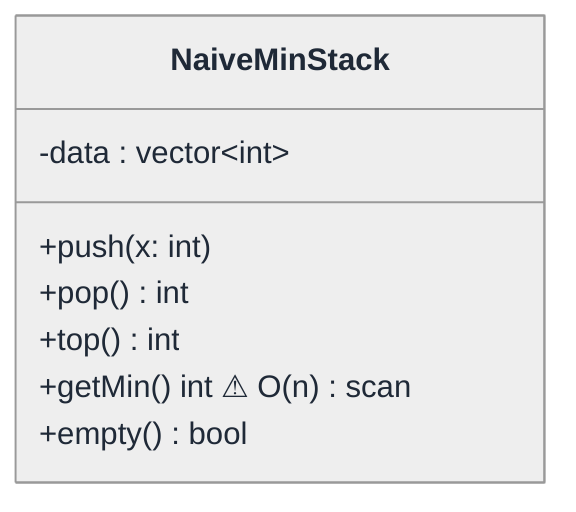
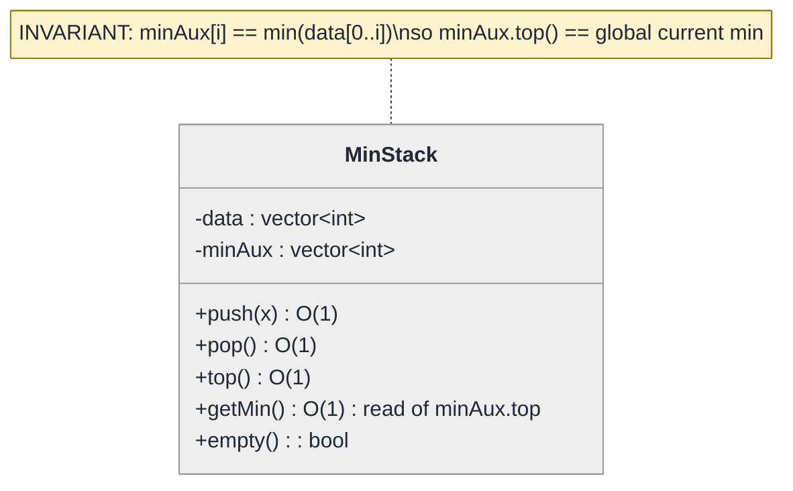
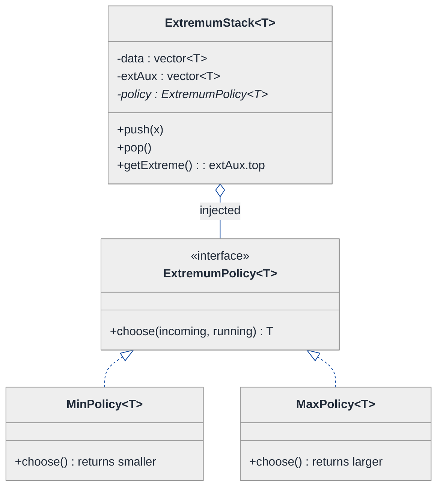
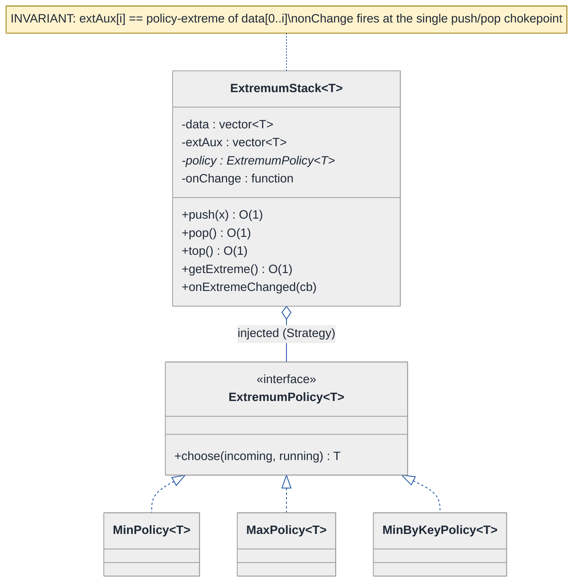
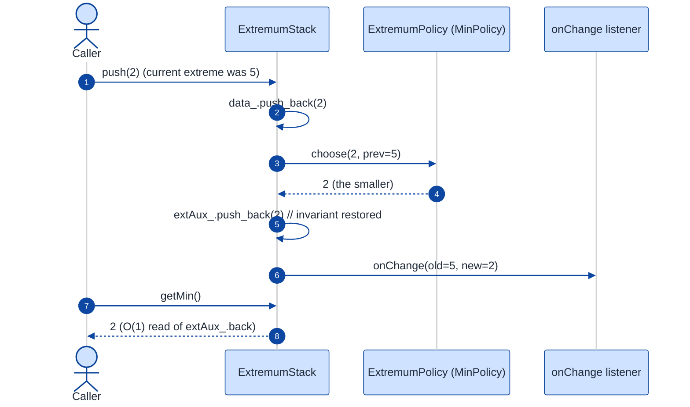

# Min Stack — LLD Walkthrough

> **Difficulty:** Medium · **Time:** ~30 min · **Pattern focus:** Auxiliary-stack invariant · then Strategy (extremum policy) + a template generalization
>
> **Problem source(s):** GID DS3 in [`./EXTRACTED_QUESTIONS.md`](./EXTRACTED_QUESTIONS.md), bucket `LLD_DataStructures`. A classic "bridge DSA → LLD" question — the algorithmic trick is small, but the senior bar is in how you wrap it in an extensible class.
>
> **Diagrams:** inline mermaid (renders natively in GitHub / VS Code). DO NOT use `look: handDrawn`.

---

## How to use this file

Paced for a candidate who has seen a plain stack but never thought about how to track its minimum in O(1). Reading time: ~30 minutes if you trace each push/pop sequence by hand. **The lesson: the O(1) `getMin` is not a clever loop — it is an INVARIANT you maintain on every mutation. Once you see that, the LLD question becomes "how do I keep that invariant honest, and how do I make the EXTREMUM itself a swappable policy?"**

**Map of this file (15 sections):**

1. Problem statement + clarifying questions
2. Plain-English restatement
3. Why this matters
4. Mental model
5. Try it yourself first
6. Entity & verb extraction
7. **Iteration 1: the naive design** — recompute the min on every pop
8. **Where the naive design hurts** — four future requirements, one painful diff each
9. **Pivot 1: the auxiliary-stack invariant** — the core of the question
10. **Pivot 2: Strategy for the extremum policy** — MinStack, MaxStack, one class
11. **Pivot 3: template generalization + an eviction/observe hook**
12. Final class diagram
13. Skeleton code (C++)
14. Key flow — sequence diagram
15. Extensibility re-check + anti-patterns + how to think aloud + self-check

---

## 1. Problem statement + clarifying questions

**Prompt (typical phrasing):** "Design a stack that supports `push`, `pop`, `top`, and `getMin` (retrieve the minimum element), all in O(1) time."

**Clarifying questions to ask BEFORE writing anything:**

1. **What type are the elements?** Plain `int`, or arbitrary comparable values? Do we need it to be generic (templated)?
2. **What should `getMin` / `pop` / `top` do on an EMPTY stack?** Throw, return a sentinel, or return an `optional`? (This decides the whole error model.)
3. **Are duplicate minimums allowed?** If I push `5, 5` and pop once, is the min still `5`? (This is the trap that breaks the naive "track one min value" approach.)
4. **Is O(1) required for `getMin` specifically, or amortized O(1) acceptable?** The interviewer almost always wants strict worst-case O(1).
5. **Space budget?** Are we allowed an auxiliary stack (extra O(n) space), or must it be O(1) extra space with an encoding trick?
6. **Single-threaded, or must `push`/`pop` be safe under concurrent callers?**
7. **Do we ever need the MAX too, or a different extremum (e.g., min-by-some-key)?** This decides whether the comparison is hardcoded or injected.

**Assumptions if the interviewer dodges:** generic comparable element type, empty-stack operations throw, duplicates allowed, strict worst-case O(1) for all four ops, auxiliary O(n) space is fine, single-threaded for now (concurrency discussed in §15), and we should design so MAX is a trivial extension.

---

## 2. Plain-English restatement

We're building a stack — last-in-first-out — that can also tell you its smallest element instantly, no matter how many items are in it. The catch is that "smallest" is a moving target: every `push` might lower it, and every `pop` might raise it back. The naive way is to scan the whole stack whenever someone asks for the min. The senior way is to MAINTAIN the answer as you go, so `getMin` is just a read. The design also has to leave room for "smallest" to become "largest," or "smallest by some key," without rewriting the core.

---

## 3. Why this matters

This question looks like a one-line algorithm trick, and weak candidates treat it that way. The interviewer is actually probing two things: (a) do you recognize that O(1) `getMin` comes from MAINTAINING AN INVARIANT on every mutation, not from a clever query; and (b) when you wrap that invariant in a class, do you encapsulate it so callers can't corrupt it, and do you make the "what counts as extreme" decision pluggable? Invariant maintenance and encapsulation are the bread and butter of every data-structure LLD — observable lists, LRU caches, rate limiters, monotonic queues all live or die on the same skill.

---

## 4. Mental model

A min stack is a normal stack standing next to a **shadow stack of running answers**. Every time you put a plate on the main stack, you also write down "the smallest plate visible from here down" on a sticky note and stack THAT. Pop a plate, tear off the matching sticky note. The top sticky note is always the current min — you never recompute it.

```
Real-world sketch (NOT a UML diagram yet):

   main stack        shadow "running min" stack
   ┌───────┐         ┌───────┐
   │   2   │ ← top   │   2   │ ← top == current min
   ├───────┤         ├───────┤
   │   7   │         │   2   │   (min of {7,5,2}=2, carried up)
   ├───────┤         ├───────┤
   │   5   │         │   5   │   (min of {5}=5)
   └───────┘         └───────┘

   getMin() == read top of shadow stack == 2   (no scan)
```

The KEY insight from this picture: the shadow stack stores, at each level, *the minimum of everything at or below that level*. Because that value is frozen at push time, popping the main stack and popping the shadow stack together keeps both honest. Min is never computed on demand — it is always already known.

---

## 5. Try it yourself first

> **Predict before reading on:**
>
> 1. Push `5, 2, 7, 2`. What does the shadow stack look like? Now pop twice — what is `getMin`?
> 2. **If I keep only a single `int min_` field instead of a shadow stack, which input sequence makes `getMin` return the WRONG answer after a pop?**
> 3. If the interviewer then says "now I also want `getMax` on the same data," what's the smallest change you'd make — and what does that tell you about where the comparison lives?

---

## 6. Entity & verb extraction

> **Mini-refresher: noun → class, but not every noun.**
>
> Naive OOD promotes every noun to a class. Senior OOD promotes a noun only if it has BEHAVIOR and STATE that belong together. "Element value" stays a field; "the stack" becomes a class because it owns an invariant that must be protected.

**Nouns from the prompt:**

| Noun | Decision | Why |
|---|---|---|
| MinStack | Class (the whole abstraction) | Owns the data + the min invariant |
| Element / value | Field inside the containers (`int`, later a template param) | No behavior of its own |
| Main stack | Field (`std::vector` or `std::stack`) | Storage, not a domain class |
| Min (the answer) | NOT a stored scalar — a maintained invariant | This is the whole insight |
| Auxiliary / shadow stack | Field | Implementation detail of the invariant |

**Verbs (and the class they live on):**

| Verb | Owner (naive answer — we'll re-examine) |
|---|---|
| push(x) | MinStack |
| pop() | MinStack |
| top() | MinStack |
| getMin() | MinStack |
| isEmpty() / size() | MinStack |

**We have NOT introduced any design patterns yet.** Pure nouns + verbs. Notice the entity list is tiny — that's expected. The richness of this question is not in the number of classes; it is in how `push`/`pop` maintain a contract.

---

## 7. <a id="iter-1"></a>Iteration 1: the naive design

The simplest thing that "works." One container, and `getMin` scans it. No invariant, no auxiliary state.



**Reader's tour (~30 seconds).** One class, one field (`data`), five methods. `push`/`pop`/`top` are trivial O(1) wrappers over the vector. The warning marker is on `getMin()`: with no maintained answer, the only way to find the minimum is to walk every element. That is O(n) — and it is the single thing the prompt explicitly forbids.

**What's deliberately missing.** No auxiliary state. No invariant. The class doesn't even acknowledge that "the minimum" is a thing it could KNOW rather than COMPUTE.

Skeleton code for the naive design (C++):

```cpp
#include <algorithm>
#include <stdexcept>
#include <vector>

class NaiveMinStack {
public:
    void push(int x) { data_.push_back(x); }

    int pop() {
        if (data_.empty()) throw std::runtime_error("pop on empty");
        int v = data_.back();
        data_.pop_back();
        return v;
    }

    int top() const {
        if (data_.empty()) throw std::runtime_error("top on empty");
        return data_.back();
    }

    int getMin() const {                       // ⚠ O(n) — the smell
        if (data_.empty()) throw std::runtime_error("getMin on empty");
        return *std::min_element(data_.begin(), data_.end());
    }

    bool empty() const { return data_.empty(); }
    std::size_t size() const { return data_.size(); }

private:
    std::vector<int> data_;
};
```

**This works.** It returns correct answers. `push`, `pop`, `top` are even O(1). But `getMin` is O(n), and the moment we try to fix that with a shortcut — say, "just cache the min in one field" — we'll see the design quietly break. Let's make the pain concrete.

---

## 8. <a id="naive-pain"></a>Where the naive design hurts

The interviewer slides four requirements across the desk: "Walk me through what changes for each."

### Change A: "getMin must be O(1), not O(n)"

This is the headline requirement, and the obvious first patch is wrong. The tempting fix: keep a single `int min_` field, update it on push.

- `push(x)`: `if (x < min_) min_ = x;` — fine.
- `pop()`: now what? If you just popped the current minimum, `min_` is STALE. The only way to recover it is... to scan the remaining elements. **You've moved the O(n) from `getMin` into `pop`.** No net win.
- Touches: `push`, `pop`, and a new field. And it is STILL O(n) somewhere.

### Change B: "Duplicate minimums — push 5, 5, pop once, min must still be 5"

- The single-`int` approach can't tell whether the popped element was "a" minimum or "the last remaining" minimum.
- You'd need a COUNT alongside `min_`, then a fallback when the count hits zero — at which point you're scanning again.
- Touches: `push`, `pop`, and the field set grows into a fragile little state machine. **The smell: the data structure can't distinguish "a min" from "the min."**

### Change C: "We also want a MaxStack with the identical behavior"

- In the naive design, `min_element` is hardcoded into `getMin`. To get a max, you copy the entire class and change `<` to `>` in one place.
- Two near-identical classes drift apart over time.
- Touches: a whole new file that is 95% duplicated. **The smell: the comparison direction is welded into the code instead of being a parameter.**

### Change D: "Notify a listener whenever the running minimum CHANGES (e.g., to update a live dashboard)"

- There is no place to hook this. The naive `getMin` doesn't even know when the min changed — it recomputes from scratch each call.
- You'd sprinkle ad-hoc callback calls into `push` and `pop`, guessing when the min moved.
- Touches: every mutator, with logic that doesn't belong there. **The smell: no single chokepoint owns "the min just changed."**

### The pattern of pain

| Change | What breaks | Smell |
|---|---|---|
| A. O(1) getMin | single-`int` cache goes stale on pop | "We're recomputing instead of maintaining." |
| B. Duplicate mins | can't tell "a min" from "the min" | "Scalar cache loses history." |
| C. MaxStack | `<` hardcoded in `getMin` | "Comparison direction is welded in." |
| D. Min-changed event | no chokepoint for the change | "Nothing owns the moment the min moves." |

**Two axes of variation dominate:** (1) the way the min is REMEMBERED across mutations (Changes A + B — really one problem: *maintain an invariant instead of recomputing*), and (2) WHAT counts as extreme and WHO cares when it moves (Changes C + D — the comparison and the notification are policy, not core).

> **Pivot question:** "What structure lets me REMEMBER the answer-so-far at every level so a pop restores the previous answer for free — and how do I make the comparison itself swappable so MinStack and MaxStack are one class?"
>
> The first half is the auxiliary-stack invariant (Pivot 1). The second is Strategy (Pivot 2). Let's take the most painful axis first: making `getMin` truly O(1).

---

## 9. <a id="pivot-1"></a>Pivot 1: the auxiliary-stack invariant

This is the heart of the question. We do not cache a single min — we keep a **parallel stack of running minimums**, one entry per element on the main stack.

> **Mini-refresher: a class invariant.**
>
> An invariant is a property your object guarantees to be TRUE between every public method call. Here the invariant is: *after any sequence of pushes and pops, `minAux_.top()` equals the minimum of all elements currently on the main stack.* Every mutator must RE-ESTABLISH the invariant before it returns; every reader may ASSUME it. Encapsulation (private fields) is what lets you promise this — callers can't reach in and break it.

**The invariant, precisely.** For a main stack `data_` and an auxiliary stack `minAux_` of equal height: `minAux_[i] == min(data_[0..i])`. The top of `minAux_` is therefore the global current minimum, readable in O(1).

**How each operation keeps the invariant honest:**

- `push(x)`: push `x` onto `data_`. Push `min(x, minAux_.top())` onto `minAux_` (if `minAux_` is empty, push `x`). Both stacks grow by one; the new top of `minAux_` is the new global min. O(1).
- `pop()`: pop BOTH stacks. The exposed top of `minAux_` was computed when the element below it was pushed, so it is exactly the min of what remains. **No recomputation.** O(1). This is the magic — and it solves Change B for free, because each level carries its own frozen answer, duplicates included.
- `getMin()`: return `minAux_.top()`. O(1) read.

**The refactor (just the affected part):**

```cpp
#include <stdexcept>
#include <vector>

class MinStack {
public:
    void push(int x) {
        data_.push_back(x);
        // invariant: minAux_.top() == min of everything at or below this level
        minAux_.push_back(minAux_.empty() ? x : std::min(x, minAux_.back()));
    }

    int pop() {
        if (data_.empty()) throw std::runtime_error("pop on empty");
        int v = data_.back();
        data_.pop_back();
        minAux_.pop_back();          // pop the matching running-min — restores prior min for free
        return v;
    }

    int top() const {
        if (data_.empty()) throw std::runtime_error("top on empty");
        return data_.back();
    }

    int getMin() const {             // now O(1) — just a read of the maintained answer
        if (minAux_.empty()) throw std::runtime_error("getMin on empty");
        return minAux_.back();
    }

    bool empty() const { return data_.empty(); }

private:
    std::vector<int> data_;          // the real stack
    std::vector<int> minAux_;        // running minimum at each level
};
```

**What changed — visualized.** The structural slice that the invariant adds:



**Tour of the after-state.** Same single class, but it now holds TWO parallel containers and a stated invariant (the note). `getMin` is a one-line read. Changes A and B from §8 are both gone: O(1) min, and duplicate minimums "just work" because each main-stack level carries its own frozen min value — popping one `5` simply exposes the next level's answer, which still says `5`.

**Space-tradeoff aside (worth saying aloud in the interview).** The auxiliary stack costs O(n) extra space. There is an O(1)-extra-space encoding trick (store `2*x - prevMin` deltas), but it's brittle, hard to read, and only works for fixed-width integer types — exactly the kind of cleverness that hurts an LLD answer. We choose the readable auxiliary stack and SAY why. A minor optimization: store `(value, count)` pairs in `minAux_` and only push a new entry when the min actually changes, collapsing runs of equal minimums.

**Pattern-discrimination cheatsheet — Invariant maintenance vs Memoization.**
- *Memoization:* cache the result of an expensive computation, recompute (or invalidate) when inputs change. The cache can go stale.
- *Invariant maintenance:* there is no "recompute later" — every mutator restores the property before returning, so reads are always correct and never lazy.
- *Rule of thumb:* if a `pop` could leave your cached answer wrong until the next query → you're memoizing (and it'll bite you). If every mutation leaves the answer immediately correct → you have an invariant. Min stack demands the latter.

---

## 10. <a id="pivot-2"></a>Pivot 2: Strategy for the extremum policy

Change C from §8 — "we also want a MaxStack" — is still unsolved. Pivot 1 hardcoded `std::min` inside `push`. Copy-pasting the whole class to flip `<` to `>` is the smell. The variability here is *the comparison itself*: it's an algorithm the CALLER picks.

> **Mini-refresher: Strategy pattern.**
>
> Encapsulates an algorithm behind an interface so it can be swapped at runtime. The CALLER decides which strategy to use; the strategy doesn't know about its peers. Quick example: a `Sorter` takes a `CompareStrategy*`; pass `Ascending` or `Descending` and the sorter doesn't care.

**Why Strategy fits the extremum.** "Which of two values do I keep as the running extreme?" is a tiny algorithm with several variants: keep-the-smaller (MinStack), keep-the-larger (MaxStack), keep-the-min-by-length, keep-the-max-by-priority. The choice is made externally at construction. That's textbook Strategy. We inject an `ExtremumPolicy` and the auxiliary stack stores whatever the policy declares "more extreme."

**The refactor (just the affected slice):**

```cpp
#include <functional>
#include <memory>

// Strategy: given the incoming value and the current running extreme,
// return whichever should become the new running extreme.
template <typename T>
class ExtremumPolicy {
public:
    virtual ~ExtremumPolicy() = default;
    virtual const T& choose(const T& incoming, const T& runningExtreme) const = 0;
};

template <typename T>
class MinPolicy : public ExtremumPolicy<T> {
public:
    const T& choose(const T& a, const T& b) const override { return (a < b) ? a : b; }
};

template <typename T>
class MaxPolicy : public ExtremumPolicy<T> {
public:
    const T& choose(const T& a, const T& b) const override { return (a > b) ? a : b; }
};
// other policies (MinByKey, etc.) elided

template <typename T>
class ExtremumStack {
public:
    explicit ExtremumStack(std::unique_ptr<ExtremumPolicy<T>> policy)
        : policy_(std::move(policy)) {}

    void push(const T& x) {
        data_.push_back(x);
        extAux_.push_back(extAux_.empty() ? x : policy_->choose(x, extAux_.back()));
    }
    // pop(), top(), getExtreme() == extAux_.back(), empty() — same shape as Pivot 1
private:
    std::unique_ptr<ExtremumPolicy<T>> policy_;   // injected — the only thing that varies
    std::vector<T> data_;
    std::vector<T> extAux_;
};
```

Now `MinStack` and `MaxStack` are not classes at all — they're the same `ExtremumStack` constructed with a different policy. The invariant from Pivot 1 is untouched; only the choice of *what's extreme* moved out.

**What changed — visualized.** The extremum slice:



**Tour of the after-state.** The open diamond (`o--`) marks aggregation: `ExtremumStack` USES a policy injected at construction; it doesn't hardcode one. The `<<interface>>` `ExtremumPolicy` has a single method, `choose(incoming, running)`, returning whichever should be the new running extreme. `MinPolicy` returns the smaller, `MaxPolicy` the larger. **Change C is now a constructor argument, not a new file.** A `MinByKey` policy (e.g., "shortest string") slots in without touching the stack.

> **Mini-refresher (SOLID): Open/Closed Principle.**
>
> Software entities should be OPEN for extension but CLOSED for modification. Adding `MaxStack` should mean ADDING a `MaxPolicy` class, not EDITING `ExtremumStack`. Pivot 2 buys exactly that: the stack's source never changes again to support a new extremum.

**Pattern-discrimination cheatsheet — Strategy vs Template Method.**
- *Strategy:* the whole "choose" algorithm is a separate object, injected; swapped at runtime via composition.
- *Template Method:* a base `ExtremumStack` with a `virtual choose()` hook, and `MinStack`/`MaxStack` SUBCLASSES override it via inheritance.
- *Rule of thumb:* if you want to pick the behavior at runtime (or compose/test it in isolation) → Strategy. If the variants are few, fixed, and naturally "is-a" specializations → Template Method.
- We chose Strategy: it keeps ONE concrete stack class, lets the policy be unit-tested alone, and avoids a subclass explosion when extremum variants multiply.

---

## 11. <a id="pivot-3"></a>Pivot 3: template generalization + an extreme-changed hook

Two loose ends remain. First, Pivot 1 used `int`; Pivot 2 already quietly generalized to a template `<T>` — let's make that deliberate. Second, Change D ("notify a listener when the running extreme changes") still has no home.

**Template generalization.** Requiring `T` to be comparable (or comparable via the policy) is all we need. `int`, `std::string`, or a domain struct with `MinByKey` all work. The invariant and the policy are both type-agnostic. Say in the interview: *"I template on the element type and constrain it only through the policy's `choose` — no other assumption leaks in."*

**The extreme-changed hook (a minimal Observer).** There is now exactly ONE chokepoint where the running extreme can move: the moment `push` computes a new `extAux_` top that differs from the previous one (and, symmetrically, when `pop` exposes a different one). We fire a callback there.

> **Mini-refresher: Observer pattern (lightweight form).**
>
> A subject notifies registered observers when something changes, without knowing who they are. The classic form is an `Observer` interface with `update()`; the lightweight C++ form is a `std::function` callback the subject invokes. The subject owns the "when"; observers own the "what to do."

```cpp
template <typename T>
class ExtremumStack {
public:
    using ExtremeChanged = std::function<void(const T& oldExt, const T& newExt)>;

    void onExtremeChanged(ExtremeChanged cb) { onChange_ = std::move(cb); }

    void push(const T& x) {
        const bool wasEmpty = extAux_.empty();
        const T prev = wasEmpty ? x : extAux_.back();
        data_.push_back(x);
        extAux_.push_back(wasEmpty ? x : policy_->choose(x, prev));
        fireIfMoved(prev, extAux_.back(), wasEmpty);   // single chokepoint
    }
    // pop() symmetrically compares prev vs new top and fires
private:
    void fireIfMoved(const T& oldExt, const T& newExt, bool firstPush) {
        if (onChange_ && (firstPush || !(oldExt == newExt))) onChange_(oldExt, newExt);
    }
    ExtremeChanged onChange_;
    // policy_, data_, extAux_ as before
};
```

**Why a `std::function` and not a full `Observer` interface.** This is a single-subject, single-event source. A heavyweight subject/observer registry (vector of `Observer*`, `subscribe`/`unsubscribe`, weak_ptr back-refs) would be over-engineering for one event. The lightweight callback gives the SAME decoupling — the stack doesn't know who listens — at a fraction of the ceremony. If the requirement grew to "many independent listeners with lifecycles," THEN promote it to a proper Observer list.

> **Mini-refresher: composition vs inheritance.**
>
> We added behavior (policy choice, change notification) by COMPOSING the stack with a policy object and a callback — not by building a `MinStack extends Stack` tower. Composition lets the variation points change independently; inheritance would bake them into the type hierarchy. *Inheritance for identity, composition for behavior variation.*

**Pattern-discrimination cheatsheet — Observer vs Strategy (don't confuse the two we just used).**
- *Strategy (the policy):* changes WHAT the object computes (which value is extreme).
- *Observer (the callback):* reacts AFTER the object changes (the extreme moved); it doesn't alter the computation.
- *Rule of thumb:* if removing it changes the RESULT → Strategy. If removing it only stops a side-effect/notification → Observer.

---

## 12. <a id="fig-class-diagram"></a>Final class diagram

The whole design fits in one focused diagram — this is a small data structure, not a sprawling system. Read the reading guide below it.



**Reading guide (two paragraphs).** `ExtremumStack<T>` is the one and only concrete container. It holds two parallel vectors (`data_` and `extAux_`) that maintain the core invariant from Pivot 1 — `extAux_.back()` is always the current extreme, readable in O(1) — plus a `policy` pointer and an `onChange` callback. The open-diamond aggregation to `ExtremumPolicy` is the Strategy seam: `MinPolicy`, `MaxPolicy`, and `MinByKeyPolicy` are interchangeable implementations injected at construction, so "MinStack" and "MaxStack" are configurations, not subclasses.

The note restates the load-bearing contract. Two things make this design extensible without ever editing the stack: a new extremum is a new policy class (Open/Closed), and a new reaction to a moved extreme is a new callback registration (Observer). The algorithmic core — push both, pop both, read the top — never changes.

---

## 13. Skeleton code (C++)

> Show the SHAPES, not the full impl. Abstract policy + two concretes + the templated stack.

```cpp
#include <functional>
#include <memory>
#include <stdexcept>
#include <vector>

// ── Strategy: the extremum policy ───────────────────────────────────
template <typename T>
class ExtremumPolicy {
public:
    virtual ~ExtremumPolicy() = default;
    // Return whichever of the two should be the running extreme.
    virtual const T& choose(const T& incoming, const T& runningExtreme) const = 0;
};

template <typename T>
class MinPolicy : public ExtremumPolicy<T> {
public:
    const T& choose(const T& a, const T& b) const override { return (a < b) ? a : b; }
};

template <typename T>
class MaxPolicy : public ExtremumPolicy<T> {
public:
    const T& choose(const T& a, const T& b) const override { return (a > b) ? a : b; }
};
// MinByKeyPolicy, etc. — elided

// ── The stack: maintains the auxiliary-stack invariant ──────────────
template <typename T>
class ExtremumStack {
public:
    using ExtremeChanged = std::function<void(const T& oldExt, const T& newExt)>;

    explicit ExtremumStack(std::unique_ptr<ExtremumPolicy<T>> policy)
        : policy_(std::move(policy)) {
        if (!policy_) throw std::invalid_argument("policy must not be null");
    }

    void onExtremeChanged(ExtremeChanged cb) { onChange_ = std::move(cb); }

    void push(const T& x) {
        const bool wasEmpty = extAux_.empty();
        const T prev = wasEmpty ? x : extAux_.back();
        data_.push_back(x);
        // INVARIANT re-established here:
        extAux_.push_back(wasEmpty ? x : policy_->choose(x, prev));
        if (onChange_ && (wasEmpty || !(prev == extAux_.back())))
            onChange_(prev, extAux_.back());
    }

    T pop() {
        if (data_.empty()) throw std::runtime_error("pop on empty");
        const T prev = extAux_.back();
        T v = data_.back();
        data_.pop_back();
        extAux_.pop_back();                       // exposes prior extreme for free
        if (onChange_ && !extAux_.empty() && !(prev == extAux_.back()))
            onChange_(prev, extAux_.back());
        return v;
    }

    const T& top() const {
        if (data_.empty()) throw std::runtime_error("top on empty");
        return data_.back();
    }

    const T& getExtreme() const {                 // O(1) read of the invariant
        if (extAux_.empty()) throw std::runtime_error("getExtreme on empty");
        return extAux_.back();
    }

    bool        empty() const { return data_.empty(); }
    std::size_t size()  const { return data_.size();  }

private:
    std::unique_ptr<ExtremumPolicy<T>> policy_;   // Strategy — injected
    std::vector<T>                     data_;     // the real stack
    std::vector<T>                     extAux_;   // running extreme per level
    ExtremeChanged                     onChange_; // lightweight Observer hook
};

// ── Usage ───────────────────────────────────────────────────────────
// ExtremumStack<int> minStack(std::make_unique<MinPolicy<int>>());
// ExtremumStack<int> maxStack(std::make_unique<MaxPolicy<int>>());
// minStack.onExtremeChanged([](int o, int n){ /* update dashboard */ });
```

---

## 14. <a id="fig-sequence"></a>Key flow — sequence diagram

The push-that-lowers-the-min flow, showing how the Strategy and the invariant cooperate and what they HIDE from the caller.



**What the patterns HIDE from the caller.** The caller calls `push(2)` and later `getMin()` — and never sees the auxiliary stack, the comparison, or the notification plumbing. The Strategy hides WHICH comparison decided `2` beats `5`; swap to `MaxPolicy` and the exact same call sequence yields different results with zero caller changes. The invariant hides the fact that `getMin` is a plain array read rather than a scan. And the Observer hook hides WHO reacts to the min moving. The caller's mental model stays "a stack that knows its min" — all the machinery is encapsulated.

---

## 15. Extensibility re-check + anti-patterns + how to think aloud + self-check

### Extensibility re-check (against §8's changes)

| Change | Naive design | Final design |
|---|---|---|
| A. O(1) getMin | impossible (O(n) scan) | O(1) read of `extAux_.back()` |
| B. Duplicate mins | scalar cache loses history | each level carries its own frozen extreme — works for free |
| C. MaxStack | copy the whole class, flip `<` | construct with `MaxPolicy` — zero new stack code |
| D. Min-changed event | ad-hoc callbacks in every mutator | single chokepoint fires `onChange` |
| NEW: min-by-key, generic types | rewrite | new policy class + template param |

### Named anti-patterns to avoid

- **The stale scalar cache.** A single `int min_` that you "update on push" — it silently breaks on `pop`. The duplicate-min sequence (`5, 5, pop`) is the canonical test that exposes it.
- **The clever encoding trick as a default.** The `2*x - prevMin` O(1)-space hack is a fine *follow-up* if asked, but reaching for it first sacrifices readability and only works for fixed-width integers. Lead with the auxiliary stack.
- **Subclass explosion.** `MinStack extends Stack`, `MaxStack extends Stack`, `MinByLengthStack extends Stack` — inheritance for what is really one parameter. Strategy collapses them into one class.
- **Leaking the invariant.** Returning a mutable reference to `data_` or `extAux_`, or exposing them publicly, lets a caller corrupt the invariant. Keep them private; expose only the four operations.
- **Over-built Observer.** A full subject/observer registry with subscribe/unsubscribe/weak_ptr for a single event is ceremony. Use the `std::function` callback until many-listener lifecycles actually appear.

### How to think aloud (first person, in the room)

"I'll start by clarifying the element type, empty-stack behavior, and whether duplicates are allowed — that last one decides whether a scalar cache is even viable. My first instinct, caching one min, breaks on pop, so the right move is an auxiliary stack that stores the running min at each level; popping both stacks restores the previous min for free and handles duplicates naturally. That gives me O(1) on all four operations. Then, since the interviewer will likely ask for a MaxStack, I'll lift the comparison into an injected `ExtremumPolicy` Strategy so Min and Max are the same class with a different policy — Open/Closed. I'll template on the element type, and if they want change-notifications I'll add a single `std::function` callback at the one push/pop chokepoint rather than a heavyweight observer. For concurrency I'd wrap mutations in a mutex, or note that a lock-free version is a much bigger conversation."

### Concurrency note (if asked)

The invariant spans TWO containers, so `push`/`pop` must be atomic with respect to each other — a coarse `std::mutex` around each public method is the simplest correct answer. Per-container locks would let a reader observe `data_` and `extAux_` at inconsistent heights and read a wrong min. Say that tradeoff out loud.

> **Self-check — the question to ask next time.**
>
> When you see "support an O(1) query (min / max / median / running-sum) on a mutating structure," before reaching for a loop, ask:
>
> > **"Can I MAINTAIN this answer as an INVARIANT on every mutation — storing a per-level running answer — instead of RECOMPUTING it on every query? And is the 'what counts as the answer' a comparison the CALLER should be able to swap (Strategy)?"**
>
> Maintained invariant → auxiliary/parallel structure. Swappable comparison → Strategy. The min stack is the smallest example of both living together.

---

## Cross-references

- **Parent topic manifest:** [`./EXTRACTED_QUESTIONS.md`](./EXTRACTED_QUESTIONS.md)
- **Vertical overview:** [`../../LEARNING.md`](../../LEARNING.md)
- **Template:** [`../../TEMPLATE-v2.md`](../../TEMPLATE-v2.md)
- **Canonical exemplar:** [`../Object_Oriented_Design/Parking_Lot.md`](../Object_Oriented_Design/Parking_Lot.md)
- **Related v2 walkthroughs:**
  - [`./LRU_Cache.md`](./LRU_Cache.md) — same bucket; another "wrap a DSA trick in an extensible class" question (doubly linked list + hash map, then Strategy for eviction).
- **Further reading:** <a href="https://refactoring.guru/design-patterns/strategy" target="_blank" rel="noopener noreferrer">Strategy pattern (Refactoring Guru)</a> · <a href="https://en.cppreference.com/w/cpp/container/stack" target="_blank" rel="noopener noreferrer">std::stack (cppreference)</a>
