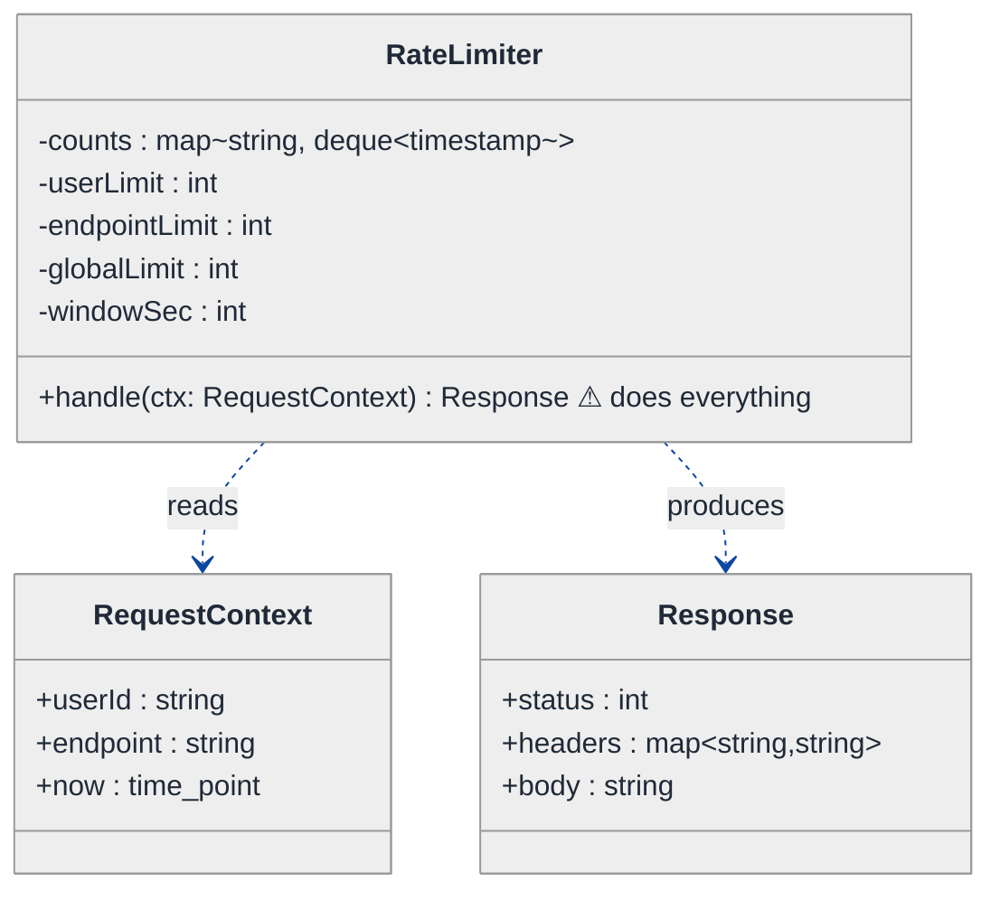
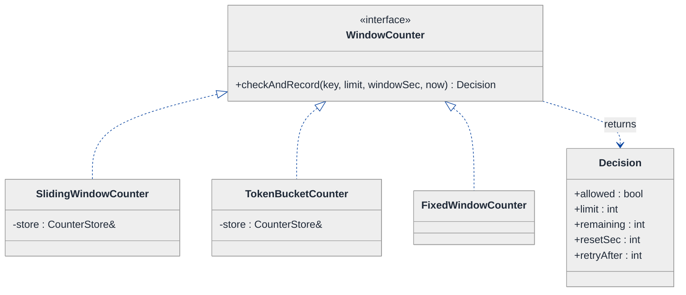
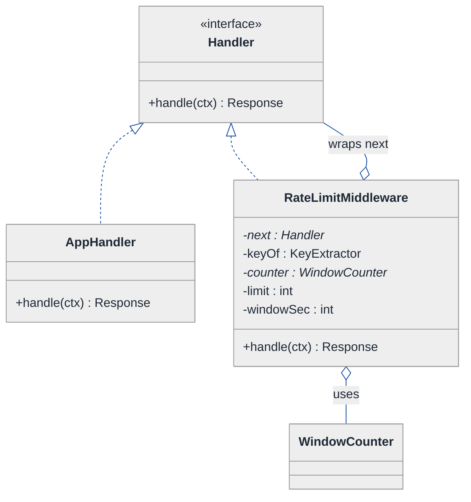
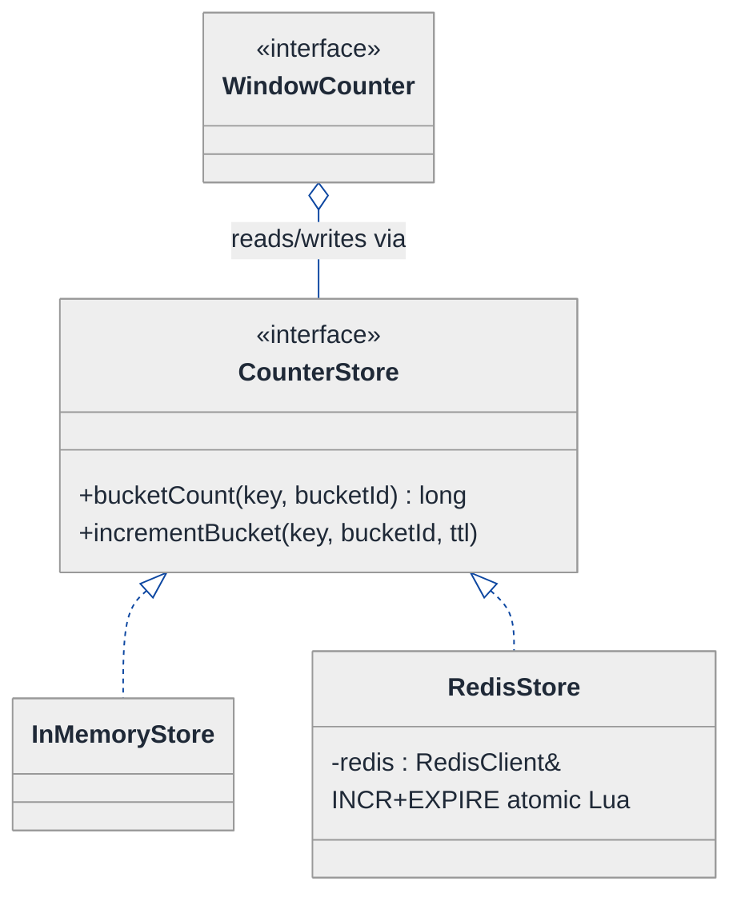
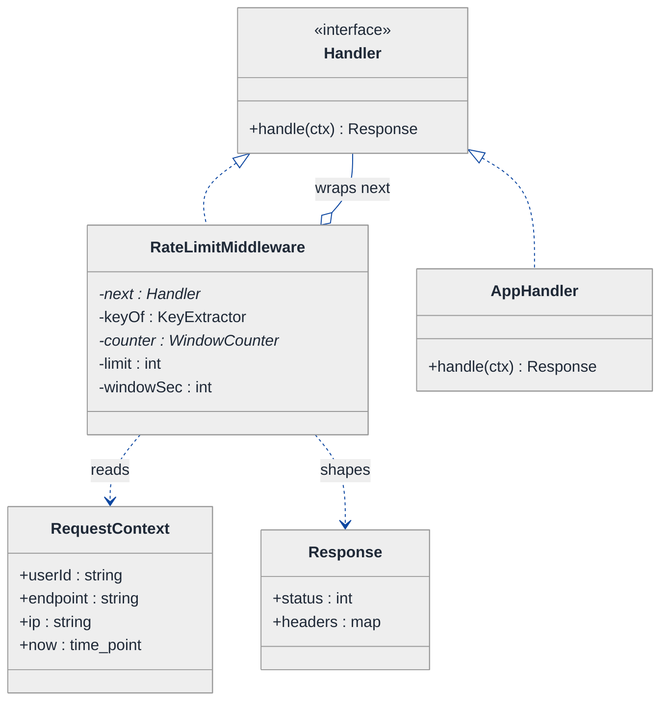
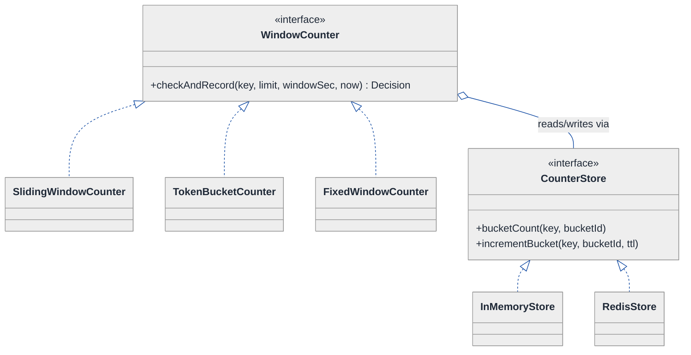
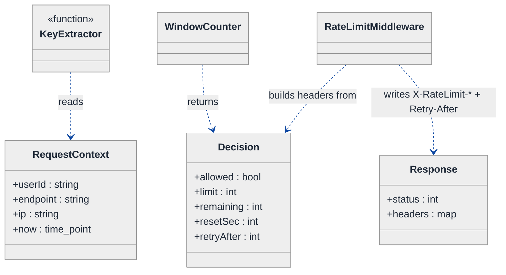
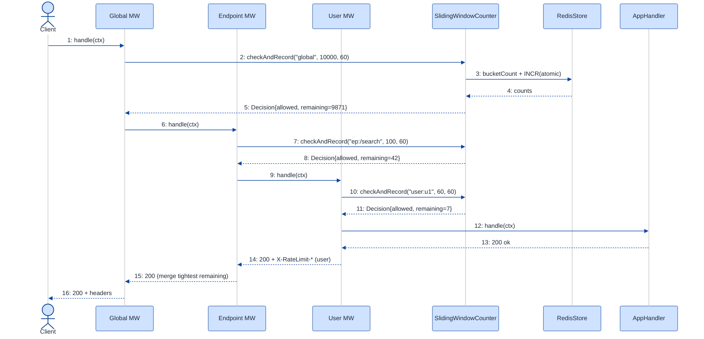
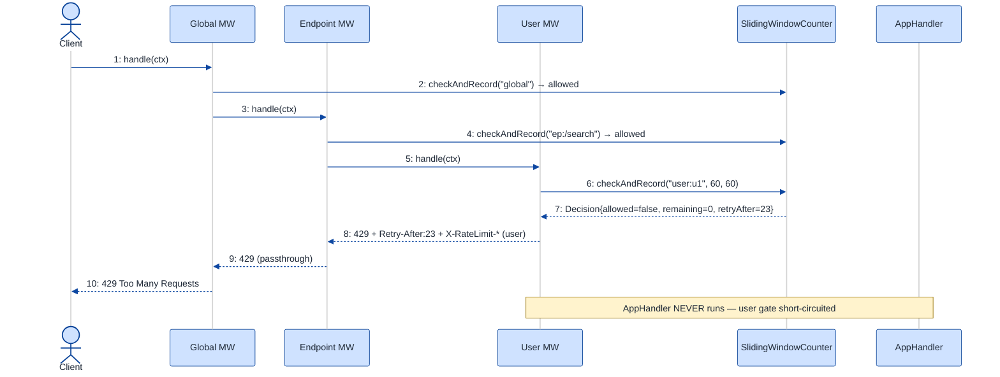

# API Rate Limiter Middleware — LLD Walkthrough

> **Difficulty:** Hard · **Time:** ~45 min · **Pattern focus:** Decorator / middleware (stacking limit scopes) + Strategy (the counting algorithm) + a distributed counter store behind a Strategy seam
>
> **Problem source(s):** GID DS7, bucket `LLD_DataStructures`. Representative of the "design an API rate limiter" family in [`./EXTRACTED_QUESTIONS.md`](./EXTRACTED_QUESTIONS.md).
>
> **Diagrams:** inline mermaid (renders natively in GitHub / VS Code). Canonical theme block per the repo convention — no `look: handDrawn`.

---

## How to use this file

Paced for a candidate who has built an HTTP service but never *designed* a reusable rate limiter. Reading time: ~45 minutes if you sketch each iteration by hand. **The lesson: don't reach for "a class with a Redis call and three `if` blocks" up front — DERIVE the structure by writing the naive middleware first, watching it break under four hypothetical changes, and reaching for ONE pattern per painful axis: Decorator to stack scopes, Strategy to swap the counting algorithm, and a store seam to go distributed.**

**Map of this file (15 sections):**

1. Problem statement + clarifying questions
2. Plain-English restatement
3. Why this matters
4. Mental model
5. Try it yourself first
6. Entity & verb extraction
7. **Iteration 1: the naive design** — what we'd write first
8. **Where the naive design hurts** — four future requirements, one painful diff each
9. **Pivot 1: Strategy for the counting algorithm** — the most painful axis first
10. **Pivot 2: Decorator/middleware chain for stacking scopes** — wrapping, not branching
11. **Pivot 3: a Store Strategy for distributed deployment** — swap memory for Redis
12. Final UML class diagram
13. Skeleton code (C++)
14. Key flow — sequence diagram
15. Extensibility re-check + anti-patterns + how to think aloud + self-check

---

## 1. Problem statement + clarifying questions

**Prompt (typical phrasing):** "Design an API rate limiter middleware that supports per-user, per-endpoint, and global rate limits using sliding window counters. Include rate limit headers in responses and support distributed deployment."

**Clarifying questions to ask BEFORE drawing anything:**

1. **Which scopes, and how do they combine?** Per-user, per-endpoint, per-IP, global — and if a request would pass the user limit but trip the global limit, does it get rejected? (Assume: a request must satisfy ALL applicable limits; the *most restrictive* one wins, and its headers are the ones returned.)
2. **Which window algorithm, exactly?** "Sliding window" is ambiguous — true sliding-log (store every timestamp), or sliding-window-counter (the cheaper weighted-bucket approximation)? Could the same deployment want fixed-window or token-bucket on different routes?
3. **What's the identity key?** Is "user" an authenticated user id, an API key, or a tenant? Where does the limiter get it from — a header, a JWT claim, the socket IP?
4. **What exactly goes in the response?** `X-RateLimit-Limit`, `X-RateLimit-Remaining`, `X-RateLimit-Reset`, and `Retry-After` on a 429? Do we return headers on allowed requests too, or only on rejection?
5. **Distributed: how many nodes, and is exact correctness required?** Do all app servers share one counter (strong, via Redis), or is approximate per-node limiting acceptable (cheap, no network hop)?
6. **Fail-open or fail-closed?** If the counter store (Redis) is unreachable, do we allow the request (availability) or reject it (protection)?
7. **Hot-reload of limits?** Can an operator change "100 req/min for /search" at runtime without a redeploy?

**Assumptions if interviewer dodges:** multiple scopes that ALL must pass (most-restrictive wins), sliding-window-counter as the default algorithm but pluggable, identity from a request context, standard `X-RateLimit-*` headers on every response plus `Retry-After` on 429, distributed via a shared store with a fail-open policy, runtime-configurable limits. We discuss concurrency and clock skew in §15.

---

## 2. Plain-English restatement

We're building a piece of middleware that sits in front of an HTTP handler. Before the real handler runs, the limiter looks at the incoming request, figures out which limits apply (this user, this endpoint, everyone globally), and asks each one "has this caller used up their quota in the recent time window?" If every applicable limit says "you have room," the request passes through and we attach headers telling the caller how much budget remains. If any limit is exhausted, we short-circuit with `429 Too Many Requests` and a `Retry-After`. The same code must run on one box (counters in memory) or fifty boxes (counters in a shared store) **without rewriting the decision logic**.

---

## 3. Why this matters

Rate limiting is the canonical "cross-cutting concern" LLD question — it tests whether you can wrap behavior around a request pipeline without polluting business logic, and whether you can separate three orthogonal axes that beginners weld together: *what algorithm counts* (sliding window vs token bucket), *what scope a limit applies to* (user vs endpoint vs global), and *where the count is stored* (memory vs Redis). The senior signal is recognizing that "supports per-user, per-endpoint, AND global" is a composition problem (Decorator/middleware chain), not an inheritance or giant-`if` problem. It reappears in any interceptor, auth filter, retry wrapper, or feature-flag gate.

---

## 4. Mental model

A rate limiter is a **turnstile with a rule-book**. The turnstile is the middleware seat — every request passes through it before reaching the handler. The rule-book has three axes that change INDEPENDENTLY: the *counting method* (how we decide "too many"), the *who/what* a rule keys on (user, endpoint, global), and the *ledger* where counts are kept (local notebook vs a shared central ledger).

```
Real-world sketch (NOT a UML diagram yet):

   request ──►┌─────────────────────────────────────────────┐──► handler
              │  Turnstiles in series (must pass ALL)         │
              │                                               │
              │  [ global: 10k/min ]                          │   each turnstile:
              │        │ pass                                 │     - builds a key
              │        ▼                                      │     - asks the ledger
              │  [ per-endpoint: /search 100/min ]            │       "count in window?"
              │        │ pass                                 │     - allow / 429
              │        ▼                                      │
              │  [ per-user: 60/min ]  ── trip ──► 429 + headers
              └─────────────────────────────────────────────┘
                          ▲
                          │ counts read/written here
                  ┌───────┴────────┐
                  │  Ledger        │  local map (1 box)  OR  Redis (N boxes)
                  └────────────────┘
```

The KEY insight from this picture: the turnstiles are a CHAIN (each wraps the next), the counting method inside a turnstile is a swappable POLICY, and the ledger is a swappable BACKEND. Chain vs policy vs backend — that's the three-way separation we'll bake into the design.

---

## 5. Try it yourself first

> **Predict before reading on:**
>
> 1. List 5 nouns you'd promote to a class. List 3 nouns you'd leave as plain fields/values.
> 2. **If I told you that next quarter you'll need token-bucket on `/upload` but sliding-window everywhere else, what would change about how you write the "count and decide" code?**
> 3. If "per-user AND per-endpoint AND global, all must pass" is the rule, how do you avoid writing one method with three nested `if (overLimit)` blocks?

---

## 6. Entity & verb extraction

> **Mini-refresher: noun → class, but not every noun.**
>
> Naive OOD promotes every noun to a class. Senior OOD promotes a noun only if it has both BEHAVIOR and STATE that need to live together. "Limit = 100" stays a value; "the thing that decides whether a key is over its limit" becomes a class because it owns an algorithm.

**Nouns from the prompt:**

| Noun | Decision | Why |
|---|---|---|
| RateLimiter (middleware) | Class | The turnstile seat; orchestrates check → allow/reject |
| RateLimitRule | Class | A (scope-key, limit, window) policy bundle |
| Decision / verdict | Class (small value object) | Carries allowed?, remaining, resetAt, retryAfter |
| Counter / window | Class (abstract) + concrete | Owns the counting algorithm — the variability point |
| CounterStore | Class (abstract) + concrete | Where counts live: memory or Redis |
| RequestContext | Class | Identity + endpoint + timestamp the limiter reads |
| Response headers | Built FROM Decision, not a class | Derived output, no behavior of its own |
| "user" / "endpoint" / "global" | A KeyExtractor function/strategy | How we derive the bucket key — varies |
| Time / window seconds | Value (`int seconds`, `time_point now`) | No domain behavior |

**Verbs (and the class they live on):**

| Verb | Owner class (naive answer — we'll re-examine) |
|---|---|
| handle(request) | RateLimiter (middleware) |
| isAllowed(key) | the limiter / counter |
| increment(key) | CounterStore |
| computeDecision(key, now) | Counter (window algorithm) |
| buildHeaders(decision) | RateLimiter |
| keyFor(context) | KeyExtractor |

**We have NOT introduced any design patterns yet.** Pure nouns + verbs.

---

## 7. <a id="iter-1"></a>Iteration 1: the naive design

Let's write the simplest thing that could possibly work. No design patterns — one middleware class with the counting math, the scope logic, and the storage all inlined.



**Reader's tour (read top to bottom; ~60 seconds).**

1. **At the top — `RateLimiter` is the whole show.** It holds the count storage (`counts`), three hardcoded limit numbers, the window length, and ONE public method `handle()`. Notice: no separate counter object, no store abstraction, no scope objects. Every decision lives inside `handle()`.

2. **`counts` is a map from key → deque of timestamps.** That's a true sliding-log: for each key we keep every request time and evict the ones older than the window. Correct, but it bakes the algorithm choice into a field type.

3. **The three limit fields (`userLimit`, `endpointLimit`, `globalLimit`)** encode "we support exactly three scopes" as three separate `int`s. Adding a fourth scope means a fourth field and a fourth code block.

4. **`RequestContext` and `Response` are honest value objects** — they carry data, no behavior. Those are fine as-is.

5. **The ⚠ on `handle()` is the trouble zone.** It builds three keys, runs the windowing math three times, applies three limits, picks the most restrictive, and formats headers — all in one method with the storage hardcoded to an in-process map.

Skeleton code for the naive design (C++):

```cpp
#include <chrono>
#include <deque>
#include <string>
#include <unordered_map>

using Clock = std::chrono::system_clock;
using TimePoint = Clock::time_point;

struct RequestContext { std::string userId; std::string endpoint; TimePoint now; };
struct Response       { int status; std::unordered_map<std::string,std::string> headers; std::string body; };

class RateLimiter {
public:
    RateLimiter(int userLimit, int endpointLimit, int globalLimit, int windowSec)
        : userLimit_(userLimit), endpointLimit_(endpointLimit),
          globalLimit_(globalLimit), windowSec_(windowSec) {}

    Response handle(const RequestContext& ctx) {
        const auto window = std::chrono::seconds(windowSec_);

        // --- per-user ---
        auto& uq = counts_["user:" + ctx.userId];
        evictOld(uq, ctx.now, window);
        bool userOver = uq.size() >= (size_t)userLimit_;

        // --- per-endpoint ---
        auto& eq = counts_["ep:" + ctx.endpoint];
        evictOld(eq, ctx.now, window);
        bool epOver = eq.size() >= (size_t)endpointLimit_;

        // --- global ---
        auto& gq = counts_["global"];
        evictOld(gq, ctx.now, window);
        bool globalOver = gq.size() >= (size_t)globalLimit_;

        if (userOver || epOver || globalOver) {            // ⚠ scope logic inlined
            Response r{429, {}, "rate limited"};
            r.headers["Retry-After"] = std::to_string(windowSec_);
            // ⚠ which limit's headers? whichever we remember to compute…
            return r;
        }

        // passed: record the hit against all three
        uq.push_back(ctx.now); eq.push_back(ctx.now); gq.push_back(ctx.now);

        Response r{200, {}, ""};
        r.headers["X-RateLimit-Limit"]     = std::to_string(userLimit_);
        r.headers["X-RateLimit-Remaining"] = std::to_string(userLimit_ - (int)uq.size());
        return r;  // calls the real handler elsewhere
    }
private:
    void evictOld(std::deque<TimePoint>& q, TimePoint now, std::chrono::seconds w) {
        while (!q.empty() && q.front() <= now - w) q.pop_front();  // ⚠ sliding-log baked in
    }
    std::unordered_map<std::string, std::deque<TimePoint>> counts_;  // ⚠ in-process only
    int userLimit_, endpointLimit_, globalLimit_, windowSec_;
};
```

**This works.** It has zero design patterns. On a single box it correctly enforces three sliding-log limits and emits a couple of headers. So what's wrong with it?

---

## 8. <a id="naive-pain"></a>Where the naive design hurts

The interviewer slides a piece of paper across the desk: "Here are four things coming next quarter. Walk me through what changes."

### Change A: "Use token-bucket on `/upload`, keep sliding-window everywhere else"

In the naive design:
- The windowing algorithm is `evictOld` + `deque.size()` — a sliding-log hardcoded into `handle()`.
- Token-bucket needs different state (tokens + last-refill time), different math, and a different storage shape.
- **You'd add `if (ctx.endpoint == "/upload") { ...token bucket... } else { ...sliding log... }` inside `handle()`** — and `counts_` can no longer be one map type. The smell: the *algorithm* is welded to the orchestration.

### Change B: "Add a per-IP limit and a per-API-key limit"

In the naive design:
- Two more limit fields, two more `evictOld` blocks, two more `||` clauses in the reject condition.
- **`handle()` grows by ~10 lines per new scope**, and the "most restrictive wins / whose headers do we return" logic gets murkier each time. Five scopes in, the method is a 70-line wall.

### Change C: "Support distributed deployment — all app servers share one counter"

In the naive design:
- `counts_` is a private in-process `unordered_map`. Two boxes = two independent counters = each box allows the full limit, so the real limit is 2×.
- To fix it you must replace every `counts_[...]`, `evictOld`, and `push_back` with a Redis round-trip (and an atomic Lua script to avoid the read-modify-write race).
- **The storage calls are scattered across four places in `handle()`** — there's no single seam to swap. The smell: persistence is tangled into the decision logic.

### Change D: "Operators must change limits at runtime + headers must always reflect the binding limit"

In the naive design:
- Limits are constructor `int`s — changing them needs a restart.
- The header block only ever reports the per-user limit; when the *global* limit is the one that trips, the caller gets misleading `X-RateLimit-*` values.
- **Fixing this means threading "which limit was the binding one" out of the `||` expression** — but a boolean `||` has thrown that information away.

### The pattern of pain

| Change | Files / sites touched | Smell |
|---|---|---|
| A. token-bucket on one route | `handle()` + the `counts_` field type | "Algorithm welded to orchestration." |
| B. per-IP + per-key scopes | `handle()` grows per scope; reject `||` chain | "Each new scope is surgery in one method." |
| C. distributed counter | every `counts_`/`evictOld`/`push_back` site | "Storage tangled into the decision; no seam to swap." |
| D. runtime limits + correct headers | constructor + header block + the `||` | "Boolean OR discards *which* limit bound." |

**Three axes of pain dominate:** the counting *algorithm* varies (A), the set of *scopes* varies and they must STACK (B, D), and the *storage backend* varies (C). Plus a quieter lesson from D: the decision must carry structured data (which limit, remaining, reset), not a bare bool.

> **Pivot question:** "What pattern swaps an *algorithm* picked by config (sliding window vs token bucket)? What pattern *stacks* independent gates that each wrap the next (user → endpoint → global)? And what pattern hides *where the count is stored* behind one seam?"
>
> The answers are Strategy, Decorator (the middleware-chain flavor), and another Strategy for the store. Let's introduce them one at a time, starting with the most painful axis: the counting algorithm.

---

## 9. <a id="pivot-1"></a>Pivot 1: Strategy for the counting algorithm

> **Mini-refresher: Strategy pattern.**
>
> Encapsulates an algorithm behind an interface so it can be swapped at runtime. The CALLER (here: config / the rule that owns it) decides which strategy to use; the strategy doesn't know about its peers.
>
> Quick example: a `Sorter` takes a `CompareStrategy*` in its constructor. Pass `Ascending` or `Descending` — the sorter doesn't care which.

**Why Strategy fits the counting algorithm.** "Given a key and `now`, is this caller over the limit, and what's the remaining/reset?" is an algorithm. It varies — sliding-log, sliding-window-counter, fixed-window, token-bucket. The choice is made externally (per route, by config), not by the orchestration. That's textbook Strategy. We give it a narrow contract that returns a structured `Decision` (solving Change D's "bare bool threw away info" smell at the same time).

**The refactor (just the affected part):**

```cpp
struct Decision {
    bool   allowed;
    int    limit;        // the limit that was evaluated
    int    remaining;    // budget left in the current window
    int    resetSec;     // seconds until the window frees up
    int    retryAfter;   // seconds to wait if !allowed (0 if allowed)
};

// The algorithm seam. It does NOT know about scopes or HTTP.
class WindowCounter {
public:
    virtual ~WindowCounter() = default;
    // checkAndRecord: atomically test the limit and (if allowed) record the hit.
    virtual Decision checkAndRecord(const std::string& key, int limit,
                                    int windowSec, TimePoint now) = 0;
};

// Sliding-window-counter: the cheap weighted approximation of a true sliding log.
class SlidingWindowCounter : public WindowCounter {
public:
    explicit SlidingWindowCounter(CounterStore& store) : store_(store) {}
    Decision checkAndRecord(const std::string& key, int limit,
                            int windowSec, TimePoint now) override {
        // weight the previous fixed bucket by how far we are into the current one,
        // add the current bucket's count → an estimate that "slides".
        long cur  = store_.bucketCount(key, currentBucket(now, windowSec));
        long prev = store_.bucketCount(key, currentBucket(now, windowSec) - 1);
        double overlap = fractionRemainingInPrevBucket(now, windowSec);
        double est = prev * overlap + cur;
        bool allowed = est < limit;
        if (allowed) store_.incrementBucket(key, currentBucket(now, windowSec), windowSec);
        int remaining = std::max(0, limit - (int)est - (allowed ? 1 : 0));
        return { allowed, limit, remaining, windowSec, allowed ? 0 : windowSec };
    }
private:
    CounterStore& store_;   // storage seam — see Pivot 3
    // currentBucket / fractionRemainingInPrevBucket elided
};

// Token-bucket: refill at a steady rate, allow if a token is available.
class TokenBucketCounter : public WindowCounter {
public:
    explicit TokenBucketCounter(CounterStore& store) : store_(store) {}
    Decision checkAndRecord(const std::string& key, int limit,
                            int windowSec, TimePoint now) override; // refill + take, elided
private:
    CounterStore& store_;
};
// SlidingLogCounter, FixedWindowCounter elided — same interface
```

**What changed — visualized.** Just the counting slice:



**Tour of the after-state.**

1. **The `<<interface>>` box at the top.** `WindowCounter` has ONE method, `checkAndRecord(key, limit, windowSec, now) → Decision`. The contract is deliberately narrow: it knows nothing about HTTP, nothing about "user vs endpoint." It just answers "is this key over `limit` in this window?" and records the hit if allowed.

2. **Concrete algorithms hang below.** `SlidingWindowCounter` (the weighted two-bucket approximation the prompt asks for), `TokenBucketCounter`, `FixedWindowCounter`. Each is interchangeable. Change A from §8 — token-bucket on `/upload` — becomes "give that route's rule a `TokenBucketCounter`," not an `if` in `handle()`.

3. **`Decision` is a structured return, not a bool.** This directly kills Change D's "boolean OR threw away which limit bound" smell. Every check now reports its own limit/remaining/reset, so headers can reflect the actual binding limit.

4. **Why `checkAndRecord` is one atomic call, not `isAllowed()` then `record()`.** Splitting them invites a check-then-act race under concurrency (two threads both see "room left," both record). Fused into one method, the implementation can do it atomically (a Redis Lua script in the distributed case). The interface *shape* enforces correctness.

**Change A now lands cleanly:** `/upload` gets a rule whose counter is a `TokenBucketCounter`; everything else keeps a `SlidingWindowCounter`. No branching in the orchestration.

**Pattern-discrimination cheatsheet — Strategy vs Template Method.**
- *Strategy:* the whole algorithm is one swappable object, chosen at runtime via composition.
- *Template Method:* the skeleton lives in a base class; subclasses fill in hooks via inheritance.
- *Rule of thumb:* if the variants are picked by config and might differ per route → Strategy. If there's a fixed "evict old → count → compare" skeleton with only the eviction differing → Template Method.

We chose Strategy because token-bucket and sliding-window share almost NO skeleton (different state, different math) — there's no common template to factor, so a clean per-algorithm object is the better fit.

---

## 10. <a id="pivot-2"></a>Pivot 2: Decorator / middleware chain for stacking scopes

Change B from §8 is still painful — adding per-IP and per-API-key scopes balloons `handle()`, and the `||` reject chain can't say *which* limit bound. A counting Strategy doesn't help here: the variability is not the algorithm, it's *how many independent gates a request must pass and how they stack*.

> **Mini-refresher: Decorator pattern (the middleware-chain flavor).**
>
> A Decorator implements the SAME interface as the thing it wraps, holds a pointer to a "next," does its own work, then delegates to next. Stacking decorators builds a pipeline where each layer adds one responsibility. The caller sees one object; behind it is a chain. HTTP middleware is exactly this pattern.

**Why Decorator (not a giant method, not inheritance).** Each scope is an independent gate that either rejects (short-circuit with 429) or passes the request to the next gate. That "do my check, then delegate to next" shape IS the Decorator. Stacking `Global → Endpoint → User` around the real handler means "a request must clear all three," and each gate is added or removed by changing the wrapping order — no edits to the others. Inheritance can't express "stack three of these in a chosen order at runtime"; composition can.

**The refactor (just the chaining part):**

```cpp
// Everything in the pipeline — limiters AND the real handler — shares ONE interface.
class Handler {
public:
    virtual ~Handler() = default;
    virtual Response handle(const RequestContext& ctx) = 0;
};

// The terminal handler: the actual business endpoint.
class AppHandler : public Handler {
public:
    Response handle(const RequestContext& ctx) override { /* real work */ return {200, {}, "ok"}; }
};

// A KeyExtractor turns a request into the bucket key for ONE scope. (Strategy-ish role.)
using KeyExtractor = std::function<std::string(const RequestContext&)>;

// The Decorator: one rate-limit gate that wraps the next Handler.
class RateLimitMiddleware : public Handler {
public:
    RateLimitMiddleware(std::unique_ptr<Handler> next,
                        KeyExtractor keyOf, std::shared_ptr<WindowCounter> counter,
                        int limit, int windowSec, std::string scopeName)
        : next_(std::move(next)), keyOf_(std::move(keyOf)), counter_(std::move(counter)),
          limit_(limit), windowSec_(windowSec), scope_(std::move(scopeName)) {}

    Response handle(const RequestContext& ctx) override {
        Decision d = counter_->checkAndRecord(keyOf_(ctx), limit_, windowSec_, ctx.now);
        if (!d.allowed) {
            Response r{429, {}, "rate limited"};
            writeHeaders(r, d);                 // this gate's own limit → honest headers
            r.headers["Retry-After"] = std::to_string(d.retryAfter);
            return r;                            // short-circuit: do NOT call next_
        }
        Response r = next_->handle(ctx);         // delegate down the chain
        mergeMostRestrictive(r, d);              // expose the tightest remaining budget
        return r;
    }
private:
    void writeHeaders(Response& r, const Decision& d) {
        r.headers["X-RateLimit-Limit"]     = std::to_string(d.limit);
        r.headers["X-RateLimit-Remaining"] = std::to_string(d.remaining);
        r.headers["X-RateLimit-Reset"]     = std::to_string(d.resetSec);
    }
    void mergeMostRestrictive(Response& r, const Decision& d); // keep the smallest remaining
    std::unique_ptr<Handler>        next_;
    KeyExtractor                    keyOf_;
    std::shared_ptr<WindowCounter>  counter_;
    int limit_, windowSec_;
    std::string scope_;
};
```

Building the pipeline is just nesting wrappers — the order is the policy:

```cpp
// global( endpoint( user( app ) ) ) — request clears user first, then endpoint, then global.
auto pipeline =
  std::make_unique<RateLimitMiddleware>(
    std::make_unique<RateLimitMiddleware>(
      std::make_unique<RateLimitMiddleware>(
        std::make_unique<AppHandler>(),
        userKey,     counter, 60,    60, "user"),
      endpointKey,   counter, 100,   60, "endpoint"),
    globalKey,       counter, 10000, 60, "global");
```

**What changed — visualized.** Just the chaining slice:



**Tour of the after-state.**

1. **One interface to rule the pipeline.** `Handler` has a single method `handle(ctx) → Response`. BOTH the real endpoint (`AppHandler`) and each limiter (`RateLimitMiddleware`) implement it. That shared interface is what lets them nest.

2. **The self-reference is the Decorator signature.** `RateLimitMiddleware o-- Handler : wraps next` — a middleware HOLDS another `Handler`. That "I am a Handler that wraps a Handler" loop is exactly the Decorator structure. The wrapped thing might be the real handler or another middleware; the wrapper neither knows nor cares.

3. **Short-circuit vs delegate.** `handle()` runs ITS check, and if the gate trips, returns 429 immediately *without* calling `next_`. If it passes, it calls `next_->handle(ctx)` and lets the request descend. Each gate adds exactly one responsibility.

4. **`KeyExtractor` carries the scope.** "Per-user" vs "per-endpoint" vs "global" is now just a different `KeyExtractor` lambda passed to the same middleware class. Change B from §8 — add per-IP and per-API-key — becomes two more `make_unique<RateLimitMiddleware>(...)` wraps with `ipKey` / `apiKeyKey`. Zero edits to existing gates.

5. **Honest headers fall out.** Because each gate carries its OWN `Decision`, the 429 it emits uses *its* limit/remaining/reset, and `mergeMostRestrictive` keeps the tightest budget on the success path. Change D's misleading-headers smell is gone.

**Pattern-discrimination cheatsheet — Decorator vs Chain of Responsibility.**
- *Decorator:* every wrapper does its work AND (normally) delegates to the next; the goal is to *augment* the same operation. Each layer contributes to one response.
- *Chain of Responsibility:* exactly ONE handler in the chain is meant to handle the request; the rest pass it along untouched.
- *Rule of thumb:* if every layer participates (each gate must approve, each adds headers) → Decorator. If you're looking for the *first* handler that claims the request → CoR.

This is a Decorator: every gate participates (all must approve, all can shape headers). It happens to short-circuit on rejection, but that's an early-exit optimization, not "one handler claims it."

---

## 11. <a id="pivot-3"></a>Pivot 3: a Store Strategy for distributed deployment

Changes A, B, D are solved. Change C — "all app servers share one counter" — is not. Notice the counting Strategies in Pivot 1 already reference a `CounterStore&` they read/write through. That was deliberate: the *where counts live* axis was factored out as its own seam so distribution becomes a swap, not a rewrite.

> **Mini-refresher: why a second Strategy here, not a subclass of the counter.**
>
> Strategy is a *role*, not a single type. `WindowCounter` answers "how do we count?"; `CounterStore` answers "where do the numbers live?" They vary INDEPENDENTLY — sliding-window-over-memory, sliding-window-over-Redis, token-bucket-over-Redis are all valid combinations. Two orthogonal axes → two interfaces, composed, not one combinatorial inheritance tree.

**The store seam:**

```cpp
class CounterStore {
public:
    virtual ~CounterStore() = default;
    virtual long bucketCount(const std::string& key, long bucketId) = 0;
    virtual void incrementBucket(const std::string& key, long bucketId, int ttlSec) = 0;
};

// Single-box: counts in a process-local map. Fast, no network, NOT shared.
class InMemoryStore : public CounterStore {
public:
    long bucketCount(const std::string& key, long bucketId) override {
        auto it = m_.find(field(key, bucketId));
        return it == m_.end() ? 0 : it->second;
    }
    void incrementBucket(const std::string& key, long bucketId, int) override {
        m_[field(key, bucketId)] += 1;   // single-thread shown; guard with a mutex in prod
    }
private:
    static std::string field(const std::string& k, long b) { return k + ":" + std::to_string(b); }
    std::unordered_map<std::string, long> m_;
};

// Distributed: counts in Redis, shared across all app nodes.
class RedisStore : public CounterStore {
public:
    explicit RedisStore(RedisClient& redis) : redis_(redis) {}
    long bucketCount(const std::string& key, long bucketId) override {
        return redis_.getLong(field(key, bucketId));     // 0 if missing
    }
    void incrementBucket(const std::string& key, long bucketId, int ttlSec) override {
        // INCR + EXPIRE in ONE Lua script → atomic, no read-modify-write race across nodes.
        redis_.evalIncrWithTtl(field(key, bucketId), ttlSec);
    }
private:
    static std::string field(const std::string& k, long b) { return k + ":" + std::to_string(b); }
    RedisClient& redis_;
};
```

**What changed — visualized.** Just the store slice:



**Tour of the after-state.**

1. **`CounterStore` is a tiny interface — two methods.** `bucketCount` (read) and `incrementBucket` (write, with a TTL so old buckets self-expire). That's the entire surface the counting algorithm needs. Persistence is now ONE seam, not four scattered call sites.

2. **`InMemoryStore` is the single-box implementation.** Process-local map. Fast, zero network, but each box has its own — fine for dev or sticky-session deployments.

3. **`RedisStore` is the distributed implementation.** Same two methods, backed by Redis so every app node reads/writes the SAME counts. Change C from §8 — shared counter across servers — is now "construct counters with a `RedisStore` instead of an `InMemoryStore`." No edits to `WindowCounter`, `RateLimitMiddleware`, or the pipeline.

4. **The atomicity note on `incrementBucket`.** A naive distributed counter does `GET` then `SET count+1` — two round-trips, and two nodes can interleave and both write the same value (lost update). `RedisStore` does `INCR` + `EXPIRE` in ONE Lua script: atomic on the Redis side, so concurrent nodes can't race. This is why Pivot 1 fused check-and-record into a single method — the interface shape lets the store keep it atomic.

5. **Fail-open vs fail-closed lives here.** If `RedisStore` can't reach Redis, the decision (allow or reject) is a one-line policy in this class — keeping it isolated means the rest of the system never grows a `try/catch` around persistence.

**The lesson.** Once "swap an algorithm picked by config" was recognized as Strategy in Pivot 1, the same shape applied to the storage axis for free — a second, orthogonal Strategy. Pattern recognition makes the third pivot the cheapest one.

---

## 12. <a id="fig-class-diagram"></a>Final class diagram

Drawing all of it in one diagram becomes a wall of boxes. Here are **three focused sub-views**, each addressing one concern. Read them in order; the structural insight at the end ties them together.

### 12.1 The request pipeline — what WRAPS what



**Tour of 12.1.** One interface (`Handler`), two implementers. `RateLimitMiddleware` wraps another `Handler` (the open diamond / aggregation, self-referential) — that's the Decorator spine. `AppHandler` is the terminal leaf that does the real work. The pipeline is `global(endpoint(user(app)))`; the diagram shows the *shape* (a Handler that wraps a Handler), and the build code in §10 chose the *order*.

### 12.2 The policy axes — counting algorithm + storage



**Tour of 12.2.**

1. **Two independent interfaces, two families.** `WindowCounter` (the counting algorithm) and `CounterStore` (the persistence backend). They are ORTHOGONAL — any algorithm composes with any store.

2. **The composition arrow between them.** `WindowCounter o-- CounterStore` — a counter HOLDS a store reference and does all reads/writes through it. The algorithm never touches a map or a Redis client directly; it speaks the two-method `CounterStore` contract.

3. **The combinatorial win.** 3 algorithms × 2 stores would be 6 classes if you welded them via inheritance. With two seams it's 3 + 2 = 5, and adding a 7th algorithm or a 3rd store (Memcached) is one class, not a fresh row of combinations.

4. **This is where "sliding window" and "distributed" actually live.** The prompt's two headline requirements aren't special-cased anywhere in the pipeline — they're a choice of `SlidingWindowCounter` + `RedisStore` plugged in at construction.

### 12.3 The data that flows — RequestContext in, Decision/Response out



**Tour of 12.3.**

1. **`RequestContext` is the read-only input.** Identity (`userId`, `ip`), the `endpoint`, and `now`. Each `KeyExtractor` reads only what its scope needs — `userKey` reads `userId`, `globalKey` ignores everything and returns the constant `"global"`.

2. **`Decision` is the structured verdict.** Not a bool. It carries `limit / remaining / resetSec / retryAfter`, which is precisely what the `X-RateLimit-*` and `Retry-After` headers need. The header-building code reads straight off this object.

3. **The header mapping is mechanical.** `X-RateLimit-Limit ← limit`, `X-RateLimit-Remaining ← remaining`, `X-RateLimit-Reset ← resetSec`, and on a 429, `Retry-After ← retryAfter`. Because every gate produces its own `Decision`, the headers always describe the limit that actually bound the request.

### Structural insight (ties 12.1 + 12.2 + 12.3 together)

| Concern | Pattern used | Why |
|---|---|---|
| **Stacking scopes** (user, endpoint, global, IP, key) | Decorator / middleware chain | Each scope is an independent gate that wraps the next; order is config, not code |
| **Counting algorithm** (sliding window, token bucket, fixed) | Strategy, injected per rule | Picked by config / per route; variants share no skeleton |
| **Storage backend** (memory vs Redis) | Strategy, composed into the counter | "Where counts live" varies orthogonally to "how we count" |
| **The verdict** (allowed + remaining + reset) | Value object (`Decision`) | Structured data, so headers reflect the binding limit honestly |

The big lesson: **the three headline requirements map to three different separations.** "Per-user / per-endpoint / global" → Decorator (composition of gates). "Sliding window counters" → a swappable Strategy. "Distributed deployment" → a second swappable Strategy behind the counter. None of them is an `if` in a god-method. *Compose gates, inject policies, swap backends.*

---

## 13. Skeleton code (C++)

> Show the SHAPES, not the full impl. ~130 lines.

```cpp
#include <chrono>
#include <functional>
#include <memory>
#include <string>
#include <unordered_map>
#include <utility>

using Clock     = std::chrono::system_clock;
using TimePoint = Clock::time_point;

// ── Data that flows ─────────────────────────────────────────────────
struct RequestContext {
    std::string userId;
    std::string endpoint;
    std::string ip;
    TimePoint   now = Clock::now();
};
struct Response { int status; std::unordered_map<std::string,std::string> headers; std::string body; };
struct Decision { bool allowed; int limit; int remaining; int resetSec; int retryAfter; };

using KeyExtractor = std::function<std::string(const RequestContext&)>;

// ── Storage seam (Pivot 3) ──────────────────────────────────────────
class CounterStore {
public:
    virtual ~CounterStore() = default;
    virtual long bucketCount(const std::string& key, long bucketId) = 0;
    virtual void incrementBucket(const std::string& key, long bucketId, int ttlSec) = 0;
};

class InMemoryStore : public CounterStore {
public:
    long bucketCount(const std::string& key, long bucketId) override {
        auto it = m_.find(field(key, bucketId));
        return it == m_.end() ? 0 : it->second;
    }
    void incrementBucket(const std::string& key, long bucketId, int) override {
        m_[field(key, bucketId)] += 1;   // guard with a mutex under real concurrency
    }
private:
    static std::string field(const std::string& k, long b) { return k + ":" + std::to_string(b); }
    std::unordered_map<std::string, long> m_;
};
// RedisStore elided — same interface, INCR+EXPIRE in one atomic Lua script

// ── Counting algorithm seam (Pivot 1) ───────────────────────────────
class WindowCounter {
public:
    virtual ~WindowCounter() = default;
    virtual Decision checkAndRecord(const std::string& key, int limit,
                                    int windowSec, TimePoint now) = 0;
};

class SlidingWindowCounter : public WindowCounter {
public:
    explicit SlidingWindowCounter(std::shared_ptr<CounterStore> store)
        : store_(std::move(store)) {}
    Decision checkAndRecord(const std::string& key, int limit,
                            int windowSec, TimePoint now) override {
        long b   = bucketOf(now, windowSec);
        long cur = store_->bucketCount(key, b);
        long prv = store_->bucketCount(key, b - 1);
        double weight = prevWeight(now, windowSec);          // 0..1, fraction of prev bucket still in window
        double est = prv * weight + cur;
        bool allowed = est < limit;
        if (allowed) store_->incrementBucket(key, b, windowSec * 2);
        int remaining = std::max(0, limit - (int)est - (allowed ? 1 : 0));
        return { allowed, limit, remaining, windowSec, allowed ? 0 : windowSec };
    }
private:
    static long   bucketOf(TimePoint now, int w);            // elided: now / w
    static double prevWeight(TimePoint now, int w);          // elided: 1 - (now % w)/w
    std::shared_ptr<CounterStore> store_;
};
// TokenBucketCounter, FixedWindowCounter elided — same interface

// ── Pipeline seam (Pivot 2) ─────────────────────────────────────────
class Handler {
public:
    virtual ~Handler() = default;
    virtual Response handle(const RequestContext& ctx) = 0;
};

class AppHandler : public Handler {            // terminal leaf — the real endpoint
public:
    Response handle(const RequestContext&) override { return {200, {}, "ok"}; }
};

class RateLimitMiddleware : public Handler {   // the Decorator
public:
    RateLimitMiddleware(std::unique_ptr<Handler> next, KeyExtractor keyOf,
                        std::shared_ptr<WindowCounter> counter,
                        int limit, int windowSec)
        : next_(std::move(next)), keyOf_(std::move(keyOf)),
          counter_(std::move(counter)), limit_(limit), windowSec_(windowSec) {}

    Response handle(const RequestContext& ctx) override {
        Decision d = counter_->checkAndRecord(keyOf_(ctx), limit_, windowSec_, ctx.now);
        if (!d.allowed) {
            Response r{429, {}, "rate limited"};
            applyHeaders(r, d);
            r.headers["Retry-After"] = std::to_string(d.retryAfter);
            return r;                          // short-circuit
        }
        Response r = next_->handle(ctx);        // delegate down the chain
        applyHeaders(r, d);                     // (merge tightest remaining in prod)
        return r;
    }
private:
    static void applyHeaders(Response& r, const Decision& d) {
        r.headers["X-RateLimit-Limit"]     = std::to_string(d.limit);
        r.headers["X-RateLimit-Remaining"] = std::to_string(d.remaining);
        r.headers["X-RateLimit-Reset"]     = std::to_string(d.resetSec);
    }
    std::unique_ptr<Handler>        next_;
    KeyExtractor                    keyOf_;
    std::shared_ptr<WindowCounter>  counter_;
    int limit_, windowSec_;
};

// ── Wiring: pick algorithm + store, stack the scopes ────────────────
inline std::unique_ptr<Handler> buildPipeline() {
    auto store   = std::make_shared<InMemoryStore>();             // swap for RedisStore → distributed
    auto counter = std::make_shared<SlidingWindowCounter>(store); // swap for TokenBucketCounter → other algo

    KeyExtractor userKey   = [](const RequestContext& c){ return "user:" + c.userId; };
    KeyExtractor endpKey   = [](const RequestContext& c){ return "ep:"   + c.endpoint; };
    KeyExtractor globalKey = [](const RequestContext&)  { return std::string("global"); };

    return std::make_unique<RateLimitMiddleware>(            // global (outermost)
             std::make_unique<RateLimitMiddleware>(          // endpoint
               std::make_unique<RateLimitMiddleware>(        // user
                 std::make_unique<AppHandler>(),
                 userKey,   counter, 60,    60),
               endpKey,     counter, 100,   60),
             globalKey,     counter, 10000, 60);
}
```

---

## 14. <a id="fig-sequence"></a>Key flow — sequence diagram

This is the moment of truth — read across the swimlanes to see how the three patterns COOPERATE on one request.

### Phase 1 — request allowed (clears all gates)



**Tour of Phase 1 (allowed).**

1. **The request enters the OUTERMOST gate first (Global).** The chain was built `global(endpoint(user(app)))`, so global checks first, then delegates inward. Each gate calls the SAME `checkAndRecord` on the counter — only the key and limit differ.

2. **Each `checkAndRecord` is one atomic store interaction.** Notice the counter reads buckets and increments in the SAME call (step 3). There's no separate "isAllowed then record" — that's what prevents the concurrency race, and with `RedisStore` it's one atomic Lua script shared across nodes.

3. **Every gate gets its own `Decision`.** Global has 9871 left, endpoint 42, user 7. The numbers descend because the user scope is the tightest here.

4. **Only after ALL gates pass does the real handler run (step 12).** `AppHandler` does the business work and returns 200.

5. **Headers are written on the way back out.** The user gate writes its `X-RateLimit-*` (remaining=7, the tightest), and as the response unwinds through endpoint and global, the middleware keeps the smallest remaining. The client sees honest headers describing the binding limit.

### Phase 2 — request rejected (user gate trips)



**Tour of Phase 2 (rejected).**

1. **Global and endpoint gates pass (steps 2, 4).** They each recorded a hit and delegated inward.

2. **The user gate trips (step 7).** `checkAndRecord` returns `allowed=false` with `remaining=0` and `retryAfter=23`. Crucially, this gate did NOT call `next_` — it short-circuits.

3. **`AppHandler` never runs** (see the note). The whole point of putting limits in front: the expensive business work is skipped entirely for a throttled caller.

4. **The 429 carries the user gate's own headers.** `Retry-After: 23`, plus `X-RateLimit-*` reflecting the user limit (the one that bound). The outer gates just pass the 429 back up untouched.

### The branching that's NOT shown — and why it matters

You don't see `if (scope == USER) ... else if (scope == ENDPOINT) ...` anywhere. Each gate is the SAME `RateLimitMiddleware` class with a different `KeyExtractor` and limit. **The scope difference is data, not code paths.** And you don't see the algorithm's `if (sliding) ... else if (tokenBucket)` either — that lives behind the `WindowCounter` interface. The pipeline orchestrates; polymorphism dispatches.

---

## 15. Extensibility re-check + anti-patterns + how to think aloud + self-check

### Extensibility re-check

Revisit the four changes from [§8](#naive-pain). For each, name the SINGLE thing that changes.

| Change | Naive design impact | Final design impact |
|---|---|---|
| A. token-bucket on `/upload` | `if` in `handle()` + field type change | Give that route's gate a `TokenBucketCounter`. Done. |
| B. per-IP + per-API-key scopes | `handle()` grows; `\|\|` chain grows | Two more `RateLimitMiddleware` wraps with new `KeyExtractor`s. Done. |
| C. distributed counter | rewrite every storage call site | Construct counters with `RedisStore` instead of `InMemoryStore`. Done. |
| D. runtime limits + honest headers | thread "which limit bound" out of a bool | Limits are per-gate config; `Decision` already carries limit/remaining/reset. Done. |

Every change is a swap or a new wrap — never surgery inside a shared method. That's the open/closed principle in practice.

> **Mini-refresher: Open/Closed Principle (the "O" in SOLID).**
>
> Software should be OPEN for extension but CLOSED for modification. You add behavior by adding new classes/objects, not by editing existing ones. The Decorator chain and the two Strategy seams are exactly this: a new scope, algorithm, or store is a new class, and nothing existing gets touched.

If a future requirement forces you to change `RateLimitMiddleware`, `WindowCounter`, AND `CounterStore` together — go back to §6 and re-identify the variability points; you've conflated two axes.

### Common confusion + traps

1. **"Why not one `MultiScopeLimiter` that loops over a `vector<Rule>`?"** That works and is sometimes preferred for simple cases — but it re-centralizes the "iterate and combine" logic into one class, and you lose the ability to interleave non-limit middleware (auth, logging) in the same chain. The Decorator chain composes uniformly with ALL middleware.

2. **"Is sliding-window-counter exact?"** No — it's a weighted approximation of the true sliding log, trading a small accuracy error for O(1) memory per key (two integers, not a list of timestamps). For most APIs the approximation is well within tolerance; say so explicitly in an interview.

3. **"Why `checkAndRecord` instead of `isAllowed()` + `record()`?"** Splitting them creates a check-then-act race: two concurrent requests both read "room left," both record, both pass — the limit is breached. One atomic method (a Redis Lua script in the distributed case) closes the window.

4. **"Where does fail-open/fail-closed live?"** Inside the `CounterStore` implementation (or a thin decorator around it). If Redis is down, `RedisStore` decides whether a missing count means "allow" (fail-open, favor availability) or "reject" (fail-closed, favor protection). It stays isolated from the decision logic.

5. **"`shared_ptr` for the counter but `unique_ptr` for `next`?"** The `next` handler is owned exclusively by its wrapper (a chain is a single ownership line) → `unique_ptr`. The counter and store are SHARED across all gates (they must see the same counts) → `shared_ptr`. Ownership semantics drive the pointer choice.

### Anti-patterns

- **"God middleware"** — one `handle()` that counts, scopes, stores, and formats headers. Split into the pipeline + counter + store seams.
- **"Tag-driven algorithm"** — `if (algo == SLIDING) ... else if (algo == TOKEN) ...` inside the counter. Use the `WindowCounter` interface; let polymorphism dispatch.
- **"Storage tangled in logic"** — `unordered_map` / Redis calls sprinkled through the decision code. Hide them behind the `CounterStore` seam so memory↔Redis is a one-line swap.
- **"Bare-bool decision"** — returning `bool allowed` and reconstructing headers elsewhere. Return a structured `Decision` so headers are honest.
- **"Per-node counters called distributed"** — keeping counts in process memory on N boxes silently multiplies the real limit by N. Use a shared store when correctness across nodes matters.
- **"Singleton limiter"** — making the limiter a global singleton. Different services/routes need different limits; inject the pipeline instead.

### How to think aloud

> "Rate limiter middleware. Let me clarify scope. [Asks the §1 questions: which scopes and do they all-must-pass, which window algorithm, what headers, distributed-exact-or-approximate, fail-open vs closed.] Got it — three scopes that all must pass, sliding-window-counter default, standard headers, distributed via a shared store, fail-open.
>
> Nouns: a middleware/turnstile, a rule, a decision, a counter, a store, a request context. Verbs: handle, check-and-record, increment, build headers.
>
> I'll write the NAIVE design first — one middleware class with three limit fields, a map of deques for sliding-log, and all the scope logic plus header formatting inlined in `handle()`. It works on one box.
>
> Now stress-test it. Change A: token-bucket on one route — the algorithm is welded into `handle()`. Change B: more scopes — `handle()` balloons, the `||` chain hides which limit bound. Change C: distributed — the in-process map means each box allows the full limit. Change D: runtime limits + correct headers — a bool threw away which limit bound.
>
> Three axes: the counting algorithm varies, the scopes must stack, the storage backend varies.
>
> Pivot 1: counting becomes a `WindowCounter` Strategy returning a structured `Decision`. SlidingWindow, TokenBucket, FixedWindow. `checkAndRecord` is one atomic call to avoid a race.
>
> Pivot 2: scopes become a Decorator chain. Every limiter AND the real handler implement one `Handler` interface. Each `RateLimitMiddleware` wraps the next, does its check, short-circuits with 429 or delegates. Scope = a different `KeyExtractor`. Order = the wrapping order.
>
> Pivot 3: storage becomes a `CounterStore` Strategy the counter composes — `InMemoryStore` for one box, `RedisStore` (INCR+EXPIRE in one Lua script) for distributed. Orthogonal to the algorithm.
>
> Final: a pipeline of Decorators, each holding a Strategy counter, each counter composing a Strategy store. The four future changes all become a swap or a new wrap. Open/closed."

### Self-check

> **Self-check — the question to ask next time.**
>
> When you see "support per-X, per-Y, AND global limits with pluggable counting, deployable on N nodes," before reaching for one method with nested `if`s, ask:
>
> > **"Which axis is a STACK of gates (Decorator), which is an ALGORITHM picked by config (Strategy), and which is a BACKEND I might swap (Strategy)?"**
>
> Stacking scopes → Decorator/middleware chain. Counting method → Strategy. Storage → a second Strategy. If the requirement says "all must pass and tell the caller why," make the verdict a structured value object, not a bool. The class diagram falls out for free.

---

## Cross-references

- **Parent topic manifest:** [`./EXTRACTED_QUESTIONS.md`](./EXTRACTED_QUESTIONS.md)
- **Vertical overview:** [`../../LEARNING.md`](../../LEARNING.md)
- **Template:** [`../../TEMPLATE-v2.md`](../../TEMPLATE-v2.md)
- **Canonical exemplar:** [`../Object_Oriented_Design/Parking_Lot.md`](../Object_Oriented_Design/Parking_Lot.md)
- **Related v2 walkthroughs:**
  - Decorator Pattern deep-dive (in `../Decorator_Pattern/`)
  - Strategy Pattern deep-dive (in `../Strategy_Pattern/`)
  - Interceptor / middleware cross-cutting concerns (in `../Interceptor_Pattern/`)
  - HLD companion: rate limiting at system scale (in `../../../HLD/Topics/Rate_Limiting/`)
- **Further reading:** <a href="https://stripe.com/blog/rate-limiters" target="_blank" rel="noopener noreferrer">Stripe — Scaling your API with rate limiters</a>, <a href="https://en.wikipedia.org/wiki/Decorator_pattern" target="_blank" rel="noopener noreferrer">Decorator pattern (Wikipedia)</a>
</content>
</invoke>
