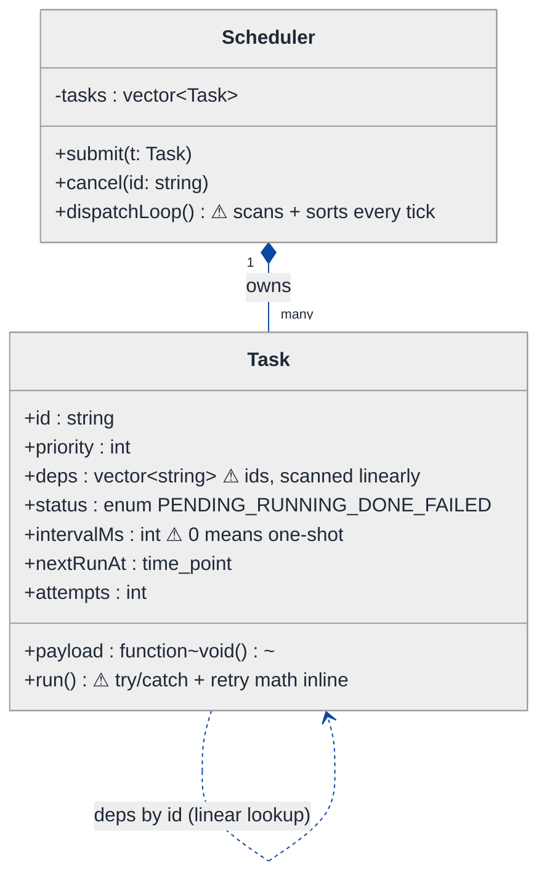
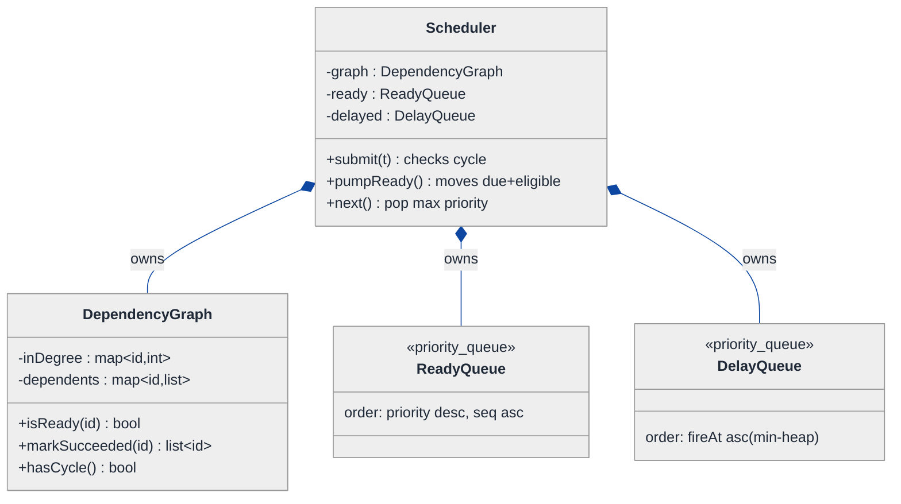
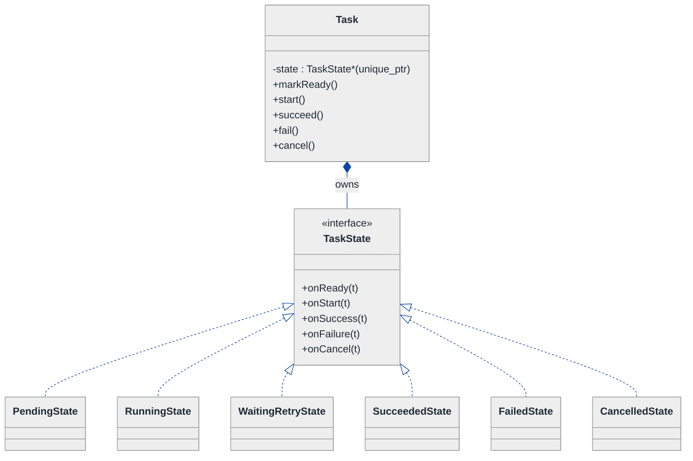
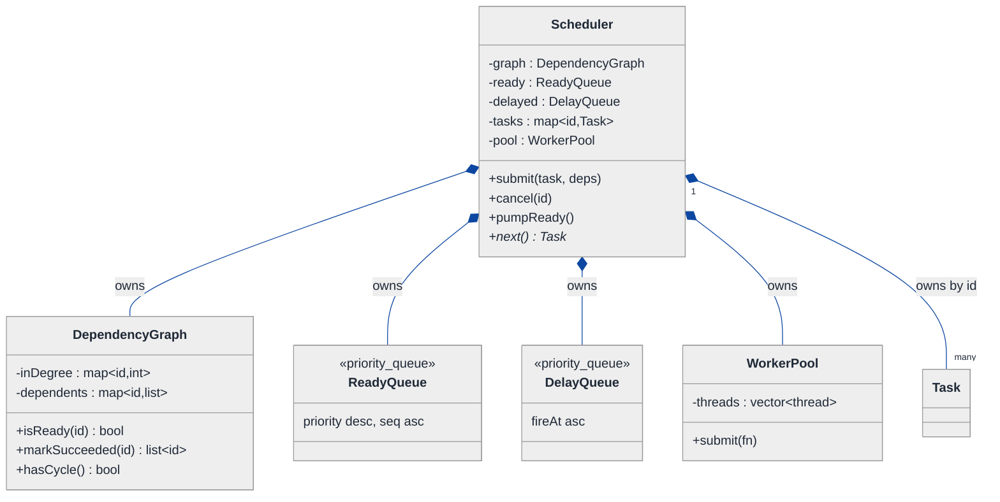
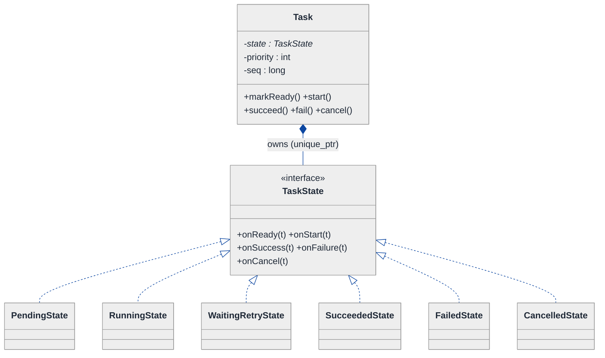
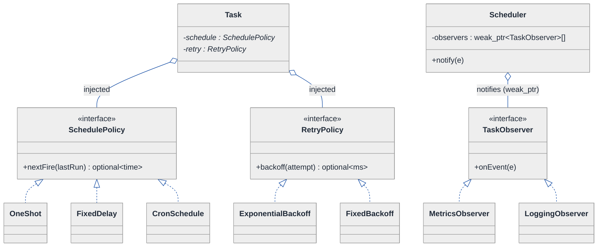
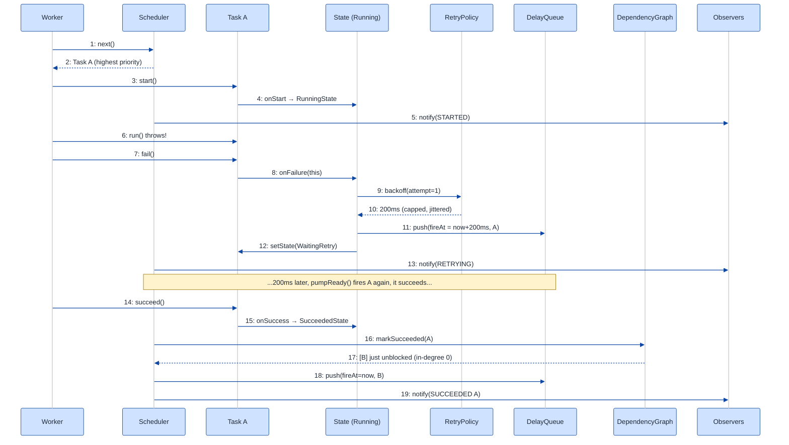

# Task Scheduler — LLD Walkthrough

> **Difficulty:** Hard · **Time:** ~45 min · **Pattern focus:** Priority queue + DAG (dependency resolution) + Observer — with State (task lifecycle) and Strategy (retry/backoff) falling out along the way
>
> **Problem source(s):** GID **DS9** (bucket `LLD_DataStructures`, Hard) in [`./EXTRACTED_QUESTIONS.md`](./EXTRACTED_QUESTIONS.md).
>
> **Diagrams:** inline mermaid (renders natively in GitHub / VS Code). No external binary sources.

---

## How to use this file

Paced for a candidate seeing "design a task scheduler" for the first time. Reading time: ~45 minutes if you sketch each iteration by hand. **The lesson: a scheduler is not one data structure — it is a *ready-set computed from a DAG*, fed into a *priority queue*, with *observers* watching lifecycle transitions. Don't reach for those three up front; DERIVE them by building the naive timer-loop, watching it collapse under dependencies, priority, cancellation, and retry, then reaching for ONE structure per painful axis.**

**Map of this file (15 sections):**

1. Problem statement + clarifying questions
2. Plain-English restatement
3. Why this matters
4. Mental model
5. Try it yourself first
6. Entity & verb extraction
7. **Iteration 1: the naive design** — a sorted list + a polling loop
8. **Where the naive design hurts** — five future requirements, one painful diff each
9. **Pivot 1: priority queue + DAG ready-set** — the dispatch core
10. **Pivot 2: State for the task lifecycle** — internal transitions, not external swaps
11. **Pivot 3: Observer for notifications + Strategy for retry/backoff**
12. Final class diagram (three sub-views)
13. Skeleton code (C++)
14. Key flow — sequence diagram
15. Extensibility re-check + anti-patterns + how to think aloud + self-check

---

## 1. Problem statement + clarifying questions

**Prompt (typical phrasing):** "Design a task scheduler that supports one-time and recurring tasks, priority-based execution, task dependencies (a DAG), cancellation, and retry with exponential backoff."

**Clarifying questions to ask BEFORE drawing anything:**

1. **Single process or distributed?** Are we building an in-process scheduler (one machine, a thread pool) or a cluster scheduler with persistence and leader election? (This LLD is in-process; distribution is a §15 discussion.)
2. **What defines "priority"?** A static integer per task, a deadline (earliest-deadline-first), or a dynamic function? Do ties break by submission order (FIFO) or by id?
3. **Dependencies — hard or soft?** Does a task run only after ALL its dependencies *succeed*, or after they merely *complete* (success or failure)? What happens to a task whose dependency permanently fails — does it get cancelled or does it run anyway?
4. **Recurrence semantics?** Fixed-rate (every 5s regardless of how long the run took) or fixed-delay (5s after the previous run *finishes*)? Cron expressions or simple intervals? Does a recurring task have dependencies too?
5. **Cancellation granularity?** Can you cancel a queued-but-not-started task only, or also interrupt a running one? Does cancelling a task cascade to its dependents?
6. **Retry policy — per task or global?** Max attempts, base delay, max delay, jitter? Is backoff capped? Does a retry keep the task's original priority or get demoted?
7. **Concurrency?** How many worker threads? Must two workers never run the same task? Is the ready-set computation thread-safe?
8. **Time source?** Wall-clock `system_clock` or a monotonic/injectable clock so tests can fast-forward?

**Assumptions if the interviewer dodges:** in-process scheduler with a fixed worker pool; priority is a static `int` (higher = sooner) with FIFO tie-break by submission sequence; a task runs only after **all dependencies succeed**; fixed-delay recurrence; cancellation works on queued tasks and *requests* cooperative interruption of running ones; per-task retry policy with exponential backoff + jitter; an **injectable clock** so we can test backoff without sleeping. We start single-threaded in §7 and add concurrency notes from §9 onward.

---

## 2. Plain-English restatement

We are building the engine that decides **what runs next and when**. Users submit tasks. A task may depend on other tasks (forming a directed acyclic graph), may be one-shot or recurring, carries a priority, can be cancelled, and — if it throws — should be retried a few times with exponentially growing delays. The engine must pick, among all tasks whose dependencies are satisfied and whose scheduled time has arrived, the highest-priority one, run it, react to success/failure (retry, reschedule, or unblock dependents), and let interested parties observe every transition — all **without rewriting the dispatch core each time a new policy appears**.

---

## 3. Why this matters

This is the canonical "compose three data-structure-flavored mechanisms cleanly" question. It is harder than parking-lot because the hard part is not a class hierarchy — it is an **invariant**: *a task becomes eligible exactly when its scheduled time has passed AND all its dependencies have succeeded*, and that eligibility must drive an ordered dispatch. Interviewers use it to see whether you can keep a DAG, a priority queue, and a time-ordered delay queue in sync without scattering the bookkeeping. The skill reappears in build systems (Bazel, Make), workflow engines (Airflow), CI runners, and OS schedulers.

---

## 4. Mental model

A scheduler is a **pipeline of three holding pens** plus a **rule-book**:

```
Real-world sketch (NOT a UML diagram yet):

   submit(task, deps, priority, when)
            │
            ▼
   ┌─────────────────┐   deps not yet met / time not due
   │  BLOCKED set     │◀──────────────────────────────┐
   │  (waiting on DAG │                                 │
   │   or on a clock) │                                 │
   └────────┬─────────┘                                 │
            │ dependency succeeded  OR  scheduled time arrived
            ▼                                            │
   ┌─────────────────┐    pop highest priority           │
   │  READY queue     │ ───────────────► [ Worker ] ──────┤ on success: unblock dependents
   │  (priority heap) │                     runs           │ on failure: re-arm with backoff (→ BLOCKED by clock)
   └─────────────────┘                                     │ recurring: re-arm next fire (→ BLOCKED by clock)
                                                           ┘
```

The KEY insight: **"ready" is computed, not stored.** A task is ready when two predicates hold — *time due* and *deps satisfied*. The DAG governs the second predicate; a time-ordered delay queue governs the first; and only tasks where BOTH hold enter the priority queue. Separating "is it eligible?" (DAG + clock) from "which eligible one runs first?" (priority) is the separation we bake into the design.

---

## 5. Try it yourself first

> **Predict before reading on:**
>
> 1. List 5 nouns you'd promote to a class and 3 you'd leave as fields.
> 2. **If priority alone decided order, a task whose dependencies are unmet might sit at the front of the queue forever blocking everything. How do you keep it OUT of the priority queue until it's eligible?**
> 3. Where does the "retry with exponential backoff" logic live — on the task, on the scheduler, or somewhere else? What makes a retried task re-enter the queue at the right time?

---

## 6. Entity & verb extraction

> **Mini-refresher: noun → class, but not every noun.**
>
> Naive OOD promotes every noun to a class. Senior OOD promotes a noun only if it has BEHAVIOR and STATE that must live together. "Priority" stays an `int` field; "Task" becomes a class because it has a lifecycle. "Dependency" is an *edge*, not a class — it lives in the graph, not as an object.

**Nouns from the prompt:**

| Noun | Decision | Why |
|---|---|---|
| Scheduler | Class (top-level coordinator) | Owns the queues + graph, orchestrates dispatch |
| Task | Class | Has lifecycle behavior + carries the user's work |
| Job / work payload | Field on Task (`std::function<void()>` or a `Runnable` interface) | The callable the task wraps |
| Dependency | **Edge in the DAG**, not a class | A relation between two tasks; lives in `DependencyGraph` |
| DependencyGraph | Class | Maintains adjacency + in-degree; computes "ready" |
| Priority | Field on Task (`int`) | No behavior of its own |
| Schedule (one-time / recurring) | **Strategy interface** `SchedulePolicy` | "When does it fire next?" varies |
| RetryPolicy | **Strategy interface** | Backoff math varies (fixed, exponential, jittered) |
| TaskState | **State interface** (PENDING / READY / RUNNING / SUCCEEDED / FAILED / CANCELLED) | Lifecycle with state-specific legality |
| Worker / thread pool | Class | Pulls from the ready queue, runs tasks |
| Observer / listener | **Observer interface** | Watches lifecycle transitions |
| Clock | Injectable interface | Test seam for time |

**Verbs (and the class they live on — naive answer, re-examined later):**

| Verb | Owner class (naive) |
|---|---|
| submit(task) | Scheduler |
| cancel(taskId) | Scheduler → delegates to Task |
| dispatchLoop() | Scheduler |
| isReady(task) | Scheduler (naive) → DependencyGraph + clock (later) |
| run() | Task → its payload |
| onSuccess() / onFailure() | Scheduler (naive) → TaskState (later) |
| nextFireTime() | Task (naive) → SchedulePolicy (later) |
| nextDelay(attempt) | Task (naive) → RetryPolicy (later) |
| notify(event) | (absent in naive) → Observer (later) |

**We have NOT introduced any design patterns yet.** Pure nouns + verbs.

---

## 7. <a id="iter-1"></a>Iteration 1: the naive design

The simplest thing that could possibly work: keep tasks in a list, store priority/deps/time as fields, and run a polling loop that scans the list, finds eligible tasks, sorts them by priority, and runs the best one. No patterns — just a struct and conditionals.



**Reader's tour (top to bottom; ~60 seconds).**

1. **`Scheduler` is the root** with one field (`tasks`) and three methods. `dispatchLoop()` is the engine: on each tick it scans EVERY task, checks `status == PENDING`, checks the clock, checks that every dependency id is `DONE`, collects the eligible ones, sorts them by priority, runs the top one. Every decision lives inside this one loop.

2. **`Task` is a fat struct.** Priority, deps (as a list of string ids), a `status` enum, an `intervalMs` (0 = one-shot, >0 = recurring), `nextRunAt`, an `attempts` counter, and the payload. The `run()` method wraps the payload in try/catch and does the retry/backoff arithmetic inline.

3. **Dependencies are ids, resolved by linear scan.** To check "are task X's deps done?", the loop looks up each dependency id in the `tasks` vector — O(deps) per task, O(N·deps) per tick. Fine for 10 tasks; quadratic-plus for 10,000.

4. **The three ⚠ markers are the trouble zones:**
   - `dispatchLoop` re-scans and re-sorts the whole world every tick — eligibility is recomputed from scratch.
   - `deps` as raw ids means no graph structure: no cycle detection, no efficient "who unblocks when X finishes?".
   - `run()` bakes recurrence (`intervalMs`), retry (`attempts`), and backoff math into one method with a `status` enum that can't express "WAITING_FOR_RETRY" vs "BLOCKED_ON_DEPS".

**What's deliberately missing.** No priority queue (we *sort* instead). No `DependencyGraph`. No `TaskState` classes. No `RetryPolicy`. No `SchedulePolicy`. No `Observer`. The naive design doesn't even *acknowledge* these as axes — it bakes a hardcoded answer for each into the loop and the struct.

Skeleton code for the naive design (C++):

```cpp
#include <algorithm>
#include <chrono>
#include <functional>
#include <stdexcept>
#include <string>
#include <unordered_map>
#include <unordered_set>
#include <vector>

using Clock = std::chrono::steady_clock;

enum class Status { PENDING, RUNNING, DONE, FAILED };  // ⚠ can't express WAITING_RETRY / BLOCKED / CANCELLED cleanly

struct Task {
    std::string                id;
    int                        priority   = 0;
    std::vector<std::string>   deps;                 // ⚠ ids, linear lookup
    Status                     status     = Status::PENDING;
    long                       intervalMs = 0;        // ⚠ 0 = one-shot
    Clock::time_point          nextRunAt  = Clock::now();
    int                        attempts   = 0;
    int                        maxAttempts = 3;
    std::function<void()>      payload;

    void run() {                                       // ⚠ everything inline
        status = Status::RUNNING;
        try {
            payload();
            if (intervalMs > 0) {                      // recurrence baked in
                nextRunAt = Clock::now() + std::chrono::milliseconds(intervalMs);
                status = Status::PENDING;
            } else {
                status = Status::DONE;
            }
        } catch (...) {
            if (++attempts < maxAttempts) {            // retry + backoff baked in
                long backoff = 100L * (1L << attempts); // 2^attempts * 100ms
                nextRunAt = Clock::now() + std::chrono::milliseconds(backoff);
                status = Status::PENDING;
            } else {
                status = Status::FAILED;
            }
        }
    }
};

class Scheduler {
public:
    void submit(Task t)            { tasks_[t.id] = std::move(t); }
    void cancel(const std::string& id) { tasks_.erase(id); }      // ⚠ no running-task handling

    void dispatchLoop() {
        while (!tasks_.empty()) {
            std::vector<Task*> eligible;
            for (auto& [id, t] : tasks_) {                        // ⚠ scan ALL tasks every tick
                if (t.status != Status::PENDING) continue;
                if (Clock::now() < t.nextRunAt) continue;         // time gate
                bool depsDone = true;
                for (auto& d : t.deps)                            // ⚠ linear dep lookup
                    if (tasks_.count(d) && tasks_.at(d).status != Status::DONE)
                        depsDone = false;
                if (depsDone) eligible.push_back(&t);
            }
            if (eligible.empty()) { /* sleep a tick */ continue; }
            std::sort(eligible.begin(), eligible.end(),           // ⚠ re-sort every tick
                      [](Task* a, Task* b){ return a->priority > b->priority; });
            eligible.front()->run();                              // run best, loop again
        }
    }
private:
    std::unordered_map<std::string, Task> tasks_;
};
```

**This works.** It schedules, respects priority, honors deps, recurs, and retries. It has zero design patterns. So what's wrong with it?

---

## 8. <a id="naive-pain"></a>Where the naive design hurts

The interviewer slides five requirements across the desk: "Here's next quarter. Walk me through what changes."

### Change A: "We have 50,000 tasks; the dispatch tick is now the bottleneck"

In the naive design:
- `dispatchLoop()` scans ALL tasks and recomputes eligibility from scratch every tick — O(N·deps) per tick.
- Then it `std::sort`s the eligible set every tick — O(K log K) repeated work even when nothing changed.
- **The smell:** *eligibility and ordering are recomputed instead of maintained.* The fix is a structure that tracks "ready" incrementally and pops the max in O(log N).

### Change B: "A task accidentally depends on itself through a chain — detect the cycle at submit time"

In the naive design:
- Deps are bare ids in a vector. There is no graph object, so there is **nowhere to run a cycle check**.
- You'd bolt an ad-hoc DFS onto `submit()` that walks `tasks_` by id — and it would have to re-walk on every submit.
- **The smell:** *the DAG is implied, never represented.* Without a real graph (adjacency + in-degree), cycle detection, topological readiness, and "who unblocks when X finishes" are all hacks.

### Change C: "Add a CANCELLED state and a WAITING_FOR_RETRY state, distinct from BLOCKED_ON_DEPS"

In the naive design:
- `Status` has four values. Cancelling mid-run, "waiting on a backoff timer", and "blocked because a dependency hasn't finished" are three *different* situations that all currently collapse into `PENDING` or get faked with side fields.
- Adding them means `if (status == X)` branches sprinkled across `run()`, `dispatchLoop()`, and `cancel()` — three sites, every time.
- **The smell:** *an enum + scattered switches can't express a lifecycle.* Legality ("can I cancel a SUCCEEDED task?") has no home.

### Change D: "Support fixed-rate recurrence, cron expressions, AND one-shot — chosen per task"

In the naive design:
- Recurrence is a single `intervalMs` field with `0 == one-shot`. Fixed-rate vs fixed-delay vs cron cannot be expressed by one integer.
- You'd add `enum ScheduleType` + a `switch` inside `run()` computing `nextRunAt`. Every new schedule kind → another case in `run()`.
- **The smell:** *"when does it fire next?" is an algorithm that varies, hardcoded into a method.*

### Change E: "Retry should support fixed, exponential, and exponential-with-jitter — and metrics must log every attempt"

In the naive design:
- Backoff is the literal `100L * (1L << attempts)` inside `run()`'s catch block. Changing it edits `run()`. Adding jitter edits `run()`. Per-task policy is impossible.
- "Log every attempt / failure / success" has no hook — you'd thread a logger pointer through `Task` and call it inside `run()`, coupling the task to logging, metrics, alerting, the UI…
- **The smell:** *backoff math is welded to the run loop, and there is no fan-out point for "something happened" notifications.*

### The pattern of pain

| Change | Files/sites touched in naive design | Smell |
|---|---|---|
| A. 50k tasks | `dispatchLoop` (full rescan + resort) | "Eligibility + ordering recomputed, not maintained." |
| B. Cycle detect | `submit` + ad-hoc DFS over `tasks_` | "The DAG is implied, never represented." |
| C. New states | `run` + `dispatchLoop` + `cancel` | "Enum + scattered switches can't model a lifecycle." |
| D. Schedule kinds | `run` switch on schedule type | "'When next?' is a varying algorithm, hardcoded." |
| E. Retry + metrics | `run` catch block + logger threading | "Backoff welded to loop; no notification fan-out." |

**Three axes of pain dominate:** (1) the **dispatch core** is the wrong data structures (rescan + resort instead of DAG-ready-set + priority queue); (2) the **lifecycle** is an enum that can't grow; (3) **policy + notification** (schedule, retry, observers) is welded into `run()`.

> **Pivot question:** "What structure maintains 'ready' incrementally and pops the highest priority in O(log N)? What represents the DAG so cycle detection and unblocking are first-class? What models a lifecycle so legality lives with each state? And what decouples 'something happened' from 'who cares'?"
>
> The answers, in order, are: a **priority queue fed by a DAG ready-set**, the **State** pattern, and the **Observer** + **Strategy** patterns. We introduce them one painful axis at a time, starting with the dispatch core.

---

## 9. <a id="pivot-1"></a>Pivot 1: priority queue + DAG ready-set (the dispatch core)

This is the heart of the question, and it is the most painful axis (Changes A and B). It is not a GoF pattern — it is the correct *pair of data structures* plus the invariant that links them.

> **Mini-refresher: priority queue (binary heap).**
>
> A heap keeps a partial order so the max (or min) element is always at the root. `push` and `pop` are O(log N); `top` is O(1). In C++ it's `std::priority_queue<T, vector<T>, Compare>`. We never re-sort — we maintain order incrementally as elements arrive and leave.

> **Mini-refresher: DAG + Kahn-style in-degree tracking.**
>
> Represent the dependency graph as adjacency lists plus an *in-degree* (number of unmet dependencies) per node. A node is **ready** when its in-degree hits 0. When a task succeeds, decrement the in-degree of each dependent (each outgoing edge); any dependent that reaches 0 just became ready. Cycle detection: if you can't reduce all nodes to in-degree 0, there's a cycle — check this at submit time by attempting a topological pass. "DAG" = the graph must stay acyclic, or scheduling can deadlock.

**Why this pair fits.** Eligibility has two predicates: *deps satisfied* (the DAG's in-degree == 0) and *time due* (the clock). The DAG answers the first incrementally — no rescan. A **delay queue** ordered by `nextRunAt` answers the second — pop tasks whose time has arrived. Only tasks where BOTH hold go into the **ready priority queue**, ordered by `(priority, submissionSeq)`. Popping the next task to run is then O(log N). No full scan, no re-sort. Changes A and B dissolve.

**The refactor (just the dispatch core):**

```cpp
// ── The DAG: adjacency + in-degree, with cycle detection ────────────
class DependencyGraph {
public:
    void addNode(const std::string& id) { inDegree_.try_emplace(id, 0); dependents_.try_emplace(id); }

    // edge: `task` depends on `dependency`  (dependency must finish first)
    void addEdge(const std::string& task, const std::string& dependency) {
        dependents_[dependency].push_back(task);  // when `dependency` succeeds, notify `task`
        inDegree_[task]++;
    }

    bool isReady(const std::string& id) const { return inDegree_.at(id) == 0; }

    // returns the dependents whose in-degree just hit 0 (newly unblocked)
    std::vector<std::string> markSucceeded(const std::string& id) {
        std::vector<std::string> unblocked;
        for (const auto& dep : dependents_.at(id))
            if (--inDegree_[dep] == 0) unblocked.push_back(dep);
        return unblocked;
    }

    bool hasCycle() const;  // Kahn's algorithm on a COPY of inDegree_; elided — see §13
private:
    std::unordered_map<std::string, int>                       inDegree_;
    std::unordered_map<std::string, std::vector<std::string>>  dependents_;
};

// ── The ordering: highest priority first, FIFO tie-break ────────────
struct ReadyEntry {
    int               priority;
    long long         seq;        // submission order — breaks priority ties
    std::string       taskId;
};
struct ByPriority {
    bool operator()(const ReadyEntry& a, const ReadyEntry& b) const {
        if (a.priority != b.priority) return a.priority < b.priority; // max-heap on priority
        return a.seq > b.seq;                                          // smaller seq first
    }
};
using ReadyQueue = std::priority_queue<ReadyEntry, std::vector<ReadyEntry>, ByPriority>;

// ── A time-ordered delay queue gates by clock (min-heap on nextRunAt) ─
struct DelayEntry { Clock::time_point fireAt; std::string taskId; };
struct ByFireTime { bool operator()(const DelayEntry& a, const DelayEntry& b) const { return a.fireAt > b.fireAt; } };
using DelayQueue = std::priority_queue<DelayEntry, std::vector<DelayEntry>, ByFireTime>;
```

The scheduler now keeps three structures in sync: the `DependencyGraph` (is it dep-eligible?), the `DelayQueue` (is its time due?), and the `ReadyQueue` (which due-and-eligible task runs first?). A task moves DelayQueue → ReadyQueue when its `fireAt` passes *and* `graph.isReady(id)`.

**What changed — visualized (dispatch-core slice):**



**Tour of the after-state.**

1. **`dispatchLoop`'s rescan is gone.** It split into `pumpReady()` (drains the DelayQueue of tasks whose `fireAt` passed, pushing the dep-eligible ones into the ReadyQueue) and `next()` (pops the max-priority ReadyEntry). No O(N) scan, no per-tick sort.

2. **`DependencyGraph` is now a first-class object.** In-degree per node + a dependents adjacency list. `markSucceeded(id)` returns exactly the tasks that *just* became dep-eligible — the unblocking is incremental (decrement edges), not a rescan. `hasCycle()` gives Change B a home: call it at submit time.

3. **Two heaps, two jobs.** `DelayQueue` is a min-heap on `fireAt` — the time gate. `ReadyQueue` is a max-heap on `(priority, seq)` — the dispatch order. The `seq` field gives deterministic FIFO tie-break, answering clarifying Q2.

4. **The invariant is explicit:** a task is in `ReadyQueue` *iff* its `fireAt` has passed AND `graph.isReady(id)`. The two predicates from §4 each got their own structure.

**Pattern-discrimination cheatsheet — priority_queue vs balanced BST (`std::set`) for the ready-set.**
- *priority_queue (binary heap):* O(log N) push/pop, O(1) top, but you can't efficiently *remove an arbitrary element* (needed for cancellation).
- *`std::set` / `std::map` keyed by `(priority, seq)`:* O(log N) push/pop/erase-by-key — you CAN remove an arbitrary task in O(log N).
- *Rule of thumb:* if you must cancel/remove a queued task by id, a balanced BST (or a heap + "lazy deletion" tombstone set) wins. We started with `priority_queue` for clarity; §10's cancellation pushes us to **lazy deletion** (pop and skip cancelled entries) or a `std::set`. We note the tradeoff and use lazy-deletion tombstones in §13 to keep heap semantics.

**Concurrency note.** With a worker pool, the three structures live behind one mutex (or a lock-free MPMC queue for the ready-set). Workers `next()` under the lock, run *outside* it, then re-enter the lock to apply `markSucceeded` / re-arm. We keep it single-mutex here; the lock-free variant is a §15 discussion.

---

## 10. <a id="pivot-2"></a>Pivot 2: State for the task lifecycle

Change C from §8 is still painful — CANCELLED, WAITING_FOR_RETRY, and BLOCKED_ON_DEPS are distinct situations that the `Status` enum collapses, and legality ("can I cancel a SUCCEEDED task?") has no home. The priority queue didn't help: this variability is not in an algorithm, it's in **what's valid next**.

> **Mini-refresher: State pattern.**
>
> Each lifecycle state is its own class. The context object (here, `Task`) delegates events (`start`, `succeed`, `fail`, `cancel`) to its current state, and THE STATE decides the next state. Transitions are INTERNAL, driven by events the context receives — not chosen by the caller.

**Why State (not Strategy).** The next state is not picked by the caller — it's driven by what the task has been through. A `PendingTask` can become `Ready` (deps met) or `Cancelled`. A `RunningTask` can `succeed`, `fail` (→ retry → `WaitingRetry`, or → `Failed` if attempts exhausted), or be cancellation-*requested*. Calling `succeed()` on a `CancelledTask` is meaningless — it should be a no-op or throw. The lifecycle is the TASK'S concern.

The lifecycle we're modeling:

```
PENDING ──deps met & time due──► READY ──worker picks──► RUNNING ──ok──► SUCCEEDED ──(if recurring)──► PENDING
   │                               │                        │
   │                               │                        ├─ throws, attempts left ─► WAITING_RETRY ──backoff elapsed──► READY
   │                               │                        └─ throws, exhausted ─────► FAILED
   └── cancel ──► CANCELLED ◄───────┴── cancel ──────────────┘ (RUNNING: cooperative request)
```

**The refactor (just the lifecycle part):**

```cpp
class Task;  // forward

class TaskState {
public:
    virtual ~TaskState() = default;
    virtual const char* name() const = 0;
    virtual void onReady(Task&)   { /* default: ignore */ }
    virtual void onStart(Task&)   { throw std::logic_error("cannot start in this state"); }
    virtual void onSuccess(Task&) { throw std::logic_error("cannot succeed in this state"); }
    virtual void onFailure(Task&) { throw std::logic_error("cannot fail in this state"); }
    virtual void onCancel(Task&)  { throw std::logic_error("cannot cancel in this state"); }
};

class PendingState : public TaskState {
public:
    const char* name() const override { return "PENDING"; }
    void onReady(Task& t)  override;   // → ReadyState (deps met + time due)
    void onCancel(Task& t) override;   // → CancelledState (still queued, cheap)
};

class RunningState : public TaskState {
public:
    const char* name() const override { return "RUNNING"; }
    void onSuccess(Task& t) override;  // recurring → re-arm (→ Pending); else → Succeeded; unblock dependents
    void onFailure(Task& t) override;  // attempts left → WaitingRetry; else → Failed
    void onCancel(Task& t)  override;  // cooperative: set interrupt flag; transition on next checkpoint
};

class WaitingRetryState : public TaskState {  // distinct from PENDING — Change C
public:
    const char* name() const override { return "WAITING_RETRY"; }
    void onReady(Task& t)  override;   // backoff elapsed → ReadyState
    void onCancel(Task& t) override;   // → CancelledState
};

class SucceededState : public TaskState { public: const char* name() const override { return "SUCCEEDED"; } }; // terminal
class FailedState    : public TaskState { public: const char* name() const override { return "FAILED";    } }; // terminal
class CancelledState : public TaskState { public: const char* name() const override { return "CANCELLED"; } }; // terminal

class Task {
public:
    void setState(std::unique_ptr<TaskState> s) { state_ = std::move(s); /* notify observers — Pivot 3 */ }
    void markReady()   { state_->onReady(*this); }
    void start()       { state_->onStart(*this); }
    void succeed()     { state_->onSuccess(*this); }
    void fail()        { state_->onFailure(*this); }
    void cancel()      { state_->onCancel(*this); }
    const char* stateName() const { return state_->name(); }
    // ... getters: id(), priority(), payload(), attempts(), schedule(), retry() ...
private:
    std::unique_ptr<TaskState> state_ = std::make_unique<PendingState>();
    // payload, priority, attempt count, schedule policy, retry policy — see Pivot 3 + §13
};
```

**What changed — visualized (lifecycle slice):**



**Tour of the after-state.**

1. **The `Status` enum is gone**, replaced by a `state_` field of type `std::unique_ptr<TaskState>` — exclusive ownership; the task owns its current state and swaps it on transition.

2. **`Task`'s methods are one-liners that delegate** to the current state. **No `if (status == X)` anywhere.** Legality lives in the state: `SucceededState` inherits the base `onCancel` that throws, so "cancel a finished task" is rejected by polymorphism, not a runtime check.

3. **The three situations Change C asked for now exist as distinct classes:** `WaitingRetryState` (a backoff timer is ticking), `PendingState` (queued, possibly blocked on deps), and `CancelledState` (terminal). They were one `PENDING` value before.

4. **Transitions live WITH the state.** `RunningState::onSuccess` decides: recurring → re-arm to Pending; else → Succeeded. `RunningState::onFailure` decides: attempts left → WaitingRetry; else → Failed. The state knows what comes next.

5. **Cancellation has two flavors, and the State pattern makes them explicit.** `PendingState::onCancel` is cheap (mark CANCELLED; the dispatcher lazily skips its ReadyQueue tombstone). `RunningState::onCancel` is *cooperative* — it sets an interrupt flag the running payload checks at safe points, then transitions on the next checkpoint. The lifecycle encodes the difference.

**Pattern-discrimination cheatsheet — State vs Strategy.**
- *Strategy:* the CALLER picks which algorithm to use; strategies are unaware of each other (e.g., which retry curve).
- *State:* the OBJECT picks its next state internally on events; states know about each other (each can transition to another).
- *Rule of thumb:* `task.setRetryPolicy(x)` called by config → Strategy. `task.fail()` flipping Running→WaitingRetry internally → State.

---

## 11. <a id="pivot-3"></a>Pivot 3: Observer for notifications + Strategy for retry/backoff & schedule

Changes A, B, C are solved. Changes D (schedule kinds) and E (retry curves + metrics) remain. Both follow patterns we can derive cleanly.

### 11a. Observer — decouple "something happened" from "who cares"

Change E's second half ("metrics must log every attempt") and the broader "let interested parties observe every transition" requirement are textbook **Observer**.

> **Mini-refresher: Observer pattern.**
>
> A *subject* maintains a list of *observers* and notifies them when its state changes. Observers register/unregister at runtime; the subject knows only the `Observer` interface, never concrete observers. Push model: the subject hands the event to `onEvent(e)`. (Pull model: observers query the subject back — heavier; we push.)
>
> **`weak_ptr` for back-references:** if observers hold a `shared_ptr` to the subject AND the subject holds `shared_ptr` to observers, you get a reference cycle that never frees. The subject holds observers by `weak_ptr` (or raw non-owning pointers with explicit unregister) to avoid keeping dead observers alive.

**Why Observer fits.** A task transition (queued, started, succeeded, retrying, failed, cancelled) is an *event* with an open-ended set of reactors: a metrics sink, a logger, an alerting webhook, a UI dashboard, a dependent-unblock trigger. The scheduler must not know about any of them. It emits; they listen.

```cpp
enum class TaskEventType { SUBMITTED, READY, STARTED, SUCCEEDED, RETRYING, FAILED, CANCELLED };
struct TaskEvent { TaskEventType type; std::string taskId; int attempt; };

class TaskObserver {
public:
    virtual ~TaskObserver() = default;
    virtual void onEvent(const TaskEvent& e) = 0;
};

class MetricsObserver : public TaskObserver {
public:
    void onEvent(const TaskEvent& e) override { /* counters[e.type]++; histogram of attempts */ }
};
class LoggingObserver : public TaskObserver {
public:
    void onEvent(const TaskEvent& e) override { /* structured log line */ }
};
// AlertingObserver, DashboardObserver … elided — each is ONE new class

// The subject side — mixed into Scheduler (or a dedicated EventBus):
class Subject {
public:
    void addObserver(std::weak_ptr<TaskObserver> o) { observers_.push_back(std::move(o)); }
    void notify(const TaskEvent& e) {
        for (auto it = observers_.begin(); it != observers_.end();) {
            if (auto sp = it->lock()) { sp->onEvent(e); ++it; }
            else                      { it = observers_.erase(it); }  // prune dead observers
        }
    }
private:
    std::vector<std::weak_ptr<TaskObserver>> observers_;  // weak_ptr breaks the back-ref cycle
};
```

**Pattern-discrimination cheatsheet — Observer vs Mediator.**
- *Observer:* one subject fans out to many listeners; listeners don't talk to each other; the subject doesn't coordinate them.
- *Mediator:* a central hub coordinates many-to-many interactions, encapsulating *who talks to whom*.
- *Rule of thumb:* "broadcast a state change to anyone interested" → Observer. "Orchestrate a conversation among several peers" → Mediator. We only broadcast, so Observer.

### 11b. Strategy — pluggable schedule (Change D) and retry/backoff (Change E)

> **Mini-refresher: Strategy pattern.**
>
> Encapsulates an algorithm behind an interface so it can be swapped at runtime. The CALLER (here, the task's config) decides which strategy; the strategy doesn't know its peers. (Same role we saw earlier — but a *role*, not a shared type: `SchedulePolicy` and `RetryPolicy` have different signatures and must not be forced under one interface.)

**Why Strategy fits both.** "When does it fire next?" (one-shot / fixed-rate / fixed-delay / cron) and "how long to wait before retry N?" (fixed / exponential / exponential-with-jitter) are each *algorithms that vary, picked per task*. That's textbook Strategy — and it makes `Task::run` stop computing either.

```cpp
class SchedulePolicy {
public:
    virtual ~SchedulePolicy() = default;
    // returns next fire time after `lastRun`, or nullopt if the task should not repeat
    virtual std::optional<Clock::time_point> nextFire(Clock::time_point lastRun) const = 0;
};
class OneShot : public SchedulePolicy {
public:
    std::optional<Clock::time_point> nextFire(Clock::time_point) const override { return std::nullopt; }
};
class FixedDelay : public SchedulePolicy {
public:
    explicit FixedDelay(std::chrono::milliseconds d) : delay_(d) {}
    std::optional<Clock::time_point> nextFire(Clock::time_point lastRun) const override { return lastRun + delay_; }
private:
    std::chrono::milliseconds delay_;
};
// FixedRate, CronSchedule … elided — each is ONE new class

class RetryPolicy {
public:
    virtual ~RetryPolicy() = default;
    // delay before attempt #n (n starts at 1); nullopt means "give up"
    virtual std::optional<std::chrono::milliseconds> backoff(int attempt) const = 0;
};
class ExponentialBackoff : public RetryPolicy {
public:
    ExponentialBackoff(std::chrono::milliseconds base, std::chrono::milliseconds cap, int maxAttempts, bool jitter)
        : base_(base), cap_(cap), max_(maxAttempts), jitter_(jitter) {}
    std::optional<std::chrono::milliseconds> backoff(int attempt) const override {
        if (attempt > max_) return std::nullopt;                       // exhausted → state goes Failed
        long long ms = base_.count() * (1LL << (attempt - 1));         // base * 2^(attempt-1)
        ms = std::min<long long>(ms, cap_.count());                    // cap the growth
        if (jitter_) ms = jittered(ms);                                // full jitter: rand in [0, ms]
        return std::chrono::milliseconds(ms);
    }
private:
    std::chrono::milliseconds base_, cap_; int max_; bool jitter_;
    static long long jittered(long long ms);  // elided
};
// FixedBackoff … elided
```

**Why jitter matters (mention it — interviewers probe this).** If 1,000 tasks fail at the same instant and all retry at exactly `base * 2^n`, they re-collide in a *thundering herd*. Jitter spreads retries across the window so the herd disperses. "Full jitter" picks uniformly in `[0, computed]`.

Now `RunningState::onFailure` becomes: ask the task's `RetryPolicy.backoff(attempt)`; if it returns a delay → push to DelayQueue with `fireAt = now + delay`, transition to `WaitingRetry`, and `notify(RETRYING)`; if `nullopt` → transition to `Failed` and `notify(FAILED)`. The backoff math left `run()` entirely.

> **Mini-refresher: why `SchedulePolicy`, `RetryPolicy`, and `TaskObserver` don't share one interface.**
>
> Strategy and Observer are *roles*, not types. These three have nothing in common at the type level (different inputs, different outputs, different lifecycles). Don't unify them under a generic `Policy<T>` — that's premature genericism that buys nothing and obscures intent.

---

## 12. <a id="fig-class-diagram"></a>Final class diagram

One mega-diagram becomes a wall of boxes. Here are **three focused sub-views**; a structural-insight table ties them together.

### 12.1 The dispatch core — what the scheduler OWNS



**Tour of 12.1.** Filled diamonds (`◆`) = composition: the scheduler owns the graph, both heaps, the worker pool, and the task map for the same lifetime. The `DependencyGraph` answers "dep-eligible?"; the `DelayQueue` (min-heap on `fireAt`) answers "time due?"; the `ReadyQueue` (max-heap on priority, FIFO tie-break) answers "which runs first?". `pumpReady()` is the only place the three meet — it migrates due-and-eligible tasks into the ready heap.

### 12.2 The lifecycle — Task's State pattern



**Tour of 12.2.** Task owns one `TaskState` via `unique_ptr` (filled diamond). The five event methods delegate; legality is enforced by which states override which events (terminal states inherit the throwing defaults). Adding a new lifecycle phase (e.g., `PausedState`) is one new class — no edits to the others.

### 12.3 The policy + notification — Strategy and Observer



**Tour of 12.3.** Open diamonds (`◇`) = aggregation: each `Task` is injected a `SchedulePolicy` and a `RetryPolicy` it uses but whose lifetime it may share; the `Scheduler` aggregates `TaskObserver`s via `weak_ptr` (the cycle-breaker from the Observer refresher). Each interface has a small concrete family; adding a cron schedule, a jittered backoff, or an alerting observer is one new leaf class.

### Structural insight (ties 12.1 + 12.2 + 12.3 together)

| Concern | Mechanism | Why |
|---|---|---|
| **Dispatch** (which task, when) | DAG ready-set + two heaps (priority + delay) | Eligibility is a computed invariant; heaps maintain order in O(log N) instead of rescanning |
| **Lifecycle** (Pending→Running→…→terminal) | State, OWNED by Task | The task controls transitions; each state validates what's legal next |
| **Policy** (schedule, retry/backoff) | Strategy, INJECTED into Task | Caller/config picks the variant; backoff & recurrence math leave `run()` |
| **Notification** (events) | Observer, weak-ref'd by Scheduler | Open-ended set of reactors; subject knows only the interface |

The big lesson: the hard core is **data structures kept in sync by an invariant**, and the GoF patterns (State, Strategy, Observer) sit *around* that core to absorb the policy/lifecycle/notification variability. *Structures for the invariant, patterns for the variation.*

---

## 13. Skeleton code (C++)

> Show the SHAPES, not the full impl. Abstract bases + 1-2 concretes per pattern; `// elided` for the rest. ~150 lines.

```cpp
#include <chrono>
#include <functional>
#include <memory>
#include <optional>
#include <queue>
#include <stdexcept>
#include <string>
#include <unordered_map>
#include <unordered_set>
#include <vector>

using Clock = std::chrono::steady_clock;

// ── Forward declarations ────────────────────────────────────────────
class Task;        // defined below
class Scheduler;   // defined below

// ── Strategy: schedule (when next) + retry (how long before attempt n) ──
class SchedulePolicy {
public:
    virtual ~SchedulePolicy() = default;
    virtual std::optional<Clock::time_point> nextFire(Clock::time_point lastRun) const = 0;
};
class OneShot : public SchedulePolicy {
public:
    std::optional<Clock::time_point> nextFire(Clock::time_point) const override { return std::nullopt; }
};
class FixedDelay : public SchedulePolicy {
public:
    explicit FixedDelay(std::chrono::milliseconds d) : delay_(d) {}
    std::optional<Clock::time_point> nextFire(Clock::time_point lastRun) const override { return lastRun + delay_; }
private:
    std::chrono::milliseconds delay_;
};
// FixedRate, CronSchedule elided

class RetryPolicy {
public:
    virtual ~RetryPolicy() = default;
    virtual std::optional<std::chrono::milliseconds> backoff(int attempt) const = 0;  // nullopt = give up
};
class ExponentialBackoff : public RetryPolicy {
public:
    ExponentialBackoff(std::chrono::milliseconds base, std::chrono::milliseconds cap, int maxAttempts, bool jitter)
        : base_(base), cap_(cap), max_(maxAttempts), jitter_(jitter) {}
    std::optional<std::chrono::milliseconds> backoff(int attempt) const override {
        if (attempt > max_) return std::nullopt;
        long long ms = std::min<long long>(base_.count() * (1LL << (attempt - 1)), cap_.count());
        if (jitter_) ms = jittered(ms);
        return std::chrono::milliseconds(ms);
    }
private:
    std::chrono::milliseconds base_, cap_; int max_; bool jitter_;
    static long long jittered(long long ms);  // elided
};
// FixedBackoff elided

// ── Observer ────────────────────────────────────────────────────────
enum class TaskEventType { SUBMITTED, READY, STARTED, SUCCEEDED, RETRYING, FAILED, CANCELLED };
struct TaskEvent { TaskEventType type; std::string taskId; int attempt; };

class TaskObserver {
public:
    virtual ~TaskObserver() = default;
    virtual void onEvent(const TaskEvent& e) = 0;
};
class MetricsObserver : public TaskObserver { public: void onEvent(const TaskEvent&) override; /* elided */ };
// LoggingObserver, AlertingObserver elided

// ── State ───────────────────────────────────────────────────────────
class TaskState {
public:
    virtual ~TaskState() = default;
    virtual const char* name() const = 0;
    virtual void onReady(Task&)   {}
    virtual void onStart(Task&)   { throw std::logic_error("illegal: start"); }
    virtual void onSuccess(Task&) { throw std::logic_error("illegal: success"); }
    virtual void onFailure(Task&) { throw std::logic_error("illegal: failure"); }
    virtual void onCancel(Task&)  { throw std::logic_error("illegal: cancel"); }
};
class PendingState      : public TaskState { public: const char* name() const override { return "PENDING"; }
                                              void onStart(Task&) override; void onCancel(Task&) override; };
class RunningState      : public TaskState { public: const char* name() const override { return "RUNNING"; }
                                              void onSuccess(Task&) override; void onFailure(Task&) override; void onCancel(Task&) override; };
class WaitingRetryState : public TaskState { public: const char* name() const override { return "WAITING_RETRY"; }
                                              void onReady(Task&) override; void onCancel(Task&) override; };
class SucceededState    : public TaskState { public: const char* name() const override { return "SUCCEEDED"; } };
class FailedState       : public TaskState { public: const char* name() const override { return "FAILED"; } };
class CancelledState    : public TaskState { public: const char* name() const override { return "CANCELLED"; } };

// ── Task (context for State; holds Strategy policies) ───────────────
class Task {
public:
    Task(std::string id, int priority, std::function<void()> payload,
         std::shared_ptr<SchedulePolicy> sched, std::shared_ptr<RetryPolicy> retry)
        : id_(std::move(id)), priority_(priority), payload_(std::move(payload))
        , schedule_(std::move(sched)), retry_(std::move(retry))
        , state_(std::make_unique<PendingState>()) {}

    void setState(std::unique_ptr<TaskState> s) { state_ = std::move(s); }
    void markReady() { state_->onReady(*this); }
    void start()     { state_->onStart(*this); }
    void succeed()   { state_->onSuccess(*this); }
    void fail()      { state_->onFailure(*this); }
    void cancel()    { state_->onCancel(*this); }

    const std::string& id()       const { return id_; }
    int                priority() const { return priority_; }
    int                attempt()  const { return attempt_; }
    void               bumpAttempt()    { ++attempt_; }
    const SchedulePolicy& schedule() const { return *schedule_; }
    const RetryPolicy&    retry()    const { return *retry_; }
    void run() { payload_(); }     // throws on failure; State decides what that means
private:
    std::string                     id_;
    int                             priority_;
    int                             attempt_ = 0;
    std::function<void()>           payload_;
    std::shared_ptr<SchedulePolicy> schedule_;
    std::shared_ptr<RetryPolicy>    retry_;
    std::unique_ptr<TaskState>      state_;
};

// ── DAG ─────────────────────────────────────────────────────────────
class DependencyGraph {
public:
    void addNode(const std::string& id) { inDegree_.try_emplace(id, 0); dependents_.try_emplace(id); }
    void addEdge(const std::string& task, const std::string& dependency) {
        dependents_[dependency].push_back(task); inDegree_[task]++;
    }
    bool isReady(const std::string& id) const { return inDegree_.at(id) == 0; }
    std::vector<std::string> markSucceeded(const std::string& id) {
        std::vector<std::string> unblocked;
        for (const auto& d : dependents_.at(id)) if (--inDegree_[d] == 0) unblocked.push_back(d);
        return unblocked;
    }
    bool hasCycle() const {  // Kahn's on a copy: if any node never reaches in-degree 0 → cycle
        auto deg = inDegree_; std::queue<std::string> q; size_t seen = 0;
        for (auto& [n, d] : deg) if (d == 0) q.push(n);
        while (!q.empty()) { auto n = q.front(); q.pop(); ++seen;
            for (auto& m : dependents_.at(n)) if (--deg[m] == 0) q.push(m); }
        return seen != deg.size();
    }
private:
    std::unordered_map<std::string, int>                      inDegree_;
    std::unordered_map<std::string, std::vector<std::string>> dependents_;
};

// ── Heaps ───────────────────────────────────────────────────────────
struct ReadyEntry { int priority; long long seq; std::string taskId; };
struct ByPriority { bool operator()(const ReadyEntry& a, const ReadyEntry& b) const {
    return a.priority != b.priority ? a.priority < b.priority : a.seq > b.seq; } };
struct DelayEntry { Clock::time_point fireAt; std::string taskId; };
struct ByFireTime { bool operator()(const DelayEntry& a, const DelayEntry& b) const { return a.fireAt > b.fireAt; } };

// ── Scheduler (orchestrator + Observer subject) ─────────────────────
class Scheduler {
public:
    void submit(std::shared_ptr<Task> t, const std::vector<std::string>& deps) {
        graph_.addNode(t->id());
        for (auto& d : deps) graph_.addEdge(t->id(), d);
        if (graph_.hasCycle()) throw std::runtime_error("dependency cycle");   // Change B
        tasks_[t->id()] = t;
        notify({TaskEventType::SUBMITTED, t->id(), 0});
        delayed_.push({Clock::now(), t->id()});   // due immediately unless a schedule says otherwise
    }
    void cancel(const std::string& id) { if (auto it = tasks_.find(id); it != tasks_.end()) it->second->cancel(); }

    void addObserver(std::weak_ptr<TaskObserver> o) { observers_.push_back(std::move(o)); }
    void notify(const TaskEvent& e) {
        for (auto it = observers_.begin(); it != observers_.end();)
            if (auto sp = it->lock()) { sp->onEvent(e); ++it; } else it = observers_.erase(it);
    }

    void pumpReady() {  // migrate due + dep-eligible tasks from delayed_ into ready_
        auto now = Clock::now();
        while (!delayed_.empty() && delayed_.top().fireAt <= now) {
            auto id = delayed_.top().taskId; delayed_.pop();
            if (graph_.isReady(id)) { auto& t = *tasks_.at(id);
                ready_.push({t.priority(), seq_++, id}); notify({TaskEventType::READY, id, t.attempt()}); }
            else { /* still blocked on deps; re-armed when markSucceeded unblocks it */ }
        }
    }
    std::shared_ptr<Task> next() {  // pop highest priority; skip cancelled tombstones (lazy deletion)
        while (!ready_.empty()) { auto e = ready_.top(); ready_.pop();
            if (cancelled_.count(e.taskId)) continue;  // skip cancelled tombstone (lazy deletion; see §9 cheatsheet)
            auto t = tasks_.at(e.taskId);
            return t; }
        return nullptr;
    }
    DependencyGraph& graph() { return graph_; }
private:
    DependencyGraph graph_;
    std::priority_queue<ReadyEntry, std::vector<ReadyEntry>, ByPriority> ready_;
    std::priority_queue<DelayEntry, std::vector<DelayEntry>, ByFireTime> delayed_;
    std::unordered_map<std::string, std::shared_ptr<Task>>              tasks_;
    std::unordered_set<std::string>                                    cancelled_;  // tombstones for lazy deletion
    std::vector<std::weak_ptr<TaskObserver>>                           observers_;
    long long seq_ = 0;
};

// ── State transitions (deferred until Task + Scheduler are complete) ──
// RunningState::onFailure consults the task's RetryPolicy; on a delay it re-arms via DelayQueue
// and goes WaitingRetry; on nullopt it goes Failed. RunningState::onSuccess re-arms recurring tasks
// (SchedulePolicy::nextFire) or goes Succeeded, then the scheduler calls graph.markSucceeded(id)
// to unblock dependents. Bodies elided — see Pivot 2/3 for the shapes.
```

---

## 14. <a id="fig-sequence"></a>Key flow — sequence diagram

The moment of truth: watch the DAG, the heaps, the State, the Strategy, and the Observer cooperate on a **failure-then-retry-then-unblock** run.



**Tour of the flow. Read slowly — this is where all the mechanisms meet.**

1. **Worker pulls the highest-priority ready task (1-2).** `next()` pops the ReadyQueue's max. The worker never scans — the heap already ordered everything.

2. **`start()` delegates to the State (3-4).** `PendingState::onStart` transitions the task to `RunningState`. No `if (status==…)` — the State pattern dispatches.

3. **The Scheduler emits STARTED (5).** Observers (metrics, logging) react. The scheduler doesn't know who's listening — Observer decoupling.

4. **The payload throws; `fail()` is called (6-8).** `RunningState::onFailure` runs — the lifecycle decides the meaning of "threw".

5. **The State consults the injected RetryPolicy (9-10).** `backoff(attempt=1)` returns 200 ms (capped + jittered — Strategy in play). The math is NOT in the task or the run loop.

6. **The State re-arms via the DelayQueue and goes WaitingRetry (11-12).** Pushing `fireAt = now + 200ms` into the min-heap is how a retry "waits" without a thread sleeping. The task is now `WaitingRetry`, distinct from Pending and from Blocked.

7. **RETRYING fires (13);** observers log the attempt. Metrics' attempt-histogram increments.

8. **200 ms later, `pumpReady()` re-floats A; it runs and succeeds (14-15).** `RunningState::onSuccess` → `SucceededState` (one-shot) or re-arm (recurring).

9. **The DAG unblocks dependents (16-18).** `markSucceeded(A)` decrements B's in-degree; B hits 0 and is returned as newly-ready. The scheduler pushes B into the DelayQueue (due now), so the next `pumpReady()` makes B eligible. **This is the DAG and the heaps cooperating — the whole reason "ready" is computed, not stored.**

### The validation that's NOT shown — and why it matters

You never see `if (task.status == RUNNING)` guarding `fail()`, nor `if (cancelled) return;` scattered through the worker. Calling `succeed()` on a `CancelledState` hits the base `onSuccess` that throws — **the class hierarchy IS the validation.** And you never see a full task rescan: eligibility is maintained by the DAG's in-degree counter and the two heaps, not recomputed.

---

## 15. Extensibility re-check + anti-patterns + how to think aloud + self-check

### Extensibility re-check

Revisit the five changes from [§8](#naive-pain). For each, name the SINGLE thing that changes.

| Change | Naive design impact | Final design impact |
|---|---|---|
| A. 50k tasks | `dispatchLoop` rescans + resorts | DAG in-degree + two heaps maintain order; no rescan. Structural, done. |
| B. Cycle detect | ad-hoc DFS bolted on `submit` | `DependencyGraph::hasCycle()` (Kahn) called in `submit()`. Done. |
| C. New states | `run` + `dispatchLoop` + `cancel` | New `TaskState` subclass (e.g., `WaitingRetryState`, `PausedState`). One class. |
| D. Schedule kinds | `run` switch on schedule type | New `SchedulePolicy` subclass (`CronSchedule`). One class. |
| E. Retry curves + metrics | `run` catch block + logger threading | New `RetryPolicy` subclass + new `TaskObserver`. One class each. |

Every change is one new class or a structural choice already in place. That's the open/closed principle in practice.

> **Mini-refresher: Open/Closed Principle (the "O" in SOLID).**
>
> Software entities should be *open for extension, closed for modification* — you add behavior by adding new code (a new subclass), not by editing existing, tested code. The State / Strategy / Observer hierarchies above are OCP machines: new schedule, new backoff, new lifecycle phase, new listener = new leaf class, zero edits to the core.

If a future requirement forces you to edit `Scheduler`, `Task`, `TaskState`, `RetryPolicy`, AND `DependencyGraph` together, go back to §6 — you missed a variability axis.

### Common confusion + traps

1. **"Why not just sort the ready list each tick?"** That's the naive design. Sorting is O(K log K) *repeated*; a heap maintains the order incrementally and pops the max in O(log N). At 50k tasks the difference is the whole ballgame (Change A).

2. **"Why a separate DelayQueue and ReadyQueue — isn't one priority queue enough?"** No: they order by *different keys*. DelayQueue orders by `fireAt` (a time gate); ReadyQueue orders by `priority` (dispatch order). A task that's due-but-blocked must be in neither yet. Merging them conflates "is it time?" with "which first?".

3. **"How do you cancel a task already inside the ReadyQueue heap?"** Heaps can't erase arbitrary elements cheaply. Two options: a `std::set` keyed by `(priority, seq)` (O(log N) erase), or **lazy deletion** — mark the task CANCELLED and skip its tombstone when it's popped. We use lazy deletion (see §9 cheatsheet + §13 `next()`).

4. **"Where does exponential backoff actually live?"** In a `RetryPolicy` strategy, injected per task. `RunningState::onFailure` asks it for the next delay and re-arms via the DelayQueue. NOT in `Task::run`, NOT in the scheduler loop.

5. **"Why `weak_ptr` for observers but `shared_ptr` for policies?"** Observers may outlive or be outlived by the scheduler and we must not keep dead ones alive (or leak via a cycle) — `weak_ptr`, pruned on `lock()` failure. Policies are genuinely shared by the task that uses them for its whole life — `shared_ptr`.

6. **"Does cancelling a task cancel its dependents?"** A clarifying-question answer (Q5). If yes, `markCancelled` should cascade through `dependents_` like `markSucceeded` does — but transition each dependent to `CancelledState`, not unblock it. One method, same graph.

### Anti-patterns

- **"God Scheduler"** — one class owning dispatch, lifecycle math, backoff, recurrence, and notification. Pull each into a collaborator (graph, heaps, State, Strategy, Observer).
- **"Status enum + scattered switches"** — `if (status == RUNNING)` ladders across `run`, `cancel`, `dispatch`. Use the State pattern; let polymorphism enforce legality.
- **"Backoff in the catch block"** — welding `100 * 2^n` into `run()`. Inject a `RetryPolicy`.
- **"Sleeping a worker thread for the backoff"** — `sleep_for(200ms)` ties up a worker doing nothing. Re-arm via the DelayQueue instead; the worker stays free.
- **"Busy-poll dispatch loop"** — spinning on `pumpReady()` with no wait. Block on a condition variable until the DelayQueue's next `fireAt` (or a new submit) wakes you.
- **"Thundering herd retries"** — exponential backoff with NO jitter; all failures re-collide. Add jitter.
- **"Cycle ignored at submit"** — letting a dependency cycle in means tasks block forever. Detect with Kahn at submit time.
- **"Raw owning pointers"** — `new`ing states/policies and storing `T*`. Use `unique_ptr` (state) / `shared_ptr` (shared policy) / `weak_ptr` (observers).

### How to think aloud

> "Task scheduler. Let me clarify scope. [Asks Q's from §1: in-process vs distributed, dep semantics, recurrence kind, cancellation granularity, retry policy, concurrency, clock source.] Assuming in-process, all-deps-succeed, fixed-delay, per-task retry, injectable clock.
>
> Nouns: Scheduler, Task, DependencyGraph, plus policy/state/observer roles. Dependency is an edge, not a class. Priority is a field.
>
> Naive design first — a task struct with a status enum, deps as ids, and a dispatch loop that scans everything, filters eligible, sorts by priority, runs the top one. Recurrence and retry baked into `run()`.
>
> Stress-test it: 50k tasks → the rescan + resort is the bottleneck. Cycle detection → no graph object to check. New states (cancelled, waiting-retry) → enum can't grow. Schedule kinds + retry curves + metrics → welded into `run()`.
>
> Three axes. Pivot 1, the core: a `DependencyGraph` with in-degree (Kahn for cycles, incremental unblock), a DelayQueue min-heap on fireAt (time gate), a ReadyQueue max-heap on priority+seq (dispatch order). 'Ready' is computed from the invariant, not rescanned.
>
> Pivot 2: lifecycle becomes the State pattern — Pending, Running, WaitingRetry, Succeeded, Failed, Cancelled. Each state validates what's legal; transitions live with the state.
>
> Pivot 3: schedule and retry/backoff become Strategy interfaces injected per task; events become Observer notifications fanned out to metrics/logging via weak_ptr.
>
> Final: Scheduler owns the graph + two heaps + worker pool; Task owns its State and is injected its policies; observers are weak-referenced. Each of the five future changes is one new class or a structure already there. Open/closed."

### Self-check

> **Self-check — the question to ask next time.**
>
> When you see "design a scheduler / dispatcher / runner with priority, dependencies, and reactions," before reaching for a class hierarchy, ask:
>
> > **"What is the eligibility INVARIANT, and which structure maintains each predicate incrementally — so 'what runs next' is *computed and ordered*, never *rescanned and resorted*? Then: is each remaining variation a lifecycle the OBJECT transitions through (State), an algorithm the CALLER picks (Strategy), or a broadcast to open-ended listeners (Observer)?"**
>
> Invariant → data structures (DAG + heaps). Lifecycle → State. Pluggable algorithm → Strategy. Fan-out → Observer. The class diagram falls out for free.

---

## Cross-references

- **Parent topic manifest:** [`./EXTRACTED_QUESTIONS.md`](./EXTRACTED_QUESTIONS.md)
- **Vertical overview:** [`../../LEARNING.md`](../../LEARNING.md)
- **Template:** [`../../TEMPLATE-v2.md`](../../TEMPLATE-v2.md)
- **Canonical exemplar:** [`../Object_Oriented_Design/Parking_Lot.md`](../Object_Oriented_Design/Parking_Lot.md)
- **Related v2 walkthroughs:**
  - State Pattern deep-dive (in `../State_Pattern/`)
  - Observer Pattern deep-dive (in `../Observer_Pattern/`) — e.g. [`../Observer_Pattern/Event_Driven_Framework.md`](../Observer_Pattern/Event_Driven_Framework.md), [`../Observer_Pattern/PubSub_Messaging_System.md`](../Observer_Pattern/PubSub_Messaging_System.md)
  - Strategy Pattern deep-dive (in `../Strategy_Pattern/`)
  - Retry Pattern (exponential backoff + circuit breaker) — see the bucket inventory in [`../../TEMPLATE-v2.md`](../../TEMPLATE-v2.md)
  - LRU Cache (sibling `LLD_DataStructures` invariant-maintenance walkthrough): [`./LRU_Cache.md`](./LRU_Cache.md)
- **External references** (background reading):
  - <a href="https://aws.amazon.com/blogs/architecture/exponential-backoff-and-jitter/" target="_blank" rel="noopener noreferrer">AWS — Exponential Backoff and Jitter</a>
  - <a href="https://refactoring.guru/design-patterns/state" target="_blank" rel="noopener noreferrer">Refactoring Guru — State pattern</a>
  - <a href="https://refactoring.guru/design-patterns/observer" target="_blank" rel="noopener noreferrer">Refactoring Guru — Observer pattern</a>
