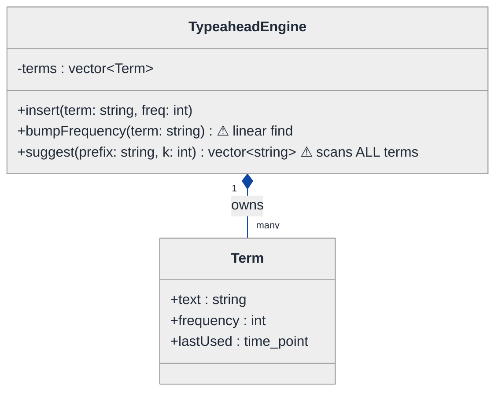
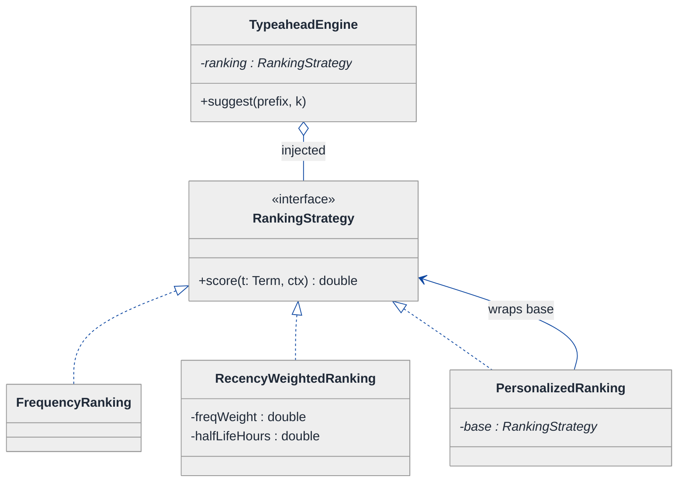
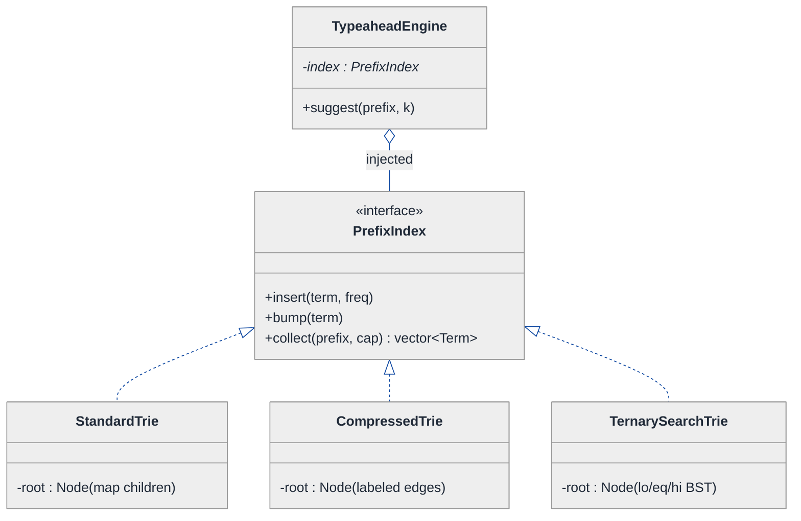
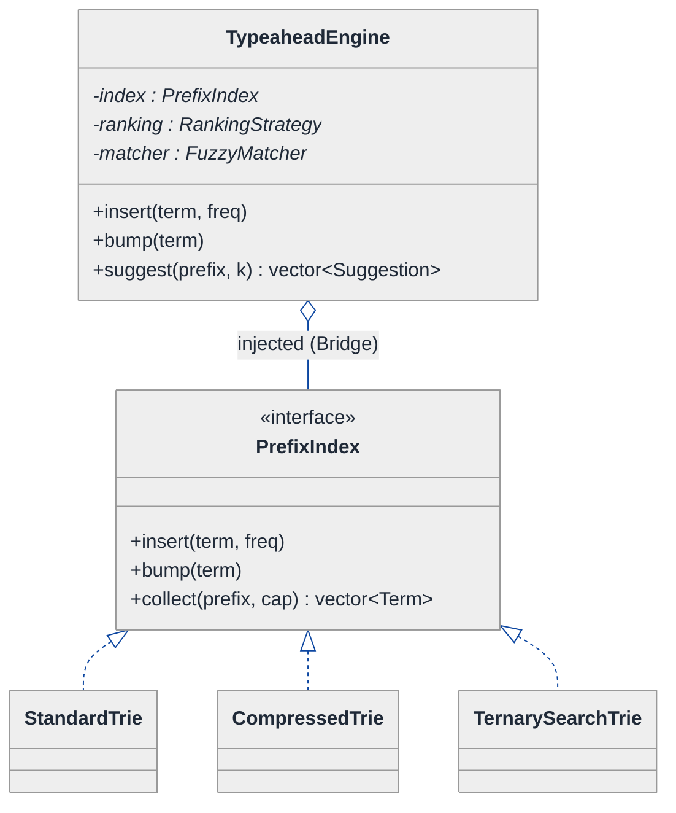
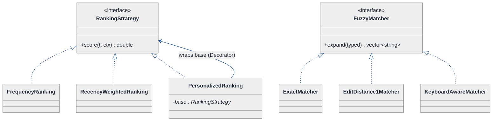
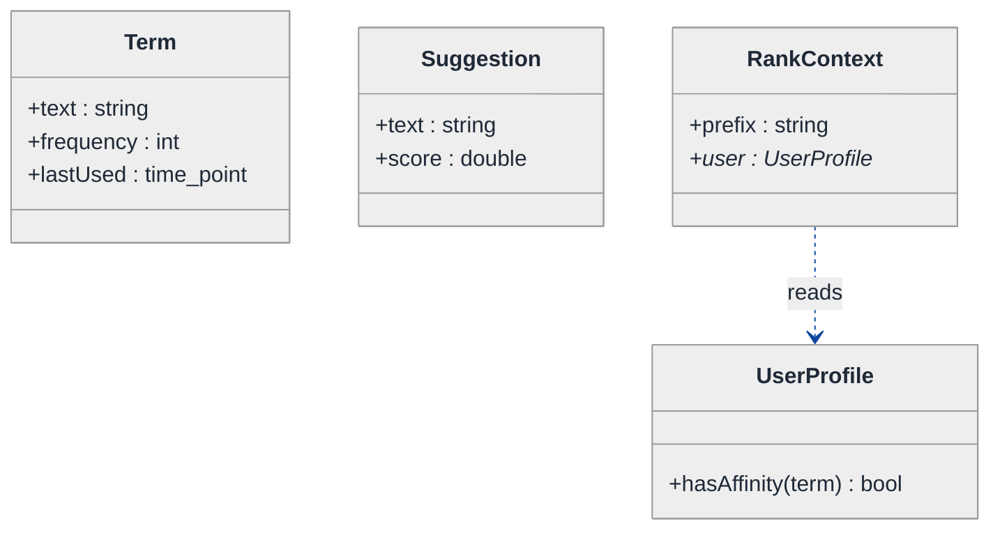
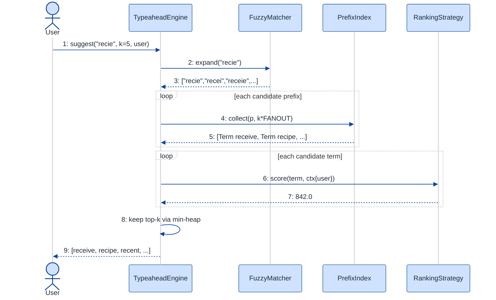

# Typeahead Suggestion System — LLD Walkthrough

> **Difficulty:** Hard · **Time:** ~45 min · **Pattern focus:** Trie + ranking + fuzzy — derived via Strategy (ranking) + Bridge/Strategy (trie representation) + Strategy (fuzzy match) + Decorator (personalization)
>
> **Problem source(s):** GID DS10, bucket `LLD_DataStructures`. Representative of the "design type-ahead / autocomplete at the class level" interview prompt.
>
> **Diagrams:** inline mermaid (renders natively in GitHub / VS Code). Theme block copied verbatim from the repo's canonical convention.

---

## How to use this file

Paced for a candidate seeing autocomplete design for the first time. Reading time: ~45 minutes if you sketch each iteration by hand. **The lesson: don't reach for "a trie with a ranked map" up front — DERIVE the design by building the naive prefix-scan first, watching it collapse under four hypothetical requirements (scale, ranking changes, typo tolerance, memory pressure), and reaching for ONE pattern at a time on the most painful axis.**

The thing that makes this question Hard is that FOUR axes vary independently: how the index is stored (trie vs compressed trie vs TST), how candidates are ranked (frequency vs recency vs personalized), how matching tolerates typos (exact vs edit-distance vs keyboard-aware), and how results are assembled. A naive design fuses all four into one class. Senior design pulls each onto its own interface.

**Map of this file (15 sections):**

1. Problem statement + clarifying questions
2. Plain-English restatement
3. Why this matters
4. Mental model
5. Try it yourself first
6. Entity & verb extraction
7. **Iteration 1: the naive design** — a `vector<string>` linear scan
8. **Where the naive design hurts** — four future requirements, one painful diff each
9. **Pivot 1: Strategy for ranking** — the most painful axis first
10. **Pivot 2: Strategy for the index representation** — trie / compressed trie / TST behind one interface
11. **Pivot 3: Strategy for fuzzy matching + Decorator for personalization**
12. Final UML class diagram
13. Skeleton code (C++17)
14. Key flow — sequence diagram
15. Extensibility re-check + anti-patterns + how to think aloud + self-check

---

## 1. Problem statement + clarifying questions

**Prompt (typical phrasing):** "Design a type-ahead suggestion system at the class level. As the user types a prefix, return the top-k most relevant completions. Support trie-based prefix matching, ranking by frequency / recency / personalization, fuzzy matching for typos, and memory-efficient trie representations (compressed trie, ternary search trie)."

**Clarifying questions to ask BEFORE drawing anything:**

1. **What's the corpus and scale?** A few thousand product names, or hundreds of millions of search queries? This decides whether memory representation is even a concern (it is, given the prompt names compressed trie + TST explicitly).
2. **What does "top-k" rank by?** Pure frequency? Recency-decayed frequency? Personalized to the user's history? Editorial pins? The prompt says "frequency / recency / personalization" — so ranking is explicitly a moving target, i.e. an axis of variation.
3. **How strict is matching?** Exact prefix only, or do we tolerate typos ("recieve" → "receive")? If fuzzy, what's the edit-distance budget, and do we weight keyboard-adjacent typos differently?
4. **Read/write ratio?** Is the dictionary mostly static (built once, queried billions of times) or continuously updated as new queries stream in? This decides whether we optimize the index for build-time or update-time.
5. **Latency budget per keystroke?** Type-ahead fires on every keystroke; we usually have a single-digit millisecond budget. That rules out anything beyond a bounded traversal.
6. **Single-user or shared service?** If shared, is the index read-mostly with concurrent reads, and how do we handle a concurrent increment of a term's frequency?
7. **Where does personalization data live?** Per-user history we can read synchronously, or a remote service we must tolerate being slow/absent?

**Assumptions if interviewer dodges:** large corpus (tens of millions of terms — memory matters), top-k = 5, ranking starts as frequency but must be swappable to recency-weighted and personalized, fuzzy matching is required (edit distance ≤ 1 to start), index is read-mostly with occasional frequency bumps, single process for now (we discuss concurrency in §15).

---

## 2. Plain-English restatement

We're building the engine behind the dropdown that appears under a search box. Every time the user presses a key, we get the current prefix (say `"re"`) and must return the few best completions (`"reddit"`, `"recipes"`, `"restaurants"`...) ranked by how relevant they are, fast enough that the dropdown feels instant. The design must let us (a) change HOW the index is physically stored without touching query logic, (b) change HOW candidates are ranked without touching traversal, and (c) change HOW forgiving matching is about typos — all **without rewriting the core query flow**.

---

## 3. Why this matters

Autocomplete is the canonical "data-structure-meets-OOD" question: the interviewer is probing whether you can keep the *data structure* (the trie) decoupled from the *policies* layered on top of it (ranking, fuzziness, personalization). The reflexive answer — one giant `Autocomplete` class with a trie inside and a hardcoded scoring loop — works in a demo and rots in production. The senior bar is recognizing that "how we store," "how we rank," and "how we match" are three independent reasons to change, then giving each its own seam. This same skill reappears in search ranking, recommendation feeds, and any "index + policy" system.

---

## 4. Mental model

A typeahead engine is **an index + a rule-book**, exactly like the parking lot was inventory + policy. The index answers one mechanical question: "given a prefix, which terms start with it?" The rule-book answers the judgment questions: "of those terms, which are best, and should I also surface near-misses?"

```
Real-world sketch (NOT a UML diagram yet):

  user types "re"
        │
        ▼
  ┌───────────────────────────────────────────────┐
  │  INDEX  (trie / compressed trie / TST)         │
  │     r ─ e ─ ┬─ d ─ d ─ i ─ t   (freq 900)      │   ← "find prefix node,
  │             ├─ c ─ i ─ p ...   (freq 700)      │      then collect terms
  │             └─ s ...           (freq 650)      │      in its subtree"
  └───────────────────────────────────────────────┘
        │  candidate terms (maybe + fuzzy near-misses)
        ▼
  ┌───────────────────────────────────────────────┐
  │  RULE-BOOK                                     │
  │   rank by  freq? recency? personalized?        │   ← policy, swappable
  │   tolerate typos?  exact / edit≤1 / keyboard?  │
  └───────────────────────────────────────────────┘
        │  top-k
        ▼
   [ reddit · recipes · restaurants · ... ]
```

The KEY insight from this picture: traversal is mechanism; ranking and fuzziness are policy; storage layout is an implementation detail of the index. Three seams, three reasons to change. Bake those seams in and the design stays soft.

---

## 5. Try it yourself first

> **Predict before reading on:**
>
> 1. List 4 nouns you'd promote to a class. List 3 nouns you'd leave as fields or library types.
> 2. **If I told you that next quarter ranking changes from "pure frequency" to "70% frequency + 30% recency, then personalized per user," what would change about how you write the method that picks the top-k?**
> 3. The product team wants `"recieve"` to still suggest `"receive"`. Where does that logic go — inside the trie traversal, or somewhere else? Why does it matter which?

---

## 6. Entity & verb extraction

> **Mini-refresher: noun → class, but not every noun.**
>
> Naive OOD promotes every noun to a class. Senior OOD promotes a noun only if it has BEHAVIOR and STATE that belong together. "Frequency" is a field on a term; "Trie" is a class because it has traversal behavior plus internal node state.

**Nouns from the prompt:**

| Noun | Decision | Why |
|---|---|---|
| TypeaheadEngine | Class (top-level coordinator) | Owns the index + policies, exposes `suggest(prefix)` |
| Trie / Index | Class behind an interface | Has traversal behavior + node state; comes in 3 representations |
| TrieNode | Class (internal to a representation) | Children map + terminal flag + payload |
| Term | Class (or struct) | The completion string + metadata (frequency, lastUsed) |
| Suggestion | Struct (value type) | A term + its computed score, returned to caller |
| Ranking | Strategy interface (no state of its own) | Pure policy — "score these candidates" |
| FuzzyMatcher | Strategy interface | Pure policy — "expand a prefix to near-prefixes" |
| Prefix | Field / parameter (`std::string`) | No behavior of its own |
| Frequency / lastUsed | Fields on Term | Plain data |

**Verbs (and the class they live on):**

| Verb | Owner class (naive answer — we'll re-examine) |
|---|---|
| suggest(prefix, k) | TypeaheadEngine |
| insert(term, freq) | TypeaheadEngine → Index |
| findPrefixNode(prefix) | Index |
| collectTerms(node) | Index |
| score(term, ctx) | TypeaheadEngine (naive) → RankingStrategy (later) |
| expand(prefix) | FuzzyMatcher (later) |
| bumpFrequency(term) | Index |

**We have NOT introduced any design patterns yet.** Pure nouns + verbs.

---

## 7. <a id="iter-1"></a>Iteration 1: the naive design

The simplest thing that could possibly work. A beginner doesn't even reach for a trie — they keep a flat list and scan it. Let's write THAT first, honestly, because it exposes the cost ladder we'll climb.



**Reader's tour (read top to bottom; ~45 seconds).**

1. **`TypeaheadEngine` is the only real class.** It holds ONE field (`terms`, a flat vector) and exposes three methods. Every decision — how to match, how to rank — lives inside `suggest()`.

2. **`Term` is a plain data bag.** Text, frequency, last-used timestamp. No behavior. That's fine; a Term genuinely has no lifecycle.

3. **The composition arrow.** The filled diamond (`◆`) marks composition — the engine owns its terms; they live and die with it.

4. **The two warning markers (⚠).**
   - `suggest()` linearly scans EVERY term, checks `startsWith(prefix)`, then sorts the matches by a hardcoded `frequency` comparison. O(N log N) per keystroke over the whole corpus.
   - `bumpFrequency()` does a linear find to locate the term to update.

   Both warnings are future-pain entry points. §8 turns each into a concrete requirement that breaks this design.

**What's deliberately missing.** No trie. No ranking interface. No fuzzy matcher. No notion that "how we store" and "how we rank" are separable. The naive design fuses storage, matching, and ranking into one method.

Skeleton code for the naive design (C++17):

```cpp
#include <algorithm>
#include <chrono>
#include <string>
#include <vector>

struct Term {
    std::string                            text;
    int                                    frequency = 0;
    std::chrono::system_clock::time_point  lastUsed;
};

class TypeaheadEngine {
public:
    void insert(const std::string& text, int freq) {
        terms_.push_back({text, freq, std::chrono::system_clock::now()});
    }

    void bumpFrequency(const std::string& text) {        // linear find — will hurt
        for (auto& t : terms_)
            if (t.text == text) { t.frequency++; t.lastUsed = now(); return; }
    }

    std::vector<std::string> suggest(const std::string& prefix, int k) {
        std::vector<Term> hits;
        for (const auto& t : terms_)                     // scans ALL terms — will hurt
            if (startsWith(t.text, prefix)) hits.push_back(t);

        std::sort(hits.begin(), hits.end(),              // hardcoded ranking — will hurt
                  [](const Term& a, const Term& b) {
                      return a.frequency > b.frequency;  // pure frequency, baked in
                  });

        std::vector<std::string> out;
        for (int i = 0; i < k && i < (int)hits.size(); ++i) out.push_back(hits[i].text);
        return out;
    }

private:
    static bool startsWith(const std::string& s, const std::string& p) {
        return s.size() >= p.size() && std::equal(p.begin(), p.end(), s.begin());
    }
    static std::chrono::system_clock::time_point now() {
        return std::chrono::system_clock::now();
    }
    std::vector<Term> terms_;
};
```

**This works.** It has zero design patterns. We can insert, bump, and suggest. So what's wrong with it?

---

## 8. <a id="naive-pain"></a>Where the naive design hurts

The interviewer slides four requirements across the desk: "Here's the roadmap. Walk me through what changes."

### Change A: "We have 50 million terms and a 5ms keystroke budget"

In the naive design:
- `suggest()` scans all 50M terms on EVERY keystroke, then sorts the matches. That's tens of milliseconds minimum — blows the budget on the first character.
- The fix isn't a tweak; it's a different data structure. We need to jump straight to the terms sharing a prefix instead of scanning everything. **This forces a trie (the prompt's whole premise).**
- But notice: introducing a trie touches `insert`, `bumpFrequency`, AND `suggest` — all three methods get rewritten around a new internal structure. The smell: **storage and query are fused, so changing storage rewrites query.**

### Change B: "Ranking changes to 70% frequency + 30% recency, then per-user personalized"

In the naive design:
- The `std::sort` comparator is a hardcoded lambda comparing `frequency`. Recency means rewriting the comparator with a decay formula.
- Personalization means the comparator now needs the *user's* history — a new dependency threaded into `suggest()`.
- **Three different ranking schemes → three rewrites of the same lambda inside `suggest()`.** And we can't A/B two rankings at once because there's only one comparator.

### Change C: "`recieve` should still suggest `receive` (typo tolerance)"

In the naive design:
- `startsWith` is an exact match. Fuzzy means generating prefix variants within edit distance 1 and matching each.
- That logic has nowhere to live except jammed inside `suggest()`, interleaved with the scan and the sort.
- **`suggest()` becomes a 60-line method doing matching + fuzzing + ranking all at once.** And keyboard-aware fuzziness (treating `s`↔`a` as cheaper than `s`↔`p`) would be yet more branching in the same place.

### Change D: "Memory blew up — switch to a compressed trie, then evaluate a ternary search trie"

In the naive design (or even a plain-trie version):
- A standard trie with a `map<char, Node*>` per node wastes memory on long non-branching chains (`"r-e-s-t-a-u-r-a-n-t"` is 10 nodes for one term). A **compressed trie (radix tree)** collapses those chains into single edges. A **ternary search trie (TST)** stores children as a small BST instead of a map, trading a little depth for far less per-node overhead.
- If the trie type is baked into `TypeaheadEngine` as a concrete `Trie` field, switching to a compressed trie or TST means rewriting every call site that touches nodes. **The query code shouldn't know or care which representation backs it.**

### The pattern of pain

| Change | Methods/files touched | Smell |
|---|---|---|
| A. Scale → trie | `insert` + `bumpFrequency` + `suggest` | "Storage and query fused; changing one rewrites the other." |
| B. Ranking variants | `suggest()` sort comparator | "One hardcoded comparator; every ranking is surgery, can't A/B." |
| C. Fuzzy matching | `suggest()` match step | "Matching logic interleaved with ranking; method balloons." |
| D. Compressed trie / TST | every node-touching call site | "Concrete data-structure type leaks into query code." |

**Three axes of variation dominate:** the index representation (A, D), the ranking algorithm (B), and the matching tolerance (C).

> **Pivot question:** "What pattern lets the CALLER pick an algorithm and swap it at runtime — for ranking, and again for fuzzy matching? And what pattern lets me hide WHICH data structure backs the index behind a stable query interface?"
>
> The answer to both is the same family: program to an interface, inject the implementation. The GoF name for "swap the algorithm" is Strategy; the name for "decouple an abstraction from its implementation so they vary independently" is Bridge — and for the index, the line between them is thin. Let's introduce them one axis at a time, starting with the most painful: ranking, because it changes most often.

---

## 9. <a id="pivot-1"></a>Pivot 1: Strategy for ranking

We take the axis that changes most often in real life — ranking — first.

> **Mini-refresher: Strategy pattern.**
>
> Encapsulates an algorithm behind an interface so it can be swapped at runtime. The CALLER decides which strategy to use; the strategy doesn't know about its peers.
>
> Quick example: a `Sorter` takes a `CompareStrategy*` in its constructor. Pass `AscendingCompare` or `DescendingCompare` — the sorter doesn't care which.

**Why Strategy fits ranking.** Ranking is an algorithm: `given a candidate term + a context, return a score`. It varies (frequency, recency-decayed, personalized, editorial). The choice is made externally — by product config or an A/B bucket, NOT by the term itself. That's textbook Strategy. We also want to A/B two rankings simultaneously, which means the ranking must be a swappable, side-effect-free object — exactly what a Strategy is.

**The refactor (just the affected slice):**

```cpp
#include <chrono>
#include <string>

struct Term {
    std::string                            text;
    int                                    frequency = 0;
    std::chrono::system_clock::time_point  lastUsed;
};

// Context the ranker may consult (kept narrow on purpose).
struct RankContext {
    std::string prefix;
    const class UserProfile* user = nullptr;   // null when no personalization
};

class RankingStrategy {
public:
    virtual ~RankingStrategy() = default;
    // Higher score = better. Pure function of (term, context); no side effects.
    virtual double score(const Term& t, const RankContext& ctx) const = 0;
};

class FrequencyRanking : public RankingStrategy {
public:
    double score(const Term& t, const RankContext&) const override {
        return static_cast<double>(t.frequency);
    }
};

class RecencyWeightedRanking : public RankingStrategy {
public:
    explicit RecencyWeightedRanking(double freqWeight, double halfLifeHours)
        : freqWeight_(freqWeight), halfLifeHours_(halfLifeHours) {}
    double score(const Term& t, const RankContext&) const override {
        const double recencyBoost = std::pow(0.5, hoursSince(t.lastUsed) / halfLifeHours_);
        return freqWeight_ * t.frequency + (1.0 - freqWeight_) * recencyBoost * t.frequency;
    }
private:
    static double hoursSince(std::chrono::system_clock::time_point tp);  // elided
    double freqWeight_;
    double halfLifeHours_;
};
// PersonalizedRanking elided — see Pivot 3 (it's a Decorator over a base ranking).
```

The engine now holds a `RankingStrategy*` instead of a hardcoded comparator, and `suggest()` scores each candidate via `ranking_->score(t, ctx)` then keeps the top-k (a bounded-size heap, not a full sort).

**What changed — visualized.** Just the ranking slice:



**Tour of the after-state.**

1. **TypeaheadEngine gained a field.** `ranking` is a pointer to the `RankingStrategy` interface, INJECTED at construction. The open diamond (`◇`) marks aggregation — the engine uses the ranking; the lifetime is managed but the engine isn't *defined* by it.

2. **The `<<interface>>` box.** One pure-virtual method: `score(Term, RankContext) → double`. Narrower than the old comparator-buried-in-suggest: it takes a term plus a context and returns a number. Nothing else.

3. **Concrete implementations.** `FrequencyRanking` is the naive case, now isolated. `RecencyWeightedRanking` carries its own tuning params (weight, half-life) as fields. `PersonalizedRanking` is a DECORATOR — note it holds a `base : RankingStrategy*` and adds a per-user boost on top (full treatment in Pivot 3).

4. **Consequence.** Change B from §8 lands as new classes, not surgery. Want to A/B frequency vs recency? Construct two engines with different strategies, or pass the strategy per request. The comparator is no longer welded into `suggest()`.

**Pattern-discrimination cheatsheet — Strategy vs Template Method.**
- *Strategy:* the whole algorithm is one swappable object, chosen at runtime via composition.
- *Template Method:* the algorithm skeleton lives in a base class; subclasses fill in hooks via inheritance.
- *Rule of thumb:* variants you might combine or swap at runtime → Strategy. A fixed skeleton with 2-3 stable variants → Template Method.

We chose Strategy because rankings get swapped per A/B bucket at runtime and composed (personalization wraps a base ranking) — neither is possible with Template Method's compile-time inheritance.

---

## 10. <a id="pivot-2"></a>Pivot 2: Strategy/Bridge for the index representation

Change A and Change D from §8 are still open: we need a trie for speed, and we need to swap among trie / compressed trie / TST for memory — without the query code knowing which one is underneath.

> **Mini-refresher: Bridge pattern.**
>
> Decouples an abstraction from its implementation so the two can vary independently. The abstraction holds a pointer to an implementor interface and forwards work to it. Unlike plain Strategy (which swaps one algorithm), Bridge separates a whole *capability* (here: "be a prefix index") from its concrete realization (array-map trie / radix tree / TST), so each side evolves on its own.
>
> Quick example: a `Shape` abstraction forwards drawing to a `Renderer` implementor; `Circle`/`Square` and `OpenGLRenderer`/`SVGRenderer` then vary independently.

**Why Bridge (realized as a Strategy-shaped interface) fits the index.** All three representations answer the SAME two questions — "find the node for this prefix" and "collect terms in this subtree" — but with wildly different internal layouts and memory profiles. The query layer (traversal + collection orchestration) is the abstraction; the physical node layout is the implementation. We want to change the layout for memory reasons without touching query orchestration. That's the Bridge motivation. In code it looks like a Strategy interface; the *intent* (varying representation independently of the abstraction that uses it) is what makes it Bridge.

**The refactor (just the index slice):**

```cpp
#include <memory>
#include <string>
#include <vector>

class PrefixIndex {                       // the implementor interface
public:
    virtual ~PrefixIndex() = default;
    virtual void   insert(const std::string& term, int freq) = 0;
    virtual void   bump(const std::string& term)             = 0;
    // Collect up to `cap` candidate terms whose key starts with `prefix`.
    virtual std::vector<Term> collect(const std::string& prefix, int cap) const = 0;
};

// 1) Standard trie: one node per char, children in a map.
class StandardTrie : public PrefixIndex {
public:
    void insert(const std::string& term, int freq) override;   // elided
    void bump(const std::string& term) override;               // elided
    std::vector<Term> collect(const std::string& prefix, int cap) const override; // DFS subtree
private:
    struct Node {
        std::unordered_map<char, std::unique_ptr<Node>> children;
        bool                                            terminal = false;
        Term                                            payload;          // valid if terminal
    };
    std::unique_ptr<Node> root_ = std::make_unique<Node>();
};

// 2) Compressed trie (radix tree): non-branching chains collapse into one edge label.
class CompressedTrie : public PrefixIndex {
public:
    void insert(const std::string& term, int freq) override;   // splits/merges edges
    void bump(const std::string& term) override;               // elided
    std::vector<Term> collect(const std::string& prefix, int cap) const override; // elided
private:
    struct Node {
        std::unordered_map<char, std::pair<std::string, std::unique_ptr<Node>>> edges; // first char -> (label, child)
        bool terminal = false;
        Term payload;
    };
    std::unique_ptr<Node> root_ = std::make_unique<Node>();
};

// 3) Ternary search trie (TST): children as a small 3-way BST. Cheap per node, slightly deeper.
class TernarySearchTrie : public PrefixIndex { /* lo/eq/hi child pointers — elided */ };
```

**What changed — visualized.** Just the index slice:



**Tour of the after-state.**

1. **TypeaheadEngine holds a `PrefixIndex*`, not a concrete trie.** Injected at construction. The engine's `suggest()` calls `index_->collect(prefix, cap)` and never touches a node directly. Query orchestration is now blind to representation.

2. **The interface is the narrowest contract that supports the engine:** `insert`, `bump`, and `collect(prefix, cap)`. Note `collect` returns at most `cap` candidates — the index can stop traversing early, which matters at 50M terms.

3. **Three concrete representations, each tuned for a different cost.**
   - `StandardTrie` — `unordered_map<char, Node*>` children. Fast, fattest memory (a map header per node).
   - `CompressedTrie` (radix tree) — collapses non-branching chains into labeled edges. `"restaurant"` becomes a few edges, not ten nodes. Big memory win for sparse dictionaries; slightly more complex `insert` (edge splitting).
   - `TernarySearchTrie` — children kept as a 3-way BST (lo/eq/hi pointers) instead of a map. Tiny per-node overhead, near-trie speed, friendly to the cache. Often the best memory/speed tradeoff at scale.

4. **Consequence.** Changes A and D land cleanly: swap the injected `PrefixIndex` implementation at construction; `suggest()` doesn't change a line.

**Pattern-discrimination cheatsheet — Bridge vs Strategy.**
- *Strategy:* swaps ONE interchangeable algorithm; the variants are peers solving the same narrow problem (rank these candidates).
- *Bridge:* separates a whole abstraction from its implementation so BOTH hierarchies can grow independently (the index capability vs. its physical layout).
- *Rule of thumb:* "pick the algorithm" → Strategy. "pick the implementation behind a capability, and expect both the capability and the implementation to gain new members over time" → Bridge.

The code shape is nearly identical (an interface + a held pointer); we call this one Bridge because the *reason* it exists is to vary representation independently, not to pick a one-shot algorithm.

---

## 11. <a id="pivot-3"></a>Pivot 3: Strategy for fuzzy matching + Decorator for personalization

Change C (typos) and the personalization half of Change B remain. Two more seams, each a familiar shape.

### 11.1 Fuzzy matching — another Strategy

The matching tolerance varies: exact prefix, edit-distance ≤ 1, or keyboard-aware (a typo to a physically adjacent key is cheaper). The CALLER (product config) picks it. Same shape as ranking → Strategy.

> **Mini-refresher: why a SEPARATE Strategy hierarchy from ranking.**
>
> Strategy is a *role*, not a type. `RankingStrategy` and `FuzzyMatcher` have nothing in common at the type level — different inputs, different outputs. Don't unify them under one generic `Strategy<T>`; that's premature genericism. Two roles, two interfaces.

A `FuzzyMatcher` turns one typed prefix into a small set of *candidate prefixes* to feed the index. The engine then runs `index_->collect(...)` for each.

```cpp
class FuzzyMatcher {
public:
    virtual ~FuzzyMatcher() = default;
    // Expand a typed prefix into the prefixes worth querying (always includes the original).
    virtual std::vector<std::string> expand(const std::string& typed) const = 0;
};

class ExactMatcher : public FuzzyMatcher {
public:
    std::vector<std::string> expand(const std::string& typed) const override { return {typed}; }
};

class EditDistance1Matcher : public FuzzyMatcher {
public:
    std::vector<std::string> expand(const std::string& typed) const override {
        // generate all strings within one insert/delete/substitute/transpose of `typed`
        // ... elided ...
        return variants;  // includes `typed` itself
    }
};
// KeyboardAwareMatcher elided — weights substitutions by physical key distance.
```

### 11.2 Personalization — a Decorator over the ranking

Personalization doesn't REPLACE the base ranking; it ADDS a per-user boost to whatever ranking is configured. "Add behavior around an existing object without changing it" is the Decorator pattern.

> **Mini-refresher: Decorator pattern.**
>
> Wraps an object in another object that implements the same interface, adding behavior before/after delegating to the wrapped one. Wrappers stack, so behaviors compose. The wrapped object never knows it's decorated.
>
> Quick example: `BufferedStream` wraps a `FileStream` (same `Stream` interface) and adds buffering, then delegates the actual write.

```cpp
class PersonalizedRanking : public RankingStrategy {
public:
    PersonalizedRanking(std::unique_ptr<RankingStrategy> base, double boost)
        : base_(std::move(base)), boost_(boost) {}
    double score(const Term& t, const RankContext& ctx) const override {
        double s = base_->score(t, ctx);                 // delegate to wrapped ranking
        if (ctx.user && ctx.user->hasAffinity(t.text))   // add the personalization layer
            s *= boost_;
        return s;
    }
private:
    std::unique_ptr<RankingStrategy> base_;
    double                           boost_;
};
```

So `PersonalizedRanking(RecencyWeightedRanking(...), 1.5)` reads as "recency-weighted, then 1.5× for terms this user likes" — two policies stacked, neither aware of the other.

**Pattern-discrimination cheatsheet — Decorator vs Strategy.**
- *Strategy:* REPLACES an algorithm with a peer (frequency instead of recency).
- *Decorator:* WRAPS an algorithm to augment it (recency, then a personalization multiplier on top).
- *Rule of thumb:* "instead of" → Strategy. "in addition to, and stackable" → Decorator. Personalization is "in addition to," so Decorator.

**The lesson.** Once we recognized "algorithm picked by the caller" in Pivot 1, the same shape solved fuzzy matching; and recognizing "augment, don't replace" gave us personalization for free. **Pattern recognition makes each subsequent seam cheap.**

---

## 12. <a id="fig-class-diagram"></a>Final class diagram

One giant diagram would be a wall of boxes. Here are **three focused sub-views**, each addressing a different concern, then a structural insight tying them together.

### 12.1 The coordinator and the index — what the engine OWNS and DELEGATES



**Tour of 12.1.** The engine holds three injected interface pointers — `index`, `ranking`, `matcher` — and exposes the public surface. The open diamond (`◇`) is aggregation: the engine USES the index but the representation is interchangeable. The three trie flavors hang off `PrefixIndex`; the engine can't tell them apart. This is the Bridge seam from Pivot 2.

### 12.2 The policy interfaces — what varies independently



**Tour of 12.2.** Two independent Strategy hierarchies. `RankingStrategy` has three concretes; `PersonalizedRanking` points back at the interface — that self-edge is the Decorator (it wraps a base ranking and multiplies its score). `FuzzyMatcher` has its own three concretes for exact / edit-1 / keyboard-aware. The two hierarchies share NO base type on purpose — Strategy is a role, not a class.

### 12.3 The value types — what flows through



**Tour of 12.3.** `Term` is the indexed payload (text + frequency + recency). `RankContext` is the narrow bag passed to the ranker — prefix plus an optional `UserProfile*` (null when personalization is off). `UserProfile` exposes only `hasAffinity(term)` so the ranker can't reach into user internals. `Suggestion` is the returned value (text + final score). All four are value types — no behavior except `UserProfile`'s one query.

### Structural insight (ties 12.1 + 12.2 + 12.3 together)

| Concern | Pattern used | Why |
|---|---|---|
| **Index representation** (trie / compressed / TST) | Bridge — injected `PrefixIndex` | Vary physical layout for memory independently of query orchestration |
| **Ranking** (frequency / recency) | Strategy — injected `RankingStrategy` | Caller / A-B config picks the scorer; swappable at runtime |
| **Personalization** | Decorator over `RankingStrategy` | Augments a base ranking with a per-user boost; stackable |
| **Fuzzy matching** (exact / edit-1 / keyboard) | Strategy — injected `FuzzyMatcher` | Caller picks tolerance; expands a prefix into candidate prefixes |
| **Term / Suggestion / Context** | Plain value types | Data flowing through; no independent lifecycle |

The big lesson: **the trie is just one of four interchangeable parts.** The naive design fused storage, matching, ranking, and assembly into one method. The final design gives each a seam — *interface for what varies, plain orchestration for what doesn't*. That separation is what makes the system extensible without rewrites.

---

## 13. Skeleton code (C++17)

> Show the SHAPES, not the full implementation. Abstract bases + 1-2 concretes per pattern; the rest `// elided`.

```cpp
#include <algorithm>
#include <chrono>
#include <cmath>
#include <memory>
#include <queue>
#include <string>
#include <unordered_map>
#include <vector>

// ── Value types ─────────────────────────────────────────────────────
struct Term {
    std::string                           text;
    int                                   frequency = 0;
    std::chrono::system_clock::time_point lastUsed;
};
struct Suggestion { std::string text; double score; };

class UserProfile {
public:
    bool hasAffinity(const std::string& term) const;   // elided
};
struct RankContext {
    std::string        prefix;
    const UserProfile* user = nullptr;                  // null => no personalization
};

// ── Bridge: the index representation ────────────────────────────────
class PrefixIndex {
public:
    virtual ~PrefixIndex() = default;
    virtual void              insert(const std::string& term, int freq) = 0;
    virtual void              bump(const std::string& term)             = 0;
    virtual std::vector<Term> collect(const std::string& prefix, int cap) const = 0;
};

class StandardTrie : public PrefixIndex {
public:
    void insert(const std::string& term, int freq) override {
        Node* n = root_.get();
        for (char c : term) {
            auto& child = n->children[c];
            if (!child) child = std::make_unique<Node>();
            n = child.get();
        }
        n->terminal = true;
        n->payload = {term, freq, std::chrono::system_clock::now()};
    }
    void bump(const std::string& term) override;                       // walk to node, freq++
    std::vector<Term> collect(const std::string& prefix, int cap) const override {
        const Node* n = walk(prefix);                                  // O(|prefix|)
        std::vector<Term> out;
        if (n) dfs(n, out, cap);                                       // bounded subtree DFS
        return out;
    }
private:
    struct Node {
        std::unordered_map<char, std::unique_ptr<Node>> children;
        bool terminal = false;
        Term payload;
    };
    const Node* walk(const std::string& prefix) const;                 // elided
    static void dfs(const Node* n, std::vector<Term>& out, int cap);   // elided
    std::unique_ptr<Node> root_ = std::make_unique<Node>();
};

// CompressedTrie (radix tree) + TernarySearchTrie elided — same PrefixIndex contract,
// different node layout (labeled edges / lo-eq-hi BST) for lower memory.

// ── Strategy: ranking ───────────────────────────────────────────────
class RankingStrategy {
public:
    virtual ~RankingStrategy() = default;
    virtual double score(const Term& t, const RankContext& ctx) const = 0;
};
class FrequencyRanking : public RankingStrategy {
public:
    double score(const Term& t, const RankContext&) const override {
        return static_cast<double>(t.frequency);
    }
};
// RecencyWeightedRanking elided — freq + exponential recency decay.

// ── Decorator over ranking: personalization ────────────────────────
class PersonalizedRanking : public RankingStrategy {
public:
    PersonalizedRanking(std::unique_ptr<RankingStrategy> base, double boost)
        : base_(std::move(base)), boost_(boost) {}
    double score(const Term& t, const RankContext& ctx) const override {
        double s = base_->score(t, ctx);
        if (ctx.user && ctx.user->hasAffinity(t.text)) s *= boost_;
        return s;
    }
private:
    std::unique_ptr<RankingStrategy> base_;
    double                           boost_;
};

// ── Strategy: fuzzy matching ────────────────────────────────────────
class FuzzyMatcher {
public:
    virtual ~FuzzyMatcher() = default;
    virtual std::vector<std::string> expand(const std::string& typed) const = 0;
};
class ExactMatcher : public FuzzyMatcher {
public:
    std::vector<std::string> expand(const std::string& typed) const override { return {typed}; }
};
// EditDistance1Matcher + KeyboardAwareMatcher elided.

// ── Coordinator ─────────────────────────────────────────────────────
class TypeaheadEngine {
public:
    TypeaheadEngine(std::unique_ptr<PrefixIndex>     index,
                    std::unique_ptr<RankingStrategy> ranking,
                    std::unique_ptr<FuzzyMatcher>     matcher)
        : index_(std::move(index))
        , ranking_(std::move(ranking))
        , matcher_(std::move(matcher)) {}

    void insert(const std::string& term, int freq) { index_->insert(term, freq); }
    void bump(const std::string& term)             { index_->bump(term); }

    std::vector<Suggestion> suggest(const std::string& prefix, int k,
                                    const UserProfile* user = nullptr) const {
        RankContext ctx{prefix, user};

        // 1) Fuzzy expansion: typed prefix -> candidate prefixes (Strategy).
        std::vector<Term> candidates;
        for (const auto& p : matcher_->expand(prefix)) {
            auto terms = index_->collect(p, k * FANOUT);   // 2) bounded collect (Bridge)
            candidates.insert(candidates.end(), terms.begin(), terms.end());
        }

        // 3) Score every candidate (Strategy + Decorator) and keep top-k via a min-heap.
        auto cmp = [](const Suggestion& a, const Suggestion& b) { return a.score > b.score; };
        std::priority_queue<Suggestion, std::vector<Suggestion>, decltype(cmp)> heap(cmp);
        for (const auto& t : candidates) {
            Suggestion s{t.text, ranking_->score(t, ctx)};
            heap.push(s);
            if ((int)heap.size() > k) heap.pop();          // bounded: keep best k
        }

        std::vector<Suggestion> out;
        while (!heap.empty()) { out.push_back(heap.top()); heap.pop(); }
        std::reverse(out.begin(), out.end());              // highest score first
        return out;
    }

private:
    static constexpr int FANOUT = 4;                       // over-collect, then trim by score
    std::unique_ptr<PrefixIndex>     index_;
    std::unique_ptr<RankingStrategy> ranking_;
    std::unique_ptr<FuzzyMatcher>     matcher_;
};
```

Note three things the skeleton makes concrete: (1) `suggest()` is pure orchestration — it names no concrete trie, ranker, or matcher; (2) it over-collects (`k * FANOUT`) then trims by score, because the index returns *prefix matches* but the *ranking* decides the final order; (3) the top-k uses a bounded min-heap, so the cost is O(candidates · log k), not a full sort.

---

## 14. <a id="fig-sequence"></a>Key flow — sequence diagram

This is the moment of truth — read across the swimlanes to see how the four parts COOPERATE on a single keystroke.



**Tour of the keystroke flow. Read slowly — this is where all four parts meet.**

1. **User types and the engine gets `suggest("recie", 5, user)`.** The misspelled prefix arrives. The engine does NO matching or ranking itself.

2. **Engine asks the FuzzyMatcher to expand the prefix.** `expand("recie")` returns the original plus edit-distance-1 variants (`"recei"`, `"receie"`, …). **Strategy #1 in play.** If the configured matcher were `ExactMatcher`, this returns just `["recie"]` — same call site, different behavior.

3. **For each candidate prefix, the engine asks the index to collect.** `collect(p, k*FANOUT)` walks to the prefix node and DFS-collects a bounded set of terms. **Bridge in play** — the engine doesn't know if it's talking to a `StandardTrie`, `CompressedTrie`, or `TernarySearchTrie`. The bound (`k*FANOUT`) keeps the traversal cheap.

4. **For each candidate term, the engine asks the ranking strategy to score it.** `score(term, ctx)` where `ctx` carries the user. **Strategy #2 + Decorator in play** — if the configured ranking is `PersonalizedRanking(RecencyWeighted(...))`, the score is recency-weighted AND boosted for terms this user likes, all behind one `score()` call.

5. **Engine keeps the top-k via a bounded min-heap.** Pure orchestration — no knowledge of HOW scores were computed. The heap caps work at O(candidates · log k).

6. **Top-k flows back to the user.** `["receive", "recipe", "recent", …]` — note `"receive"` surfaced despite the typo, because the fuzzy matcher expanded the prefix and the index found it.

### The coupling that's NOT shown — and why it matters

You don't see any `if (rankingMode == FREQUENCY)` or `if (trieType == COMPRESSED)` anywhere in this flow. That's the point: **the engine's `suggest()` is the SAME code regardless of which index, ranking, or matcher is wired in.** Swapping a `StandardTrie` for a `TernarySearchTrie`, or `FrequencyRanking` for `PersonalizedRanking`, changes only the construction line — not one byte of the query flow. The interfaces ARE the decoupling.

---

## 15. Extensibility re-check + anti-patterns + how to think aloud + self-check

### Extensibility re-check

Revisit the four changes from [§8](#naive-pain). For each, name the SINGLE thing that changes.

| Change | Naive design impact | Final design impact |
|---|---|---|
| A. Scale → trie | rewrite `insert` + `bump` + `suggest` | Construct with `StandardTrie` instead of a vector. `suggest()` unchanged. |
| B. Recency / personalized ranking | rewrite the sort comparator | New `RecencyWeightedRanking`; wrap in `PersonalizedRanking` decorator. Inject it. |
| C. Typo tolerance | balloon `suggest()` with fuzzing | New `EditDistance1Matcher : FuzzyMatcher`. Inject it. |
| D. Compressed trie / TST | rewrite every node call site | New `CompressedTrie`/`TernarySearchTrie : PrefixIndex`. Swap at construction. |

Every change is ONE new class (or a construction-line swap). That's the open/closed principle in practice.

> **Mini-refresher: Open/Closed Principle (the O in SOLID).**
>
> Software entities should be OPEN for extension but CLOSED for modification. You add behavior by adding new code (a new strategy/representation class), not by editing existing, tested code. The interfaces in this design are exactly the extension points that make that possible.

If a future requirement makes you change `TypeaheadEngine`, `PrefixIndex`, AND `RankingStrategy` together — go back to §6 and re-identify variability points; you fused one.

### Common confusion + traps

1. **"Why not put `score()` on `Term`?"** Because ranking is a LOT-WIDE policy that changes per A/B bucket, not a property of an individual term. A `Term` scoring itself would bake one ranking into the data. Keep terms as data; keep scoring as an injected strategy.

2. **"Why is fuzzy matching a separate step instead of a fuzzy traversal inside the trie?"** You CAN do edit-distance traversal inside the trie (it's faster). But conceptually the tolerance is a *policy* the caller picks, so we keep it behind `FuzzyMatcher`. A high-performance variant would push the matcher's logic into a specialized `PrefixIndex` — that's a legitimate optimization, but it should still sit behind the same two interfaces so callers don't notice.

3. **"Compressed trie vs TST — which is 'correct'?"** Neither universally. Radix/compressed trie wins on sparse dictionaries with long shared prefixes; TST wins on memory and cache locality with a large alphabet. The whole point of the Bridge is that you measure and swap without touching query code.

4. **"Why a Decorator for personalization instead of just a `PersonalizedRanking` that does everything?"** Because personalization should compose with whatever base ranking is configured (frequency today, recency tomorrow). A standalone class would have to duplicate the base logic. The Decorator wraps and reuses.

5. **"Why `unique_ptr` everywhere?"** The engine has exclusive ownership of its index, ranking, and matcher — `unique_ptr` says so and frees them deterministically. If you needed to share one ranking across many engines, you'd switch to `shared_ptr`. We don't, so `unique_ptr` is correct.

### Anti-patterns

- **"God class TypeaheadEngine"** — a single class holding a trie, a scoring loop, and fuzzing inline. Pull each axis behind an interface.
- **"Tag-driven if/else"** — `if (mode == FREQUENCY) ... else if (mode == RECENCY)` inside `suggest()`. Use the Strategy interface; let polymorphism dispatch.
- **"Concrete trie leaking into query code"** — storing a `StandardTrie` field directly so `suggest()` pokes at `node->children`. Program to `PrefixIndex`.
- **"Premature generic `Strategy<T>`"** — unifying ranking and fuzzy matching under one template because both are "strategies." They're different roles; keep two interfaces.
- **"Anemic everything"** — making `TypeaheadEngine` a data bag and putting `suggest()` as a free function. Orchestration is behavior; it belongs on the coordinator.
- **"Unbounded collect + full sort"** — collecting ALL prefix matches then sorting them. Bound the collect and use a top-k heap; a popular single-letter prefix can match millions of terms.

### How to think aloud

> "Type-ahead. Let me clarify scope. [Asks the §1 questions: scale, ranking criteria, typo tolerance, latency budget.] Got it — large corpus, top-5, ranking starts frequency but must move to recency + personalized, fuzzy required, single-digit-ms budget.
>
> Nouns: TypeaheadEngine, an index, Term, Suggestion. Verbs: insert, bump, suggest, plus score and expand which feel like policies.
>
> I'll write the NAIVE design first — no patterns. A flat `vector<Term>`; `suggest()` scans all terms, filters by prefix, sorts by frequency. It works.
>
> Now I stress-test it. (A) 50M terms, 5ms budget — the full scan blows it; I need a trie. (B) Ranking moves to recency then personalized — the hardcoded comparator becomes surgery. (C) Typos — fuzzing jams into suggest(). (D) Memory — I need compressed trie / TST, but the concrete trie is welded into the engine.
>
> Three axes vary: index representation, ranking, matching. Pivot 1: ranking becomes a RankingStrategy interface — FrequencyRanking, RecencyWeightedRanking, and a PersonalizedRanking decorator. Pivot 2: the index becomes a PrefixIndex interface — StandardTrie, CompressedTrie, TernarySearchTrie — that's a Bridge, so I can swap representation for memory without touching query code. Pivot 3: fuzzy matching becomes a FuzzyMatcher Strategy — exact / edit-1 / keyboard-aware.
>
> Final design: TypeaheadEngine injects all three interfaces; suggest() is pure orchestration — expand the prefix, collect bounded candidates, score them, keep top-k via a heap. All four future requirements land as ONE new class each. That's open/closed."

### Self-check

> **Self-check — the question to ask next time.**
>
> When you see "design a [thing] that does [data-structure work] with [several swappable policies]," before fusing it all into one class, ask:
>
> > **"What are the independent reasons this could change — and does each reason get its own interface?"**
>
> Here: storage layout, ranking, and matching tolerance are three reasons to change. Storage behind a representation interface (Bridge). Each policy that the CALLER picks behind a Strategy. Each policy that AUGMENTS another via a Decorator. If two reasons share one class, you've fused a seam — split it.

---

## Cross-references

- **Parent topic manifest:** [`./EXTRACTED_QUESTIONS.md`](./EXTRACTED_QUESTIONS.md)
- **Vertical overview:** [`../../LEARNING.md`](../../LEARNING.md)
- **Template:** [`../../TEMPLATE-v2.md`](../../TEMPLATE-v2.md)
- **Canonical exemplar:** [`../Object_Oriented_Design/Parking_Lot.md`](../Object_Oriented_Design/Parking_Lot.md)
- **Diagram convention (theme block):** [`../../../CONTINUATION.md`](../../../CONTINUATION.md) §3
- **Related v2 walkthroughs:**
  - LRU Cache (sibling in `./LRU_Cache.md`) — another data-structure-meets-OOD design
  - Strategy Pattern deep-dive (in `../Strategy_Pattern/`)
  - Decorator Pattern deep-dive (in `../Decorator_Pattern/`)
- **Further reading:**
  - <a href="https://en.wikipedia.org/wiki/Trie" target="_blank" rel="noopener noreferrer">Trie (Wikipedia)</a>
  - <a href="https://en.wikipedia.org/wiki/Radix_tree" target="_blank" rel="noopener noreferrer">Radix / compressed trie (Wikipedia)</a>
  - <a href="https://en.wikipedia.org/wiki/Ternary_search_tree" target="_blank" rel="noopener noreferrer">Ternary search tree (Wikipedia)</a>
