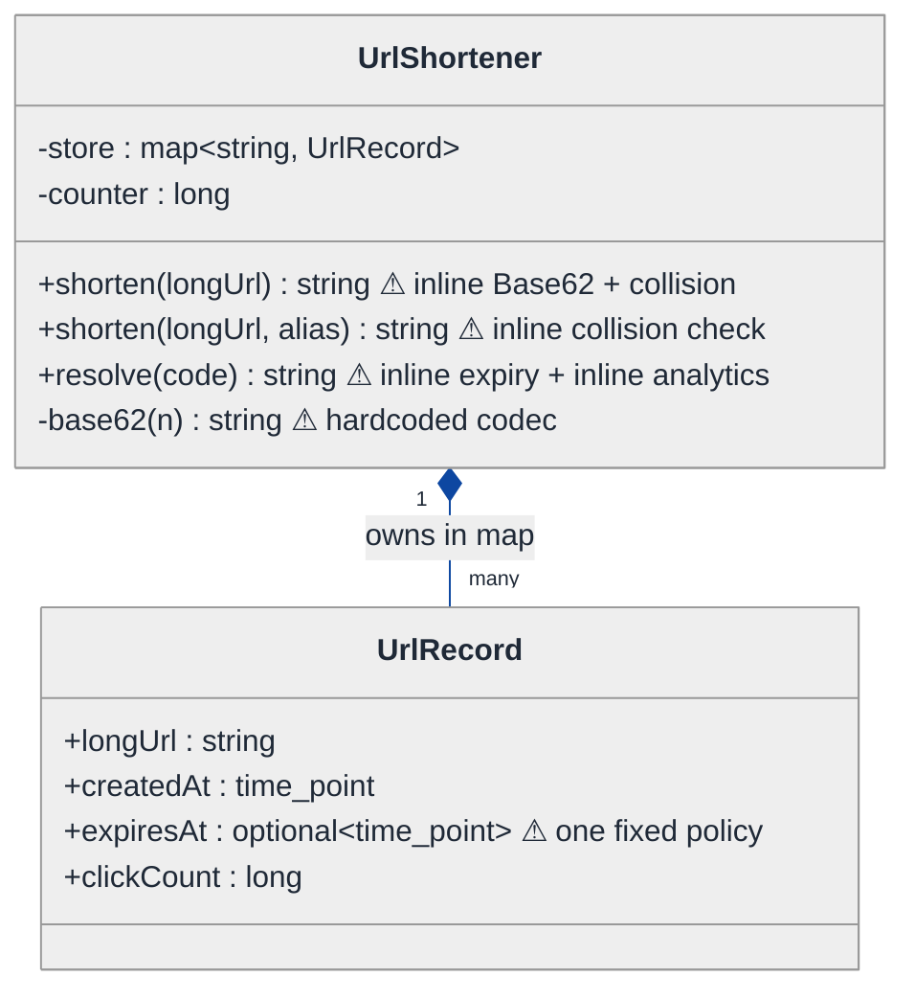
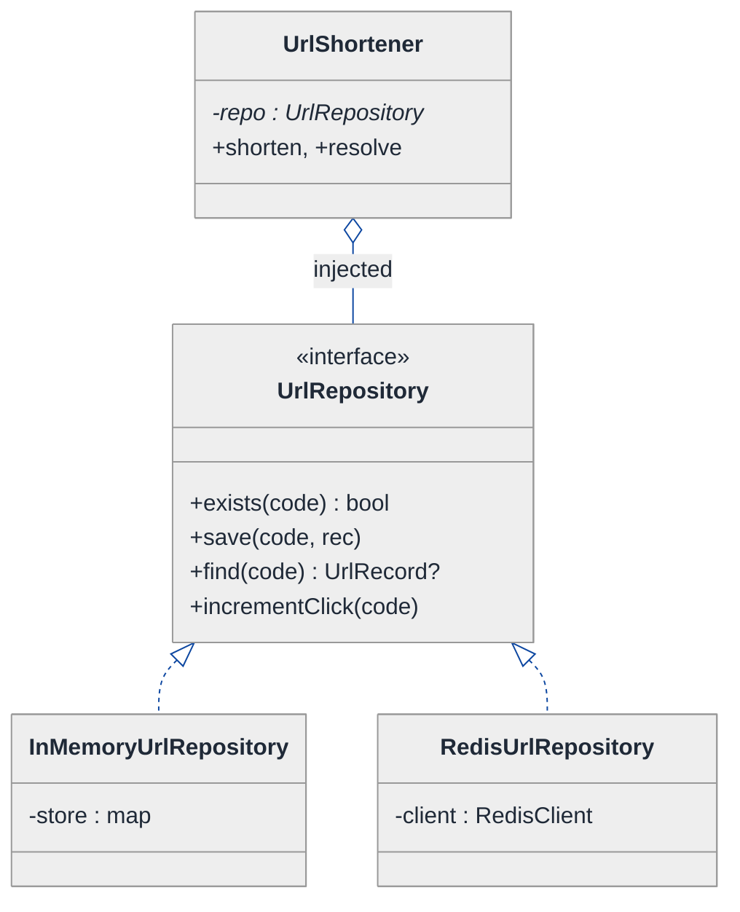
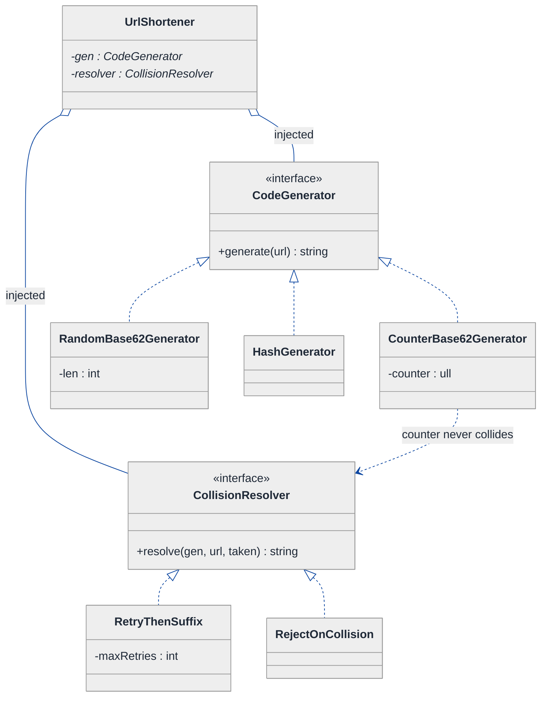
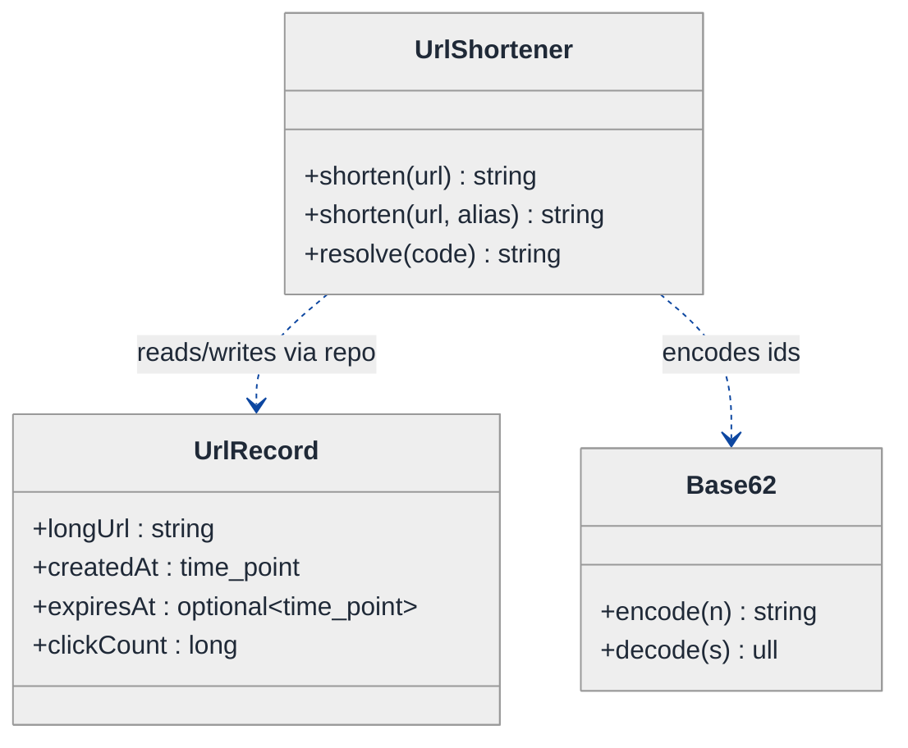
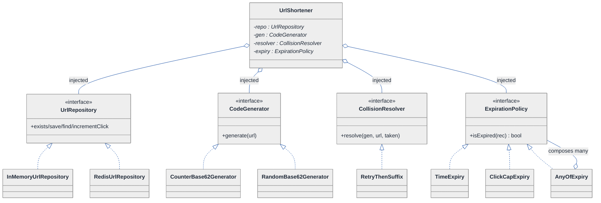
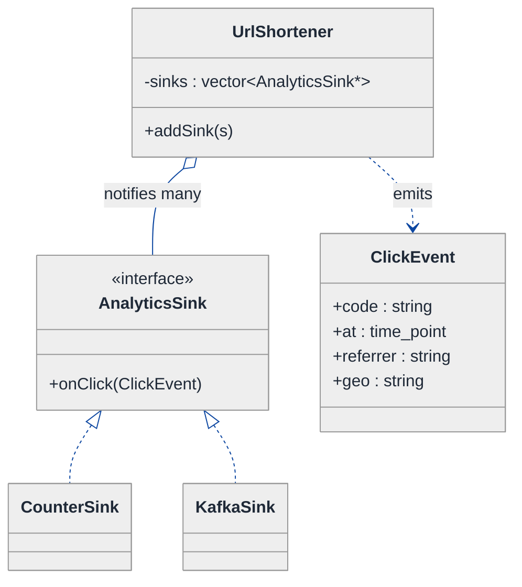
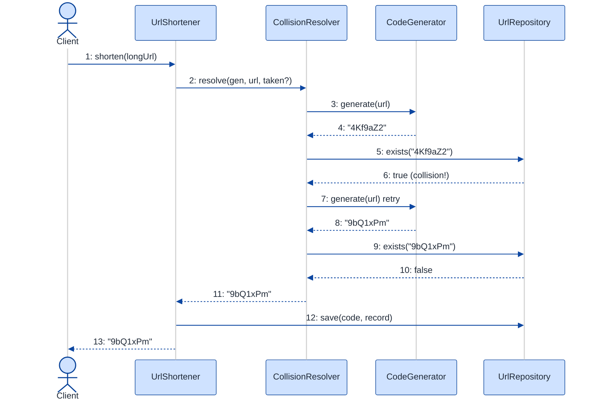
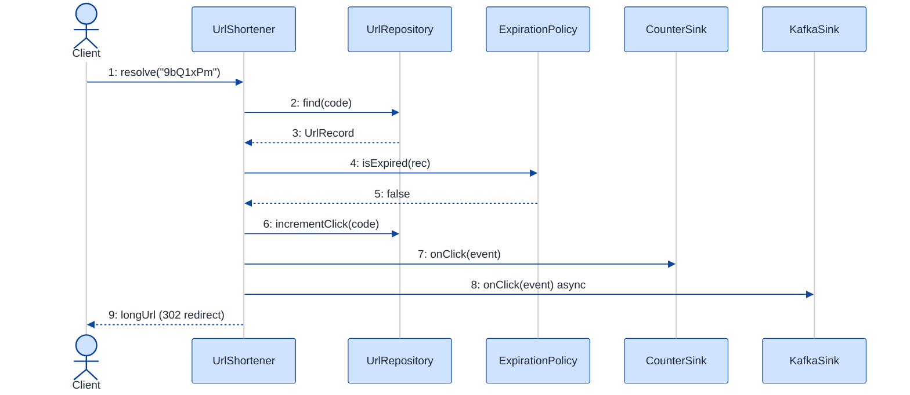

# URL Shortener — LLD Walkthrough

> **Difficulty:** Medium · **Time:** ~30 min · **Pattern focus:** Base62 encoding + Repository (plus Strategy for code generation/expiration, and an Observer for click analytics)
>
> **Problem source(s):** GID DS2 in [`./EXTRACTED_QUESTIONS.md`](./EXTRACTED_QUESTIONS.md), bucket `LLD_DataStructures`. A perennial "design at the class level" interview question.
>
> **Diagrams:** inline mermaid (renders natively in GitHub / VS Code). No external image artifacts.

---

## How to use this file

Paced for a candidate seeing the URL-shortener class design for the first time. Reading time: ~30 minutes if you sketch each iteration by hand. **The lesson: don't reach for a layered "service / repository / strategy" cake up front — DERIVE it. Build the one-class naive version first, watch it break when persistence, ID-generation, expiration, and analytics each start to vary independently, and then introduce ONE seam at a time.**

**Map of this file (15 sections):**

1. Problem statement + clarifying questions
2. Plain-English restatement
3. Why this matters
4. Mental model
5. Try it yourself first
6. Entity & verb extraction
7. **Iteration 1: the naive design** — one class, a map, hardcoded everything
8. **Where the naive design hurts** — five future requirements, one painful diff each
9. **Pivot 1: Repository for persistence** — hide where the mapping lives
10. **Pivot 2: Strategy for code generation + collision resolution** — Base62 vs hash vs random
11. **Pivot 3: Strategy for expiration + Observer for analytics** — the remaining axes
12. Final class diagram
13. Skeleton code (C++)
14. Key flow — sequence diagram
15. Extensibility re-check + anti-patterns + how to think aloud + self-check

---

## 1. Problem statement + clarifying questions

**Prompt (typical phrasing):** "Design a URL shortener service at the class level: URL encoding/decoding, custom alias support, expiration handling, click analytics tracking, and collision resolution."

**Clarifying questions to ask BEFORE drawing anything:**

1. **Short-code generation policy?** Auto-generated only, or must we also accept a user-supplied custom alias (e.g., `/launch2026`)? Both, I'll assume.
2. **How long is the short code?** Fixed 7 chars (Base62 → 62^7 ≈ 3.5 trillion codes), or variable-length growing as the keyspace fills?
3. **Collision policy?** When an auto-generated code or a custom alias already exists, do we reject, retry, or append a suffix? (This is the crux of "collision resolution.")
4. **Expiration?** Do links expire by absolute time (`expiresAt`), by TTL from creation, by click-count cap, or never? Can a link be both time- and count-limited?
5. **Analytics granularity?** Just a total click counter, or per-click metadata (timestamp, referrer, geo, device)? Synchronous increment or fire-and-forget to a pipeline?
6. **Persistence?** Single-process in-memory map (interview default), or a real datastore (Redis / SQL / DynamoDB) we must not couple to?
7. **Concurrency?** Two simultaneous `shorten()` calls — must they never get the same code? Single-threaded for the core design; I'll note the lock in §15.
8. **Idempotency?** If the same long URL is submitted twice, return the same short code or mint a new one?

**Assumptions if the interviewer dodges:** both auto + custom aliases; 7-char Base62 auto-codes; collisions retry then suffix; expiration by absolute time OR click cap (composable); per-click metadata fired to an analytics sink asynchronously; an in-memory store today but the code must be swappable to Redis without touching business logic; single-threaded core with a noted lock point.

---

## 2. Plain-English restatement

We're building the software behind `bit.ly`-style links. Two core operations: **shorten** a long URL into a tiny code (and store the mapping), and **resolve** a code back to the long URL (and record that someone clicked it). Around those two verbs sit four things that each change for different reasons: *how* we mint the code, *where* the mapping is stored, *when* a link stops working, and *what* we record on each click. The design must let any one of those four vary without rewriting the other three.

---

## 3. Why this matters

This question looks like a data-structures warm-up ("just use a hash map"), but the senior signal is whether you separate the **two-way mapping** (a pure data-structure concern) from the **policies that surround it** (generation, persistence, expiry, analytics). Candidates who jam everything into one class produce something that works in the demo and rots the moment a second requirement lands. The interviewer is probing two specific patterns: **Base62** (the encoding that turns a numeric id into a short, URL-safe string) and **Repository** (the seam that lets the in-memory map become Redis without the business logic noticing).

---

## 4. Mental model

A URL shortener is a **bidirectional dictionary with a doorman**. The dictionary maps `code → record`; the doorman runs policy on the way in (mint a code, reject duplicates) and on the way out (is this link expired? log the click). The dictionary is *inventory*; the doorman is *orchestration*; the minting / expiry / logging rules are *policy*.

```
Real-world sketch (NOT a UML diagram yet):

   shorten("https://example.com/very/long/path")
                    │
                    ▼
        ┌───────────────────────────┐
        │   minting policy           │  Base62(counter) → "4Kf9aZ2"
        │   collision check          │  taken? retry / suffix
        └───────────┬───────────────┘
                    ▼
        code ──► record { longUrl, createdAt, expiresAt, clickCap }   (stored somewhere)
                    ▲
                    │  resolve("4Kf9aZ2")
        ┌───────────┴───────────────┐
        │   expiry check (policy)    │  expired? → 410 Gone
        │   click logging (policy)   │  fire ClickEvent → analytics
        └────────────────────────────┘
```

The KEY insight from this picture: the map in the middle is trivial. Everything interesting is the policy wrapped around the two arrows. That wrapping is what we'll lift into seams.

---

## 5. Try it yourself first

> **Predict before reading on:**
>
> 1. List 4 nouns you'd promote to a class and 3 you'd leave as plain fields.
> 2. **If I told you the service must move from an in-memory map to Redis in month two — without rewriting `shorten()` and `resolve()` — what single change to the naive design makes that painless?**
> 3. A code generator can be "incrementing-counter Base62", "random Base62", or "MD5-prefix". Where does that choice belong so swapping it is one line?

---

## 6. Entity & verb extraction

> **Mini-refresher: noun → class, but not every noun.**
>
> Naive OOD promotes every noun to a class. Senior OOD promotes a noun only if it owns both BEHAVIOR and STATE that must live together. "Click count" is just a field; "the thing that decides the next code" earns a class because it has a swappable algorithm.

**Nouns from the prompt:**

| Noun | Decision | Why |
|---|---|---|
| UrlShortener | Class (top-level coordinator) | Owns `shorten` / `resolve`, orchestrates policy |
| UrlRecord | Class | Bundles longUrl + lifecycle fields + click count |
| ShortCode | Field (`std::string`) | A value; no behavior of its own |
| Base62 codec | Class / free functions | Pure encode/decode — testable in isolation |
| Repository | Interface (added in Pivot 1) | "Where the mapping lives" — a swappable seam |
| CodeGenerator | Interface (added in Pivot 2) | "How a code is minted" — varies (counter/random/hash) |
| ExpirationPolicy | Interface (added in Pivot 3) | "When a link dies" — varies (time / count / never) |
| AnalyticsSink | Interface (added in Pivot 3) | "What happens on a click" — varies and is fire-and-forget |
| Timestamp / Duration | Library type (`std::chrono`) | No domain behavior |

**Verbs (and the class they live on):**

| Verb | Owner class (naive answer — we'll re-examine) |
|---|---|
| shorten(longUrl) | UrlShortener |
| shorten(longUrl, customAlias) | UrlShortener |
| resolve(code) | UrlShortener |
| encode(n) / decode(s) | Base62 codec |
| isExpired() | UrlRecord (naive) → ExpirationPolicy (final) |
| recordClick(code) | UrlShortener (naive) → AnalyticsSink (final) |
| exists(code) / save(code, rec) / find(code) | Repository (final) |

**We have NOT introduced any design patterns yet.** Pure nouns + verbs.

---

## 7. <a id="iter-1"></a>Iteration 1: the naive design

Let's write the simplest thing that could possibly work. One class, one map, Base62 inlined, expiry inlined, analytics inlined.



**Reader's tour (read top to bottom; ~60 seconds).**

1. **One class does everything.** `UrlShortener` holds the `store` map and a `counter`. Both public methods plus a private `base62()` helper live here. There is no seam — every decision is baked into these method bodies.

2. **`shorten()` overloads carry collision logic inline (⚠).** The auto version increments `counter`, Base62-encodes it, and checks the map. The custom-alias version checks the map directly. Both have the "is it taken?" logic copy-pasted.

3. **`base62()` is a private method (⚠).** Generation is welded to the class. To swap it for random codes or a hash, you edit this method — and you can't A/B two generators.

4. **`UrlRecord` hardcodes ONE expiry shape (⚠).** A single `optional<expiresAt>`. Click-cap expiry? Doesn't fit. Never-expire? You leave it null and hope every read-site remembers to check.

5. **`resolve()` does expiry AND analytics inline (⚠).** It checks `expiresAt`, then bumps `clickCount`. Both the "is it dead" rule and the "what to log" rule are frozen into this one method.

**What's deliberately missing.** No `Repository` (the map is a private field — Redis is a rewrite). No `CodeGenerator` interface. No `ExpirationPolicy`. No `AnalyticsSink`. The naive design doesn't even acknowledge these are independent axes — it bakes a hardcoded answer for each into the two methods that use them. §8 turns each into a concrete future requirement that exposes the brittleness.

Skeleton code for the naive design (C++):

```cpp
#include <chrono>
#include <optional>
#include <stdexcept>
#include <string>
#include <unordered_map>

struct UrlRecord {
    std::string longUrl;
    std::chrono::system_clock::time_point createdAt = std::chrono::system_clock::now();
    std::optional<std::chrono::system_clock::time_point> expiresAt;  // one fixed policy
    long clickCount = 0;
};

class UrlShortener {
public:
    // auto-generated code
    std::string shorten(const std::string& longUrl) {
        std::string code;
        do {                                   // collision retry, inline
            code = base62(++counter_);
        } while (store_.count(code));
        store_[code] = UrlRecord{ longUrl };
        return code;
    }

    // custom alias
    std::string shorten(const std::string& longUrl, const std::string& alias) {
        if (store_.count(alias))               // collision check, inline + duplicated
            throw std::runtime_error("Alias taken");
        store_[alias] = UrlRecord{ longUrl };
        return alias;
    }

    std::string resolve(const std::string& code) {
        auto it = store_.find(code);
        if (it == store_.end()) throw std::runtime_error("Not found");
        auto& rec = it->second;
        if (rec.expiresAt && *rec.expiresAt < std::chrono::system_clock::now())  // expiry inline
            throw std::runtime_error("Expired");
        rec.clickCount++;                      // analytics inline
        return rec.longUrl;
    }
private:
    std::string base62(long n) {               // hardcoded codec
        static const std::string A =
            "0123456789abcdefghijklmnopqrstuvwxyzABCDEFGHIJKLMNOPQRSTUVWXYZ";
        std::string s;
        if (n == 0) return "0";
        while (n > 0) { s += A[n % 62]; n /= 62; }
        return std::string(s.rbegin(), s.rend());
    }
    std::unordered_map<std::string, UrlRecord> store_;
    long counter_ = 100000;  // start past short trivial codes
};
```

**This works.** It has zero design patterns. We can shorten, resolve, support custom aliases, expire by time, and count clicks. So what's wrong with it?

---

## 8. <a id="naive-pain"></a>Where the naive design hurts

The interviewer slides five new requirements across the desk: "Here's next quarter. Walk me through what changes."

### Change A: "Move from the in-memory map to Redis (and later a SQL table)"

In the naive design:
- The map is a private field. `shorten()`, both overloads, and `resolve()` all touch `store_[...]` and `store_.find(...)` directly.
- **You rewrite every method that touches the map** — and the business logic (collision retry, expiry, analytics) is tangled with the access calls, so you can't move just the storage.

### Change B: "Switch auto-codes from incrementing-counter to random 7-char, then to a hash of the URL"

In the naive design:
- `base62()` is a private method tied to `counter_`. Random generation doesn't use a counter at all; hashing needs the longUrl as input.
- **You rewrite `base62()` and the `shorten()` loop, and you can't run both schemes side by side** for an experiment.

### Change C: "Collision resolution must be configurable: reject, retry-N-times, or append a suffix"

In the naive design:
- The retry loop is inline in the auto-`shorten`, and the custom-alias overload just throws. Two different collision behaviors, duplicated, neither swappable.
- **Changing the policy means editing both overloads** and there's no single place that owns "what to do when a code is taken."

### Change D: "Support click-count expiry (dies after 1000 clicks) AND combinations (time OR count)"

In the naive design:
- `UrlRecord` has only `expiresAt`. There's no `maxClicks`.
- `resolve()` checks one condition. **Adding click-cap means a new field on the record AND a new branch in `resolve()`** — and "time OR count" balloons the branch.

### Change E: "Fire per-click metadata (timestamp, referrer, geo) to a Kafka analytics pipeline, async"

In the naive design:
- `resolve()` does `rec.clickCount++`. There's nowhere to attach referrer/geo, and the increment is synchronous on the hot read path.
- **You bolt I/O into `resolve()`**, coupling the read path to Kafka and slowing every redirect.

### The pattern of pain

| Change | Files touched (naive) | Smell |
|---|---|---|
| A. Redis/SQL | every method touching `store_` | "Storage access is smeared across the business logic." |
| B. Code scheme | `base62()` + `shorten()` loop | "Generation algorithm is welded to the class; can't swap or A/B." |
| C. Collision policy | both `shorten` overloads | "Collision behavior is duplicated and hardcoded." |
| D. Expiry combos | `UrlRecord` + `resolve()` branch | "One fixed expiry shape; new rules mean new fields + branches." |
| E. Async analytics | `resolve()` | "Logging is welded to the read path; can't go async or add metadata." |

**The axes of pain:** *persistence* (A), *algorithm variability* (B, C, D), and a *side-effect on an event* (E).

> **Pivot question:** "What pattern hides WHERE data lives so the business logic doesn't care (A)? What pattern swaps an ALGORITHM picked by config (B, C, D)? What pattern fires a SIDE-EFFECT to interested listeners without coupling the emitter to them (E)?"
>
> The answers are Repository, Strategy, and Observer. Let's introduce them one axis at a time, starting with the one that touches the most code: persistence.

---

## 9. <a id="pivot-1"></a>Pivot 1: Repository for persistence

> **Mini-refresher: Repository pattern.**
>
> A Repository is an interface that abstracts persistence behind collection-like methods (`save`, `find`, `exists`, `remove`). The business logic talks to the interface; the concrete repo (in-memory map, Redis, SQL) lives behind it. Swapping storage becomes swapping one injected object — the caller never sees the difference.
>
> Quick example: instead of `userMap[id] = u;` scattered through your code, you call `userRepo->save(u);`. Tomorrow `userRepo` is a `SqlUserRepository` and not one call site changes.

**Why Repository fits the persistence axis.** Change A hurt because the map's access was smeared across every method. Repository draws a line: `UrlShortener` knows it can `save`, `find`, and check `exists`, but not *where*. The in-memory map becomes one implementation; Redis becomes another; the business logic above the line never changes.

**The refactor (just the persistence slice):**

```cpp
class UrlRepository {                                   // the seam
public:
    virtual ~UrlRepository() = default;
    virtual bool exists(const std::string& code) const = 0;
    virtual void save(const std::string& code, const UrlRecord& rec) = 0;
    virtual std::optional<UrlRecord> find(const std::string& code) const = 0;
    virtual void incrementClick(const std::string& code) = 0;  // atomic where it matters
};

class InMemoryUrlRepository : public UrlRepository {
public:
    bool exists(const std::string& code) const override { return store_.count(code) > 0; }
    void save(const std::string& code, const UrlRecord& rec) override { store_[code] = rec; }
    std::optional<UrlRecord> find(const std::string& code) const override {
        auto it = store_.find(code);
        return it == store_.end() ? std::nullopt : std::optional<UrlRecord>{ it->second };
    }
    void incrementClick(const std::string& code) override { store_[code].clickCount++; }
private:
    std::unordered_map<std::string, UrlRecord> store_;
};
// class RedisUrlRepository : public UrlRepository { /* SETNX / GET / HINCRBY — elided */ };

class UrlShortener {
public:
    explicit UrlShortener(std::unique_ptr<UrlRepository> repo) : repo_(std::move(repo)) {}
    // shorten()/resolve() now call repo_->exists / save / find — no raw map anywhere
private:
    std::unique_ptr<UrlRepository> repo_;
};
```

**What changed — visualized.** Just the persistence slice:



**Tour of the after-state.**

1. **`UrlShortener` gained a field and lost the map.** It now holds a `UrlRepository*` (a `unique_ptr` — exclusive ownership), INJECTED at construction. The open diamond (`◇`) marks aggregation — the shortener uses the repo but the storage tech is decided outside.

2. **The `<<interface>>` box is the contract.** Four collection-like methods. Notice `incrementClick` is on the repo, not in `resolve()` — the atomic-increment concern belongs to whoever owns the data (Redis `HINCRBY`, SQL `UPDATE ... SET clicks = clicks + 1`).

3. **Two concrete repos.** `InMemoryUrlRepository` is the naive map, now isolated and testable. `RedisUrlRepository` is a drop-in — Change A becomes "construct with a different repo," zero edits above the line.

> **Mini-refresher: Dependency Injection.**
>
> Instead of `UrlShortener` calling `new InMemoryUrlRepository()` itself, the repo is PASSED IN through the constructor. This inverts the dependency: high-level policy no longer knows the low-level storage class. It also makes tests trivial — pass a fake repo.

**Pattern-discrimination cheatsheet — Repository vs DAO.**
- *Repository:* a collection-like abstraction over a set of domain objects (`find(code)` returns a domain `UrlRecord`); leans toward the domain model.
- *DAO (Data Access Object):* a thinner, table-row-shaped wrapper around one table's CRUD; leans toward the database.
- *Rule of thumb:* if the interface speaks domain language ("find the record for this code") → Repository. If it speaks SQL/table language ("select row by primary key") → DAO. We want the domain-facing seam here, so Repository.

---

## 10. <a id="pivot-2"></a>Pivot 2: Strategy for code generation + collision resolution

Changes B and C are still painful — `base62()` is welded to the class, and collision behavior is duplicated across the two overloads. The variability here is *the algorithm itself*, chosen by config. That's textbook Strategy.

> **Mini-refresher: Strategy pattern.**
>
> Encapsulates an algorithm behind an interface so it can be swapped at runtime. The CALLER (or config) decides which strategy to use; the strategy doesn't know about its peers.
>
> Quick example: a `Sorter` takes a `CompareStrategy*` in its constructor — pass `Ascending` or `Descending`, the sorter doesn't care.

**First, isolate the Base62 codec.** Encoding is a pure function (`number → short string` and back) with zero policy. It deserves to be its own unit, not buried as a private method. This is the pattern-focus piece the interviewer is probing — so make it explicit and testable:

```cpp
namespace base62 {
    inline const std::string ALPHABET =
        "0123456789abcdefghijklmnopqrstuvwxyzABCDEFGHIJKLMNOPQRSTUVWXYZ";  // 62 symbols

    inline std::string encode(unsigned long long n) {                 // id  → code
        if (n == 0) return "0";
        std::string s;
        while (n > 0) { s += ALPHABET[n % 62]; n /= 62; }
        return std::string(s.rbegin(), s.rend());                     // most-significant first
    }
    inline unsigned long long decode(const std::string& code) {       // code → id
        unsigned long long n = 0;
        for (char c : code) n = n * 62 + ALPHABET.find(c);
        return n;
    }
}
```

> **Why Base62 specifically?** Base62 = `[0-9a-zA-Z]` — every symbol is URL-safe (no `+`, `/`, `=` like Base64) and case-sensitive (unlike Base36), so 62^7 ≈ 3.5 trillion codes fit in 7 characters. Encoding a monotonic counter guarantees uniqueness *for free* (distinct ids → distinct codes), which is why "Base62-of-a-counter" is the canonical auto-generation scheme.

**Now the generator and collision seams:**

```cpp
class CodeGenerator {
public:
    virtual ~CodeGenerator() = default;
    virtual std::string generate(const std::string& longUrl) = 0;     // longUrl ignored by some
};

class CounterBase62Generator : public CodeGenerator {                 // unique by construction
public:
    std::string generate(const std::string&) override { return base62::encode(++counter_); }
private:
    unsigned long long counter_ = 1'000'000;
};

class RandomBase62Generator : public CodeGenerator {                  // may collide → see resolver
public:
    explicit RandomBase62Generator(int len = 7) : len_(len) {}
    std::string generate(const std::string&) override { /* random 7-char Base62 — elided */ return {}; }
private:
    int len_;
};
// class HashGenerator : public CodeGenerator { /* base62(md5(url)[:6]) — elided */ };

class CollisionResolver {
public:
    virtual ~CollisionResolver() = default;
    // returns a free code given a generator + a "taken?" probe; throws or mutates per policy
    virtual std::string resolve(CodeGenerator& gen, const std::string& url,
                                const std::function<bool(const std::string&)>& taken) = 0;
};

class RetryThenSuffix : public CollisionResolver {
public:
    explicit RetryThenSuffix(int maxRetries = 5) : maxRetries_(maxRetries) {}
    std::string resolve(CodeGenerator& gen, const std::string& url,
                        const std::function<bool(const std::string&)>& taken) override {
        for (int i = 0; i < maxRetries_; ++i) {
            auto c = gen.generate(url);
            if (!taken(c)) return c;                  // got a free one
        }
        std::string base = gen.generate(url), c;      // last resort: append a suffix
        for (int n = 1; taken(c = base + std::to_string(n)); ++n) {}
        return c;
    }
private:
    int maxRetries_;
};
// class RejectOnCollision : public CollisionResolver { /* throw immediately — elided */ };
```

**What changed — visualized.** The generation slice:



**Tour of the after-state.**

1. **Two new injected interfaces on `UrlShortener`.** `CodeGenerator` answers "what code?" and `CollisionResolver` answers "what if it's taken?". They're orthogonal — any generator pairs with any resolver.

2. **`CounterBase62Generator` is unique by construction.** Because a monotonic counter never repeats, `RetryThenSuffix` will succeed on the first try — the resolver is a no-op safety net here. The dependency arrow notes this.

3. **`RandomBase62Generator` and `HashGenerator` CAN collide.** That's exactly when `CollisionResolver` earns its keep: retry a few times, then deterministically suffix. **Generation and collision-handling are now separate concerns** instead of a copy-pasted `do/while`.

4. **Custom aliases reuse the same resolver.** The custom-alias overload calls `resolver` with a generator that simply returns the alias — so "reject if taken" vs "suffix if taken" is now one consistent policy across both paths, killing the duplication from Change C.

**Pattern-discrimination cheatsheet — Strategy vs Template Method.**
- *Strategy:* the whole algorithm is one swappable object, chosen at runtime via composition.
- *Template Method:* an algorithm skeleton in a base class; subclasses fill in hooks via inheritance.
- *Rule of thumb:* variants chosen/combined at runtime by config → Strategy. A fixed skeleton with 2-3 stable inheritance variants → Template Method. We pick Strategy because the generator is chosen by deployment config and we want to A/B two of them live.

---

## 11. <a id="pivot-3"></a>Pivot 3: Strategy for expiration + Observer for analytics

Changes D and E remain. They're different shapes, so they get different patterns.

**Expiration is another Strategy axis.** "Dies at a time," "dies after N clicks," "never dies," and "time OR count" are all the same question — *given a record + now, is it dead?* — with swappable answers that compose.

```cpp
class ExpirationPolicy {
public:
    virtual ~ExpirationPolicy() = default;
    virtual bool isExpired(const UrlRecord& rec) const = 0;
};
class NeverExpires  : public ExpirationPolicy { public: bool isExpired(const UrlRecord&) const override { return false; } };
class TimeExpiry    : public ExpirationPolicy {
public:
    bool isExpired(const UrlRecord& rec) const override {
        return rec.expiresAt && *rec.expiresAt < std::chrono::system_clock::now();
    }
};
class ClickCapExpiry : public ExpirationPolicy {
public:
    explicit ClickCapExpiry(long cap) : cap_(cap) {}
    bool isExpired(const UrlRecord& rec) const override { return rec.clickCount >= cap_; }
private:
    long cap_;
};
class AnyOfExpiry : public ExpirationPolicy {                 // composite: time OR count
public:
    explicit AnyOfExpiry(std::vector<std::unique_ptr<ExpirationPolicy>> ps) : ps_(std::move(ps)) {}
    bool isExpired(const UrlRecord& rec) const override {
        for (auto& p : ps_) if (p->isExpired(rec)) return true;
        return false;
    }
private:
    std::vector<std::unique_ptr<ExpirationPolicy>> ps_;
};
```

**Analytics is NOT a Strategy — it's a notification.** A click is an *event*; zero or more interested parties want to hear about it (a counter, a Kafka pipeline, a fraud detector), and `resolve()` must not know who they are or block on them. That's Observer.

> **Mini-refresher: Observer pattern.**
>
> A subject keeps a list of observers and notifies all of them when an event fires. The subject doesn't know what the observers DO — it just calls `onEvent(e)`. Observers are added/removed freely. Decouples "something happened" from "who reacts."

> **Why Observer and not Strategy here?** Strategy = the caller picks ONE algorithm and uses its return value. Observer = the emitter notifies MANY listeners and ignores their return values. Click-logging fans out to N sinks and the read path doesn't care about results → Observer.

```cpp
struct ClickEvent {
    std::string code;
    std::chrono::system_clock::time_point at;
    std::string referrer;
    std::string geo;
};
class AnalyticsSink {                                         // the Observer interface
public:
    virtual ~AnalyticsSink() = default;
    virtual void onClick(const ClickEvent& e) = 0;
};
class CounterSink : public AnalyticsSink { /* repo_->incrementClick(e.code) — elided */ };
class KafkaSink   : public AnalyticsSink { /* fire-and-forget produce(topic, e) — elided */ };

// UrlShortener holds the subject side:
//   std::vector<AnalyticsSink*> sinks_;
//   void addSink(AnalyticsSink* s) { sinks_.push_back(s); }
//   on resolve(): for (auto* s : sinks_) s->onClick(evt);   // notify all, ignore results
```

**The remaining axes, summarized:**

| Axis | Pattern | One sentence why |
|---|---|---|
| Expiration rule | Strategy (composable) | Single question "is it dead?", swappable + AND/OR-able answers |
| Click analytics | Observer | One event fans out to many listeners; emitter ignores results |

> **Mini-refresher: why ExpirationPolicy and AnalyticsSink don't share one interface.** Strategy and Observer are *roles*, not a common supertype. `isExpired` returns a bool the caller branches on; `onClick` returns nothing and may be one of many. Different shapes, different lifetimes — don't unify them.

---

## 12. <a id="fig-class-diagram"></a>Final class diagram

One wall-of-boxes diagram would hide the structure. Here are **three focused sub-views**, each addressing a concern; the structural insight at the end ties them together.

### 12.1 The core — coordinator, record, codec



**Tour of 12.1.** `UrlShortener` is the thin coordinator — three public methods, no storage map, no inline codec. `UrlRecord` is a plain data bundle. `Base62` is a free-standing, unit-testable codec (the encoding piece the interviewer asked about). Everything that *varies* lives in the seams shown next.

### 12.2 The policy seams — what the shortener USES



**Tour of 12.2.**

1. **Four injected seams, one per axis of variation.** Repository (where), CodeGenerator (what code), CollisionResolver (what if taken), ExpirationPolicy (when dead). Open diamonds = aggregation: the shortener uses them, the wiring code picks the concrete classes.

2. **Each interface has a small concrete family.** Repository → in-memory / Redis. Generator → counter / random (/ hash). Resolver → retry-then-suffix (/ reject). Expiry → time / click-cap / **AnyOf** (the composite that ORs children — note the self-aggregation arrow).

3. **The structural insight:** every axis the naive design hardcoded inside `shorten()`/`resolve()` is now a hot-swap policy behind an interface. The coordinator's body becomes *orchestration*; the variation becomes *injected config*.

### 12.3 The analytics fan-out — Observer



**Tour of 12.3.** `UrlShortener` is the *subject*: it holds a list of `AnalyticsSink*` and, on every `resolve()`, builds a `ClickEvent` and calls `onClick` on each sink. It does not know or care what they do. `CounterSink` bumps the repo's counter; `KafkaSink` fires the event to a pipeline (async). Adding a fraud detector tomorrow is `addSink(new FraudSink)` — Change E lands as one new class plus one registration line, and the read path stays fast.

### Structural insight (ties 12.1 + 12.2 + 12.3 together)

| Concern | Pattern used | Why |
|---|---|---|
| **Core mapping** (record, codec) | Plain data + a pure Base62 function | The two-way map is a data structure, not a policy |
| **Persistence** (where it lives) | Repository, INJECTED | Caller/config picks in-memory vs Redis vs SQL |
| **Generation + collision** (what code) | Strategy ×2, INJECTED | Counter / random / hash chosen by config; collision policy orthogonal |
| **Expiration** (when it dies) | Strategy, composable (AnyOf) | One "is it dead?" question; answers swap and AND/OR |
| **Analytics** (what on click) | Observer, fan-out | One event, many listeners, emitter ignores results, can go async |

The big lesson: **the only thing that ISN'T behind an interface is the data itself.** Generation, persistence, expiry, and analytics each became a seam because each varies for a different reason. *Encoding stays a function; everything that has a policy becomes an injectable.*

---

## 13. Skeleton code (C++)

> Show the SHAPES, not the full impl. ~120 lines.

```cpp
#include <chrono>
#include <functional>
#include <memory>
#include <optional>
#include <stdexcept>
#include <string>
#include <unordered_map>
#include <vector>

// ── Core data ───────────────────────────────────────────────────────
struct UrlRecord {
    std::string longUrl;
    std::chrono::system_clock::time_point createdAt = std::chrono::system_clock::now();
    std::optional<std::chrono::system_clock::time_point> expiresAt;
    long clickCount = 0;
};

// ── Base62 codec (pure functions) ───────────────────────────────────
namespace base62 {
    inline const std::string ALPHABET =
        "0123456789abcdefghijklmnopqrstuvwxyzABCDEFGHIJKLMNOPQRSTUVWXYZ";
    std::string         encode(unsigned long long n);   // id   → code  (impl in §10)
    unsigned long long  decode(const std::string& s);   // code → id
}

// ── Seam 1: Repository (persistence) ────────────────────────────────
class UrlRepository {
public:
    virtual ~UrlRepository() = default;
    virtual bool exists(const std::string& code) const = 0;
    virtual void save(const std::string& code, const UrlRecord& rec) = 0;
    virtual std::optional<UrlRecord> find(const std::string& code) const = 0;
    virtual void incrementClick(const std::string& code) = 0;
};
class InMemoryUrlRepository : public UrlRepository {
public:
    bool exists(const std::string& c) const override { return store_.count(c) > 0; }
    void save(const std::string& c, const UrlRecord& r) override { store_[c] = r; }
    std::optional<UrlRecord> find(const std::string& c) const override {
        auto it = store_.find(c);
        return it == store_.end() ? std::nullopt : std::optional<UrlRecord>{ it->second };
    }
    void incrementClick(const std::string& c) override { store_[c].clickCount++; }
private:
    std::unordered_map<std::string, UrlRecord> store_;
};
// class RedisUrlRepository : public UrlRepository { /* SETNX/GET/HINCRBY — elided */ };

// ── Seam 2: code generation + collision ─────────────────────────────
class CodeGenerator {
public:
    virtual ~CodeGenerator() = default;
    virtual std::string generate(const std::string& longUrl) = 0;
};
class CounterBase62Generator : public CodeGenerator {
public:
    std::string generate(const std::string&) override { return base62::encode(++counter_); }
private:
    unsigned long long counter_ = 1'000'000;
};
// class RandomBase62Generator, HashGenerator : public CodeGenerator { /* elided */ };

class CollisionResolver {
public:
    virtual ~CollisionResolver() = default;
    virtual std::string resolve(CodeGenerator& gen, const std::string& url,
                                const std::function<bool(const std::string&)>& taken) = 0;
};
class RetryThenSuffix : public CollisionResolver {  // full impl in §10
public:
    std::string resolve(CodeGenerator&, const std::string&,
                        const std::function<bool(const std::string&)>&) override;
};

// ── Seam 3: expiration (Strategy, composable) ───────────────────────
class ExpirationPolicy {
public:
    virtual ~ExpirationPolicy() = default;
    virtual bool isExpired(const UrlRecord& rec) const = 0;
};
class TimeExpiry : public ExpirationPolicy {
public:
    bool isExpired(const UrlRecord& r) const override {
        return r.expiresAt && *r.expiresAt < std::chrono::system_clock::now();
    }
};
// class ClickCapExpiry, AnyOfExpiry, NeverExpires : public ExpirationPolicy { /* elided */ };

// ── Seam 4: analytics (Observer) ────────────────────────────────────
struct ClickEvent { std::string code; std::chrono::system_clock::time_point at;
                    std::string referrer; std::string geo; };
class AnalyticsSink {
public:
    virtual ~AnalyticsSink() = default;
    virtual void onClick(const ClickEvent& e) = 0;
};
// class CounterSink, KafkaSink : public AnalyticsSink { /* elided */ };

// ── The coordinator ─────────────────────────────────────────────────
class UrlShortener {
public:
    UrlShortener(std::unique_ptr<UrlRepository> repo,
                 std::unique_ptr<CodeGenerator> gen,
                 std::unique_ptr<CollisionResolver> resolver,
                 std::unique_ptr<ExpirationPolicy> expiry)
        : repo_(std::move(repo)), gen_(std::move(gen)),
          resolver_(std::move(resolver)), expiry_(std::move(expiry)) {}

    void addSink(AnalyticsSink* s) { sinks_.push_back(s); }   // raw ptr: caller owns lifetime

    std::string shorten(const std::string& longUrl) {
        auto taken = [&](const std::string& c) { return repo_->exists(c); };
        std::string code = resolver_->resolve(*gen_, longUrl, taken);  // generate + dedupe
        repo_->save(code, UrlRecord{ longUrl });
        return code;
    }

    std::string shorten(const std::string& longUrl, const std::string& alias) {
        struct Fixed : CodeGenerator {                          // adapt the alias into a generator
            std::string a; std::string generate(const std::string&) override { return a; }
        } fixed{ {}, alias };
        auto taken = [&](const std::string& c) { return repo_->exists(c); };
        std::string code = resolver_->resolve(fixed, longUrl, taken); // same collision policy
        repo_->save(code, UrlRecord{ longUrl });
        return code;
    }

    std::string resolve(const std::string& code) {
        auto rec = repo_->find(code);
        if (!rec)                     throw std::runtime_error("Not found");
        if (expiry_->isExpired(*rec)) throw std::runtime_error("Expired");   // policy, not branch
        repo_->incrementClick(code);
        ClickEvent evt{ code, std::chrono::system_clock::now(), "", "" };
        for (auto* s : sinks_) s->onClick(evt);                 // notify all observers
        return rec->longUrl;
    }
private:
    std::unique_ptr<UrlRepository>     repo_;
    std::unique_ptr<CodeGenerator>     gen_;
    std::unique_ptr<CollisionResolver> resolver_;
    std::unique_ptr<ExpirationPolicy>  expiry_;
    std::vector<AnalyticsSink*>        sinks_;   // subject side of Observer
};
```

Notice how `shorten()` and `resolve()` are now pure orchestration — every interesting decision is a call through a seam.

---

## 14. <a id="fig-sequence"></a>Key flow — sequence diagram

### Phase 1 — shorten (with collision)



**Tour of Phase 1.** The shortener delegates *everything*: it asks the `CollisionResolver` for a free code (2), which loops over the `CodeGenerator` (3,7) probing the `Repository`'s `exists` (5,9) until it gets a miss (10). Then the shortener saves (12). Note what the Strategy + Repository patterns HIDE from the coordinator: it never sees the retry loop, never knows the generator is a counter vs random, never knows the store is a map vs Redis. The collision (step 6) is handled entirely inside the resolver.

### Phase 2 — resolve (expiry + analytics fan-out)



**Tour of Phase 2.** The coordinator finds the record (2), asks the `ExpirationPolicy` whether it's dead (4) — **no `if (expiresAt < now)` branch in `resolve()`; the policy owns the answer**, so "time OR click-cap" is the policy's problem, not the coordinator's. Then it fans the `ClickEvent` out to every sink (7,8). What the Observer pattern HIDES: the shortener has no idea `KafkaSink` does network I/O — it just calls `onClick` and returns the redirect immediately. Adding a third sink doesn't touch this method.

### The validation that's NOT shown — and why it matters

You don't see expiry arithmetic or a Kafka client anywhere in `resolve()`. That's the point: the *coordinator* orchestrates, the *seams* decide. Swapping any one seam — Redis for the map, hash for the counter, click-cap for time-expiry, a new analytics sink — leaves these two flows byte-for-byte identical.

---

## 15. Extensibility re-check + anti-patterns + how to think aloud + self-check

### Extensibility re-check

Revisit the five changes from [§8](#naive-pain). For each, name the SINGLE thing that changes.

| Change | Naive design impact | Final design impact |
|---|---|---|
| A. Redis/SQL | every method touching `store_` | New `RedisUrlRepository : UrlRepository`. Construct with it. Done. |
| B. Code scheme | `base62()` + `shorten()` loop | New `RandomBase62Generator`/`HashGenerator : CodeGenerator`. Inject it. Done. |
| C. Collision policy | both `shorten` overloads | New `RejectOnCollision : CollisionResolver`. Inject it. Done. |
| D. Expiry combos | `UrlRecord` + `resolve()` branch | New `ClickCapExpiry`, compose via `AnyOfExpiry`. Done. |
| E. Async analytics | `resolve()` | New `KafkaSink : AnalyticsSink`. `addSink(...)`. Done. |

Every change is exactly ONE new class (plus a wiring line) in the final design. That's the open/closed principle in practice.

> **Mini-refresher: Open/Closed Principle (the "O" in SOLID).**
>
> Software should be OPEN for extension but CLOSED for modification. You add behavior by adding new classes, not by editing existing ones. Every row above where the final impact is "new class, no edits" is OCP working.

If a future requirement forces you to change `UrlShortener`, `UrlRecord`, `CodeGenerator`, AND `UrlRepository` together — go back to §6, you missed a variability axis.

### Common confusion + traps

1. **"Why not just one big `HashMap<String,String>`?"** It works until the second requirement (custom alias, expiry, analytics) lands — then the map's call sites are smeared with policy. The map is the *easy* part; the seams are the design.

2. **"Should `UrlRecord` have an `isExpired()` method?"** Tempting, but that welds ONE expiry rule onto the data. Move it to `ExpirationPolicy` so time / click-cap / composite all plug in without touching the record.

3. **"Is collision resolution really separate from generation?"** Yes — a counter never collides, random often does. Coupling them means the no-collision generator pays for retry logic it never uses, and you can't reuse the resolver for custom aliases.

4. **"Why Observer for analytics, not just `repo->incrementClick`?"** The counter is one observer. Tomorrow you need Kafka + fraud detection + per-region stats — three more. Observer lets the read path stay one `for` loop while listeners multiply.

5. **"`shared_ptr` or `unique_ptr` for the seams?"** The shortener exclusively owns its repo/generator/resolver/expiry → `unique_ptr`. Analytics sinks may be shared across multiple shorteners and outlive a single call → held as raw observer pointers (caller owns lifetime), or `shared_ptr` if shared ownership is genuine.

### Anti-patterns

- **"God class UrlShortener"** — putting Base62, storage, expiry, and logging all inside it. That's the naive design; pull each into a seam.
- **"Anemic everything / fat coordinator"** — the inverse failure: a coordinator with 300 lines of inline policy and data bags with only getters. Behavior belongs with the axis that owns it.
- **"Tag-driven if/else"** — `if (scheme == COUNTER) ... else if (scheme == RANDOM)` inside `shorten()`. Use the `CodeGenerator` interface; let polymorphism dispatch.
- **"Synchronous I/O on the read path"** — calling Kafka directly in `resolve()`. Fan out via Observer and let the sink decide to be async.
- **"Leaking the store type"** — returning `unordered_map::iterator` or exposing the map. The Repository must hand back domain objects (`UrlRecord`), never storage internals.
- **"Singleton shortener"** — making it a global because "there's one service." There may be many (multi-tenant, test doubles). Inject instead.

### How to think aloud

> "URL shortener. Let me clarify scope. [Asks 4-6 questions from §1.] Got it — auto + custom codes, 7-char Base62, collisions retry-then-suffix, time-or-count expiry, async analytics, swappable storage.
>
> Nouns: UrlShortener (coordinator), UrlRecord (data), a Base62 codec. The interesting verbs are shorten and resolve.
>
> I'll write the NAIVE design first — one class, a private map, Base62 inlined, expiry inlined, click-count inlined. It works.
>
> Now I stress-test it. (A) Move to Redis — every method touches the map. (B) Switch to random/hash codes — `base62()` is welded in. (C) Configurable collision policy — duplicated across both overloads. (D) Click-cap expiry — new field + new branch. (E) Async analytics — I/O on the read path.
>
> Three axes: persistence, algorithm-variability, and a side-effect-on-event.
>
> Pivot 1: Repository — `exists/save/find/incrementClick` interface, in-memory and Redis impls, injected. The business logic stops knowing where data lives.
>
> Pivot 2: Strategy — pull the Base62 codec out as pure functions, then a `CodeGenerator` (counter/random/hash) and an orthogonal `CollisionResolver` (retry-then-suffix / reject). Custom aliases reuse the same resolver.
>
> Pivot 3: Strategy again for `ExpirationPolicy` (time/count/composite AnyOf), and Observer for analytics — `resolve()` emits a ClickEvent to N `AnalyticsSink`s and ignores results.
>
> Final design: UrlShortener orchestrates four injected seams plus an observer list; UrlRecord is plain data; Base62 is a tested function. All five future requirements land as one new class each. Open/closed."

### Self-check

> **Self-check — the question to ask next time.**
>
> When you see "design a [service] with [data] plus several surrounding rules," before stuffing it all in one class, ask:
>
> > **"Which parts are the DATA (a structure), which parts are WHERE it lives (Repository), which parts are an ALGORITHM picked by config (Strategy), and which parts are a SIDE-EFFECT many parties react to (Observer)?"**
>
> Data stays plain. *Where* → Repository. *Which algorithm* → Strategy. *Who reacts* → Observer. Sort every requirement into one of those four buckets and the class diagram falls out for free.

---

## Cross-references

- **Parent topic manifest:** [`./EXTRACTED_QUESTIONS.md`](./EXTRACTED_QUESTIONS.md)
- **Vertical overview:** [`../../LEARNING.md`](../../LEARNING.md)
- **Template:** [`../../TEMPLATE-v2.md`](../../TEMPLATE-v2.md)
- **Canonical LLD exemplar:** [`../Object_Oriented_Design/Parking_Lot.md`](../Object_Oriented_Design/Parking_Lot.md)
- **HLD companion (same domain, system scale):** [`../../../HLD/Topics/URL_Shortener/URL_Shortener_Design.md`](../../../HLD/Topics/URL_Shortener/URL_Shortener_Design.md) — capacity math, sharding, cache; this file is the class-level view, that one is the system view.
- **Related LLD walkthroughs:**
  - LRU Cache (sibling in this bucket) — [`./LRU_Cache.md`](./LRU_Cache.md)
  - Strategy Pattern deep-dive (in `../Strategy_Pattern/`)
  - Observer Pattern deep-dive (in `../Observer_Pattern/`)
- **External references:**
  - <a href="https://en.wikipedia.org/wiki/Base62" target="_blank" rel="noopener noreferrer">Base62 encoding (Wikipedia)</a>
  - <a href="https://martinfowler.com/eaaCatalog/repository.html" target="_blank" rel="noopener noreferrer">Repository pattern (Martin Fowler, P of EAA)</a>
  - <a href="https://refactoring.guru/design-patterns/observer" target="_blank" rel="noopener noreferrer">Observer pattern (Refactoring Guru)</a>
