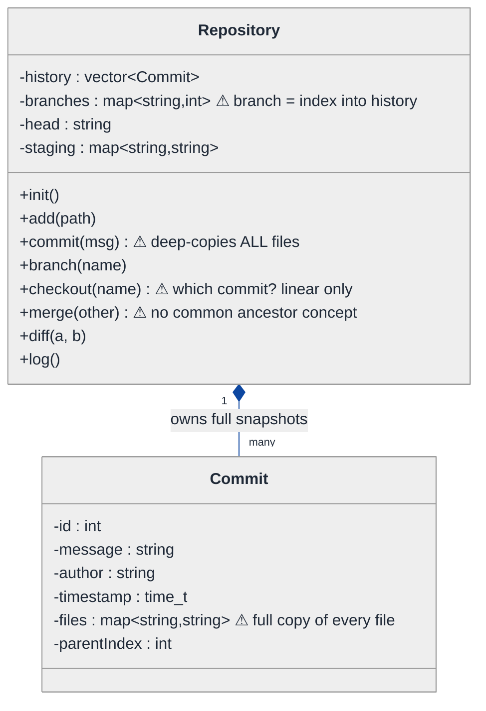
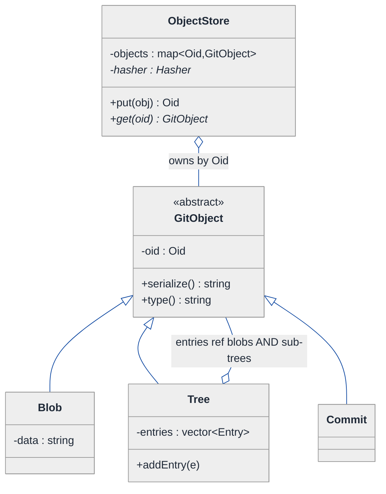
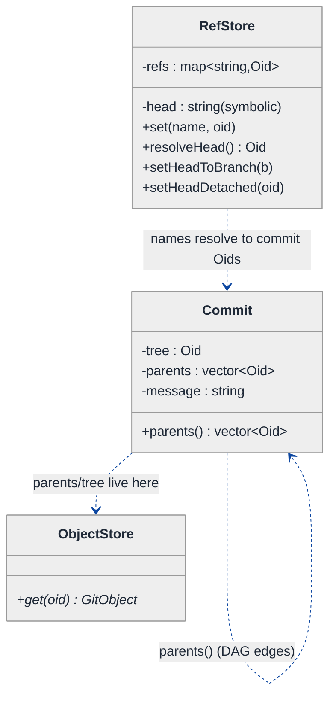
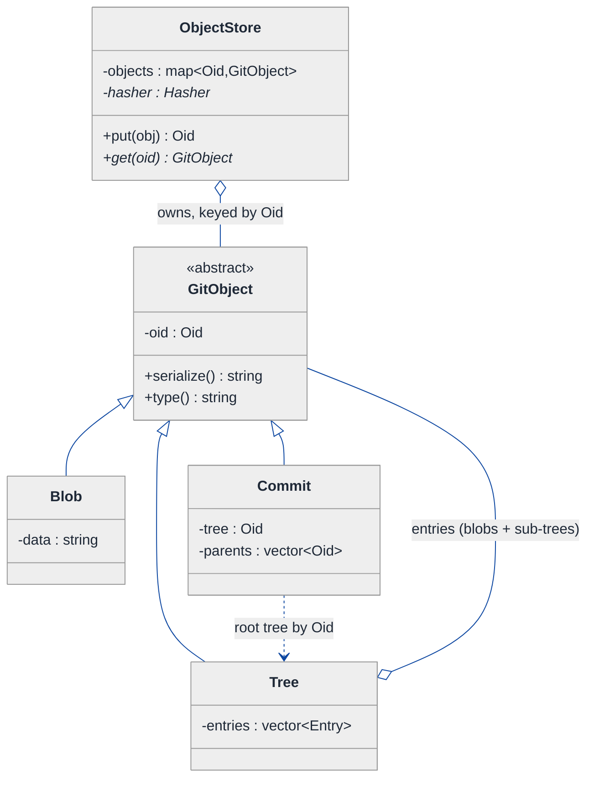
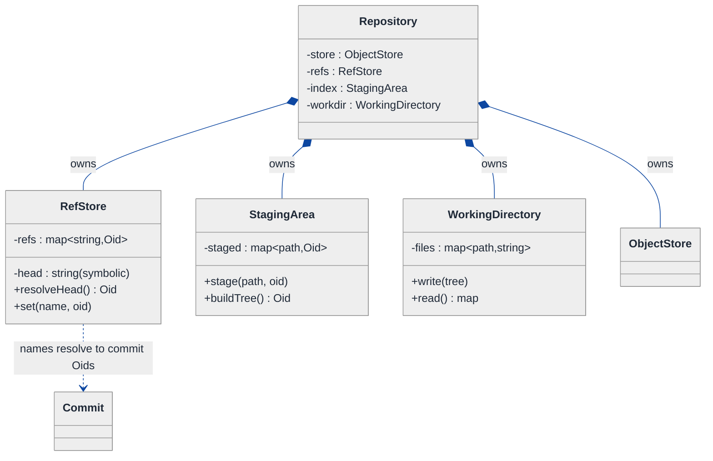
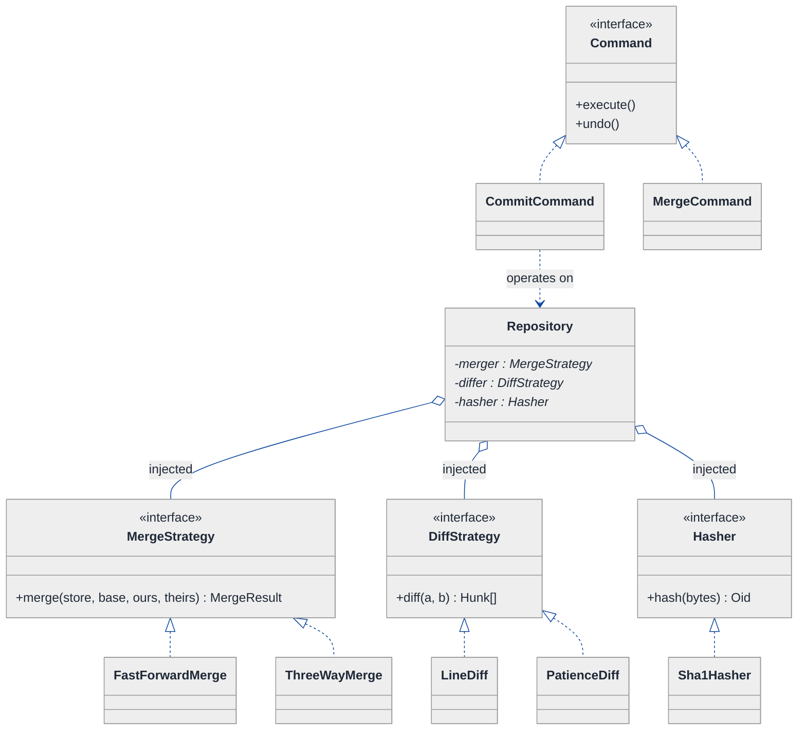
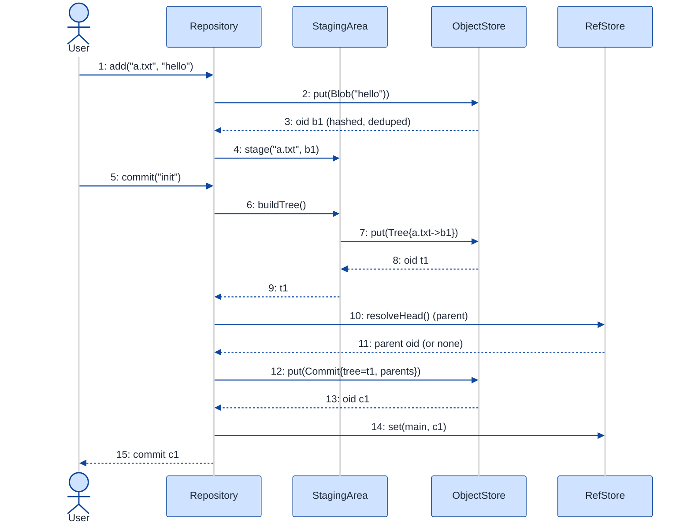
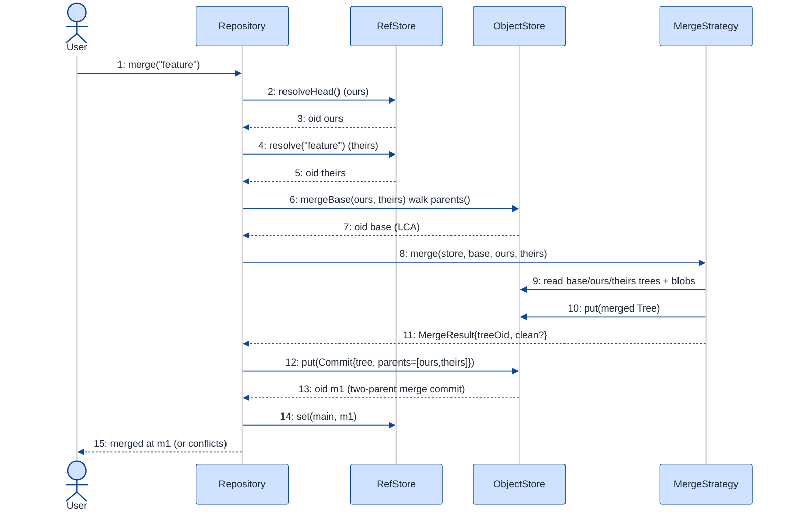

# Version Control System (simplified Git) — LLD Walkthrough

> **Difficulty:** Hard · **Time:** ~45 min · **Pattern focus:** Content-addressable object store + commit DAG (with Composite, Factory, Strategy, Command)
>
> **Problem source(s):** GID DS8, bucket `LLD_DataStructures`. Representative of "design a simplified Git" LeetLens rows in [`./EXTRACTED_QUESTIONS.md`](./EXTRACTED_QUESTIONS.md).
>
> **Diagrams:** inline mermaid (renders natively in GitHub / VS Code). Light bg + soft pastel fills + navy arrows per the repo's canonical theme block.

---

## How to use this file

Paced for a candidate seeing "design Git" for the first time. Reading time: ~45 minutes if you sketch each iteration by hand. **The lesson: Git is not a pile of file-diffs — it is a content-addressable object store whose commits form a directed acyclic graph (DAG). Once you SEE that, init/add/commit/branch/checkout/merge/diff/log stop being eight unrelated features and become eight small operations over two data structures.**

We do NOT assert that structure up front. We build the naive "snapshot-list" version first, watch it bleed under three concrete future requirements, then introduce ONE pattern per painful axis until the object store + DAG fall out.

**Map of this file (15 sections):**

1. Problem statement + clarifying questions
2. Plain-English restatement
3. Why this matters
4. Mental model
5. Try it yourself first
6. Entity & verb extraction
7. **Iteration 1: the naive design** — store every commit as a full file map
8. **Where the naive design hurts** — three future requirements, one painful diff each
9. **Pivot 1: content-addressable object store** — blob/tree/commit by hash (Composite + Factory)
10. **Pivot 2: the commit DAG + refs** — branches and HEAD as named pointers
11. **Pivot 3: pluggable merge + diff + the command surface** — Strategy + Command
12. Final UML class diagram (three sub-views)
13. Skeleton code (C++)
14. Key flow — sequence diagram
15. Extensibility re-check + anti-patterns + how to think aloud + self-check

---

## 1. Problem statement + clarifying questions

**Prompt (typical phrasing):** "Design a version control system — a simplified Git — supporting `init`, `add`, `commit`, `branch`, `checkout`, `merge`, `diff`, and `log`. Model the object store (blobs, trees, commits) and reference management."

**Clarifying questions to ask BEFORE drawing anything:**

1. **Granularity of tracked content?** Whole-file snapshots, or line-level deltas? (Real Git stores whole-file snapshots, deduped by content hash — this shapes the entire object model.)
2. **Single repo, single user, in-memory?** Or multi-user with a remote (push/pull/fetch)? I'll assume single local repo for the core; remotes are a §15 extension.
3. **What hashing scheme?** Real Git uses SHA-1 (migrating to SHA-256). Do you want a real cryptographic hash or can I abstract it behind a `Hasher` so the algorithm is swappable?
4. **Merge semantics?** Just fast-forward, or true three-way merge with a merge-base? And what's the conflict policy — fail, or produce conflict markers?
5. **Does `add` stage into an index/staging area** (like Git's index) before `commit`, or does `commit` snapshot the working tree directly? I'll assume a staging area — it's the Git model and it matters for the design.
6. **Detached HEAD?** Should `checkout <commit-hash>` (not a branch) be supported, or only `checkout <branch>`?
7. **History rewriting?** Do we need `reset`, `rebase`, `amend`, or is the history append-only for v1?
8. **Concurrency?** Two commits racing on the same branch — out of scope for v1? I'll note locking in §15.

**Assumptions if interviewer dodges:** single local in-memory repo, whole-file content-addressed snapshots, a staging area (index), swappable hasher, three-way merge with conflict markers, detached HEAD supported, append-only history for v1, single-threaded.

---

## 2. Plain-English restatement

We're building the engine behind `git`. A user works in a directory, stages some files (`add`), and snapshots them (`commit`). Each commit remembers its parent(s), so history is a chain — actually a graph, because merges have two parents. Branches and `HEAD` are just named sticky-notes pointing at commits. `checkout` rewrites the working directory to match some commit. `merge` combines two lines of history. `diff` and `log` are read-only queries over the stored snapshots and the graph. The design must let us add new merge strategies, new diff algorithms, and new commands **without rewriting the storage core.**

---

## 3. Why this matters

This is the canonical "model a real system you use daily" LLD question, and it's a brutal filter. Candidates who think Git stores diffs design the wrong thing immediately; candidates who know it stores **content-addressed snapshots in a DAG** design something that is correct, deduplicated, and extensible almost by accident. It probes whether you can find the *one true data model* hiding under a pile of verbs, and whether you reach for Composite (the file tree), graph modeling (the commit DAG), and Strategy (merge/diff) at the right moments. The same content-addressable-store + DAG skeleton reappears in Docker image layers, Merkle-tree blockchains, IPFS, and build-cache systems.

---

## 4. Mental model

Git is **two things glued together**: an immutable **object store** (a key-value map where the key IS the hash of the value) and a small set of **mutable named pointers** (refs) into a **commit DAG**.

```
Real-world sketch (NOT a UML diagram yet):

  MUTABLE REFS                 IMMUTABLE OBJECT STORE (key = hash of content)
  ------------                 --------------------------------------------
   HEAD ──► main               commit c3 ─parent─► c2 ─parent─► c1
                │                  │                  │            │
   main ───────┘                 tree t3            tree t2      tree t1
   feature ─► c2'                  │  │               │            │
                                  blob blob          blob         blob
                                 "hello"  "world"   (shared, deduped by hash)

   The arrows on the LEFT move (branch tips advance on commit).
   The boxes on the RIGHT never change — a new content = a new hash = a new object.
```

The KEY insight from this picture: **content is immutable and addressed by its own hash; only the refs move.** A "commit" doesn't copy files — it points at a tree, which points at blobs, many of which are shared with earlier commits. History is a DAG because merge commits have two parents. Once you internalize "store on the right is append-only; pointers on the left move," every Git command is a tiny operation: `commit` = build objects + advance a ref; `branch` = make a new ref; `checkout` = read a tree + move HEAD; `merge` = walk the DAG to a common ancestor + combine trees.

---

## 5. Try it yourself first

> **Predict before reading on:**
>
> 1. List 5 nouns you'd promote to a class. Which noun is the key of the object store — and why does using the *content's own hash* as the key give you deduplication for free?
> 2. **If two commits both contain an unchanged 10 MB file, how many copies of that file does a good design store?** What does that tell you about what a "commit" should actually hold?
> 3. A `Tree` can contain `Blob`s AND other `Tree`s (subdirectories). What classic GoF pattern models "a thing that is either a leaf or a container of the same abstract thing"?

---

## 6. Entity & verb extraction

> **Mini-refresher: noun → class, but not every noun.**
>
> Naive OOD promotes every noun to a class. Senior OOD promotes a noun only if it has both BEHAVIOR and STATE that need to live together. "Hash" stays a value type (a string); "Commit" becomes a class because it has identity, parents, and a tree.

**Nouns from the prompt:**

| Noun | Decision | Why |
|---|---|---|
| Repository | Class (top-level coordinator) | Owns the object store + refs; orchestrates every command |
| Blob | Class (object-store leaf) | Immutable file content, addressed by hash |
| Tree | Class (object-store node) | Maps names → blobs/sub-trees; a directory snapshot |
| Commit | Class (object-store node) | Points at a root tree + parent commit(s) + metadata |
| Hash / OID | Value type (`std::string`) | The key; no behavior of its own |
| Ref (branch / HEAD) | Class | A mutable named pointer to a commit hash |
| Index / StagingArea | Class | Accumulates the next snapshot before commit |
| WorkingDirectory | Class | The user's files on disk; the "checkout target" |
| Author / timestamp / message | Fields on Commit | No behavior of their own |

**Verbs (and the class they live on — naive answer, we'll re-examine):**

| Verb | Owner class (naive answer) |
|---|---|
| init() | Repository |
| add(path) | Repository → StagingArea |
| commit(msg) | Repository |
| branch(name) | Repository → Ref |
| checkout(target) | Repository → WorkingDirectory |
| merge(other) | Repository |
| diff(a, b) | Repository |
| log() | Repository (walks the DAG) |
| hash(content) | (somewhere — TBD) |

**We have NOT introduced any design patterns yet.** Pure nouns + verbs. Note the suspicious "TBD" on `hash` — where hashing lives is the hinge the whole design turns on.

---

## 7. <a id="iter-1"></a>Iteration 1: the naive design

Let's write the simplest thing that could possibly work. A commit is "the whole project at a point in time," so model it as exactly that: a map from file path to file contents. A list of those is your history. No patterns — just classes with maps.



**Reader's tour (read top to bottom; ~60 seconds).**

1. **`Repository` is the root and does everything.** It holds a `history` vector of `Commit`, a `branches` map from branch name to an *index into that vector*, a `head` string, and a `staging` map of path → contents. Every command is a method here. This is already a god-class warning, but let's keep going.

2. **A `Commit` is a full snapshot.** Look at the `files` field: `map<string,string>` — every tracked file's entire contents, copied into every commit. Commit 100 in a repo with a 10 MB asset holds its own 10 MB copy even if the asset never changed.

3. **Branches are integer indices (`map<string,int>`).** A branch "points at" a commit by its position in the `history` vector. This already feels wrong — it ties branch identity to insertion order.

4. **`parentIndex` is a single int.** History is assumed to be a straight line: every commit has exactly one parent. There is no way to express a merge commit with two parents.

5. **The ⚠ markers are the trouble zones:**
   - `commit()` deep-copies the entire working set — O(total bytes) storage per commit.
   - `checkout(name)` only works for linear history and a branch-as-index model.
   - `merge(other)` has no notion of a common ancestor, so it can't do a real three-way merge.

**What's deliberately missing.** No hashing. No content sharing/dedup. No tree structure for directories. No DAG (parents is one int). No separable merge or diff algorithm. The naive design doesn't even *acknowledge* that storage-sharing and multi-parent history are axes — it bakes "copy everything, single parent, branch = index" into the fields. That's what we're going to expose and fix.

Skeleton code for the naive design (C++):

```cpp
#include <ctime>
#include <map>
#include <stdexcept>
#include <string>
#include <vector>

struct Commit {
    int                        id;
    std::string                message;
    std::string                author;
    std::time_t                timestamp;
    std::map<std::string, std::string> files;   // FULL copy of every tracked file — will hurt
    int                        parentIndex;      // single parent only — will hurt
};

class Repository {
public:
    void init() { branches_["main"] = -1; head_ = "main"; }

    void add(const std::string& path, const std::string& contents) {
        staging_[path] = contents;               // overlay onto working snapshot
    }

    int commit(const std::string& msg, const std::string& author) {
        Commit c;
        c.id          = static_cast<int>(history_.size());
        c.message     = msg;
        c.author      = author;
        c.timestamp   = std::time(nullptr);
        c.parentIndex = branches_[head_];
        // copy parent's files, then overlay staging — DEEP COPY of everything
        if (c.parentIndex >= 0) c.files = history_[c.parentIndex].files;
        for (auto& [p, content] : staging_) c.files[p] = content;
        history_.push_back(c);
        branches_[head_] = c.id;                 // advance current branch
        staging_.clear();
        return c.id;
    }

    void branch(const std::string& name) { branches_[name] = branches_[head_]; }

    void checkout(const std::string& name) {     // linear, branch-as-index only
        if (!branches_.count(name)) throw std::runtime_error("no such branch");
        head_ = name;
        // ... rewrite working dir from history_[branches_[name]].files ...
    }

    void merge(const std::string& other) {       // no common-ancestor concept
        // naive: just overlay other's files onto ours. No 3-way, no conflict detection.
        int oi = branches_.at(other);
        for (auto& [p, content] : history_[oi].files) staging_[p] = content;
        commit("merge " + other, "system");
    }

    std::string diff(int a, int b) { /* compare two files maps key by key */ return ""; }

    void log() {                                  // walk back via parentIndex
        for (int i = branches_[head_]; i >= 0; i = history_[i].parentIndex) {
            /* print history_[i] */
        }
    }
private:
    std::vector<Commit>             history_;
    std::map<std::string, int>      branches_;    // branch name -> index into history_
    std::map<std::string, std::string> staging_;
    std::string                     head_;
};
```

**This works.** It has zero design patterns. We can init, add, commit, branch, do a crude checkout, a crude merge, a crude log. So what's wrong with it?

---

## 8. <a id="naive-pain"></a>Where the naive design hurts

The interviewer slides three requirements across the desk: "Here's what's coming. Walk me through what changes."

### Change A: "A 50 MB binary asset lives in the repo and rarely changes; we now have 1000 commits"

In the naive design:
- Every `Commit` holds `files : map<path,string>`, and `commit()` does `c.files = parent.files` — a full deep copy. The 50 MB asset is copied into all 1000 commits → **~50 GB to store ~50 MB of actual content.**
- There is no place to even *attempt* dedup: identical content has no shared identity. Two commits with the same bytes have two separate copies in two separate maps.
- **The fix touches the storage model itself: `Commit::files`, `commit()`, and `diff()` all assume "snapshot = inline byte copy."** This is a data-model defect, not a tunable.

### Change B: "Support real branching + a true three-way merge with conflict detection"

In the naive design:
- `branches` is `map<string,int>` (index into a linear vector) and `parentIndex` is a single int. A merge commit needs **two** parents — the field can't hold that.
- `merge()` just overlays the other branch's files. To do a real merge you must find the **common ancestor** (merge-base) of two commits, then three-way-compare base/ours/theirs per file. With a single-parent linear list there's no graph to walk for an ancestor.
- **The fix touches `Commit::parentIndex` (must become a list), `branches` (must stop being indices), `merge()` (needs ancestor search), and `log()` (must traverse a graph, not decrement an index).** Four sites, and they fight each other.

### Change C: "Add a `diff` that's word-level for prose files but line-level for code, and later a patience-diff algorithm"

In the naive design:
- `diff(a,b)` is one hardcoded method comparing two `files` maps. Adding a second diff algorithm means an `if (mode == WORD) ... else if (mode == LINE) ...` ladder *inside* `diff()`.
- Same disease will hit `merge()` when fast-forward vs three-way vs ours/theirs strategies arrive.
- **Every new algorithm is surgery inside one growing method.** Classic tag-driven branching.

### The pattern of pain

| Change | Files / fields touched | Smell |
|---|---|---|
| A. Big binary, 1000 commits | `Commit::files` + `commit()` + `diff()` | "Snapshot = inline byte-copy; zero content sharing. Storage explodes." |
| B. Real branch + 3-way merge | `parentIndex` + `branches` + `merge()` + `log()` | "Single-parent linear list can't express a DAG or a merge-base." |
| C. Pluggable diff/merge | `diff()` (and soon `merge()`) | "One method accumulates every algorithm via if/else." |

**Three axes of pain dominate:** (1) *storage identity* — content needs a stable shared key so identical bytes are stored once; (2) *history shape* — single-parent linear must become a multi-parent DAG with movable named pointers; (3) *algorithm variability* — diff and merge are algorithms that vary.

> **Pivot question:** "What gives identical content ONE shared identity so we store it once (Change A)? What turns 'list of snapshots' into a navigable many-parent graph with movable pointers (Change B)? What swaps an algorithm without touching its caller (Change C)?"
>
> The answers are a **content-addressable object store** (hash = identity), a **commit DAG + refs**, and **Strategy**. Let's introduce them one at a time, starting with the most fundamental: the object store.

---

## 9. <a id="pivot-1"></a>Pivot 1: content-addressable object store (Blob / Tree / Commit by hash)

Change A is the deepest, so we fix it first. The root cause: content has no identity, so it can't be shared. Give every piece of content a key that IS a hash of its bytes, and store all objects in one map keyed by that hash. Identical content → identical hash → stored exactly once. That's a **content-addressable store**, and it's the heart of Git.

> **Mini-refresher: content-addressable storage (CAS).**
>
> A key-value store where the KEY of a value is a hash of the value itself (`oid = hash(bytes)`). Consequence 1: it's a natural deduplicator — store the same bytes twice and you get the same key, so there's one entry. Consequence 2: it's tamper-evident — if the bytes change, the key changes, so a parent that references an old key still sees the old (immutable) content. Git, Docker layers, and IPFS are all CAS.

Now: a directory contains files AND sub-directories, and a sub-directory is itself a directory. That's a recursive "leaf-or-container" shape — the textbook trigger for **Composite**.

> **Mini-refresher: Composite pattern.**
>
> Lets you treat a *leaf* and a *container of the same abstract type* uniformly through one interface. A `Tree` holds entries that are each *either* a `Blob` (leaf) *or* another `Tree` (composite). Code that walks the structure calls the same `hash()`/`serialize()` method on both without asking "are you a file or a folder?"

And constructing an object means "hash the content, store it if absent, return the existing one if present." That dedup-on-create logic belongs in a **Factory**, not scattered across callers.

> **Mini-refresher: Factory.**
>
> A method/class that owns object creation so callers don't `new` directly. Here the factory does the CAS bookkeeping: compute hash → if the store already has it, return it; else insert and return. Callers say `store.writeBlob(bytes)` and never worry about dedup.

**The refactor (just the object-store slice):**

```cpp
using Oid = std::string;            // object id = hex hash. A value type, not a class.

// ── Composite: the object hierarchy ─────────────────────────────────
class GitObject {                   // common base for everything in the store
public:
    virtual ~GitObject() = default;
    virtual std::string serialize() const = 0;   // canonical byte form (hashed input)
    virtual std::string type()      const = 0;    // "blob" | "tree" | "commit"
    Oid oid() const { return oid_; }              // set once by the store on insert
    void setOid(Oid id) { oid_ = std::move(id); }
private:
    Oid oid_;
};

class Blob : public GitObject {     // LEAF: raw file content
public:
    explicit Blob(std::string data) : data_(std::move(data)) {}
    std::string serialize() const override { return "blob " + data_; }
    std::string type()      const override { return "blob"; }
    const std::string& data() const { return data_; }
private:
    std::string data_;
};

class Tree : public GitObject {     // COMPOSITE: name -> child oid (blob OR tree)
public:
    struct Entry { std::string name; std::string mode; Oid target; std::string kind; };
    void addEntry(Entry e) { entries_.push_back(std::move(e)); }
    std::string type() const override { return "tree"; }
    std::string serialize() const override {        // canonical: sorted by name
        std::string s = "tree";
        for (auto& e : entries_) s += "\n" + e.mode + " " + e.kind + " " + e.target + " " + e.name;
        return s;
    }
    const std::vector<Entry>& entries() const { return entries_; }
private:
    std::vector<Entry> entries_;    // both blobs and sub-trees live here uniformly
};
// Commit is also a GitObject — defined in Pivot 2 (it carries DAG edges).

// ── The store + Factory ─────────────────────────────────────────────
class Hasher {                      // Strategy seam (see Pivot 3): swappable hash algo
public:
    virtual ~Hasher() = default;
    virtual Oid hash(const std::string& bytes) const = 0;
};

class ObjectStore {
public:
    explicit ObjectStore(std::unique_ptr<Hasher> h) : hasher_(std::move(h)) {}

    // Factory method: hash, dedup, insert-if-absent, return the oid.
    template <typename T>
    Oid put(std::unique_ptr<T> obj) {
        Oid id = hasher_->hash(obj->serialize());
        if (!objects_.count(id)) {                 // DEDUP: store identical content once
            obj->setOid(id);
            objects_[id] = std::move(obj);
        }
        return id;
    }
    const GitObject* get(const Oid& id) const {
        auto it = objects_.find(id);
        return it == objects_.end() ? nullptr : it->second.get();
    }
private:
    std::unordered_map<Oid, std::unique_ptr<GitObject>> objects_;  // the CAS map
    std::unique_ptr<Hasher>                             hasher_;
};
```

**What changed — visualized.** Just the object-store slice:



**Tour of the after-state.**

1. **`ObjectStore` is the new key-value core.** One `map<Oid, GitObject>`. The `put()` Factory method hashes content, and only inserts if the hash is absent. **Dedup is automatic** — the 50 MB asset from Change A now lives once, no matter how many commits reference it.

2. **`GitObject` is the Composite base.** Blob, Tree, and Commit all derive from it, so the store holds them uniformly. Every object answers `serialize()` (its canonical bytes — the input to the hash) and `type()`.

3. **`Tree` is the composite node.** Its entries reference children *by Oid* — and a child can be a `Blob` (leaf) or another `Tree` (sub-directory). The `Tree o-- GitObject` self-referential aggregation IS the Composite recursion: a directory is a tree of trees of blobs.

4. **`Commit` is reserved.** It's a `GitObject` too (so it gets a hash and lives in the same store) but it carries the DAG edges — we build it in Pivot 2.

5. **`Hasher` is injected.** The store doesn't hardcode SHA-1; it takes a `Hasher*`. (This is a Strategy seam we'll formalize in Pivot 3.)

**Change A now lands cleanly.** The 50 MB asset committed 1000 times is hashed once → one `Blob` in the store. Each commit's tree just references that one Oid. Storage is O(distinct content), not O(commits × bytes).

**Pattern-discrimination cheatsheet — Composite vs Decorator.**
- *Composite:* a tree where leaf and container share one interface; the recursion models *part-whole* (directory contains files/dirs).
- *Decorator:* a *chain* that wraps one object to add behavior; same interface, but it's a 1-to-1 wrap, not a 1-to-many tree.
- *Rule of thumb:* "a node has many children of the same abstract type" → Composite. "I wrap one thing to extend it" → Decorator. A directory has many children → Composite.

---

## 10. <a id="pivot-2"></a>Pivot 2: the commit DAG + refs

Change B is still open: real branching and a true three-way merge need a graph, not a list. The object store from Pivot 1 already makes commits immutable objects — now we give a `Commit` **multiple parents** and turn branches/HEAD into **movable named pointers** instead of integer indices.

> **Mini-refresher: DAG (directed acyclic graph) for history.**
>
> Each commit points back to its parent(s). A normal commit has one parent; a *merge* commit has two (or more). Edges only point backward in time, so there are no cycles → it's a DAG. The graph is implicit in the object store: you don't store an adjacency list — each `Commit` object just holds its parents' Oids, and you traverse by following them.

> **Mini-refresher: refs as named mutable pointers.**
>
> A *ref* is a tiny mutable record: a name (`main`, `feature`) → the Oid of a commit. `HEAD` is a special ref that usually points at *another ref* ("I am on branch main") and occasionally points straight at a commit ("detached HEAD"). The object store is append-only and immutable; refs are the ONLY mutable state. `commit` = create an immutable commit object + advance one ref. `branch` = create a new ref. `checkout` = repoint HEAD (and rewrite the working tree).

**The refactor (the Commit object + the ref layer):**

```cpp
class Commit : public GitObject {
public:
    Commit(Oid treeOid, std::vector<Oid> parents, std::string msg,
           std::string author, std::time_t when)
        : tree_(std::move(treeOid)), parents_(std::move(parents)),
          message_(std::move(msg)), author_(std::move(author)), when_(when) {}

    std::string type() const override { return "commit"; }
    std::string serialize() const override {            // parents make it a DAG node
        std::string s = "commit\ntree " + tree_;
        for (auto& p : parents_) s += "\nparent " + p;
        s += "\nauthor " + author_ + "\n\n" + message_;
        return s;                                       // identity depends on parents+tree
    }
    const Oid&              tree()    const { return tree_; }
    const std::vector<Oid>& parents() const { return parents_; }   // 0, 1, or 2+ parents
    const std::string&      message() const { return message_; }
private:
    Oid                tree_;
    std::vector<Oid>   parents_;     // <-- the DAG edges. 2 parents == merge commit.
    std::string        message_, author_;
    std::time_t        when_;
};

// ── Refs: the ONLY mutable state ────────────────────────────────────
class RefStore {
public:
    void   set(const std::string& name, const Oid& target) { refs_[name] = target; }
    Oid    resolve(const std::string& name) const { return refs_.at(name); }
    bool   exists(const std::string& name) const { return refs_.count(name) > 0; }

    // HEAD is symbolic: "ref: refs/heads/main" (attached) or a raw Oid (detached).
    void   setHeadToBranch(const std::string& branch) { head_ = "ref:" + branch; }
    void   setHeadDetached(const Oid& commit)         { head_ = commit; }
    Oid    resolveHead() const {
        return head_.rfind("ref:", 0) == 0 ? refs_.at(head_.substr(4)) : head_;
    }
private:
    std::unordered_map<std::string, Oid> refs_;   // branch name -> commit oid
    std::string                          head_ = "ref:main";
};

// merge-base: lowest common ancestor by walking parents in the DAG (sketch)
inline Oid mergeBase(const ObjectStore& store, const Oid& a, const Oid& b) {
    std::unordered_set<Oid> ancestorsOfA;
    // BFS from a over parents() -> fill ancestorsOfA; then BFS from b until a hit. // elided
    return /* first common */ "";
}
```

**What changed — visualized.** The DAG + ref slice:



**Tour of the after-state.**

1. **`parentIndex : int` is GONE.** It became `parents : vector<Oid>`. Zero parents = root commit; one parent = normal commit; two parents = merge commit. The DAG is now expressible.

2. **History is no longer stored as a list.** There is no `history` vector anymore. The graph is *implicit*: a commit references its parents by Oid, and you traverse by `store.get(parentOid)`. `log()` becomes a graph walk (BFS/DFS over `parents()`), not an index decrement.

3. **`branches` stopped being indices.** `RefStore` maps branch *name* → commit *Oid*. Branch identity is decoupled from insertion order. Creating a branch is one map insert; deleting one is one erase — the commits it pointed at stay in the store.

4. **`HEAD` is symbolic.** It holds either `"ref:main"` (attached — "I'm on branch main, advancing main advances HEAD") or a raw Oid (detached — answering clarifying-Q #6). `resolveHead()` handles both. This is exactly Git's `.git/HEAD` model.

5. **`mergeBase()` is now possible.** Because we can walk `parents()`, finding the lowest common ancestor of two branch tips is a graph search. That ancestor is the "base" the three-way merge in Pivot 3 needs.

**Change B now lands cleanly.** A real branch is a ref; a merge commit is a `Commit` with two parents; the merge-base is an LCA walk over the DAG; `log` is a topological walk. None of it requires touching the object store from Pivot 1.

**Pattern-discrimination cheatsheet — modeling the DAG: explicit graph object vs implicit pointer chase.**
- *Explicit `Graph` class* (adjacency list of nodes/edges): good when you query the graph many ways and edges are mutable.
- *Implicit DAG via object references* (each `Commit` holds parent Oids): good when nodes are immutable and you only ever walk backward. Git uses this — no `Graph` class exists; the store *is* the graph.
- *Rule of thumb:* immutable nodes + backward-only traversal → implicit references. Mutable, multi-query, bidirectional → explicit graph object. We pick implicit because commits are immutable CAS objects.

---

## 11. <a id="pivot-3"></a>Pivot 3: pluggable merge + diff + the command surface

Change C is open: diff and merge are algorithms that vary, and they're currently hardcoded methods. This is the *exact* shape we keep seeing — "an algorithm picked by the caller" — so it's Strategy. While we're here, the eight verbs (`init`, `add`, `commit`, …) themselves want a uniform, extensible surface, so we wrap each as a Command.

> **Mini-refresher: Strategy pattern.**
>
> Encapsulates an algorithm behind an interface so it can be swapped at runtime. The CALLER decides which strategy to use; the strategy doesn't know about its peers. A `Repository` takes a `MergeStrategy*` and a `DiffStrategy*`; pass `FastForwardMerge` or `ThreeWayMerge` — the repo doesn't care which.

**Why Strategy fits diff and merge (and the hasher).** Each is "given some inputs, produce a result," and each varies independently: line vs word vs patience diff; fast-forward vs three-way vs ours/theirs merge; SHA-1 vs SHA-256 hashing. The choice is external (repo config / command flags), and the algorithms compose with nothing else. Textbook Strategy.

> **Mini-refresher: Command pattern.**
>
> Wraps a request as an object with a uniform `execute()` method (and optionally `undo()`). Decouples the *invoker* (a CLI/REPL dispatcher) from the *receiver* (the Repository). New verbs become new command classes — the dispatcher never changes (open/closed). The `undo()` hook is also where `reset`/`revert` would live later.

**The refactor (the algorithm strategies + the command surface):**

```cpp
// ── Strategy: diff ──────────────────────────────────────────────────
struct Hunk { int aStart, aLen, bStart, bLen; std::string text; };

class DiffStrategy {
public:
    virtual ~DiffStrategy() = default;
    virtual std::vector<Hunk> diff(const std::string& a, const std::string& b) const = 0;
};
class LineDiff   : public DiffStrategy { /* Myers over lines */  public: std::vector<Hunk> diff(const std::string&, const std::string&) const override; };
class WordDiff   : public DiffStrategy { /* tokenize on spaces */ /* elided */ };
class PatienceDiff : public DiffStrategy { /* patience algorithm */ /* elided */ };

// ── Strategy: merge ─────────────────────────────────────────────────
struct MergeResult { Oid treeOid; bool clean; std::vector<std::string> conflicts; };

class MergeStrategy {
public:
    virtual ~MergeStrategy() = default;
    virtual MergeResult merge(ObjectStore& store, const Oid& base,
                              const Oid& ours, const Oid& theirs) const = 0;
};
class FastForwardMerge : public MergeStrategy { /* if base==ours, result=theirs */ };
class ThreeWayMerge : public MergeStrategy {     // uses base/ours/theirs per file
public:
    MergeResult merge(ObjectStore& store, const Oid& base,
                      const Oid& ours, const Oid& theirs) const override;  // elided
};
class OursMerge : public MergeStrategy { /* keep ours on conflict */ };

// ── Strategy: hasher (formalized from Pivot 1) ──────────────────────
class Sha1Hasher   : public Hasher { public: Oid hash(const std::string&) const override; };
class Sha256Hasher : public Hasher { /* elided */ };

// ── Command: uniform verb surface ───────────────────────────────────
class Command {
public:
    virtual ~Command() = default;
    virtual void execute() = 0;
    virtual void undo() {}                 // hook for reset/revert (future)
};
class CommitCommand : public Command {
public:
    CommitCommand(Repository& repo, std::string msg) : repo_(repo), msg_(std::move(msg)) {}
    void execute() override;               // builds tree from index, writes Commit, advances ref
private:
    Repository& repo_;
    std::string msg_;
};
// AddCommand, BranchCommand, CheckoutCommand, MergeCommand, DiffCommand, LogCommand — elided
```

**The Repository now orchestrates injected strategies instead of branching internally:**

```cpp
class Repository {
public:
    Repository(std::unique_ptr<Hasher> h,
               std::unique_ptr<MergeStrategy> m,
               std::unique_ptr<DiffStrategy>  d)
        : store_(std::move(h)), merger_(std::move(m)), differ_(std::move(d)) {}
    // commands delegate here; the if/else diff/merge ladders are GONE
private:
    ObjectStore                    store_;
    RefStore                       refs_;
    StagingArea                    index_;
    std::unique_ptr<MergeStrategy> merger_;   // swappable
    std::unique_ptr<DiffStrategy>  differ_;   // swappable
};
```

**Change C now lands cleanly.** A new diff = one new `DiffStrategy` subclass injected at construction; a new merge = one new `MergeStrategy`; a new verb = one new `Command`. No edits to `Repository`'s core or to any existing strategy.

**Pattern-discrimination cheatsheet — Strategy vs Command.**
- *Strategy:* swaps *how* a single step is computed (which diff algorithm). The caller holds it and calls a compute-style method.
- *Command:* packages *what* action to perform (a whole verb) as an object with `execute()`/`undo()`, so an invoker can store, queue, log, or undo it.
- *Rule of thumb:* "interchangeable algorithm for one operation" → Strategy. "a request you want to queue / undo / dispatch uniformly" → Command. Diff/merge are Strategies; the eight git verbs are Commands.

> **Mini-refresher: why hasher, diff, and merge don't share one Strategy interface.**
>
> Strategy is a *role*, not a type. `Hasher`, `DiffStrategy`, and `MergeStrategy` take different inputs and return different outputs — they have nothing in common at the type level. Don't unify them under a generic `Strategy<In,Out>`; that's premature genericism that buys nothing.

---

## 12. <a id="fig-class-diagram"></a>Final class diagram

One mega-diagram would be a wall of boxes. Here are **three focused sub-views** — the object store, the ref/DAG layer, and the algorithm/command layer — followed by a structural insight that ties them together.

### 12.1 The object store — what the repo STORES (Composite + CAS)



**Tour of 12.1.** One `ObjectStore` map keyed by Oid holds every object. `GitObject` is the Composite base; `Blob` is the leaf, `Tree` is the recursive container (its `Tree o-- GitObject` edge is the Composite recursion), and `Commit` references a root `Tree`. The store's `put()` is the dedup Factory — identical bytes hash to one entry. This is the immutable, append-only half of the system.

### 12.2 The mutable refs + the DAG — what MOVES



**Tour of 12.2.**

1. **`Repository` composes four collaborators** (filled diamonds = same lifetime): the immutable `ObjectStore`, the mutable `RefStore`, the `StagingArea` (the index), and the `WorkingDirectory`. This split is the inventory-vs-orchestration-vs-policy separation: store = inventory, refs = pointers, repo = orchestration.

2. **`RefStore` is the only mutable state in the system.** Branches and HEAD are names → Oids; `resolveHead()` follows the symbolic ref. `branch`/`checkout`/`commit` all reduce to "edit one ref."

3. **`StagingArea` is Git's index.** `add` stages a path by storing its blob and recording `path → Oid`; `buildTree()` turns the staged set into a `Tree` object (answering clarifying-Q #5).

4. **`WorkingDirectory` is the checkout target.** `checkout` reads a commit's tree and writes those files out; this is the bridge between immutable objects and the user's disk.

### 12.3 The pluggable algorithms + commands — what VARIES



**Tour of 12.3.**

1. **Three Strategy interfaces hang off `Repository` via aggregation** (open diamonds = injected, not owned-for-life-by-identity): `MergeStrategy`, `DiffStrategy`, `Hasher`. Each has a small concrete family. The repo's core never branches on "which algorithm" — it calls the interface.

2. **`Command` is a separate hierarchy.** Each git verb (`CommitCommand`, `MergeCommand`, …) implements `execute()`/`undo()` and operates on the `Repository`. A CLI dispatcher maps a string to a Command and calls `execute()` — adding a verb never touches the dispatcher.

3. **`undo()` is deliberately present.** It's empty for now, but it's the seam where `reset`/`revert` plug in later — the Command pattern reserved the spot.

### Structural insight (ties 12.1 + 12.2 + 12.3 together)

| Concern | Pattern used | Why |
|---|---|---|
| **Storage / dedup** (Blob, Tree, Commit) | Composite + content-addressable Factory | Files-in-dirs is a part-whole tree; hash-as-key dedups identical content |
| **History shape** (branches, merges, log) | Implicit DAG via parent Oids + Refs | Immutable nodes, backward-only walk; only refs mutate |
| **Algorithms** (diff, merge, hash) | Strategy, INJECTED into Repository | Caller / config picks the variant; algorithms vary independently |
| **Verb surface** (the 8 commands) | Command | Uniform `execute()`/`undo()`; new verbs are new classes, dispatcher unchanged |

The big lesson: **the object store is immutable and content-addressed (so storage is correct and deduped for free), the DAG is implicit in parent pointers (so history is a graph without a Graph class), and everything that *varies* — diff, merge, hash, verbs — is composition over an interface.** Inheritance is used only for the GitObject Composite and the Strategy/Command families. *Immutable identity for content, movable pointers for history, composition for behavior.*

---

## 13. Skeleton code (C++)

> Show the SHAPES, not the full impl. ~140 lines. Pulls together the slices from Pivots 1-3.

```cpp
#include <ctime>
#include <memory>
#include <stdexcept>
#include <string>
#include <unordered_map>
#include <unordered_set>
#include <utility>
#include <vector>

using Oid = std::string;            // object id = hex hash; value type

// ── Composite: object hierarchy ─────────────────────────────────────
class GitObject {
public:
    virtual ~GitObject() = default;
    virtual std::string serialize() const = 0;     // canonical bytes (hash input)
    virtual std::string type()      const = 0;      // "blob" | "tree" | "commit"
    Oid  oid() const { return oid_; }
    void setOid(Oid id) { oid_ = std::move(id); }
private:
    Oid oid_;
};

class Blob : public GitObject {                     // leaf
public:
    explicit Blob(std::string d) : data_(std::move(d)) {}
    std::string type()      const override { return "blob"; }
    std::string serialize() const override { return "blob " + data_; }
    const std::string& data() const { return data_; }
private:
    std::string data_;
};

class Tree : public GitObject {                     // composite (recursive)
public:
    struct Entry { std::string name, mode, kind; Oid target; };  // kind = blob|tree
    void addEntry(Entry e) { entries_.push_back(std::move(e)); }
    std::string type() const override { return "tree"; }
    std::string serialize() const override {
        std::string s = "tree";
        for (auto& e : entries_) s += "\n" + e.kind + " " + e.target + " " + e.name;
        return s;                                   // (sort by name in real impl)
    }
    const std::vector<Entry>& entries() const { return entries_; }
private:
    std::vector<Entry> entries_;
};

class Commit : public GitObject {                   // DAG node
public:
    Commit(Oid tree, std::vector<Oid> parents, std::string msg, std::string who, std::time_t t)
        : tree_(std::move(tree)), parents_(std::move(parents)),
          message_(std::move(msg)), author_(std::move(who)), when_(t) {}
    std::string type() const override { return "commit"; }
    std::string serialize() const override {
        std::string s = "commit\ntree " + tree_;
        for (auto& p : parents_) s += "\nparent " + p;
        return s + "\nauthor " + author_ + "\n\n" + message_;
    }
    const Oid&              tree()    const { return tree_; }
    const std::vector<Oid>& parents() const { return parents_; }
    const std::string&      message() const { return message_; }
private:
    Oid tree_; std::vector<Oid> parents_;
    std::string message_, author_; std::time_t when_;
};

// ── Strategy interfaces (one per axis of variation) ─────────────────
class Hasher {
public:
    virtual ~Hasher() = default;
    virtual Oid hash(const std::string& bytes) const = 0;
};
class Sha1Hasher : public Hasher {
public:
    Oid hash(const std::string& bytes) const override; // SHA-1 hex digest // elided
};
// Sha256Hasher elided

struct Hunk { int aStart, aLen, bStart, bLen; std::string text; };
class DiffStrategy {
public:
    virtual ~DiffStrategy() = default;
    virtual std::vector<Hunk> diff(const std::string& a, const std::string& b) const = 0;
};
class LineDiff : public DiffStrategy {
public:
    std::vector<Hunk> diff(const std::string&, const std::string&) const override; // Myers // elided
};
// WordDiff, PatienceDiff elided

struct MergeResult { Oid treeOid; bool clean; std::vector<std::string> conflicts; };
class MergeStrategy {
public:
    virtual ~MergeStrategy() = default;
    virtual MergeResult merge(class ObjectStore& s, const Oid& base,
                              const Oid& ours, const Oid& theirs) const = 0;
};
class ThreeWayMerge : public MergeStrategy {
public:
    MergeResult merge(ObjectStore&, const Oid&, const Oid&, const Oid&) const override; // elided
};
// FastForwardMerge, OursMerge elided

// ── Content-addressable store (Factory: put = hash+dedup+insert) ────
class ObjectStore {
public:
    explicit ObjectStore(std::unique_ptr<Hasher> h) : hasher_(std::move(h)) {}
    template <typename T>
    Oid put(std::unique_ptr<T> obj) {
        Oid id = hasher_->hash(obj->serialize());
        if (!objects_.count(id)) { obj->setOid(id); objects_[id] = std::move(obj); }
        return id;                                  // dedup: identical bytes => one entry
    }
    const GitObject* get(const Oid& id) const {
        auto it = objects_.find(id);
        return it == objects_.end() ? nullptr : it->second.get();
    }
private:
    std::unordered_map<Oid, std::unique_ptr<GitObject>> objects_;
    std::unique_ptr<Hasher>                             hasher_;
};

// ── Refs (the only mutable state) ───────────────────────────────────
class RefStore {
public:
    void set(const std::string& n, const Oid& o) { refs_[n] = o; }
    bool exists(const std::string& n) const { return refs_.count(n) > 0; }
    void setHeadToBranch(const std::string& b) { head_ = "ref:" + b; }
    void setHeadDetached(const Oid& c)         { head_ = c; }
    std::string currentBranch() const {
        return head_.rfind("ref:", 0) == 0 ? head_.substr(4) : std::string{};
    }
    Oid resolveHead() const {
        return head_.rfind("ref:", 0) == 0 ? refs_.at(head_.substr(4)) : head_;
    }
private:
    std::unordered_map<std::string, Oid> refs_;
    std::string                          head_ = "ref:main";
};

class StagingArea {                                 // Git's index
public:
    void stage(const std::string& path, const Oid& blob) { staged_[path] = blob; }
    Oid  buildTree(ObjectStore& store) const;        // assemble Tree from staged set // elided
    void clear() { staged_.clear(); }
private:
    std::unordered_map<std::string, Oid> staged_;
};

// ── Repository: orchestrator (owns store+refs+index, injected strategies) ──
class Repository {
public:
    Repository(std::unique_ptr<Hasher> h, std::unique_ptr<MergeStrategy> m,
               std::unique_ptr<DiffStrategy> d)
        : store_(std::move(h)), merger_(std::move(m)), differ_(std::move(d)) {}

    void init() { /* set up empty refs; HEAD->main */ }
    void add(const std::string& path, const std::string& contents) {
        index_.stage(path, store_.put(std::make_unique<Blob>(contents)));   // CAS write
    }
    Oid commit(const std::string& msg, const std::string& author) {
        Oid tree = index_.buildTree(store_);
        std::vector<Oid> parents;
        if (refs_.exists(refs_.currentBranch())) parents.push_back(refs_.resolveHead());
        Oid c = store_.put(std::make_unique<Commit>(tree, parents, msg, author, std::time(nullptr)));
        refs_.set(refs_.currentBranch(), c);          // advance current branch
        index_.clear();
        return c;
    }
    void branch(const std::string& name) { refs_.set(name, refs_.resolveHead()); }
    void checkout(const std::string& name);            // repoint HEAD + rewrite workdir // elided
    Oid  merge(const std::string& other);              // mergeBase + merger_->merge(...) // elided
    std::vector<Hunk> diff(const Oid& a, const Oid& b);// differ_->diff over blob contents // elided
    void log() const;                                  // BFS/DFS over Commit::parents() // elided
private:
    ObjectStore                    store_;
    RefStore                       refs_;
    StagingArea                    index_;
    std::unique_ptr<MergeStrategy> merger_;
    std::unique_ptr<DiffStrategy>  differ_;
};

// ── Command surface ─────────────────────────────────────────────────
class Command {
public:
    virtual ~Command() = default;
    virtual void execute() = 0;
    virtual void undo() {}                              // seam for reset/revert
};
class CommitCommand : public Command {
public:
    CommitCommand(Repository& r, std::string m, std::string a)
        : repo_(r), msg_(std::move(m)), author_(std::move(a)) {}
    void execute() override { repo_.commit(msg_, author_); }
private:
    Repository& repo_; std::string msg_, author_;
};
// AddCommand, BranchCommand, CheckoutCommand, MergeCommand, DiffCommand, LogCommand — elided
```

---

## 14. <a id="fig-sequence"></a>Key flow — sequence diagram

Two phases. Phase 1: `add` then `commit` (how content becomes immutable objects + a ref advance). Phase 2: `merge` (where the DAG walk and the Strategy meet).

### Phase 1 — add + commit



**Tour of Phase 1.**

1. **`add` writes a Blob into the store FIRST.** The content is hashed and deduped on the way in (steps 2-3) — if `"hello"` already exists, step 3 returns the existing oid. The staging area only records `path → oid` (step 4); it never holds bytes.

2. **`commit` materializes the staged set into a Tree.** `buildTree()` (steps 6-9) creates a `Tree` object from the index and stores it — again hashed and deduped. Unchanged sub-directories reuse their existing tree oids, which is why a commit touching one file doesn't rewrite the whole tree.

3. **The parent comes from the current ref.** Step 10-11 resolves HEAD to get the parent oid, so the new commit knows its place in the DAG. A first commit has no parent.

4. **The Commit object is stored, then the ref advances.** Steps 12-13 write the immutable commit; step 14 is the ONLY mutation — `main` now points at `c1`. **Notice what the design HIDES from the caller:** the user said "commit" and never touched a hash, a tree, or a parent pointer — the content-addressing and DAG wiring are entirely internal.

### Phase 2 — merge (DAG walk + Strategy)



**Tour of Phase 2 (read slowly — this is where the DAG and the Strategy cooperate).**

1. **Resolve the two tips.** Steps 2-5 turn the branch names into commit Oids: `ours` (current HEAD) and `theirs` (`feature`). Refs are the indirection that lets the user say "feature" instead of a hash.

2. **Find the merge-base by walking the DAG.** Step 6-7 is the LCA computation over `Commit::parents()` — only possible because Pivot 2 made history a graph. The base is the three-way merge's reference point.

3. **The injected MergeStrategy does the combine.** Step 8 hands `(base, ours, theirs)` to whichever `MergeStrategy` was injected — `ThreeWayMerge` here. **The Repository does not know HOW the merge works**; swap in `FastForwardMerge` or `OursMerge` and steps 1-7 and 12-15 are byte-identical.

4. **The merge produces a new Tree, possibly with conflicts.** Steps 9-11: the strategy reads the three versions of each file, runs its algorithm, and writes a merged tree (reusing unchanged blob/tree oids — dedup again). `MergeResult.clean` says whether conflict markers were needed.

5. **A two-parent commit records the merge.** Step 12-13 write a `Commit` whose `parents = [ours, theirs]` — THIS is the merge commit, and it's the reason history is a DAG, not a tree. Step 14 advances the ref. Everything immutable went into the store; one pointer moved.

### The validation that's NOT shown — and why it matters

You never see the caller hash anything, copy a file, or hand-wire a parent pointer. Content-addressing makes "store the same file twice" *impossible* (same bytes → same oid → one entry), and the DAG makes "lose history on merge" impossible (the old tip survives as a parent). **Correctness is a property of the data model, not of careful procedural code.**

---

## 15. Extensibility re-check + anti-patterns + how to think aloud + self-check

### Extensibility re-check

Revisit the three changes from [§8](#naive-pain), plus future ones. For each, name what changes.

| Change | Naive design impact | Final design impact |
|---|---|---|
| A. Big binary × 1000 commits | `Commit::files` + `commit()` + `diff()`; ~50 GB | CAS dedup is automatic — one Blob. **Zero code change.** |
| B. Real branch + 3-way merge | `parentIndex` + `branches` + `merge()` + `log()` | `parents` is a vector; `mergeBase` walks the DAG; new `ThreeWayMerge : MergeStrategy`. |
| C. Pluggable diff/merge | `diff()` if/else ladder | New `DiffStrategy` / `MergeStrategy` subclass, injected. Done. |
| D. New verb (`reset`, `tag`) | new method on the god-class | New `Command` subclass; dispatcher unchanged. |
| E. SHA-256 migration | rewrite every hash call site | New `Sha256Hasher : Hasher`, injected at construction. Done. |
| F. Remote (push/pull) | not expressible | New collaborator that copies objects by oid + advances refs; store/DAG unchanged. |

Each change is one new class (or zero). That's the open/closed principle in practice. If a future requirement makes you change `ObjectStore`, `Commit`, `MergeStrategy`, AND `Repository` together — go back to §6 and re-find the variability point you missed.

### Common confusion + traps

1. **"Store diffs between commits, like SVN?"** No. Git stores full content-addressed snapshots and deduplicates by hash; diffs are *computed on demand* by `DiffStrategy`. Storing diffs makes `checkout` O(history) (replay every delta) instead of O(tree).

2. **"Should a `Tree` store blob *contents*?"** No — it stores child *Oids*. Storing contents would re-couple it to the dedup problem and break the Composite-of-references design.

3. **"Is HEAD a branch?"** HEAD usually *points at* a branch (symbolic ref) and sometimes points straight at a commit (detached). Modeling HEAD as just-another-branch loses the detached case from clarifying-Q #6.

4. **"Why is `merge` a Strategy but `commit` a Command?"** `merge` has interchangeable *algorithms* for one step → Strategy. `commit` is a *whole request* you might want to queue/undo/dispatch uniformly → Command. They're orthogonal; a `MergeCommand::execute()` can itself call the injected `MergeStrategy`.

5. **`unique_ptr` everywhere — why not `shared_ptr`?** The store exclusively owns its objects (`unique_ptr` in the map); callers borrow via raw `const GitObject*` from `get()`. Objects are immutable, so sharing reads is safe without shared ownership. Use `shared_ptr` only if object lifetimes genuinely outlive the store.

### Anti-patterns

- **"God class Repository"** doing hashing, diffing, merging, and storage inline. Pull each into a collaborator (ObjectStore) or Strategy.
- **"Diff-based storage"** — storing deltas instead of snapshots. Correct for some systems (SVN), wrong for the Git model the question asks for; makes checkout slow.
- **"Tag-driven if/else"** — `if (mode == LINE) ... else if (mode == WORD)` inside `diff()`. Use the Strategy interface.
- **"Mutable objects"** — letting a Blob/Tree/Commit change after creation. Breaks content-addressing: the stored oid would no longer match the bytes. Objects must be immutable.
- **"Branch = index into a list"** — couples branch identity to insertion order; can't survive history rewrites. Branch = ref (name → oid).
- **"Single-parent commit"** — makes merges inexpressible. `parents` must be a vector.

### How to think aloud

> "Design Git. First, clarify: whole-file snapshots vs diffs? staging area? merge semantics? detached HEAD? [Asks §1 questions.] Assume whole-file snapshots, an index, three-way merge, single local repo.
>
> Nouns: Repository, Blob, Tree, Commit, Ref, Index, WorkingDir. The hash is a value type, not a class — and it's the key insight.
>
> Naive design first: a commit is a `map<path, contents>`, history is a vector, branches are indices, parent is one int. Works, no patterns.
>
> Stress-test it. (A) A 50 MB asset over 1000 commits → 50 GB, because every commit deep-copies every file. (B) Real branching + 3-way merge → single-parent linear list can't express a merge commit or find a merge-base. (C) Pluggable diff → one method grows an if/else ladder.
>
> Three axes: storage identity, history shape, algorithm variability.
>
> Pivot 1: content-addressable object store. Key = hash of content → identical bytes stored once (fixes A). Blob/Tree/Commit form a Composite; the store's `put()` is a dedup Factory. Hasher injected.
>
> Pivot 2: commit DAG + refs. `parents` becomes a vector (merge commits); branches/HEAD become movable named pointers in a RefStore; merge-base is an LCA walk over parents (fixes B). The store is append-only; only refs mutate.
>
> Pivot 3: diff and merge become Strategy interfaces injected into Repository; the eight verbs become Command objects with execute/undo (fixes C, and reserves a seam for reset).
>
> Final design: Repository composes ObjectStore (immutable, deduped), RefStore (mutable), StagingArea, WorkingDirectory; it aggregates Hasher/Diff/Merge strategies. Every future requirement — new diff, new merge, SHA-256, a remote — is one new class. That's open/closed."

### Self-check

> **Self-check — the question to ask next time.**
>
> When you see "design a system that remembers versions of things" (Git, Docker layers, a wiki history, a build cache), before modeling it as a list of diffs, ask:
>
> > **"Can I give each piece of content an identity that IS a hash of its bytes — so identical content is stored once — and model history as a DAG of immutable snapshots where only named pointers move?"**
>
> If yes (and it almost always is), you get dedup, integrity, and cheap branching for free. Content-addressable store for the WHAT; DAG + refs for the WHEN; Strategy for the HOW.

---

## Cross-references

- **Parent topic manifest:** [`./EXTRACTED_QUESTIONS.md`](./EXTRACTED_QUESTIONS.md)
- **Vertical overview:** [`../../LEARNING.md`](../../LEARNING.md)
- **Template:** [`../../TEMPLATE-v2.md`](../../TEMPLATE-v2.md)
- **Canonical exemplar:** [`../Object_Oriented_Design/Parking_Lot.md`](../Object_Oriented_Design/Parking_Lot.md)
- **Related v2 walkthroughs:**
  - LRU Cache (this bucket) — [`./LRU_Cache.md`](./LRU_Cache.md) — invariant maintenance over a data structure
  - Composite Pattern deep-dive (in `../Composite_Pattern/`) — the Tree/Blob recursion
  - Strategy Pattern deep-dive (in `../Strategy_Pattern/`) — the diff/merge/hash axes
  - Command Pattern deep-dive (in `../Command_Pattern/`) — the verb surface + undo
- **Real-world reference:** <a href="https://git-scm.com/book/en/v2/Git-Internals-Git-Objects" target="_blank" rel="noopener noreferrer">Pro Git — Git Internals (objects)</a>
