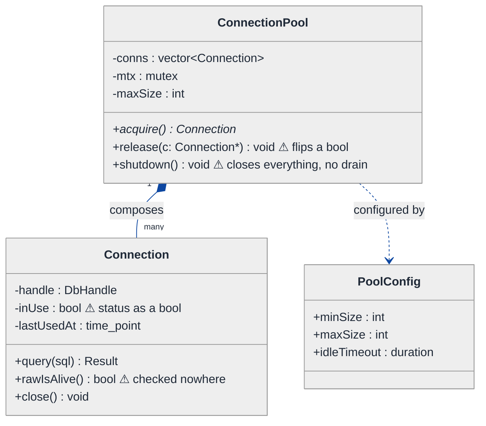
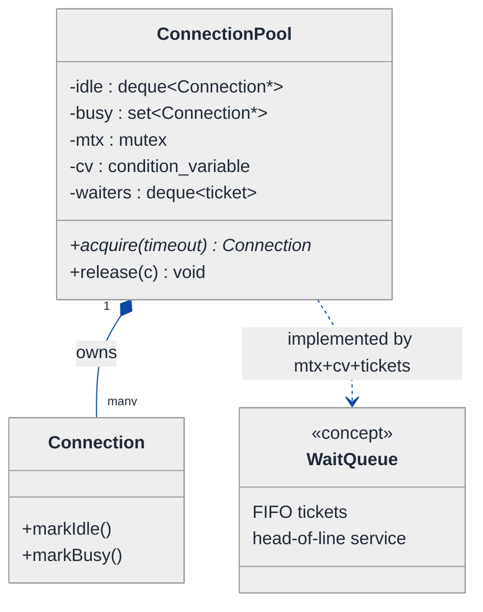
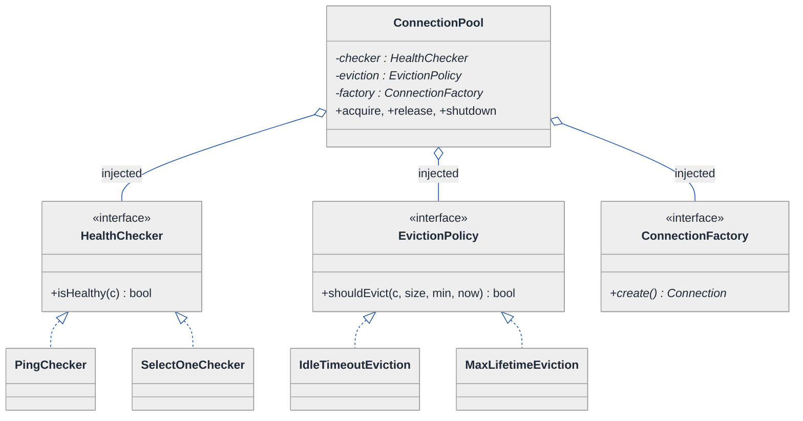
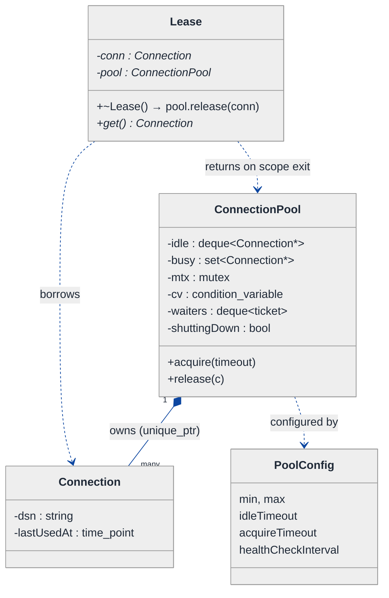
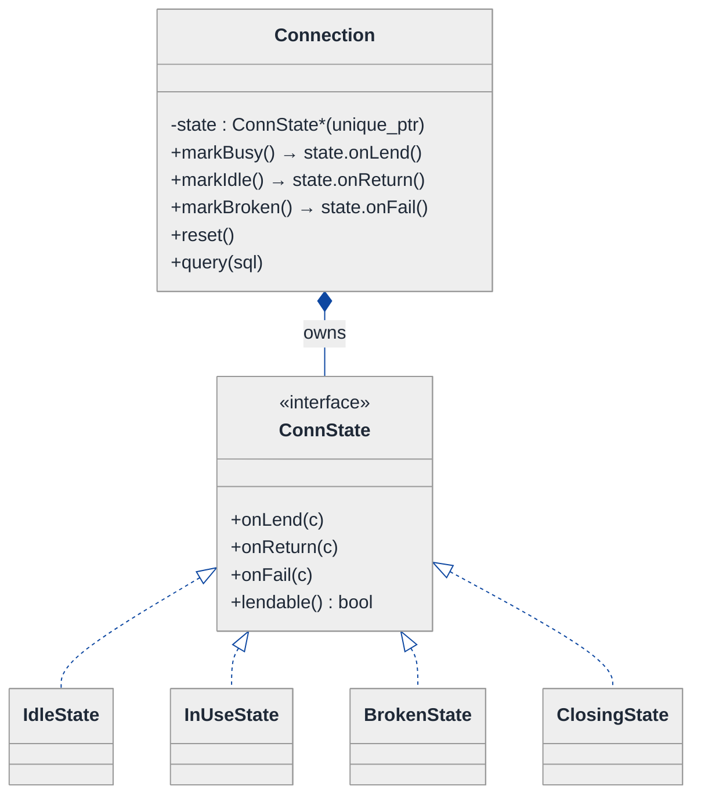
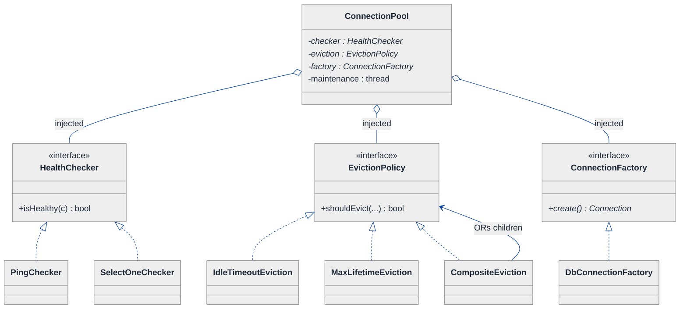
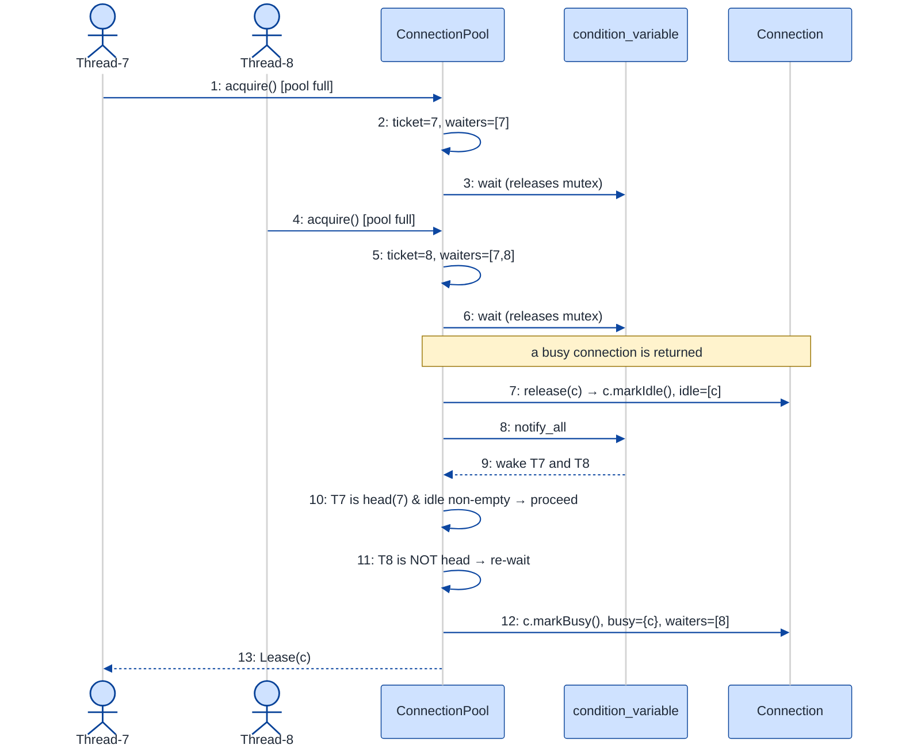
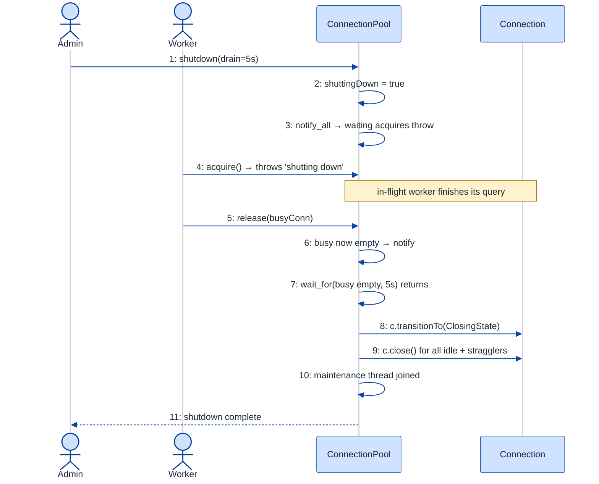

# Connection Pool Manager — LLD Walkthrough

> **Difficulty:** Hard · **Time:** ~45 min · **Pattern focus:** Object Pool + concurrency (with Strategy for policies, State for connection lifecycle)
>
> **Problem source(s):** GID OOD16, bucket `Object_Oriented_Design`. Representative of "design a resource pool" interview prompts (DB connection pools, thread pools, HTTP client pools).
>
> **Diagrams:** inline mermaid (renders natively in GitHub / VS Code). The canonical theme block is copied verbatim into every diagram.

---

## How to use this file

Paced for a candidate who has built CRUD apps but never *written* a pool from scratch. Reading time: ~45 minutes if you sketch each iteration by hand. **The lesson: a connection pool is the canonical Object Pool problem, but the interview is really probing concurrency — fair queuing, health checks, and graceful shutdown are where naive designs die. We DERIVE the design: build the naive pool first, watch it break under five hypothetical changes, then introduce one mechanism at a time for the most painful axis.**

**Map of this file (15 sections):**

1. Problem statement + clarifying questions
2. Plain-English restatement
3. Why this matters
4. Mental model
5. Try it yourself first
6. Entity & verb extraction
7. **Iteration 1: the naive design** — a `vector<Connection>` + a mutex
8. **Where the naive design hurts** — five future requirements, one painful diff each
9. **Pivot 1: Object Pool + a fair condition-variable queue** — the most painful axis first
10. **Pivot 2: State for the connection lifecycle** — idle / in-use / broken / closed
11. **Pivot 3: Strategy for health-check + eviction + graceful shutdown** — swappable policies
12. Final UML class diagram (three sub-views)
13. Skeleton code (C++)
14. Key flow — sequence diagrams (acquire-under-contention, graceful shutdown)
15. Extensibility re-check + anti-patterns + how to think aloud + self-check

---

## 1. Problem statement + clarifying questions

**Prompt (typical phrasing):** "Design a connection pool manager. It hands out reusable connections to clients, supports a configurable min/max pool size, health-checks connections, evicts idle ones, queues waiting clients fairly, and shuts down gracefully."

**Clarifying questions to ask BEFORE drawing anything:**

1. **What's being pooled?** Database connections (TCP + auth handshake, expensive to open), HTTP clients, or generic sockets? The cost of *creating* a resource is the whole reason a pool exists — I want to confirm creation is expensive.
2. **Concurrency model?** How many threads call `acquire()` concurrently? Is this an in-process pool shared by a thread pool, or one-pool-per-thread? (This decides whether I need locking at all.)
3. **Blocking semantics on exhaustion?** When all `max` connections are checked out, should `acquire()` *block* until one frees up, *fail fast*, or *block with a timeout*? And is the wait queue FIFO-fair or best-effort?
4. **What does "health check" mean?** Validate on borrow (before handing out), on return, in the background on a timer, or some combination? What's the validation query — a ping, a `SELECT 1`, a TCP keepalive?
5. **Idle eviction policy?** Evict any connection idle beyond `idleTimeout`, but never drop below `min`? Is there a separate `maxLifetime` (recycle even busy-but-old connections)?
6. **Graceful shutdown semantics?** On `shutdown()`, do we wait for in-flight connections to be returned (drain), reject new `acquire()` calls immediately, and only then close everything? Is there a drain deadline after which we force-close?
7. **Leak handling?** If a client acquires a connection and never returns it (forgets, or crashes), do we detect and reclaim it after a `leakDetectionThreshold`?

**Assumptions if interviewer dodges:** pooling expensive DB connections; multi-threaded in-process access; `acquire()` blocks with a configurable timeout; the wait queue is **FIFO-fair**; health check runs *both* on-borrow and on a background timer; idle eviction respects `min`; shutdown *drains* in-flight connections up to a deadline then force-closes. Single process (we discuss distributed pools in §15).

---

## 2. Plain-English restatement

We're building the thing that sits between application code and an expensive resource (a database). Opening a fresh DB connection costs a TCP handshake + TLS + auth — tens of milliseconds. If every request opened its own, the database would drown and latency would spike. So we keep a **bounded set of pre-opened connections** and lend them out: a client calls `acquire()`, uses the connection, and calls `release()` to give it back. The design must keep connections *healthy* (drop dead ones), keep the pool *right-sized* (grow to `max` under load, shrink to `min` when idle), let waiting clients in *fairly* (no starvation), and *shut down cleanly* (don't yank a connection out from under an in-flight query). The hard part isn't the data structure — it's getting all of that correct under concurrent access.

---

## 3. Why this matters

This is the canonical "resource pool" question, and it's a favorite because it's a two-layer test. Layer one: do you recognize the **Object Pool** pattern (reuse expensive objects instead of create/destroy churn)? Most candidates get there. Layer two — the one that separates senior from mid — is **concurrency correctness**: a fair wait queue without lost wakeups, a background evictor that doesn't race the borrowers, and a shutdown that drains rather than aborts. Pools that look right single-threaded deadlock or leak under load. The skill being probed reappears anywhere you bound a shared resource: thread pools, buffer pools, HTTP keep-alive pools, file-handle caches.

---

## 4. Mental model

A connection pool is a **coat check** with a fixed number of hooks. You hand over your coat (request a connection); the attendant gives you a numbered tag (the leased connection). When the rack is full and everyone wants their coat, people form a **queue** — and a fair coat check serves them in arrival order, not by who shouts loudest. Periodically the attendant inspects coats for moth damage (health check) and throws out ones nobody's claimed in hours (idle eviction). At closing time the attendant waits for everyone to collect their coats (drain), *then* locks up (graceful shutdown).

```
Real-world sketch (NOT a UML diagram yet):

                         ┌───────────────────────────────────┐
   acquire() ───────────▶│   POOL  (min=2, max=5)            │
   (blocks if empty)     │                                   │
                         │  idle:  [C1] [C2]                 │  ◀── lend from here
   release(C) ──────────▶│  busy:  [C3] [C4] [C5]            │  ◀── return to here
                         │                                   │
   waiters (FIFO): ─────▶│  [T7] [T8] [T9]  ⟵ served in order│
                         └─────────────┬─────────────────────┘
                                       │
                  ┌────────────────────┼─────────────────────┐
                  ▼                    ▼                     ▼
            [Health checker]     [Idle evictor]       [Graceful shutdown]
            ping every 30s       drop idle > 60s       drain, then close
            (background)         (never below min)     (reject new acquires)
```

The KEY insight from this picture: there are **three independent background concerns** (health, eviction, shutdown) orbiting **one shared inventory** (idle/busy sets) guarded by **one synchronization primitive** (a mutex + condition variable that also implements the fair queue). Inventory vs. policy vs. synchronization is the separation we'll bake into the design.

---

## 5. Try it yourself first

> **Predict before reading on:**
>
> 1. List the fields you'd put on the pool itself, and the fields you'd put on each pooled connection. Which collection holds "available" connections, and why does the choice (stack vs queue vs deque) matter for warmth/eviction?
> 2. **If `acquire()` must block when the pool is exhausted and wake up fairly when a connection is returned, what synchronization primitive do you reach for — and what's the classic bug if you use a plain mutex + a busy-wait loop?**
> 3. A background thread evicts idle connections at the same instant a client tries to acquire one. Where exactly is the race, and what invariant must hold no matter who wins?

---

## 6. Entity & verb extraction

> **Mini-refresher: noun → class, but not every noun.**
>
> Naive OOD promotes every noun to a class. Senior OOD promotes a noun only if it has both BEHAVIOR and STATE that need to live together. "Timeout" stays a config field; "connection" becomes a class because it has a lifecycle (idle → in-use → broken) and behavior (validate, reset, close).

**Nouns from the prompt:**

| Noun | Decision | Why |
|---|---|---|
| ConnectionPool | Class (top-level coordinator) | Owns the inventory, orchestrates acquire/release, runs background tasks |
| Connection | Class (wraps the raw resource) | Has lifecycle + behavior (validate, reset, close); not just a socket handle |
| PoolConfig | Value struct (fields) | `min`, `max`, `idleTimeout`, `acquireTimeout`, `healthCheckInterval` — pure data |
| Client / waiter | NOT a class | A waiting thread; modeled by the condition variable's wait queue, not an object |
| WaitQueue | Behavior of the pool's condvar, surfaced as a helper | Fairness lives here; worth isolating but it's mechanism, not a domain entity |
| HealthChecker | Strategy interface + impls | How we validate varies (ping vs query vs TCP) → swappable |
| EvictionPolicy | Strategy interface + impls | When/what to evict varies → swappable |
| Lease / handle | Class (RAII wrapper) | Owns "return on scope exit"; prevents leaks |
| LicenseToConnect / credentials | Field on a ConnectionFactory | No behavior of its own |
| time / duration | Library type (`std::chrono`) | No domain behavior |

**Verbs (and the class they live on):**

| Verb | Owner class (naive answer — we'll re-examine) |
|---|---|
| acquire(timeout) | ConnectionPool |
| release(conn) | ConnectionPool |
| createConnection() | ConnectionPool (later: a ConnectionFactory) |
| validate() / isHealthy() | Connection (later: delegated to a HealthChecker) |
| evictIdle() | ConnectionPool (later: an EvictionPolicy) |
| shutdown() / drain() | ConnectionPool |
| reset() | Connection |

**We have NOT introduced any design patterns yet.** Pure nouns + verbs.

---

## 7. <a id="iter-1"></a>Iteration 1: the naive design

Let's write the simplest thing that could possibly work. A `vector` of connections, a mutex, an `available` flag on each. No patterns, no background threads, no condition variable.



**Reader's tour (read top to bottom; ~60 seconds).**

1. **At the top — `ConnectionPool` is the root.** It holds the inventory (`conns`), one `mtx`, and a `maxSize`. Three public methods: `acquire`, `release`, `shutdown`. Every decision lives inside these methods. NO background threads, NO wait queue, NO health policy.

2. **The composition spine.** The filled diamond (`◆`) marks composition — strong ownership / same lifetime. The pool composes its `Connection[]`. If the pool dies, every connection dies with it. That part is genuinely correct and survives to the final design.

3. **The Connection box — trouble zone #1.** `inUse` is a **bool**. Fine for two states (free / busy). It will break the moment a connection can also be `BROKEN` (health check failed) or `CLOSING` (shutdown in progress). `rawIsAlive()` exists but is *called nowhere* — the naive pool never health-checks.

4. **The pool methods — trouble zone #2 (the warnings).**
   - `acquire()` linear-scans `conns` for the first `!inUse`. If none, what does it do? In the naive design it either returns `nullptr` (fail fast) or spins. Neither is "block fairly until one frees up."
   - `release()` just flips `inUse = false`. It does *not* wake any waiter — because there's no waiter mechanism.
   - `shutdown()` closes everything immediately, including connections currently mid-query. No drain.

5. **What's deliberately missing.** No condition variable (so no real blocking). No `WaitQueue` (so no fairness). No `HealthChecker` (so dead connections get handed out). No `EvictionPolicy` (so the pool never shrinks). No lifecycle states beyond a bool. The naive design doesn't even *acknowledge* these as axes — it bakes a hardcoded non-answer for each.

Skeleton code for the naive design (C++):

```cpp
#include <chrono>
#include <mutex>
#include <vector>
#include <stdexcept>
#include <string>

struct PoolConfig {
    int  minSize     = 2;
    int  maxSize     = 10;
    std::chrono::seconds idleTimeout{60};
};

class Connection {
public:
    explicit Connection(std::string dsn) : dsn_(std::move(dsn)) { /* open TCP + auth */ }
    std::string query(const std::string& sql) { /* ... */ return "rows"; }
    bool  rawIsAlive() const { /* TCP probe */ return true; }   // called nowhere (!)
    void  close()            { /* tear down socket */ }
    bool  inUse  = false;                                       // status as a bool (!)
    std::chrono::steady_clock::time_point lastUsedAt = std::chrono::steady_clock::now();
private:
    std::string dsn_;
};

class ConnectionPool {
public:
    explicit ConnectionPool(PoolConfig cfg) : cfg_(cfg) {
        for (int i = 0; i < cfg_.minSize; ++i)
            conns_.emplace_back(std::make_unique<Connection>("db://primary"));
    }

    Connection* acquire() {                       // no timeout, no fairness
        std::lock_guard<std::mutex> lk(mtx_);
        for (auto& c : conns_) {
            if (!c->inUse) { c->inUse = true; return c.get(); }   // first-free scan
        }
        if ((int)conns_.size() < cfg_.maxSize) {                  // grow on demand
            conns_.emplace_back(std::make_unique<Connection>("db://primary"));
            conns_.back()->inUse = true;
            return conns_.back().get();
        }
        return nullptr;                            // EXHAUSTED: caller must poll/spin (!)
    }

    void release(Connection* c) {
        std::lock_guard<std::mutex> lk(mtx_);
        c->inUse = false;                          // flips a bool; wakes nobody (!)
        c->lastUsedAt = std::chrono::steady_clock::now();
    }

    void shutdown() {
        std::lock_guard<std::mutex> lk(mtx_);
        for (auto& c : conns_) c->close();         // closes mid-query connections (!)
        conns_.clear();
    }
private:
    PoolConfig cfg_;
    std::mutex mtx_;
    std::vector<std::unique_ptr<Connection>> conns_;
};
```

**This works** — single-threaded, low load, no failures. You can acquire, release, grow to max. So what's wrong with it?

---

## 8. <a id="naive-pain"></a>Where the naive design hurts

The interviewer slides a piece of paper across the desk: "Here are five things production threw at us last quarter. Walk me through what changes."

### Change A: "Under load, threads must BLOCK until a connection frees up — and wake in arrival order (no starvation)"

In the naive design:
- `acquire()` returns `nullptr` when exhausted. To "block," the caller wraps it in `while ((c = pool.acquire()) == nullptr) sleep(1ms);` — a **busy-wait/poll loop**. CPU burns, latency is whatever the sleep granularity is, and there is **zero fairness**: whichever thread happens to poll right after a `release()` wins. A thread can starve indefinitely.
- To fix it properly you need a condition variable *inside* `acquire`, and `release` must `notify`. That's not a tweak — it's a rewrite of `acquire`, `release`, AND the locking discipline. **Three sites, plus a new primitive.**

### Change B: "Don't hand out dead connections — validate before lending, and reap dead ones in the background"

In the naive design:
- `acquire()` returns `c.get()` without ever calling `rawIsAlive()`. The first the client hears of a dead connection is a failed query — *after* it already got the lease.
- Adding validation means: a check inside `acquire()` (validate-on-borrow), AND a background thread that periodically scans `conns_` and closes dead ones. But there's no background thread and no condition variable to coordinate it with borrowers. **You're adding a whole new actor that races the existing mutex.**

### Change C: "Evict connections idle longer than `idleTimeout`, but never drop below `min`"

In the naive design:
- Nothing ever shrinks `conns_`. A traffic spike grows the pool to `max=50`; it stays at 50 forever, holding 48 idle sockets open against the database.
- Eviction needs a background scan that respects `min`, doesn't evict an `inUse` connection, and doesn't race a concurrent `acquire`. **Another background actor, more shared-state contention.**

### Change D: "Health checks now vary by environment — ping in dev, `SELECT 1` in prod, TCP-keepalive for the read replica"

In the naive design:
- Validation is `rawIsAlive()` hardcoded on `Connection`. Three environments → three behaviors → an `if (env == ...)` ladder inside `Connection`, recompiled for every new check type. **Tag-driven branching that grows with every environment.**

### Change E: "Graceful shutdown — stop accepting new acquires, let in-flight queries finish, then close. With a drain deadline."

In the naive design:
- `shutdown()` calls `close()` on connections that are `inUse == true` — i.e., **mid-query**. That corrupts in-flight work.
- Worse, `inUse` is a bool; there's no `CLOSING` state to mean "don't lend this out, but don't kill it either." And no way to *reject* new `acquire()` calls while waiting for outstanding leases to drain. **The bool can't express the shutdown phase, and `acquire` has no notion of a closed pool.**

### The pattern of pain

| Change | Files / methods touched | Smell |
|---|---|---|
| A. Fair blocking | `acquire` + `release` + locking discipline | "Busy-wait poll loop; no fairness; lost-wakeup waiting to happen." |
| B. Health validation | `acquire` + a new background thread vs. one mutex | "Dead connections handed out; no coordinated background actor." |
| C. Idle eviction | new background scan + `min` guard + race with `acquire` | "Pool only grows; eviction races borrowers." |
| D. Health-check variants | `Connection::rawIsAlive` if/else ladder | "Validation algorithm hardcoded; varies by environment." |
| E. Graceful shutdown | `shutdown` + `acquire` + the `inUse` bool | "Closes mid-query connections; bool can't express CLOSING/DRAINING." |

**Three axes of pain dominate.** (1) *Concurrency / fairness* — blocking, waking, racing background actors. (2) *Lifecycle* — a connection is more than free/busy; it can be broken, closing, evicted. (3) *Policy variability* — how to health-check, when to evict, how to shut down all vary.

> **Pivot question:** "What mechanism turns a poll-loop into a *fair blocking wait*? What pattern expresses a *connection's lifecycle* so shutdown and eviction can't corrupt an in-flight lease? And what pattern lets *health-check / eviction / shutdown policies* be swapped without touching the pool's core?"
>
> The answers: a **mutex + condition variable + FIFO ticket queue** (the Object Pool's concurrency core), the **State** pattern for the connection lifecycle, and **Strategy** for the policies. We introduce them one at a time, most-painful axis first: the fair blocking acquire.

---

## 9. <a id="pivot-1"></a>Pivot 1: Object Pool + a fair condition-variable wait queue

This is the heart of the problem. Changes A, B, C all founder on the same rock: the naive design has no way to *block fairly* and no safe way for background actors to coordinate. We fix that with the **Object Pool** pattern's concurrency core.

> **Mini-refresher: Object Pool pattern.**
>
> Keep a set of pre-initialized, expensive-to-create objects ready for reuse. Clients *borrow* an object (acquire) and *return* it (release) instead of creating and destroying. The pool owns the objects' lifetime; the client only holds a temporary lease. The reuse is the whole point — it amortizes the creation cost across many borrows.
>
> Quick example: a `BufferPool` of 4 MB buffers. Instead of `new[]`/`delete[]` on every request, you `borrow()` a buffer, fill it, and `giveBack()`. Same buffers, recycled forever.

> **Mini-refresher: mutex + condition variable (the fair-wait primitive).**
>
> A `mutex` gives mutual exclusion over shared state. A `condition_variable` lets a thread *sleep* (releasing the mutex) until another thread signals that a condition may now be true. The waiter re-checks the condition in a `while` loop (guards against *spurious wakeups* and *stolen wakeups*). The signaller calls `notify_one()` / `notify_all()` after mutating the state. This replaces a busy-wait poll loop with a CPU-cheap, correct blocking wait.

**Why this fits.** `acquire()` is "wait until an idle connection exists, then take it." That's the textbook condition-variable pattern: predicate = "idle set non-empty OR I'm allowed to grow." But a *plain* condvar gives **no fairness** — `notify_one()` wakes an arbitrary waiter, and a newly-arriving thread can barge in and grab the connection before a long-waiting sleeper re-acquires the lock (the "thundering herd / barging" problem). To guarantee FIFO order we add a **ticket queue**: each waiter takes a monotonically increasing ticket and only proceeds when it's at the head.

> **Mini-refresher: why fairness needs a ticket, not just a condvar.**
>
> `notify_one()` wakes *some* waiter, but between the wake and the woken thread re-locking the mutex, a brand-new caller can acquire the lock first and steal the connection. Result: the new arrival is served before someone who waited longer — starvation. The fix is a FIFO ticket: a waiter records its position; on wake it proceeds *only if it is at the head of the queue*, otherwise it goes back to sleep. Head-of-line service = fairness.

**The refactor (just the concurrency core):**

```cpp
#include <condition_variable>
#include <deque>
#include <mutex>

class ConnectionPool {
public:
    // Blocking acquire with timeout + FIFO fairness.
    Connection* acquire(std::chrono::milliseconds timeout) {
        std::unique_lock<std::mutex> lk(mtx_);
        if (shuttingDown_) throw std::runtime_error("pool is shutting down");

        const uint64_t myTicket = nextTicket_++;       // take a FIFO ticket
        waiters_.push_back(myTicket);
        const auto deadline = std::chrono::steady_clock::now() + timeout;

        // Proceed only when: I'm at the head AND there is something to give.
        auto canProceed = [&] {
            return shuttingDown_
                || (waiters_.front() == myTicket && (!idle_.empty() || canGrow()));
        };
        if (!cv_.wait_until(lk, deadline, canProceed)) {
            removeWaiter(myTicket);                     // timed out
            throw std::runtime_error("acquire timeout");
        }
        waiters_.pop_front();                           // I'm served; leave the queue
        if (shuttingDown_) { cv_.notify_all(); throw std::runtime_error("shutting down"); }

        Connection* c = idle_.empty() ? grow() : takeFromIdle();
        busy_.insert(c);
        cv_.notify_all();                               // let the next head re-check
        return c;
    }

    void release(Connection* c) {
        {
            std::lock_guard<std::mutex> lk(mtx_);
            busy_.erase(c);
            c->markIdle();                              // lifecycle — see Pivot 2
            idle_.push_back(c);
        }
        cv_.notify_all();                               // wake the queue head
    }
private:
    bool canGrow() const { return (int)(idle_.size() + busy_.size()) < cfg_.maxSize; }
    // grow(), takeFromIdle(), removeWaiter() elided

    std::mutex                       mtx_;
    std::condition_variable          cv_;
    std::deque<uint64_t>             waiters_;          // FIFO ticket queue
    uint64_t                         nextTicket_ = 0;
    std::deque<Connection*>          idle_;
    std::unordered_set<Connection*>  busy_;
    bool                             shuttingDown_ = false;
    PoolConfig                       cfg_;
};
```

**What changed — visualized.** Just the concurrency slice:



**Tour of the after-state.**

1. **The single `inUse`-scan vector is gone.** Inventory is now split into `idle` (a deque — FIFO so the *least-recently-used* connection sits at the front, which we'll exploit for eviction) and `busy` (a set, O(1) membership for `release`). Splitting them makes "is there anything to lend?" a `!idle_.empty()` check instead of a scan.

2. **A mutex + condition variable replaces the poll loop.** `acquire` now `wait_until`s on the condvar with a predicate, releasing the mutex while it sleeps. Zero CPU burn. `release` does the mutation under the lock, then `notify_all` *outside* (or after) to wake the head.

3. **The `waiters` deque is the fairness mechanism.** Each `acquire` takes a ticket and only proceeds when it is `waiters_.front()`. A barging newcomer takes a *larger* ticket, so even if it wins the lock race it sees it's not at the head and goes back to sleep. **Head-of-line service = no starvation.**

4. **Why `notify_all`, not `notify_one`?** With a ticket queue, only the head can actually proceed; everyone else re-checks and re-sleeps. `notify_one` risks waking a non-head waiter who then can't proceed and doesn't re-notify — a lost wakeup. `notify_all` is correct (and the herd is bounded by `max`).

5. **Timeout falls out naturally.** `wait_until(deadline, pred)` returns `false` on timeout; we remove our ticket and throw. Change A is fully solved.

**Change A from §8 now lands cleanly.** Blocking is CPU-cheap, fair, and time-bounded. Changes B and C (background actors) now have a mutex + condvar to coordinate with — they were impossible before; now they're a matter of policy (Pivot 3).

**Pattern-discrimination cheatsheet — Object Pool vs Flyweight vs Singleton.**
- *Object Pool:* reuse a *bounded set of stateful, expensive* objects via borrow/return; each borrower gets *exclusive* use of one instance.
- *Flyweight:* share *immutable, fine-grained* objects so many contexts read the *same* instance concurrently (no exclusive checkout).
- *Singleton:* exactly *one* instance, globally accessed — not about reuse-of-many, about uniqueness.
- *Rule of thumb:* "many expensive things, lent out one-at-a-time, then returned" → Object Pool. We chose it because connections are stateful, costly, and used exclusively per request.

---

## 10. <a id="pivot-2"></a>Pivot 2: State for the connection lifecycle

Changes B, C, and E all keep colliding with the `inUse` **bool**. A connection isn't free-or-busy; it moves through a lifecycle: it's `IDLE` (lendable), `IN_USE` (leased), `BROKEN` (failed a health check — must not be lent), or `CLOSING` (shutdown is reclaiming it). A bool can express at most two of those. The variability here is not an algorithm the caller picks — it's *what's legal next given where the connection has been*. That's the State pattern.

> **Mini-refresher: State pattern.**
>
> Each lifecycle state is its own class. The context object (here, `Connection`) delegates operations to its current state, and THE STATE decides what the next state is. Transitions are INTERNAL, driven by events the context receives. Invalid operations become "throw" methods on the states where they don't make sense — the class hierarchy *is* the validation, so you never write `if (status == X)` ladders.

**Why State (not Strategy).** The state isn't chosen by an external caller — it's driven by what happened to the connection (a query failed → BROKEN; shutdown began → CLOSING). An `IDLE` connection can be `lend()`-ed; a `BROKEN` one cannot (it must be evicted); a `CLOSING` one rejects everything. Calling `lend()` on a `BROKEN` connection isn't meaningful — it should be impossible, not merely flagged.

**The refactor (just the lifecycle slice):**

```cpp
class Connection;  // forward

class ConnState {
public:
    virtual ~ConnState() = default;
    virtual const char* name() const = 0;
    virtual void onLend(Connection& c)   { throw std::logic_error("cannot lend in this state"); }
    virtual void onReturn(Connection& c) { throw std::logic_error("cannot return in this state"); }
    virtual void onFail(Connection& c);                       // most states → Broken
    virtual bool lendable() const { return false; }
};

class IdleState : public ConnState {
public:
    const char* name() const override { return "IDLE"; }
    bool lendable() const override { return true; }
    void onLend(Connection& c) override;                      // → InUseState
};

class InUseState : public ConnState {
public:
    const char* name() const override { return "IN_USE"; }
    void onReturn(Connection& c) override;                    // → IdleState (after reset())
};

class BrokenState : public ConnState {
public:
    const char* name() const override { return "BROKEN"; }
    // onLend/onReturn inherit the throwing defaults; evictor will close it
};

class ClosingState : public ConnState {                       // terminal
public:
    const char* name() const override { return "CLOSING"; }
};

class Connection {
public:
    explicit Connection(std::string dsn)
        : dsn_(std::move(dsn)), state_(std::make_unique<IdleState>()) { /* open */ }

    void markBusy()  { state_->onLend(*this); }
    void markIdle()  { state_->onReturn(*this); }
    void markBroken(){ state_->onFail(*this); }
    bool lendable() const { return state_->lendable(); }
    void transitionTo(std::unique_ptr<ConnState> s) { state_ = std::move(s); }

    std::string query(const std::string& sql);                // throws → markBroken()
    void reset();                                             // rollback txn, clear session
    void close();
    std::chrono::steady_clock::time_point lastUsedAt() const { return lastUsedAt_; }
private:
    std::string                  dsn_;
    std::unique_ptr<ConnState>   state_;
    std::chrono::steady_clock::time_point lastUsedAt_{};
};

// transitions live WITH the states:
inline void IdleState::onLend(Connection& c)  { c.transitionTo(std::make_unique<InUseState>()); }
inline void InUseState::onReturn(Connection& c) {
    c.reset();                                                // clean session before reuse
    c.transitionTo(std::make_unique<IdleState>());
}
inline void ConnState::onFail(Connection& c)  { c.transitionTo(std::make_unique<BrokenState>()); }
```

**What changed — visualized.** Just the lifecycle slice:

```mermaid
---
config:
  theme: neutral
  themeVariables:
    background: '#ffffff'
    primaryColor: '#cfe2ff'
    primaryTextColor: '#1f2937'
    primaryBorderColor: '#084298'
    secondaryColor: '#fff3cd'
    secondaryTextColor: '#1f2937'
    secondaryBorderColor: '#664d03'
    tertiaryColor: '#d1e7dd'
    tertiaryTextColor: '#1f2937'
    tertiaryBorderColor: '#0a3622'
    lineColor: '#0d47a1'
    textColor: '#1f2937'
    noteBkgColor: '#fff3cd'
    noteTextColor: '#1f2937'
    noteBorderColor: '#997404'
    actorBkg: '#cfe2ff'
    actorBorder: '#084298'
    actorTextColor: '#1f2937'
    signalColor: '#0d47a1'
    signalTextColor: '#1f2937'
    labelBoxBkgColor: '#ffffff'
    labelBoxBorderColor: '#d3d3d3'
    labelTextColor: '#1f2937'
    edgeLabelBackground: '#ffffff'
    labelBackground: '#ffffff'
    classText: '#1f2937'
    fontFamily: 'system-ui, -apple-system, Segoe UI, Helvetica, Arial, sans-serif'
  themeCSS: |
    .messageText, .labelText, .sequenceNumber {
      paint-order: stroke fill;
      stroke: #ffffff;
      stroke-width: 5px;
      stroke-linejoin: round;
      stroke-linecap: round;
    }
    .edgePath path,
    .flowchart-link,
    .messageLine0,
    .messageLine1,
    .relation,
    .composition,
    .aggregation,
    .extension,
    .dependency {
      stroke-width: 2.5px !important;
    }
    marker path {
      stroke-width: 1.5px !important;
    }
---
classDiagram
  direction TB
  class Connection {
    -state : ConnState* (unique_ptr)
    +markBusy()  → state.onLend()
    +markIdle()  → state.onReturn()
    +markBroken()→ state.onFail()
    +transitionTo(s)
  }
  class ConnState {
    <<interface>>
    +onLend(c)
    +onReturn(c)
    +onFail(c)
    +lendable() bool
  }
  class IdleState {
    lendable → true
    onLend → InUse
  }
  class InUseState {
    onReturn → reset() → Idle
    onFail → Broken
  }
  class BrokenState {
    lendable → false
    (evictor closes it)
  }
  class ClosingState {
    terminal; rejects all
  }
  Connection *-- ConnState : owns
  ConnState <|.. IdleState
  ConnState <|.. InUseState
  ConnState <|.. BrokenState
  ConnState <|.. ClosingState
```

**Tour of the after-state.**

1. **The `inUse` bool is gone.** It's replaced by a `state` field of type `unique_ptr<ConnState>` — exclusive ownership of the current state object.

2. **`Connection`'s mutators are one-liners that delegate.** `markBusy()` → `state_->onLend(*this)`, etc. No `if`-on-status anywhere. If you call `markBusy()` on a `BrokenState`, you hit the inherited throwing default — **the hierarchy is the validation.**

3. **`InUseState::onReturn` does the reusable-state hygiene.** Before going back to `Idle`, it calls `reset()` (rollback any open transaction, clear session vars). That's a real-world correctness bug the bool design always missed — returning a connection mid-transaction.

4. **`BrokenState` is non-lendable and self-evicting.** `lendable()` returns false, so `acquire`'s "take from idle" step skips it; the evictor (Pivot 3) closes it and the pool replaces it to honor `min`.

5. **`ClosingState` is terminal** — it rejects lend and return, which is exactly what graceful shutdown needs (Change E). The state can finally *express* "shutting this one down."

**Adding a new lifecycle phase is one new class.** Need a `ReservedState` (warming a connection before a known burst)? One new class, no edits to the others. Open/closed.

**Pattern-discrimination cheatsheet — State vs Strategy.**
- *Strategy:* the CALLER picks which behavior to use; strategies are usually unaware of each other; swap is external (`pool.setHealthChecker(x)`).
- *State:* the OBJECT picks its next state internally; states know about each other (each `transitionTo`s another); swap is event-driven (`conn.markBroken()`).
- *Rule of thumb:* swap happens because external config says so → Strategy. Swap happens because of an internal event flow → State. Connection lifecycle is event-driven → State.

---

## 11. <a id="pivot-3"></a>Pivot 3: Strategy for health-check, eviction, and graceful shutdown

The lifecycle (Pivot 2) and fair blocking (Pivot 1) are in place. What remains is *policy*: **how** to validate (Change D), **when/what** to evict (Change C), and **how** to drain (Change E). Each of these is an algorithm the operator picks by configuration — textbook Strategy.

> **Mini-refresher: Strategy pattern.**
>
> Encapsulates an algorithm behind an interface so it can be swapped at runtime. The CALLER (here, the pool's configuration) decides which strategy to use; the strategy doesn't know about its peers. Quick example: a `Sorter` takes a `CompareStrategy*` — pass `Ascending` or `Descending`; the sorter doesn't care which.

**Why Strategy fits all three.** Each is "given a connection (or the pool), make a decision." Health-check: `isHealthy(conn) → bool` (ping vs `SELECT 1` vs TCP-keepalive — Change D's three environments). Eviction: `shouldEvict(conn, now) → bool` (idle-timeout vs max-lifetime vs LRU-over-min — Change C). The choice is made externally, at construction, from config. The pool *orchestrates*; the strategies *decide*.

**The refactor (the three policy interfaces + representative impls):**

```cpp
// ── Health check ───────────────────────────────────────────────
class HealthChecker {
public:
    virtual ~HealthChecker() = default;
    virtual bool isHealthy(Connection& c) const = 0;
};
class PingChecker      : public HealthChecker {            // dev: cheap TCP probe
public:
    bool isHealthy(Connection& c) const override { return c.rawPing(); }
};
class SelectOneChecker : public HealthChecker {            // prod: round-trip query
public:
    bool isHealthy(Connection& c) const override {
        try { c.query("SELECT 1"); return true; } catch (...) { return false; }
    }
};
// TcpKeepAliveChecker for the read replica — elided

// ── Eviction policy ────────────────────────────────────────────
class EvictionPolicy {
public:
    virtual ~EvictionPolicy() = default;
    // given an idle connection and current pool size, may it be reaped?
    virtual bool shouldEvict(const Connection& c, int currentSize, int minSize,
                             std::chrono::steady_clock::time_point now) const = 0;
};
class IdleTimeoutEviction : public EvictionPolicy {
public:
    explicit IdleTimeoutEviction(std::chrono::seconds t) : idleTimeout_(t) {}
    bool shouldEvict(const Connection& c, int currentSize, int minSize,
                     std::chrono::steady_clock::time_point now) const override {
        if (currentSize <= minSize) return false;             // never below min
        return now - c.lastUsedAt() > idleTimeout_;
    }
private:
    std::chrono::seconds idleTimeout_;
};
// MaxLifetimeEviction (recycle old-but-active conns), CompositeEviction (OR of policies) — elided

// ── The pool now COMPOSES the policies and runs background tasks ──
class ConnectionPool {
public:
    ConnectionPool(PoolConfig cfg,
                   std::unique_ptr<ConnectionFactory> factory,
                   std::unique_ptr<HealthChecker>     checker,
                   std::unique_ptr<EvictionPolicy>    eviction)
        : cfg_(cfg), factory_(std::move(factory)),
          checker_(std::move(checker)), eviction_(std::move(eviction)) {
        prefill(cfg_.minSize);
        maintenance_ = std::thread([this]{ maintenanceLoop(); });   // health + eviction
    }

    // Graceful shutdown: stop accepting, drain in-flight, then close.
    void shutdown(std::chrono::milliseconds drainDeadline) {
        {
            std::unique_lock<std::mutex> lk(mtx_);
            shuttingDown_ = true;                 // reject new acquires (see Pivot 1)
        }
        cv_.notify_all();                         // kick waiters → they throw
        {   // wait for in-flight (busy) connections to drain, up to the deadline
            std::unique_lock<std::mutex> lk(mtx_);
            cv_.wait_for(lk, drainDeadline, [&]{ return busy_.empty(); });
            for (auto* c : idle_) c->transitionTo(std::make_unique<ClosingState>()), c->close();
            for (auto* c : busy_) c->close();     // force-close stragglers past deadline
        }
        if (maintenance_.joinable()) maintenance_.join();
    }
private:
    void maintenanceLoop() {                      // ONE background thread, both policies
        while (alive()) {
            std::this_thread::sleep_for(cfg_.healthCheckInterval);
            std::lock_guard<std::mutex> lk(mtx_);
            for (auto it = idle_.begin(); it != idle_.end(); /* ... */) {
                Connection* c = *it;
                if (!checker_->isHealthy(*c)) { c->markBroken(); /* drop + replace */ }
                else if (eviction_->shouldEvict(*c, size(), cfg_.minSize, now())) { /* close */ }
                else ++it;
            }
            while (size() < cfg_.minSize) idle_.push_back(factory_->create());  // refill
        }
    }
    std::unique_ptr<ConnectionFactory> factory_;
    std::unique_ptr<HealthChecker>     checker_;
    std::unique_ptr<EvictionPolicy>    eviction_;
    std::thread                        maintenance_;
    // mtx_, cv_, idle_, busy_, waiters_, shuttingDown_, cfg_ from Pivot 1
};
```

> **Mini-refresher: Factory + Dependency Injection (why `ConnectionFactory` and constructor params).**
>
> *Factory:* an object whose job is to *create* other objects (`factory_->create()` opens a fresh DB connection). It hides the messy construction (DSN, auth, TLS) behind one method, so the pool's refill logic doesn't care *how* a connection is born. *Dependency Injection:* rather than the pool `new`-ing its own checker/eviction/factory, the caller *injects* them through the constructor. This is what makes Change D a config change, not a recompile — swap `PingChecker` for `SelectOneChecker` at the call site, the pool is untouched.

**What changed — visualized.** The policy slice:



**Tour of the after-state.**

1. **Three injected interfaces (open diamonds = aggregation).** The pool holds a `HealthChecker*`, an `EvictionPolicy*`, and a `ConnectionFactory*`, all passed in at construction. The pool doesn't `new` them — Change D is now a call-site swap.

2. **One maintenance thread runs both policies.** Health-check and eviction share a single background loop under the same mutex — they don't get separate threads racing each other. Cheaper, and trivially serialized.

3. **Graceful shutdown is now expressible.** `shutdown()` flips `shuttingDown_` (Pivot 1's `acquire` already rejects when this is set), notifies waiters, then `wait_for(busy_.empty())` up to a deadline — that's the **drain**. Connections move to `ClosingState` (Pivot 2) before `close()`. Change E solved without yanking in-flight queries.

4. **`reset()`-on-return + validate-on-borrow + background scan** together close Change B: a dead connection is caught on the timer *or* on borrow, marked `BROKEN`, dropped, and replaced to honor `min`.

> **Mini-refresher: why three Strategy hierarchies don't share one interface.**
>
> Strategy is a *role*, not a type. `HealthChecker`, `EvictionPolicy`, and `ConnectionFactory` have nothing in common at the type level — different inputs, different outputs. Don't unify them under a generic `Policy<T>`; that's premature genericism. Three small focused interfaces beat one vague one (Interface Segregation Principle).

**Pattern-discrimination cheatsheet — Strategy vs Template Method (for eviction).**
- *Strategy:* whole algorithm in a swappable object, chosen at runtime via composition; variants can be *combined* (a `CompositeEviction` that ORs idle-timeout with max-lifetime).
- *Template Method:* algorithm skeleton in a base class; subclasses fill hooks via inheritance — fixed at compile time, not combinable.
- *Rule of thumb:* variants that combine or change at runtime → Strategy. We chose Strategy because operators stack policies (idle-timeout OR max-lifetime) per environment.

---

## 12. <a id="fig-class-diagram"></a>12. Final class diagram

One mega-diagram would be a wall of boxes. Here are **three focused sub-views**; the structural insight at the end ties them together.

### 12.1 The inventory + concurrency core — what the pool OWNS and how it blocks



**Tour of 12.1.** The pool OWNS its connections (filled diamond / composition / `unique_ptr`) and splits them into `idle` and `busy`. The concurrency primitives (`mtx`, `cv`, `waiters`, `shuttingDown`) live right on the pool — they *are* the fair Object Pool core from Pivot 1. The new face here is **`Lease`**: an RAII handle returned by `acquire()` whose destructor calls `release()`. This is how we prevent the *connection-leak* problem from §1 Q7 — even if the client throws or forgets, the lease returns the connection when it goes out of scope.

### 12.2 The connection lifecycle — State pattern



**Tour of 12.2.** Each connection owns a `ConnState` (filled diamond / `unique_ptr`). `IDLE → IN_USE` on lend, `IN_USE → IDLE` on return (after `reset()`), any non-terminal → `BROKEN` on failure, and `* → CLOSING` during shutdown. The pool's `acquire` only ever pulls a connection whose `lendable()` is true, so a `BROKEN` or `CLOSING` connection can never be handed out — enforced by polymorphism, not by an `if` ladder.

### 12.3 The injected policies — Strategy + Factory



**Tour of 12.3.** Three injected interfaces (open diamonds = aggregation). `HealthChecker` varies by environment; `EvictionPolicy` varies by operator preference (and `CompositeEviction` ORs several together — composition of strategies); `ConnectionFactory` hides connection birth. All three are constructor-injected, which is what makes the pool's core untouched by Changes C and D.

### Structural insight (ties 12.1 + 12.2 + 12.3 together)

| Concern | Pattern used | Why |
|---|---|---|
| **Reuse + bounded inventory** | Object Pool (borrow/return) | Connections are expensive; recycle, don't churn |
| **Fair blocking under contention** | mutex + condition variable + FIFO ticket queue | CPU-cheap waiting, head-of-line service, no starvation |
| **Connection lifecycle** | State, OWNED by Connection | Event-driven transitions; invalid ops impossible by construction |
| **Health / eviction / factory** | Strategy + Factory, INJECTED into pool | Operator/env picks the variant; composable; core untouched |
| **No-leak handle** | RAII Lease (Resource Acquisition Is Initialization) | Return on scope exit even on exceptions |

The big lesson: **the data structure is the easy 20%.** The pool's *value* is in the concurrency core (fair, lost-wakeup-free blocking) and the lifecycle (you can never lend a broken or closing connection). Inheritance shows up only for state and strategy families; every "varies independently" axis is composition over an interface. *Inheritance for identity, composition for behavior variation, a condition variable for fairness.*

---

## 13. Skeleton code (C++)

> Show the SHAPES, not the full impl. Ownership via `unique_ptr`; `enum class`-free lifecycle (State pattern instead); const-correct getters.

```cpp
#include <chrono>
#include <condition_variable>
#include <deque>
#include <memory>
#include <mutex>
#include <stdexcept>
#include <string>
#include <thread>
#include <unordered_set>

// ── Forward declarations ────────────────────────────────────────────
class Connection;
class ConnectionPool;

// ── Config (value type) ─────────────────────────────────────────────
struct PoolConfig {
    int  minSize = 2;
    int  maxSize = 10;
    std::chrono::seconds      idleTimeout{60};
    std::chrono::milliseconds acquireTimeout{2000};
    std::chrono::seconds      healthCheckInterval{30};
};

// ── Connection lifecycle: State pattern ─────────────────────────────
class ConnState {
public:
    virtual ~ConnState() = default;
    virtual const char* name() const = 0;
    virtual void onLend(Connection&)   { throw std::logic_error("cannot lend now"); }
    virtual void onReturn(Connection&) { throw std::logic_error("cannot return now"); }
    virtual void onFail(Connection& c);                  // default: → Broken
    virtual bool lendable() const { return false; }
};
class IdleState   : public ConnState {
public:
    const char* name() const override { return "IDLE"; }
    bool lendable() const override { return true; }
    void onLend(Connection& c) override;                 // → InUse
};
class InUseState  : public ConnState {
public:
    const char* name() const override { return "IN_USE"; }
    void onReturn(Connection& c) override;               // reset() → Idle
};
class BrokenState : public ConnState { public: const char* name() const override { return "BROKEN"; } };
class ClosingState: public ConnState { public: const char* name() const override { return "CLOSING"; } };

// ── Connection (the pooled resource) ────────────────────────────────
class Connection {
public:
    explicit Connection(std::string dsn)
        : dsn_(std::move(dsn)), state_(std::make_unique<IdleState>()) { /* open + auth */ }

    void markBusy()   { state_->onLend(*this);   }
    void markIdle()   { state_->onReturn(*this); }
    void markBroken() { state_->onFail(*this);   }
    bool lendable() const { return state_->lendable(); }
    void transitionTo(std::unique_ptr<ConnState> s) { state_ = std::move(s); }

    std::string query(const std::string& sql);           // throws → caller markBroken()
    bool        rawPing() const;                          // cheap probe (PingChecker)
    void        reset();                                  // rollback txn, clear session
    void        close();
    std::chrono::steady_clock::time_point lastUsedAt() const { return lastUsedAt_; }
    void        touch() { lastUsedAt_ = std::chrono::steady_clock::now(); }
private:
    std::string                 dsn_;
    std::unique_ptr<ConnState>  state_;
    std::chrono::steady_clock::time_point lastUsedAt_{};
};
inline void ConnState::onFail(Connection& c)  { c.transitionTo(std::make_unique<BrokenState>()); }
inline void IdleState::onLend(Connection& c)  { c.transitionTo(std::make_unique<InUseState>()); }
inline void InUseState::onReturn(Connection& c){ c.reset(); c.transitionTo(std::make_unique<IdleState>()); }

// ── Strategy interfaces (one per axis of variation) ─────────────────
class ConnectionFactory {
public:
    virtual ~ConnectionFactory() = default;
    virtual std::unique_ptr<Connection> create() = 0;
};
class HealthChecker {
public:
    virtual ~HealthChecker() = default;
    virtual bool isHealthy(Connection& c) const = 0;
};
class SelectOneChecker : public HealthChecker {
public:
    bool isHealthy(Connection& c) const override {
        try { c.query("SELECT 1"); return true; } catch (...) { return false; }
    }
};
// PingChecker, TcpKeepAliveChecker elided

class EvictionPolicy {
public:
    virtual ~EvictionPolicy() = default;
    virtual bool shouldEvict(const Connection& c, int size, int min,
                             std::chrono::steady_clock::time_point now) const = 0;
};
class IdleTimeoutEviction : public EvictionPolicy {
public:
    explicit IdleTimeoutEviction(std::chrono::seconds t) : t_(t) {}
    bool shouldEvict(const Connection& c, int size, int min,
                     std::chrono::steady_clock::time_point now) const override {
        return size > min && (now - c.lastUsedAt()) > t_;
    }
private:
    std::chrono::seconds t_;
};
// MaxLifetimeEviction, CompositeEviction elided

// ── RAII Lease (no-leak handle) ─────────────────────────────────────
class Lease {
public:
    Lease(Connection* c, ConnectionPool* p) : conn_(c), pool_(p) {}
    ~Lease();                                            // → pool_->release(conn_)
    Lease(const Lease&) = delete;
    Lease& operator=(const Lease&) = delete;
    Lease(Lease&& o) noexcept : conn_(o.conn_), pool_(o.pool_) { o.conn_ = nullptr; }
    Connection* operator->() const { return conn_; }
    Connection* get() const { return conn_; }
private:
    Connection*     conn_;
    ConnectionPool* pool_;
};

// ── The pool (Object Pool + fair condvar + injected policies) ───────
class ConnectionPool {
public:
    ConnectionPool(PoolConfig cfg,
                   std::unique_ptr<ConnectionFactory> factory,
                   std::unique_ptr<HealthChecker>     checker,
                   std::unique_ptr<EvictionPolicy>    eviction)
        : cfg_(cfg), factory_(std::move(factory)),
          checker_(std::move(checker)), eviction_(std::move(eviction)) {
        for (int i = 0; i < cfg_.minSize; ++i) own_.push_back(factory_->create());
        for (auto& c : own_) idle_.push_back(c.get());
        maintenance_ = std::thread([this]{ maintenanceLoop(); });
    }
    ~ConnectionPool() { shutdown(std::chrono::milliseconds{0}); }

    Lease acquire() { return acquire(cfg_.acquireTimeout); }
    Lease acquire(std::chrono::milliseconds timeout);     // fair, blocking — Pivot 1
    void  release(Connection* c);                         // returns to idle, notifies
    void  shutdown(std::chrono::milliseconds drainDeadline); // drain → close — Pivot 3
private:
    void  maintenanceLoop();                              // health + eviction + refill
    Connection* takeFromIdle();
    Connection* grow();
    bool  canGrow() const { return (int)own_.size() < cfg_.maxSize; }
    int   size()   const { return (int)own_.size(); }

    PoolConfig                               cfg_;
    std::unique_ptr<ConnectionFactory>       factory_;
    std::unique_ptr<HealthChecker>           checker_;
    std::unique_ptr<EvictionPolicy>          eviction_;

    std::mutex                               mtx_;
    std::condition_variable                  cv_;
    std::deque<uint64_t>                     waiters_;     // FIFO fairness
    uint64_t                                 nextTicket_ = 0;
    std::deque<Connection*>                  idle_;        // lendable (front = LRU)
    std::unordered_set<Connection*>          busy_;        // leased
    std::vector<std::unique_ptr<Connection>> own_;         // lifetime owner
    bool                                     shuttingDown_ = false;
    std::thread                              maintenance_;
};
```

---

## 14. <a id="fig-sequence"></a>14. Key flow — sequence diagrams

### Phase 1 — acquire under contention (pool exhausted, two threads waiting)



**Tour of Phase 1.** Read slowly — this is where fairness lives. T7 and T8 both find the pool exhausted and park on the condvar, *releasing the mutex while they sleep* (steps 3, 6) — no CPU burn. When a connection is returned (7) and `notify_all` fires (8), **both** wake, but the ticket queue arbitrates: T7 is at the head, T8 is not (steps 10–11), so **T8 goes straight back to sleep** even though it woke. T7 takes the connection, pops its ticket, and is served (12–13). A brand-new Thread-9 arriving at this instant would take ticket 9 and queue *behind* T8 — it cannot barge ahead. That head-of-line discipline is the entire reason this isn't a starvation-prone poll loop.

### Phase 2 — graceful shutdown (drain then close)



**Tour of Phase 2.** `shutdown()` flips `shuttingDown_` (2) and notifies (3); any thread blocked in `acquire` and any *new* `acquire` immediately throws (4) — we stop accepting work. Then the pool **drains**: it `wait_for`s until `busy_` is empty (7), giving in-flight workers time to finish and `release` their connections (5–6). Only after the drain (or the deadline) do connections move to `ClosingState` and `close()` (8–9). Compare with the naive `shutdown()` that closed mid-query connections — here, an in-flight query is never yanked. The State pattern's `ClosingState` is what makes "this connection is going away, reject everything" expressible.

### The validation that's NOT shown — and why it matters

You won't find `if (conn.status == BROKEN)` or `if (conn.status == CLOSING)` in `acquire`. Instead, `acquire` only pulls connections where `lendable()` is true, and a `BROKEN`/`CLOSING` connection answers `false` by virtue of its *class*. **The state hierarchy IS the validation** — invalid lends are impossible by construction, not caught by a runtime check you might forget.

---

## 15. Extensibility re-check + anti-patterns + how to think aloud + self-check

### Extensibility re-check

Revisit the five changes from [§8](#naive-pain). For each, name the SINGLE thing that changes.

| Change | Naive design impact | Final design impact |
|---|---|---|
| A. Fair blocking | rewrite `acquire`+`release`, busy-wait | Already built into the Pivot-1 core (condvar + ticket queue). No change. |
| B. Health validation | `acquire` + a new uncoordinated thread | Inject a `HealthChecker`; the maintenance loop already validates. Done. |
| C. Idle eviction | new scan + `min` guard + races | New `EvictionPolicy` impl (or compose existing). Done. |
| D. Health-check variants | `if (env == ...)` ladder on Connection | Swap the injected `HealthChecker` at the call site. Done. |
| E. Graceful shutdown | closes mid-query; bool can't express it | `shuttingDown_` flag + drain + `ClosingState`. Already in place. |

Every future change is either *already handled by the core* or *one new injected strategy*. That's the open/closed principle in practice.

> **Mini-refresher: Open/Closed Principle (the "O" in SOLID).**
>
> Software entities should be *open for extension, closed for modification*. You add behavior by adding new classes (a new `HealthChecker`, a new `EvictionPolicy`), not by editing existing, tested code. The Strategy and State hierarchies are how we achieve it here.

If a future requirement makes you change `ConnectionPool`, `Connection`, `HealthChecker`, AND `EvictionPolicy` together — go back to §6 and re-identify variability points; you missed one.

### Common confusion + traps

1. **"Why a ticket queue — isn't a condition variable already FIFO?"** No. `notify_one`/`notify_all` give no ordering guarantee, and a newly-arriving thread can grab the lock (and the connection) before a woken sleeper re-locks. Without tickets, you get starvation under sustained contention.

2. **"Why `notify_all` instead of `notify_one`?"** With a ticket queue only the head can proceed; a `notify_one` might wake a non-head waiter who can't make progress and won't re-notify — a lost wakeup that stalls the queue. `notify_all` is safe; the herd is bounded by `max`.

3. **"Should I validate every connection on every borrow?"** It's a latency tradeoff. Validate-on-borrow catches dead connections at the cost of a round-trip per acquire; a cheaper design validates in the background and only on borrow if the connection has been idle past a threshold. State both and pick per the SLA.

4. **"Why RAII Lease instead of a raw pointer?"** Leak prevention. A client that throws mid-use, or forgets to `release`, would permanently lose a connection from the pool. The `Lease` destructor returns it deterministically — even on the exception path.

5. **"Why is `reset()` called on return, not on borrow?"** Either works, but on-return keeps the idle pool clean and means a borrower never inherits a dirty session (an open transaction from the previous user). On-borrow is fine too; the bug is doing *neither* — the naive design.

### Anti-patterns

- **Busy-wait / poll loop** — `while (!(c = acquire())) sleep(1ms)`. Burns CPU, no fairness. Use a condition variable.
- **Lost wakeup** — mutating shared state *without* holding the mutex, or notifying before the state is set. Always mutate under the lock, then notify.
- **Status-as-bool / status-as-enum-with-switches** — can't express BROKEN/CLOSING and breeds `if (status==X)` ladders. Use the State pattern.
- **God-pool** — `ConnectionPool` that hardcodes health-check, eviction, and connection creation inline. Inject them as strategies.
- **Yank-on-shutdown** — closing connections mid-query. Drain first, then close, with a deadline.
- **Singleton-everything** — making the pool a global singleton "because there's one database." There are often several pools (primary, replica, analytics). Inject instead.
- **Unbounded growth** — growing past `max` under load, or never shrinking below the high-water mark. Enforce `max` on `grow()` and `min` on eviction.

### How to think aloud

> "Connection pool — let me clarify scope. [Asks the §1 questions: what's pooled, concurrency model, blocking semantics, health-check meaning, eviction, shutdown, leaks.] OK: expensive DB connections, multi-threaded, blocking-with-timeout, FIFO-fair, health-check on borrow + background, idle eviction above min, graceful drain on shutdown.
>
> Nouns: ConnectionPool, Connection, PoolConfig, plus policy objects. The pool owns connections; that's the Object Pool pattern.
>
> I'll write the NAIVE design first — a vector, a mutex, an `inUse` bool. Acquire scans for a free one; release flips the bool; shutdown closes everything.
>
> Now stress-test it. (A) Under load it must block fairly — the naive design forces a busy-wait poll with no fairness. (B) Don't hand out dead connections — there's no validation and no background actor. (C) Evict idle ones above min — the pool never shrinks. (D) Health checks vary by environment — hardcoded. (E) Graceful shutdown — the naive version closes mid-query connections and the bool can't express CLOSING.
>
> Three axes: concurrency/fairness, lifecycle, and policy. Pivot 1 is the heart: split idle/busy, add a mutex + condition variable + a FIFO ticket queue so acquire blocks fairly with a timeout — that's the real Object Pool core. Pivot 2: the `inUse` bool becomes a State machine — Idle, InUse, Broken, Closing — so a broken or closing connection can never be lent, enforced by polymorphism. Pivot 3: health-check, eviction, and creation become injected Strategy/Factory objects, and a single maintenance thread runs health + eviction; shutdown flips a flag, drains busy connections up to a deadline, then closes.
>
> Final design: pool composes connections, owns the concurrency core, holds a State per connection, and aggregates three injected policies. A RAII Lease prevents leaks. All five future changes become either already-handled or one new injected class each. Open/closed."

### Self-check

> **Self-check — the question to ask next time.**
>
> When you see "design a pool / a bounded shared resource with waiters," before reaching for a vector + a bool, ask:
>
> > **"What's the BLOCKING-and-WAKING story — and is it FAIR?"**
> >
> > Then: "Is each resource's status a *bool*, or a *lifecycle* the object transitions through (State)? And is each background concern — health, eviction, creation, shutdown — a *hardcoded branch* or a *swappable policy* (Strategy/Factory)?"
>
> Fair blocking → mutex + condition variable + FIFO tickets. Lifecycle → State. Swappable policy → Strategy + injection. The class diagram falls out for free.

---

## Cross-references

- **Parent topic manifest:** [`./EXTRACTED_QUESTIONS.md`](./EXTRACTED_QUESTIONS.md)
- **Vertical overview:** [`../../LEARNING.md`](../../LEARNING.md)
- **Template:** [`../../TEMPLATE-v2.md`](../../TEMPLATE-v2.md)
- **Canonical exemplar:** [`./Parking_Lot.md`](./Parking_Lot.md) — Strategy + State, the gold standard for this template
- **Diagram convention (copy-verbatim theme block):** [`../../../CONTINUATION.md`](../../../CONTINUATION.md) §3
- **Related LLD walkthroughs:**
  - Object Pool / resource-management siblings (thread pool, buffer pool) — same Object Pool + concurrency core
  - State Pattern deep-dive (in `../State_Pattern/`) — the connection lifecycle generalized
  - Strategy Pattern deep-dive (in `../Strategy_Pattern/`) — the health-check / eviction policy axis
- **Further reading (external):**
  - <a href="https://en.wikipedia.org/wiki/Object_pool_pattern" target="_blank" rel="noopener noreferrer">Object Pool pattern (Wikipedia)</a>
  - <a href="https://en.cppreference.com/w/cpp/thread/condition_variable" target="_blank" rel="noopener noreferrer">std::condition_variable (cppreference)</a> — the fair-wait primitive
  - <a href="https://github.com/brettwooldridge/HikariCP/wiki/About-Pool-Sizing" target="_blank" rel="noopener noreferrer">HikariCP pool-sizing notes</a> — production wisdom on min/max + leak detection
