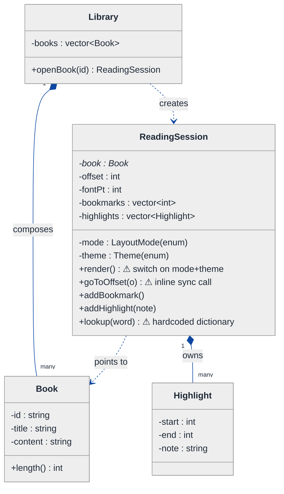
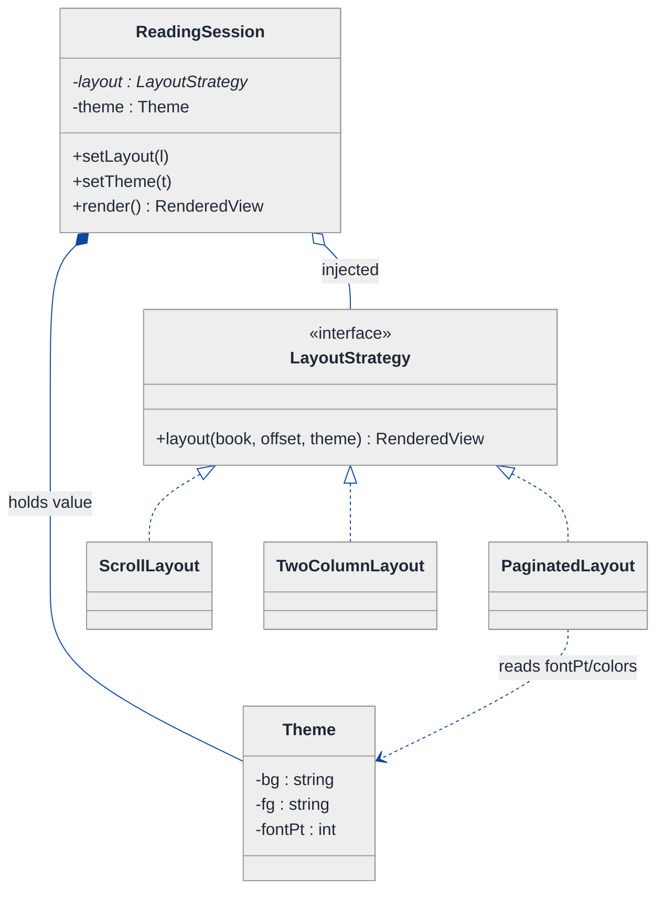
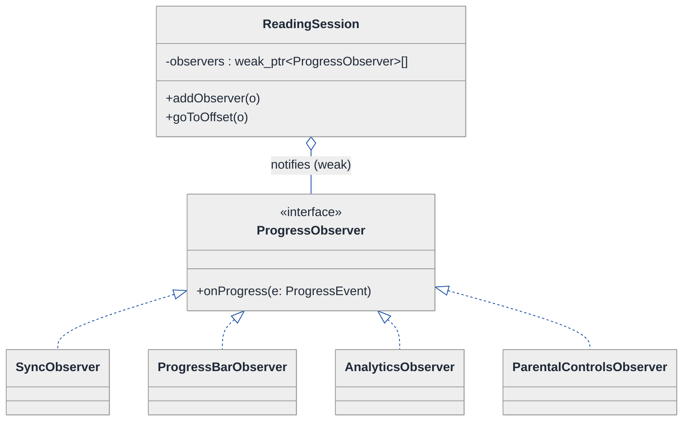
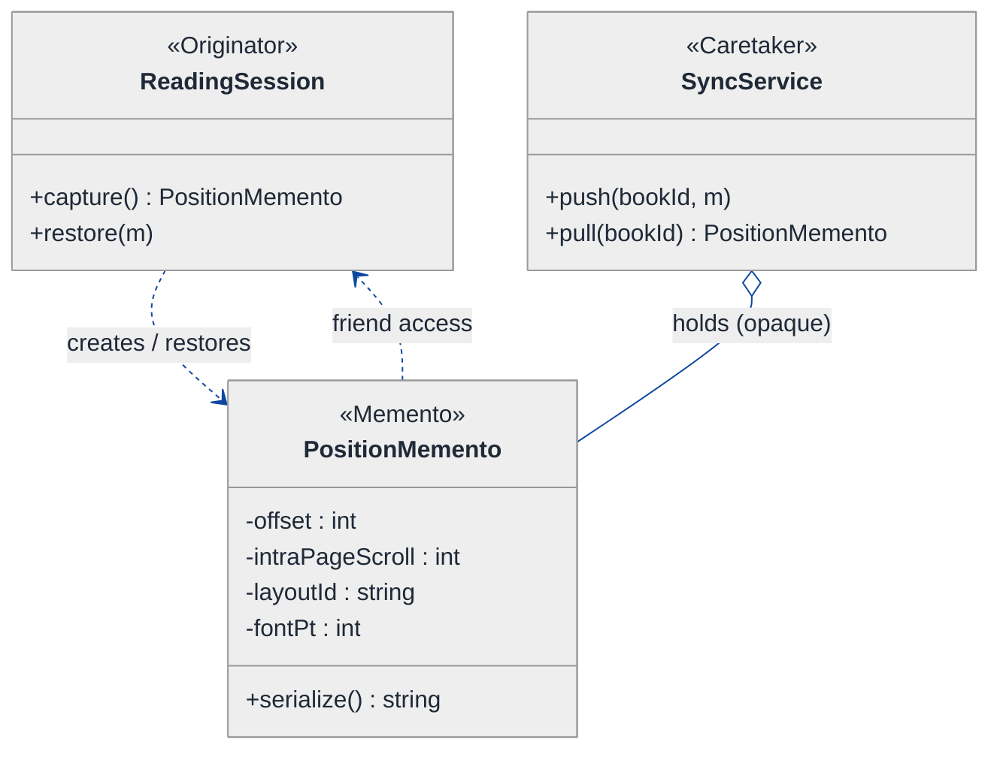
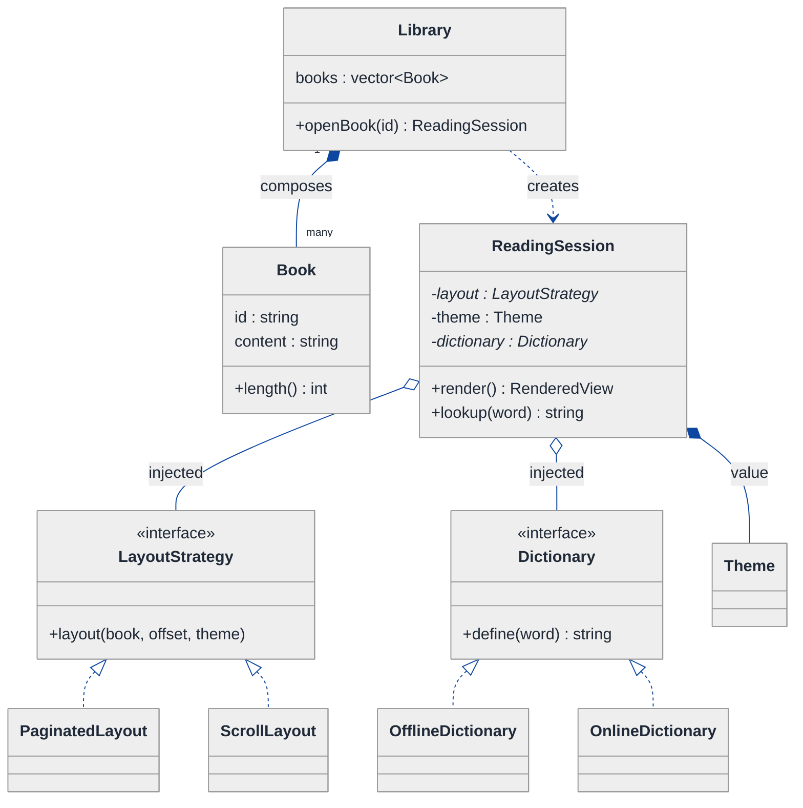
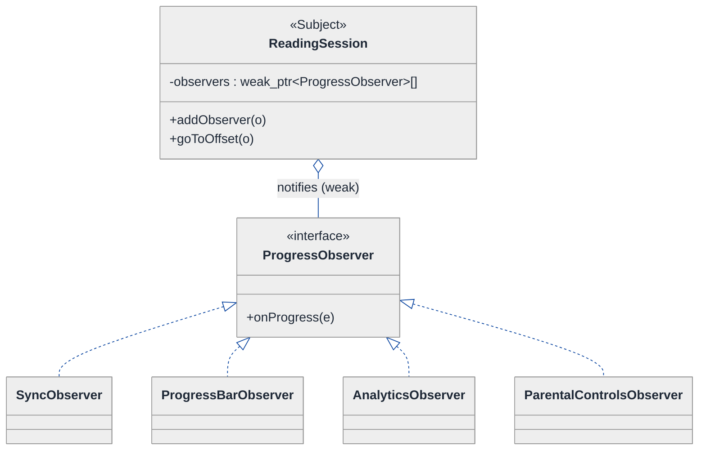
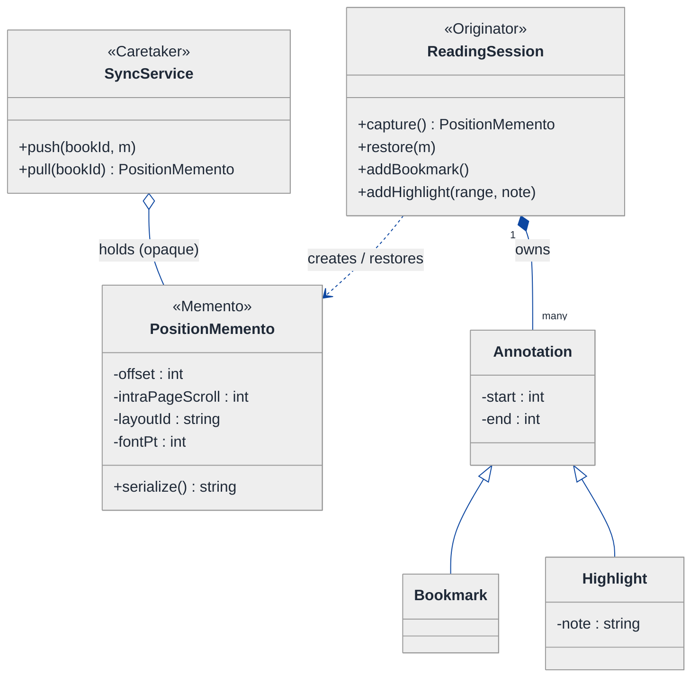
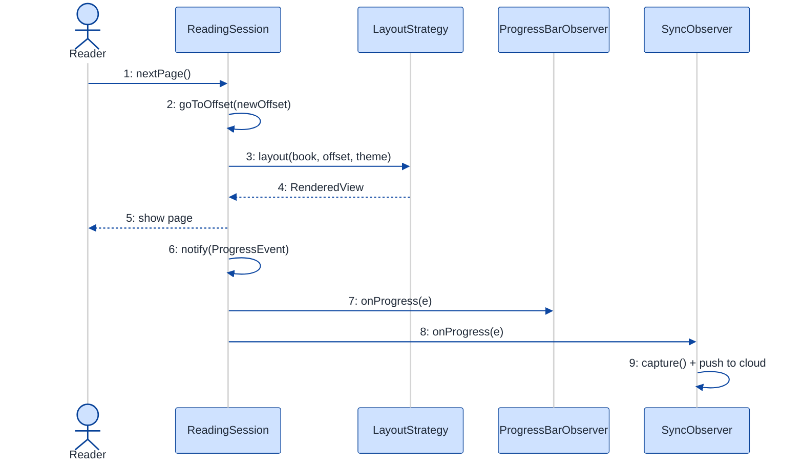
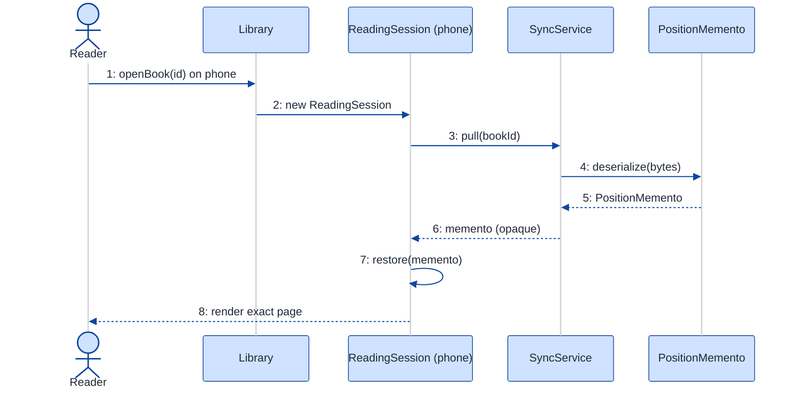

# E-Book Reader — LLD Walkthrough

> **Difficulty:** Medium · **Time:** ~30 min · **Pattern focus:** Strategy (rendering / theming) + Observer (progress sync) + Memento (reading-position snapshots)
>
> **Problem source(s):** GID OOD4, bucket `Object_Oriented_Design`. Representative of "design a reader / viewer app" LLD rows in [`./EXTRACTED_QUESTIONS.md`](./EXTRACTED_QUESTIONS.md).
>
> **Diagrams:** inline mermaid (renders natively in GitHub / VS Code). The canonical theme block is copied verbatim into every diagram per [`../../../CONTINUATION.md`](../../../CONTINUATION.md) §3.

---

## How to use this file

Paced for a candidate seeing the e-book reader for the first time. Reading time: ~30 minutes if you sketch each iteration by hand. **The lesson: don't reach for design patterns up front — DERIVE them by building the naive design first, watching it break under four hypothetical changes, then reaching for ONE pattern at a time per painful axis.** The reader looks like a CRUD app ("open book, save bookmark") but the interviewer is probing three independent axes: behavior the *user* configures (Strategy), state the *whole system* must react to (Observer), and a snapshot the *object* must capture and restore (Memento).

**Map of this file (15 sections):**

1. Problem statement + clarifying questions
2. Plain-English restatement
3. Why this matters
4. Mental model
5. Try it yourself first
6. Entity & verb extraction
7. **Iteration 1: the naive design** — what we'd write first
8. **Where the naive design hurts** — four future requirements, one painful diff each
9. **Pivot 1: Strategy for layout + theme** — behavior the user picks
10. **Pivot 2: Observer for progress sync** — one event, many reactors
11. **Pivot 3: Memento for reading position** — capture/restore without leaking internals
12. Final UML class diagram
13. Skeleton code (C++)
14. Key flow — sequence diagram
15. Extensibility re-check + anti-patterns + how to think aloud + self-check

---

## 1. Problem statement + clarifying questions

**Prompt (typical phrasing):** "Design an e-book reader application: a book library, pagination/scrolling reading modes, bookmarks, highlights with notes, font/theme customization, reading-progress sync across devices, and dictionary lookup."

**Clarifying questions to ask BEFORE drawing anything:**

1. **What's the source content format?** Reflowable (EPUB-style, text reflows to font size) or fixed-layout (PDF page images)? This decides whether "page" is a stable concept or a derived one.
2. **What does "reading mode" actually change?** Just pagination vs. continuous scroll, or also two-column / spread layouts? Are mode and theme independent (any mode × any theme)?
3. **What's the scope of "sync across devices"?** Last-read position only, or bookmarks + highlights + notes too? Real-time, or eventually-consistent on app open/close?
4. **Where do annotations anchor?** To a page number (breaks when font changes) or to a stable character offset / CFI in the underlying text?
5. **Is dictionary lookup local or networked?** Bundled offline dictionary, a remote API, or pluggable (user picks)?
6. **Single user, multiple devices — or shared library?** Are we modeling one account's devices, or a household sharing books?
7. **Offline-first?** Must bookmarks/highlights created offline survive and later sync?

**Assumptions if interviewer dodges:** reflowable content anchored by character offset; reading mode and theme are independent and user-selectable; sync covers position + annotations and is eventually-consistent (fires on every position change); dictionary is pluggable (offline default, online optional); one account with N devices; single-threaded core, concurrency discussed in §15.

---

## 2. Plain-English restatement

We're building the engine behind an app like Kindle or Apple Books. It must: hold a library of books, open one and render its content according to the user's chosen *layout mode* (paginated vs. scroll) and *theme* (light / sepia / dark / font size); let the user drop bookmarks, highlight passages and attach notes, and look up words in a dictionary; and — the interesting part — keep the user's reading position (and annotations) in sync across every device they own, while also feeding a progress bar, a "you've read 43%" badge, and analytics. The design must accommodate new layout modes, new themes, new dictionary backends, and new things-that-react-to-progress **without rewriting the core reader loop**.

---

## 3. Why this matters

This question separates candidates who model *data* from candidates who model *change*. Almost everyone can store a bookmark. The senior signal is recognizing that "reading position changed" is an *event* with an open-ended set of reactors (sync service, progress bar, analytics, parental-controls) — that's Observer — while "render this page" is a *behavior the user configures* — that's Strategy — and "restore exactly where I left off" is a *snapshot the object owns* — that's Memento. The same three-way discrimination (caller picks vs. system reacts vs. object snapshots) reappears in editors, media players, and IDEs.

---

## 4. Mental model

A reader is a **viewport onto an immutable book**, plus a **mutable reading session** (where am I, what have I marked), plus a **broadcast** every time the session moves. The book content never changes; everything interesting is in *how* we present it and *who needs to know* when the user moves.

```
Real-world sketch (NOT a UML diagram yet):

         Book (immutable content, char offsets 0..N)
                       │
                       ▼
        ┌──────────────────────────────────┐
        │   ReadingSession (per device)     │
        │   position = char offset 10342    │  ← moves as user reads
        │   bookmarks / highlights / notes  │
        └───────────────┬──────────────────┘
            renders via  │  broadcasts on move
        ┌────────────────┴───────────────────────┐
        ▼                                          ▼
  LayoutStrategy × Theme              [SyncService] [ProgressBar] [Analytics]
  (how it LOOKS — user picks)         (who REACTS — open-ended list)
```

The KEY insight from this picture: **presentation** (how it looks) is configured by the user; **reaction** (who cares that I moved) is an open-ended subscriber list; **position** is a tiny piece of state we must snapshot and restore byte-for-byte across devices. Three different kinds of variation → three different patterns.

---

## 5. Try it yourself first

> **Predict before reading on:**
>
> 1. List 5 nouns you'd promote to a class, and 3 nouns you'd leave as plain fields.
> 2. **If the reader needs paginated, vertical-scroll, AND two-column layouts — each combinable with light/sepia/dark themes — would you make a class per combination? What would that cost?**
> 3. When the user turns a page, *four* things must update: the cloud sync, the on-screen progress bar, an analytics counter, and a "time left in chapter" estimate. Where does that fan-out logic live in your first design?

---

## 6. Entity & verb extraction

> **Mini-refresher: noun → class, but not every noun.**
>
> Naive OOD promotes every noun to a class. Senior OOD promotes a noun only if it has both BEHAVIOR and STATE that need to live together. "Font size" is a field; "ReadingSession" is a class because it has position state plus move/bookmark behavior.

**Nouns from the prompt:**

| Noun | Decision | Why |
|---|---|---|
| Library | Class (top-level) | Owns books, opens a reading session |
| Book | Class | Immutable content + metadata; addressable by char offset |
| ReadingSession | Class | Holds position, owns annotations, drives the reader |
| Bookmark / Highlight / Note | Classes (small) | Anchor to a text range; Note adds a comment |
| Page | NOT a class (derived) | For reflowable content a page is *computed* by the layout, not stored |
| LayoutMode / Theme | Field today, strategy later | This is exactly the variability §8 will expose |
| Dictionary | Class (abstract) | Lookup behavior; backend varies |
| Device | Field/identifier on a session | No behavior of its own |
| Reading progress (%) | Derived value | Computed from position / book length |

**Verbs (and the class they live on — naive answer, re-examined later):**

| Verb | Owner class (naive — we'll re-examine) |
|---|---|
| openBook(id) | Library → ReadingSession |
| goToOffset(o) / nextPage() | ReadingSession |
| render() | ReadingSession (hardcoded if/else on mode) |
| addBookmark() / addHighlight(note) | ReadingSession |
| lookup(word) | ReadingSession → Dictionary |
| syncProgress() | ReadingSession (hardcoded call) |

**We have NOT introduced any design patterns yet.** Pure nouns + verbs.

---

## 7. <a id="iter-1"></a>Iteration 1: the naive design

Let's write the simplest thing that could possibly work. No design patterns — just classes with methods, an enum for the mode, an enum for the theme, and a direct call to the sync service when the position moves.



**Reader's tour (read top to bottom; ~60 seconds).**

1. **At the top — `Library` is the root.** It composes `Book[]` and creates a `ReadingSession` when you open a book. Books are immutable content; the library just holds them.

2. **`ReadingSession` is the trouble zone.** It carries everything: the current `offset`, a `mode` enum (PAGINATED / SCROLL), a `theme` enum (LIGHT / SEPIA / DARK), the font size, the bookmarks, the highlights. Three warning markers (⚠):
   - `render()` is a nested switch — first on `mode`, then on `theme`. Every new mode × theme is a new branch.
   - `goToOffset()` calls the sync service inline. The session is hardwired to one specific reactor.
   - `lookup()` hardcodes one dictionary backend.

3. **`Highlight` is a small value class** — a text range plus an optional note. Composition (`◆`) because highlights die with the session-but-actually-the-book; fine for now.

4. **What's deliberately missing.** No `LayoutStrategy`. No `Theme` object. No subscriber list. No `Memento`. The naive design doesn't *acknowledge* that layout, reaction, and position-snapshotting are independent axes — it bakes a hardcoded answer for each into `ReadingSession`. That's what §8 will expose.

Skeleton code for the naive design (C++):

```cpp
#include <string>
#include <vector>

enum class LayoutMode { PAGINATED, SCROLL };
enum class Theme      { LIGHT, SEPIA, DARK };

class Book {
public:
    Book(std::string id, std::string title, std::string content)
        : id_(std::move(id)), title_(std::move(title)), content_(std::move(content)) {}
    int length() const { return static_cast<int>(content_.size()); }
    const std::string& content() const { return content_; }
private:
    std::string id_, title_, content_;
};

struct Highlight { int start; int end; std::string note; };

class SyncService { public: void push(const std::string& book, int offset); }; // remote

class ReadingSession {
public:
    ReadingSession(Book* book, SyncService* sync) : book_(book), sync_(sync) {}

    void render() {                                   // ⚠ nested switch — will hurt
        switch (mode_) {
            case LayoutMode::PAGINATED:
                if      (theme_ == Theme::LIGHT) { /* paginate + light CSS */ }
                else if (theme_ == Theme::SEPIA) { /* paginate + sepia CSS */ }
                else                              { /* paginate + dark  CSS */ }
                break;
            case LayoutMode::SCROLL:
                if      (theme_ == Theme::LIGHT) { /* scroll + light */ }
                else if (theme_ == Theme::SEPIA) { /* scroll + sepia */ }
                else                              { /* scroll + dark  */ }
                break;
        }
    }

    void goToOffset(int o) {
        offset_ = o;
        sync_->push(book_->content(), offset_);       // ⚠ hardwired to ONE reactor
    }

    void addBookmark()             { bookmarks_.push_back(offset_); }
    void addHighlight(std::string note) { highlights_.push_back({offset_, offset_ + 50, std::move(note)}); }

    std::string lookup(const std::string& word) {     // ⚠ hardcoded backend
        // open bundled dictionary file, binary-search the word...
        return "definition of " + word;
    }
private:
    Book*                  book_;
    SyncService*           sync_;
    int                    offset_ = 0;
    LayoutMode             mode_  = LayoutMode::PAGINATED;
    Theme                  theme_ = Theme::LIGHT;
    int                    fontPt_ = 12;
    std::vector<int>       bookmarks_;
    std::vector<Highlight> highlights_;
};
```

**This works.** It has zero design patterns. We can open a book, render it, bookmark, highlight, sync. So what's wrong with it?

---

## 8. <a id="naive-pain"></a>Where the naive design hurts

The interviewer slides four new requirements across the desk: "These are coming next quarter. Walk me through what changes."

### Change A: "Add a two-column 'spread' layout and a 'high-contrast' theme"

In the naive design:
- `render()`'s nested switch goes from 2×3 = 6 branches to 3×4 = 12 branches.
- Every existing case must be re-checked. **The combinatorial explosion is in ONE method.**
- Smell: layout and theme are *independent* axes, but the code multiplies them together.

### Change B: "When the user turns a page, also update a progress bar, an analytics counter, and a parental-controls time tracker — not just cloud sync"

In the naive design:
- `goToOffset()` currently calls `sync_->push(...)`. Now it needs `progressBar_->update()`, `analytics_->record()`, `parental_->tick()`.
- `ReadingSession` grows a pointer per reactor and a call per reactor in `goToOffset`.
- **Every new reactor edits `ReadingSession`'s fields AND `goToOffset`'s body.** The session knows about everything that cares about it — backwards coupling.

### Change C: "Sync the exact reading position across devices — open on phone where you left off on tablet"

In the naive design:
- Position is just `offset_`, but the *real* restore needs offset + scroll-within-page + which layout was active + font size at capture time (so the restored page boundary matches).
- To save/restore you'd either expose all of `ReadingSession`'s privates (breaks encapsulation) or scatter serialization across the class.
- **There's no clean object that says "this is a restorable position."** The state is smeared across fields.

### Change D: "Let users choose an online dictionary (Wiktionary API) or an offline one, per book"

In the naive design:
- `lookup()` hardcodes the bundled file reader.
- Add `if (useOnline) { http... } else { file... }` — and now `ReadingSession` has an HTTP dependency.
- **Next dictionary backend → another branch in `lookup`.** Classic tag-driven switch.

### The pattern of pain

| Change | Files / methods touched | Smell |
|---|---|---|
| A. New layout + theme | `ReadingSession::render` (12-way switch) | "Two independent axes multiplied into one method." |
| B. More reactors on page-turn | `ReadingSession` fields + `goToOffset` | "Subject hardwired to every reactor; backwards coupling." |
| C. Cross-device restore | `ReadingSession` privates exposed/smeared | "No restorable position object; encapsulation leaks." |
| D. Pluggable dictionary | `ReadingSession::lookup` switch | "Tag-driven branching; new backend = surgery." |

**Three axes of pain dominate:** behavior the *user configures* (layout, theme, dictionary), reactions to an *event* (page-turn fan-out), and *snapshot/restore* of position.

> **Pivot question:** "What pattern handles 'a behavior the CALLER configures and swaps'? What pattern handles 'one event, an open-ended set of reactors'? What pattern handles 'capture and restore an object's state without exposing its internals'?"
>
> The answers are Strategy, Observer, and Memento. Let's introduce them one at a time, starting with the most painful axis: the rendering switch.

---

## 9. <a id="pivot-1"></a>Pivot 1: Strategy for layout + theme

> **Mini-refresher: Strategy pattern.**
>
> Encapsulates an algorithm behind an interface so it can be swapped at runtime. The CALLER decides which strategy to use; the strategy doesn't know about its peers.
>
> Quick example: a `Sorter` takes a `CompareStrategy*`. Pass `AscendingCompare` or `DescendingCompare` — the sorter doesn't care which.

**Why Strategy fits layout and theme.** Rendering is an algorithm (`given content + offset, produce laid-out output`). It varies (paginated, scroll, two-column). The user picks it from settings — externally, at runtime. That's textbook Strategy. **Crucially, layout and theme are two SEPARATE axes** — so we make them two separate strategy interfaces and *compose* them, instead of multiplying them into one switch.

> **Mini-refresher: open/closed principle (the "O" in SOLID).**
>
> Software entities should be open for extension but closed for modification. Adding a new layout should mean *adding a class*, not *editing* an existing method. The naive `render()` switch violates this; a Strategy interface restores it.

**The refactor (just the affected slice):**

```cpp
class LayoutStrategy {
public:
    virtual ~LayoutStrategy() = default;
    // Given content + a viewport, produce the visible window and the page boundaries.
    virtual RenderedView layout(const Book& book, int offset, const Theme& theme) const = 0;
};

class PaginatedLayout : public LayoutStrategy {
public:
    RenderedView layout(const Book& book, int offset, const Theme& theme) const override {
        // break content into fixed-height pages using theme.fontPt(); return the page at offset
        return {};  // elided
    }
};

class ScrollLayout : public LayoutStrategy {
public:
    RenderedView layout(const Book& book, int offset, const Theme& theme) const override {
        // continuous flow; the "page" is a sliding window around offset
        return {};  // elided
    }
};
// TwoColumnLayout : public LayoutStrategy { ... }  // Change A → ONE new class

// Theme is the OTHER axis — a small value object, not multiplied into layout
class Theme {
public:
    Theme(std::string bg, std::string fg, int fontPt) : bg_(std::move(bg)), fg_(std::move(fg)), fontPt_(fontPt) {}
    int fontPt() const { return fontPt_; }
    // bg()/fg() elided
private:
    std::string bg_, fg_;
    int fontPt_;
};

class ReadingSession {
    // ...
    std::unique_ptr<LayoutStrategy> layout_;   // injected; user-swappable
    Theme                           theme_;    // value; user-swappable
public:
    void setLayout(std::unique_ptr<LayoutStrategy> l) { layout_ = std::move(l); }
    void setTheme(Theme t)                            { theme_ = std::move(t); }
    RenderedView render() const { return layout_->layout(*book_, offset_, theme_); }  // switch GONE
};
```

**What changed — visualized.** Just the rendering slice:



**Tour of the after-state.**

1. **ReadingSession now holds a `LayoutStrategy*` (injected) and a `Theme` value.** Two independent fields for two independent axes — no longer multiplied.
2. **The `<<interface>>` box** declares one method: `layout(book, offset, theme) → RenderedView`. Each concrete layout fills it in. `render()` shrank to a one-liner that delegates.
3. **Three concrete layouts** hang off the interface. Change A's "two-column" is just `TwoColumnLayout` — one new class, zero edits to the others.
4. **Theme is passed INTO `layout`, not multiplied by it.** A paginated layout reads `theme.fontPt()` to compute page breaks. Adding a "high-contrast" theme is constructing a new `Theme` value — no new layout classes, no switch. **3 layouts + 4 themes = 7 classes/values, not 12 branches.**

**Change A from §8 now lands cleanly.** New layout → one `LayoutStrategy` subclass. New theme → one `Theme` value. The combinatorial switch is gone.

**Pattern-discrimination cheatsheet — Strategy vs Template Method.**
- *Strategy:* whole algorithm in one swappable object, chosen at runtime via composition.
- *Template Method:* algorithm skeleton in a base class; subclasses fill in hooks via inheritance.
- *Rule of thumb:* variants chosen/swapped at runtime → Strategy. Fixed skeleton with a couple of stable hooks → Template Method.

We chose Strategy because the *user* swaps layout at runtime from a settings menu (`setLayout(...)`), and layout/theme combine freely — you can't combine Template-Method subclasses.

---

## 10. <a id="pivot-2"></a>Pivot 2: Observer for progress sync

Change B from §8 is still painful — every reactor edits `ReadingSession`. Strategy doesn't help: the variability isn't an *algorithm the session runs*, it's an *open-ended list of parties that want to KNOW when the session moves*.

> **Mini-refresher: Observer pattern.**
>
> A *subject* maintains a list of *observers* and notifies all of them when its state changes. Observers subscribe/unsubscribe themselves; the subject never names a concrete observer. Decouples "the thing that changed" from "everyone who cares."
>
> Quick example: a spreadsheet cell (subject) notifies every chart and formula (observers) that reference it when its value changes. The cell doesn't know what a chart is.

**Why Observer (not more fields on the session).** "Reading position changed" is an *event*. The set of reactors — cloud sync, progress bar, analytics, parental-controls — is open-ended and will grow. We want the session to *announce* "I moved to offset X" and have every interested party react, **without the session holding a named pointer to each one.** The session becomes a `ProgressSubject`; the reactors become `ProgressObserver`s.

> **Mini-refresher: `weak_ptr` for back-references / observer lists.**
>
> A subject that holds `shared_ptr` to its observers can keep them alive forever (and risk cycles). Holding `weak_ptr` lets the subject notify live observers and silently skip dead ones. Exclusive-owned observers can be raw non-owning pointers if their lifetime clearly outlives the subject — choose based on ownership.

**The refactor (just the event slice):**

```cpp
struct ProgressEvent { std::string bookId; int offset; int totalLength; std::string deviceId; };

class ProgressObserver {
public:
    virtual ~ProgressObserver() = default;
    virtual void onProgress(const ProgressEvent& e) = 0;
};

class SyncObserver : public ProgressObserver {
public:
    explicit SyncObserver(SyncService& sync) : sync_(sync) {}
    void onProgress(const ProgressEvent& e) override { sync_.push(e.bookId, e.offset); }
private:
    SyncService& sync_;
};

class ProgressBarObserver : public ProgressObserver {
public:
    void onProgress(const ProgressEvent& e) override {
        double pct = 100.0 * e.offset / e.totalLength;   // update UI
        (void)pct;
    }
};
// AnalyticsObserver, ParentalControlsObserver : public ProgressObserver { ... }  // Change B → new classes

// ReadingSession becomes the SUBJECT
class ReadingSession {
public:
    void addObserver(std::weak_ptr<ProgressObserver> o) { observers_.push_back(std::move(o)); }

    void goToOffset(int o) {
        offset_ = o;
        notify();                                        // no named reactor anymore
    }
private:
    void notify() {
        ProgressEvent e{ book_->id(), offset_, book_->length(), deviceId_ };
        for (auto& w : observers_)
            if (auto obs = w.lock()) obs->onProgress(e);  // skip dead observers
    }
    std::vector<std::weak_ptr<ProgressObserver>> observers_;
    // ... offset_, book_, deviceId_ ...
};
```

**What changed — visualized.** Just the event slice:



**Tour of the after-state.**

1. **`ReadingSession` is now the SUBJECT.** It holds a `vector<weak_ptr<ProgressObserver>>` and an `addObserver`. It no longer holds named pointers to `sync_`, `progressBar_`, `analytics_`. It knows the *interface*, never the concrete reactors.
2. **`goToOffset` calls `notify()`** which builds a `ProgressEvent` and pushes it to every live observer. This is **push-style** Observer — the event carries the data, so observers don't call back into the subject.
3. **Four concrete observers**, each a one-method class. `SyncObserver` forwards to the cloud; `ProgressBarObserver` recomputes a percentage; analytics and parental-controls follow the same shape.
4. **Change B from §8 now lands cleanly.** A new reactor is a new `ProgressObserver` subclass plus one `addObserver(...)` call at wiring time. **Zero edits to `ReadingSession`.** That's the backwards-coupling cured.

**Pattern-discrimination cheatsheet — Observer vs Mediator.**
- *Observer:* one subject broadcasts to many observers; observers don't talk to each other.
- *Mediator:* a hub coordinates many-to-many interactions between colleagues that would otherwise reference each other directly.
- *Rule of thumb:* one-source-to-many-listeners fan-out → Observer. A tangle of mutually-aware components you want to centralize → Mediator.

We chose Observer because the page-turn is a single source (the session) broadcasting to independent listeners that never need to talk to each other.

---

## 11. <a id="pivot-3"></a>Pivot 3: Memento for reading position

Change C from §8 is still open: restore the *exact* reading position on another device. Strategy and Observer don't help — the variability is "capture this object's internal state now, restore it byte-for-byte later, **without exposing the internals.**"

> **Mini-refresher: Memento pattern.**
>
> Captures an object's internal state into an opaque token (the *memento*) that an outside *caretaker* can store and later hand back, restoring the object — **without** the caretaker (or anyone else) seeing the object's internals. Three roles: *Originator* (creates/restores), *Memento* (the opaque snapshot), *Caretaker* (holds it, never reads it).
>
> Quick example: a text editor's undo stack. Each edit, the editor (originator) emits a memento; the undo manager (caretaker) stacks them; `undo()` hands one back to the editor to restore.

**Why Memento (not just a public getter).** The restorable position is *more than* `offset` — it's offset + intra-page scroll + the layout id + font size at capture (so the page boundary lines up). If we expose all of that with public getters/setters, every caller can mutate the session's internals and the encapsulation §8-C worried about leaks. Memento lets the session hand out an **opaque** `PositionMemento` that the `SyncService` ships across devices and hands back to `restore()` — the sync service never inspects it.

**The refactor (just the snapshot slice):**

```cpp
// The opaque snapshot. Only ReadingSession (the originator) can read its fields.
class PositionMemento {
public:
    std::string serialize() const;                  // for the sync wire; elided
    static PositionMemento deserialize(const std::string&);  // elided
private:
    friend class ReadingSession;                    // ONLY the originator sees internals
    PositionMemento(int offset, int intraPageScroll, std::string layoutId, int fontPt)
        : offset_(offset), intraPageScroll_(intraPageScroll),
          layoutId_(std::move(layoutId)), fontPt_(fontPt) {}
    int         offset_;
    int         intraPageScroll_;
    std::string layoutId_;
    int         fontPt_;
};

class ReadingSession {                              // the ORIGINATOR
public:
    PositionMemento capture() const {
        return PositionMemento(offset_, intraPageScroll_, layout_->id(), theme_.fontPt());
    }
    void restore(const PositionMemento& m) {
        offset_          = m.offset_;
        intraPageScroll_ = m.intraPageScroll_;
        // re-select layout by id, reapply fontPt, etc. (elided)
    }
private:
    int offset_ = 0, intraPageScroll_ = 0;
    // layout_, theme_ as before
};

// The CARETAKER holds mementos but never reads their fields.
class SyncService {
public:
    void push(const std::string& bookId, const PositionMemento& m) { /* m.serialize() → cloud */ }
    PositionMemento pull(const std::string& bookId);                // cloud → deserialize
};
```

**What changed — visualized.** Just the snapshot slice:



**Tour of the after-state.**

1. **Three labelled roles.** `ReadingSession` is the `<<Originator>>` (creates and restores), `PositionMemento` is the `<<Memento>>` (the opaque snapshot), `SyncService` is the `<<Caretaker>>` (ships and stores it, never reads its fields).
2. **The memento's fields are private + `friend ReadingSession`.** Only the originator can read them. The caretaker can call `serialize()`/`deserialize()` to move bytes around but cannot mutate `offset_`. **Encapsulation §8-C worried about is preserved.**
3. **`capture()` bundles everything needed for an exact restore** — offset, intra-page scroll, layout id, font size — into one token. `restore()` reverses it.
4. **Change C from §8 now lands cleanly.** Add a field to the restorable position (say, "current chapter")? Edit only `PositionMemento` + `capture`/`restore`. The sync wire is unchanged because it treats the token as opaque bytes.

> **Mini-refresher: why NOT just make `offset_` public?**
>
> Public state means *any* code can read AND write it, in any combination, at any time — invariants (e.g., "offset must be consistent with layoutId") are unenforceable. Memento gives read-and-restore as an *atomic, originator-controlled* operation while keeping the fields private.

**Pattern-discrimination cheatsheet — Memento vs plain serialization (DTO).**
- *Memento:* snapshot is **opaque** to its holder; only the originator interprets it; protects invariants.
- *DTO / public struct:* every field is public; any holder can read and recombine fields freely.
- *Rule of thumb:* if the holder must NOT understand or tamper with the snapshot → Memento. If you genuinely want an open data contract (e.g., a public API response) → DTO.

(Change D — pluggable dictionary — is the same Strategy shape as Pivot 1: a `Dictionary` interface with `OfflineDictionary` / `OnlineDictionary` implementations, injected into the session. Covered in the §13 skeleton.)

---

## 12. <a id="fig-class-diagram"></a>Final class diagram

One giant diagram becomes a wall of boxes. Here are **three focused sub-views**, each addressing a concern; the structural insight at the end ties them together.

### 12.1 The presentation axis — Strategy (how it LOOKS)



**Tour of 12.1.** Two Strategy interfaces (`LayoutStrategy`, `Dictionary`) are injected into `ReadingSession` via aggregation (open diamond `◇` — the session uses them but config owns their lifecycle). `Theme` is a held value (filled diamond `◆`). The library still *composes* immutable books. Everything the *user configures* lives behind an interface here.

### 12.2 The reaction axis — Observer (who REACTS)



**Tour of 12.2.** `ReadingSession` doubles as the `<<Subject>>`: a single `weak_ptr` observer list, one `notify()` on every move. The four observers are independent and unaware of each other. New reactor = new subclass + one `addObserver`. **This is the same `ReadingSession` box as 12.1 — it plays multiple roles, which is normal; we split the diagram by concern, not by class.**

### 12.3 The memory axis — Memento (capture / restore position)



**Tour of 12.3.** The three Memento roles are labelled. Note the second half of the box: `ReadingSession` *composes* an `Annotation` hierarchy — `Bookmark` and `Highlight` are genuine "is-a"s (both anchor to a text range; a highlight adds a note). This is the ONLY inheritance in the design that isn't a pattern's strategy/observer family, and it's a real "is-a." The `SyncService` holds mementos opaquely and ships them to the cloud.

### Structural insight (ties 12.1 + 12.2 + 12.3 together)

| Concern | Pattern used | Why |
|---|---|---|
| **Presentation** (layout, theme, dictionary) | Strategy, INJECTED into the session | The user picks the variant at runtime; layout & theme combine freely |
| **Reaction** (sync, progress, analytics, parental) | Observer, session is the Subject | One event (move), an open-ended list of independent reactors |
| **Position memory** (cross-device restore) | Memento, session is the Originator | Capture/restore an exact snapshot without leaking internals |
| **Annotations** (bookmark, highlight, note) | Plain composition + genuine inheritance | Bookmark/Highlight are real "is-a"s anchored to a range |

The big lesson: **`ReadingSession` plays three roles at once** — Strategy *context*, Observer *subject*, Memento *originator* — because the question has three independent axes of change. Recognizing which axis each requirement lives on is the whole game. *Caller-configured behavior → Strategy. System-wide reaction to an event → Observer. Snapshot/restore of private state → Memento.*

---

## 13. Skeleton code (C++)

> Show the SHAPES, not the full impl. ~120 lines. Interfaces + 1-2 concrete classes per pattern; the rest `// elided`.

```cpp
#include <memory>
#include <string>
#include <vector>

// ── Forward declarations ────────────────────────────────────────────
class ReadingSession;

// ── Immutable content ───────────────────────────────────────────────
class Book {
public:
    Book(std::string id, std::string title, std::string content)
        : id_(std::move(id)), title_(std::move(title)), content_(std::move(content)) {}
    const std::string& id() const { return id_; }
    int length() const { return static_cast<int>(content_.size()); }
    const std::string& content() const { return content_; }
private:
    std::string id_, title_, content_;
};

struct RenderedView { std::string html; std::vector<int> pageBreaks; };  // value

// ── Strategy axis #1: layout (Pivot 1) ──────────────────────────────
class Theme {
public:
    Theme(std::string bg, std::string fg, int fontPt) : bg_(std::move(bg)), fg_(std::move(fg)), fontPt_(fontPt) {}
    int fontPt() const { return fontPt_; }
private:
    std::string bg_, fg_; int fontPt_;
};

class LayoutStrategy {
public:
    virtual ~LayoutStrategy() = default;
    virtual std::string id() const = 0;
    virtual RenderedView layout(const Book& b, int offset, const Theme& t) const = 0;
};
class PaginatedLayout : public LayoutStrategy {
public:
    std::string id() const override { return "paginated"; }
    RenderedView layout(const Book& b, int offset, const Theme& t) const override { return {}; /* elided */ }
};
// class ScrollLayout, TwoColumnLayout : public LayoutStrategy { ... };  // elided

// ── Strategy axis #2: dictionary (Pivot 1 shape; Change D) ──────────
class Dictionary {
public:
    virtual ~Dictionary() = default;
    virtual std::string define(const std::string& word) = 0;
};
class OfflineDictionary : public Dictionary {
public:
    std::string define(const std::string& w) override { return "offline: " + w; }
};
// class OnlineDictionary : public Dictionary { /* Wiktionary HTTP */ };  // elided

// ── Observer axis: progress (Pivot 2) ───────────────────────────────
struct ProgressEvent { std::string bookId; int offset; int totalLength; std::string deviceId; };
class ProgressObserver {
public:
    virtual ~ProgressObserver() = default;
    virtual void onProgress(const ProgressEvent& e) = 0;
};
class ProgressBarObserver : public ProgressObserver {
public:
    void onProgress(const ProgressEvent& e) override { /* pct = 100*offset/total */ }
};
// class SyncObserver, AnalyticsObserver : public ProgressObserver { ... };  // elided

// ── Memento axis: position snapshot (Pivot 3) ───────────────────────
class PositionMemento {
public:
    std::string serialize() const { return {}; /* elided */ }
    static PositionMemento deserialize(const std::string&) { return PositionMemento(0,0,"paginated",12); }
private:
    friend class ReadingSession;   // ONLY originator reads internals
    PositionMemento(int o, int s, std::string l, int f)
        : offset_(o), intraPageScroll_(s), layoutId_(std::move(l)), fontPt_(f) {}
    int offset_, intraPageScroll_; std::string layoutId_; int fontPt_;
};

// ── Annotations: genuine inheritance ────────────────────────────────
class Annotation {
public:
    Annotation(int start, int end) : start_(start), end_(end) {}
    virtual ~Annotation() = default;
protected:
    int start_, end_;
};
class Bookmark  : public Annotation { public: using Annotation::Annotation; };
class Highlight : public Annotation {
public:
    Highlight(int s, int e, std::string note) : Annotation(s, e), note_(std::move(note)) {}
private:
    std::string note_;
};

// ── The hub: Strategy context + Observer subject + Memento originator ─
class ReadingSession {
public:
    ReadingSession(Book* book, std::unique_ptr<LayoutStrategy> layout,
                   Theme theme, std::unique_ptr<Dictionary> dict, std::string deviceId)
        : book_(book), layout_(std::move(layout)), theme_(std::move(theme)),
          dictionary_(std::move(dict)), deviceId_(std::move(deviceId)) {}

    // Strategy context
    void setLayout(std::unique_ptr<LayoutStrategy> l) { layout_ = std::move(l); }
    void setTheme(Theme t)                            { theme_ = std::move(t); }
    RenderedView render() const { return layout_->layout(*book_, offset_, theme_); }
    std::string  lookup(const std::string& w) { return dictionary_->define(w); }

    // Observer subject
    void addObserver(std::weak_ptr<ProgressObserver> o) { observers_.push_back(std::move(o)); }
    void goToOffset(int o) { offset_ = o; notify(); }

    // Memento originator
    PositionMemento capture() const { return PositionMemento(offset_, intraPageScroll_, layout_->id(), theme_.fontPt()); }
    void restore(const PositionMemento& m) { offset_ = m.offset_; intraPageScroll_ = m.intraPageScroll_; /* reselect layout */ }

    // Annotations
    void addBookmark()                            { annotations_.push_back(std::make_unique<Bookmark>(offset_, offset_)); }
    void addHighlight(int s, int e, std::string n){ annotations_.push_back(std::make_unique<Highlight>(s, e, std::move(n))); }

private:
    void notify() {
        ProgressEvent e{ book_->id(), offset_, book_->length(), deviceId_ };
        for (auto& w : observers_) if (auto obs = w.lock()) obs->onProgress(e);
    }
    Book*                                         book_;
    std::unique_ptr<LayoutStrategy>               layout_;
    Theme                                         theme_;
    std::unique_ptr<Dictionary>                   dictionary_;
    std::string                                   deviceId_;
    int                                           offset_ = 0, intraPageScroll_ = 0;
    std::vector<std::weak_ptr<ProgressObserver>>  observers_;
    std::vector<std::unique_ptr<Annotation>>      annotations_;
};
```

---

## 14. <a id="fig-sequence"></a>Key flow — sequence diagram

This is the moment of truth — read across the swimlanes to see how the three patterns COOPERATE when the user turns a page on one device and resumes on another.

### Phase 1 — turn a page (Strategy renders, Observer fans out)



**Tour of Phase 1.** The reader turns a page (1). The session updates its offset (2) and asks its *injected LayoutStrategy* to render (3-4) — **the session never branches on mode; the strategy owns that.** Then `notify()` (6) fans the `ProgressEvent` out to every observer (7-8) — **the session names none of them.** `SyncObserver` (8-9) is where Memento meets Observer: it asks the session to `capture()` a `PositionMemento` and ships it to the cloud.

### Phase 2 — resume on another device (Memento restores)



**Tour of Phase 2.** The reader opens the same book on the phone (1-2). The new session pulls the latest snapshot from the cloud via `SyncService` (3), which `deserialize`s opaque bytes back into a `PositionMemento` (4-5) and hands it over (6). **The sync service never read the memento's fields** — it moved bytes. Only `restore()` (7) — inside the originator — interprets them, putting offset, scroll, layout, and font back exactly. The page renders identically to where the reader left off (8).

### The thing that's NOT shown — and why it matters

You don't see `if (mode == PAGINATED)` in either diagram, you don't see the session naming `sync`/`analytics`/`progressBar`, and you don't see the sync service reading `offset`. **Strategy hides the layout branch, Observer hides the reactor list, and Memento hides the position internals.** Each pattern removes one kind of coupling from the caller's view.

---

## 15. Extensibility re-check + anti-patterns + how to think aloud + self-check

### Extensibility re-check

Revisit the four changes from [§8](#naive-pain). For each, name the SINGLE class that changes.

| Change | Naive design impact | Final design impact |
|---|---|---|
| A. New layout + theme | `render()` 12-way switch | New `LayoutStrategy` subclass + new `Theme` value. Done. |
| B. More page-turn reactors | `ReadingSession` fields + `goToOffset` | New `ProgressObserver` subclass + one `addObserver`. Done. |
| C. Cross-device restore | privates exposed / smeared | Already a `PositionMemento`; add a field there + `capture`/`restore`. Done. |
| D. Pluggable dictionary | `lookup` switch | New `Dictionary` subclass, injected. Done. |

Every change is one new class (plus, at most, one wiring line) in the final design. That's the open/closed principle in practice. If a future requirement makes you change layout, observers, AND the memento together — go back to §6 and re-identify the variability axis you missed.

### Common confusion + traps

1. **"Why is the session BOTH a Strategy context and an Observer subject and a Memento originator?"** Because those are three independent axes that all happen to pivot around the same object. One class can play multiple pattern roles — that's normal, not a smell, as long as each role's collaborators are separate.
2. **"Why not make `Page` a class?"** For reflowable content a page is *computed* by the layout from font size and viewport. Storing it duplicates derived state that goes stale when the font changes. Anchor everything to character offsets instead.
3. **"Why Observer push (event carries data) and not pull (observer calls back)?"** Pull re-couples observers to the subject's getters. Push keeps observers ignorant of the subject's shape — they only know `ProgressEvent`.
4. **"Why is the memento opaque instead of a public struct the sync code reads?"** A public struct lets any code recombine fields and break the session's invariants (offset must match layoutId). Memento keeps capture/restore atomic and originator-controlled.
5. **"Why `weak_ptr` for observers?"** So a closed progress bar or a logged-out analytics sink doesn't keep getting notified (or leak). The subject `lock()`s and skips dead observers.

### Anti-patterns

- **"God ReadingSession with a render switch"** — the naive `render()` nesting mode × theme. Split into Strategy + a Theme value.
- **"Subject hardwired to reactors"** — `session->sync_->push()`, `session->analytics_->record()`. Invert to an observer list.
- **"Leaky position via public getters/setters"** — exposing `offset_`, `layoutId_` for the sync code. Use a Memento.
- **"Tag-driven dictionary"** — `if (online) http else file` in `lookup`. Use a `Dictionary` interface.
- **"Anchor annotations to page numbers"** — they shift when the font changes. Anchor to character ranges.
- **"Singleton everything"** — a global `ReadingSession`. There can be several open books / devices. Inject instead.

### How to think aloud

> "E-book reader. Let me clarify scope first. [Asks the §1 questions — content format, what 'mode' changes, sync scope, annotation anchoring, dictionary source.] Got it: reflowable, offset-anchored, sync covers position + annotations, pluggable dictionary.
>
> Nouns: Library, Book, ReadingSession, Bookmark/Highlight, Dictionary. Book is immutable; the session holds position + annotations.
>
> I'll write the NAIVE design first — no patterns. ReadingSession has a render() with a nested switch on mode and theme, a goToOffset that calls the sync service inline, and a hardcoded dictionary lookup.
>
> Now stress-test. Change A: new layout + theme → the switch explodes 6 → 12 branches. Change B: more reactors on page-turn → a field and a call per reactor inside the session. Change C: exact cross-device restore → position state smeared across privates, no restorable object. Change D: pluggable dictionary → another branch.
>
> Three axes: behavior the user configures (layout/theme/dictionary), reactions to an event (page-turn fan-out), and snapshot/restore of position.
>
> Pivot 1: layout and dictionary become Strategy interfaces, injected; theme is a value passed in — render() shrinks to a delegation. Pivot 2: the session becomes an Observer subject with a weak_ptr list; goToOffset just notify()s; sync/progress/analytics are observers. Pivot 3: position becomes an opaque PositionMemento — the session is the originator, the sync service the caretaker that ships it without reading it.
>
> Final: ReadingSession plays three roles at once. All four future changes land as one new class each — open/closed."

### Self-check

> **Self-check — the question to ask next time.**
>
> When you see "design a [viewer/editor/player] with settings, live updates, and resume-where-you-left-off," before reaching for one big class, ask:
>
> > **"Is this variation a behavior the CALLER configures (Strategy), a reaction the SYSTEM broadcasts to many listeners (Observer), or a snapshot the OBJECT must capture and restore privately (Memento)?"**
>
> Caller-configured → Strategy. System-broadcast → Observer. Private snapshot/restore → Memento. Most rich apps need all three on the same hub object, and that's fine.

---

## Cross-references

- **Parent topic manifest:** [`./EXTRACTED_QUESTIONS.md`](./EXTRACTED_QUESTIONS.md)
- **Vertical overview:** [`../../LEARNING.md`](../../LEARNING.md)
- **Template:** [`../../TEMPLATE-v2.md`](../../TEMPLATE-v2.md)
- **Canonical exemplar:** [`./Parking_Lot.md`](./Parking_Lot.md) — Strategy + State, the gold-standard LLD walkthrough
- **Related v2 walkthroughs (future):**
  - Observer Pattern deep-dive (in `../Observer_Pattern/`) — notification systems, pub/sub
  - Strategy Pattern deep-dive (in `../Strategy_Pattern/`) — payment processing, sort strategy
  - State Pattern deep-dive (in `../State_Pattern/`) — order/document workflows
- **External reading:**
  - <a href="https://refactoring.guru/design-patterns/memento" target="_blank" rel="noopener noreferrer">Memento pattern (refactoring.guru)</a>
  - <a href="https://refactoring.guru/design-patterns/observer" target="_blank" rel="noopener noreferrer">Observer pattern (refactoring.guru)</a>
  - <a href="https://www.w3.org/TR/epub-33/" target="_blank" rel="noopener noreferrer">EPUB 3.3 spec — reflowable content & CFI anchoring</a>
</content>
</invoke>
