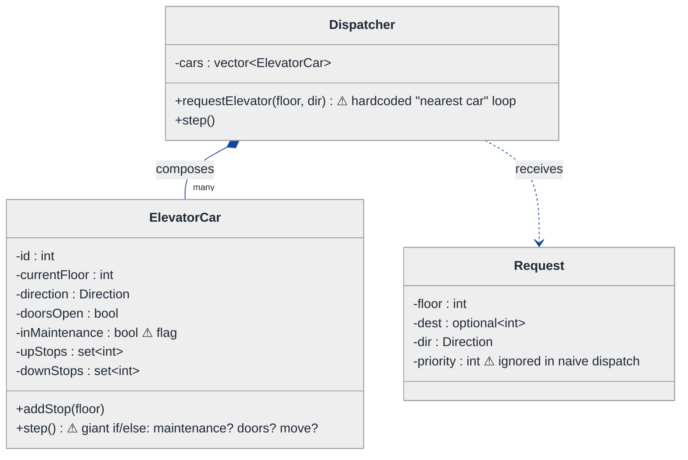
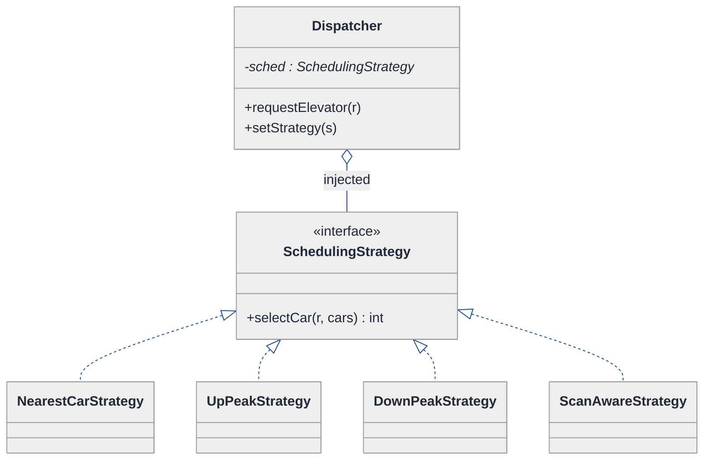
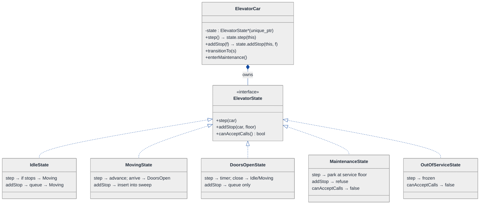
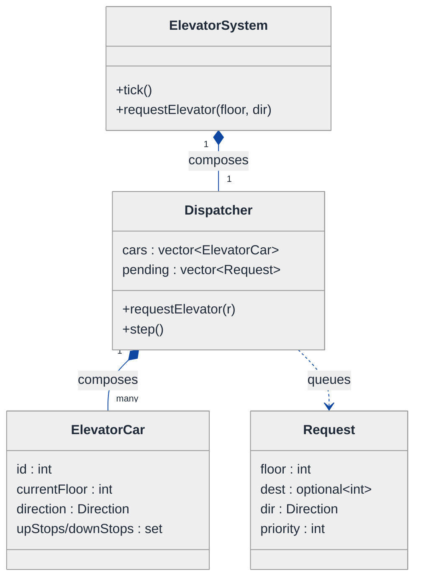
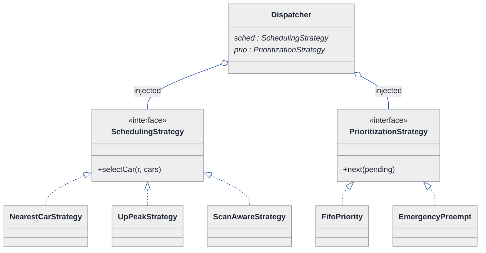
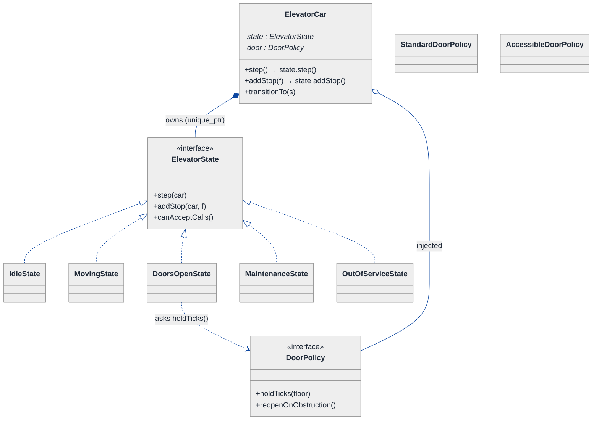
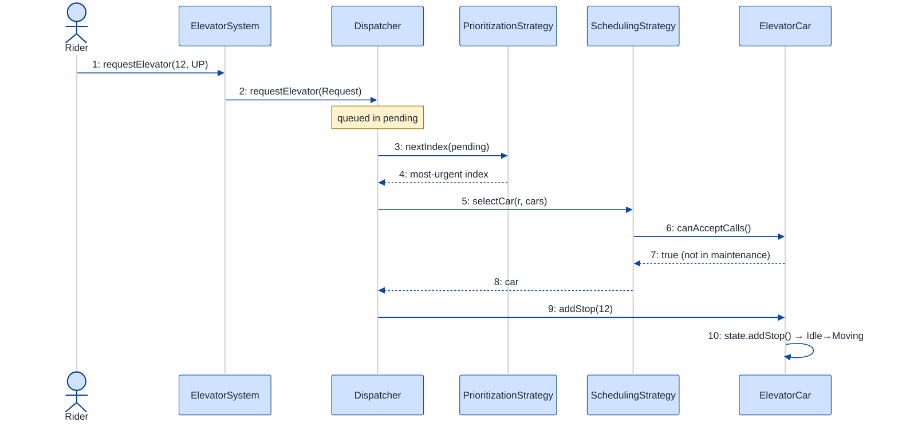
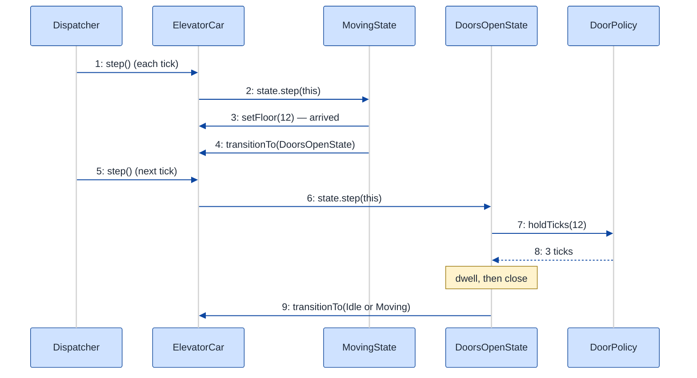

# Elevator System — LLD Walkthrough

> **Difficulty:** Hard · **Time:** ~45 min · **Pattern focus:** Strategy (dispatch / scheduling) + State (car lifecycle incl. maintenance) + a few more
>
> **Problem source(s):** GID OOD15, bucket `Object_Oriented_Design`. Representative of multiple LeetLens "design an elevator / lift controller" rows in [`./EXTRACTED_QUESTIONS.md`](./EXTRACTED_QUESTIONS.md). A classic Hard LLD because two axes (scheduling algorithm + per-car lifecycle) vary at the same time.
>
> **Diagrams:** inline mermaid (renders natively in GitHub / VS Code). Optional editable freehand sources are sibling `.excalidraw` files.

---

## How to use this file

Paced for a candidate seeing the elevator problem for the first time. Reading time: ~45 minutes if you sketch each iteration by hand. **The lesson: don't reach for a `Strategy` or a state machine up front — DERIVE them. Build the naive `if/else` controller first, watch it collapse the moment the scheduling algorithm or the maintenance flow changes, and reach for ONE pattern at a time to fix the most painful axis.**

The elevator problem is harder than parking lot for one specific reason: it has **two strong variability axes that interact**. The *scheduling algorithm* (who gets which car) varies independently of the *car lifecycle* (idle → moving → doors-open → maintenance). A weak answer mashes both into one `Elevator::step()` method. A senior answer separates "policy" (scheduling) from "lifecycle" (state) cleanly.

**Map of this file (15 sections):**

1. Problem statement + clarifying questions
2. Plain-English restatement
3. Why this matters
4. Mental model
5. Try it yourself first
6. Entity & verb extraction
7. **Iteration 1: the naive design** — one `ElevatorController` with `if/else` everywhere
8. **Where the naive design hurts** — five future requirements, one painful diff each
9. **Pivot 1: Strategy for dispatch/scheduling** — the most painful axis first
10. **Pivot 2: State for the car lifecycle** — internal transitions, including MAINTENANCE
11. **Pivot 3: Strategy for the remaining axes** — request prioritization, door policy
12. Final UML class diagram (three sub-views)
13. Skeleton code (C++)
14. Key flow — sequence diagram
15. Extensibility re-check + anti-patterns + how to think aloud + self-check

---

## 1. Problem statement + clarifying questions

**Prompt (typical phrasing):** "Design an elevator system for a 40-floor building with multiple elevators. Handle peak traffic, priority requests, and maintenance mode. Define the scheduling algorithm for optimal wait times."

**Clarifying questions to ask BEFORE drawing anything:**

1. **How many cars, how many floors?** The prompt says 40 floors, multiple cars — so we need a *bank* of elevators with a central dispatcher, not a single shaft. How many cars (4? 8?) changes the scheduling math but not the design shape.
2. **Two button types?** There are two distinct request sources: **hall calls** (a person at floor 12 presses UP) and **car calls** (a person inside the car presses 30). Hall calls carry a direction; car calls carry only a destination. Do we model both?
3. **What does "peak traffic" mean operationally?** Morning up-peak (everyone going up from the lobby), evening down-peak, or interfloor? Does the building want us to SWITCH scheduling strategies by time-of-day, or just one good algorithm?
4. **What does "priority request" mean?** Firefighter / emergency-service key? VIP floor? Freight override? Each implies a request can jump the queue — so requests need a comparable priority, not just a FIFO list.
5. **Maintenance mode semantics?** Does a car in maintenance finish its current passengers first, or go out-of-service immediately? Can it accept calls while in maintenance? (Almost always: no new calls, park at a service floor, doors held.)
6. **What's the optimization target?** "Optimal wait times" — average wait, worst-case wait, or energy/throughput? We'll assume average passenger wait time, with a tie-break on travel distance.
7. **Concurrency?** Real elevator controllers are real-time event loops. Do we need thread-safety, or can we model a single-threaded `step()` tick that the interviewer drives? (Assume single-threaded tick; note the locking boundary in §15.)
8. **Doors, sensors, safety?** Do we model door-open/close timing, overload sensors, door-obstruction? Enough to show the lifecycle states; we won't model hardware PWM.

**Assumptions if the interviewer dodges:** a bank of N cars serving 40 floors; both hall calls (directional) and car calls (destination); scheduling strategy is swappable (so up-peak / down-peak / SCAN can be selected); requests carry a priority so emergency calls preempt; maintenance is a per-car lifecycle state that refuses new calls; single-threaded tick-driven simulation; optimize average wait time with distance tie-break.

---

## 2. Plain-English restatement

We're building the software brain of a building's elevator bank. People press buttons in two places — out in a hallway ("I'm on 12, going up") and inside a car ("take me to 30"). A central **dispatcher** decides which car answers each hall call. Each car independently runs its own little life: it sits idle, picks a direction, moves floor by floor, opens its doors when it arrives, and occasionally a technician flips it into maintenance so it stops taking calls and parks. The system must let us **swap the scheduling algorithm** (a morning up-peak rush wants different behavior than a quiet afternoon), **honor priority requests** (a fire-service call jumps everyone), and **take a car out of service** — all **without rewriting the core move-the-car loop**.

---

## 3. Why this matters

The elevator system is the LLD question that separates "I know the GoF catalog" from "I know WHEN to reach for each pattern." It's tempting to throw every pattern at it; the senior move is recognizing exactly two axes of real variation (the *scheduling decision* and the *car's lifecycle*), mapping one to Strategy and one to State, and refusing to over-engineer the rest. It also probes whether you can keep a **real-time control loop** clean — the per-tick `step()` is where junior designs rot into a 200-line `if/else` swamp. Where this reappears: any "dispatcher + worker with lifecycle" shape — ride-hailing dispatch, print-job spoolers, task schedulers, traffic-signal controllers.

---

## 4. Mental model

An elevator bank is a **dispatcher holding a pool of cars**, plus a **rule-book** with two pages that turn independently. Page one: *given a new hall call, which car should answer?* (policy / scheduling). Page two: *given where this car is and what it's been told, what does it do this tick?* (lifecycle / state).

```
Real-world sketch (NOT a UML diagram yet):

   Hall calls (floor, direction)            Car calls (destination)
        │                                          │
        ▼                                          ▼
  ┌─────────────────────────────────────────────────────────┐
  │                    Dispatcher                             │
  │   "which car answers hall call (12, UP)?"  ← scheduling   │
  └───────┬───────────────┬───────────────┬──────────────────┘
          ▼               ▼               ▼
      ┌───────┐       ┌───────┐       ┌───────┐
      │ Car A │       │ Car B │       │ Car C │   (each runs its
      │ fl 8  │       │ fl 22 │       │ MAINT │    own lifecycle:
      │ UP    │       │ IDLE  │       │ parked│    idle/move/doors)
      └───────┘       └───────┘       └───────┘
```

The KEY insight from this picture: the dispatcher is **orchestration**, the cars are **workers with their own lifecycle**, and the scheduling decision + the request priority are **policy**. Orchestration vs. lifecycle vs. policy — that separation is exactly what we'll bake into the design, and it's exactly what the naive design fails to separate.

---

## 5. Try it yourself first

> **Predict before reading on:**
>
> 1. List 5 nouns you'd promote to a class, and 3 nouns you'd leave as plain fields. (Is "direction" a class?)
> 2. **If I told you the building wants up-peak scheduling at 9am and SCAN scheduling the rest of the day, what would change about how you write the dispatcher?** If your answer is "add an `if (timeOfDay)` to the dispatch method," what happens when they add a third mode?
> 3. A car needs a MAINTENANCE mode where it refuses new calls and parks. Where do you put that logic so it doesn't sprinkle `if (inMaintenance)` across every method?

---

## 6. Entity & verb extraction

> **Mini-refresher: noun → class, but not every noun.**
>
> Naive OOD promotes every noun to a class. Senior OOD promotes a noun only if it has both BEHAVIOR and STATE that need to live together. "Direction" is just an enum (`UP`/`DOWN`/`IDLE`) — no behavior of its own. "ElevatorCar" becomes a class because it has lifecycle behavior AND mutable state (current floor, direction, doors).

**Nouns from the prompt:**

| Noun | Decision | Why |
|---|---|---|
| ElevatorSystem / Dispatcher | Class (top-level coordinator) | Owns the car pool, routes hall calls, ticks the simulation |
| ElevatorCar | Class | Has current floor + direction + door state + lifecycle behavior |
| Request | Class (small) | Has source floor, optional destination, direction, priority |
| Floor | Field/index (`int`) mostly | A floor number rarely needs behavior; hall buttons live on the dispatcher |
| HallCall / CarCall | Two flavors of Request | Hall call has direction; car call has destination |
| Direction | `enum class` (UP/DOWN/IDLE) | No behavior; pure value |
| DoorState | `enum class` or part of car state | Open/Closed/Opening |
| Button | Field/event, not a class | Pressing a button just creates a Request |
| Priority | Field on Request (`enum class` or int) | Comparable value, no behavior |

**Verbs (and the class they live on — naive answer, we'll re-examine):**

| Verb | Owner class (naive — to be re-examined) |
|---|---|
| requestElevator(floor, dir) | Dispatcher |
| assignCar(request) | Dispatcher |
| pressFloor(dest) | ElevatorCar (a car call) |
| step() / tick() | Dispatcher → each ElevatorCar |
| move() / openDoors() | ElevatorCar |
| addStop(floor) | ElevatorCar |
| setMaintenance(on) | ElevatorCar |

**We have NOT introduced any design patterns yet.** Pure nouns + verbs.

---

## 7. <a id="iter-1"></a>Iteration 1: the naive design

Let's write the simplest thing that could possibly work. No design patterns — one `Dispatcher`, a `Car` with a `step()` method, and `if/else` for everything.



**Reader's tour (read top to bottom; ~60 seconds).**

1. **At the top — `Dispatcher` is the root.** It holds ONE field (`cars`) and exposes TWO public methods. `requestElevator` contains a hardcoded "find the nearest car" loop — there is NO scheduling strategy object. `step()` just loops over cars and calls each car's `step()`.

2. **The composition spine.** The FILLED diamond marks composition (strong ownership / same lifetime). The dispatcher owns the cars; if the system dies, every car dies with it. That part is fine and won't change.

3. **The `ElevatorCar` box — trouble zone #1.** Look at the warnings:
   - `inMaintenance` is a `bool` flag. Fine for one special case; it metastasizes into `if (inMaintenance) return;` at the top of EVERY method when we add more lifecycle phases.
   - `step()` is a giant `if/else`: "if in maintenance do nothing; else if doors open count down and close; else if I have stops, move toward the nearest." Every new lifecycle behavior wedges another branch in here.

4. **The `Request` box — trouble zone #2.** It has a `priority` field that the naive `requestElevator` loop completely **ignores** — it just picks the nearest car, FIFO. Priority requests (emergency, VIP) have nowhere to influence the decision.

5. **`requestElevator` — trouble zone #3.** The scheduling algorithm IS the body of this method. "Nearest car" is baked in. Up-peak, down-peak, SCAN, load-balanced — none of them can be selected; you'd edit this method's body to change the algorithm.

**What's deliberately missing.** No `SchedulingStrategy`. No `ElevatorState`. No `PrioritizationStrategy`. No `DoorPolicy`. The naive design doesn't even *acknowledge* that "which car answers," "what does a car do this tick," and "which request goes first" are independent axes of variation. It bakes a hardcoded answer for each into the method that uses it.

Skeleton code for the naive design (C++):

```cpp
#include <algorithm>
#include <optional>
#include <set>
#include <stdexcept>
#include <vector>

enum class Direction { UP, DOWN, IDLE };

struct Request {
    int                 floor;        // hall-call source floor
    std::optional<int>  dest;         // set for car calls
    Direction           dir;
    int                 priority = 0; // higher = more urgent — IGNORED below
};

class ElevatorCar {
public:
    explicit ElevatorCar(int id, int floor = 0) : id_(id), currentFloor_(floor) {}

    void addStop(int floor) {                       // car call
        if (floor > currentFloor_) upStops_.insert(floor);
        else if (floor < currentFloor_) downStops_.insert(floor);
    }
    int  currentFloor() const { return currentFloor_; }
    void setMaintenance(bool on) { inMaintenance_ = on; }

    void step() {                                   // one tick — the swamp
        if (inMaintenance_) {                       // ⚠ flag check #1
            // ignore everything; ideally drift to service floor
            return;
        }
        if (doorsOpen_) {                           // ⚠ doors branch
            doorTimer_--;
            if (doorTimer_ <= 0) doorsOpen_ = false;
            return;
        }
        if (direction_ == Direction::UP && !upStops_.empty()) {
            currentFloor_++;
            if (upStops_.count(currentFloor_)) {    // arrived → open
                upStops_.erase(currentFloor_);
                doorsOpen_ = true; doorTimer_ = 3;
            }
        } else if (direction_ == Direction::DOWN && !downStops_.empty()) {
            currentFloor_--;
            if (downStops_.count(currentFloor_)) {
                downStops_.erase(currentFloor_);
                doorsOpen_ = true; doorTimer_ = 3;
            }
        } else {                                    // pick a new direction
            if (!upStops_.empty())        direction_ = Direction::UP;
            else if (!downStops_.empty()) direction_ = Direction::DOWN;
            else                          direction_ = Direction::IDLE;
        }
    }
private:
    int            id_;
    int            currentFloor_;
    Direction      direction_   = Direction::IDLE;
    bool           doorsOpen_   = false;
    int            doorTimer_   = 0;
    bool           inMaintenance_ = false;          // ⚠ lifecycle as a bool
    std::set<int>  upStops_;
    std::set<int>  downStops_;
};

class Dispatcher {
public:
    explicit Dispatcher(std::vector<ElevatorCar> cars) : cars_(std::move(cars)) {}

    int requestElevator(const Request& r) {          // ⚠ scheduling baked in
        int best = -1, bestDist = 1e9;               // "nearest car" — hardcoded
        for (int i = 0; i < (int)cars_.size(); ++i) {
            int d = std::abs(cars_[i].currentFloor() - r.floor);
            if (d < bestDist) { bestDist = d; best = i; }   // priority ignored
        }
        if (best < 0) throw std::runtime_error("No car");
        cars_[best].addStop(r.floor);
        return best;
    }
    void step() { for (auto& c : cars_) c.step(); }  // tick the whole bank
private:
    std::vector<ElevatorCar> cars_;
};
```

**This works.** It has zero design patterns. We can request a car, the nearest one gets the stop, and each car moves on every tick. So what's wrong with it?

---

## 8. <a id="naive-pain"></a>Where the naive design hurts

Now the interviewer slides a piece of paper across the desk: "Here are five things the building operator wants next quarter. Walk me through what changes."

### Change A: "Morning up-peak — at 9am, send free cars back to the lobby and batch upward trips"

In the naive design:
- The scheduling logic IS the body of `Dispatcher::requestElevator` (the nearest-car loop).
- Up-peak needs a *completely different* decision: prefer cars already heading up, idle-park free cars at the lobby, group calls.
- You'd add `if (isUpPeak())` branching INSIDE `requestElevator`, duplicating most of the method. **Next mode (down-peak) → a third branch.** Three algorithms tangled in one method.

### Change B: "Emergency / firefighter calls preempt everything"

In the naive design:
- `Request::priority` exists but `requestElevator` never reads it.
- A high-priority call must (a) be chosen by dispatch before normal calls and (b) possibly *interrupt* a car mid-trip.
- You'd thread `if (r.priority > 0)` checks into `requestElevator` AND into `ElevatorCar::step()` (to drop current stops). **Two unrelated sites change for one feature.**

### Change C: "Maintenance mode — car finishes nothing new, parks at a service floor, holds doors"

In the naive design:
- `inMaintenance_` is a bool checked at the top of `step()`.
- But maintenance is richer: refuse `addStop`, drift to a service floor, then hold doors open. That's behavior in `addStop()`, in `step()`, in door handling — **three methods grow an `if (inMaintenance_)` branch.**
- And "out of service due to a fault" is a *different* maintenance-ish state (can't even move). The bool can't express two flavors. **A second bool? Now you have `if (inMaintenance_ && !faulted_)` combinatorics.**

### Change D: "SCAN (elevator algorithm) — sweep all the way up serving every request, then all the way down"

In the naive design:
- The move logic in `step()` (the up/down branches) hardcodes "go toward nearest stop." SCAN is "keep going in the current direction until no stops remain ahead, then reverse."
- That's a rewrite of the movement branches, intertwined with the door branch and the maintenance flag. **You can't change the movement policy without risking the door/maintenance logic in the same method.**

### Change E: "Door-obstruction / hold-open-longer for accessible floors"

In the naive design:
- Door timing (`doorTimer_ = 3`) is a magic number inside `step()`.
- Accessible-floor hold (longer), VIP-floor hold, obstruction re-open — each adds a branch to the door handling inside the same monster method.

### The pattern of pain

| Change | Files/methods touched | Smell |
|---|---|---|
| A. Up-peak scheduling | `Dispatcher::requestElevator` (duplicated) | "Scheduling algorithm is the method body; can't swap it." |
| B. Priority preemption | `requestElevator` + `ElevatorCar::step` | "Priority field ignored; preemption logic scattered." |
| C. Maintenance flow | `addStop` + `step` + door logic | "Lifecycle modeled as bools; can't express new phases." |
| D. SCAN movement | `ElevatorCar::step` (movement branches) | "Movement policy hardcoded inside the lifecycle loop." |
| E. Door hold policy | `ElevatorCar::step` (door branch) | "Door timing is a magic number; every variant is a branch." |

**Two axes of pain dominate:** *algorithm variability* (which car answers; which request is first; how doors behave; how a car sweeps) and *lifecycle variability* (idle → moving → doors → maintenance → out-of-service, with state-specific legal actions).

> **Pivot question:** "What pattern handles 'an algorithm that varies and is swapped by the caller / config'? What pattern handles 'a lifecycle where each phase allows different actions and decides what comes next'?"
>
> The answers are **Strategy** and **State**. Let's introduce them one at a time, starting with the most painful axis: scheduling.

---

## 9. <a id="pivot-1"></a>Pivot 1: Strategy for dispatch / scheduling

> **Mini-refresher: Strategy pattern.**
>
> Encapsulates an algorithm behind an interface so it can be swapped at runtime. The CALLER (here, the dispatcher / building config) decides which strategy to use; the strategy doesn't know about its peers.
>
> Quick example: a `Sorter` takes a `CompareStrategy*` in its constructor. Pass `AscendingCompare` or `DescendingCompare` — the sorter doesn't care which.

**Why Strategy fits scheduling.** "Which car answers this hall call" is an algorithm: `given a request and the current state of all cars, return the chosen car`. It varies — nearest-car, up-peak (favor cars going up, park idle at lobby), down-peak, SCAN-aware, load-balanced. The choice is made externally (by building policy or time-of-day), not by the car itself. That is textbook Strategy. The dispatcher should *own the orchestration* and *delegate the decision*.

**The refactor (just the affected part):**

```cpp
class ElevatorCar;  // forward
class Dispatcher;   // forward

// The scheduling decision, behind one interface.
class SchedulingStrategy {
public:
    virtual ~SchedulingStrategy() = default;
    // Return the index of the car that should serve `r`, or -1 if none.
    virtual int selectCar(const Request& r,
                          const std::vector<ElevatorCar>& cars) const = 0;
};

// Baseline: pick the closest free-or-same-direction car.
class NearestCarStrategy : public SchedulingStrategy {
public:
    int selectCar(const Request& r,
                  const std::vector<ElevatorCar>& cars) const override {
        int best = -1, bestCost = INT_MAX;
        for (int i = 0; i < (int)cars.size(); ++i) {
            if (!cars[i].canAcceptCalls()) continue;     // skip maintenance
            int cost = estimateCost(cars[i], r);          // distance + direction penalty
            if (cost < bestCost) { bestCost = cost; best = i; }
        }
        return best;
    }
private:
    int estimateCost(const ElevatorCar& c, const Request& r) const; // elided
};

// Up-peak: heavily favor cars idle at / returning to the lobby for upward trips.
class UpPeakStrategy : public SchedulingStrategy {
public:
    int selectCar(const Request& r,
                  const std::vector<ElevatorCar>& cars) const override {
        // bias toward lobby-parked cars for UP requests; round-robin the rest
        // ... elided ...
        return 0;
    }
};
// DownPeakStrategy, ScanAwareStrategy, LoadBalancedStrategy — elided, same shape.

class Dispatcher {
public:
    Dispatcher(std::vector<ElevatorCar> cars,
               std::unique_ptr<SchedulingStrategy> sched)
        : cars_(std::move(cars)), sched_(std::move(sched)) {}

    int requestElevator(const Request& r) {
        int idx = sched_->selectCar(r, cars_);   // ← decision delegated
        if (idx < 0) throw std::runtime_error("No car available");
        cars_[idx].addStop(r.floor);
        return idx;
    }
    // Swap the algorithm at runtime — e.g. a scheduler flips this at 9am.
    void setStrategy(std::unique_ptr<SchedulingStrategy> s) { sched_ = std::move(s); }
private:
    std::vector<ElevatorCar>            cars_;
    std::unique_ptr<SchedulingStrategy> sched_;  // injected
};
```

**What changed — visualized.** Just the scheduling slice:



**Tour of the after-state.**

1. **Top: Dispatcher gained a field.** `sched` is a pointer to a `SchedulingStrategy` interface, INJECTED at construction. The OPEN diamond (`◇`) marks aggregation — the dispatcher *uses* the strategy. `setStrategy()` lets a building scheduler hot-swap it at 9am without touching `requestElevator`.

2. **Middle: the `<<interface>>` box.** A single virtual method `selectCar(request, cars) → int`. Narrow contract: given a request and the current fleet, return the chosen car's index. Nothing about doors, nothing about movement.

3. **Bottom row: concrete strategies.** `NearestCar` is the old baseline, now isolated. `UpPeak` / `DownPeak` encode rush-hour behavior. `ScanAware` cooperates with the SCAN movement policy. **Each is one class; adding one never touches the others.**

4. **Change A from §8 now lands cleanly.** Morning up-peak → a `UpPeakStrategy` class + a one-line `setStrategy()` call from a time-of-day scheduler. No duplication inside `requestElevator`, which is now three lines.

**Pattern-discrimination cheatsheet — Strategy vs Template Method.**
- *Strategy:* whole algorithm in one swappable object; chosen at runtime via composition.
- *Template Method:* algorithm skeleton in a base class; subclasses fill in hooks via inheritance.
- *Rule of thumb:* variants you might switch at runtime (time-of-day modes) → Strategy. A fixed skeleton with 2-3 stable variants → Template Method.

We chose Strategy because the building flips modes *at runtime* (`setStrategy` at 9am) and may even A/B two algorithms — you can't hot-swap a Template Method subclass into a live object.

---

## 10. <a id="pivot-2"></a>Pivot 2: State for the car lifecycle (including maintenance)

Changes C and D from §8 are still painful. The car's `step()` is a swamp of `if (inMaintenance_) / if (doorsOpen_) / if (moving)` and a `bool` can't express "out of service" as distinct from "maintenance." Scheduling Strategy doesn't help here, because the variability is **not in an algorithm picked by a caller** — it's in *what the car is allowed to do right now* and *what phase comes next*.

> **Mini-refresher: State pattern.**
>
> Each lifecycle phase is its own class. The context object (the car) delegates each event (`step()`, `addStop()`) to its CURRENT state object, and THE STATE decides what the next state is. Transitions are INTERNAL, driven by events the context receives — not by a caller flipping a flag.

**Why State (not Strategy).** Nobody outside the car *picks* "be in MaintenanceState." The car enters it because a technician event arrived AND its current trip wound down. An `IdleState` car can start moving; a `DoorsOpenState` car can't move until doors close; a `MaintenanceState` car refuses `addStop` and parks; an `OutOfServiceState` car can't even move. Calling `move()` on a doors-open car isn't meaningful — it should be impossible, not guarded by a runtime `if`. The lifecycle is the OBJECT'S concern.

**The refactor (just the lifecycle part):**

```cpp
class ElevatorCar;  // forward

class ElevatorState {
public:
    virtual ~ElevatorState() = default;
    virtual void step(ElevatorCar& c)        = 0;  // one tick in this phase
    virtual void addStop(ElevatorCar& c, int floor) = 0; // a car call arrived
    virtual bool canAcceptCalls() const { return true; } // dispatcher asks this
    virtual const char* name() const = 0;
};

class IdleState : public ElevatorState {
public:
    void step(ElevatorCar& c) override;            // if stops exist → MovingState
    void addStop(ElevatorCar& c, int floor) override; // queue + → MovingState
    const char* name() const override { return "IDLE"; }
};

class MovingState : public ElevatorState {
public:
    void step(ElevatorCar& c) override;            // advance one floor; arrive → DoorsOpen
    void addStop(ElevatorCar& c, int floor) override; // insert into the sweep
    const char* name() const override { return "MOVING"; }
};

class DoorsOpenState : public ElevatorState {
public:
    void step(ElevatorCar& c) override;            // count down; close → Idle/Moving
    void addStop(ElevatorCar& c, int floor) override; // queue but don't move yet
    const char* name() const override { return "DOORS_OPEN"; }
};

class MaintenanceState : public ElevatorState {
public:
    void step(ElevatorCar& c) override;            // drift to service floor, hold doors
    void addStop(ElevatorCar&, int) override {}    // refuse new calls — no-op
    bool canAcceptCalls() const override { return false; } // dispatcher skips this car
    const char* name() const override { return "MAINTENANCE"; }
};

class OutOfServiceState : public ElevatorState {   // fault: can't move at all
public:
    void step(ElevatorCar&) override {}            // frozen
    void addStop(ElevatorCar&, int) override {}
    bool canAcceptCalls() const override { return false; }
    const char* name() const override { return "OUT_OF_SERVICE"; }
};

class ElevatorCar {
public:
    explicit ElevatorCar(int id, int floor = 0)
        : id_(id), currentFloor_(floor),
          state_(std::make_unique<IdleState>()) {}

    void transitionTo(std::unique_ptr<ElevatorState> s) { state_ = std::move(s); }
    void step()             { state_->step(*this); }            // one-liner
    void addStop(int floor) { state_->addStop(*this, floor); }  // one-liner
    bool canAcceptCalls() const { return state_->canAcceptCalls(); }

    // Technician event — NOT a flag check; it asks the state to honor it.
    void enterMaintenance() { transitionTo(std::make_unique<MaintenanceState>()); }

    // getters / stop-queue accessors used by the states (elided)
    int currentFloor() const { return currentFloor_; }
private:
    int            id_;
    int            currentFloor_;
    Direction      direction_ = Direction::IDLE;
    std::set<int>  upStops_, downStops_;
    std::unique_ptr<ElevatorState> state_;
};

// Example transition: doors finish closing → resume moving or go idle.
inline void DoorsOpenState::step(ElevatorCar& c) {
    // ... decrement door timer; when expired: ...
    if (/* car has more stops */ true) c.transitionTo(std::make_unique<MovingState>());
    else                               c.transitionTo(std::make_unique<IdleState>());
}
```

**What changed — visualized.** Just the lifecycle slice:



**Tour of the after-state.**

1. **The `inMaintenance_` / `doorsOpen_` bools are GONE.** They're replaced by one `state` field of type `ElevatorState*` (specifically `std::unique_ptr<ElevatorState>` — exclusive ownership).

2. **`ElevatorCar::step()` and `addStop()` became one-liners.** Each delegates to the current state: `state_->step(*this)`. **No `if (inMaintenance_)` ladder anywhere in the car.**

3. **The interface declares the contract.** `ElevatorState` has `step`, `addStop`, and `canAcceptCalls`. That last one is how the *dispatcher* (from Pivot 1) skips cars in maintenance — `NearestCarStrategy` calls `cars[i].canAcceptCalls()`, which forwards to the state. **The two patterns cooperate at exactly this seam.**

4. **Five concrete states, each self-contained.** `Idle` starts trips; `Moving` advances and arrives; `DoorsOpen` times out then resumes or idles; `Maintenance` refuses calls and parks; `OutOfService` is frozen (a fault). Each knows what's legal and what comes next.

5. **Where the transitions happen.** Look at each state's `step()` body — the state itself calls `c.transitionTo(...)` when its work is done (e.g., `DoorsOpenState::step` → `MovingState` or `IdleState`). **The transition logic lives WITH the state**, not scattered in `ElevatorCar` and not in `Dispatcher`.

**Changes C and D from §8 now land cleanly.** Maintenance → a `MaintenanceState` class (refuse calls, park) plus `OutOfServiceState` for faults — two distinct phases the bool couldn't express. SCAN → it lives inside `MovingState::step`'s sweep logic, isolated from doors and maintenance. Adding a new phase is one new class; no edits to the others. Open/closed.

**Pattern-discrimination cheatsheet — Strategy vs State (the crux of this whole question).**
- *Strategy:* the CALLER picks which one to use (`dispatcher.setStrategy(upPeak)`); strategies are usually unaware of each other.
- *State:* the OBJECT picks its next state internally (`DoorsOpenState::step` → `MovingState`); states know about each other and transition between themselves.
- *Rule of thumb:* if `context.setX(y)` is called by external code → **Strategy** (scheduling). If `context.handleEvent(e)` flips the phase internally → **State** (the car's lifecycle). The elevator needs BOTH, on two different axes — that's why it's a Hard question.

---

## 11. <a id="pivot-3"></a>Pivot 3: Strategy for the remaining variability axes

Changes A, C, D are solved; B (priority preemption) and E (door hold policy) are not yet. Both are "an algorithm picked by config," so they follow the SAME shape as Pivot 1.

**The remaining axes:**

| Axis | Pattern | One sentence why |
|---|---|---|
| Request prioritization | Strategy | How we order the pending request queue (FIFO, priority-first, emergency-preempt) varies by policy |
| Door hold policy | Strategy | How long doors stay open (standard, accessible-floor longer, obstruction re-open) is a swappable rule |

Each follows the Pivot-1 shape. Brief sketches:

```cpp
// ── Request prioritization: how the pending queue is ordered ────────
class PrioritizationStrategy {
public:
    virtual ~PrioritizationStrategy() = default;
    // Choose the next request to dispatch from the pending set.
    virtual const Request& next(const std::vector<Request>& pending) const = 0;
};
class FifoPriority      : public PrioritizationStrategy { /* oldest first */ };
class HighestPriority   : public PrioritizationStrategy { /* max(priority) first */ };
class EmergencyPreempt  : public PrioritizationStrategy {
    // emergency (firefighter) jumps queue AND signals the chosen car to
    // drop its current stops; falls back to age for normal calls. elided.
};

// ── Door hold policy: how long doors stay open + re-open rules ──────
class DoorPolicy {
public:
    virtual ~DoorPolicy() = default;
    virtual int holdTicks(int floor) const = 0;     // dwell time at this floor
    virtual bool reopenOnObstruction() const = 0;
};
class StandardDoorPolicy   : public DoorPolicy { /* 3 ticks, reopen=true */ };
class AccessibleDoorPolicy : public DoorPolicy { /* longer hold for ADA floors */ };
```

The emergency case is interesting because it spans both patterns: `EmergencyPreempt` is a *Strategy* that, when it picks an emergency request, tells the chosen car to transition — the car's State machine handles "drop my stops and head to the emergency floor" inside a transition. **The Strategy decides WHICH car and WHY; the State decides WHAT the car then does.** Clean seam, no `if (emergency)` leaking into `step()`.

> **Mini-refresher: why these Strategy hierarchies don't share one interface.**
>
> Strategy is a *role*, not a type. `SchedulingStrategy`, `PrioritizationStrategy`, and `DoorPolicy` have nothing in common at the type level (different inputs, different outputs). Don't unify them under a single `Strategy<T>` template — that's premature genericism. Three small focused interfaces beat one clever generic one.

**The lesson.** Once we recognized "algorithm picked by caller/config" as the shape for scheduling in Pivot 1, two more axes fall to the same shape for free. **Pattern recognition makes subsequent design cheap** — the third Strategy took two lines of thought, not two pages.

---

## 12. <a id="fig-class-diagram"></a>12. Final class diagram

Showing the entire final design in one diagram becomes a wall of boxes. Instead, here are **three focused sub-views**, each addressing a different concern. Read them in order; the structural insight at the end ties them together.

### 12.1 The orchestration spine — what the system OWNS



**Tour of 12.1.** The `ElevatorSystem` is the thin public facade (the building wires buttons to it). It composes one `Dispatcher`; the dispatcher composes the pool of `ElevatorCar`s (filled diamonds = composition, same lifetime). `Request` is a small value object the dispatcher queues. This spine is essentially unchanged from the naive version — it didn't need to change. Everything we ADDED lives in 12.2 and 12.3.

### 12.2 The policy injection — what the dispatcher USES



**Tour of 12.2.**

1. **One Dispatcher, two injected strategy interfaces.** `sched` decides which car answers; `prio` decides which pending request goes first. Both are open diamonds (`◇`) = aggregation — injected at construction, not `new`ed inside the dispatcher.

2. **`SchedulingStrategy` family.** `NearestCar` (baseline), `UpPeak` / `DownPeak` (rush hours), `ScanAware` (cooperates with the car's SCAN movement). A time-of-day scheduler calls `dispatcher.setStrategy(...)` to flip modes.

3. **`PrioritizationStrategy` family.** `Fifo` (oldest first), `HighestPriority`, `EmergencyPreempt` (firefighter jumps the queue and signals a car to drop its stops).

4. **The structural insight here.** The two axes the naive design hardcoded inside `requestElevator` are now lifted into their own type hierarchies. **The dispatcher's core became pure orchestration; the variation became hot-swappable policy.**

5. **`DoorPolicy` is missing here on purpose.** Doors belong to a car, not the dispatcher — it lives in 12.3.

### 12.3 The lifecycle and the doors — the car's State pattern + the door Strategy



**Tour of 12.3.**

1. **Each car holds ONE `ElevatorState` pointer.** Filled diamond / `unique_ptr` — the car OWNS its current state. On a transition, it replaces the unique_ptr.

2. **`step()` and `addStop()` are ONE-LINERS** that delegate to the current state. **No phase-switch `if` ladder on the car.**

3. **Five concrete state classes.** `Idle`, `Moving`, `DoorsOpen` are the normal cycle; `Maintenance` (refuse calls, park at service floor) and `OutOfService` (frozen fault) are the two distinct out-of-service phases the naive `bool` couldn't express. Each is self-contained.

4. **`DoorPolicy` is injected (aggregation), not owned-as-state.** Look carefully: the door rule is *used by* `DoorsOpenState` (it asks `holdTicks(floor)`), but it's a swappable Strategy held by the car, not a lifecycle phase. **Two patterns, one car: State for the phase, Strategy for the door dwell rule.**

5. **The crucial cooperation seam.** `canAcceptCalls()` is declared on `ElevatorState` and forwarded by `ElevatorCar` — that's the exact method `SchedulingStrategy` (12.2) calls to skip maintenance cars. The scheduling Strategy and the car's State machine talk through this one narrow method.

### Structural insight (ties 12.1 + 12.2 + 12.3 together)

| Concern | Pattern used | Why |
|---|---|---|
| **Orchestration** (system, dispatcher, car pool) | Plain composition | Genuine ownership; the spine doesn't vary |
| **Scheduling + prioritization** | Strategy, INJECTED into Dispatcher | Building/time-of-day picks the variant; hot-swappable at runtime |
| **Car lifecycle** (Idle → Moving → DoorsOpen → Maintenance / OutOfService) | State, OWNED by ElevatorCar | The car controls its own transitions; each phase validates what's legal |
| **Door dwell rule** | Strategy, INJECTED into ElevatorCar | A per-floor swappable policy, not a lifecycle phase |

The big lesson: **inheritance is used only for the Strategy and State class families** — every "varies independently" axis becomes composition over an interface, and the *one* axis that's "what am I allowed to do right now" becomes State. *Strategy for the decision the caller makes, State for the lifecycle the object lives.* Recognizing that the elevator has BOTH, on TWO different axes, is the entire point of the question.

---

## 13. Skeleton code (C++)

> Show the SHAPES, not the full impl. ~150 lines. Abstract bases + 1-2 concrete classes per pattern; the rest `// elided`.

```cpp
#include <climits>
#include <memory>
#include <optional>
#include <set>
#include <stdexcept>
#include <vector>

// ── Forward declarations ────────────────────────────────────────────
class ElevatorCar;
class Dispatcher;

// ── Value types ─────────────────────────────────────────────────────
enum class Direction { UP, DOWN, IDLE };

struct Request {
    int                 floor;            // hall-call source floor
    std::optional<int>  dest;             // present for car calls
    Direction           dir   = Direction::IDLE;
    int                 priority = 0;     // higher = more urgent (emergency)
};

// ── State pattern: the car lifecycle ────────────────────────────────
class ElevatorState {
public:
    virtual ~ElevatorState() = default;
    virtual void step(ElevatorCar& c)               = 0;
    virtual void addStop(ElevatorCar& c, int floor)  = 0;
    virtual bool canAcceptCalls() const { return true; }
    virtual const char* name() const = 0;
};

class MovingState : public ElevatorState {
public:
    void step(ElevatorCar& c) override;                 // advance one floor; arrive → DoorsOpen
    void addStop(ElevatorCar& c, int floor) override;   // splice into the current sweep
    const char* name() const override { return "MOVING"; }
};

class MaintenanceState : public ElevatorState {
public:
    void step(ElevatorCar& c) override;                 // drift to service floor, hold doors
    void addStop(ElevatorCar&, int) override {}         // refuse new calls
    bool canAcceptCalls() const override { return false; }
    const char* name() const override { return "MAINTENANCE"; }
};
// IdleState, DoorsOpenState, OutOfServiceState — same shape, elided.

// ── Strategy: door dwell policy (injected into a car) ───────────────
class DoorPolicy {
public:
    virtual ~DoorPolicy() = default;
    virtual int  holdTicks(int floor) const   = 0;
    virtual bool reopenOnObstruction() const  = 0;
};
class StandardDoorPolicy : public DoorPolicy {
public:
    int  holdTicks(int) const override        { return 3; }
    bool reopenOnObstruction() const override { return true; }
};
// AccessibleDoorPolicy — longer hold for ADA floors, elided.

// ── The car: owns its State, aggregates a DoorPolicy ────────────────
class ElevatorCar {
public:
    ElevatorCar(int id, std::unique_ptr<DoorPolicy> door, int floor = 0);

    void step()             { state_->step(*this); }           // delegate to state
    void addStop(int floor) { state_->addStop(*this, floor); }
    bool canAcceptCalls() const { return state_->canAcceptCalls(); }

    void transitionTo(std::unique_ptr<ElevatorState> s) { state_ = std::move(s); }
    void enterMaintenance() { transitionTo(std::make_unique<MaintenanceState>()); }

    // accessors used by states
    int        currentFloor() const { return currentFloor_; }
    Direction  direction()    const { return direction_; }
    const DoorPolicy& doors() const { return *door_; }
    std::set<int>& upStops()        { return upStops_; }
    std::set<int>& downStops()      { return downStops_; }
    void setFloor(int f)            { currentFloor_ = f; }
    void setDirection(Direction d)  { direction_ = d; }
private:
    int                            id_;
    int                            currentFloor_ = 0;
    Direction                      direction_    = Direction::IDLE;
    std::set<int>                  upStops_, downStops_;
    std::unique_ptr<ElevatorState> state_;       // OWNED (lifecycle)
    std::unique_ptr<DoorPolicy>    door_;        // injected (policy)
};

// ── Strategy: which car answers a hall call ─────────────────────────
class SchedulingStrategy {
public:
    virtual ~SchedulingStrategy() = default;
    virtual int selectCar(const Request& r,
                          const std::vector<ElevatorCar>& cars) const = 0;
};
class NearestCarStrategy : public SchedulingStrategy {
public:
    int selectCar(const Request& r,
                  const std::vector<ElevatorCar>& cars) const override {
        int best = -1, bestCost = INT_MAX;
        for (int i = 0; i < (int)cars.size(); ++i) {
            if (!cars[i].canAcceptCalls()) continue;   // skips maintenance cars
            int cost = std::abs(cars[i].currentFloor() - r.floor);
            if (cost < bestCost) { bestCost = cost; best = i; }
        }
        return best;
    }
};
// UpPeakStrategy, DownPeakStrategy, ScanAwareStrategy — elided.

// ── Strategy: which pending request goes first ──────────────────────
class PrioritizationStrategy {
public:
    virtual ~PrioritizationStrategy() = default;
    virtual int nextIndex(const std::vector<Request>& pending) const = 0;
};
class EmergencyPreempt : public PrioritizationStrategy {
public:
    int nextIndex(const std::vector<Request>& pending) const override {
        int best = -1, bestPrio = INT_MIN;
        for (int i = 0; i < (int)pending.size(); ++i)
            if (pending[i].priority > bestPrio) { bestPrio = pending[i].priority; best = i; }
        return best;                              // highest priority first
    }
};
// FifoPriority, HighestPriority — elided.

// ── Dispatcher: orchestration; delegates both decisions ─────────────
class Dispatcher {
public:
    Dispatcher(std::vector<ElevatorCar> cars,
               std::unique_ptr<SchedulingStrategy>     sched,
               std::unique_ptr<PrioritizationStrategy> prio)
        : cars_(std::move(cars)), sched_(std::move(sched)), prio_(std::move(prio)) {}

    void requestElevator(const Request& r) { pending_.push_back(r); }
    void setStrategy(std::unique_ptr<SchedulingStrategy> s) { sched_ = std::move(s); }

    void step() {
        // 1) assign pending requests, most urgent first
        while (!pending_.empty()) {
            int pi  = prio_->nextIndex(pending_);
            if (pi < 0) break;
            const Request r = pending_[pi];
            int ci = sched_->selectCar(r, cars_);
            if (ci < 0) break;                     // no car can take it this tick
            cars_[ci].addStop(r.floor);
            pending_.erase(pending_.begin() + pi);
        }
        // 2) advance every car one tick
        for (auto& c : cars_) c.step();
    }
private:
    std::vector<ElevatorCar>                cars_;
    std::vector<Request>                    pending_;
    std::unique_ptr<SchedulingStrategy>     sched_;
    std::unique_ptr<PrioritizationStrategy> prio_;
};

// ── ElevatorSystem: thin facade the building wires buttons to ───────
class ElevatorSystem {
public:
    explicit ElevatorSystem(Dispatcher d) : dispatcher_(std::move(d)) {}
    void requestElevator(int floor, Direction dir) {
        dispatcher_.requestElevator(Request{floor, std::nullopt, dir});
    }
    void tick() { dispatcher_.step(); }
private:
    Dispatcher dispatcher_;
};
```

---

## 14. <a id="fig-sequence"></a>14. Key flow — sequence diagram

Two phases, because the elevator runs as a tick loop. Phase 1: a hall call comes in and gets assigned. Phase 2: the assigned car arrives and cycles its doors. Watch how the Strategy decisions and the State transitions stay on opposite sides of one narrow seam.

### Phase 1 — hall call → dispatch



**Tour of Phase 1 (dispatch).**

1. **Rider presses UP at floor 12.** The `ElevatorSystem` facade is the boundary between hardware buttons and the software.

2. **Facade forwards to `Dispatcher::requestElevator`.** It just enqueues the `Request` into `pending` — no decision yet. (Real controllers buffer because several calls can arrive in one tick.)

3. **On the next tick, the dispatcher asks the `PrioritizationStrategy` which queued request to handle first.** This is where an emergency call jumps the line — `EmergencyPreempt` returns the firefighter call's index even if it arrived last. **Strategy decision #1.**

4. **The dispatcher asks the `SchedulingStrategy` which car should answer.** **Strategy decision #2.** Notice the dispatcher itself does NO nearest-car math anymore.

5. **The scheduling strategy queries each car's `canAcceptCalls()`** — the one narrow method that forwards to the car's State. A `MaintenanceState` car returns false and is skipped. **This is the exact seam where Strategy meets State.**

6. **The dispatcher tells the chosen car to `addStop(12)`.** The car delegates to its state, which queues the stop and (if idle) transitions `Idle → Moving`. **The dispatcher never touches the car's lifecycle directly** — it only adds a stop and lets the State machine react.

### Phase 2 — car arrives, doors cycle



**Tour of Phase 2 (arrive + doors). Read slowly — this is where State carries the whole flow.**

1. **The dispatcher ticks the car** with `step()` every cycle. The dispatcher does NOT know or care which phase the car is in.

2. **`ElevatorCar::step()` delegates to its current state** — here `MovingState`. The car is a one-line forwarder.

3-4. **`MovingState::step` advances one floor, detects arrival at 12, and transitions the car to `DoorsOpenState`.** The movement policy (including SCAN sweeping) lives entirely inside this state — isolated from doors and maintenance.

5-6. **Next tick, the same `step()` call now lands on `DoorsOpenState`** (because the car swapped its `unique_ptr`). Same message, different behavior — that's polymorphism doing the dispatch the naive `if` ladder did by hand.

7-8. **`DoorsOpenState` asks the injected `DoorPolicy` how long to hold** at this floor. An `AccessibleDoorPolicy` would return a longer dwell. **Strategy nested inside State**, cleanly.

9. **When the dwell expires, `DoorsOpenState` transitions** the car to `Idle` (no more stops) or back to `Moving` (more stops queued). The state decides; nobody outside the car votes.

### The validation that's NOT shown — and why it matters

You don't see `if (inMaintenance)` or `if (doorsOpen)` anywhere in these diagrams. That's the point of the State pattern: **invalid operations are made impossible by polymorphism**, not by runtime flags scattered through `step()`. Tell a `MaintenanceState` car to `addStop()` and the call lands on `MaintenanceState::addStop`, which is a one-line no-op — no `if`, no flag, no scattered guard. **The class hierarchy IS the validation.**

---

## 15. Extensibility re-check + anti-patterns + how to think aloud + self-check

### Extensibility re-check

Revisit the five changes from [§8](#naive-pain). For each, name the SINGLE class that changes.

| Change | Naive design impact | Final design impact |
|---|---|---|
| A. Up-peak scheduling | `requestElevator` duplicated | New `UpPeakStrategy : SchedulingStrategy` + `setStrategy()` at 9am. Done. |
| B. Priority preemption | `requestElevator` + `step` | New `EmergencyPreempt : PrioritizationStrategy`; car drops stops via a State transition. Done. |
| C. Maintenance flow | `addStop` + `step` + doors | New `MaintenanceState` (+ `OutOfServiceState` for faults). Done. |
| D. SCAN movement | `step` movement branches | Sweep logic inside `MovingState` / a `ScanAwareStrategy`. Done. |
| E. Door hold policy | `step` door branch + magic number | New `AccessibleDoorPolicy : DoorPolicy`, injected. Done. |

Every change is one new class. That's the open/closed principle in practice.

> **Mini-refresher: Open/Closed Principle (the "O" in SOLID).**
>
> Software entities should be OPEN for extension but CLOSED for modification. You add new behavior by adding new code (a new strategy/state subclass), not by editing existing, tested code. Every row above adds a class instead of editing `step()` or `requestElevator()` — that's OCP holding.

If a future requirement makes you change `Dispatcher`, `ElevatorCar`, a scheduling Strategy, AND a State together — go back to §6 and re-identify variability points; you missed one.

### Common confusion + traps

1. **"Why is scheduling a Strategy but the car's phase a State? They look similar."** The scheduling algorithm is picked by EXTERNAL code (`dispatcher.setStrategy(upPeak)` from a time-of-day scheduler). The car's phase is picked INTERNALLY (`DoorsOpenState::step` decides to become `MovingState`). External choice → Strategy; internal transition → State. This single distinction is the heart of the question.

2. **"Should `Floor` be a class with subtypes (LobbyFloor, ServiceFloor)?"** Usually no. The difference between floors is data/policy (is it a valid service floor? longer door hold?), not identity. A floor index + the relevant Strategy beats a floor hierarchy.

3. **"Why not enum + switch for the car lifecycle?"** Works for 3 phases. Falls apart at 5+ (Idle/Moving/DoorsOpen/Maintenance/OutOfService) because the transition matrix becomes N² switches scattered across `step`, `addStop`, and door handling — exactly the §8 swamp.

4. **"Why is `DoorPolicy` injected into the car but `SchedulingStrategy` into the dispatcher?"** Doors are a per-CAR concern (an accessible-floor car can hold longer); scheduling is a FLEET-wide concern (one algorithm for the whole bank). Inject each at the level that owns the decision.

5. **"`unique_ptr` for both the state and the strategies?"** Yes — both are exclusive ownership. The car owns its state; the dispatcher owns its strategies. If you needed to share one scheduling object across two banks → `shared_ptr`. We don't, so `unique_ptr` is correct.

### Anti-patterns

- **"God class Dispatcher"** — owning scheduling math, movement, AND door timing. Pull each into a collaborator (Strategy / State).
- **"Lifecycle as bools"** — `inMaintenance_`, `faulted_`, `doorsOpen_` combinatorics. Use the State pattern; one phase = one class.
- **"Scheduling baked into the method body"** — the nearest-car loop living inside `requestElevator`. Hoist it behind `SchedulingStrategy`.
- **"Priority field that nobody reads"** — having `Request::priority` but never consulting it. If it exists, a `PrioritizationStrategy` must use it.
- **"Movement logic tangled with door logic"** — SCAN and door dwell in the same `if` chain. Separate phases (State) and dwell rule (Strategy).
- **"Singleton ElevatorSystem"** — a building can have multiple banks; a campus has multiple buildings. Inject, don't singleton.
- **"Raw owning pointers"** — `new`ing states/strategies and storing raw `T*`. Use `unique_ptr`.

### How to think aloud

> "OK, multi-elevator system. Let me clarify scope. [Asks the §1 questions — car count, hall vs car calls, what peak/priority/maintenance mean, optimization target.] Got it.
>
> Nouns: ElevatorSystem, Dispatcher, ElevatorCar, Request. Direction and DoorState are enums, not classes. Dispatcher owns the car pool.
>
> I'll write the NAIVE design first — no patterns. Dispatcher::requestElevator has a hardcoded nearest-car loop; ElevatorCar::step is one big if/else over maintenance, doors, and movement.
>
> Now I'll stress-test it. Up-peak scheduling → duplicates requestElevator. Priority → the priority field is ignored, and preemption scatters. Maintenance → a bool can't express maintenance vs fault. SCAN → rewrites the movement branches inside the door/maintenance swamp. Door hold → magic number with a branch per variant.
>
> The pain clusters into two axes: an ALGORITHM picked by config (scheduling, prioritization, door dwell) and a LIFECYCLE the object transitions through (idle/moving/doors/maintenance/out-of-service).
>
> Pivot 1: scheduling becomes a SchedulingStrategy injected into the dispatcher — NearestCar, UpPeak, ScanAware. setStrategy hot-swaps at 9am.
>
> Pivot 2: the car lifecycle becomes a State machine — Idle, Moving, DoorsOpen, Maintenance, OutOfService. step() and addStop() delegate; each state validates and transitions itself. canAcceptCalls() is the seam the scheduler uses to skip maintenance cars.
>
> Pivot 3: prioritization and door dwell are two more Strategies, same shape as Pivot 1. Emergency preempt is a Strategy that triggers a State transition — clean seam.
>
> Final design: ElevatorSystem composes Dispatcher composes ElevatorCar[]; the dispatcher aggregates two scheduling Strategies; each car owns its State and aggregates a DoorPolicy. All five future requirements land as one new class each. Open/closed."

### Self-check

> **Self-check — the question to ask next time.**
>
> When you see "design a [dispatcher] that controls multiple [workers with lifecycles]," before reaching for one giant `step()` method, ask:
>
> > **"Is this variation a behavior the CALLER picks (Strategy) or a lifecycle phase the OBJECT transitions through (State)?"**
>
> The scheduling decision is picked externally → Strategy. The car's phase transitions internally → State. The elevator needs BOTH, on two separate axes — recognizing that is what makes it a Hard question instead of a Medium one. Behavior → Strategy. Lifecycle → State. If both, both.

---

## Cross-references

- **Parent topic manifest:** [`./EXTRACTED_QUESTIONS.md`](./EXTRACTED_QUESTIONS.md)
- **Vertical overview:** [`../../LEARNING.md`](../../LEARNING.md)
- **Template:** [`../../TEMPLATE-v2.md`](../../TEMPLATE-v2.md)
- **Canonical exemplar:** [`./Parking_Lot.md`](./Parking_Lot.md) — the gold-standard LLD walkthrough (Strategy + State on a parking lot)
- **Related v2 walkthroughs:**
  - Strategy Pattern deep-dive (in `../Strategy_Pattern/`) — scheduling / prioritization / door policy all live here
  - State Pattern deep-dive (in `../State_Pattern/`) — the car lifecycle generalizes to any worker-with-phases
  - Further reading: <a href="https://refactoring.guru/design-patterns/state" target="_blank" rel="noopener noreferrer">Refactoring.Guru — State</a> and <a href="https://refactoring.guru/design-patterns/strategy" target="_blank" rel="noopener noreferrer">Refactoring.Guru — Strategy</a>
</invoke>
