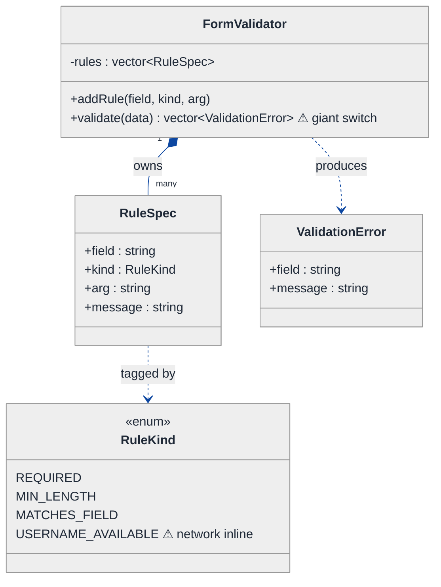
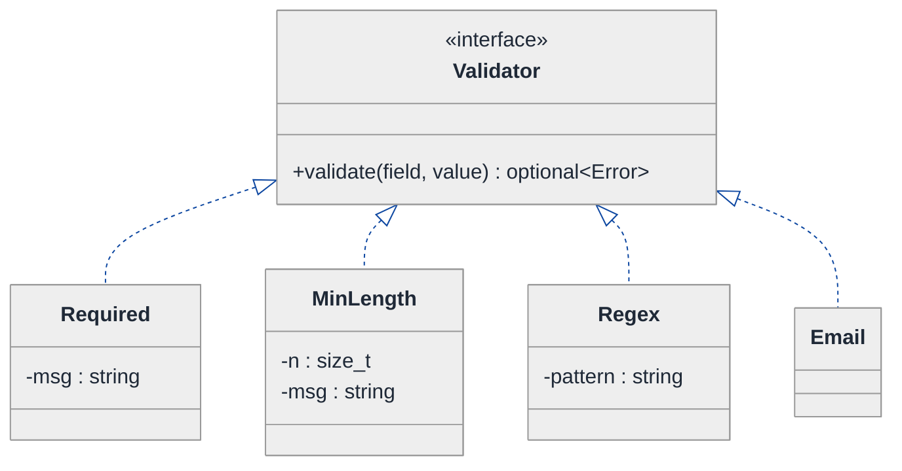
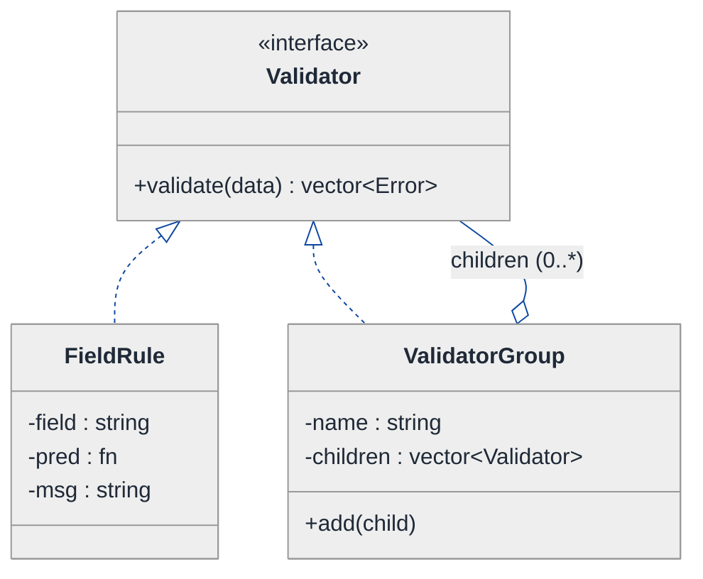
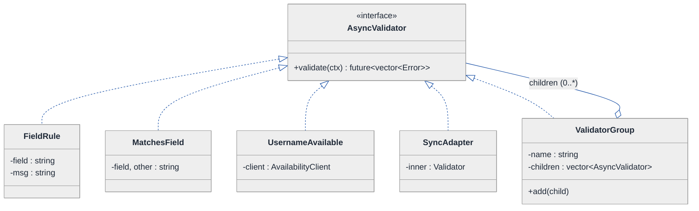
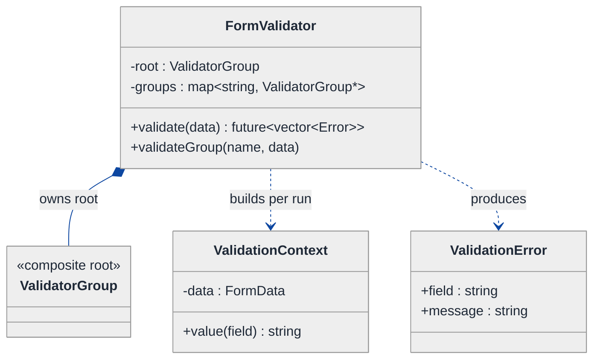
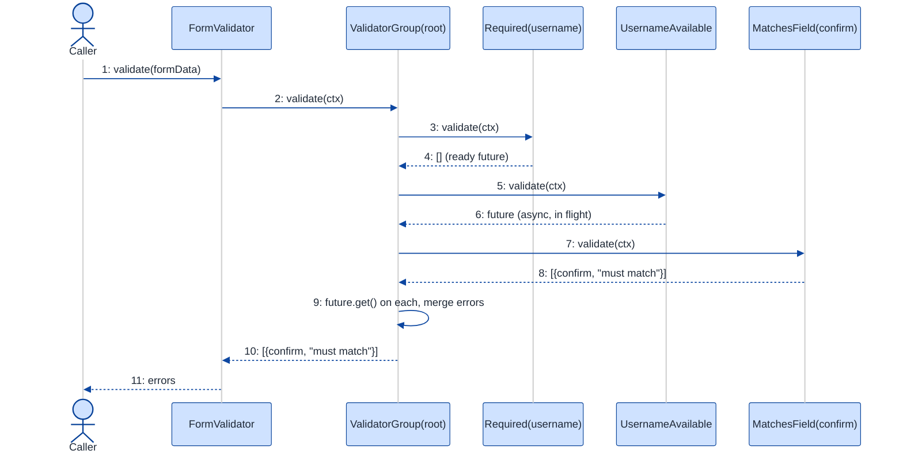

# Form Validation Library — LLD Walkthrough

> **Difficulty:** Medium · **Time:** ~30 min · **Pattern focus:** Strategy (each rule is a swappable algorithm) + Composite (rules compose into a validation tree)
>
> **Problem source(s):** representative of the "design a validation library / rule engine" rows in [`./EXTRACTED_QUESTIONS.md`](./EXTRACTED_QUESTIONS.md) (GID OOD5).
>
> **Diagrams:** inline mermaid (renders natively in GitHub / VS Code). No external image sources.

---

## How to use this file

Paced for a candidate seeing "design a validation library" for the first time. Reading time: ~30 minutes if you sketch each iteration by hand. **The lesson: a validator is not a pile of `if` statements — it is a TREE of small algorithms. Derive that by writing the naive design first, watching it break under four hypothetical requirements, then reaching for ONE pattern at a time: Strategy for "a rule is a swappable algorithm," Composite for "rules combine uniformly into form-level and group-level checks."**

**Map of this file (15 sections):**

1. Problem statement + clarifying questions
2. Plain-English restatement
3. Why this matters
4. Mental model
5. Try it yourself first
6. Entity & verb extraction
7. **Iteration 1: the naive design** — what we'd write first
8. **Where the naive design hurts** — four future requirements, one painful diff each
9. **Pivot 1: Strategy for a single rule** — the most painful axis first
10. **Pivot 2: Composite for field / form / group validation** — uniform tree
11. **Pivot 3: async + dependent fields** — futures and a validation context
12. Final UML class diagram
13. Skeleton code (C++)
14. Key flow — sequence diagram
15. Extensibility re-check + anti-patterns + how to think aloud + self-check

---

## 1. Problem statement + clarifying questions

**Prompt (typical phrasing):** "Design a form validation library supporting field-level and form-level validation, async validators (e.g., checking username availability), dependent field validation, custom error messages, and validation groups."

**Clarifying questions to ask BEFORE drawing anything:**

1. **Field-level vs form-level?** A field rule looks at one value (`email` is non-empty). A form rule looks at multiple (`password == confirmPassword`). Are both first-class, or is form-level just "run all field rules"?
2. **Async validators?** Username-availability hits a network. Do we need to await I/O inside validation, and should sync and async rules live behind the SAME interface?
3. **Dependent fields?** "Shipping address required only if `deliveryMethod == SHIP`." Does a rule get to read OTHER fields' values, not just its own?
4. **Custom error messages?** Per-rule default message, or caller-overridable per field? Internationalized (message keys) or literal strings?
5. **Validation groups?** Do we validate a SUBSET of rules at once — e.g., "step 1 of a wizard" runs only the `signup` group, "step 2" runs `payment`? Can a rule belong to multiple groups?
6. **Fail-fast or collect-all?** Stop at the first error, or gather every error so the UI can highlight all bad fields at once?
7. **Where does the data come from?** A flat `map<string, Value>`? A typed struct? Assume a string-keyed value bag for the library to stay schema-agnostic.

**Assumptions if interviewer dodges:** sync AND async rules behind one interface; rules can read sibling field values via a context; per-rule overridable messages (literal strings, i18n is out of scope); named groups; collect-all by default with an option to fail-fast; data is a `map<string, Value>`.

---

## 2. Plain-English restatement

We're building a reusable library that takes a bag of form data and a set of rules, runs the rules, and returns a list of human-readable errors. Some rules look at one field; some compare fields; some have to ask a server. The same machinery must run a full form or just a named slice of it (a "group"). The design must let a new rule type be added **without editing the engine that runs the rules**, and must treat a single rule, a field's rules, and a whole form's rules **uniformly** so the caller never special-cases them.

---

## 3. Why this matters

This question separates candidates who model "validation = a long `if` ladder" from those who see that **validation is a tree of composable predicates**. It is the cleanest interview vehicle for two of the most-confused GoF patterns: Strategy (a rule is one swappable algorithm) and Composite (a group of rules behaves like a single rule). The async wrinkle also probes whether you can keep one interface across sync and I/O-bound work — a real-world concern in every form library (React Hook Form, Formik, Vuelidate, <a href="https://docs.pydantic.dev/" target="_blank" rel="noopener noreferrer">Pydantic</a>) you'll ever touch.

---

## 4. Mental model

A form is a **document with fields**, and validation is a **rule-book you run against it**. The rule-book is naturally a tree: a leaf rule checks one thing; a branch rule (a field's rule-set, a group, the whole form) is "run my children and gather their verdicts." The key realization is that a branch behaves *exactly like* a leaf from the outside — both answer the same question: "any errors?"

```
Real-world sketch (NOT a UML diagram yet):

        FORM "signup"
        ├── field: username
        │     ├── Required
        │     ├── MinLength(3)
        │     └── UsernameAvailable   (async — calls server)
        ├── field: password
        │     ├── Required
        │     └── MinLength(8)
        ├── field: confirmPassword
        │     └── MatchesField(password)   (dependent — reads a sibling)
        └── group "step2" = { password, confirmPassword }   ← a SLICE of the tree

   Running the form  = walk the whole tree, collect errors.
   Running a group   = walk only the slice, collect errors.
   Both return the same thing: List<ValidationError>.
```

The KEY insight from this picture: **a leaf and a branch answer the same question.** That uniformity is what lets the caller treat "validate one field" and "validate the whole form" with identical code — which is exactly what the Composite pattern buys.

---

## 5. Try it yourself first

> **Predict before reading on:**
>
> 1. List 4 nouns you'd promote to a class. List 2 you'd leave as fields.
> 2. **If I told you a rule sometimes needs to read ANOTHER field's value (confirm-password), what would have to change about a rule's input — would `validate(value)` still be enough?**
> 3. An async username check returns later. How would you keep it behind the same interface as a synchronous `Required` check, so the engine doesn't branch on "is this rule async"?

---

## 6. Entity & verb extraction

> **Mini-refresher: noun → class, but not every noun.**
>
> Naive OOD promotes every noun to a class. Senior OOD promotes a noun only if it has both BEHAVIOR and STATE that need to live together. "Error message" is usually a field/string; "rule" becomes a class because it has validation BEHAVIOR.

**Nouns from the prompt:**

| Noun | Decision | Why |
|---|---|---|
| Form / FormData | Class (or value bag `map<string,Value>`) | Holds the field values being validated |
| Field | Mostly a string KEY into FormData | No behavior of its own; the rules carry behavior |
| Rule / Validator | Class (abstract) + concrete subclasses | The behavior unit — has a `validate` method |
| ValidationError | Small value class | Field name + message; no behavior |
| Validation group | Named subset of rules → a class | Behaves like a rule (run my members) |
| Error message | Field on a rule (`std::string`) | Overridable, but no behavior |
| Validation context | Class | Gives a rule read-access to sibling fields |

**Verbs (and the class they live on — naive answer, we'll re-examine):**

| Verb | Owner class (naive — revisited later) |
|---|---|
| validate(data) | FormValidator |
| isValid(value) | inline inside FormValidator's big method |
| addRule(field, kind) | FormValidator |
| checkAvailability(name) | FormValidator (calls network inline) |
| collectErrors() | FormValidator |

**We have NOT introduced any design patterns yet.** Pure nouns + verbs.

---

## 7. <a id="iter-1"></a>Iteration 1: the naive design

Let's write the simplest thing that could possibly work. No patterns — one engine class with a big method and an enum of rule kinds.



**Reader's tour (top to bottom; ~60 seconds).**

1. **`FormValidator` is the root and does everything.** It owns a `vector<RuleSpec>` and exposes `addRule(...)` plus one monster `validate(data)`.
2. **`RuleSpec` is a tagged struct.** Each rule is described by a `kind` enum, a string `arg` (e.g., `"8"` for min-length, `"password"` for matches-field), and an optional `message`. This is the classic "data-driven config + switch" shape — no polymorphism.
3. **`RuleKind` is an enum** with the warning markers. `USERNAME_AVAILABLE` is a network call buried inside the same switch as the cheap string checks.
4. **`validate()` is the trouble zone.** It loops over rules and `switch`es on `kind`. Every new rule type adds a `case`. Form-level rules (compare two fields) are awkward because each case only naturally sees one field. There is no notion of a "group."

Skeleton code for the naive design (C++):

```cpp
#include <map>
#include <string>
#include <vector>

enum class RuleKind { REQUIRED, MIN_LENGTH, MATCHES_FIELD, USERNAME_AVAILABLE };

struct RuleSpec {
    std::string field;
    RuleKind    kind;
    std::string arg;       // "8", or sibling field name
    std::string message;   // optional override
};

struct ValidationError { std::string field; std::string message; };

class FormValidator {
public:
    void addRule(std::string field, RuleKind kind, std::string arg = "", std::string msg = "") {
        rules_.push_back({std::move(field), kind, std::move(arg), std::move(msg)});
    }

    std::vector<ValidationError> validate(const std::map<std::string, std::string>& data) {
        std::vector<ValidationError> errors;
        for (const auto& r : rules_) {
            const std::string& v = data.count(r.field) ? data.at(r.field) : "";
            switch (r.kind) {                                   // ⚠ grows with every rule
                case RuleKind::REQUIRED:
                    if (v.empty()) errors.push_back({r.field, r.message.empty() ? "required" : r.message});
                    break;
                case RuleKind::MIN_LENGTH:
                    if (v.size() < std::stoul(r.arg)) errors.push_back({r.field, "too short"});
                    break;
                case RuleKind::MATCHES_FIELD: {                 // form-level: needs a sibling
                    const std::string& other = data.count(r.arg) ? data.at(r.arg) : "";
                    if (v != other) errors.push_back({r.field, "fields must match"});
                    break;
                }
                case RuleKind::USERNAME_AVAILABLE:              // ⚠ blocking network call inline
                    if (!serverSaysAvailable(v)) errors.push_back({r.field, "username taken"});
                    break;
            }
        }
        return errors;
    }
private:
    static bool serverSaysAvailable(const std::string&) { /* blocking HTTP */ return true; }
    std::vector<RuleSpec> rules_;
};
```

**This works.** It validates required fields, min-length, matching fields, and username availability. It has zero design patterns. So what's wrong with it?

---

## 8. <a id="naive-pain"></a>Where the naive design hurts

The interviewer slides four new requirements across the desk: "Walk me through what changes."

### Change A: "Add an `email format` rule and a `regex` rule"

In the naive design:
- Add `EMAIL` and `REGEX` to `RuleKind`.
- Add two `case` blocks inside `FormValidator::validate`.
- **Every new rule is surgery in the one method everyone shares.** That method already mixes cheap string checks with a network call — it only grows.

### Change B: "Validate only the 'step2' group of fields (wizard step)"

In the naive design:
- `RuleSpec` has no group tag. Add a `group` field, then filter inside `validate`.
- But now `validate(data)` needs a `group` parameter, and "validate the whole form" and "validate one group" become two code paths instead of one.
- **There is no object that represents 'a group of rules'; the engine fakes it with a filter — the caller can't pass a group around as a value.**

### Change C: "The username-availability check must be async (non-blocking)"

In the naive design:
- `serverSaysAvailable` blocks. To go async, `validate` would have to return a future — but then EVERY rule (even cheap `Required`) is forced through the async machinery, or you split into two methods.
- **Sync and async rules can't share the same call site because the rule type is an enum, not an object that can decide for itself how to produce its result.**

### Change D: "`confirmPassword` matches `password`; and `state` is required only if `country == US`"

In the naive design:
- `MATCHES_FIELD` already reaches into `data` by string key — fragile, and only works because `validate` happens to have the whole map in scope.
- Conditional-required ("required only if another field equals X") needs yet another enum + case that reads two other fields.
- **Dependent-field logic is smeared across special cases; there's no clean 'a rule may read sibling fields' contract.**

### The pattern of pain

| Change | Files/sites touched | Smell |
|---|---|---|
| A. New rule types | `RuleKind` enum + `validate` switch | "Every rule is a new case in one shared method." |
| B. Groups | `RuleSpec` + `validate` signature + caller | "No object represents a group; it's a filter, not a value." |
| C. Async | `validate` return type, all rules | "Enum can't let one rule be async and another sync." |
| D. Dependent fields | new cases reaching into the data map | "Cross-field logic is special-cased, not a contract." |

**Two axes of pain dominate:** (1) *the rule itself varies* — and the variation is an algorithm picked per rule; (2) *rules combine* — a field's rules, a group, a whole form are all "run a set of rules and merge errors," but the naive design has no single concept for "a thing that validates."

> **Pivot question:** "What pattern handles 'an algorithm that varies, swapped per rule'? What pattern handles 'a single rule and a group of rules treated the SAME way'?"
>
> The answers are Strategy and Composite. Let's introduce them one at a time, starting with the most painful axis: making a single rule its own object.

---

## 9. <a id="pivot-1"></a>Pivot 1: Strategy for a single rule

> **Mini-refresher: Strategy pattern.**
>
> Encapsulates an algorithm behind an interface so it can be swapped at runtime. The CALLER (here, the engine) decides which strategy to use; the strategy doesn't know about its peers.
>
> Quick example: a `Sorter` takes a `CompareStrategy*`. Pass `Ascending` or `Descending` — the sorter doesn't care. Here a `Validator` takes a value and returns "ok or an error"; the engine doesn't care whether it's `Required` or `Regex`.

**Why Strategy fits a rule.** A rule IS an algorithm (`given a value, return ok-or-error`). It varies (required, min-length, regex, email). The engine doesn't need to know which one — it just calls one method. That's textbook Strategy, and it deletes the giant switch.

**The refactor (just the single-rule slice):**

```cpp
#include <memory>
#include <optional>
#include <string>

struct ValidationError { std::string field; std::string message; };

// The Strategy interface: one rule = one algorithm over a value.
class Validator {
public:
    virtual ~Validator() = default;
    // Returns an error if the value fails; std::nullopt if it passes.
    virtual std::optional<ValidationError> validate(const std::string& field,
                                                    const std::string& value) const = 0;
};

class Required : public Validator {
public:
    explicit Required(std::string msg = "This field is required.") : msg_(std::move(msg)) {}
    std::optional<ValidationError> validate(const std::string& field,
                                            const std::string& value) const override {
        if (value.empty()) return ValidationError{field, msg_};
        return std::nullopt;
    }
private:
    std::string msg_;        // ← custom error message lives on the rule
};

class MinLength : public Validator {
public:
    MinLength(std::size_t n, std::string msg = "")
        : n_(n), msg_(msg.empty() ? "Too short." : std::move(msg)) {}
    std::optional<ValidationError> validate(const std::string& field,
                                            const std::string& value) const override {
        if (value.size() < n_) return ValidationError{field, msg_};
        return std::nullopt;
    }
private:
    std::size_t n_;
    std::string msg_;
};
// Regex, Email, ... elided — each is one new class, no switch edit.
```

**What changed — visualized.** Just the rule slice:



**Tour of the after-state.**

1. **The `<<interface>>` box at the top.** `Validator` has ONE pure-virtual method: `validate(field, value) → optional<Error>`. `nullopt` means "passed." Narrower and clearer than the old switch.
2. **Each rule is now its own class.** `Required`, `MinLength`, `Regex`, `Email` — siblings under the interface. The engine holds `Validator*`s and calls `validate`; it never knows the concrete type. The switch is GONE.
3. **Custom error messages fell out for free.** Each rule stores its own `msg_`, defaulted but constructor-overridable — exactly the "custom error messages" requirement, with no extra machinery.
4. **Change A from §8 now lands cleanly.** New rule type → one new class implementing `Validator`. No edit to any existing class. Open/closed.

> **Mini-refresher: Open/Closed Principle (the "O" in SOLID).**
>
> Software should be OPEN for extension but CLOSED for modification. Adding behavior should mean adding a new class, not editing an existing one. The naive switch violated it (every rule edited `validate`); the Strategy interface restores it (every rule is a new subclass).

**Pattern-discrimination cheatsheet — Strategy vs Template Method.**
- *Strategy:* whole algorithm in one swappable object, chosen by composition at runtime.
- *Template Method:* fixed skeleton in a base class, subclasses fill in hooks via inheritance.
- *Rule of thumb:* many variants you mix-and-match at runtime → Strategy. One fixed flow with 2-3 stable variations → Template Method.

We chose Strategy because rules are mixed and matched freely per field at runtime — there is no fixed skeleton to subclass.

---

## 10. <a id="pivot-2"></a>Pivot 2: Composite for field / form / group validation

Change B from §8 is still painful: a group has no representation, and "validate one field's rules" vs "validate the whole form" are different code paths. The variability here is NOT the algorithm — it's *structure*: we keep needing "run a SET of validators and merge their errors," and that set is sometimes a field, sometimes a group, sometimes the whole form.

> **Mini-refresher: Composite pattern.**
>
> Lets you treat a single object and a group of objects UNIFORMLY by giving both the same interface. A leaf does the real work; a composite holds children and delegates to them, then combines results. Recursion in the operation is the giveaway. Classic example: a file-system `Node` where `File` is a leaf and `Directory` is a composite — `size()` works the same on both.

**Why Composite fits.** If a "group of validators" implements the SAME `Validator` interface as a single rule, then a `FieldValidator` (all rules for `username`), a `Group` (a named subset), and the whole `Form` are all just `Validator`s that hold children and merge their children's errors. The caller calls `validate` and never asks "is this one rule or a thousand?"

There's a wrinkle: a single rule returns `optional<Error>` (zero-or-one error) but a composite returns MANY. We widen the interface so every node returns a `vector<Error>` — a leaf returns 0 or 1, a composite returns the concatenation of its children. One uniform return type for leaf and branch.

**The refactor (the composite slice):**

```cpp
#include <memory>
#include <string>
#include <vector>

using FormData = std::map<std::string, std::string>;

// Widened interface: every node returns 0..N errors.
class Validator {
public:
    virtual ~Validator() = default;
    virtual std::vector<ValidationError> validate(const FormData& data) const = 0;
};

// LEAF: a single rule bound to one field. Wraps a "value predicate".
class FieldRule : public Validator {
public:
    FieldRule(std::string field, std::function<bool(const std::string&)> pred, std::string msg)
        : field_(std::move(field)), pred_(std::move(pred)), msg_(std::move(msg)) {}
    std::vector<ValidationError> validate(const FormData& data) const override {
        auto it = data.find(field_);
        const std::string v = (it != data.end()) ? it->second : "";
        if (!pred_(v)) return {{field_, msg_}};
        return {};                                    // leaf: 0 or 1 error
    }
private:
    std::string field_;
    std::function<bool(const std::string&)> pred_;
    std::string msg_;
};

// COMPOSITE: holds children, merges their errors. Form, field-set, group all use this.
class ValidatorGroup : public Validator {
public:
    explicit ValidatorGroup(std::string name = "") : name_(std::move(name)) {}
    void add(std::unique_ptr<Validator> child) { children_.push_back(std::move(child)); }
    std::vector<ValidationError> validate(const FormData& data) const override {
        std::vector<ValidationError> all;
        for (const auto& c : children_) {             // recursion lives HERE
            auto errs = c->validate(data);
            all.insert(all.end(), errs.begin(), errs.end());
        }
        return all;                                   // composite: concatenation
    }
    const std::string& name() const { return name_; }
private:
    std::string name_;
    std::vector<std::unique_ptr<Validator>> children_;
};
```

**What changed — visualized.** The composite tree:



**Tour of the after-state.**

1. **One interface, two shapes.** `FieldRule` is the LEAF (does real work on one field). `ValidatorGroup` is the COMPOSITE (holds children, merges results). Both ARE `Validator`s — same `validate(data)` signature.
2. **The self-referential arrow is the whole point.** `ValidatorGroup o-- Validator` (aggregation) means a group's children are themselves `Validator`s — which can be leaves OR other groups. That recursion lets you nest: form → field-set → rule.
3. **A "group" is now a first-class value.** `ValidatorGroup{"step2"}` holding the password rules IS a validator you can pass around, store, and run alone. Change B from §8 collapses to "build a `ValidatorGroup` and call `validate` on it" — same code path as running the whole form (which is just the outermost group).
4. **Errors merge by concatenation in ONE place.** The collect-all behavior lives in `ValidatorGroup::validate`'s loop, not scattered. Fail-fast becomes a one-line option (return on first non-empty child).

> **Mini-refresher: aggregation vs composition (the UML diamond).**
>
> *Composition* (filled diamond ◆) = strong ownership, same lifetime: destroy the whole, the parts die. *Aggregation* (open diamond ◇) = "uses / holds" without dictating lifetime. Here a group holds `unique_ptr<Validator>` children — it actually OWNS them, so composition is defensible; the diagram uses the open diamond to emphasize that children are themselves interface-typed and swappable.

**Pattern-discrimination cheatsheet — Composite vs Decorator.**
- *Composite:* a tree of MANY children; the operation fans out and merges (one-to-many). "A group of rules."
- *Decorator:* a CHAIN wrapping exactly one inner object, adding behavior (one-to-one). "A rule, but also trim whitespace first."
- *Rule of thumb:* if a node holds a *collection* of peers → Composite. If a node wraps a *single* delegate to augment it → Decorator. Groups are Composite; "make this rule case-insensitive" would be Decorator.

---

## 11. <a id="pivot-3"></a>Pivot 3: async validators + dependent fields

Changes C and D from §8 remain. Both are about the rule's *inputs and outputs*, not its structure — so neither Strategy nor Composite alone solved them. We make two small, surgical moves.

### Dependent fields: pass a ValidationContext, not a bare value

Change D ("`confirmPassword` matches `password`", "`state` required if `country==US`") needs a rule to read SIBLING fields. The fix is already half-done: in Pivot 2 we changed the leaf to take the whole `FormData` instead of a single value. We formalize that as a small **ValidationContext** so a rule can read any field by key, cleanly.

```cpp
class ValidationContext {
public:
    explicit ValidationContext(const FormData& data) : data_(data) {}
    std::string value(const std::string& field) const {
        auto it = data_.find(field);
        return it != data_.end() ? it->second : "";
    }
private:
    const FormData& data_;
};

class MatchesField : public Validator {                  // a dependent (cross-field) rule
public:
    MatchesField(std::string field, std::string other, std::string msg)
        : field_(std::move(field)), other_(std::move(other)), msg_(std::move(msg)) {}
    std::vector<ValidationError> validate(const ValidationContext& ctx) const override {
        if (ctx.value(field_) != ctx.value(other_)) return {{field_, msg_}};
        return {};
    }
private:
    std::string field_, other_, msg_;
};
```

Dependent fields are now just "a rule that reads more than one key from the context." `RequiredIf(field, otherField, equalsValue)` follows the same shape — one new class, no engine edit. The "dependent field validation" requirement is satisfied by the context, not by special cases.

### Async validators: return a future behind the SAME interface

Change C wants username-availability to be non-blocking without forcing cheap rules through async machinery. The clean move is to make `validate` return a `std::future<vector<Error>>`. A synchronous rule resolves the future immediately (`std::async(launch::deferred ...)` or a ready promise); an async rule kicks off real I/O. The engine awaits all futures and merges — it never branches on "is this async."

```cpp
#include <future>

class AsyncValidator {                                   // the unified (async-capable) interface
public:
    virtual ~AsyncValidator() = default;
    virtual std::future<std::vector<ValidationError>> validate(const ValidationContext& ctx) const = 0;
};

// A sync rule wraps its result in a ready future — looks async to the engine, runs instantly.
class SyncAdapter : public AsyncValidator {
public:
    explicit SyncAdapter(std::unique_ptr<Validator> inner) : inner_(std::move(inner)) {}
    std::future<std::vector<ValidationError>> validate(const ValidationContext& ctx) const override {
        std::promise<std::vector<ValidationError>> p;
        p.set_value(inner_->validate(ctx));
        return p.get_future();                           // already-ready future
    }
private:
    std::unique_ptr<Validator> inner_;
};

class UsernameAvailable : public AsyncValidator {        // real async: hits the network
public:
    UsernameAvailable(std::string field, AvailabilityClient& client, std::string msg)
        : field_(std::move(field)), client_(client), msg_(std::move(msg)) {}
    std::future<std::vector<ValidationError>> validate(const ValidationContext& ctx) const override {
        std::string name = ctx.value(field_);
        return std::async(std::launch::async, [this, name]() -> std::vector<ValidationError> {
            return client_.isAvailable(name) ? std::vector<ValidationError>{}
                                             : std::vector<ValidationError>{{field_, msg_}};
        });
    }
private:
    std::string field_;
    AvailabilityClient& client_;
    std::string msg_;
};
```

> **Mini-refresher: the Adapter pattern (used here for SyncAdapter).**
>
> Adapter converts one interface into another the caller expects, without changing either side. `SyncAdapter` makes a plain synchronous `Validator` satisfy the `AsyncValidator` contract by wrapping its instant result in a ready future. The engine sees only `AsyncValidator`; sync and async coexist behind one type.

**The lesson.** Once a rule is an object (Pivot 1) and groups are objects (Pivot 2), making rules async or cross-field is a *change to the object's contract* — pass a richer input (context), return a richer output (future) — not a rewrite of the engine. **Good structure makes later requirements cheap.**

> **Mini-refresher: why we DON'T unify Validator and AsyncValidator into one template.**
>
> It's tempting to write `Validator<Result>` where `Result` is `vector<Error>` or `future<vector<Error>>`. Resist it — that's premature genericism. In a real codebase you'd pick ONE interface (almost always the async one, with `SyncAdapter` bridging the cheap rules) so the engine has a single call site. The diagram in §12 shows the async interface as the canonical one.

---

## 12. <a id="fig-class-diagram"></a>Final class diagram

One big diagram becomes a wall of boxes. Here are **two focused sub-views**; the structural insight ties them together.

### 12.1 The Composite spine — leaves and branches share one interface



**Tour of 12.1.**

1. **Every node is an `AsyncValidator`.** Leaves (`FieldRule`, `MatchesField`, `UsernameAvailable`), the bridge (`SyncAdapter`), and the branch (`ValidatorGroup`) all implement the same `validate(ctx) → future<vector<Error>>`.
2. **`ValidatorGroup` points back at the interface.** That self-reference is the Composite recursion: a group's children may be leaves or nested groups. Form, field-set, and named group are all just groups at different depths.
3. **`SyncAdapter` is the async bridge.** Cheap rules stay synchronous internally but present as async — one engine call site, no `if (async)`.
4. **The structural insight.** Strategy (each leaf is one swappable algorithm) and Composite (groups treated like leaves) are the SAME interface viewed two ways: Strategy is "what a leaf does," Composite is "how leaves and branches share a type."

### 12.2 The orchestration — what the engine and caller hold



**Tour of 12.2.**

1. **`FormValidator` is now a thin orchestrator.** It owns the root `ValidatorGroup` (filled diamond — composition) and a name→group lookup. Its `validate(data)` just builds a `ValidationContext` and calls the root; `validateGroup(name, data)` calls one named group. Same code path, different node — the giant switch is gone for good.
2. **`ValidationContext` is built per run.** It wraps the incoming `FormData` so any rule can read any field — the dependent-field contract from Pivot 3.
3. **`ValidationError` is a pure value.** Field + message, no behavior. Custom messages already live on each leaf rule.
4. **The big lesson.** The engine shrank from "owns every rule's logic" to "owns a tree and runs it." All variation lives in the `AsyncValidator` hierarchy; orchestration lives here.

### Structural insight (ties 12.1 + 12.2 together)

| Concern | Pattern used | Why |
|---|---|---|
| **A single rule** (required, regex, email) | Strategy — one algorithm per leaf | Engine swaps rules without knowing their type |
| **Field / form / group** | Composite — branch shares the leaf interface | "Validate one field" and "validate the form" are the same call |
| **Dependent fields** | ValidationContext input (not a new pattern) | A rule reads siblings via the context, cleanly |
| **Async (username check)** | Adapter + futures behind one interface | Sync and async rules share one engine call site |
| **Custom messages** | Field on each rule | Defaulted, constructor-overridable; zero machinery |

The big lesson: **a validator library is a tree of small Strategies.** Inheritance is used only to share the `AsyncValidator` interface; every "this part varies" axis became composition (a new leaf class) or structure (nest under a group). *Inheritance for the shared contract, composition for the variation.*

---

## 13. Skeleton code (C++)

> Show the SHAPES, not the full impl. ~120 lines.

```cpp
#include <functional>
#include <future>
#include <map>
#include <memory>
#include <optional>
#include <string>
#include <vector>

// ── Value types ─────────────────────────────────────────────────────
using FormData = std::map<std::string, std::string>;
struct ValidationError { std::string field; std::string message; };

class ValidationContext {
public:
    explicit ValidationContext(const FormData& data) : data_(data) {}
    std::string value(const std::string& field) const {
        auto it = data_.find(field);
        return it != data_.end() ? it->second : "";
    }
private:
    const FormData& data_;
};

// ── The unified Strategy + Composite interface ──────────────────────
class AsyncValidator {
public:
    virtual ~AsyncValidator() = default;
    virtual std::future<std::vector<ValidationError>> validate(const ValidationContext& ctx) const = 0;
};

// Helper to wrap an immediate result in a ready future.
inline std::future<std::vector<ValidationError>> ready(std::vector<ValidationError> v) {
    std::promise<std::vector<ValidationError>> p;
    p.set_value(std::move(v));
    return p.get_future();
}

// ── LEAVES (Strategy implementations) ───────────────────────────────
class Required : public AsyncValidator {
public:
    Required(std::string field, std::string msg = "This field is required.")
        : field_(std::move(field)), msg_(std::move(msg)) {}
    std::future<std::vector<ValidationError>> validate(const ValidationContext& ctx) const override {
        if (ctx.value(field_).empty()) return ready({{field_, msg_}});
        return ready({});
    }
private:
    std::string field_, msg_;
};

class MatchesField : public AsyncValidator {          // dependent / cross-field rule
public:
    MatchesField(std::string field, std::string other, std::string msg)
        : field_(std::move(field)), other_(std::move(other)), msg_(std::move(msg)) {}
    std::future<std::vector<ValidationError>> validate(const ValidationContext& ctx) const override {
        if (ctx.value(field_) != ctx.value(other_)) return ready({{field_, msg_}});
        return ready({});
    }
private:
    std::string field_, other_, msg_;
};

class AvailabilityClient { public: virtual bool isAvailable(const std::string&) = 0; /* elided */ };

class UsernameAvailable : public AsyncValidator {     // real async rule
public:
    UsernameAvailable(std::string field, AvailabilityClient& client, std::string msg)
        : field_(std::move(field)), client_(client), msg_(std::move(msg)) {}
    std::future<std::vector<ValidationError>> validate(const ValidationContext& ctx) const override {
        std::string name = ctx.value(field_);
        return std::async(std::launch::async, [this, name]() -> std::vector<ValidationError> {
            return client_.isAvailable(name) ? std::vector<ValidationError>{}
                                             : std::vector<ValidationError>{{field_, msg_}};
        });
    }
private:
    std::string field_; AvailabilityClient& client_; std::string msg_;
};
// MinLength, Regex, Email, RequiredIf ... elided — each is one new leaf class.

// ── COMPOSITE (form / field-set / group) ────────────────────────────
class ValidatorGroup : public AsyncValidator {
public:
    explicit ValidatorGroup(std::string name = "") : name_(std::move(name)) {}
    void add(std::unique_ptr<AsyncValidator> child) { children_.push_back(std::move(child)); }

    std::future<std::vector<ValidationError>> validate(const ValidationContext& ctx) const override {
        // Kick off every child (async ones run concurrently), then join + merge.
        std::vector<std::future<std::vector<ValidationError>>> futures;
        for (const auto& c : children_) futures.push_back(c->validate(ctx));
        std::vector<ValidationError> all;
        for (auto& f : futures) {
            auto errs = f.get();                       // await each
            all.insert(all.end(), errs.begin(), errs.end());
        }
        return ready(std::move(all));                  // composite: concatenation
    }
    const std::string& name() const { return name_; }
private:
    std::string name_;
    std::vector<std::unique_ptr<AsyncValidator>> children_;
};

// ── Engine (thin orchestrator) ──────────────────────────────────────
class FormValidator {
public:
    FormValidator() : root_(std::make_unique<ValidatorGroup>("__root__")) {}

    void addRule(std::unique_ptr<AsyncValidator> rule) { root_->add(std::move(rule)); }
    void registerGroup(const std::string& name, std::unique_ptr<ValidatorGroup> g) {
        groups_[name] = g.get();
        root_->add(std::move(g));                      // group is also part of the whole-form run
    }

    std::vector<ValidationError> validate(const FormData& data) const {
        ValidationContext ctx(data);
        return root_->validate(ctx).get();
    }
    std::vector<ValidationError> validateGroup(const std::string& name, const FormData& data) const {
        ValidationContext ctx(data);
        auto it = groups_.find(name);
        return it != groups_.end() ? it->second->validate(ctx).get()
                                   : std::vector<ValidationError>{};
    }
private:
    std::unique_ptr<ValidatorGroup>               root_;
    std::map<std::string, ValidatorGroup*>        groups_;   // non-owning views into root_
};
```

---

## 14. <a id="fig-sequence"></a>Key flow — sequence diagram

This is the moment of truth — read across the lanes to see how Strategy and Composite COOPERATE, and what they hide from the caller.



**Tour of the flow. Read it slowly — this is where the patterns cooperate.**

1. **Caller calls `FormValidator::validate(formData)`.** The caller never names a rule. It hands over data and gets back errors. That's the Composite payoff — the caller talks to one node.
2. **FormValidator builds a `ValidationContext` and delegates to the root group.** The engine does NO rule logic; it just kicks off the tree.
3. **Root group fans out to its children (Composite recursion).** It calls `validate(ctx)` on each child identically — `Required`, `UsernameAvailable`, `MatchesField`. **It does not know or care which is sync, which is async, which reads siblings.** That uniformity is the Strategy + Composite dividend.
4. **Each leaf does its own thing (Strategy).** `Required` returns a ready future (instant). `UsernameAvailable` returns a future still in flight (network). `MatchesField` reads `confirm` AND `password` from the context and returns an error. Three completely different algorithms, one call shape.
5. **The group joins all futures and concatenates errors (step 9).** Collect-all behavior lives in exactly one place. Async rules ran concurrently; the group simply awaits each.
6. **Errors bubble back to the caller.** No `switch`, no `if (async)`, no `if (status==X)` anywhere on the path.

### The branching that's NOT shown — and why it matters

You don't see `switch (ruleKind)` anywhere. You don't see `if (rule.isAsync())`. The naive design had both. Here, **the type hierarchy IS the dispatch**: calling `validate` on a `Validator*` lands in the right concrete method by polymorphism, and `SyncAdapter`/ready-futures erase the sync-vs-async distinction at the call site. The engine is blind to rule variety — exactly as it should be.

---

## 15. Extensibility re-check + anti-patterns + how to think aloud + self-check

### Extensibility re-check

Revisit the four changes from [§8](#naive-pain). For each, name what changes.

| Change | Naive design impact | Final design impact |
|---|---|---|
| A. New rule types (email, regex) | new enum + `case` in shared `validate` | New `AsyncValidator` leaf class. Done. |
| B. Validate one group | new `RuleSpec.group` + filtered second code path | `ValidatorGroup` is a value; call `validateGroup(name)`. Same path. Done. |
| C. Async username check | forces all rules async, or splits the method | New async leaf; `SyncAdapter` keeps cheap rules instant. Done. |
| D. Dependent / conditional fields | special cases reaching into the data map | New leaf reading siblings via `ValidationContext`. Done. |

Every change is one new leaf class (or one new group value). That's the open/closed principle in practice. If a future requirement makes you edit `FormValidator` AND a rule AND the context together — go back to §6; a variability point was missed.

### Common confusion + traps

1. **"Should a group be a different interface from a rule?"** No — that's the whole point of Composite. If the group doesn't share `validate`, the caller has to branch on "rule or group," and you lose uniformity.
2. **"Why return `optional<Error>` from a leaf but `vector<Error>` from a group?"** Don't — unify on `vector<Error>` (a leaf returns 0 or 1). Mismatched return types break the Composite uniformity.
3. **"Why not just make every rule async even if it's cheap?"** You can, via `SyncAdapter`/ready futures — and that IS the recommendation for one call site. The mistake is having TWO interfaces the engine must branch between.
4. **"Where do custom messages live?"** On the rule, defaulted and overridable. Not on the engine, not in a global table (unless you add i18n message keys later — that's a new leaf-side concern, still not an engine edit).
5. **"Can a rule belong to two groups?"** Yes — share a `shared_ptr<AsyncValidator>` across groups if you need genuine sharing; otherwise build two cheap leaf instances. Don't force a single ownership tree if rules are meant to be reused.

### Anti-patterns

- **"God engine"** — `FormValidator::validate` holding every rule's logic in one switch. Pull each rule into its own Strategy class.
- **"Tag-driven if/else"** — `if (kind == REQUIRED) ... else if (kind == REGEX)`. Use the `Validator` interface; let polymorphism dispatch.
- **"Two interfaces for sync vs async"** — forces the engine to branch. Bridge with an adapter; one interface.
- **"Stringly-typed cross-field hacks"** — reaching into a raw map inside a special case. Use `ValidationContext` as the contract.
- **"Inheritance chain for rule variants"** — `Required → RequiredTrimmed → RequiredTrimmedCaseInsensitive`. Those are Decorators, not subclasses; or just separate leaves.
- **"Anemic group"** — a group that's a plain `vector` the engine loops over externally. Make the group a `Validator` that owns its own recursion.

### How to think aloud

> "Validation library. Let me clarify scope. [Asks the §1 questions.] Got it: sync + async behind one interface, cross-field reads, named groups, custom messages, collect-all.
>
> Nouns: Form data, Rule, Error, Group, Context. Rule has behavior → a class. Group behaves like a rule → also a class. Error is a value.
>
> I'll write the NAIVE design first — one `FormValidator` with a `RuleKind` enum and a giant `validate` switch. It works.
>
> Now stress-test it. New rule type → new case. Groups → no object represents one, just a filter. Async → enum can't make one rule async. Dependent fields → special cases reaching into the map. Two axes of pain: the rule varies (algorithm), and rules combine (structure).
>
> Pivot 1: a rule becomes a `Validator` Strategy interface — `Required`, `MinLength`, `Regex` are subclasses. Switch gone; custom messages live on each rule. Open/closed.
>
> Pivot 2: a group becomes a `ValidatorGroup` that ALSO implements `Validator` — Composite. Form, field-set, group all share `validate(data)`; errors merge by concatenation in one place. Validating a group is the same call as validating the form.
>
> Pivot 3: dependent fields → pass a `ValidationContext` so a rule can read siblings. Async → `validate` returns a `future`; a `SyncAdapter` wraps cheap rules in ready futures so the engine has one call site.
>
> Final: `FormValidator` owns a tree of `AsyncValidator`s. Every future requirement is one new leaf class. Strategy for the leaves, Composite for the branches — that's the design."

### Self-check

> **Self-check — the question to ask next time.**
>
> When you see "design a library that runs a bunch of rules / checks / handlers," before reaching for an enum + switch, ask:
>
> > **"Is each rule a swappable algorithm (Strategy), and do single rules and GROUPS of rules need to be treated the same way (Composite)?"**
>
> Algorithm that varies → Strategy. Single-and-group treated uniformly → Composite. Validation libraries are almost always both: a tree of small Strategies.

---

## Cross-references

- **Parent topic manifest:** [`./EXTRACTED_QUESTIONS.md`](./EXTRACTED_QUESTIONS.md)
- **Vertical overview:** [`../../LEARNING.md`](../../LEARNING.md)
- **Template:** [`../../TEMPLATE-v2.md`](../../TEMPLATE-v2.md)
- **Canonical exemplar:** [`./Parking_Lot.md`](./Parking_Lot.md)
- **Related LLD walkthroughs (future):**
  - Strategy Pattern deep-dive (in `../Strategy_Pattern/`)
  - Composite-heavy designs (file system, org chart) in `../Object_Oriented_Design/`
  - Rule engine variants (in `../Rule_Engine/`)
