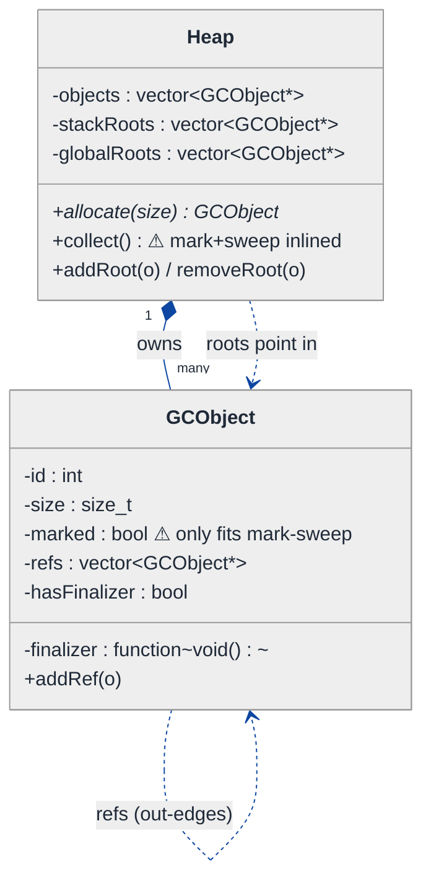
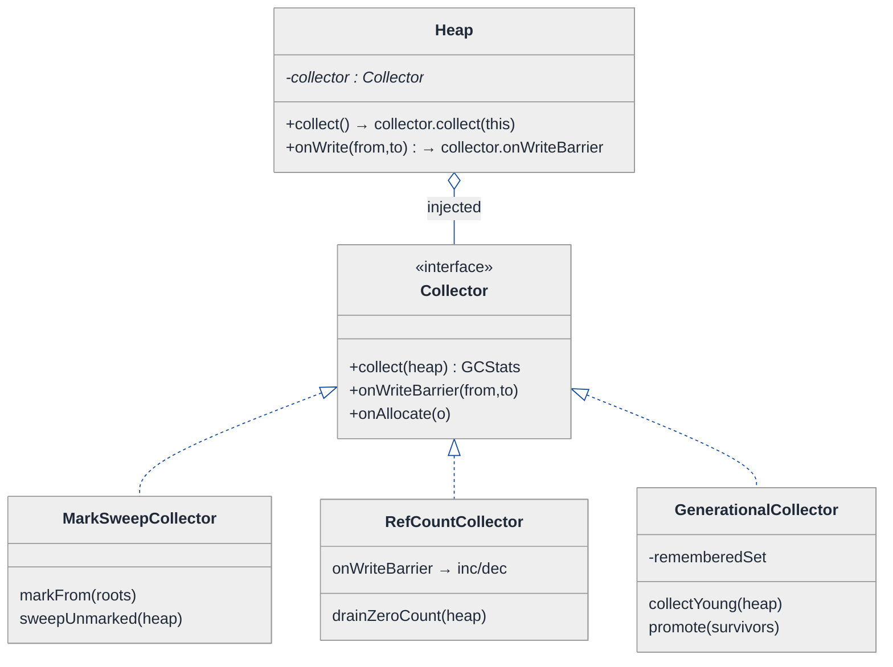
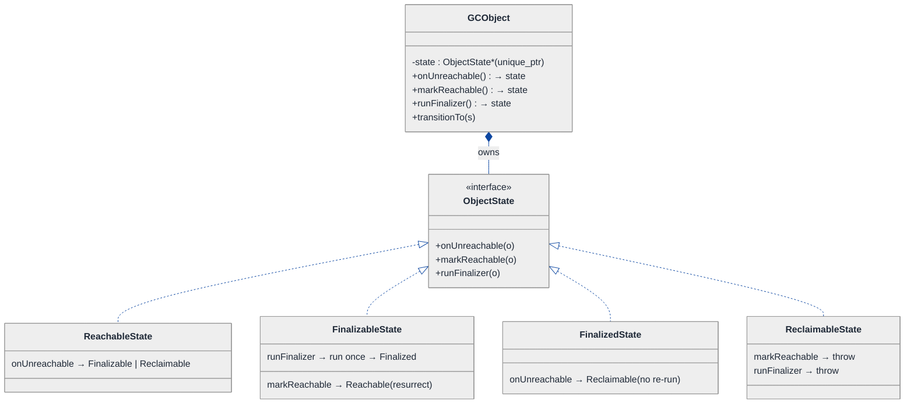
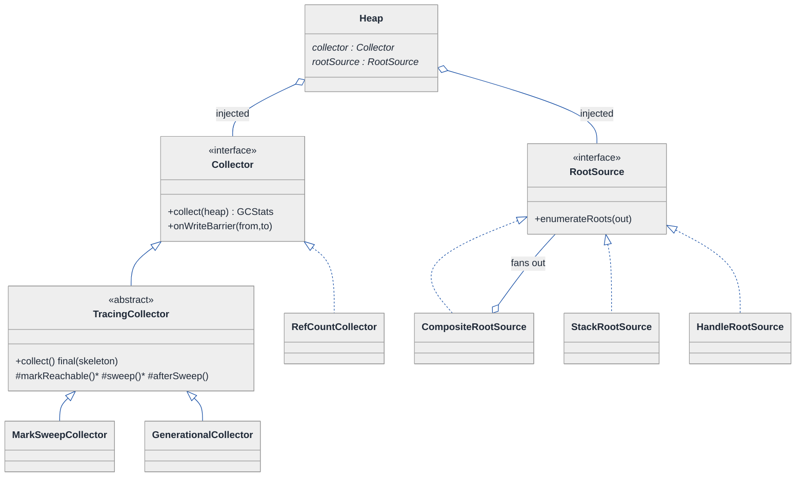
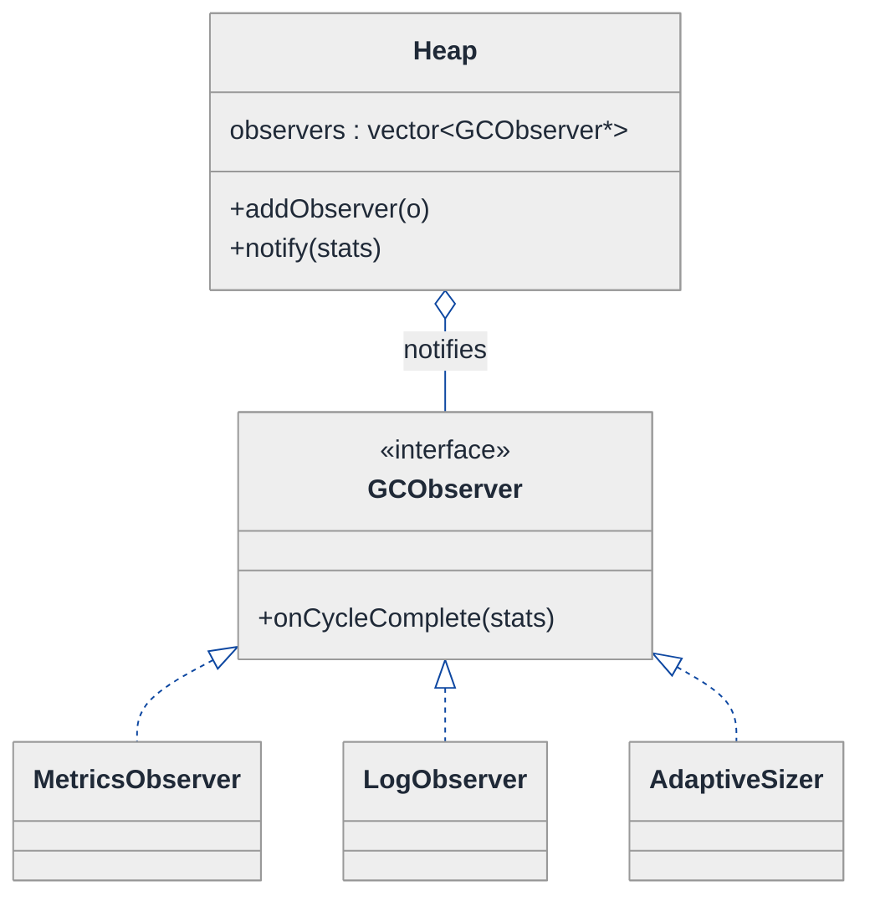
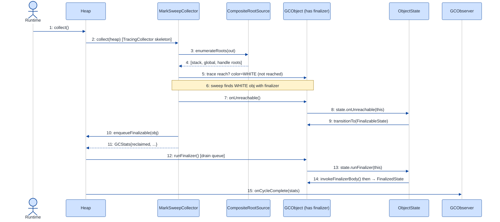

# Garbage Collector — LLD Walkthrough

> **Difficulty:** Hard · **Time:** ~45 min · **Pattern focus:** Strategy (mark-sweep / reference-counting / generational) + State (object lifecycle incl. finalization) + a few more
>
> **Problem source(s):** GID OOD9 in [`./EXTRACTED_QUESTIONS.md`](./EXTRACTED_QUESTIONS.md). A senior-bar Object-Oriented Design question — it looks like systems programming but is really a pattern-discrimination test.
>
> **Diagrams:** inline mermaid (renders natively in GitHub / VS Code). Optional editable freehand sources are sibling `.excalidraw` files.

---

## How to use this file

Paced for a candidate seeing "design a garbage collector" for the first time. Reading time: ~45 minutes if you sketch each iteration by hand. **The lesson: the words "support mark-and-sweep, reference counting, AND generational collection" are screaming a variability axis at you — they are three interchangeable ALGORITHMS for the same job. Don't model them as three different collectors with copy-pasted plumbing. DERIVE the Strategy boundary by building the naive single-algorithm design first, watching it fracture when the second and third algorithm arrive, and reaching for ONE pattern per painful axis.**

We are designing the *object model and control flow* of a collector — the OOD shapes — not a production allocator. No assembly, no write barriers in inline asm. C++17 skeletons that show the SHAPES.

**Map of this file (15 sections):**

1. Problem statement + clarifying questions
2. Plain-English restatement
3. Why this matters
4. Mental model
5. Try it yourself first
6. Entity & verb extraction
7. **Iteration 1: the naive design** — a hardcoded mark-and-sweep collector
8. **Where the naive design hurts** — five future requirements, one painful diff each
9. **Pivot 1: Strategy for the collection algorithm** — the most painful axis first
10. **Pivot 2: State for the object lifecycle (incl. finalization)** — internal transitions, not external swaps
11. **Pivot 3+: Strategy for root enumeration; Template Method for the trace skeleton; Observer for GC notifications**
12. Final UML class diagram (three sub-views)
13. Skeleton code (C++)
14. Key flow — sequence diagram
15. Extensibility re-check + anti-patterns + how to think aloud + self-check

---

## 1. Problem statement + clarifying questions

**Prompt (typical phrasing):** "Design a garbage collector for a managed language runtime. Support mark-and-sweep, reference counting, generational collection, and finalizers. Handle root-set identification and object graph traversal."

**Clarifying questions to ask BEFORE drawing anything:**

1. **One algorithm at a time, or pluggable?** The prompt names three algorithms — do we pick one, or must the runtime swap collectors via config (and possibly at startup vs. at runtime)? *(This is the whole game — ask it first.)*
2. **What is the heap's unit?** Are we managing opaque `GCObject` nodes with a list of outgoing references, or do we need to walk real C++ field layouts? (Assume managed `GCObject`s that expose their out-edges — we are the runtime, not the user code.)
3. **Root set sources?** Stack frames only, or also global/static roots, CPU registers, JNI-style handles, thread locals? Does the mutator (the running program) pause during collection (stop-the-world) or is it concurrent?
4. **Finalizer semantics?** Run-once or resurrectable? Run on a dedicated finalizer thread or inline during sweep? What ordering guarantees (none, like the JVM)? Can a finalizer resurrect its object by storing `this` into a root?
5. **Generational details?** How many generations (typically young + old)? What is the promotion threshold (survived-N-collections)? Do we need a remembered set / write barrier for old→young pointers?
6. **Cycle handling for reference counting?** Plain refcounting leaks cycles. Do we need a backup cycle collector (trial deletion), or is "document the limitation" acceptable?
7. **Metrics / observability?** Must we emit pause times, bytes reclaimed, promotion counts to a profiler or logger?

**Assumptions if the interviewer dodges:** pluggable collector chosen at runtime startup; opaque `GCObject` nodes that report their out-edges; roots come from multiple pluggable sources (stack, globals, handles); stop-the-world for tracing collectors; run-once finalizers on a dedicated queue, drained after sweep, with resurrection allowed; two generations (young/old) with a survival-count promotion threshold; refcounting documents the cycle limitation and optionally composes a trial-deletion backup; metrics emitted via observers.

---

## 2. Plain-English restatement

We're building the part of a managed runtime that decides which heap objects are still reachable and reclaims the rest. "Reachable" means: starting from a set of **roots** (live stack slots, globals, handles), can you walk the object graph and arrive at the object? Anything you can't reach is garbage. The catch: there are **three completely different algorithms** for answering "what's garbage" — trace-from-roots (mark-and-sweep), count-incoming-references (reference counting), and bucket-objects-by-age-and-collect-the-young-bucket-often (generational). On top of that, some objects register a **finalizer** — a callback that must run before the object's memory is reclaimed, and which can even resurrect the object. The design must let us swap the collection algorithm without rewriting root scanning, graph traversal, finalization, or metrics — and add a fourth algorithm later as ONE new class.

---

## 3. Why this matters

This is a deceptively-hard OOD question because the surface ("write a GC") tempts candidates into systems trivia (free lists, bump pointers, card tables) and away from the actual interview signal: **recognizing that three named algorithms for one job is the canonical Strategy setup, and that finalization is a lifecycle the OBJECT moves through, not an algorithm the caller picks.** Get those two boundaries right and the rest of the design — root sources, the trace skeleton, metrics — falls out as smaller, recognizable patterns. Candidates who model "MarkSweepGC", "RefCountGC", and "GenerationalGC" as three sibling classes with duplicated root-scanning and finalization plumbing reveal that they reach for inheritance reflexively instead of isolating the one axis that actually varies.

---

## 4. Mental model

A garbage collector is a **reachability oracle** bolted onto a **heap of nodes**. Picture the heap as a directed graph: nodes are objects, edges are references. Some nodes are pinned to the outside world by **roots** (the program's live variables). The collector's whole job is "color the graph": decide live vs. dead, then reclaim dead — but *how* it colors is the swappable part.

```
Real-world sketch (NOT a UML diagram yet):

   ROOTS (outside the heap)                    THE HEAP (object graph)
   ┌───────────────┐                     ┌──────────────────────────────────┐
   │ stack slot ───┼────────────────────►│  A ──► B ──► C        F ──► G     │
   │ global  R ────┼────────────────────►│  │            ▲       (unreachable
   │ handle  H ────┼──────────┐          │  ▼            │        — garbage)  │
   └───────────────┘          └─────────►│  D ──► E ─────┘                    │
                                         └──────────────────────────────────┘
        the collector walks ───►  marks A,B,C,D,E live  ───►  sweeps F,G
        BUT the WALK ITSELF is the swappable algorithm:
          • mark-sweep:   trace from roots, mark, then sweep unmarked
          • refcount:     each node counts incoming edges; 0 ⇒ dead now
          • generational: trace only the "young" sub-heap, promote survivors
```

The KEY insight from this picture: **root identification, graph traversal, finalization, and reclamation are stable mechanisms; the *policy* for deciding live-vs-dead is the variable.** Mechanism vs. policy is the separation we'll bake into the design — exactly the inventory/orchestration/policy split a parking lot has, in different clothes.

---

## 5. Try it yourself first

> **Predict before reading on:**
>
> 1. List 5 nouns you'd promote to a class. List 3 nouns you'd leave as fields or library types.
> 2. **If I told you the runtime must ship with all three collectors and let ops pick one with a `--gc=` flag, what would change about how you write the `collect()` method?**
> 3. A finalizer can store `this` into a global, resurrecting the object after we decided it was dead. Where in your design does that "wait, it's alive again" decision live — in the collector loop, or somewhere else?

---

## 6. Entity & verb extraction

> **Mini-refresher: noun → class, but not every noun.**
>
> Naive OOD promotes every noun to a class. Senior OOD promotes a noun only if it has both BEHAVIOR and STATE that need to live together. "Mark bit" stays a field; "Collector" becomes a class because it has an algorithm; "GCObject" becomes a class because it has lifecycle state AND out-edges.

**Nouns from the prompt:**

| Noun | Decision | Why |
|---|---|---|
| Heap | Class (owns all objects) | Allocates, holds the master object list, drives a collection cycle |
| GCObject | Class | Has out-edges, a color/mark, a refcount, an age, lifecycle state |
| Collector | Class (abstract) — the variable | "Decide live-vs-dead" is the algorithm that varies |
| RootSet / RootSource | Class (abstract) | Stack, globals, handles each enumerate roots differently |
| Finalizer | Field on GCObject (a callback) + a queue | Behavior is a `std::function`; the QUEUE is the class |
| Reference / edge | Field on GCObject (`vector<GCObject*>`) | No behavior of its own |
| Mark bit / color | Field on GCObject (`enum class Color`) | Tri-color state, not a class |
| Generation / age | Field on GCObject (`int age`) + a `Generation` bucket | Age is a field; the bucket is structure |
| Refcount | Field on GCObject (`int`) | A counter |
| GC cycle / pause | Event reported to observers | No state of its own; it's an occurrence |

**Verbs (and the class they live on — naive answer; we'll re-examine):**

| Verb | Owner class (naive — re-examined later) |
|---|---|
| allocate(size) | Heap |
| collect() | Heap, delegating to Collector |
| markFrom(roots) | Collector |
| sweep() | Collector |
| enumerateRoots() | RootSource |
| addRef() / release() | GCObject (refcount path) |
| runFinalizer() | GCObject / FinalizerQueue |
| promote() | GCObject (generational path) |
| onCycleComplete(stats) | observers |

**We have NOT introduced any design patterns yet.** Pure nouns + verbs.

---

## 7. <a id="iter-1"></a>Iteration 1: the naive design

Let's write the simplest thing that could possibly work: a heap with a hardcoded mark-and-sweep collector. No design patterns — just classes with methods, an enum for color, a `bool` for marking, and the algorithm inlined into `Heap::collect()`.



**Reader's tour (read top to bottom; ~60 seconds).**

1. **At the top — `Heap` is the root coordinator.** It holds the master `objects` list (everything ever allocated), two hardcoded root vectors (`stackRoots`, `globalRoots`), and exposes `allocate`, `collect`, and root mutation. Notice: NO injected collector, NO injected root sources. Every decision lives inside `Heap`.

2. **The composition spine.** The filled diamond marks composition — `Heap` OWNS every `GCObject`. If the heap dies, every object dies with it. That ownership is genuine and won't change; it's not the smell.

3. **`GCObject` — the trouble zone.** Look at the warning markers (⚠):
   - `marked : bool` — a single mark bit. It encodes EXACTLY the state mark-sweep needs and nothing else. Reference counting needs an `int refcount`; generational needs an `int age`. The naive design has baked the mark-sweep representation into the object.
   - `refs` is the out-edge list (the graph). Fine.
   - `finalizer` + `hasFinalizer` — finalization is jammed in as two raw fields with no lifecycle around them. Who runs it? When? Can the object come back? Unanswered.

4. **Roots are two hardcoded vectors on Heap.** `stackRoots` and `globalRoots`. Adding "handle roots" or "thread-local roots" means a new field and new scan code inside `collect()`.

5. **`collect()` is where it all goes wrong.** The mark phase (BFS/DFS from roots, set `marked = true`) and the sweep phase (delete everything with `marked == false`, reset the rest) are both inlined here. The algorithm is not a thing you can name, store, or swap — it's procedural code welded into one method.

**What's deliberately missing.** No `Collector` interface. No `RootSource`. No `ObjectState` / finalization lifecycle. No metrics hook. The naive design doesn't even *acknowledge* that the collection algorithm is an axis of variation — it bakes mark-and-sweep into `collect()` and the mark bit into `GCObject`. That's what we'll expose, and fix.

Skeleton code for the naive design (C++):

```cpp
#include <cstddef>
#include <functional>
#include <queue>
#include <unordered_set>
#include <vector>

class GCObject {
public:
    explicit GCObject(int id, std::size_t size) : id_(id), size_(size) {}
    void addRef(GCObject* o) { refs_.push_back(o); }

    int                       id_;
    std::size_t               size_;
    bool                      marked_ = false;          // ⚠ fits ONLY mark-sweep
    std::vector<GCObject*>    refs_;                     // out-edges
    std::function<void()>     finalizer_;                // ⚠ no lifecycle around it
    bool                      hasFinalizer_ = false;
};

class Heap {
public:
    GCObject* allocate(std::size_t size) {
        auto* o = new GCObject(nextId_++, size);
        objects_.push_back(o);
        return o;
    }
    void addRoot(GCObject* o)    { stackRoots_.push_back(o); }

    void collect() {                                     // ⚠ algorithm inlined here
        // ---- MARK phase: trace from roots ----
        std::queue<GCObject*> work;
        for (auto* r : stackRoots_)  work.push(r);
        for (auto* r : globalRoots_) work.push(r);
        while (!work.empty()) {
            GCObject* o = work.front(); work.pop();
            if (o->marked_) continue;
            o->marked_ = true;
            for (auto* nbr : o->refs_) work.push(nbr);
        }
        // ---- SWEEP phase: reclaim the unmarked ----
        std::vector<GCObject*> survivors;
        for (auto* o : objects_) {
            if (o->marked_) {
                o->marked_ = false;                      // reset for next cycle
                survivors.push_back(o);
            } else {
                if (o->hasFinalizer_) o->finalizer_();   // ⚠ run inline, no resurrection check
                delete o;
            }
        }
        objects_.swap(survivors);
    }

private:
    int                       nextId_ = 0;
    std::vector<GCObject*>    objects_;                  // owns everything
    std::vector<GCObject*>    stackRoots_;
    std::vector<GCObject*>    globalRoots_;
};
```

**This works.** It has zero design patterns. We can allocate, root, trace, sweep, and fire finalizers. So what's wrong with it?

---

## 8. <a id="naive-pain"></a>Where the naive design hurts

Now the interviewer slides a piece of paper across the desk: "Here are five things the runtime team wants next quarter. Walk me through what changes."

### Change A: "Ship reference counting as an alternative collector (`--gc=refcount`)"

In the naive design:
- Reference counting doesn't trace at all — it needs an `int refcount` on every object, `addRef`/`release` that mutate it, and *immediate* reclamation when a count hits zero. None of that fits the `bool marked_` field or the trace loop.
- You'd add `refcount_` to `GCObject`, add a giant `if (algo == REFCOUNT)` branch inside `collect()`, and a second branch inside `allocate`/`addRef`/`release`.
- **The change touches `GCObject` (new field), `Heap::collect()` (new branch), AND every ref-mutation site.** And `collect()` now does two unrelated things behind a tag.

### Change B: "Add generational collection (`--gc=gen`) with young/old buckets + promotion"

In the naive design:
- Generational needs an `int age` per object, a way to scan ONLY the young set, and a promotion step (survived → bump age → move to old).
- Third field on `GCObject` (`age_`), third branch in `collect()`, plus a remembered set for old→young pointers.
- **`collect()` is now a three-way tag switch over an algorithm enum** — exactly the tag-driven smell. Three algorithms in and the method is unreadable.

### Change C: "Roots can also come from JNI-style handles and thread-locals, configurable at boot"

In the naive design:
- Root sources are two hardcoded vectors. Adding handles + thread-locals means two more fields and two more loops at the top of the mark phase.
- **Every collector branch must remember to scan every root source.** Forget one and you get use-after-free — the nastiest possible bug. The root-enumeration logic is copy-pasted into each algorithm branch.

### Change D: "Finalizers must run on a dedicated queue AFTER sweep, and may RESURRECT their object"

In the naive design:
- The naive `collect()` runs the finalizer inline, *then immediately deletes the object*. Resurrection is impossible — the object is already gone.
- Correct semantics: an object with an unrun finalizer that becomes unreachable is NOT freed; it's moved to a finalizer queue, the finalizer runs later, and IF it stored `this` into a root, the object is alive again and must survive.
- **This is a lifecycle, not a branch.** Reachable → finalizable → finalized → (reclaimed | resurrected). The naive `bool marked_` + inline `finalizer_()` cannot express it. Trying to bolt it on means status flags (`enum { LIVE, PENDING_FINALIZE, FINALIZED }`) and `if`-ladders scattered through `collect()`.

### Change E: "Emit pause time + bytes reclaimed + promotion count to a profiler and a log"

In the naive design:
- Nowhere to hang it. You'd sprinkle `logger.log(...)` and `profiler.record(...)` calls through `collect()`.
- **Two more concerns hardcoded into the collection loop, and adding a third consumer (say, an adaptive heap sizer) means editing `collect()` again.**

### The pattern of pain

| Change | Files / methods touched | Smell |
|---|---|---|
| A. Reference counting | `GCObject` (+field) + `collect()` branch + ref sites | "Second algorithm bolted on with a tag and a parallel field." |
| B. Generational | `GCObject` (+field) + `collect()` 3-way switch | "One method accumulates every algorithm." |
| C. New root sources | `Heap` (+fields) + every collector branch | "Root scanning copy-pasted into each algorithm." |
| D. Resurrecting finalizers | `collect()` + status flags everywhere | "A real lifecycle modeled as scattered if-ladders." |
| E. Metrics | `collect()` littered with log/profiler calls | "Cross-cutting consumers hardcoded into the core loop." |

**Three axes of pain dominate:** (1) algorithm variability (mark-sweep vs refcount vs generational), (2) lifecycle variability (the finalization/resurrection state machine), and (3) collaborator variability (root sources, metric consumers).

> **Pivot question:** "What pattern handles 'a whole algorithm that varies, chosen by the caller/config'? What pattern handles 'an object moving through lifecycle states with state-specific rules'? What pattern handles 'a varying set of collaborators that need the same data'?"
>
> The answers are Strategy, State, and (Strategy again + Observer). Let's introduce them one at a time, starting with the most painful axis: the collection algorithm.

---

## 9. <a id="pivot-1"></a>Pivot 1: Strategy for the collection algorithm

> **Mini-refresher: Strategy pattern.**
>
> Encapsulates an algorithm behind an interface so it can be swapped at runtime. The CALLER (here: the Heap, configured by a `--gc=` flag) decides which strategy to use; the strategy doesn't know about its peers.
>
> Quick example: a `Sorter` takes a `CompareStrategy*` in its constructor — pass `Ascending` or `Descending` and the sorter doesn't care. Here a `Heap` takes a `Collector*` — pass `MarkSweep`, `RefCount`, or `Generational` and the heap doesn't care.

**Why Strategy fits the collection algorithm.** The prompt literally enumerates three of them. Each answers the same question ("reclaim dead objects in this heap") with a totally different internal procedure and a different per-object representation. The choice is made externally (ops flag / runtime config), not by any object deciding for itself. One interface, three (then N) implementations, swapped at the boundary. That is textbook Strategy.

**The refactor (just the affected slice).** Lift `collect()`'s body into a `Collector` interface; give `Heap` a `Collector*` injected at construction. Move each algorithm's per-object representation behind accessors on `GCObject` so the object isn't littered with one field per algorithm.

```cpp
class Heap;  // forward — collectors operate on the heap

// ── Strategy interface: the collection algorithm ────────────────────
class Collector {
public:
    virtual ~Collector() = default;
    // Reclaim dead objects in the heap. Returns a stats record for observers.
    virtual GCStats collect(Heap& heap) = 0;
    // Hooks the heap calls on pointer writes / allocs so refcount &
    // generational collectors can maintain their bookkeeping. Tracing
    // collectors can leave these empty.
    virtual void onWriteBarrier(GCObject* /*from*/, GCObject* /*to*/) {}
    virtual void onAllocate(GCObject* /*o*/) {}
};

// ── Concrete 1: trace from roots, mark, sweep the unmarked ──────────
class MarkSweepCollector : public Collector {
public:
    GCStats collect(Heap& heap) override {
        auto roots = heap.enumerateRoots();             // (root sources — Pivot 3)
        markFrom(roots);                                 // tri-color trace
        return sweepUnmarked(heap);                      // reclaim + queue finalizers
    }
private:
    void   markFrom(const std::vector<GCObject*>& roots);
    GCStats sweepUnmarked(Heap& heap);
};

// ── Concrete 2: count incoming edges; reclaim at zero ───────────────
class RefCountCollector : public Collector {
public:
    // Tracing is a no-op steady-state: reclamation happens on release().
    GCStats collect(Heap& heap) override { return drainZeroCountObjects(heap); }
    void onWriteBarrier(GCObject* from, GCObject* to) override {
        if (to)   to->incRef();
        // caller decrements the OLD target before installing `to`
    }
private:
    GCStats drainZeroCountObjects(Heap& heap);          // optional: trial-deletion cycle backup
};

// ── Concrete 3: collect young often, promote survivors ──────────────
class GenerationalCollector : public Collector {
public:
    explicit GenerationalCollector(int promoteAfter) : promoteAfter_(promoteAfter) {}
    GCStats collect(Heap& heap) override {
        auto roots = heap.enumerateRoots();
        roots.insert(roots.end(), rememberedSet_.begin(), rememberedSet_.end()); // old→young
        // trace + sweep ONLY the young generation, promote survivors
        return collectYoung(heap, roots);
    }
    void onWriteBarrier(GCObject* from, GCObject* to) override {
        if (from && to && from->age() > to->age()) rememberedSet_.push_back(from); // old→young
    }
private:
    GCStats collectYoung(Heap& heap, const std::vector<GCObject*>& roots);
    int                    promoteAfter_;
    std::vector<GCObject*> rememberedSet_;
};

class Heap {
    // ...
    std::unique_ptr<Collector> collector_;   // injected at construction
    // collect() is now a ONE-LINER:
    //   GCStats collect() { return collector_->collect(*this); }
};
```

**Note the `onWriteBarrier` / `onAllocate` hooks.** These are the price of admission for a *uniform* interface: refcounting needs to know about every pointer write (to inc/dec counts), generational needs to know about old→young writes (for the remembered set), and mark-sweep needs neither. Putting empty default implementations on the base lets the heap call the hook unconditionally on every write, and only the collectors that care override it. (This is the GC's real-world "write barrier," modeled as a Strategy hook.)

**What changed — visualized.** Just the algorithm slice:



**Tour of the after-state.**

1. **Top: Heap gained a field, lost a method body.** `collector` is a pointer to the `Collector` interface, INJECTED at construction (open diamond = aggregation — Heap uses it; ownership can be `unique_ptr` if exclusive). `Heap::collect()` shrank to a one-line delegation.

2. **Middle: the `<<interface>>` box.** Single primary method `collect(Heap&) → GCStats`, plus two optional hooks (`onWriteBarrier`, `onAllocate`) with empty defaults. The contract is "reclaim dead objects; report stats."

3. **Bottom row: three concrete algorithms, each self-contained.** `MarkSweepCollector` traces and sweeps. `RefCountCollector` does its real work in the write-barrier hook and reclaims at count-zero. `GenerationalCollector` keeps a remembered set and collects only the young generation. **Each is one class; none knows about the others.**

4. **The per-object representation problem is deferred, not solved here.** `GCObject` still needs a mark color (mark-sweep), a refcount (refcount), and an age (generational). We'll address that in §13 by keeping all three small accessors on `GCObject` — the object is the shared data; the collector decides which fields it reads. (An alternative — per-algorithm metadata side-tables — is noted in §15.)

**Changes A and B from §8 now land cleanly.** Reference counting → new `RefCountCollector` class. Generational → new `GenerationalCollector` class. No edits to `Heap::collect()`; no three-way tag switch.

**Pattern-discrimination cheatsheet — Strategy vs Template Method.**
- *Strategy:* the whole algorithm is one swappable object, chosen at runtime via composition; variants are wholesale-different (trace vs count vs bucket).
- *Template Method:* a fixed algorithm SKELETON in a base class, with subclasses filling in a few hook steps via inheritance.
- *Rule of thumb:* if the variants share almost no structure and you pick one at the boundary → Strategy. If they share a skeleton and differ only in a couple of steps → Template Method.

We chose Strategy for the *collector* because mark-sweep, refcounting, and generational share almost no control flow — refcounting doesn't even trace. (Interesting twist: the two *tracing* collectors DO share a skeleton — "scan roots → trace → sweep" — and we'll use Template Method *within* that family in Pivot 3. Strategy at the top, Template Method one level down.)

---

## 10. <a id="pivot-2"></a>Pivot 2: State for the object lifecycle (including finalization)

Change D from §8 is still painful — the resurrecting-finalizer flow. The Strategy pivot doesn't help, because the variability isn't in the ALGORITHM; it's in **what is valid to do with an object next** as it moves Reachable → Finalizable → Finalized → (Reclaimed | resurrected back to Reachable). That's a lifecycle.

> **Mini-refresher: State pattern.**
>
> Each lifecycle state is its own class. The context object (here `GCObject`) delegates an operation to its current state, and THE STATE decides the next state. Transitions are INTERNAL, driven by events the object receives (`onUnreachable`, `runFinalizer`, `markReachable`) — not chosen by an external caller.

**Why State (not Strategy).** Nobody *picks* an object's lifecycle state from outside. It's driven by what the object has been through. A *Reachable* object that becomes unreachable either heads straight to reclamation (no finalizer) or to the finalizer queue (has an unrun finalizer). A *Finalizable* object runs its finalizer exactly once, then either gets reclaimed or — if the finalizer rooted it again — snaps back to *Reachable*. A *Finalized* object that becomes unreachable a SECOND time must NOT run its finalizer again (run-once semantics) — it goes straight to reclamation. Calling "run finalizer" on a *Reclaimed* object is meaningless and should be impossible. Encoding that with `bool marked_` and scattered `if`s is exactly the trap Change D exposed.

**The refactor (just the lifecycle part):**

```cpp
class GCObject;  // forward

// ── State interface: what's valid for an object right now ───────────
class ObjectState {
public:
    virtual ~ObjectState() = default;
    // The collector decided this object is unreachable this cycle.
    virtual void onUnreachable(GCObject& o) = 0;
    // The collector re-found this object via a root (e.g. resurrection).
    virtual void markReachable(GCObject& o) = 0;
    // The finalizer thread is draining the queue.
    virtual void runFinalizer(GCObject& o) = 0;
    virtual const char* name() const = 0;
};

// Normal live object.
class ReachableState : public ObjectState {
public:
    void onUnreachable(GCObject& o) override;            // → Finalizable OR Reclaimable
    void markReachable(GCObject&) override {}            // already reachable; no-op
    void runFinalizer(GCObject&) override {}             // not queued; ignore
    const char* name() const override { return "Reachable"; }
};

// Unreachable, has an UNRUN finalizer → sitting on the finalizer queue.
class FinalizableState : public ObjectState {
public:
    void onUnreachable(GCObject&) override {}            // already queued; idempotent
    void markReachable(GCObject& o) override;            // resurrected before finalizer ran → Reachable
    void runFinalizer(GCObject& o) override;             // run once → Finalized
    const char* name() const override { return "Finalizable"; }
};

// Finalizer has run. If it resurrected the object, it's reachable again;
// if it becomes unreachable AGAIN it must NOT re-run the finalizer.
class FinalizedState : public ObjectState {
public:
    void onUnreachable(GCObject& o) override;            // → Reclaimable (NO re-finalize)
    void markReachable(GCObject&) override {}            // resurrected post-finalize; stay alive
    void runFinalizer(GCObject&) override {}             // run-once: ignore
    const char* name() const override { return "Finalized"; }
};

// Terminal: memory is being freed.
class ReclaimableState : public ObjectState {
public:
    void onUnreachable(GCObject&) override {}
    void markReachable(GCObject&) override { throw std::logic_error("resurrecting freed object"); }
    void runFinalizer(GCObject&) override  { throw std::logic_error("finalizing freed object"); }
    const char* name() const override { return "Reclaimable"; }
};

class GCObject {
public:
    void transitionTo(std::unique_ptr<ObjectState> s) { state_ = std::move(s); }
    // events delegate to the current state — NO if-ladders here:
    void onUnreachable()  { state_->onUnreachable(*this); }
    void markReachable()  { state_->markReachable(*this); }
    void runFinalizer()   { state_->runFinalizer(*this); }

    bool hasFinalizer() const { return static_cast<bool>(finalizer_); }
    void invokeFinalizerBody() { if (finalizer_) finalizer_(); }
    // ... refs(), incRef(), age(), color() accessors elided ...
private:
    std::function<void()>         finalizer_;
    std::unique_ptr<ObjectState>  state_ = std::make_unique<ReachableState>();
};

// Transition bodies (deferred until GCObject is complete):
inline void ReachableState::onUnreachable(GCObject& o) {
    if (o.hasFinalizer()) o.transitionTo(std::make_unique<FinalizableState>()); // → queue
    else                  o.transitionTo(std::make_unique<ReclaimableState>()); // free now
}
inline void FinalizableState::markReachable(GCObject& o) {
    o.transitionTo(std::make_unique<ReachableState>());   // resurrected before finalizer ran
}
inline void FinalizableState::runFinalizer(GCObject& o) {
    o.invokeFinalizerBody();                               // run ONCE
    o.transitionTo(std::make_unique<FinalizedState>());
}
inline void FinalizedState::onUnreachable(GCObject& o) {
    o.transitionTo(std::make_unique<ReclaimableState>());  // NO re-finalize — run-once
}
```

**What changed — visualized.** Just the lifecycle slice:



**Tour of the after-state.**

1. **The `bool marked_` / `bool hasFinalizer_` status soup is gone** as a lifecycle representation. `GCObject` now holds a `state` field of type `ObjectState*` (specifically `unique_ptr<ObjectState>` — exclusive ownership). (The transient mark *color* for one trace still lives as a field; that's a single trace's scratch bit, not the object's lifecycle.)

2. **`GCObject`'s lifecycle methods became one-liners.** `onUnreachable()`, `markReachable()`, `runFinalizer()` each delegate to the current state. **No `if (status == FINALIZED)` branching anywhere.**

3. **The interface declares the contract.** `ObjectState` is an abstract base with three pure-virtual events. Each concrete state implements all three, even when the answer is "no-op" or "throw."

4. **Four concrete states encode the run-once + resurrection rules as code, not comments.**
   - `ReachableState::onUnreachable` routes to `Finalizable` (if a finalizer is registered) or straight to `Reclaimable`.
   - `FinalizableState::runFinalizer` runs the body ONCE, then → `Finalized`. `FinalizableState::markReachable` handles resurrection-before-finalize → back to `Reachable`.
   - `FinalizedState::onUnreachable` → `Reclaimable` with **no second finalizer run** — run-once enforced by the type, not a flag.
   - `ReclaimableState` is terminal; resurrecting or finalizing a freed object throws (a real bug if it happens).

5. **Where transitions happen.** Inside each state's method body, the state calls `o.transitionTo(...)`. **Transition logic lives WITH the state**, not scattered through `collect()`. That's the whole point of State: each state knows what comes next.

**Change D from §8 now lands as four small state classes** with the resurrection and run-once rules baked into the type system. Adding a future "Resurrectable-twice" or "Critical-finalizer" policy is one more state class, no edits to the others. Open/closed.

**Pattern-discrimination cheatsheet — Strategy vs State.**
- *Strategy:* the CALLER (config / flag) picks which one to use; strategies are unaware of each other (`MarkSweepCollector` knows nothing of `RefCountCollector`).
- *State:* the OBJECT picks its next state internally; states know about each other (each state's methods `transitionTo` another state).
- *Rule of thumb:* swap because external code/config said so → Strategy (the *collector*). Swap because of an internal event flow → State (the *object lifecycle*). This question has BOTH, on different axes.

---

## 11. <a id="pivot-3"></a>Pivot 3+: root enumeration (Strategy), the trace skeleton (Template Method), and GC notifications (Observer)

Changes A, B, D are solved. Change C (new root sources) and Change E (metrics) remain, plus a structural cleanup: the two *tracing* collectors duplicate the "scan roots → trace → sweep" skeleton.

### 11a. Root enumeration — Strategy (a family of root sources)

Change C asked for handle roots and thread-local roots, configurable at boot. Root SOURCES vary independently of the collector — each enumerates live references from a different place. Same shape as Pivot 1: an interface + a family of implementations + a composite that ANDs them together.

```cpp
class RootSource {
public:
    virtual ~RootSource() = default;
    virtual void enumerateRoots(std::vector<GCObject*>& out) const = 0;
};
class StackRootSource       : public RootSource { /* walk live stack frames     */ };
class GlobalRootSource      : public RootSource { /* static / global slots       */ };
class HandleRootSource      : public RootSource { /* JNI-style handle table      */ };
class ThreadLocalRootSource : public RootSource { /* per-thread root slots        */ };

// Composite: the heap holds ONE RootSource that fans out to all the real ones.
class CompositeRootSource : public RootSource {
public:
    explicit CompositeRootSource(std::vector<std::unique_ptr<RootSource>> sources)
        : sources_(std::move(sources)) {}
    void enumerateRoots(std::vector<GCObject*>& out) const override {
        for (const auto& s : sources_) s->enumerateRoots(out);
    }
private:
    std::vector<std::unique_ptr<RootSource>> sources_;
};
```

Now `Heap::enumerateRoots()` asks ONE `RootSource` (a `CompositeRootSource` built from whatever the boot config requested). Every collector calls `heap.enumerateRoots()` and is guaranteed to see ALL roots — the "forgot to scan handle roots → use-after-free" bug from §8 Change C is structurally impossible.

> **Mini-refresher: Composite pattern.**
>
> Lets a client treat a single object and a group of objects uniformly by giving the group the SAME interface as a leaf. Here `CompositeRootSource` IS-A `RootSource`, so the heap can't tell whether it's talking to one source or fifty.

### 11b. The trace skeleton — Template Method (shared by tracing collectors)

`MarkSweepCollector` and the young-gen pass of `GenerationalCollector` share a skeleton: enumerate roots → trace reachable (tri-color) → handle the unreachable-with-finalizer set → sweep. Only two steps differ: *which* objects are in scope (whole heap vs. young gen) and *what happens to survivors* (nothing vs. promote). That shared skeleton with a couple of varying steps is Template Method.

```cpp
// Template Method base for the TRACING family.
class TracingCollector : public Collector {
public:
    GCStats collect(Heap& heap) final {                 // the fixed skeleton
        std::vector<GCObject*> roots;
        heap.rootSource().enumerateRoots(roots);
        markReachable(heap, roots);                      // hook (tri-color trace)
        auto stats = sweep(heap);                        // hook (reclaim + queue finalizers)
        afterSweep(heap, stats);                         // hook (promotion, etc.)
        return stats;
    }
protected:
    virtual void    markReachable(Heap&, const std::vector<GCObject*>& roots) = 0;
    virtual GCStats sweep(Heap&) = 0;
    virtual void    afterSweep(Heap&, GCStats&) {}        // default: nothing
};
// MarkSweepCollector  : public TracingCollector { /* full-heap scope, no promotion */ };
// GenerationalCollector: public TracingCollector { /* young scope, afterSweep promotes */ };
// RefCountCollector stays a direct Collector — it does NOT trace, so it's NOT in this family.
```

> **Mini-refresher: Template Method.**
>
> Defines an algorithm's skeleton in a base method (here `collect()` marked `final`), deferring specific steps to overridable hooks. Inversion of control: the base calls the subclass, not the reverse.

**Strategy vs Template Method, here together.** At the TOP level the three collectors are a *Strategy* (Heap picks one). WITHIN the tracing family, `TracingCollector` is a *Template Method* (fixed skeleton, two varying hooks). `RefCountCollector` sits OUTSIDE the tracing family because it shares no skeleton with the others — proof that we didn't force a false hierarchy.

### 11c. GC notifications — Observer (metrics, logging, adaptive sizing)

Change E wanted pause time / bytes reclaimed / promotion counts emitted to a profiler and a log, with room for more consumers. That is one subject (the collection cycle) with many independent listeners. Observer.

> **Mini-refresher: Observer pattern.**
>
> A subject maintains a list of observers and notifies them when an event occurs. Observers subscribe/unsubscribe at runtime; the subject doesn't know their concrete types. Use `weak_ptr` (or raw non-owning pointers) for the back-reference so an observer's lifetime isn't tied to the subject's.

```cpp
struct GCStats { long pauseMicros; std::size_t bytesReclaimed; int promoted; const char* algo; };

class GCObserver {
public:
    virtual ~GCObserver() = default;
    virtual void onCycleComplete(const GCStats& s) = 0;
};
class MetricsObserver : public GCObserver { /* push to profiler            */ };
class LogObserver     : public GCObserver { /* structured log line         */ };
class AdaptiveSizer   : public GCObserver { /* grow/shrink heap from stats  */ };

// Heap is the SUBJECT:
//   void addObserver(GCObserver* o);
//   after collector_->collect(*this): for (auto* o : observers_) o->onCycleComplete(stats);
```

Adding a fourth consumer is `addObserver(&newThing)` — zero edits to `Heap::collect()` or any collector.

> **Mini-refresher: why these Strategy/Observer hierarchies don't share one interface.**
>
> Strategy is a *role*, not a type. `Collector`, `RootSource`, and `GCObserver` have nothing in common at the type level (different inputs, different outputs). Don't unify them under a single generic `Strategy<T>` — that's premature genericism that buys nothing and obscures intent.

**The lesson.** Once "a whole algorithm chosen by config" was tagged as Strategy in Pivot 1, the SAME shape immediately fit root sources (11a). The two *tracing* algorithms revealed a shared skeleton → Template Method (11b). The "many listeners on one event" need is Observer (11c). **Pattern recognition makes each subsequent axis cheap.**

---

## 12. <a id="fig-class-diagram"></a>Final class diagram

One giant diagram would be a wall of boxes. Here are **three focused sub-views**; read in order, then the structural insight ties them together.

### 12.1 The heap spine + the lifecycle — what the heap OWNS

```mermaid
---
config:
  theme: neutral
  themeVariables:
    background: '#ffffff'
    primaryColor: '#cfe2ff'
    primaryTextColor: '#1f2937'
    primaryBorderColor: '#084298'
    secondaryColor: '#fff3cd'
    secondaryTextColor: '#1f2937'
    secondaryBorderColor: '#664d03'
    tertiaryColor: '#d1e7dd'
    tertiaryTextColor: '#1f2937'
    tertiaryBorderColor: '#0a3622'
    lineColor: '#0d47a1'
    textColor: '#1f2937'
    noteBkgColor: '#fff3cd'
    noteTextColor: '#1f2937'
    noteBorderColor: '#997404'
    actorBkg: '#cfe2ff'
    actorBorder: '#084298'
    actorTextColor: '#1f2937'
    signalColor: '#0d47a1'
    signalTextColor: '#1f2937'
    labelBoxBkgColor: '#ffffff'
    labelBoxBorderColor: '#d3d3d3'
    labelTextColor: '#1f2937'
    edgeLabelBackground: '#ffffff'
    labelBackground: '#ffffff'
    classText: '#1f2937'
    fontFamily: 'system-ui, -apple-system, Segoe UI, Helvetica, Arial, sans-serif'
  themeCSS: |
    .messageText, .labelText, .sequenceNumber {
      paint-order: stroke fill;
      stroke: #ffffff;
      stroke-width: 5px;
      stroke-linejoin: round;
      stroke-linecap: round;
    }
    .edgePath path,
    .flowchart-link,
    .messageLine0,
    .messageLine1,
    .relation,
    .composition,
    .aggregation,
    .extension,
    .dependency {
      stroke-width: 2.5px !important;
    }
    marker path {
      stroke-width: 1.5px !important;
    }
---
classDiagram
  direction TB
  class Heap {
    objects : vector~GCObject~
    finalizerQueue : queue~GCObject*~
    (root coordinator)
  }
  class GCObject {
    id : int
    size : size_t
    color : Color
    refCount : int
    age : int
    refs : vector~GCObject*~
    finalizer : function
  }
  class ObjectState {
    <<interface>>
    +onUnreachable / markReachable / runFinalizer
  }
  class ReachableState
  class FinalizableState
  class FinalizedState
  class ReclaimableState
  Heap "1" *-- "many" GCObject : owns
  GCObject "1" *-- "1" ObjectState : owns (unique_ptr)
  GCObject ..> GCObject : refs (out-edges)
  ObjectState <|.. ReachableState
  ObjectState <|.. FinalizableState
  ObjectState <|.. FinalizedState
  ObjectState <|.. ReclaimableState
```

**Tour of 12.1.** `Heap` composes all `GCObject`s (filled diamond = same lifetime). Each `GCObject` holds the union of fields the three algorithms need (`color` for tracing, `refCount` for refcounting, `age` for generational) plus its out-edges and finalizer — and OWNS its current `ObjectState` (the State pattern from Pivot 2). The four state classes hang off the `ObjectState` interface; `Heap` also holds a `finalizerQueue` of objects awaiting finalization. The spine is stable; the variation lives in the next two views.

### 12.2 The policy injection — what the heap USES (Strategy + Composite)



**Tour of 12.2.**

1. **Heap holds two injected interface pointers** — `collector` and `rootSource` — one per axis of variation. Open diamonds = aggregation; they're injected, not `new`ed inside Heap.

2. **The collector family has two levels.** `Collector` is the Strategy interface. `TracingCollector` is an ABSTRACT Template-Method base (note `collect()` is `final` — the skeleton — with protected hooks `markReachable`/`sweep`/`afterSweep`). `MarkSweepCollector` and `GenerationalCollector` extend it (solid inheritance arrow). `RefCountCollector` implements `Collector` DIRECTLY (dashed realize arrow) — it is deliberately NOT in the tracing family because it shares no skeleton.

3. **The root family uses Composite.** `CompositeRootSource` IS-A `RootSource` and fans out to a list of real sources. Heap talks to ONE `RootSource` and can't tell composite from leaf.

4. **Structural insight.** The axes the naive design hardcoded inside `Heap::collect()` (the algorithm) and inside the inline mark loop (root scanning) are now lifted into their own type hierarchies. **Heap's core becomes orchestration; the variation becomes hot-swap policy.**

### 12.3 The observers — who watches the cycle (Observer)



**Tour of 12.3.** `Heap` is the subject; after every cycle it calls `onCycleComplete(stats)` on each registered `GCObserver`. Three concrete observers (metrics push, structured log, adaptive heap sizer) subscribe at runtime via `addObserver`. The collectors and `Heap::collect()` know nothing about who's listening — adding a consumer is one `addObserver` call.

### Structural insight (ties 12.1 + 12.2 + 12.3 together)

| Concern | Pattern used | Why |
|---|---|---|
| **Heap inventory** (objects, edges, finalizer queue) | Plain ownership + composition | Heap genuinely owns objects for their whole lifetime |
| **Collection algorithm** (mark-sweep / refcount / generational) | Strategy, INJECTED into Heap | Config/flag picks the variant; variants share no control flow |
| **Tracing sub-family** (mark-sweep + generational young pass) | Template Method under the Strategy | Two tracing variants share a skeleton, differ in 2 hooks |
| **Object lifecycle** (Reachable → Finalizable → Finalized → Reclaimable, + resurrect) | State, OWNED by GCObject | The object drives its own transitions; run-once & resurrection are state rules |
| **Root enumeration** (stack / global / handle / thread-local) | Strategy + Composite | Each source enumerates differently; composite fans out uniformly |
| **Cycle observability** (metrics / log / adaptive sizing) | Observer, Heap is subject | Many independent listeners on one event |

The big lesson: **inheritance is used only for the genuine type families (collectors, root sources, states, observers) — every "varies independently" axis becomes composition over an interface.** *Inheritance for a family of one kind; composition for behavior variation.* That distinction is what makes the design extensible: a new collector, root source, state, or observer is ONE new class.

---

## 13. Skeleton code (C++)

> Show the SHAPES, not the full impl. `// elided` for the rest.

```cpp
#include <chrono>
#include <cstddef>
#include <functional>
#include <memory>
#include <queue>
#include <stdexcept>
#include <vector>

// ── Forward declarations ────────────────────────────────────────────
class Heap;
class ObjectState;
class RootSource;
class Collector;

enum class Color { WHITE, GREY, BLACK };   // tri-color marking (white=unvisited, black=live)

struct GCStats { long pauseMicros = 0; std::size_t bytesReclaimed = 0; int promoted = 0; const char* algo = ""; };

// ── GCObject: the heap node (shared data for all algorithms) ────────
class GCObject {
public:
    GCObject(int id, std::size_t size) : id_(id), size_(size) {}

    // graph
    void                          addRef(GCObject* o) { refs_.push_back(o); }
    const std::vector<GCObject*>& refs() const        { return refs_; }

    // mark-sweep representation
    Color color() const { return color_; }
    void  setColor(Color c) { color_ = c; }

    // refcount representation
    void incRef() { ++refCount_; }
    int  decRef() { return --refCount_; }
    int  refCount() const { return refCount_; }

    // generational representation
    int  age() const { return age_; }
    void promote() { ++age_; }

    // finalization
    void setFinalizer(std::function<void()> f) { finalizer_ = std::move(f); }
    bool hasFinalizer() const { return static_cast<bool>(finalizer_); }
    void invokeFinalizerBody() { if (finalizer_) finalizer_(); }

    // lifecycle (State pattern)
    void transitionTo(std::unique_ptr<ObjectState> s) { state_ = std::move(s); }
    void onUnreachable();   // delegate to state_  (defined after ObjectState)
    void markReachable();
    void runFinalizer();

    std::size_t size() const { return size_; }

private:
    int                          id_;
    std::size_t                  size_;
    Color                        color_    = Color::WHITE;
    int                          refCount_ = 0;
    int                          age_      = 0;
    std::vector<GCObject*>       refs_;
    std::function<void()>        finalizer_;
    std::unique_ptr<ObjectState> state_;   // initialized to ReachableState by Heap::allocate
};

// ── State pattern: object lifecycle (see Pivot 2 for transition bodies) ─
class ObjectState {
public:
    virtual ~ObjectState() = default;
    virtual void onUnreachable(GCObject& o) = 0;
    virtual void markReachable(GCObject& o) = 0;
    virtual void runFinalizer(GCObject& o) = 0;
};
class ReachableState   : public ObjectState { /* onUnreachable → Finalizable|Reclaimable; see Pivot 2 */
public:
    void onUnreachable(GCObject& o) override;
    void markReachable(GCObject&) override {}
    void runFinalizer(GCObject&) override {}
};
// FinalizableState, FinalizedState, ReclaimableState elided — see Pivot 2

inline void GCObject::onUnreachable() { state_->onUnreachable(*this); }
inline void GCObject::markReachable() { state_->markReachable(*this); }
inline void GCObject::runFinalizer()  { state_->runFinalizer(*this); }

// ── Strategy: root sources + Composite (see Pivot 3a) ───────────────
class RootSource {
public:
    virtual ~RootSource() = default;
    virtual void enumerateRoots(std::vector<GCObject*>& out) const = 0;
};
// StackRootSource / GlobalRootSource / HandleRootSource / CompositeRootSource elided — see Pivot 3a

// ── Observer: GC cycle notifications (see Pivot 3c) ─────────────────
class GCObserver {
public:
    virtual ~GCObserver() = default;
    virtual void onCycleComplete(const GCStats& s) = 0;
};
// MetricsObserver / LogObserver / AdaptiveSizer elided — see Pivot 3c

// ── Strategy: the collection algorithm ──────────────────────────────
class Collector {
public:
    virtual ~Collector() = default;
    virtual GCStats collect(Heap& heap) = 0;
    virtual void onWriteBarrier(GCObject* /*from*/, GCObject* /*to*/) {}
    virtual void onAllocate(GCObject* /*o*/) {}
};

// Template Method base for the tracing family (see Pivot 3b)
class TracingCollector : public Collector {
public:
    GCStats collect(Heap& heap) final;                  // skeleton: roots → mark → sweep → afterSweep
protected:
    virtual void    markReachable(Heap&, const std::vector<GCObject*>& roots) = 0;
    virtual GCStats sweep(Heap&) = 0;
    virtual void    afterSweep(Heap&, GCStats&) {}
};

class MarkSweepCollector : public TracingCollector {
protected:
    void markReachable(Heap&, const std::vector<GCObject*>& roots) override {
        std::queue<GCObject*> work;
        for (auto* r : roots) work.push(r);
        while (!work.empty()) {                          // tri-color BFS
            GCObject* o = work.front(); work.pop();
            if (o->color() == Color::BLACK) continue;
            o->setColor(Color::BLACK);                   // reachable
            o->markReachable();                          // lifecycle: confirm/resurrect
            for (auto* nbr : o->refs()) work.push(nbr);
        }
    }
    GCStats sweep(Heap& heap) override;                  // reclaim WHITE; queue finalizable; elided
};

// GenerationalCollector : public TracingCollector { young scope + afterSweep promotes — elided }
// RefCountCollector     : public Collector        { onWriteBarrier inc/dec; reclaim at 0 — elided }

// ── Heap: orchestrator + Observer subject ───────────────────────────
class Heap {
public:
    Heap(std::unique_ptr<Collector> collector, std::unique_ptr<RootSource> rootSource)
        : collector_(std::move(collector)), rootSource_(std::move(rootSource)) {}

    GCObject* allocate(std::size_t size);                // new GCObject, state=Reachable, register
    void      writeRef(GCObject* from, GCObject* to) {   // the runtime calls this on every pointer write
        collector_->onWriteBarrier(from, to);            // refcount / generational bookkeeping
        if (from) from->addRef(to);
    }

    GCStats collect() {                                  // ONE delegation + notify
        auto start = std::chrono::steady_clock::now();
        GCStats stats = collector_->collect(*this);
        drainFinalizerQueue();                            // run queued finalizers (off the critical path)
        stats.pauseMicros = std::chrono::duration_cast<std::chrono::microseconds>(
            std::chrono::steady_clock::now() - start).count();
        for (auto* obs : observers_) obs->onCycleComplete(stats);
        return stats;
    }

    void addObserver(GCObserver* o)         { observers_.push_back(o); }
    void enqueueFinalizable(GCObject* o)    { finalizerQueue_.push(o); }
    RootSource& rootSource()                { return *rootSource_; }
    std::vector<std::unique_ptr<GCObject>>& objects() { return objects_; }

private:
    void drainFinalizerQueue() {
        while (!finalizerQueue_.empty()) {
            GCObject* o = finalizerQueue_.front(); finalizerQueue_.pop();
            o->runFinalizer();                            // State decides: run once → Finalized
        }
    }
    std::vector<std::unique_ptr<GCObject>>  objects_;     // owns the heap
    std::queue<GCObject*>                   finalizerQueue_;
    std::unique_ptr<Collector>              collector_;
    std::unique_ptr<RootSource>             rootSource_;
    std::vector<GCObserver*>                observers_;    // non-owning (Observer back-refs)
};
```

---

## 14. <a id="fig-sequence"></a>Key flow — sequence diagram

This is the moment of truth — read across the participants to see how the four patterns COOPERATE in one collection cycle. We trace a mark-and-sweep cycle where one unreachable object has a finalizer.



**Tour of the cycle. Read slowly — this is where all four patterns meet.**

1. **Runtime triggers `Heap::collect()`** (heap full, timer, or explicit). The runtime doesn't know or care which algorithm runs — that's the Strategy boundary.

2. **Heap delegates to its injected `Collector`.** Here it's `MarkSweepCollector`, which enters the `TracingCollector::collect()` Template-Method skeleton. **Strategy (which collector) + Template Method (the trace skeleton) both in play.**

3-4. **The collector asks the `CompositeRootSource` for roots.** It gets stack + global + handle roots back as one flat list — it cannot tell composite from leaf (Composite pattern). It does NOT hand-roll root scanning, so it can't forget a source.

5. **Trace colors reachable objects BLACK.** Our object is never reached, so it stays WHITE — a garbage candidate.

6-9. **Sweep finds the WHITE object, but it has a finalizer.** Instead of freeing it, the collector fires the lifecycle event `onUnreachable()`. **State pattern:** `ReachableState::onUnreachable` sees a finalizer and transitions the object to `FinalizableState` rather than `Reclaimable`. The collector wrote NO `if (hasFinalizer)` branch — the state decided.

10-11. **The object is enqueued on the heap's finalizer queue; the collector returns stats.** The tracing pause ends here.

12-14. **Heap drains the finalizer queue** (off the stop-the-world path). `runFinalizer()` delegates to `FinalizableState::runFinalizer`, which invokes the finalizer body ONCE and transitions to `FinalizedState`. If that body had stored `this` into a root, the NEXT cycle's trace would reach it, call `markReachable()`, and `FinalizedState` would keep it alive — **resurrection, with run-once guaranteed by the state, not a flag.**

15. **Heap notifies observers** with the cycle's `GCStats`. Metrics, log, and adaptive sizer all fire; the collector never knew they existed (Observer).

### The validation that's NOT shown — and why it matters

You don't see `if (object.status == FINALIZED)` or `if (gcAlgo == MARK_SWEEP)` anywhere in this flow. That's the payoff: **algorithm selection is polymorphic dispatch through `Collector`, and lifecycle legality is polymorphic dispatch through `ObjectState`.** Run-once finalization and resurrection aren't enforced by scattered runtime checks — they're enforced by which state class the object currently is. The class hierarchies ARE the validation.

---

## 15. Extensibility re-check + anti-patterns + how to think aloud + self-check

### Extensibility re-check

Revisit the five changes from [§8](#naive-pain). For each, name the SINGLE class that changes.

| Change | Naive design impact | Final design impact |
|---|---|---|
| A. Reference counting | new field + `collect()` branch + ref sites | New `RefCountCollector : Collector`. Done. |
| B. Generational | new field + 3-way `collect()` switch | New `GenerationalCollector : TracingCollector`. Done. |
| C. New root sources | `Heap` fields + every collector branch | New `RootSource` subclass; add it to the `CompositeRootSource`. Done. |
| D. Resurrecting finalizers | `collect()` + scattered status flags | New `ObjectState` subclasses (already in design); run-once is a state rule. Done. |
| E. Metrics | `collect()` littered with calls | New `GCObserver` subclass + `addObserver`. Done. |

Every change is ONE new class (plus, for roots, one registration line). That's the open/closed principle in practice. **Bonus axis — a fourth algorithm** (say, a copying/compacting collector) is also one new `Collector` (or `TracingCollector`) subclass; the prompt's "support N algorithms" is now genuinely open-ended.

If a future requirement makes you change `GCObject`, `Collector`, `ObjectState`, AND `Heap` together, go back to §6 and re-identify variability — you missed an axis.

### Common confusion + traps

1. **"Should `GCObject` carry one field per algorithm (`color` + `refCount` + `age`)?"** For a teaching skeleton, yes — it's the simplest shared representation and the active collector only reads the fields it needs. For production, you'd avoid paying for unused fields via per-collector metadata side-tables or a tagged union, chosen by the active Strategy. The OOD shape is unchanged; only `GCObject`'s storage detail moves.

2. **"Why isn't `RefCountCollector` under `TracingCollector`?"** Because it doesn't trace — it has no roots → mark → sweep skeleton. Forcing it into the tracing family would mean stubbing the hooks with lies. Keeping it a direct `Collector` is the honest hierarchy. (Strategy at the top lets the two families coexist.)

3. **"Reference counting leaks cycles — is the design wrong?"** No; that's an inherent limitation of pure refcounting, not the design. The design ACCOMMODATES the fix: a trial-deletion cycle collector is just another behavior inside `RefCountCollector::collect()` (or a decorating collector that runs refcount then a periodic cycle sweep).

4. **"Why is finalization a State on `GCObject` and not a step in the collector?"** Because run-once and resurrection are properties of the OBJECT's history, not of any one collection cycle. Putting them in the collector means every collector re-implements them. Putting them on the object means every collector gets them for free by firing lifecycle events.

5. **"Why are observers non-owning raw pointers but collector/rootSource `unique_ptr`?"** The heap OWNS its collector and root source (exclusive → `unique_ptr`). Observers are owned by whoever created them (the profiler, the logger) and merely registered with the heap — the heap must not control their lifetime, so a non-owning pointer (or `weak_ptr`) is correct, matching the Observer convention.

### Anti-patterns

- **"God class Heap"** — Heap doing root scanning, the algorithm, finalization, AND metrics inline (the naive `collect()`). Pull each into a collaborator.
- **"Three sibling collector classes with copy-pasted plumbing"** — `MarkSweepGC`, `RefCountGC`, `GenerationalGC` each re-implementing root scanning and finalization. Lift the shared mechanism out; keep only the algorithm in the Strategy.
- **"Tag-driven `if (algo == ...)`"** — switching on a `GCAlgo` enum inside `collect()`. Use the `Collector` interface; let polymorphism dispatch.
- **"Status-flag finalization"** — `enum { LIVE, PENDING, FINALIZED }` + if-ladders to enforce run-once. Use the State pattern.
- **"One field per algorithm with no plan"** — letting `GCObject` accrete `marked`, `refCount`, `age`, `forwardingPtr`, ... with each collector touching all of them. Scope each field to the Strategy that reads it (side-table or tagged union if it matters).
- **"Synchronous finalizers in the trace pause"** — running arbitrary user finalizer code during stop-the-world. Queue them; drain off the critical path (as in `Heap::collect()`).

### How to think aloud

> "Garbage collector. Let me clarify scope first. [Asks the §1 questions — especially 'one algorithm or pluggable?'] Pluggable, three algorithms, plus finalizers and multiple root sources. Got it.
>
> Nouns: Heap, GCObject, Collector, RootSource, Finalizer/queue. Edges and the mark bit are fields. Heap owns objects; objects have out-edges.
>
> I'll write the NAIVE design first — a hardcoded mark-and-sweep: Heap with two root vectors and a `collect()` that inlines the trace loop and the sweep, with a `bool marked_` and an inline finalizer call on GCObject.
>
> Now stress-test it. Add refcounting → new field + a branch in collect(). Add generational → third field + a three-way switch. New root sources → copy-pasted scanning in every branch. Resurrecting finalizers → the inline 'run then delete' can't even express resurrection. Metrics → littered through collect().
>
> The pain clusters into three axes: the collection ALGORITHM, the object LIFECYCLE (finalization/resurrection), and varying COLLABORATORS (roots, metrics).
>
> Pivot 1: the algorithm is the prompt's stated variability — Strategy. `Collector` interface; MarkSweep / RefCount / Generational implementations; Heap holds a `Collector*` and `collect()` becomes one line. I add `onWriteBarrier` hooks for the refcount/generational bookkeeping.
>
> Pivot 2: finalization is a lifecycle the OBJECT moves through, not an algorithm — State. Reachable → Finalizable → Finalized → Reclaimable, with resurrection edges. Run-once and resurrection fall out of the state classes; the collector writes no flags.
>
> Pivot 3: root sources are Strategy + Composite (one RootSource the heap talks to, fanning out). The two TRACING collectors share a skeleton → Template Method under the Strategy. Metrics are Observer — Heap is the subject.
>
> Final design: Heap composes GCObjects (each owning an ObjectState), aggregates a Collector and a RootSource, and notifies GCObservers. All five future requirements land as ONE new class each. Open/closed, and a fourth algorithm is free."

### Self-check

> **Self-check — the question to ask next time.**
>
> When a prompt SAYS "support algorithm X, algorithm Y, and algorithm Z" for one job, before reaching for three sibling classes, ask:
>
> > **"Is the variation a whole algorithm the CALLER/config picks (Strategy), a lifecycle state the OBJECT transitions through (State), or a shared skeleton with a few varying steps (Template Method)?"**
>
> Three named algorithms for one job → Strategy at the boundary. A run-once / resurrectable lifecycle → State on the object. Two of those algorithms share a skeleton → Template Method one level down. Many listeners on the cycle → Observer. The class diagram falls out for free.

---

## Cross-references

- **Parent topic manifest:** [`./EXTRACTED_QUESTIONS.md`](./EXTRACTED_QUESTIONS.md)
- **Vertical overview:** [`../../LEARNING.md`](../../LEARNING.md)
- **Template:** [`../../TEMPLATE-v2.md`](../../TEMPLATE-v2.md)
- **Canonical exemplar:** [`./Parking_Lot.md`](./Parking_Lot.md) — the gold-standard LLD walkthrough (Strategy + State)
- **Related LLD walkthroughs (future):**
  - Strategy Pattern deep-dive (in `../Strategy_Pattern/`) — the collector axis here is the canonical Strategy
  - State Pattern deep-dive (in `../State_Pattern/`) — the finalization lifecycle here is the canonical State
  - Observer Pattern deep-dive (in `../Observer_Pattern/`) — the GC-cycle notifications here
- **Further reading (external):**
  - <a href="https://refactoring.guru/design-patterns/strategy" target="_blank" rel="noopener noreferrer">Strategy pattern (refactoring.guru)</a>
  - <a href="https://refactoring.guru/design-patterns/state" target="_blank" rel="noopener noreferrer">State pattern (refactoring.guru)</a>
  - <a href="https://en.wikipedia.org/wiki/Tracing_garbage_collection" target="_blank" rel="noopener noreferrer">Tracing garbage collection (Wikipedia)</a>
