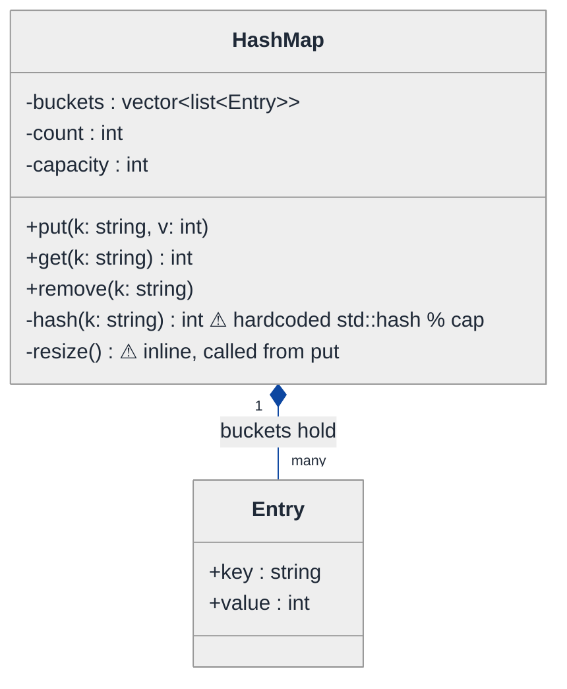
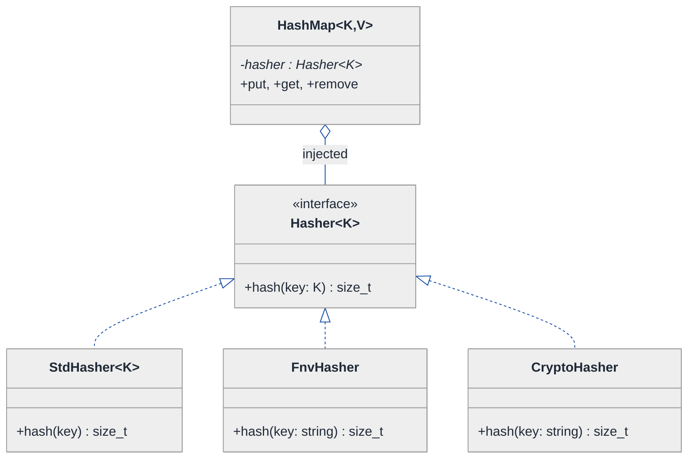
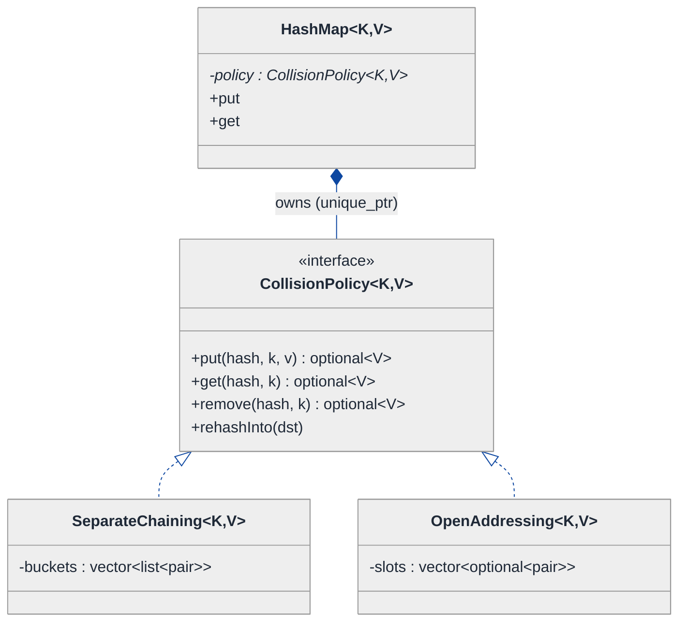
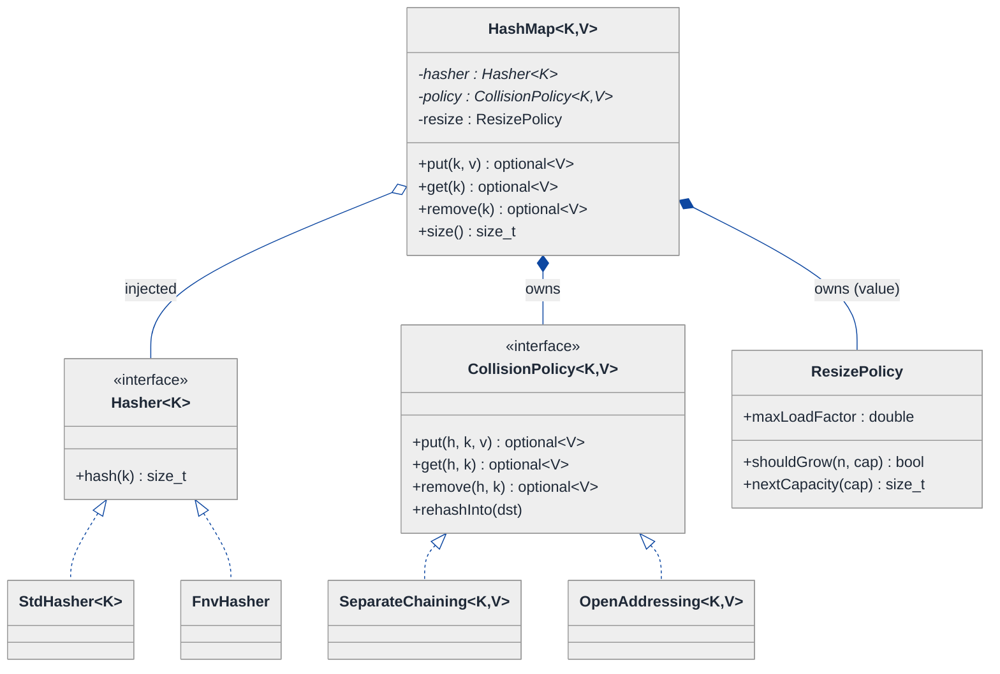

# Hash Map From Scratch — LLD Walkthrough

> **Difficulty:** Medium · **Time:** ~30 min · **Pattern focus:** Encapsulation + Generics (with Strategy for hashing and for collision policy)
>
> **Problem source(s):** LeetLens GID **OOD2**, bucket `Object_Oriented_Design`. See [`./EXTRACTED_QUESTIONS.md`](./EXTRACTED_QUESTIONS.md).
>
> **Diagrams:** inline mermaid (renders natively in GitHub / VS Code). Canonical theme block per [`../../../CONTINUATION.md`](../../../CONTINUATION.md) §3.

---

## How to use this file

Paced for a candidate who has *used* `std::unordered_map` a thousand times but has never *built* one. Reading time: ~30 minutes if you sketch each iteration by hand. **The lesson: a hash map is a textbook encapsulation exercise — the public surface (`put`/`get`/`remove`) must stay rock-stable while three things underneath vary independently: how a key becomes an index (the hash function), how collisions are resolved (chaining vs open addressing), and how the table grows (resize policy). Don't bake any of those three into the table — derive why each becomes a swappable, injected collaborator.**

**Map of this file (15 sections):**

1. Problem statement + clarifying questions
2. Plain-English restatement
3. Why this matters
4. Mental model
5. Try it yourself first
6. Entity & verb extraction
7. **Iteration 1: the naive design** — what we'd write first
8. **Where the naive design hurts** — four future requirements, one painful diff each
9. **Pivot 1: Strategy for the hash function** — the most painful axis first
10. **Pivot 2: Strategy for collision resolution** — chaining vs open addressing behind one interface
11. **Pivot 3: encapsulating the resize policy** — and templating the key/value types
12. Final UML class diagram
13. Skeleton code (C++17)
14. Key flow — sequence diagram
15. Extensibility re-check + anti-patterns + how to think aloud + self-check

---

## 1. Problem statement + clarifying questions

**Prompt (typical phrasing):** "Design a hash map from scratch with support for generic key-value types, dynamic resizing, collision handling via chaining and open addressing, and custom hash function injection."

**Clarifying questions to ask BEFORE drawing anything:**

1. **Generic over what?** Arbitrary `K, V` template types, or just `string → int`? Does `K` come with a usable hash + equality, or must the caller supply both?
2. **Collision policy — pick one or support both?** The prompt says "chaining AND open addressing." Do you want them switchable at construction, or two separate classes? (This is the crux — it decides whether collision resolution is a Strategy.)
3. **Resize trigger?** Grow when load factor crosses a threshold (e.g. 0.75)? Shrink on heavy deletion, or never shrink? Power-of-two capacities or prime capacities?
4. **Iteration order guarantees?** Insertion-order preserved (like a `LinkedHashMap`), or arbitrary? Most from-scratch maps give *no* ordering guarantee — confirm.
5. **Concurrency?** Single-threaded, or must `put`/`get` be thread-safe? (Big design fork — confirm before drawing. Assume single-threaded unless told.)
6. **Duplicate-key semantics?** `put` on an existing key overwrites and returns the old value? `get` on a missing key returns a sentinel, throws, or returns an `optional`?
7. **Custom hash injection — at the type level or the instance level?** A template parameter `Hasher` (compile-time, zero-overhead, like STL) or a runtime-injected object (swap the function per-instance)? The prompt's word "injection" leans runtime.

**Assumptions if interviewer dodges:** generic `K, V`; BOTH collision policies supported and chosen at construction (this is the whole point of the question); grow at load factor 0.75, double capacity, never shrink; no ordering guarantee; single-threaded; `put` overwrites and returns old value via `std::optional`; `get` returns `std::optional<V>`; custom hash injected at runtime as an object so it can be swapped per-instance.

---

## 2. Plain-English restatement

We're building the thing `std::unordered_map` already is, so we can show we understand its guts. A hash map stores key→value pairs and promises *average O(1)* lookup. It does that by turning a key into an array index via a hash function, then storing the entry in a bucket at that index. Two keys can land in the same bucket — that's a **collision** — so we need a resolution policy. As the map fills up, lookups slow down, so we **resize** (grow the array and re-place everything). The design must let us (a) plug in a custom hash function, (b) switch between chaining and open addressing, and (c) tune the resize policy — **without touching the `put`/`get`/`remove` code**.

---

## 3. Why this matters

This question is an **encapsulation** litmus test wearing a data-structures costume. Anyone can write a fixed-size array with `key % size`. The senior signal is recognizing that a hash map has *three orthogonal axes of variation* (hash, collision policy, resize policy) hidden behind *one tiny stable interface* (`put`/`get`/`remove`), and keeping those axes from leaking into the public surface. It reappears everywhere: caches, sets, symbol tables, dedup layers. Get the encapsulation right here and every "implement an LRU cache" follow-up becomes trivial.

---

## 4. Mental model

A hash map is a **coat-check counter**. You hand over a coat (the value) with your name (the key). The clerk runs your name through a rule to pick a numbered hook (the hash → index). Sometimes two names map to the same hook — the clerk needs a tie-break rule (collision policy). When the rack gets crowded and finding hooks slows down, the clerk installs a bigger rack and re-hangs everything (resize).

```
Real-world sketch (NOT a UML diagram yet):

  key "Anita" ──hash()──► 7283641 ──% capacity(8)──► bucket 1
  key "Brian" ──hash()──► 1190007 ──% capacity(8)──► bucket 1   ← COLLISION at 1

  buckets:  [0]      [1]            [2]   [3]  ...  [7]
             ·     Anita→Brian       ·     ·         ·
                   (tie-break rule decides HOW they coexist)

  when (entries / capacity) > 0.75  ──►  double capacity, re-hash ALL entries
```

The KEY insight from this picture: **index computation, tie-breaking, and growth are three separate decisions.** The clerk's *job* (take coat, return coat) never changes; only the *rules* do. That separation — stable job, swappable rules — is exactly what we'll bake into the design.

---

## 5. Try it yourself first

> **Predict before reading on:**
>
> 1. List the nouns you'd promote to a class. Which "nouns" (capacity, load factor) stay as plain fields?
> 2. **If I told you the map must support BOTH chaining and open addressing, chosen at construction time, what would change about how `put` is written?** Where does the `if (chaining) ... else ...` go — and is that where it *should* go?
> 3. A teammate wants to swap in a cryptographic hash for security-sensitive keys. Where does that plug in without you editing `put`/`get`?

---

## 6. Entity & verb extraction

> **Mini-refresher: noun → class, but not every noun.**
>
> Naive OOD promotes every noun to a class. Senior OOD promotes a noun only if it has both BEHAVIOR and STATE that need to live together. "Load factor" is a number — a field. "Hash function" has behavior that *varies* — that's a class.

**Nouns from the prompt:**

| Noun | Decision | Why |
|---|---|---|
| HashMap | Class (top-level, the public surface) | Owns the bucket array, exposes put/get/remove |
| Entry (key+value pair) | Small struct | Just data the buckets hold |
| Bucket | Concept, not always a class | In chaining it's a list; in open addressing it's a slot — see §10 |
| Hash function | Class (abstract + concrete) | Behavior that VARIES (default / FNV / crypto) — Strategy candidate |
| Collision policy | Class (abstract + concrete) | Two whole algorithms (chaining, open addressing) — Strategy candidate |
| Capacity | Field (int) | A number, no behavior |
| Load factor | Field (double) | A threshold, no behavior |
| Resize policy | Field/Class (start as a method, may extract) | Behavior, but only one variant for now — watch §11 |

**Verbs (and the class they live on):**

| Verb | Owner class (naive answer — we'll re-examine) |
|---|---|
| put(key, value) | HashMap |
| get(key) | HashMap |
| remove(key) | HashMap |
| hash(key) → index | HashMap (inline — we'll move it in §9) |
| resolveCollision(...) | HashMap (inline if/else — we'll move it in §10) |
| resize() | HashMap (private helper) |

**We have NOT introduced any design patterns yet.** Pure nouns + verbs.

---

## 7. <a id="iter-1"></a>Iteration 1: the naive design

Let's write the simplest thing that could possibly work: a `string → int` map, chaining only, hash hardcoded, resize inlined. No patterns, no generics — just a class with methods.



**Reader's tour (read top to bottom; ~60 seconds).**

1. **One box — `HashMap` IS the whole design.** It holds three fields (`buckets`, `count`, `capacity`) and exposes three public methods. There are no collaborators. Every decision lives inside this class.

2. **`buckets` is a `vector<list<Entry>>`.** A vector of linked lists — that's chaining, baked in. Each index holds a list of entries that collided there.

3. **`Entry` is the only other box** — a dumb pair of `string key` + `int value`. The filled diamond marks composition: the map owns its entries; they die with it.

4. **The two warning markers (⚠) are the trouble zone:**
   - `hash()` is hardcoded as `std::hash<string>{}(k) % capacity`. One algorithm, no way to swap it.
   - `resize()` is an inline private method called from inside `put`. The grow-and-rehash logic is welded to the chaining representation.

Each warning is a future-pain entry point. §8 turns each into a concrete requirement that exposes the brittleness.

**What's deliberately missing.** No `Hasher` interface. No `CollisionPolicy` interface. No `K, V` generics — it's `string → int`. No resize *policy* — just a magic `0.75` constant buried in `put`. The naive design doesn't even *acknowledge* that hashing, collision handling, and growth are independent axes; it hardcodes one answer for each.

Skeleton code for the naive design (C++):

```cpp
#include <functional>
#include <list>
#include <stdexcept>
#include <string>
#include <vector>

struct Entry {
    std::string key;
    int         value;
};

class HashMap {
public:
    explicit HashMap(int capacity = 8)
        : buckets_(capacity), capacity_(capacity) {}

    void put(const std::string& k, int v) {
        int idx = hash(k);                         // hardcoded hash
        for (auto& e : buckets_[idx]) {            // chaining: scan the list
            if (e.key == k) { e.value = v; return; }
        }
        buckets_[idx].push_back({k, v});
        ++count_;
        if ((double)count_ / capacity_ > 0.75) resize();   // magic constant
    }

    int get(const std::string& k) const {
        int idx = hash(k);
        for (const auto& e : buckets_[idx]) {
            if (e.key == k) return e.value;
        }
        throw std::out_of_range("key not found");  // no optional yet
    }

    void remove(const std::string& k) {
        int idx = hash(k);
        auto& chain = buckets_[idx];
        for (auto it = chain.begin(); it != chain.end(); ++it) {
            if (it->key == k) { chain.erase(it); --count_; return; }
        }
    }

private:
    int hash(const std::string& k) const {
        return static_cast<int>(std::hash<std::string>{}(k) % capacity_);
    }

    void resize() {                                // welded to chaining
        int newCap = capacity_ * 2;
        std::vector<std::list<Entry>> next(newCap);
        for (auto& chain : buckets_)
            for (auto& e : chain)
                next[std::hash<std::string>{}(e.key) % newCap].push_back(e);
        buckets_ = std::move(next);
        capacity_ = newCap;
    }

    std::vector<std::list<Entry>> buckets_;
    int count_ = 0;
    int capacity_;
};
```

**This works.** It has zero design patterns and zero generics. We can put, get, remove, and it grows. So what's wrong with it?

---

## 8. <a id="naive-pain"></a>Where the naive design hurts

Now the interviewer slides a piece of paper across the desk: "Here are four requirements coming next quarter. Walk me through what changes."

### Change A: "Inject a custom hash — FNV-1a for speed, SHA-256 for security-sensitive keys"

In the naive design:
- `hash()` hardcodes `std::hash`. To support FNV you'd add `if (useFnv) ... else ...` inside `hash()`.
- But `resize()` ALSO hardcodes `std::hash<string>{}` independently — a SECOND copy of the hashing logic.
- **The change touches `hash()` AND `resize()`, and they can silently drift out of sync** (resize hashing differently from put → corrupted lookups). Brutal bug.

### Change B: "Support open addressing too, chosen at construction"

In the naive design:
- The entire storage shape is `vector<list<Entry>>` — that IS chaining. Open addressing needs `vector<optional<Entry>>` (flat slots, probe on collision).
- `put`, `get`, `remove`, and `resize` ALL assume the list-of-lists shape.
- **You'd fork the whole class — `ChainedHashMap` vs `OpenAddressedHashMap` — duplicating put/get/remove/resize four times.** Or sprinkle `if (chaining)` across every method. Both are awful.

### Change C: "Make it generic: `K → V` for any types, caller supplies hash + equality"

In the naive design:
- `string` and `int` are nailed into every signature, every field, every loop.
- **Every method signature, the `Entry` struct, and both hash call-sites change.** A find-and-replace nightmare, and you still can't let the *caller* decide how `K` is hashed/compared.

### Change D: "Tune resize: grow at 0.6 for one map, never shrink, prime capacities for another"

In the naive design:
- The `0.75` threshold and `*2` growth are magic literals inside `put` and `resize`.
- **Every new policy is surgery inside `put`/`resize`,** and you can't have two maps with different policies without forking the class.

### The pattern of pain

| Change | Files / sites touched | Smell |
|---|---|---|
| A. Custom hash | `hash()` + `resize()` (two copies) | "Hashing logic duplicated; hardcoded; can drift." |
| B. Open addressing | put + get + remove + resize (whole shape) | "Storage representation welded into every method." |
| C. Generics | every signature + Entry + both hash sites | "Concrete types nailed everywhere; caller can't customize." |
| D. Resize tuning | `put` + `resize` magic constants | "Growth policy is hardcoded literals, not a decision." |

**Three axes of pain dominate:** the *index computation* (hashing), the *collision representation + resolution* (chaining vs open addressing), and the *growth policy* (when/how to resize) — all crammed into one class, none of them swappable. Plus the whole thing is hardwired to `string → int`.

> **Pivot question:** "Which of these is an *algorithm the caller picks* (→ Strategy), which is a *whole storage shape that varies* (→ Strategy over the representation), and which is just a *type parameter* (→ generics/templates)?"
>
> Hashing and collision-resolution are caller-picked algorithms → Strategy. Generic types → templates. Let's introduce them one at a time, starting with the most painful axis: the duplicated, hardcoded hash.

---

## 9. <a id="pivot-1"></a>Pivot 1: Strategy for the hash function

> **Mini-refresher: Strategy pattern.**
>
> Encapsulates an algorithm behind an interface so it can be swapped at runtime. The CALLER decides which strategy to use; the strategy doesn't know about its peers.
>
> Quick example: a `Sorter` takes a `CompareStrategy*` in its constructor. Pass `AscendingCompare` or `DescendingCompare` — the sorter doesn't care.

> **Mini-refresher: Dependency Injection.**
>
> Instead of a class CREATING its collaborators (`new FnvHasher()` inside the constructor), the collaborator is PASSED IN (via constructor or setter). The class depends on the *interface*, not the concrete type. This is what makes "custom hash injection" in the prompt literally possible.

**Why Strategy fits hashing.** Hashing is an algorithm: `given a key, return a 64-bit number`. It varies (default, FNV-1a, SHA-256). The choice is made externally by the caller. That's textbook Strategy — and it directly answers the prompt's word "injection."

**The key fix it unlocks:** there is now ONE hashing object, owned by the map and used by BOTH `put`/`get`/`remove` AND `resize`. The Change-A drift bug becomes impossible — there's only one source of truth.

**The refactor (just the affected part):**

```cpp
// Hasher is generic over the key type K
template <typename K>
class Hasher {
public:
    virtual ~Hasher() = default;
    virtual std::size_t hash(const K& key) const = 0;
};

template <typename K>
class StdHasher : public Hasher<K> {
public:
    std::size_t hash(const K& key) const override {
        return std::hash<K>{}(key);          // wraps the standard library
    }
};

class FnvHasher : public Hasher<std::string> {
public:
    std::size_t hash(const std::string& key) const override {
        std::size_t h = 1469598103934665603ULL;          // FNV offset basis
        for (unsigned char c : key) { h ^= c; h *= 1099511628211ULL; }
        return h;
    }
};
// CryptoHasher (SHA-256) elided — same shape

// HashMap now OWNS a Hasher and asks it; never hashes inline.
// Both put() and resize() call hasher_->hash(k) % capacity_  — ONE source of truth.
```

**What changed — visualized.** Just the hashing slice:



**Tour of the after-state.**

1. **`HashMap` gained ONE field.** `hasher` is a pointer to the `Hasher<K>` interface, INJECTED at construction (open diamond = aggregation; the map uses it). The map no longer knows *how* hashing works — only that it can ask.

2. **The `<<interface>>` box** is the abstract base: one pure-virtual method `hash(K) → size_t`. The contract is tiny.

3. **Three concrete implementations** hang below: `StdHasher` (wraps `std::hash`), `FnvHasher` (the fast FNV-1a), `CryptoHasher` (SHA-256, elided). Adding a fourth is a new leaf — zero edits elsewhere.

4. **Change A from §8 now lands cleanly.** Custom hash → construct the map with a different `Hasher`. And crucially, `resize()` asks the SAME `hasher_` object — the duplication-drift bug is structurally impossible now.

**Pattern-discrimination cheatsheet — Strategy vs Template Method.**
- *Strategy:* the whole algorithm lives in one swappable object, chosen at runtime via composition.
- *Template Method:* an algorithm skeleton in a base class; subclasses fill in hooks via inheritance.
- *Rule of thumb:* if the variant is selected by external code at construction (`map(FnvHasher{})`) → Strategy. If you'd subclass `HashMap` itself to override one step → Template Method.

We chose Strategy because the caller picks the hash *per map instance* — that's composition + injection, not subclassing the map.

---

## 10. <a id="pivot-2"></a>Pivot 2: Strategy for collision resolution

Change B from §8 is still painful — chaining vs open addressing are two entirely different storage shapes, and right now the shape is welded into every method. A Hasher Strategy doesn't help, because the variability isn't in *computing the index*, it's in *what the bucket array IS and how we probe it*.

> **Mini-refresher: Strategy over a representation.**
>
> Strategy isn't only for "algorithms" — it can encapsulate an entire *data representation plus the operations on it*. Here, `CollisionPolicy` owns the bucket array itself: chaining owns `vector<list<Entry>>`; open addressing owns `vector<optional<Entry>>`. The HashMap delegates put/get/remove into the policy and never sees the underlying shape.

**Why Strategy (and not just two subclasses of HashMap).** If `ChainedHashMap` and `OpenAddressedHashMap` were sibling subclasses, every shared concern (the public API, count tracking, the resize trigger, the injected Hasher) would be duplicated. Instead we keep ONE `HashMap` and inject the collision behavior. The map orchestrates; the policy stores.

**The refactor (just the collision slice):**

```cpp
template <typename K, typename V>
class CollisionPolicy {
public:
    virtual ~CollisionPolicy() = default;
    virtual std::optional<V> put(std::size_t hash, const K& k, const V& v) = 0;
    virtual std::optional<V> get(std::size_t hash, const K& k) const = 0;
    virtual std::optional<V> remove(std::size_t hash, const K& k) = 0;
    virtual std::size_t      size()     const = 0;
    virtual std::size_t      capacity() const = 0;
    virtual std::unique_ptr<CollisionPolicy> makeEmpty(std::size_t cap) const = 0;  // factory hook for grow()
    virtual void             rehashInto(CollisionPolicy& dst) const = 0;  // for resize
};

template <typename K, typename V>
class SeparateChaining : public CollisionPolicy<K, V> {
public:
    explicit SeparateChaining(std::size_t cap) : buckets_(cap) {}
    std::optional<V> put(std::size_t h, const K& k, const V& v) override {
        auto& chain = buckets_[h % buckets_.size()];
        for (auto& e : chain)
            if (e.first == k) { auto old = e.second; e.second = v; return old; }
        chain.push_back({k, v}); ++count_; return std::nullopt;
    }
    // get / remove / rehashInto elided — same list-walk shape
private:
    std::vector<std::list<std::pair<K, V>>> buckets_;
    std::size_t count_ = 0;
};

template <typename K, typename V>
class OpenAddressing : public CollisionPolicy<K, V> {
public:
    explicit OpenAddressing(std::size_t cap) : slots_(cap) {}
    std::optional<V> put(std::size_t h, const K& k, const V& v) override {
        std::size_t i = h % slots_.size();
        for (std::size_t probe = 0; probe < slots_.size(); ++probe) {
            auto& slot = slots_[(i + probe) % slots_.size()];   // linear probing
            if (!slot || slot->first == k) {
                std::optional<V> old = slot ? std::optional<V>{slot->second} : std::nullopt;
                slot = std::make_pair(k, v);
                if (!old) ++count_;
                return old;
            }
        }
        return std::nullopt;   // full — HashMap should have resized before this
    }
    // get / remove (with tombstones) / rehashInto elided
private:
    std::vector<std::optional<std::pair<K, V>>> slots_;
    std::size_t count_ = 0;
};
```

**What changed — visualized.** Just the collision slice:



**Tour of the after-state.**

1. **`HashMap` now owns a `CollisionPolicy<K,V>` via `unique_ptr`** (filled diamond = composition; the policy's lifetime equals the map's). The map computes the hash (via its Hasher) and hands `(hash, k, v)` to the policy. **It never touches a bucket directly.**

2. **The interface declares five operations** — put/get/remove plus `size`, `capacity`, and `rehashInto`. That last one is how resize stays representation-agnostic (§11).

3. **Two concrete policies, two different shapes:**
   - `SeparateChaining` owns `vector<list<pair>>` and walks the list at a bucket.
   - `OpenAddressing` owns `vector<optional<pair>>` and *probes* forward on collision (with tombstones on delete). **Completely different internals, identical interface.**

4. **Change B from §8 now lands cleanly.** Switching policy is a constructor argument: `HashMap(make_unique<OpenAddressing<K,V>>(8), ...)`. `put`/`get`/`remove` on `HashMap` didn't change at all.

**Pattern-discrimination cheatsheet — Strategy vs State.**
- *Strategy:* the CALLER picks which policy to use, and it stays fixed for the object's life (you pick chaining OR open addressing at construction).
- *State:* the OBJECT flips between states internally as events arrive.
- *Rule of thumb:* `new HashMap(OpenAddressing{})` chosen once by external code → Strategy. A map that secretly switched representation mid-life on some event → State (we do NOT want that here).

Collision policy is Strategy, not State: it's a one-time external choice, never an internal transition.

---

## 11. <a id="pivot-3"></a>Pivot 3: encapsulating the resize policy + templating the types

Changes A and B are solved. Change C (generics) and Change D (resize tuning) remain.

### 11a. Generics — make it `HashMap<K, V>` (Change C)

> **Mini-refresher: generics vs Strategy — they solve DIFFERENT problems.**
>
> Generics (templates) vary the *type* the structure holds (`HashMap<string,int>` vs `HashMap<int,User>`) at compile time, zero runtime cost. Strategy varies the *behavior* at runtime. They compose: the Hasher and CollisionPolicy interfaces are themselves templated on `K`/`V`, so a generic map injects type-specific behavior. Don't reach for Strategy when a template parameter suffices, and don't template what genuinely needs runtime swapping.

The fix is to template `HashMap`, `Hasher`, `CollisionPolicy`, and the entry pair on `<K, V>`. Equality lives with `K` (`operator==`) or, like STL, can be a second injected `KeyEqual` — but for Medium scope we lean on `K`'s `operator==`. This is *pure encapsulation discipline*: the public surface (`put`/`get`/`remove`) reads identically; only the type parameters flow through.

### 11b. Resize policy — extract the magic constants (Change D)

In the naive design the `0.75` threshold and `*2` growth were literals in `put`/`resize`. There's only ONE variant *today*, so we don't need a full Strategy hierarchy yet — but we DO encapsulate the decision behind a tiny value object so a second variant is a swap, not surgery.

```cpp
struct ResizePolicy {
    double maxLoadFactor = 0.75;
    bool shouldGrow(std::size_t size, std::size_t cap) const {
        return cap == 0 || (double)size / cap > maxLoadFactor;
    }
    std::size_t nextCapacity(std::size_t cap) const { return cap * 2; }
};
// A PrimeResizePolicy or LoadFactor-0.6 variant becomes a different value/object.
```

`HashMap::put` now reads: *if `resize_.shouldGrow(policy_->size(), policy_->capacity())`, build a fresh policy of the SAME concrete type with `resize_.nextCapacity(...)`, then `policy_->rehashInto(newPolicy)` using the injected Hasher.* The growth decision is a named collaborator, the rehash is representation-agnostic, and the hashing is the single injected source of truth from Pivot 1.

> **Mini-refresher: SOLID — Open/Closed Principle (OCP).**
>
> "Open for extension, closed for modification." A class should let you ADD behavior by adding new code (a new `Hasher`, a new `CollisionPolicy`, a new `ResizePolicy`) without EDITING existing, tested code. Every pivot above moved a hardcoded decision out of `HashMap` so the next variant is a new class, not an edit to `put`. That is OCP made concrete.

> **Mini-refresher: SOLID — Single Responsibility Principle (SRP).**
>
> A class should have one reason to change. After the pivots: `HashMap` changes only if the orchestration changes; `Hasher` only if hashing changes; `CollisionPolicy` only if storage changes; `ResizePolicy` only if growth changes. Four reasons, four classes — instead of one class with four reasons to change.

**The lesson.** Once Pivot 1 taught us "lift the varying decision into an injected collaborator," Pivots 2 and 3 are the same move on different axes. Generics handle the *type* axis for free. **Recognizing the shape once makes the rest of the design cheap.**

---

## 12. <a id="fig-class-diagram"></a>12. Final class diagram

One diagram now fits cleanly — the map orchestrates three injected collaborators, all generic over `K, V`.



**Reading guide (two paragraphs).** `HashMap<K,V>` is the stable public surface — `put`/`get`/`remove`/`size`, each returning an `optional<V>` so missing keys and overwritten values are expressed without exceptions or sentinels. It owns three collaborators: an injected `Hasher<K>` (open diamond — aggregation; the caller supplies it and may share it), an owned `CollisionPolicy<K,V>` (filled diamond — composition; created with the map, holds the actual storage), and an owned `ResizePolicy` value (the growth decision).

The two `<<interface>>` boxes are the runtime-swappable axes from Pivots 1 and 2; the concrete leaves below them (`StdHasher`/`FnvHasher`, `SeparateChaining`/`OpenAddressing`) are where the variation lives. The whole structure is generic over `K, V`, so `HashMap<string,int>` and `HashMap<UserId,Account>` are the same code at zero runtime cost. **Inheritance appears only for the Strategy families; everything else is composition + templates.** That is the encapsulation+generics answer the prompt is probing.

---

## 13. Skeleton code (C++17)

> Show the SHAPES, not the full impl. Abstract bases + 1-2 concrete classes per axis; the rest is `// elided`.

```cpp
#include <functional>
#include <list>
#include <memory>
#include <optional>
#include <utility>
#include <vector>

// ── Hashing axis (Strategy, generic over K) ─────────────────────────
template <typename K>
class Hasher {
public:
    virtual ~Hasher() = default;
    virtual std::size_t hash(const K& key) const = 0;
};

template <typename K>
class StdHasher : public Hasher<K> {
public:
    std::size_t hash(const K& key) const override { return std::hash<K>{}(key); }
};
// FnvHasher, CryptoHasher elided — same shape, different mixing

// ── Collision axis (Strategy over a representation, generic over K,V) ─
template <typename K, typename V>
class CollisionPolicy {
public:
    virtual ~CollisionPolicy() = default;
    virtual std::optional<V> put(std::size_t h, const K& k, const V& v) = 0;
    virtual std::optional<V> get(std::size_t h, const K& k) const = 0;
    virtual std::optional<V> remove(std::size_t h, const K& k) = 0;
    virtual std::size_t      size()     const = 0;
    virtual std::size_t      capacity() const = 0;
    // Factory hook: produce an empty policy of the SAME concrete kind at `cap`.
    // Lets HashMap::grow() allocate a larger storage without knowing the subtype.
    virtual std::unique_ptr<CollisionPolicy> makeEmpty(std::size_t cap) const = 0;
    // Rehash every live entry into dst, re-deriving each index from `hasher`.
    virtual void rehashInto(CollisionPolicy& dst, const std::function<std::size_t(const K&)>& hashOf) const = 0;
};

template <typename K, typename V>
class SeparateChaining : public CollisionPolicy<K, V> {
public:
    explicit SeparateChaining(std::size_t cap) : buckets_(cap) {}
    std::optional<V> put(std::size_t h, const K& k, const V& v) override {
        auto& chain = buckets_[h % buckets_.size()];
        for (auto& e : chain)
            if (e.first == k) { auto old = e.second; e.second = v; return old; }
        chain.push_back({k, v}); ++count_; return std::nullopt;
    }
    std::size_t size()     const override { return count_; }
    std::size_t capacity() const override { return buckets_.size(); }
    std::unique_ptr<CollisionPolicy<K, V>> makeEmpty(std::size_t cap) const override {
        return std::make_unique<SeparateChaining<K, V>>(cap);   // same concrete kind, empty, at cap
    }
    // get / remove / rehashInto elided — list-walk shape
private:
    std::vector<std::list<std::pair<K, V>>> buckets_;
    std::size_t count_ = 0;
};
// OpenAddressing<K,V> elided — vector<optional<pair>>, linear probing, tombstones

// ── Resize axis (encapsulated value object) ─────────────────────────
struct ResizePolicy {
    double maxLoadFactor = 0.75;
    bool shouldGrow(std::size_t n, std::size_t cap) const {
        return cap == 0 || static_cast<double>(n) / cap > maxLoadFactor;
    }
    std::size_t nextCapacity(std::size_t cap) const { return cap == 0 ? 8 : cap * 2; }
};

// ── The orchestrator: stable public surface ─────────────────────────
template <typename K, typename V>
class HashMap {
public:
    HashMap(std::unique_ptr<Hasher<K>> hasher,
            std::unique_ptr<CollisionPolicy<K, V>> policy,
            ResizePolicy resize = {})
        : hasher_(std::move(hasher)), policy_(std::move(policy)), resize_(resize) {}

    std::optional<V> put(const K& k, const V& v) {
        if (resize_.shouldGrow(policy_->size(), policy_->capacity())) grow();
        return policy_->put(hasher_->hash(k), k, v);   // delegate; never touch buckets
    }
    std::optional<V> get(const K& k) const    { return policy_->get(hasher_->hash(k), k); }
    std::optional<V> remove(const K& k)        { return policy_->remove(hasher_->hash(k), k); }
    std::size_t      size()  const             { return policy_->size(); }

private:
    void grow() {
        auto bigger = policy_->makeEmpty(resize_.nextCapacity(policy_->capacity())); // virtual factory: same kind, larger
        policy_->rehashInto(*bigger, [this](const K& k){ return hasher_->hash(k); });
        policy_ = std::move(bigger);
    }
    std::unique_ptr<Hasher<K>>             hasher_;   // injected (aggregation)
    std::unique_ptr<CollisionPolicy<K, V>> policy_;   // owned (composition)
    ResizePolicy                           resize_;   // owned value
};

// Usage: chaining + FNV, or open addressing + std hash — same HashMap code.
//   HashMap<std::string,int> m(
//       std::make_unique<StdHasher<std::string>>(),
//       std::make_unique<SeparateChaining<std::string,int>>(8));
```

---

## 14. <a id="fig-sequence"></a>14. Key flow — sequence diagram

Here's a `put("Brian", 5)` that collides with an existing `"Anita"` and trips the resize threshold. Watch how the caller — and even `HashMap` itself — never sees the bucket internals.

```mermaid
---
config:
  theme: neutral
  themeVariables:
    background: '#ffffff'
    primaryColor: '#cfe2ff'
    primaryTextColor: '#1f2937'
    primaryBorderColor: '#084298'
    secondaryColor: '#fff3cd'
    secondaryTextColor: '#1f2937'
    secondaryBorderColor: '#664d03'
    tertiaryColor: '#d1e7dd'
    tertiaryTextColor: '#1f2937'
    tertiaryBorderColor: '#0a3622'
    lineColor: '#0d47a1'
    textColor: '#1f2937'
    noteBkgColor: '#fff3cd'
    noteTextColor: '#1f2937'
    noteBorderColor: '#997404'
    actorBkg: '#cfe2ff'
    actorBorder: '#084298'
    actorTextColor: '#1f2937'
    signalColor: '#0d47a1'
    signalTextColor: '#1f2937'
    labelBoxBkgColor: '#ffffff'
    labelBoxBorderColor: '#d3d3d3'
    labelTextColor: '#1f2937'
    edgeLabelBackground: '#ffffff'
    labelBackground: '#ffffff'
    classText: '#1f2937'
    fontFamily: 'system-ui, -apple-system, Segoe UI, Helvetica, Arial, sans-serif'
---
sequenceDiagram
  actor Caller
  participant Map as HashMap
  participant Resize as ResizePolicy
  participant H as Hasher
  participant Pol as CollisionPolicy
  Caller->>Map: 1: put("Brian", 5)
  Map->>Resize: 2: shouldGrow(size, cap)
  Resize-->>Map: 3: true (load > 0.75)
  Map->>Pol: 4: rehashInto(bigger, hashOf)
  Note over Map,Pol: 5: grow + re-place all entries
  Map->>H: 6: hash("Brian")
  H-->>Map: 7: 1190007
  Map->>Pol: 8: put(1190007, "Brian", 5)
  Note over Pol: 9: index 1 occupied by "Anita" -> collision; chain/probe
  Pol-->>Map: 10: nullopt (new key)
  Map-->>Caller: 11: nullopt
```

**Tour of the flow — what the patterns HIDE.**

1. **Caller calls `put`.** That's the entire public surface it touches. It passes a key and value — no knowledge of capacity, buckets, or probe sequences.

2. **HashMap asks ResizePolicy whether to grow (steps 2-3), and grows BEFORE inserting (steps 4-5).** The growth decision is a named collaborator's answer, not a magic literal. `rehashInto` re-places every entry using the injected Hasher — so the new table and old table agree on hashing by construction.

3. **HashMap asks the Hasher for the index (steps 6-7).** This is the ONLY place hashing happens, the single source of truth from Pivot 1. Swap `Hasher` and this number changes — nothing else does.

4. **HashMap delegates the actual insert to CollisionPolicy (steps 8-10).** Step 9 is where chaining-vs-open-addressing matters — *and HashMap can't see it.* Whether `"Brian"` appends to a list or probes to the next free slot is entirely inside the policy. HashMap just gets back `nullopt` (no previous value).

5. **The encapsulation that's NOT shown — and why it matters.** There is no `if (chaining)`, no `% capacity`, no bucket index in the HashMap messages. **The varying decisions are made impossible to see from the orchestration layer.** That is encapsulation: the public flow reads the same regardless of which Hasher, which CollisionPolicy, or which ResizePolicy is plugged in.

---

## 15. Extensibility re-check + anti-patterns + how to think aloud + self-check

### Extensibility re-check

Revisit the four changes from [§8](#naive-pain). For each, name the SINGLE thing that changes.

| Change | Naive design impact | Final design impact |
|---|---|---|
| A. Custom hash | `hash()` + `resize()` (drift bug) | New `Hasher<K>` subclass, injected. One source of truth. Done. |
| B. Open addressing | put + get + remove + resize forked | New `CollisionPolicy<K,V>` subclass, injected at construction. Done. |
| C. Generics | every signature + Entry | Template params flow through; public API unchanged. Done. |
| D. Resize tuning | magic constants in put/resize | New `ResizePolicy` value (or subclass). Done. |

Every change is exactly ONE new class/object in the final design. That's the open/closed principle in practice.

If a future requirement makes you change `HashMap`, `Hasher`, AND `CollisionPolicy` together — go back to §6 and re-identify the variability points; you missed one.

### Common confusion + traps

1. **"Why is `Hasher` injected (aggregation) but `CollisionPolicy` owned (composition)?"** A hasher is stateless and shareable across maps → caller may supply and reuse it. A collision policy holds the actual storage and lives exactly as long as the map → the map owns it.

2. **"Why not just two subclasses `ChainedHashMap` / `OpenAddressedHashMap`?"** They'd duplicate the entire public API, count tracking, resize trigger, and hasher wiring. Composition keeps ONE `HashMap` and varies only the storage behavior.

3. **"Template parameter for the hasher (like STL) vs injected object?"** Template = zero overhead but fixed at compile time. Injected object = swappable per instance at the cost of a virtual call. The prompt says "injection," so we chose the runtime object; mention you'd template it if hot-path performance dominated.

4. **"Where does key equality live?"** On `K` via `operator==`, or a second injected `KeyEqual` strategy mirroring STL. For Medium scope `operator==` is fine; name the `KeyEqual` extension if pushed.

5. **"Open addressing deletes — why tombstones?"** A plain erase would break probe chains (a later key found via probing past the deleted slot becomes unreachable). A tombstone marks "was occupied, keep probing." Worth saying out loud.

### Anti-patterns

- **"God class HashMap"** — hashing, storage, AND growth crammed in one class with `if` ladders. Pull each axis into a collaborator.
- **"Duplicated hash logic"** — hashing inline in both `put` and `resize`, drifting apart. ONE injected Hasher, asked everywhere.
- **"Tag-driven if/else"** — `if (chaining) ... else ...` in every method. Use the `CollisionPolicy` interface and let polymorphism dispatch.
- **"Magic constants"** — `0.75` and `*2` as bare literals scattered in logic. Name them in a `ResizePolicy`.
- **"Premature genericism"** — forcing `Hasher` and `CollisionPolicy` under one `Strategy<T>` base. They share no inputs/outputs; Strategy is a role, not a type. Keep them separate.
- **"Leaky encapsulation"** — exposing `buckets` via a getter so callers poke at internals. The public surface is put/get/remove/size; nothing else.

### How to think aloud

> "Hash map from scratch. Let me clarify: generic K/V? Both collision policies, switchable? Resize trigger and ordering? Concurrency? [Asks §1 questions.] Got it — generic, both policies chosen at construction, grow at 0.75, single-threaded, optional returns.
>
> Nouns: HashMap, Entry, Hasher, CollisionPolicy. Capacity and load factor are fields, not classes. The map's JOB (put/get/remove) is stable; the RULES vary.
>
> I'll write the naive version first — `string→int`, chaining hardcoded, hash inline, resize inline. It works. Now stress-test it. Change A: custom hash — touches `hash` AND `resize`, and they drift. Change B: open addressing — forks the entire storage shape. Change C: generics — types nailed everywhere. Change D: resize tuning — magic constants.
>
> Three axes plus a type axis. Pivot 1: hashing is a caller-picked algorithm → Strategy `Hasher`, injected, ONE source of truth, killing the drift bug. Pivot 2: collision resolution is a whole representation that varies → Strategy `CollisionPolicy` owning its own bucket array; chaining and open addressing behind one interface. Pivot 3: generics handle the type axis for free, and I lift the resize literals into a `ResizePolicy` value object.
>
> Final: `HashMap<K,V>` orchestrates an injected Hasher, an owned CollisionPolicy, and a ResizePolicy. Every one of the four future changes is now ONE new class. The public surface never moved — that's the encapsulation the question is really testing."

### Self-check

> **Self-check — the question to ask next time.**
>
> When you see "implement a [data structure] with support for [pluggable X, Y, Z]," before writing a single `if`, ask:
>
> > **"What is the STABLE public job, and which decisions VARY behind it — and is each varying decision a runtime algorithm the caller picks (Strategy, inject it) or just a type (generics, template it)?"**
>
> Stable job → keep it tiny and unchanging. Varying behavior the caller picks → Strategy + injection. Varying type only → generics. Keep the varying decisions from leaking into the public surface — that leak IS the failure of encapsulation.

---

## Cross-references

- **Parent topic manifest:** [`./EXTRACTED_QUESTIONS.md`](./EXTRACTED_QUESTIONS.md)
- **Vertical overview:** [`../../LEARNING.md`](../../LEARNING.md)
- **Template:** [`../../TEMPLATE-v2.md`](../../TEMPLATE-v2.md)
- **Canonical exemplar:** [`./Parking_Lot.md`](./Parking_Lot.md)
- **Related v2 walkthroughs (future):**
  - LRU Cache (in `../LLD_DataStructures/`) — reuses this map + a doubly-linked list; encapsulation follow-up
  - Strategy Pattern deep-dive (in `../Strategy_Pattern/`)
- **Further reading:** <a href="https://en.cppreference.com/w/cpp/container/unordered_map" target="_blank" rel="noopener noreferrer">cppreference: std::unordered_map</a> · <a href="https://en.wikipedia.org/wiki/Open_addressing" target="_blank" rel="noopener noreferrer">Open addressing (Wikipedia)</a>
