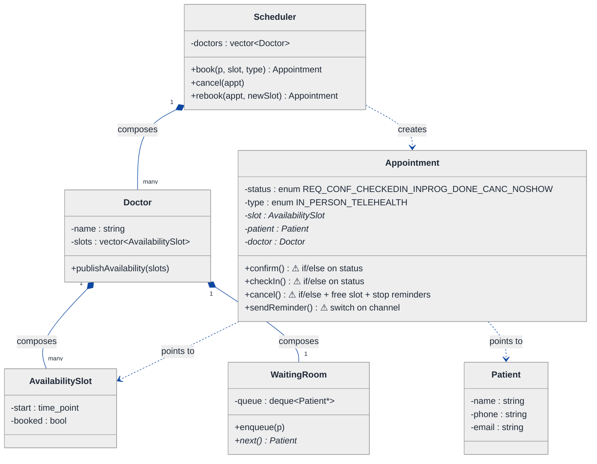
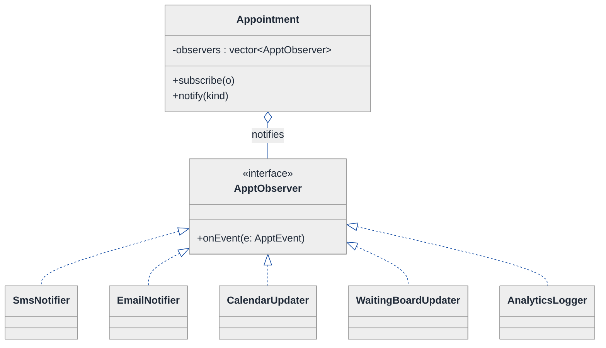
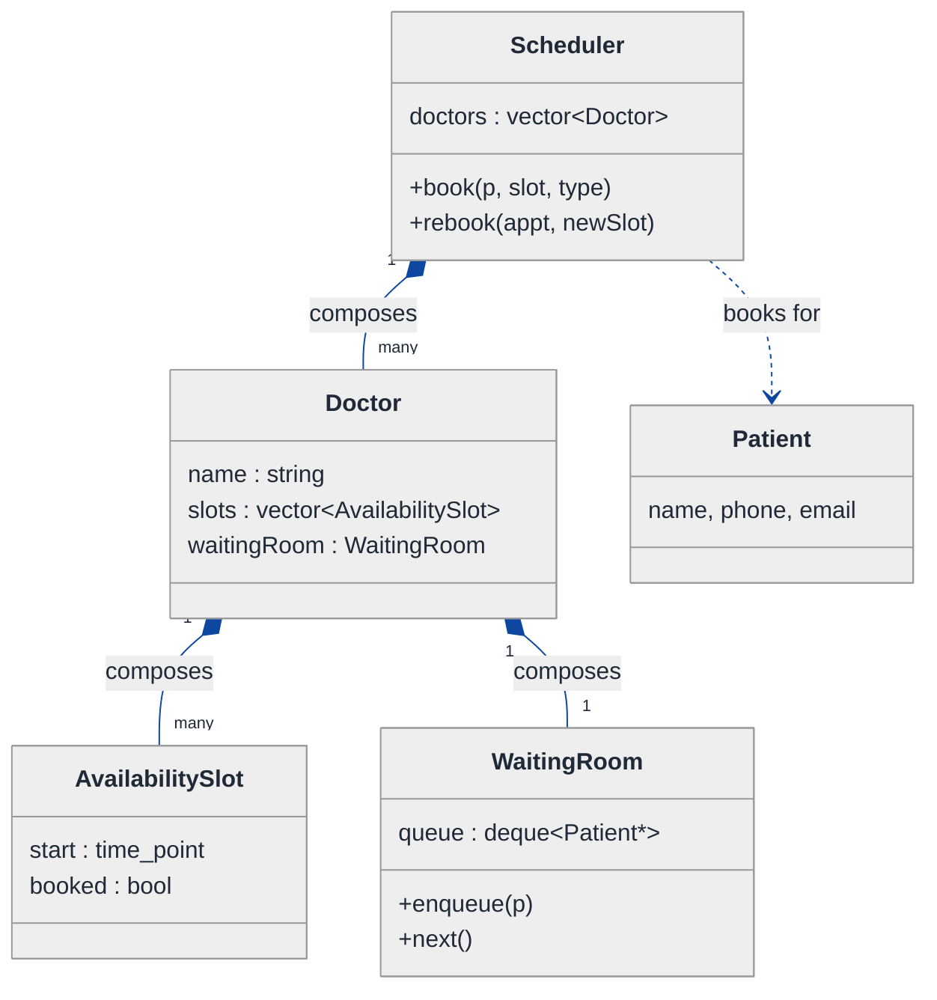
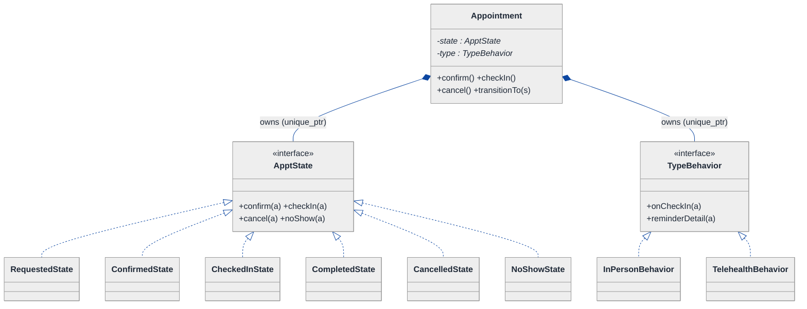
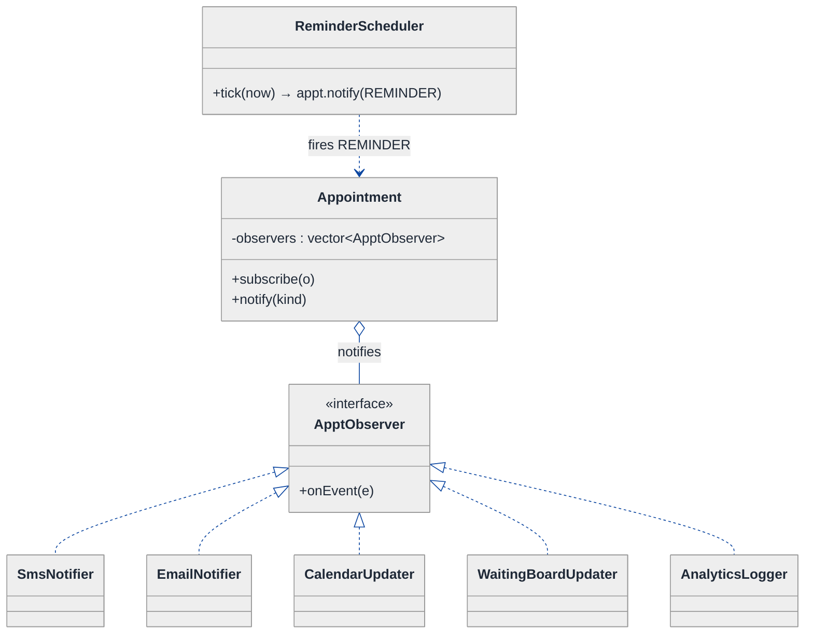
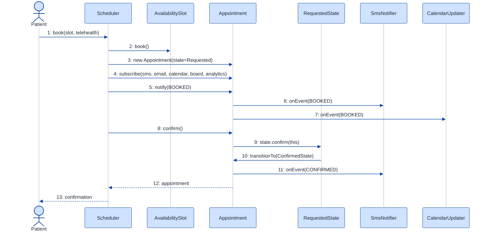
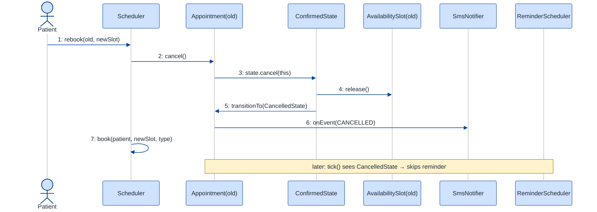

# Healthcare Appointment Scheduling — LLD Walkthrough

> **Difficulty:** Medium · **Time:** ~30 min · **Pattern focus:** Observer (reminders / notifications) + State (appointment lifecycle) — plus a Strategy for appointment-type behavior
>
> **Problem source(s):** GID `OOD7`, bucket `Object_Oriented_Design`. Representative of the "scheduling / booking with notifications and a lifecycle" family of LLD questions.
>
> **Diagrams:** inline mermaid (renders natively in GitHub / VS Code). No external sources, no PNGs.

---

## How to use this file

Paced for a candidate seeing the scheduling-system shape for the first time. Reading time: ~30 minutes if you sketch each iteration by hand. **The lesson: don't reach for design patterns up front — DERIVE them. Build the naive design first, watch it break under four hypothetical changes, then reach for ONE pattern at a time for the most painful axis.**

The two axes this problem is really probing:

- **"When X happens, N unrelated things must react"** (booking → SMS + email + the doctor's calendar + the waiting-room board). That fan-out is the **Observer** axis.
- **"An appointment moves Requested → Confirmed → CheckedIn → InProgress → Completed, and what's legal depends on where it is"** — that lifecycle is the **State** axis.

**Map of this file (15 sections):**

1. Problem statement + clarifying questions
2. Plain-English restatement
3. Why this matters
4. Mental model
5. Try it yourself first
6. Entity & verb extraction
7. **Iteration 1: the naive design** — what we'd write first
8. **Where the naive design hurts** — four future requirements, one painful diff each
9. **Pivot 1: State for the appointment lifecycle** — the most painful axis first
10. **Pivot 2: Observer for reminders + notifications** — the fan-out axis
11. **Pivot 3: Strategy for appointment-type behavior** — remaining variability
12. Final UML class diagram
13. Skeleton code (C++)
14. Key flow — sequence diagram
15. Extensibility re-check + anti-patterns + how to think aloud + self-check

---

## 1. Problem statement + clarifying questions

**Prompt (typical phrasing):** "Design a healthcare appointment scheduling system. Doctors publish availability, patients book slots, appointments have types (in-person, telehealth), there's a waiting-room queue, automated reminders go out, and patients can cancel and rebook."

**Clarifying questions to ask BEFORE drawing anything:**

1. **Availability model?** Do doctors publish fixed slots (9:00, 9:30, …) or open windows the system slices into slots? Can two patients race for the same slot?
2. **Appointment types?** Just in-person + telehealth, or also home-visit / lab / follow-up? Does the type change the flow (telehealth has no physical waiting room; it has a "join link" instead)?
3. **Lifecycle states?** What are the legal states — Requested, Confirmed, CheckedIn, InProgress, Completed, Cancelled, NoShow? Who can trigger each transition (patient, doctor, front-desk, system clock)?
4. **Reminders?** How many, on what schedule (24h before, 1h before)? Channels — SMS, email, push? Does cancelling stop pending reminders?
5. **Waiting room?** FIFO by check-in time, or priority (emergency, elderly)? Is it per-doctor or per-clinic?
6. **Cancellation + rebooking?** Does cancelling free the slot immediately? Is rebooking a brand-new appointment or a mutation of the old one? Any cancellation window / fee?
7. **Concurrency?** Should two simultaneous booking attempts on one slot not both succeed?
8. **Who observes a booking?** Patient notification, doctor's calendar, waiting-room board, analytics — how many independent reactions to one event?

**Assumptions if the interviewer dodges:** doctors publish discrete slots; types are in-person + telehealth (extensible); states are Requested → Confirmed → CheckedIn → InProgress → Completed, plus Cancelled and NoShow as off-ramps; reminders at 24h and 1h over SMS + email; waiting room is FIFO per doctor; cancelling frees the slot and stops pending reminders; rebooking creates a new appointment linked to the cancelled one; single-threaded core (we discuss concurrency in §15).

---

## 2. Plain-English restatement

We're building the software a clinic runs on. Doctors expose **availability** (bookable slots). A patient picks a slot and books an **appointment**, which is either in-person or telehealth. The appointment travels through a **lifecycle** (booked → confirmed → checked-in → seen → done), and at several points along the way the system must **notify lots of parties** (text the patient, email a receipt, update the doctor's calendar, push the patient onto the waiting-room board). Patients can **cancel** — which frees the slot and silences pending reminders — and **rebook** into a new slot. The design must let us add new appointment types, new reminder channels, and new lifecycle states **without rewriting the booking core**.

---

## 3. Why this matters

This question separates candidates who model "events and reactions" cleanly from those who hardwire every reaction into the code that fires the event. Two senior signals are being probed: (1) do you recognize a **one-to-many fan-out** and reach for Observer instead of a growing list of inline calls, and (2) do you model a **lifecycle with illegal transitions** as a State machine instead of an enum + scattered `if (status == …)` checks. The same two shapes reappear in order systems, ticketing, document workflows, and CI pipelines — recognizing them is reusable across half the LLD question bank.

---

## 4. Mental model

A scheduling system is **an inventory of time** + **a lifecycle** + **a broadcast bus**. The inventory is slots on doctors' calendars. The lifecycle is the journey of one appointment. The broadcast bus is the thing that, on each interesting transition, tells everyone who cares.

```
Real-world sketch (NOT a UML diagram yet):

   Doctor's calendar (slots)            One appointment's journey
   ┌───────────────────────┐           Requested → Confirmed → CheckedIn
   │ 09:00 [free]          │              → InProgress → Completed
   │ 09:30 [BOOKED] ───────┼──┐           (off-ramps: Cancelled, NoShow)
   │ 10:00 [free]          │  │
   └───────────────────────┘  │
                              ▼
                    ┌──────────────────┐   on each transition, broadcast to:
                    │   Appointment     │──► patient SMS
                    │  (in-person /     │──► patient email
                    │   telehealth)     │──► doctor's calendar view
                    └──────────────────┘──► waiting-room board
                                         └─► analytics / audit log
```

The KEY insight: the slot is **inventory**, the appointment's journey is **lifecycle**, and the arrows fanning out on the right are **notifications**. Three separable concerns. Keeping them separate is the whole design.

---

## 5. Try it yourself first

> **Predict before reading on:**
>
> 1. List 5 nouns you'd promote to a class, and 3 nouns you'd leave as fields.
> 2. **If the clinic later wants a Slack alert to the on-call nurse whenever any appointment is booked, where does that code go in your design?** If your answer is "add a line to the `book()` method," what happens when they want the 5th and 6th such reaction?
> 3. A patient taps "check in" on an appointment that was already cancelled. Where does that get rejected — and is it an `if` somewhere, or something cleaner?

---

## 6. Entity & verb extraction

> **Mini-refresher: noun → class, but not every noun.**
>
> Naive OOD promotes every noun to a class. Senior OOD promotes a noun only if it has both BEHAVIOR and STATE that need to live together. "Channel" (SMS vs email) is behavior → it becomes a small strategy/observer, not a data field. "Appointment" has a lifecycle → it's definitely a class.

**Nouns from the prompt:**

| Noun | Decision | Why |
|---|---|---|
| Clinic / Scheduler | Class (top-level coordinator) | Orchestrates booking, owns doctors |
| Doctor | Class | Owns availability, is a notify target |
| AvailabilitySlot | Class | Has time, doctor, free/booked flag |
| Patient | Class | Books, is the primary notify target |
| Appointment | Class | Lifecycle behavior — the heart of the design |
| AppointmentType | Behavior axis (in-person / telehealth) | Differs in flow, not just a label |
| WaitingRoom | Class | Per-doctor FIFO queue of checked-in patients |
| Reminder / Notification | A reaction, not a stored thing | Becomes Observer machinery |
| Channel (SMS, email, push) | Behavior | Becomes concrete observers |
| Time / Duration | Library type (`std::chrono`) | No domain behavior |

**Verbs (and the class they live on — naive answer, we'll re-examine):**

| Verb | Owner class (naive) |
|---|---|
| publishAvailability(slots) | Doctor |
| book(patient, slot, type) | Scheduler |
| confirm() / checkIn() / start() / complete() | Appointment |
| cancel() | Appointment |
| rebook(newSlot) | Scheduler |
| sendReminder() | Appointment (naive!) |
| enqueue(patient) / next() | WaitingRoom |

**We have NOT introduced any design patterns yet.** Pure nouns + verbs.

---

## 7. <a id="iter-1"></a>Iteration 1: the naive design

Let's write the simplest thing that could possibly work. No design patterns — just classes, an enum for status, and methods that do everything inline.



**Reader's tour (top to bottom; ~60 seconds).**

1. **`Scheduler` is the root.** It composes the doctors and exposes `book` / `cancel` / `rebook`. Every decision — which slot, who to notify, what's a legal transition — lives inside these methods or inside `Appointment`.

2. **The composition spine (left).** Filled diamonds mark composition (strong ownership / same lifetime): Scheduler composes `Doctor[]`; each Doctor composes its `AvailabilitySlot[]` and one `WaitingRoom`. Kill the scheduler and everything below dies with it.

3. **`Appointment` is the trouble zone.** Look at the four ⚠ markers:
   - `status` is one enum covering seven values. `confirm()`, `checkIn()`, `cancel()` each open with an `if (status == …)` guard ladder.
   - `sendReminder()` has a `switch` on channel (SMS / email). Every new channel adds a `case`.
   - `cancel()` does three unrelated things in one method: flip status, free the slot, stop reminders — and (next section) it'll also need to notify people.
   - `type` is an enum too — but telehealth and in-person behave differently (join-link vs waiting room), so this enum will sprout `if (type == TELEHEALTH)` branches.

4. **`WaitingRoom` is fine for now** — a FIFO deque per doctor. We won't disturb it.

**What's deliberately missing.** No state classes. No observer/listener machinery. No type-behavior abstraction. The naive design doesn't even *acknowledge* these are axes of variation — it bakes a hardcoded answer for each into the methods that use them. That's what §8 exposes.

Skeleton code for the naive design (C++):

```cpp
#include <chrono>
#include <deque>
#include <stdexcept>
#include <string>
#include <vector>

enum class ApptStatus { REQUESTED, CONFIRMED, CHECKED_IN, IN_PROGRESS,
                        COMPLETED, CANCELLED, NO_SHOW };
enum class ApptType   { IN_PERSON, TELEHEALTH };
enum class Channel    { SMS, EMAIL };

struct Patient { std::string name, phone, email; };

class AvailabilitySlot {
public:
    explicit AvailabilitySlot(std::chrono::system_clock::time_point start) : start_(start) {}
    bool booked() const { return booked_; }
    void book()   { booked_ = true; }
    void release(){ booked_ = false; }
private:
    std::chrono::system_clock::time_point start_;
    bool booked_ = false;
};

class Appointment {
public:
    ApptStatus status = ApptStatus::REQUESTED;
    ApptType   type   = ApptType::IN_PERSON;
    AvailabilitySlot* slot = nullptr;
    Patient*          patient = nullptr;

    void confirm() {                                   // if-ladder — will hurt
        if (status != ApptStatus::REQUESTED) throw std::runtime_error("Cannot confirm");
        status = ApptStatus::CONFIRMED;
        sendReminder(Channel::SMS);                    // inline notify — will hurt
    }
    void checkIn() {
        if (status != ApptStatus::CONFIRMED) throw std::runtime_error("Cannot check in");
        if (type == ApptType::TELEHEALTH) { /* no waiting room — issue join link */ }
        else                              { /* push onto waiting room */ }   // type branch — will hurt
        status = ApptStatus::CHECKED_IN;
    }
    void cancel() {                                    // does three things at once — will hurt
        if (status == ApptStatus::COMPLETED || status == ApptStatus::CANCELLED)
            throw std::runtime_error("Cannot cancel");
        status = ApptStatus::CANCELLED;
        if (slot) slot->release();                     // free the slot
        // stop pending reminders... somehow
        sendReminder(Channel::SMS);                    // tell the patient
    }
    void sendReminder(Channel ch) {                    // switch on channel — will hurt
        switch (ch) {
            case Channel::SMS:   /* call Twilio  */ break;
            case Channel::EMAIL: /* call SendGrid*/ break;
        }
    }
};

class Scheduler {
public:
    Appointment book(Patient& p, AvailabilitySlot& slot, ApptType type) {
        if (slot.booked()) throw std::runtime_error("Slot taken");
        slot.book();
        Appointment a;
        a.patient = &p; a.slot = &slot; a.type = type;
        a.confirm();                                   // fires SMS inline
        return a;
    }
    // cancel / rebook elided — same inline shape
};
```

**This works.** It has zero design patterns. We can book, confirm, check in, cancel. So what's wrong with it?

---

## 8. <a id="naive-pain"></a>Where the naive design hurts

The interviewer slides over a page: "Four requirements for next quarter. Walk me through what changes."

### Change A: "On booking, also update the doctor's calendar, push to the waiting-room board, and log to analytics"

In the naive design:
- `book()` (and `confirm()`, and `cancel()`) currently calls `sendReminder()` inline. Now each of those methods grows three more inline calls: `doctor.calendar.add()`, `board.update()`, `analytics.record()`.
- Every transition method that "matters" accumulates the same growing block of notify calls.
- **The change touches `book`, `confirm`, `cancel` — every method that fires an event — and hardwires `Appointment`/`Scheduler` to know about the calendar, the board, and analytics.** Tomorrow's 5th reaction edits all of them again.

### Change B: "Add a NoShow flow — if a patient never checks in by slot end, the system marks NoShow and frees the slot"

In the naive design:
- `ApptStatus` already has `NO_SHOW`, but nothing transitions into it. Add a clock-driven path.
- The transition rules ("can only NoShow from Confirmed, not from CheckedIn") become more `if (status == …)` guards smeared across methods.
- **Each new state multiplies the guard ladders.** The transition matrix is now scattered across `confirm`, `checkIn`, `cancel`, and a new `markNoShow`.

### Change C: "Telehealth appointments skip the waiting room and instead generate a video join-link 10 min before"

In the naive design:
- `checkIn()` already has `if (type == TELEHEALTH)`. Now `confirm()`, the reminder text, and `complete()` all need their own `if (type == …)` branches (join-link vs room number, "you're next" vs "doctor will dial in").
- **Type-specific behavior is sprayed across every method as `if (type == …)`.** A third type (home-visit) means revisiting all of them.

### Change D: "Add push notifications, and let patients opt a channel in/out per appointment"

In the naive design:
- Add `PUSH` to the `Channel` enum, add a `case` to `sendReminder()`'s switch.
- Per-appointment opt-in means storing a set of channels and looping — more branching inside the same method.
- **Every new channel is surgery in the same switch.** Classic tag-driven dispatch.

### The pattern of pain

| Change | Methods touched | Smell |
|---|---|---|
| A. Multi-party notify | `book` + `confirm` + `cancel` (every event method) | "Event-firer hardwired to every reaction; new reaction edits all of them." |
| B. NoShow state | `confirm` + `checkIn` + `cancel` + new method | "Status enum + guard ladders; transition rules scattered." |
| C. Telehealth behavior | every method gets `if (type == …)` | "Type branches sprayed across the class." |
| D. Push channel | `sendReminder` switch grows | "Tag-driven switch; every channel is surgery." |

**Two axes of pain dominate:** a **lifecycle** with illegal transitions (B), and a **one-to-many fan-out** where one event triggers many reactions (A, D). Change C is a third, lighter axis: per-type behavior.

> **Pivot question:** "What pattern handles 'a lifecycle where what's-legal-next depends on where I am'? What pattern handles 'one event, many independent reactions added without editing the firer'?"
>
> The answers are **State** and **Observer**. Let's introduce them one at a time, starting with the most painful axis: the lifecycle.

---

## 9. <a id="pivot-1"></a>Pivot 1: State for the appointment lifecycle

The guard ladders (Change B) are the worst smell — they're already in three methods and every new state makes it worse. The variability here is not in an *algorithm*; it's in **what operations are valid and what comes next**.

> **Mini-refresher: State pattern.**
>
> Each lifecycle state is its own class implementing a common interface. The context object (here `Appointment`) delegates each operation to its current state, and THE STATE decides whether the operation is legal and what the next state is. Transitions are INTERNAL, driven by events the context receives — not chosen by the caller.
>
> Quick example: a `Document` with `Draft`, `Moderation`, `Published` states. Calling `publish()` on a `Draft` is illegal; the `DraftState` throws. Calling it on `ModerationState` transitions to `PublishedState`. No `if (status == …)` anywhere.

**Why State (not Strategy).** The next state is not picked by the caller — it's driven by what the appointment has been through. A `RequestedState` can `confirm()`. A `ConfirmedState` can `checkIn()` or `cancel()`. A `CompletedState` can do nothing. Calling `checkIn()` on a `CancelledState` isn't meaningful — it should fail. The lifecycle is the OBJECT'S concern, not the caller's.

**The refactor (just the lifecycle slice):**

```cpp
class Appointment;  // forward

class ApptState {
public:
    virtual ~ApptState() = default;
    virtual void confirm(Appointment&) { throw std::runtime_error("illegal: confirm"); }
    virtual void checkIn(Appointment&) { throw std::runtime_error("illegal: checkIn"); }
    virtual void cancel (Appointment&) { throw std::runtime_error("illegal: cancel");  }
    virtual void noShow (Appointment&) { throw std::runtime_error("illegal: noShow");  }
    virtual std::string name() const = 0;
};

class RequestedState : public ApptState {
public:
    void confirm(Appointment& a) override;             // → ConfirmedState
    void cancel (Appointment& a) override;             // → CancelledState
    std::string name() const override { return "Requested"; }
};

class ConfirmedState : public ApptState {
public:
    void checkIn(Appointment& a) override;             // → CheckedInState
    void cancel (Appointment& a) override;             // → CancelledState
    void noShow (Appointment& a) override;             // → NoShowState (clock-driven)
    std::string name() const override { return "Confirmed"; }
};

class CancelledState : public ApptState {              // terminal
public:
    std::string name() const override { return "Cancelled"; }
};
// CheckedInState, InProgressState, CompletedState, NoShowState — elided, same shape

class Appointment {
public:
    void confirm() { state_->confirm(*this); }
    void checkIn() { state_->checkIn(*this); }
    void cancel()  { state_->cancel(*this);  }
    void noShow()  { state_->noShow(*this);  }
    void transitionTo(std::unique_ptr<ApptState> s) { state_ = std::move(s); }
    std::string statusName() const { return state_->name(); }
    // ... slot(), patient(), type() getters ...
private:
    std::unique_ptr<ApptState> state_ = std::make_unique<RequestedState>();
};

// Transitions live WITH the state (deferred until Appointment is complete):
inline void RequestedState::confirm(Appointment& a) {
    a.transitionTo(std::make_unique<ConfirmedState>());
}
inline void RequestedState::cancel(Appointment& a) {
    a.slot()->release();                               // free the slot
    a.transitionTo(std::make_unique<CancelledState>());
}
```

**What changed — visualized.** Just the lifecycle slice:

```mermaid
---
config:
  theme: neutral
  themeVariables:
    background: '#ffffff'
    primaryColor: '#cfe2ff'
    primaryTextColor: '#1f2937'
    primaryBorderColor: '#084298'
    secondaryColor: '#fff3cd'
    secondaryTextColor: '#1f2937'
    secondaryBorderColor: '#664d03'
    tertiaryColor: '#d1e7dd'
    tertiaryTextColor: '#1f2937'
    tertiaryBorderColor: '#0a3622'
    lineColor: '#0d47a1'
    textColor: '#1f2937'
    noteBkgColor: '#fff3cd'
    noteTextColor: '#1f2937'
    noteBorderColor: '#997404'
    actorBkg: '#cfe2ff'
    actorBorder: '#084298'
    actorTextColor: '#1f2937'
    signalColor: '#0d47a1'
    signalTextColor: '#1f2937'
    labelBoxBkgColor: '#ffffff'
    labelBoxBorderColor: '#d3d3d3'
    labelTextColor: '#1f2937'
    edgeLabelBackground: '#ffffff'
    labelBackground: '#ffffff'
    classText: '#1f2937'
    fontFamily: 'system-ui, -apple-system, Segoe UI, Helvetica, Arial, sans-serif'
  themeCSS: |
    .messageText, .labelText, .sequenceNumber {
      paint-order: stroke fill;
      stroke: #ffffff;
      stroke-width: 5px;
      stroke-linejoin: round;
      stroke-linecap: round;
    }
    .edgePath path,
    .flowchart-link,
    .messageLine0,
    .messageLine1,
    .relation,
    .composition,
    .aggregation,
    .extension,
    .dependency {
      stroke-width: 2.5px !important;
    }
    marker path {
      stroke-width: 1.5px !important;
    }
---
classDiagram
  direction TB
  class Appointment {
    -state : ApptState* (unique_ptr)
    +confirm() → state.confirm()
    +checkIn() → state.checkIn()
    +cancel()  → state.cancel()
    +transitionTo(s)
  }
  class ApptState {
    <<interface>>
    +confirm(a)
    +checkIn(a)
    +cancel(a)
    +noShow(a)
  }
  class RequestedState {
    confirm → Confirmed
    cancel  → Cancelled
  }
  class ConfirmedState {
    checkIn → CheckedIn
    cancel  → Cancelled
    noShow  → NoShow
  }
  class CheckedInState {
    start → InProgress
  }
  class CompletedState {
    (terminal)
  }
  class CancelledState {
    (terminal)
  }
  Appointment *-- ApptState : owns
  ApptState <|.. RequestedState
  ApptState <|.. ConfirmedState
  ApptState <|.. CheckedInState
  ApptState <|.. CompletedState
  ApptState <|.. CancelledState
```

**Tour of the after-state.**

1. **The `ApptStatus` enum is gone.** It's replaced by a `state` field of type `unique_ptr<ApptState>` — exclusive ownership of the current state object.

2. **`confirm()`, `checkIn()`, `cancel()` became one-liners.** Each just delegates: `state_->confirm(*this)`. **No `if (status == …)` ladder anywhere.**

3. **The interface declares the contract.** `ApptState` gives every operation a default "illegal" throw. A concrete state only overrides the operations that are *legal* in that state — everything else inherits the throw. So `CancelledState` overrides nothing; calling `confirm()` on it hits the base "illegal" throw automatically.

4. **Transitions live WITH the state.** `RequestedState::confirm` calls `a.transitionTo(ConfirmedState)`. The transition logic is not in `Appointment` and not in `Scheduler` — each state knows what comes next. That's the whole point.

5. **Change B lands cleanly.** NoShow is now `ConfirmedState::noShow → NoShowState`, plus the `NoShowState` class. No edits to other states. Open/closed.

**Pattern-discrimination cheatsheet — State vs Strategy.**
- *State:* the OBJECT picks its next state internally via events; states know about each other (each can `transitionTo` another).
- *Strategy:* the CALLER picks which algorithm to use; strategies are usually unaware of each other.
- *Rule of thumb:* if `appt.checkIn()` flips state from inside → State. If `scheduler.setPricing(x)` is called externally → Strategy.

We chose State because the transition is driven by what the appointment has been through, and illegal operations must be rejected based on the current phase — that's lifecycle, not caller-chosen algorithm.

---

## 10. <a id="pivot-2"></a>Pivot 2: Observer for reminders + notifications

Change A is still painful: every event method (`book`, `confirm`, `cancel`) accumulates inline calls to the calendar, the board, analytics, the SMS gateway. Add a reaction → edit every firer. The variability here is **how many things react to an event**, and we want to add reactions WITHOUT touching the code that fires the event.

> **Mini-refresher: Observer pattern.**
>
> A **subject** keeps a list of **observers** and, when something happens, calls a method on each (`onEvent(...)`). Observers register/unregister themselves; the subject doesn't know their concrete types — only that they implement the observer interface. New reaction = new observer class + one `subscribe()` call. The firer never changes.
>
> Quick example: a spreadsheet `Cell` (subject) notifies dependent `Formula` cells (observers) when its value changes. Add a chart that also watches the cell → register it as another observer; the cell's `setValue()` code is untouched.

> **Mini-refresher: Open/Closed Principle (the "O" in SOLID).**
>
> Software should be **open for extension, closed for modification** — you should be able to add behavior by adding code, not by editing existing, tested code. Change A's inline-notify approach violates it (every new reaction edits `book`/`confirm`/`cancel`). Observer restores it: new reaction = new class, zero edits to the firer.

**Why Observer fits.** A booking/confirmation/cancellation is an *event* that an open-ended set of parties cares about. We don't know today how many reactions there will be tomorrow. Observer makes the count irrelevant to the firer.

**The refactor (just the notification slice):**

```cpp
struct ApptEvent {                                 // what observers receive
    enum class Kind { BOOKED, CONFIRMED, CHECKED_IN, CANCELLED, COMPLETED, REMINDER } kind;
    const Appointment* appt;
};

class ApptObserver {                               // the observer interface
public:
    virtual ~ApptObserver() = default;
    virtual void onEvent(const ApptEvent& e) = 0;
};

// --- concrete observers: each reaction is its own class ---
class SmsNotifier : public ApptObserver {
public:
    void onEvent(const ApptEvent& e) override {
        /* format message for e.kind, call Twilio for appt->patient().phone */
    }
};
class EmailNotifier   : public ApptObserver { /* call SendGrid — elided */ };
class CalendarUpdater : public ApptObserver { /* update doctor's calendar — elided */ };
class WaitingBoardUpdater : public ApptObserver { /* refresh the room board — elided */ };
class AnalyticsLogger : public ApptObserver { /* append to audit log — elided */ };

// --- the subject: Appointment is observable ---
class Appointment {
public:
    void subscribe(std::shared_ptr<ApptObserver> o) { observers_.push_back(std::move(o)); }
    void notify(ApptEvent::Kind k) {
        ApptEvent e{ k, this };
        for (auto& o : observers_) o->onEvent(e);   // fan-out — firer doesn't know who reacts
    }
    // state delegators from Pivot 1 now also fire events:
    void confirm() { state_->confirm(*this); notify(ApptEvent::Kind::CONFIRMED); }
    void cancel()  { state_->cancel(*this);  notify(ApptEvent::Kind::CANCELLED); }
private:
    std::vector<std::shared_ptr<ApptObserver>> observers_;
    std::unique_ptr<ApptState> state_ = std::make_unique<RequestedState>();
};
```

**What changed — visualized.** The notification slice:



**Tour of the after-state.**

1. **`Appointment` is now the SUBJECT.** It holds a `vector<ApptObserver*>` and a `notify(kind)` method that loops and calls `onEvent` on each. **The firer no longer names any concrete reaction** — no `sendReminder`, no `calendar.add`, no `analytics.record` inline.

2. **Each reaction is its own class** hanging off the `ApptObserver` interface: SMS, email, calendar, waiting-board, analytics. Read across the bottom row — five reactions, five classes, zero coupling between them.

3. **The open diamond (aggregation)** marks "Appointment uses observers but doesn't own their lifetime" — observers are typically clinic-wide singletons subscribed once at startup.

4. **Change A and Change D land cleanly.** New multi-party reaction → new observer class + one `subscribe()` call. New push channel → `PushNotifier : ApptObserver`. **The `book`/`confirm`/`cancel` methods never change again.** That's open/closed.

5. **Reminders are just scheduled events.** A `ReminderScheduler` (clock-driven) calls `appt.notify(REMINDER)` at 24h/1h before — and because cancelling transitions to `CancelledState`, the scheduler checks `statusName()` and skips silenced appointments. No "stop reminders" bookkeeping smeared into `cancel()`.

> **Pattern-discrimination cheatsheet — Observer vs Mediator.**
> - *Observer:* one subject broadcasts to many observers that don't talk to each other; reactions are independent.
> - *Mediator:* a hub coordinates many peers that WOULD otherwise talk to each other directly (e.g., chat-room participants); it's bidirectional orchestration, not one-way broadcast.
> - *Rule of thumb:* one-to-many "I changed, react however you like" → Observer. Many-to-many "route messages between peers" → Mediator.

We chose Observer because the reactions (SMS, calendar, board, analytics) are independent and one-directional — they react to the appointment, they don't coordinate with each other.

> **Note on `shared_ptr` vs `weak_ptr` for observers.** Here observers outlive appointments (clinic-wide services), so `shared_ptr` in the subject's list is fine. If observers could be destroyed while still registered, store `weak_ptr` and skip expired ones during `notify` to avoid dangling calls. Mention this tradeoff aloud in an interview.

---

## 11. <a id="pivot-3"></a>Pivot 3: Strategy for appointment-type behavior

Change C remains: telehealth vs in-person differ in *behavior* (waiting room vs join-link), and that difference is currently sprayed as `if (type == TELEHEALTH)` across multiple methods. State doesn't help (the lifecycle is the same shape for both types); Observer doesn't help (it's not a fan-out). The variability is **an algorithm picked per appointment** — that's Strategy.

> **Mini-refresher: Strategy pattern.**
>
> Encapsulates an interchangeable behavior behind an interface so it can be swapped per object. The CALLER (here: whoever books the appointment) picks the variant; the variants don't know about each other.

**Why Strategy (not more subclasses of Appointment).** Making `TelehealthAppointment : Appointment` and `InPersonAppointment : Appointment` would tangle the type axis with the State axis (you'd need `TelehealthConfirmedState`, `InPersonConfirmedState`, … a combinatorial mess). Composition over inheritance: keep one `Appointment`, give it a `TypeBehavior*`.

```cpp
class Appointment;  // forward

class TypeBehavior {
public:
    virtual ~TypeBehavior() = default;
    virtual void onCheckIn(Appointment& a) = 0;        // room vs join-link
    virtual std::string reminderDetail(const Appointment& a) const = 0;
};

class InPersonBehavior : public TypeBehavior {
public:
    void onCheckIn(Appointment& a) override;            // push onto WaitingRoom
    std::string reminderDetail(const Appointment&) const override { return "Room 204"; }
};

class TelehealthBehavior : public TypeBehavior {
public:
    void onCheckIn(Appointment& a) override;            // generate video join-link
    std::string reminderDetail(const Appointment&) const override { return "Join link will be sent"; }
};
// HomeVisitBehavior — future, same shape

class Appointment {
    std::unique_ptr<TypeBehavior> type_;                // injected at booking
    // CheckedInState::checkIn now calls a.type().onCheckIn(a) — no if(type==…)
};
```

Now `CheckedInState::checkIn` calls `a.type().onCheckIn(a)` and the right behavior dispatches polymorphically. **Change C lands as one new method per behavior class; a third type (home-visit) is one new class.** No `if (type == …)` anywhere.

> **Mini-refresher: composition over inheritance.**
>
> When two axes vary independently (here: lifecycle State × appointment Type), modeling both with subclassing multiplies classes (State × Type combinations). Compose instead — `Appointment` *has-a* `ApptState` AND *has-a* `TypeBehavior`. The axes stay orthogonal.

**The lesson.** Once you classify each axis — "lifecycle → State, fan-out → Observer, per-object behavior → Strategy" — the design writes itself. Three orthogonal axes, three patterns, no combinatorial explosion.

---

## 12. <a id="fig-class-diagram"></a>Final class diagram

One huge diagram would be a wall of boxes. Here are **three focused sub-views** — inventory, lifecycle, notifications — tied together at the end.

### 12.1 The inventory + orchestration spine



**Tour of 12.1.** The composition spine is unchanged from the naive design — Scheduler owns Doctors, each Doctor owns its slots and one waiting room. Inventory didn't need patterns; it's just structure. What changed lives in `Appointment` (12.2, 12.3), which the Scheduler creates but does not own as inventory.

### 12.2 The lifecycle — Appointment's State + per-type Strategy



**Tour of 12.2.**

1. **`Appointment` owns TWO orthogonal pieces** via `unique_ptr`: a `state` (where it is in its lifecycle) and a `type` (in-person vs telehealth behavior). Filled diamonds = composition; both die with the appointment.

2. **The State family (left interface).** Six concrete states. Each overrides only its legal operations; the rest inherit the base "illegal" throw. The transition arrows you'd draw between them live in the *code*, not the class diagram — each state's method body calls `transitionTo`.

3. **The TypeBehavior family (right interface).** `InPersonBehavior` pushes onto the waiting room on check-in; `TelehealthBehavior` mints a join-link. Adding `HomeVisitBehavior` is one new leaf.

4. **Why two interfaces, not one mega-hierarchy.** Lifecycle and type vary independently. Composition keeps them orthogonal — six states × two types stays 6 + 2 classes, not 12.

### 12.3 The notification bus — Appointment as Observer subject



**Tour of 12.3.**

1. **`Appointment` is the subject** — it holds the observer list and the `notify(kind)` fan-out. The state-transition methods (from 12.2) call `notify` after a successful transition, so every meaningful lifecycle change broadcasts.

2. **Five independent observers.** Adding a sixth reaction is a new leaf + one `subscribe()` call; the firer is untouched (open/closed).

3. **`ReminderScheduler` is a clock-driven actor**, not an observer — it *fires* `notify(REMINDER)` at 24h/1h before, and skips appointments already in `CancelledState`. Cancellation silences reminders for free because the scheduler reads the State.

### Structural insight (ties 12.1 + 12.2 + 12.3 together)

| Concern | Pattern used | Why |
|---|---|---|
| **Inventory** (Doctor, Slot, WaitingRoom) | Plain ownership | Just structure; no axis of variation |
| **Lifecycle** (Requested → … → Completed / Cancelled / NoShow) | State, OWNED by Appointment | Appointment controls transitions; states validate what's legal next |
| **Type behavior** (in-person vs telehealth) | Strategy, OWNED by Appointment | Per-appointment behavior, orthogonal to lifecycle |
| **Notifications** (SMS, email, calendar, board, analytics) | Observer, Appointment is the subject | One event, open-ended set of independent reactions |

The big lesson: **three orthogonal axes → three patterns, composed onto one `Appointment`.** Inheritance is used only inside each pattern's family; the axes themselves combine by composition. *Inheritance within a family, composition across axes.*

---

## 13. Skeleton code (C++)

> Show the SHAPES, not the full impl. ~130 lines.

```cpp
#include <chrono>
#include <deque>
#include <memory>
#include <stdexcept>
#include <string>
#include <vector>

// ── Forward declarations ────────────────────────────────────────────
class Appointment;

// ── Plain inventory ─────────────────────────────────────────────────
struct Patient { std::string name, phone, email; };

class AvailabilitySlot {
public:
    explicit AvailabilitySlot(std::chrono::system_clock::time_point start) : start_(start) {}
    bool booked() const { return booked_; }
    void book()   { booked_ = true; }
    void release(){ booked_ = false; }
    auto start()  const { return start_; }
private:
    std::chrono::system_clock::time_point start_;
    bool booked_ = false;
};

class WaitingRoom {
public:
    void enqueue(Patient* p) { queue_.push_back(p); }
    Patient* next() { if (queue_.empty()) return nullptr;
                      auto* p = queue_.front(); queue_.pop_front(); return p; }
private:
    std::deque<Patient*> queue_;
};

// ── State pattern (lifecycle) ───────────────────────────────────────
class ApptState {
public:
    virtual ~ApptState() = default;
    virtual void confirm(Appointment&) { throw std::runtime_error("illegal: confirm"); }
    virtual void checkIn(Appointment&) { throw std::runtime_error("illegal: checkIn"); }
    virtual void cancel (Appointment&) { throw std::runtime_error("illegal: cancel");  }
    virtual void noShow (Appointment&) { throw std::runtime_error("illegal: noShow");  }
    virtual std::string name() const = 0;
};
class RequestedState : public ApptState {
public:
    void confirm(Appointment& a) override;             // → Confirmed
    void cancel (Appointment& a) override;             // → Cancelled (frees slot)
    std::string name() const override { return "Requested"; }
};
class ConfirmedState : public ApptState {
public:
    void checkIn(Appointment& a) override;             // → CheckedIn (delegates to TypeBehavior)
    void cancel (Appointment& a) override;             // → Cancelled
    void noShow (Appointment& a) override;             // → NoShow (frees slot)
    std::string name() const override { return "Confirmed"; }
};
class CancelledState : public ApptState {              // terminal — inherits all "illegal" throws
public: std::string name() const override { return "Cancelled"; }
};
// CheckedInState, InProgressState, CompletedState, NoShowState — elided, same shape

// ── Strategy pattern (appointment type behavior) ────────────────────
class TypeBehavior {
public:
    virtual ~TypeBehavior() = default;
    virtual void onCheckIn(Appointment& a) = 0;
    virtual std::string reminderDetail(const Appointment&) const = 0;
};
class InPersonBehavior   : public TypeBehavior {
public:
    void onCheckIn(Appointment& a) override;           // push patient onto WaitingRoom
    std::string reminderDetail(const Appointment&) const override { return "Room 204"; }
};
class TelehealthBehavior : public TypeBehavior {
public:
    void onCheckIn(Appointment& a) override;           // generate video join-link
    std::string reminderDetail(const Appointment&) const override { return "Join link sent 10m prior"; }
};

// ── Observer pattern (notifications) ────────────────────────────────
struct ApptEvent {
    enum class Kind { BOOKED, CONFIRMED, CHECKED_IN, CANCELLED, COMPLETED, REMINDER } kind;
    const Appointment* appt;
};
class ApptObserver {
public:
    virtual ~ApptObserver() = default;
    virtual void onEvent(const ApptEvent& e) = 0;
};
class SmsNotifier   : public ApptObserver { public: void onEvent(const ApptEvent&) override; };
class EmailNotifier : public ApptObserver { public: void onEvent(const ApptEvent&) override; };
// CalendarUpdater, WaitingBoardUpdater, AnalyticsLogger — elided, same shape

// ── Appointment: composes State + Strategy + is an Observer subject ──
class Appointment {
public:
    Appointment(Patient* p, AvailabilitySlot* s, std::unique_ptr<TypeBehavior> type)
        : patient_(p), slot_(s), type_(std::move(type)) {}

    // observer subject API
    void subscribe(std::shared_ptr<ApptObserver> o) { observers_.push_back(std::move(o)); }
    void notify(ApptEvent::Kind k) {
        ApptEvent e{ k, this };
        for (auto& o : observers_) o->onEvent(e);
    }
    // lifecycle API — delegate to state, then broadcast
    void confirm() { state_->confirm(*this); notify(ApptEvent::Kind::CONFIRMED); }
    void checkIn() { state_->checkIn(*this); notify(ApptEvent::Kind::CHECKED_IN); }
    void cancel()  { state_->cancel(*this);  notify(ApptEvent::Kind::CANCELLED); }
    void noShow()  { state_->noShow(*this); }

    void transitionTo(std::unique_ptr<ApptState> s) { state_ = std::move(s); }
    TypeBehavior&     type()  { return *type_; }
    AvailabilitySlot* slot()  { return slot_; }
    Patient*          patient() { return patient_; }
    std::string       statusName() const { return state_->name(); }
private:
    Patient*                                   patient_;
    AvailabilitySlot*                          slot_;
    std::unique_ptr<ApptState>                 state_ = std::make_unique<RequestedState>();
    std::unique_ptr<TypeBehavior>              type_;
    std::vector<std::shared_ptr<ApptObserver>> observers_;
};

// ── Transition + behavior bodies (deferred until Appointment complete) ──
inline void RequestedState::confirm(Appointment& a) { a.transitionTo(std::make_unique<ConfirmedState>()); }
inline void RequestedState::cancel (Appointment& a) { a.slot()->release(); a.transitionTo(std::make_unique<CancelledState>()); }
inline void ConfirmedState::checkIn(Appointment& a) { a.type().onCheckIn(a); /* a.transitionTo(CheckedIn) elided */ }
inline void ConfirmedState::cancel (Appointment& a) { a.slot()->release(); a.transitionTo(std::make_unique<CancelledState>()); }
inline void ConfirmedState::noShow (Appointment& a) { a.slot()->release(); /* a.transitionTo(NoShow) elided */ }

// ── Scheduler (orchestrator) ────────────────────────────────────────
class Scheduler {
public:
    std::unique_ptr<Appointment> book(Patient& p, AvailabilitySlot& slot,
                                       std::unique_ptr<TypeBehavior> type) {
        if (slot.booked()) throw std::runtime_error("Slot taken");
        slot.book();
        auto appt = std::make_unique<Appointment>(&p, &slot, std::move(type));
        wireObservers(*appt);                          // subscribe SMS/email/calendar/board/analytics
        appt->notify(ApptEvent::Kind::BOOKED);
        appt->confirm();
        return appt;
    }
    std::unique_ptr<Appointment> rebook(Appointment& old, AvailabilitySlot& newSlot,
                                        std::unique_ptr<TypeBehavior> type) {
        old.cancel();                                  // frees old slot, broadcasts CANCELLED
        return book(*old.patient(), newSlot, std::move(type));
    }
private:
    void wireObservers(Appointment& a) { /* a.subscribe(sms_); a.subscribe(email_); ... */ }
    // shared clinic-wide observer instances elided
};
```

---

## 14. <a id="fig-sequence"></a>Key flow — sequence diagram

Read across the swimlanes to see how State and Observer COOPERATE.

### Phase 1 — book + confirm (fan-out)



**Tour of Phase 1.**

1. **Patient books a slot.** Scheduler marks the slot booked (step 2) and creates the Appointment born in `RequestedState` (step 3) — the State pattern enters here.
2. **Scheduler wires the observers (step 4).** SMS, email, calendar, board, analytics all `subscribe`. The Scheduler is the only place that knows the full observer set; nobody else does.
3. **`notify(BOOKED)` fans out (steps 5-7).** The Appointment loops its observer list. **It does not name SMS or Calendar in code** — it just calls `onEvent` on each. Adding a 6th observer changes nothing here.
4. **`confirm()` delegates to the state (steps 8-10).** `RequestedState::confirm` transitions to `ConfirmedState`. If the appointment had been cancelled, this call would hit `CancelledState`'s inherited "illegal" throw — no `if` check needed.
5. **The transition broadcasts again (step 11).** Each meaningful state change re-fans-out. State and Observer cooperate: State decides the transition is legal and performs it; Observer broadcasts that it happened.

### Phase 2 — cancel + rebook



**Tour of Phase 2.**

1. **Rebook is cancel-then-book.** Step 2 cancels the old appointment; the State decides what cancel means in `ConfirmedState` (release the slot, transition to `CancelledState`).
2. **The slot is freed exactly once, by the state (step 4).** No "free slot" logic smeared into the Scheduler.
3. **Cancellation broadcasts (step 6)** so the patient gets a "your appointment was cancelled" SMS — same observer machinery, different event kind.
4. **Reminders stop themselves.** The `ReminderScheduler` tick later reads `statusName()`, sees `Cancelled`, and skips. **No explicit "stop reminders" bookkeeping** — the State silences them implicitly. That's the payoff of modeling the lifecycle as State instead of an enum.

### The validation that's NOT shown — and why it matters

You won't find `if (status == CANCELLED)` anywhere in these flows. Calling `confirm()` on a cancelled appointment hits `CancelledState`'s inherited "illegal" throw. **The class hierarchy IS the validation** — invalid transitions are impossible by polymorphism, not policed by scattered runtime checks.

---

## 15. Extensibility re-check + anti-patterns + how to think aloud + self-check

### Extensibility re-check

Revisit the four changes from [§8](#naive-pain). For each, name the SINGLE class that changes.

| Change | Naive design impact | Final design impact |
|---|---|---|
| A. Multi-party notify | edit `book` + `confirm` + `cancel` | New `CalendarUpdater : ApptObserver` (+ one `subscribe`). Done. |
| B. NoShow state | guard ladders across methods | New `NoShowState : ApptState` + `ConfirmedState::noShow`. Done. |
| C. Telehealth behavior | `if (type==…)` everywhere | New `TelehealthBehavior : TypeBehavior`. Done. |
| D. Push channel | grow `sendReminder` switch | New `PushNotifier : ApptObserver` (+ one `subscribe`). Done. |

Every change is one new class. That's the open/closed principle in practice. If a future requirement makes you change `Appointment`, a state, an observer, AND a behavior all together — go back to §6; you missed an axis.

### Common confusion + traps

1. **"Should the Scheduler hold the observer list?"** Usually no — the *subject* (Appointment) holds its observers so it can broadcast on its own transitions. The Scheduler only *wires* them at creation.
2. **"Why not subclass Appointment into Telehealth/InPerson?"** That tangles the type axis with the State axis (you'd need a state class per type). Compose a `TypeBehavior` instead.
3. **"Why not an enum + switch for status?"** Works for 3 states; collapses at 7 because the transition matrix becomes N² guards scattered across files.
4. **"Observer or just a list of callbacks?"** Callbacks are fine for one event kind. With multiple event kinds and observers that care about several, the typed `onEvent(ApptEvent)` interface is cleaner and discoverable.
5. **"shared_ptr or weak_ptr for observers?"** If observers can die while registered, use `weak_ptr` and skip expired ones in `notify` to avoid dangling calls. Here they're clinic-wide singletons, so `shared_ptr` is fine.

### Anti-patterns

- **"God Appointment"** — one class doing lifecycle + notification + type behavior inline. Split into State + Observer + Strategy collaborators.
- **"Enum + guard ladders"** — `if (status == CONFIRMED)` repeated across methods. Use State; let polymorphism reject illegal ops.
- **"Hardwired fan-out"** — inline `sms.send(); email.send(); calendar.add();` in every event method. Use Observer; the firer must not name reactions.
- **"Tag-driven channel switch"** — `switch (channel)` inside a reminder method. Each channel is its own observer.
- **"Type subclass explosion"** — `TelehealthConfirmedState` etc. Keep type and state orthogonal via composition.
- **"Synchronous notify blocks booking"** — if an SMS gateway is slow, the booking call stalls. Mention pushing observer work onto a queue / async dispatch for production.

### How to think aloud

> "Scheduling system. Let me clarify scope. [Asks 4-6 questions from §1.] Got it.
>
> Nouns: Scheduler, Doctor, Slot, Patient, Appointment, WaitingRoom. Appointment is the heart — it has a lifecycle.
>
> I'll write the NAIVE design first — no patterns. Appointment has a status enum and methods with `if (status==…)` guards, an inline `sendReminder` switch, and `if (type==…)` branches. Scheduler.book fires reminders inline.
>
> Now stress-test it. Change A: on booking, also update calendar + board + analytics — every event method grows inline notify calls. Change B: NoShow state — guard ladders multiply. Change C: telehealth behavior — `if(type)` sprays everywhere. Change D: push channel — the switch grows.
>
> The pain clusters into three axes: a lifecycle with illegal transitions, a one-to-many fan-out, and per-type behavior.
>
> Pivot 1 — State for the lifecycle: ApptState interface with a default 'illegal' throw; RequestedState, ConfirmedState, …, each overriding only its legal ops and owning its transitions. Appointment.confirm() becomes a one-liner.
>
> Pivot 2 — Observer for notifications: Appointment becomes a subject with subscribe/notify; SMS, email, calendar, board, analytics are independent observers. New reaction = new class. Reminders read the State, so cancel silences them for free.
>
> Pivot 3 — Strategy for type behavior: TypeBehavior with InPerson/Telehealth, composed onto Appointment, orthogonal to State.
>
> Final: Appointment composes a State, a TypeBehavior, and an observer list. All four future changes land as one new class each. Open/closed."

### Self-check

> **Self-check — the question to ask next time.**
>
> When you see "design a [thing] that moves through stages and notifies people," ask two questions before reaching for an enum or an inline call:
>
> > **"Is what-varies a lifecycle the OBJECT transitions through (State), or a set of independent reactions to an EVENT (Observer)?"**
>
> Lifecycle with illegal transitions → State. One event, many reactions you'll keep adding → Observer. Per-object behavior the caller picks → Strategy. If all three, use all three — composed onto one object, one axis each.

---

## Cross-references

- **Parent topic manifest:** [`./EXTRACTED_QUESTIONS.md`](./EXTRACTED_QUESTIONS.md)
- **Vertical overview:** [`../../LEARNING.md`](../../LEARNING.md)
- **Template:** [`../../TEMPLATE-v2.md`](../../TEMPLATE-v2.md)
- **Canonical exemplar:** [`./Parking_Lot.md`](./Parking_Lot.md) — the gold-standard LLD walkthrough (Strategy + State)
- **Related LLD walkthroughs (future):**
  - State Pattern deep-dive (in `../State_Pattern/`) — order/document state machines
  - Observer Pattern deep-dive (in `../Observer_Pattern/`) — pub/sub, notification systems
  - Strategy Pattern deep-dive (in `../Strategy_Pattern/`) — payment / pricing / dispatch
- **External reading:**
  - <a href="https://refactoring.guru/design-patterns/state" target="_blank" rel="noopener noreferrer">Refactoring.Guru — State pattern</a>
  - <a href="https://refactoring.guru/design-patterns/observer" target="_blank" rel="noopener noreferrer">Refactoring.Guru — Observer pattern</a>
</content>
</invoke>
