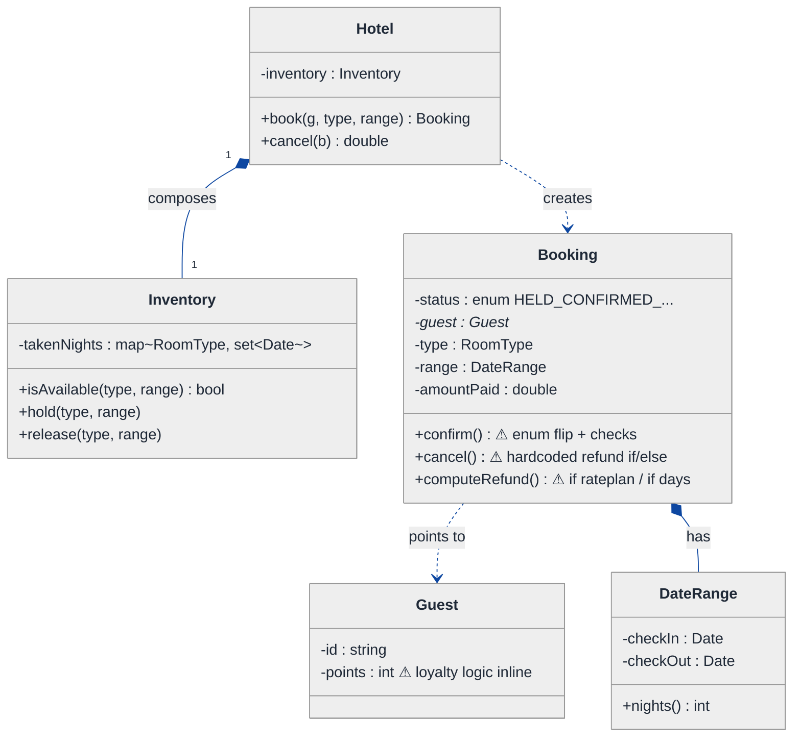
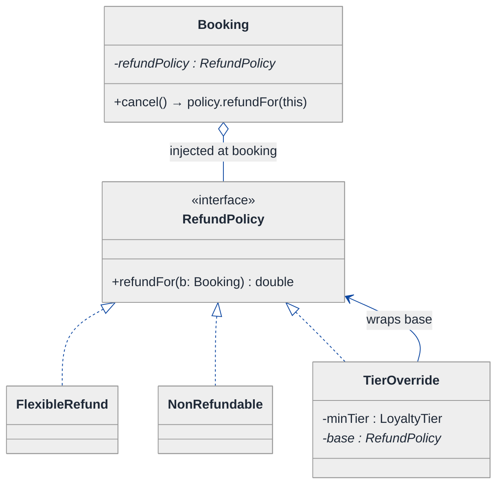
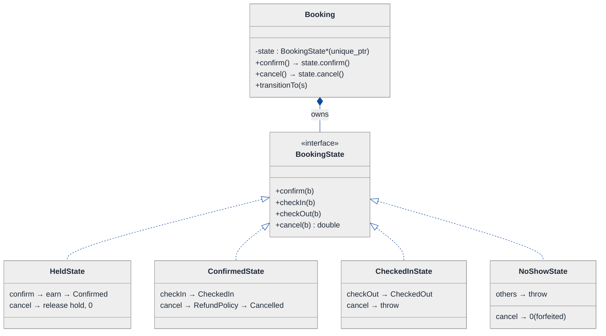
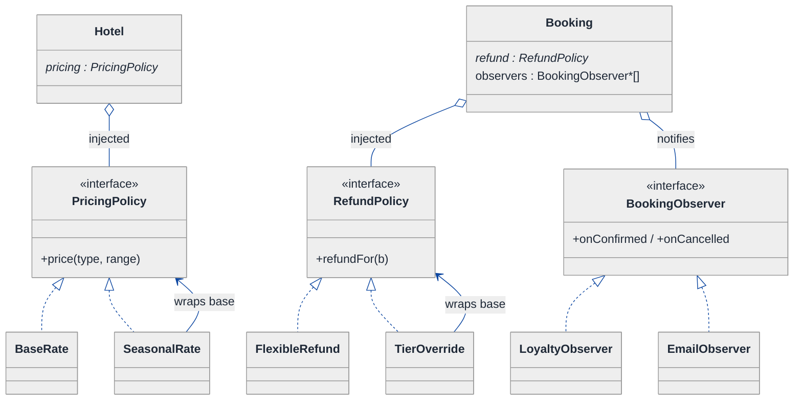
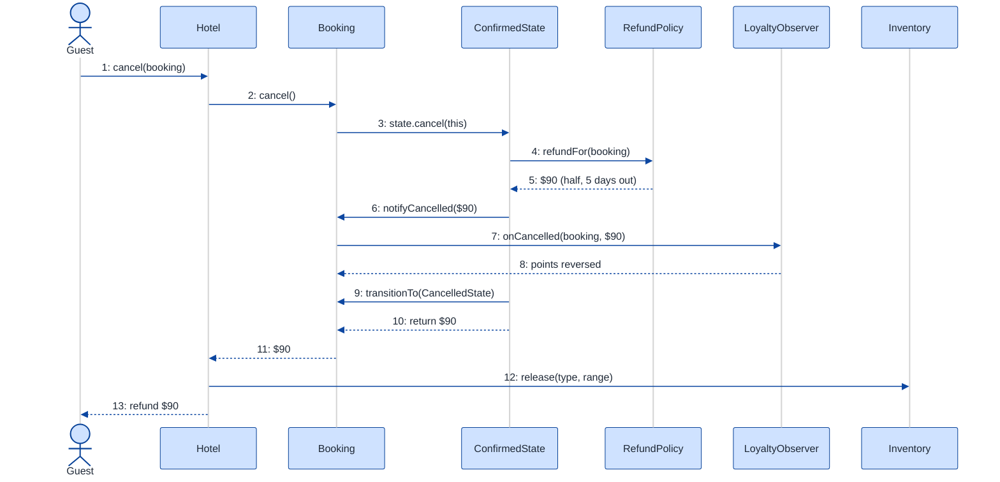

# Hotel Booking System — LLD Walkthrough

> **Difficulty:** Hard · **Time:** ~45 min · **Pattern focus:** Strategy (refund policy + pricing) + State (booking lifecycle) + Decorator (policy stacking) + Observer (loyalty)
>
> **Problem source(s):** GID `OOD1` in [`./EXTRACTED_QUESTIONS.md`](./EXTRACTED_QUESTIONS.md), bucket `Object_Oriented_Design`. A common variant of the "design a reservation system" family.
>
> **Diagrams:** inline mermaid (renders natively in GitHub / VS Code). Same canonical theme block as every LLD walkthrough.

---

## How to use this file

Paced for a candidate seeing hotel booking for the first time. Reading time: ~45 minutes if you sketch each iteration by hand. (This is a Hard walkthrough — four patterns interact: Strategy, State, Decorator, and Observer.) **The lesson: don't reach for design patterns up front — DERIVE them by building the naive design first, watching it break under a handful of hypothetical changes, and reaching for ONE pattern per painful axis.** Here that means Strategy for the refund-policy and pricing algorithms, and State for the booking lifecycle.

**Map of this file (15 sections):**

1. Problem statement + clarifying questions
2. Plain-English restatement
3. Why this matters
4. Mental model
5. Try it yourself first
6. Entity & verb extraction
7. **Iteration 1: the naive design** — what we'd write first
8. **Where the naive design hurts** — four future requirements, one painful diff each
9. **Pivot 1: Strategy for refund policy** — the most painful axis first
10. **Pivot 2: State for the booking lifecycle** — internal transitions, not external swaps
11. **Pivot 3: Strategy for pricing + Observer for loyalty** — the remaining axes
12. Final UML class diagram
13. Skeleton code (C++)
14. Key flow — sequence diagram
15. Extensibility re-check + anti-patterns + how to think aloud + self-check

---

## 1. Problem statement + clarifying questions

**Prompt (typical phrasing):** "Design a hotel booking system supporting room types (single, double, suite), date-range availability checks, booking confirmation, cancellation with refund policy, and loyalty points tracking."

**Clarifying questions to ask BEFORE drawing anything:**

1. **Room types?** Just single / double / suite, or also accessible / connecting / penthouse later? Can a guest who booked a double be upsold into a suite at check-in?
2. **Availability granularity?** Per-night inventory (a room is booked for a date *range*), or per-room-instance vs per-room-type pool? Do we oversell with a buffer, or never?
3. **Refund policy?** Single fixed policy, or does it vary by rate plan (flexible vs non-refundable), by how many days before check-in, by loyalty tier?
4. **Pricing model?** Flat per-night, or seasonal / weekend / length-of-stay discounts / promo codes stacked?
5. **Booking lifecycle?** What states exist — held, confirmed, checked-in, checked-out, cancelled, no-show? Which transitions are legal?
6. **Loyalty points?** Earned on what (amount paid, nights stayed)? Forfeited on cancellation? Reversed on refund?
7. **Concurrency?** Two guests racing for the last room on overlapping dates — must not both succeed.
8. **Payment?** Out of scope here (assume a payment gateway exists) or do we model it?

**Assumptions if interviewer dodges:** three room types backed by a per-type inventory pool, per-night date-range availability, refund policy that varies by rate plan AND days-before-check-in, seasonal+weekend pricing, lifecycle of Held → Confirmed → CheckedIn → CheckedOut plus Cancelled / NoShow, loyalty points earned on amount paid and reversed on refund, single-threaded for now (concurrency discussed in §15).

---

## 2. Plain-English restatement

We're building the software behind a hotel's reservation desk. The system must: check whether a room of a given type is free across a date range, hold and then confirm a booking, take the guest through a lifecycle (confirmed → checked-in → checked-out), cancel a booking and compute the correct refund based on a policy, and track loyalty points that move as money moves. The design must accommodate **new room types, new refund policies, new pricing rules, and new lifecycle states without rewriting the core flow.**

---

## 3. Why this matters

This is the reservation-system archetype — it reappears as flight booking, movie-ticket seats, restaurant tables, and meeting-room scheduling. It tests whether you can separate three things that beginners tangle together: **inventory** (what's available across dates), **policy** (how to price and how to refund), and **lifecycle** (what state a booking is in and what's legal next). The senior bar is in DERIVING that pricing and refund are swappable algorithms (Strategy) while the booking's lifecycle is an internally-driven state machine (State) — not asserting it.

---

## 4. Mental model

A hotel is an **inventory of room-nights** + a **rule-book** + a **lifecycle**. The inventory is a calendar: for each room type, which nights are taken. The rule-book has axes that change INDEPENDENTLY: how much a night costs, how much you refund on cancel, how many loyalty points an action earns. The lifecycle is a track every booking rides along, where each station decides which moves are legal.

```
Real-world sketch (NOT a UML diagram yet):

   Room-type inventory (a calendar per type)
   ┌──────────────────────────────────────────────┐
   │ SUITE   Jun1 [█] Jun2 [█] Jun3 [□] Jun4 [□]   │  □ free night
   │ DOUBLE  Jun1 [□] Jun2 [█] Jun3 [█] Jun4 [□]   │  █ booked night
   │ SINGLE  Jun1 [█] Jun2 [□] Jun3 [□] Jun4 [█]   │
   └───────────────────────┬──────────────────────┘
                  ┌─────────┴──────────┐
                  ▼                    ▼
            [ Booking ]          [ Loyalty ledger ]
         Held→Confirmed→...      earn / reverse points
         refund on cancel
```

The KEY insight: the calendar is **inventory**, the booking is **orchestration + lifecycle**, and pricing / refund / loyalty are **policy**. Inventory vs. lifecycle vs. policy is the separation we'll bake into the design.

---

## 5. Try it yourself first

> **Predict before reading on:**
>
> 1. List 5 nouns you'd promote to a class. List 3 nouns you'd leave as fields.
> 2. **If I told you the hotel will launch three refund policies in its first year (flexible, non-refundable, loyalty-tiered), what would change about how you write the `cancel()` method?**
> 3. A booking can be cancelled before check-in but NOT after check-out. Where do you put the logic that rejects an illegal cancellation?

---

## 6. Entity & verb extraction

> **Mini-refresher: noun → class, but not every noun.**
>
> Naive OOD promotes every noun to a class. Senior OOD promotes a noun only if it has both BEHAVIOR and STATE that need to live together. "Check-in date" stays a field; "Booking" becomes a class because it has lifecycle behavior.

**Nouns from the prompt:**

| Noun | Decision | Why |
|---|---|---|
| Hotel | Class (top-level coordinator) | Owns inventory, orchestrates book / cancel |
| RoomType | `enum class` (SINGLE/DOUBLE/SUITE) | A tag, not behavior — drives pricing/inventory lookups |
| Inventory | Class | Per-type calendar; answers availability, holds/releases nights |
| Booking | Class | Lifecycle behavior + the thing we price and refund |
| Guest | Class | Identity + loyalty balance |
| DateRange | Small value class | Check-in/out pair with a `nights()` helper |
| RefundPolicy | (axis — becomes Strategy in §9) | Varies by rate plan + days-before |
| PricingPolicy | (axis — becomes Strategy in §11) | Varies by season/weekend |
| LoyaltyAccount | Class / ledger | Earns and reverses points |
| Money / amount | Field (`double` cents) | No domain behavior of its own |

**Verbs (and the class they live on):**

| Verb | Owner class (naive answer — we'll re-examine) |
|---|---|
| checkAvailability(type, range) | Inventory |
| book(guest, type, range) | Hotel |
| confirm() | Booking |
| checkIn() / checkOut() | Booking |
| cancel() | Booking |
| computeRefund(booking) | Booking (naive) → RefundPolicy (later) |
| priceFor(type, range) | Hotel (naive) → PricingPolicy (later) |
| earnPoints() / reversePoints() | LoyaltyAccount |

**We have NOT introduced any design patterns yet.** Pure nouns + verbs.

---

## 7. <a id="iter-1"></a>Iteration 1: the naive design

Let's write the simplest thing that could possibly work. No design patterns — just classes with methods, an enum for state, and hardcoded if/else for the policies.



**Reader's tour (read top to bottom; ~60 seconds).**

1. **At the top — `Hotel` is the root.** It composes ONE `Inventory` and exposes `book` / `cancel`. Every policy decision lives inside these methods or inside `Booking`. NO injected strategies, NO policy objects.

2. **`Inventory` is the calendar.** A map from `RoomType` to the set of taken nights. `isAvailable` checks no night in the range is taken; `hold` / `release` mutate the set. This part is genuinely fine — inventory is data + simple invariant maintenance, not a varying algorithm.

3. **The `Booking` box — the trouble zone.** Three warning markers (⚠):
   - `status` is an enum. Fine for 3-4 states; will break when we add `NO_SHOW` and need state-specific rules in §8.
   - `computeRefund()` is a hardcoded if/else on rate plan and days-before-check-in. Every new refund rule means surgery here.
   - `cancel()` flips the enum AND calls `computeRefund` AND must touch loyalty — three concerns in one method.

4. **`Guest` carries `points` as a bare int** with the earn/reverse arithmetic inlined wherever money moves. That coupling (booking flow reaching into guest's points) is another smell we'll expose.

5. **`DateRange` is a clean value object** — composed into Booking, with a `nights()` helper. No smell here.

**What's deliberately missing.** No `RefundPolicy`. No `PricingPolicy`. No `BookingState`. No loyalty `Observer`. The naive design doesn't even *acknowledge* these are axes of variation — it bakes a hardcoded answer for each into the methods that use them.

Skeleton code for the naive design (C++):

```cpp
#include <map>
#include <set>
#include <string>
#include <stdexcept>

enum class RoomType     { SINGLE, DOUBLE, SUITE };
enum class RatePlan     { FLEXIBLE, NON_REFUNDABLE };
enum class BookingStatus{ HELD, CONFIRMED, CHECKED_IN, CHECKED_OUT, CANCELLED };

struct Date { int y, m, d; /* comparable; elided */ };
class DateRange {
public:
    DateRange(Date in, Date out) : in_(in), out_(out) {}
    int nights() const { /* date diff */ return 1; }  // elided
    Date checkIn()  const { return in_; }
private:
    Date in_, out_;
};

class Guest {
public:
    explicit Guest(std::string id) : id_(std::move(id)) {}
    int  points() const { return points_; }
    void addPoints(int p) { points_ += p; }            // loyalty logic leaks in here
private:
    std::string id_;
    int points_ = 0;
};

class Inventory {
public:
    bool isAvailable(RoomType t, const DateRange& r) const { /* no night taken */ return true; } // elided
    void hold(RoomType t, const DateRange& r)    { /* insert nights */ }   // elided
    void release(RoomType t, const DateRange& r) { /* erase nights  */ }   // elided
private:
    std::map<RoomType, std::set<int>> takenNights_;
};

class Booking {
public:
    BookingStatus status = BookingStatus::HELD;
    Guest*    guest;
    RoomType  type;
    DateRange range;
    RatePlan  plan;
    double    amountPaid = 0.0;
    int       daysBeforeCheckIn() const { return 10; }  // elided

    void confirm() {
        if (status != BookingStatus::HELD) throw std::runtime_error("Cannot confirm");
        status = BookingStatus::CONFIRMED;
        guest->addPoints(static_cast<int>(amountPaid / 10));   // earn — inlined
    }

    double computeRefund() const {            // hardcoded — will hurt
        if (plan == RatePlan::NON_REFUNDABLE) return 0.0;
        int d = daysBeforeCheckIn();
        if (d >= 7)  return amountPaid;          // full
        if (d >= 1)  return amountPaid * 0.5;    // half
        return 0.0;                              // same-day: nothing
    }

    double cancel() {                          // tangles state + refund + loyalty
        if (status == BookingStatus::CHECKED_OUT) throw std::runtime_error("Already done");
        double refund = computeRefund();
        guest->addPoints(-static_cast<int>(amountPaid / 10));  // reverse — inlined again
        status = BookingStatus::CANCELLED;
        return refund;
    }
};

class Hotel {
public:
    Booking book(Guest& g, RoomType t, const DateRange& r, RatePlan plan) {
        if (!inventory_.isAvailable(t, r)) throw std::runtime_error("No availability");
        inventory_.hold(t, r);
        Booking b; b.guest = &g; b.type = t; b.range = r; b.plan = plan;
        b.amountPaid = priceFor(t, r);
        return b;
    }
    double priceFor(RoomType t, const DateRange& r) const {   // hardcoded rates
        double perNight = (t == RoomType::SUITE) ? 300.0 : (t == RoomType::DOUBLE ? 180.0 : 120.0);
        return perNight * r.nights();
    }
    double cancel(Booking& b) {
        double refund = b.cancel();
        inventory_.release(b.type, b.range);
        return refund;
    }
private:
    Inventory inventory_;
};
```

**This works.** It has zero design patterns. We can check availability, book, confirm, cancel, and adjust points. So what's wrong with it?

---

## 8. <a id="naive-pain"></a>Where the naive design hurts

The interviewer slides a piece of paper across the desk: "Here are four requirements coming next quarter. Walk me through what changes."

### Change A: "Loyalty-tiered refunds — Gold members always get a full refund"

In the naive design:
- `Booking::computeRefund()` needs to query the guest's tier → another branch at the top of the if/else.
- But tier lives on `Guest`, so `computeRefund` now reaches across into Guest state for a policy decision.
- **The change touches `computeRefund` AND couples refund logic to Guest internals.**

### Change B: "Non-refundable + 24h-grace hybrid — free cancel within 24h of booking even on non-refundable rates"

In the naive design:
- The clean `if (NON_REFUNDABLE) return 0` short-circuit is now wrong.
- `computeRefund` grows a nested time-since-booking branch inside the rate-plan branch.
- **Two rules in and `computeRefund` is a branching thicket. Three rules in, it's unreadable.**

### Change C: "No-show handling — guest never checks in; charge first night, forfeit the rest, no refund"

In the naive design:
- `BookingStatus` enum has no `NO_SHOW`.
- A no-show is reached *automatically* the night after check-in date — it's a lifecycle transition, not a caller action.
- `cancel()` assumes a normal flow; no-show needs its own fee + its own loyalty rule.
- **Add `if (status == NO_SHOW)` branches in `cancel()`, `computeRefund()`, and confirmation logic. Three sites.**

### Change D: "Seasonal + weekend pricing, stacked with a promo code"

In the naive design:
- `Hotel::priceFor()` is a hardcoded ternary by room type.
- Add season multiplier, weekend surcharge, promo discount → the ternary becomes a 15-line mess.
- **Next pricing rule → another block in the same method. And loyalty earns off the final price, so a pricing bug becomes a loyalty bug.**

### The pattern of pain

| Change | Files touched | Smell |
|---|---|---|
| A. Tiered refund | `Booking::computeRefund` | "Refund logic reaches into Guest internals." |
| B. Hybrid refund | `Booking::computeRefund` (thicket) | "One method accumulates every refund rule." |
| C. No-show | `cancel` + `computeRefund` + confirm | "Status enum + switch can't express new lifecycle states." |
| D. Stacked pricing | `Hotel::priceFor` (monstrous) | "Single method accumulates every pricing rule; loyalty piggybacks on it." |

**Three axes of pain dominate:** *algorithm* variability (refund, pricing), *lifecycle* variability (booking status), and a *cross-cutting* concern (loyalty fires whenever money moves, scattered across `confirm` and `cancel`).

> **Pivot question:** "What pattern handles 'an algorithm that varies, swapped by the caller / config'? What pattern handles 'a lifecycle with state-specific behavior'? What pattern handles 'a side effect that must fire on every state change'?"
>
> The answers are Strategy, State, and Observer. Let's introduce them one at a time, starting with the most painful axis: refund policy.

---

## 9. <a id="pivot-1"></a>Pivot 1: Strategy for refund policy

> **Mini-refresher: Strategy pattern.**
>
> Encapsulates an algorithm behind an interface so it can be swapped at runtime. The CALLER (or config) decides which strategy to use; the strategy doesn't know about its peers.
>
> Quick example: a `Sorter` takes a `CompareStrategy*` in its constructor. Pass `AscendingCompare` or `DescendingCompare` — the sorter doesn't care which.

> **Mini-refresher: Open/Closed Principle (the "O" in SOLID).**
>
> Software should be OPEN for extension but CLOSED for modification. Adding a new refund rule should mean writing a NEW class, not editing an existing method. The hardcoded if/else violates this; every new rule reopens `computeRefund`.

**Why Strategy fits refund.** A refund is an algorithm: `given a booking, return an amount`. It varies (flexible, non-refundable, loyalty-tiered, hybrid-grace) and the choice is made externally — by the rate plan attached at booking time, not by the booking deciding for itself. That's textbook Strategy.

One of the concrete refund variants below (`TierOverride`) doesn't compute a refund from scratch — it WRAPS another `RefundPolicy` and adjusts the result. That's a second pattern riding on top of Strategy, so a refresher before you meet it:

> **Mini-refresher: Decorator pattern.**
>
> A Decorator implements the SAME interface as the thing it wraps, holds a pointer to a wrapped instance of that interface, and adds behavior before/after delegating to it. Because the wrapper IS-A `RefundPolicy` and HAS-A `RefundPolicy`, decorators chain: `TierOverride(GraceWindow(NonRefundable))` is still just a `RefundPolicy`. You add behavior by stacking objects at runtime, not by editing classes.
>
> Quick example: `BufferedReader` wraps a `Reader`, adding buffering while still being a `Reader` you can pass anywhere a `Reader` is expected.
>
> **Decorator vs inheritance.** A `GoldNonRefundableGraceWindow` subclass would need a new class for every COMBINATION (combinatorial explosion). Decorators compose linearly: N independent behaviors → N wrapper classes, stacked in any order.
>
> **Decorator vs Strategy.** Both hide behind an interface. *Strategy:* the caller picks ONE algorithm. *Decorator:* you pick a base algorithm AND wrap it with modifiers that each delegate inward. Here they cooperate — `RefundPolicy` is the Strategy interface; `TierOverride`/`GraceWindow` are Decorators over it. *Rule of thumb:* if a variant's job is "adjust the result of another variant of the same interface" → Decorator. If it's a standalone algorithm → plain Strategy.

**The refactor (just the affected part):**

```cpp
class Booking;  // forward — defined in Pivot 2

class RefundPolicy {
public:
    virtual ~RefundPolicy() = default;
    virtual double refundFor(const Booking& b) const = 0;
};

class FlexibleRefund : public RefundPolicy {
public:
    double refundFor(const Booking& b) const override {
        int d = b.daysBeforeCheckIn();
        if (d >= 7) return b.amountPaid();
        if (d >= 1) return b.amountPaid() * 0.5;
        return 0.0;
    }
};

class NonRefundable : public RefundPolicy {
public:
    double refundFor(const Booking&) const override { return 0.0; }
};

// Decorator-style composition — wrap another policy with a tier override
class TierOverride : public RefundPolicy {
public:
    TierOverride(LoyaltyTier minTier, std::unique_ptr<RefundPolicy> base)
        : minTier_(minTier), base_(std::move(base)) {}
    double refundFor(const Booking& b) const override {
        if (b.guest().tier() >= minTier_) return b.amountPaid();  // Gold → full
        return base_->refundFor(b);
    }
private:
    LoyaltyTier                    minTier_;
    std::unique_ptr<RefundPolicy>  base_;
};
// GraceWindow decorator (Change B) elided — same shape: wrap + short-circuit
```

**What changed — visualized.** Just the refund slice:



**Tour of the after-state.**

1. **Booking gained a `refundPolicy` field** — a pointer to the `RefundPolicy` interface, set when the booking is created (the rate plan picks it). The OPEN diamond marks aggregation: the booking uses the policy.

2. **The `<<interface>>` box** is the abstract base, one virtual method `refundFor(Booking&) → double`. Narrower than the old `computeRefund` — it takes a booking, returns a number.

3. **Concrete implementations.** `FlexibleRefund` is the old sliding-scale logic, now isolated. `NonRefundable` returns 0. `TierOverride` is a DECORATOR — it holds another `RefundPolicy*` and returns full refund for Gold members, else delegates to the wrapped base. **Composition of policies, not subclassing.**

4. **Powerful consequence.** You can compose `TierOverride(Gold, GraceWindow(24h, NonRefundable))` — "Gold always full; otherwise non-refundable but free within 24h." The naive design couldn't express this without nested if/else.

5. **Change A and Change B from §8 now land cleanly.** Tiered refund → `TierOverride` decorator. Hybrid grace → a `GraceWindow` decorator. Combinable. No surgery in `Booking::cancel`.

**Pattern-discrimination cheatsheet — Strategy vs Template Method.**
- *Strategy:* whole algorithm in one swappable object, chosen at runtime via composition.
- *Template Method:* algorithm skeleton in a base class; subclasses fill in hooks via inheritance.
- *Rule of thumb:* variants that COMBINE or change at runtime → Strategy. A fixed skeleton with 2-3 stable variants → Template Method.

We chose Strategy because refund variants COMPOSE (tier override × grace window × base plan) — you can't compose Template Method subclasses.

---

## 10. <a id="pivot-2"></a>Pivot 2: State for the booking lifecycle

Change C from §8 is still painful — `NO_SHOW`, state-specific cancellation rules, transitions that fire automatically. Refund Strategy doesn't help because the variability is not in the ALGORITHM, it's in WHAT'S VALID NEXT.

> **Mini-refresher: State pattern.**
>
> Each lifecycle state is its own class. The context object delegates an operation to its current state, and THE STATE decides what the next state is. Transitions are INTERNAL, driven by events the context receives — the caller never says "go to CheckedIn."

**Why State (not Strategy).** The choice of state is NOT picked by the caller — it's driven by what the booking has been through. A `Confirmed` booking can `checkIn()` or `cancel()`. A `CheckedIn` booking can `checkOut()` but cannot be `cancel()`led for a refund. A `CheckedOut` booking can do nothing. Calling `cancel()` on a `CheckedOut` booking isn't meaningful — it should fail. The lifecycle is the OBJECT'S concern, not the caller's.

**The refactor (just the lifecycle part):**

```cpp
class Booking;  // forward

class BookingState {
public:
    virtual ~BookingState() = default;
    virtual void confirm(Booking& b)  = 0;
    virtual void checkIn(Booking& b)  = 0;
    virtual void checkOut(Booking& b) = 0;
    virtual double cancel(Booking& b) = 0;   // returns refund amount
};

class HeldState : public BookingState {
public:
    void   confirm(Booking& b) override;                       // → Confirmed (earn points)
    void   checkIn(Booking&)  override { throw std::runtime_error("Confirm first"); }
    void   checkOut(Booking&) override { throw std::runtime_error("Confirm first"); }
    double cancel(Booking& b) override;                        // release hold, 0 charged
};

class ConfirmedState : public BookingState {
public:
    void   confirm(Booking&)  override { throw std::runtime_error("Already confirmed"); }
    void   checkIn(Booking& b) override;                       // → CheckedIn
    void   checkOut(Booking&) override { throw std::runtime_error("Check in first"); }
    double cancel(Booking& b) override;                        // refund via RefundPolicy → Cancelled
};

class CheckedInState : public BookingState {
public:
    void   confirm(Booking&)  override { throw std::runtime_error("In stay"); }
    void   checkIn(Booking&)  override { throw std::runtime_error("Already checked in"); }
    void   checkOut(Booking& b) override;                      // → CheckedOut
    double cancel(Booking&)   override { throw std::runtime_error("Cannot cancel mid-stay"); }
};

class NoShowState : public BookingState {   // Change C lands here as ONE new class
public:
    void   confirm(Booking&)  override { throw std::runtime_error("No-show"); }
    void   checkIn(Booking&)  override { throw std::runtime_error("No-show window passed"); }
    void   checkOut(Booking&) override { throw std::runtime_error("No-show"); }
    double cancel(Booking&)   override { return 0.0; }         // first night already forfeited
};
// CheckedOutState / CancelledState are terminal — every method throws. Elided.
```

The `Booking` itself becomes thin — it delegates to its state and exposes a `transitionTo`:

```cpp
class Booking {
public:
    Booking(Guest& g, RoomType t, DateRange r, std::unique_ptr<RefundPolicy> rp)
        : guest_(g), type_(t), range_(r), refund_(std::move(rp)),
          state_(std::make_unique<HeldState>()) {}

    void   confirm()  { state_->confirm(*this); }
    void   checkIn()  { state_->checkIn(*this); }
    void   checkOut() { state_->checkOut(*this); }
    double cancel()   { return state_->cancel(*this); }
    void   transitionTo(std::unique_ptr<BookingState> s) { state_ = std::move(s); }

    const Guest&        guest()  const { return guest_; }
    double              amountPaid() const { return amountPaid_; }
    int                 daysBeforeCheckIn() const { return 10; }       // elided
    const RefundPolicy& refundPolicy() const { return *refund_; }
private:
    Guest&                          guest_;
    RoomType                        type_;
    DateRange                       range_;
    double                          amountPaid_ = 0.0;
    std::unique_ptr<RefundPolicy>   refund_;
    std::unique_ptr<BookingState>   state_;
};

// Deferred state-method bodies (defined after Booking is complete):
inline double ConfirmedState::cancel(Booking& b) {
    double refund = b.refundPolicy().refundFor(b);   // Strategy + State cooperate
    b.transitionTo(std::make_unique<CancelledState>());
    return refund;
}
```

**What changed — visualized.** Just the lifecycle slice:



**Tour of the after-state.**

1. **The `BookingStatus` enum is gone.** Replaced by a `state` field of type `std::unique_ptr<BookingState>` — exclusive ownership.

2. **Booking's `confirm` / `checkIn` / `checkOut` / `cancel` became one-liners** that delegate to the current state. **NO `if (status == X)` branching anywhere.**

3. **The interface declares the contract** — four operations. Each concrete state must implement all four, even when the answer is "throw" (e.g., `CheckedInState::cancel` throws because you can't cancel mid-stay).

4. **Four representative states** (terminal `CheckedOut`/`Cancelled` elided). `HeldState::confirm` earns points and transitions to Confirmed; `ConfirmedState::cancel` refunds via the policy then transitions to Cancelled; `NoShowState` plugs in the no-show flow as ONE new class.

5. **Transitions live WITH the state.** Each state's method calls `b.transitionTo(...)` when its work is done. That's the whole point: each state knows what comes next, not the Booking and not the Hotel.

**Adding a no-show state is one new class.** Change C from §8 = write `NoShowState`, done. No edits to other states, to `Booking`, or to `Hotel`. Open/closed.

**Pattern-discrimination cheatsheet — Strategy vs State.**
- *Strategy:* the CALLER picks which one to use; strategies are usually unaware of each other.
- *State:* the OBJECT picks its next state internally; states know about each other (a state's method can `transitionTo` another).
- *Rule of thumb:* if `booking.setRefundPolicy(x)` is set externally → Strategy. If `booking.checkIn()` flips the state internally → State.

---

## 11. <a id="pivot-3"></a>Pivot 3: Strategy for pricing + Observer for loyalty

Changes A, B, C are solved. Change D (stacked pricing) and the scattered loyalty arithmetic are not.

### 11a. Pricing — same shape as refund (Strategy)

Pricing is an algorithm picked by config: `given a room type + date range, return an amount`. Identical shape to Pivot 1.

```cpp
class PricingPolicy {
public:
    virtual ~PricingPolicy() = default;
    virtual double price(RoomType t, const DateRange& r) const = 0;
};
class BaseRate     : public PricingPolicy { /* perNight[type] * nights */ };
class SeasonalRate : public PricingPolicy {     // decorator: wraps a base, multiplies in-season
public:
    SeasonalRate(std::unique_ptr<PricingPolicy> base, double mult)
        : base_(std::move(base)), mult_(mult) {}
    double price(RoomType t, const DateRange& r) const override {
        double p = base_->price(t, r);
        return inSeason(r) ? p * mult_ : p;
    }
private:
    std::unique_ptr<PricingPolicy> base_;
    double mult_;
};
class PromoCode    : public PricingPolicy { /* decorator: subtract discount; elided */ };
```

Now `Hotel` holds a `PricingPolicy*` injected at construction; `priceFor` is gone. Compose `PromoCode(SeasonalRate(BaseRate))` — Change D lands as decorators.

### 11b. Loyalty — a side effect on every state change (Observer)

> **Mini-refresher: Observer pattern.**
>
> A subject maintains a list of observers and notifies them when something happens. Observers react; the subject doesn't know what they do. Use it when one event must trigger several independent side effects (here: loyalty, plus future email / analytics).

**Why Observer (not just calling `guest.addPoints` inline).** In the naive design, loyalty arithmetic was sprinkled across `confirm` and `cancel`. That's a *cross-cutting* concern — it fires on lifecycle changes but isn't the lifecycle's job. Make `Booking` a subject that emits events; `LoyaltyObserver` listens and adjusts points. Tomorrow an `EmailObserver` or `AnalyticsObserver` plugs in with zero edits to the states.

```cpp
class BookingObserver {
public:
    virtual ~BookingObserver() = default;
    virtual void onConfirmed(const Booking& b) = 0;
    virtual void onCancelled(const Booking& b, double refund) = 0;
};

class LoyaltyObserver : public BookingObserver {
public:
    explicit LoyaltyObserver(LoyaltyLedger& ledger) : ledger_(ledger) {}
    void onConfirmed(const Booking& b) override {
        ledger_.earn(b.guest(), static_cast<int>(b.amountPaid() / 10));
    }
    void onCancelled(const Booking& b, double refund) override {
        ledger_.reverse(b.guest(), static_cast<int>(refund / 10));   // reverse proportional to refund
    }
private:
    LoyaltyLedger& ledger_;   // back-reference; observer does not own the ledger
};
// EmailObserver / AnalyticsObserver elided — same interface, different reaction.
```

States now call `b.notifyConfirmed()` / `b.notifyCancelled(refund)` instead of poking `guest.addPoints` directly. The loyalty rule lives in ONE class.

> **Pattern-discrimination cheatsheet — Observer vs Strategy.**
> - *Strategy:* "which algorithm computes the result I asked for?" One result, one chosen variant.
> - *Observer:* "who else needs to know this happened?" Zero-to-many independent reactions, fire-and-forget.
> - *Rule of thumb:* you want a RETURN VALUE → Strategy. You want SIDE EFFECTS to fan out → Observer.

> **Mini-refresher: why three Strategy hierarchies don't share one interface.**
>
> Strategy is a *role*, not a type. `RefundPolicy`, `PricingPolicy`, and `BookingObserver` have nothing in common at the type level (different inputs/outputs). Don't unify them under a generic `Strategy<T>` — that's premature genericism.

**The lesson.** Once we recognized "algorithm picked by caller/config" as the shape for refund in Pivot 1, pricing fell out for free. Loyalty needed a *different* shape (fan-out side effect) → Observer. **Pattern recognition makes subsequent design cheap, and naming the axis tells you which pattern.**

---

## 12. <a id="fig-class-diagram"></a>Final class diagram

One huge diagram becomes a wall of boxes, so we split by concern. Two of the three sub-views were already drawn earlier and are unchanged in shape — the inventory spine is the [iteration-1 diagram](#iter-1) and the lifecycle is the [Pivot-2 State diagram](#pivot-2) — so those are summarized in prose and only the genuinely-new consolidated view (the policy injection, §12.2) gets a fresh diagram. The structural insight at the end ties all three together.

### 12.1 The inventory spine — what the hotel OWNS (unchanged from naive)

No new diagram here: **the ownership spine is byte-for-byte the shape from the [iteration-1 diagram](#iter-1)** — Hotel composes one Inventory (filled diamond, same lifetime); Booking owns its DateRange (composition) but only *refers* to a Guest (open arrow — the guest outlives any single booking); Inventory is still `takenNights : map<RoomType, set<Date>>` with `isAvailable` / `hold` / `release`. Inventory is data + invariant, not a varying algorithm, so none of the pivots touched it. The only field that grew is `Guest` gaining a `tier : LoyaltyTier`, consumed by the refund decorators. **Everything genuinely new lives in the policy and lifecycle sub-views below — that's where the design earned its patterns.**

### 12.2 The policy injection — what varies (Strategy + Decorator + Observer)



**Tour of 12.2.**

1. **Two Strategy axes and one Observer axis**, all hung off open diamonds (aggregation — used, not owned-for-life). `PricingPolicy` is hotel-wide; `RefundPolicy` is per-booking (the rate plan picks it); `BookingObserver[]` is a list the booking notifies.

2. **Each interface has a concrete family.** Pricing → `BaseRate` + `SeasonalRate`/`PromoCode` decorators. Refund → `FlexibleRefund`, `NonRefundable`, `TierOverride` decorator. Observers → `LoyaltyObserver`, `EmailObserver`.

3. **The decorators wrap a base of their own interface** (the small `wraps base` arrows). That's how seasonal × promo and tier × grace stack without nested if/else.

4. **The structural insight.** Variability the naive design hardcoded inside `priceFor`, `computeRefund`, and inline loyalty arithmetic is now lifted into its own type hierarchies. **The hotel's core becomes orchestration; the variation becomes hot-swap policy.**

### 12.3 The lifecycle — Booking's State machine (see the Pivot-2 diagram)

No new diagram: the lifecycle hierarchy is exactly the [Pivot-2 State diagram](#pivot-2) — `Booking` owns ONE `BookingState` via `unique_ptr` and swaps the pointer on each transition; `confirm`/`checkIn`/`checkOut`/`cancel` are one-line delegations with no status-switch anywhere. The final design adds just the **two terminal states** that Pivot 2 elided: `CheckedOutState` and `CancelledState`, both of which throw on every method. So the full concrete set is six: `HeldState`, `ConfirmedState`, `CheckedInState`, `CheckedOutState`, `NoShowState`, `CancelledState`. The valid transition graph is `Held → Confirmed → CheckedIn → CheckedOut`, with `Confirmed → Cancelled` and `Confirmed → NoShow` as branches. **The class hierarchy IS the transition table** — adding a state is adding a class, never editing a switch.

### Structural insight (ties the inventory spine, policy injection, and lifecycle together)

| Concern | Pattern used | Why |
|---|---|---|
| **Inventory** (RoomType, Inventory, DateRange) | Plain ownership + enum | RoomType is a tag; the calendar is data + invariant, no varying algorithm |
| **Pricing** | Strategy, INJECTED into Hotel | Hotel-wide config picks the variant; decorators stack season/promo |
| **Refund** | Strategy, INJECTED into Booking | Rate plan picks it per booking; decorators stack tier/grace |
| **Lifecycle** (Held → Confirmed → … / NoShow) | State, OWNED by Booking | Booking controls transitions; states validate what's legal next |
| **Loyalty** (and future email/analytics) | Observer, ATTACHED to Booking | Cross-cutting side effects fan out on each state change |

The big lesson: **inheritance is used only for the State and Strategy/Observer class families** — every "varies independently" axis becomes composition over an interface. *Inheritance for identity, composition for behavior variation.*

---

## 13. Skeleton code (C++)

> Show the SHAPES, not the full impl. The pivots (§9–§11) already showed each pattern's interface and 1-2 concretes in isolation. This section shows ONLY the **wiring** — how `Booking` plays State-context + Observer-subject at once, and how `Hotel::book` injects the strategies and observers. Everything already seen in a pivot is collapsed to `// elided (see §N)`.

```cpp
// Value types, Inventory, and each pattern's interface + concretes are as shown
// in the pivots:
//   PricingPolicy + BaseRate + SeasonalRate/PromoCode decorators ........ §11a
//   RefundPolicy  + FlexibleRefund + NonRefundable + TierOverride ........ §9
//   BookingObserver + LoyaltyObserver (+ EmailObserver) .................. §11b
//   BookingState  + HeldState/ConfirmedState/CheckedInState/NoShowState .. §10
// elided here to avoid restating them.

// ── Booking: ONE object wearing two hats — State context + Observer subject ──
// (this co-residence is the integration shape the pivots showed only separately)
class Booking {
public:
    Booking(Guest& g, RoomType t, DateRange r, std::unique_ptr<RefundPolicy> rp)
        : guest_(g), type_(t), range_(std::move(r)), refund_(std::move(rp)),
          state_(std::make_unique<HeldState>()) {}

    // State delegation — every verb forwards to the current state, zero branching
    void   confirm()  { state_->confirm(*this); }
    void   checkIn()  { state_->checkIn(*this); }
    void   checkOut() { state_->checkOut(*this); }
    double cancel()   { return state_->cancel(*this); }
    void   transitionTo(std::unique_ptr<BookingState> s) { state_ = std::move(s); }

    // Observer subject — states call these; they fan out to all listeners
    void   addObserver(BookingObserver* o) { observers_.push_back(o); }
    void   notifyConfirmed()           { for (auto* o : observers_) o->onConfirmed(*this); }
    void   notifyCancelled(double ref) { for (auto* o : observers_) o->onCancelled(*this, ref); }

    const Guest&        guest()        const { return guest_; }
    double              amountPaid()   const { return amountPaid_; }
    void                setAmountPaid(double a) { amountPaid_ = a; }
    int                 daysBeforeCheckIn() const { return 10; }   // elided
    const RefundPolicy& refundPolicy() const { return *refund_; }
private:
    Guest&                          guest_;        // refers; does not own
    RoomType                        type_;
    DateRange                       range_;
    double                          amountPaid_ = 0.0;
    std::unique_ptr<RefundPolicy>   refund_;       // owns its policy   (Strategy)
    std::unique_ptr<BookingState>   state_;        // owns current state (State)
    std::vector<BookingObserver*>   observers_;    // observes; does not own (Observer)
};

// The one method where all three patterns meet (deferred until Booking is complete):
inline double ConfirmedState::cancel(Booking& b) {
    double refund = b.refundPolicy().refundFor(b);       // Strategy → one return value
    b.notifyCancelled(refund);                           // Observer  → fan-out side effects
    b.transitionTo(std::make_unique<CancelledState>());  // State     → internal transition
    return refund;
}

// ── Hotel: the top-level coordinator — the dependency-injection wiring ──
class Hotel {
public:
    explicit Hotel(std::unique_ptr<PricingPolicy> pricing) : pricing_(std::move(pricing)) {}

    std::unique_ptr<Booking> book(Guest& g, RoomType t, const DateRange& r,
                                  std::unique_ptr<RefundPolicy> rp,   // rate plan picks this
                                  BookingObserver* loyalty) {
        if (!inventory_.isAvailable(t, r)) throw std::runtime_error("No availability");
        inventory_.hold(t, r);
        auto b = std::make_unique<Booking>(g, t, r, std::move(rp));
        b->setAmountPaid(pricing_->price(t, r));   // Strategy: hotel-wide pricing
        b->addObserver(loyalty);                    // Observer: wire the listener in
        return b;
    }
    double cancel(Booking& b) {
        double refund = b.cancel();
        // inventory_.release(b.type(), b.range());  // getters elided
        return refund;
    }
private:
    Inventory                       inventory_;
    std::unique_ptr<PricingPolicy>  pricing_;   // injected (Strategy)
};
```

---

## 14. <a id="fig-sequence"></a>Key flow — sequence diagram

The interesting moment is **cancel-with-refund**, because that's where State, Strategy, and Observer all cooperate in one call.



**Tour of the cancel flow. Read slowly — three patterns meet here.**

1. **Guest asks Hotel to cancel.** Hotel is a thin boundary; it forwards to the booking.

2. **Hotel calls `Booking::cancel()`**, which delegates straight to the current state via `state_->cancel(*this)`. **If the state were `CheckedInState`, this would throw "Cannot cancel mid-stay" — no validation logic on Booking itself.** The class hierarchy IS the validation.

3. **`ConfirmedState::cancel` does the real work.** Three sub-steps you can see in the messages:
   - a. `refundFor(booking)` — delegates to the booking's INJECTED `RefundPolicy`. **Strategy in play (one return value).**
   - b. `notifyCancelled($90)` — fans out to every observer; `LoyaltyObserver` reverses points. **Observer in play (side effects, no return value the state cares about).**
   - c. `transitionTo(CancelledState)`. **State in play (internal transition).**

4. **Refund bubbles back; Hotel releases the inventory.** Releasing nights is the Inventory's concern — the state machine doesn't touch the calendar.

**What's NOT shown — and why it matters.** You don't see `if (booking.status == CONFIRMED)` anywhere. That's the point of State: invalid operations are made impossible by polymorphism, not by runtime checks scattered through the code. And you don't see `guest.addPoints(...)` inside the state — loyalty is decoupled behind the Observer, so adding an `EmailObserver` later touches zero existing code.

---

## 15. Extensibility re-check + anti-patterns + how to think aloud + self-check

### Extensibility re-check

Revisit the four changes from [§8](#naive-pain). For each, name the SINGLE class that changes.

| Change | Naive design impact | Final design impact |
|---|---|---|
| A. Tiered refund | `computeRefund` + Guest coupling | New `TierOverride : RefundPolicy` decorator. Done. |
| B. Hybrid grace | `computeRefund` thicket | New `GraceWindow : RefundPolicy` decorator. Compose. Done. |
| C. No-show | `cancel` + `computeRefund` + confirm | New `NoShowState : BookingState` class. Done. |
| D. Stacked pricing | `priceFor` monstrous | New `SeasonalRate` / `PromoCode : PricingPolicy` decorators. Done. |
| (Bonus) Email on confirm | edit `confirm` everywhere | New `EmailObserver : BookingObserver`. Done. |

Every change is exactly ONE new class. That's the open/closed principle in practice. If a future requirement makes you change Inventory, Pricing, Refund, AND Booking together — go back to §6 and re-identify variability points; you missed one.

### Common confusion + traps

1. **"Should each RoomType be a subclass (`Single`, `Double`, `Suite`)?"** Usually wrong. The difference between room types is *data* (price, capacity) and *availability lookup*, not behavior. One enum + a price map + inventory pool beats three nearly-empty subclasses.

2. **"Why not enum + switch instead of State?"** Works for 3 states. Falls apart at 6 (Held/Confirmed/CheckedIn/CheckedOut/NoShow/Cancelled) because the legal-transition matrix becomes N² switches scattered across `confirm`, `checkIn`, `cancel`, …

3. **"Why is RefundPolicy on Booking but PricingPolicy on Hotel?"** Pricing is a hotel-wide config (everyone gets the same seasonal rates). Refund is per-booking — it's fixed by the rate plan chosen at booking time. Put the strategy where the variability lives.

4. **"Why Observer for loyalty instead of just calling `addPoints`?"** Because loyalty is a side effect that fans out, and tomorrow there will be more listeners (email, analytics, fraud-check). Inline calls couple every state to every side effect.

5. **"`unique_ptr` for state AND strategies AND raw pointers for observers — why the mix?"** Booking exclusively owns its current state and its refund policy → `unique_ptr`. Observers are owned elsewhere (the app wires them up and they outlive a single booking) → non-owning raw pointer (or `weak_ptr` if lifetimes are uncertain).

### Anti-patterns

- **"God class Hotel"** — owning pricing, refund, lifecycle, and loyalty inline. Pull each into a collaborator.
- **"Inheritance chain for variations"** — `RefundableBooking → FlexibleBooking → GoldFlexibleBooking`. Switch to composition + Strategy.
- **"Tag-driven if/else"** — `if (plan == NON_REFUNDABLE) … else if …` inside `computeRefund`. Use the Strategy interface; let polymorphism dispatch.
- **"Anemic Booking"** — a Booking that's a data bag with only getters/setters. Bookings have lifecycle BEHAVIOR; put it on the class via State.
- **"Loyalty leakage"** — `guest.addPoints(...)` sprinkled through `confirm`, `cancel`, `checkOut`. Centralize behind an Observer.
- **"Singleton-everything"** — making Hotel a singleton because "there's one hotel." A chain has many. Inject instead.

### How to think aloud

> "OK, hotel booking. Let me clarify scope. [Asks 4-6 questions from §1.] Got it.
>
> Nouns: Hotel, Inventory, Booking, Guest, DateRange, RoomType. RoomType is a tag, not a hierarchy. Inventory is a calendar. Booking has a lifecycle.
>
> I'll start NAIVE — no patterns. `Hotel::book` checks inventory, holds nights, prices the stay. `Booking` has a status enum, a `computeRefund` with hardcoded if/else, a `cancel` that flips state + refunds + pokes the guest's points.
>
> Now stress-test. Tiered refunds → `computeRefund` reaches into Guest. Hybrid grace → it becomes a thicket. No-show → new lifecycle state the enum can't express. Stacked pricing → `priceFor` balloons, and loyalty piggybacks on it.
>
> Pain clusters into three axes: algorithm variation (refund, pricing), lifecycle state (booking), and a cross-cutting side effect (loyalty). Strategy, State, Observer.
>
> Pivot 1: refund becomes a `RefundPolicy` Strategy — Flexible, NonRefundable, plus a TierOverride decorator. Injected per booking by the rate plan. `computeRefund` is gone.
>
> Pivot 2: lifecycle becomes a State machine — Held/Confirmed/CheckedIn/CheckedOut/NoShow/Cancelled. Each state validates what's legal; cancelling a CheckedIn booking throws.
>
> Pivot 3: pricing is the same shape as refund (Strategy, decorators for season/promo). Loyalty is different — a fan-out side effect — so it's an Observer the booking notifies on each state change.
>
> Final: Hotel composes Inventory, injects PricingPolicy; Booking owns its State and RefundPolicy and notifies Observers. All four future requirements land as ONE new class each. That's open/closed."

### Self-check

> **Self-check — the question to ask next time.**
>
> When you see "design a [reservation thing] with [policies] and a [lifecycle]," before reaching for inheritance or an enum, ask:
>
> > **"Is this variation a behavior the CALLER/CONFIG picks (Strategy), a lifecycle state the OBJECT transitions through (State), or a side effect that fans out on every change (Observer)?"**
>
> Algorithm with a return value → Strategy. Lifecycle with internal transitions → State. Fan-out side effect → Observer. If all three, use all three — and the class diagram falls out for free.

---

## Cross-references

- **Parent topic manifest:** [`./EXTRACTED_QUESTIONS.md`](./EXTRACTED_QUESTIONS.md)
- **Vertical overview:** [`../../LEARNING.md`](../../LEARNING.md)
- **Template:** [`../../TEMPLATE-v2.md`](../../TEMPLATE-v2.md)
- **Canonical exemplar:** [`./Parking_Lot.md`](./Parking_Lot.md) — the gold-standard LLD walkthrough (Strategy + State + composition)
- **Related v2 walkthroughs (future):**
  - Strategy Pattern deep-dive (in `../Strategy_Pattern/`) — payment processing, sort strategy
  - State Pattern deep-dive (in `../State_Pattern/`) — order state machine, document workflow
  - Observer Pattern deep-dive (in `../Observer_Pattern/`) — notification systems, pub-sub
- **External reading:** <a href="https://refactoring.guru/design-patterns/state" target="_blank" rel="noopener noreferrer">Refactoring.Guru — State</a> · <a href="https://refactoring.guru/design-patterns/strategy" target="_blank" rel="noopener noreferrer">Strategy</a> · <a href="https://refactoring.guru/design-patterns/observer" target="_blank" rel="noopener noreferrer">Observer</a>
