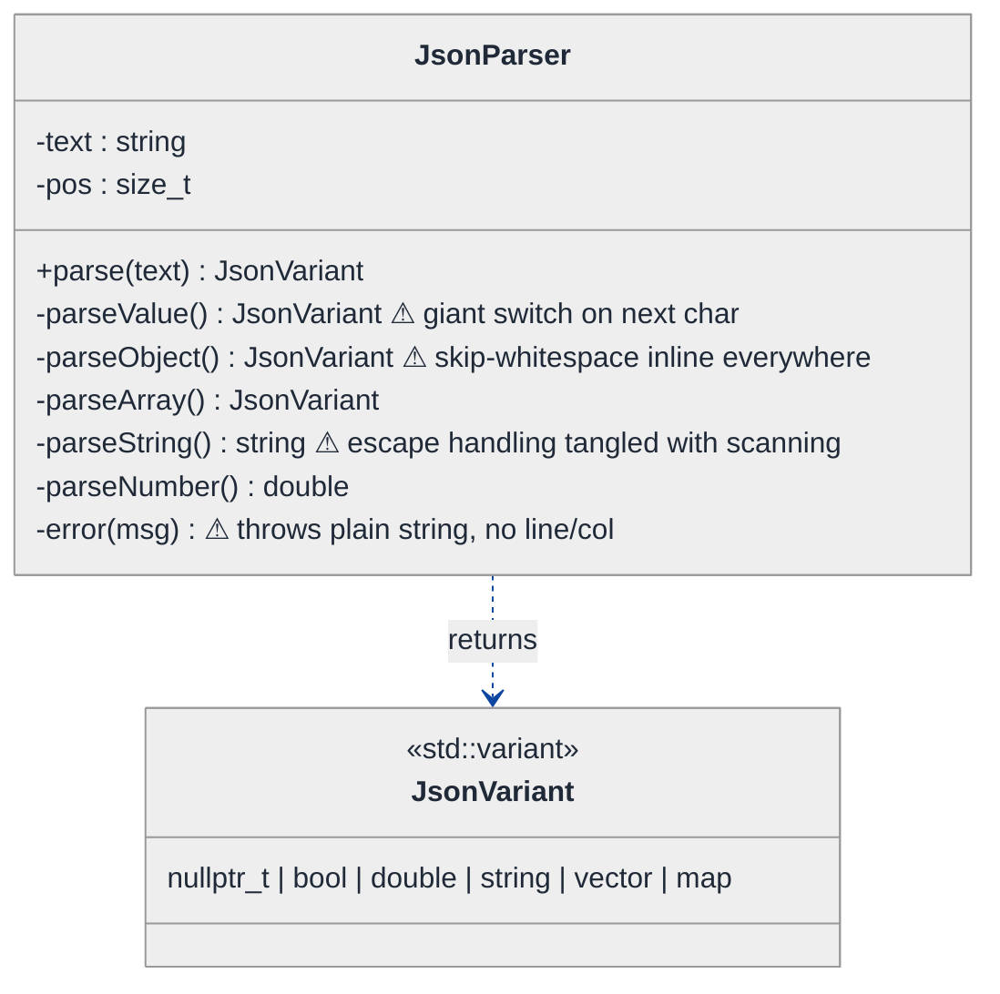
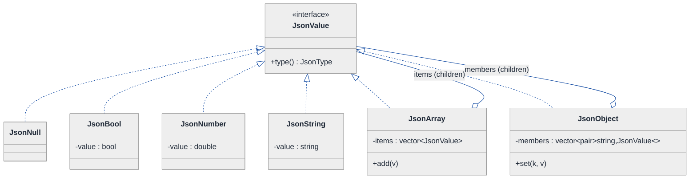
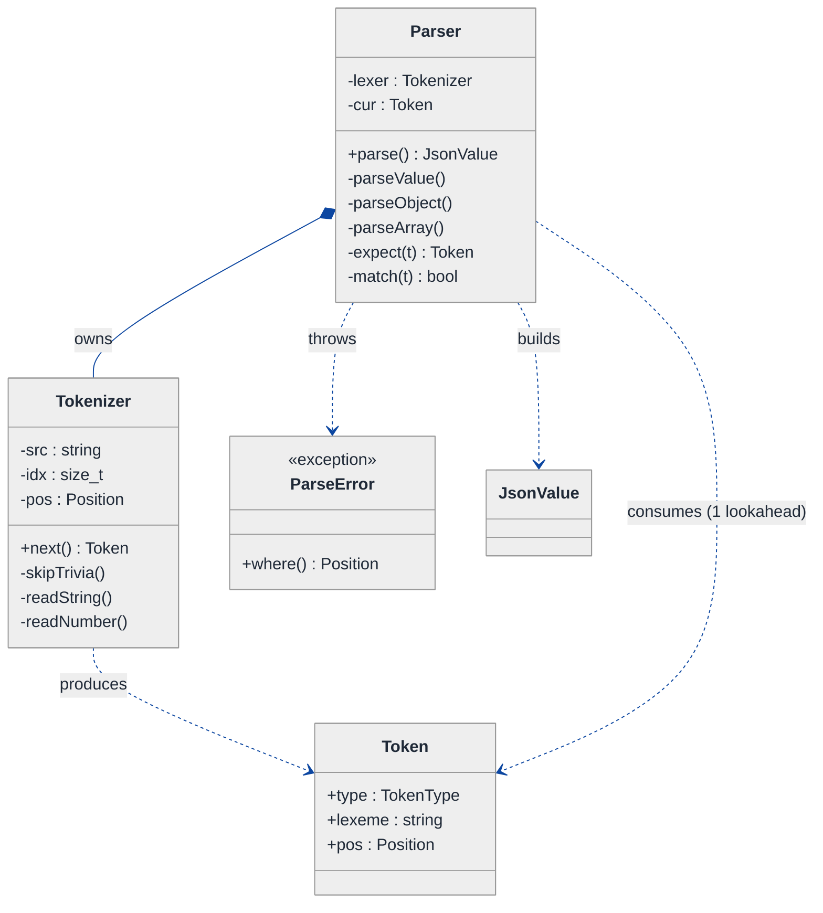
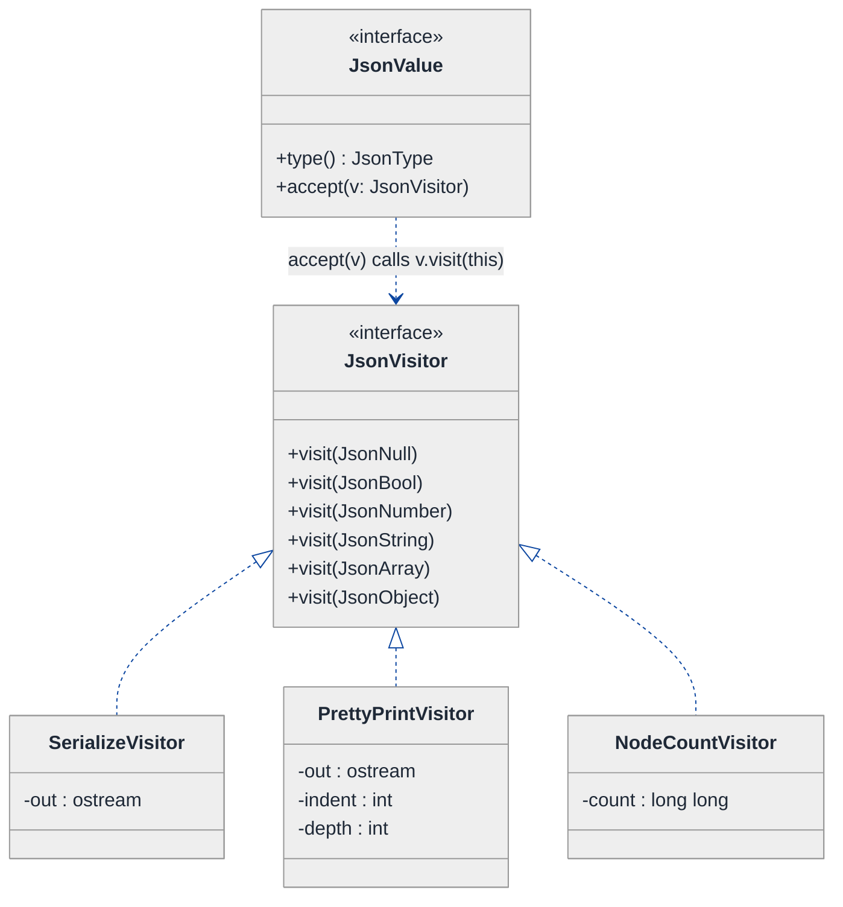
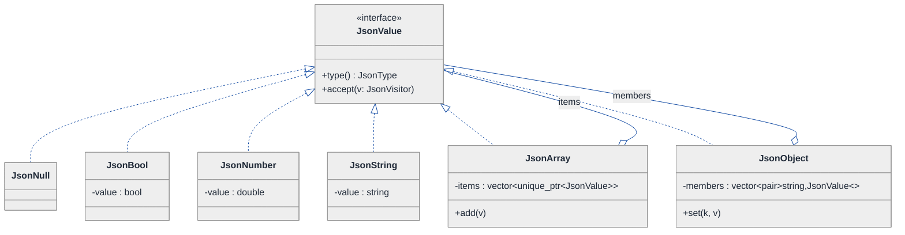
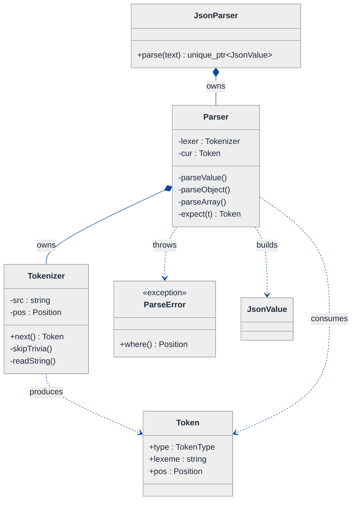
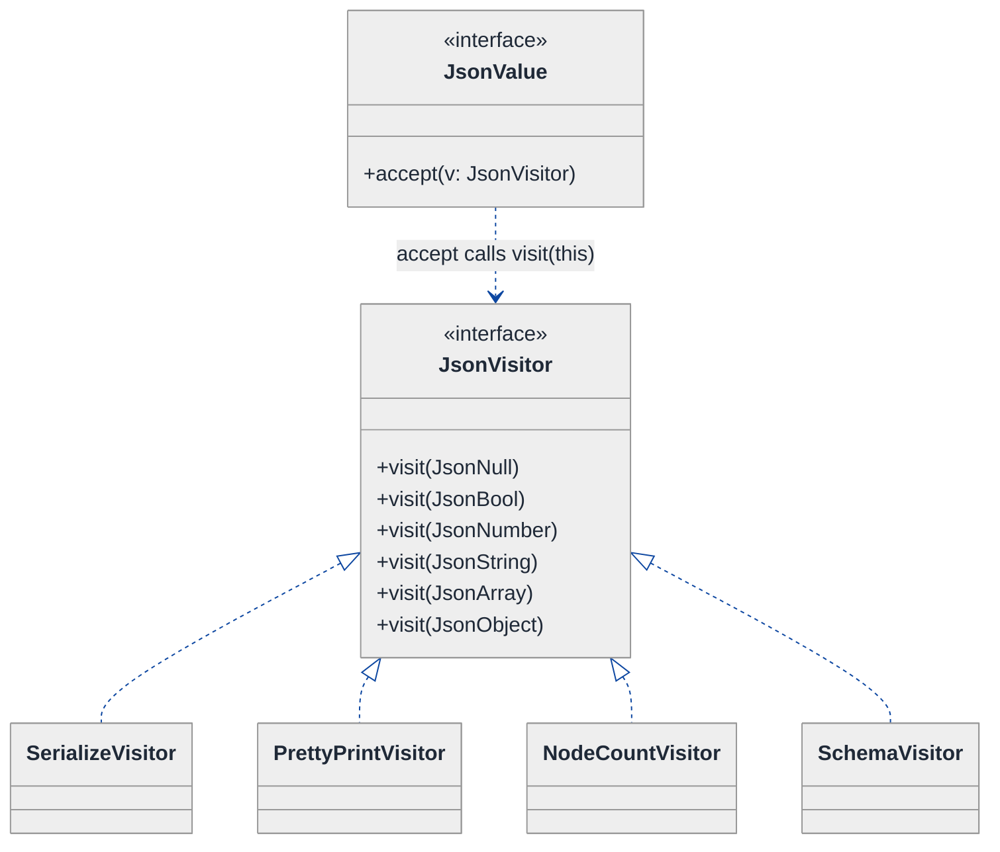
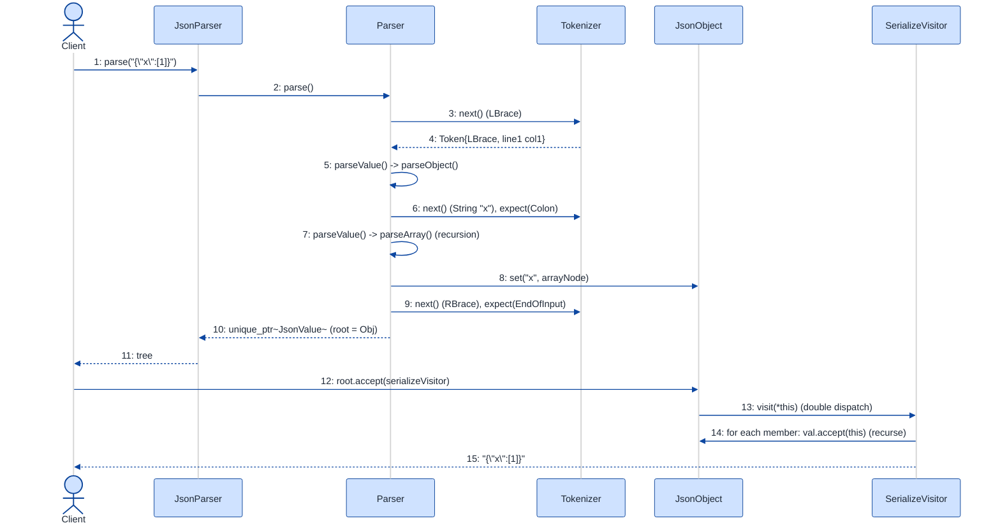

# JSON Parser from Scratch — LLD Walkthrough

> **Difficulty:** Hard · **Time:** ~45 min · **Pattern focus:** Recursive Descent (the parser) + Visitor (operations over the parsed tree) + a Composite value model
>
> **Problem source(s):** GID OOD14, bucket `Object_Oriented_Design`. Representative of "build a parser / interpreter from scratch" LLD rows in [`./EXTRACTED_QUESTIONS.md`](./EXTRACTED_QUESTIONS.md).
>
> **Diagrams:** inline mermaid (renders natively in GitHub / VS Code). Light theme, soft pastel fills, navy arrows — copied verbatim from the repo's canonical theme block.

---

## How to use this file

Paced for a candidate who has used `JSON.parse` a thousand times but never written one. Reading time: ~45 minutes if you sketch each iteration by hand. **The lesson: a parser is two collaborating concerns — turning characters into a value TREE (recursive descent), and running operations over that tree (Visitor). Conflate them and every new operation forces surgery on every node type. Separate them and each becomes a one-class extension.**

**Map of this file (15 sections):**

1. Problem statement + clarifying questions
2. Plain-English restatement
3. Why this matters
4. Mental model
5. Try it yourself first
6. Entity & verb extraction
7. **Iteration 1: the naive design** — one giant parse function returning `variant`
8. **Where the naive design hurts** — five future requirements, one painful diff each
9. **Pivot 1: a Composite value tree** — model the recursive structure as a type, not a `variant`
10. **Pivot 2: recursive descent + a separate tokenizer** — split scanning from grammar, kill the error mess
11. **Pivot 3: Visitor for operations over the tree** — serialize / pretty-print / query without touching node classes
12. Final UML class diagram (three sub-views)
13. Skeleton code (C++17)
14. Key flow — sequence diagram
15. Extensibility re-check + anti-patterns + how to think aloud + self-check

---

## 1. Problem statement + clarifying questions

**Prompt (typical phrasing):** "Design a JSON parser from scratch that handles objects, arrays, strings, numbers, booleans, and null. Support nested structures and provide meaningful error messages for malformed input."

**Clarifying questions to ask BEFORE drawing anything:**

1. **Output shape?** Do we return a generic in-memory tree (like a DOM) that the caller walks, or do we bind directly into user structs (like `serde`)? — Assume a generic tree; binding is a layer on top.
2. **Number semantics?** One numeric type (`double`, like JavaScript) or do we preserve int-vs-float and arbitrary precision? — Assume `double` for the core, but make the number node able to grow.
3. **Encoding?** ASCII only, or full UTF-8 with `\uXXXX` escapes and surrogate pairs? — Assume UTF-8 input, support the standard string escapes.
4. **Error reporting depth?** A boolean "valid/invalid", a single message, or line+column+context with a caret? — The prompt says "meaningful," so assume **line + column + what-was-expected**, and ideally recover to report more than one error.
5. **Streaming or whole-buffer?** Parse a `std::string` already in memory, or a stream/socket where bytes arrive in chunks? — Assume whole-buffer for the core; note the streaming seam in §15.
6. **Operations on the result?** Just "parse," or also serialize back, pretty-print, validate against a schema, query by path? — Assume serialize + pretty-print now, schema/query later. This question is the one that drives the Visitor decision.
7. **Duplicate keys / ordering?** Keep insertion order? Reject duplicate keys or last-wins? — Assume preserve insertion order, last-wins on duplicates (configurable later).
8. **Depth limits?** Guard against a 100,000-deep nesting bomb? — Assume a configurable max-depth to prevent stack overflow.

**Assumptions if the interviewer dodges:** generic value tree, `double` numbers, UTF-8 with standard escapes, line+column error messages, whole-buffer input, parse + serialize + pretty-print as the operation set, insertion-ordered objects, configurable max depth.

---

## 2. Plain-English restatement

We are building the thing that sits behind `JSON.parse`. Given a raw string like `{"name":"ada","tags":[1,true,null]}`, it must produce an in-memory structure the caller can navigate (this object has a `name` that is a string, a `tags` that is an array of three values), and when the input is broken — a missing comma, an unterminated string — it must say exactly **where** and **what it expected**, not just "syntax error." The design must let us add new *value kinds* rarely, but add new *operations over the parsed result* (serialize, pretty-print, validate, count nodes) **often, without editing the value classes**.

---

## 3. Why this matters

Parsing shows up everywhere — config loaders, network protocols, query languages, calculators, template engines. Interviewers reach for "write a JSON parser" because it is small enough to finish in 45 minutes yet forces two senior judgments at once: (1) how do you model a **recursively nested** structure as types rather than a tangle of `if`s, and (2) when operations multiply faster than data kinds, do you reach for the Visitor pattern instead of bolting `serialize()`, `prettyPrint()`, `validate()` onto every node? Candidates who write one mega-function "pass" the toy version; the senior bar is in DERIVING the separation of scanning, grammar, and operations.

---

## 4. Mental model

JSON is a **tree of values**. The grammar is recursive: a value is one of seven things, and two of those things (object, array) contain more values. So the data model is recursive, and the parser that builds it is recursive in the same shape.

```
Real-world sketch (NOT a UML diagram yet):

  input:  {"user":{"id":1,"tags":["a",null]}}

  becomes this tree:

            Object
              │ "user"
              ▼
            Object
          ┌───┴────────────┐
       "id"               "tags"
          ▼                  ▼
        Number(1)          Array
                       ┌─────┴─────┐
                    String("a")   Null

  Two separate jobs:
   (1) characters ──tokenizer──►  [ { " user " : { ... ]  (a flat stream)
   (2) token stream ──parser──►   the TREE above
   (3) the TREE  ──visitor──►     "{\"user\":...}"  /  pretty print  /  node count
```

The KEY insight from this picture: there are THREE separable jobs, not one. **Scanning** (bytes → tokens) is about character classes and escapes. **Parsing** (tokens → tree) is about grammar and nesting. **Operations** (tree → output) is about traversal. The naive design fuses all three into one function; the whole derivation is prying them apart.

---

## 5. Try it yourself first

> **Predict before reading on:**
>
> 1. List the value KINDS JSON has. Which two are "containers" that hold other values? That containment is the recursion — how will you represent it as a type?
> 2. **If I told you that next month you'll need to (a) serialize the tree back to a string, (b) pretty-print it with indentation, and (c) count how many nodes it has — would you add three methods to every value class? What happens when the fourth operation arrives?**
> 3. Where does the line+column for an error message come from? Which of the three jobs (scan / parse / operate) is the natural owner of position information?

---

## 6. Entity & verb extraction

> **Mini-refresher: noun → class, but not every noun.**
>
> Naive OOD promotes every noun to a class. Senior OOD promotes a noun only if it has both BEHAVIOR and STATE that need to live together. "Comma" is a token, not a class of its own; "Object value" becomes a class because it holds children AND participates in traversal.

**Nouns from the prompt:**

| Noun | Decision | Why |
|---|---|---|
| Value (object/array/string/number/bool/null) | Class hierarchy (abstract `JsonValue` + 6 concrete) | Recursive containment; each kind has distinct structure |
| Object | Class (`JsonObject`) | Holds ordered key→value children |
| Array | Class (`JsonArray`) | Holds ordered value children |
| Token | Class/struct (`Token` + `TokenType` enum) | Output of scanning; has type + lexeme + position |
| Tokenizer / Lexer | Class | Turns characters into tokens |
| Parser | Class | Turns tokens into a `JsonValue` tree |
| Error / ParseError | Class (exception) | Carries line, column, expected-vs-found |
| Position (line, column) | Field on Token / tracked by Tokenizer | No behavior of its own |
| Operation (serialize, pretty-print, count) | Class hierarchy later (Visitor) | Multiplies faster than value kinds |

**Verbs (and the class they live on — naive answer, we'll re-examine):**

| Verb | Owner class (naive — to be revisited) |
|---|---|
| parse(text) | Parser |
| nextToken() | Tokenizer |
| parseValue() / parseObject() / parseArray() | Parser |
| serialize() / prettyPrint() / countNodes() | (naive: each JsonValue; final: a Visitor) |
| error(expected) | Parser, using current Token position |

**We have NOT introduced any design patterns yet.** Pure nouns + verbs. Notice the operation row already smells: serialize/pretty-print/count is an open-ended list living on every value class.

---

## 7. <a id="iter-1"></a>Iteration 1: the naive design

Let's write the simplest thing that could possibly work. No patterns — one `parse` function that walks the string with an index, returns a `std::variant` of the possible JSON types, and throws a plain string on error.



**Reader's tour (read top to bottom; ~60 seconds).**

1. **One class does everything — `JsonParser`.** It holds the raw `text` and a cursor `pos`. Every responsibility — skipping whitespace, recognizing characters, decoding escapes, enforcing grammar, formatting errors — lives inside its private methods. There is no tokenizer, no value tree, no operation abstraction.

2. **The return type is `std::variant`.** `JsonVariant = variant<nullptr_t, bool, double, string, vector<JsonVariant>, map<string, JsonVariant>>`. This is the "model the data as a built-in sum type" shortcut. It compiles, it nests. We'll see in §8 why it's a trap once operations multiply.

3. **The four warning markers (⚠).**
   - `parseValue()` is a giant switch on the next non-space character (`{` → object, `[` → array, `"` → string, digit/`-` → number, `t/f/n` → literal). Adding a kind means editing this switch.
   - Whitespace-skipping is copy-pasted at the head of every `parseX()` method.
   - `parseString()` mixes two concerns: walking characters AND decoding `\n`, `\t`, `\uXXXX`. Scanning and grammar are fused.
   - `error()` throws a bare `std::runtime_error("unexpected")` — no line, no column, no "expected `,` but found `}`." The prompt explicitly demands better.

**What's deliberately missing.** No `JsonValue` type hierarchy. No `Tokenizer`. No `Token` with position. No operation abstraction — serialize/pretty-print don't exist yet, and when they arrive they'll have nowhere clean to live. The naive design doesn't even acknowledge that scanning, grammar, and operations are separable axes. That's what we'll expose and fix.

Skeleton code for the naive design (C++17):

```cpp
#include <cctype>
#include <map>
#include <stdexcept>
#include <string>
#include <variant>
#include <vector>

struct JsonVariant;  // forward — recursive variant needs indirection in real code
using Array  = std::vector<JsonVariant>;
using Object = std::map<std::string, JsonVariant>;
struct JsonVariant : std::variant<std::nullptr_t, bool, double, std::string, Array, Object> {
    using variant::variant;
};

class JsonParser {
public:
    JsonVariant parse(const std::string& text) {
        text_ = text; pos_ = 0;
        JsonVariant v = parseValue();
        skipWs();
        if (pos_ != text_.size()) throw std::runtime_error("trailing characters");  // no position
        return v;
    }
private:
    void skipWs() { while (pos_ < text_.size() && std::isspace(text_[pos_])) ++pos_; }

    JsonVariant parseValue() {            // ⚠ giant dispatch
        skipWs();
        char c = text_[pos_];
        if (c == '{') return parseObject();
        if (c == '[') return parseArray();
        if (c == '"') return parseString();
        if (c == '-' || std::isdigit(c)) return parseNumber();
        if (text_.compare(pos_, 4, "true")  == 0) { pos_ += 4; return true;  }
        if (text_.compare(pos_, 5, "false") == 0) { pos_ += 5; return false; }
        if (text_.compare(pos_, 4, "null")  == 0) { pos_ += 4; return nullptr; }
        throw std::runtime_error("unexpected character");   // ⚠ no line/col, no "expected"
    }

    Object parseObjectImpl();            // skipWs() copy-pasted at top
    Array  parseArrayImpl();             // skipWs() copy-pasted at top
    std::string parseString();           // ⚠ char-walking + escape decoding fused
    double parseNumber();

    JsonVariant parseObject() { /* { key : value , ... }  — elided */ throw std::runtime_error(""); }
    JsonVariant parseArray()  { /* [ value , ... ]        — elided */ throw std::runtime_error(""); }

    std::string text_;
    size_t      pos_ = 0;
};
```

**This works.** It has zero design patterns. It parses nested JSON into a `variant`. So what's wrong with it?

---

## 8. <a id="naive-pain"></a>Where the naive design hurts

The interviewer slides a piece of paper across the desk: "Here are five things coming next quarter. Walk me through what changes."

### Change A: "Error messages must say `line 3, column 12: expected ',' or '}', found ']'`"

In the naive design:
- Position is a single `pos_` index. To get line+column you must scan from the start counting newlines on every error — or thread line/col through every `parseX()`.
- "Expected X, found Y" lives nowhere: `parseObject` knows it wanted a comma, but the throw site is generic.
- **The change touches every `parseX()` method AND every throw site.** Position tracking is smeared across scanning and grammar because they're the same code.

### Change B: "Add serialize() — turn the parsed result back into a JSON string"

In the naive design:
- The result is a `std::variant`. To serialize you write a free function with a giant `if (holds_alternative<Object>(v)) ... else if (holds_alternative<Array>(v)) ...` — a 7-arm dispatch.
- **Every value kind handled in one more sprawling switch**, duplicating the kind-dispatch logic that already exists in `parseValue`.

### Change C: "Add prettyPrint() with 2-space indentation"

In the naive design:
- Another 7-arm `holds_alternative` switch, nearly identical to serialize but with indentation bookkeeping.
- **Operation #2 = a second full switch over kinds.** Operation #3 (count nodes), #4 (validate against schema), #5 (redact secrets) — each is yet another full switch. Operations multiply; each one re-walks the same 7 kinds.

### Change D: "Preserve insertion order of object keys (std::map sorts them)"

In the naive design:
- `Object = std::map<string, JsonVariant>` sorts keys alphabetically — `{"b":1,"a":2}` round-trips as `{"a":2,"b":1}`.
- Switching to an ordered container means editing the `using` alias AND every place that constructs or iterates an Object — the parser, serialize, pretty-print, count.
- **The data representation leaked into every operation.** No encapsulation boundary.

### Change E: "Support comments and trailing commas (JSON5-ish) behind a flag"

In the naive design:
- Comment handling is a scanning concern, but scanning lives inside the grammar methods. You'd sprinkle "skip `//` to end of line" into `skipWs`, and trailing-comma tolerance into both `parseObject` and `parseArray`.
- **A scanning change forces edits in grammar code** because the two were never separated.

### The pattern of pain

| Change | Files / methods touched | Smell |
|---|---|---|
| A. line/col errors | every `parseX()` + every throw | "Position smeared across scanning + grammar." |
| B. serialize | new 7-arm variant switch | "Operation = duplicate the kind-dispatch." |
| C. prettyPrint | another 7-arm switch | "Each new operation re-walks all kinds." |
| D. ordered keys | `using` alias + parser + every op | "Data representation leaked everywhere." |
| E. comments/JSON5 | `skipWs` + parseObject + parseArray | "Scanning change leaks into grammar." |

**Three axes of pain dominate:**
1. **The value model** is a structureless `variant` (drives B, C, D) — there's no type to hang behavior or encapsulation on.
2. **Scanning and grammar are fused** (drives A, E) — position tracking and comment handling have no home.
3. **Operations multiply faster than kinds** (drives B, C) — and each operation duplicates a 7-way dispatch.

> **Pivot question:** "What lets a recursively-nested structure be modeled as a TYPE with uniform treatment of leaves and containers? What separates 'recognizing characters' from 'enforcing grammar'? And what lets you add a new OPERATION over a fixed set of node kinds without editing the node classes?"
>
> The answers are: the **Composite** pattern for the value tree, **recursive descent + a tokenizer** for the parsing split, and the **Visitor** pattern for operations. Let's introduce them one axis at a time, starting with the value model — everything else builds on it.

---

## 9. <a id="pivot-1"></a>Pivot 1: a Composite value tree (model the recursion as a type)

Take the most foundational axis first: the `variant` has no structure to build on. Before we can fix errors or operations, the parsed result needs to be a real type hierarchy where "a leaf value" and "a container of values" are treated uniformly.

> **Mini-refresher: Composite pattern.**
>
> Composite lets you treat individual objects (leaves) and compositions of objects (containers) through ONE common interface, so client code can recurse over a tree without asking "am I at a leaf or a branch?" The container holds children of the same interface type — that's where the recursion lives.
>
> Quick example: a filesystem `Node` interface with `File` (leaf) and `Directory` (holds `Node[]`). `computeSize()` works the same call on both; a directory sums its children.

**Why Composite fits the value model.** JSON is literally a tree: objects and arrays are containers holding more `JsonValue`s; strings/numbers/bools/null are leaves. A common `JsonValue` base lets the parser return ONE type, lets containers hold children polymorphically, and gives operations a single interface to recurse on. The `variant` had none of this — it was a tagged union with the dispatch left to the caller.

**The refactor (just the value model):**

```cpp
#include <memory>
#include <string>
#include <utility>
#include <vector>

enum class JsonType { Null, Bool, Number, String, Array, Object };

class JsonValue {
public:
    virtual ~JsonValue() = default;
    virtual JsonType type() const = 0;
};

// ── Leaves ──────────────────────────────────────────────────────────
class JsonNull : public JsonValue {
public:
    JsonType type() const override { return JsonType::Null; }
};

class JsonNumber : public JsonValue {
public:
    explicit JsonNumber(double v) : value_(v) {}
    JsonType type() const override { return JsonType::Number; }
    double value() const { return value_; }
private:
    double value_;
};
// JsonBool, JsonString elided — same leaf shape

// ── Containers (the recursion lives here) ───────────────────────────
class JsonArray : public JsonValue {
public:
    JsonType type() const override { return JsonType::Array; }
    void add(std::unique_ptr<JsonValue> v) { items_.push_back(std::move(v)); }
    const std::vector<std::unique_ptr<JsonValue>>& items() const { return items_; }
private:
    std::vector<std::unique_ptr<JsonValue>> items_;   // children are JsonValue too
};

class JsonObject : public JsonValue {
public:
    JsonType type() const override { return JsonType::Object; }
    // insertion-ordered: vector of pairs, NOT std::map (fixes Change D for free)
    void set(std::string key, std::unique_ptr<JsonValue> v) {
        members_.emplace_back(std::move(key), std::move(v));
    }
    const std::vector<std::pair<std::string, std::unique_ptr<JsonValue>>>& members() const { return members_; }
private:
    std::vector<std::pair<std::string, std::unique_ptr<JsonValue>>> members_;
};
```

**What changed — visualized.** Just the value-model slice:



**Tour of the after-state.**

1. **One interface at the top — `JsonValue`.** A pure-virtual base with `type()`. Every value kind, leaf or container, IS a `JsonValue`. The parser can now return `unique_ptr<JsonValue>` regardless of what it parsed.

2. **Four leaves on the left/middle.** `JsonNull`, `JsonBool`, `JsonNumber`, `JsonString` each wrap a scalar. They have no children. They're plain data with a `type()` answer.

3. **Two containers on the right — the recursion.** `JsonArray` holds `vector<unique_ptr<JsonValue>>`; `JsonObject` holds ordered `pair<string, unique_ptr<JsonValue>>`. **The aggregation arrows (`o--`) point back at `JsonValue`** — a container's children are themselves `JsonValue`s. That self-referential edge IS the tree.

4. **`unique_ptr` everywhere for children.** Each parent EXCLUSIVELY owns its children; destroying the root recursively frees the whole tree. No raw owning pointers, no leaks.

5. **Change D solved for free.** `JsonObject` uses a `vector<pair>`, not `std::map` — insertion order preserved, and crucially the representation is now ENCAPSULATED behind `set()`/`members()`. If we switch the internal container later, no operation breaks.

**Pattern-discrimination cheatsheet — Composite vs a tagged `variant`.**
- *Composite:* a class hierarchy with a shared interface; behavior can live on nodes or in visitors; containers hold the interface type recursively.
- *Tagged variant / union:* one value, a runtime tag, dispatch (`holds_alternative` / `switch`) pushed onto every caller.
- *Rule of thumb:* if you'll add OPERATIONS over a fixed set of kinds → Composite (operations get a clean interface to recurse on). If the set is tiny and you never traverse polymorphically → a `variant` is lighter. Seven kinds + a growing operation list → Composite wins.

**Pattern-discrimination cheatsheet — Composite vs Decorator.** Both wrap an interface and hold a pointer to it, so they're confused. *Composite* holds MANY children to model a part-whole tree (an object has N members). *Decorator* holds ONE wrapped component to add behavior transparently (a "pretty" wrapper around a value). Here we model containment of many → Composite.

---

## 10. <a id="pivot-2"></a>Pivot 2: recursive descent + a separate tokenizer

Now the parsing axis. Change A (line/col errors) and Change E (comments/JSON5) both hurt because scanning and grammar are the same code. Split them: a **Tokenizer** owns character-level concerns (whitespace, escapes, comments, and crucially POSITION); a **recursive-descent parser** owns grammar and consumes a clean token stream.

> **Mini-refresher: Recursive descent parsing.**
>
> One function per grammar rule, calling each other the way the grammar nests. JSON's grammar — `value → object | array | string | number | true | false | null`, `object → '{' (pair (',' pair)*)? '}'` — maps one-to-one to functions `parseValue`, `parseObject`, `parseArray`. Because `object` contains `value`, `parseObject` calls `parseValue` — the function recursion mirrors the grammar recursion. It's the most readable hand-written parsing technique for grammars without left-recursion (JSON has none).

> **Mini-refresher: the Single Responsibility Principle (SRP — the "S" in SOLID).**
>
> A class should have ONE reason to change. The naive parser had at least three reasons: a change in character handling, a change in grammar, or a change in error formatting all forced edits to the same methods. Splitting Tokenizer (characters) from Parser (grammar) gives each ONE reason to change.

**Why a tokenizer plus recursive descent (not a regex, not a parser generator).** A regex can't handle arbitrary nesting (balanced braces aren't regular). A parser generator (yacc/ANTLR) is overkill for a 7-rule grammar and hides the hand-rolled error messages we need. Recursive descent is the sweet spot: readable, debuggable, and the natural place to emit "expected X, found Y." The tokenizer is the natural OWNER of position — it's the only component that touches raw characters and counts newlines.

**The refactor (the scanning/grammar slice):**

```cpp
#include <optional>
#include <stdexcept>
#include <string>

enum class TokenType {
    LBrace, RBrace, LBracket, RBracket, Colon, Comma,
    String, Number, True, False, Null, EndOfInput
};

struct Position { int line = 1; int column = 1; };

struct Token {
    TokenType   type;
    std::string lexeme;   // decoded value for String/Number
    Position    pos;      // where it started — fuels error messages
};

// Rich error carrying location + what was expected (fixes Change A)
class ParseError : public std::runtime_error {
public:
    ParseError(Position p, std::string msg)
        : std::runtime_error(format(p, msg)), pos_(p) {}
    Position where() const { return pos_; }
private:
    static std::string format(Position p, const std::string& m) {
        return "line " + std::to_string(p.line) + ", column " +
               std::to_string(p.column) + ": " + m;
    }
    Position pos_;
};

class Tokenizer {
public:
    explicit Tokenizer(std::string src) : src_(std::move(src)) {}
    Token next();           // skip ws/comments, read one token, track line/col
    const Position& pos() const { return pos_; }
private:
    void advance();         // bump index AND update line/column on '\n'
    void skipTrivia();      // whitespace + (optionally) // and /* */ comments — Change E lives HERE only
    Token readString();     // escape decoding lives HERE, not in the parser
    Token readNumber();
    std::string src_;
    size_t      idx_ = 0;
    Position    pos_;
};

class Parser {
public:
    explicit Parser(std::string src) : lexer_(std::move(src)) { cur_ = lexer_.next(); }
    std::unique_ptr<JsonValue> parse() {
        auto v = parseValue();
        expect(TokenType::EndOfInput);   // trailing-garbage check, with position
        return v;
    }
private:
    std::unique_ptr<JsonValue> parseValue() {     // dispatch on TOKEN type, not raw char
        switch (cur_.type) {
            case TokenType::LBrace:   return parseObject();
            case TokenType::LBracket: return parseArray();
            case TokenType::String:   return std::make_unique<JsonString>(consume().lexeme);
            case TokenType::Number:   return std::make_unique<JsonNumber>(std::stod(consume().lexeme));
            case TokenType::True:     consume(); return std::make_unique<JsonBool>(true);
            case TokenType::False:    consume(); return std::make_unique<JsonBool>(false);
            case TokenType::Null:     consume(); return std::make_unique<JsonNull>();
            default: throw ParseError(cur_.pos, "expected a value");
        }
    }
    std::unique_ptr<JsonValue> parseObject() {    // { (string : value (, string : value)*)? }
        expect(TokenType::LBrace);
        auto obj = std::make_unique<JsonObject>();
        if (cur_.type != TokenType::RBrace) {
            do {
                std::string key = expect(TokenType::String).lexeme;
                expect(TokenType::Colon);
                obj->set(std::move(key), parseValue());     // recursion: value can be another object
            } while (match(TokenType::Comma));
        }
        expect(TokenType::RBrace);
        return obj;
    }
    std::unique_ptr<JsonValue> parseArray();      // mirror of parseObject — elided

    // ── token-stream helpers: the heart of readable error messages ──
    Token consume() { Token t = cur_; cur_ = lexer_.next(); return t; }
    bool  match(TokenType t) { if (cur_.type == t) { consume(); return true; } return false; }
    Token expect(TokenType t) {
        if (cur_.type != t)
            throw ParseError(cur_.pos, "expected " + name(t) + ", found " + name(cur_.type));
        return consume();
    }
    static std::string name(TokenType t);   // "}", ",", "string", ... — elided

    Tokenizer lexer_;
    Token     cur_;   // one token of lookahead (LL(1))
};
```

**What changed — visualized.** The scanning/grammar slice:



**Tour of the after-state.**

1. **Two classes where there was one.** `Tokenizer` (character concerns) and `Parser` (grammar). The filled diamond (`*--`) shows the Parser OWNS a Tokenizer for its lifetime — composition.

2. **`Token` carries `Position`.** Every token records where it started (`line`, `column`). This is the ONLY place position is tracked, and it's tracked once during scanning — Change A is solved at the source instead of recomputed at every throw.

3. **`expect(t)` is where meaningful errors are born.** When the grammar wants a `,` and the current token is `]`, `expect` throws `ParseError(cur_.pos, "expected ',', found ']'")` — line, column, expected, and found, all from data the tokenizer already recorded.

4. **`parseValue` now switches on TOKEN type, not raw characters.** The grammar code never touches `isspace`, never decodes `\u`, never sees a comment. Those live in `skipTrivia`/`readString` inside the Tokenizer. Change E (comments/JSON5) is now a tokenizer-only edit — grammar untouched.

5. **One token of lookahead (`cur_`).** JSON is LL(1) — a single current token is enough to decide which grammar rule applies. `match` peeks-and-maybe-consumes; `consume` advances; `expect` asserts-and-consumes. These three helpers make the grammar methods read like the grammar itself.

**Pattern-discrimination cheatsheet — Recursive descent vs the table-driven / generator approach.**
- *Recursive descent:* hand-written function per rule; you control every error message; great for small, non-left-recursive grammars.
- *Table-driven (yacc/ANTLR):* grammar in a DSL, parser generated; better for large/evolving grammars, but error messages and debugging are harder to customize.
- *Rule of thumb:* a fixed, small grammar where error-message quality is a requirement (exactly our prompt) → recursive descent. A big language that changes often → generator.

---

## 11. <a id="pivot-3"></a>Pivot 3: Visitor for operations over the tree

Changes B and C (serialize, pretty-print) and the looming #4/#5 (count nodes, validate, redact) are still painful. We have a clean `JsonValue` tree now, but where do operations live? Putting `serialize()`, `prettyPrint()`, `countNodes()` on `JsonValue` means every new operation edits all seven classes. The variability here is **the operations multiply faster than the node kinds**. That's the exact shape the Visitor pattern was invented for.

> **Mini-refresher: Visitor pattern.**
>
> Visitor lets you add new operations to a fixed object structure WITHOUT modifying the element classes. Each element exposes one method, `accept(visitor)`, which calls back the visitor's `visit(*this)` (this two-call handshake is "double dispatch" — the right `visit` overload is chosen by the element's dynamic type). A new operation = a new visitor class; the element classes never change.
>
> Quick example: an AST with `Number`/`Add`/`Mul` nodes. `EvalVisitor` computes a value; `PrintVisitor` renders source; `TypeCheckVisitor` validates. Adding `OptimizeVisitor` touches zero node classes.

> **Mini-refresher: the Open/Closed Principle (OCP — the "O" in SOLID).**
>
> Software entities should be OPEN for extension but CLOSED for modification. Adding behavior should mean adding code, not editing existing, tested code. Visitor makes operations open for extension (new visitor) and the node classes closed (never touched again).

**Why Visitor (and the tradeoff it makes).** Our axes of change are lopsided: **node kinds are stable** (JSON has exactly 7, frozen by the spec) while **operations are open-ended** (serialize, pretty-print, count, validate, redact, diff...). Visitor optimizes for exactly this: cheap to add operations, expensive to add node kinds. That tradeoff is perfect for JSON. (If kinds changed often and operations were fixed, you'd do the opposite — put virtual methods on the nodes. That's the "expression problem," and Visitor picks one horn of it deliberately.)

**The refactor (the operation slice):**

```cpp
#include <ostream>
#include <string>

class JsonNull; class JsonBool; class JsonNumber;
class JsonString; class JsonArray; class JsonObject;   // forward

// ── The Visitor interface: one visit() per concrete node kind ───────
class JsonVisitor {
public:
    virtual ~JsonVisitor() = default;
    virtual void visit(const JsonNull&)   = 0;
    virtual void visit(const JsonBool&)   = 0;
    virtual void visit(const JsonNumber&) = 0;
    virtual void visit(const JsonString&) = 0;
    virtual void visit(const JsonArray&)  = 0;
    virtual void visit(const JsonObject&) = 0;
};

// JsonValue gains ONE method (added once, never again):
//   virtual void accept(JsonVisitor& v) const = 0;
// each concrete node implements it as:  v.visit(*this);   // double dispatch

// ── Operation #1: compact serialize ─────────────────────────────────
class SerializeVisitor : public JsonVisitor {
public:
    explicit SerializeVisitor(std::ostream& out) : out_(out) {}
    void visit(const JsonNull&)        override { out_ << "null"; }
    void visit(const JsonBool& b)      override { out_ << (b.value() ? "true" : "false"); }
    void visit(const JsonNumber& n)    override { out_ << n.value(); }
    void visit(const JsonString& s)    override { out_ << '"' << escape(s.value()) << '"'; }
    void visit(const JsonArray& a) override {
        out_ << '[';
        bool first = true;
        for (const auto& item : a.items()) {
            if (!first) out_ << ',';
            first = false;
            item->accept(*this);          // recurse into children
        }
        out_ << ']';
    }
    void visit(const JsonObject& o) override {
        out_ << '{';
        bool first = true;
        for (const auto& [key, val] : o.members()) {
            if (!first) out_ << ',';
            first = false;
            out_ << '"' << escape(key) << "\":";
            val->accept(*this);           // recurse
        }
        out_ << '}';
    }
private:
    static std::string escape(const std::string&);   // elided
    std::ostream& out_;
};

// ── Operation #2: pretty-print — a SECOND visitor, node classes untouched ──
class PrettyPrintVisitor : public JsonVisitor {
public:
    PrettyPrintVisitor(std::ostream& out, int indent = 2) : out_(out), indent_(indent) {}
    // visit() overloads track depth_ and emit newlines + spaces — elided, same shape
private:
    std::ostream& out_;
    int indent_;
    int depth_ = 0;
};

// ── Operation #3: count nodes — a THIRD visitor. Pattern recognized. ──
class NodeCountVisitor : public JsonVisitor {
public:
    long long count() const { return count_; }
    void visit(const JsonNull&)   override { ++count_; }
    void visit(const JsonNumber&) override { ++count_; }
    // ... leaves bump; containers bump then recurse into children — elided
private:
    long long count_ = 0;
};
```

**What changed — visualized.** The operation slice:



**Tour of the after-state.**

1. **`JsonValue` gained exactly ONE method — `accept(JsonVisitor&)`.** This is the only edit to the node classes, and it happens once, forever. Each concrete node's `accept` is a one-liner: `v.visit(*this)`.

2. **The dependency arrow is the double dispatch.** `JsonValue ..> JsonVisitor : accept(v) calls v.visit(this)`. Two virtual calls: `accept` dispatches on the NODE's dynamic type, then `visit(*this)` resolves to the right overload because `*this` has a concrete static type inside `accept`. That two-step is how the right code runs without a `switch` on `type()`.

3. **Three concrete visitors hang off the `JsonVisitor` interface.** `SerializeVisitor`, `PrettyPrintVisitor`, `NodeCountVisitor` — Changes B, C, and the first of the "looming" operations. Each is self-contained; each implements all six `visit` overloads.

4. **Recursion lives in the container visit methods.** `visit(const JsonArray&)` loops its items and calls `item->accept(*this)` — the visitor recurses into children itself. The tree structure (Composite, from Pivot 1) and the operation (Visitor) cooperate: Composite gives uniform children, Visitor gives the operation.

5. **Adding operation #4 (validate against a schema) = one new `SchemaVisitor` class.** Zero edits to `JsonValue`, the seven node classes, or the three existing visitors. That's the open/closed principle delivered.

**Pattern-discrimination cheatsheet — Visitor vs virtual methods on the nodes.**
- *Visitor:* operations are easy to add (new visitor), node kinds are hard to add (touch every visitor). Best when kinds are STABLE and operations GROW.
- *Virtual method per operation on each node:* node kinds are easy to add (new class with its methods), operations are hard to add (touch every node). Best when kinds GROW and operations are STABLE.
- *Rule of thumb:* count which axis changes more. JSON's 7 kinds are frozen by spec; operations are unbounded → Visitor.

**Pattern-discrimination cheatsheet — Visitor vs Strategy.** Both inject behavior via an interface. *Strategy* swaps ONE algorithm with ONE method, chosen by a caller (e.g., a pricing rule). *Visitor* carries a FAMILY of methods (one per node type) and is applied across a whole object structure via double dispatch. We have a heterogeneous tree to traverse, not a single swappable algorithm → Visitor.

---

## 12. <a id="fig-class-diagram"></a>12. Final class diagram

Drawing all of value-model + parser + visitors in one diagram is a wall of boxes. Instead, here are **three focused sub-views** — the value tree, the parsing pipeline, and the operation layer. Read them in order; the structural insight at the end ties them together.

### 12.1 The value tree — what gets BUILT (Composite)



**Tour of 12.1.** Seven boxes, one interface. Four leaves carry scalars; two containers (`JsonArray`, `JsonObject`) hold `unique_ptr<JsonValue>` children — the aggregation arrows back to `JsonValue` are the recursion. Every node carries the same two-method contract: `type()` (what am I) and `accept()` (let a visitor operate on me). This is the Composite from Pivot 1, now with the `accept` hook added in Pivot 3.

### 12.2 The parsing pipeline — how the tree gets MADE (recursive descent)



**Tour of 12.2.** `JsonParser` is a thin facade the caller sees (`parse(text)` → tree). It owns a `Parser`, which owns a `Tokenizer`. The filled diamonds mark composition — one lifetime. The Tokenizer is the sole owner of `Position`, baked into every `Token`, which is why `ParseError` can say exactly where things broke. `Parser` BUILDS `JsonValue` (the §12.1 tree) — the dependency arrow crosses from this view into that one.

### 12.3 The operation layer — what RUNS over the tree (Visitor)



**Tour of 12.3.** The `JsonVisitor` interface declares one `visit` per node kind. Each concrete visitor IS one operation. `SerializeVisitor`, `PrettyPrintVisitor`, `NodeCountVisitor` are today's operations; `SchemaVisitor` (greyed conceptually) shows the open seam — a future operation is one new class, touching nothing else. The lone dependency arrow from `JsonValue` to `JsonVisitor` is the double-dispatch handshake.

### Structural insight (ties 12.1 + 12.2 + 12.3 together)

| Concern | Pattern used | Why |
|---|---|---|
| **Value model** (7 kinds, nested) | Composite (`JsonValue` + leaves + containers) | Recursion is real containment; containers hold the interface type; uniform traversal |
| **Scanning** (chars → tokens, position, escapes, comments) | Dedicated `Tokenizer` (SRP) | One reason to change: character-level concerns; sole owner of position |
| **Grammar** (tokens → tree) | Recursive descent `Parser` | One function per rule; LL(1) lookahead; `expect()` emits meaningful errors |
| **Operations** (serialize, pretty, count, validate...) | Visitor over `JsonValue` | Operations multiply faster than kinds; new op = new visitor, nodes untouched |

The big lesson: **a parser is not one thing.** It's a data model (Composite), a pipeline that builds it (tokenizer + recursive descent), and a family of operations that consume it (Visitor). The naive design's single function fused all three; the final design gives each its own axis, so each future change lands as ONE focused edit.

---

## 13. Skeleton code (C++17)

> Show the SHAPES, not the full impl. Abstract bases + 1-2 concretes per pattern; `// elided` for the rest. ~140 lines.

```cpp
#include <memory>
#include <ostream>
#include <stdexcept>
#include <string>
#include <utility>
#include <vector>

// ── Forward declarations (break the value↔visitor cycle) ────────────
class JsonNull; class JsonBool; class JsonNumber;
class JsonString; class JsonArray; class JsonObject;

// ── Visitor interface: one visit() per concrete node kind ───────────
class JsonVisitor {
public:
    virtual ~JsonVisitor() = default;
    virtual void visit(const JsonNull&)   = 0;
    virtual void visit(const JsonBool&)   = 0;
    virtual void visit(const JsonNumber&) = 0;
    virtual void visit(const JsonString&) = 0;
    virtual void visit(const JsonArray&)  = 0;
    virtual void visit(const JsonObject&) = 0;
};

enum class JsonType { Null, Bool, Number, String, Array, Object };

// ── Composite: the value tree ───────────────────────────────────────
class JsonValue {
public:
    virtual ~JsonValue() = default;
    virtual JsonType type() const = 0;
    virtual void accept(JsonVisitor& v) const = 0;   // the Visitor hook (added once)
};

class JsonNumber : public JsonValue {                 // a leaf
public:
    explicit JsonNumber(double v) : value_(v) {}
    JsonType type() const override { return JsonType::Number; }
    void accept(JsonVisitor& v) const override { v.visit(*this); }   // double dispatch
    double value() const { return value_; }
private:
    double value_;
};
// JsonNull, JsonBool, JsonString — same leaf shape, accept() = v.visit(*this); — elided

class JsonArray : public JsonValue {                  // a container
public:
    JsonType type() const override { return JsonType::Array; }
    void accept(JsonVisitor& v) const override { v.visit(*this); }
    void add(std::unique_ptr<JsonValue> item) { items_.push_back(std::move(item)); }
    const std::vector<std::unique_ptr<JsonValue>>& items() const { return items_; }
private:
    std::vector<std::unique_ptr<JsonValue>> items_;   // exclusive ownership of children
};

class JsonObject : public JsonValue {                 // a container (insertion-ordered)
public:
    JsonType type() const override { return JsonType::Object; }
    void accept(JsonVisitor& v) const override { v.visit(*this); }
    void set(std::string key, std::unique_ptr<JsonValue> val) {
        members_.emplace_back(std::move(key), std::move(val));
    }
    const std::vector<std::pair<std::string, std::unique_ptr<JsonValue>>>& members() const { return members_; }
private:
    std::vector<std::pair<std::string, std::unique_ptr<JsonValue>>> members_;
};

// ── Tokenizer (scanning concern) + Token + ParseError ───────────────
enum class TokenType {
    LBrace, RBrace, LBracket, RBracket, Colon, Comma,
    String, Number, True, False, Null, EndOfInput
};
struct Position { int line = 1; int column = 1; };
struct Token { TokenType type; std::string lexeme; Position pos; };

class ParseError : public std::runtime_error {
public:
    ParseError(Position p, const std::string& msg)
        : std::runtime_error("line " + std::to_string(p.line) + ", column " +
                             std::to_string(p.column) + ": " + msg), pos_(p) {}
    Position where() const { return pos_; }
private:
    Position pos_;
};

class Tokenizer {
public:
    explicit Tokenizer(std::string src) : src_(std::move(src)) {}
    Token next();           // skipTrivia(), then read one token, tracking line/column
private:
    void advance();         // ++idx_; if '\n' { ++pos_.line; pos_.column = 1; } else ++pos_.column
    void skipTrivia();      // whitespace (+ comments behind a flag — the only place that knows)
    Token readString();     // escape decoding lives HERE
    Token readNumber();
    std::string src_;
    size_t      idx_ = 0;
    Position    pos_;
};

// ── Recursive-descent Parser (grammar concern) ──────────────────────
class Parser {
public:
    explicit Parser(std::string src) : lexer_(std::move(src)) { cur_ = lexer_.next(); }
    std::unique_ptr<JsonValue> parse() {
        auto root = parseValue();
        expect(TokenType::EndOfInput);
        return root;
    }
private:
    std::unique_ptr<JsonValue> parseValue();    // switch on cur_.type → object/array/leaf
    std::unique_ptr<JsonValue> parseObject();   // { string : value (, ...)* }  — recurses via parseValue
    std::unique_ptr<JsonValue> parseArray();    // [ value (, ...)* ]            — recurses
    Token consume() { Token t = cur_; cur_ = lexer_.next(); return t; }
    bool  match(TokenType t) { if (cur_.type == t) { consume(); return true; } return false; }
    Token expect(TokenType t) {
        if (cur_.type != t) throw ParseError(cur_.pos, "expected " + name(t) + ", found " + name(cur_.type));
        return consume();
    }
    static std::string name(TokenType t);       // elided
    Tokenizer lexer_;
    Token     cur_;                              // 1-token lookahead (LL(1))
};

// ── Facade ──────────────────────────────────────────────────────────
class JsonParser {
public:
    std::unique_ptr<JsonValue> parse(std::string text) { return Parser(std::move(text)).parse(); }
};

// ── A concrete Visitor (operation) ──────────────────────────────────
class SerializeVisitor : public JsonVisitor {
public:
    explicit SerializeVisitor(std::ostream& out) : out_(out) {}
    void visit(const JsonNull&)     override { out_ << "null"; }
    void visit(const JsonBool& b)   override { out_ << (b.value() ? "true" : "false"); }
    void visit(const JsonNumber& n) override { out_ << n.value(); }
    void visit(const JsonString& s) override { out_ << '"' << s.value() << '"'; }   // escape elided
    void visit(const JsonArray& a) override {
        out_ << '['; bool first = true;
        for (const auto& it : a.items()) { if (!first) out_ << ','; first = false; it->accept(*this); }
        out_ << ']';
    }
    void visit(const JsonObject& o) override {
        out_ << '{'; bool first = true;
        for (const auto& [k, v] : o.members()) {
            if (!first) out_ << ','; first = false;
            out_ << '"' << k << "\":"; v->accept(*this);
        }
        out_ << '}';
    }
private:
    std::ostream& out_;
};
// PrettyPrintVisitor, NodeCountVisitor, SchemaVisitor — same shape, elided
```

---

## 14. <a id="fig-sequence"></a>14. Key flow — sequence diagram

The flow has two phases that the patterns deliberately HIDE from the caller: **parse** (tokenizer + recursive descent building the Composite) and **operate** (a Visitor walking that Composite). Watch how the recursion appears as a self-call, and how the caller never sees a `switch` on node type.



**Tour of the flow. Read it slowly — the patterns are doing work between the lines.**

1. **Client calls `JsonParser::parse(text)` (msg 1).** The facade hides the tokenizer/parser split entirely. The caller hands in a string and gets back a tree.

2. **Parser pulls tokens from the Tokenizer on demand (msgs 3-4, 6, 9).** The parser never sees raw characters or whitespace — it asks `next()` and gets a `Token` that already carries its `Position`. If `readString` hit an unterminated quote, the `ParseError` thrown here would already have line+column. **Scanning is hidden from grammar.**

3. **`parseValue` dispatches to `parseObject`, which calls `parseValue` again for the array (msgs 5, 7).** That self-call (msg 7) IS the recursion of recursive descent — the grammar's `value → array → value` nesting becomes a function calling itself. The stack depth equals the JSON nesting depth (hence the max-depth guard from §1).

4. **`expect(EndOfInput)` (msg 9) guards trailing garbage** with a positioned error. No generic "trailing characters" — it says where.

5. **The tree comes back as a `unique_ptr<JsonValue>` (msgs 10-11).** The caller holds the root and owns the whole tree; dropping it frees everything recursively.

6. **Operate phase: `root.accept(serializeVisitor)` (msg 12).** The caller does NOT switch on node type. It calls `accept`, the node calls `visit(*this)` back (msg 13) — double dispatch picks `visit(const JsonObject&)` because the root is dynamically a `JsonObject`.

7. **The visitor recurses into children itself (msg 14).** `visit(JsonObject)` loops members and calls `val->accept(*this)` on each — the operation walks the Composite. A different operation (pretty-print, count) would be a different visitor with identical traversal shape.

### The dispatch that's NOT shown — and why it matters

You don't see a single `if (node.type() == Object)` or `switch (type)` in the operate phase. That's the point of Visitor: **the right code runs by polymorphism (double dispatch), not by a tag check the caller writes.** Adding a `PrettyPrintVisitor` changes none of messages 12-14's shape — only which visitor is passed in.

---

## 15. Extensibility re-check + anti-patterns + how to think aloud + self-check

### Extensibility re-check

Revisit the five changes from [§8](#naive-pain). For each, name the SINGLE place that changes.

| Change | Naive design impact | Final design impact |
|---|---|---|
| A. line/col errors | every `parseX()` + every throw | `Tokenizer` tracks `Position` once; `expect()` formats. Done. |
| B. serialize | new 7-arm variant switch | New `SerializeVisitor` class. Node classes untouched. Done. |
| C. prettyPrint | another 7-arm switch | New `PrettyPrintVisitor` class. Done. |
| D. ordered keys | alias + parser + every op | `JsonObject` internal container; encapsulated behind `set()`/`members()`. Done. |
| E. comments/JSON5 | `skipWs` + both container parsers | `Tokenizer::skipTrivia()` only. Grammar untouched. Done. |

Every change is exactly ONE focused edit. **But note the one thing that got HARDER:** adding a NEW node kind (say a `JsonDate`) now means adding a `visit(const JsonDate&)` to the `JsonVisitor` interface and to every existing visitor. That's the Visitor tradeoff, taken on purpose — JSON's kinds are frozen by spec, so we paid in the cheap currency.

**Two more realistic extensions and where they land:**
- **Streaming input** (bytes arrive in chunks): the seam is `Tokenizer::next()`. Make the Tokenizer pull from a `std::istream`/callback instead of an in-memory string; Parser and Visitors are unaffected.
- **Error recovery** (report multiple errors, not just the first): `expect()` can, instead of throwing, record the error and skip to a synchronization token (`,`/`}`/`]`) — recursive descent's classic "panic-mode recovery." The Composite and Visitor layers don't know or care.

If a future requirement makes you change `JsonValue`, `Parser`, AND every visitor together — go back to §6 and re-identify which axis is actually varying; you've likely conflated a scanning change with a grammar change again.

### Common confusion + traps

1. **"Why not just keep the `std::variant`?"** For 7 kinds it nests fine, but every operation becomes a `holds_alternative` ladder duplicated per operation. The Composite + Visitor pair pays off the moment you have a SECOND operation.

2. **"Why a separate Tokenizer — can't the parser read characters directly?"** It can (that's the naive design), but then position tracking, escape decoding, and comment handling smear across the grammar methods. SRP: scanning has one reason to change, grammar another.

3. **"Isn't Visitor overkill for a parser?"** If serialize were the only operation, yes — a free function would do. The justification is the OPEN-ENDED operation list (serialize, pretty, count, validate, redact, diff). Count your axes before reaching for Visitor.

4. **"Where does recursion-depth protection go?"** In `parseValue` (or a depth counter on `Parser`) — increment on entry to `parseObject`/`parseArray`, throw a positioned error past the limit. It's a grammar concern, so it lives on the Parser.

5. **"Should numbers be `double` or keep int/float distinction?"** `double` matches JavaScript and is simplest. If you need int preservation, `JsonNumber` is the single class to grow (store a `variant<int64_t,double>` or the raw lexeme) — no other class changes. That's the Composite paying off.

### Anti-patterns

- **"God parser"** — one class scanning, parsing, formatting errors, AND serializing. Split by reason-to-change.
- **"Stringly-typed tree"** — keeping everything as nested `map<string, string>` and re-parsing on access. Model the kinds as types.
- **"Operation methods on every node"** — `serialize()`, `prettyPrint()`, `count()` all on `JsonValue`. Every new operation edits seven classes. Use Visitor.
- **"Positionless errors"** — `throw runtime_error("syntax error")`. The prompt explicitly demands location; track it in the Tokenizer.
- **"Regex parsing"** — trying to match balanced braces with a regex. Nesting isn't regular; use recursive descent.
- **"Raw owning pointers for children"** — `JsonValue* items[]` with manual `new`/`delete`. Use `unique_ptr`; the tree frees recursively.

### How to think aloud

> "JSON parser. Let me clarify scope. [Asks questions from §1 — error depth, number semantics, operations needed.] The 'operations needed' answer matters most: serialize + pretty-print + maybe schema validation tells me operations will outnumber node kinds.
>
> Nouns: Value (7 kinds, two are containers), Token, Tokenizer, Parser, Error. Verbs: parse, tokenize, plus an OPEN list of operations.
>
> I'll start NAIVE: one `parse()` function walking the string, returning a `std::variant`, throwing a plain string. It works and nests. Now I stress-test it. Meaningful errors need line+column — that smears position across every method. Serialize is a 7-arm variant switch; pretty-print is a second one; count is a third. Ordered keys leak the container choice everywhere. Comments leak scanning into grammar.
>
> Three axes: the value model has no structure, scanning and grammar are fused, and operations multiply faster than kinds.
>
> Pivot 1: model the tree as a Composite — `JsonValue` base, four leaves, two containers holding `unique_ptr<JsonValue>` children. Ordered-key problem solved by encapsulating the container.
>
> Pivot 2: split a Tokenizer (characters, position, escapes, comments) from a recursive-descent Parser (grammar, LL(1) lookahead). `expect(type)` is where 'expected X, found Y' errors are born from the token's recorded position.
>
> Pivot 3: operations become Visitors over the tree. `accept()` added once to `JsonValue`; each operation is one visitor; double dispatch picks the right `visit`. New operation = new class, nodes untouched — open/closed.
>
> Final: Composite for the data, tokenizer + recursive descent for building it, Visitor for consuming it. Each of the five future changes lands as one focused edit. The deliberate cost: a new node KIND touches every visitor — acceptable because JSON's kinds are frozen."

### Self-check

> **Self-check — the question to ask next time.**
>
> When you see "parse / model / operate on a recursively-nested structure," before bolting methods onto your nodes, ask:
>
> > **"Which grows faster — the KINDS of node, or the OPERATIONS over them?"**
>
> Operations grow faster → Composite for the tree + Visitor for operations (new op = new class). Kinds grow faster → put virtual methods on the nodes instead (new kind = new class). And always ask the second question: **"Is character-scanning a separate reason-to-change from grammar?"** For any non-trivial format, yes — split the tokenizer from the parser.

---

## Cross-references

- **Parent topic manifest:** [`./EXTRACTED_QUESTIONS.md`](./EXTRACTED_QUESTIONS.md)
- **Vertical overview:** [`../../LEARNING.md`](../../LEARNING.md)
- **Template:** [`../../TEMPLATE-v2.md`](../../TEMPLATE-v2.md)
- **Canonical exemplar:** [`./Parking_Lot.md`](./Parking_Lot.md)
- **Related v2 walkthroughs (current / future):**
  - Composite + Visitor reappear in expression evaluators and calculators (`../Composite_Pattern/`, `../Iterator_Pattern/`)
  - Visitor deep-dive (in `../Visitor_Pattern/`)
  - State + Strategy contrast in the canonical [`./Parking_Lot.md`](./Parking_Lot.md)
- **External references:**
  - <a href="https://www.json.org/json-en.html" target="_blank" rel="noopener noreferrer">json.org — the JSON grammar railroad diagrams</a>
  - <a href="https://datatracker.ietf.org/doc/html/rfc8259" target="_blank" rel="noopener noreferrer">RFC 8259 — The JSON Data Interchange Format</a>
  - <a href="https://refactoring.guru/design-patterns/visitor" target="_blank" rel="noopener noreferrer">Refactoring Guru — Visitor pattern</a>
  - <a href="https://refactoring.guru/design-patterns/composite" target="_blank" rel="noopener noreferrer">Refactoring Guru — Composite pattern</a>
