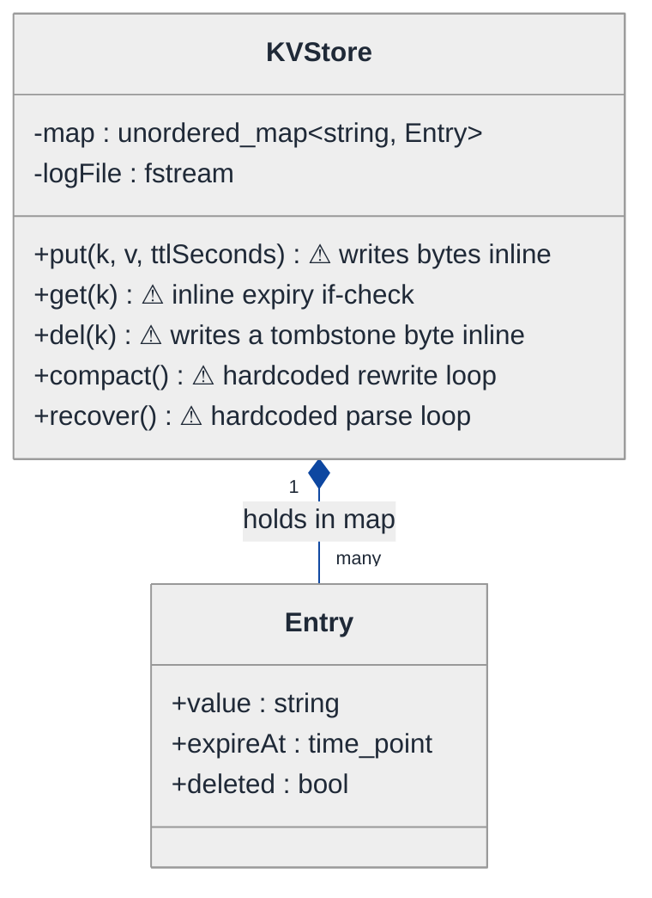
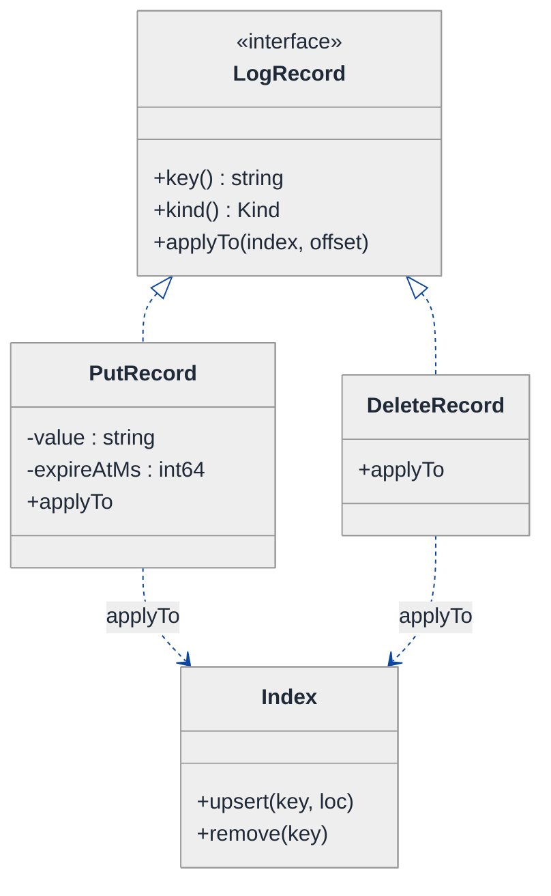
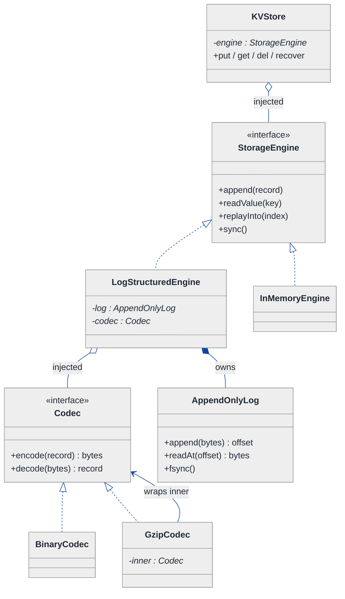
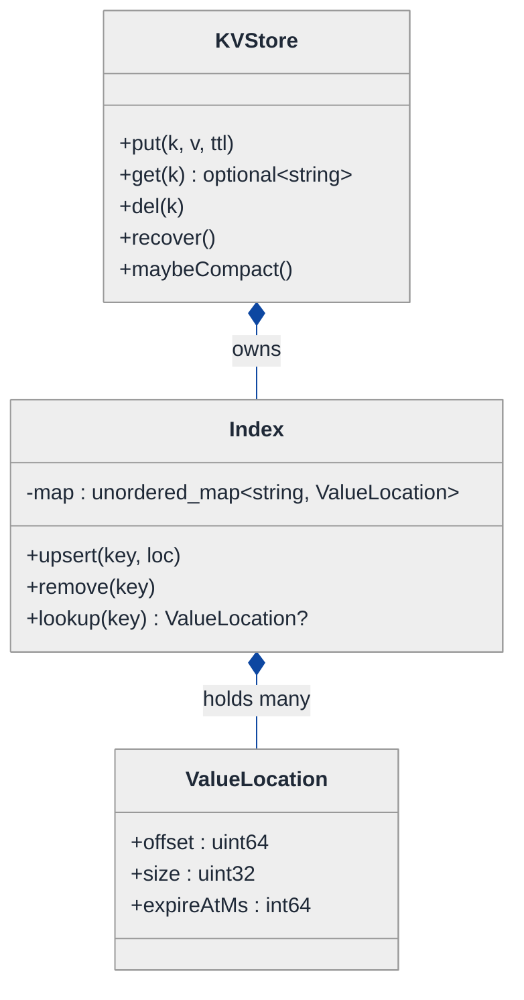
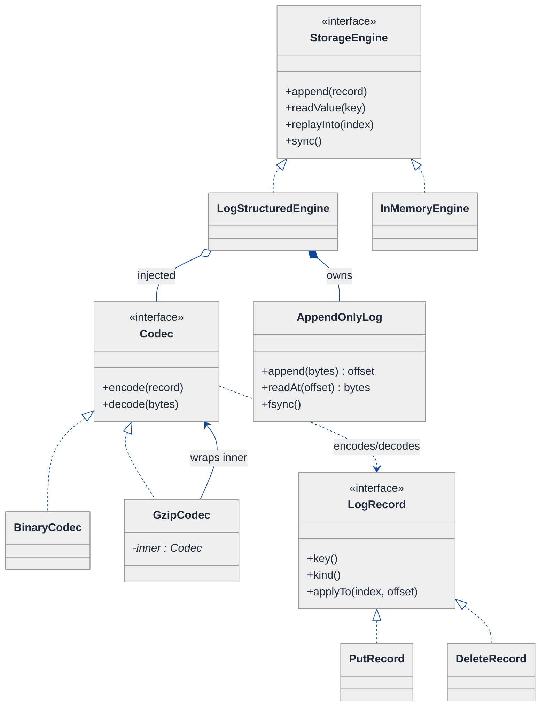
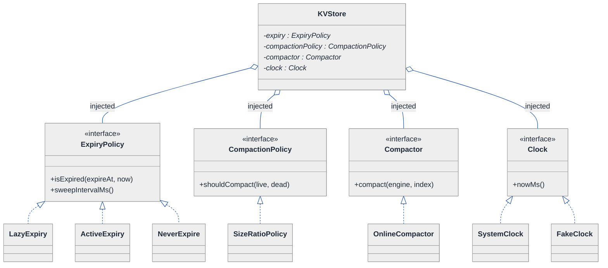
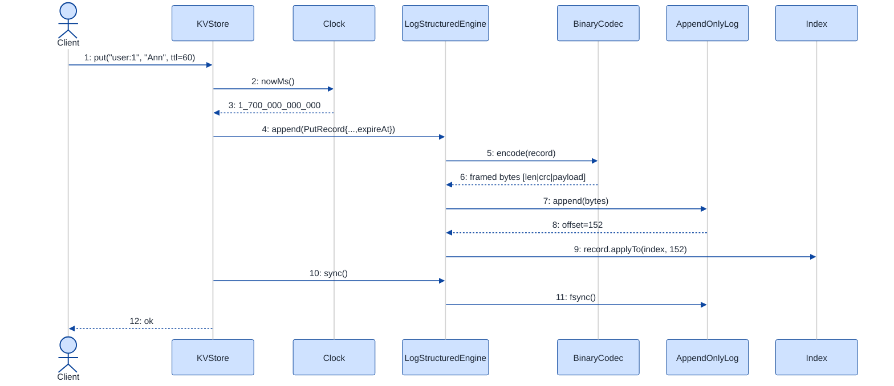
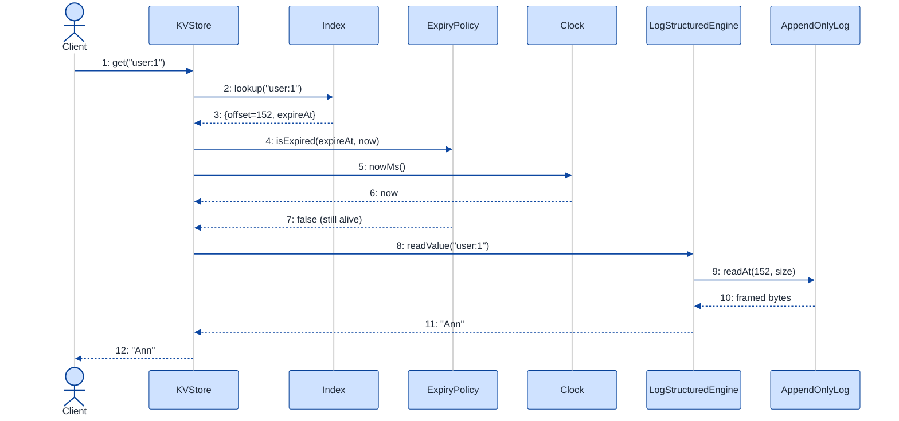

# Key-Value Store — LLD Walkthrough

> **Difficulty:** Hard · **Time:** ~45 min · **Pattern focus:** Storage engine modeling (Strategy for backend + log codec, Command for the write-ahead log record, Strategy for compaction + eviction)
>
> **Problem source(s):** GID OOD10 in [`./EXTRACTED_QUESTIONS.md`](./EXTRACTED_QUESTIONS.md) — "Design a key-value store with get/put/delete, TTL-based expiration, persistence to disk (append-only log), and compaction."
>
> **Diagrams:** inline mermaid (renders natively in GitHub / VS Code). DO NOT use `look: handDrawn`.

---

## How to use this file

Paced for a candidate who has used Redis or `std::unordered_map` but has never *built* a storage engine. Reading time: ~45 minutes if you sketch each iteration by hand. **The lesson: a key-value store looks like "just a hash map," but the durable, TTL-aware, compactable version has FOUR independent axes of variation — and the senior move is to DERIVE each one as a separate pluggable seam instead of cramming everything into one `KVStore` god-class.**

This is a Bitcask/LSM-flavored design. We're not implementing a B-tree; we're modeling the *classes* of an append-only log-structured engine: the in-memory index, the on-disk log, the codec that frames records, the TTL clock, and the compactor that reclaims space.

**Map of this file (15 sections):**

1. Problem statement + clarifying questions
2. Plain-English restatement
3. Why this matters
4. Mental model
5. Try it yourself first
6. Entity & verb extraction
7. **Iteration 1: the naive design** — `unordered_map` + a file
8. **Where the naive design hurts** — five future requirements, one painful diff each
9. **Pivot 1: Command for the log record** — the append-only log is a stream of operations
10. **Pivot 2: Strategy for the storage engine + log codec** — make durability a swappable seam
11. **Pivot 3: Strategy for TTL expiration and compaction** — the remaining axes
12. Final UML class diagram
13. Skeleton code (C++)
14. Key flow — sequence diagram
15. Extensibility re-check + anti-patterns + how to think aloud + self-check

---

## 1. Problem statement + clarifying questions

**Prompt (typical phrasing):** "Design a key-value store. Support `get`, `put`, `delete`, TTL-based expiration, persistence to disk via an append-only log, and compaction. Model the storage engine classes."

**Clarifying questions to ask BEFORE drawing anything:**

1. **Durability semantics?** Must a `put` survive a crash the instant it returns (fsync per write), or is it OK to lose the last few milliseconds (batched/async fsync)? This decides whether the write path blocks on disk.
2. **Data size vs RAM?** Does the *entire dataset* fit in memory (then the in-memory map can hold values, Redis-style), or only the *keys + offsets* fit (Bitcask-style: values live on disk, index holds file offsets)?
3. **TTL granularity & enforcement?** Per-key TTL or global default? Is expiry lazy (checked on read), active (a background sweeper), or both? Must an expired key be *physically* removed or just logically hidden?
4. **Single-process or networked?** Embedded library (like RocksDB / LevelDB) or a server with a wire protocol? This decides whether we model a `Server`/`Connection` layer at all.
5. **Concurrency?** Single writer + many readers, or many concurrent writers? Append-only logs love single-writer; it simplifies ordering.
6. **Compaction trigger?** Size-ratio (dead bytes / live bytes), time-based, or manual? Online (serve reads during compaction) or stop-the-world?
7. **Crash recovery?** On startup do we replay the whole log to rebuild the index, or do we persist a snapshot/hint file to skip the replay?

**Assumptions if interviewer dodges:** embedded engine (no network layer), keys + value-locations fit in RAM but values live on disk (Bitcask model), per-key optional TTL with lazy + active expiry, single writer with many readers, fsync configurable, size-ratio-triggered online compaction, crash recovery by replaying the active log on startup.

---

## 2. Plain-English restatement

We're building the engine underneath something like Redis-with-persistence or Bitcask. Every write (`put` / `delete`) is appended as a record to the END of a log file on disk — we never overwrite in place, which makes writes sequential and fast and makes crashes safe (a half-written record at the tail is simply ignored). An in-memory index maps each key to the location of its newest record. `get` looks up the index, reads the value (from memory or disk), and checks TTL. Because the log only ever grows — old versions and deletes pile up as dead weight — a **compaction** process periodically rewrites the live records into a fresh log and throws the garbage away. The design must let us swap durability policy, value placement, TTL behavior, and compaction strategy **without rewriting the core get/put/delete flow.**

---

## 3. Why this matters

This question separates "I can use a hash map" from "I understand what a database *is*." The skill being probed is **storage-engine modeling**: recognizing that durability, indexing, expiration, and space-reclamation are *orthogonal concerns* that must be decoupled. The same separation reappears everywhere — write-ahead logs in Postgres, SSTables + compaction in Cassandra/RocksDB, segment files in Kafka, the journal in a filesystem. If you can derive the seams here, you can reason about any log-structured system. The failure mode is a `KVStore` class with a `std::map`, a `std::fstream`, an `if (expired)` check, and a `compact()` method all tangled together — works in a demo, impossible to evolve.

---

## 4. Mental model

A persistent key-value store is **two data structures that mirror each other**: a fast, volatile **index** in memory and a slow, durable **log** on disk. The log is the source of truth; the index is a rebuildable accelerator. Writes go to the log first (so they survive crashes), then update the index. Reads consult the index, then fetch the value.

```
Real-world sketch (NOT a UML diagram yet):

   IN MEMORY (volatile, fast)            ON DISK (durable, append-only, grows forever)
   ┌────────────────────────┐            ┌──────────────────────────────────────────┐
   │  Index (hash map)       │            │  Active log file                           │
   │   "user:1" → offset 0   │──reads──►  │  [PUT user:1 "Ann" ttl=∞ ]  @offset 0      │
   │   "user:2" → offset 88  │            │  [PUT user:2 "Bob" ttl=60]  @offset 88     │
   │   "user:1" → offset 152 │◄─update──  │  [PUT user:1 "Amy" ttl=∞ ]  @offset 152    │ ← user:1 v2
   │   (user:3 deleted)      │            │  [DEL user:3            ]  @offset 210     │
   └────────────────────────┘            └──────────────────────────────────────────┘
              ▲                                  │  offset 0 is now DEAD (superseded)
              │                                  ▼
        get/put/delete                    COMPACTION rewrites only live records → new file
```

The KEY insight from this picture: **append-only means every update creates garbage**, and the index always points at the *newest* record. Three distinct jobs fall out — orchestration (get/put/delete), durability (framing + writing + fsync records to the log), and housekeeping (TTL expiry + compaction). Those three are the separation we'll bake into the design.

---

## 5. Try it yourself first

> **Predict before reading on:**
>
> 1. List 5 nouns you'd promote to a class and 3 you'd leave as fields. (Hint: is "offset" a class?)
> 2. **If I told you the store must support BOTH "values in RAM" and "values on disk, index holds offsets" as a deploy-time choice, what would have to be swappable?**
> 3. A `delete` in an append-only log can't erase the old record. So how does a `get` after a `delete` know the key is gone — and where does that knowledge physically live until compaction removes it?

---

## 6. Entity & verb extraction

> **Mini-refresher: noun → class, but not every noun.**
>
> Naive OOD promotes every noun to a class. Senior OOD promotes a noun only if it has both BEHAVIOR and STATE that need to live together. "Offset" stays a field (it's just a number); "LogRecord" becomes a class because it has framing/serialization behavior and several typed shapes.

**Nouns from the prompt:**

| Noun | Decision | Why |
|---|---|---|
| KVStore | Class (top-level coordinator) | Owns the index + engine; exposes get/put/delete |
| Index | Class (or `unordered_map` field) | Maps key → location of newest record |
| LogRecord | Class (abstract) + concrete `PutRecord` / `DeleteRecord` | Has type, serialization behavior, lifecycle |
| AppendOnlyLog | Class | Frames + appends + fsyncs records; reads by offset |
| Codec / Serializer | Class (Strategy) | Turns a record into bytes and back; varies (binary, JSON, compressed) |
| Compactor | Class (Strategy) | Rewrites live records into a fresh log |
| TTL / expiry | Behavior, not a class | Lives in an `ExpiryPolicy` strategy + a timestamp field on records |
| Offset / file position | Field (`uint64_t`) on the index value | No behavior of its own |
| Key / Value | Fields (`std::string` / byte blob) | No domain behavior |
| Timestamp / Clock | `Clock` abstraction (injected) | Behavior (now()) so tests can fake time |

**Verbs (and the class they live on):**

| Verb | Owner class (naive answer — we'll re-examine) |
|---|---|
| put(key, value, ttl) | KVStore |
| get(key) | KVStore |
| del(key) | KVStore |
| append(record) | AppendOnlyLog |
| readAt(offset) | AppendOnlyLog |
| encode(record) / decode(bytes) | Codec |
| isExpired(record, now) | ExpiryPolicy |
| compact() | Compactor |
| recover() / replay() | KVStore (delegating to the log) |

**We have NOT introduced any design patterns yet.** Pure nouns + verbs.

---

## 7. <a id="iter-1"></a>Iteration 1: the naive design

Let's write the simplest thing that could possibly work. No design patterns — one class, a map, a file, and a manual `if (expired)` check.



**Reader's tour (read top to bottom; ~60 seconds).**

1. **One class does everything.** `KVStore` holds the in-memory `map` (key → `Entry`) AND the `fstream` to the log AND the get/put/delete logic AND compaction AND recovery. There is no seam anywhere — durability, indexing, expiry, and compaction are all methods on one object.

2. **`Entry` is an anemic struct.** Just `value`, `expireAt`, and a `deleted` flag. It has no behavior; it's a data bag the map points at.

3. **The five warning markers (⚠).** Each is a future-pain entry point:
   - `put` serializes the value to bytes *inline* with a hand-rolled format — no codec abstraction.
   - `get` checks `now > expireAt` *inline* — expiry policy is hardcoded.
   - `del` writes a "tombstone" (a special byte) inline; the deletion knowledge is a `bool` on the entry.
   - `compact` is a hardcoded loop that walks the file and rewrites live keys.
   - `recover` is a hardcoded parser that replays the file on startup.

**What's deliberately missing.** No `LogRecord` type (the bytes are framed by ad-hoc code). No `Codec` (serialization is inline). No `ExpiryPolicy` (the `if` is hardcoded). No `Compactor` strategy (one fixed algorithm). No `Clock` abstraction (calls `system_clock::now()` directly, so TTL is untestable without sleeping). The naive design doesn't even *acknowledge* these are axes of variation.

Skeleton code for the naive design (C++):

```cpp
#include <chrono>
#include <fstream>
#include <optional>
#include <string>
#include <unordered_map>

class KVStore {
public:
    explicit KVStore(const std::string& path) : log_(path, std::ios::in | std::ios::out | std::ios::app | std::ios::binary) {
        recover();  // replay file → rebuild map
    }

    void put(const std::string& k, const std::string& v, int ttlSeconds = 0) {
        Entry e;
        e.value = v;
        e.expireAt = ttlSeconds > 0
            ? std::chrono::system_clock::now() + std::chrono::seconds(ttlSeconds)
            : std::chrono::system_clock::time_point::max();
        // ⚠ inline framing: "P\tkey\tvalue\tttl\n" — hand-rolled, fragile
        log_ << "P\t" << k << '\t' << v << '\t' << ttlSeconds << '\n';
        log_.flush();                 // ⚠ fsync policy hardcoded (always flush)
        map_[k] = std::move(e);
    }

    std::optional<std::string> get(const std::string& k) {
        auto it = map_.find(k);
        if (it == map_.end() || it->second.deleted) return std::nullopt;
        if (std::chrono::system_clock::now() > it->second.expireAt) {  // ⚠ inline expiry
            map_.erase(it);
            return std::nullopt;
        }
        return it->second.value;
    }

    void del(const std::string& k) {
        log_ << "D\t" << k << '\n';   // ⚠ inline tombstone framing
        log_.flush();
        map_[k].deleted = true;       // ⚠ deletion = a bool on the entry
    }

    void compact() {                  // ⚠ one hardcoded rewrite algorithm
        std::ofstream fresh("data.log.new", std::ios::binary);
        for (auto& [k, e] : map_)
            if (!e.deleted && std::chrono::system_clock::now() <= e.expireAt)
                fresh << "P\t" << k << '\t' << e.value << "\t0\n";
        // rename data.log.new → data.log ... (elided)
    }

    void recover() { /* ⚠ hardcoded parser reads "P\t.../D\t..." lines into map_ */ }

private:
    struct Entry {
        std::string value;
        std::chrono::system_clock::time_point expireAt = std::chrono::system_clock::time_point::max();
        bool deleted = false;
    };
    std::unordered_map<std::string, Entry> map_;
    std::fstream log_;
};
```

**This works.** It has zero design patterns. We can put, get, delete, expire, persist, recover, and compact. So what's wrong with it?

---

## 8. <a id="naive-pain"></a>Where the naive design hurts

The interviewer slides a piece of paper across the desk: "Here are five things coming next quarter. Walk me through what changes."

### Change A: "Switch the on-disk format from text to a compact binary frame (CRC + length-prefixed) — and offer optional gzip"

In the naive design:
- The framing `"P\t" << k << '\t' << v ...` is duplicated across `put`, `del`, and `compact`, and the matching parser lives in `recover`.
- Changing the format means editing **four methods** (`put`, `del`, `compact`, `recover`) and keeping the writer and reader in lockstep by hand.
- Adding gzip is worse: you'd wrap every write site and every read site. **Serialization logic is smeared across the class.**

### Change B: "Support a Bitcask-style mode where values live ON DISK (index stores only file offsets), to handle datasets bigger than RAM"

In the naive design:
- The map stores the full `value` string in memory. To move values to disk, `Entry` must become `{offset, size}` and `get` must do a `seek + read`.
- That's a different storage *engine* — but `get`/`put` have the in-RAM assumption baked in. **You'd fork KVStore into two near-identical classes.**

### Change C: "Make TTL enforcement pluggable: lazy-only, lazy + active background sweeper, or never-expire (cache-warm mode)"

In the naive design:
- Expiry is one hardcoded `if (now > expireAt)` in `get`. There's no sweeper at all.
- Adding an active sweeper means a new thread that walks the map — but it needs the same expiry rule, so now the rule is duplicated in two places. **Every expiry policy change touches `get` AND the sweeper.**

### Change D: "Compaction must become online (serve reads during compaction) and trigger on a dead-bytes ratio, with a pluggable policy (size-tiered vs time-window)"

In the naive design:
- `compact()` is one stop-the-world loop. There's no notion of *when* to compact (no trigger) and no separation between the *policy* (when/what to compact) and the *mechanism* (rewriting).
- A new strategy = rewrite `compact()` and bolt trigger logic onto `put`. **The when and the how are fused.**

### Change E: "TTL behavior is untestable — tests have to `sleep(2)` to watch a key expire"

In the naive design:
- `get` calls `std::chrono::system_clock::now()` directly. There is no seam to inject a fake clock.
- Every TTL test becomes slow and flaky. **Time is a hidden global dependency.**

### The pattern of pain

| Change | Files/methods touched | Smell |
|---|---|---|
| A. Binary/gzip format | `put` + `del` + `compact` + `recover` | "Serialization smeared across 4 methods; writer/reader drift." |
| B. Values-on-disk mode | `Entry` + `get` + `put` (forked class) | "Storage engine choice hardcoded; in-RAM assumption baked in." |
| C. Pluggable TTL | `get` + new sweeper (rule duplicated) | "Expiry rule has no home; copied wherever it's needed." |
| D. Online/triggered compaction | `compact` + `put` (trigger) | "When-to-compact and how-to-compact are fused." |
| E. Testable time | every `now()` call site | "Clock is a hidden global; TTL untestable." |

**Four axes of variation dominate:** the *record format* (codec), the *storage engine* (where values live + durability), the *expiry policy*, and the *compaction policy* — plus a cross-cutting *clock* dependency.

> **Pivot question:** "What pattern represents each disk write as a self-describing, replayable operation? What pattern lets me swap the storage backend, the codec, the expiry rule, and the compaction algorithm independently — without touching get/put/delete?"
>
> The answers are Command (for the log record) and Strategy (for every swappable seam). Let's introduce them one axis at a time, starting with the thing the whole engine is built on: the log record.

---

## 9. <a id="pivot-1"></a>Pivot 1: Command for the log record

The append-only log is the heart of the design, and right now it's a smear of `"P\t" << ...` strings. The first move is to recognize what a log entry *is*: **a captured operation that can be written, read back, and re-applied during recovery.** That is the Command pattern.

> **Mini-refresher: Command pattern.**
>
> Encapsulates a request as an object — bundling the operation and its data so it can be stored, queued, logged, and replayed later. The classic tell: "I need to remember WHAT was done so I can redo it." Each concrete command knows how to `apply()` itself to a receiver.
>
> Quick example: a text editor stores each edit as an `InsertCommand` / `DeleteCommand`; the undo stack and the redo log both just hold `Command` objects. The editor replays them without knowing their concrete type.

**Why Command fits the log record.** A write-ahead log is *literally* a persisted command queue. Each `put` and `del` becomes a `LogRecord` subtype. Two payoffs fall out immediately:

1. **Recovery is `for each record: record.applyTo(index)`** — the same objects that were written are replayed. The writer and reader can no longer drift, because there's one type that owns both its fields and its semantics.
2. **A delete stops being a `bool`** — it becomes a first-class `DeleteRecord` (a *tombstone*). That's exactly how real log-structured stores represent deletes, and it answers the §5 prediction: the "key is gone" knowledge lives as a tombstone record in the log until compaction drops it.

**The refactor (just the record slice):**

```cpp
class Index;  // forward — the in-memory map; defined later

// The Command. Each record knows how to re-apply itself during recovery.
class LogRecord {
public:
    virtual ~LogRecord() = default;
    virtual const std::string& key() const = 0;
    // Replay this record onto the in-memory index, given where it lives on disk.
    virtual void applyTo(Index& index, uint64_t offset) const = 0;
    // Tag used by the codec to pick a frame type when serializing.
    enum class Kind { PUT, DELETE };
    virtual Kind kind() const = 0;
};

class PutRecord : public LogRecord {
public:
    PutRecord(std::string k, std::string v, int64_t expireAtMs)
        : key_(std::move(k)), value_(std::move(v)), expireAtMs_(expireAtMs) {}
    const std::string& key() const override { return key_; }
    const std::string& value() const { return value_; }
    int64_t expireAtMs() const { return expireAtMs_; }
    Kind kind() const override { return Kind::PUT; }
    void applyTo(Index& index, uint64_t offset) const override;  // index.upsert(key_, {offset, expireAtMs_})
private:
    std::string key_, value_;
    int64_t     expireAtMs_;   // -1 == no expiry
};

class DeleteRecord : public LogRecord {   // a tombstone
public:
    explicit DeleteRecord(std::string k) : key_(std::move(k)) {}
    const std::string& key() const override { return key_; }
    Kind kind() const override { return Kind::DELETE; }
    void applyTo(Index& index, uint64_t /*offset*/) const override;  // index.remove(key_)
private:
    std::string key_;
};
```

**What changed — visualized.** Just the record slice:



**Tour of the after-state.**

1. **`LogRecord` is the Command interface.** One contract: every record can report its `key()`, its `kind()`, and can `applyTo(index, offset)` — i.e. replay itself onto the in-memory index.

2. **Two concrete commands.** `PutRecord` carries value + expiry and `upsert`s the index; `DeleteRecord` is a pure tombstone that `remove`s the key. The `deleted` bool from the naive design is *gone* — deletion is now a real object that can be written to the log and replayed.

3. **Recovery becomes uniform.** The recovery loop reads records and calls `applyTo` on each, in order. Because the latest record for a key wins (it's applied last), the index ends up pointing at the newest version — no special casing.

4. **The dependency arrows point at `Index`.** Records know how to mutate the index but nothing about the file format — that's the codec's job (Pivot 2).

**Change A from §8 gets easier already** — there's now a single `LogRecord` type the codec can serialize, instead of three hand-rolled string templates.

**Pattern-discrimination cheatsheet — Command vs Memento.**
- *Command:* captures the OPERATION ("PUT key=user:1 value=Ann"); replaying it re-derives the state. The log stores commands.
- *Memento:* captures a SNAPSHOT of state ("the whole map at 10:05"); restoring it overwrites current state.
- *Rule of thumb:* if you replay *operations* to rebuild state → Command (this is a write-ahead log / event log). If you save and restore *whole-state snapshots* → Memento (this is a checkpoint/savefile). A log-structured store is Command; its optional snapshot/hint file is the Memento sibling.

---

## 10. <a id="pivot-2"></a>Pivot 2: Strategy for the storage engine + log codec

Change A (binary/gzip codec) and Change B (values-on-disk vs in-RAM) are both still painful. They are *different axes* but the same shape: **an algorithm/policy the caller picks at construction time.** That is the Strategy pattern.

> **Mini-refresher: Strategy pattern.**
>
> Encapsulates an algorithm behind an interface so it can be swapped at runtime/construction. The CALLER (or config) decides which strategy to use; the strategy doesn't know about its peers. Inject it; don't hardcode it.
>
> Quick example: a `Compressor` interface with `Gzip` and `NoOp` implementations. The thing that writes bytes takes a `Compressor*`; it doesn't care which one.

We split the durability concern into two collaborating Strategy seams.

### 10a. The Codec — how a record becomes bytes

```cpp
#include <cstdint>
#include <vector>

class Codec {
public:
    virtual ~Codec() = default;
    // Frame a record into a self-describing byte buffer (e.g. [len][crc][type][payload]).
    virtual std::vector<uint8_t> encode(const LogRecord& r) const = 0;
    // Read ONE framed record back from a byte stream starting at `pos`; advances `pos`.
    virtual std::unique_ptr<LogRecord> decode(const std::vector<uint8_t>& buf, size_t& pos) const = 0;
};

class BinaryCodec : public Codec {   // length-prefixed + CRC32, the production choice
public:
    std::vector<uint8_t> encode(const LogRecord& r) const override;            // elided
    std::unique_ptr<LogRecord> decode(const std::vector<uint8_t>& b, size_t& p) const override; // elided
};

// Decorator-style: wrap another codec to add compression transparently.
class GzipCodec : public Codec {
public:
    explicit GzipCodec(std::unique_ptr<Codec> inner) : inner_(std::move(inner)) {}
    std::vector<uint8_t> encode(const LogRecord& r) const override {
        return gzip(inner_->encode(r));        // compress the inner frame
    }
    std::unique_ptr<LogRecord> decode(const std::vector<uint8_t>& b, size_t& p) const override {
        auto raw = gunzip(b); size_t q = 0; return inner_->decode(raw, q);  // (sketch)
    }
private:
    std::unique_ptr<Codec> inner_;
    static std::vector<uint8_t> gzip(const std::vector<uint8_t>&);   // elided
    static std::vector<uint8_t> gunzip(const std::vector<uint8_t>&); // elided
};
// JsonCodec (debug/interop) elided.
```

### 10b. The StorageEngine — where values live + durability policy

This is the big one. `get`/`put`/`del`/`recover` all delegate to a `StorageEngine` interface. Two implementations express Change B as a *choice*, not a fork:

```cpp
// Where the index value points: an in-RAM value vs an on-disk location.
struct ValueLocation { uint64_t offset; uint32_t size; int64_t expireAtMs; };

class StorageEngine {
public:
    virtual ~StorageEngine() = default;
    virtual void                       append(const LogRecord& r) = 0;     // durably persist
    virtual std::optional<std::string> readValue(const std::string& key) = 0;
    virtual void                       replayInto(Index& index) = 0;       // recovery
    virtual void                       sync() = 0;                          // fsync barrier
};

// Bitcask-style: index holds offsets; values are read from disk on demand.
class LogStructuredEngine : public StorageEngine {
public:
    LogStructuredEngine(std::unique_ptr<AppendOnlyLog> log,
                        std::unique_ptr<Codec> codec,
                        Index& index)
        : log_(std::move(log)), codec_(std::move(codec)), index_(index) {}
    void append(const LogRecord& r) override {
        uint64_t off = log_->append(codec_->encode(r));   // codec frames; log writes at tail
        r.applyTo(index_, off);                            // index now points at the newest record
    }
    std::optional<std::string> readValue(const std::string& key) override; // index → offset → log.readAt → codec.decode
    void replayInto(Index& index) override;                                // scan log, decode, applyTo
    void sync() override { log_->fsync(); }
private:
    std::unique_ptr<AppendOnlyLog> log_;
    std::unique_ptr<Codec>         codec_;
    Index&                         index_;
};
// InMemoryEngine (values held in the index, log only for durability) elided — same interface.
```

**What changed — visualized.** The durability slice:



**Tour of the after-state.**

1. **`KVStore` shrank to a coordinator.** It holds ONE `StorageEngine*` (open diamond = aggregation, injected at construction). `put`/`get`/`del` are now thin: build a `LogRecord`, hand it to the engine, update the index. The in-RAM-vs-on-disk decision (Change B) is just *which engine you injected* — no forked class.

2. **`StorageEngine` is the durability interface.** Four methods: `append` (persist a record), `readValue` (fetch by key), `replayInto` (rebuild the index on recovery), `sync` (the fsync barrier — Change's durability semantics live here, not in `put`).

3. **`LogStructuredEngine` owns an `AppendOnlyLog` (filled diamond = composition) and aggregates a `Codec`.** The log handles raw bytes at the tail; the codec frames records. Note the clean separation: the log knows nothing about record types, the codec knows nothing about files.

4. **`GzipCodec` is a Decorator.** It holds an `inner : Codec*` and compresses around it. `GzipCodec(BinaryCodec)` = compressed binary frames. Change A — binary + optional gzip — is now *composition*, not surgery across four methods.

> **Mini-refresher: Decorator (when a Strategy wraps another of the same type).**
>
> A Decorator implements the SAME interface it wraps, adding behavior around the inner object's call. Here `GzipCodec is-a Codec` and HAS-A `Codec`. That lets you stack `Gzip(Encrypt(Binary))` without an explosion of `GzipEncryptedBinaryCodec` subclasses.

**Pattern-discrimination cheatsheet — Strategy vs Template Method.**
- *Strategy:* the whole algorithm is a separate, injected object; chosen by composition.
- *Template Method:* the algorithm skeleton lives in a base class; subclasses fill in hooks via inheritance.
- *Rule of thumb:* variants that you swap at construction or stack/combine → Strategy. A fixed pipeline with 2-3 stable hook points → Template Method. We chose Strategy for the engine and codec because deployments pick them and codecs *compose* (gzip wraps binary) — you can't compose Template Method subclasses.

---

## 11. <a id="pivot-3"></a>Pivot 3: Strategy for TTL expiration and compaction

Changes A and B are solved. Change C (pluggable TTL), Change D (online/triggered compaction), and Change E (testable clock) remain. Each is the same Strategy shape — plus one tiny dependency-injection move for the clock.

### 11a. The Clock seam (fixes Change E)

> **Mini-refresher: Dependency Injection.**
>
> Instead of a class reaching out to a global (`system_clock::now()`), it receives its dependencies through its constructor. Now a test can pass a fake. The class depends on an *abstraction* (`Clock`), not a concrete global — that's the Dependency Inversion principle (the "D" in SOLID).

```cpp
class Clock {
public:
    virtual ~Clock() = default;
    virtual int64_t nowMs() const = 0;
};
class SystemClock : public Clock { public: int64_t nowMs() const override; };  // wall clock
class FakeClock   : public Clock { /* test-controllable: advance(ms) */ };
```

Every place that read the wall clock — TTL stamping on `put`, expiry checks — now takes a `const Clock&`. TTL tests advance a `FakeClock` instead of sleeping. Change E: solved with a one-method interface.

### 11b. ExpiryPolicy — Strategy (fixes Change C)

```cpp
class ExpiryPolicy {
public:
    virtual ~ExpiryPolicy() = default;
    virtual bool isExpired(int64_t expireAtMs, int64_t nowMs) const = 0;
    // Should a background sweeper run? Lazy-only policies return nullopt.
    virtual std::optional<int64_t> sweepIntervalMs() const = 0;
};
class LazyExpiry : public ExpiryPolicy {           // checked only on read
public:
    bool isExpired(int64_t e, int64_t now) const override { return e >= 0 && now > e; }
    std::optional<int64_t> sweepIntervalMs() const override { return std::nullopt; }
};
class ActiveExpiry : public ExpiryPolicy {         // read-check + background sweeper
public:
    explicit ActiveExpiry(int64_t interval) : interval_(interval) {}
    bool isExpired(int64_t e, int64_t now) const override { return e >= 0 && now > e; }
    std::optional<int64_t> sweepIntervalMs() const override { return interval_; }
private:
    int64_t interval_;
};
class NeverExpire : public ExpiryPolicy { /* isExpired → false always */ };  // cache-warm mode
```

The expiry rule now lives in ONE place. The `get` path and the optional sweeper both ask the same policy — Change C's duplication is gone, and adding a policy is one new class.

### 11c. CompactionPolicy + Compactor — Strategy (fixes Change D)

We split *when to compact* (policy) from *how to compact* (mechanism) — the exact fusion that hurt in the naive `compact()`.

```cpp
class CompactionPolicy {                 // WHEN — decides if compaction should run
public:
    virtual ~CompactionPolicy() = default;
    virtual bool shouldCompact(uint64_t liveBytes, uint64_t deadBytes) const = 0;
};
class SizeRatioPolicy : public CompactionPolicy {   // dead/live ratio threshold
public:
    explicit SizeRatioPolicy(double ratio) : ratio_(ratio) {}
    bool shouldCompact(uint64_t live, uint64_t dead) const override {
        return live > 0 && static_cast<double>(dead) / live >= ratio_;
    }
private:
    double ratio_;
};
// TimeWindowPolicy (compact files older than T) elided.

class Compactor {                        // HOW — rewrites live records into a fresh log
public:
    virtual ~Compactor() = default;
    virtual void compact(StorageEngine& engine, Index& index) = 0;
};
class OnlineCompactor : public Compactor {   // serve reads while rewriting; atomic swap at end
public:
    void compact(StorageEngine& engine, Index& index) override;  // write live recs to new log, redirect index, drop old
};
// StopTheWorldCompactor elided.
```

> **Mini-refresher: Single Responsibility Principle (the "S" in SOLID).**
>
> A class should have one reason to change. `CompactionPolicy` changes when the *trigger rule* changes; `Compactor` changes when the *rewrite mechanism* changes. In the naive design both reasons collided in one `compact()` method — so it changed twice as often and was twice as risky.

**The lesson.** Once Pivot 2 established "deployment picks an algorithm → Strategy," the remaining three axes (expiry, compaction-when, compaction-how) follow the same shape, and the clock is a trivial DI seam. **Pattern recognition makes subsequent design cheap.**

> **Mini-refresher: why these Strategy hierarchies don't share one interface.**
>
> Strategy is a *role*, not a type. `ExpiryPolicy`, `CompactionPolicy`, `Compactor`, and `Codec` have nothing in common at the type level — different inputs, different outputs. Don't unify them under a `Strategy<T>` template; that's premature genericism.

---

## 12. <a id="fig-class-diagram"></a>Final class diagram

One mega-diagram would be a wall of boxes. Here are **three focused sub-views**, each addressing one concern. Read them in order; the structural insight at the end ties them together.

### 12.1 The orchestration + index spine — what KVStore OWNS



**Tour of 12.1.** `KVStore` is the public face — five methods, no business logic of its own. It OWNS the `Index` (filled diamond = composition: same lifetime). The `Index` maps keys to `ValueLocation` (offset + size + expiry) rather than full values, which is what lets the on-disk engine handle datasets larger than RAM. Everything *variable* lives in the injected collaborators shown next.

### 12.2 The durability + record stack — how bytes reach disk



**Tour of 12.2.**

1. **`StorageEngine` is the durability seam.** Two impls: `LogStructuredEngine` (values on disk, Bitcask-style) and `InMemoryEngine` (values in the index). The deploy chooses one.
2. **The engine owns the `AppendOnlyLog`** (raw sequential bytes at the tail + fsync) and aggregates a `Codec`.
3. **`Codec` ↔ `LogRecord` is the framing boundary.** The codec turns the Command objects (`PutRecord` / `DeleteRecord`) into self-describing frames and back. `GzipCodec` decorates any codec to compress.
4. **The structural insight here.** What the naive design smeared across `put`/`del`/`compact`/`recover` is now three cooperating types, each with one job: the *record* (what happened), the *codec* (byte format), the *log* (where bytes go).

### 12.3 The housekeeping policies — TTL, compaction, clock



**Tour of 12.3.**

1. **Four injected policy seams on `KVStore`** (all open diamonds = aggregation). The store coordinates them but owns none of their algorithms.
2. **`ExpiryPolicy`** answers two questions: is this record expired *now*, and should a background sweeper run? Lazy / Active / Never cover Change C.
3. **`CompactionPolicy` (WHEN) is separate from `Compactor` (HOW).** This split is the Single-Responsibility payoff — the trigger and the mechanism evolve independently.
4. **`Clock` is the DI seam** that makes TTL testable: `SystemClock` in prod, `FakeClock` in tests.

### Structural insight (ties 12.1 + 12.2 + 12.3 together)

| Concern | Pattern used | Why |
|---|---|---|
| **Orchestration** (get/put/del/recover) | Plain coordinator + owned Index | One reason to change: the public API shape |
| **The log entry** (put/delete records) | Command, written to the log | We replay *operations* to rebuild state — that IS a write-ahead log |
| **Durability** (engine + codec + log) | Strategy (+ Decorator for codecs) | Deployment picks value-placement and byte-format; codecs compose |
| **Expiration** (lazy/active/never) | Strategy + injected Clock | One expiry rule, many policies; time is injected for testability |
| **Compaction** (when + how) | Strategy × 2 (Policy + Compactor) | Trigger and mechanism are different reasons to change |

The big lesson: **inheritance appears only inside the record/strategy class families** (genuine "is-a": a `PutRecord` IS a `LogRecord`). Every "varies independently" axis — value placement, byte format, expiry, compaction — became *composition over an interface*, injected into `KVStore`. *Inheritance for record identity, composition for behavior variation.* That separation is what lets each §8 change land as ONE new class.

---

## 13. Skeleton code (C++)

> Show the SHAPES, not the full impl. The four Strategy interfaces + Command base + 1-2 concretes each; everything else `// elided`.

```cpp
#include <chrono>
#include <cstdint>
#include <memory>
#include <optional>
#include <string>
#include <unordered_map>
#include <vector>

// ── Forward declarations ────────────────────────────────────────────
class Index;

// ── Index value: where/when a key's newest record lives ─────────────
struct ValueLocation {
    uint64_t offset = 0;
    uint32_t size   = 0;
    int64_t  expireAtMs = -1;   // -1 == no expiry
};

class Index {
public:
    void upsert(const std::string& k, ValueLocation loc) { map_[k] = loc; }
    void remove(const std::string& k)                    { map_.erase(k); }
    std::optional<ValueLocation> lookup(const std::string& k) const {
        auto it = map_.find(k);
        return it == map_.end() ? std::nullopt : std::optional{it->second};
    }
    const std::unordered_map<std::string, ValueLocation>& all() const { return map_; }
private:
    std::unordered_map<std::string, ValueLocation> map_;
};

// ── Command: the log record ─────────────────────────────────────────
class LogRecord {
public:
    enum class Kind { PUT, DELETE };
    virtual ~LogRecord() = default;
    virtual const std::string& key() const = 0;
    virtual Kind kind() const = 0;
    virtual void applyTo(Index& index, uint64_t offset) const = 0;
};

class PutRecord : public LogRecord {
public:
    PutRecord(std::string k, std::string v, int64_t expireAtMs)
        : key_(std::move(k)), value_(std::move(v)), expireAtMs_(expireAtMs) {}
    const std::string& key() const override { return key_; }
    const std::string& value() const { return value_; }
    int64_t expireAtMs() const { return expireAtMs_; }
    Kind kind() const override { return Kind::PUT; }
    void applyTo(Index& index, uint64_t offset) const override {
        index.upsert(key_, { offset, static_cast<uint32_t>(value_.size()), expireAtMs_ });
    }
private:
    std::string key_, value_;
    int64_t     expireAtMs_;
};

class DeleteRecord : public LogRecord {   // tombstone
public:
    explicit DeleteRecord(std::string k) : key_(std::move(k)) {}
    const std::string& key() const override { return key_; }
    Kind kind() const override { return Kind::DELETE; }
    void applyTo(Index& index, uint64_t) const override { index.remove(key_); }
private:
    std::string key_;
};

// ── Strategy: codec (with a Decorator) ──────────────────────────────
class Codec {
public:
    virtual ~Codec() = default;
    virtual std::vector<uint8_t> encode(const LogRecord& r) const = 0;
    virtual std::unique_ptr<LogRecord> decode(const std::vector<uint8_t>& buf, size_t& pos) const = 0;
};
class BinaryCodec : public Codec { /* length-prefixed + CRC32 — elided */ };
class GzipCodec : public Codec {
public:
    explicit GzipCodec(std::unique_ptr<Codec> inner) : inner_(std::move(inner)) {}
    // encode/decode wrap inner_ with (de)compression — elided
private:
    std::unique_ptr<Codec> inner_;
};

// ── The append-only log (raw bytes at the tail) ─────────────────────
class AppendOnlyLog {
public:
    explicit AppendOnlyLog(std::string path);   // opens for append+read
    uint64_t                  append(const std::vector<uint8_t>& frame);  // returns offset
    std::vector<uint8_t>      readAt(uint64_t offset, uint32_t size) const;
    void                      fsync();
    uint64_t                  deadBytes() const;   // tracked for compaction policy
    uint64_t                  liveBytes() const;
    // elided: iteration for replay, rename/swap for compaction
};

// ── Strategy: storage engine ────────────────────────────────────────
class StorageEngine {
public:
    virtual ~StorageEngine() = default;
    virtual void                       append(const LogRecord& r) = 0;
    virtual std::optional<std::string> readValue(const std::string& key) = 0;
    virtual void                       replayInto(Index& index) = 0;
    virtual void                       sync() = 0;
};

class LogStructuredEngine : public StorageEngine {   // values on disk
public:
    LogStructuredEngine(std::unique_ptr<AppendOnlyLog> log,
                        std::unique_ptr<Codec> codec, Index& index)
        : log_(std::move(log)), codec_(std::move(codec)), index_(index) {}
    void append(const LogRecord& r) override {
        uint64_t off = log_->append(codec_->encode(r));
        r.applyTo(index_, off);
    }
    std::optional<std::string> readValue(const std::string& key) override; // index→offset→log→codec, elided
    void replayInto(Index& index) override;                                // scan+decode+applyTo, elided
    void sync() override { log_->fsync(); }
    AppendOnlyLog& log() { return *log_; }
private:
    std::unique_ptr<AppendOnlyLog> log_;
    std::unique_ptr<Codec>         codec_;
    Index&                         index_;
};
// InMemoryEngine : public StorageEngine — values held in index; elided.

// ── Strategy: clock, expiry, compaction ─────────────────────────────
class Clock { public: virtual ~Clock() = default; virtual int64_t nowMs() const = 0; };
class SystemClock : public Clock { public: int64_t nowMs() const override; };  // elided

class ExpiryPolicy {
public:
    virtual ~ExpiryPolicy() = default;
    virtual bool isExpired(int64_t expireAtMs, int64_t nowMs) const = 0;
    virtual std::optional<int64_t> sweepIntervalMs() const = 0;
};
class LazyExpiry : public ExpiryPolicy {
public:
    bool isExpired(int64_t e, int64_t now) const override { return e >= 0 && now > e; }
    std::optional<int64_t> sweepIntervalMs() const override { return std::nullopt; }
};
// ActiveExpiry, NeverExpire — elided.

class CompactionPolicy {
public:
    virtual ~CompactionPolicy() = default;
    virtual bool shouldCompact(uint64_t liveBytes, uint64_t deadBytes) const = 0;
};
class SizeRatioPolicy : public CompactionPolicy {
public:
    explicit SizeRatioPolicy(double ratio) : ratio_(ratio) {}
    bool shouldCompact(uint64_t live, uint64_t dead) const override {
        return live > 0 && static_cast<double>(dead) / live >= ratio_;
    }
private:
    double ratio_;
};

class Compactor {
public:
    virtual ~Compactor() = default;
    virtual void compact(StorageEngine& engine, Index& index) = 0;
};
class OnlineCompactor : public Compactor {
public:
    void compact(StorageEngine& engine, Index& index) override; // rewrite live recs, atomic swap; elided
};

// ── KVStore: the coordinator ────────────────────────────────────────
class KVStore {
public:
    KVStore(std::unique_ptr<StorageEngine> engine,
            std::unique_ptr<ExpiryPolicy>  expiry,
            std::unique_ptr<CompactionPolicy> compactionPolicy,
            std::unique_ptr<Compactor>     compactor,
            std::unique_ptr<Clock>         clock)
        : engine_(std::move(engine)), expiry_(std::move(expiry)),
          compactionPolicy_(std::move(compactionPolicy)),
          compactor_(std::move(compactor)), clock_(std::move(clock)) {
        engine_->replayInto(index_);   // crash recovery: replay the log
    }

    void put(const std::string& k, const std::string& v, int ttlSeconds = 0) {
        int64_t expireAt = ttlSeconds > 0 ? clock_->nowMs() + ttlSeconds * 1000LL : -1;
        PutRecord rec(k, v, expireAt);
        engine_->append(rec);          // codec frames → log appends → index updates
        engine_->sync();               // durability barrier (policy lives in the engine)
        maybeCompact();
    }

    std::optional<std::string> get(const std::string& k) {
        auto loc = index_.lookup(k);
        if (!loc) return std::nullopt;
        if (expiry_->isExpired(loc->expireAtMs, clock_->nowMs())) {  // lazy expiry
            del(k);                    // append a tombstone for the expired key
            return std::nullopt;
        }
        return engine_->readValue(k);
    }

    void del(const std::string& k) {
        DeleteRecord rec(k);
        engine_->append(rec);
        engine_->sync();
    }

    void maybeCompact() {
        // ask the engine for live/dead byte counts; ask the policy if it's time
        // if (compactionPolicy_->shouldCompact(live, dead)) compactor_->compact(*engine_, index_);
    }

private:
    Index                              index_;
    std::unique_ptr<StorageEngine>     engine_;
    std::unique_ptr<ExpiryPolicy>      expiry_;
    std::unique_ptr<CompactionPolicy>  compactionPolicy_;
    std::unique_ptr<Compactor>         compactor_;
    std::unique_ptr<Clock>             clock_;
};
```

---

## 14. <a id="fig-sequence"></a>Key flow — sequence diagram

This is the moment of truth — read across the swimlanes to see how Command + the Strategy seams COOPERATE.

### Phase 1 — put (durable write)



**Tour of Phase 1 (put).**

1. **Client calls `put` with a TTL.** KVStore is the only thing the client touches.
2. **KVStore asks the injected `Clock` for now** (steps 2-3). This is the DI seam — in a test, a `FakeClock` returns a controlled value, so the resulting `expireAt` is deterministic.
3. **KVStore builds a `PutRecord` (a Command) and hands it to the engine** (step 4). KVStore does NOT touch bytes or files — it only knows the engine interface.
4. **The engine asks the `Codec` to frame the record** (steps 5-6). Swap `BinaryCodec` for `GzipCodec` and only this step changes.
5. **The engine appends the frame to the log and gets back an offset** (steps 7-8). The log only sees opaque bytes.
6. **`record.applyTo(index, 152)`** (step 9) — the Command updates the in-memory index to point at the newest record. **Note the ordering: durable log write first, index update second.** If we crash between 8 and 9, recovery re-derives the index from the log.
7. **`sync()` is the durability barrier** (steps 10-11). The engine's fsync policy lives here, not smeared across `put`.

### Phase 2 — get (with lazy expiry)



**Tour of Phase 2 (get).**

1. **KVStore looks up the index** (steps 2-3) — O(1), no disk yet, just offset + expiry.
2. **It asks the `ExpiryPolicy` whether the record is expired** (steps 4-7), passing the clock's `now`. **This is the only place expiry is decided.** Swap `LazyExpiry` → `NeverExpire` and a cache-warm mode falls out with zero changes to `get`'s structure. If it WERE expired, `get` would append a tombstone (`del`) and return `nullopt`.
3. **Only if alive does it touch disk** (steps 8-11): the engine reads the framed bytes at the offset and decodes them. The `InMemoryEngine` would skip the disk read entirely — same interface, different cost profile.

### The validation that's NOT shown — and why it matters

You don't see `if (type == PUT) ... else if (type == DELETE)` anywhere. Recovery replays records by calling `applyTo` polymorphically — the Command hierarchy dispatches. And you don't see an inline `now > expireAt` in `get`; that decision lives behind `ExpiryPolicy`. **The class hierarchies ARE the branching** — that's what makes each future change a new class instead of a new `if`.

---

## 15. Extensibility re-check + anti-patterns + how to think aloud + self-check

### Extensibility re-check

Revisit the five changes from [§8](#naive-pain). For each, name the SINGLE seam that changes.

| Change | Naive design impact | Final design impact |
|---|---|---|
| A. Binary/gzip format | `put` + `del` + `compact` + `recover` | New `BinaryCodec`; `GzipCodec(BinaryCodec)` to compress. Inject it. Done. |
| B. Values-on-disk vs in-RAM | Fork KVStore | Inject `LogStructuredEngine` or `InMemoryEngine`. Done. |
| C. Pluggable TTL | `get` + sweeper (dup rule) | New `ExpiryPolicy` impl (Lazy/Active/Never). Inject it. Done. |
| D. Online/triggered compaction | `compact` + `put` trigger | New `CompactionPolicy` (when) + `Compactor` (how). Inject them. Done. |
| E. Testable time | every `now()` call site | Inject `FakeClock`. Done. |

Every change is exactly ONE new class (plus an injection). That's the open/closed principle in practice.

> **Mini-refresher: Open/Closed Principle (the "O" in SOLID).**
>
> Software should be open for extension but closed for modification. You add behavior by writing a NEW class that plugs into an existing seam — you don't reopen and edit working code. Every row above adds a class without touching `get`/`put`/`del`.

If a future requirement makes you change `KVStore`, the engine, the codec, AND the compactor all at once — go back to §6 and re-identify variability points; you missed a seam.

### Common confusion + traps

1. **"Why is a delete a record, not just `map.erase`?"** Because the log is append-only and durable — if we only erased in memory, a crash + replay would resurrect the key. The `DeleteRecord` tombstone is what makes the deletion survive recovery; compaction is what finally drops it.

2. **"Should `get` read the value through the index value itself?"** No. The index holds a `ValueLocation` (offset/size), not the value, so datasets bigger than RAM work. The engine turns the location into bytes. If you stored full values in the index you'd be the `InMemoryEngine` — a valid choice, but make it a choice.

3. **"Why split `CompactionPolicy` from `Compactor`?"** Single Responsibility. "When to compact" (a ratio threshold, a schedule) changes for different reasons than "how to compact" (online vs stop-the-world). Fusing them is the naive `compact()` smell.

4. **"Why inject a `Clock` instead of calling `now()`?"** Testability and determinism. TTL logic with a real wall clock forces tests to `sleep`. A `FakeClock` makes expiry deterministic and fast — and it's the Dependency Inversion principle in one move.

5. **"Is the `Codec`/`GzipCodec` thing Strategy or Decorator?"** Both, layered. `Codec` is the Strategy seam (pick one); `GzipCodec` is a Decorator *because it implements `Codec` and wraps a `Codec`*. The decorator lets you compose `Gzip(Binary)` without a combinatorial subclass explosion.

### Anti-patterns

- **"God class KVStore"** — map + fstream + expiry + compaction all in one class (the naive design). Pull each concern into a collaborator behind an interface.
- **"Anemic record"** — a `LogRecord` that's a plain struct with a `type` enum and a `switch` in the recovery loop. Give it `applyTo` so polymorphism does the dispatch.
- **"Deletion as a boolean"** — `entry.deleted = true`. In an append-only world, deletion must be a durable tombstone record, or it won't survive recovery.
- **"Hidden global clock"** — `system_clock::now()` sprinkled through the code. Inject a `Clock`.
- **"Fused trigger + mechanism"** — `compact()` that both decides when and does the rewrite. Split policy from mechanism.
- **"Raw owning pointers / manual `new`"** — store engine, codec, policies as raw `T*`. Use `unique_ptr` for the exclusive ownership these have.

### How to think aloud

> "OK, persistent key-value store. Let me clarify scope. [Asks the §1 questions — durability, data-vs-RAM, TTL enforcement, concurrency, compaction trigger.] Got it: embedded, Bitcask-style, single writer, lazy+active TTL, size-ratio compaction.
>
> Nouns: KVStore, Index, LogRecord, AppendOnlyLog, Codec, Compactor. The log is append-only, so a delete is a tombstone record, not an erase.
>
> I'll write the NAIVE design first — one class with an `unordered_map`, an `fstream`, inline framing, an inline expiry `if`, and a hardcoded `compact()`. It works. Now I'll stress-test it: change the on-disk format → four methods change; values bigger than RAM → fork the class; pluggable TTL → duplicate the rule; online compaction → fuse trigger and mechanism; testable time → no clock seam.
>
> The pain clusters into four axes plus a clock dependency. The log entry itself is the foundation: each write is a captured operation I replay on recovery — that's the Command pattern, so `LogRecord` → `PutRecord` / `DeleteRecord` with `applyTo`.
>
> Then durability is a Strategy: `StorageEngine` (values-on-disk vs in-RAM) owning an `AppendOnlyLog` and an injected `Codec` (with `GzipCodec` as a Decorator). Expiry is a Strategy (`ExpiryPolicy`: Lazy/Active/Never) reading an injected `Clock`. Compaction splits into `CompactionPolicy` (when) and `Compactor` (how).
>
> Final design: `KVStore` owns the `Index`, aggregates one `StorageEngine` + four policy interfaces. All five future changes land as ONE new class each. That's open/closed, and it's exactly the shape of a real log-structured store."

### Self-check

> **Self-check — the question to ask next time.**
>
> When you see "design a [storage thing] with durability + expiration + housekeeping," before cramming it into one class, ask:
>
> > **"Which writes are OPERATIONS I must replay (Command → the log), and which behaviors does the DEPLOYMENT or CALLER pick (Strategy → the seams)?"**
>
> Persisted operations → Command (write-ahead/event log). Swappable algorithms (format, placement, expiry, compaction) → Strategy, injected. Cross-cutting time → inject a Clock. The class diagram falls out for free.

---

## Cross-references

- **Parent topic manifest:** [`./EXTRACTED_QUESTIONS.md`](./EXTRACTED_QUESTIONS.md)
- **Vertical overview:** [`../../LEARNING.md`](../../LEARNING.md)
- **Template:** [`../../TEMPLATE-v2.md`](../../TEMPLATE-v2.md)
- **Canonical exemplar:** [`./Parking_Lot.md`](./Parking_Lot.md) — the gold-standard LLD walkthrough
- **Related v2 walkthroughs:**
  - Strategy Pattern deep-dive (in `../Strategy_Pattern/`)
  - Command Pattern deep-dive (in `../Command_Pattern/`)
  - LRU / LFU cache modeling (in `../LLD_DataStructures/`) — the in-memory sibling of this on-disk engine
- **Further reading:**
  - <a href="https://riak.com/assets/bitcask-intro.pdf" target="_blank" rel="noopener noreferrer">Bitcask: A Log-Structured Hash Table for Fast Key/Value Data</a>
  - <a href="https://www.cs.umb.edu/~poneil/lsmtree.pdf" target="_blank" rel="noopener noreferrer">The Log-Structured Merge-Tree (LSM-Tree)</a>
