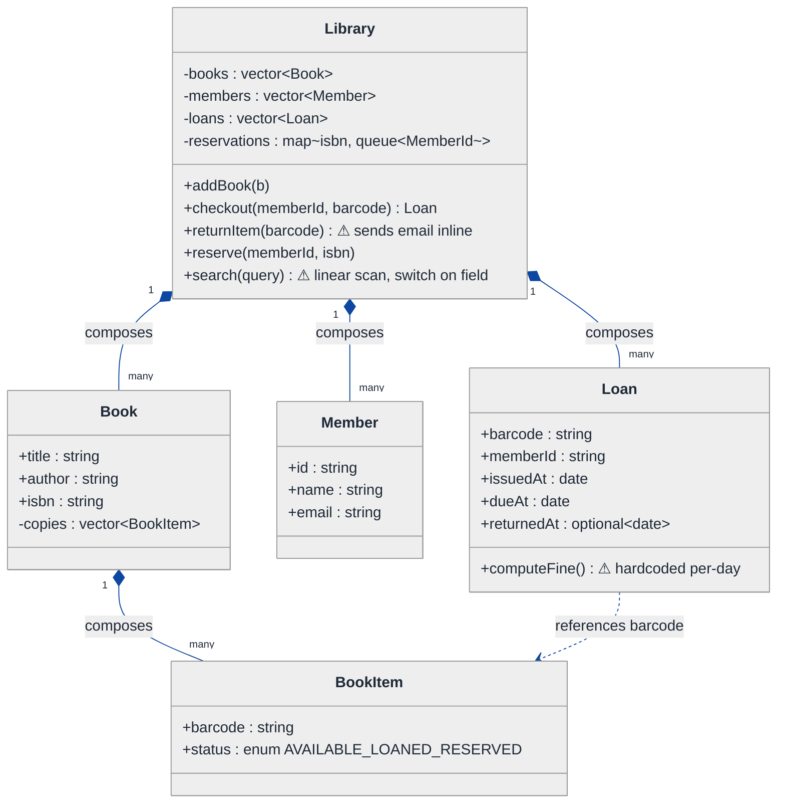
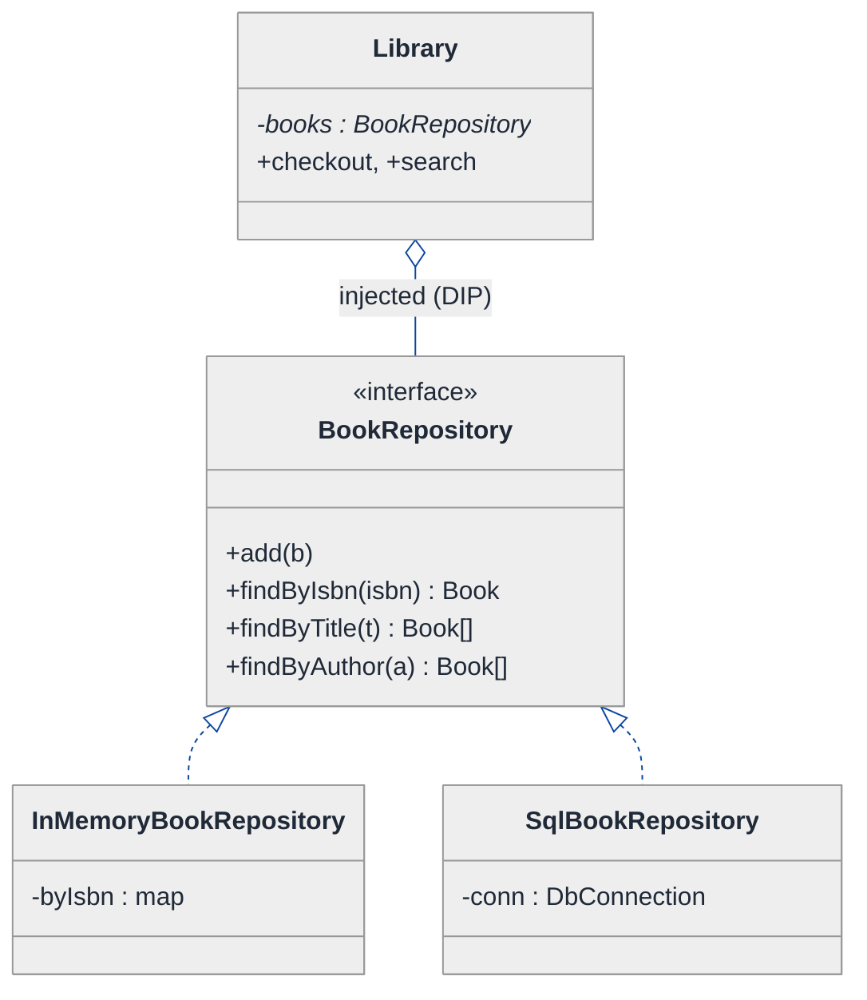
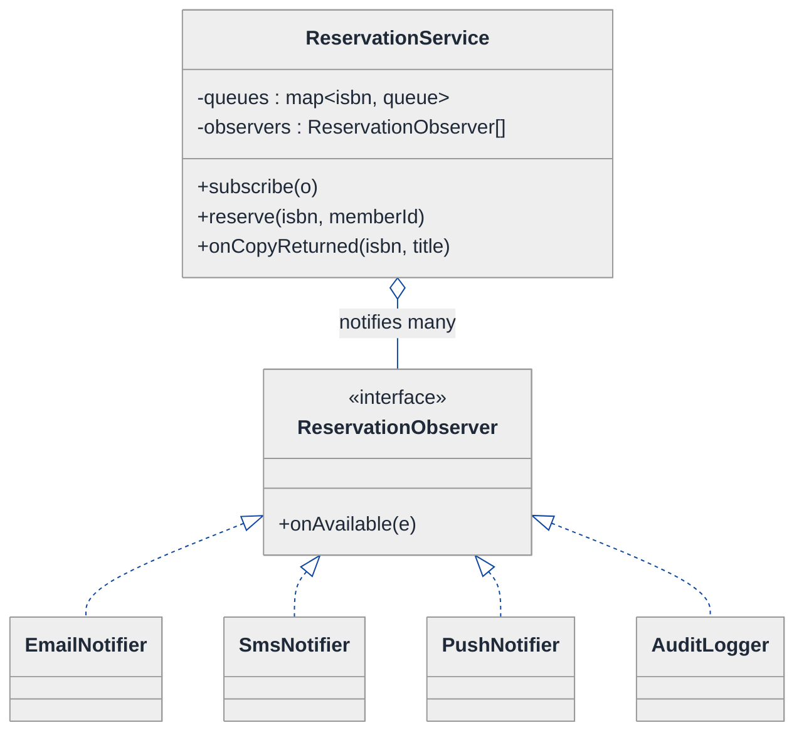
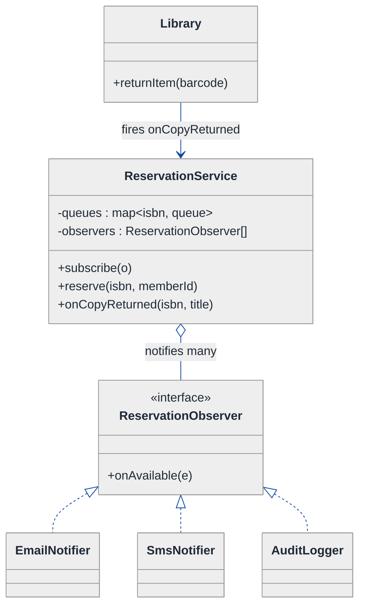
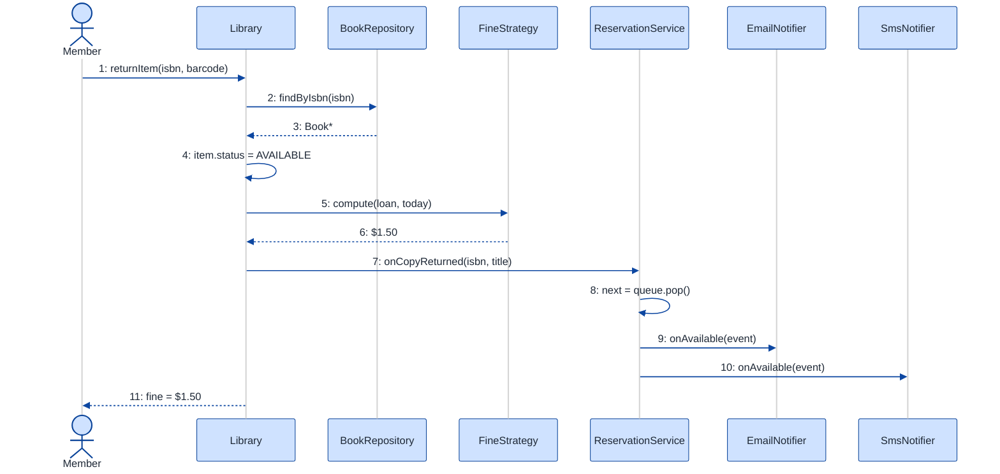

# Library Management System — LLD Walkthrough

> **Difficulty:** Medium · **Time:** ~35 min · **Pattern focus:** Observer (reservation notifications) + Repository (persistence abstraction) + SOLID
>
> **Problem source(s):** representative of multiple LeetLens rows in [`./EXTRACTED_QUESTIONS.md`](./EXTRACTED_QUESTIONS.md) (GID OOD8, bucket Object_Oriented_Design).
>
> **Diagrams:** inline mermaid (renders natively in GitHub / VS Code). Optional editable freehand sources are sibling `.excalidraw` files.

---

## How to use this file

Paced for a candidate seeing "design a library" for the first time. Reading time: ~35 minutes if you sketch each iteration by hand. **The lesson: don't reach for design patterns up front — DERIVE them. Build the naive design, watch it break under three concrete future requirements, then reach for ONE pattern per painful axis: Repository for the persistence axis, Observer for the notification axis, and SOLID to keep fine calculation swappable.**

**Map of this file (15 sections):**

1. Problem statement + clarifying questions
2. Plain-English restatement
3. Why this matters
4. Mental model
5. Try it yourself first
6. Entity & verb extraction
7. **Iteration 1: the naive design** — what we'd write first
8. **Where the naive design hurts** — three future requirements, one painful diff each
9. **Pivot 1: Repository for persistence + search** — the most painful axis first
10. **Pivot 2: Observer for the reservation queue** — push notifications, internal subject
11. **Pivot 3: Strategy for fine calculation** — applying the Open/Closed principle
12. Final UML class diagram
13. Skeleton code (C++)
14. Key flow — sequence diagram
15. Extensibility re-check + anti-patterns + how to think aloud + self-check

---

## 1. Problem statement + clarifying questions

**Prompt (typical phrasing):** "Design a library management system supporting book cataloging, member registration, book checkout/return, fine calculation, reservation queues, and search by title/author/ISBN."

**Clarifying questions to ask BEFORE drawing anything:**

1. **Copies vs. titles?** Is "Clean Code" one book, or one title with N physical copies each with its own barcode? (This changes whether `Book` and `BookItem` are separate.)
2. **Search dimensions?** Just title/author/ISBN, or also subject, publisher, publication year? Exact match or fuzzy/prefix?
3. **Fine policy?** Flat per-day, tiered (grace period then escalating), capped at the book price? Different rules for members vs. staff?
4. **Reservation semantics?** When a held copy is returned, who gets it — strict FIFO queue, or priority (faculty over student)? How long is the hold window before it expires to the next person?
5. **Persistence?** In-memory for the interview, or backed by a SQL DB? Do we need to swap storage later?
6. **Concurrency?** Can two members try to check out the same copy at once? (We'll assume single-threaded and discuss it in §15.)
7. **Limits?** Max books per member, max renewal count, blocked members with unpaid fines?

**Assumptions if interviewer dodges:** a title (`Book`) has many physical copies (`BookItem`, each with a barcode); search by title/author/ISBN with exact + prefix match; per-day fine with a grace period; strict FIFO reservation with a hold window; storage abstracted so we can start in-memory and swap to SQL later; single-threaded for now.

---

## 2. Plain-English restatement

We're building the software that runs a library branch. The system must: catalog titles and their physical copies, register members, let a member check out an available copy (or reserve one that's currently out), return copies and compute any overdue fine, run a reservation queue so the next person in line is notified when a held copy comes back, and search the catalog by title/author/ISBN. The design must accommodate **new fine rules, new notification channels, and a swap from in-memory to a real database** without rewriting the core checkout/return flow.

---

## 3. Why this matters

This question looks like CRUD but it is really probing three separable concerns that beginners tangle together: *where data lives* (persistence), *how parties get told about events* (notification), and *how policy varies* (fines). A junior writes one `Library` god-class that holds vectors, sends emails inline, and computes fines with hardcoded arithmetic. The senior bar is recognizing that each of those is an independent axis of change and isolating it behind an abstraction — Repository, Observer, Strategy — guided by SOLID. It reappears in almost every "design a [marketplace / booking / inventory] system" prompt.

---

## 4. Mental model

A library is a **catalog of inventory** + a **ledger of loans** + a **waitlist of promises**. Three real-world objects map directly: the *shelf* (inventory you search and pull from), the *checkout desk* (orchestrates loans and fines), and the *hold slip* (a promise that when a copy returns, the next person in line gets a call).

```
Real-world sketch (NOT a UML diagram yet):

      ┌──────────────────────────────────────────────┐
      │   Catalog (search by title / author / ISBN)   │
      │   "Clean Code"  → copies: [#A1 out] [#A2 in]   │
      │   "SICP"        → copies: [#B1 in]             │
      └───────────────┬──────────────────────────────┘
              ┌───────┴────────┐
              ▼                ▼
        [Checkout Desk]   [Reservation Queue]
          loan / return     "tell Bob when
          + compute fine     #A1 comes back"
                                  │
                                  ▼  (Observer: copy returned → notify)
                              [Email] [SMS] [App push]
```

The KEY insight from this picture: the catalog is *queryable inventory*, the desk is *orchestration*, and the reservation queue is an *event source* that fans out to listeners. Inventory vs. orchestration vs. events — that's the separation we'll bake into the design.

---

## 5. Try it yourself first

> **Predict before reading on:**
>
> 1. List 5 nouns you'd promote to a class. Which one noun is really TWO classes hiding as one?
> 2. **If I told you the library will move from in-memory storage to PostgreSQL next quarter, what part of your design should NOT have to change at all?**
> 3. When a reserved book is returned, who should be responsible for figuring out *who to notify* and *how to notify them* — and should those be the same object?

---

## 6. Entity & verb extraction

> **Mini-refresher: noun → class, but not every noun.**
>
> Naive OOD promotes every noun to a class. Senior OOD promotes a noun only if it has both BEHAVIOR and STATE that need to live together. "ISBN" stays a field; "Loan" becomes a class because it has lifecycle (issued → returned → overdue) and a billing target.

**Nouns from the prompt:**

| Noun | Decision | Why |
|---|---|---|
| Library | Class (top-level coordinator) | Orchestrates checkout/return/search |
| Book | Class (the *title*) | Title-level metadata: title, author, ISBN, subject |
| BookItem | Class (a physical *copy*) | Each has a barcode + status; this is the noun hiding as two |
| Member | Class | Has loans, fines, can be blocked |
| Loan | Class | Lifecycle: issue date, due date, return date, fine target |
| Reservation | Class | One member's place in a queue for a Book |
| Fine | Field / value computed by a strategy | No behavior of its own; it's a number + reason |
| ISBN / barcode | Field (`std::string`) | No behavior |
| Catalog | Emerges as a Repository (see §9) | Search lives behind an abstraction, not a raw vector |

**Verbs (and the class they live on):**

| Verb | Owner class (naive answer — we'll re-examine) |
|---|---|
| addBook / addCopy | Library |
| registerMember | Library |
| checkout(member, barcode) | Library |
| returnItem(barcode) | Library |
| reserve(member, isbn) | Library |
| computeFine(loan) | Loan (naive) — moves out in §11 |
| search(query) | Library (naive) — moves to a Repository in §9 |
| notify(member) | Library (naive) — moves to Observer in §10 |

**We have NOT introduced any design patterns yet.** Pure nouns + verbs.

---

## 7. <a id="iter-1"></a>Iteration 1: the naive design

Let's write the simplest thing that could possibly work. No design patterns — just one `Library` class holding vectors, with methods that do everything inline.



**Reader's tour (read top to bottom; ~60 seconds).**

1. **At the top — `Library` is the god-class.** It holds FOUR collections (books, members, loans, reservations) and every method does its own work inline. Notice: no Repository, no notifier, no fine policy object. Every decision lives inside these methods.

2. **The composition spine.** Filled diamonds (`◆`) mark composition — strong ownership / same lifetime. `Library` composes `Book[]`, `Member[]`, `Loan[]`; each `Book` composes its `BookItem[]` copies. If the library dies, everything dies with it.

3. **`Book` vs `BookItem` — the noun that was two.** `Book` is the *title* (one ISBN, shared metadata); `BookItem` is a *physical copy* with its own barcode and status. Catching this split is half the battle in this question — checkout operates on a copy, search operates on a title.

4. **The trouble zone — three warning markers (⚠):**
   - `Library::search` does a linear scan with a `switch` on which field to match. Every new search dimension is a new branch.
   - `Library::returnItem` sends a reservation email *inline*, hardwiring the notification channel into the return flow.
   - `Loan::computeFine` hardcodes per-day arithmetic. Every new fine rule is surgery inside this method.

**What's deliberately missing.** No `BookRepository`. No `ReservationObserver`. No `FineStrategy`. The naive design doesn't even *acknowledge* that persistence, notification, and fine policy are independent axes — it bakes a hardcoded answer for each into the `Library` methods.

Skeleton code for the naive design (C++):

```cpp
#include <chrono>
#include <map>
#include <optional>
#include <queue>
#include <stdexcept>
#include <string>
#include <vector>

enum class ItemStatus { AVAILABLE, LOANED, RESERVED };
using Date = std::chrono::sys_days;

struct BookItem { std::string barcode; ItemStatus status = ItemStatus::AVAILABLE; };

struct Book {
    std::string title, author, isbn;
    std::vector<BookItem> copies;
};

struct Member { std::string id, name, email; };

struct Loan {
    std::string barcode, memberId;
    Date issuedAt, dueAt;
    std::optional<Date> returnedAt;
    double computeFine(Date today) const {            // hardcoded — will hurt
        Date end = returnedAt.value_or(today);
        int overdueDays = (end - dueAt).count();
        return overdueDays > 0 ? overdueDays * 0.50 : 0.0;  // flat 50c/day baked in
    }
};

class Library {
public:
    void addBook(Book b) { books_.push_back(std::move(b)); }
    void registerMember(Member m) { members_.push_back(std::move(m)); }

    Loan checkout(const std::string& memberId, const std::string& barcode) {
        for (auto& book : books_)
            for (auto& item : book.copies)
                if (item.barcode == barcode && item.status == ItemStatus::AVAILABLE) {
                    item.status = ItemStatus::LOANED;
                    Loan l{ barcode, memberId, today(), today() + std::chrono::days{14} };
                    loans_.push_back(l);
                    return l;
                }
        throw std::runtime_error("Copy not available");
    }

    void returnItem(const std::string& barcode) {
        for (auto& book : books_)
            for (auto& item : book.copies)
                if (item.barcode == barcode) {
                    item.status = ItemStatus::AVAILABLE;
                    auto& q = reservations_[book.isbn];
                    if (!q.empty()) {                 // notification HARDWIRED here
                        std::string next = q.front(); q.pop();
                        sendEmail(next, "Your reserved book is ready");  // inline!
                    }
                    return;
                }
    }

    std::vector<Book> search(const std::string& field, const std::string& value) {
        std::vector<Book> out;
        for (auto& b : books_) {                      // linear scan + switch on field
            if (field == "title"  && b.title  == value) out.push_back(b);
            else if (field == "author" && b.author == value) out.push_back(b);
            else if (field == "isbn"   && b.isbn   == value) out.push_back(b);
        }
        return out;
    }
private:
    static Date today() { return std::chrono::floor<std::chrono::days>(std::chrono::system_clock::now()); }
    void sendEmail(const std::string&, const std::string&) { /* SMTP */ }
    std::vector<Book>   books_;
    std::vector<Member> members_;
    std::vector<Loan>   loans_;
    std::map<std::string, std::queue<std::string>> reservations_;
};
```

**This works.** It has zero design patterns. We can catalog, check out, return, reserve, and search. So what's wrong with it?

---

## 8. <a id="naive-pain"></a>Where the naive design hurts

The interviewer slides three new requirements across the desk: "These ship next quarter. Walk me through what changes."

### Change A: "Move from in-memory to PostgreSQL; also add fuzzy search by subject"

In the naive design:
- `search()` is a linear scan over an in-memory `vector<Book>`. Swapping to SQL means rewriting `search`, `checkout`, `returnItem`, `addBook` — **every method that touches `books_` knows it's a `std::vector`.**
- Adding a "subject" dimension adds another `else if` branch to the `switch`-style `search`.
- The persistence mechanism leaks into the entire `Library` class. **Storage and business logic are fused.**

### Change B: "Notify reserved-book holders by SMS and app-push, not just email — and log every notification"

In the naive design:
- `returnItem()` calls `sendEmail(...)` inline. To add SMS you edit `returnItem`; to add push you edit it again; to add audit-logging you edit it a third time.
- The notification channel is **hardwired into the return flow**. The return logic has no business knowing how many channels exist.
- **Every new listener = surgery inside `returnItem`.** Three sites and growing.

### Change C: "Fine policy changes — grace period of 3 days, then 50c/day, capped at the book's price; staff are exempt"

In the naive design:
- `Loan::computeFine` hardcodes `overdueDays * 0.50`. Grace period, cap, and staff-exemption all become nested `if`s inside this one method.
- Next policy tweak (summer amnesty, per-genre rates) → another 10 lines in `computeFine`. **One method accumulates every rule.**

### The pattern of pain

| Change | Files touched | Smell |
|---|---|---|
| A. SQL + new search | `search` + `checkout` + `returnItem` + `addBook` | "Storage mechanism leaks into every method." |
| B. SMS + push + audit | `returnItem` (three edits) | "Notification channel hardwired into business flow." |
| C. New fine rules | `Loan::computeFine` (monstrous) | "Single method accumulates every fine rule." |

**Three axes of pain dominate:** the *persistence/query* axis (where data lives and how we search it), the *notification* axis (who gets told when an event fires), and the *policy* axis (how fines vary).

> **Pivot question:** "What pattern hides *where data lives and how it's queried* behind a stable interface? What pattern lets *an event fan out to a growing set of listeners* without the event source knowing them? What pattern makes *a varying calculation* swappable?"
>
> The answers are Repository, Observer, and Strategy. Let's introduce them one at a time, starting with the most painful axis: persistence.

---

## 9. <a id="pivot-1"></a>Pivot 1: Repository for persistence + search

> **Mini-refresher: Repository pattern.**
>
> A Repository is an interface that looks like an in-memory collection of domain objects (`add`, `findById`, `findBy...`) but hides the actual storage — a vector, a SQL table, a remote service. The business logic depends on the *interface*, never on the storage mechanism.
>
> Quick example: `BookRepository::findByIsbn(isbn)` returns a `Book*`. The caller doesn't know — and must not care — whether that came from a `std::vector` or a `SELECT * FROM books WHERE isbn = ?`.

> **Mini-refresher: SOLID — the "D" (Dependency Inversion Principle).**
>
> High-level modules should depend on abstractions, not on concrete details. `Library` (high-level policy) should depend on a `BookRepository` *interface*, not on `std::vector<Book>` (a low-level detail). Invert the arrow: the concrete `InMemoryBookRepository` depends on the interface, not the other way around.

**Why Repository fits.** Persistence is the classic "detail that changes independently of policy." Search is just a query over that store. By defining `BookRepository` with `findByTitle / findByAuthor / findByIsbn`, the `Library` never touches a `vector` again — and swapping to SQL is *one new class*.

**Repository vs DAO — the sibling you didn't pick.**
- *DAO (Data Access Object):* one object per table, thin CRUD, speaks in rows/tables. Persistence-shaped.
- *Repository:* speaks in *domain objects and collections* (`findAvailableCopies`), often spanning tables, expresses business queries. Domain-shaped.
- *Rule of thumb:* if the method names read like database operations (`insertRow`) → DAO. If they read like questions a librarian would ask (`findByAuthor`) → Repository. We want domain-shaped queries, so Repository.

**The refactor (just the affected part):**

```cpp
class BookRepository {
public:
    virtual ~BookRepository() = default;
    virtual void add(Book b) = 0;
    virtual Book* findByIsbn(const std::string& isbn) = 0;
    virtual std::vector<Book*> findByTitle(const std::string& title) = 0;
    virtual std::vector<Book*> findByAuthor(const std::string& author) = 0;
};

class InMemoryBookRepository : public BookRepository {
public:
    void add(Book b) override { byIsbn_[b.isbn] = std::move(b); }
    Book* findByIsbn(const std::string& isbn) override {
        auto it = byIsbn_.find(isbn);
        return it != byIsbn_.end() ? &it->second : nullptr;
    }
    std::vector<Book*> findByTitle(const std::string& t) override {
        std::vector<Book*> out;
        for (auto& [_, b] : byIsbn_) if (b.title == t) out.push_back(&b);
        return out;
    }
    std::vector<Book*> findByAuthor(const std::string& a) override { /* elided */ return {}; }
private:
    std::map<std::string, Book> byIsbn_;   // index by primary key
};

// class SqlBookRepository : public BookRepository { /* SELECT ... WHERE ... */ };  // elided

class Library {
    // ...
    std::unique_ptr<BookRepository> books_;   // injected at construction — DIP
};
```

**What changed — visualized.** Just the persistence slice:



**Tour of the after-state.**

1. **Library gained a field, lost its vectors.** `books_` is now a pointer to a `BookRepository` *interface*, INJECTED at construction. The open diamond (`◇`) marks aggregation — Library uses the repo, the wiring code owns its lifecycle.

2. **The `<<interface>>` box** declares the contract: `add` + three finders. Search stopped being a `switch` — it's three named query methods. Adding a "subject" dimension adds *one method to the interface*, not a branch deep inside `Library::search`.

3. **Two concrete repositories.** `InMemoryBookRepository` indexes by ISBN in a map (note: `findByIsbn` is now O(1), not a linear scan). `SqlBookRepository` is the change-A swap — a new class implementing the same interface. **Library doesn't change one line.**

4. **Change A from §8 lands cleanly.** SQL migration → write `SqlBookRepository`, change one line of wiring. New search dimension → add one interface method. No surgery in the orchestration code.

The same treatment applies to `MemberRepository` and `LoanRepository` — three repositories, one per aggregate. We'll show them in the final diagram.

---

## 10. <a id="pivot-2"></a>Pivot 2: Observer for the reservation queue

Change B from §8 is still painful — SMS, push, and audit-logging all wedged into `returnItem`. The Repository didn't help, because the variability here isn't *where data lives*; it's *who reacts when an event fires*.

> **Mini-refresher: Observer pattern.**
>
> A *subject* maintains a list of *observers* and notifies them when something happens — without knowing who they are or what they do. Observers subscribe/unsubscribe at runtime. The subject just calls `observer->onEvent(...)` on each; the fan-out is decoupled from the trigger.
>
> Quick example: a spreadsheet cell (subject) holds a list of chart-views (observers). When the cell value changes it calls `update()` on each chart. The cell doesn't know what a chart is.

> **Mini-refresher: SOLID — the "O" (Open/Closed Principle).**
>
> Software should be open for *extension* but closed for *modification*. Adding an SMS channel should mean *adding a new class*, never *editing* the return flow. Observer is the structural tool that buys you OCP for the notification axis.

**Why Observer (not just another Strategy).** A Strategy is *one* swappable algorithm chosen by the caller. Here we have *many* parties that all want to react to the same event ("a reserved copy became available"), and the set grows over time (email, then SMS, then push, then audit). One-to-many fan-out with dynamic subscription is textbook Observer.

**Observer vs Mediator — the sibling you didn't pick.**
- *Observer:* one subject broadcasts to many observers; observers don't talk back through it. One-directional fan-out.
- *Mediator:* a hub through which many colleagues communicate bidirectionally, encapsulating their interaction protocol.
- *Rule of thumb:* "many listeners react to one event" → Observer. "many objects coordinate complex mutual interactions" → Mediator. We just need fan-out, so Observer.

**The refactor (just the notification part):**

```cpp
struct ReservationEvent {
    std::string isbn;
    std::string memberId;   // the next member in line
    std::string title;
};

class ReservationObserver {                 // the Observer interface
public:
    virtual ~ReservationObserver() = default;
    virtual void onAvailable(const ReservationEvent& e) = 0;
};

class EmailNotifier : public ReservationObserver {
public:
    void onAvailable(const ReservationEvent& e) override {
        /* SMTP: "Your hold on " + e.title + " is ready" */
    }
};

class SmsNotifier : public ReservationObserver {
public:
    void onAvailable(const ReservationEvent& e) override { /* Twilio */ }
};
// class PushNotifier / AuditLogger : public ReservationObserver { /* elided */ };

// The Subject — owns the queue and the observer list, fires the event.
class ReservationService {
public:
    void subscribe(ReservationObserver* o) { observers_.push_back(o); }   // runtime
    void reserve(const std::string& isbn, const std::string& memberId) {
        queues_[isbn].push(memberId);
    }
    // called by Library when a copy is returned:
    void onCopyReturned(const std::string& isbn, const std::string& title) {
        auto& q = queues_[isbn];
        if (q.empty()) return;
        std::string next = q.front(); q.pop();
        ReservationEvent e{ isbn, next, title };
        for (auto* o : observers_) o->onAvailable(e);   // fan-out — no channel knowledge
    }
private:
    std::map<std::string, std::queue<std::string>> queues_;   // FIFO per ISBN
    std::vector<ReservationObserver*> observers_;             // non-owning back-refs
};
```

**What changed — visualized.** Just the notification slice:



**Tour of the after-state.**

1. **`ReservationService` is the SUBJECT.** It owns the FIFO queues (one per ISBN) AND a list of observers. The `returnItem` logic that lived in `Library` now just calls `reservationService.onCopyReturned(isbn, title)` — it knows nothing about channels.

2. **`ReservationObserver` is the interface** with a single method `onAvailable(event)`. The arrow `o--` is aggregation: the service holds *non-owning* pointers to observers (they outlive any single event). In C++ these are raw `T*` or `std::weak_ptr` for back-references — never owning, to avoid a cycle.

3. **Four interchangeable observers.** Email, SMS, Push, Audit. Each implements `onAvailable`. The service iterates and calls each — it can't tell them apart and doesn't try.

4. **Push vs Pull (a design knob).** We push the full `ReservationEvent` to each observer (push model). The alternative is to push just "something changed" and let observers pull details from the subject (pull model). Push is simpler here because the event payload is small and fixed.

5. **Change B from §8 lands cleanly.** SMS → `service.subscribe(new SmsNotifier)`. Push → one more `subscribe`. Audit-logging → an `AuditLogger` observer. **Zero edits to the return flow.** That's the Open/Closed principle, delivered by Observer.

---

## 11. <a id="pivot-3"></a>Pivot 3: Strategy for fine calculation

Changes A and B are solved. Change C — grace period, cap, staff-exemption, future per-genre rates — is still a growing `if`-ladder inside `Loan::computeFine`.

> **Mini-refresher: Strategy pattern.**
>
> Encapsulates an algorithm behind an interface so it can be swapped at runtime. The CALLER (here, the library's configuration) decides which strategy to use; the strategy doesn't know about its peers.

> **Mini-refresher: SOLID — the "S" (Single Responsibility Principle).**
>
> A class should have one reason to change. `Loan` is a record of a checkout; *fine policy* is a separate reason to change. Pulling `computeFine` out of `Loan` and into a `FineStrategy` means a fine-rule change never touches the `Loan` class.

**Why Strategy fits fines.** Fine calculation is an algorithm (`given a loan and today's date, return an amount`). It varies (flat, grace-period, capped, amnesty). The choice is made externally by library policy — not by the loan itself. Textbook Strategy. (Same shape as pricing in the parking-lot walkthrough — once you recognize "algorithm picked by config," the structure is reusable.)

**The refactor (just the fine part):**

```cpp
class FineStrategy {
public:
    virtual ~FineStrategy() = default;
    virtual double compute(const Loan& loan, Date today) const = 0;
};

class FlatPerDayFine : public FineStrategy {
public:
    explicit FlatPerDayFine(double perDay) : perDay_(perDay) {}
    double compute(const Loan& loan, Date today) const override {
        Date end = loan.returnedAt.value_or(today);
        int overdue = (end - loan.dueAt).count();
        return overdue > 0 ? overdue * perDay_ : 0.0;
    }
private:
    double perDay_;
};

// Decorator-style: a grace window wrapping any base policy.
class GracePeriodFine : public FineStrategy {
public:
    GracePeriodFine(int graceDays, std::unique_ptr<FineStrategy> base)
        : graceDays_(graceDays), base_(std::move(base)) {}
    double compute(const Loan& loan, Date today) const override {
        Date end = loan.returnedAt.value_or(today);
        int overdue = (end - loan.dueAt).count();
        return overdue > graceDays_ ? base_->compute(loan, today) : 0.0;
    }
private:
    int graceDays_;
    std::unique_ptr<FineStrategy> base_;
};
// class CappedFine : public FineStrategy { /* min(base, bookPrice) */ };  // elided

class Library {
    // ...
    std::unique_ptr<FineStrategy> fines_;   // injected; Loan::computeFine is GONE
};
```

**Where it plugs in.** `Loan` becomes a pure record — no `computeFine` method. The `Library` (or a `CheckoutService`) calls `fines_->compute(loan, today())` on return. Composing `GracePeriodFine(3, CappedFine(price, FlatPerDayFine(0.50)))` gives "3-day grace, then 50c/day, capped at price" — three independent rules stacked, which the naive nested-`if` could never express cleanly.

**Pattern-discrimination cheatsheet — Strategy vs Template Method.**
- *Strategy:* the whole algorithm is a swappable object, chosen at runtime via composition.
- *Template Method:* an algorithm skeleton lives in a base class; subclasses fill hooks via inheritance.
- *Rule of thumb:* variants that compose or change at runtime → Strategy. A fixed skeleton with 2-3 stable variants → Template Method.

We chose Strategy because fine rules COMPOSE (grace × cap × per-day), and you can't compose Template-Method subclasses.

**Change C from §8 lands cleanly.** New fine rule → new `FineStrategy` class. Staff exemption → a `StaffExemptFine` decorator that returns 0 for staff and delegates otherwise. **No edits to `Loan`.**

---

## 12. <a id="fig-class-diagram"></a>Final class diagram

Drawing every class at once is a wall of boxes. Here are **three focused sub-views**, each addressing a different concern. Read them in order; the structural insight at the end ties them together.

### 12.1 The inventory + persistence spine — what the library OWNS and where it lives

```mermaid
---
config:
  theme: neutral
  themeVariables:
    background: '#ffffff'
    primaryColor: '#cfe2ff'
    primaryTextColor: '#1f2937'
    primaryBorderColor: '#084298'
    secondaryColor: '#fff3cd'
    secondaryTextColor: '#1f2937'
    secondaryBorderColor: '#664d03'
    tertiaryColor: '#d1e7dd'
    tertiaryTextColor: '#1f2937'
    tertiaryBorderColor: '#0a3622'
    lineColor: '#0d47a1'
    textColor: '#1f2937'
    noteBkgColor: '#fff3cd'
    noteTextColor: '#1f2937'
    noteBorderColor: '#997404'
    actorBkg: '#cfe2ff'
    actorBorder: '#084298'
    actorTextColor: '#1f2937'
    signalColor: '#0d47a1'
    signalTextColor: '#1f2937'
    labelBoxBkgColor: '#ffffff'
    labelBoxBorderColor: '#d3d3d3'
    labelTextColor: '#1f2937'
    edgeLabelBackground: '#ffffff'
    labelBackground: '#ffffff'
    classText: '#1f2937'
    fontFamily: 'system-ui, -apple-system, Segoe UI, Helvetica, Arial, sans-serif'
  themeCSS: |
    .messageText, .labelText, .sequenceNumber {
      paint-order: stroke fill;
      stroke: #ffffff;
      stroke-width: 5px;
      stroke-linejoin: round;
      stroke-linecap: round;
    }
    .edgePath path,
    .flowchart-link,
    .messageLine0,
    .messageLine1,
    .relation,
    .composition,
    .aggregation,
    .extension,
    .dependency {
      stroke-width: 2.5px !important;
    }
    marker path {
      stroke-width: 1.5px !important;
    }
---
classDiagram
  direction TB
  class Library {
    -books : BookRepository*
    -members : MemberRepository*
    -loans : LoanRepository*
    (root coordinator)
  }
  class BookRepository {
    <<interface>>
    +findByIsbn, +findByTitle, +findByAuthor
  }
  class MemberRepository {
    <<interface>>
    +findById
  }
  class LoanRepository {
    <<interface>>
    +findActiveByBarcode
  }
  class Book {
    title, author, isbn
    copies : BookItem[]
  }
  class BookItem {
    barcode, status
  }
  Library o-- BookRepository : injected
  Library o-- MemberRepository : injected
  Library o-- LoanRepository : injected
  BookRepository ..> Book : stores
  Book "1" *-- "many" BookItem : composes
```

**Tour of 12.1.** Three repository interfaces, one per aggregate (Book, Member, Loan), all INJECTED (open diamonds = aggregation). The only true composition left (filled diamond) is `Book *-- BookItem` — a title genuinely owns its copies; they share its lifetime. Everything else the library merely *uses* through an interface, so storage can be swapped (in-memory ↔ SQL) without touching `Library`.

### 12.2 The reservation event system — the Observer



**Tour of 12.2.** `Library::returnItem` no longer sends emails — it fires `onCopyReturned` at the `ReservationService` (the subject) and walks away. The service pops the FIFO queue, builds a `ReservationEvent`, and fans out to every subscribed observer. The dependency arrow from Library is one-directional and thin; the channels live entirely on the other side of the observer interface. Add a channel = add an observer + one `subscribe` call.

### 12.3 The loan lifecycle + fine policy — the Strategy

```mermaid
---
config:
  theme: neutral
  themeVariables:
    background: '#ffffff'
    primaryColor: '#cfe2ff'
    primaryTextColor: '#1f2937'
    primaryBorderColor: '#084298'
    secondaryColor: '#fff3cd'
    secondaryTextColor: '#1f2937'
    secondaryBorderColor: '#664d03'
    tertiaryColor: '#d1e7dd'
    tertiaryTextColor: '#1f2937'
    tertiaryBorderColor: '#0a3622'
    lineColor: '#0d47a1'
    textColor: '#1f2937'
    noteBkgColor: '#fff3cd'
    noteTextColor: '#1f2937'
    noteBorderColor: '#997404'
    actorBkg: '#cfe2ff'
    actorBorder: '#084298'
    actorTextColor: '#1f2937'
    signalColor: '#0d47a1'
    signalTextColor: '#1f2937'
    labelBoxBkgColor: '#ffffff'
    labelBoxBorderColor: '#d3d3d3'
    labelTextColor: '#1f2937'
    edgeLabelBackground: '#ffffff'
    labelBackground: '#ffffff'
    classText: '#1f2937'
    fontFamily: 'system-ui, -apple-system, Segoe UI, Helvetica, Arial, sans-serif'
  themeCSS: |
    .messageText, .labelText, .sequenceNumber {
      paint-order: stroke fill;
      stroke: #ffffff;
      stroke-width: 5px;
      stroke-linejoin: round;
      stroke-linecap: round;
    }
    .edgePath path,
    .flowchart-link,
    .messageLine0,
    .messageLine1,
    .relation,
    .composition,
    .aggregation,
    .extension,
    .dependency {
      stroke-width: 2.5px !important;
    }
    marker path {
      stroke-width: 1.5px !important;
    }
---
classDiagram
  direction TB
  class Library {
    -fines : FineStrategy*
    +returnItem(barcode)
  }
  class Loan {
    barcode, memberId
    issuedAt, dueAt
    returnedAt : optional
    (pure record - no computeFine)
  }
  class FineStrategy {
    <<interface>>
    +compute(loan, today) double
  }
  class FlatPerDayFine
  class GracePeriodFine {
    -base : FineStrategy*
  }
  class CappedFine {
    -base : FineStrategy*
  }
  Library o-- FineStrategy : injected
  Library ..> Loan : creates / closes
  FineStrategy <|.. FlatPerDayFine
  FineStrategy <|.. GracePeriodFine
  FineStrategy <|.. CappedFine
  GracePeriodFine --> FineStrategy : wraps base
  CappedFine --> FineStrategy : wraps base
```

**Tour of 12.3.** `Loan` is now a pure record (Single Responsibility — it tracks a checkout, nothing more). `FineStrategy` is injected into the library; on return the library calls `fines_->compute(loan, today)`. `GracePeriodFine` and `CappedFine` are decorators — each holds a `base : FineStrategy*` and wraps another policy, so rules stack: `GracePeriod(Capped(FlatPerDay))`. New rule = new leaf class, zero edits elsewhere.

### Structural insight (ties 12.1 + 12.2 + 12.3 together)

| Concern | Pattern used | Why |
|---|---|---|
| **Persistence + search** (Book/Member/Loan) | Repository, INJECTED | Storage is a detail; queries are domain-shaped; SQL swap = one class (DIP) |
| **Notification** (email/SMS/push/audit) | Observer, subject owns observers | One event, many growing listeners; add channel without editing the trigger (OCP) |
| **Fine policy** (flat/grace/cap/exempt) | Strategy + decorators, INJECTED | Algorithm picked by config; rules compose; never edit `Loan` (SRP) |
| **Inventory identity** (Book → BookItem) | Plain composition | A title genuinely owns its copies; real "has-a" |

The big lesson: **each axis of change got its own abstraction, guided by a different SOLID letter** — DIP for persistence, OCP for notification, SRP for fines. Inheritance is used only inside the pattern families (the concrete repos / observers / strategies); the relationships *between* components are composition over interfaces. *Depend on roles, not on details.*

---

## 13. Skeleton code (C++)

> Show the SHAPES, not the full impl. Interfaces + 1-2 concretes per pattern.

```cpp
#include <chrono>
#include <map>
#include <memory>
#include <optional>
#include <queue>
#include <stdexcept>
#include <string>
#include <vector>

using Date = std::chrono::sys_days;

// ── Domain records ──────────────────────────────────────────────────
enum class ItemStatus { AVAILABLE, LOANED, RESERVED };

struct BookItem { std::string barcode; ItemStatus status = ItemStatus::AVAILABLE; };

struct Book {
    std::string title, author, isbn;
    double price = 0.0;
    std::vector<BookItem> copies;
};

struct Member { std::string id, name, email; bool isStaff = false; };

struct Loan {                                   // pure record — SRP, no computeFine
    std::string barcode, memberId;
    Date issuedAt, dueAt;
    std::optional<Date> returnedAt;
};

// ── Repository interfaces (DIP — Library depends on these, not vectors) ─
class BookRepository {
public:
    virtual ~BookRepository() = default;
    virtual void add(Book b) = 0;
    virtual Book* findByIsbn(const std::string& isbn) = 0;
    virtual std::vector<Book*> findByTitle(const std::string& title) = 0;
    virtual std::vector<Book*> findByAuthor(const std::string& author) = 0;
};
class InMemoryBookRepository : public BookRepository {
public:
    void add(Book b) override { byIsbn_[b.isbn] = std::move(b); }
    Book* findByIsbn(const std::string& isbn) override {
        auto it = byIsbn_.find(isbn); return it != byIsbn_.end() ? &it->second : nullptr;
    }
    std::vector<Book*> findByTitle(const std::string& t) override {
        std::vector<Book*> out;
        for (auto& [_, b] : byIsbn_) if (b.title == t) out.push_back(&b);
        return out;
    }
    std::vector<Book*> findByAuthor(const std::string&) override { return {}; }  // elided
private:
    std::map<std::string, Book> byIsbn_;
};
// class SqlBookRepository : public BookRepository { /* elided */ };
// class MemberRepository / LoanRepository : same shape — elided

// ── Observer: reservation event system ──────────────────────────────
struct ReservationEvent { std::string isbn, memberId, title; };

class ReservationObserver {
public:
    virtual ~ReservationObserver() = default;
    virtual void onAvailable(const ReservationEvent& e) = 0;
};
class EmailNotifier : public ReservationObserver {
public:
    void onAvailable(const ReservationEvent& e) override { /* SMTP — elided */ }
};
// class SmsNotifier / PushNotifier / AuditLogger : elided

class ReservationService {                      // the Subject
public:
    void subscribe(ReservationObserver* o) { observers_.push_back(o); }
    void reserve(const std::string& isbn, const std::string& memberId) {
        queues_[isbn].push(memberId);
    }
    void onCopyReturned(const std::string& isbn, const std::string& title) {
        auto& q = queues_[isbn];
        if (q.empty()) return;
        std::string next = q.front(); q.pop();
        ReservationEvent e{ isbn, next, title };
        for (auto* o : observers_) o->onAvailable(e);   // fan-out
    }
private:
    std::map<std::string, std::queue<std::string>> queues_;   // FIFO per ISBN
    std::vector<ReservationObserver*> observers_;             // non-owning
};

// ── Strategy: fine calculation ──────────────────────────────────────
class FineStrategy {
public:
    virtual ~FineStrategy() = default;
    virtual double compute(const Loan& loan, Date today) const = 0;
};
class FlatPerDayFine : public FineStrategy {
public:
    explicit FlatPerDayFine(double perDay) : perDay_(perDay) {}
    double compute(const Loan& loan, Date today) const override {
        Date end = loan.returnedAt.value_or(today);
        int overdue = (end - loan.dueAt).count();
        return overdue > 0 ? overdue * perDay_ : 0.0;
    }
private:
    double perDay_;
};
class GracePeriodFine : public FineStrategy {   // decorator over any base policy
public:
    GracePeriodFine(int graceDays, std::unique_ptr<FineStrategy> base)
        : graceDays_(graceDays), base_(std::move(base)) {}
    double compute(const Loan& loan, Date today) const override {
        Date end = loan.returnedAt.value_or(today);
        int overdue = (end - loan.dueAt).count();
        return overdue > graceDays_ ? base_->compute(loan, today) : 0.0;
    }
private:
    int graceDays_;
    std::unique_ptr<FineStrategy> base_;
};
// class CappedFine / StaffExemptFine : decorators — elided

// ── The coordinator ─────────────────────────────────────────────────
class Library {
public:
    Library(std::unique_ptr<BookRepository> books,
            ReservationService& reservations,
            std::unique_ptr<FineStrategy> fines)
        : books_(std::move(books)), reservations_(reservations),
          fines_(std::move(fines)) {}

    Loan checkout(const std::string& memberId, const std::string& isbn,
                  const std::string& barcode) {
        Book* book = books_->findByIsbn(isbn);
        if (!book) throw std::runtime_error("Unknown title");
        for (auto& item : book->copies)
            if (item.barcode == barcode && item.status == ItemStatus::AVAILABLE) {
                item.status = ItemStatus::LOANED;
                return Loan{ barcode, memberId, today(), today() + std::chrono::days{14} };
            }
        throw std::runtime_error("Copy not available");
    }

    double returnItem(const std::string& isbn, const std::string& barcode, Loan& loan) {
        Book* book = books_->findByIsbn(isbn);
        for (auto& item : book->copies)
            if (item.barcode == barcode) {
                item.status = ItemStatus::AVAILABLE;
                loan.returnedAt = today();
                double fine = fines_->compute(loan, today());           // Strategy
                reservations_.onCopyReturned(isbn, book->title);        // Observer fan-out
                return fine;
            }
        throw std::runtime_error("Unknown copy");
    }

    std::vector<Book*> search(const std::string& field, const std::string& value) {
        if (field == "isbn")   { auto* b = books_->findByIsbn(value); return b ? std::vector<Book*>{b} : std::vector<Book*>{}; }
        if (field == "title")  return books_->findByTitle(value);
        if (field == "author") return books_->findByAuthor(value);
        return {};
    }
private:
    static Date today() {
        return std::chrono::floor<std::chrono::days>(std::chrono::system_clock::now());
    }
    std::unique_ptr<BookRepository> books_;     // owned, behind interface (DIP)
    ReservationService&             reservations_;
    std::unique_ptr<FineStrategy>   fines_;
};
```

---

## 14. <a id="fig-sequence"></a>Key flow — sequence diagram

The return-a-reserved-copy flow is where all three patterns cooperate: the Repository finds the book, the Strategy computes the fine, the Observer fans out the "it's available" event.



**Tour of the flow. Read slowly — this is the moment all three patterns meet.**

1. **Member returns a copy.** `Library::returnItem(isbn, barcode)` is the single entry point.

2. **Library asks the Repository for the book** (`findByIsbn`). Notice Library does NOT scan a vector — it asks an interface. **Pattern #1 (Repository) in play.** Whether that's in-memory or SQL is invisible here.

3. **Library flips the copy to AVAILABLE.** Pure local state change on the `BookItem`.

4. **Library asks the FineStrategy to compute the fine** (`compute(loan, today)`). Library doesn't know the rule — grace period, cap, staff-exemption all live inside the injected strategy. **Pattern #2 (Strategy) in play.**

5. **Library fires `onCopyReturned` at the ReservationService and walks away.** It passes only `(isbn, title)`. It does NOT know who is waiting or how they'll be told.

6. **The ReservationService pops the FIFO queue** to find the next member, builds a `ReservationEvent`, and fans out.

7. **Each observer is notified in turn** — Email, then SMS (then Push, Audit, …). **Pattern #3 (Observer) in play.** Library is not on screen for steps 8-10; it has no idea this is happening. That decoupling is the whole point.

8. **The fine bubbles back to the member.** Done.

### The coupling that's NOT shown — and why it matters

You don't see `Library` calling `sendEmail`, nor a `switch` on search field, nor an `if`-ladder for fines anywhere in this diagram. That's the payoff: **each axis of change sits behind an interface, so the orchestration code stays thin and stable.** Library coordinates; it does not implement persistence, notification, or policy.

---

## 15. Extensibility re-check + anti-patterns + how to think aloud + self-check

### Extensibility re-check

Revisit the three changes from [§8](#naive-pain). For each, name the SINGLE class (or class + one wiring line) that changes.

| Change | Naive design impact | Final design impact |
|---|---|---|
| A. SQL + new search dimension | `search` + `checkout` + `returnItem` + `addBook` | New `SqlBookRepository`; +1 interface method for the new dimension. One wiring line. |
| B. SMS + push + audit | `returnItem` edited three times | New `SmsNotifier` / `PushNotifier` / `AuditLogger` observers; one `subscribe` call each. |
| C. Grace + cap + staff-exempt fines | `Loan::computeFine` monstrous | New `GracePeriodFine` / `CappedFine` / `StaffExemptFine` decorators; compose them. |

Every change is essentially ONE new class in the final design. That's the open/closed principle in practice.

If a future requirement makes you change `Library`, `BookRepository`, `FineStrategy`, AND `ReservationService` together — go back to §6 and re-identify variability points; you missed one.

### Common confusion + traps

1. **"Should `Book` and `BookItem` be one class?"** No. The *title* (search target, one ISBN) and the *physical copy* (checkout target, one barcode, its own status) change for different reasons. Merging them breaks the moment you have two copies of one title.

2. **"Why not let `Library` send the email directly — it's simpler?"** It's simpler for *one* channel. The Observer earns its keep the instant a second channel appears, which §8-B guarantees. Don't wire the trigger to the channel.

3. **"Repository vs just a `std::vector`?"** The vector works until storage moves. The Repository interface is the seam that lets in-memory ↔ SQL be a one-class swap. It also makes `findByIsbn` an O(1) map lookup instead of a scan.

4. **"Where do reservation *priorities* (faculty over student) go?"** Not in the observers — they're about *who's next*, which is the queue's concern. Swap the FIFO `queue` for a priority queue inside `ReservationService`, or make the ordering itself a Strategy. The observers still just fan out.

5. **"Why `unique_ptr` for repos/fines but raw `T*` for observers?"** Repos and the fine strategy are *owned exclusively* by the library → `unique_ptr`. Observers are owned elsewhere and merely *referenced* by the subject → non-owning raw pointer (or `weak_ptr`), to avoid an ownership cycle.

### Anti-patterns

- **"God class Library"** — holding vectors, sending emails, computing fines all inline. Pull each axis into a collaborator (repo / observer / strategy).
- **"Tag-driven search switch"** — `if (field == "title") ... else if (field == "author")` growing forever. Replace with named repository finders.
- **"Hardwired notification"** — `sendEmail(...)` buried in `returnItem`. Use Observer so channels subscribe.
- **"Anemic-but-overloaded Loan"** — a data record that ALSO computes fines. Keep `Loan` a record (SRP); move policy to `FineStrategy`.
- **"Repository that leaks SQL"** — methods named `executeQuery(sql)` defeat the abstraction. Keep finders domain-shaped.
- **"Singleton Library"** — there may be multiple branches. Inject collaborators; don't reach for a global.

### How to think aloud

> "OK, library system. Let me clarify scope. [Asks the §1 questions — copies vs titles, search dimensions, fine policy, reservation semantics, persistence.] Got it.
>
> Nouns: Library, Book, BookItem, Member, Loan, Reservation. The key catch: Book is the title, BookItem is a physical copy — they're separate.
>
> I'll start NAIVE — one Library god-class holding vectors, with search by linear scan, email sent inline on return, and a hardcoded per-day fine on Loan.
>
> Now I stress-test it. Change A: move to SQL + add a search dimension — touches every method that knows about the vector. Change B: add SMS / push / audit notifications — three edits to returnItem. Change C: grace period + cap + staff exemption — computeFine balloons.
>
> Three axes of pain: persistence/query, notification, fine policy.
>
> Pivot 1: Repository for persistence — `BookRepository` interface, in-memory and SQL implementations, finders instead of a switch. That's Dependency Inversion.
>
> Pivot 2: Observer for reservations — `ReservationService` is the subject owning the FIFO queue and a list of `ReservationObserver`s; channels subscribe. Adding a channel never touches the return flow. That's Open/Closed.
>
> Pivot 3: Strategy for fines — `FineStrategy` injected into the library; grace and cap are decorators that compose. Loan becomes a pure record. That's Single Responsibility.
>
> Final design: Library coordinates three repositories, one reservation subject, one fine strategy. All three future requirements land as one new class each."

### Self-check

> **Self-check — the question to ask next time.**
>
> When you see "design a system that stores things, reacts to events, and applies varying policy," before writing one god-class, ask:
>
> > **"Is this axis about WHERE data lives (Repository), about WHO reacts to an event (Observer), or about HOW a calculation varies (Strategy)?"**
>
> Storage → Repository (DIP). Fan-out to many listeners → Observer (OCP). Swappable calculation → Strategy (SRP). Most real systems have all three — and the SOLID letters tell you which abstraction each axis deserves.

---

## Cross-references

- **Parent topic manifest:** [`./EXTRACTED_QUESTIONS.md`](./EXTRACTED_QUESTIONS.md)
- **Vertical overview:** [`../../LEARNING.md`](../../LEARNING.md)
- **Template:** [`../../TEMPLATE-v2.md`](../../TEMPLATE-v2.md)
- **Canonical exemplar:** [`./Parking_Lot.md`](./Parking_Lot.md) — Strategy + State, the gold-standard LLD walkthrough
- **Related LLD walkthroughs (future):**
  - Observer Pattern deep-dive (in `../Observer_Pattern/`)
  - Strategy Pattern deep-dive (in `../Strategy_Pattern/`)
  - Repository / persistence abstraction (in `../Repository_Pattern/`)
- **External reading:**
  - <a href="https://refactoring.guru/design-patterns/observer" target="_blank" rel="noopener noreferrer">Observer pattern (refactoring.guru)</a>
  - <a href="https://martinfowler.com/eaaCatalog/repository.html" target="_blank" rel="noopener noreferrer">Repository pattern (Martin Fowler)</a>
