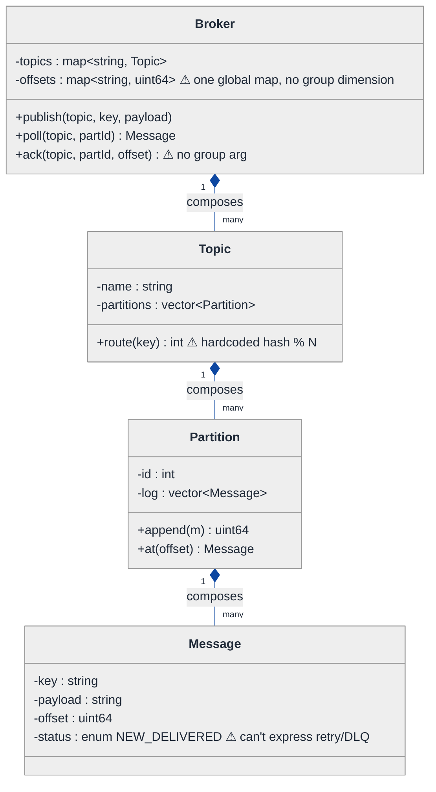
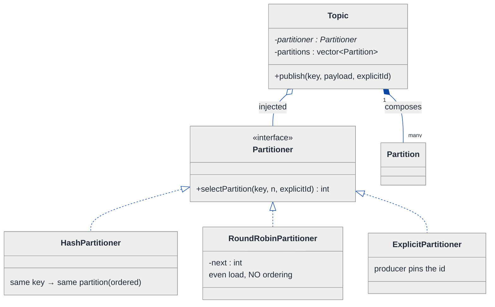
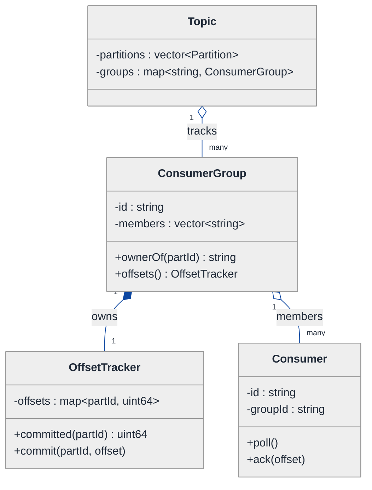
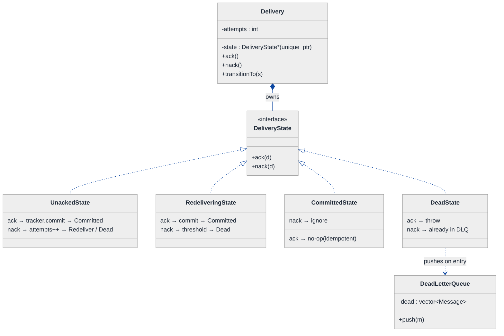
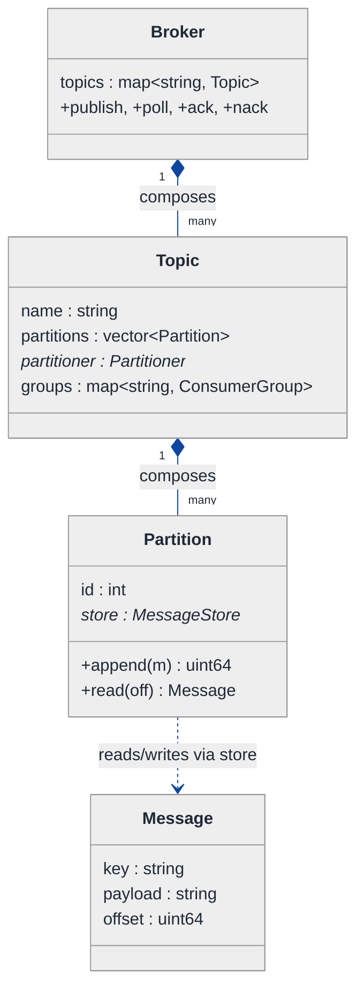
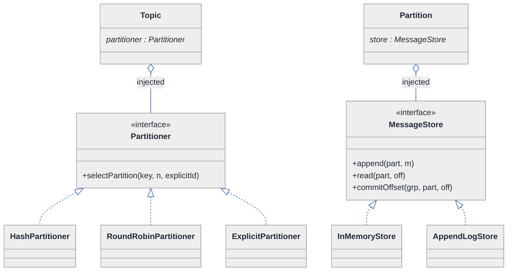
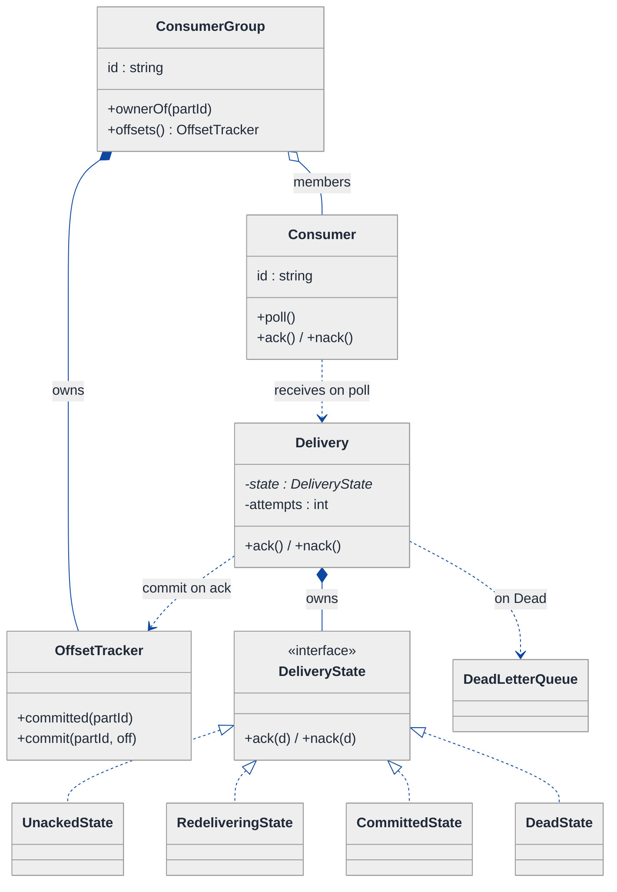
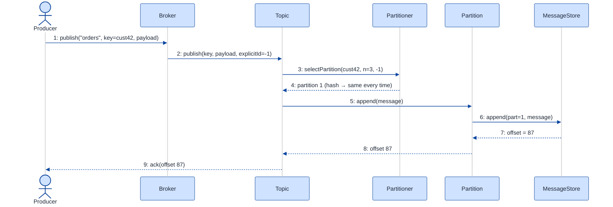
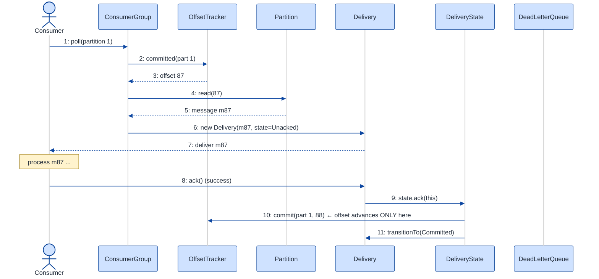

# Message Broker — LLD Walkthrough

> **Difficulty:** Hard · **Time:** ~45 min · **Pattern focus:** Partitioning + Consumer Groups (with Strategy, Repository, and State doing the supporting work)
>
> **Problem source(s):** GID OOD12 in [`./EXTRACTED_QUESTIONS.md`](./EXTRACTED_QUESTIONS.md). A senior-bar LLD shape — it's basically "model a tiny Kafka at the class level."
>
> **Diagrams:** inline mermaid (renders natively in GitHub / VS Code). Optional editable freehand sources are sibling `.excalidraw` files.

---

## How to use this file

Paced for a candidate who has *used* a message queue (RabbitMQ, Kafka, SQS) but never had to design one. Reading time: ~45 minutes if you sketch each iteration by hand. **The lesson: a message broker looks like a pile of features — topics, queues, persistence, consumer groups, acks, DLQ, ordering — but it is really FOUR independent axes of variation hiding behind one fat class. Derive them by building the naive broker first, watching it break under four hypothetical changes, then reach for ONE pattern at a time.**

**Map of this file (15 sections):**

1. Problem statement + clarifying questions
2. Plain-English restatement
3. Why this matters
4. Mental model
5. Try it yourself first
6. Entity & verb extraction
7. **Iteration 1: the naive design** — one fat `Broker` class
8. **Where the naive design hurts** — four future requirements, one painful diff each
9. **Pivot 1: Partitioning Strategy + the partition as the ordering unit** — the most painful axis first
10. **Pivot 2: consumer groups + offset tracking** — fan-out without losing per-consumer position
11. **Pivot 3: Repository for persistence + State for message lifecycle (ack / retry / DLQ)**
12. Final UML class diagram
13. Skeleton code (C++)
14. Key flow — sequence diagram
15. Extensibility re-check + anti-patterns + how to think aloud + self-check

---

## 1. Problem statement + clarifying questions

**Prompt (typical phrasing):** "Design a message broker at the class level supporting topics, queues, message persistence, consumer groups, message acknowledgment, and dead letter queue. Include message ordering guarantees within a partition."

**Clarifying questions to ask BEFORE drawing anything:**

1. **Topic vs queue semantics?** Is a "topic" a fan-out pub/sub channel (every subscriber group gets every message) and a "queue" a competing-consumers point-to-point channel? Or are we modeling Kafka where a topic IS the queue and consumer groups give you both?
2. **Ordering scope?** Total ordering across the whole topic (expensive, serializes everything) or ordering *within a partition* only (Kafka's model)? The prompt says within a partition — confirm the partition is the ordering unit.
3. **How is a message routed to a partition?** Round-robin, hash of a key (so same key → same partition → ordered), or explicit partition id from the producer?
4. **Delivery guarantee?** At-most-once (fire and forget), at-least-once (redeliver until ack — duplicates possible), or exactly-once (hard)? Acks + DLQ strongly imply at-least-once.
5. **Persistence model?** In-memory only, append-only log on disk, or pluggable (memory for tests, disk for prod)? Does a consumer's *offset* survive a restart?
6. **Consumer group rebalancing?** When a consumer joins/leaves a group, do we reassign partitions? Or assume static assignment for the class-level design?
7. **DLQ trigger?** After N failed deliveries? After a TTL? Does the DLQ preserve ordering or is it a side-bin?
8. **Concurrency?** Multiple producers and consumers hitting the broker at once — do we need the design to be thread-safe, or single-threaded core with a discussion of locking later?

**Assumptions if interviewer dodges:** Kafka-style model (topic = partitioned log; consumer groups give competing-consumer semantics within a group and fan-out across groups); **ordering guaranteed within a partition only**; key-hash partitioning by default but pluggable; **at-least-once** delivery (ack-or-redeliver); pluggable persistence (in-memory default, append-log option); DLQ after N delivery failures; single-threaded core, concurrency discussed in §15.

---

## 2. Plain-English restatement

We're building the software that sits between **producers** (who publish messages) and **consumers** (who read them). A producer publishes to a **topic**. The topic is split into **partitions** — independent ordered logs. Each message lands in exactly one partition, and within that partition messages keep their publish order forever. Consumers belong to a **consumer group**; the broker hands each partition to exactly one consumer in a group (so the group as a whole sees every message once), while *different* groups each get their own full copy. Consumers **acknowledge** messages they've processed; un-acked messages get redelivered, and a message that fails too many times is shunted to a **dead letter queue** so it stops blocking the line. Messages and consumer positions (**offsets**) must survive a broker restart, so we need **persistence**. The design has to let us add new partitioning schemes, new storage backends, and new failure policies **without rewriting the core publish/consume flow.**

---

## 3. Why this matters

This is the LLD question that separates "I've used Kafka" from "I understand why Kafka is shaped the way it is." It probes whether you can take a deceptively feature-rich prompt and find the small number of *axes that vary independently* underneath. The headline insight — **the partition, not the topic, is the unit of ordering and the unit of parallelism** — is the single most important idea in distributed messaging, and it reappears in every streaming system (Kinesis shards, Pulsar, event-sourced aggregates). If you can derive consumer-group offset tracking and at-least-once redelivery from first principles, you can design half the messaging questions in the bank.

---

## 4. Mental model

A topic is a **set of parallel append-only logs** (the partitions), plus a **rule for which log a message goes into**, plus a **set of bookmarks** (one per consumer group per partition) recording how far each reader has gotten.

```
Real-world sketch (NOT a UML diagram yet):

  Topic "orders"  (partitioned by customerId hash)
  ┌──────────────────────────────────────────────────────────┐
  │ Partition 0:  [m0][m1][m2][m3][m4] ...   append →          │
  │                         ^group-A offset=2  ^group-B offset=4│
  │ Partition 1:  [m0][m1][m2] ...           append →          │
  │                    ^group-A offset=1   ^group-B offset=0   │
  │ Partition 2:  [m0][m1][m2][m3] ...       append →          │
  └──────────────────────────────────────────────────────────┘
        ▲ producer                          ▼ consumers
   publish(key, payload)              poll() → process → ack(offset)

  A message that fails N times  ──►  Dead Letter Queue (side-bin)
```

The KEY insight from this picture: there are FOUR things that vary independently and one thing that doesn't. The constant is the *log* — an ordered, append-only sequence; you never reorder it. The variables are: **(a) which partition a message goes to** (the routing rule), **(b) where the log physically lives** (memory vs disk), **(c) how far each group has read** (the offset bookmarks, one set per group), and **(d) what happens to a message across deliver → ack → retry → DLQ** (the lifecycle). Routing, storage, offsets, lifecycle. Keep those four straight and the whole design falls out.

---

## 5. Try it yourself first

> **Predict before reading on:**
>
> 1. List 6 nouns from the prompt you'd promote to a class. Which one is the *unit of ordering*?
> 2. **If two messages have the same key and ordering must be preserved, what's the ONE invariant your routing rule must guarantee?**
> 3. Two consumer groups read the same topic. Group A is at message #50, Group B is at message #10. Where do you store those two numbers, and why NOT on the message itself?
> 4. A consumer pulls a message, crashes before processing it. With at-least-once delivery, what has to be true about *when* the offset advances?

---

## 6. Entity & verb extraction

> **Mini-refresher: noun → class, but not every noun.**
>
> Naive OOD promotes every noun to a class. Senior OOD promotes a noun only if it has both BEHAVIOR and STATE that need to live together. "Offset" looks like it wants to be a class; it's really a long integer that lives on a *bookmark* object. "Partition" earns class-hood because it owns an ordered log AND the append/read behavior over it.

**Nouns from the prompt:**

| Noun | Decision | Why |
|---|---|---|
| Broker | Class (top-level coordinator) | Owns topics, routes publish/subscribe |
| Topic | Class | Owns partitions + the partition-count + routing config |
| Partition | Class | **The ordering unit.** Owns an ordered log + append/read |
| Message | Class | Has key, payload, offset, lifecycle behavior |
| Producer | Class (thin) | Calls `publish(topic, key, payload)` |
| Consumer | Class | Polls, processes, acks; belongs to a group |
| ConsumerGroup | Class | Tracks per-partition offsets; assigns partitions to members |
| Offset | Field (`uint64_t`) on a per-group bookmark | No behavior of its own |
| DeadLetterQueue | Class | A special sink for poison messages |
| Key / Payload | Fields on Message (`std::string` / bytes) | No behavior |
| Acknowledgment | Verb (a method), not a class | It's an action on a message/offset |

**Verbs (and the class they live on):**

| Verb | Owner class (naive answer — we'll re-examine) |
|---|---|
| publish(topic, key, payload) | Broker, delegating to Topic |
| route(key) → partitionId | Topic (naive: hardcoded hash) |
| append(message) | Partition |
| poll(group, partition) | Broker / ConsumerGroup |
| ack(group, partition, offset) | ConsumerGroup |
| persist(message) / load() | Broker (naive: hardcoded to memory) |
| sendToDLQ(message) | Broker (naive: inline) |

**We have NOT introduced any design patterns yet.** Pure nouns + verbs. Notice we already feel the pull: `route`, `persist`, and the DLQ trigger all smell like "this could vary." Hold that thought — §8 makes it concrete.

---

## 7. <a id="iter-1"></a>Iteration 1: the naive design

Let's write the simplest thing that could possibly work. No design patterns — one `Broker` class that does everything, a `Topic` that owns a `vector<Partition>`, a `Partition` that owns a `vector<Message>`, and a single map of offsets.



**Reader's tour (read top to bottom; ~60 seconds).**

1. **At the top — `Broker` is the root and does EVERYTHING.** It holds the topics, holds ONE global `offsets` map, and exposes `publish`, `poll`, `ack`. The first ⚠ is on that offsets map: it's keyed by something like `"topic:partition"` with no room for a consumer-group dimension. There is exactly one bookmark per partition, so the design can only support ONE reader. Fan-out is impossible.

2. **The composition spine (down the middle).** The filled diamonds (`◆`) mark composition — strong ownership / same lifetime. Broker composes `Topic[]`; Topic composes `Partition[]`; Partition composes `Message[]`. Kill the broker and everything dies with it. This spine is *correct* and survives to the final design — it's the inventory, and inventory rarely needs patterns.

3. **`Topic::route(key)` — trouble zone #1.** It's a hardcoded `hash(key) % partitionCount`. Fine until someone wants round-robin, or explicit partition ids, or sticky routing. Every new scheme is surgery in this method.

4. **`Broker` persistence — trouble zone #2 (not even drawn).** In the naive design the log lives in `vector<Message>` in RAM. There is no persistence at all. The prompt *requires* it; the naive design ignores it. When we bolt it on, it'll be `if (diskMode) writeToFile() else keepInRam()` smeared through `append`.

5. **`Message::status` enum — trouble zone #3.** A two-value enum (`NEW`, `DELIVERED`). It cannot express "delivered but un-acked," "redelivering, attempt 3," or "gave up, sent to DLQ." The moment we add at-least-once + DLQ, this enum and the `if`-ladders that read it explode.

**What's deliberately missing.** No `ConsumerGroup` (so no fan-out, no competing consumers). No `PartitionStrategy`. No `MessageStore` abstraction. No message lifecycle beyond a 2-value enum. No DLQ. The naive design doesn't even *acknowledge* these as axes — it bakes a single hardcoded answer for routing, assumes RAM for storage, assumes one reader, and ignores failure entirely.

Skeleton code for the naive design (C++):

```cpp
#include <cstdint>
#include <functional>
#include <stdexcept>
#include <string>
#include <unordered_map>
#include <vector>

enum class MsgStatus { NEW, DELIVERED };  // ⚠ can't express un-acked / retry / DLQ

struct Message {
    std::string key;
    std::string payload;
    uint64_t    offset = 0;
    MsgStatus   status = MsgStatus::NEW;
};

class Partition {
public:
    explicit Partition(int id) : id_(id) {}
    uint64_t append(Message m) {           // ordering = insertion order, never reordered
        m.offset = log_.size();
        log_.push_back(std::move(m));
        return log_.back().offset;
    }
    const Message& at(uint64_t off) const { return log_.at(off); }
    uint64_t size() const { return log_.size(); }
    int id() const { return id_; }
private:
    int                  id_;
    std::vector<Message> log_;
};

class Topic {
public:
    Topic(std::string name, int partitionCount) : name_(std::move(name)) {
        for (int i = 0; i < partitionCount; ++i) partitions_.emplace_back(i);
    }
    int route(const std::string& key) const {                 // ⚠ hardcoded
        return static_cast<int>(std::hash<std::string>{}(key) % partitions_.size());
    }
    Partition& partition(int id) { return partitions_.at(id); }
private:
    std::string            name_;
    std::vector<Partition> partitions_;
};

class Broker {
public:
    void createTopic(const std::string& name, int parts) {
        topics_.emplace(name, Topic(name, parts));
    }
    uint64_t publish(const std::string& topic, const std::string& key, std::string payload) {
        auto& t   = topics_.at(topic);
        int   pid = t.route(key);                              // routing baked in
        // ⚠ no persistence: log lives only in RAM
        return t.partition(pid).append(Message{key, std::move(payload)});
    }
    const Message& poll(const std::string& topic, int pid) {   // ⚠ no group dimension
        auto&    t   = topics_.at(topic);
        std::string k = topic + ":" + std::to_string(pid);
        uint64_t off = offsets_[k];                            // single global bookmark
        return t.partition(pid).at(off);
    }
    void ack(const std::string& topic, int pid) {              // ⚠ no group arg, no message id
        std::string k = topic + ":" + std::to_string(pid);
        offsets_[k]++;                                         // just bump the one bookmark
    }
private:
    std::unordered_map<std::string, Topic>    topics_;
    std::unordered_map<std::string, uint64_t> offsets_;        // ⚠ ONE reader only
};
```

**This works.** It has zero design patterns. We can create a topic, publish (with key-hash routing), poll the next message, and ack by bumping a single bookmark. Ordering *within a partition* is free — we never reorder the `vector`. So what's wrong with it?

---

## 8. <a id="naive-pain"></a>Where the naive design hurts

The interviewer slides four requirements across the desk: "Here's next quarter. Walk me through what changes."

### Change A: "Two teams want to read the same topic independently — analytics AND billing"

This is **consumer groups / fan-out**, and the naive design simply cannot do it.

In the naive design:
- `offsets_` is keyed by `"topic:partition"` — ONE bookmark per partition. Analytics acking message #50 would advance the SAME bookmark billing reads from. Billing would skip 50 messages.
- To fix it you'd re-key the map to `"group:topic:partition"` → touches `poll`, `ack`, and every call site that builds the key string. And there's no `ConsumerGroup` object to own assignment of partitions to members.
- **The change touches `poll` AND `ack` AND the map's key shape AND introduces a missing concept (the group).**

### Change B: "We need round-robin partitioning for keyless events, and explicit partition ids for a migration"

In the naive design:
- `Topic::route(key)` hardcodes `hash(key) % N`. Now we need three behaviors: hash, round-robin, explicit.
- The method grows an `if (mode == HASH) ... else if (mode == ROUND_ROBIN) ... else ...` ladder, plus round-robin needs a counter field on Topic, plus explicit-id needs a different *signature* (it takes a partition id, not a key).
- **Every new routing scheme is surgery inside `route`, and round-robin leaks mutable state into Topic.**

### Change C: "Survive a restart — messages and offsets must be durable"

In the naive design:
- The log is `std::vector<Message>` in RAM and offsets are an in-RAM map. A restart loses everything. The prompt *requires* persistence; the naive design has none.
- Bolting it on means `Partition::append` becomes `if (durable) appendToFile(...); log_.push_back(...)` and a parallel `load()` path on startup, plus the same dual treatment for `offsets_`.
- **Persistence smears `if (durable)` across `append`, `ack`, and a new `load` path. Two backends (RAM, disk) means the conditional is everywhere.**

### Change D: "At-least-once delivery — redeliver un-acked messages, and after 3 failures dump to a DLQ"

In the naive design:
- `MsgStatus` has two values (`NEW`, `DELIVERED`). It can't express "delivered, awaiting ack," "attempt 2 of 3," or "dead."
- `ack` just bumps the bookmark; there's no notion of an *in-flight* message that might come back. There's no retry counter, no DLQ object, no trigger.
- You'd add `if (status == DELIVERED && now - deliveredAt > timeout) redeliver()` and `if (++attempts > 3) moveToDLQ()` — branching scattered across `poll`, `ack`, and a new timeout sweeper.
- **The 2-value enum + if-ladders can't express the lifecycle. Every failure rule is another branch in another method.**

### The pattern of pain

| Change | Files / methods touched | Smell |
|---|---|---|
| A. Consumer groups | `poll` + `ack` + offsets-map key shape | "One global bookmark; fan-out is structurally impossible." |
| B. Routing schemes | `Topic::route` (if-ladder + mutable state) | "Single method accumulates every routing rule." |
| C. Persistence | `append` + `ack` + new `load` | "`if (durable)` smeared across the core flow." |
| D. At-least-once + DLQ | `MsgStatus` enum + `poll` + `ack` + sweeper | "Status enum + switch can't express the delivery lifecycle." |

**Four axes of pain, and they're independent:** *who reads and where they are* (consumer groups + offsets), *which partition a message lands in* (routing algorithm), *where the log physically lives* (storage backend), and *what happens to a message as it's delivered/acked/retried/dead-lettered* (lifecycle).

> **Pivot question:** "Which axis hurts most, and what pattern fits each?"
>
> - Routing is *an algorithm picked by config* → **Strategy.**
> - Storage is *an abstraction over a backend, swappable for tests* → **Repository** (a Strategy specialized for persistence).
> - The delivery lifecycle is *state-specific behavior with internal transitions* → **State.**
> - Consumer groups are not a GoF pattern — they're a *modeling* decision: lift the offset bookmark into a per-group object so fan-out becomes natural.
>
> We start with the most structurally damaging one first: partitioning + consumer groups, because they decide the SHAPE of everything else.

---

## 9. <a id="pivot-1"></a>Pivot 1: Partitioning Strategy + the partition as the ordering unit

Change B (routing schemes) is the most surgical, and it forces us to nail down the single most important invariant in the whole design — so we do it first.

> **Mini-refresher: Strategy pattern.**
>
> Encapsulates an algorithm behind an interface so it can be swapped at runtime. The CALLER (here, the Topic's config) decides which strategy to use; the strategy doesn't know about its peers.
>
> Quick example: a `Sorter` takes a `CompareStrategy*` in its constructor. Pass `AscendingCompare` or `DescendingCompare` — the sorter doesn't care which.

**Why Strategy fits partitioning.** "Pick a partition for this message" is an algorithm: `given (key, partitionCount, optional explicit id) → return a partition index`. It varies (hash, round-robin, explicit, sticky). The choice is made externally — by topic config, not by the message itself. Textbook Strategy.

**The ordering invariant the strategy MUST preserve.** Here's the load-bearing rule, and it's why partitioning is the heart of this problem:

> **A partitioner guarantees ordering only if it is a pure function of the message KEY: same key ⇒ same partition, always.** Ordering is per-partition (we append, never reorder), so two messages that must stay ordered have to land in the *same* partition — which only happens if they share a key and the partitioner is deterministic on that key.

Round-robin and "no key" deliberately give up ordering in exchange for even load. That's a *contract* of the strategy, and a good answer states it out loud.

**The refactor (just the routing slice):**

```cpp
class Partitioner {
public:
    virtual ~Partitioner() = default;
    // explicitId is engaged when the producer pins a partition; otherwise -1.
    virtual int selectPartition(const std::string& key,
                                int partitionCount,
                                int explicitId) const = 0;
};

class HashPartitioner : public Partitioner {
public:
    int selectPartition(const std::string& key, int n, int explicitId) const override {
        if (explicitId >= 0) return explicitId;                       // honor explicit pin
        if (key.empty()) return 0;                                    // degenerate; see RoundRobin
        return static_cast<int>(std::hash<std::string>{}(key) % n);   // same key → same partition
    }
};

class RoundRobinPartitioner : public Partitioner {
public:
    int selectPartition(const std::string&, int n, int explicitId) const override {
        if (explicitId >= 0) return explicitId;
        return next_++ % n;     // even load, NO ordering guarantee — that's the contract
    }
private:
    mutable int next_ = 0;      // mutable: counter is impl detail, selectPartition stays const
};
// ExplicitPartitioner elided — returns explicitId directly, throws if unset.

class Topic {
    // route() is GONE. Topic now holds a Partitioner* and asks it.
    std::unique_ptr<Partitioner> partitioner_;   // injected at construction
};
```

**What changed — visualized.** Just the routing slice:



**Tour of the after-state.**

1. **Top: Topic gained a field.** `partitioner` is a pointer to the `Partitioner` interface, INJECTED at construction. The OPEN diamond (`◇`) marks aggregation — Topic uses the partitioner but the choice of which one is config, not Topic's business. The filled diamond to `Partition` stays composition — Topic still *owns* its partitions.

2. **Middle: the `<<interface>>` box.** One pure-virtual method, `selectPartition(key, n, explicitId) → int`. Narrow contract: hand it the key and the count, get back an index.

3. **Bottom row: three concrete strategies.** `HashPartitioner` is the ordering-preserving default (same key → same partition). `RoundRobinPartitioner` carries a `next_` counter and explicitly *renounces* ordering for even load. `ExplicitPartitioner` lets a producer pin a partition (useful for migrations).

4. **The invariant now has a HOME.** "Same key → same partition" is encoded once, in `HashPartitioner`, and documented as the contract of the interface. Change B from §8 lands as a new class, not surgery in `route`.

**Pattern-discrimination cheatsheet — Strategy vs Template Method.**
- *Strategy:* the whole algorithm is one swappable object, chosen at runtime via composition.
- *Template Method:* an algorithm skeleton in a base class; subclasses fill in hooks via inheritance.
- *Rule of thumb:* variants chosen/changed at runtime by config → Strategy. A fixed skeleton with 2-3 stable variants → Template Method.

We chose Strategy because the partitioner is selected by *config at topic-creation time* and we may add more schemes (sticky, geo-aware) later without touching Topic — composition over inheritance.

---

## 10. <a id="pivot-2"></a>Pivot 2: consumer groups + offset tracking

Change A is the structurally hardest one: two teams reading the same topic independently. Strategy doesn't help here — this is a **modeling** fix, not an algorithm swap. The naive design's fatal flaw was a single global bookmark. The fix is to recognize that **an offset is per-(group, partition)**, and to give the group an object to own those bookmarks.

> **Mini-refresher: why this is NOT a GoF pattern.**
>
> Consumer groups are a domain concept, not a design pattern. The pattern lesson here is more basic and more important: **find the right key for your state.** The naive design keyed offsets by `(topic, partition)`. The correct key is `(group, topic, partition)`. Getting the *granularity of state* right is half of LLD; the other half is the GoF catalog.

**The two semantics consumer groups must deliver simultaneously:**

- **Fan-out across groups:** group A and group B each get their OWN copy of every message. Two independent offset sets.
- **Competing consumers within a group:** each partition is assigned to exactly ONE consumer in the group, so the group as a whole processes each message once. This also *preserves per-partition ordering for a single processor* — because one consumer owns a partition, it sees that partition's messages in order.

That second point is the elegant payoff of partitioning: **ordering and parallelism are the same mechanism.** More partitions → more parallelism within a group; one consumer per partition → ordering within each.

**The refactor (just the offset / group slice):**

```cpp
// One bookmark per (group, partition). The group OWNS these.
class OffsetTracker {
public:
    uint64_t committed(int partitionId) const {
        auto it = offsets_.find(partitionId);
        return it == offsets_.end() ? 0 : it->second;
    }
    void commit(int partitionId, uint64_t offset) {       // advance only on ack
        offsets_[partitionId] = offset;
    }
private:
    std::unordered_map<int, uint64_t> offsets_;           // partitionId → next-to-read
};

class ConsumerGroup {
public:
    explicit ConsumerGroup(std::string id) : id_(std::move(id)) {}

    // Static assignment: partition p → member (p % memberCount). Rebalance discussed in §15.
    void addConsumer(std::string consumerId) { members_.push_back(std::move(consumerId)); }
    const std::string& ownerOf(int partitionId) const {
        return members_.at(partitionId % members_.size());
    }

    OffsetTracker& offsets() { return offsets_; }         // the group's own bookmarks
    const std::string& id() const { return id_; }
private:
    std::string                 id_;
    std::vector<std::string>    members_;                 // consumer ids in this group
    OffsetTracker               offsets_;                 // ← the fan-out fix lives here
};
```

**What changed — visualized.** Just the consumer-group slice:



**Tour of the after-state.**

1. **Topic now tracks a map of ConsumerGroups** (open diamond — it references them; their lifetime is arguably broker-managed). Two groups = two entries = two independent positions in the same partitions. **Change A is now structurally trivial: add a group, get a fresh OffsetTracker for free.**

2. **Each ConsumerGroup OWNS one OffsetTracker** (filled diamond / composition). This is the fan-out fix made concrete: group A's tracker says partition 0 → offset 50; group B's tracker says partition 0 → offset 10. Acking in A cannot touch B.

3. **OffsetTracker is a thin map** `partitionId → next-to-read`. `commit` is called only on ack (the at-least-once rule — see Pivot 3). `committed` tells `poll` where to start reading for THIS group.

4. **ConsumerGroup assigns partitions to members** via `ownerOf(partitionId)` (here static `p % memberCount`). One owner per partition ⇒ competing-consumer semantics within the group AND preserved per-partition order, because a single consumer reads each partition's log in sequence.

5. **The two semantics fall out of two relationships.** *Fan-out* = many groups per topic, each with its own tracker. *Competing consumers* = many members per group, each owning a disjoint subset of partitions. No `if` anywhere — it's structural.

**Pattern-discrimination cheatsheet — "new class" vs "new Strategy."**
- *New Strategy:* the variability is an *algorithm* the caller swaps (routing, storage). You add an interface + impls.
- *New domain class:* the variability is *state at a new granularity* (per-group offsets). You don't add an interface — you add an object that owns the state at the right key.
- *Rule of thumb:* if the fix is "swap a behavior," reach for Strategy. If the fix is "I was storing this at the wrong granularity," reach for a new class that owns it. Consumer groups are the latter.

---

## 11. <a id="pivot-3"></a>Pivot 3: Repository for persistence + State for the delivery lifecycle

Two axes remain: durability (Change C) and at-least-once + DLQ (Change D). They're different *kinds* of variability, so they get different patterns.

### 11a. Persistence → Repository (a Strategy for storage)

> **Mini-refresher: Repository pattern.**
>
> Repository is an abstraction over *where data lives* — it gives callers `save` / `load` methods and hides whether the bytes go to RAM, a file, or a database. It's a Strategy specialized for persistence. The benefit: the core logic never knows the backend, so you swap an in-memory store for tests and an append-log for prod.

**Why Repository fits.** Storage is the textbook case: the broker should append a message and not care whether it lands in a `vector` or an append-only file. Change C ("survive a restart") becomes "inject the disk-backed repository instead of the in-memory one." No `if (durable)` anywhere.

```cpp
class MessageStore {                       // Repository interface
public:
    virtual ~MessageStore() = default;
    virtual uint64_t append(int partitionId, const Message& m) = 0;     // returns offset
    virtual Message  read(int partitionId, uint64_t offset) const = 0;
    virtual uint64_t size(int partitionId) const = 0;
    // offset commits are persisted too, so a restart resumes each group:
    virtual void commitOffset(const std::string& group, int part, uint64_t off) = 0;
    virtual uint64_t loadOffset(const std::string& group, int part) const = 0;
};

class InMemoryStore : public MessageStore {
    // the naive vector<Message>, now behind the interface — perfect for tests
};

class AppendLogStore : public MessageStore {
    // append-only file per partition; offset = byte position or record index.
    // On startup, replays the log to rebuild in-RAM index. Offsets in a sidecar file.
};
// other backends (RocksDB, S3) elided
```

The `Partition` no longer owns a `vector<Message>` directly — it delegates append/read to the injected `MessageStore`. Append-only on disk gives the same ordering guarantee for free: you never rewrite earlier records.

### 11b. Delivery lifecycle → State (ack / retry / DLQ)

Change D is not an algorithm swap — it's *what's valid next* for a message in flight. That's the State pattern.

> **Mini-refresher: State pattern.**
>
> Each lifecycle state is its own class. The context object (here a delivery attempt) delegates events to its current state, and THE STATE decides the next state. Transitions are INTERNAL, driven by events (`ack`, `nack`, `timeout`), not picked by the caller.

**Why State (not Strategy).** Nobody *chooses* "this message is now in DLQ." The message gets there by failing delivery N times. An `Unacked` delivery can be `ack`'d (→ Committed) or `nack`'d (→ Redelivering or Dead). A `Committed` message can't be acked again. The legal transitions ARE the lifecycle, and they live with the states.

```cpp
class Delivery;   // forward — wraps a message-in-flight + attempt count

class DeliveryState {
public:
    virtual ~DeliveryState() = default;
    virtual void ack(Delivery& d)  = 0;   // consumer confirmed processing
    virtual void nack(Delivery& d) = 0;   // failed / timed out → retry or DLQ
};

class UnackedState : public DeliveryState {
public:
    void ack(Delivery& d) override;       // → CommittedState (advance offset)
    void nack(Delivery& d) override;      // attempts++ ; if > max → Dead, else Redelivering
};

class RedeliveringState : public DeliveryState {
public:
    void ack(Delivery& d) override;       // late ack still commits
    void nack(Delivery& d) override;      // same threshold check as Unacked
};

class CommittedState : public DeliveryState {       // terminal-happy
public:
    void ack(Delivery&)  override { /* idempotent no-op: already committed */ }
    void nack(Delivery&) override { /* ignore: can't fail a committed message */ }
};

class DeadState : public DeliveryState {            // terminal-sad → DLQ
public:
    void ack(Delivery&)  override { throw std::runtime_error("Message is dead-lettered"); }
    void nack(Delivery&) override { /* already in DLQ */ }
};

class Delivery {
public:
    Delivery(Message msg, int maxAttempts, DeadLetterQueue& dlq, OffsetTracker& tracker, int part)
        : msg_(std::move(msg)), maxAttempts_(maxAttempts),
          dlq_(dlq), tracker_(tracker), partition_(part),
          state_(std::make_unique<UnackedState>()) {}

    void ack()  { state_->ack(*this); }
    void nack() { state_->nack(*this); }
    void transitionTo(std::unique_ptr<DeliveryState> s) { state_ = std::move(s); }

    int  bumpAttempts() { return ++attempts_; }
    int  maxAttempts() const { return maxAttempts_; }
    // ... accessors for msg_, dlq_, tracker_, partition_ elided ...
private:
    Message                       msg_;
    int                           attempts_   = 0;
    int                           maxAttempts_;
    DeadLetterQueue&              dlq_;
    OffsetTracker&                tracker_;
    int                           partition_;
    std::unique_ptr<DeliveryState> state_;
};

// Transitions live WITH the states:
inline void UnackedState::ack(Delivery& d) {
    d.tracker().commit(d.partition(), d.msg().offset + 1);   // advance ONLY on ack
    d.transitionTo(std::make_unique<CommittedState>());
}
inline void UnackedState::nack(Delivery& d) {
    if (d.bumpAttempts() > d.maxAttempts()) {
        d.dlq().push(d.msg());                               // poison → side-bin
        d.transitionTo(std::make_unique<DeadState>());
    } else {
        d.transitionTo(std::make_unique<RedeliveringState>());
    }
}
```

**The at-least-once invariant made concrete:** the offset advances in `UnackedState::ack`, and **only** there. If the consumer crashes before acking, the offset never moved, so the message is redelivered. That single placement of `tracker().commit(...)` is the entire at-least-once guarantee.

**What changed — visualized.** Just the lifecycle slice:



**Tour of the after-state.**

1. **The 2-value `MsgStatus` enum is GONE.** It's replaced by a `state` field of type `DeliveryState*` (a `unique_ptr` — exclusive ownership), living on a `Delivery` object that wraps a message-in-flight plus its attempt count.

2. **`Delivery::ack()` and `nack()` are one-liners that delegate** to the current state. No `if (status == X)` ladder anywhere.

3. **Four concrete states.** `UnackedState` is the workhorse — `ack` commits the offset and transitions to `Committed`; `nack` increments attempts and either retries (`Redelivering`) or dead-letters (`Dead`). `Committed` is happy-terminal (ack is an idempotent no-op, protecting against duplicate acks). `Dead` is sad-terminal — its `ack` throws because you can't process a dead-lettered message.

4. **The DLQ trigger lives in the STATE, not in `poll`.** `UnackedState::nack` (and `RedeliveringState::nack`) compares attempts to the threshold and pushes to the DLQ exactly once on the transition to `Dead`. Change D's "after 3 failures → DLQ" is encoded in one place.

5. **Adding a new policy is one new class.** Want a `ParkedState` (manual-intervention hold) between retries and DLQ? Add the class; wire one transition. No edits to the other states.

**Pattern-discrimination cheatsheet — Strategy vs State.**
- *Strategy:* the CALLER picks which one to use; strategies are usually unaware of each other. (Partitioner, MessageStore.)
- *State:* the OBJECT picks its next state internally based on events; states know each other (each can `transitionTo` another). (DeliveryState.)
- *Rule of thumb:* swap happens because external config says so → Strategy. Swap happens because of an internal event flow (`ack` / `nack`) → State.

---

## 12. <a id="fig-class-diagram"></a>Final class diagram

One diagram for the whole design is a wall of boxes. Here are **three focused sub-views**; the structural insight at the end ties them together.

### 12.1 The storage spine — what the broker OWNS



**Tour of 12.1.** Same composition spine as the naive design — Broker owns Topics, Topics own Partitions. The difference: `Partition` no longer holds a raw `vector<Message>`; it holds a `MessageStore*` and delegates. `Message` is now plain data (the lifecycle moved onto `Delivery`, see 12.3). Inventory barely changed shape — that's the sign we got the spine right the first time.

### 12.2 The policy injection — what varies by config



**Tour of 12.2.**

1. **Two injected interfaces, two axes of config.** Topic aggregates a `Partitioner` (how messages route); Partition aggregates a `MessageStore` (where the log lives). Open diamonds (`◇`) = aggregation; the broker uses these but their choice is config.

2. **`Partitioner` family** carries the ordering contract — `HashPartitioner` preserves it, `RoundRobin` trades it for load balance, `Explicit` honors producer pins.

3. **`MessageStore` family is the Repository.** `InMemoryStore` for tests, `AppendLogStore` for durable prod. Crucially it also persists *offsets* (`commitOffset`/`loadOffset`), so a restart resumes each consumer group where it left off — Change C solved.

4. **Structural insight.** The two axes the naive design hardcoded (`hash % N` and "RAM only") are now swappable hierarchies. The broker's core became orchestration; the variation became hot-swap policy.

### 12.3 Consumers, offsets, and the delivery lifecycle



**Tour of 12.3.**

1. **ConsumerGroup owns an OffsetTracker (composition) and references its Consumers (aggregation).** This is the fan-out fix — one tracker per group, so groups never collide.

2. **`poll()` produces a `Delivery`.** The consumer doesn't get a bare `Message`; it gets a `Delivery` wrapping the message plus the lifecycle state machine. That's what makes `ack`/`nack` meaningful.

3. **Delivery owns a DeliveryState (composition / unique_ptr).** Four states; `ack`/`nack` delegate; transitions live in the states.

4. **Two dependency arrows tell the at-least-once story.** `Delivery ..> OffsetTracker : commit on ack` — the offset advances ONLY when `UnackedState::ack` runs. `Delivery ..> DeadLetterQueue : on Dead` — poison messages exit to the side-bin on the transition to `DeadState`. Those two arrows ARE the delivery guarantee + DLQ.

### Structural insight (ties 12.1 + 12.2 + 12.3 together)

| Concern | Pattern used | Why |
|---|---|---|
| **Storage spine** (Broker → Topic → Partition → Message) | Plain composition | Ownership tree; no behavior varies, so no pattern |
| **Routing** (hash / round-robin / explicit) | Strategy, injected into Topic | Config picks the algorithm; ordering contract lives in the impl |
| **Persistence** (memory / append-log) | Repository (Strategy for storage), injected into Partition | Core never knows the backend; swappable for tests/prod; persists offsets too |
| **Consumer groups + offsets** | New domain classes (ConsumerGroup + OffsetTracker) | Fix the *granularity* of offset state — per (group, partition) |
| **Delivery lifecycle** (ack / retry / DLQ) | State, owned by Delivery | Internal event-driven transitions; legal-next-step is the object's concern |

The big lesson: **the partition is both the unit of ordering and the unit of parallelism**, and once you model it as an append-only log, ordering is free (never reorder) — every *other* feature is an independent axis bolted on by composition. Strategy for "algorithm the config picks," Repository for "where bytes live," State for "what's valid next," and a plain new class when the real bug is "I stored state at the wrong granularity."

---

## 13. Skeleton code (C++)

> Show the SHAPES, not the full impl. ~150 lines. Interfaces + 1-2 concrete classes per pattern; the rest `// elided`.

```cpp
#include <cstdint>
#include <functional>
#include <memory>
#include <stdexcept>
#include <string>
#include <unordered_map>
#include <vector>

// ── Forward declarations ────────────────────────────────────────────
class Delivery;
class DeadLetterQueue;
class OffsetTracker;

// ── Message (plain data; lifecycle lives on Delivery) ───────────────
struct Message {
    std::string key;
    std::string payload;
    uint64_t    offset = 0;
};

// ── Partitioner Strategy ────────────────────────────────────────────
class Partitioner {
public:
    virtual ~Partitioner() = default;
    virtual int selectPartition(const std::string& key, int n, int explicitId) const = 0;
};
class HashPartitioner : public Partitioner {
public:
    int selectPartition(const std::string& key, int n, int explicitId) const override {
        if (explicitId >= 0) return explicitId;
        if (key.empty())     return 0;
        return static_cast<int>(std::hash<std::string>{}(key) % n);   // same key → same partition
    }
};
// RoundRobinPartitioner, ExplicitPartitioner elided

// ── MessageStore Repository ─────────────────────────────────────────
class MessageStore {
public:
    virtual ~MessageStore() = default;
    virtual uint64_t append(int part, const Message& m) = 0;
    virtual Message  read(int part, uint64_t off) const = 0;
    virtual uint64_t size(int part) const = 0;
    virtual void     commitOffset(const std::string& grp, int part, uint64_t off) = 0;
    virtual uint64_t loadOffset(const std::string& grp, int part) const = 0;
};
class InMemoryStore : public MessageStore {
public:
    uint64_t append(int part, const Message& m) override {
        auto& log = logs_[part];
        Message copy = m;
        copy.offset = log.size();
        log.push_back(std::move(copy));
        return log.back().offset;
    }
    Message  read(int part, uint64_t off) const override { return logs_.at(part).at(off); }
    uint64_t size(int part) const override {
        auto it = logs_.find(part); return it == logs_.end() ? 0 : it->second.size();
    }
    void commitOffset(const std::string& grp, int part, uint64_t off) override {
        committed_[grp + ":" + std::to_string(part)] = off;
    }
    uint64_t loadOffset(const std::string& grp, int part) const override {
        auto it = committed_.find(grp + ":" + std::to_string(part));
        return it == committed_.end() ? 0 : it->second;
    }
private:
    std::unordered_map<int, std::vector<Message>> logs_;
    std::unordered_map<std::string, uint64_t>     committed_;
};
// AppendLogStore (durable, file-backed) elided

// ── Partition (delegates storage to the injected MessageStore) ──────
class Partition {
public:
    Partition(int id, MessageStore& store) : id_(id), store_(store) {}
    uint64_t append(const Message& m) { return store_.append(id_, m); }   // never reorders
    Message  read(uint64_t off) const { return store_.read(id_, off); }
    uint64_t size() const             { return store_.size(id_); }
    int      id() const               { return id_; }
private:
    int           id_;
    MessageStore& store_;
};

// ── Offsets + Consumer groups (the fan-out fix) ─────────────────────
class OffsetTracker {
public:
    uint64_t committed(int part) const {
        auto it = off_.find(part); return it == off_.end() ? 0 : it->second;
    }
    void commit(int part, uint64_t off) { off_[part] = off; }     // only on ack
private:
    std::unordered_map<int, uint64_t> off_;
};
class ConsumerGroup {
public:
    explicit ConsumerGroup(std::string id) : id_(std::move(id)) {}
    void addConsumer(std::string c) { members_.push_back(std::move(c)); }
    const std::string& ownerOf(int part) const { return members_.at(part % members_.size()); }
    OffsetTracker&     offsets()                { return offsets_; }
    const std::string& id() const               { return id_; }
private:
    std::string              id_;
    std::vector<std::string> members_;
    OffsetTracker            offsets_;
};

// ── Dead letter queue ───────────────────────────────────────────────
class DeadLetterQueue {
public:
    void push(const Message& m) { dead_.push_back(m); }
    uint64_t size() const { return dead_.size(); }
private:
    std::vector<Message> dead_;
};

// ── Delivery lifecycle (State pattern) ──────────────────────────────
class DeliveryState {
public:
    virtual ~DeliveryState() = default;
    virtual void ack(Delivery& d)  = 0;
    virtual void nack(Delivery& d) = 0;
};
class UnackedState : public DeliveryState {
public:
    void ack(Delivery& d) override;     // → CommittedState, commit offset
    void nack(Delivery& d) override;    // attempts++ ; → Redelivering or Dead
};
class CommittedState : public DeliveryState {
public:
    void ack(Delivery&)  override {}    // idempotent: guards against duplicate ack
    void nack(Delivery&) override {}
};
class DeadState : public DeliveryState {
public:
    void ack(Delivery&)  override { throw std::runtime_error("Message is dead-lettered"); }
    void nack(Delivery&) override {}
};
// RedeliveringState elided (same shape as UnackedState)

class Delivery {
public:
    Delivery(Message msg, int maxAttempts, DeadLetterQueue& dlq, OffsetTracker& tr, int part)
        : msg_(std::move(msg)), maxAttempts_(maxAttempts), dlq_(dlq), tracker_(tr),
          partition_(part), state_(std::make_unique<UnackedState>()) {}
    void ack()  { state_->ack(*this); }
    void nack() { state_->nack(*this); }
    void transitionTo(std::unique_ptr<DeliveryState> s) { state_ = std::move(s); }
    int  bumpAttempts() { return ++attempts_; }
    int  maxAttempts() const { return maxAttempts_; }
    const Message&   msg()     const { return msg_; }
    DeadLetterQueue& dlq()           { return dlq_; }
    OffsetTracker&   tracker()       { return tracker_; }
    int              partition()const{ return partition_; }
private:
    Message                        msg_;
    int                            attempts_ = 0;
    int                            maxAttempts_;
    DeadLetterQueue&               dlq_;
    OffsetTracker&                 tracker_;
    int                            partition_;
    std::unique_ptr<DeliveryState> state_;
};

inline void UnackedState::ack(Delivery& d) {
    d.tracker().commit(d.partition(), d.msg().offset + 1);   // ← entire at-least-once guarantee
    d.transitionTo(std::make_unique<CommittedState>());
}
inline void UnackedState::nack(Delivery& d) {
    if (d.bumpAttempts() > d.maxAttempts()) {
        d.dlq().push(d.msg());
        d.transitionTo(std::make_unique<DeadState>());
    } else {
        // d.transitionTo(std::make_unique<RedeliveringState>());  // elided
    }
}

// ── Topic + Broker (orchestrators) ──────────────────────────────────
class Topic {
public:
    Topic(std::string name, int partitionCount,
          std::unique_ptr<Partitioner> partitioner, MessageStore& store)
        : name_(std::move(name)), partitioner_(std::move(partitioner)) {
        for (int i = 0; i < partitionCount; ++i) partitions_.emplace_back(i, store);
    }
    uint64_t publish(const std::string& key, std::string payload, int explicitId = -1) {
        int pid = partitioner_->selectPartition(key, partitions_.size(), explicitId);
        return partitions_.at(pid).append(Message{key, std::move(payload)});
    }
    ConsumerGroup& group(const std::string& g) {                 // fan-out: lazily create
        auto it = groups_.find(g);
        if (it == groups_.end()) it = groups_.emplace(g, ConsumerGroup(g)).first;
        return it->second;
    }
    Partition& partition(int id) { return partitions_.at(id); }
private:
    std::string                          name_;
    std::vector<Partition>               partitions_;
    std::unique_ptr<Partitioner>         partitioner_;
    std::unordered_map<std::string, ConsumerGroup> groups_;
};

class Broker {
public:
    void createTopic(const std::string& name, int parts,
                     std::unique_ptr<Partitioner> p, MessageStore& store) {
        topics_.emplace(name, Topic(name, parts, std::move(p), store));
    }
    Topic& topic(const std::string& name) { return topics_.at(name); }
private:
    std::unordered_map<std::string, Topic> topics_;
    // DeadLetterQueue dlq_;  // one per topic in a fuller impl
};
```

---

## 14. <a id="fig-sequence"></a>Key flow — sequence diagram

This is the moment of truth — read across the swimlanes to see how the patterns COOPERATE.

### Phase 1 — publish (producer side)



**Tour of Phase 1 (publish).**

1. **Producer publishes with a KEY.** The key is the whole ballgame for ordering — `cust42` will always hash to the same partition.
2. **Broker delegates to Topic.** Broker is a thin router; Topic owns the partitioning config.
3. **Topic asks the Partitioner.** It does NOT do `hash % n` itself anymore — the injected Strategy owns the algorithm. Hash, round-robin, explicit all look identical from this seat.
4. **Same key → same partition, every time.** This is the ordering guarantee in action — every `cust42` message lands in partition 1, so their relative order is preserved.
5. **Partition appends via the MessageStore** (Repository). It never reorders; offset 87 is just "the next slot." Whether that slot is in RAM or on disk is the store's secret.

### Phase 2 — poll + ack / nack (consumer side)



**Tour of Phase 2 (poll + ack). Read this slowly — the patterns cooperate here.**

1. **Consumer polls its group for a partition it owns.** The group's `ownerOf(partition)` (not shown) already decided this consumer owns partition 1 — competing-consumer semantics within the group.
2. **Group asks ITS OffsetTracker where to start.** This is the fan-out fix: a different group would ask a different tracker and get a different offset. Group A at 87, Group B at 10 — no collision.
3. **Partition reads at the committed offset.** Sequential read = preserved order, because one consumer owns the partition and reads its log in sequence.
4. **A `Delivery` is created in `UnackedState`.** The message is now in-flight. The State pattern enters: the delivery is BORN holding `UnackedState`.
5. **Consumer processes, then acks.** `Delivery::ack()` delegates to `UnackedState::ack`, which **commits offset 88 (87+1) and transitions to Committed.**

> **The branch that's NOT drawn — and why it matters.** If the consumer had **crashed before step 8**, the offset would still read 87 — `commit` never ran. On restart the message is redelivered. If instead the consumer called `nack()` and this was the 4th failure (max 3), `UnackedState::nack` would push m87 to the **DeadLetterQueue** and transition to `DeadState` — the line keeps moving. You see no `if (status == …)` ladder anywhere: **the class hierarchy IS the delivery-guarantee logic.** The offset advancing in exactly ONE place (step 10) is the entire at-least-once contract.

---

## 15. Extensibility re-check + anti-patterns + how to think aloud + self-check

### Extensibility re-check

Revisit the four changes from [§8](#naive-pain). For each, name the SINGLE class (or one new object) that changes.

| Change | Naive design impact | Final design impact |
|---|---|---|
| A. Consumer groups / fan-out | `poll` + `ack` + map key shape | Add a `ConsumerGroup` (with its own `OffsetTracker`) per reader. Structural — fan-out is free. |
| B. Routing schemes | `Topic::route` if-ladder + mutable state | New `Partitioner` subclass (`RoundRobin`, `Explicit`, `Sticky`). Inject at topic creation. |
| C. Persistence / restart | `append` + `ack` + new `load`, `if(durable)` everywhere | Inject `AppendLogStore` instead of `InMemoryStore`. Core untouched; offsets persist too. |
| D. At-least-once + DLQ | 2-value enum + branches in `poll`/`ack`/sweeper | New `DeliveryState` subclass(es) + a `DeadLetterQueue`. Transitions live in the states. |

Every change is ONE new class (or one well-placed object) in the final design. That's the open/closed principle in practice. If a future requirement forces you to touch Partitioner AND MessageStore AND DeliveryState together — go back to §6; you've conflated two axes.

### Common confusion + traps

1. **"Why not total ordering across the whole topic?"** Because total ordering serializes every message through one log — zero parallelism. Per-partition ordering buys you ordering *and* parallelism: more partitions = more throughput, with order preserved per key. That tradeoff IS the design.
2. **"Why store offsets on the group, not on the message?"** A message is read by many groups at different times. Position is a property of *the reader*, not the data. Put it where it belongs — on the (group, partition) pair.
3. **"Why advance the offset on ack, not on poll/deliver?"** Advancing on deliver gives at-MOST-once (a crash loses the message). Advancing on ack gives at-LEAST-once (a crash redelivers). The single line `commit(...)` placement decides your delivery guarantee.
4. **"Why is DLQ a State transition, not an `if` in poll?"** Because "should this go to the DLQ" depends on the message's history (attempt count) — that's lifecycle state, and State keeps the threshold check in exactly one place.
5. **"Is Repository really different from Strategy?"** Repository is a Strategy whose job is persistence specifically. Naming it Repository signals intent ("this hides storage"), which helps the next reader.

### Anti-patterns

- **"God Broker"** — one class that routes, stores, tracks offsets, and runs the lifecycle. Split into Topic / Partition / ConsumerGroup / Delivery collaborators.
- **"One global offset"** — the naive design's fatal flaw. Offsets are per (group, partition); anything coarser breaks fan-out.
- **"Reorder for priority"** — sorting a partition's log to surface high-priority messages. That destroys the one guarantee a partition exists to provide. Use a separate priority topic instead.
- **"Tag-driven routing/storage"** — `if (mode == HASH) … else if (durable) …`. Use the Partitioner / MessageStore interfaces; let polymorphism dispatch.
- **"Status enum lifecycle"** — `enum { NEW, DELIVERED, ACKED, FAILED, DEAD }` plus switch ladders. Falls apart at the first new policy; use State.
- **"Synchronous ack inside poll"** — auto-acking on read collapses at-least-once into at-most-once silently. Keep ack an explicit, separate call.

### A note on concurrency (the part we deferred)

The class-level design above is single-threaded core. In reality multiple producers append and multiple consumers poll concurrently. The clean place to add safety: a per-partition lock (a partition is the natural unit of mutual exclusion — appends to *different* partitions never conflict, which is yet another payoff of partitioning). Offset commits per group are also per-partition, so they ride the same lock. No global broker lock needed. Mention this; don't draw it.

### How to think aloud

> "Message broker — let me clarify scope. [Asks topic-vs-queue, ordering scope, delivery guarantee, persistence, DLQ trigger from §1.] Assuming Kafka-style: partitioned log, per-partition ordering, at-least-once, pluggable storage.
>
> Nouns: Broker, Topic, Partition, Message, Consumer, ConsumerGroup, DLQ. The KEY realization: the *partition* is the unit of ordering and parallelism. I'll model it as an append-only log — never reordered — so ordering is free.
>
> Naive design first: one Broker class, Topic owns partitions, hardcoded `hash % N` routing, one global offset map, a 2-value status enum, no persistence. It works for one reader, one routing scheme, in RAM.
>
> Stress-test it. (A) Two teams reading independently — the single offset map can't fan out. (B) Round-robin / explicit routing — `route()` becomes an if-ladder. (C) Survive restart — no persistence at all. (D) At-least-once + DLQ — the 2-value enum can't express retry/dead.
>
> Four independent axes. Pivot 1: routing → Partitioner Strategy, and I pin down the invariant — same key → same partition is what preserves order. Pivot 2: consumer groups — not a GoF pattern, a granularity fix; lift the offset into a per-group OffsetTracker, and notice one-consumer-per-partition gives both competing-consumers and ordering. Pivot 3: persistence → MessageStore Repository (memory for tests, append-log for prod, persists offsets so restart resumes); delivery lifecycle → State (Unacked/Redelivering/Committed/Dead), with the offset advancing ONLY on ack — that single line is the at-least-once guarantee, and the Dead transition pushes to the DLQ.
>
> Final design: composition spine for inventory, two injected Strategy/Repository hierarchies for config-varying axes, a ConsumerGroup+OffsetTracker for per-reader state, and a State machine for the message lifecycle. All four future requirements land as one new class each."

### Self-check

> **Self-check — the question to ask next time.**
>
> When you see "design a messaging / streaming / event system with ordering," before drawing one big queue, ask:
>
> > **"What is the unit of ordering, and is it also my unit of parallelism? Where does each reader's position live, and when EXACTLY does it advance?"**
>
> The unit of ordering is the partition (append-only, never reordered). Each reader's position lives on its consumer group, per partition. It advances on ack, not on read — and that one choice is your entire delivery guarantee. Get those three answers right and the class diagram falls out: Strategy for routing, Repository for storage, State for the lifecycle, and a plain new class when the real problem is "wrong granularity of state."

---

## Cross-references

- **Parent topic manifest:** [`./EXTRACTED_QUESTIONS.md`](./EXTRACTED_QUESTIONS.md)
- **Vertical overview:** [`../../LEARNING.md`](../../LEARNING.md)
- **Template:** [`../../TEMPLATE-v2.md`](../../TEMPLATE-v2.md)
- **Canonical exemplar:** [`./Parking_Lot.md`](./Parking_Lot.md) — the gold-standard LLD walkthrough (Strategy + State)
- **External references:**
  - <a href="https://kafka.apache.org/documentation/#design" target="_blank" rel="noopener noreferrer">Apache Kafka design docs</a> — the partitioned-log + consumer-group model this question mirrors
  - <a href="https://martinfowler.com/eaaCatalog/repository.html" target="_blank" rel="noopener noreferrer">Fowler — Repository pattern</a>
  - <a href="https://refactoring.guru/design-patterns/state" target="_blank" rel="noopener noreferrer">Refactoring Guru — State pattern</a>
- **Related LLD walkthroughs (future):**
  - Strategy Pattern deep-dive (in `../Strategy_Pattern/`)
  - State Pattern deep-dive (in `../State_Pattern/`)
  - Observer Pattern deep-dive (in `../Observer_Pattern/`) — relevant to push-based consumer notification
