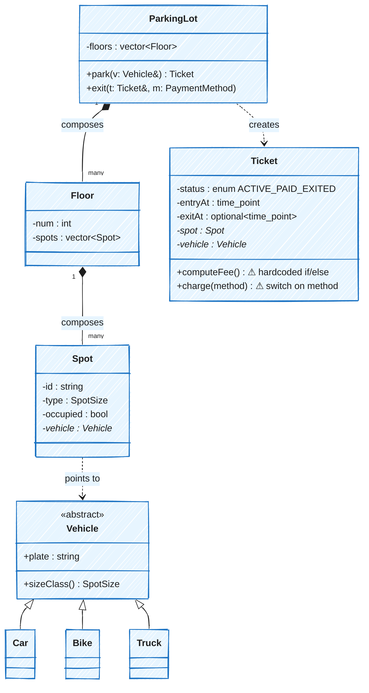
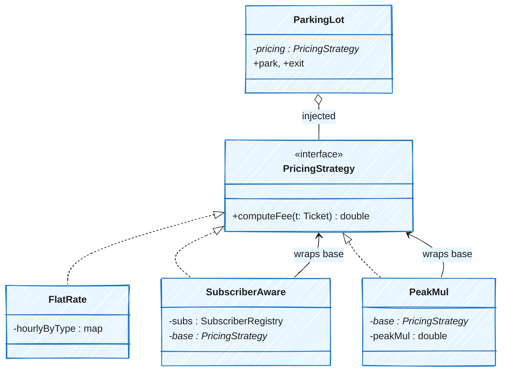
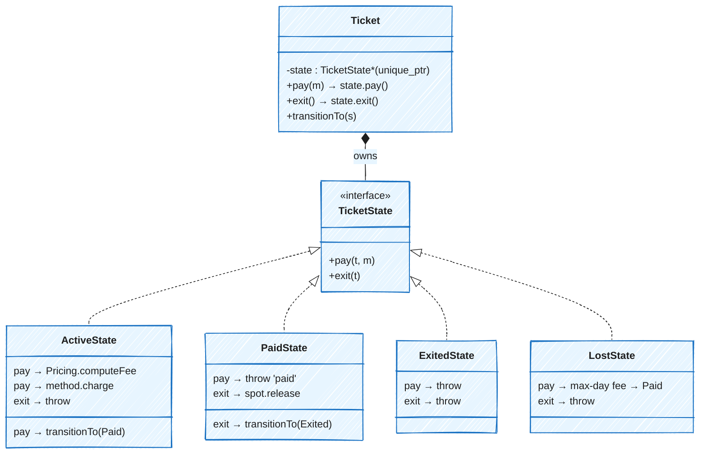
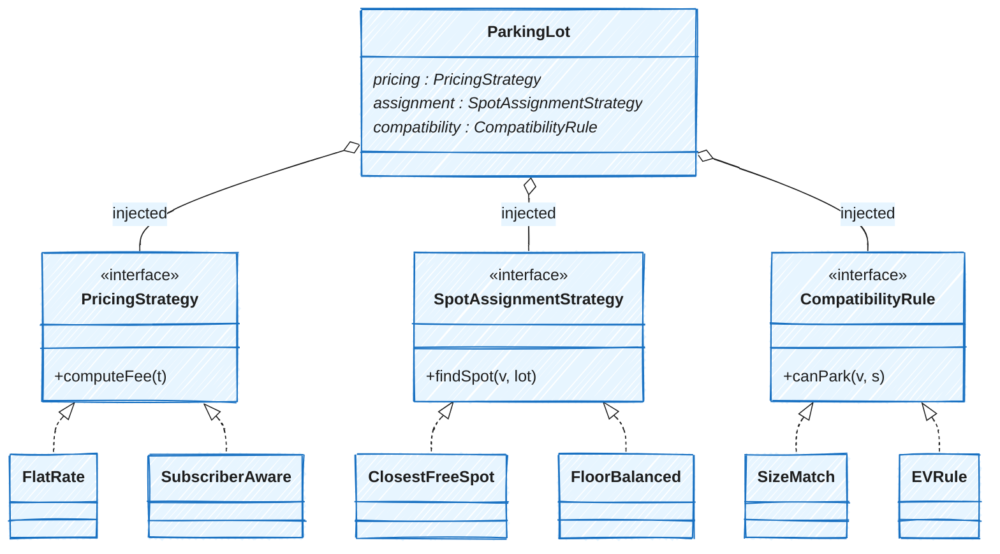
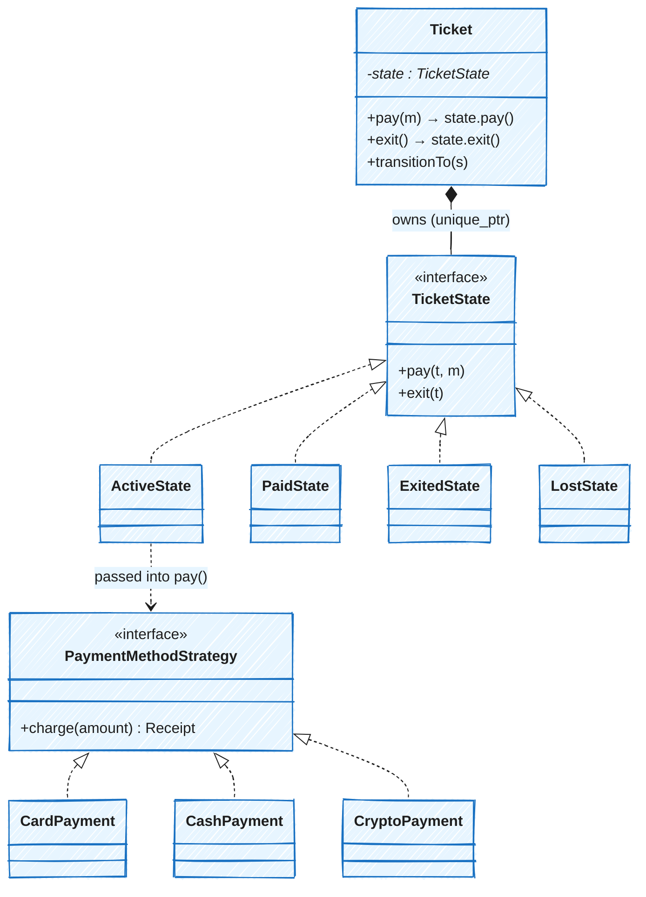
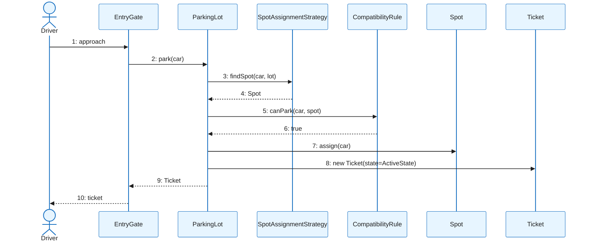
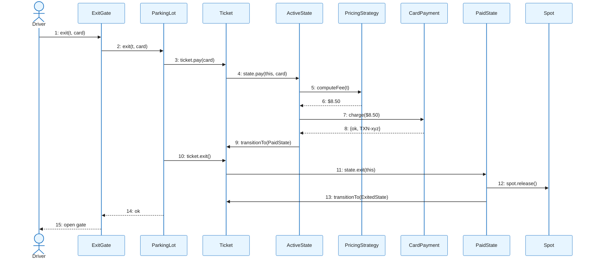

# Parking Lot — LLD Walkthrough

> **Difficulty:** Medium · **Time:** ~45 min · **Pattern focus:** Strategy (pricing) + State (ticket lifecycle) + a few more
>
> **Problem source(s):** representative of multiple LeetLens rows in [`./EXTRACTED_QUESTIONS.md`](./EXTRACTED_QUESTIONS.md). The most-asked LLD interview question.
>
> **Diagrams:** inline mermaid (renders natively in GitHub / VS Code). Optional editable freehand sources are sibling `.excalidraw` files.

---

## How to use this file

Paced for a candidate seeing parking lot for the first time. Reading time: ~40 minutes if you sketch each iteration by hand. **The lesson: don't reach for design patterns up front — DERIVE them by building the naive design first, watching it break under three or four hypothetical changes, and reaching for ONE pattern at a time to fix the most painful axis.**

**Map of this file (15 sections):**

1. Problem statement + clarifying questions
2. Plain-English restatement
3. Why this matters
4. Mental model
5. Try it yourself first
6. Entity & verb extraction
7. **Iteration 1: the naive design** — what we'd write first
8. **Where the naive design hurts** — four future requirements, one painful diff each
9. **Pivot 1: Strategy for pricing** — the most painful axis first
10. **Pivot 2: State for ticket lifecycle** — internal transitions, not external swaps
11. **Pivot 3: Strategy for the remaining axes** — payment, compatibility, spot assignment
12. Final UML class diagram
13. Skeleton code (C++)
14. Key flow — sequence diagram
15. Extensibility re-check + anti-patterns + how to think aloud + self-check

---

## 1. Problem statement + clarifying questions

**Prompt (typical phrasing):** "Design a parking lot system. Vehicles enter, get assigned a spot, get a ticket, and pay on exit."

**Clarifying questions to ask BEFORE drawing anything:**

1. **Vehicle types?** Just cars, or motorcycles + trucks + EVs?
2. **Spot types?** Compact / regular / large / handicapped / EV? Can a small vehicle use a large spot?
3. **Multi-floor?** Single lot or multi-floor garage?
4. **Pricing model?** Flat hourly, tiered (first hour free), peak/off-peak, monthly subscriber?
5. **Payment methods?** Cash, card, app pre-pay?
6. **Entry/exit gates?** One gate or multiple? Spot assigned by system or find-your-own?
7. **Concurrency?** Should two simultaneous arrivals not get the same spot?
8. **Lost ticket flow?** Charge max-day rate, then issue replacement?

**Assumptions if interviewer dodges:** multi-floor garage, multiple vehicle/spot types, tiered pricing, credit-card payment, system assigns the closest free spot, single-threaded for now (we'll discuss concurrency in §15).

---

## 2. Plain-English restatement

We're building the software that runs a multi-floor garage. The system must: track occupied/free spots, assign an incoming vehicle to a compatible free spot, issue a ticket, calculate the bill on exit based on time + rules, accept payment, and release the spot. The design must accommodate adding new vehicle types, new pricing rules, and new payment methods **without rewriting the core flow**.

---

## 3. Why this matters

The #1 interview LLD question. It looks simple but tests one thing: do you reach for inheritance reflexively, or do you correctly use composition + Strategy + State for axes that vary, and inheritance only for genuine "is-a" relationships? Most candidates write a working solution; the senior bar is in DERIVING the choices.

---

## 4. Mental model

A garage is a **collection of slots** + a **rule-book**. The slots are essentially a 2D grid (floor × position). The rule-book has axes that change INDEPENDENTLY: which slot accepts which vehicle, how much to charge, how the ticket transitions through states, what payment methods are accepted.

```
Real-world sketch (NOT a UML diagram yet):

         ┌──────────────────────────────────┐
         │     Garage (3 floors)            │
         │  Floor 3: [□] [█] [□] [EV] ...   │  □ free, █ occupied
         │  Floor 2: [█] [█] [□] [□]  ...   │
         │  Floor 1: [█] [□] [□] [EV] ...   │
         └──────────────┬───────────────────┘
                 ┌──────┴───────┐
                 ▼              ▼
            [Entry Gate]   [Exit Gate]
              issue          charge
              ticket         + release
```

The KEY insight from this picture: the slots are inventory; the gates are the orchestration; the rules are the policy. Inventory vs. orchestration vs. policy is the separation we'll bake into the design.

---

## 5. Try it yourself first

> **Predict before reading on:**
>
> 1. List 5 nouns you'd promote to a class. List 3 nouns you'd leave as fields.
> 2. **If I told you the parking lot will need three different pricing schemes in its first year, what would change about how you write the Ticket class?**
> 3. If a "lost ticket" requires a different exit flow, where do you put that logic?

---

## 6. Entity & verb extraction

> **Mini-refresher: noun → class, but not every noun.**
>
> Naive OOD promotes every noun to a class. Senior OOD promotes a noun only if it has both BEHAVIOR and STATE that need to live together. "Color" usually stays a field; "ticket" usually becomes a class because it has lifecycle behavior.

**Nouns from the prompt:**

| Noun | Decision | Why |
|---|---|---|
| ParkingLot | Class (top-level coordinator) | Owns floors, orchestrates park/exit |
| Floor | Class | Has spots, reports free count |
| Spot | Class | Has type, occupancy, can be assigned |
| Vehicle | Class (abstract) + concrete subclasses | Has type + plate; subclasses encode size |
| Ticket | Class | Lifecycle behavior + billing target |
| Gate | Class | Entry/Exit orchestrate park/exit |
| LicensePlate | Field on Vehicle (`std::string`) | No behavior of its own |
| Time / Duration | Library type (`std::chrono::time_point`) | No domain behavior |
| Floor number | Field on Floor | Not a class |

**Verbs (and the class they live on):**

| Verb | Owner class (naive answer — we'll re-examine) |
|---|---|
| park(vehicle) | EntryGate, delegating to ParkingLot |
| assignSpot(vehicle) | ParkingLot |
| issueTicket(spot, vehicle) | ParkingLot |
| exit(ticketId) | ExitGate |
| computeFee(ticket) | Ticket |
| charge(amount, method) | Ticket |
| markOccupied() / markFree() | Spot |

**We have NOT introduced any design patterns yet.** Pure nouns + verbs.

---

## 7. <a id="iter-1"></a>Iteration 1: the naive design

Let's write the simplest thing that could possibly work. No design patterns — just classes with methods.



**Reader's tour (read top to bottom; ~60 seconds).**

1. **At the top — `ParkingLot` is the root.** It holds ONE field (`floors`) and exposes TWO public methods (`park`, `exit`). Notice: NO injected strategies, NO policy objects. Every decision lives inside these methods.

2. **The composition spine (down the left).** The `◆ owns` arrows mark composition — a FILLED diamond in UML, meaning strong ownership / same lifetime. ParkingLot composes `Floor[]`; Floor composes `Spot[]`. If the lot dies, every floor and every spot dies with it.

3. **The Vehicle hierarchy (right side).** Vehicle is an abstract base; `Car`, `Bike`, `Truck` inherit from it. This is the ONLY inheritance in the naive design, and it's a genuine "is-a" relationship — every Car IS a Vehicle. This inheritance is *not* the smell.

4. **Spot points to Vehicle.** When a spot is occupied, `vehicle` holds a raw `Vehicle*` pointer. When free, nullptr. (Raw pointer is fine for now; we'll discuss ownership in §11.)

5. **The Ticket box — the trouble zone.** Look at the three warning markers (⚠):
   - `status` is an enum. Fine for 3 states; will break when we add `LOST` in §8 change C.
   - `computeFee()` is hardcoded if/else by spot type. Every new pricing rule means surgery inside this method.
   - `charge(method)` uses a switch on PaymentMethod. Every new payment type adds a case.
   
   Each warning is a future-pain entry point. §8 turns each into a concrete future-requirement that exposes the design's brittleness.

**What's deliberately missing.** No `PricingStrategy`. No `TicketState`. No `PaymentMethodStrategy`. No `CompatibilityRule`. No `SpotAssignmentStrategy`. The naive design doesn't even *acknowledge* that these are axes of variation — it bakes a hardcoded answer for each into the methods that use them. That's what we're going to expose, and fix, over the next four sections.

Skeleton code for the naive design (C++):

```cpp
#include <chrono>
#include <memory>
#include <optional>
#include <stdexcept>
#include <string>
#include <vector>

enum class SpotSize       { SMALL, REGULAR, LARGE, EV };
enum class PaymentMethod  { CASH, CARD, APP };
enum class TicketStatus   { ACTIVE, PAID, EXITED };

class Vehicle {
public:
    explicit Vehicle(std::string plate) : plate_(std::move(plate)) {}
    virtual ~Vehicle() = default;
    virtual SpotSize sizeClass() const = 0;
    const std::string& plate() const { return plate_; }
private:
    std::string plate_;
};
class Car   : public Vehicle { public: using Vehicle::Vehicle; SpotSize sizeClass() const override { return SpotSize::REGULAR; } };
class Bike  : public Vehicle { public: using Vehicle::Vehicle; SpotSize sizeClass() const override { return SpotSize::SMALL;   } };

class Spot {
public:
    Spot(std::string id, SpotSize type) : id_(std::move(id)), type_(type) {}
    bool      occupied() const { return occupied_; }
    SpotSize  type()     const { return type_; }
    void assign(Vehicle* v) { vehicle_ = v; occupied_ = true; }
    void release()           { vehicle_ = nullptr; occupied_ = false; }
private:
    std::string id_;
    SpotSize    type_;
    bool        occupied_ = false;
    Vehicle*    vehicle_ = nullptr;
};

class Ticket {
public:
    TicketStatus status = TicketStatus::ACTIVE;
    std::chrono::system_clock::time_point entryAt = std::chrono::system_clock::now();
    std::optional<std::chrono::system_clock::time_point> exitAt;
    Spot*    spot;
    Vehicle* vehicle;

    double computeFee() const {  // hardcoded — will hurt
        if (!exitAt) throw std::runtime_error("Not exited yet");
        auto hours = std::chrono::duration_cast<std::chrono::hours>(*exitAt - entryAt).count() + 1;
        double rate = (spot->type() == SpotSize::LARGE) ? 8.0 : 5.0;  // hardcoded
        return hours * rate;
    }
    struct Receipt { bool ok; std::string ref; };
    Receipt charge(PaymentMethod method) {  // tag-driven switch — will hurt
        double amount = computeFee();
        switch (method) {
            case PaymentMethod::CASH: return { true, "cash-..." };
            case PaymentMethod::CARD: return { true, "card-..." };  // call Stripe
            case PaymentMethod::APP:  return { true, "app-..."  };  // call app SDK
        }
        return { false, "" };
    }
};

class ParkingLot {
public:
    explicit ParkingLot(std::vector<Floor> floors) : floors_(std::move(floors)) {}

    Ticket park(Vehicle& v) {
        for (auto& floor : floors_) {
            for (auto& spot : floor.spots()) {
                // inline compatibility check
                if (!spot.occupied() && v.sizeClass() <= spot.type()) {
                    spot.assign(&v);
                    Ticket t;
                    t.spot = &spot; t.vehicle = &v;
                    return t;
                }
            }
        }
        throw std::runtime_error("Lot full");
    }

    Ticket::Receipt exit(Ticket& t, PaymentMethod method) {
        t.exitAt = std::chrono::system_clock::now();
        auto res = t.charge(method);
        if (!res.ok) throw std::runtime_error("Payment failed");
        t.status = TicketStatus::PAID;
        t.spot->release();
        t.status = TicketStatus::EXITED;
        return res;
    }
private:
    std::vector<Floor> floors_;
};
```

**This works.** It has zero design patterns. We can park, charge, exit. So what's wrong with it?

---

## 8. <a id="naive-pain"></a>Where the naive design hurts

Now the interviewer slides a piece of paper across the desk: "Here are four new requirements coming next quarter. Walk me through what changes."

### Change A: "Subscribers parking flat $200/month, bypass per-visit charge"

In the naive design:
- `Ticket::computeFee()` needs an early-return for subscriber plates → query a SubscriberRegistry from inside Ticket → Ticket now depends on something it shouldn't know about.
- OR add `if (isSubscriber)` in `ParkingLot::exit()`.
- Either way, **the change touches `computeFee` AND `exit` AND introduces a new dependency**.

### Change B: "Peak pricing — 1.5× rate from 8am-6pm"

In the naive design:
- `computeFee()` needs time-of-day logic + a multiplier.
- The hardcoded ternary becomes a 15-line branching mess.
- **Next pricing change → another 10 lines in computeFee**. Three rules in and it's unreadable.

### Change C: "Lost ticket — driver pays max-day rate, system issues replacement"

In the naive design:
- `TicketStatus` enum doesn't cover `LOST`.
- `exit()` assumes a normal flow: existing ticket → charge → release. Lost-ticket is different: no precise entry timestamp, fixed fee, replacement ticket needed.
- **Add `if (ticket.status == LOST)` branches in `exit()`, `computeFee()`, and gate logic. Three sites.**

### Change D: "Add cryptocurrency payment"

In the naive design:
- Add `CRYPTO` to `PaymentMethod` enum.
- Add a `case CRYPTO:` to `Ticket::charge()`.
- **Next payment method → another case. Classic tag-driven switch.**

### The pattern of pain

| Change | Files touched | Smell |
|---|---|---|
| A. Subscribers | `Ticket::computeFee` + `ParkingLot::exit` | "Pricing logic scattered across two classes." |
| B. Peak pricing | `Ticket::computeFee` (monstrous) | "Single method accumulates every rule." |
| C. Lost ticket | `exit()` + `computeFee()` + gate logic | "Status enum + switch can't express new lifecycle states." |
| D. Crypto payment | `Ticket::charge()` switch | "Tag-driven if/else; every new payment is surgery in the same function." |

**Two axes of pain dominate:** algorithm variability (pricing, payment, compatibility) and lifecycle variability (ticket state).

> **Pivot question:** "What pattern handles 'algorithm that varies, swapped by caller'? What pattern handles 'lifecycle with state-specific behavior'?"
>
> The answers are Strategy and State. Let's introduce them one at a time, starting with the most painful axis: pricing.

---

## 9. <a id="pivot-1"></a>Pivot 1: Strategy for pricing

> **Mini-refresher: Strategy pattern.**
>
> Encapsulates an algorithm behind an interface so it can be swapped at runtime. The CALLER decides which strategy to use; the strategy doesn't know about its peers.
>
> Quick example: a `Sorter` class takes a `CompareStrategy*` in its constructor. Pass `AscendingCompare` or `DescendingCompare` — the sorter doesn't care.

**Why Strategy fits pricing.** Pricing is an algorithm (`given a ticket, return a number`). It varies (flat, peak, subscriber, tiered, promotional). The choice of strategy is made externally (by lot policy, not by the ticket itself). That's textbook Strategy.

**The refactor (just the affected part):**

```cpp
class PricingStrategy {
public:
    virtual ~PricingStrategy() = default;
    virtual double computeFee(const Ticket& t) const = 0;
};

class FlatRate : public PricingStrategy {
public:
    explicit FlatRate(std::unordered_map<SpotSize, double> hourly)
        : hourly_(std::move(hourly)) {}
    double computeFee(const Ticket& t) const override {
        auto hours = std::ceil(t.durationHours());
        auto it = hourly_.find(t.spot().type());
        return hours * (it != hourly_.end() ? it->second : 5.0);
    }
private:
    std::unordered_map<SpotSize, double> hourly_;
};

// Decorator-style composition — wrap another strategy
class SubscriberAware : public PricingStrategy {
public:
    SubscriberAware(const SubscriberRegistry& subs, std::unique_ptr<PricingStrategy> base)
        : subs_(subs), base_(std::move(base)) {}
    double computeFee(const Ticket& t) const override {
        return subs_.has(t.vehicle().plate()) ? 0.0 : base_->computeFee(t);
    }
private:
    const SubscriberRegistry&        subs_;
    std::unique_ptr<PricingStrategy> base_;
};

class PeakMultiplier : public PricingStrategy {
public:
    PeakMultiplier(std::unique_ptr<PricingStrategy> base, double peakMul)
        : base_(std::move(base)), peakMul_(peakMul) {}
    double computeFee(const Ticket& t) const override {
        double fee = base_->computeFee(t);
        return inPeakWindow(t.entryAt()) ? fee * peakMul_ : fee;
    }
private:
    std::unique_ptr<PricingStrategy> base_;
    double                            peakMul_;
};

class ParkingLot {
    // ...
    std::unique_ptr<PricingStrategy> pricing_;  // injected at construction
};

class Ticket {
    // computeFee() is GONE. Pricing lives on the strategy.
};
```

**What changed — visualized.** Just the pricing slice:



**Tour of the after-state.**

1. **Top-right: ParkingLot has gained a field.** `pricing` is a pointer to a `PricingStrategy` interface, INJECTED at construction. The OPEN diamond (`◇`) marks aggregation — ParkingLot uses pricing, doesn't necessarily own its lifecycle.

2. **Middle: the `<< interface >>` box.** This is the abstract base class. Single virtual method `computeFee(Ticket&) → double`. Notice how the contract is narrower than the old `Ticket::computeFee()` — it takes a ticket and returns a number. Nothing else.

3. **Bottom row: three concrete implementations.**
   - `FlatRate` is the simple case — hourly rates by spot type, like the naive design but now isolated.
   - `SubscriberAware` is a DECORATOR — note the small arrow at the bottom (`base* ─►`). It holds a pointer to ANOTHER `PricingStrategy*` and either returns 0 (if subscriber) or delegates to the wrapped base. **Composition of strategies, not subclassing.**
   - `PeakMul` is another decorator that multiplies its wrapped base's result by a peak multiplier when the time-of-day is in the peak window.

4. **Powerful consequence.** You can compose: `PeakMul(SubAware(FlatRate))`. That's "peak × subscriber-bypass × flat" — three independent pricing rules stacked. The naive design couldn't express this without nested if/else.

5. **Ticket's surface SHRANK.** `computeFee()` is no longer a method on Ticket. The lifecycle stays on the ticket; the algorithm moved out.

**Change A and Change B from §8 now land cleanly.** Subscribers → new `SubscriberAware` decorator. Peak pricing → new `PeakMul` decorator. Combinable. No surgery in `Ticket`.

**Pattern-discrimination cheatsheet — Strategy vs Template Method.**
- *Strategy:* whole algorithm in one swappable object; chosen at runtime via composition.
- *Template Method:* algorithm skeleton in a base class; subclasses fill in hooks via inheritance.
- *Rule of thumb:* multiple variants that might be combined or changed at runtime → Strategy. Fixed skeleton with 2-3 stable variants → Template Method.

We chose Strategy because pricing variants COMPOSE (peak × subscriber × tiered all at once) — and you can't compose Template Method subclasses.

---

## 10. <a id="pivot-2"></a>Pivot 2: State for ticket lifecycle

Change C from §8 is still painful — `LOST` status, lost-ticket flow, state-specific behavior. Pricing strategy doesn't help because the variability is not in the ALGORITHM, it's in WHAT'S VALID NEXT.

> **Mini-refresher: State pattern.**
>
> Each lifecycle state is its own class. The context object delegates `handleEvent()` to its current state, and THE STATE decides what the next state is. Transitions are INTERNAL, driven by events the context receives.

**Why State (not Strategy).** The choice of state is NOT picked by the caller — it's driven by what the ticket has been through. An ACTIVE ticket can `pay()`. A PAID ticket can `exit()`. An EXITED ticket can do nothing. Calling `pay()` on a PAID ticket isn't even meaningful — it should fail. The lifecycle is the OBJECT'S concern, not the caller's.

**The refactor (just the lifecycle part):**

```cpp
class Ticket;  // forward
class PaymentMethodStrategy;  // forward — added in Pivot 3

class TicketState {
public:
    virtual ~TicketState() = default;
    virtual void pay(Ticket& t, PaymentMethodStrategy& method) = 0;
    virtual void exit(Ticket& t) = 0;
};

class ActiveState : public TicketState {
public:
    void pay(Ticket& t, PaymentMethodStrategy& method) override;
    void exit(Ticket&) override { throw std::runtime_error("Cannot exit unpaid ticket"); }
};

class PaidState : public TicketState {
public:
    explicit PaidState(std::string txnRef) : txnRef_(std::move(txnRef)) {}
    void pay(Ticket&, PaymentMethodStrategy&) override { throw std::runtime_error("Already paid"); }
    void exit(Ticket& t) override;
private:
    std::string txnRef_;
};

class ExitedState : public TicketState {
public:
    void pay(Ticket&, PaymentMethodStrategy&) override { throw std::runtime_error("Already exited"); }
    void exit(Ticket&) override                         { throw std::runtime_error("Already exited"); }
};

class LostState : public TicketState {
public:
    void pay(Ticket& t, PaymentMethodStrategy& method) override; // fixed max-day fee, then → Paid
    void exit(Ticket&) override { throw std::runtime_error("Cannot exit lost ticket before max-day pay"); }
};

class Ticket {
public:
    Ticket(ParkingLot& lot, Vehicle& v, Spot& s)
        : lot_(lot), vehicle_(v), spot_(s), state_(std::make_unique<ActiveState>()) {}
    void transitionTo(std::unique_ptr<TicketState> s) { state_ = std::move(s); }
    void pay(PaymentMethodStrategy& method) { state_->pay(*this, method); }
    void exit()                              { state_->exit(*this); }
    // ... getters: lot(), vehicle(), spot(), entryAt(), durationHours() ...
private:
    ParkingLot&                     lot_;
    Vehicle&                        vehicle_;
    Spot&                           spot_;
    std::unique_ptr<TicketState>    state_;
};

// Implementation of ActiveState::pay (deferred until Ticket complete):
inline void ActiveState::pay(Ticket& t, PaymentMethodStrategy& method) {
    double fee = t.lot().pricing().computeFee(t);
    auto res = method.charge(fee);
    if (res.ok) t.transitionTo(std::make_unique<PaidState>(res.ref));
}

inline void PaidState::exit(Ticket& t) {
    t.spot().release();
    t.transitionTo(std::make_unique<ExitedState>());
}
```

**What changed — visualized.** Just the lifecycle slice:



**Tour of the after-state.**

1. **The `TicketStatus` enum is gone.** It's replaced by a `state` field of type `TicketState*` (specifically `std::unique_ptr<TicketState>` — exclusive ownership).

2. **Ticket's `pay()` and `exit()` methods became one-liners.** Each just delegates to the current state: `state_->pay(*this, method)` or `state_->exit(*this)`. **NO `if (status == X)` branching anywhere.**

3. **The interface declares the contract.** `TicketState` is an abstract base with two pure-virtual methods: `pay()` and `exit()`. Each concrete state must implement both, even if the answer is "throw" (e.g., `ExitedState::pay` throws because you can't pay a ticket that's already exited).

4. **Four concrete states, each with its own behavior.** Read across the bottom row:
   - `ActiveState::pay` is the meaty one — computes the fee via PricingStrategy, charges via PaymentMethod, then `transitionTo(PaidState)`. `ActiveState::exit` throws (can't exit unpaid).
   - `PaidState::pay` throws (already paid). `PaidState::exit` releases the spot and transitions to `ExitedState`.
   - `ExitedState` is terminal — both methods throw.
   - `LostState::pay` charges the fixed max-day rate and transitions to Paid. `exit` throws until paid.

5. **Where the transitions happen.** Look at each state's method body — the state itself calls `t.transitionTo(...)` when its work is done. **The transition logic lives WITH the state**, not in `Ticket` and not in `ParkingLot`. That's the whole point of the State pattern: each state knows what comes next.

**Adding a new state is one new class.** When change C from §8 arrives ("lost-ticket flow"), you write `LostState` and that's it. No edits to `ActiveState`, `PaidState`, `ExitedState`, `Ticket`, or `ParkingLot`. Open/closed.

**Pattern-discrimination cheatsheet — Strategy vs State.**
- *Strategy:* CALLER picks which one to use; strategies are usually unaware of each other.
- *State:* the OBJECT picks its next state internally; states know about each other (each state's methods can `transitionTo` another).
- *Rule of thumb:* swap happens because external code says so → Strategy. Swap happens because of an internal event flow → State.

---

## 11. <a id="pivot-3"></a>Pivot 3: Strategy for the remaining variability axes

Changes A, B, C from §8 are solved. Change D (crypto payment) and the broader extensibility goals (EV spots, VIP spot assignment) are not yet.

**The remaining axes:**

| Axis | Pattern | One sentence why |
|---|---|---|
| Payment method | Strategy | Same shape as pricing — algorithm picked by caller |
| Spot-vehicle compatibility | Strategy | Rules vary (size, EV, handicap credentials); injected, not hardcoded |
| Spot assignment algorithm | Strategy | Closest-free vs floor-balanced vs VIP-priority — picked by lot config |

Each follows the same shape as Pivot 1. Brief sketches:

```cpp
class PaymentMethodStrategy {
public:
    struct Receipt { bool ok; std::string ref; };
    virtual ~PaymentMethodStrategy() = default;
    virtual Receipt charge(double amount) = 0;
};
class CardPayment   : public PaymentMethodStrategy { /* Stripe SDK */ };
class CashPayment   : public PaymentMethodStrategy { /* Drawer */ };
class CryptoPayment : public PaymentMethodStrategy { /* Coinbase Commerce */ };

class CompatibilityRule {
public:
    virtual ~CompatibilityRule() = default;
    virtual bool canPark(const Vehicle& v, const Spot& s) const = 0;
};
class SizeMatch   : public CompatibilityRule { /* v.size <= s.type */ };
class EVRule      : public CompatibilityRule { /* EV spot only for EVs */ };
class CompositeCompatibility : public CompatibilityRule {
public:
    explicit CompositeCompatibility(std::vector<std::unique_ptr<CompatibilityRule>> rules)
        : rules_(std::move(rules)) {}
    bool canPark(const Vehicle& v, const Spot& s) const override {
        for (const auto& r : rules_) if (!r->canPark(v, s)) return false;
        return true;
    }
private:
    std::vector<std::unique_ptr<CompatibilityRule>> rules_;
};

class SpotAssignmentStrategy {
public:
    virtual ~SpotAssignmentStrategy() = default;
    virtual Spot* findSpot(const Vehicle& v, ParkingLot& lot) = 0;
};
class ClosestFreeSpot  : public SpotAssignmentStrategy { /* scan floors 1..N */ };
class FloorBalanced    : public SpotAssignmentStrategy { /* pick least-occupied floor */ };
class VIPPrioritySpot  : public SpotAssignmentStrategy { /* premium row first */ };
```

**The lesson.** Once we recognized "algorithm picked by caller" as the pattern for pricing in Pivot 1, the same shape applies to three more axes. **Pattern recognition makes subsequent design cheap.**

> **Mini-refresher: why three independent Strategy hierarchies don't share one interface.**
>
> Strategy is a *role*, not a type. PricingStrategy, PaymentMethodStrategy, and CompatibilityRule have nothing in common at the type level (different inputs, different outputs). Don't try to unify them under a single `Strategy<T>` template — that's premature genericism.

---

## 12. <a id="fig-class-diagram"></a>Final class diagram

Showing the entire final design in one diagram becomes a wall of boxes. Instead, here are **three focused sub-views**, each addressing a different concern. Read them in order; the structural insight at the end ties them together.

### 12.1 The inventory spine — what the lot OWNS

```mermaid
---
config:
  look: handDrawn
  theme: base
  themeVariables:
    background: '#ffffff'
    primaryColor: '#e7f5ff'
    primaryTextColor: '#1e1e1e'
    primaryBorderColor: '#1971c2'
    lineColor: '#1e1e1e'
    secondaryColor: '#fff3bf'
    secondaryTextColor: '#1e1e1e'
    secondaryBorderColor: '#e67700'
    tertiaryColor: '#d3f9d8'
    tertiaryTextColor: '#1e1e1e'
    tertiaryBorderColor: '#2f9e44'
    noteBkgColor: '#fff9db'
    noteTextColor: '#1e1e1e'
    noteBorderColor: '#fab005'
    actorBkg: '#e7f5ff'
    actorBorder: '#1971c2'
    actorTextColor: '#1e1e1e'
    signalColor: '#1e1e1e'
    signalTextColor: '#1e1e1e'
    classText: '#1e1e1e'
    fontFamily: 'Segoe UI, Helvetica, Arial, sans-serif'
---
classDiagram
  direction TB
  class ParkingLot {
    floors : vector~Floor~
    (root coordinator)
  }
  class Floor {
    num : int
    spots : vector~Spot~
  }
  class Spot {
    id : string
    type : SpotSize
    occupied : bool
    vehicle : Vehicle*
  }
  ParkingLot "1" *-- "many" Floor : composes
  Floor "1" *-- "many" Spot : composes
```

**Tour of 12.1.** Three boxes, one chain. The filled diamonds (`◆`) mark composition — the SAME lifetime relationship that existed in the naive design. Inventory hasn't changed shape; it didn't need to. The lot still owns floors; floors still own spots. The only difference from the naive version is what we've ADDED elsewhere — see 12.2 next.

### 12.2 The policy injection — what the lot USES



**Tour of 12.2.**

1. **One ParkingLot, three injected strategy interfaces.** ParkingLot now holds three pointers, one per axis of variation. They're INJECTED at construction; ParkingLot doesn't `new` them itself. (See §13 skeleton's constructor.)

2. **The open diamonds (`◇`) mark AGGREGATION.** This is the formal UML notation for "I use this but don't necessarily own its lifecycle." Compare with the filled diamonds in 12.1 — composition vs aggregation is the distinction.

3. **Each interface has a small concrete-class family below it.** Read left-to-right:
   - `PricingStrategy` → `FlatRate`, `SubAware` (decorator), `PeakMul` (decorator). The decorators wrap a `base : PricingStrategy*`, so you can stack rules.
   - `SpotAssignmentStrategy` → `ClosestFreeSpot`, `FloorBalanced` (plus `VIPPriority` if needed).
   - `CompatibilityRule` → `SizeMatch`, `EVRule` (plus `CompositeCompatibility` that ANDs a list).

4. **The structural insight here.** Variability axes that the naive design hardcoded inside ParkingLot::park() and Ticket::computeFee() are now lifted into their own type hierarchies. **The lot's CORE becomes orchestration; the variation becomes a hot-swap policy.**

5. **PaymentMethodStrategy is missing here on purpose.** It's an axis too, but the lot doesn't STORE the payment method — the caller passes it into `exit()`. It belongs in 12.3 instead.

### 12.3 The lifecycle and the payment — Ticket's State pattern + the payment Strategy



**Tour of 12.3.**

1. **Ticket holds ONE TicketState pointer.** Filled diamond / `unique_ptr` — the ticket OWNS its current state. When the state transitions, the ticket replaces the unique_ptr.

2. **Ticket's `pay()` and `exit()` are ONE-LINERS that delegate.** They just call `state_->pay(*this, m)` or `state_->exit(*this)`. **No status-switch anywhere on Ticket.**

3. **Four concrete state classes hang off the TicketState interface.** Each is self-contained — knows what events are legal in its phase and where to transition next. ExitedState is terminal (both methods throw). LostState plugs in for the lost-ticket flow.

4. **PaymentMethodStrategy is NOT stored on Ticket or Lot.** Look at the diagram carefully — the payment interface is "used by ActiveState.pay" but not held as a field anywhere. **It's passed as a method parameter** (`method` in `pay(method)`). This matters because the lot doesn't dictate payment; the gate / caller does (e.g., card on file vs cash drawer).

5. **The crucial behavioral flow** lives inside `ActiveState::pay`. Read the three numbered steps next to the arrow. The state computes the fee via the LOT's pricing strategy, charges via the CALLER's payment strategy, and transitions itself to PaidState. **Three different Strategies cooperate in one method, each owned by a different actor.**

### Structural insight (ties 12.1 + 12.2 + 12.3 together)

| Concern | Pattern used | Why |
|---|---|---|
| **Inventory** (Floor, Spot, Vehicle types) | Plain ownership + minimal inheritance | Vehicle subtypes are genuine "is-a"; everything else is just data |
| **Policy** (pricing, assignment, compatibility) | Strategy, INJECTED into ParkingLot | Caller / config picks the variant; possibly composed via decorators |
| **Lifecycle** (Active → Paid → Exited / Lost) | State, OWNED by Ticket | Ticket itself controls transitions; states validate what's legal next |
| **Payment** (card, cash, crypto) | Strategy, PASSED as method parameter | Caller decides per-transaction; not lot-wide config |

The big lesson: **inheritance is used only for Vehicle types and state/strategy class families** — every other "varies independently" axis becomes composition over an interface. *Inheritance for identity, composition for behavior variation.* That distinction is what makes this design extensible.

---

## 13. Skeleton code (C++)

> Show the SHAPES, not the full impl. ~140 lines.

```cpp
#include <chrono>
#include <memory>
#include <optional>
#include <stdexcept>
#include <string>
#include <unordered_map>
#include <utility>
#include <vector>

// ── Forward declarations ────────────────────────────────────────────
class Ticket;
class ParkingLot;
class PaymentMethodStrategy;

// ── Vehicle hierarchy ───────────────────────────────────────────────
enum class SpotSize { SMALL, REGULAR, LARGE, EV, HANDICAPPED };

class Vehicle {
public:
    explicit Vehicle(std::string plate) : plate_(std::move(plate)) {}
    virtual ~Vehicle() = default;
    virtual SpotSize sizeClass() const = 0;
    const std::string& plate() const { return plate_; }
private:
    std::string plate_;
};
class Car   : public Vehicle { public: using Vehicle::Vehicle; SpotSize sizeClass() const override { return SpotSize::REGULAR; } };
class Bike  : public Vehicle { public: using Vehicle::Vehicle; SpotSize sizeClass() const override { return SpotSize::SMALL;   } };
class Truck : public Vehicle { public: using Vehicle::Vehicle; SpotSize sizeClass() const override { return SpotSize::LARGE;   } };

// ── Spot ────────────────────────────────────────────────────────────
class Spot {
public:
    Spot(std::string id, SpotSize type) : id_(std::move(id)), type_(type) {}
    bool        occupied() const { return occupied_; }
    SpotSize    type()     const { return type_; }
    const std::string& id() const { return id_; }
    void assign(Vehicle* v) { vehicle_ = v; occupied_ = true; }
    void release()           { vehicle_ = nullptr; occupied_ = false; }
private:
    std::string id_;
    SpotSize    type_;
    bool        occupied_ = false;
    Vehicle*    vehicle_  = nullptr;
};

// ── Strategy interfaces (one per axis of variation) ─────────────────
class PricingStrategy {
public:
    virtual ~PricingStrategy() = default;
    virtual double computeFee(const Ticket& t) const = 0;
};

class SpotAssignmentStrategy {
public:
    virtual ~SpotAssignmentStrategy() = default;
    virtual Spot* findSpot(const Vehicle& v, ParkingLot& lot) = 0;
};

class CompatibilityRule {
public:
    virtual ~CompatibilityRule() = default;
    virtual bool canPark(const Vehicle& v, const Spot& s) const = 0;
};

class PaymentMethodStrategy {
public:
    struct Receipt { bool ok; std::string ref; };
    virtual ~PaymentMethodStrategy() = default;
    virtual Receipt charge(double amount) = 0;
};

// (Concrete implementations elided — see §9 and §11 for representative examples.)

// ── Ticket + State pattern ──────────────────────────────────────────
class TicketState {
public:
    virtual ~TicketState() = default;
    virtual void pay(Ticket& t, PaymentMethodStrategy& method) = 0;
    virtual void exit(Ticket& t) = 0;
};

class ActiveState : public TicketState {
public:
    void pay(Ticket& t, PaymentMethodStrategy& method) override;       // see Pivot 2
    void exit(Ticket&) override { throw std::runtime_error("Cannot exit unpaid ticket"); }
};

class PaidState : public TicketState {
public:
    explicit PaidState(std::string txn) : txnRef_(std::move(txn)) {}
    void pay(Ticket&, PaymentMethodStrategy&) override { throw std::runtime_error("Already paid"); }
    void exit(Ticket& t) override;                                     // see Pivot 2
private:
    std::string txnRef_;
};

class ExitedState : public TicketState {
public:
    void pay(Ticket&, PaymentMethodStrategy&) override { throw std::runtime_error("Already exited"); }
    void exit(Ticket&) override                         { throw std::runtime_error("Already exited"); }
};

class LostState : public TicketState {
public:
    void pay(Ticket& t, PaymentMethodStrategy& method) override; // fixed max-day fee
    void exit(Ticket&) override { throw std::runtime_error("Cannot exit lost ticket"); }
};

class Ticket {
public:
    Ticket(ParkingLot& lot, Vehicle& v, Spot& s)
        : lot_(lot), vehicle_(v), spot_(s), state_(std::make_unique<ActiveState>()) {}

    void transitionTo(std::unique_ptr<TicketState> s) { state_ = std::move(s); }
    void pay(PaymentMethodStrategy& method) { state_->pay(*this, method); }
    void exit()                              { exitAt_ = std::chrono::system_clock::now();
                                                state_->exit(*this); }

    ParkingLot&  lot()      { return lot_; }
    Vehicle&     vehicle()  { return vehicle_; }
    Spot&        spot()     { return spot_; }
    auto         entryAt()  const { return entryAt_; }
    double       durationHours() const { /* exitAt_ - entryAt_ in hours, ceil */ return 0; }

private:
    ParkingLot&                     lot_;
    Vehicle&                        vehicle_;
    Spot&                           spot_;
    std::unique_ptr<TicketState>    state_;
    std::chrono::system_clock::time_point entryAt_ = std::chrono::system_clock::now();
    std::optional<std::chrono::system_clock::time_point> exitAt_;
};

// ── ParkingLot (orchestrator) ───────────────────────────────────────
class ParkingLot {
public:
    ParkingLot(std::vector<Floor> floors,
               std::unique_ptr<SpotAssignmentStrategy> assignment,
               std::unique_ptr<PricingStrategy>        pricing,
               std::unique_ptr<CompatibilityRule>      compatibility,
               double maxDayRate)
        : floors_(std::move(floors))
        , assignment_(std::move(assignment))
        , pricing_(std::move(pricing))
        , compatibility_(std::move(compatibility))
        , maxDayRate_(maxDayRate) {}

    Ticket park(Vehicle& v) {
        Spot* spot = assignment_->findSpot(v, *this);
        if (!spot || !compatibility_->canPark(v, *spot))
            throw std::runtime_error("Lot full or incompatible");
        spot->assign(&v);
        return Ticket(*this, v, *spot);
    }

    void exit(Ticket& t, PaymentMethodStrategy& method) {
        t.pay(method);
        t.exit();
    }

    const PricingStrategy& pricing() const { return *pricing_; }
    double                 maxDayRate() const { return maxDayRate_; }

private:
    std::vector<Floor>                       floors_;
    std::unique_ptr<SpotAssignmentStrategy>  assignment_;
    std::unique_ptr<PricingStrategy>         pricing_;
    std::unique_ptr<CompatibilityRule>       compatibility_;
    double                                    maxDayRate_;
};

// Implementation of state transitions (deferred until Ticket is complete):
inline void ActiveState::pay(Ticket& t, PaymentMethodStrategy& method) {
    double fee = t.lot().pricing().computeFee(t);
    auto res = method.charge(fee);
    if (res.ok) t.transitionTo(std::make_unique<PaidState>(res.ref));
}
inline void PaidState::exit(Ticket& t) {
    t.spot().release();
    t.transitionTo(std::make_unique<ExitedState>());
}
inline void LostState::pay(Ticket& t, PaymentMethodStrategy& method) {
    auto res = method.charge(t.lot().maxDayRate());
    if (res.ok) t.transitionTo(std::make_unique<PaidState>(res.ref));
}
```

---

## 14. <a id="fig-sequence"></a>Key flow — sequence diagram

This is the moment of truth for the design — read across the swimlanes to see how the patterns COOPERATE.

### Phase 1 — park



**Tour of Phase 1 (park).**

1. **Driver approaches the gate.** Plain user action. EntryGate is the boundary between user input and the lot.

2. **EntryGate forwards to ParkingLot::park(car).** EntryGate doesn't do any orchestration itself — it just delegates. This separation matters: tomorrow you could add a kiosk gate, a license-plate-reader gate, an app-pre-pay gate — all of them call into the same `lot.park(v)`.

3. **ParkingLot asks the SpotAssignmentStrategy for a spot.** Notice ParkingLot doesn't loop through floors itself anymore (it did in the naive design). The injected strategy owns the algorithm — closest-free / floor-balanced / VIP-priority all look identical from this seat.

4. **ParkingLot asks the CompatibilityRule whether the assignment is valid.** Two-step process (find then validate) instead of one combined check — separates "where could it go" from "is it allowed here." If `canPark` returns false, ParkingLot would ask Assignment for another spot or fail.

5. **ParkingLot tells the Spot to assign itself to the vehicle.** State change happens in the Spot, not in ParkingLot — the Spot owns its own occupancy flag.

6. **ParkingLot creates a new Ticket with initial state = ActiveState.** This is where the State pattern enters: the ticket is BORN holding an ActiveState. The "what state am I in" question is encoded in the unique_ptr the ticket owns.

7. **Ticket flows back to the driver via EntryGate.** End of Phase 1.

### Phase 2 — pay + exit (sometime later)



**Tour of Phase 2 (pay + exit). Read this slowly — it's the moment all four patterns cooperate.**

1. **Driver requests exit with a payment method.** ExitGate receives `(ticket, card)`. Note: the payment method is chosen by the DRIVER and passed in — it is NOT stored on the lot or the ticket.

2. **ExitGate → ParkingLot::exit(ticket, card).** Same delegation story as park; the gate is a thin boundary.

3. **ParkingLot::exit calls Ticket::pay(card) FIRST.** Pay must happen before release. Notice ParkingLot doesn't look at the ticket's status — it just calls pay() and trusts that the ticket / its state knows what to do.

4. **Ticket::pay(card) delegates to its current state.** This is the State-pattern moment: `state_->pay(*this, card)`. **If state_ were a PaidState (because the user double-tapped exit), this would throw "Already paid" — no validation logic on Ticket itself.**

5. **ActiveState::pay does the real work.** Three sub-steps:
   - a. `computeFee(this ticket)` — delegates to ParkingLot's INJECTED PricingStrategy. **Pattern #1 in play.**
   - b. `charge($8.50)` — delegates to the CALLER's PaymentMethodStrategy (the `card` object passed in). **Pattern #2 in play.**
   - c. On `{ok}`, `t.transitionTo(new PaidState(txnRef))`. **Pattern #3 in play (State transition).**
   
   ALL THREE STRATEGIES MEET HERE in this single method. Each is owned by a different actor (lot, caller, ticket). The method orchestrates them.

6. **Back in ParkingLot::exit, the lot calls Ticket::exit().** This is the second delegation through the State pattern. Now state_ is PaidState (just transitioned). `PaidState::exit` runs.

7. **PaidState::exit releases the Spot and transitions to ExitedState.** Releasing a spot is a Spot's concern — `spot.release()` flips occupied → false. Then the state moves to ExitedState (terminal — both methods throw if called).

8. **Result bubbles back to the driver; the gate opens.**

### The validation that's NOT shown — and why it matters

You don't see `if (ticket.status == PAID)` anywhere in this diagram. That's the point of the State pattern: **invalid operations are made impossible by polymorphism**, not by runtime checks scattered through the code.

Try calling `Ticket::pay()` on a ticket whose state is PaidState. The call goes to `PaidState::pay()` which is a one-line `throw std::runtime_error("Already paid")`. No `if` ladder, no enum-comparison, no scattered validation. **The class hierarchy IS the validation.**

---

## 15. Extensibility re-check + anti-patterns + how to think aloud + self-check

### Extensibility re-check

Revisit the four changes from [§8](#naive-pain). For each, name the SINGLE class that changes.

| Change | Naive design impact | Final design impact |
|---|---|---|
| A. Subscribers | `computeFee` + `exit` | New `SubscriberAware : PricingStrategy` decorator. Done. |
| B. Peak pricing | `computeFee` monstrous | New `PeakMultiplier : PricingStrategy` decorator. Compose with others. Done. |
| C. Lost ticket | `exit` + `computeFee` + gate logic | New `LostState : TicketState` class. Done. |
| D. Crypto payment | `charge` switch grows | New `CryptoPayment : PaymentMethodStrategy` class. Done. |

Every change is exactly ONE new class in the final design. That's the open/closed principle in practice.

If a future requirement makes you change Vehicle, Spot, Pricing, AND Ticket together — go back to §6 and re-identify variability points; you missed one.

### Common confusion + traps

1. **"Should Vehicle subclasses have a `pay()` method?"** No. Vehicle has no business with payment. The gate asks the ticket to pay; the ticket asks the payment strategy to charge.

2. **"Why not make Spot abstract with subclasses RegularSpot, EVSpot, HandicappedSpot?"** Tempting but usually wrong. The DIFFERENCE between spots is behavior (can-park rules), not identity. One `Spot` + `type` field + `CompatibilityRule` strategy beats inheritance.

3. **"Why not enum + switch instead of State?"** Works for 3 states. Falls apart at 6+ because the transition matrix is N² switches scattered across files.

4. **"Why is PricingStrategy injected into ParkingLot, not Ticket?"** Because pricing is a LOT-WIDE policy. The ticket DELEGATES via `t.lot().pricing().computeFee(t)`. If pricing varied per-ticket (promo codes), you'd attach the strategy to the ticket.

5. **"Why `unique_ptr` for state but `unique_ptr` also for injected strategies?"** Both are exclusive ownership. Ticket owns its state; Lot owns its strategies. If you needed to share a strategy across multiple lots → `shared_ptr`. We don't, so `unique_ptr` is correct.

### Anti-patterns

- **"God class ParkingLot"** — owning every responsibility. Pull each into a collaborator.
- **"Inheritance chain for variations"** — `RegularSpot → EVSpot → HighVoltageEVSpot`. Switch to composition + Strategy.
- **"Tag-driven if/else"** — `if (method == CASH) ... else if (method == CARD)` inside `Ticket::charge()`. Use the Strategy interface; let polymorphism dispatch.
- **"Anemic Ticket"** — a Ticket that's a data bag with only getters/setters. Tickets have lifecycle BEHAVIOR; put it on the class via the State pattern.
- **"Singleton-everything"** — making ParkingLot a singleton because "there's one lot." There may be multiple lots in a chain. Inject instead.
- **"Raw owning pointers"** — storing strategies / states as raw `T*` and `new`ing them manually. Use `unique_ptr` for exclusive ownership.

### How to think aloud

> "OK, parking lot. Let me clarify scope. [Asks 4-6 questions from §1.] Got it.
>
> Nouns: ParkingLot, Floor, Spot, Vehicle, Ticket, Gate. Vehicle is a hierarchy. Spot has a type. Lot has floors, floors have spots.
>
> I'll start by writing the NAIVE design — no patterns, just classes. ParkingLot::park() loops through floors looking for a free compatible spot, returns a Ticket. Ticket has a status enum, a computeFee with hardcoded rates, and a charge method with a switch on payment type.
>
> Now I'll stress-test it. Future requirement A: subscribers — bypass charge for some plates. Naive design: touches computeFee AND exit. Future B: peak pricing — computeFee balloons. Future C: lost ticket — new lifecycle state, enum can't express it. Future D: new payment method — extends the switch.
>
> The pain points cluster into two axes: algorithm variation (pricing, payment, compatibility) and lifecycle state. Strategy and State are the patterns.
>
> Pivot 1: pricing becomes a PricingStrategy abstract base. FlatRate, SubscriberAware decorator, PeakMultiplier decorator. ParkingLot owns it via unique_ptr; Ticket::computeFee is GONE — it delegates.
>
> Pivot 2: ticket lifecycle becomes a State pattern. ActiveState, PaidState, ExitedState, LostState. Each state's methods validate what's legal. Calling pay on a PaidState throws.
>
> Pivot 3: payment, compatibility, spot assignment all become Strategy interfaces — same shape as pricing.
>
> Final design: ParkingLot composes Floor[]; aggregates four Strategy interfaces; Ticket holds a TicketState. All four future requirements now land as ONE new class each. That's open/closed."

### Self-check

> **Self-check — the question to ask next time.**
>
> When you see "design a [thing] with multiple [variations]," before reaching for inheritance, ask:
>
> > **"Is the variation a behavior the CALLER picks (Strategy) or a lifecycle state the OBJECT transitions through (State)?"**
>
> If both, use both — Strategy for the algorithm axes, State for the lifecycle axis. The class diagram falls out for free.

---

## Cross-references

- **Parent topic manifest:** [`./EXTRACTED_QUESTIONS.md`](./EXTRACTED_QUESTIONS.md)
- **Vertical overview:** [`../../LEARNING.md`](../../LEARNING.md)
- **Template:** [`../../TEMPLATE-v2.md`](../../TEMPLATE-v2.md)
- **Diagram sources** (all `.excalidraw` files live in `../../diagrams/Object_Oriented_Design/Parking_Lot/`; PNGs are regenerated by `tools/render-diagrams/`):
  - `iteration-1.excalidraw` — naive class diagram (§7)
  - `pivot-1-pricing-strategy.excalidraw` — pricing-slice before/after (§9)
  - `pivot-2-ticket-state.excalidraw` — lifecycle-slice before/after (§10)
  - `final-inventory.excalidraw` — composition spine (§12.1)
  - `final-policy.excalidraw` — Strategy interfaces (§12.2)
  - `final-lifecycle.excalidraw` — State + payment (§12.3)
  - `sequence-park.excalidraw` — Phase 1 (§14)
  - `sequence-pay-exit.excalidraw` — Phase 2 (§14)
- **Engine:** [`../../../tools/render-diagrams/`](../../../tools/render-diagrams/) — `npm run diagrams` regenerates every PNG from its `.excalidraw` source.
- **Related LLD walkthroughs (future):**
  - Strategy Pattern deep-dive (in `../Strategy_Pattern/`)
  - State Pattern deep-dive (in `../State_Pattern/`)
