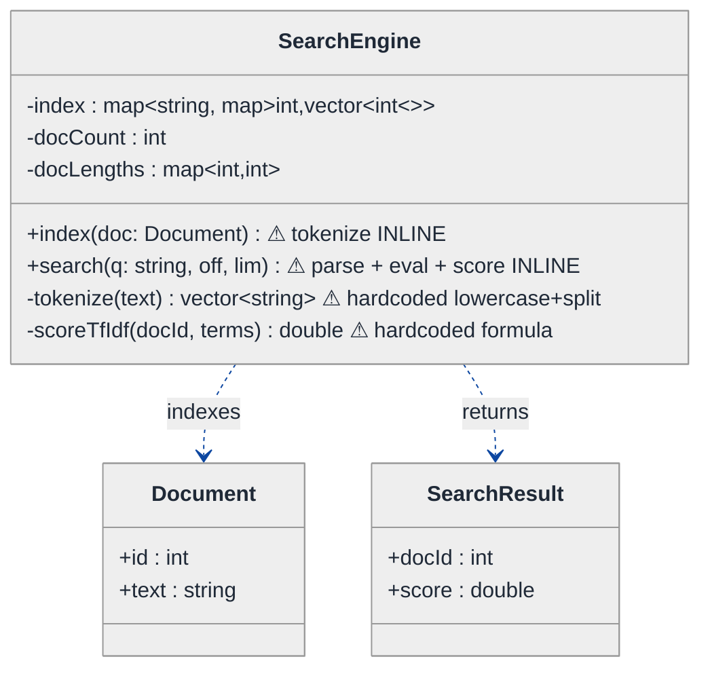
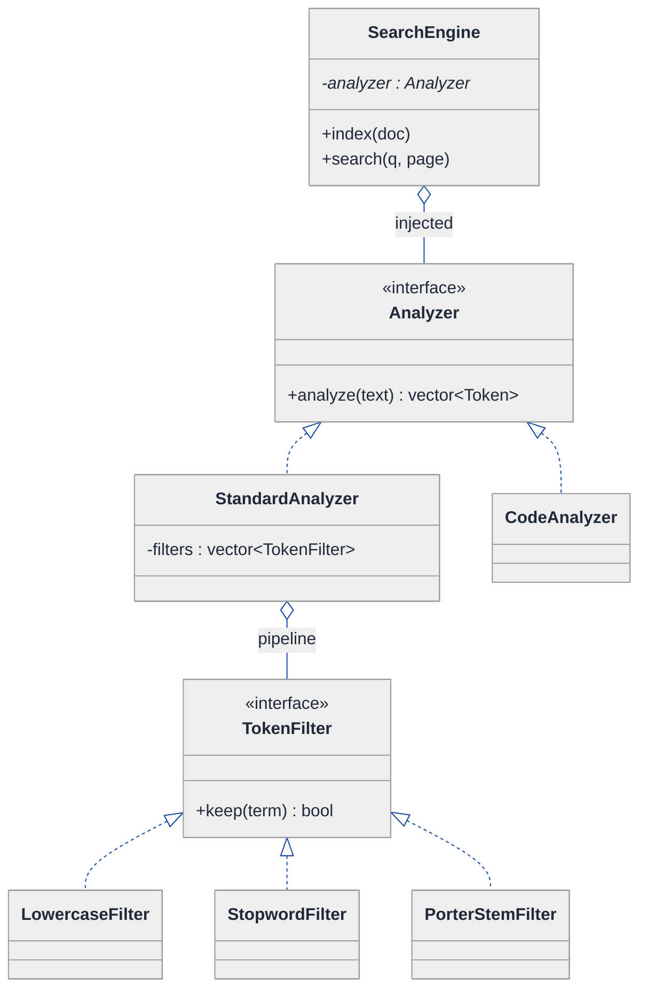
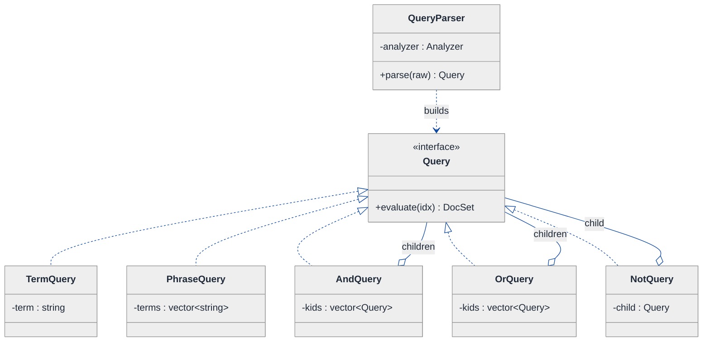
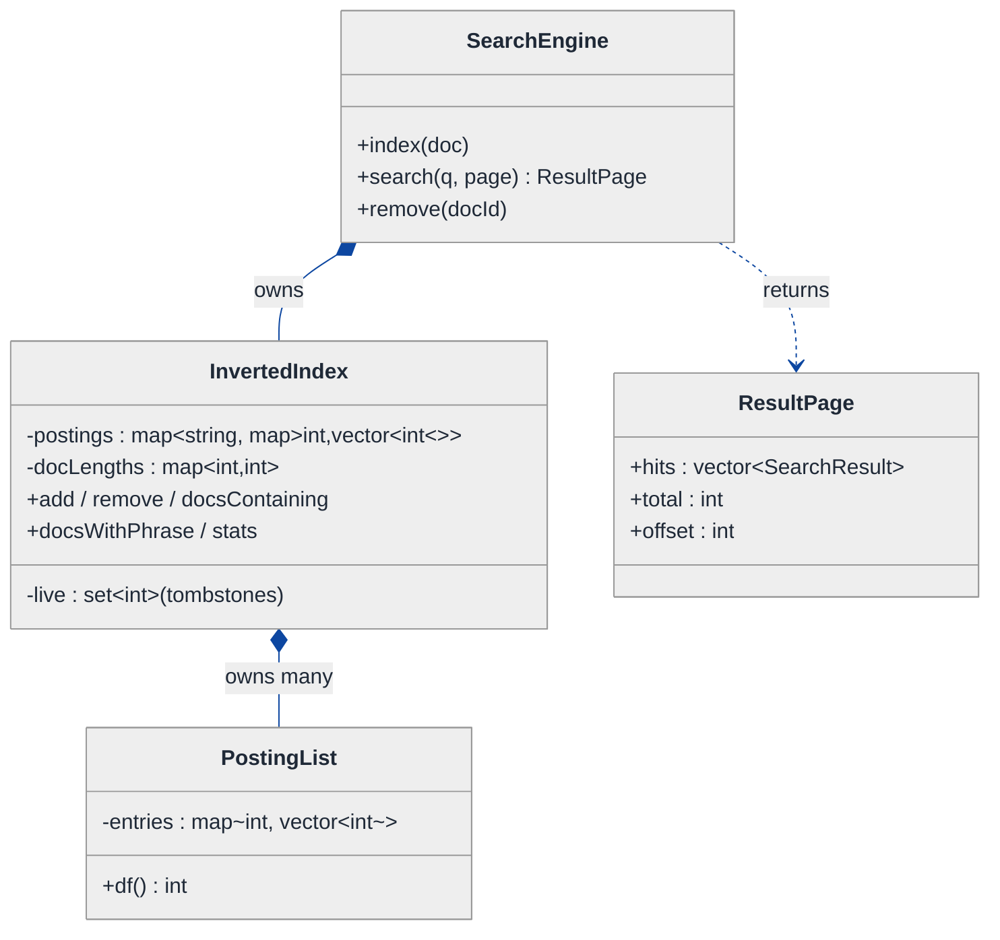
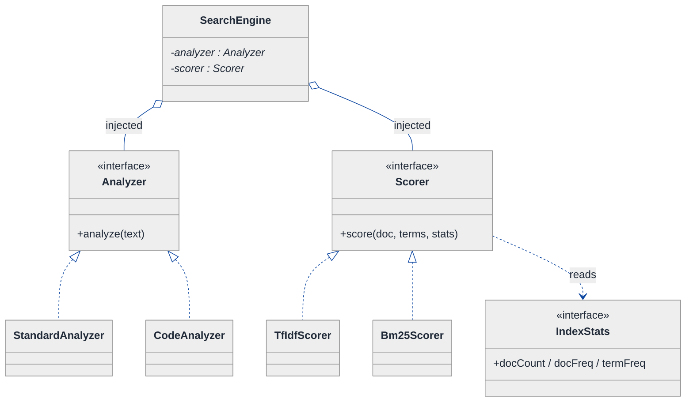
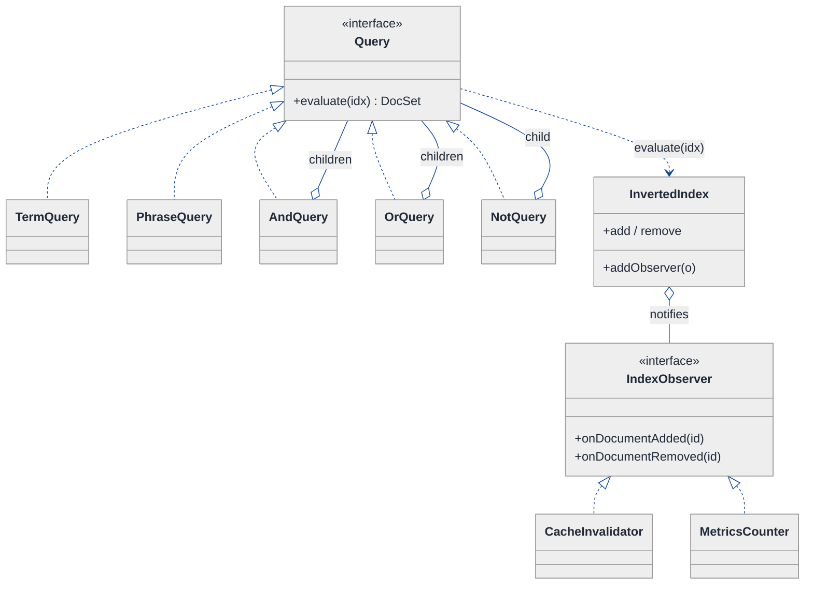
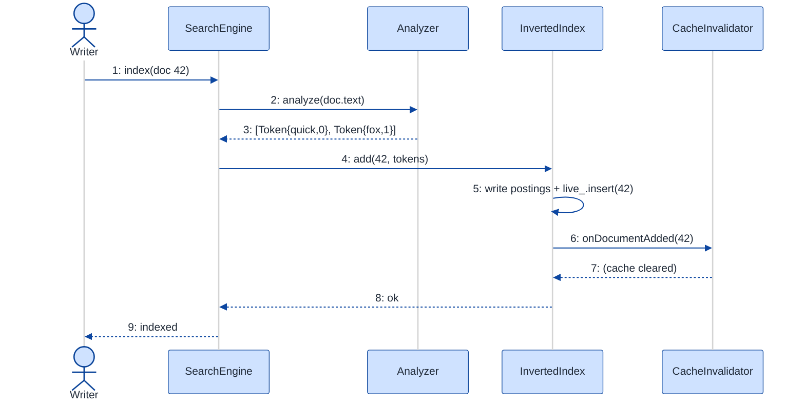

# Search Engine — LLD Walkthrough

> **Difficulty:** Hard · **Time:** ~45 min · **Pattern focus:** Inverted index + TF-IDF, derived via Strategy (analysis + scoring) · Composite + Interpreter (boolean/phrase queries) · Observer (incremental updates)
>
> **Problem source(s):** GID OOD11, bucket `Object_Oriented_Design`. Representative of the "design a search engine / mini-Lucene" family in [`./EXTRACTED_QUESTIONS.md`](./EXTRACTED_QUESTIONS.md).
>
> **Diagrams:** inline mermaid (renders natively in GitHub / VS Code). Light theme + soft pastels per the repo's canonical block.

---

## How to use this file

Paced for a candidate seeing "design a search engine at the class level" for the first time. Reading time: ~45 minutes if you sketch each iteration by hand. **The lesson: the interviewer is NOT asking you to recite the inverted-index data structure. They're asking you to DERIVE a class structure where four things vary independently — how text becomes tokens, how a match is scored, how queries combine, and how the index reacts to new documents — and to keep each axis from contaminating the others.**

Don't reach for design patterns up front. Build the naive design first, watch it break under four hypothetical changes, and reach for ONE pattern per painful axis.

**Map of this file (15 sections):**

1. Problem statement + clarifying questions
2. Plain-English restatement
3. Why this matters
4. Mental model
5. Try it yourself first
6. Entity & verb extraction
7. **Iteration 1: the naive design** — one big `SearchEngine` class with everything inline
8. **Where the naive design hurts** — four future requirements, one painful diff each
9. **Pivot 1: Strategy for text analysis** — the tokenize/normalize axis
10. **Pivot 2: Strategy for scoring** — TF-IDF today, BM25 tomorrow
11. **Pivot 3: Composite + Interpreter for queries; Observer for incremental updates**
12. Final UML class diagram (three sub-views)
13. Skeleton code (C++17)
14. Key flow — sequence diagram
15. Extensibility re-check + anti-patterns + how to think aloud + self-check

---

## 1. Problem statement + clarifying questions

**Prompt (typical phrasing):** "Design a search engine at the class level with inverted index construction, TF-IDF scoring, boolean query support (AND, OR, NOT), phrase queries, and result pagination. Support incremental index updates."

**Clarifying questions to ask BEFORE drawing anything:**

1. **Corpus size & residency?** In-memory index (mini-Lucene, fits in RAM) or do we need on-disk segments and memory-mapped postings? The class shapes differ enormously.
2. **What counts as a "term"?** Do we lowercase? Strip punctuation? Stem (`running` → `run`)? Drop stopwords (`the`, `a`)? Support multiple languages? This is the *analysis* axis and it's the most under-specified part of every search prompt.
3. **Phrase queries — exact adjacency or "within N words"?** Exact phrase (`"machine learning"` = the two terms adjacent in order) needs **positional postings** (term → doc → list of positions). Proximity (`"machine learning"~5`) needs the same data plus a window check. This determines the posting-list shape.
4. **Scoring model now and later?** Pure TF-IDF for v1, but is BM25 or learning-to-rank on the roadmap? If yes, scoring must be swappable, not baked into the ranking loop.
5. **Incremental updates — add only, or add/update/delete?** Deletes are the hard part: do we tombstone (mark deleted, filter at query time) or physically remove from every posting list? And does an "update" = delete + re-add?
6. **Concurrency?** Are reads and writes concurrent (search while indexing) or is indexing a batch phase? Affects whether we need copy-on-write segments or locks.
7. **Pagination contract?** Offset/limit (`page 3, size 10`) or cursor/search-after (stable under concurrent inserts)? Offset is simpler; cursor is what real engines use.
8. **Ranking ties & determinism?** When two docs score equally, do we break ties by docId so results are stable across calls?

**Assumptions if the interviewer dodges:** in-memory index; analysis = lowercase + punctuation-strip + stopword-removal + optional stemming; **positional postings** so we can do exact phrase queries; TF-IDF for v1 but scoring must be swappable; incremental add **and** delete (delete via tombstone + lazy compaction); single-writer / many-reader (we discuss concurrency in §15); offset/limit pagination with docId tie-break.

---

## 2. Plain-English restatement

We're building the engine behind a search box. Feed it documents; it chops each one into terms and records, for every term, which documents contain it and where (the **inverted index**). When a user types a query, we parse it into a tree of AND/OR/NOT/phrase nodes, evaluate that tree against the index to get a set of candidate documents, score each candidate by relevance (TF-IDF), sort, and hand back one page of results. New documents can be folded in without rebuilding everything, and deletes don't corrupt the postings. The design must let us change *how text is tokenized*, *how relevance is scored*, *how queries combine*, and *how the index absorbs updates* — each independently, without rewriting the core search loop.

---

## 3. Why this matters

This is a senior-bar LLD question precisely because the "answer" everyone memorizes — *"use an inverted index, score with TF-IDF"* — is the **data structure**, not the **design**. The interviewer is watching whether you can keep four orthogonal axes of change from collapsing into one 300-line `search()` method. It probes the same muscle as Parking Lot (composition over inheritance, Strategy for swappable algorithms) but adds two new shapes you'll reuse everywhere: a **Composite + Interpreter** tree for the query language, and an **Observer** for incremental index maintenance. If you can derive these, you can design a rules engine, a spreadsheet formula evaluator, or a notification system the same way.

---

## 4. Mental model

A search engine is a **librarian with an index card catalog** plus a **relevance judge** plus a **query interpreter**. The card catalog (inverted index) answers "which books mention this word?" instantly. The judge (scorer) ranks the hits so the best answer floats to the top. The interpreter turns the patron's spoken request ("books about machine *and* learning but *not* gardening") into a sequence of catalog lookups and set operations.

```
Real-world sketch (NOT a UML diagram yet):

   DOCUMENTS                 INVERTED INDEX (the card catalog)
   ┌──────────────┐          ┌───────────────────────────────────────┐
   │ doc1: "the    │  index  │ term       postings (docId : [positions])│
   │   quick fox"  │ ───────►│ "quick" →  d1:[1]                        │
   │ doc2: "quick  │         │ "fox"   →  d1:[2], d2:[3]                │
   │   brown fox"  │         │ "brown" →  d2:[1]                        │
   └──────────────┘         │ "df", doc-count, doc-lengths kept too    │
                            └───────────────────────────────────────┘
                                            │
   QUERY  "quick AND fox"                   ▼
   ┌─────────────┐    parse    ┌────────┐  evaluate   ┌─────────────┐  score+page
   │  raw string │ ──────────► │ AST     │ ──────────► │ candidate    │ ──────────► page of
   │             │             │  AND     │             │  docIds {d1} │             results
   └─────────────┘             │ /    \   │             └─────────────┘
                               │quick  fox│
                               └────────┘
```

The KEY insight from this picture: there are **four independent dials** — *how a document becomes terms* (analysis), *how the index stores them* (postings), *how a parsed query is evaluated* (the AST), and *how a candidate's relevance is judged* (scoring). Naive code welds all four to a single class. Good design gives each its own seam.

---

## 5. Try it yourself first

> **Predict before reading on:**
>
> 1. List 6 nouns you'd promote to a class and 3 you'd leave as fields or library types.
> 2. **If I told you the engine must support stemming for English AND no stemming for code search in the same week, what would change about where tokenization lives?**
> 3. A query is `"distributed (cache OR queue) NOT redis"`. Sketch the tree. What's the leaf type, and what are the internal-node types? How is `evaluate()` the *same* call on every node?
> 4. A document is deleted. Name two strategies for honoring the delete without walking every posting list, and the cost each pushes onto query time.

---

## 6. Entity & verb extraction

> **Mini-refresher: noun → class, but not every noun.**
>
> Naive OOD promotes every noun to a class. Senior OOD promotes a noun only if it has BEHAVIOR and STATE that belong together. "Position" stays an `int`; "PostingList" becomes a class because it owns an invariant (docIds sorted, positions per doc) and the operations that maintain it.

**Nouns from the prompt:**

| Noun | Decision | Why |
|---|---|---|
| SearchEngine | Class (facade / coordinator) | Owns index + analyzer + scorer; exposes `index()` / `search()` |
| Document | Class | Has id, raw text/fields; the unit of indexing |
| InvertedIndex | Class | Owns the term → postings map + corpus stats; maintains invariants |
| PostingList | Class | One term's docId→positions entries; sorted; df derivable |
| Term / token | Field (`std::string`) | No behavior of its own once produced |
| Position / offset | Field (`int`) inside a posting | Pure data |
| Query (the AST) | Class hierarchy (abstract `Query`) | Each node evaluates itself — genuine behavior |
| Scorer | Class (abstract) + concrete TF-IDF/BM25 | The relevance algorithm — swappable |
| Analyzer / tokenizer | Class (abstract) + concrete pipeline | How raw text becomes terms — swappable |
| SearchResult / Hit | Class (small) | docId + score; sortable |
| Page / pagination | Field params (`offset`, `limit`) + a `ResultPage` value object | Mostly data + a slice op |

**Verbs (and the class they live on — naive answer, we'll re-examine):**

| Verb | Owner class (naive — revisited later) |
|---|---|
| index(document) | SearchEngine → InvertedIndex |
| analyze(text) → terms | SearchEngine (inline at first) |
| addPosting(term, doc, pos) | InvertedIndex / PostingList |
| parse(queryString) → Query | SearchEngine (inline at first) |
| evaluate(query) → docIds | SearchEngine (inline at first) |
| score(docId, term, index) | SearchEngine (inline at first) |
| search(queryString, page) | SearchEngine |
| remove(documentId) | InvertedIndex |

**We have NOT introduced any design patterns yet.** Pure nouns + verbs. Note how many verbs the naive design wants to cram onto `SearchEngine` — that crowding is exactly the smell §8 will expose.

---

## 7. <a id="iter-1"></a>Iteration 1: the naive design

The simplest thing that could possibly work: one `SearchEngine` class that tokenizes inline, stores postings in a map, parses a flat AND-only query, scores with hardcoded TF-IDF, and slices a page. No design patterns.



**Reader's tour (top to bottom; ~60 seconds).**

1. **`SearchEngine` is a god object.** It holds the raw index (`map<term, map<docId, positions>>`), the corpus stats (`docCount`, `docLengths`), AND every verb: tokenize, parse, evaluate, score, paginate. There are no collaborators except dumb data bags.

2. **`Document` and `SearchResult` are anemic.** Pure data. That's fine for `SearchResult` (it really is just docId+score) but it tells you all the *behavior* has pooled into one class.

3. **The four warning markers (⚠) are the future-pain entry points.** `tokenize()` hardcodes "lowercase and split on whitespace." `search()` inlines query parsing (AND-only), evaluation, scoring, and paging in one method. `scoreTfIdf()` bakes the TF-IDF formula into a private method. Each ⚠ is an axis the design refuses to acknowledge as variable.

**What's deliberately missing.** No `Analyzer`. No `Scorer`. No `Query` AST. No `Index` abstraction with an update protocol. The naive design pretends text-analysis, scoring, query-structure, and update-handling are all constants. §8 turns each into a concrete future requirement.

Skeleton code for the naive design (C++17):

```cpp
#include <algorithm>
#include <cctype>
#include <cmath>
#include <map>
#include <sstream>
#include <string>
#include <unordered_map>
#include <vector>

struct Document { int id; std::string text; };
struct SearchResult { int docId; double score; };

class SearchEngine {
public:
    // index a document — tokenization is INLINE and hardcoded
    void index(const Document& doc) {
        auto terms = tokenize(doc.text);                 // ⚠ fixed pipeline
        docLengths_[doc.id] = static_cast<int>(terms.size());
        ++docCount_;
        for (int pos = 0; pos < (int)terms.size(); ++pos)
            index_[terms[pos]][doc.id].push_back(pos);
    }

    // search — parse + evaluate + score + paginate ALL INLINE
    std::vector<SearchResult> search(const std::string& q, int offset, int limit) {
        auto terms = tokenize(q);                        // ⚠ AND-only: split into terms
        // intersect posting lists (AND) — boolean logic hardcoded
        std::map<int, bool> candidate;                   // docId -> present
        bool first = true;
        for (const auto& t : terms) {
            std::map<int, bool> here;
            auto it = index_.find(t);
            if (it != index_.end())
                for (const auto& [docId, _] : it->second) here[docId] = true;
            if (first) { candidate = here; first = false; }
            else {                                        // ⚠ intersection inline
                std::map<int, bool> next;
                for (const auto& [d, _] : candidate) if (here.count(d)) next[d] = true;
                candidate = next;
            }
        }
        // score each candidate with hardcoded TF-IDF
        std::vector<SearchResult> hits;
        for (const auto& [docId, _] : candidate)
            hits.push_back({ docId, scoreTfIdf(docId, terms) });   // ⚠ fixed scorer
        std::sort(hits.begin(), hits.end(),
                  [](auto& a, auto& b){ return a.score > b.score; });
        // paginate inline
        std::vector<SearchResult> page;
        for (int i = offset; i < (int)hits.size() && i < offset + limit; ++i)
            page.push_back(hits[i]);
        return page;
    }

private:
    std::vector<std::string> tokenize(const std::string& text) {   // ⚠ hardcoded
        std::vector<std::string> out; std::string w; std::istringstream ss(text);
        while (ss >> w) {
            std::string lower;
            for (char c : w) if (std::isalnum((unsigned char)c)) lower += std::tolower(c);
            if (!lower.empty()) out.push_back(lower);
        }
        return out;
    }
    double scoreTfIdf(int docId, const std::vector<std::string>& terms) const {  // ⚠ fixed
        double score = 0.0;
        for (const auto& t : terms) {
            auto it = index_.find(t);
            if (it == index_.end()) continue;
            auto dit = it->second.find(docId);
            if (dit == it->second.end()) continue;
            double tf  = (double)dit->second.size() / docLengths_.at(docId);
            double idf = std::log((double)docCount_ / it->second.size());
            score += tf * idf;
        }
        return score;
    }

    std::map<std::string, std::map<int, std::vector<int>>> index_;  // term -> doc -> positions
    std::unordered_map<int, int> docLengths_;
    int docCount_ = 0;
};
```

**This works.** It builds an inverted index with positions, supports AND queries, scores with TF-IDF, paginates. Zero design patterns. So what's wrong with it?

---

## 8. <a id="naive-pain"></a>Where the naive design hurts

The interviewer slides four requirements across the desk: "Here's next quarter. Walk me through what changes."

### Change A: "Add English stemming + a stopword list; but code-search corpora must NOT stem"

In the naive design:
- `tokenize()` (in `SearchEngine`) is a single hardcoded method. Adding stemming means editing it. Making stemming *conditional per corpus* means adding an `if (mode == CODE)` branch — and now `tokenize` has a mode parameter threaded from `index()` and `search()` both, because **query terms must be analyzed the SAME way as document terms** or matches silently fail.
- **Files/lines touched:** `SearchEngine::tokenize` (rewrite), `SearchEngine::index` (pass mode), `SearchEngine::search` (pass mode). The smell: *one method is the union of every analysis variant, and the variant leaks into two call sites.*

### Change B: "Switch scoring from TF-IDF to BM25 for one tenant, keep TF-IDF for another"

In the naive design:
- `scoreTfIdf()` is a private method with the formula inlined. BM25 has different math (saturating TF, doc-length normalization with `b`/`k1` params). You either add `scoreBm25()` and an `if` in `search()` to pick, or you parameterize the one method into spaghetti.
- **Files/lines touched:** new `scoreBm25` method + a branch inside `search`. The smell: *the ranking loop in `search()` is hard-wired to one formula; every new model is surgery in the hottest method.*

### Change C: "Support full boolean queries — `a AND (b OR c) NOT d` — and exact phrase `\"machine learning\"`"

In the naive design:
- `search()` assumes a flat list of AND-ed terms. Nested precedence (`b OR c` grouped) and `NOT` (set difference against the full corpus) and phrases (positional adjacency check) have **no representation at all** — there's no tree, just a `vector<string>`.
- You'd bolt on a recursive-descent parser AND a recursive evaluator AND a special phrase path, all inside or beside `search()`.
- **Files/lines touched:** `search()` balloons from ~25 lines to ~150; you add parsing state, an operator stack, precedence handling, and a positional-adjacency loop. The smell: *the query language is a tree, but the code models it as a list — the entire structure is missing.*

### Change D: "Incremental updates — documents get edited and deleted live; a stale-doc counter must update; an external cache must be invalidated on every change"

In the naive design:
- There's no `remove()`. Deleting means walking EVERY posting list to erase the docId — O(unique terms in corpus). An "update" = delete + re-add.
- And nothing is notified: the `docCount_` used by IDF goes stale on delete, and any external consumer (a results cache, a metrics counter, a replica) has no hook. You'd hardcode `cache.invalidate()` and `metrics.dec()` calls directly inside `index()` and a new `remove()`, coupling the engine to every consumer.
- **Files/lines touched:** new `remove()`, edits to `index()`, plus hardcoded calls to each external consumer. The smell: *the engine knows the identity of everyone who cares about a change — adding a consumer edits the engine.*

### The pattern of pain

| Change | Files touched | Smell |
|---|---|---|
| A. Stemming / per-corpus analysis | `tokenize` + `index` + `search` | "One method is every analysis variant; it leaks to two call sites." |
| B. BM25 alongside TF-IDF | `scoreTfIdf` + branch in `search` | "Ranking loop hard-wired to one formula." |
| C. Boolean + phrase queries | `search` balloons to ~150 lines | "Query is a tree; code models it as a flat list." |
| D. Incremental update + notify | new `remove` + edits to `index` + hardcoded consumer calls | "Engine knows every consumer by name; adding one edits the engine." |

**Three axes of pain dominate:** *algorithm variability* (analysis pipeline, scoring formula) — both "an algorithm the caller/config picks"; *recursive structure* (the query is a tree of operations, uniformly evaluated); and *change propagation* (the index has observers that must react to mutations without the index knowing them).

> **Pivot question:** "What pattern swaps a whole algorithm chosen by config (analysis, scoring)? What pattern models a *uniformly-evaluated tree* of operations (the query)? What pattern lets an object broadcast 'I changed' to consumers it doesn't know by name (incremental updates)?"
>
> The answers are **Strategy**, **Composite + Interpreter**, and **Observer**. We introduce them one painful axis at a time, starting with the analysis pipeline — because it's the one bug-magnet that *silently breaks correctness* (query terms analyzed differently from document terms = zero matches).

---

## 9. <a id="pivot-1"></a>Pivot 1: Strategy for text analysis

The most insidious pain from §8 is Change A: tokenization is hardcoded AND duplicated across indexing and querying. If the two paths ever diverge, search returns nothing and there's no exception to catch it. We need **one** analysis pipeline, swappable by configuration, used by both paths.

> **Mini-refresher: Strategy pattern.**
>
> Encapsulates an algorithm behind an interface so it can be swapped at runtime. The CALLER (here, config) decides which strategy to use; the strategy doesn't know about its peers. Quick example: a `Sorter` takes a `CompareStrategy*`; pass `Ascending` or `Descending` — the sorter doesn't care.

**Why Strategy fits analysis.** "Turn raw text into a list of terms" is an algorithm. It varies (lowercase-only, +stemming, +stopwords, code-mode no-stem, language-specific). The variant is picked by the engine's config, not by the text itself. Textbook Strategy. And because real analysis is a *pipeline* (lowercase → strip → stopword → stem), we let the concrete analyzer compose a chain of `TokenFilter`s — a small internal Strategy list.

**The refactor (just the analysis slice):**

```cpp
// A single token-with-position; analysis preserves position for phrase queries.
struct Token { std::string term; int position; };

class Analyzer {
public:
    virtual ~Analyzer() = default;
    // SAME method used by index() AND by query parsing — guarantees symmetry.
    virtual std::vector<Token> analyze(const std::string& text) const = 0;
};

// One reusable filter step in the pipeline (a mini-Strategy).
class TokenFilter {
public:
    virtual ~TokenFilter() = default;
    virtual bool keep(std::string& term) const = 0;   // mutate + decide to keep
};

class LowercaseFilter : public TokenFilter {
public:
    bool keep(std::string& term) const override {
        for (char& c : term) c = std::tolower((unsigned char)c);
        return !term.empty();
    }
};
class StopwordFilter : public TokenFilter {
public:
    explicit StopwordFilter(std::unordered_set<std::string> stop) : stop_(std::move(stop)) {}
    bool keep(std::string& term) const override { return !stop_.count(term); }
private:
    std::unordered_set<std::string> stop_;
};
// PorterStemFilter, EdgeNgramFilter, ... elided

// The standard analyzer: split on non-alnum, then run the filter chain.
class StandardAnalyzer : public Analyzer {
public:
    explicit StandardAnalyzer(std::vector<std::unique_ptr<TokenFilter>> filters)
        : filters_(std::move(filters)) {}
    std::vector<Token> analyze(const std::string& text) const override {
        std::vector<Token> out; std::string buf; int pos = 0;
        auto flush = [&]{
            if (buf.empty()) return;
            std::string t = buf; buf.clear();
            for (const auto& f : filters_) if (!f->keep(t)) return;  // dropped
            out.push_back({ t, pos++ });
        };
        for (char c : text) { if (std::isalnum((unsigned char)c)) buf += c; else flush(); }
        flush();
        return out;
    }
private:
    std::vector<std::unique_ptr<TokenFilter>> filters_;
};
// CodeAnalyzer (no stemming, keeps case for identifiers) elided
```

`SearchEngine` now holds `std::unique_ptr<Analyzer> analyzer_` and calls `analyzer_->analyze(...)` from BOTH `index()` and query parsing. The duplicated `tokenize()` is gone; symmetry is structural, not a comment.

**What changed — visualized.** Just the analysis slice:



**Tour of the after-state.**

1. **`SearchEngine` gained one field** — `analyzer` (open diamond = aggregation, injected at construction). The engine no longer *knows how* to tokenize; it knows *whom to ask*.
2. **`Analyzer` interface, one method** — `analyze(text) → vector<Token>`. Note it returns `Token` (term + position), not bare strings, so phrase queries get the positional data they need downstream.
3. **`StandardAnalyzer` composes a `TokenFilter` pipeline** — itself a list of mini-strategies. Adding stemming = add `PorterStemFilter` to the chain. No edit to `StandardAnalyzer`'s code.
4. **`CodeAnalyzer` is a sibling** — a different concrete analyzer for code corpora (case-preserving, no stemming). Change A's "code-search must NOT stem" is now a *different injected analyzer*, not an `if` branch.
5. **Symmetry is enforced by construction:** both `index()` and the query parser call `analyzer_->analyze(...)`. There is no second tokenizer to drift out of sync.

**Change A now lands cleanly.** Per-corpus analysis = inject a different `Analyzer`. New filter = one new `TokenFilter` class added to a pipeline. No surgery in the engine.

**Pattern-discrimination cheatsheet — Strategy vs Template Method.**
- *Strategy:* whole algorithm in one swappable object, chosen at runtime via composition.
- *Template Method:* algorithm skeleton in a base class; subclasses fill hooks via inheritance.
- *Rule of thumb:* variants that **compose or swap at runtime** → Strategy. Fixed skeleton with 2-3 stable variants → Template Method.

We chose Strategy because analysis pipelines *compose* (lowercase → stopword → stem stacked, reordered per corpus) and the whole pipeline swaps by config — you can't compose Template Method subclasses.

---

## 10. <a id="pivot-2"></a>Pivot 2: Strategy for scoring

Change B is still painful: the TF-IDF formula is welded into `search()`'s ranking loop, and BM25 needs to coexist per-tenant. The *variability is the algorithm itself*, chosen by config. Same shape as analysis — another Strategy.

> **Mini-refresher: why a second Strategy hierarchy doesn't share the analyzer's interface.**
>
> Strategy is a *role*, not a type. `Analyzer` (text → tokens) and `Scorer` (a candidate doc + index stats → a number) have nothing in common at the type level. Don't unify them under one generic `Strategy<T>` — that's premature genericism. Two roles, two interfaces.

**Why Strategy fits scoring.** Scoring is "given a candidate document, the matched query terms, and corpus statistics, return a relevance number." TF-IDF, BM25, and learning-to-rank are interchangeable implementations of that one contract, selected by tenant config. The ranking loop should depend only on the contract.

**The refactor (just the scoring slice):**

```cpp
// Read-only stats the scorer needs — the index exposes these, scorer stays decoupled.
class IndexStats {
public:
    virtual ~IndexStats() = default;
    virtual int    docCount() const = 0;                 // N (live docs)
    virtual int    docFreq(const std::string& term) const = 0;   // df: docs containing term
    virtual int    termFreq(const std::string& term, int docId) const = 0; // tf in doc
    virtual int    docLength(int docId) const = 0;
    virtual double avgDocLength() const = 0;
};

class Scorer {
public:
    virtual ~Scorer() = default;
    virtual double score(int docId,
                         const std::vector<std::string>& queryTerms,
                         const IndexStats& stats) const = 0;
};

class TfIdfScorer : public Scorer {
public:
    double score(int docId, const std::vector<std::string>& terms,
                 const IndexStats& stats) const override {
        double s = 0.0;
        for (const auto& t : terms) {
            int df = stats.docFreq(t);
            if (df == 0) continue;
            double tf  = (double)stats.termFreq(t, docId) / stats.docLength(docId);
            double idf = std::log((double)stats.docCount() / df);
            s += tf * idf;
        }
        return s;
    }
};

class Bm25Scorer : public Scorer {
public:
    Bm25Scorer(double k1 = 1.2, double b = 0.75) : k1_(k1), b_(b) {}
    double score(int docId, const std::vector<std::string>& terms,
                 const IndexStats& stats) const override {
        double s = 0.0, N = stats.docCount(), avg = stats.avgDocLength();
        for (const auto& t : terms) {
            int df = stats.docFreq(t); if (df == 0) continue;
            double idf = std::log(1.0 + (N - df + 0.5) / (df + 0.5));
            double f   = stats.termFreq(t, docId);
            double norm = f * (k1_ + 1) /
                          (f + k1_ * (1 - b_ + b_ * stats.docLength(docId) / avg));
            s += idf * norm;
        }
        return s;
    }
private:
    double k1_, b_;
};
// LearningToRankScorer elided
```

`SearchEngine` holds `std::unique_ptr<Scorer> scorer_`; the ranking loop calls `scorer_->score(docId, terms, index_)` and knows nothing about TF vs IDF vs `k1`. The diagram is the same shape as Pivot 1's — `SearchEngine o-- Scorer`, with `TfIdfScorer` / `Bm25Scorer` / `LearningToRankScorer` implementing the interface — so we don't redraw it; see the consolidated policy view in [§12.2](#fig-class-diagram).

**Change B now lands cleanly.** Per-tenant scoring = inject `TfIdfScorer` or `Bm25Scorer`. New model = one new `Scorer` class. The ranking loop never changes.

> **Mini-refresher: Open/Closed Principle (the "O" in SOLID).**
>
> Software entities should be **open for extension, closed for modification.** After Pivots 1 and 2, adding an analysis variant or a scoring model *extends* the system (a new class) without *modifying* the engine. The naive design violated OCP on both axes — every variant edited `tokenize()` or `search()`.

**Pattern-discrimination cheatsheet — Strategy vs State.**
- *Strategy:* the CALLER/config picks which algorithm; strategies are unaware of each other.
- *State:* the OBJECT picks its next state internally via transitions; states know each other.
- *Rule of thumb:* swap because external config says so → Strategy. Swap because of an internal event flow → State.

Scoring and analysis are Strategy: nothing about a document or query *transitions* the engine into "BM25 mode." Config sets it once. (Contrast with Parking Lot's Ticket, which *is* a State machine.)

---

## 11. <a id="pivot-3"></a>Pivot 3: Composite + Interpreter for queries; Observer for incremental updates

Two pains remain: the **query structure** (Change C) and **incremental updates with notification** (Change D). They're different shapes, so two patterns.

### 11a. The query is a tree — Composite + Interpreter

Change C asks for `a AND (b OR c) NOT d` and `"machine learning"`. That's not a list — it's a tree where every node, leaf or branch, answers the same question: *"which docIds do you match?"* When every element of a part-whole hierarchy responds to a uniform operation, that's the **Composite** pattern; when each node *evaluates itself* against a context (the index), that's the **Interpreter** pattern. They co-occur naturally here.

> **Mini-refresher: Composite pattern.**
>
> Compose objects into tree structures, then treat individual objects (leaves) and compositions (branches) **uniformly** through one interface. Quick example: a `FileSystemNode` with `size()` — a `File` returns its bytes, a `Folder` sums its children's `size()`. The caller doesn't branch on type.

> **Mini-refresher: Interpreter pattern.**
>
> Represent a grammar's sentences as an abstract syntax tree (AST) of node objects, each with an `interpret(context)` method that evaluates itself. The query language IS a little grammar; each node type is a production rule.

**Why these fit queries.** Boolean queries have part-whole structure (an `AND` *contains* sub-queries) and a uniform operation (`evaluate(index) → set of docIds`). A `TermQuery` is a leaf (look up one posting list); `And`/`Or`/`Not` are composites that combine children's results with set intersection/union/difference; `PhraseQuery` is a leaf that needs the positional postings to verify adjacency. One interface, recursive evaluation.

```cpp
using DocSet = std::set<int>;   // sorted docIds; swap for a roaring bitmap at scale

class Query {                    // the Composite + Interpreter node interface
public:
    virtual ~Query() = default;
    virtual DocSet evaluate(const InvertedIndex& idx) const = 0;
};

class TermQuery : public Query {            // LEAF
public:
    explicit TermQuery(std::string term) : term_(std::move(term)) {}
    DocSet evaluate(const InvertedIndex& idx) const override {
        return idx.docsContaining(term_);   // one posting-list lookup
    }
private:
    std::string term_;
};

class PhraseQuery : public Query {          // LEAF — needs positions
public:
    explicit PhraseQuery(std::vector<std::string> terms) : terms_(std::move(terms)) {}
    DocSet evaluate(const InvertedIndex& idx) const override {
        return idx.docsWithPhrase(terms_);  // positional adjacency check inside index
    }
private:
    std::vector<std::string> terms_;
};

class AndQuery : public Query {             // COMPOSITE
public:
    AndQuery(std::vector<std::unique_ptr<Query>> kids) : kids_(std::move(kids)) {}
    DocSet evaluate(const InvertedIndex& idx) const override {
        DocSet acc; bool first = true;
        for (const auto& k : kids_) {
            DocSet r = k->evaluate(idx);    // recurse — uniform call
            if (first) { acc = std::move(r); first = false; }
            else {
                DocSet next;
                std::set_intersection(acc.begin(), acc.end(), r.begin(), r.end(),
                                      std::inserter(next, next.begin()));
                acc = std::move(next);
            }
        }
        return acc;
    }
private:
    std::vector<std::unique_ptr<Query>> kids_;
};
// OrQuery (set_union of children) and NotQuery (allDocs minus child) elided — same shape

// A QueryParser (recursive-descent, honoring AND>OR precedence + parentheses + quotes)
// builds this tree from a string. It uses the SAME Analyzer as indexing for each term.
class QueryParser {
public:
    explicit QueryParser(const Analyzer& a) : analyzer_(a) {}
    std::unique_ptr<Query> parse(const std::string& raw) const; // elided
private:
    const Analyzer& analyzer_;
};
```

**What changed — visualized.** The query slice:



**Tour of the query slice.**

1. **One interface, `Query::evaluate(idx) → DocSet`.** Every node — leaf or branch — answers the same question. The caller (`SearchEngine::search`) calls `root->evaluate(index)` once and gets back the candidate docIds, with zero knowledge of the tree's shape.
2. **Leaves do lookups.** `TermQuery` reads one posting list. `PhraseQuery` reads several and asks the index to verify adjacency via positions (the reason Pivot 1's `Token` carried a `position`).
3. **Composites combine children.** `AndQuery` intersects, `OrQuery` unions, `NotQuery` subtracts from the live-doc universe. The recursion in `AndQuery::evaluate` calling `k->evaluate(idx)` is the Composite's defining move — a branch delegates to children through the same interface.
4. **`QueryParser` builds the tree** and crucially uses the SAME `Analyzer` (from Pivot 1) to analyze each term, so `"Running"` in a query matches `running` in a doc. Parsing and matching share the analysis seam.
5. **Change C now lands cleanly.** A new operator (e.g., `PrefixQuery` for `mach*`, or `ProximityQuery` for `"a b"~5`) = one new `Query` subclass. `search()` never changes.

**Pattern-discrimination cheatsheet — Composite vs Decorator.**
- *Composite:* a tree of *many* children under one node; the operation aggregates children (AND intersects N kids).
- *Decorator:* a chain wrapping *one* inner object, adding behavior (e.g., a `CachingQuery` wrapping any `Query` to memoize its result set).
- *Rule of thumb:* "has a list of children, combines them" → Composite. "wraps exactly one and augments it" → Decorator. `NotQuery` (one child) looks decorator-ish but it *transforms* meaning rather than augmenting, so it stays a Composite-family node.

### 11b. The index has consumers — Observer

Change D wants live updates plus notifications to consumers the index shouldn't know about (a results cache to invalidate, a metrics counter, a replica). Hardcoding `cache.invalidate()` inside `InvertedIndex::remove()` couples the index to every consumer. The variability is *who reacts to a change*. That's **Observer**.

> **Mini-refresher: Observer pattern.**
>
> A *subject* maintains a list of *observers* and notifies them when its state changes, without knowing their concrete types. Observers register themselves. Quick example: a spreadsheet cell (subject) notifies dependent cells (observers) when its value changes; the cell doesn't know who depends on it.

**Why Observer fits incremental updates.** When a document is added/removed, the index's state (postings, `docCount`, `avgDocLength`) changes. Several parties care, and the set of parties is open-ended. The index should announce "doc 42 added / removed" and let registered observers react. Deletes themselves use a **tombstone**: mark the docId deleted in a `liveDocs` set, filter it out of every `DocSet` at query time, and let a background compaction physically purge it later — so a delete is O(1), not O(corpus).

```cpp
class IndexObserver {
public:
    virtual ~IndexObserver() = default;
    virtual void onDocumentAdded(int docId)   = 0;
    virtual void onDocumentRemoved(int docId) = 0;
};

class CacheInvalidator : public IndexObserver {
public:
    void onDocumentAdded(int docId) override   { /* cache_.clear(); */ }
    void onDocumentRemoved(int docId) override { /* cache_.clear(); */ }
};
// MetricsCounter, ReplicaForwarder elided

class InvertedIndex {                      // the SUBJECT
public:
    void addObserver(IndexObserver* o) { observers_.push_back(o); }  // weak, non-owning

    void add(int docId, const std::vector<Token>& tokens) {
        for (const auto& tk : tokens) postings_[tk.term][docId].push_back(tk.position);
        docLengths_[docId] = (int)tokens.size();
        live_.insert(docId);
        notifyAdded(docId);                // broadcast — index doesn't know consumers
    }
    void remove(int docId) {               // tombstone: O(1), lazy physical purge
        live_.erase(docId);
        notifyRemoved(docId);
    }
    DocSet docsContaining(const std::string& term) const {
        DocSet out;
        if (auto it = postings_.find(term); it != postings_.end())
            for (const auto& [d, _] : it->second) if (live_.count(d)) out.insert(d);
        return out;                         // tombstoned docs filtered here
    }
    // docsWithPhrase(...), IndexStats accessors (docCount = live_.size(), etc.) elided
private:
    void notifyAdded(int id)   { for (auto* o : observers_) o->onDocumentAdded(id); }
    void notifyRemoved(int id) { for (auto* o : observers_) o->onDocumentRemoved(id); }

    std::unordered_map<std::string, std::map<int, std::vector<int>>> postings_;
    std::unordered_map<int, int> docLengths_;
    std::set<int>          live_;          // tombstone set: only these docIds count
    std::vector<IndexObserver*> observers_;
};
```

**Tour of the update slice.**

1. **`InvertedIndex` is the Subject** holding a `vector<IndexObserver*>` (raw, non-owning pointers — observers outlive notifications; for shared lifetimes you'd use `weak_ptr`).
2. **`add`/`remove` mutate then `notify`.** The index broadcasts to a list it doesn't understand. Adding a `ReplicaForwarder` observer = one new class + one `addObserver` call at wiring time; the index code is untouched.
3. **Delete is a tombstone.** `remove()` just erases from `live_` — O(1). Every `DocSet`-producing path filters by `live_`. A separate compaction pass (elided) reclaims space later. This is the standard answer to "delete without walking every posting list."
4. **`docCount`/`avgDocLength` derive from `live_`**, so IDF stays correct after deletes — fixing the stale-counter half of Change D for free.

**Change D now lands cleanly.** New consumer = new `IndexObserver`. Delete = O(1) tombstone. Stats stay consistent.

**Pattern-discrimination cheatsheet — Observer vs Mediator.**
- *Observer:* one subject → many listeners; listeners don't talk back to each other; broadcast is one-directional.
- *Mediator:* a hub coordinating *bidirectional* many-to-many interactions among colleagues.
- *Rule of thumb:* "X changed, tell everyone who cares" → Observer. "these N components must coordinate through one broker" → Mediator. Index updates are one-way broadcasts → Observer.

---

## 12. <a id="fig-class-diagram"></a>Final class diagram

One diagram would be a wall of boxes. Here are **three focused sub-views**; the structural insight at the end ties them together.

### 12.1 The data spine — what the engine OWNS



**Tour of 12.1.** `SearchEngine` is the facade; it OWNS one `InvertedIndex` (filled diamond = composition, same lifetime). The index OWNS many `PostingList`s (one per term) — that's where positions and `df` live. `ResultPage` is the value object `search()` returns: a slice of hits plus the total count (for "showing 21–30 of 412") and the offset, the pagination contract from §1. Data only; behavior lives in the policy and query views next.

### 12.2 The policy injection — what the engine USES (Strategy axes)



**Tour of 12.2.** Two injected Strategy interfaces (open diamonds = aggregation), one per algorithmic axis. `Analyzer` decides text → tokens (and `StandardAnalyzer` further composes a `TokenFilter` pipeline, shown in §9). `Scorer` decides relevance and reads corpus stats through the `IndexStats` interface — so the scorer depends on a narrow read-only contract, NOT on the concrete `InvertedIndex` (Dependency Inversion). Adding BM25 or a code analyzer is a new leaf class; the engine's `search()` loop is closed to modification.

> **Mini-refresher: Dependency Inversion Principle (the "D" in SOLID).**
>
> High-level modules and low-level modules should both depend on **abstractions**, not on each other directly. Here `Scorer` depends on the `IndexStats` *interface*, not on `InvertedIndex`. You can unit-test `Bm25Scorer` with a fake `IndexStats` and never construct a real index.

### 12.3 The query tree + the update fan-out — Composite/Interpreter + Observer



**Tour of 12.3.** Left: the `Query` Composite/Interpreter tree — leaves (`TermQuery`, `PhraseQuery`) and branches (`And`/`Or`/`Not`) all expose `evaluate(idx)`; branches hold child `Query` pointers (aggregation) and recurse. Right: the Observer fan-out — `InvertedIndex` is the subject; `CacheInvalidator`/`MetricsCounter` are observers it notifies on add/remove without knowing their types. The single dependency arrow `Query ..> InvertedIndex` is the seam between the two halves: the query tree reads the index; the observers react to index mutations. Read-path and write-path, cleanly separated.

### Structural insight (ties 12.1 + 12.2 + 12.3 together)

| Concern | Pattern used | Why |
|---|---|---|
| **Data** (index, postings, page) | Plain ownership / composition | Postings are an invariant-bearing data structure, not a behavior axis |
| **Analysis** (text → tokens) | Strategy, INJECTED | Config picks the pipeline; filters compose; query + index share it |
| **Scoring** (TF-IDF / BM25) | Strategy, INJECTED + reads `IndexStats` | Config picks the formula; ranking loop depends only on the contract |
| **Query** (AND/OR/NOT/phrase) | Composite + Interpreter | Query is a tree; every node `evaluate`s itself uniformly |
| **Incremental update** | Observer + tombstone | Open-ended consumers react to changes; deletes are O(1) lazy |

The big lesson: **inheritance is used only for the Strategy/Composite/Observer class families** — every "varies independently" axis became composition over an interface. *Inheritance for the role hierarchy, composition for wiring them together.* The inverted index and TF-IDF the interviewer asked about are the *data and one scorer* — the design's value is the four seams that keep them from welding into one method.

---

## 13. Skeleton code (C++17)

> Show the SHAPES, not the full impl. Concrete bodies elided where a sibling already showed the pattern. ~140 lines.

```cpp
#include <algorithm>
#include <cmath>
#include <map>
#include <memory>
#include <set>
#include <string>
#include <unordered_map>
#include <unordered_set>
#include <vector>

// ── Forward declarations ────────────────────────────────────────────
class InvertedIndex;

// ── Value objects ───────────────────────────────────────────────────
struct Token        { std::string term; int position; };
struct Document     { int id; std::string text; };
struct SearchResult { int docId; double score; };
struct ResultPage   { std::vector<SearchResult> hits; int total; int offset; };
using  DocSet = std::set<int>;

// ── Strategy axis 1: analysis (text → tokens) ───────────────────────
class TokenFilter {
public:
    virtual ~TokenFilter() = default;
    virtual bool keep(std::string& term) const = 0;     // mutate + decide
};
class LowercaseFilter : public TokenFilter {
public:
    bool keep(std::string& t) const override {
        for (char& c : t) c = std::tolower((unsigned char)c); return !t.empty();
    }
};
// StopwordFilter, PorterStemFilter elided — same shape

class Analyzer {
public:
    virtual ~Analyzer() = default;
    virtual std::vector<Token> analyze(const std::string& text) const = 0;
};
class StandardAnalyzer : public Analyzer {
public:
    explicit StandardAnalyzer(std::vector<std::unique_ptr<TokenFilter>> f)
        : filters_(std::move(f)) {}
    std::vector<Token> analyze(const std::string& text) const override; // see §9
private:
    std::vector<std::unique_ptr<TokenFilter>> filters_;
};
// CodeAnalyzer elided

// ── Strategy axis 2: scoring (reads a narrow stats interface) ───────
class IndexStats {
public:
    virtual ~IndexStats() = default;
    virtual int    docCount() const = 0;
    virtual int    docFreq(const std::string& term) const = 0;
    virtual int    termFreq(const std::string& term, int docId) const = 0;
    virtual int    docLength(int docId) const = 0;
    virtual double avgDocLength() const = 0;
};
class Scorer {
public:
    virtual ~Scorer() = default;
    virtual double score(int docId, const std::vector<std::string>& terms,
                         const IndexStats& stats) const = 0;
};
class TfIdfScorer : public Scorer {
public:
    double score(int docId, const std::vector<std::string>& terms,
                 const IndexStats& stats) const override;   // see §10
};
// Bm25Scorer elided — see §10

// ── Composite + Interpreter: the query AST ──────────────────────────
class Query {
public:
    virtual ~Query() = default;
    virtual DocSet evaluate(const InvertedIndex& idx) const = 0;
};
class TermQuery   : public Query { /* one posting-list lookup — see §11a */ };
class PhraseQuery : public Query { /* positional adjacency — see §11a   */ };
class AndQuery : public Query {
public:
    explicit AndQuery(std::vector<std::unique_ptr<Query>> k) : kids_(std::move(k)) {}
    DocSet evaluate(const InvertedIndex& idx) const override;   // intersection — see §11a
private:
    std::vector<std::unique_ptr<Query>> kids_;
};
// OrQuery (union), NotQuery (difference) elided — same shape

class QueryParser {                       // string → AST; uses the SAME analyzer
public:
    explicit QueryParser(const Analyzer& a) : analyzer_(a) {}
    std::unique_ptr<Query> parse(const std::string& raw) const;  // recursive descent
private:
    const Analyzer& analyzer_;
};

// ── Observer: incremental-update fan-out ────────────────────────────
class IndexObserver {
public:
    virtual ~IndexObserver() = default;
    virtual void onDocumentAdded(int docId)   = 0;
    virtual void onDocumentRemoved(int docId) = 0;
};
class CacheInvalidator : public IndexObserver { /* clears a results cache */ };
// MetricsCounter, ReplicaForwarder elided

// ── The index: data spine + Subject + IndexStats provider ───────────
class InvertedIndex : public IndexStats {
public:
    void addObserver(IndexObserver* o) { observers_.push_back(o); }
    void add(int docId, const std::vector<Token>& tokens);   // + notifyAdded — see §11b
    void remove(int docId);                                  // tombstone + notifyRemoved
    DocSet docsContaining(const std::string& term) const;    // filters by live_
    DocSet docsWithPhrase(const std::vector<std::string>& terms) const; // positions

    // IndexStats — derived from live_ so deletes keep IDF honest:
    int docCount()    const override { return (int)live_.size(); }
    int docFreq(const std::string& t) const override;        // count live docs in postings_[t]
    int termFreq(const std::string& t, int d) const override;
    int docLength(int d) const override { return docLengths_.at(d); }
    double avgDocLength() const override;
private:
    void notifyAdded(int id)   { for (auto* o : observers_) o->onDocumentAdded(id); }
    void notifyRemoved(int id) { for (auto* o : observers_) o->onDocumentRemoved(id); }
    std::unordered_map<std::string, std::map<int, std::vector<int>>> postings_;
    std::unordered_map<int, int> docLengths_;
    std::set<int>                live_;          // tombstone set
    std::vector<IndexObserver*>  observers_;     // non-owning
};

// ── The facade: wires the four axes together ────────────────────────
class SearchEngine {
public:
    SearchEngine(std::unique_ptr<Analyzer> analyzer,
                 std::unique_ptr<Scorer>   scorer)
        : analyzer_(std::move(analyzer)), scorer_(std::move(scorer)),
          parser_(*analyzer_) {}

    void index(const Document& doc) {
        index_.add(doc.id, analyzer_->analyze(doc.text));    // SAME analyzer as query
    }
    void remove(int docId) { index_.remove(docId); }

    ResultPage search(const std::string& q, int offset, int limit) {
        auto query  = parser_.parse(q);                      // string → AST
        DocSet cand = query->evaluate(index_);               // Composite recursion
        auto terms  = leafTerms(*query);                     // terms for scoring
        std::vector<SearchResult> hits;
        for (int docId : cand)
            hits.push_back({ docId, scorer_->score(docId, terms, index_) });
        std::sort(hits.begin(), hits.end(), [](auto& a, auto& b){
            return a.score != b.score ? a.score > b.score : a.docId < b.docId; // stable tie-break
        });
        ResultPage page{ {}, (int)hits.size(), offset };
        for (int i = offset; i < (int)hits.size() && i < offset + limit; ++i)
            page.hits.push_back(hits[i]);
        return page;
    }
private:
    static std::vector<std::string> leafTerms(const Query& q);  // collect TermQuery leaves
    InvertedIndex                index_;
    std::unique_ptr<Analyzer>    analyzer_;
    std::unique_ptr<Scorer>      scorer_;
    QueryParser                  parser_;
};
```

Note the constructor: the engine receives its analyzer and scorer (Dependency Injection). `index_` is owned by value (composition). `parser_` shares the analyzer by reference so query terms and document terms pass through the identical pipeline.

---

## 14. <a id="fig-sequence"></a>Key flow — sequence diagram

The moment of truth: read across the swimlanes to see how the patterns COOPERATE. Two phases — incremental index, then search.

### Phase 1 — index a document (and notify observers)



**Tour of Phase 1.** The writer calls `index(doc)`. The engine asks its INJECTED `Analyzer` to produce positional tokens (step 2-3) — the same analyzer the query path uses, so symmetry holds. The index writes postings and marks the doc live (step 5), then BROADCASTS `onDocumentAdded(42)` to each observer (step 6). The index never names `CacheInvalidator` — it iterates an observer list. Add a replica forwarder tomorrow and this diagram gains a participant but no engine code changes.

### Phase 2 — search `"quick AND fox"` with pagination

```mermaid
---
config:
  theme: neutral
  themeVariables:
    background: '#ffffff'
    primaryColor: '#cfe2ff'
    primaryTextColor: '#1f2937'
    primaryBorderColor: '#084298'
    secondaryColor: '#fff3cd'
    secondaryTextColor: '#1f2937'
    secondaryBorderColor: '#664d03'
    tertiaryColor: '#d1e7dd'
    tertiaryTextColor: '#1f2937'
    tertiaryBorderColor: '#0a3622'
    lineColor: '#0d47a1'
    textColor: '#1f2937'
    noteBkgColor: '#fff3cd'
    noteTextColor: '#1f2937'
    noteBorderColor: '#997404'
    actorBkg: '#cfe2ff'
    actorBorder: '#084298'
    actorTextColor: '#1f2937'
    signalColor: '#0d47a1'
    signalTextColor: '#1f2937'
    labelBoxBkgColor: '#ffffff'
    labelBoxBorderColor: '#d3d3d3'
    labelTextColor: '#1f2937'
    edgeLabelBackground: '#ffffff'
    labelBackground: '#ffffff'
    classText: '#1f2937'
    fontFamily: 'system-ui, -apple-system, Segoe UI, Helvetica, Arial, sans-serif'
---
sequenceDiagram
  actor User
  participant Engine as SearchEngine
  participant Parser as QueryParser
  participant And as AndQuery
  participant T1 as TermQuery quick
  participant Idx as InvertedIndex
  participant Scorer
  User->>Engine: 1: search("quick AND fox", off=0, lim=10)
  Engine->>Parser: 2: parse("quick AND fox")
  Parser-->>Engine: 3: AndQuery[TermQuery, TermQuery]
  Engine->>And: 4: evaluate(idx)
  And->>T1: 5: evaluate(idx)
  T1->>Idx: 6: docsContaining("quick")  (live only)
  Idx-->>T1: 7: {d1}
  T1-->>And: 8: {d1}
  And-->>Engine: 9: {d1}  (intersection of children)
  Engine->>Scorer: 10: score(d1, [quick,fox], idx)
  Scorer->>Idx: 11: docFreq / termFreq / docLength
  Idx-->>Scorer: 12: stats
  Scorer-->>Engine: 13: 0.83
  Engine->>Engine: 14: sort by score, tie-break docId
  Engine-->>User: 15: ResultPage{hits[0..10], total}
```

**Tour of Phase 2. Read slowly — this is where four patterns cooperate.**

1. **User searches with offset/limit.** Pagination params ride along from the start.
2. **`QueryParser` builds the AST** (steps 2-3), analyzing each term with the SAME `Analyzer` so `"quick"` matches indexed `quick`.
3. **`AndQuery::evaluate` recurses** (steps 4-9): it calls `evaluate(idx)` on each child `TermQuery`, each of which does ONE posting-list lookup filtered by `live_` (tombstoned docs excluded — step 6), then intersects. **The engine made ONE call — `root->evaluate(idx)` — and the Composite handled the whole tree.**
4. **The injected `Scorer` ranks each candidate** (steps 10-13), reading corpus stats through the `IndexStats` interface. Swap `TfIdfScorer` for `Bm25Scorer` and steps 10-13 look identical from this seat.
5. **The engine sorts with a deterministic tie-break** (step 14) and slices the requested page (step 15).

### The branching that's NOT shown — and why it matters

You don't see `if (operator == AND)` or `if (scoringModel == TFIDF)` or `if (analyzer == CODE)` anywhere in this diagram. That's the payoff of the three patterns: **the variability is dispatched by polymorphism**, not by `if`-ladders scattered through `search()`. The naive design's 150-line method became a short orchestration that calls four collaborators, each of which can grow new variants without the method ever changing.

---

## 15. Extensibility re-check + anti-patterns + how to think aloud + self-check

### Extensibility re-check

Revisit the four changes from [§8](#naive-pain). For each, name the SINGLE class (or one-line wiring) that changes.

| Change | Naive design impact | Final design impact |
|---|---|---|
| A. Stemming / per-corpus analysis | `tokenize` + `index` + `search` | New `PorterStemFilter` in the pipeline, or inject `CodeAnalyzer`. Done. |
| B. BM25 alongside TF-IDF | `scoreTfIdf` + branch in `search` | New `Bm25Scorer : Scorer`, inject per tenant. Done. |
| C. Boolean + phrase + prefix | `search` balloons to ~150 lines | New `Query` subclass (e.g., `PrefixQuery`). `search()` untouched. Done. |
| D. Incremental update + notify | new `remove` + edits + hardcoded consumer calls | New `IndexObserver` + `addObserver` call; delete is O(1) tombstone. Done. |

Every change is exactly ONE new class (plus, for D, one wiring line). That's the open/closed principle in practice. If a future requirement makes you change `Analyzer`, `Scorer`, `Query`, AND `InvertedIndex` together — go back to §6 and re-identify variability points; you welded an axis.

### Common confusion + traps

1. **"Why not give `Document` a `score()` method?"** A document has no idea about query terms or corpus IDF. Scoring depends on the *index's* statistics and the *query's* terms — it belongs on a `Scorer` reading `IndexStats`, not on the data bag.
2. **"Why is analysis a Strategy AND a filter pipeline?"** The pipeline (`TokenFilter` chain) is composition *inside* one analyzer; the analyzer choice (`Standard` vs `Code`) is the swappable Strategy. Two levels: which pipeline, and which steps in it.
3. **"Why Composite for queries instead of an enum + switch?"** Works for AND-only. At AND/OR/NOT/phrase/prefix/proximity with nested precedence, the switch becomes an N-way recursive monster. The tree-of-nodes models the grammar directly; each operator is one class.
4. **"Why tombstone deletes instead of physically removing?"** Physical removal walks every posting list (O(unique terms)). Tombstoning is O(1); a background compaction reclaims space. The cost is a `live_` membership check per candidate at query time — cheap and bounded.
5. **"Why does `Scorer` depend on `IndexStats` and not `InvertedIndex`?"** Dependency Inversion: the scorer needs only five read-only numbers. Depending on the narrow interface keeps it unit-testable with a fake and prevents the scorer from mutating the index.

### Anti-patterns

- **"God class `SearchEngine`"** — tokenize + parse + evaluate + score + paginate in one method. Pull each into a collaborator (analyzer, parser/query-tree, scorer, page slice).
- **"Divergent tokenizers"** — separate tokenize code for indexing vs querying. They WILL drift and silently return zero results. One injected `Analyzer`, both paths.
- **"Scoring baked into the ranking loop"** — `tf*idf` inline in `search()`. Use the `Scorer` interface.
- **"Query as a flat list"** — modeling `a AND (b OR c)` as `vector<string>`. The structure is a tree; use Composite.
- **"Index knows its consumers"** — hardcoded `cache.invalidate()` in `remove()`. Broadcast via Observer.
- **"Delete by full scan"** — erasing a docId from every posting list on each delete. Tombstone + lazy compaction.
- **"Premature generic `Strategy<T>`"** — forcing `Analyzer`, `Scorer`, `Query` under one template. They're different roles; keep them separate.

### How to think aloud

> "Search engine — let me clarify scope. [Asks the §1 questions: corpus residency, what's a term, phrase semantics, scoring roadmap, delete semantics, pagination.] Got it: in-memory, positional postings, TF-IDF now but swappable, add+delete with tombstones, offset/limit.
>
> Nouns: SearchEngine, Document, InvertedIndex, PostingList, Query, Scorer, Analyzer, ResultPage. Most behavior wants to pool on SearchEngine — that's my warning sign.
>
> I'll write the NAIVE design first: one SearchEngine that tokenizes inline, stores `term → doc → positions`, does AND-only intersection, scores TF-IDF inline, slices a page. It works and has zero patterns.
>
> Now stress-test it. Change A: per-corpus stemming — tokenize is hardcoded and duplicated across index and query, so they can drift. Change B: BM25 per tenant — formula welded into the ranking loop. Change C: full boolean + phrase — the query is a tree but I modeled it as a list. Change D: live deletes + notify a cache — no remove, and the index would have to name every consumer.
>
> Three axes: swappable algorithms (analysis, scoring) → Strategy; a uniformly-evaluated query tree → Composite + Interpreter; open-ended change consumers → Observer.
>
> Pivot 1: `Analyzer` Strategy, used by BOTH index and parser so they can't diverge; `StandardAnalyzer` composes a `TokenFilter` pipeline. Pivot 2: `Scorer` Strategy reading a narrow `IndexStats` interface — TF-IDF and BM25 are leaves. Pivot 3a: `Query` interface with `evaluate(idx)`; `TermQuery`/`PhraseQuery` leaves, `And`/`Or`/`Not` composites that recurse. Pivot 3b: `InvertedIndex` becomes an Observer subject; deletes are O(1) tombstones, so IDF stays honest.
>
> Final: SearchEngine owns the index, aggregates analyzer + scorer, delegates query structure to the AST and updates to observers. All four future requirements land as one new class each. Open/closed."

### Self-check

> **Self-check — the question to ask next time.**
>
> When you see "design a [system] with [pluggable algorithm] + [structured query language] + [live updates]," before cramming it into one method, ask:
>
> > **"Which axis is a swappable algorithm the caller picks (Strategy), which is a uniformly-evaluated tree of operations (Composite + Interpreter), and which is a change that open-ended consumers must react to (Observer)?"**
>
> Swappable algorithm → Strategy. Recursive part-whole grammar → Composite + Interpreter. Broadcast-on-change → Observer. The inverted index and TF-IDF are just the *data and one strategy* underneath — name the seams and the class diagram falls out.

---

## Cross-references

- **Parent topic manifest:** [`./EXTRACTED_QUESTIONS.md`](./EXTRACTED_QUESTIONS.md)
- **Vertical overview:** [`../../LEARNING.md`](../../LEARNING.md)
- **Template:** [`../../TEMPLATE-v2.md`](../../TEMPLATE-v2.md)
- **Canonical exemplar:** [`./Parking_Lot.md`](./Parking_Lot.md) — Strategy + State, the gold-standard reference for this format
- **Related v2 walkthroughs:**
  - Strategy Pattern deep-dive (in `../Strategy_Pattern/`) — the analysis & scoring axes here
  - Composite Pattern deep-dive (in `../Composite_Pattern/`) — the query-tree axis here
  - Observer Pattern deep-dive (in `../Observer_Pattern/`) — the incremental-update axis here
- **External reading:**
  - <a href="https://nlp.stanford.edu/IR-book/" target="_blank" rel="noopener noreferrer">Manning, Raghavan & Schütze — Introduction to Information Retrieval</a> (inverted index, TF-IDF, BM25)
  - <a href="https://lucene.apache.org/core/" target="_blank" rel="noopener noreferrer">Apache Lucene</a> (the production reference for analyzers, postings, scoring)
