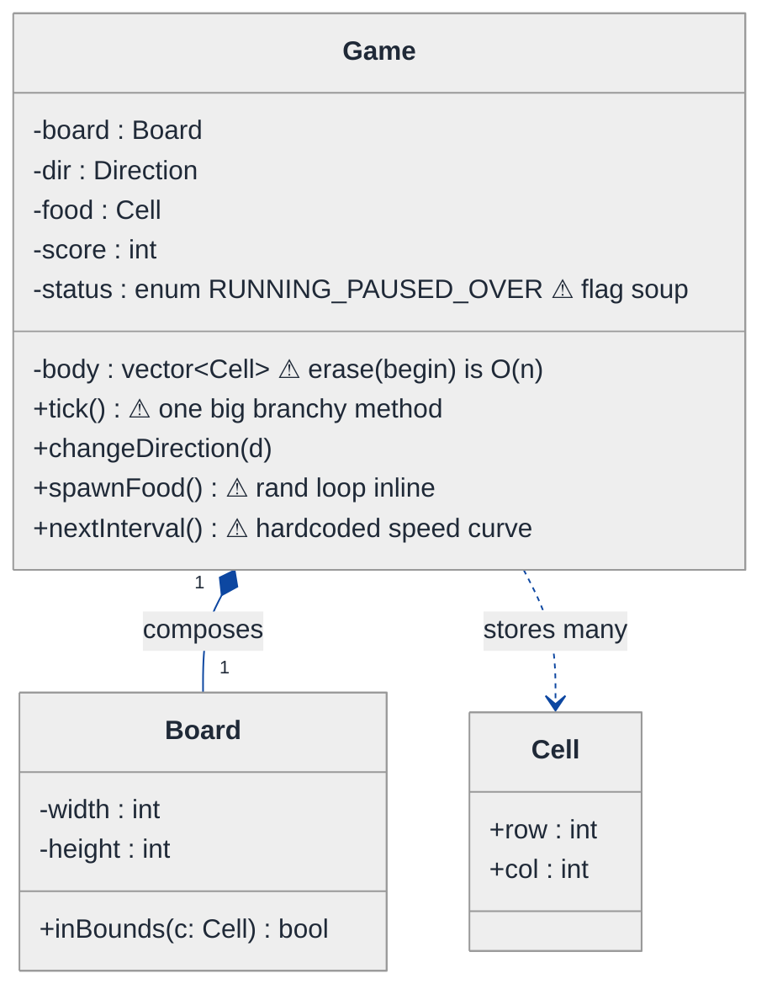
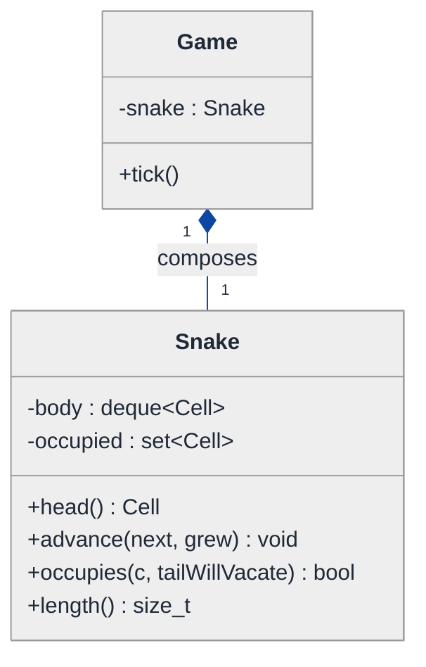
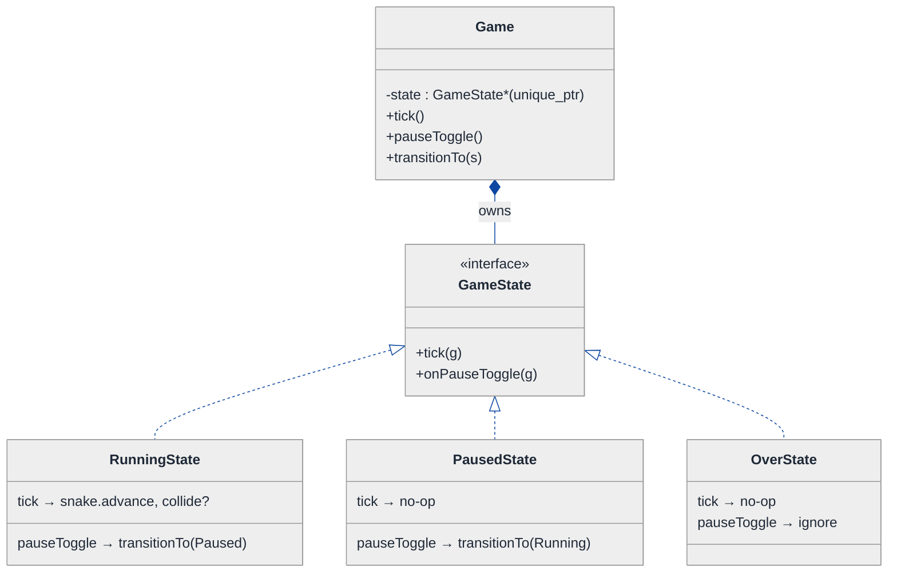
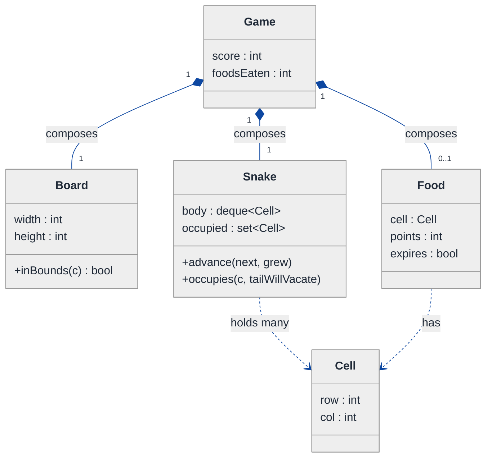
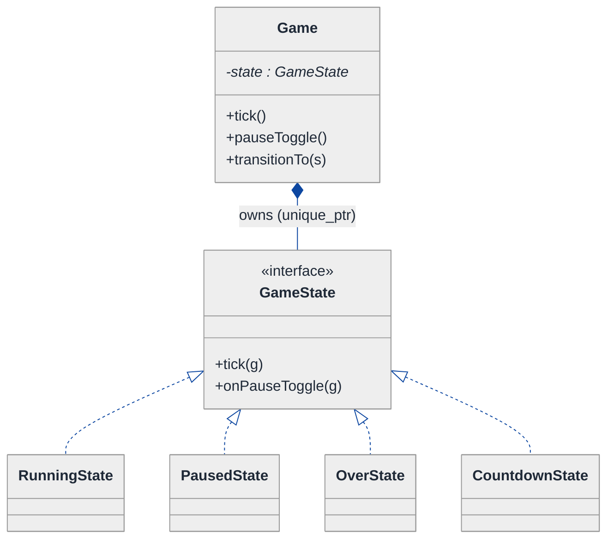
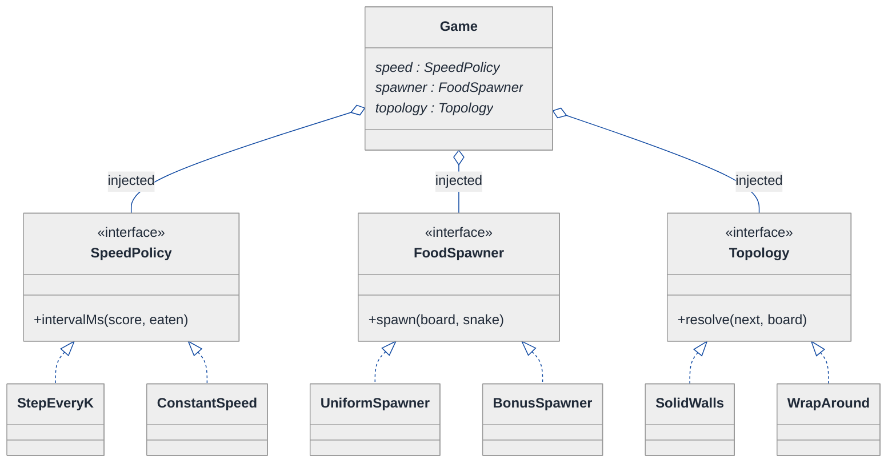

# Snake Game — LLD Walkthrough

> **Difficulty:** Medium · **Time:** ~35 min · **Pattern focus:** Game loop + queue (deque-backed snake body) + State (game lifecycle) + Strategy (food spawn / speed curve)
>
> **Problem source(s):** GID `OOD6` in [`./EXTRACTED_QUESTIONS.md`](./EXTRACTED_QUESTIONS.md), bucket `Object_Oriented_Design`. A classic "model a real-time game" LLD shape.
>
> **Diagrams:** inline mermaid (renders natively in GitHub / VS Code). Light theme + soft-pastel palette per the repo convention.

---

## How to use this file

Paced for a candidate seeing the Snake game design for the first time. Reading time: ~35 minutes if you sketch each iteration by hand. **The lesson: a real-time game is a tick loop wrapped around a small simulation. The hard part is not the rendering — it is choosing the right data structure for the snake body (so growth and movement are O(1)) and separating the game's LIFECYCLE (running / paused / over) from its per-tick MECHANICS. Derive both; do not assert them.**

**Map of this file (15 sections):**

1. Problem statement + clarifying questions
2. Plain-English restatement
3. Why this matters
4. Mental model
5. Try it yourself first
6. Entity & verb extraction
7. **Iteration 1: the naive design** — what we'd write first
8. **Where the naive design hurts** — four future requirements, one painful diff each
9. **Pivot 1: a deque for the snake body** — make move + grow O(1)
10. **Pivot 2: State for the game lifecycle** — running / paused / over without status flags
11. **Pivot 3: Strategy for food spawn + speed curve** — the swappable policy axes
12. Final UML class diagram
13. Skeleton code (C++17)
14. Key flow — sequence diagram (one tick)
15. Extensibility re-check + anti-patterns + how to think aloud + self-check

---

## 1. Problem statement + clarifying questions

**Prompt (typical phrasing):** "Design the Snake game. A snake moves on a grid, grows when it eats food, the score goes up, the game ends if the snake hits a wall or itself, and the speed increases as the score climbs."

**Clarifying questions to ask BEFORE drawing anything:**

1. **Board topology?** Fixed W×H grid with solid walls, or do edges wrap (torus / "pass through the wall and come out the other side")?
2. **Food rules?** One food item at a time, or several? Does food have types (normal vs bonus vs slow-down)? Where does it spawn — uniformly random over free cells?
3. **Speed model?** Does speed step up every N points, every N foods eaten, or on a smooth curve? Is there a max speed cap?
4. **Input model?** Real-time keyboard, or a scripted list of moves for a deterministic test harness? Can the snake reverse directly into itself (down while moving up)?
5. **Tick / time source?** Fixed timestep game loop driven by a real clock, or a `tick()` we can call from a test? Pausable?
6. **Win condition?** Is there one (fill the whole board), or is it endless until collision?
7. **Self-collision detail?** Does the cell the tail is about to vacate count as a collision when the head moves into it the same tick?
8. **Rendering target?** Console grid, web canvas, or "headless" with a pluggable renderer?

**Assumptions if interviewer dodges:** fixed W×H grid with solid walls (no wrap), exactly one food cell at a time spawned uniformly over free cells, speed steps up every K foods eaten with a floor on the tick interval, deterministic `tick(direction)` we can drive from tests (so the design is testable without a real clock), endless mode, head moving into the tail's about-to-vacate cell is **allowed** (the tail moves out the same tick), single-threaded.

---

## 2. Plain-English restatement

We are building the simulation behind a Snake game. On every tick the snake advances one cell in the current direction; if the new head cell holds food, the snake grows by one and the score and speed update; if the new head cell is a wall or part of the snake's own body, the game is over. The design must let us add new board topologies (wrapping edges), new food types (bonus, poison), and new speed curves **without rewriting the tick loop**, and it must keep "move the snake" at O(1) per tick no matter how long the snake gets.

---

## 3. Why this matters

Game LLD questions test whether you can separate the **loop** (the heartbeat that advances time) from the **simulation** (what happens in one step) from the **policy** (rules that vary). Most candidates write one giant `tick()` with the body stored in a `vector` they `erase(begin())` from — O(n) per move and a swamp of `if (paused)` / `if (gameOver)` flags. The senior bar is picking the deque for O(1) body updates and modelling the lifecycle as states, so the loop stays a five-line heartbeat. The same loop-vs-simulation-vs-policy split reappears in any tick-driven system: physics engines, trading simulators, cellular automata.

---

## 4. Mental model

The snake is a **moving queue of cells**. Each tick you push a new cell at the head and (unless you just ate) pop one at the tail — the body slides forward. The board is a **set of occupied cells** for O(1) collision lookup. Around that simulation sits a **clock that ticks**, and a **lifecycle** (running, paused, over) that decides whether a tick even does anything.

```
Real-world sketch (NOT a UML diagram yet):

   col→ 0 1 2 3 4 5 6                  the snake body as a QUEUE of cells:
 row 0  . . . . . . #  (wall)
   1   . . . . . . #          tail ──► (2,1)(2,2)(2,3)[H](2,4)  ◄── head
   2   # . o o o H . #               pop here          push here
   3   . . . . . F . #          eat F at head → DON'T pop tail this tick → grow
   4   # # # # # # #  (wall)

   ┌─────────────┐   tick   ┌────────────────────────────────────────┐
   │   Clock     │ ───────► │  Game: advance snake, check collision,  │
   │ (heartbeat) │  every   │  maybe eat food, update score + speed   │
   └─────────────┘  dt ms   └────────────────────────────────────────┘
                            but ONLY if lifecycle state == Running
```

The KEY insight from this picture: **the body is a queue, the board is a set, the clock is separate from the simulation, and the lifecycle gates whether a tick advances anything.** Those four separations are what we will bake into the design.

---

## 5. Try it yourself first

> **Predict before reading on:**
>
> 1. List 5 nouns you'd promote to a class and 3 you'd leave as fields.
> 2. **If the snake is 400 cells long, what is the per-tick cost of "move forward" if you store the body in a `std::vector` and erase the front element? What data structure makes it O(1)?**
> 3. The game can be Running, Paused, or Over. If you model that with two booleans, how many `if` checks does your `tick()` accumulate after you add a fourth state ("countdown before start")? Where would you put that logic instead?

---

## 6. Entity & verb extraction

> **Mini-refresher: noun → class, but not every noun.**
>
> Naive OOD promotes every noun to a class. Senior OOD promotes a noun only when it has BEHAVIOR and STATE that belong together. "Score" is just an int field; "Snake" earns a class because it owns the body queue plus move/grow behavior.

**Nouns from the prompt:**

| Noun | Decision | Why |
|---|---|---|
| Game | Class (top-level coordinator) | Owns the board, snake, food, score; runs the tick |
| Board | Class | Knows width/height and what is a wall / out of bounds |
| Snake | Class | Owns the body queue + direction; move/grow behavior |
| Cell (row, col) | Small value type (struct) | Pure data, comparable/hashable; no behavior |
| Food | Class | Has a position and (later) a type/effect |
| Direction | `enum class` | UP/DOWN/LEFT/RIGHT; maps to a (dr, dc) delta |
| Score | Field on Game (`int`) | No behavior of its own |
| Speed / tick interval | Field on Game, computed by a policy | Derived from score/foods eaten |
| Clock / game loop | Class (drives `tick()`) | Orchestration, not simulation |

**Verbs (and the class they live on):**

| Verb | Owner class (naive answer — we'll re-examine) |
|---|---|
| tick() | Game (the per-step advance) |
| move(dir) | Snake |
| grow() | Snake |
| occupies(cell) | Snake (self-collision check) |
| isWall(cell) / inBounds(cell) | Board |
| spawnFood() | Game |
| changeDirection(dir) | Snake / Game |
| scoreUp() / nextSpeed() | Game |

**We have NOT introduced any design patterns yet.** Pure nouns + verbs.

---

## 7. <a id="iter-1"></a>Iteration 1: the naive design

Let's write the simplest thing that could possibly work. No design patterns — one `Game` class, a `vector` body, a status enum, and a tick loop full of branches.



**Reader's tour (read top to bottom; ~60 seconds).**

1. **`Game` is the root and it does everything.** It holds the board, the body as a `vector<Cell>`, the direction, the single food cell, the score, and a `status` enum. Every decision — move, eat, collide, speed up, spawn — lives inside `tick()`.

2. **The body is a `vector<Cell>` (first warning).** To move forward you push a new head and `erase(body.begin())` to drop the tail. `erase` at the front shifts every remaining element — **O(n) per tick**. For a 400-cell snake that's 400 moves of memory per frame, 30+ frames a second.

3. **`status` is an enum with flag-soup behavior (second warning).** `tick()` opens with `if (status != RUNNING) return;`. Pause toggles it; collision sets it to OVER. Fine for three states; we'll see it fracture in §8.

4. **`spawnFood()` and `nextInterval()` are inline (third + fourth warnings).** Food spawns via a `rand()` retry loop hardcoded in `Game`. The speed curve is a hardcoded formula. Both are policies masquerading as private methods.

5. **`Board` is honest.** It just knows width/height and `inBounds`. That part is fine and won't change much.

**What's deliberately missing.** No deque. No `GameState` hierarchy. No `FoodSpawner` or `SpeedPolicy`. The naive design doesn't even acknowledge these are axes that vary — it bakes a hardcoded answer for each into `tick()`. That's what we'll expose and fix.

Skeleton code for the naive design (C++):

```cpp
#include <cstdlib>
#include <stdexcept>
#include <vector>

enum class Direction     { UP, DOWN, LEFT, RIGHT };
enum class GameStatus    { RUNNING, PAUSED, OVER };

struct Cell {
    int row, col;
    bool operator==(const Cell& o) const { return row == o.row && col == o.col; }
};

class Board {
public:
    Board(int w, int h) : width_(w), height_(h) {}
    bool inBounds(const Cell& c) const {
        return c.row >= 0 && c.row < height_ && c.col >= 0 && c.col < width_;
    }
    int width()  const { return width_; }
    int height() const { return height_; }
private:
    int width_, height_;
};

class Game {
public:
    Game(int w, int h) : board_(w, h) {
        body_ = { {h / 2, w / 2} };          // start in the middle
        spawnFood();
    }

    void changeDirection(Direction d) { dir_ = d; }   // no reversal guard — will hurt

    void tick() {
        if (status_ != GameStatus::RUNNING) return;   // flag soup — will hurt

        Cell head = body_.back();
        Cell next = step(head, dir_);

        // collision: wall or self
        if (!board_.inBounds(next) || occupies(next)) {
            status_ = GameStatus::OVER;
            return;
        }

        body_.push_back(next);                 // push head
        if (next == food_) {
            ++score_;
            spawnFood();                       // grew: keep the tail this tick
        } else {
            body_.erase(body_.begin());        // O(n) tail drop — will hurt
        }
    }

    int  score()    const { return score_; }
    bool isOver()   const { return status_ == GameStatus::OVER; }

private:
    Cell step(const Cell& c, Direction d) const {
        switch (d) {
            case Direction::UP:    return { c.row - 1, c.col };
            case Direction::DOWN:  return { c.row + 1, c.col };
            case Direction::LEFT:  return { c.row, c.col - 1 };
            case Direction::RIGHT: return { c.row, c.col + 1 };
        }
        return c;
    }
    bool occupies(const Cell& c) const {       // O(n) self-collision scan
        for (const auto& b : body_) if (b == c) return true;
        return false;
    }
    void spawnFood() {                         // hardcoded rand retry loop
        do { food_ = { std::rand() % board_.height(), std::rand() % board_.width() }; }
        while (occupies(food_));
    }
    int nextInterval() const {                 // hardcoded speed curve
        return std::max(60, 200 - score_ * 10);
    }

    Board               board_;
    std::vector<Cell>   body_;
    Direction           dir_   = Direction::RIGHT;
    Cell                food_  { 0, 0 };
    int                 score_ = 0;
    GameStatus          status_ = GameStatus::RUNNING;
};
```

**This works.** It has zero design patterns. We can move, eat, grow, collide, and speed up. So what's wrong with it?

---

## 8. <a id="naive-pain"></a>Where the naive design hurts

The interviewer slides a piece of paper across the desk: "Here are four things product wants next sprint. Walk me through what changes."

### Change A: "The snake is getting long and the game stutters"

In the naive design:
- Every non-eating tick calls `body_.erase(body_.begin())` — **O(n)**, shifting the whole vector.
- `occupies()` is a linear scan of the body — another **O(n)** every tick.
- **At length 400 that's ~800 operations per tick.** The fix isn't a micro-optimization; it's the wrong data structure for "add at one end, remove at the other."

### Change B: "Add a Pause button, and a 3-2-1 countdown before the game starts"

In the naive design:
- `GameStatus` gains `COUNTDOWN`. Now `tick()` needs `if (status == COUNTDOWN) { decrementCounter(); if (done) status = RUNNING; return; }`.
- Pause/resume toggles the enum from input handling.
- **Every new lifecycle phase adds another branch at the top of `tick()`**, and input handling has to know which transitions are legal (you can't pause during countdown). Three states in, the transition rules are scattered across `tick()` and the input handler.

### Change C: "Add a wrap-around board (edges connect) and a 'bonus food' worth 5 points that times out"

In the naive design:
- Wrap-around: `tick()`'s `inBounds` check must become "wrap if out of bounds" — but ONLY for wrap boards, so `tick()` grows a `if (wrapMode)` branch.
- Bonus food: `spawnFood()` must sometimes spawn a bonus, `tick()`'s eat-branch must check food type and add 5 instead of 1, and a timer must expire it.
- **The change touches `tick()`, `spawnFood()`, AND the eat-branch** — food rules are smeared across three places.

### Change D: "Marketing wants three difficulty modes with different speed curves"

In the naive design:
- `nextInterval()` is one hardcoded formula.
- Three modes → `if (mode == EASY) ... else if (mode == HARD) ...` inside `nextInterval()`.
- **Every new curve is surgery in the same method.** Classic tag-driven branching.

### The pattern of pain

| Change | Files / methods touched | Smell |
|---|---|---|
| A. Long snake stutter | body storage + `occupies()` | "Wrong data structure: O(n) where O(1) is available." |
| B. Pause + countdown | `tick()` top + input handler | "Status enum + scattered transition rules can't express a real lifecycle." |
| C. Wrap board + bonus food | `tick()` + `spawnFood()` + eat-branch | "Board topology and food rules are hardcoded policies." |
| D. Difficulty curves | `nextInterval()` | "Tag-driven if/else; every new curve is surgery in one method." |

**Three axes of pain dominate:** the body data structure (A), lifecycle variability (B), and policy variability (C board topology + food spawn, D speed curve).

> **Pivot question:** "What data structure makes 'push one end, pop the other' O(1)? What pattern handles 'lifecycle with state-specific behavior and legal transitions'? What pattern handles 'an algorithm the caller/config picks'?"
>
> The answers are a **deque**, the **State** pattern, and the **Strategy** pattern. Let's introduce them one at a time, starting with the most painful axis: the body data structure.

---

## 9. <a id="pivot-1"></a>Pivot 1: a deque for the snake body (the game-loop + queue heart)

This is the axis the interviewer's "game loop + queue" hint is pointing at, and the one that bites first (Change A). The snake body is a textbook **queue / double-ended queue**: you add a cell at the head and remove a cell at the tail every tick.

> **Mini-refresher: deque vs vector for end-operations.**
>
> A `std::deque` (double-ended queue) gives you O(1) `push_back` / `push_front` / `pop_back` / `pop_front`. A `std::vector` gives O(1) only at the BACK; `erase(begin())` is O(n) because it shifts every element left. When your access pattern is "add at one end, remove at the other," reach for a deque, not a vector.

> **Mini-refresher: the fixed-timestep game loop.**
>
> A game loop is a heartbeat: every `dt` milliseconds it (1) reads input, (2) advances the simulation by one step, (3) renders. Decoupling the loop (the clock) from the step (`game.tick()`) means you can drive `tick()` directly from a test with no real clock — deterministic and fast. Keep the loop dumb; put the mechanics in `tick()`.

**Why a deque fits the body, plus a set for collisions.** Movement is push-head / pop-tail — O(1) on a deque. The other O(n) cost was self-collision (`occupies` scanning the body). Mirror the body into a `std::unordered_set<Cell>` of occupied cells: `contains(next)` becomes O(1). The set and deque move together — push to both on grow, pop the tail from both on move. We trade a little memory for O(1) ticks regardless of length.

**The refactor (just the body slice):**

```cpp
#include <deque>
#include <unordered_set>

struct CellHash {
    std::size_t operator()(const Cell& c) const {
        return std::hash<int>()(c.row) * 31 + std::hash<int>()(c.col);
    }
};

class Snake {
public:
    explicit Snake(Cell start) {
        body_.push_back(start);
        occupied_.insert(start);
    }

    Cell head() const { return body_.back(); }

    // Advance one cell. If `grew` is false we also drop the tail. O(1) amortized.
    void advance(const Cell& next, bool grew) {
        body_.push_back(next);            // O(1) push head
        occupied_.insert(next);
        if (!grew) {
            occupied_.erase(body_.front());
            body_.pop_front();            // O(1) pop tail
        }
    }

    // Self-collision in O(1). The tail cell is exempt: it vacates this same tick
    // (only when we're NOT growing — see Game::tick).
    bool occupies(const Cell& c, bool tailWillVacate) const {
        if (tailWillVacate && c == body_.front()) return false;
        return occupied_.count(c) > 0;
    }

    std::size_t length() const { return body_.size(); }
private:
    std::deque<Cell>                         body_;     // tail = front, head = back
    std::unordered_set<Cell, CellHash>       occupied_; // O(1) collision lookup
};
```

**What changed — visualized.** Just the body slice:

> **Mini-refresher: aggregation vs composition (the UML diamond).**
>
> Both are "has-a" relationships, drawn as a diamond on the OWNER's end of the line. A **filled diamond (`◆`) = composition**: the part shares the owner's lifetime — the owner creates and destroys it, and it can't meaningfully exist alone (here `Game` owns its `Snake`; destroy the game and the snake goes with it). An **open diamond (`◇`) = aggregation**: the owner USES a part it doesn't exclusively own — usually injected from outside and able to outlive any single owner (you'll see this in §12.3 for the injected policies). Rule of thumb: if the owner `new`s it and it can't stand alone → composition (filled); if it's handed in at construction → aggregation (open).



**Tour of the after-state.**

1. **The body moved out of `Game` into its own `Snake` class.** `Game` no longer holds a raw `vector<Cell>`; it composes a `Snake` that owns the body. `Game::tick()` shrinks because the move/grow mechanics now live on `Snake::advance`.

2. **Two collaborating structures inside `Snake`.** A `deque<Cell>` (tail at front, head at back) gives O(1) push-head / pop-tail. A parallel `unordered_set<Cell>` gives O(1) collision lookup. They're kept in sync inside `advance` and `occupies`.

3. **`advance(next, grew)` is the whole game-loop heart.** Push the new head; if we did not grow this tick, pop the tail. That's the queue sliding forward. The `grew` flag is the one bit that distinguishes "move" from "eat."

4. **The tail-vacate subtlety is now a named parameter.** `occupies(c, tailWillVacate)` encodes the rule from our §1 assumption: when not growing, the head may legally move into the cell the tail is leaving. The naive design had no clean place for this; here it's one `if`.

5. **Change A from §8 lands cleanly.** Length 400 or 40,000 — `advance` and `occupies` stay O(1). No more per-tick stutter.

**Pattern-discrimination cheatsheet — deque vs circular buffer vs linked list for the body.**
- *deque:* O(1) both ends, contiguous-ish, cache-friendly, simplest to reason about. **Default choice.**
- *circular buffer (ring):* O(1) both ends with zero allocation IF you cap the max length (board area). Worth it only when GC/alloc pressure is proven hot.
- *intrusive linked list:* O(1) splice but pointer-chasing kills cache locality and self-collision still needs a side set. Overkill here.

We chose a deque + side set: O(1) movement AND O(1) collision, with the least cleverness.

---

## 10. <a id="pivot-2"></a>Pivot 2: State for the game lifecycle

Change B from §8 is still painful — pause, countdown, game-over, and the legal transitions between them. A deque doesn't help; the variability here is not in a data structure, it's in **what a tick is allowed to do and what comes next.**

> **Mini-refresher: State pattern.**
>
> Each lifecycle state is its own class. The context object delegates an event (here `tick()` and input events) to its current state, and THE STATE decides what the next state is. Transitions are INTERNAL, driven by events the context receives — not by external code flipping an enum.

**Why State (not Strategy).** The choice of lifecycle phase is NOT picked by the caller per-tick — it is driven by what has happened (collision → Over; user pressed P → Paused; countdown hit zero → Running). A `RunningState` tick advances the snake; a `PausedState` tick does nothing; an `OverState` tick does nothing and ignores direction input. Calling "advance the snake" while paused isn't meaningful — it should be a no-op the state enforces, not an `if` the loop remembers.

**The refactor (just the lifecycle part):**

```cpp
class Game;  // forward — defined in §13

class GameState {
public:
    virtual ~GameState() = default;
    virtual void tick(Game& g)               = 0;  // one heartbeat
    virtual void onPauseToggle(Game& g)      = 0;  // user pressed P
    virtual const char* name() const         = 0;
};

class RunningState : public GameState {
public:
    void tick(Game& g) override;                    // advance snake (see §13)
    void onPauseToggle(Game& g) override;           // → PausedState
    const char* name() const override { return "RUNNING"; }
};

class PausedState : public GameState {
public:
    void tick(Game&) override {}                    // frozen: a tick does nothing
    void onPauseToggle(Game& g) override;           // → RunningState
    const char* name() const override { return "PAUSED"; }
};

class OverState : public GameState {
public:
    void tick(Game&) override {}                    // terminal: ignore ticks
    void onPauseToggle(Game&) override {}            // ignore input
    const char* name() const override { return "OVER"; }
};

// CountdownState (Change B) is just one more class — no edits to the others.
```

> **Mini-refresher: `std::unique_ptr` = exclusive ownership.** A `std::unique_ptr<T>` owns exactly one heap object and is the sole owner — it can't be copied, only moved, and the object is destroyed automatically when the pointer goes away. We use it here because `Game` exclusively owns its current state (and, later, its policies); if ownership were shared across objects you'd reach for `shared_ptr` instead.

`Game` holds a `std::unique_ptr<GameState>` and delegates:

```cpp
void Game::tick()          { state_->tick(*this); }
void Game::pauseToggle()   { state_->onPauseToggle(*this); }
void Game::transitionTo(std::unique_ptr<GameState> s) { state_ = std::move(s); }
```

**What changed — visualized.** Just the lifecycle slice:



**Tour of the after-state.**

1. **The `GameStatus` enum is gone.** It's replaced by a `state` field of type `std::unique_ptr<GameState>` — exclusive ownership of the current phase.

2. **`Game::tick()` became a one-liner.** It just delegates: `state_->tick(*this)`. **No `if (status != RUNNING) return;` at the top of the loop anymore.** A paused tick is a no-op because `PausedState::tick` does nothing — the state enforces it, not the loop.

3. **The interface declares the contract.** `GameState` has pure-virtual `tick()` and `onPauseToggle()`. Each concrete state implements both even when the answer is "do nothing" (`OverState` ignores everything — it's terminal).

4. **Transitions live WITH the state.** `RunningState::onPauseToggle` calls `g.transitionTo(make_unique<PausedState>())`; on collision, `RunningState::tick` transitions to `OverState`. The "what comes next" knowledge sits in each state, not scattered in `Game` or the input handler.

5. **Change B lands as new classes, not new branches.** Adding the 3-2-1 countdown is one `CountdownState` class whose `tick()` decrements a counter and transitions to `RunningState` at zero. No edits to `RunningState`, `PausedState`, `OverState`, or the loop. Open/closed.

> **Mini-refresher: Open/Closed Principle (the "O" in SOLID).**
>
> Software should be OPEN for extension but CLOSED for modification. Adding a behavior should mean adding a class, not editing existing ones. The State refactor makes the lifecycle obey this: a new phase = a new state class.

**Pattern-discrimination cheatsheet — Strategy vs State.**
- *Strategy:* the CALLER picks which algorithm to use; strategies are usually unaware of each other.
- *State:* the OBJECT picks its next state internally; states know about each other (each state's methods can `transitionTo` another).
- *Rule of thumb:* if external code calls `game.setX(...)` to swap behavior → Strategy. If an internal event (`tick`, collision, keypress) flips the behavior → State. Pause/collision are internal events, so the lifecycle is State.

---

## 11. <a id="pivot-3"></a>Pivot 3: Strategy for food spawn + speed curve (and board topology)

Changes A and B are solved. Change C (wrap board, bonus food) and Change D (difficulty curves) are not. These are **algorithms the configuration picks** — the textbook Strategy shape.

> **Mini-refresher: Strategy pattern.**
>
> Encapsulates an algorithm behind an interface so it can be swapped at runtime. The CALLER (here: game config / difficulty selection) decides which strategy to use; the strategy doesn't know about its peers.
>
> Quick example: a `Sorter` takes a `CompareStrategy*`. Pass `Ascending` or `Descending` — the sorter doesn't care which.

**The remaining axes, each its own Strategy:**

| Axis | Pattern | One sentence why |
|---|---|---|
| Speed curve | Strategy | "Given score/foods eaten, return the next tick interval" — picked by difficulty |
| Food spawn | Strategy | "Given the board + occupied cells, return the next food" — varies (uniform, bonus, weighted) |
| Board topology | Strategy | "Given a step, resolve it" — solid walls vs wrap-around; injected, not hardcoded |

Each follows the same shape. Brief sketches:

```cpp
// ── Speed curve (Change D) ──────────────────────────────────────────
class SpeedPolicy {
public:
    virtual ~SpeedPolicy() = default;
    virtual int intervalMs(int score, int foodsEaten) const = 0;
};
class StepEveryK : public SpeedPolicy {
public:
    StepEveryK(int base, int floor, int k, int delta)
        : base_(base), floor_(floor), k_(k), delta_(delta) {}
    int intervalMs(int, int foodsEaten) const override {
        return std::max(floor_, base_ - (foodsEaten / k_) * delta_);
    }
private:
    int base_, floor_, k_, delta_;
};
class ConstantSpeed : public SpeedPolicy { /* always returns base — elided */ };

// ── Food spawn (Change C) ───────────────────────────────────────────
struct Food { Cell cell; int points; bool expires; };

class FoodSpawner {
public:
    virtual ~FoodSpawner() = default;
    // pick a free cell; nullopt if board full (a WIN, handled by caller)
    virtual std::optional<Food> spawn(const Board& b, const Snake& s) = 0;
};
class UniformSpawner : public FoodSpawner { /* random free cell, 1 pt — elided */ };
class BonusSpawner   : public FoodSpawner { /* sometimes 5-pt expiring food — elided */ };

// ── Board topology (Change C) ───────────────────────────────────────
class Topology {
public:
    virtual ~Topology() = default;
    // resolve a raw step into a real cell, or nullopt if it's a fatal wall hit
    virtual std::optional<Cell> resolve(const Cell& next, const Board& b) const = 0;
};
class SolidWalls : public Topology {
public:
    std::optional<Cell> resolve(const Cell& n, const Board& b) const override {
        return b.inBounds(n) ? std::optional<Cell>(n) : std::nullopt;  // out = death
    }
};
class WrapAround : public Topology {
public:
    std::optional<Cell> resolve(const Cell& n, const Board& b) const override {
        return Cell{ (n.row + b.height()) % b.height(),
                     (n.col + b.width())  % b.width() };               // never dies on edge
    }
};
```

`Game` aggregates one of each, injected at construction. `tick()` (inside `RunningState`) asks `topology_->resolve(step)`, checks `snake.occupies(...)`, asks `spawner_->spawn(...)` on a hit, and asks `speed_->intervalMs(...)` to schedule the next tick.

**The lesson.** Once we recognized "algorithm picked by config" as the shape for the speed curve, the same shape fell out for food spawn AND board topology — three axes, one pattern. **Pattern recognition makes subsequent design cheap.**

> **Mini-refresher: why three Strategy hierarchies don't share one interface.**
>
> Strategy is a *role*, not a type. `SpeedPolicy`, `FoodSpawner`, and `Topology` have nothing in common at the type level (different inputs, different outputs). Don't unify them under a single `Strategy<T>` template — that's premature genericism that buys nothing.

**Pattern-discrimination cheatsheet — Strategy vs Template Method (for the speed curve).**
- *Strategy:* whole algorithm in a swappable object, chosen at runtime via composition.
- *Template Method:* algorithm skeleton in a base class; subclasses fill in hook methods via inheritance.
- *Rule of thumb:* if difficulty is chosen at runtime and curves don't share a skeleton → Strategy. If every curve was "base minus a per-mode hook" sharing one formula → Template Method. Our curves differ wholesale, so Strategy.

---

## 12. <a id="fig-class-diagram"></a>Final class diagram

One giant diagram becomes a wall of boxes. Here are **three focused sub-views**; the structural insight at the end ties them together.

### 12.1 The simulation core — what the game OWNS



**Tour of 12.1.** Filled diamonds (`◆`) mark composition — same lifetime. The `Game` owns exactly one `Board`, one `Snake`, and zero-or-one `Food`. `Cell` is a value type that everyone holds copies of (no ownership arrow needed beyond "holds"). This is the simulation's data spine; the variability got lifted OUT — see 12.2 and 12.3.

### 12.2 The lifecycle — Game's State pattern



**Tour of 12.2.** `Game` owns ONE `GameState` (filled diamond / `unique_ptr`). `tick()` and `pauseToggle()` are one-line delegations — no status switch on `Game`. Four concrete states hang off the interface; `OverState` is terminal, `CountdownState` is the §8 Change-B extension that cost zero edits to its siblings.

### 12.3 The policy injection — what the game USES



**Tour of 12.3.** Open diamonds (`◇`) mark AGGREGATION — `Game` USES these policies but they're injected at construction (the game doesn't `new` them). One interface per varying axis: speed curve, food spawn, board topology. Each has a small concrete family below it. Change C (wrap + bonus) and Change D (difficulty curves) are now just new concrete classes plugged into these slots.

### Structural insight (ties 12.1 + 12.2 + 12.3 together)

| Concern | Pattern used | Why |
|---|---|---|
| **Body movement** (push head, pop tail) | deque + side set, owned by Snake | "Add one end, remove other" is the definition of a queue; O(1) both ends |
| **Lifecycle** (Running / Paused / Over / Countdown) | State, OWNED by Game | Internal events (tick, collision, keypress) flip the phase |
| **Policy** (speed, food spawn, topology) | Strategy, INJECTED into Game | Config / difficulty picks the variant |
| **The loop** (clock → tick) | plain delegation, clock outside Game | Keep the heartbeat dumb so `tick()` is testable without a real clock |

The big lesson: **inheritance is used only for the State and Strategy class families** — every "varies independently" axis became composition over an interface, and the snake body became the right data structure rather than a clever class. *Pick the data structure first, then separate lifecycle from policy.*

---

## 13. Skeleton code (C++17)

> Show the SHAPES, not the full impl. ~130 lines.

```cpp
#include <deque>
#include <memory>
#include <optional>
#include <unordered_set>
#include <algorithm>

// ── Value types ─────────────────────────────────────────────────────
enum class Direction { UP, DOWN, LEFT, RIGHT };

struct Cell {
    int row, col;
    bool operator==(const Cell& o) const { return row == o.row && col == o.col; }
};
struct CellHash {
    std::size_t operator()(const Cell& c) const {
        return std::hash<int>()(c.row) * 31 + std::hash<int>()(c.col);
    }
};
struct Food { Cell cell; int points = 1; bool expires = false; };

// ── Board ───────────────────────────────────────────────────────────
class Board {
public:
    Board(int w, int h) : width_(w), height_(h) {}
    bool inBounds(const Cell& c) const {
        return c.row >= 0 && c.row < height_ && c.col >= 0 && c.col < width_;
    }
    int width()  const { return width_; }
    int height() const { return height_; }
private:
    int width_, height_;
};

// ── Snake: deque body + side set (Pivot 1) ──────────────────────────
class Snake {
public:
    explicit Snake(Cell start) { body_.push_back(start); occupied_.insert(start); }
    Cell head() const { return body_.back(); }
    void advance(const Cell& next, bool grew) {
        body_.push_back(next); occupied_.insert(next);
        if (!grew) { occupied_.erase(body_.front()); body_.pop_front(); }
    }
    bool occupies(const Cell& c, bool tailWillVacate) const {
        if (tailWillVacate && c == body_.front()) return false;
        return occupied_.count(c) > 0;
    }
    std::size_t length() const { return body_.size(); }
private:
    std::deque<Cell>                   body_;       // front = tail, back = head
    std::unordered_set<Cell, CellHash> occupied_;
};

// ── Strategy interfaces, one per varying axis (Pivot 3) ─────────────
class SpeedPolicy {
public:
    virtual ~SpeedPolicy() = default;
    virtual int intervalMs(int score, int foodsEaten) const = 0;
};
class FoodSpawner {
public:
    virtual ~FoodSpawner() = default;
    virtual std::optional<Food> spawn(const Board& b, const Snake& s) = 0;
};
class Topology {
public:
    virtual ~Topology() = default;
    virtual std::optional<Cell> resolve(const Cell& next, const Board& b) const = 0;
};
// concrete impls (StepEveryK, UniformSpawner, SolidWalls, WrapAround...) elided — see §11

// ── State interface (Pivot 2) ───────────────────────────────────────
class Game;  // forward — defined below

class GameState {
public:
    virtual ~GameState() = default;
    virtual void tick(Game& g)          = 0;
    virtual void onPauseToggle(Game& g) = 0;
    virtual const char* name() const    = 0;
};
class RunningState  : public GameState { public:
    void tick(Game& g) override;                 // the real heartbeat — see below
    void onPauseToggle(Game& g) override;        // → PausedState
    const char* name() const override { return "RUNNING"; }
};
class PausedState   : public GameState { public:
    void tick(Game&) override {}
    void onPauseToggle(Game& g) override;        // → RunningState
    const char* name() const override { return "PAUSED"; }
};
class OverState     : public GameState { public:
    void tick(Game&) override {}
    void onPauseToggle(Game&) override {}
    const char* name() const override { return "OVER"; }
};

// ── Game: simulation core + injected policy + owned state ───────────
class Game {
public:
    Game(Board board, Cell start,
         std::unique_ptr<SpeedPolicy> speed,
         std::unique_ptr<FoodSpawner> spawner,
         std::unique_ptr<Topology>    topology)
        : board_(board), snake_(start)
        , speed_(std::move(speed)), spawner_(std::move(spawner))
        , topology_(std::move(topology))
        , state_(std::make_unique<RunningState>()) {
        if (auto f = spawner_->spawn(board_, snake_)) food_ = *f;
    }

    // Loop / input surface — all one-line delegations to the current state.
    void tick()                 { state_->tick(*this); }
    void pauseToggle()          { state_->onPauseToggle(*this); }
    void changeDirection(Direction d) {
        if (!isReverse(d, dir_)) dir_ = d;       // can't reverse into your own neck
    }
    void transitionTo(std::unique_ptr<GameState> s) { state_ = std::move(s); }

    int  score()      const { return score_; }
    int  intervalMs() const { return speed_->intervalMs(score_, foodsEaten_); }
    bool isOver()     const { return std::string(state_->name()) == "OVER"; }

    // Accessors used by RunningState::tick (impl below the class).
    Board&        board()    { return board_; }
    Snake&        snake()    { return snake_; }
    Direction     dir() const { return dir_; }
    FoodSpawner&  spawner()  { return *spawner_; }
    Topology&     topology() { return *topology_; }
    Food&         food()     { return food_; }
    void          onEat(int pts) { score_ += pts; ++foodsEaten_; }

private:
    static Cell step(const Cell& c, Direction d);
    static bool isReverse(Direction a, Direction b);

    Board                        board_;
    Snake                        snake_;
    Direction                    dir_   = Direction::RIGHT;
    Food                         food_;
    int                          score_ = 0;
    int                          foodsEaten_ = 0;
    std::unique_ptr<SpeedPolicy> speed_;
    std::unique_ptr<FoodSpawner> spawner_;
    std::unique_ptr<Topology>    topology_;
    std::unique_ptr<GameState>   state_;
};

// ── The heartbeat: where queue + State + Strategy cooperate ─────────
inline void RunningState::tick(Game& g) {
    Cell raw = Game::step(g.snake().head(), g.dir());
    auto resolved = g.topology().resolve(raw, g.board());     // Strategy: wall vs wrap
    if (!resolved) { g.transitionTo(std::make_unique<OverState>()); return; }

    Cell next = *resolved;
    bool willEat = (next == g.food().cell);
    // tail vacates iff we're NOT growing this tick
    if (g.snake().occupies(next, /*tailWillVacate=*/!willEat)) {
        g.transitionTo(std::make_unique<OverState>());        // self-collision
        return;
    }
    g.snake().advance(next, /*grew=*/willEat);                // queue: push head (+keep tail if grew)
    if (willEat) {
        g.onEat(g.food().points);
        if (auto f = g.spawner().spawn(g.board(), g.snake())) g.food() = *f;  // Strategy: spawn
        // else: board full → a WIN; transition to a WinState (elided)
    }
}
inline void RunningState::onPauseToggle(Game& g) { g.transitionTo(std::make_unique<PausedState>()); }
inline void PausedState::onPauseToggle(Game& g)  { g.transitionTo(std::make_unique<RunningState>()); }
```

---

## 14. <a id="fig-sequence"></a>Key flow — sequence diagram (one tick)

This is the moment of truth: one `tick()` in which the queue, the State, and two Strategies cooperate. Read across the swimlanes.

```mermaid
---
config:
  theme: neutral
  themeVariables:
    background: '#ffffff'
    primaryColor: '#cfe2ff'
    primaryTextColor: '#1f2937'
    primaryBorderColor: '#084298'
    secondaryColor: '#fff3cd'
    secondaryTextColor: '#1f2937'
    secondaryBorderColor: '#664d03'
    tertiaryColor: '#d1e7dd'
    tertiaryTextColor: '#1f2937'
    tertiaryBorderColor: '#0a3622'
    lineColor: '#0d47a1'
    textColor: '#1f2937'
    noteBkgColor: '#fff3cd'
    noteTextColor: '#1f2937'
    noteBorderColor: '#997404'
    actorBkg: '#cfe2ff'
    actorBorder: '#084298'
    actorTextColor: '#1f2937'
    signalColor: '#0d47a1'
    signalTextColor: '#1f2937'
    labelBoxBkgColor: '#ffffff'
    labelBoxBorderColor: '#d3d3d3'
    labelTextColor: '#1f2937'
    edgeLabelBackground: '#ffffff'
    labelBackground: '#ffffff'
    classText: '#1f2937'
    fontFamily: 'system-ui, -apple-system, Segoe UI, Helvetica, Arial, sans-serif'
---
sequenceDiagram
  participant Loop as GameLoop (clock)
  participant Game
  participant State as RunningState
  participant Topo as Topology
  participant Snake
  participant Spawn as FoodSpawner
  participant Speed as SpeedPolicy
  Loop->>Game: 1: tick()
  Game->>State: 2: state.tick(game)
  State->>Topo: 3: resolve(step(head, dir))
  Topo-->>State: 4: Cell next (or none → Over)
  State->>Snake: 5: occupies(next, tailWillVacate)
  Snake-->>State: 6: false (safe)
  State->>Snake: 7: advance(next, grew=true)
  State->>Game: 8: onEat(points)
  State->>Spawn: 9: spawn(board, snake)
  Spawn-->>State: 10: new Food
  Loop->>Game: 11: intervalMs()
  Game->>Speed: 12: intervalMs(score, eaten)
  Speed-->>Loop: 13: next interval (ms)
```

**Tour of one tick. Read slowly — this is where every pattern cooperates.**

1. **The loop fires `tick()`.** The clock is OUTSIDE `Game`. It doesn't know about snakes or food — it just calls `tick()` every interval. That's what makes the simulation testable: a unit test calls `game.tick()` directly with no real clock.

2. **`Game::tick` delegates to the current state.** This is the State-pattern moment: `state_->tick(*this)`. **If the state were `PausedState`, this would be a no-op — no `if (paused)` in the loop.**

3. **`RunningState` asks the Topology to resolve the step.** `Strategy #1`: `SolidWalls` returns `none` on an edge hit (→ game over); `WrapAround` wraps the coordinate. The state doesn't know which — it just gets a `Cell` or nothing.

4. **The state asks the Snake whether `next` is occupied.** The `tailWillVacate` flag encodes the §1 rule: when not growing, moving into the tail's cell is legal. O(1) via the side set.

5. **The state advances the snake.** `Snake::advance(next, grew)` is the queue heartbeat: push the head; pop the tail unless we grew. O(1) regardless of length.

6. **On eating: score up, then spawn.** `Game::onEat` bumps score + foodsEaten; `Strategy #2` (`FoodSpawner`) picks the next food cell (uniform / bonus). If the board is full, spawn returns nothing → a win (elided).

7. **The loop asks for the next interval.** `Strategy #3` (`SpeedPolicy`) maps score/foods-eaten to the next tick interval. The loop uses it to schedule the next heartbeat — **that's how "speed increases" emerges without any speed logic inside `tick()`.**

### The validation that's NOT shown — and why it matters

You don't see `if (status == PAUSED) return;` or `if (gameOver) return;` anywhere in this flow. That's the point of the State pattern: **a paused or finished game advances nothing because the current state's `tick()` is a no-op**, not because the loop remembers to check a flag. The class hierarchy IS the guard.

---

## 15. Extensibility re-check + anti-patterns + how to think aloud + self-check

### Extensibility re-check

Revisit the four changes from [§8](#naive-pain). For each, name what changes in the final design.

| Change | Naive design impact | Final design impact |
|---|---|---|
| A. Long snake stutter | O(n) `erase` + O(n) `occupies` every tick | `Snake` is a deque + side set — O(1) both. No code change with length. |
| B. Pause + countdown | branches at top of `tick()` + input handler | New `CountdownState : GameState`. Pause already a state. Done. |
| C. Wrap board + bonus food | `tick()` + `spawnFood()` + eat-branch | New `WrapAround : Topology` + `BonusSpawner : FoodSpawner`. Done. |
| D. Difficulty curves | `nextInterval()` if/else | New `StepEveryK`/`Aggressive : SpeedPolicy`. Inject at construction. Done. |

Every change is one new class (or zero, for A) in the final design. That's the open/closed principle in practice. If a future requirement makes you change `Snake`, `Game::tick`, AND a Strategy together — go back to §6 and re-identify variability points; you missed one.

### Common confusion + traps

1. **"Why not store the body in a `vector` and just track a head index (ring buffer)?"** Valid and O(1) IF you cap length at board area and pre-allocate. We chose a deque for clarity; mention the ring buffer as the zero-allocation alternative if asked about GC/alloc pressure.

2. **"Why a side `set` AND a deque — isn't that duplicated state?"** It's a deliberate space-for-time trade: the deque gives ordered O(1) ends; the set gives O(1) membership for collision. Keeping them in sync is two lines in `advance`. The alternative (scanning the deque) is O(n) per tick.

3. **"Why not enum + switch instead of State?"** Works for 3 states. Falls apart at 5+ (countdown, win, replay) because the legal-transition matrix becomes N² branches scattered across `tick()` and input handling.

4. **"Should `Snake` know about food or score?"** No. `Snake` knows cells and movement. Eating, scoring, and spawning are `Game` / state concerns. Keep the snake a pure body-mechanics object.

5. **"Why is the clock outside `Game`?"** So `tick()` is deterministic and testable. A test drives ticks directly; production wires a real timer to `tick()` and reads `intervalMs()` to reschedule. Loop and simulation are decoupled.

6. **"Why `unique_ptr` for state and strategies?"** Both are exclusive ownership — `Game` owns its current state and its policies. If a policy were shared across multiple games → `shared_ptr`. It isn't, so `unique_ptr` is correct.

### Anti-patterns

- **"God class Game"** — `tick()` doing movement + collision + spawn + speed + lifecycle inline. Pull each into a collaborator (Snake, Topology, FoodSpawner, SpeedPolicy, GameState).
- **"Vector with `erase(begin())`"** — O(n) per tick masquerading as fine because it works at length 5. Use a deque.
- **"Boolean flag soup"** — `bool paused, gameOver, counting;` and a forest of `if`s. Use the State pattern.
- **"Tag-driven if/else"** — `if (mode == EASY)` inside `nextInterval()`. Use the Strategy interface; let polymorphism dispatch.
- **"Direction reversal bug"** — letting the snake turn 180° into its own neck. Guard it in `changeDirection` (one `isReverse` check), not scattered.
- **"Clock inside the simulation"** — calling `sleep()` inside `tick()`. Keep the loop outside so the sim is testable.

### How to think aloud

> "OK, Snake. Let me clarify scope. [Asks about wrap vs walls, food types, speed model, input/clock from §1.] Got it.
>
> Nouns: Game, Board, Snake, Cell, Food, Direction. The interesting one is the snake body — it's a queue: push a head cell, pop a tail cell each tick.
>
> I'll write the NAIVE design first — one `Game` class, body in a `vector`, a status enum, and a branchy `tick()`. It works.
>
> Now stress-test it. A: long snake → `vector erase(begin)` is O(n), so is the self-collision scan. B: pause + countdown → flag soup at the top of `tick()`. C: wrap board + bonus food → hardcoded policies smeared across `tick()` and `spawnFood`. D: difficulty curves → tag-driven `if` in `nextInterval`.
>
> Three axes: body data structure, lifecycle, and policy. Pivot 1: body becomes a deque + a side set — O(1) move and O(1) collision. Pivot 2: lifecycle becomes a State pattern — Running/Paused/Over, transitions live in the states, `tick()` is a one-line delegation. Pivot 3: speed curve, food spawn, and board topology become injected Strategy interfaces.
>
> The clock stays OUTSIDE `Game` so `tick()` is deterministic and testable. Final design: `Game` composes `Board`+`Snake`, owns a `GameState`, aggregates three Strategies. All four future changes land as one new class each — open/closed."

### Self-check

> **Self-check — the question to ask next time.**
>
> When you see "design a real-time / tick-driven game," before writing one big `tick()`, ask:
>
> > **"What's the right DATA STRUCTURE for the moving parts (is it a queue?), is the variation an internal LIFECYCLE the object transitions through (State) or an ALGORITHM the config picks (Strategy), and is my clock OUTSIDE the simulation so I can test a tick?"**
>
> Queue for the body, State for the lifecycle, Strategy for the policies, clock outside the sim. The class diagram falls out for free.

---

## Cross-references

- **Parent topic manifest:** [`./EXTRACTED_QUESTIONS.md`](./EXTRACTED_QUESTIONS.md)
- **Vertical overview:** [`../../LEARNING.md`](../../LEARNING.md)
- **Template:** [`../../TEMPLATE-v2.md`](../../TEMPLATE-v2.md)
- **Canonical exemplar:** [`./Parking_Lot.md`](./Parking_Lot.md) — the gold-standard LLD walkthrough (Strategy + State)
- **Related v2 walkthroughs (future):**
  - State Pattern deep-dive (in `../State_Pattern/`) — the game-lifecycle axis generalized
  - Strategy Pattern deep-dive (in `../Strategy_Pattern/`) — the policy axes generalized
  - Other tick-driven LLD shapes (elevator, traffic-light) in this bucket
- **External reading:**
  - <a href="https://gameprogrammingpatterns.com/game-loop.html" target="_blank" rel="noopener noreferrer">Game Programming Patterns — Game Loop</a>
  - <a href="https://refactoring.guru/design-patterns/state" target="_blank" rel="noopener noreferrer">Refactoring Guru — State pattern</a>
  - <a href="https://en.cppreference.com/w/cpp/container/deque" target="_blank" rel="noopener noreferrer">cppreference — std::deque</a>
