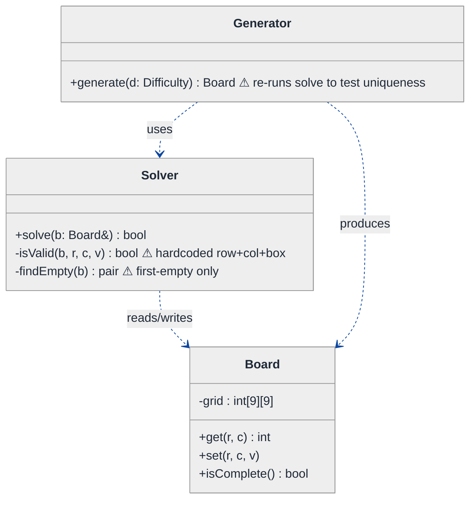
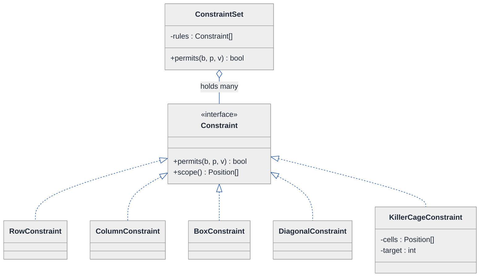
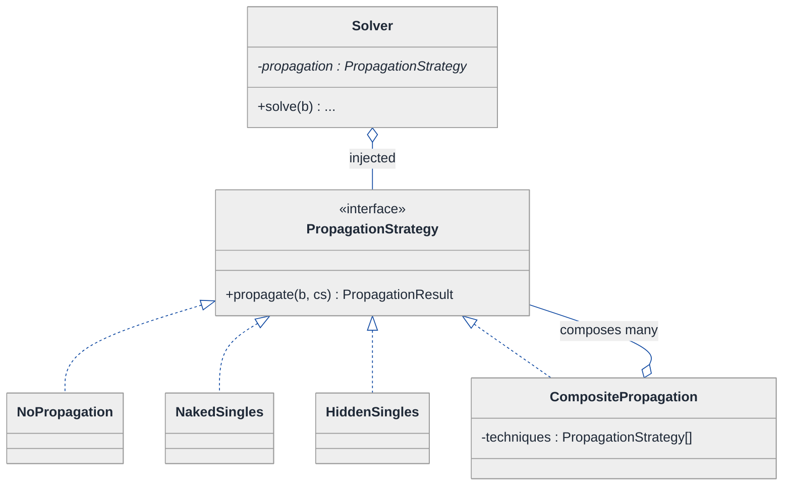
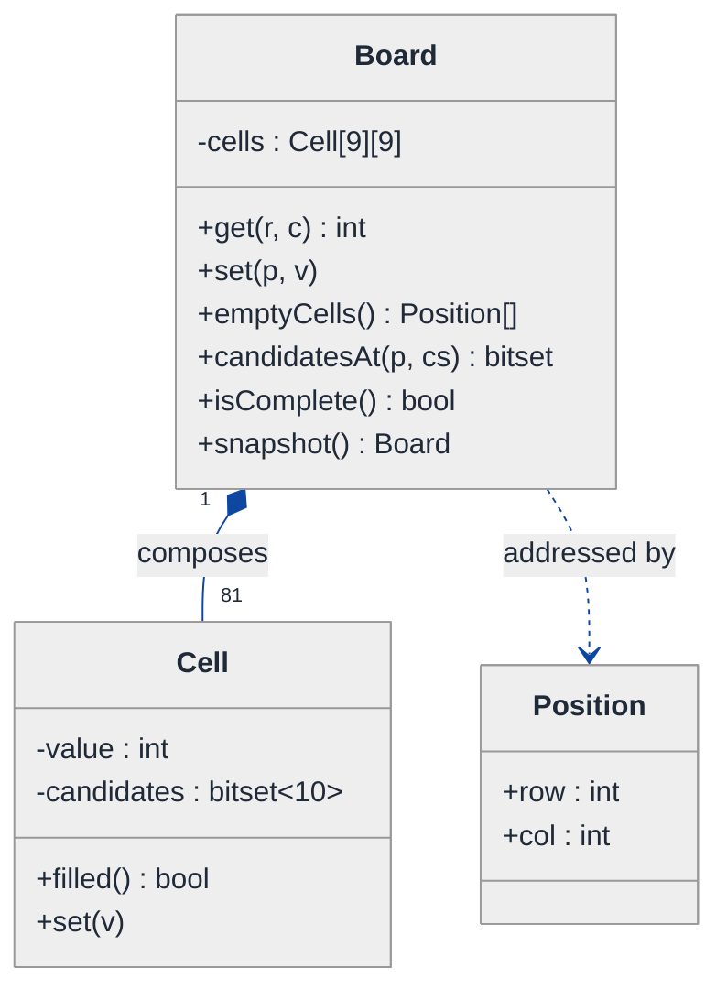
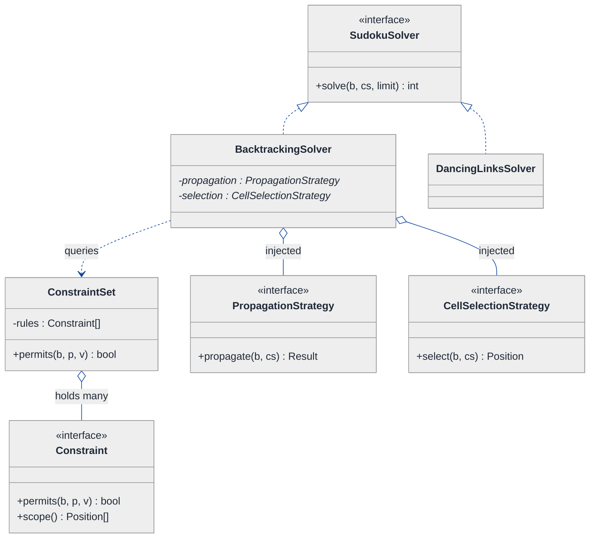
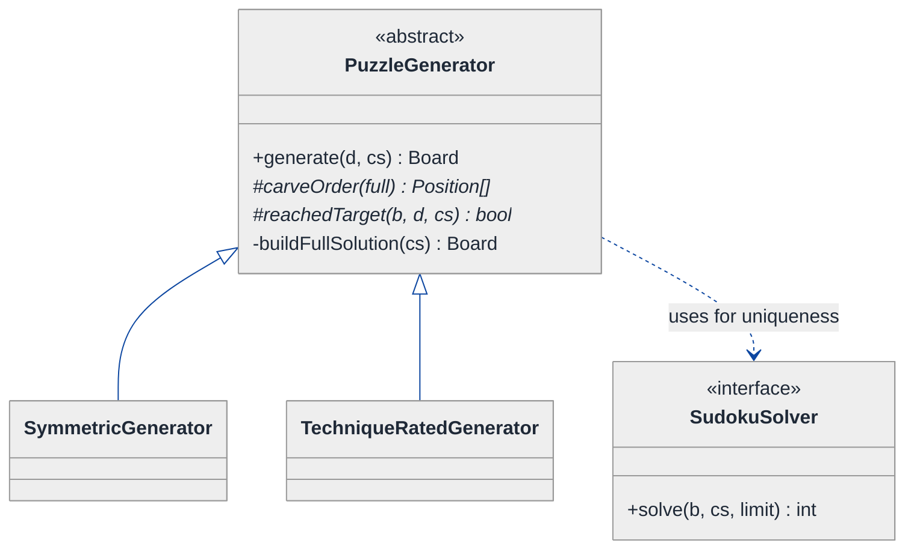
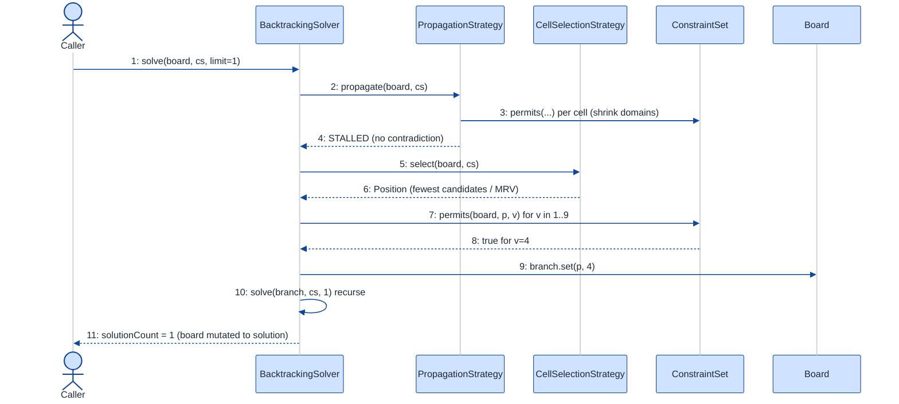
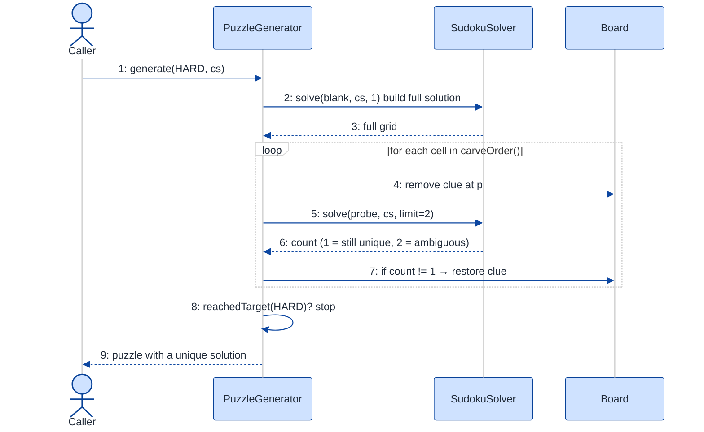

# Sudoku Solver & Validator — LLD Walkthrough

> **Difficulty:** Hard · **Time:** ~45 min · **Pattern focus:** Backtracking + constraint propagation (Strategy for variable-selection + constraint-propagation, Chain of Responsibility for validation, Builder/Template Method for generation)
>
> **Problem source(s):** GID **OOD17**, bucket `Object_Oriented_Design`. Representative of the "design a constraint-solving engine" family — see [`./EXTRACTED_QUESTIONS.md`](./EXTRACTED_QUESTIONS.md).
>
> **Diagrams:** inline mermaid (renders natively in GitHub / VS Code). Canonical theme block from `CONTINUATION.md` §3.

---

## How to use this file

Paced for a candidate who knows how to *code* a recursive Sudoku solver but has never had to *design* one for extension. Reading time: ~45 minutes if you sketch each iteration by hand. **The lesson: a Sudoku solver is not "one clever recursive function" — it is a constraint engine with four independent axes of variation (how you validate, how you propagate constraints, how you pick the next cell, and how you generate puzzles). The naive single-function design hardcodes all four. We DERIVE the pattern for each axis by watching the naive version break.**

**Map of this file (15 sections):**

1. Problem statement + clarifying questions
2. Plain-English restatement
3. Why this matters
4. Mental model
5. Try it yourself first
6. Entity & verb extraction
7. **Iteration 1: the naive design** — one `Board` + one recursive `solve()`
8. **Where the naive design hurts** — five future requirements, one painful diff each
9. **Pivot 1: Chain of Responsibility for validation** — the most-touched axis first
10. **Pivot 2: Strategy for constraint propagation** — swap MRV / naked-singles / DLX
11. **Pivot 3: Strategy for cell selection + Builder/Template Method for generation**
12. Final UML class diagram (three sub-views)
13. Skeleton code (C++17)
14. Key flow — sequence diagram
15. Extensibility re-check + anti-patterns + how to think aloud + self-check

---

## 1. Problem statement + clarifying questions

**Prompt (typical phrasing):** "Design a Sudoku solver and validator. Model the board, implement constraint propagation, backtracking search, and provide efficient validation for rows, columns, and 3x3 boxes. Support puzzle generation with unique solutions."

**Clarifying questions to ask BEFORE drawing anything:**

1. **Grid size — fixed 9x9, or do we need to support 4x4, 16x16, or general N²xN²?** This decides whether `9` is a constant or a constructor parameter, and whether the "3x3 box" is hardcoded or derived as `sqrt(N)`.
2. **Variants — classic Sudoku only, or also Killer / Diagonal / Hyper / Samurai?** Variants add EXTRA constraints (cage sums, diagonals). This is the single biggest design fork — it decides whether "row/column/box" is hardcoded or pluggable.
3. **Solver guarantees — do we need to detect *no solution* and *multiple solutions*, or just find *one*?** Uniqueness checking (needed for generation) requires the solver to keep searching after the first solution.
4. **Performance bar — must the hardest 17-clue puzzles solve in milliseconds?** That decides whether plain backtracking is enough or we need constraint propagation (MRV, naked/hidden singles) and possibly Dancing Links (DLX).
5. **Generation difficulty — do we need to produce puzzles at a target difficulty (easy/medium/hard/evil)?** Difficulty is a function of which solving *techniques* are required, which couples generation to the propagation strategies.
6. **Is the validator a separate use case from the solver?** "Validate a user's filled board" and "validate a partial board mid-search" are different APIs with the same underlying constraint checks.
7. **Mutability / undo — interactive editor where users place and retract digits, or batch solve only?** Undo pushes us toward a move-stack / Memento, not just a flat array.

**Assumptions if the interviewer dodges:** classic 9x9 (but coded so N is parameterizable), must detect zero / one / many solutions (needed for generation), millisecond bar (so propagation matters), generation produces unique-solution puzzles at a requested difficulty, batch solve plus a standalone validate API. Variants are out of scope for v1 but the design must not *forbid* them — that's the senior bar.

---

## 2. Plain-English restatement

We are building a constraint engine over a 9x9 grid. Each cell holds a digit 1-9 or is empty. Three families of constraint must always hold: each row has the digits 1-9 with no repeat, each column the same, each 3x3 box the same. The engine must (a) **validate** a board against those constraints, (b) **solve** a partial board by searching for an assignment that satisfies all constraints, using constraint propagation to prune the search, and (c) **generate** a fresh puzzle that has exactly one solution at a requested difficulty. The design must let us add new constraint types, new propagation techniques, and new search heuristics **without rewriting the core search loop.**

---

## 3. Why this matters

This question separates "I memorized the backtracking template" from "I understand that a solver is a composition of policies." Almost every candidate can write the 20-line recursive `solve()`. The interviewer is probing whether you see the FOUR axes that vary independently — validation rules, propagation technique, cell-selection heuristic, and generation strategy — and whether you keep the search loop stable while everything around it is swappable. The same shape reappears in any constraint solver: schedulers, regex engines, type checkers, SAT/CSP solvers, layout engines. Get Sudoku right and you have the template for all of them.

---

## 4. Mental model

A Sudoku board is a **set of variables (the 81 cells), each with a domain (the candidate digits still legal there), governed by a rule-book (the constraints)**. Solving is: repeatedly *propagate* (shrink domains using the rules), then when propagation stalls, *guess* (pick a cell, try a value, recurse), and *backtrack* if the guess leads to a contradiction.

```
Real-world sketch (NOT a UML diagram yet):

   columns 0..8
   ┌───────┬───────┬───────┐
   │ 5 3 . │ . 7 . │ . . . │   each CELL has a domain:
   │ 6 . . │ 1 9 5 │ . . . │      filled  -> {single digit}
   │ . 9 8 │ . . . │ . 6 . │      empty   -> subset of {1..9}
   ├───────┼───────┼───────┤
   │ 8 . . │ . 6 . │ . . 3 │   3 CONSTRAINT families watch every cell:
   │ 4 . . │ 8 . 3 │ . . 1 │      Row(r)  Column(c)  Box(b)
   │ 7 . . │ . 2 . │ . . 6 │
   ├───────┼───────┼───────┤   SOLVE = propagate (shrink domains)
   │ . 6 . │ . . . │ 2 8 . │           then guess+recurse+backtrack
   │ . . . │ 4 1 9 │ . . 5 │   GENERATE = solve a blank grid, then
   │ . . . │ . 8 . │ . 7 9 │              carve clues while solution
   └───────┴───────┴───────┘              stays UNIQUE
```

The KEY insight from this picture: **the cell-and-domain is the data; the constraints are the policy; the search loop is the orchestration.** Data vs. policy vs. orchestration is the separation we will bake into the design. The constraints don't know about the search; the search doesn't know how many constraint *types* there are.

---

## 5. Try it yourself first

> **Predict before reading on:**
>
> 1. List 4 nouns you'd promote to a class and 2 you'd leave as fields/primitives.
> 2. **If I told you next quarter we must support Killer Sudoku (cages with target sums) AND Diagonal Sudoku, what would change about how you wrote `isValid(row, col, val)`?**
> 3. Where does "this puzzle has exactly one solution" logic live — in the solver, the generator, or somewhere shared? What does that tell you about the solver's return type?

---

## 6. Entity & verb extraction

> **Mini-refresher: noun → class, but not every noun.**
>
> Naive OOD promotes every noun to a class. Senior OOD promotes a noun only if it has both BEHAVIOR and STATE that need to live together. "Difficulty" is usually an enum field; "Constraint" becomes a class because it has the behavior of *checking itself* against a board.

**Nouns from the prompt:**

| Noun | Decision | Why |
|---|---|---|
| Board | Class | Holds the grid + cell domains; reports validity |
| Cell | Class (or struct) | Has a value + a candidate set (its domain) |
| Constraint | Class (abstract) + concrete (Row/Col/Box/…) | Each KNOWS how to check itself; the variability point |
| Solver | Class (orchestrator) | Owns the search loop; delegates propagation + selection |
| Generator | Class | Produces a unique-solution puzzle at a difficulty |
| Validator | Class / service | Runs all constraints over a board |
| Digit / value | Field on Cell (`int`, 0 = empty) | No behavior of its own |
| Difficulty | `enum class` | A label that maps to allowed techniques |
| Position (row, col) | Small value struct | No behavior; just coordinates |

**Verbs (and the class they live on — naive answer, we'll re-examine):**

| Verb | Owner class (naive answer) |
|---|---|
| isValid(board) | Board / Validator |
| isValid(row, col, val) | Board (inline triple-check) |
| solve(board) | Solver |
| propagate(board) | Solver (inline) |
| selectNextCell(board) | Solver (inline first-empty) |
| generate(difficulty) | Generator |
| hasUniqueSolution(board) | Generator (re-runs solver) |
| place(r, c, v) / clear(r, c) | Board |

**We have NOT introduced any design patterns yet.** Pure nouns + verbs. Note already how `isValid`, `propagate`, and `selectNextCell` are all "inline on the solver" — that clustering is the smell we'll expose in §8.

---

## 7. <a id="iter-1"></a>Iteration 1: the naive design

Let's write the simplest thing that could possibly work. A `Board` that is a 2D array, and a `Solver` whose `solve()` is the textbook recursive backtracker that hardcodes the row/column/box check inline.



**Reader's tour (read top to bottom; ~60 seconds).**

1. **`Board` is a dumb data holder.** A `9x9 int` grid (0 = empty), plus `get`/`set`/`isComplete`. No notion of "candidates" or "domains." Fine for a brute solver; it will hurt the moment we want propagation.
2. **`Solver` carries all the intelligence — and all the smells.** Look at the two ⚠ markers. `isValid(b, r, c, v)` hardcodes "scan the row, scan the column, scan the 3x3 box." `findEmpty(b)` returns the FIRST empty cell, top-to-bottom — the dumbest possible cell-selection heuristic.
3. **`Generator` leans on `Solver`.** It builds a full solution, then carves cells out, re-running `solve()` to confirm the solution stays unique. The uniqueness logic is tangled into the generator and depends on the solver's exact behavior.
4. **The dependency arrows are all `..>` (uses).** Nothing is injected, nothing is abstract. Generator hard-depends on the concrete Solver; Solver hard-depends on the concrete Board.

**What's deliberately missing.** No `Constraint` abstraction — the three rules are baked into one `isValid`. No propagation at all — pure guess-and-check. No cell-selection abstraction — always first-empty. No way to say "find ALL solutions" — `solve` returns a `bool` and stops at the first. The naive design doesn't even *acknowledge* these as axes. That's what the next four sections expose and fix.

Skeleton code for the naive design (C++17):

```cpp
#include <array>
#include <utility>

class Board {
public:
    int  get(int r, int c) const { return grid_[r][c]; }
    void set(int r, int c, int v) { grid_[r][c] = v; }
    bool isComplete() const {
        for (auto& row : grid_) for (int v : row) if (v == 0) return false;
        return true;
    }
private:
    std::array<std::array<int, 9>, 9> grid_{};   // 0 == empty
};

class Solver {
public:
    bool solve(Board& b) {
        auto [r, c] = findEmpty(b);
        if (r == -1) return true;                 // no empty cell -> solved
        for (int v = 1; v <= 9; ++v) {
            if (isValid(b, r, c, v)) {            // hardcoded triple-check
                b.set(r, c, v);
                if (solve(b)) return true;        // recurse
                b.set(r, c, 0);                   // backtrack
            }
        }
        return false;                             // dead end
    }
private:
    std::pair<int,int> findEmpty(const Board& b) const {   // first-empty only
        for (int r = 0; r < 9; ++r)
            for (int c = 0; c < 9; ++c)
                if (b.get(r, c) == 0) return {r, c};
        return {-1, -1};
    }
    bool isValid(const Board& b, int r, int c, int v) const {
        for (int i = 0; i < 9; ++i) {
            if (b.get(r, i) == v) return false;            // row
            if (b.get(i, c) == v) return false;            // column
            int br = 3 * (r / 3) + i / 3, bc = 3 * (c / 3) + i % 3;
            if (b.get(br, bc) == v) return false;          // 3x3 box
        }
        return true;
    }
};
// Generator elided — builds a full grid via solve(), then removes cells,
// re-running solve() each time to check the solution stays unique.
```

**This works.** It has zero design patterns and it solves any classic 9x9. So what's wrong with it?

---

## 8. <a id="naive-pain"></a>Where the naive design hurts

The interviewer slides five new requirements across the desk: "Here's the roadmap. Walk me through what changes."

### Change A: "Support Diagonal Sudoku (both main diagonals must also be 1-9)"

In the naive design:
- The rule lives inside `Solver::isValid`. You must add two more loops (the two diagonals) **inside that one method**.
- The same diagonal rule is ALSO needed by the standalone validate use case — which currently re-implements the same triple-check elsewhere. **Two sites, copy-pasted.**
- **Smell:** the constraint set is hardcoded into a method. Every variant is surgery in `isValid`.

### Change B: "Support Killer Sudoku (cages of cells with target sums)"

In the naive design:
- A cage sum is not a "does this value already appear" check — it's a *different shape* of constraint (sum over an arbitrary set of cells, with no-repeat). It cannot be expressed as another loop inside `isValid` without an `if (variant == KILLER)` branch.
- **`isValid` becomes a switch on variant type.** Classic tag-driven branching.

### Change C: "Solve the hardest 17-clue puzzles in under 5 ms"

In the naive design:
- Pure first-empty + guess-and-check explores millions of dead branches on hard boards. We need constraint propagation (naked singles, hidden singles) and a smarter cell order (Minimum Remaining Values).
- But `Board` has no domains and `Solver` has no propagation hook. **Adding propagation means rewriting `Board` to track candidate sets AND rewriting the `solve` loop.** Two foundational classes change at once.
- **Smell:** the search loop and the propagation technique are fused into one function.

### Change D: "Swap in a Dancing Links (DLX / Algorithm X) solver for benchmarking"

In the naive design:
- DLX is a *completely different* search representation (exact-cover matrix). There is no `Solver` interface to implement against — `Generator` hard-depends on the one concrete `Solver`.
- **Smell:** no seam. You can't A/B two solvers because the only solver is a concrete class wired directly into the generator.

### Change E: "Generate puzzles at a target difficulty (easy → evil)"

In the naive design:
- Difficulty correlates with *which solving techniques are required* (a puzzle solvable by naked-singles alone is easy; one needing guessing is hard). But the naive solver has no notion of techniques — it just guesses.
- The generator's uniqueness check (`solve()` twice) also can't tell you "how hard" the puzzle is.
- **Smell:** difficulty is undefinable because the solver exposes no technique-level information.

### The pattern of pain

| Change | Files / methods touched | Smell |
|---|---|---|
| A. Diagonal | `Solver::isValid` + the validate path | "Constraint set hardcoded; rule duplicated across solve and validate." |
| B. Killer cages | `Solver::isValid` becomes a variant switch | "Different-shaped constraint can't fit the one hardcoded check." |
| C. 5 ms bar | `Board` (add domains) + `Solver::solve` rewrite | "Search loop fused with propagation technique." |
| D. DLX swap | `Generator` + no `Solver` seam | "No interface; can't substitute a second solver." |
| E. Difficulty | `Generator` + solver exposes no techniques | "Generation policy hardcoded; can't measure difficulty." |

**Three axes of pain dominate:** (1) the *set of constraints* varies (A, B), (2) the *propagation technique* and *cell-selection heuristic* vary and are fused into the loop (C), and (3) the *whole solving algorithm* and *generation policy* vary (D, E).

> **Pivot question:** "What pattern lets a varying *list* of validation rules each check itself and pass control along? What pattern swaps the *propagation algorithm* and the *cell-selection algorithm* at runtime, picked by the caller? And what pattern keeps a fixed *generation skeleton* while letting the carving policy vary?"
>
> The answers are Chain of Responsibility (validation), Strategy (propagation + selection + whole-solver), and Template Method / Builder (generation). We introduce them one axis at a time, starting with the most-touched: validation.

---

## 9. <a id="pivot-1"></a>Pivot 1: Chain of Responsibility (and a Constraint abstraction) for validation

Changes A and B both stab at the same wound: the constraint *set* is hardcoded inside one `isValid`. The first move is to make each constraint a self-checking object.

> **Mini-refresher: Open/Closed Principle (the "O" in SOLID).**
>
> Software should be OPEN for extension but CLOSED for modification. Adding a new behavior (a Diagonal rule, a Killer cage) should mean adding a NEW class, never editing an existing, tested one. A hardcoded `isValid` that grows an `if` per variant violates this — every variant re-opens and risks breaking the same method.

First, lift each rule into a `Constraint`:

> **Mini-refresher: Chain of Responsibility.**
>
> A request travels along a linked list of handlers. Each handler either handles the request (here: vetoes a placement) or passes it to the next. The sender doesn't know which handler will act. Adding a handler = inserting a node; nobody else changes.
>
> Quick example: a web-request pipeline of `AuthFilter -> RateLimitFilter -> LoggingFilter`. Each inspects the request and either rejects or forwards.

**Why this fits validation.** "Is placing `v` at `(r,c)` legal?" is exactly "ask every constraint; if ANY vetoes, it's illegal." The constraints form a list that varies (3 for classic, 5 for diagonal, 6+ for killer). The caller (`Solver`) doesn't want to know how many there are or what types — it just wants a yes/no.

**The refactor (just the validation slice):**

```cpp
struct Position { int row, col; };

class Constraint {
public:
    virtual ~Constraint() = default;
    // Can value v be placed at p on board b without violating THIS rule?
    virtual bool permits(const Board& b, Position p, int v) const = 0;
    // Which cells does this constraint watch? (used by propagation)
    virtual std::vector<Position> scope() const = 0;
};

class RowConstraint : public Constraint {
public:
    explicit RowConstraint(int row) : row_(row) {}
    bool permits(const Board& b, Position p, int v) const override {
        if (p.row != row_) return true;                 // not my row -> abstain
        for (int c = 0; c < 9; ++c)
            if (c != p.col && b.get(row_, c) == v) return false;
        return true;
    }
    std::vector<Position> scope() const override { /* the 9 cells of row_ */ return {}; }
private:
    int row_;
};

class BoxConstraint : public Constraint { /* 9 cells of one 3x3 box — elided */ };
class ColumnConstraint : public Constraint { /* one column — elided */ };
class DiagonalConstraint : public Constraint { /* main / anti diagonal — elided */ };
// KillerCageConstraint : permits == (no repeat in cage) AND (running sum <= target)

// The chain: ConstraintSet asks each in turn; first veto wins.
class ConstraintSet {
public:
    explicit ConstraintSet(std::vector<std::unique_ptr<Constraint>> rules)
        : rules_(std::move(rules)) {}
    bool permits(const Board& b, Position p, int v) const {
        for (const auto& r : rules_)
            if (!r->permits(b, p, v)) return false;     // any veto -> illegal
        return true;
    }
    const std::vector<std::unique_ptr<Constraint>>& rules() const { return rules_; }
private:
    std::vector<std::unique_ptr<Constraint>> rules_;
};
```

**What changed — visualized.** Just the validation slice:



**Tour of the after-state.**

1. **`ConstraintSet` is the chain.** It holds a `vector` of `Constraint` and its `permits()` walks the list — first veto wins. The `Solver` now calls `constraints_.permits(b, p, v)` instead of an inline triple-check. The solver no longer knows how many rules exist.
2. **`Constraint` is the interface.** Two methods: `permits()` (the chain's veto step) and `scope()` (which cells I watch — Pivot 2 uses this for propagation). A constraint that isn't relevant to a cell simply *abstains* by returning `true`.
3. **Five concrete rules hang off it.** `RowConstraint`, `ColumnConstraint`, `BoxConstraint` are the classic three. `DiagonalConstraint` lands Change A as ONE new class. `KillerCageConstraint` lands Change B as ONE new class — and it can express a *sum* veto, something the old `isValid` could never do.
4. **Composition over a switch.** A classic board is `ConstraintSet{9 Row, 9 Col, 9 Box}`. A diagonal board adds 2 diagonals. A killer board adds N cages. The board's *rules* are now data you assemble, not a method you edit.

**Changes A and B now land cleanly.** Diagonal → one new `DiagonalConstraint`. Killer → one new `KillerCageConstraint`. The `Solver` and the validate path both consume the same `ConstraintSet`. No duplication, no `isValid` surgery.

**Pattern-discrimination cheatsheet — Chain of Responsibility vs Composite.**
- *Chain of Responsibility:* a LINEAR pass where each handler may veto/handle and the first decisive one wins; order can matter; sender is decoupled from the count.
- *Composite:* a TREE of uniform parts where an operation recurses over all children, aggregating a result.
- *Rule of thumb:* "ask each in turn, stop at the first that decides" → Chain. "treat a group and a leaf identically and combine all results" → Composite. We use Chain because the first veto short-circuits the rest (any failing constraint makes the placement illegal — no need to ask the others).

---

## 10. <a id="pivot-2"></a>Pivot 2: Strategy for constraint propagation

Change C (the 5 ms bar) is still painful. The chain made the constraint *set* extensible but didn't make the search *fast*. Pure guess-and-check explores far too many branches. We need constraint propagation: before guessing, shrink each empty cell's domain (its candidate set) using the constraints, and immediately fill any cell forced to a single value.

First, `Board` must grow a notion of *domains*. A `Cell` now carries its value AND a candidate bitset:

```cpp
class Cell {
public:
    bool   filled() const { return value_ != 0; }
    int    value()  const { return value_; }
    void   set(int v) { value_ = v; candidates_.reset(); }
    std::bitset<10>& candidates() { return candidates_; }   // bits 1..9
private:
    int value_ = 0;
    std::bitset<10> candidates_{0b1111111110};              // all of 1..9 legal
};
```

Now the propagation technique itself is the variable axis.

> **Mini-refresher: Strategy pattern.**
>
> Encapsulates an algorithm behind an interface so it can be swapped at runtime. The CALLER decides which strategy to use; the strategy doesn't know about its peers. The context object holds a pointer to the interface and calls through it.
>
> Quick example: a `Compressor` takes a `CompressionStrategy*`; pass `Gzip` or `Zstd` — the compressor doesn't care which.

**Why Strategy fits propagation.** Propagation is an algorithm: `given a board + constraints, shrink domains and return whether progress was made / a contradiction was found`. It VARIES — none, naked-singles, hidden-singles, naked-pairs, arc-consistency (AC-3). The choice is made by the CALLER (the solver config / difficulty target), not by the board. Textbook Strategy.

**The refactor (just the propagation slice):**

```cpp
enum class PropagationResult { PROGRESS, STALLED, CONTRADICTION };

class PropagationStrategy {
public:
    virtual ~PropagationStrategy() = default;
    // Shrink domains in place; report what happened.
    virtual PropagationResult propagate(Board& b, const ConstraintSet& cs) const = 0;
};

// Cheapest: just keep candidate sets consistent with placed values.
class NoPropagation : public PropagationStrategy {
public:
    PropagationResult propagate(Board&, const ConstraintSet&) const override {
        return PropagationResult::STALLED;     // solver falls back to pure search
    }
};

// A cell with exactly one candidate is forced -> fill it, repeat.
class NakedSingles : public PropagationStrategy {
public:
    PropagationResult propagate(Board& b, const ConstraintSet& cs) const override {
        bool progressed = false;
        for (auto p : b.emptyCells()) {
            auto cand = b.candidatesAt(p, cs);            // intersect all constraints
            if (cand.count() == 0) return PropagationResult::CONTRADICTION;
            if (cand.count() == 1) { b.set(p, soleBit(cand)); progressed = true; }
        }
        return progressed ? PropagationResult::PROGRESS : PropagationResult::STALLED;
    }
};

// HiddenSingles, NakedPairs, AC3 ... each is one more class. elided.

// Compose several techniques: run each until none make progress.
class CompositePropagation : public PropagationStrategy {
public:
    explicit CompositePropagation(std::vector<std::unique_ptr<PropagationStrategy>> ts)
        : techniques_(std::move(ts)) {}
    PropagationResult propagate(Board& b, const ConstraintSet& cs) const override {
        bool any = false;
        for (bool changed = true; changed; ) {
            changed = false;
            for (auto& t : techniques_) {
                auto r = t->propagate(b, cs);
                if (r == PropagationResult::CONTRADICTION) return r;
                if (r == PropagationResult::PROGRESS) { changed = any = true; }
            }
        }
        return any ? PropagationResult::PROGRESS : PropagationResult::STALLED;
    }
private:
    std::vector<std::unique_ptr<PropagationStrategy>> techniques_;
};
```

**What changed — visualized.** Just the propagation slice:



**Tour of the after-state.**

1. **`Solver` gained an injected `PropagationStrategy*`.** Open diamond = aggregation; the solver uses it but the choice is made at construction. The `solve` loop now calls `propagation_->propagate(b, cs)` BEFORE it ever guesses.
2. **`PropagationResult` is a three-valued enum, not a bool.** This matters: `CONTRADICTION` lets the solver prune a branch *immediately* (before guessing), `PROGRESS` means "re-check, maybe more forced moves appeared," `STALLED` means "propagation is exhausted — time to guess." That three-way signal is what makes propagation pay off.
3. **`CompositePropagation` is itself a strategy that composes strategies.** Run naked-singles + hidden-singles + naked-pairs in a loop until nothing changes. Difficulty (Change E, foreshadowed) maps directly onto WHICH techniques are in this composite.
4. **The search loop never changed shape.** It still picks a cell, tries values, recurses, backtracks. Propagation slots in as a pre-pass. **The technique varies; the loop is stable.** That's the whole point.

**Change C now lands.** Inject `CompositePropagation{NakedSingles, HiddenSingles}` and hard boards collapse from millions of nodes to thousands. To benchmark "no propagation," inject `NoPropagation`. No edits to the loop.

**Pattern-discrimination cheatsheet — Strategy vs Template Method.**
- *Strategy:* whole algorithm behind an interface, chosen by composition at runtime; variants can be combined (see `CompositePropagation`).
- *Template Method:* a fixed algorithm *skeleton* in a base class, with subclass hook methods filling the steps via inheritance.
- *Rule of thumb:* if you want to mix-and-match or swap whole algorithms at runtime → Strategy. If there's one stable skeleton with a couple of pluggable steps → Template Method. We chose Strategy because propagation techniques COMPOSE (naked × hidden × pairs) and are swapped per difficulty target — you can't compose Template-Method subclasses.

---

## 11. <a id="pivot-3"></a>Pivot 3: Strategy for cell selection + Template Method/Builder for generation

Two axes remain: the cell-selection heuristic fused into the loop (part of Change C / D), and the generation policy (Change E). Both follow shapes we've now seen.

### 11.1 Cell selection — another Strategy

The naive `findEmpty` always returned the first empty cell. The single biggest backtracking speedup is **MRV (Minimum Remaining Values)**: branch on the cell with the FEWEST candidates, so the search tree is narrowest at the top. That's an algorithm picked by the caller — Strategy, same shape as propagation.

```cpp
class CellSelectionStrategy {
public:
    virtual ~CellSelectionStrategy() = default;
    // Return the next empty cell to branch on, or {-1,-1} if none.
    virtual Position select(const Board& b, const ConstraintSet& cs) const = 0;
};
class FirstEmpty : public CellSelectionStrategy { /* top-to-bottom scan — elided */ };
class MinimumRemainingValues : public CellSelectionStrategy {
public:
    Position select(const Board& b, const ConstraintSet& cs) const override {
        Position best{-1,-1}; int bestCount = 10;
        for (auto p : b.emptyCells()) {
            int n = static_cast<int>(b.candidatesAt(p, cs).count());
            if (n < bestCount) { bestCount = n; best = p; }   // fewest candidates wins
        }
        return best;
    }
};
```

> **Mini-refresher: why two separate Strategy hierarchies don't share one interface.**
>
> `PropagationStrategy` and `CellSelectionStrategy` are both *Strategy* in role, but Strategy is a role, not a type. They take different inputs and return different things (one mutates domains, one returns a Position). Don't unify them under a single `Strategy<T>` template — that's premature genericism.

### 11.2 The whole solver — an interface (Change D)

Change D wanted to A/B a Dancing Links solver. The fix is a tiny seam: make `Solver` an interface so DLX is a sibling implementation. Note the return type is a *count*, not a bool — generation needs "zero / one / many."

```cpp
class SudokuSolver {
public:
    virtual ~SudokuSolver() = default;
    // Solve in place; return the number of solutions found (capped at `limit`).
    virtual int solve(Board& b, const ConstraintSet& cs, int limit = 1) = 0;
};
class BacktrackingSolver : public SudokuSolver { /* uses propagation_ + selection_ */ };
class DancingLinksSolver  : public SudokuSolver { /* exact-cover matrix — elided */ };
```

Returning a *count capped at a limit* is the key design decision: `solve(b, cs, 1)` finds one solution fast; `solve(b, cs, 2)` answers "is the solution unique?" by stopping the moment a second appears.

### 11.3 Generation — Template Method (fixed skeleton, pluggable carving)

> **Mini-refresher: Template Method.**
>
> A base class defines the SKELETON of an algorithm as a sequence of steps, some of which are abstract hooks that subclasses override. The skeleton (and the order of steps) is fixed; only the hooks vary. Inheritance, not composition.

Generation has an invariant skeleton: (1) produce a full valid solution, (2) repeatedly remove a clue while the solution stays unique, (3) stop when the target difficulty is hit. The HOOK that varies is *which cell to carve next* and *when to stop* (difficulty target). That's a fixed skeleton with pluggable steps → Template Method.

```cpp
enum class Difficulty { EASY, MEDIUM, HARD, EVIL };

class PuzzleGenerator {
public:
    explicit PuzzleGenerator(SudokuSolver& solver) : solver_(solver) {}
    virtual ~PuzzleGenerator() = default;

    Board generate(Difficulty d, const ConstraintSet& cs) {       // the SKELETON
        Board full = buildFullSolution(cs);                       // step 1 (shared)
        Board puzzle = full;
        for (Position p : carveOrder(full)) {                     // hook: which cells, what order
            int saved = puzzle.get(p.row, p.col);
            puzzle.set(p.row, p.col, 0);
            Board probe = puzzle;
            if (solver_.solve(probe, cs, 2) != 1)                 // uniqueness check
                puzzle.set(p.row, p.col, saved);                  // restore: removal broke uniqueness
            if (reachedTarget(puzzle, d, cs)) break;              // hook: difficulty stop
        }
        return puzzle;
    }
protected:
    virtual std::vector<Position> carveOrder(const Board& full) const = 0;     // hook
    virtual bool reachedTarget(const Board& b, Difficulty d,
                               const ConstraintSet& cs) const = 0;             // hook
private:
    Board buildFullSolution(const ConstraintSet& cs);  // solve a blank board (shared)
    SudokuSolver& solver_;
};

class SymmetricGenerator : public PuzzleGenerator { /* carve in 180-rotational pairs — elided */ };
class TechniqueRatedGenerator : public PuzzleGenerator {
    // reachedTarget asks a CompositePropagation whether the puzzle is solvable
    // by exactly the technique set that defines difficulty d. elided.
};
```

**The lesson.** Once you recognize "algorithm picked by caller" you reuse Strategy for propagation, selection, and the whole solver. Generation is different — its STEP ORDER is fixed and only the hooks vary, so Template Method, not Strategy. **Pattern recognition makes the back half of the design cheap.**

**Pattern-discrimination cheatsheet — Template Method vs Builder.**
- *Template Method:* fixes the ALGORITHM skeleton (generate = solve-then-carve-then-stop); subclasses vary the steps.
- *Builder:* fixes nothing about an algorithm — it assembles a complex OBJECT step by step (and is how we'd construct the `ConstraintSet` and wire a `Solver` with its strategies).
- *Rule of thumb:* "vary the steps of a process" → Template Method. "assemble a configured object without a telescoping constructor" → Builder. We use Template Method for the generation *process*, and a Builder (sketched in §13) to *assemble* a configured solver.

---

## 12. <a id="fig-class-diagram"></a>Final class diagram

One diagram of everything is a wall of boxes. Here are **three focused sub-views**, each addressing a concern; the structural insight at the end ties them together.

### 12.1 The board model — what the engine OPERATES ON



**Tour of 12.1.** `Board` composes 81 `Cell`s (filled diamond = same lifetime). Each `Cell` carries a value AND a candidate bitset — the domain. `Board::candidatesAt(p, cs)` is the bridge to validation: it intersects the cell's bitset with what every constraint permits. `snapshot()` returns a copy for the uniqueness probe in generation (cheap to copy 81 ints). The board grew domains versus the naive version; that's the foundation propagation needed.

### 12.2 The policy seams — what the solver USES



**Tour of 12.2.**
1. **`SudokuSolver` is now an interface** with two implementations: `BacktrackingSolver` and `DancingLinksSolver`. That seam lands Change D — A/B two solvers behind one type.
2. **`BacktrackingSolver` aggregates two Strategy pointers** (open diamonds, injected): a `PropagationStrategy` and a `CellSelectionStrategy`. Swap MRV for first-empty, or naked-singles for AC-3, without touching the loop.
3. **`ConstraintSet` is the Chain** of `Constraint` from Pivot 1. The solver *queries* it (`permits`) but doesn't own the rule list — the rule list defines the *variant* and is passed in.
4. **The structural insight:** everything the naive design hardcoded inside one `solve()` — the rules, the propagation, the cell order, even the search algorithm itself — is now a separately swappable seam. The solver's CORE shrank to "loop: propagate, select, branch, recurse, backtrack."

### 12.3 The generation flow — Template Method over the solver



**Tour of 12.3.** `PuzzleGenerator` is abstract: `generate()` is the fixed Template-Method skeleton (solve-blank → carve-while-unique → stop-at-difficulty). Two hooks are pure-virtual (`carveOrder`, `reachedTarget`) — the `#` marks them protected. `SymmetricGenerator` carves in rotational pairs for pretty puzzles; `TechniqueRatedGenerator` stops when the puzzle requires exactly the technique set that defines the target difficulty. Both DEPEND on a `SudokuSolver` (passed in) to run the `solve(b, cs, 2)` uniqueness probe — generation reuses the very solver we built in 12.2.

### Structural insight (ties 12.1 + 12.2 + 12.3 together)

| Concern | Pattern used | Why |
|---|---|---|
| **Board model** (Cell, domains, Position) | Plain composition + value structs | Cells are data with a tiny invariant; no behavior worth a hierarchy |
| **Validation** (Row/Col/Box/Diagonal/Cage) | Chain of Responsibility over a `Constraint` interface | Variable rule list; first veto short-circuits; new variant = new class |
| **Propagation + cell selection** | Strategy, INJECTED into the solver | Caller/difficulty picks the technique; techniques compose |
| **Whole solver** (backtracking vs DLX) | Strategy (a `SudokuSolver` interface) | Swap entire search algorithm behind one seam |
| **Generation** | Template Method over the solver | Fixed skeleton, pluggable carve + stop hooks; assembled via a Builder |

The big lesson: **inheritance is used only for the pattern class families (constraints, strategies, generators) — never for the board.** A "DiagonalSudokuBoard subclass" would be the trap; the variant lives in the *constraint list*, not the board type. *Inheritance for the policy hierarchies, composition for the data.* That separation is what makes every roadmap change land as one new class.

---

## 13. Skeleton code (C++17)

> Show the SHAPES, not the full impl. ~130 lines. Concrete bodies that appeared in §9–§11 are elided here.

```cpp
#include <array>
#include <bitset>
#include <memory>
#include <vector>

// ── Value types ─────────────────────────────────────────────────────
struct Position { int row, col; };
enum class PropagationResult { PROGRESS, STALLED, CONTRADICTION };
enum class Difficulty { EASY, MEDIUM, HARD, EVIL };

// ── Board model ─────────────────────────────────────────────────────
class ConstraintSet;   // forward

class Cell {
public:
    bool filled() const { return value_ != 0; }
    int  value()  const { return value_; }
    void set(int v) { value_ = v; }
    std::bitset<10>& candidates() { return candidates_; }
private:
    int value_ = 0;
    std::bitset<10> candidates_{0b1111111110};   // bits 1..9 set
};

class Board {
public:
    int  get(int r, int c) const { return cells_[r][c].value(); }
    void set(Position p, int v)  { cells_[p.row][p.col].set(v); }
    std::vector<Position> emptyCells() const;                       // elided
    std::bitset<10>       candidatesAt(Position p, const ConstraintSet& cs) const; // intersect rules
    bool                  isComplete() const;                       // elided
    Board                 snapshot() const { return *this; }        // cheap copy for probes
private:
    std::array<std::array<Cell, 9>, 9> cells_{};
};

// ── Validation: Constraint + Chain ──────────────────────────────────
class Constraint {
public:
    virtual ~Constraint() = default;
    virtual bool permits(const Board& b, Position p, int v) const = 0;
    virtual std::vector<Position> scope() const = 0;
};
class RowConstraint    : public Constraint { /* see §9 */ };
class ColumnConstraint : public Constraint { /* elided */ };
class BoxConstraint    : public Constraint { /* elided */ };
// DiagonalConstraint, KillerCageConstraint -> new variants, no edits elsewhere

class ConstraintSet {
public:
    explicit ConstraintSet(std::vector<std::unique_ptr<Constraint>> rules)
        : rules_(std::move(rules)) {}
    bool permits(const Board& b, Position p, int v) const {
        for (const auto& r : rules_) if (!r->permits(b, p, v)) return false;
        return true;                                   // first veto wins (Chain)
    }
private:
    std::vector<std::unique_ptr<Constraint>> rules_;
};

// ── Strategy seams: propagation + cell selection ────────────────────
class PropagationStrategy {
public:
    virtual ~PropagationStrategy() = default;
    virtual PropagationResult propagate(Board& b, const ConstraintSet& cs) const = 0;
};
class NakedSingles : public PropagationStrategy { /* see §10 */ };
class CompositePropagation : public PropagationStrategy { /* composes techniques */ };

class CellSelectionStrategy {
public:
    virtual ~CellSelectionStrategy() = default;
    virtual Position select(const Board& b, const ConstraintSet& cs) const = 0;
};
class MinimumRemainingValues : public CellSelectionStrategy { /* see §11.1 */ };

// ── Solver interface + backtracking impl ────────────────────────────
class SudokuSolver {
public:
    virtual ~SudokuSolver() = default;
    virtual int solve(Board& b, const ConstraintSet& cs, int limit = 1) = 0;
};

class BacktrackingSolver : public SudokuSolver {
public:
    BacktrackingSolver(std::unique_ptr<PropagationStrategy> prop,
                       std::unique_ptr<CellSelectionStrategy> sel)
        : propagation_(std::move(prop)), selection_(std::move(sel)) {}

    int solve(Board& b, const ConstraintSet& cs, int limit = 1) override {
        if (propagation_->propagate(b, cs) == PropagationResult::CONTRADICTION)
            return 0;                                          // pruned before guessing
        Position p = selection_->select(b, cs);
        if (p.row == -1) return 1;                             // complete -> one solution
        int found = 0;
        for (int v = 1; v <= 9; ++v) {
            if (!cs.permits(b, p, v)) continue;
            Board branch = b.snapshot();                       // copy-on-branch -> trivial undo
            branch.set(p, v);
            found += solve(branch, cs, limit - found);
            if (found >= limit) { b = branch; return found; }  // enough solutions
        }
        return found;                                          // 0 if dead end
    }
private:
    std::unique_ptr<PropagationStrategy>   propagation_;
    std::unique_ptr<CellSelectionStrategy> selection_;
};
class DancingLinksSolver : public SudokuSolver { /* exact-cover; same interface — elided */ };

// ── Generation: Template Method (skeleton in §11.3) ─────────────────
class PuzzleGenerator {
public:
    explicit PuzzleGenerator(SudokuSolver& s) : solver_(s) {}
    virtual ~PuzzleGenerator() = default;
    Board generate(Difficulty d, const ConstraintSet& cs);     // skeleton, see §11.3
protected:
    virtual std::vector<Position> carveOrder(const Board& full) const = 0;
    virtual bool reachedTarget(const Board& b, Difficulty d, const ConstraintSet& cs) const = 0;
    SudokuSolver& solver_;
};

// ── Builder: assemble a configured solver without a telescoping ctor ─
class SolverBuilder {
public:
    SolverBuilder& withPropagation(std::unique_ptr<PropagationStrategy> p) { prop_ = std::move(p); return *this; }
    SolverBuilder& withSelection(std::unique_ptr<CellSelectionStrategy> s) { sel_ = std::move(s); return *this; }
    std::unique_ptr<SudokuSolver> build() {
        return std::make_unique<BacktrackingSolver>(std::move(prop_), std::move(sel_));
    }
private:
    std::unique_ptr<PropagationStrategy>   prop_;
    std::unique_ptr<CellSelectionStrategy> sel_;
};
```

Note the `copy-on-branch` choice in `BacktrackingSolver::solve`: copying an 81-int board per branch makes undo trivial (no explicit unset) at the cost of allocation. For the millisecond bar you'd switch to in-place set/unset with an explicit backtrack — but the SHAPE (propagate → select → branch → recurse) is identical, which is the point.

---

## 14. <a id="fig-sequence"></a>Key flow — sequence diagram

This is the moment the patterns cooperate. Read across the swimlanes.

### Phase 1 — solve one board



**Tour of Phase 1 (solve).**
1. **Caller asks for one solution.** The `limit` parameter is the seam that makes "find one" and "count up to two" the same code path.
2. **The solver propagates FIRST.** Before any guess it calls `propagation_->propagate`. This is where naked/hidden singles fill forced cells and shrink domains — the work that makes hard boards tractable. The Strategy hides WHICH techniques run.
3. **Propagation queries the ConstraintSet per cell.** Step 3 is the Chain at work: each cell's candidates are intersected against what every `Constraint` permits. If any cell's domain empties, propagate returns `CONTRADICTION` and the branch is pruned with zero guessing.
4. **Selection picks the next cell.** Step 5–6: the `CellSelectionStrategy` returns the cell with the fewest candidates (MRV) — the narrowest branch. The solver doesn't know or care that it's MRV vs first-empty.
5. **Branch, recurse, count.** Steps 7–10: for each legal value the solver copies the board, sets the value, and recurses. The returned *count* bubbles up. With `limit=1` it stops at the first solution.

### Phase 2 — generate a unique puzzle



**Tour of Phase 2 (generate).**
1. **Generation reuses the solver twice.** Step 2 builds a full solution by solving a blank board. The Template-Method skeleton owns this step.
2. **The uniqueness probe is `limit=2`.** Step 5–6 is the crux: after removing a clue, ask the solver to find UP TO two solutions. If it returns 1, the puzzle is still unique and the removal sticks. If 2, removal made it ambiguous — restore the clue (step 7). **This is why `solve` returns a count, not a bool.**
3. **The difficulty hook stops the loop.** Step 8 is the subclass hook `reachedTarget`. `TechniqueRatedGenerator` checks whether the current puzzle needs exactly the technique set that defines HARD. The skeleton is fixed; the stop condition varies.

### The validation that's NOT shown — and why it matters

You don't see `if (variant == DIAGONAL)` or `if (method == NAKED_SINGLES)` anywhere. The solver loop never branches on variant or technique. **Variation is resolved by polymorphism — the injected Strategy and the Chain of constraints — not by runtime `if` ladders scattered through the search.** That is the difference between a solver you can extend and one you rewrite.

---

## 15. Extensibility re-check + anti-patterns + how to think aloud + self-check

### Extensibility re-check

Revisit the five changes from [§8](#naive-pain). For each, name the SINGLE class that changes.

| Change | Naive design impact | Final design impact |
|---|---|---|
| A. Diagonal Sudoku | edit `isValid` + duplicate in validate | New `DiagonalConstraint : Constraint`; add 2 to the set. Done. |
| B. Killer cages | `isValid` becomes a variant switch | New `KillerCageConstraint : Constraint`. Done. |
| C. 5 ms bar | rewrite `Board` + `solve` | Inject `CompositePropagation{...}` + `MinimumRemainingValues`. Loop unchanged. |
| D. DLX swap | no seam; rewrite generator | New `DancingLinksSolver : SudokuSolver`. Generator unchanged. |
| E. Difficulty | undefinable | New `TechniqueRatedGenerator` hook; reuse the technique strategies. Done. |

Every change is one new class (or a different injection) in the final design — open/closed in practice. If a future requirement makes you change `Board`, `Constraint`, `Solver`, AND `Generator` together, go back to §6 and re-identify the variability points; you missed one.

### Common confusion + traps

1. **"Why not a `DiagonalSudokuBoard` subclass?"** Because the variant is a *rule*, not a *board identity*. The board's shape is the same 81 cells; only the constraint list differs. Subclassing the board would force a parallel hierarchy with every solver. Constraints-as-data avoids it.
2. **"Why does `solve` return an `int`, not `bool`?"** Because generation needs to distinguish zero / one / many solutions. A capped count (`limit=2`) answers "is it unique?" in the same code path that answers "solve it."
3. **"Isn't constraint propagation just a faster validator?"** No — validation answers "is this placement legal *right now*"; propagation *deduces forced moves and prunes domains*, returning a three-valued result that lets the solver cut branches before guessing.
4. **"Why Strategy for propagation but Template Method for generation?"** Propagation techniques are whole interchangeable algorithms that COMPOSE → Strategy. Generation is one fixed step-sequence with two varying hooks → Template Method. Different shape of variability, different pattern.
5. **"Why a Builder when constructors exist?"** A solver needs a propagation strategy AND a selection strategy AND (maybe) a constraint set. A Builder avoids a telescoping constructor and reads as a sentence: `SolverBuilder{}.withPropagation(...).withSelection(...).build()`.

### Anti-patterns

- **"God Solver"** — one `solve()` that validates, propagates, selects, and generates. Pull each into a collaborator (this is exactly the naive design).
- **"Variant flag soup"** — `if (variant == KILLER) ... else if (variant == DIAGONAL)` inside `isValid`. Use the `Constraint` chain; let polymorphism dispatch.
- **"Board subclass per variant"** — `DiagonalBoard`, `KillerBoard`. The variant is in the rules, not the data.
- **"Bool-returning solver"** — can't express uniqueness; forces the generator to call solve twice with hacks. Return a capped count.
- **"Magic 9s"** — hardcoding `9` and `3` everywhere. Parameterize `N` and derive box size as `sqrt(N)` so 4x4 / 16x16 fall out (clarifying Q1).
- **"Recompute candidates from scratch each call"** — O(N³) per validity check. Maintain incremental candidate bitsets on the board.

### How to think aloud

> "Sudoku solver. Let me clarify scope. [Asks Q1–Q7 from §1.] Assume 9x9 but parameterize N, must detect zero/one/many, millisecond bar, generation at a difficulty, variants out of scope for v1 but don't forbid them.
>
> Nouns: Board, Cell, Constraint, Solver, Generator. The board is data (cells + domains); constraints are policy; the solver is orchestration.
>
> I'll write the NAIVE design first — a flat grid and a recursive `solve` with an inline row/col/box check and first-empty selection. It works.
>
> Now stress-test it. Diagonal and Killer variants → the constraint set is hardcoded in `isValid`. The 5 ms bar → no propagation and dumb cell order, both fused into the loop. DLX benchmark → no solver seam. Target difficulty → solver exposes no techniques. Three axes of pain: the constraint *set*, the propagation/selection *technique*, and the whole *algorithm* plus generation *policy*.
>
> Pivot 1: each rule becomes a `Constraint`; `ConstraintSet` is a Chain of Responsibility — first veto wins. Diagonal and Killer become new classes.
>
> Pivot 2: propagation becomes a `PropagationStrategy` (naked/hidden singles, composable); the board grows candidate domains. Three-valued result lets the loop prune.
>
> Pivot 3: cell selection becomes a `CellSelectionStrategy` (MRV); the whole solver becomes a `SudokuSolver` interface so DLX is a sibling; generation is a Template Method over the solver with carve-order and difficulty hooks, assembled via a Builder.
>
> Final design: Board composes Cells; the solver aggregates two strategies and queries a constraint chain; the generator reuses the solver for the uniqueness probe. All five roadmap items land as one new class each. Open/closed."

### Self-check

> **Self-check — the question to ask next time.**
>
> When you see "design a [solver/engine] with [rules] and [search]," before writing one big recursive function, ask:
>
> > **"Which axis varies — the RULES (then a Chain/Composite of self-checking constraints), the TECHNIQUE the caller picks (then Strategy, injected, composable), or the fixed PROCESS with varying steps (then Template Method)? And does my search loop stay stable while all of them swap?"**
>
> Rules → Chain. Technique → Strategy. Process skeleton → Template Method. Keep the loop dumb; push every variation behind a seam.

---

## Cross-references

- **Parent topic manifest:** [`./EXTRACTED_QUESTIONS.md`](./EXTRACTED_QUESTIONS.md)
- **Vertical overview:** [`../../LEARNING.md`](../../LEARNING.md)
- **Template:** [`../../TEMPLATE-v2.md`](../../TEMPLATE-v2.md)
- **Canonical exemplar:** [`./Parking_Lot.md`](./Parking_Lot.md) — Strategy + State, the gold-standard LLD walkthrough
- **Related v2 walkthroughs:**
  - Strategy Pattern deep-dive (in `../Strategy_Pattern/`) — propagation & selection seams here are textbook Strategy
  - State Pattern deep-dive (in `../State_Pattern/`) — contrast with the Chain used for validation
  - DSA backtracking references (in `../../../DSA/Topics/`) — the algorithmic core this design wraps
- **Further reading:**
  - <a href="https://en.wikipedia.org/wiki/Dancing_Links" target="_blank" rel="noopener noreferrer">Dancing Links (Algorithm X)</a> — the alternate `SudokuSolver` implementation
  - <a href="https://norvig.com/sudoku.html" target="_blank" rel="noopener noreferrer">Peter Norvig — Solving Every Sudoku Puzzle</a> — constraint propagation + search, the canonical essay
  - <a href="https://en.wikipedia.org/wiki/Constraint_satisfaction_problem" target="_blank" rel="noopener noreferrer">Constraint Satisfaction Problems</a> — the general frame Sudoku is an instance of
