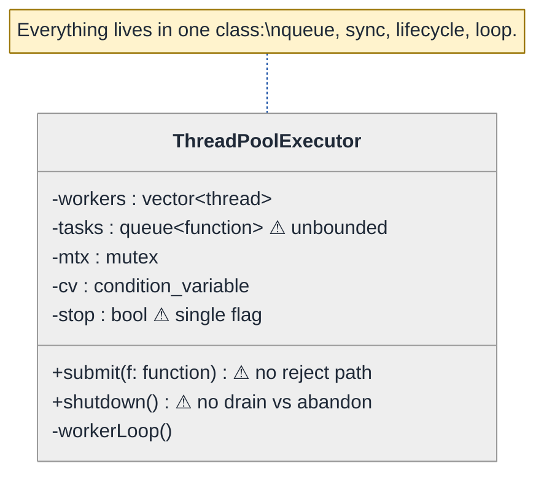
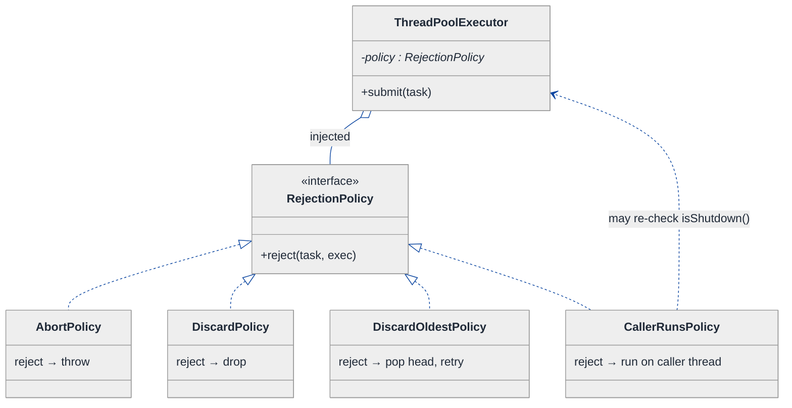
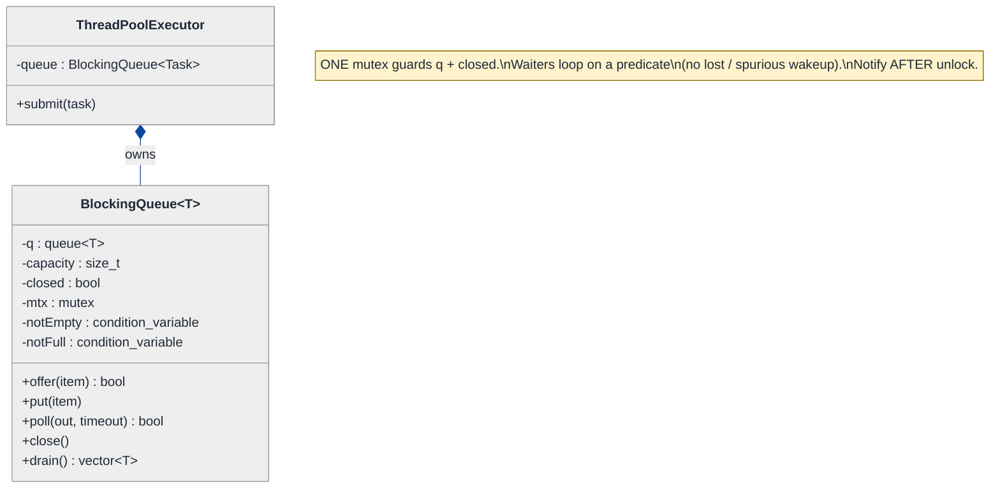
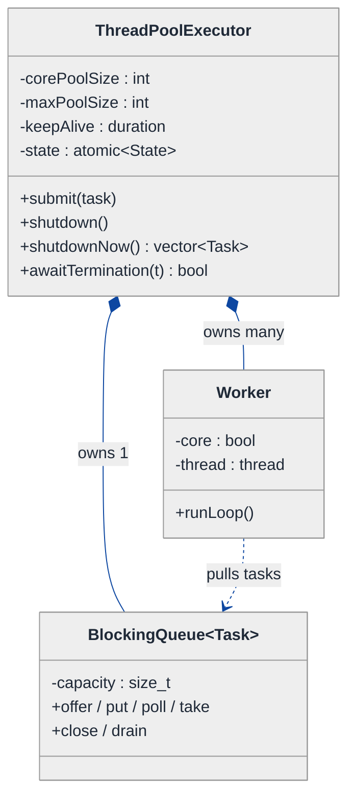
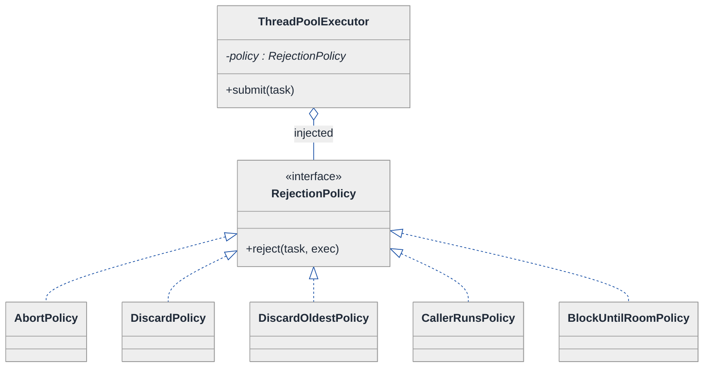
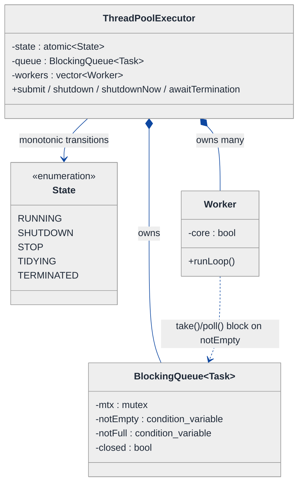
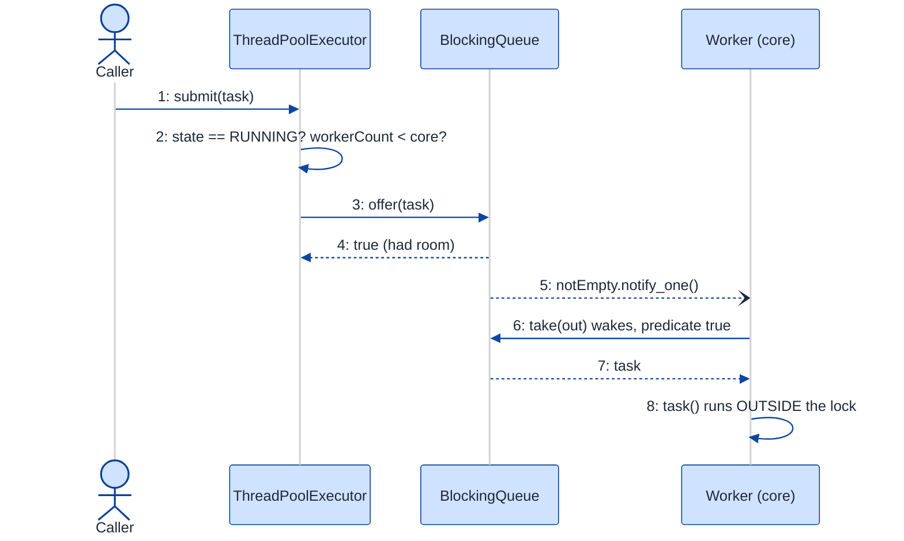
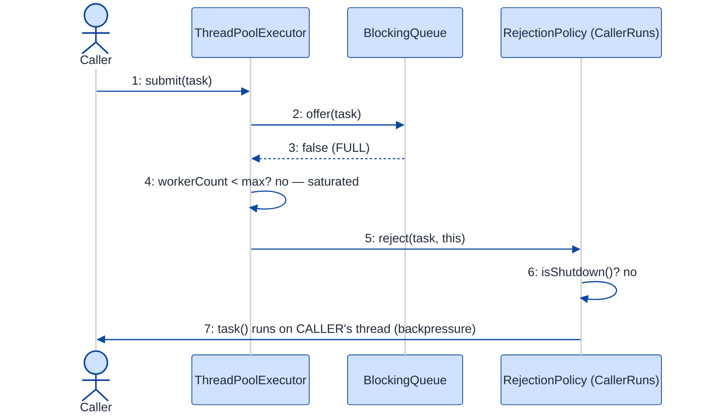

# Thread Pool Executor — LLD Walkthrough

> **Difficulty:** Hard · **Time:** ~45 min · **Pattern focus:** Strategy (rejection policy) + concurrency (Producer/Consumer over a bounded blocking queue)
>
> **Problem source(s):** GID OOD13, bucket `Object_Oriented_Design`. Representative of "build a `ThreadPoolExecutor`"-style LeetLens rows in [`./EXTRACTED_QUESTIONS.md`](./EXTRACTED_QUESTIONS.md). Mirrors `java.util.concurrent.ThreadPoolExecutor` closely enough to discuss in either C++ or Java.
>
> **Diagrams:** inline mermaid (renders natively in GitHub / VS Code). No external image sources.

---

## How to use this file

Paced for a candidate who knows threads exist but has never *built* a pool. Reading time: ~45 minutes if you sketch each iteration by hand. **The lesson: a thread pool is a Producer/Consumer system around a bounded queue — and the part the interviewer is really probing is what happens when the queue is FULL. That "what do we do on overflow" decision is a swappable algorithm. The naive answer hardcodes one behaviour; the senior answer makes it a Strategy. Concurrency correctness (one mutex, one condition variable, no lost wakeups, clean shutdown) is the other half of the bar.**

**Map of this file (15 sections):**

1. Problem statement + clarifying questions
2. Plain-English restatement
3. Why this matters
4. Mental model
5. Try it yourself first
6. Entity & verb extraction
7. **Iteration 1: the naive design** — one fixed set of threads, unbounded queue, no patterns
8. **Where the naive design hurts** — four future requirements, one painful diff each
9. **Pivot 1: Strategy for the rejection policy** — the most painful axis first
10. **Pivot 2: a real bounded BlockingQueue** — the concurrency core done correctly
11. **Pivot 3: graceful shutdown + dynamic worker sizing** — lifecycle state, not external swaps
12. Final UML class diagram
13. Skeleton code (C++17)
14. Key flow — sequence diagram
15. Extensibility re-check + anti-patterns + how to think aloud + self-check

---

## 1. Problem statement + clarifying questions

**Prompt (typical phrasing):** "Design a thread pool executor with configurable core and max pool size, a task queue with bounded capacity, rejection policies (abort, discard, caller-runs), and graceful shutdown."

**Clarifying questions to ask BEFORE writing anything:**

1. **Core vs max pool size — what's the growth rule?** Like `java.util.concurrent`: keep `corePoolSize` threads alive always, and only spin up extra threads (up to `maxPoolSize`) *when the queue is full*? Or grow eagerly to `max`? This single answer reshapes `submit()`.
2. **What does "bounded queue" mean for `submit()`?** When the queue is at capacity AND we're at `maxPoolSize` workers, do we block the caller, throw, drop the task, or run it on the caller's thread? (This is the rejection-policy axis — the heart of the question.)
3. **Which rejection policies?** Abort (throw), discard-silently, discard-oldest, caller-runs? Should new ones be addable without touching the executor core?
4. **Graceful vs immediate shutdown?** `shutdown()` = stop accepting new work but drain the queue; `shutdownNow()` = stop accepting AND abandon queued work, interrupt running tasks? Do we need to `awaitTermination(timeout)`?
5. **What is a "task"?** A `void()` callable (fire-and-forget), or do we return a future/promise so the caller can get a result back?
6. **Idle worker reaping?** Should threads above `corePoolSize` die after `keepAliveTime` of idleness, or live forever once created?
7. **Concurrency target / language?** Single process, many threads (C++ `std::thread` + `std::mutex` + `std::condition_variable`). Are we allowed `std::async`/`std::future`, or building from raw primitives to show we understand them?

**Assumptions if the interviewer dodges:** JUC-style growth (core threads always, grow to max only when the queue saturates, reap idle non-core threads after `keepAliveTime`); tasks are `std::function<void()>` but we expose a `submit()` that returns a `std::future<T>`; four rejection policies (abort / discard / discard-oldest / caller-runs), pluggable; both `shutdown()` (drain) and `shutdownNow()` (abandon); C++17 with raw `std::thread` + one `mutex` + one `condition_variable` so the concurrency is visible, not hidden behind `std::async`.

---

## 2. Plain-English restatement

We're building the machine that lets you say `pool.submit(task)` and have it run on *some* background thread, soon, without you ever calling `new std::thread` yourself. Internally it's a fixed (or elastically sized) crew of worker threads that sit in a loop pulling tasks off a shared queue and running them. The queue has a hard size limit so a runaway producer can't blow up memory. When the queue is full and the crew can't grow any further, *something* has to give — and the policy for "what gives" must be configurable (throw, drop, or make the submitter do the work itself). When the owner says "we're done," the pool must wind down cleanly: stop taking new work, let in-flight tasks finish, join every thread. The design must let us add a new rejection policy, or a new shutdown mode, **without rewriting the submit loop**.

---

## 3. Why this matters

This is the LLD question that doubles as a concurrency screen. It's where most candidates either deadlock themselves on a whiteboard or reveal they've never reasoned about a *lost wakeup*. Two skills are being probed at once: (a) can you spot that the rejection behaviour is a runtime-swappable algorithm — i.e. Strategy, not a chain of `if`s — and (b) can you write a bounded blocking queue with **one** mutex and **one** condition variable that never loses a notification and shuts down without a thread stuck forever in `wait()`. Get both right and you've shown you can design *and* reason about shared state. It reappears everywhere: web-server request pools, DB connection pools, async runtimes, job schedulers.

---

## 4. Mental model

A thread pool is a **restaurant kitchen**. Orders (tasks) come in at the pass and pile up on a **ticket rail** (the bounded queue). A fixed crew of **cooks** (core worker threads) each grab the next ticket, cook it, and come back for another. If tickets pile up faster than the cooks can clear them, the manager can call in **extra cooks** (up to `maxPoolSize`). But the rail only holds so many tickets — when it's *full and every cook is busy*, the host at the door must decide what to do with the next customer: turn them away (abort), quietly lose the order (discard), or hand them an apron and say "cook it yourself" (caller-runs).

```
Real-world sketch (NOT a UML diagram yet):

   submit(task) ──►  ┌──────────────── ticket rail (bounded queue, cap = N) ──────────────┐
   (producers)       │  [t7] [t6] [t5] [t4] [t3] [t2] [t1]  ← FIFO →                       │
                     └───────────────────────────────┬───────────────────────────────────┘
                                                      │  take()  (consumers block when empty)
                          ┌───────────────────────────┼───────────────────────────────┐
                          ▼               ▼            ▼              ▼                  ▼
                       [cook 1]        [cook 2]     [cook 3]     [+extra cook]    ...up to maxPool
                       (core)          (core)       (core)       (non-core, reaped when idle)

   rail FULL and no cook free  ──►  HOST DECISION (rejection policy): abort | discard | discardOldest | callerRuns
```

The KEY insight: there are exactly **three** moving concerns — the **queue** (a thread-safe buffer), the **workers** (a consumer crew with a lifecycle), and the **overflow policy** (what to do when there's no room). Buffer vs crew vs policy. Keeping those three separated is the whole design.

---

## 5. Try it yourself first

> **Predict before reading on:**
>
> 1. List 4 nouns you'd promote to a class and 2 you'd leave as fields. Where does "rejection policy" go — a field, an enum, or its own type?
> 2. **If I told you the pool will need five different overflow behaviours within a year (throw, drop-newest, drop-oldest, caller-runs, block-until-room), what would change about how you write `submit()`?**
> 3. A worker thread is blocked inside `queue.take()` waiting for a task. You call `shutdown()`. How does that worker ever wake up and exit instead of waiting forever?

---

## 6. Entity & verb extraction

> **Mini-refresher: noun → class, but not every noun.**
>
> Naive OOD promotes every noun to a class. Senior OOD promotes a noun only when it has BEHAVIOR and STATE that belong together. "Core pool size" is just an `int` field; "the queue" is a class because it owns an invariant (size ≤ capacity) and the synchronization that protects it.

**Nouns from the prompt:**

| Noun | Decision | Why |
|---|---|---|
| ThreadPoolExecutor | Class (top-level coordinator) | Owns workers + queue + policy; exposes `submit`/`shutdown` |
| Task | `std::function<void()>` (alias), not a class | A callable; no state of its own. Wrapped in a `std::packaged_task` when a future is needed |
| BlockingQueue | Class | Owns the size≤capacity invariant + the mutex/condvar that guard it |
| Worker | Class (or just a `std::thread` + loop) | Has a run-loop lifecycle; pulls and executes tasks |
| RejectionPolicy | Class (abstract) + concrete impls | The swappable overflow algorithm — the crux |
| Core / max pool size | `int` fields on the executor | Configuration, no behavior |
| keepAliveTime | `std::chrono::duration` field | Configuration |
| Pool state (RUNNING/SHUTDOWN/STOP/...) | `enum class` + an atomic field | Lifecycle — see §11 |

**Verbs (and the class they live on):**

| Verb | Owner class (naive answer — we'll re-examine) |
|---|---|
| submit(task) | ThreadPoolExecutor |
| enqueue / put(task) | BlockingQueue |
| take() / dequeue() | BlockingQueue (called by Worker) |
| runLoop() | Worker |
| reject(task) | ThreadPoolExecutor (naive) → RejectionPolicy (after Pivot 1) |
| shutdown() / shutdownNow() | ThreadPoolExecutor |
| awaitTermination(timeout) | ThreadPoolExecutor |

**We have NOT introduced any design patterns yet.** Pure nouns + verbs.

---

## 7. <a id="iter-1"></a>Iteration 1: the naive design

The simplest thing that could possibly work: spin up a fixed number of threads, give them an unbounded `std::queue` guarded by a mutex + condition variable, and have `submit()` push onto it. No rejection policy (the queue never fills — it's unbounded). No max-pool growth. Shutdown is a single `bool stop` flag.



**Reader's tour (read top to bottom; ~60 seconds).**

1. **One class does everything.** `ThreadPoolExecutor` holds the worker threads, the task queue, the mutex, the condition variable, the stop flag, AND the worker loop. There are NO collaborators. Every decision — buffering, synchronization, lifecycle, dispatch — lives inside this single class. That's the smell we'll expose.

2. **The queue is unbounded (⚠).** A plain `std::queue<std::function<void()>>` with no capacity check. `submit()` always succeeds by just pushing. There is no "what if it's full" code path because it can never be full. The prompt *demanded* bounded capacity + rejection policies — the naive design simply doesn't model them.

3. **`stop` is a single `bool` (⚠).** It conflates every shutdown mode into one flag. "Drain the queue then stop" and "abandon the queue and stop now" cannot both be expressed by one boolean.

4. **`submit()` has no reject path (⚠).** It pushes unconditionally. There's no decision point for overflow, so there's nowhere for a rejection policy to live.

5. **Fixed worker count.** No core/max distinction, no elastic growth, no idle reaping. The crew size is whatever you passed to the constructor, forever.

**What's deliberately missing.** No `BlockingQueue` type (the queue + its sync are inlined). No `RejectionPolicy` (overflow can't happen). No pool-state machine (one bool). No core/max growth. The naive design doesn't even *acknowledge* that overflow and shutdown-mode are axes of variation. That's what the next four sections expose and fix.

Skeleton code for the naive design (C++17):

```cpp
#include <condition_variable>
#include <functional>
#include <mutex>
#include <queue>
#include <thread>
#include <vector>

class ThreadPoolExecutor {
public:
    explicit ThreadPoolExecutor(std::size_t nThreads) {
        for (std::size_t i = 0; i < nThreads; ++i)
            workers_.emplace_back([this] { workerLoop(); });
    }

    void submit(std::function<void()> task) {       // no reject path — will hurt
        {
            std::unique_lock<std::mutex> lk(mtx_);
            tasks_.push(std::move(task));            // unbounded — will hurt
        }
        cv_.notify_one();
    }

    void shutdown() {                                // single flag — will hurt
        {
            std::unique_lock<std::mutex> lk(mtx_);
            stop_ = true;
        }
        cv_.notify_all();
        for (auto& w : workers_)
            if (w.joinable()) w.join();
    }

    ~ThreadPoolExecutor() { if (!stop_) shutdown(); }

private:
    void workerLoop() {
        for (;;) {
            std::function<void()> task;
            {
                std::unique_lock<std::mutex> lk(mtx_);
                cv_.wait(lk, [this] { return stop_ || !tasks_.empty(); });
                if (stop_ && tasks_.empty()) return;          // exit when told + drained
                task = std::move(tasks_.front());
                tasks_.pop();
            }
            task();                                            // run OUTSIDE the lock
        }
    }

    std::vector<std::thread>           workers_;
    std::queue<std::function<void()>>  tasks_;
    std::mutex                         mtx_;
    std::condition_variable            cv_;
    bool                               stop_ = false;
};
```

**This works.** It has zero design patterns. We can submit, run concurrently, and shut down (after draining). The one genuinely good bit — `task()` runs *outside* the lock so workers don't serialize on the mutex while executing — we'll keep. So what's wrong with it?

---

## 8. <a id="naive-pain"></a>Where the naive design hurts

The interviewer slides four requirements across the desk: "here's next quarter. Walk me through what changes."

### Change A: "The queue is eating all our RAM. Cap it at 1000, and decide what to do when it's full."

In the naive design:
- The queue is a bare `std::queue` — no capacity field, no full-check. You'd add a `capacity_` and an `if (tasks_.size() >= capacity_)` inside `submit()`.
- But then *what*? Throw? Drop? Block? You'd write that decision **inline inside `submit()`** as an `if/else`.
- **The change touches `submit()` and bakes a single overflow behaviour into it.** The prompt says we need *several* behaviours — so this `if/else` is about to grow.

### Change B: "Make the overflow behaviour configurable: abort, discard, discard-oldest, caller-runs."

In the naive design:
- That inline `if/else` from Change A becomes a `switch` on a `RejectionMode` enum inside `submit()`.
- `caller-runs` needs to call `task()` from the submitter's thread; `discard-oldest` needs to pop the front first; `abort` throws. Four unrelated bodies crammed into one method.
- **Every new policy → another `case` in `submit()`.** Classic tag-driven switch. The executor's core method now knows about every policy that will ever exist. Open/closed principle violated.

> **Mini-refresher: Open/Closed Principle (the "O" in SOLID).**
>
> Software should be **open for extension, closed for modification** — you should be able to add new behaviour by adding new code, not by editing existing, tested code. A `switch` that grows a `case` for every new variant is the canonical violation: each addition reopens (and risks breaking) a method that already works.

### Change C: "Add core vs max pool size. Keep 4 threads always; burst to 16 when the queue is full; let the extra 12 die after 60s idle."

In the naive design:
- Worker count is fixed in the constructor. There's no notion of "core" vs "extra," no growth trigger, no idle timeout.
- `submit()` would need to decide *create a new worker vs enqueue* based on current queue + worker counts — more logic piled into the same overloaded method.
- Idle reaping needs `cv_.wait_for(timeout)` and a rule for which workers are allowed to die. **Touches `submit()`, `workerLoop()`, and the worker bookkeeping all at once.**

### Change D: "We need two shutdown modes: `shutdown()` drains the queue; `shutdownNow()` abandons it and returns the un-run tasks."

In the naive design:
- `stop_` is one bool. It can't distinguish "stop after draining" from "stop NOW, abandon queue."
- You'd add a second bool (`abandon_`) and branch on it inside `workerLoop()`'s exit condition AND inside `shutdown()`. Two booleans encode 3-4 real states badly; the combination `stop_=true, abandon_=false` vs `stop_=true, abandon_=true` is an implicit state machine hiding in flags.
- **Touches `workerLoop()`, `shutdown()`, and adds a `shutdownNow()`.** And the next lifecycle concept (e.g. `TIDYING`/`TERMINATED` for `awaitTermination`) adds yet another bool.

### The pattern of pain

| Change | Files / methods touched | Smell |
|---|---|---|
| A. Cap the queue | `submit()` + new capacity field | "Buffer invariant scattered into the executor." |
| B. Configurable overflow | `submit()` `switch` grows per policy | "Tag-driven if/else; every new policy is surgery in the core method." |
| C. Core/max + idle reaping | `submit()` + `workerLoop()` + worker bookkeeping | "Growth + lifecycle logic crammed into the dispatch path." |
| D. Two shutdown modes | `workerLoop()` + `shutdown()` + booleans multiply | "A state machine encoded as a pile of bools." |

**Two axes of pain dominate:** (1) **algorithm variability** — the overflow/rejection behaviour is one algorithm out of many, chosen by config; and (2) **the concurrency core itself** is half-built (no bounded buffer, no clean blocking semantics) plus a **lifecycle** (pool states) badly encoded as flags.

> **Pivot question:** "What pattern handles 'an algorithm that varies, picked by the caller/config'? Where should the bounded-buffer invariant and its synchronization actually live? And what replaces a pile of shutdown booleans?"
>
> The answers are **Strategy** (rejection policy), a dedicated **BlockingQueue** abstraction (Producer/Consumer), and a small **state machine** for the pool lifecycle. We introduce them one at a time, starting with the most painful: the rejection policy.

---

## 9. <a id="pivot-1"></a>Pivot 1: Strategy for the rejection policy

> **Mini-refresher: Strategy pattern.**
>
> Encapsulates an algorithm behind an interface so it can be swapped at runtime. The CALLER (here, whoever configures the pool) decides which strategy to use; the strategy doesn't know about its peers.
>
> Quick example: a `Sorter` takes a `CompareStrategy*` in its constructor — pass `Ascending` or `Descending`; the sorter doesn't care which.

**Why Strategy fits the rejection policy.** "What to do when the queue is full and we can't grow" is an algorithm: `given (task, executor) → handle the overflow`. It varies — abort, discard, discard-oldest, caller-runs, block-until-room — and the choice is made *externally* (by whoever configures the pool), not by the executor's dispatch loop. The executor just needs to call `policy->reject(task, *this)` at the one overflow point and let polymorphism pick the body. That's textbook Strategy, and it directly kills Change B's growing `switch`.

**The refactor (just the affected slice):**

```cpp
class ThreadPoolExecutor;  // forward — the policy gets a reference back to it

// The Strategy interface: one algorithm, "handle a task we couldn't enqueue".
class RejectionPolicy {
public:
    virtual ~RejectionPolicy() = default;
    virtual void reject(std::function<void()> task, ThreadPoolExecutor& exec) = 0;
};

// Abort: throw so the submitter learns the pool is saturated.
class AbortPolicy : public RejectionPolicy {
public:
    void reject(std::function<void()>, ThreadPoolExecutor&) override {
        throw std::runtime_error("Task rejected: executor saturated");
    }
};

// CallerRuns: no thread free? the submitter runs the task itself (natural backpressure).
class CallerRunsPolicy : public RejectionPolicy {
public:
    void reject(std::function<void()> task, ThreadPoolExecutor& exec) override {
        if (!exec.isShutdown()) task();   // run on the calling thread — slows the producer down
    }
};

// Discard: silently drop the new task. (DiscardOldest pops the queue's head, then retries — elided.)
class DiscardPolicy : public RejectionPolicy {
public:
    void reject(std::function<void()>, ThreadPoolExecutor&) override { /* drop on the floor */ }
};
// DiscardOldestPolicy, BlockUntilRoomPolicy : public RejectionPolicy { /* elided */ };

class ThreadPoolExecutor {
    // ...
    std::unique_ptr<RejectionPolicy> policy_;   // injected at construction

    void submit(std::function<void()> task) {
        if (!queue_.offer(std::move(task)))      // offer() = non-blocking try-enqueue; false if full
            policy_->reject(std::move(task), *this);   // ONE overflow point, ZERO if/else here
    }
};
```

**What changed — visualized.** Just the rejection slice:



**Tour of the after-state.**

1. **Top: the executor gained ONE field.** `policy_` is a pointer to a `RejectionPolicy` interface, INJECTED at construction. The open diamond (`o--`) marks aggregation — the executor uses the policy. `submit()` no longer contains overflow logic; it just calls `policy_->reject(...)` at the single overflow point.

2. **Middle: the `<<interface>>` box.** Abstract base, one pure-virtual method: `reject(task, exec) → void`. The contract is tiny — given the task we couldn't enqueue and a handle back to the executor, do *something* with it.

3. **Bottom row: four concrete policies, four unrelated bodies.** `AbortPolicy` throws. `DiscardPolicy` drops. `DiscardOldestPolicy` evicts the queue head and retries the enqueue. `CallerRunsPolicy` runs the task on the *submitter's* thread — which is subtle and powerful: it applies natural backpressure, because while the producer is busy running a task it can't submit more.

4. **Change B from §8 now lands cleanly.** A new overflow behaviour = one new class implementing `RejectionPolicy`. `submit()` never changes. The growing `switch` is gone.

**Pattern-discrimination cheatsheet — Strategy vs Chain of Responsibility.**
- *Strategy:* exactly ONE handler runs; the config picks which. "Pick the overflow algorithm."
- *Chain of Responsibility:* a task is passed along a chain; each link decides handle-or-pass-on. "Try discard-oldest, else block, else abort."
- *Rule of thumb:* if the answer is "use *this one* policy" → Strategy. If it's "try these in order until one handles it" → Chain. Rejection is a single decision per submit, so → **Strategy**. (You *could* compose a chain later; you don't need it now.)

**Pattern-discrimination cheatsheet — Strategy vs a plain enum + `switch`.**
- *enum + switch:* fine for a CLOSED, small set that never grows and lives in one place.
- *Strategy:* right when the set is OPEN (callers add their own), or a variant needs its own state/dependencies (e.g. a metrics-logging policy needs a logger).
- *Rule of thumb:* "will someone add a variant I can't see today?" Yes → Strategy. The prompt explicitly says policies must be pluggable → Strategy.

---

## 10. <a id="pivot-2"></a>Pivot 2: a real bounded BlockingQueue (the Producer/Consumer core)

Change A from §8 is still open: the queue is still a bare `std::queue` with sync inlined into the executor, and there's no bounded `offer()` for Pivot 1's `submit()` to call. The variability here isn't an *algorithm* — it's a missing **abstraction with an invariant**: a buffer that's safe for many producers and many consumers, blocks consumers when empty, and refuses (or blocks) producers when full. Pull it into its own class.

> **Mini-refresher: Producer/Consumer over a bounded buffer.**
>
> Producers `put()` items; consumers `take()` them. A shared buffer with a max capacity sits between them. Consumers BLOCK when it's empty; producers BLOCK (or are rejected) when it's full. Synchronized with ONE mutex (guards the buffer) and condition variables to signal "not empty" / "not full". The classic correctness traps: (a) **always wait in a `while`/predicate loop**, never a bare `if`, to survive spurious wakeups; (b) **notify after** the state change; (c) don't hold the lock while running the task.

> **Mini-refresher: condition variable, lost wakeup, spurious wakeup.**
>
> A condition variable lets a thread `wait()` (atomically release the mutex + sleep) until another thread `notify`s it. **Lost wakeup:** if you `notify` *before* the other thread is waiting, the signal is gone — that's why you change state under the lock *then* notify, and why waiters re-check a predicate. **Spurious wakeup:** `wait()` can return with no notify at all — so always loop on the predicate (`cv.wait(lk, pred)` does this for you).

**Why a class, not Strategy.** There's nothing to *swap* here — we want ONE correct implementation of the buffer invariant, encapsulated so the executor (and the policies) talk to it through a clean interface (`offer`, `put`, `poll`, `take`, `drain`). Encapsulation, not polymorphism, is the tool. (If we later wanted a *priority* queue vs FIFO, *that* difference could become a Strategy — but the synchronization stays in the one class.)

**The refactor (just the buffer slice):**

```cpp
template <typename T>
class BlockingQueue {
public:
    explicit BlockingQueue(std::size_t capacity) : capacity_(capacity) {}

    // Non-blocking producer: enqueue if there's room, else return false (Pivot 1 calls this).
    bool offer(T item) {
        std::unique_lock<std::mutex> lk(mtx_);
        if (q_.size() >= capacity_) return false;        // full → caller invokes RejectionPolicy
        q_.push(std::move(item));
        lk.unlock();
        notEmpty_.notify_one();                          // wake ONE waiting consumer
        return true;
    }

    // Blocking producer: wait until there's room (used by BlockUntilRoomPolicy).
    void put(T item) {
        std::unique_lock<std::mutex> lk(mtx_);
        notFull_.wait(lk, [this] { return q_.size() < capacity_ || closed_; });
        if (closed_) return;
        q_.push(std::move(item));
        lk.unlock();
        notEmpty_.notify_one();
    }

    // Blocking consumer with a timeout (for idle-reaping non-core workers — Pivot 3).
    // Returns false if it timed out or the queue is closed-and-empty (signal to the worker to exit).
    bool poll(T& out, std::chrono::milliseconds timeout) {
        std::unique_lock<std::mutex> lk(mtx_);
        if (!notEmpty_.wait_for(lk, timeout, [this] { return !q_.empty() || closed_; }))
            return false;                                // timed out — caller decides to die or loop
        if (q_.empty()) return false;                    // closed & drained
        out = std::move(q_.front());
        q_.pop();
        lk.unlock();
        notFull_.notify_one();                           // a producer slot opened up
        return true;
    }

    // close() unblocks every waiter so workers can exit on shutdown — kills the "stuck in wait()" trap.
    void close() {
        { std::unique_lock<std::mutex> lk(mtx_); closed_ = true; }
        notEmpty_.notify_all();
        notFull_.notify_all();
    }

    std::vector<T> drain() {                             // shutdownNow(): pull everything out, unrun
        std::unique_lock<std::mutex> lk(mtx_);
        std::vector<T> out;
        while (!q_.empty()) { out.push_back(std::move(q_.front())); q_.pop(); }
        return out;
    }

private:
    std::queue<T>           q_;
    std::size_t             capacity_;
    bool                    closed_ = false;
    std::mutex              mtx_;
    std::condition_variable notEmpty_;   // consumers wait on this
    std::condition_variable notFull_;    // blocking producers wait on this
};
```

**What changed — visualized.** Just the buffer slice:



**Tour of the after-state.**

1. **The executor OWNS one `BlockingQueue` (filled diamond = composition).** Same lifetime: when the executor dies, the queue dies. The mutex and both condition variables that used to be loose fields on the executor now live INSIDE the queue, where the invariant they protect lives.

2. **One mutex, two condition variables.** `notEmpty_` is what consumers (`take`/`poll`) wait on; `notFull_` is what blocking producers (`put`) wait on. Splitting them means a producer waking up doesn't needlessly wake consumers and vice-versa. The single mutex still guards the whole buffer — there's no second lock to deadlock against.

3. **`offer()` vs `put()` is the key API split.** `offer()` is non-blocking: returns `false` immediately if full — this is exactly what Pivot 1's `submit()` needs so it can hand off to the `RejectionPolicy`. `put()` blocks until there's room — used only by a `BlockUntilRoomPolicy`. The two overflow philosophies (reject vs backpressure) are both expressible without an `if` in the executor.

4. **`poll(timeout)` is the idle-reaping hook.** It returns `false` on timeout, which a non-core worker reads as "I've been idle long enough — exit." That's how Change C's `keepAliveTime` reaping gets built without any timer thread.

5. **`close()` is the shutdown-correctness lynchpin.** It sets `closed_` and `notify_all()`s BOTH condition variables, so every thread parked in `wait()` wakes, re-checks its predicate, sees `closed_`, and leaves. This is the fix for the "worker stuck forever in `take()`" trap from §5 question 3 — **you must wake the sleepers, not just set a flag.**

**Predicate-loop discipline.** Every `wait` uses the predicate-overload (`wait(lk, pred)` / `wait_for(lk, timeout, pred)`), which loops internally — immune to spurious wakeups. Every state change happens under the lock, and `notify` happens after we mutate `q_`/`closed_`. That trio (lock → mutate → notify) is what prevents lost wakeups.

---

## 11. <a id="pivot-3"></a>Pivot 3: graceful shutdown + elastic workers — lifecycle as a state machine

Changes C and D from §8 remain: core-vs-max elastic sizing with idle reaping, and two shutdown modes. The variability here is NOT an algorithm the caller swaps — it's the pool's own **lifecycle**: it moves `RUNNING → SHUTDOWN → TERMINATED` (and `RUNNING → STOP → TERMINATED` for the abrupt path), and *what's legal* depends on which state it's in. `submit()` is allowed while `RUNNING`, rejected after `shutdown()`. That's a state machine, and the cleanest encoding is a typed state field with explicit, monotonic transitions — not a pile of bools.

> **Mini-refresher: a lifecycle state machine (lightweight State-pattern cousin).**
>
> When an object's legal operations depend on "what phase am I in," model the phase explicitly. Heavyweight version = the GoF **State pattern** (one class per state, each owning its transitions). Lightweight version (right-sized here) = an `enum class` state + an `atomic` field + transitions that only ever move *forward* (monotonic), with each public method checking the state first. Use the lightweight form when states have no rich per-state behaviour — here a state mostly gates "do we accept work / do we drain."

**Why monotonic state, not booleans.** Two bools (`stop_`, `abandon_`) encode four combinations, two of which are nonsense (e.g. "not stopping but abandoning"). An ordered `enum class State { RUNNING, SHUTDOWN, STOP, TIDYING, TERMINATED }` with the rule "you may only advance, never go back" makes illegal states unrepresentable and makes `awaitTermination` a simple `cv.wait(...) until state == TERMINATED`.

**Core vs max sizing rule (JUC semantics).** On `submit()`:
1. If running workers `< corePoolSize` → start a new core worker for this task.
2. Else try `queue_.offer(task)` → success means a core worker will pick it up.
3. Else (queue full) if workers `< maxPoolSize` → start a new *non-core* worker for this task.
4. Else → `policy_->reject(task, *this)`.

Non-core workers use `queue_.poll(keepAlive_)`; a timeout means "idle too long, exit" (so the crew shrinks back to core). Core workers use blocking `take()` and live until shutdown.

**The refactor (just the lifecycle + sizing slice):**

```cpp
enum class State { RUNNING, SHUTDOWN, STOP, TIDYING, TERMINATED };  // ordered: only advance

class ThreadPoolExecutor {
public:
    void submit(std::function<void()> task) {
        if (state_.load() != State::RUNNING) { policy_->reject(std::move(task), *this); return; }

        if (workerCount() < corePoolSize_) { addWorker(std::move(task), /*core=*/true); return; }
        if (queue_.offer(task))             { return; }                       // a core worker will run it
        if (workerCount() < maxPoolSize_)   { addWorker(std::move(task), /*core=*/false); return; }
        policy_->reject(std::move(task), *this);                              // saturated
    }

    void shutdown() {                       // graceful: stop accepting, DRAIN, then terminate
        advanceState(State::SHUTDOWN);
        queue_.close();                     // wakes idle workers; they exit once queue is drained
    }

    std::vector<std::function<void()>> shutdownNow() {   // abrupt: abandon queued work
        advanceState(State::STOP);
        auto pending = queue_.drain();      // pull un-run tasks back out
        queue_.close();                     // wake everyone; running tasks finish, then workers exit
        return pending;                     // hand un-run tasks back to the caller
    }

    bool awaitTermination(std::chrono::milliseconds t) {
        std::unique_lock<std::mutex> lk(stateMtx_);
        return termCv_.wait_for(lk, t, [this] { return state_.load() == State::TERMINATED; });
    }

    bool isShutdown() const { return state_.load() != State::RUNNING; }

private:
    void advanceState(State target) {       // monotonic CAS: never move backwards
        State cur = state_.load();
        while (cur < target && !state_.compare_exchange_weak(cur, target)) { /* retry */ }
    }

    void workerLoop(bool core) {
        std::function<void()> task;
        for (;;) {
            bool got = core ? queue_.take(task)              // core: block forever until task/close
                            : queue_.poll(task, keepAlive_); // non-core: time out when idle → die
            if (!got) {                                      // closed&drained, or non-core idle timeout
                if (state_.load() >= State::SHUTDOWN || !core) break;
                continue;
            }
            task();                                          // run OUTSIDE any lock
        }
        if (onLastWorkerExit()) { advanceState(State::TIDYING); advanceState(State::TERMINATED);
                                  termCv_.notify_all(); }
    }
    // addWorker(), workerCount(), onLastWorkerExit() bookkeeping elided
    std::atomic<State> state_{State::RUNNING};
    // ... corePoolSize_, maxPoolSize_, keepAlive_, queue_, policy_, workers_, stateMtx_, termCv_ ...
};
```

**What changed — visualized.** The pool's lifecycle states and legal transitions:

```mermaid
---
config:
  theme: neutral
  themeVariables:
    background: '#ffffff'
    primaryColor: '#cfe2ff'
    primaryTextColor: '#1f2937'
    primaryBorderColor: '#084298'
    secondaryColor: '#fff3cd'
    secondaryTextColor: '#1f2937'
    secondaryBorderColor: '#664d03'
    tertiaryColor: '#d1e7dd'
    tertiaryTextColor: '#1f2937'
    tertiaryBorderColor: '#0a3622'
    lineColor: '#0d47a1'
    textColor: '#1f2937'
    noteBkgColor: '#fff3cd'
    noteTextColor: '#1f2937'
    noteBorderColor: '#997404'
    actorBkg: '#cfe2ff'
    actorBorder: '#084298'
    actorTextColor: '#1f2937'
    signalColor: '#0d47a1'
    signalTextColor: '#1f2937'
    labelBoxBkgColor: '#ffffff'
    labelBoxBorderColor: '#d3d3d3'
    labelTextColor: '#1f2937'
    edgeLabelBackground: '#ffffff'
    labelBackground: '#ffffff'
    classText: '#1f2937'
    fontFamily: 'system-ui, -apple-system, Segoe UI, Helvetica, Arial, sans-serif'
  themeCSS: |
    .messageText, .labelText, .sequenceNumber {
      paint-order: stroke fill;
      stroke: #ffffff;
      stroke-width: 5px;
      stroke-linejoin: round;
      stroke-linecap: round;
    }
    .edgePath path,
    .flowchart-link,
    .messageLine0,
    .messageLine1,
    .relation,
    .composition,
    .aggregation,
    .extension,
    .dependency {
      stroke-width: 2.5px !important;
    }
    marker path {
      stroke-width: 1.5px !important;
    }
---
stateDiagram-v2
  direction LR
  [*] --> RUNNING
  RUNNING --> SHUTDOWN : shutdown() (accept no new, drain)
  RUNNING --> STOP : shutdownNow() (abandon queue)
  SHUTDOWN --> TIDYING : queue drained and workers done
  STOP --> TIDYING : workers done (queued tasks abandoned)
  TIDYING --> TERMINATED : terminated() hook; notify awaitTermination
  TERMINATED --> [*]
```



**Tour of the after-state.**

1. **The pile of bools is gone.** One `std::atomic<State>` holds the phase. Transitions are *monotonic* — `advanceState` uses a compare-exchange loop that only ever moves to a higher state, never back. Illegal states (like "abandoning but not shutting down") simply can't be represented.

2. **`submit()` checks the state FIRST.** If we're past `RUNNING`, the task goes straight to the rejection policy — no new work is accepted after `shutdown()`. Then it runs the JUC sizing ladder: core grow → enqueue → non-core grow → reject. The rejection *strategy* from Pivot 1 plugs in at the bottom unchanged.

3. **`shutdown()` vs `shutdownNow()` are now distinct, clean operations.** `shutdown()` advances to `SHUTDOWN` and `close()`s the queue — workers keep draining queued tasks, then exit (graceful). `shutdownNow()` advances to `STOP`, `drain()`s the un-run tasks back to the caller, then `close()`s — running tasks finish but queued ones are abandoned (abrupt). Two diagram edges, two methods. Change D solved.

4. **Core vs non-core workers differ only in how they pull.** Core workers `take()` (block forever); non-core workers `poll(keepAlive_)` and exit on timeout. That single difference implements the entire elastic-sizing + idle-reaping requirement (Change C) without a separate reaper thread.

5. **The last worker out turns off the lights.** When the final worker exits, it advances `TIDYING → TERMINATED` and notifies `termCv_`, which is what `awaitTermination(timeout)` is parked on. Clean, observable termination.

**Pattern-discrimination cheatsheet — full State pattern vs lightweight enum-state machine.**
- *Full State pattern:* one class per state, rich per-state behaviour, states own their transitions. Right when each state does substantially different work (e.g. a `Ticket`'s Active/Paid/Exited).
- *Lightweight enum-state:* an `enum class` + atomic + guard checks. Right when states mostly *gate* operations and carry little behaviour — exactly our pool.
- *Rule of thumb:* if you'd write five fat state classes that each barely differ, you don't need GoF State; an ordered enum is clearer. **Don't over-pattern.**

---

## 12. <a id="fig-class-diagram"></a>Final class diagram

One giant diagram would be a wall of boxes. Here are **three focused sub-views**; the structural insight at the end ties them together.

### 12.1 The ownership spine — what the executor OWNS



**Tour of 12.1.** The executor composes (filled diamond = same lifetime) exactly one `BlockingQueue` and many `Worker`s. Workers depend on the queue (dashed arrow) — they *pull* from it but don't own it. The executor holds the config (`core`, `max`, `keepAlive`) and the single atomic `state`. Compared to the naive design, the mutex/condvar/stop-flag soup is gone from this class — it migrated into `BlockingQueue` (sync) and the `state` machine (lifecycle).

### 12.2 The policy injection — the swappable axis



**Tour of 12.2.**

1. **One executor, one injected `RejectionPolicy` interface.** Open diamond = aggregation: the executor uses the policy; it's chosen at construction. `submit()`'s only overflow code is `policy_->reject(task, *this)`.

2. **Five concrete policies, each a self-contained body.** Abort throws; Discard drops; DiscardOldest evicts head + retries; CallerRuns runs on the submitter (backpressure); BlockUntilRoom calls `queue_.put()` to wait for space. The first three are the prompt's explicit set; the last two show the axis is genuinely open.

3. **The structural payoff.** The overflow behaviour the naive design hardcoded inside `submit()` is lifted into its own hierarchy. A new policy is one new class, zero edits to the executor — the open/closed principle in practice.

### 12.3 The concurrency core — queue + worker + lifecycle together



**Tour of 12.3.**

1. **Lifecycle = an ordered enum, not the State pattern.** The executor advances through `State` monotonically. No per-state classes — these states gate operations rather than carry behaviour, so the lightweight machine is the right call (see Pivot 3's cheatsheet).

2. **All synchronization is encapsulated in `BlockingQueue`.** The mutex and two condition variables live with the invariant they protect. Workers block on `notEmpty_` inside `take()`/`poll()`; the `closed_` flag + `notify_all()` in `close()` is what lets them all wake and exit on shutdown.

3. **Workers differ by one bool.** `core` decides whether the run-loop uses blocking `take()` (immortal until shutdown) or timed `poll(keepAlive)` (self-reaping when idle). That single field implements the entire core/max elasticity.

### Structural insight (ties 12.1 + 12.2 + 12.3 together)

| Concern | Tool used | Why |
|---|---|---|
| **Buffer** (bounded, thread-safe) | `BlockingQueue` class — encapsulation | One correct impl of the size≤capacity invariant + its sync. Nothing to swap. |
| **Overflow policy** (abort / discard / caller-runs / …) | **Strategy**, INJECTED | Caller/config picks the algorithm; set is open; each policy is one class. |
| **Worker crew** (core vs non-core, elastic) | Plain objects + one `core` bool | Difference is "how to pull," not identity — a field, not a subclass. |
| **Pool lifecycle** (RUNNING→…→TERMINATED) | Ordered `enum class` + atomic, monotonic | States gate operations; full GoF State would be five near-identical fat classes. |

The big lesson: **Strategy for the one axis that genuinely varies (overflow), encapsulation for the invariant (the queue), and a right-sized state machine for the lifecycle.** Don't reach for the heavyweight State pattern just because there's a lifecycle, and don't bury the rejection decision in a `switch`. *Pattern where it pays; plain code where it doesn't.*

---

## 13. Skeleton code (C++17)

> Show the SHAPES, not the full impl. ~150 lines. `using Task = std::function<void()>;`

```cpp
#include <atomic>
#include <chrono>
#include <condition_variable>
#include <functional>
#include <future>
#include <memory>
#include <mutex>
#include <queue>
#include <stdexcept>
#include <thread>
#include <vector>

using Task = std::function<void()>;
class ThreadPoolExecutor;   // forward — policies hold a reference back

// ── Strategy: the rejection policy (one swappable axis) ─────────────
class RejectionPolicy {
public:
    virtual ~RejectionPolicy() = default;
    virtual void reject(Task task, ThreadPoolExecutor& exec) = 0;
};
class AbortPolicy : public RejectionPolicy {
public:
    void reject(Task, ThreadPoolExecutor&) override {
        throw std::runtime_error("Task rejected: executor saturated");
    }
};
class CallerRunsPolicy : public RejectionPolicy {
public:
    void reject(Task task, ThreadPoolExecutor& exec) override;   // runs task() if !exec.isShutdown()
};
class DiscardPolicy : public RejectionPolicy {
public:
    void reject(Task, ThreadPoolExecutor&) override { /* drop */ }
};
// DiscardOldestPolicy, BlockUntilRoomPolicy : public RejectionPolicy { /* elided */ };

// ── Bounded blocking queue (Producer/Consumer core) ─────────────────
template <typename T>
class BlockingQueue {
public:
    explicit BlockingQueue(std::size_t cap) : capacity_(cap) {}

    bool offer(T item) {                                  // non-blocking; false if full
        std::unique_lock<std::mutex> lk(mtx_);
        if (q_.size() >= capacity_) return false;
        q_.push(std::move(item)); lk.unlock();
        notEmpty_.notify_one(); return true;
    }
    void put(T item) {                                    // blocks until room (BlockUntilRoomPolicy)
        std::unique_lock<std::mutex> lk(mtx_);
        notFull_.wait(lk, [this]{ return q_.size() < capacity_ || closed_; });
        if (closed_) return;
        q_.push(std::move(item)); lk.unlock(); notEmpty_.notify_one();
    }
    bool take(T& out) {                                   // core worker: block until task or close
        std::unique_lock<std::mutex> lk(mtx_);
        notEmpty_.wait(lk, [this]{ return !q_.empty() || closed_; });
        if (q_.empty()) return false;                     // closed & drained → worker exits
        out = std::move(q_.front()); q_.pop(); lk.unlock(); notFull_.notify_one(); return true;
    }
    bool poll(T& out, std::chrono::milliseconds to) {     // non-core worker: idle-reap on timeout
        std::unique_lock<std::mutex> lk(mtx_);
        if (!notEmpty_.wait_for(lk, to, [this]{ return !q_.empty() || closed_; })) return false;
        if (q_.empty()) return false;
        out = std::move(q_.front()); q_.pop(); lk.unlock(); notFull_.notify_one(); return true;
    }
    void close() {                                        // wake every waiter so they can exit
        { std::unique_lock<std::mutex> lk(mtx_); closed_ = true; }
        notEmpty_.notify_all(); notFull_.notify_all();
    }
    std::vector<T> drain() {                              // shutdownNow(): un-run tasks back out
        std::unique_lock<std::mutex> lk(mtx_);
        std::vector<T> out; while (!q_.empty()) { out.push_back(std::move(q_.front())); q_.pop(); }
        return out;
    }
private:
    std::queue<T>           q_;
    std::size_t             capacity_;
    bool                    closed_ = false;
    std::mutex              mtx_;
    std::condition_variable notEmpty_, notFull_;
};

// ── Pool lifecycle (ordered: only advance) ──────────────────────────
enum class State { RUNNING, SHUTDOWN, STOP, TIDYING, TERMINATED };

// ── The executor (orchestrator) ─────────────────────────────────────
class ThreadPoolExecutor {
public:
    ThreadPoolExecutor(int core, int max, std::chrono::milliseconds keepAlive,
                       std::size_t queueCap, std::unique_ptr<RejectionPolicy> policy)
        : corePoolSize_(core), maxPoolSize_(max), keepAlive_(keepAlive),
          queue_(queueCap), policy_(std::move(policy)) {}

    // submit returning a future, so the caller can get a result back.
    template <typename F, typename R = std::invoke_result_t<F>>
    std::future<R> submit(F fn) {
        auto pt  = std::make_shared<std::packaged_task<R()>>(std::move(fn));
        auto fut = pt->get_future();
        execute([pt]{ (*pt)(); });
        return fut;
    }

    void execute(Task task) {
        if (state_.load() != State::RUNNING) { policy_->reject(std::move(task), *this); return; }
        if (workerCount() < corePoolSize_) { addWorker(std::move(task), /*core=*/true); return; }
        if (queue_.offer(task))             { return; }
        if (workerCount() < maxPoolSize_)   { addWorker(std::move(task), /*core=*/false); return; }
        policy_->reject(std::move(task), *this);
    }

    void shutdown()    { advanceState(State::SHUTDOWN); queue_.close(); }
    std::vector<Task> shutdownNow() {
        advanceState(State::STOP); auto p = queue_.drain(); queue_.close(); return p;
    }
    bool awaitTermination(std::chrono::milliseconds t) {
        std::unique_lock<std::mutex> lk(stateMtx_);
        return termCv_.wait_for(lk, t, [this]{ return state_.load() == State::TERMINATED; });
    }
    bool isShutdown() const { return state_.load() != State::RUNNING; }

    ~ThreadPoolExecutor() {
        if (state_.load() == State::RUNNING) shutdown();
        for (auto& w : workers_) if (w.joinable()) w.join();
    }

private:
    void advanceState(State target) {
        State cur = state_.load();
        while (cur < target && !state_.compare_exchange_weak(cur, target)) { /* retry */ }
    }
    void addWorker(Task first, bool core) {                       // bookkeeping elided
        ++workerCount_;
        workers_.emplace_back([this, first = std::move(first), core]() mutable {
            if (first) first();
            workerLoop(core);
        });
    }
    void workerLoop(bool core) {
        Task task;
        for (;;) {
            bool got = core ? queue_.take(task) : queue_.poll(task, keepAlive_);
            if (!got) { if (state_.load() >= State::SHUTDOWN || !core) break; else continue; }
            task();                                              // run OUTSIDE the lock
        }
        if (--workerCount_ == 0 && state_.load() >= State::SHUTDOWN) {
            advanceState(State::TIDYING); advanceState(State::TERMINATED); termCv_.notify_all();
        }
    }
    int  workerCount() const { return workerCount_.load(); }

    int                              corePoolSize_, maxPoolSize_;
    std::chrono::milliseconds        keepAlive_;
    BlockingQueue<Task>              queue_;
    std::unique_ptr<RejectionPolicy> policy_;
    std::vector<std::thread>         workers_;
    std::atomic<State>               state_{State::RUNNING};
    std::atomic<int>                 workerCount_{0};
    std::mutex                       stateMtx_;
    std::condition_variable          termCv_;
};

// Deferred: CallerRuns needs the full executor type.
inline void CallerRunsPolicy::reject(Task task, ThreadPoolExecutor& exec) {
    if (!exec.isShutdown()) task();          // backpressure: submitter runs it
}
```

> **Mini-refresher: `std::packaged_task` + `std::future`.**
>
> `std::packaged_task<R()>` wraps a callable so that invoking it stores the result (or exception) into a shared state; `get_future()` hands the caller a `std::future<R>` to retrieve it later. We wrap the task in a `shared_ptr` so the `Task` (a `std::function<void()>`) can be copied into the queue while keeping the future's shared state alive. This is how a fire-and-forget worker loop can still return results to submitters.

---

## 14. <a id="fig-sequence"></a>Key flow — sequence diagram

This is the moment of truth — read across the swimlanes to see how the Strategy and the Producer/Consumer queue COOPERATE, and what the design HIDES from the caller.

### Phase 1 — submit while there's room



**Tour of Phase 1 (submit, queue has room).**

1. **Caller submits.** Returns a `std::future` immediately (not shown) — the caller never touches a thread.
2. **Executor checks state + sizing.** `RUNNING` and at/over core size, so it tries the queue rather than spawning.
3-4. **`offer()` succeeds.** Non-blocking enqueue under the queue's mutex; returns `true` because there was room.
5. **The queue notifies ONE waiting consumer** (`notEmpty_.notify_one()`) *after* the push — lock-then-mutate-then-notify, no lost wakeup.
6-7. **A parked core worker wakes,** re-checks its predicate (not a bare `if` — survives spurious wakeups), pops the task.
8. **The worker runs `task()` OUTSIDE the lock** — so other workers and producers aren't blocked while it executes. End of Phase 1.

### Phase 2 — submit when saturated (the rejection Strategy fires)



**Tour of Phase 2 (saturated — the Strategy decides).**

1-3. **Submit, `offer()` returns `false`** — the queue is at capacity.
4. **Executor checks growth:** already at `maxPoolSize`, so no new worker. Saturated.
5. **Executor delegates to the injected `RejectionPolicy`** — `policy_->reject(task, *this)`. **The executor itself contains ZERO overflow logic; polymorphism picks the body.**
6-7. **`CallerRunsPolicy` runs the task on the caller's own thread.** This is the elegant part: while the caller is busy executing this task, it *cannot* submit more — natural backpressure that throttles the producer without a single explicit `sleep` or `if`. Swap in `AbortPolicy` and step 7 becomes a thrown exception instead; swap in `DiscardPolicy` and step 7 vanishes. Same diagram, different leaf.

### The behaviour that's NOT shown — and why it matters

You don't see `if (queueIsFull) { if (policy == ABORT) throw; else if (policy == DISCARD) ... }` anywhere. That branching is GONE — it's replaced by one polymorphic `reject()` call. **The class hierarchy IS the overflow decision.** Likewise, you don't see a worker "checking a stop flag in a busy loop" — workers sleep in `wait()` and are woken by `close()`'s `notify_all()`. **Correct blocking, not polling.** Those two absences are exactly what separates a senior answer from a beginner's.

---

## 15. Extensibility re-check + anti-patterns + how to think aloud + self-check

### Extensibility re-check

Revisit the four changes from [§8](#naive-pain). For each, name the SINGLE thing that changes.

| Change | Naive design impact | Final design impact |
|---|---|---|
| A. Cap the queue | `submit()` + new field + inline overflow | Construct `BlockingQueue` with a capacity; `offer()` already enforces it. Done. |
| B. Configurable overflow | `submit()` `switch` grows per policy | New `XxxPolicy : RejectionPolicy` class, injected at construction. Done. |
| C. Core/max + idle reaping | `submit()` + `workerLoop()` + bookkeeping | Already modelled: sizing ladder in `execute()`, `core` bool picks `take` vs `poll`. New sizing rule = edit one method. |
| D. Two shutdown modes | `workerLoop()` + `shutdown()` + bool soup | `shutdown()`/`shutdownNow()` distinguished by the `State` machine + `drain()`. A third mode = one more ordered state. |

Changes A, B, D are each ONE new class / one construction choice. That's the open/closed principle in practice. If a future requirement makes you change `BlockingQueue`, `RejectionPolicy`, AND the `State` machine together — go back to §6; you've conflated two axes.

### Common confusion + traps

1. **"Why is the queue a class but the rejection policy a Strategy?"** The queue has ONE correct behaviour (a guarded invariant) — encapsulate it. The policy has MANY behaviours chosen by config — make it a Strategy. Different problems, different tools.

2. **"Why not the full GoF State pattern for the lifecycle?"** Because the states gate operations rather than carry rich, differing behaviour. Five near-identical state classes would be ceremony. An ordered `enum class` + atomic is clearer. (If states each did substantial work, flip to State — see the Pivot 3 cheatsheet.)

3. **"Why two condition variables, not one?"** `notEmpty_` for consumers, `notFull_` for blocking producers. One CV works too (`notify_all` everyone), but it wakes threads that can't make progress (a producer woken by another producer leaving). Two CVs target the right waiters.

4. **"Why run `task()` outside the lock?"** If you hold the mutex while running, the whole pool serializes on that one lock — you've built a single-threaded executor with extra steps. Pop under the lock, release, then run.

5. **"How does a blocked worker ever exit on shutdown?"** `close()` sets `closed_` AND `notify_all()`s. Setting the flag alone is the classic bug — the worker is asleep in `wait()` and never re-checks. You must wake it.

### Anti-patterns

- **"God executor"** — one class holding queue, sync, lifecycle, AND overflow logic (the naive design). Split into `BlockingQueue` + `RejectionPolicy` + a `State` field.
- **"Tag-driven `switch` on rejection mode"** — `if (mode == ABORT) throw; else if (mode == DISCARD)...` inside `submit()`. Use the Strategy interface.
- **"Stop flag without a wakeup"** — setting `stop_ = true` but not notifying; workers sleep forever in `wait()`.
- **"`if` instead of `while`/predicate on a condition variable"** — breaks on spurious wakeups. Always use the predicate overload.
- **"Holding the lock while running the task"** — serializes the whole pool.
- **"Busy-wait polling the queue"** — `while (queue.empty()) {}` burns a CPU core. Block on a condition variable instead.
- **"Unbounded queue called 'bounded'"** — defeats the entire backpressure story; OOMs under load.
- **"Singleton executor because there's one pool"** — there may be several (an IO pool + a CPU pool). Inject, don't globalize.

### How to think aloud

> "Thread pool. Let me clarify scope. [Asks the §1 questions: core/max growth rule, what 'bounded' does to submit, which rejection policies, graceful vs immediate shutdown, task-returns-future?] Got it — JUC semantics, four pluggable policies, two shutdown modes.
>
> Nouns: ThreadPoolExecutor, BlockingQueue, Worker, RejectionPolicy. Core/max/keepAlive are config fields; pool state is a lifecycle.
>
> I'll write the NAIVE design first — one class, an unbounded queue guarded by a mutex + condvar, fixed workers, a single stop bool. It runs, zero patterns. Then I'll stress it.
>
> Change A: cap the queue — needs a full-check and a decision. Change B: make that decision configurable — naive `submit()` grows a `switch`. Change C: core vs max + idle reaping — sizing logic piles into submit + workerLoop. Change D: two shutdown modes — one bool becomes a bool soup.
>
> Two axes: the overflow behaviour is a swappable algorithm → Strategy. The bounded buffer is a missing abstraction with an invariant → its own `BlockingQueue` class, done with one mutex and two condition variables, always waiting on a predicate, notifying after the state change, running tasks outside the lock. The lifecycle is a small monotonic state machine, not the full State pattern — five gating states don't earn five classes.
>
> Pivot 1: `RejectionPolicy` interface — Abort/Discard/DiscardOldest/CallerRuns. `submit()` calls `policy->reject()` at the single overflow point. Pivot 2: `BlockingQueue` with `offer/put/take/poll/close/drain` — and `close()` is what wakes sleepers on shutdown. Pivot 3: ordered `enum State` + atomic; `shutdown()` drains, `shutdownNow()` abandons and returns un-run tasks; `awaitTermination` waits on a CV the last worker notifies.
>
> Final: executor composes one queue + many workers, aggregates one injected policy, advances a monotonic state. Every future change is one class or one construction choice. Open/closed, and concurrency-correct."

### Self-check

> **Self-check — the question to ask next time.**
>
> When you see "design a [system] that does [different things] when [some boundary condition] hits," before reaching for a `switch`, ask:
>
> > **"Is the varying behaviour an algorithm the CALLER/config picks (Strategy), an invariant that needs ONE correct guarded implementation (encapsulate it), or a lifecycle the OBJECT moves through (state machine — lightweight enum unless states carry rich behaviour, then GoF State)?"**
>
> Overflow policy → Strategy. The bounded buffer → encapsulated class. The shutdown lifecycle → ordered enum-state. Three different axes, three different tools — and on top of all of it, the concurrency discipline: one mutex per invariant, predicate-loop every wait, notify after mutating, run work outside the lock, and wake every sleeper on shutdown.

---

## Cross-references

- **Parent topic manifest:** [`./EXTRACTED_QUESTIONS.md`](./EXTRACTED_QUESTIONS.md)
- **Vertical overview:** [`../../LEARNING.md`](../../LEARNING.md)
- **Template:** [`../../TEMPLATE-v2.md`](../../TEMPLATE-v2.md)
- **Canonical exemplar:** [`./Parking_Lot.md`](./Parking_Lot.md) — the gold-standard Strategy + State walkthrough
- **Related v2 walkthroughs:**
  - Strategy Pattern deep-dive (in `../Strategy_Pattern/`) — the rejection-policy axis is a textbook Strategy
  - State Pattern deep-dive (in `../State_Pattern/`) — contrast the lightweight enum-state machine here with full GoF State
  - Producer/Consumer & bounded-buffer data structures (in `../../LLD_DataStructures/`) — the `BlockingQueue` core
- **External references:**
  - <a href="https://docs.oracle.com/en/java/javase/17/docs/api/java.base/java/util/concurrent/ThreadPoolExecutor.html" target="_blank" rel="noopener noreferrer">java.util.concurrent.ThreadPoolExecutor (JavaSE 17 API)</a> — the canonical core/max/keepAlive + rejection-handler semantics this design mirrors
  - <a href="https://en.cppreference.com/w/cpp/thread/condition_variable" target="_blank" rel="noopener noreferrer">cppreference: std::condition_variable</a> — predicate-loop waiting, spurious wakeups
