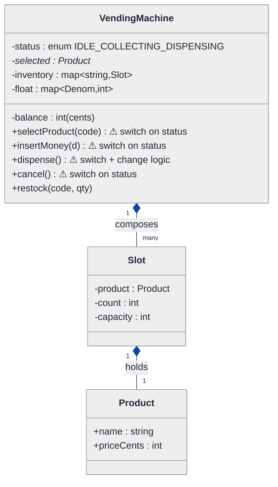
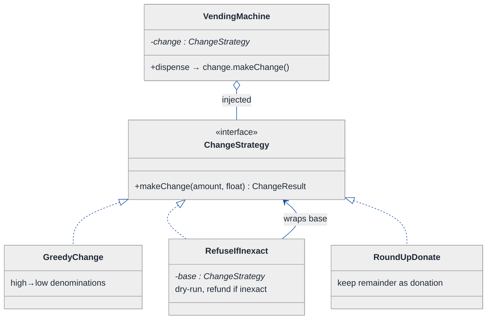
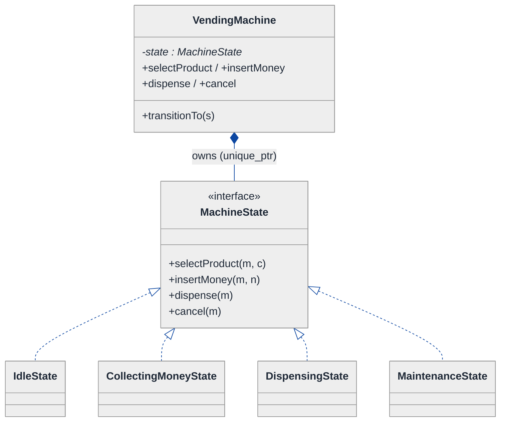
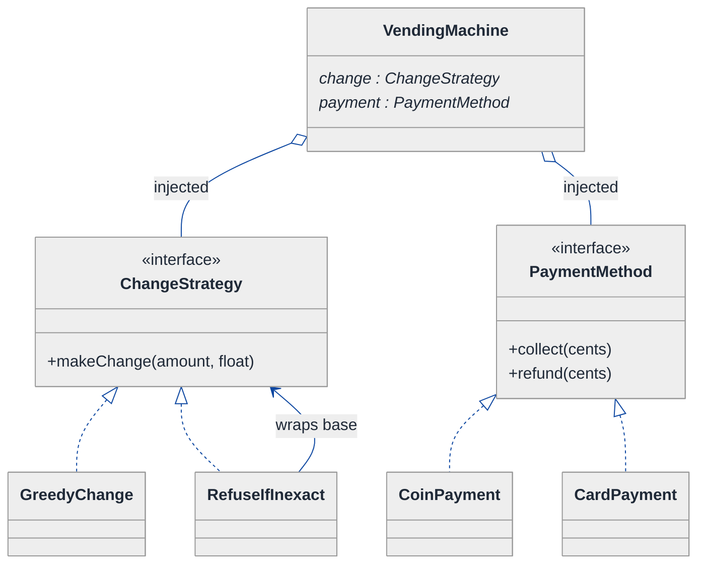
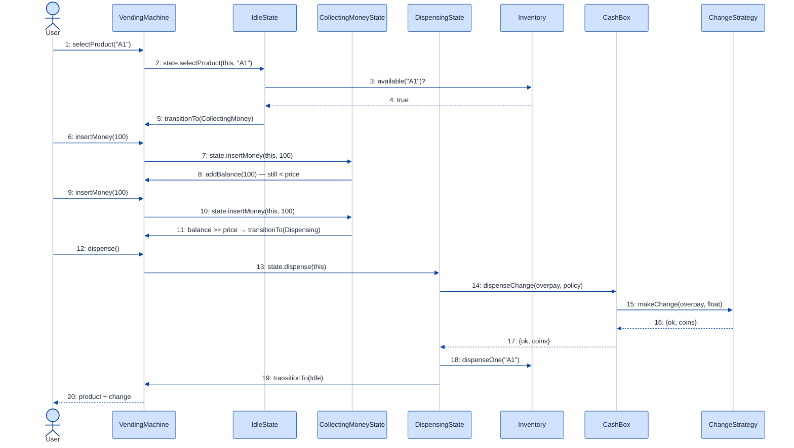

# Vending Machine — LLD Walkthrough

> **Difficulty:** Medium · **Time:** ~35 min · **Pattern focus:** State (purchase FSM) + Strategy (change-making + payment)
>
> **Problem source(s):** GID `OOD3`, bucket `Object_Oriented_Design`, representative of multiple LeetLens rows in [`./EXTRACTED_QUESTIONS.md`](./EXTRACTED_QUESTIONS.md). One of the four canonical "model a real machine" LLD shapes (alongside parking lot, ATM, elevator).
>
> **Diagrams:** inline mermaid (renders natively in GitHub / VS Code). No external sources, no `look: handDrawn`.

---

## How to use this file

Paced for a candidate seeing the vending machine for the first time. Reading time: ~35 minutes if you sketch each iteration by hand. **The lesson: a vending machine is a textbook finite-state machine (FSM). The senior move is to NOT reach for a `status` enum + a giant `switch` in `insertCoin()`. Derive the State pattern by building the naive design first, watching the enum-and-switch collapse under three new requirements, then lifting each axis of variation into ONE pattern at a time.**

**Map of this file (15 sections):**

1. Problem statement + clarifying questions
2. Plain-English restatement
3. Why this matters
4. Mental model
5. Try it yourself first
6. Entity & verb extraction
7. **Iteration 1: the naive design** — `status` enum + switch
8. **Where the naive design hurts** — three future requirements, one painful diff each
9. **Pivot 1: State for the purchase FSM** — the most painful axis first
10. **Pivot 2: Strategy for change-making** — algorithm picked by config
11. **Pivot 3: Strategy for payment + the inventory boundary**
12. Final UML class diagram
13. Skeleton code (C++)
14. Key flow — sequence diagram
15. Extensibility re-check + anti-patterns + how to think aloud + self-check

---

## 1. Problem statement + clarifying questions

**Prompt (typical phrasing):** "Design a vending machine that supports multiple product types, coin/bill payment, change dispensing, inventory management, and an admin restocking interface. Handle edge cases like insufficient funds and out-of-stock items."

**Clarifying questions to ask BEFORE drawing anything:**

1. **Payment types?** Just coins/bills, or also card/UPI/wallet? Mixed payment in one transaction (coins + card)?
2. **Change-making policy?** Always exact greedy change? Refuse if the machine can't make exact change? Round up to nearest available denomination?
3. **Cancel / refund?** Can the user hit "cancel" mid-transaction and get a full refund? What if dispensing physically jams after payment succeeds?
4. **Inventory model?** One slot per product type, or multiple slots? Does each slot have a fixed capacity? Do we track the coin/bill float separately from products?
5. **Admin interface?** Restock products, refill the coin float, collect cash, set prices — all behind an admin auth step? Can admin operate while a customer transaction is mid-flight?
6. **Concurrency?** Single-user machine (one transaction at a time) or could two front panels share one inventory?

**Assumptions if interviewer dodges:** coins + bills + card; refuse-and-refund if exact change is impossible; cancel allowed before dispense with full refund; one slot per product with a capacity; separate coin float; admin behind a simple PIN, mutually exclusive with customer transactions; single-user (we discuss concurrency in §15).

---

## 2. Plain-English restatement

We're building the software brain of a physical vending machine. A customer selects a product, feeds money in installments (coin by coin, bill by bill, or a card tap), and once enough money is in, the machine dispenses the product plus any change. Along the way it must reject out-of-stock selections, reject dispensing when it can't make exact change, and let the customer cancel for a refund. Separately, an admin can unlock the machine to restock products and refill the coin float. The design must accommodate **new payment methods, new change-making policies, and new lifecycle states (e.g., a "maintenance" mode) without rewriting the core money-handling flow.**

---

## 3. Why this matters

The vending machine is the canonical interview vehicle for the **State pattern**, the same way parking lot is the vehicle for Strategy. It looks like a CRUD problem ("track money, track stock") but the real probe is: *do you model the purchase lifecycle as a finite-state machine with explicit states, or do you scatter `if (status == ...)` checks across every method?* Almost every candidate writes a working machine; the senior bar is recognizing that "what's a legal action right now" is a property of the **current state**, not a runtime condition to be re-checked everywhere. This same skill reappears in order-processing pipelines, document-approval workflows, TCP connection handling, and game state.

---

## 4. Mental model

A vending machine is a **money accumulator with a gate**. Money flows IN through a payment device; products and change flow OUT through dispensers; in between sits a controller that only permits certain actions depending on where you are in the buy flow. The controller is a literal FSM — the same diagram an electrical engineer would draw for the physical relay logic.

```
Real-world sketch (NOT a UML diagram yet) — the buy lifecycle as an FSM:

      +-------+ selectProduct(ok)  +-----------+ insertMoney(>= price) +-----------+
      | IDLE  | -----------------> | COLLECTING| --------------------> | DISPENSING|
      +-------+                    |  MONEY    |                       +-----------+
         ^  ^                      +-----------+                            |
         |  |  selectProduct(out-of-stock) -> reject, stay IDLE            | dispense + change
         |  |                          | cancel -> refund                  |
         |  +--------------------------+-----------------------------------+
         |                  (back to IDLE)
         |
   admin unlocks ----> [ MAINTENANCE ] (restock, refill float) ----> IDLE
```

The KEY insight from this picture: the "legal next action" depends ENTIRELY on which box you're standing in. `insertMoney` is meaningful in COLLECTING_MONEY but nonsense in IDLE. `dispense` is automatic in DISPENSING but illegal everywhere else. That box-dependent legality is exactly what the State pattern encodes — each box becomes a class.

---

## 5. Try it yourself first

> **Predict before reading on:**
>
> 1. List 5 nouns you'd promote to a class. List 3 nouns you'd leave as plain fields.
> 2. **If I told you the machine will soon need a "maintenance" mode where customers can't buy but admins can restock, what would change about how you wrote the `selectProduct` / `insertMoney` methods?**
> 3. Where does the "can't make exact change → refuse and refund" rule live? Inside `dispense`? Somewhere else?

---

## 6. Entity & verb extraction

> **Mini-refresher: noun → class, but not every noun.**
>
> Naive OOD promotes every noun to a class. Senior OOD promotes a noun only if it has both BEHAVIOR and STATE that need to live together. "Price" stays a field on a product; "the machine" becomes a class because it has lifecycle behavior; "denomination" is just an enum.

**Nouns from the prompt:**

| Noun | Decision | Why |
|---|---|---|
| VendingMachine | Class (top-level controller) | Owns inventory + float, orchestrates the buy flow |
| Product | Class (or struct) | Has name + price; price has no behavior of its own |
| Slot / Inventory | Class | Holds stock counts, can decrement, reports out-of-stock |
| CashBox / CoinFloat | Class | Tracks denomination counts, makes/accepts change |
| Denomination | `enum class` (Coin/Bill values) | No behavior — a typed value |
| Money / amount | Library-ish value type (cents as `int`) | Avoid floats for currency |
| Admin | Actor, not a class | Triggers restock; the *action* is what we model |
| Transaction status | NOT a field — becomes a State hierarchy (see §9) | Lifecycle behavior, not data |

**Verbs (and the class they live on — naive answer, we'll re-examine):**

| Verb | Owner class (naive — re-examined later) |
|---|---|
| selectProduct(code) | VendingMachine |
| insertMoney(denom) | VendingMachine |
| dispense() | VendingMachine |
| makeChange(amount) | CashBox |
| cancel() | VendingMachine |
| restock(code, qty) | VendingMachine (admin path) |

**We have NOT introduced any design patterns yet.** Pure nouns + verbs.

---

## 7. <a id="iter-1"></a>Iteration 1: the naive design

Let's write the simplest thing that could possibly work. No design patterns — one `VendingMachine` class with a `status` enum and methods that `switch` on it.



**Reader's tour (read top to bottom; ~60 seconds).**

1. **`VendingMachine` is one giant box.** It holds the `status` enum, the running `balance`, the currently `selected` product, the `inventory` map, and the coin `float` map. Every responsibility lives here. There are NO state objects, NO strategy objects.

2. **The composition spine.** `VendingMachine ◆── Slot ◆── Product`. Filled diamonds mark composition (strong ownership / same lifetime). If the machine is destroyed, its slots and the products inside them go with it. This part of the design is fine — inventory is genuinely owned by the machine.

> **Mini-refresher: the UML diamond (composition vs aggregation).**
>
> A diamond sits on the OWNER's end of the line. A **filled** diamond (`◆`) means **composition**: the part shares the whole's lifetime and is owned by it — destroy the whole and the part dies too (e.g. `Slot` inside `VendingMachine`). An **open** diamond (`◇`) means **aggregation**: the whole *uses* a collaborator it does not own — the part can outlive the whole and may be shared (e.g. a strategy injected from outside). Rule of thumb: filled = "owns / same lifetime," open = "uses but doesn't own." (The open diamond first appears in Pivot 2's Strategy injection.)

3. **The four warning markers (⚠) are all on the same class.** `selectProduct`, `insertMoney`, `dispense`, and `cancel` each begin with `switch (status)`. Every method re-asks "where am I in the flow?" before doing anything. That repeated `switch` is the smell §8 will weaponize.

4. **`dispense()` carries double duty.** It validates the status AND runs the change-making algorithm inline. Two unrelated reasons to change one method — a single-responsibility violation waiting to happen.

**What's deliberately missing.** No `MachineState` hierarchy. No `ChangeStrategy`. No `PaymentMethod` abstraction. The naive design doesn't even *acknowledge* that the lifecycle, the change algorithm, and the payment device are independent axes of variation — it bakes a hardcoded answer for each into the methods. That's what we'll expose and fix.

Skeleton code for the naive design (C++):

```cpp
#include <map>
#include <stdexcept>
#include <string>

enum class Status { IDLE, COLLECTING_MONEY, DISPENSING };
enum class Denom  { CENT_25 = 25, DOLLAR_1 = 100, DOLLAR_5 = 500 };

struct Product { std::string name; int priceCents; };
struct Slot    { Product product; int count; int capacity; };

class VendingMachine {
public:
    void selectProduct(const std::string& code) {
        switch (status_) {                                   // ⚠ switch #1
            case Status::IDLE: {
                auto it = inventory_.find(code);
                if (it == inventory_.end() || it->second.count == 0)
                    throw std::runtime_error("Out of stock");
                selected_ = &it->second;
                status_   = Status::COLLECTING_MONEY;
                break;
            }
            default: throw std::runtime_error("Cannot select now");
        }
    }

    void insertMoney(Denom d) {
        switch (status_) {                                   // ⚠ switch #2
            case Status::COLLECTING_MONEY:
                balance_ += static_cast<int>(d);
                float_[d] += 1;
                if (balance_ >= selected_->product.priceCents)
                    status_ = Status::DISPENSING;
                break;
            default: throw std::runtime_error("Insert a product selection first");
        }
    }

    void dispense() {
        switch (status_) {                                   // ⚠ switch #3 + inline change logic
            case Status::DISPENSING: {
                int change = balance_ - selected_->product.priceCents;
                // ... greedy change-making inline, mutating float_ ...  (elided)
                selected_->count -= 1;
                balance_ = 0; selected_ = nullptr;
                status_  = Status::IDLE;
                break;
            }
            default: throw std::runtime_error("Nothing to dispense");
        }
    }

    void cancel() {                                          // ⚠ switch #4
        if (status_ == Status::IDLE) return;
        // ... refund balance_ from float_ ... (elided)
        balance_ = 0; selected_ = nullptr; status_ = Status::IDLE;
    }

    void restock(const std::string& code, int qty) { inventory_.at(code).count += qty; }

private:
    Status                       status_ = Status::IDLE;
    int                          balance_ = 0;
    Slot*                        selected_ = nullptr;
    std::map<std::string, Slot>  inventory_;
    std::map<Denom, int>         float_;
};
```

**This works.** It has zero design patterns. We can select, pay, dispense, cancel, restock. So what's wrong with it?

---

## 8. <a id="naive-pain"></a>Where the naive design hurts

The interviewer slides three new requirements across the desk: "These ship next quarter. Walk me through what changes."

### Change A: "Add a MAINTENANCE state — admin unlocks, customers locked out"

In the naive design:
- `Status` enum gains `MAINTENANCE`.
- **Every method that switches on status must add a `case MAINTENANCE:` arm** — `selectProduct`, `insertMoney`, `dispense`, `cancel`. Four edits, all of the form "reject the customer action."
- And `restock` must now only be legal in MAINTENANCE — so `restock` ALSO grows a status check it never had.
- **The transition matrix is now scattered across five methods.** Miss one and you have a bug where a customer can insert money while the machine is being serviced.

### Change B: "Change-making policy varies by machine model"

Some machines do exact greedy change; some refuse the sale if exact change is impossible; a premium model rounds up and donates the difference to charity.

In the naive design:
- The change algorithm is **inlined inside `dispense()`**. To support three policies you wrap it in `if (model == ...)` branches, or copy-paste `dispense()` per model.
- **`dispense()` now has two reasons to change**: the lifecycle rule AND the change math. Single-responsibility violation, and every new policy is surgery in the most safety-critical method (it touches real money).

### Change C: "Add card / UPI payment"

In the naive design:
- `insertMoney(Denom)` is hardwired to physical denominations and mutates the coin `float_`. A card tap has no denomination and adds nothing to the float.
- You'd add a parallel `tapCard(amount)` method with its OWN `switch (status)`, duplicating the lifecycle guard, plus branching inside `cancel`/`dispense` for "was this a card payment? then refund differently."
- **Payment mechanism is entangled with the money-accumulation lifecycle.** Every new payment type touches multiple methods.

### The pattern of pain

| Change | Methods touched (naive) | Smell |
|---|---|---|
| A. Maintenance state | `selectProduct` + `insertMoney` + `dispense` + `cancel` + `restock` | "One new state means editing every method's `switch`. Transition logic is scattered." |
| B. Change policy | `dispense()` (balloons) | "A single method accumulates both lifecycle rules and the change algorithm." |
| C. Card payment | new `tapCard` + `cancel` + `dispense` | "Payment device is hardwired into the lifecycle; can't swap it." |

**Three axes of pain dominate:** lifecycle variability (states + transitions), change-making algorithm variability, and payment-device variability.

> **Pivot question:** "What pattern handles a 'lifecycle where each state allows different actions and decides its own next state'? What pattern handles 'an algorithm that varies, picked by config or caller'?"
>
> The answers are State and Strategy. Let's introduce them one at a time, starting with the most painful axis: the lifecycle.

---

## 9. <a id="pivot-1"></a>Pivot 1: State for the purchase FSM

The deepest pain (Change A) is that adding ONE lifecycle state forces edits to FIVE methods, because the transition rules are smeared across every `switch (status)`. That's the signature of a missing **State pattern**.

> **Mini-refresher: State pattern.**
>
> Each lifecycle state becomes its own class implementing a common interface. The context object (here, `VendingMachine`) delegates each action to its CURRENT state object, and THE STATE decides what the next state is. Transitions live WITH the state, driven by the events the context receives — not in a central `switch`.
>
> Quick example: a TCP connection object delegates `send()` to its current state. In `ClosedState`, `send()` throws; in `EstablishedState`, `send()` transmits. The connection itself has no `if (status == ...)` anywhere.

**Why State (not Strategy) for the lifecycle.** The choice of state is NOT picked by the caller — it's driven by what the machine has been through. After a valid `selectProduct`, the machine IS in `CollectingMoney`; the caller didn't choose that. Calling `insertMoney` in `Idle` isn't merely "a different algorithm," it's an *illegal action* that should be rejected. "What's legal next" is the OBJECT'S concern. That is textbook State.

**The refactor (just the lifecycle part):**

> **Smart-pointer mini-refresher.** `std::unique_ptr<T>` is a pointer that *exclusively owns* its `T` — there is exactly one owner, ownership moves with `std::move`, and the `T` is deleted automatically when the owner goes away. We use it here because the machine owns exactly one current state at a time and swaps it on transition. (More in §15 trap #5.)

```cpp
class VendingMachine;  // forward — the context

class MachineState {
public:
    virtual ~MachineState() = default;
    virtual void selectProduct(VendingMachine& m, const std::string& code) = 0;
    virtual void insertMoney(VendingMachine& m, int cents)                 = 0;
    virtual void dispense(VendingMachine& m)                               = 0;
    virtual void cancel(VendingMachine& m)                                 = 0;
};

class IdleState : public MachineState {
public:
    void selectProduct(VendingMachine& m, const std::string& code) override;  // -> CollectingMoney
    void insertMoney(VendingMachine&, int) override { throw std::runtime_error("Select a product first"); }
    void dispense(VendingMachine&) override         { throw std::runtime_error("Nothing selected"); }
    void cancel(VendingMachine&) override           { /* no-op: already idle */ }
};

class CollectingMoneyState : public MachineState {
public:
    void selectProduct(VendingMachine&, const std::string&) override { throw std::runtime_error("Already collecting"); }
    void insertMoney(VendingMachine& m, int cents) override;          // accumulate; if enough -> Dispensing
    void dispense(VendingMachine&) override { throw std::runtime_error("Insufficient funds"); }
    void cancel(VendingMachine& m) override;                          // refund -> Idle
};

class DispensingState : public MachineState {
public:
    void selectProduct(VendingMachine&, const std::string&) override { throw std::runtime_error("Busy dispensing"); }
    void insertMoney(VendingMachine&, int) override { throw std::runtime_error("Busy dispensing"); }
    void dispense(VendingMachine& m) override;                        // drop product + change -> Idle
    void cancel(VendingMachine&) override { throw std::runtime_error("Too late to cancel"); }
};
// MaintenanceState elided — Change A is now ONE new class (see §15)

class VendingMachine {
public:
    void transitionTo(std::unique_ptr<MachineState> s) { state_ = std::move(s); }
    void selectProduct(const std::string& code) { state_->selectProduct(*this, code); }
    void insertMoney(int cents)                  { state_->insertMoney(*this, cents); }
    void dispense()                              { state_->dispense(*this); }
    void cancel()                                { state_->cancel(*this); }
    // ... inventory / balance accessors used by the states ...
private:
    std::unique_ptr<MachineState> state_;   // the enum is GONE
};
```

**What changed — visualized.** Just the lifecycle slice:

```mermaid
---
config:
  theme: neutral
  themeVariables:
    background: '#ffffff'
    primaryColor: '#cfe2ff'
    primaryTextColor: '#1f2937'
    primaryBorderColor: '#084298'
    secondaryColor: '#fff3cd'
    secondaryTextColor: '#1f2937'
    secondaryBorderColor: '#664d03'
    tertiaryColor: '#d1e7dd'
    tertiaryTextColor: '#1f2937'
    tertiaryBorderColor: '#0a3622'
    lineColor: '#0d47a1'
    textColor: '#1f2937'
    noteBkgColor: '#fff3cd'
    noteTextColor: '#1f2937'
    noteBorderColor: '#997404'
    actorBkg: '#cfe2ff'
    actorBorder: '#084298'
    actorTextColor: '#1f2937'
    signalColor: '#0d47a1'
    signalTextColor: '#1f2937'
    labelBoxBkgColor: '#ffffff'
    labelBoxBorderColor: '#d3d3d3'
    labelTextColor: '#1f2937'
    edgeLabelBackground: '#ffffff'
    labelBackground: '#ffffff'
    classText: '#1f2937'
    fontFamily: 'system-ui, -apple-system, Segoe UI, Helvetica, Arial, sans-serif'
---
classDiagram
  direction TB
  class VendingMachine {
    -state : MachineState* (unique_ptr)
    +selectProduct(c) → state.selectProduct()
    +insertMoney(n)   → state.insertMoney()
    +dispense()       → state.dispense()
    +cancel()         → state.cancel()
    +transitionTo(s)
  }
  class MachineState {
    <<interface>>
    +selectProduct(m, c)
    +insertMoney(m, n)
    +dispense(m)
    +cancel(m)
  }
  class IdleState {
    selectProduct → CollectingMoney
    others → throw / no-op
  }
  class CollectingMoneyState {
    insertMoney → accumulate
    enough? → Dispensing
    cancel → refund → Idle
  }
  class DispensingState {
    dispense → drop + change → Idle
    others → throw
  }
  class MaintenanceState {
    customer actions → throw
    (admin path only)
  }
  VendingMachine *-- MachineState : owns
  MachineState <|.. IdleState
  MachineState <|.. CollectingMoneyState
  MachineState <|.. DispensingState
  MachineState <|.. MaintenanceState
```

**Tour of the after-state.**

1. **The `Status` enum is gone.** It's replaced by a single `state` field of type `MachineState*` (specifically `std::unique_ptr<MachineState>` — exclusive ownership). The machine owns exactly one state at a time.

2. **The four public methods became one-liners.** `selectProduct`, `insertMoney`, `dispense`, `cancel` each just delegate to the current state: `state_->selectProduct(*this, code)`, etc. **No `switch (status)` anywhere.**

3. **The interface declares the contract.** `MachineState` is an abstract base with four pure-virtual methods. Each concrete state must implement all four, even if the honest answer is "throw" — e.g. `DispensingState::cancel` throws because it's too late to cancel once dispensing started.

4. **Each state owns its own transition.** Look at `CollectingMoneyState::insertMoney` — it accumulates, then if `balance >= price` it calls `m.transitionTo(make_unique<DispensingState>())`. **The transition lives WITH the state**, not in the machine and not in a central matrix.

5. **Change A from §8 collapses to one class.** "Add MAINTENANCE mode" → write `MaintenanceState` whose customer actions throw and which exposes the admin path. NO edits to `IdleState`, `CollectingMoneyState`, `DispensingState`, or the machine's public methods. That's the open/closed principle.

> **Mini-refresher: open/closed principle (the "O" in SOLID).**
>
> Software entities should be OPEN for extension but CLOSED for modification. Adding a new behavior (a new state) should mean adding new code, not editing working code. The naive `switch` violated this — every new state edited five methods. The State hierarchy honors it — a new state is a new file.

**Pattern-discrimination cheatsheet — State vs Strategy.**
- *State:* the OBJECT picks its next state internally via `transitionTo`; states know about each other (each state's methods can transition to siblings).
- *Strategy:* the CALLER (or config) picks which one to use; strategies are usually unaware of each other.
- *Rule of thumb:* if `context.handleEvent(e)` flips behavior because of an internal event flow → State. If `context.setX(strategy)` is called from outside → Strategy.

We chose State because the lifecycle transitions are driven by what the machine has been through (events), not by an external setter call.

---

## 10. <a id="pivot-2"></a>Pivot 2: Strategy for change-making

Change B from §8 is still painful — the change algorithm is welded inside `dispense()`, and three machine models want three different policies. State doesn't help here: the variability is not "what's legal next," it's "given an amount, which coins do I return?" That's an **algorithm**, and the policy is picked by machine CONFIG, not by an internal event. Textbook **Strategy**.

> **Mini-refresher: Strategy pattern.**
>
> Encapsulates an algorithm behind an interface so it can be swapped at runtime/config time. The CALLER (or owner) decides which strategy to use; the strategy doesn't know about its peers.
>
> Quick example: a `Sorter` takes a `CompareStrategy*` in its constructor. Pass `Ascending` or `Descending` — the sorter doesn't care which.

**The refactor (just the change-making part):**

```cpp
struct ChangeResult {
    bool                 ok;        // false if the policy refuses (e.g. can't make exact change)
    std::map<Denom, int> coins;     // what to physically dispense
};

class ChangeStrategy {
public:
    virtual ~ChangeStrategy() = default;
    // amount = overpayment to return; float is the machine's current coin inventory (mutated on success)
    virtual ChangeResult makeChange(int amount, std::map<Denom, int>& cashFloat) const = 0;
};

class GreedyChange : public ChangeStrategy {
public:
    ChangeResult makeChange(int amount, std::map<Denom, int>& cashFloat) const override {
        ChangeResult r{true, {}};
        // walk denominations high → low, take as many as fit and as the float allows
        for (auto& [denom, count] : descending(cashFloat)) {            // helper elided
            int value = static_cast<int>(denom);
            while (amount >= value && count > 0) { amount -= value; count--; r.coins[denom]++; }
        }
        if (amount != 0) { r.ok = false; }                              // couldn't make exact change
        return r;
    }
};

class RefuseIfInexact : public ChangeStrategy {
public:
    explicit RefuseIfInexact(std::unique_ptr<ChangeStrategy> base) : base_(std::move(base)) {}
    ChangeResult makeChange(int amount, std::map<Denom, int>& cashFloat) const override {
        auto snapshot = cashFloat;                       // dry-run on a copy
        auto r = base_->makeChange(amount, snapshot);
        if (!r.ok) return {false, {}};                   // refuse BEFORE mutating the real float
        cashFloat = snapshot;                            // commit only if exact
        return r;
    }
private:
    std::unique_ptr<ChangeStrategy> base_;
};
// RoundUpDonate : public ChangeStrategy — elided

class VendingMachine {
    // ...
    std::unique_ptr<ChangeStrategy> change_;   // injected at construction
    // dispense() now calls change_->makeChange(overpay, float_) — NO inline math
};
```

**What changed — visualized.** Just the change-making slice:



**Tour of the after-state.**

1. **`VendingMachine` gained one field.** `change` is a pointer to a `ChangeStrategy` interface, INJECTED at construction. The OPEN diamond (`◇`) marks aggregation — the machine uses the strategy.

2. **The interface is one method.** `makeChange(amount, cashFloat) → ChangeResult`. The result carries an `ok` flag so a policy can REFUSE (the "insufficient change" edge case becomes a first-class return value, not a thrown exception buried in `dispense`).

3. **Three concrete policies.** `GreedyChange` is the common high-to-low algorithm. `RefuseIfInexact` is a DECORATOR — note it wraps a `base : ChangeStrategy*`, runs the wrapped algorithm on a *copy* of the float, and only commits if it's exact. `RoundUpDonate` keeps the remainder. **Composition of strategies, not subclassing.**

4. **`dispense()` shrank.** The inline greedy math is gone; `dispense` now calls `change_->makeChange(overpay, float_)` and reacts to the `ok` flag. Its only remaining job is orchestration — which is what it should have been all along.

**Change B from §8 now lands cleanly.** New policy → new `ChangeStrategy` implementation, injected via config. No surgery in `dispense`.

**Pattern-discrimination cheatsheet — Strategy vs Template Method.**
- *Strategy:* the whole algorithm in one swappable object; chosen at runtime/config via composition.
- *Template Method:* algorithm skeleton in a base class; subclasses fill in hooks via inheritance.
- *Rule of thumb:* variants that might be composed or hot-swapped → Strategy. One fixed skeleton with 2-3 stable steps → Template Method.

We chose Strategy because the change policies are independent, swappable wholes (and `RefuseIfInexact` even *composes* over another policy) — you can't compose Template Method subclasses.

---

## 11. <a id="pivot-3"></a>Pivot 3: Strategy for payment + the inventory boundary

Change C (card/UPI) is the last painful axis, plus we should formalize where inventory + cash-float responsibilities live so the machine stays a thin orchestrator.

**The remaining axes:**

| Axis | Pattern / move | One sentence why |
|---|---|---|
| Payment device | Strategy | Coin/bill/card all "collect money toward a balance" — same role, different mechanism, picked by caller |
| Inventory & cash float | Extract to collaborator classes | Single-responsibility — the machine orchestrates; `Inventory` and `CashBox` own their own invariants |

**Payment as Strategy.** A coin slot, a bill acceptor, and a card reader all answer the same question — "collect some money toward the running balance" — but the mechanism and refund path differ. Unify them behind one interface so the lifecycle states never branch on payment type:

```cpp
struct PaymentResult { bool ok; int cents; std::string ref; };

class PaymentMethod {
public:
    virtual ~PaymentMethod() = default;
    virtual PaymentResult collect(int requestedCents) = 0;   // returns how much was actually taken
    virtual void          refund(int cents)            = 0;   // give it back on cancel/inexact-change
};
class CoinPayment : public PaymentMethod { /* drops coins into float, refund pops them back */ };
class CardPayment : public PaymentMethod { /* authorizes via PSP; refund issues a reversal */ };
// BillPayment, UpiPayment — elided
```

**Inventory + CashBox as collaborators.** Pull the two maps out of `VendingMachine` into classes that guard their own invariants:

```cpp
class Inventory {
public:
    bool     available(const std::string& code) const;      // count > 0 ?
    Product  peek(const std::string& code) const;
    void     dispenseOne(const std::string& code);          // count--, throws if 0 (invariant)
    void     restock(const std::string& code, int qty);     // count += qty, throws if > capacity
private:
    std::map<std::string, Slot> slots_;
};

class CashBox {
public:
    void         deposit(Denom d, int n);
    ChangeResult dispenseChange(int amount, const ChangeStrategy& policy);   // delegates the algorithm
    void         refill(Denom d, int n);                                     // admin float top-up
private:
    std::map<Denom, int> float_;
};
```

**The lesson.** Once Pivot 1 taught us "lifecycle → State" and Pivot 2 taught us "algorithm picked by config → Strategy," the payment axis is *the same Strategy shape again* — recognizing the role makes the third axis nearly free. And extracting `Inventory`/`CashBox` keeps `VendingMachine` a thin coordinator that owns *the flow*, not *the data invariants*.

> **Mini-refresher: why payment, change, and state don't share one interface.**
>
> Strategy and State are *roles*, not types. `PaymentMethod`, `ChangeStrategy`, and `MachineState` have nothing in common at the type level (different inputs, different outputs, different lifetimes). Don't try to unify them under a single `Policy<T>` template — that's premature genericism that buys nothing and obscures intent.

---

## 12. <a id="fig-class-diagram"></a>Final class diagram

Showing the entire final design in one diagram becomes a wall of boxes. Instead, here are **three focused sub-views**. Read them in order; the structural insight at the end ties them together.

### 12.1 The inventory + cash spine — what the machine OWNS

```mermaid
---
config:
  theme: neutral
  themeVariables:
    background: '#ffffff'
    primaryColor: '#cfe2ff'
    primaryTextColor: '#1f2937'
    primaryBorderColor: '#084298'
    secondaryColor: '#fff3cd'
    secondaryTextColor: '#1f2937'
    secondaryBorderColor: '#664d03'
    tertiaryColor: '#d1e7dd'
    tertiaryTextColor: '#1f2937'
    tertiaryBorderColor: '#0a3622'
    lineColor: '#0d47a1'
    textColor: '#1f2937'
    noteBkgColor: '#fff3cd'
    noteTextColor: '#1f2937'
    noteBorderColor: '#997404'
    actorBkg: '#cfe2ff'
    actorBorder: '#084298'
    actorTextColor: '#1f2937'
    signalColor: '#0d47a1'
    signalTextColor: '#1f2937'
    labelBoxBkgColor: '#ffffff'
    labelBoxBorderColor: '#d3d3d3'
    labelTextColor: '#1f2937'
    edgeLabelBackground: '#ffffff'
    labelBackground: '#ffffff'
    classText: '#1f2937'
    fontFamily: 'system-ui, -apple-system, Segoe UI, Helvetica, Arial, sans-serif'
---
classDiagram
  direction TB
  class VendingMachine {
    balance : int (cents)
    (root coordinator)
  }
  class Inventory {
    slots : map~string,Slot~
    +available(code)
    +dispenseOne(code)
    +restock(code, qty)
  }
  class Slot {
    product : Product
    count : int
    capacity : int
  }
  class Product {
    name : string
    priceCents : int
  }
  class CashBox {
    float : map~Denom,int~
    +deposit / +refill
    +dispenseChange()
  }
  VendingMachine "1" *-- "1" Inventory : composes
  VendingMachine "1" *-- "1" CashBox : composes
  Inventory "1" *-- "many" Slot : composes
  Slot "1" *-- "1" Product : holds
```

**Tour of 12.1.** The filled diamonds (`◆`) mark composition — same-lifetime ownership. The machine owns one `Inventory` and one `CashBox`; the inventory owns its slots; each slot holds a product. Compared with the naive design, the two raw maps are now wrapped in classes that guard their own invariants (you can't decrement a slot below zero or overfill it). The machine no longer touches those maps directly.

### 12.2 The lifecycle — Ticket... er, Machine's State pattern



**Tour of 12.2.** The machine holds ONE `MachineState` via `unique_ptr` (filled diamond — it OWNS its current state and replaces it on transition). The four public methods are one-line delegations. Each concrete state knows which actions are legal in its phase and where to transition next; `DispensingState` and `MaintenanceState` reject the actions that don't belong. The naive `Status` enum and its five `switch` statements are completely gone.

### 12.3 The policy injection — what the machine USES



**Tour of 12.3.** Two injected Strategy interfaces, one per remaining axis. The open diamonds (`◇`) mark aggregation — the machine USES these policies, picked by construction-time config, but they're swappable. `ChangeStrategy` has its decorator family (`RefuseIfInexact` wraps a base). `PaymentMethod` has its device family (coin, card, bill, UPI). Note neither is hardcoded into the lifecycle states — the states call through these interfaces, so adding a payment device or a change policy never touches `CollectingMoneyState` or `DispensingState`.

### Structural insight (ties 12.1 + 12.2 + 12.3 together)

| Concern | Pattern used | Why |
|---|---|---|
| **Inventory + cash** (Slot, Product, float) | Plain ownership + collaborator classes | Genuine data the machine owns; invariants guarded by `Inventory`/`CashBox` |
| **Lifecycle** (Idle → Collecting → Dispensing / Maintenance) | State, OWNED by VendingMachine | The machine controls transitions; states validate what's legal next |
| **Change policy** (greedy, refuse-if-inexact, round-up) | Strategy, INJECTED into VendingMachine | Config picks the variant; composable via decorators |
| **Payment device** (coin, bill, card, UPI) | Strategy, INJECTED into VendingMachine | Caller/config picks the mechanism; refund path lives with the device |

The big lesson: **the lifecycle is the OBJECT'S concern (State), while change-making and payment are swappable POLICIES (Strategy).** Inventory and cash are just data with invariants, so they get plain classes — no pattern needed. *State for "what's legal now," Strategy for "which algorithm," plain composition for "what I own."*

---

## 13. Skeleton code (C++)

> Show the SHAPES, not the full impl. ~130 lines.

```cpp
#include <map>
#include <memory>
#include <stdexcept>
#include <string>
#include <utility>

// ── Forward declarations ────────────────────────────────────────────
class VendingMachine;

// ── Value types ─────────────────────────────────────────────────────
enum class Denom { CENT_5 = 5, CENT_10 = 10, CENT_25 = 25,
                   DOLLAR_1 = 100, DOLLAR_5 = 500 };

struct Product { std::string name; int priceCents; };
struct Slot    { Product product; int count; int capacity; };

struct ChangeResult  { bool ok; std::map<Denom, int> coins; };
struct PaymentResult { bool ok; int cents; std::string ref; };

// ── Collaborators (own their invariants) ────────────────────────────
class Inventory {
public:
    bool    available(const std::string& code) const;        // count > 0
    Product peek(const std::string& code) const;
    void    dispenseOne(const std::string& code);            // count--, throws if 0
    void    restock(const std::string& code, int qty);       // count += qty, throws if > capacity
private:
    std::map<std::string, Slot> slots_;
};

// ── Change-making Strategy ──────────────────────────────────────────
class ChangeStrategy {
public:
    virtual ~ChangeStrategy() = default;
    virtual ChangeResult makeChange(int amount, std::map<Denom, int>& cashFloat) const = 0;
};

class GreedyChange : public ChangeStrategy {
public:
    ChangeResult makeChange(int amount, std::map<Denom, int>& cashFloat) const override;  // high→low
};
// RefuseIfInexact (decorator), RoundUpDonate — elided (see §10)

class CashBox {
public:
    void         deposit(Denom d, int n) { float_[d] += n; }
    void         refill(Denom d, int n)  { float_[d] += n; }   // admin top-up
    ChangeResult dispenseChange(int amount, const ChangeStrategy& policy) {
        return policy.makeChange(amount, float_);
    }
private:
    std::map<Denom, int> float_;
};

// ── Payment Strategy ────────────────────────────────────────────────
class PaymentMethod {
public:
    virtual ~PaymentMethod() = default;
    virtual PaymentResult collect(int requestedCents) = 0;
    virtual void          refund(int cents)            = 0;
};
class CoinPayment : public PaymentMethod { /* float-backed; refund pops coins */ };
// CardPayment, BillPayment — elided (see §11)

// ── Machine lifecycle: State pattern ────────────────────────────────
class MachineState {
public:
    virtual ~MachineState() = default;
    virtual void selectProduct(VendingMachine& m, const std::string& code) = 0;
    virtual void insertMoney(VendingMachine& m, int cents)                 = 0;
    virtual void dispense(VendingMachine& m)                               = 0;
    virtual void cancel(VendingMachine& m)                                 = 0;
};

class IdleState : public MachineState {
public:
    void selectProduct(VendingMachine& m, const std::string& code) override; // → CollectingMoney
    void insertMoney(VendingMachine&, int) override { throw std::runtime_error("Select a product first"); }
    void dispense(VendingMachine&) override         { throw std::runtime_error("Nothing selected"); }
    void cancel(VendingMachine&) override           { /* no-op */ }
};

class CollectingMoneyState : public MachineState {
public:
    void selectProduct(VendingMachine&, const std::string&) override { throw std::runtime_error("Already collecting"); }
    void insertMoney(VendingMachine& m, int cents) override;          // accumulate → maybe Dispensing
    void dispense(VendingMachine&) override { throw std::runtime_error("Insufficient funds"); }
    void cancel(VendingMachine& m) override;                          // refund → Idle
};

class DispensingState : public MachineState {
public:
    void selectProduct(VendingMachine&, const std::string&) override { throw std::runtime_error("Busy"); }
    void insertMoney(VendingMachine&, int) override { throw std::runtime_error("Busy"); }
    void dispense(VendingMachine& m) override;                        // drop + change → Idle
    void cancel(VendingMachine&) override { throw std::runtime_error("Too late to cancel"); }
};
// MaintenanceState — elided (Change A: ONE new class)

// ── VendingMachine (thin orchestrator) ──────────────────────────────
class VendingMachine {
public:
    VendingMachine(Inventory inv, CashBox cash,
                   std::unique_ptr<ChangeStrategy> change,
                   std::unique_ptr<PaymentMethod>  payment)
        : inventory_(std::move(inv)), cash_(std::move(cash))
        , change_(std::move(change)), payment_(std::move(payment))
        , state_(std::make_unique<IdleState>()) {}

    // public surface — all one-line delegations to the current state
    void selectProduct(const std::string& code) { state_->selectProduct(*this, code); }
    void insertMoney(int cents)                  { state_->insertMoney(*this, cents); }
    void dispense()                              { state_->dispense(*this); }
    void cancel()                                { state_->cancel(*this); }
    void transitionTo(std::unique_ptr<MachineState> s) { state_ = std::move(s); }

    // accessors the states need
    Inventory&      inventory() { return *&inventory_; }
    CashBox&        cash()      { return cash_; }
    ChangeStrategy& change()    { return *change_; }
    PaymentMethod&  payment()   { return *payment_; }
    int  balance() const { return balance_; }
    void addBalance(int c) { balance_ += c; }
    void resetBalance()    { balance_ = 0; }
    void select(const std::string& c) { selectedCode_ = c; }
    const std::string& selectedCode() const { return selectedCode_; }

private:
    Inventory                       inventory_;
    CashBox                         cash_;
    std::unique_ptr<ChangeStrategy> change_;
    std::unique_ptr<PaymentMethod>  payment_;
    std::unique_ptr<MachineState>   state_;
    int                             balance_ = 0;
    std::string                     selectedCode_;
};

// ── State transitions (deferred until VendingMachine is complete) ────
inline void IdleState::selectProduct(VendingMachine& m, const std::string& code) {
    if (!m.inventory().available(code)) throw std::runtime_error("Out of stock");
    m.select(code);
    m.transitionTo(std::make_unique<CollectingMoneyState>());
}

inline void CollectingMoneyState::insertMoney(VendingMachine& m, int cents) {
    m.addBalance(cents);
    int price = m.inventory().peek(m.selectedCode()).priceCents;
    if (m.balance() >= price) m.transitionTo(std::make_unique<DispensingState>());
}

inline void CollectingMoneyState::cancel(VendingMachine& m) {
    m.payment().refund(m.balance());                 // give the money back
    m.resetBalance();
    m.transitionTo(std::make_unique<IdleState>());
}

inline void DispensingState::dispense(VendingMachine& m) {
    Product p = m.inventory().peek(m.selectedCode());
    int overpay = m.balance() - p.priceCents;
    auto result = m.cash().dispenseChange(overpay, m.change());
    if (!result.ok) {                                // can't make exact change → refuse + refund
        m.payment().refund(m.balance());
        m.resetBalance();
        m.transitionTo(std::make_unique<IdleState>());
        throw std::runtime_error("Cannot make exact change — refunded");
    }
    m.inventory().dispenseOne(m.selectedCode());     // drop the product
    m.resetBalance();
    m.transitionTo(std::make_unique<IdleState>());
}
```

---

## 14. <a id="fig-sequence"></a>Key flow — sequence diagram

This is the moment of truth — read across the swimlanes to see how State and the two Strategies COOPERATE.



**Tour of the flow. Read slowly — this is where all three patterns cooperate.**

1. **`selectProduct("A1")` delegates to the current state.** The machine doesn't check anything itself — it calls `state_->selectProduct(...)`. Because `state_` is `IdleState`, the select is legal. If `state_` were `DispensingState`, the same call would throw "Busy" with NO `if` on the machine.

2. **`IdleState` validates stock via `Inventory`.** Stock check lives in the state, but the actual "is there a unit left" invariant lives in `Inventory`. Separation: the state owns *the rule*, the collaborator owns *the data*.

3. **The state drives its own transition (step 5).** `IdleState` calls `m.transitionTo(CollectingMoney)`. **The transition lives WITH the state.** This is the State-pattern heartbeat.

4. **Money arrives in installments (steps 6-11).** Each `insertMoney` goes to `CollectingMoneyState`, which accumulates. Only when `balance >= price` does the state transition itself to `DispensingState`. The "am I done collecting?" decision is the state's, not the caller's.

5. **`dispense()` is where the two Strategies meet (steps 13-18).** `DispensingState::dispense` asks `CashBox` for change, which delegates the actual algorithm to the injected `ChangeStrategy` (step 15). **Strategy #1 (change) in play.** The payment refund path (not shown on the happy path) would call `PaymentMethod::refund` — **Strategy #2.** Then it tells `Inventory` to drop one unit and transitions back to `Idle`.

6. **The "insufficient change" edge case is invisible here because it's a return value.** If `makeChange` returned `{ok: false}`, `DispensingState::dispense` would refund via the payment strategy and bounce to `Idle` — handled in ONE place, the state that owns dispensing.

### The validation that's NOT shown — and why it matters

You don't see `if (status == COLLECTING_MONEY)` anywhere in this diagram. That's the whole point of the State pattern: **invalid operations are made impossible by polymorphism**, not by runtime checks scattered through five methods.

Try calling `dispense()` while the machine is still in `CollectingMoneyState`. The call lands in `CollectingMoneyState::dispense`, which is a one-line `throw std::runtime_error("Insufficient funds")`. No enum comparison, no scattered guard. **The class hierarchy IS the validation.**

---

## 15. Extensibility re-check + anti-patterns + how to think aloud + self-check

### Extensibility re-check

Revisit the three changes from [§8](#naive-pain). For each, name the SINGLE class that changes.

| Change | Naive design impact | Final design impact |
|---|---|---|
| A. Maintenance state | `select` + `insert` + `dispense` + `cancel` + `restock` | New `MaintenanceState : MachineState`. Done. |
| B. Change policy | `dispense()` balloons | New `ChangeStrategy` impl, injected via config. Compose with `RefuseIfInexact`. Done. |
| C. Card / UPI payment | new method + `cancel` + `dispense` branches | New `PaymentMethod` impl, injected. Done. |

Every change is exactly ONE new class. That's the open/closed principle in practice.

If a future requirement makes you change `MachineState`, `ChangeStrategy`, AND `VendingMachine` together — go back to §6 and re-identify variability points; you missed one.

### Common confusion + traps

1. **"Why not just a `status` enum + switch?"** Works for 3 states. Falls apart at 5+ because the transition matrix becomes N² switch arms scattered across methods, and one new state edits every method.

2. **"Should change-making be a State, since it happens during DISPENSING?"** No. The TIMING is lifecycle (State), but the ALGORITHM (which coins) is a swappable policy (Strategy). They're orthogonal axes — the state *calls* the strategy.

3. **"Why is `ChangeStrategy` injected into the machine, not into `DispensingState`?"** Because it's a machine-WIDE policy set at config time. States are transient (created/destroyed on transition); the machine is the stable owner. The state reaches the policy via `m.change()`.

4. **"Should I store money as a `double`?"** Never. Use integer cents. Floating-point currency arithmetic drops pennies — a real bug in a machine that handles real money.

5. **"Why `unique_ptr` for both the state and the strategies?"** All three are exclusive ownership — the machine owns exactly one of each. If two front panels shared one inventory/float, you'd promote the shared collaborators to `shared_ptr`; here a single machine owns everything, so `unique_ptr` is correct.

### Anti-patterns

- **"God class VendingMachine"** — one class holding status, balance, inventory map, float map, AND all the logic. Pull lifecycle into State, algorithms into Strategy, data into `Inventory`/`CashBox`.
- **"Enum + switch lifecycle"** — `switch (status)` repeated in every method. The transition matrix smears across files; use State.
- **"Tag-driven payment"** — `if (method == COIN) ... else if (method == CARD)` inside `insertMoney`. Use the `PaymentMethod` interface; let polymorphism dispatch.
- **"Float for money"** — store cents as `int`. Floats lose pennies.
- **"Inline change math in dispense"** — couples lifecycle orchestration with the change algorithm. Extract to `ChangeStrategy`.
- **"Exceptions for the insufficient-change edge case"** — prefer a `{ok, coins}` result so a policy can REFUSE cleanly; reserve exceptions for genuinely illegal actions (wrong state).

### How to think aloud

> "OK, vending machine. Let me clarify scope. [Asks payment types, change policy, cancel/refund, inventory model, admin auth from §1.] Got it.
>
> Nouns: VendingMachine, Product, Slot/Inventory, CashBox, Denomination. The machine is a controller; product/slot/float are data it owns.
>
> I'll start NAIVE — one VendingMachine class with a `status` enum and `selectProduct`/`insertMoney`/`dispense`/`cancel`, each switching on status. `dispense` does the change math inline.
>
> Now stress-test. Change A: maintenance mode — one new status forces a `case` in all four methods PLUS `restock`. Change B: per-model change policy — `dispense` balloons. Change C: card payment — entangles a new payment device with the lifecycle.
>
> The pain clusters into three axes: lifecycle (states + transitions), change algorithm, payment device.
>
> Pivot 1: the lifecycle becomes a State pattern. IdleState, CollectingMoneyState, DispensingState, MaintenanceState. Each validates what's legal and drives its own transition. The enum and all switches are gone; the machine's methods become one-line delegations.
>
> Pivot 2: change-making becomes a ChangeStrategy injected at config. GreedyChange, RefuseIfInexact decorator, RoundUpDonate. `dispense` just calls it and reacts to an `ok` flag.
>
> Pivot 3: payment becomes a PaymentMethod strategy (coin/bill/card/UPI), and I extract Inventory + CashBox so the machine stays a thin orchestrator.
>
> Final: VendingMachine composes Inventory + CashBox, owns a MachineState, aggregates a ChangeStrategy + a PaymentMethod. All three future requirements land as ONE new class each — open/closed."

### Self-check

> **Self-check — the question to ask next time.**
>
> When you see "design a [machine / workflow / process] that moves through phases," before reaching for a `status` enum + `switch`, ask:
>
> > **"Is this variation a lifecycle the OBJECT transitions through (State), or an algorithm the CALLER/config picks (Strategy)?"**
>
> Lifecycle phases with phase-dependent legal actions → State (each phase a class, each owning its transitions). Swappable algorithms (change-making, payment, pricing) → Strategy. A real machine usually needs BOTH — State for the flow, Strategy for the policies it calls along the way.

---

## Cross-references

- **Parent topic manifest:** [`./EXTRACTED_QUESTIONS.md`](./EXTRACTED_QUESTIONS.md)
- **Vertical overview:** [`../../LEARNING.md`](../../LEARNING.md)
- **Template:** [`../../TEMPLATE-v2.md`](../../TEMPLATE-v2.md)
- **Canonical exemplar:** [`./Parking_Lot.md`](./Parking_Lot.md) — the gold-standard LLD walkthrough (Strategy + State, parking domain)
- **Related v2 walkthroughs (future):**
  - State Pattern deep-dive (in `../State_Pattern/`) — order state machine, document workflow
  - Strategy Pattern deep-dive (in `../Strategy_Pattern/`) — payment processing, sort strategy
  - ATM design (in `./`) — the closest sibling shape: another money-handling FSM
- **External references:**
  - <a href="https://refactoring.guru/design-patterns/state" target="_blank" rel="noopener noreferrer">Refactoring Guru — State pattern</a>
  - <a href="https://refactoring.guru/design-patterns/strategy" target="_blank" rel="noopener noreferrer">Refactoring Guru — Strategy pattern</a>
