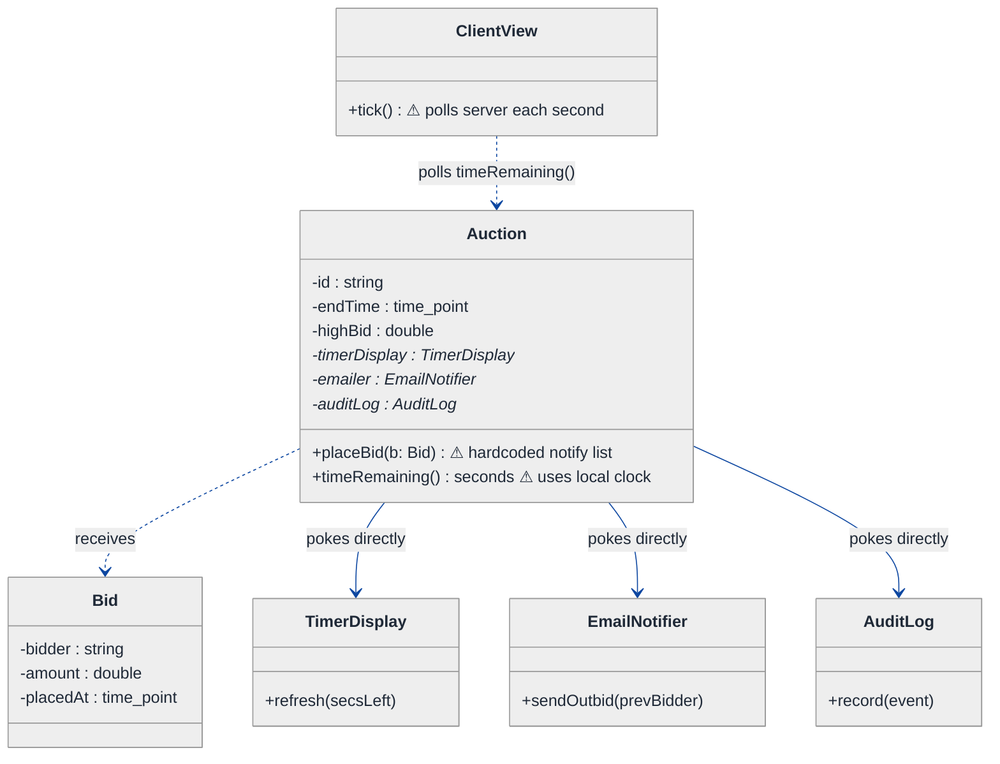
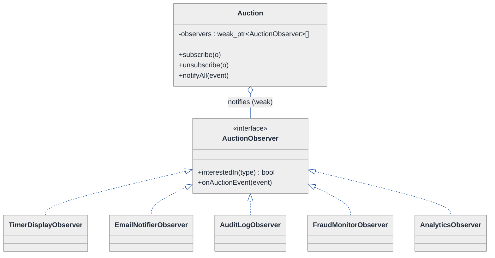
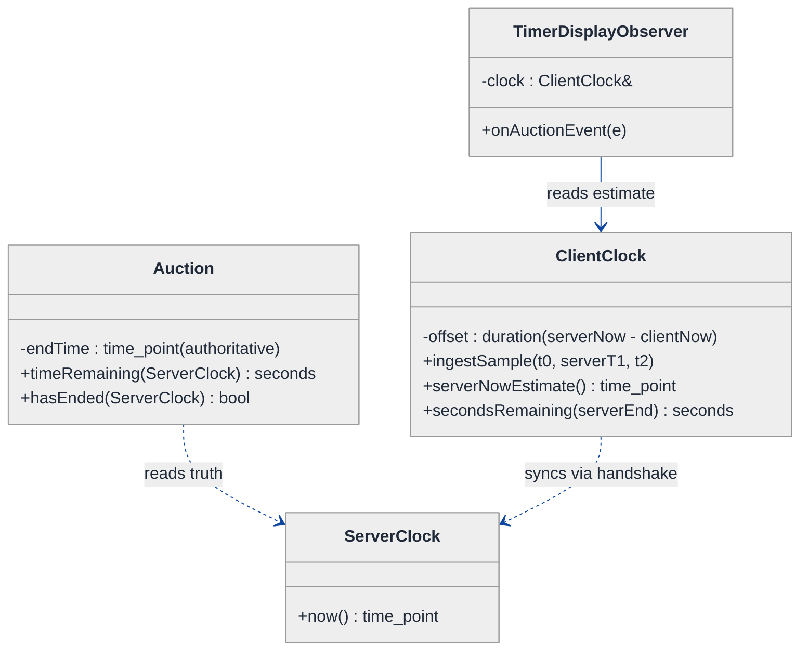
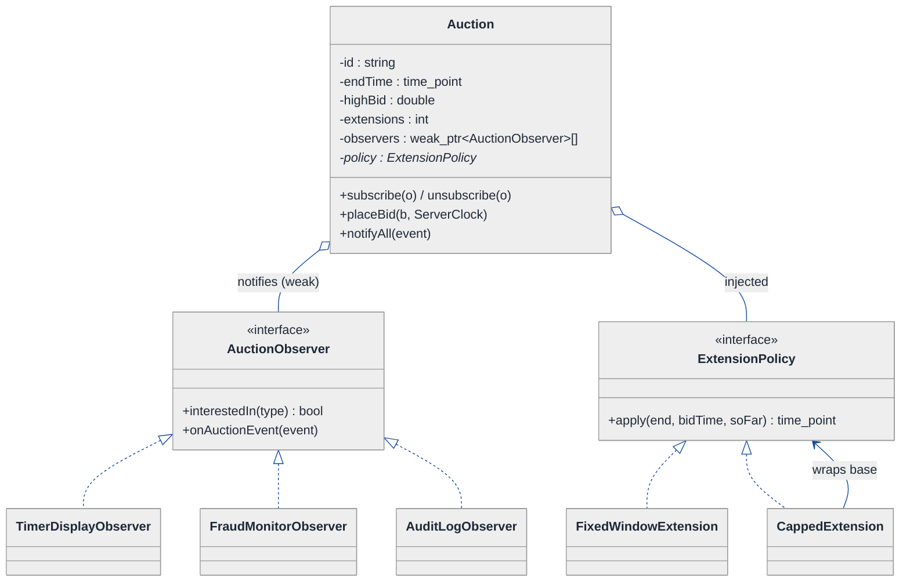
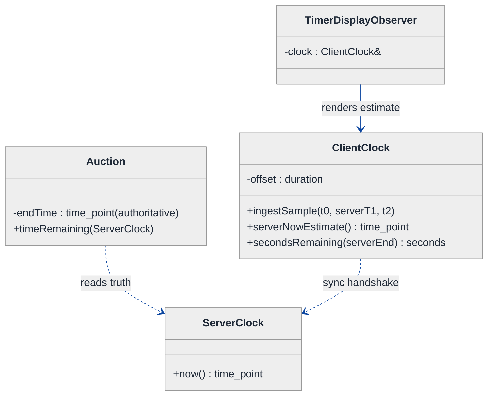
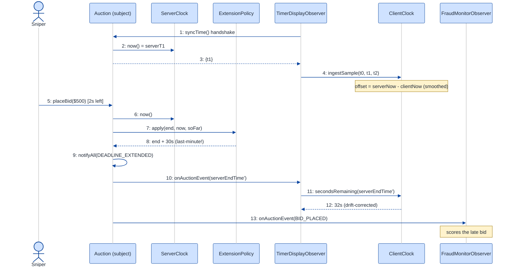

# Auction Countdown Timer — LLD Walkthrough

> **Difficulty:** Medium · **Time:** ~30 min · **Pattern focus:** Observer (bid/clock fan-out) + a server-authoritative time-sync model
>
> **Problem source(s):** GID OB4, bucket `Observer_Pattern`. Representative of the "live auction / live event countdown" family of LLD prompts.
>
> **Diagrams:** inline mermaid (renders natively in GitHub / VS Code). Light bg + soft pastels + navy arrows per the repo's canonical theme block.

---

## How to use this file

Paced for a candidate who has never modeled a real-time, server-authoritative system before. Reading time: ~30 minutes if you sketch each iteration by hand. **The lesson: don't reach for a pub/sub framework or a clock library up front — DERIVE the Observer pattern by building the naive polling design first, watching it break under four hypothetical changes, and reaching for ONE structural fix at a time.**

The two things this question is really probing:

1. **Who owns the truth?** In a countdown, the *server* owns the deadline. The client only owns an *estimate* of it. Conflating the two is the classic bug.
2. **Who needs to know when something changes?** A bid arriving must fan out to every watcher, the timer display, the extension logic, the audit log — without the auction having to know each of them by name. That fan-out is the Observer pattern.

**Map of this file (15 sections):**

1. Problem statement + clarifying questions
2. Plain-English restatement
3. Why this matters
4. Mental model
5. Try it yourself first
6. Entity & verb extraction
7. **Iteration 1: the naive design** — polling + hardcoded notifications
8. **Where the naive design hurts** — four future requirements, one painful diff each
9. **Pivot 1: Observer for change fan-out** — the most painful axis first
10. **Pivot 2: server-authoritative time + drift correction** — separate truth from estimate
11. **Pivot 3: Strategy for the extension policy** — the last-minute bid rule varies
12. Final class diagram
13. Skeleton code (C++)
14. Key flow — sequence diagram
15. Extensibility re-check + anti-patterns + how to think aloud + self-check

---

## 1. Problem statement + clarifying questions

**Prompt (typical phrasing):** "Design an online auction countdown timer. Each item has a deadline. Bids placed in the final seconds extend the deadline ('anti-snipe'). Many clients watch the same auction and must see a synchronized countdown. Time is server-authoritative, and clients' clocks drift — handle that."

**Clarifying questions to ask BEFORE drawing anything:**

1. **Server-authoritative time — how strict?** Is the server the *only* source of the deadline, or can clients ever decide locally that an auction ended? (Assume: server is the single source of truth; clients only ever *display* an estimate.)
2. **Extension rule specifics?** "Last-minute bid" = bids within how many seconds of the end? How much does each such bid extend the deadline? Is there a cap on total extensions? (Assume: bid within `T_trigger` seconds extends end by `T_extend`, with a max-extension cap — and these numbers vary per auction.)
3. **How do clients get updates — push or poll?** WebSocket push, server-sent events, or HTTP polling? (Assume: server can push to subscribed clients; we still must survive a client that briefly disconnects.)
4. **What synchronizes the clocks?** Do we control the client (a first-party app) so we can run a sync handshake, or are these arbitrary browsers? (Assume: first-party clients run a periodic time-sync handshake against the server.)
5. **Concurrency / ordering on bids?** Two bids arrive in the same millisecond — does the server pick a single winner and a single canonical ordering? (Assume: the server serializes bids per auction; ties broken by server receipt time.)
6. **How many watchers per auction, and do they all need every event?** Some want bid updates, some only the final result. (Assume: thousands of watchers; observers can subscribe to a subset of event types.)

**Assumptions if interviewer dodges:** server is single source of truth; bid within `T_trigger` seconds extends by `T_extend` with a cap; clients are first-party and run a sync handshake; the server serializes bids per auction; observers can be many and selective.

---

## 2. Plain-English restatement

We're building the brain of a live auction. The server holds each auction's true deadline. Bids come in; if a bid lands in the danger zone near the end, the deadline slides forward so snipers can't win with a one-millisecond-late steal. Lots of people are watching the same item, and every one of them should see roughly the same number ticking down — even though their laptops' clocks are each a little fast or slow. The server is the referee; the clients are spectators reading an estimate of the referee's stopwatch. The design must let us add new kinds of watchers (a fraud monitor, an analytics sink, a "you've been outbid" notifier) and new extension rules **without rewriting the auction core**.

---

## 3. Why this matters

This question separates candidates who can model *time and change propagation* from those who can only model static CRUD objects. The skill being probed: do you keep a single authoritative source of truth and treat everything else as a derived estimate, and do you decouple "the thing that changed" from "everyone who cares"? That exact pair — server-authoritative state + Observer fan-out — reappears in live sports scores, ride-hailing ETAs, collaborative editors, stock tickers, and multiplayer game lobbies. Get it right here and you get a whole family of systems right.

---

## 4. Mental model

An auction is a **referee with a stopwatch** plus a **crowd of spectators**. The referee (server) owns the real time-remaining. Each spectator (client) holds a *copy* of the stopwatch that they wind forward themselves between updates — and because their wrist-watch runs a little fast or slow, they periodically ask the referee "what time is it really?" and nudge their copy back into agreement.

```
Real-world sketch (NOT a UML diagram yet):

        SERVER (referee — owns truth)
        ┌───────────────────────────────────────┐
        │  Auction #42                            │
        │   endTime  = T0  (authoritative)        │
        │   bid arrives in last 5s → endTime+30s  │  ← extension
        └───────────────┬─────────────────────────┘
            push "state changed" │ (fan-out)
        ┌──────────┬──────────────┼───────────┬──────────┐
        ▼          ▼              ▼           ▼          ▼
   [Phone A]  [Laptop B]   [TimerDisplay] [Fraud mon] [Analytics]
   clock +800ms  clock -300ms                                  
   shows est.    shows est.   each watcher reacts to the SAME event
   (drift-       (drift-
    corrected)    corrected)
```

The KEY insight from this picture: there is exactly ONE clock that matters (the referee's), and there are MANY independent watchers who must be told when something changes. Two different problems: **time authority** (one source) and **change fan-out** (many listeners). We'll solve them separately.

---

## 5. Try it yourself first

> **Predict before reading on:**
>
> 1. List 4 nouns you'd promote to a class. List 2 nouns you'd leave as fields.
> 2. **If the client's clock is 800ms ahead of the server, and the server says "12.0 seconds left," what number should the client display right now — and how does it keep counting without asking the server every tick?**
> 3. A bid arrives. Who needs to be notified, and how does the `Auction` avoid having a hardcoded list of all of them?

---

## 6. Entity & verb extraction

> **Mini-refresher: noun → class, but not every noun.**
>
> Naive OOD promotes every noun to a class. Senior OOD promotes a noun only if it has both BEHAVIOR and STATE that need to live together. "Deadline" is a `time_point` field; "Auction" is a class because it has lifecycle behavior and fires events.

**Nouns from the prompt:**

| Noun | Decision | Why |
|---|---|---|
| Auction | Class (the SUBJECT) | Owns endTime, accepts bids, fires change events |
| Bid | Class | Has bidder, amount, server-receipt timestamp |
| Watcher / Client | Class (OBSERVER, abstract) + concretes | Reacts to auction changes; many independent kinds |
| Deadline / endTime | Field on Auction (`time_point`) | Just an instant; no behavior of its own |
| ServerClock | Class | The single authoritative time source |
| ClientClock | Class | Holds the drift offset; converts server↔local time |
| Extension rule | Strategy object (introduced in §11) | The "last-minute → extend" policy varies |
| Bid amount | Field on Bid | No behavior |

**Verbs (and the class they live on):**

| Verb | Owner class (naive answer — we'll re-examine) |
|---|---|
| placeBid(bid) | Auction |
| extendIfLastMinute() | Auction |
| timeRemaining() | Auction (authoritative) / ClientClock (estimate) |
| notify(...) | Auction → each Watcher |
| syncWith(server) | ClientClock |
| onAuctionChanged(event) | Watcher |

**We have NOT introduced any design patterns yet.** Pure nouns + verbs.

---

## 7. <a id="iter-1"></a>Iteration 1: the naive design

Let's write the simplest thing that could possibly work. No patterns — `Auction` knows its watchers by name and pokes them directly; clients poll the server for time.



**Reader's tour (read top to bottom; ~60 seconds).**

1. **`Auction` is the root.** It holds the auction state (`endTime`, `highBid`) AND three named pointers to the things it must notify: `timerDisplay`, `emailer`, `auditLog`. Every collaborator is wired in by name.

2. **The trouble markers (⚠):**
   - `placeBid()` has a *hardcoded notify list* — after accepting a bid it calls `timerDisplay->refresh(...)`, `emailer->sendOutbid(...)`, `auditLog->record(...)` one by one. Add a new watcher → edit this method.
   - `timeRemaining()` computes `endTime - now()` using the *local* machine clock. On the server that's fine. But `ClientView::tick()` does the same thing against *its own* clock — and that clock drifts.

3. **`ClientView::tick()` polls.** Every second it asks the server (or recomputes locally) for the remaining time. Polling every second from thousands of clients is wasteful, and computing locally is wrong because the client clock drifts.

4. **What's deliberately missing.** No `Observer` interface. No separation between "the server's authoritative time" and "the client's estimate." No pluggable extension rule. The naive design bakes a hardcoded answer for each into the methods that use them.

Skeleton code for the naive design (C++):

```cpp
#include <chrono>
#include <string>
#include <vector>

using Clock     = std::chrono::system_clock;
using TimePoint = Clock::time_point;
using Seconds   = std::chrono::seconds;

struct Bid {
    std::string bidder;
    double      amount;
    TimePoint   placedAt;
};

class TimerDisplay { public: void refresh(long secsLeft); /* elided */ };
class EmailNotifier { public: void sendOutbid(const std::string& prev); /* elided */ };
class AuditLog     { public: void record(const std::string& event); /* elided */ };

class Auction {
public:
    Auction(std::string id, TimePoint endTime,
            TimerDisplay* td, EmailNotifier* em, AuditLog* log)
        : id_(std::move(id)), endTime_(endTime),
          timerDisplay_(td), emailer_(em), auditLog_(log) {}

    void placeBid(const Bid& b) {
        if (Clock::now() >= endTime_) return;          // auction over
        std::string prev = highBidder_;
        highBid_ = b.amount; highBidder_ = b.bidder;

        // anti-snipe: hardcoded last-minute rule
        auto left = std::chrono::duration_cast<Seconds>(endTime_ - Clock::now());
        if (left.count() <= 5) endTime_ += Seconds(30);   // ⚠ magic numbers

        // ⚠ hardcoded notify list — every new watcher edits this method
        timerDisplay_->refresh(timeRemaining());
        emailer_->sendOutbid(prev);
        auditLog_->record("bid " + b.bidder);
    }

    long timeRemaining() const {                       // ⚠ uses local clock
        auto left = std::chrono::duration_cast<Seconds>(endTime_ - Clock::now());
        return left.count() > 0 ? left.count() : 0;
    }
private:
    std::string   id_, highBidder_;
    TimePoint     endTime_;
    double        highBid_ = 0;
    TimerDisplay* timerDisplay_;
    EmailNotifier* emailer_;
    AuditLog*     auditLog_;
};

// On the client, naive and WRONG: recomputes against the local (drifting) clock
class ClientView {
public:
    explicit ClientView(Auction* a) : auction_(a) {}
    void tick() { /* every 1s */ long s = auction_->timeRemaining(); /* render s */ }
private:
    Auction* auction_;
};
```

**This works** — for one client on a machine whose clock equals the server's, with a fixed watcher set and a fixed 5s/30s rule. So what's wrong with it?

---

## 8. <a id="naive-pain"></a>Where the naive design hurts

The interviewer slides four new requirements across the desk: "Walk me through what changes."

### Change A: "Add a fraud monitor and a live analytics sink that also react to every bid"

In the naive design:
- `Auction` grows two more fields (`fraudMon_`, `analytics_`) and the constructor grows two more parameters.
- `placeBid()` grows two more lines in its hardcoded notify list.
- **Every new watcher edits `Auction`'s fields, constructor, AND `placeBid()` — three sites.** The `Auction` now depends on classes it has no business knowing about.

### Change B: "Clients' clocks drift — the countdown must stay synchronized"

In the naive design:
- `timeRemaining()` uses `Clock::now()` on whatever machine runs it. On a client whose clock is 800ms fast, the displayed countdown is 800ms wrong — and it never self-corrects.
- There is *no concept* of "server time" vs "client estimate." The fix isn't a one-liner; it's a missing abstraction.
- **You'd have to thread a "server offset" through every call site that touches `now()` — and there's no single place that owns it.**

### Change C: "The anti-snipe rule varies per auction — some extend by 30s within 5s, some by 2min within 1min, charity auctions cap total extensions"

In the naive design:
- The rule is the magic-number block inside `placeBid()`. Per-auction variation means `if (auction.type == CHARITY) ... else if ...` branching inside `placeBid()`.
- A max-extension cap needs new state and a new branch.
- **Every new rule is surgery inside `placeBid()` — the core method accumulates every policy.**

### Change D: "A watcher only wants the FINAL result, not every bid (and crashed watchers must not break bid processing)"

In the naive design:
- There's no event *type* — `placeBid()` just calls everyone unconditionally. To support "final-only" watchers you'd add `if`s around each notify call.
- If `emailer_->sendOutbid()` throws, the whole `placeBid()` aborts mid-notify — some watchers updated, some not, bid half-processed.
- **No subscription granularity and no isolation between watchers.**

### The pattern of pain

| Change | Files / sites touched | Smell |
|---|---|---|
| A. New watchers | `Auction` fields + ctor + `placeBid` | "Subject hardcodes every observer by name." |
| B. Clock drift | every `now()` call site | "No single owner of server-vs-client time." |
| C. Varying rule | `placeBid` magic-number block | "Core method accumulates every policy." |
| D. Selective / crash-safe | `placeBid` notify loop | "No event types, no observer isolation." |

**Two axes of pain dominate:** *change fan-out* (who gets told, A + D) and *time authority* (whose clock is truth, B). The extension policy (C) is a third, smaller axis.

> **Pivot question:** "What pattern lets a subject broadcast 'I changed' to an open-ended set of listeners WITHOUT knowing who they are? And separately — where does the single authoritative clock live, and how does a drifting client estimate it?"
>
> The fan-out answer is the Observer pattern. The time answer is a server-authoritative clock plus a client-side offset. Let's introduce the most painful axis first: fan-out.

---

## 9. <a id="pivot-1"></a>Pivot 1: Observer for change fan-out

> **Mini-refresher: Observer pattern.**
>
> A **Subject** keeps a list of **Observers** and, when its state changes, calls a uniform `update(event)` on each. The subject knows only the `Observer` *interface* — never the concrete watchers. Observers attach/detach themselves at runtime. Classic example: a spreadsheet cell (subject) whose value changes, and a bar chart + a pie chart + a formula cell (observers) all redraw — the cell doesn't know charts exist.

**Why Observer fits.** A bid changes the auction's state, and an *open-ended, runtime-varying* set of parties must react: the timer display, the outbid emailer, the audit log, a fraud monitor, an analytics sink. The auction shouldn't know any of them by name (that was Change A's pain). It should know only "I have a list of `AuctionObserver`s; on change, I notify each." That is textbook Observer.

> **Mini-refresher: Open/Closed Principle (the "O" in SOLID).**
>
> Software should be *open for extension, closed for modification*. Adding a fraud monitor should NOT require editing `Auction`. After this pivot, adding a watcher means writing one new class and calling `auction.subscribe(...)` — `Auction`'s source never changes.

**The refactor (just the affected slice):**

```cpp
// What the subject broadcasts. A typed event, not a bare ping.
enum class AuctionEventType { BID_PLACED, DEADLINE_EXTENDED, AUCTION_ENDED };

struct AuctionEvent {
    AuctionEventType type;
    std::string      auctionId;
    double           highBid;
    TimePoint        serverEndTime;   // authoritative — see Pivot 2
};

class AuctionObserver {
public:
    virtual ~AuctionObserver() = default;
    // Which event types this observer cares about (Change D: selective).
    virtual bool interestedIn(AuctionEventType t) const { return true; }
    virtual void onAuctionEvent(const AuctionEvent& e) = 0;
};

class TimerDisplayObserver : public AuctionObserver {
public:
    bool interestedIn(AuctionEventType t) const override {
        return t != AuctionEventType::AUCTION_ENDED ? true : true; // wants all
    }
    void onAuctionEvent(const AuctionEvent& e) override { /* re-render countdown */ }
};

class FraudMonitorObserver : public AuctionObserver {
public:
    bool interestedIn(AuctionEventType t) const override {
        return t == AuctionEventType::BID_PLACED;        // only bids
    }
    void onAuctionEvent(const AuctionEvent& e) override { /* score the bid */ }
};
// EmailNotifierObserver, AuditLogObserver, AnalyticsObserver ... elided

class Auction {                 // the SUBJECT
public:
    void subscribe(std::weak_ptr<AuctionObserver> o)   { observers_.push_back(std::move(o)); }
    // placeBid no longer names any concrete watcher:
    void notifyAll(const AuctionEvent& e) {
        for (auto it = observers_.begin(); it != observers_.end(); ) {
            if (auto obs = it->lock()) {                 // observer still alive?
                if (obs->interestedIn(e.type)) {
                    try { obs->onAuctionEvent(e); }      // Change D: isolate crashes
                    catch (...) { /* log + carry on; one bad observer can't stall bids */ }
                }
                ++it;
            } else {
                it = observers_.erase(it);               // prune dead observers
            }
        }
    }
private:
    std::vector<std::weak_ptr<AuctionObserver>> observers_;   // back-refs are weak
};
```

> **Mini-refresher: `weak_ptr` for observer back-references.**
>
> The subject does NOT own its observers — they have their own lifetimes (a UI panel, a separate service). Holding `shared_ptr` would keep dead observers alive (a leak) and risk cycles. `weak_ptr` lets the subject *try* to reach an observer (`lock()`), and silently prune it once it's gone. Ownership flows the other way (or to a registry); the subject only borrows.

**What changed — visualized.** Just the fan-out slice:



**Tour of the after-state.**

1. **`Auction` now holds ONE list — `observers`.** Not five named pointers. The open diamond (`◇`) marks aggregation: the auction *uses* observers but does not own their lifetimes (hence `weak_ptr`).

2. **The `<<interface>>` box.** `AuctionObserver` declares two methods: `interestedIn(type)` (Change D — selective subscription) and `onAuctionEvent(event)` (the uniform callback). Every watcher implements this and nothing more.

3. **Five concrete observers hang off the interface.** `TimerDisplayObserver`, `EmailNotifierObserver`, `AuditLogObserver`, `FraudMonitorObserver`, `AnalyticsObserver`. `Auction` knows NONE of them by name.

4. **Change A now lands cleanly.** A new watcher (fraud, analytics) is one new class implementing `AuctionObserver` + a `subscribe()` call. `Auction`'s fields, constructor, and `placeBid()` never change. Open/closed.

5. **Change D lands too.** Selective delivery via `interestedIn`; crash isolation via the `try/catch` in `notifyAll` so one throwing observer can't abort bid processing.

> **Push vs pull (Observer's two flavors).**
> - *Push:* the subject sends the changed data *in* the event (`AuctionEvent` carries `highBid`, `serverEndTime`). Observers get everything; no call-back needed.
> - *Pull:* the subject sends a bare "I changed" ping; each observer calls back into the subject to fetch what it needs.
> - *Rule of thumb:* push when the payload is small and most observers want it (our case — a bid event is tiny). Pull when the state is large and observers want different slices.
>
> We chose **push** with a typed `AuctionEvent` so observers don't have to call back into a possibly-locked `Auction`.

**Pattern-discrimination cheatsheet — Observer vs Mediator.**
- *Observer:* one subject broadcasts to many listeners; listeners don't talk to each other.
- *Mediator:* a hub coordinates many peers that would otherwise reference each other directly (e.g., chat-room participants).
- *Rule of thumb:* one-to-many *notification* → Observer. Many-to-many *coordination* routed through a hub → Mediator. Here it's one auction → many watchers, so Observer.

---

## 10. <a id="pivot-2"></a>Pivot 2: server-authoritative time + drift correction

Change B is still painful — the countdown is wrong on a client whose clock drifts, and there's no single owner of "real" time. Observer doesn't help: the problem isn't *who gets told*, it's *whose clock is the truth*.

> **Mini-refresher: server-authoritative state.**
>
> Exactly one component owns the canonical value; everyone else holds a *derived estimate* and must reconcile against the owner. Never let a client *decide* an auction ended — it can only *display* its best guess and trust the server's verdict. This is the same discipline as authoritative game servers and bank ledgers.

**The model.** Split time into two collaborators:

- **`ServerClock`** — the single source of truth. `endTime` is stored as a server `time_point`. `timeRemaining()` is only ever computed on the server, or against a server-time *estimate* on the client.
- **`ClientClock`** — holds an `offset_` (estimated `serverNow - clientNow`) plus a measured round-trip. The client never reads its own wall clock directly for the countdown; it reads `clientClock.serverNowEstimate()`.

**The sync handshake (NTP-lite — Christian's algorithm).** To estimate the offset without a perfect network:

```
t0 = client local time when request sent
t1 = server time when it handled the request   (server stamps the reply)
t2 = client local time when reply received

round_trip = t2 - t0
// assume the reply traveled back in half the round-trip:
estimated_server_now_at_t2 = t1 + round_trip / 2
offset = estimated_server_now_at_t2 - t2     // serverNow - clientNow
```

The client stores `offset`. Then `serverNowEstimate() = clientLocalNow() + offset`, and the displayed countdown is `serverEndTime - serverNowEstimate()`. Between handshakes the client just counts down locally; every few seconds it re-runs the handshake and **smooths** the offset toward the new estimate (don't snap — a hard jump makes the timer visibly jitter or run backward). A simple smoothing: `offset += (newOffset - offset) * alpha` with `alpha` around 0.2.

**The refactor (just the time slice):**

```cpp
class ServerClock {                        // single source of truth (server-side)
public:
    TimePoint now() const { return Clock::now(); }
};

class ClientClock {                        // client-side estimate of server time
public:
    // Christian's algorithm: feed it one handshake sample.
    void ingestSample(TimePoint t0, TimePoint serverT1, TimePoint t2) {
        auto roundTrip = t2 - t0;
        auto estServerNowAtT2 = serverT1 + roundTrip / 2;
        auto newOffset = estServerNowAtT2 - t2;            // serverNow - clientNow
        if (!initialized_) { offset_ = newOffset; initialized_ = true; }
        else {
            // smooth — never snap (avoids visible countdown jitter)
            using namespace std::chrono;
            auto delta = duration_cast<milliseconds>(newOffset - offset_);
            offset_ += duration_cast<Clock::duration>(delta * 0.2);
        }
    }
    TimePoint serverNowEstimate() const { return Clock::now() + offset_; }
    long secondsRemaining(TimePoint serverEndTime) const {
        auto left = std::chrono::duration_cast<Seconds>(serverEndTime - serverNowEstimate());
        return left.count() > 0 ? left.count() : 0;
    }
private:
    Clock::duration offset_{};           // serverNow - clientNow
    bool            initialized_ = false;
};

class Auction {
public:
    // timeRemaining is AUTHORITATIVE — only meaningful on the server.
    long timeRemaining(const ServerClock& clock) const {
        auto left = std::chrono::duration_cast<Seconds>(endTime_ - clock.now());
        return left.count() > 0 ? left.count() : 0;
    }
    bool hasEnded(const ServerClock& clock) const { return clock.now() >= endTime_; }
private:
    TimePoint endTime_;   // authoritative; carried to clients inside AuctionEvent
};
```

**What changed — visualized.** Just the time slice:



**Tour of the after-state.**

1. **`Auction.timeRemaining` now TAKES a `ServerClock`.** It can no longer secretly read a local clock — it must be handed the authoritative source. On the server, that's `ServerClock`. There is no client-side path to call this, by design.

2. **`ClientClock` owns the offset.** One field, `offset = serverNow - clientNow`, fed by `ingestSample` (Christian's algorithm) and smoothed. The client's countdown is `serverEndTime - serverNowEstimate()` — never the raw local clock.

3. **The `serverEndTime` rides inside `AuctionEvent`.** When Pivot 1's `notifyAll` pushes an event, it carries the authoritative `serverEndTime`. So a `TimerDisplayObserver` gets the new deadline *and* converts it through its `ClientClock`. The two pivots compose: **the Observer event delivers truth; the ClientClock renders the estimate.**

4. **Why a separate `ClientClock` rather than a field on the observer?** Many client-side observers (timer, "ending soon" badge, sniping warning) share one drift estimate. One `ClientClock` per client, injected into each observer, keeps them all consistent.

**Pattern-discrimination cheatsheet — server-authoritative time vs "just use NTP."**
- *NTP at the OS level:* synchronizes the machine clock globally; you don't control it, can't trust arbitrary clients ran it, and it can step the clock unexpectedly.
- *Application-level offset (ours):* the app measures its own offset to *your* server and reconciles continuously. You own it, it survives untrusted client clocks, and it smooths instead of stepping.
- *Rule of thumb:* if correctness depends on agreement with a *specific* server (an auction deadline), measure the offset to that server in-app — don't assume the OS clock is right.

---

## 11. <a id="pivot-3"></a>Pivot 3: Strategy for the extension policy

Change C remains: the anti-snipe rule varies per auction (5s→+30s, 1min→+2min, charity caps total extensions). In the naive design it was a magic-number block inside `placeBid()`. The variability is *an algorithm chosen by configuration* — that's Strategy.

> **Mini-refresher: Strategy pattern.**
>
> Encapsulate an algorithm behind an interface so it can be swapped at runtime. The CALLER (here, the auction's configuration) picks which strategy; the strategy doesn't know about its peers. Quick example: a `Sorter` takes a `CompareStrategy*` — pass `Ascending` or `Descending`; the sorter doesn't care.

**Why Strategy (not just config fields).** Plain config (`triggerSecs`, `extendSecs`) covers the simple case, but the *shape* of the rule differs: a fixed window-and-extend, a tapering extension, a charity cap on total extensions. Different shapes → different algorithms → an interface with concrete implementations, injected per auction.

**The refactor (just the policy slice):**

```cpp
class ExtensionPolicy {
public:
    virtual ~ExtensionPolicy() = default;
    // Given the current deadline + when the bid landed (server time),
    // return the NEW deadline (unchanged if no extension applies).
    virtual TimePoint apply(TimePoint currentEnd, TimePoint bidServerTime,
                            int extensionsSoFar) const = 0;
};

class FixedWindowExtension : public ExtensionPolicy {        // "within T_trigger → +T_extend"
public:
    FixedWindowExtension(Seconds trigger, Seconds extend)
        : trigger_(trigger), extend_(extend) {}
    TimePoint apply(TimePoint end, TimePoint bidAt, int) const override {
        return (end - bidAt <= trigger_) ? end + extend_ : end;
    }
private:
    Seconds trigger_, extend_;
};

class CappedExtension : public ExtensionPolicy {             // charity: max N extensions
public:
    CappedExtension(std::unique_ptr<ExtensionPolicy> base, int maxExt)
        : base_(std::move(base)), maxExt_(maxExt) {}
    TimePoint apply(TimePoint end, TimePoint bidAt, int soFar) const override {
        return (soFar >= maxExt_) ? end : base_->apply(end, bidAt, soFar);  // decorator
    }
private:
    std::unique_ptr<ExtensionPolicy> base_;
    int maxExt_;
};
// TaperingExtension (extend less each time) ... elided

class Auction {
public:
    void placeBid(const Bid& b, const ServerClock& clock) {
        if (hasEnded(clock)) return;
        highBid_ = b.amount; highBidder_ = b.bidder;

        TimePoint newEnd = policy_->apply(endTime_, clock.now(), extensions_);  // ← injected
        if (newEnd != endTime_) {
            endTime_ = newEnd; ++extensions_;
            notifyAll({AuctionEventType::DEADLINE_EXTENDED, id_, highBid_, endTime_});
        }
        notifyAll({AuctionEventType::BID_PLACED, id_, highBid_, endTime_});
    }
private:
    std::unique_ptr<ExtensionPolicy> policy_;   // injected per auction
    int extensions_ = 0;
};
```

`placeBid()` no longer contains any magic numbers or rule shape — it asks the injected `policy_`. A charity auction is constructed with `CappedExtension(FixedWindowExtension(60s, 120s), 3)`. The core method never changes when a new rule appears.

> **Mini-refresher: Strategy + Decorator together.**
>
> `CappedExtension` wraps another `ExtensionPolicy` (a Decorator) to add the cap without subclassing every base rule. So `CappedExtension(FixedWindow(...))` reads as "fixed-window extension, but capped." Composition of policies, not an inheritance explosion.

**Pattern-discrimination cheatsheet — Strategy vs State.**
- *Strategy:* the CALLER / config picks the algorithm; variants are unaware of each other. (Extension rule — picked when the auction is set up.)
- *State:* the OBJECT picks its next state via internal transitions. (The auction's own `OPEN → EXTENDED → CLOSED` lifecycle would be State, if we modeled it.)
- *Rule of thumb:* `auction.setPolicy(x)` from outside → Strategy. `auction.handle(event)` flips an internal phase → State. The extension *rule* is Strategy; the auction's *phase* would be State.

---

## 12. <a id="fig-class-diagram"></a>Final class diagram

Showing everything in one box-wall hides the structure. Here are **two focused sub-views** — the change-fan-out + policy core, and the time model — followed by the structural insight that ties them together.

### 12.1 The subject, its observers, and its policy



**Tour of 12.1.** `Auction` is the SUBJECT. It holds a `weak_ptr` list of `AuctionObserver`s (open diamond = aggregation, doesn't own their lifetime) and one injected `ExtensionPolicy` (also aggregation — picked at construction). Observers and policies are both plug-in points: a new watcher is a new `AuctionObserver`; a new anti-snipe rule is a new `ExtensionPolicy`. `CappedExtension` wraps another policy (Decorator). `Auction`'s source never changes when either family grows.

### 12.2 The time model — truth vs estimate



**Tour of 12.2.** Two clocks, two roles. `ServerClock` is the only authoritative source — `Auction` reads it to compute the real deadline and to decide `hasEnded`. `ClientClock` is the per-client estimate: it syncs to `ServerClock` via the handshake, holds the drift `offset`, and renders the countdown. The `TimerDisplayObserver` reads the *estimate* (`ClientClock`) and gets the *truth* (`serverEndTime`) pushed inside each `AuctionEvent`. Truth flows server→client through events; the estimate is reconciled continuously.

### Structural insight (ties 12.1 + 12.2 together)

| Concern | Pattern used | Why |
|---|---|---|
| **Change fan-out** (who reacts to a bid) | Observer, with `weak_ptr` back-refs | Open-ended, runtime-varying set of watchers; subject mustn't know them by name |
| **Selective + crash-safe delivery** | `interestedIn` filter + per-observer `try/catch` | Watchers want subsets; one bad watcher can't stall bids |
| **Time authority** | server-authoritative `ServerClock` + client `ClientClock` offset | One source of truth; clients hold a reconciled estimate, never decide the end |
| **Extension policy** (anti-snipe rule) | Strategy (+ Decorator for cap) | Rule shape varies per auction; injected, composable |

The big lesson: **the Observer pattern decouples *what changed* from *who cares*, and the two-clock model decouples *the truth* from *the estimate*.** Those two decouplings are independent — each could exist without the other — which is exactly why we derived them as separate pivots. The Strategy is the smaller third axis riding on top.

---

## 13. Skeleton code (C++)

> Show the SHAPES, not the full impl. ~120 lines. Abstract bases + 1-2 concretes per pattern; the rest `// elided`.

```cpp
#include <chrono>
#include <memory>
#include <string>
#include <vector>

using Clock     = std::chrono::system_clock;
using TimePoint = Clock::time_point;
using Seconds   = std::chrono::seconds;

// ── Events ──────────────────────────────────────────────────────────
enum class AuctionEventType { BID_PLACED, DEADLINE_EXTENDED, AUCTION_ENDED };

struct AuctionEvent {
    AuctionEventType type;
    std::string      auctionId;
    double           highBid;
    TimePoint        serverEndTime;     // authoritative deadline, carried to clients
};

struct Bid { std::string bidder; double amount; };

// ── Observer (fan-out) ──────────────────────────────────────────────
class AuctionObserver {
public:
    virtual ~AuctionObserver() = default;
    virtual bool interestedIn(AuctionEventType) const { return true; }
    virtual void onAuctionEvent(const AuctionEvent&) = 0;
};

class FraudMonitorObserver : public AuctionObserver {
public:
    bool interestedIn(AuctionEventType t) const override {
        return t == AuctionEventType::BID_PLACED;
    }
    void onAuctionEvent(const AuctionEvent& e) override { /* score bid */ }
};
// TimerDisplayObserver, EmailNotifierObserver, AuditLogObserver, AnalyticsObserver elided

// ── Time authority ──────────────────────────────────────────────────
class ServerClock {
public:
    TimePoint now() const { return Clock::now(); }
};

class ClientClock {
public:
    void ingestSample(TimePoint t0, TimePoint serverT1, TimePoint t2) {
        auto est = serverT1 + (t2 - t0) / 2;          // Christian's algorithm
        auto newOffset = est - t2;                    // serverNow - clientNow
        if (!init_) { offset_ = newOffset; init_ = true; }
        else {
            using namespace std::chrono;
            auto d = duration_cast<milliseconds>(newOffset - offset_);
            offset_ += duration_cast<Clock::duration>(d * 0.2);   // smooth, never snap
        }
    }
    TimePoint serverNowEstimate() const { return Clock::now() + offset_; }
    long secondsRemaining(TimePoint serverEnd) const {
        auto l = std::chrono::duration_cast<Seconds>(serverEnd - serverNowEstimate());
        return l.count() > 0 ? l.count() : 0;
    }
private:
    Clock::duration offset_{};
    bool            init_ = false;
};

// ── Extension policy (Strategy + Decorator) ─────────────────────────
class ExtensionPolicy {
public:
    virtual ~ExtensionPolicy() = default;
    virtual TimePoint apply(TimePoint end, TimePoint bidAt, int soFar) const = 0;
};

class FixedWindowExtension : public ExtensionPolicy {
public:
    FixedWindowExtension(Seconds trigger, Seconds extend)
        : trigger_(trigger), extend_(extend) {}
    TimePoint apply(TimePoint end, TimePoint bidAt, int) const override {
        return (end - bidAt <= trigger_) ? end + extend_ : end;
    }
private:
    Seconds trigger_, extend_;
};

class CappedExtension : public ExtensionPolicy {     // decorator: bounds total extensions
public:
    CappedExtension(std::unique_ptr<ExtensionPolicy> base, int maxExt)
        : base_(std::move(base)), maxExt_(maxExt) {}
    TimePoint apply(TimePoint end, TimePoint bidAt, int soFar) const override {
        return (soFar >= maxExt_) ? end : base_->apply(end, bidAt, soFar);
    }
private:
    std::unique_ptr<ExtensionPolicy> base_;
    int maxExt_;
};

// ── Subject ─────────────────────────────────────────────────────────
class Auction {
public:
    Auction(std::string id, TimePoint endTime, std::unique_ptr<ExtensionPolicy> policy)
        : id_(std::move(id)), endTime_(endTime), policy_(std::move(policy)) {}

    void subscribe(std::weak_ptr<AuctionObserver> o)   { observers_.push_back(std::move(o)); }
    bool hasEnded(const ServerClock& c) const          { return c.now() >= endTime_; }

    void placeBid(const Bid& b, const ServerClock& clock) {
        if (hasEnded(clock)) return;                    // server is the referee
        highBid_ = b.amount; highBidder_ = b.bidder;

        TimePoint newEnd = policy_->apply(endTime_, clock.now(), extensions_);
        if (newEnd != endTime_) {
            endTime_ = newEnd; ++extensions_;
            notifyAll({AuctionEventType::DEADLINE_EXTENDED, id_, highBid_, endTime_});
        }
        notifyAll({AuctionEventType::BID_PLACED, id_, highBid_, endTime_});
    }

    void notifyAll(const AuctionEvent& e) {
        for (auto it = observers_.begin(); it != observers_.end(); ) {
            if (auto obs = it->lock()) {                // alive?
                if (obs->interestedIn(e.type))
                    try { obs->onAuctionEvent(e); } catch (...) { /* isolate + log */ }
                ++it;
            } else it = observers_.erase(it);           // prune dead
        }
    }
private:
    std::string   id_, highBidder_;
    TimePoint     endTime_;             // authoritative
    double        highBid_ = 0;
    int           extensions_ = 0;
    std::unique_ptr<ExtensionPolicy>            policy_;
    std::vector<std::weak_ptr<AuctionObserver>> observers_;
};
```

---

## 14. <a id="fig-sequence"></a>Key flow — sequence diagram

Two phases: a client syncing its clock, then a last-second bid that extends the deadline and fans out to every watcher.



**Tour of the flow. Read it slowly — this is where time-sync and Observer cooperate.**

1. **Steps 1-4 — the clock handshake.** The timer asks the server for its time. The server stamps `t1` from `ServerClock`. The client records `t0` (sent) and `t2` (received) and feeds all three into `ClientClock::ingestSample`, which computes the offset via Christian's algorithm and *smooths* it. **The client never trusts its own raw wall clock for the countdown.**

2. **Step 5 — a sniper bids with 2 seconds left.** The bid hits the `Auction` (the subject), the single referee.

3. **Steps 6-8 — the extension decision is delegated.** `Auction` reads the authoritative `ServerClock`, then asks the injected `ExtensionPolicy` whether to extend. The policy returns `end + 30s` because the bid was inside the trigger window. **No magic numbers in `placeBid` — the Strategy decides.**

4. **Steps 9-13 — fan-out via Observer.** `Auction` calls `notifyAll`, broadcasting first `DEADLINE_EXTENDED` then `BID_PLACED`. Each event carries the *new authoritative* `serverEndTime`. The `TimerDisplayObserver` converts that through its `ClientClock` (step 11-12) and shows **32 seconds, drift-corrected** — not the raw difference against a fast/slow local clock. The `FraudMonitorObserver`, which subscribed only to `BID_PLACED`, scores the suspiciously-late bid.

### What's NOT shown — and why it matters

You don't see `Auction` calling `timerDisplay.refresh()` or `emailer.send()` by name. It only ever calls `notifyAll(event)`. **The subject is blind to its watchers** — that's the Observer pattern doing its job. Likewise, you don't see the timer reading `Clock::now()` and subtracting: it always goes through `ClientClock`, so the *single* place that knows about drift is the *only* place that can be wrong. **One source of truth, one place to correct the estimate.**

---

## 15. Extensibility re-check + anti-patterns + how to think aloud + self-check

### Extensibility re-check

Revisit the four changes from [§8](#naive-pain). For each, name the SINGLE class that changes.

| Change | Naive design impact | Final design impact |
|---|---|---|
| A. New watchers (fraud, analytics) | `Auction` fields + ctor + `placeBid` | New `XObserver : AuctionObserver` + `subscribe()`. `Auction` untouched. |
| B. Clock drift | every `now()` call site | `ClientClock` owns the offset; observers read its estimate. One place. |
| C. Varying anti-snipe rule | `placeBid` magic-number block | New `XExtension : ExtensionPolicy` (compose with `CappedExtension`). Injected. |
| D. Selective / crash-safe | `placeBid` notify loop | `interestedIn` filter + per-observer `try/catch`, already in `notifyAll`. |

Every change is one new class or already handled. That's the open/closed principle in practice. If a future requirement makes you change `Auction`, `ClientClock`, AND an observer together — go back to §6 and re-identify the variability point you missed.

### Common confusion + traps

1. **"Why `weak_ptr` for observers, not `shared_ptr`?"** The subject borrows observers; it doesn't own them. `shared_ptr` would keep dead UIs alive (leak) and risk cycles. `weak_ptr::lock()` lets the subject skip-and-prune dead watchers.

2. **"Can't the client just compute `endTime - now()`?"** Only if its clock equals the server's — which it never exactly does. The whole point of Pivot 2 is that the client holds an *estimate* (`serverEndTime - serverNowEstimate()`), reconciled by handshake.

3. **"Why smooth the offset instead of snapping to the newest sample?"** A hard snap makes the visible countdown jump or even tick backward, which looks broken and lets sharp users probe the deadline. Exponential smoothing keeps it monotonic-ish and stable.

4. **"Should the client be allowed to end the auction when it hits zero?"** No — server-authoritative. The client shows `0` and waits for the server's `AUCTION_ENDED` event. A bid the server accepted at the same instant might have extended the deadline; only the server knows.

5. **"Is `notifyAll` synchronous safe?"** For an interview, the `try/catch` isolation is the key point. In production you'd dispatch to a queue / thread pool so a slow observer (email/SMTP) can't block bid processing — mention this as the next step.

### Anti-patterns

- **"Subject hardcodes its observers"** — named pointers (`timerDisplay_`, `emailer_`). Use an `AuctionObserver` list; let `subscribe` register them.
- **"Trusting the client clock"** — computing the deadline against `Date.now()` on the browser. Always reconcile to server time.
- **"Snapping the offset"** — replacing the offset wholesale every sync. Smooth it.
- **"Magic numbers in the core method"** — `if (left <= 5) end += 30s` inside `placeBid`. Inject an `ExtensionPolicy`.
- **"One throwing observer aborts the bid"** — no isolation in the notify loop. Wrap each callback; one bad watcher must not stall the auction.
- **"Strong refs both ways"** — subject `shared_ptr` to observers and observers `shared_ptr` back to subject → reference cycle, leak. Back-refs are `weak_ptr`.

### How to think aloud

> "Online auction countdown. Let me clarify scope. [Asks the 4-6 questions from §1.] Got it — server-authoritative time, anti-snipe extension, many watchers, drifting client clocks.
>
> Nouns: Auction, Bid, Watcher, two clocks (server + client). Auction is the subject; watchers are observers.
>
> I'll write the NAIVE design first — `Auction` pokes a hardcoded list of collaborators, and `timeRemaining` reads the local clock. Then I'll stress-test it. Change A: add a fraud monitor — touches `Auction`'s fields, ctor, and `placeBid`. Change B: client clock drift — there's no concept of server-vs-client time. Change C: per-auction anti-snipe rule — magic numbers in `placeBid`. Change D: selective + crash-safe delivery — no event types, no isolation.
>
> Two big axes: change fan-out and time authority. Pivot 1: Observer — `Auction` holds a `weak_ptr` list of `AuctionObserver`s, broadcasts a typed `AuctionEvent` via `notifyAll`, with `interestedIn` for selectivity and `try/catch` for isolation. Adding a watcher is one class.
>
> Pivot 2: server-authoritative time. `ServerClock` is truth; `ClientClock` holds a smoothed offset measured by Christian's algorithm, and the countdown is `serverEndTime - serverNowEstimate()`. The deadline rides inside each event.
>
> Pivot 3: the anti-snipe rule is a Strategy — `ExtensionPolicy` injected per auction, with `CappedExtension` as a decorator for charity caps. `placeBid` just asks the policy.
>
> Final: `Auction` is the subject, aggregating observers (weak) + a policy; the two clocks split truth from estimate. All four future changes land as one new class each."

### Self-check

> **Self-check — the question to ask next time.**
>
> When you see "design a [live thing] that many clients watch in real time," before reaching for a polling loop or a pub/sub framework, ask two questions:
>
> > **"Who owns the truth (one authoritative source) versus who holds an estimate? And who needs to be told when it changes (one subject → many observers, by interface, never by name)?"**
>
> Truth-vs-estimate → a server-authoritative source + a reconciled client offset. Change fan-out → Observer. If the policy that drives the change also varies → Strategy on top. The class diagram falls out for free.

---

## Cross-references

- **Parent topic manifest:** [`./EXTRACTED_QUESTIONS.md`](./EXTRACTED_QUESTIONS.md)
- **Vertical overview:** [`../../LEARNING.md`](../../LEARNING.md)
- **Template:** [`../../TEMPLATE-v2.md`](../../TEMPLATE-v2.md)
- **Canonical exemplar:** [`../Object_Oriented_Design/Parking_Lot.md`](../Object_Oriented_Design/Parking_Lot.md)
- **Related v2 walkthroughs (future):**
  - State Pattern deep-dive (auction lifecycle OPEN → EXTENDED → CLOSED) — in `../State_Pattern/`
  - Strategy Pattern deep-dive (the extension-policy axis) — in `../Strategy_Pattern/`
  - Notification / pub-sub system (Observer at distributed scale) — HLD `Messaging_StreamProcessing` bucket
- **External reading:**
  - <a href="https://refactoring.guru/design-patterns/observer" target="_blank" rel="noopener noreferrer">Observer pattern (Refactoring Guru)</a>
  - <a href="https://en.wikipedia.org/wiki/Cristian%27s_algorithm" target="_blank" rel="noopener noreferrer">Cristian's algorithm (clock synchronization)</a>
