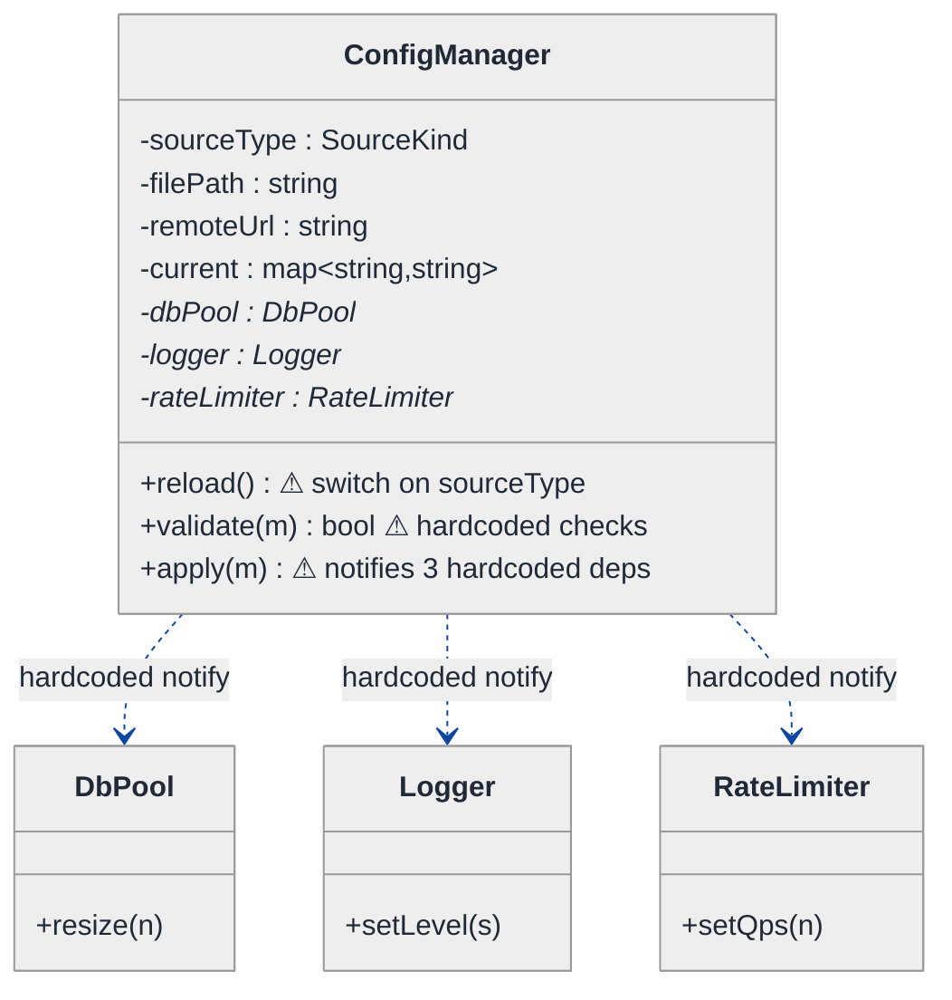
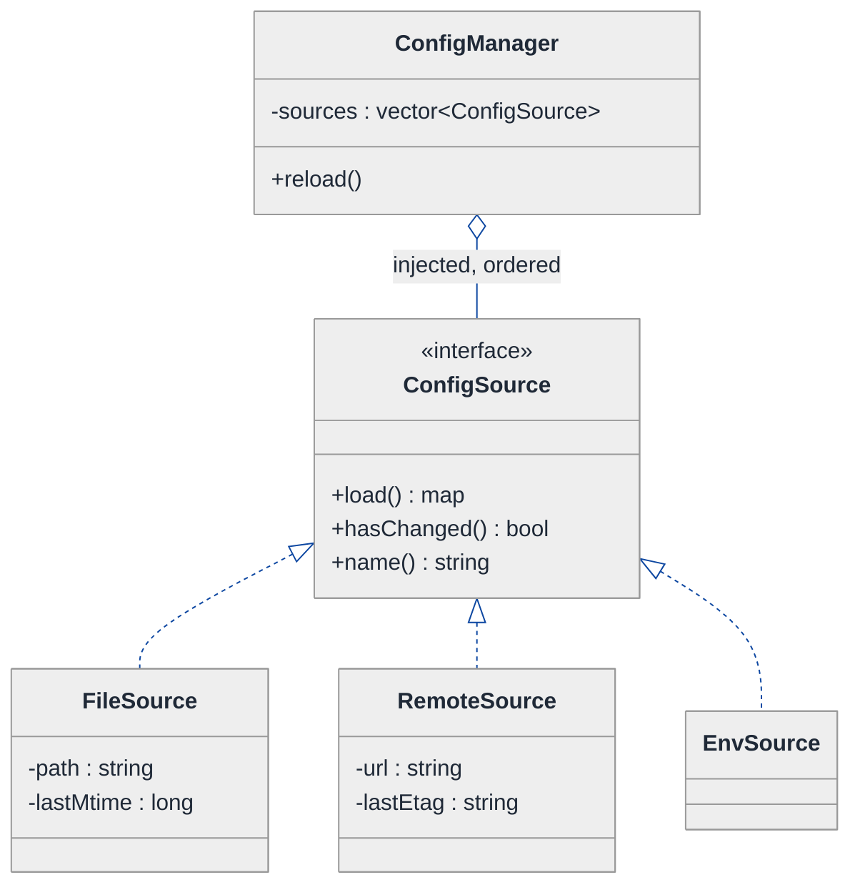
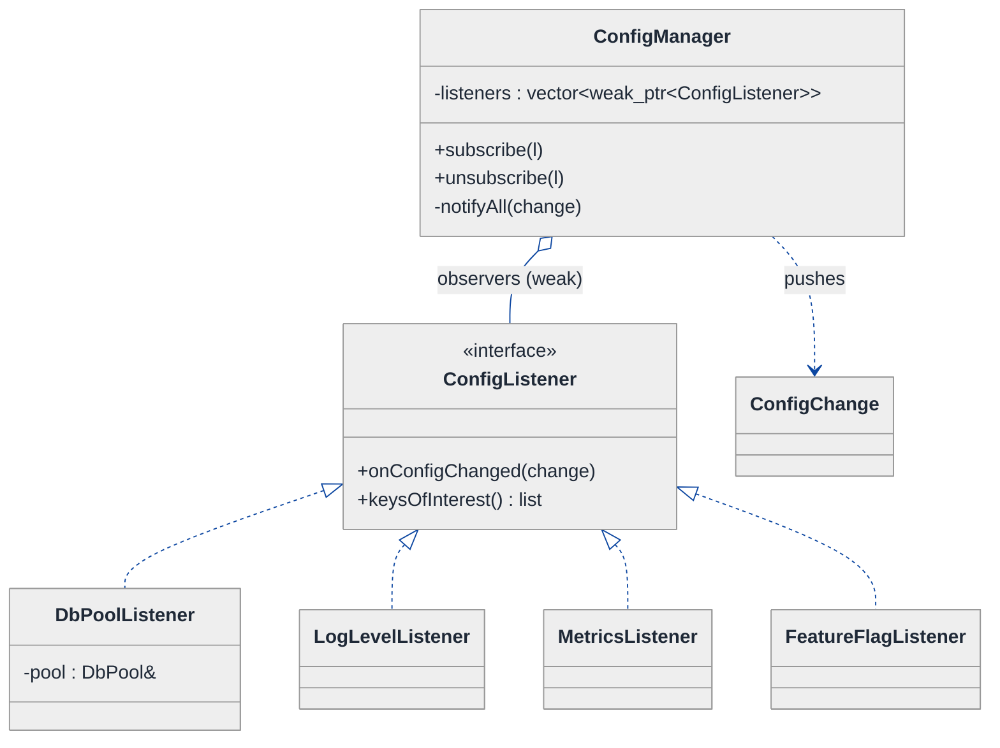
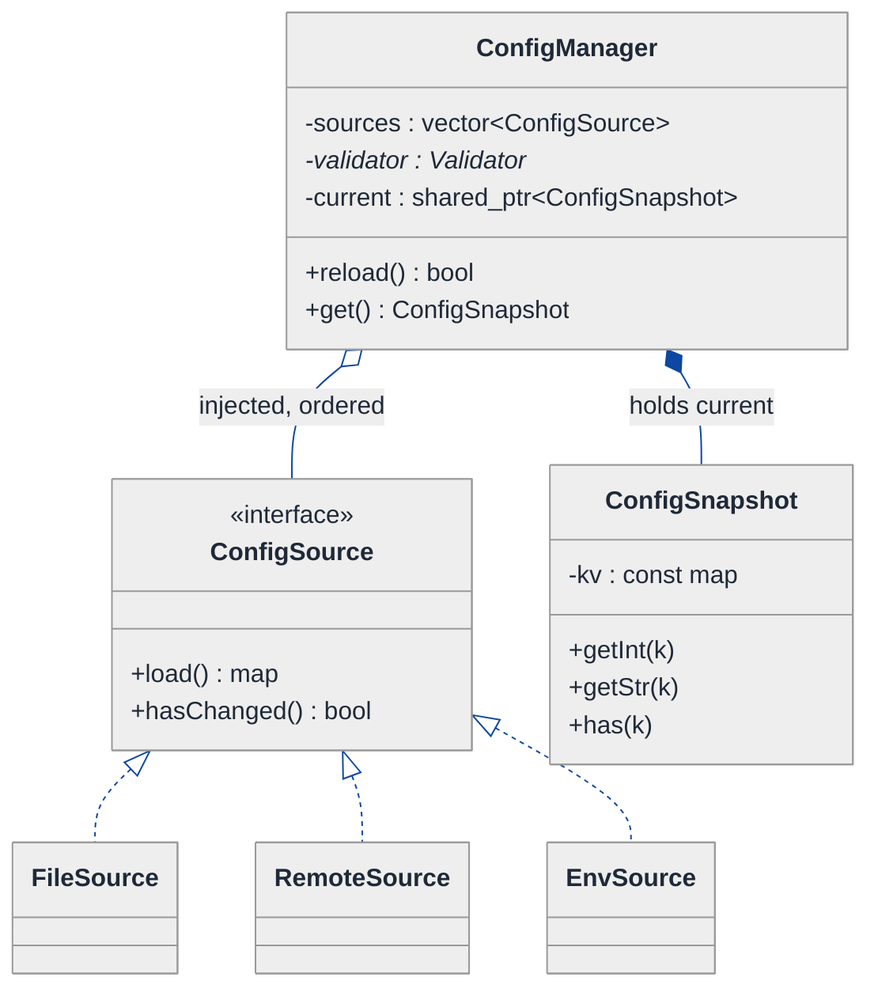
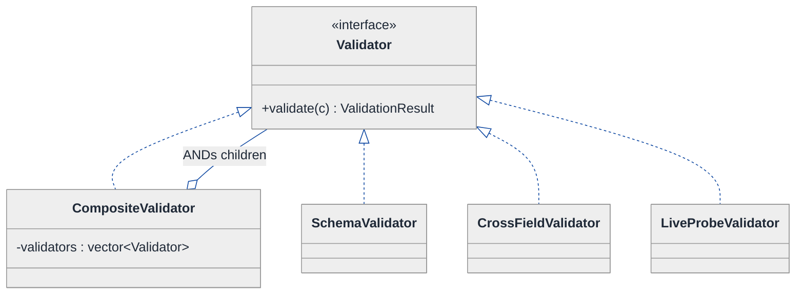
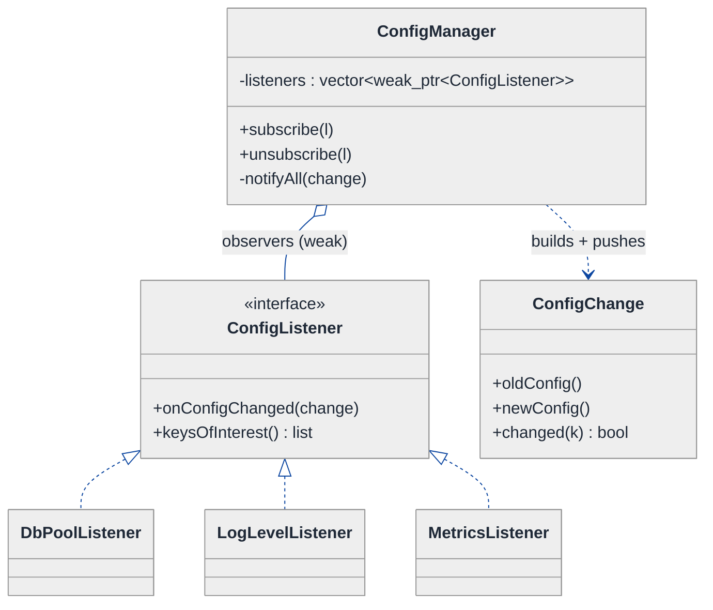

# Configuration Hot-Reload System — LLD Walkthrough

> **Difficulty:** Medium · **Time:** ~35 min · **Pattern focus:** Observer (notify dependents) + Strategy (pluggable sources / validators)
>
> **Problem source(s):** GID OB1 in [`./EXTRACTED_QUESTIONS.md`](./EXTRACTED_QUESTIONS.md) (bucket: Observer_Pattern). A canonical "design a live-reconfigurable subsystem" question.
>
> **Diagrams:** inline mermaid (renders natively in GitHub / VS Code). No external image artifacts.

---

## How to use this file

Paced for a candidate seeing config hot-reload for the first time. Reading time: ~30 minutes if you sketch each iteration by hand. **The lesson: don't reach for Observer up front — DERIVE it. Build the naive design first, watch it break under three or four hypothetical changes, then reach for ONE pattern at a time on the most painful axis.**

**Map of this file (15 sections):**

1. Problem statement + clarifying questions
2. Plain-English restatement
3. Why this matters
4. Mental model
5. Try it yourself first
6. Entity & verb extraction
7. **Iteration 1: the naive design** — what we'd write first
8. **Where the naive design hurts** — four future requirements, one painful diff each
9. **Pivot 1: Strategy for config sources** — the most painful axis first
10. **Pivot 2: Observer for change notification** — the headline pattern
11. **Pivot 3: validate → apply → rollback as a transaction** — Strategy validators + a transactional apply
12. Final class diagram
13. Skeleton code (C++)
14. Key flow — sequence diagram
15. Extensibility re-check + anti-patterns + how to think aloud + self-check

---

## 1. Problem statement + clarifying questions

**Prompt (typical phrasing):** "Design a configuration hot-reload system for a running application. Support file-based and remote config sources, change detection, validation before applying, rollback on error, and notifying dependent components of changes."

**Clarifying questions to ask BEFORE drawing anything:**

1. **Which config sources?** Local file (JSON/YAML), remote (Consul/etcd/HTTP endpoint), environment variables — one or many simultaneously? What's the precedence when two sources disagree?
2. **How is change detected?** Filesystem watch (inotify) vs polling on an interval vs server push (long-poll / watch API)? Is push-vs-pull source-specific?
3. **What does "validate before applying" mean?** Schema/type checks only, or cross-field invariants (e.g., `maxConnections >= minConnections`), or even a live probe (can we actually open the new DB connection)?
4. **Atomicity of apply?** If 3 components consume the config and the 2nd one rejects the new value, do we roll the 1st one back too? All-or-nothing, or best-effort?
5. **Who are the "dependent components"?** A fixed set known at compile time, or a dynamic, plugin-registered set? Can they come and go at runtime?
6. **Concurrency?** Can a reload land while a request is mid-flight reading the old config? Do readers need a consistent snapshot?
7. **Rollback semantics?** Revert to the last-known-good in-memory config, or re-read the previous source state?

**Assumptions if interviewer dodges:** multiple simultaneous sources (file + remote) with a precedence order; detection is source-specific (file watches, remote polls); validation = schema + cross-field invariants; apply is all-or-nothing across dependents; dependents register dynamically at runtime; readers get an immutable snapshot; rollback reverts to the last-known-good snapshot held in memory.

---

## 2. Plain-English restatement

We're building the machinery that lets a long-running service change its settings WITHOUT a restart. Something somewhere edits a config file (or a remote key store); our system notices, reads the new values, checks they're sane, and — only if they're sane — swaps them in and tells every interested part of the app "your settings just changed, re-read them." If anything goes wrong partway through, the whole change is abandoned and the app keeps running on the previous good settings. The design must accommodate **new kinds of sources**, **new validation rules**, and **new dependent components** without rewriting the core reload loop.

---

## 3. Why this matters

This question probes whether you can decouple a *producer of change* from an unbounded, evolving set of *consumers of change* — the exact thing Observer exists for. It also probes whether you treat "where config comes from" and "how config is checked" as fixed code or as pluggable policy (Strategy). Hot-reload is everywhere: feature-flag systems, log-level toggles, connection-pool resizing, circuit-breaker thresholds. The senior bar is not "I used Observer" — it's DERIVING why Observer beats a hardcoded callback list, and why validation-then-apply must be transactional.

---

## 4. Mental model

A hot-reload system is a **newsroom**. A reporter (the *source*) files a story when something changes. An editor (the *validator/applier*) fact-checks it before it runs. Once approved, the story is broadcast to every *subscriber* who asked to be on the distribution list — the newsroom doesn't know or care who they are, only that they signed up. If the story fails fact-checking, it's spiked and yesterday's edition still stands.

```
Real-world sketch (NOT a UML diagram yet):

   [ file.yaml ]    [ remote KV ]    [ ENV ]      <- sources (reporters)
        \                |              /
         \               |             /
          v              v            v
        ( change detected: new raw snapshot )
                      |
                      v
              [ validate ]  -- reject --> spike it, keep old snapshot
                      | accept
                      v
              [ apply: swap in new snapshot ]   (transaction)
                      |
        +-------------+-------------+----------+
        v             v             v          v
   [DB pool]     [Logger]     [RateLimiter]  [...]   <- subscribers
   "resize"     "set level"    "new qps"            (dependent components)
```

The KEY insight from this picture: there are three independent axes — **where config comes from**, **whether a change is allowed in**, and **who hears about it**. They change for completely different reasons. A good design lets each axis grow without disturbing the other two.

---

## 5. Try it yourself first

> **Predict before reading on:**
>
> 1. List 5 nouns you'd promote to a class. List 2 nouns you'd leave as fields.
> 2. **If I told you the app will add three new dependent components next quarter — each wanting to react to config changes — what would change about how the reload loop notifies them?**
> 3. The 2nd of 4 components rejects the new config during apply. Where does the rollback logic live so the other 3 get reverted too?

---

## 6. Entity & verb extraction

> **Mini-refresher: noun → class, but not every noun.**
>
> Naive OOD promotes every noun to a class. Senior OOD promotes a noun only when it has BEHAVIOR and STATE that belong together. "File path" stays a field; "config source" becomes a class because reading + detecting change is real behavior.

**Nouns from the prompt:**

| Noun | Decision | Why |
|---|---|---|
| ConfigManager | Class (top-level coordinator) | Owns the reload loop; orchestrates detect → validate → apply → notify |
| ConfigSnapshot | Class (immutable value) | A consistent set of key→value pairs readers can hold safely |
| ConfigSource | Class (abstract) + concrete subclasses | File / remote / env; each detects change + reads differently |
| Validator | Class (abstract) + concrete subclasses | Schema, cross-field, live-probe rules vary independently |
| ConfigListener | Interface (abstract) | The dependent components that react to a change |
| ChangeDetector | Behavior folded into ConfigSource (push vs poll) | Detection is source-specific, not its own top-level class |
| File path / URL / interval | Fields on a source | No behavior of their own |

**Verbs (and the class they live on):**

| Verb | Owner class (naive answer — we'll re-examine) |
|---|---|
| watch() / poll() | ConfigSource |
| load() / read() | ConfigSource |
| validate(snapshot) | ConfigManager (naive) → Validator (later) |
| apply(snapshot) | ConfigManager |
| rollback() | ConfigManager |
| notify(change) | ConfigManager → each ConfigListener |
| onConfigChanged(...) | ConfigListener (the dependent component) |

**We have NOT introduced any design patterns yet.** Pure nouns + verbs.

---

## 7. <a id="iter-1"></a>Iteration 1: the naive design

Let's write the simplest thing that could possibly work. No design patterns — one `ConfigManager` that does everything inline, conditionals over a source-type enum, and a hardcoded list of components to notify.



**Reader's tour (read top to bottom; ~60 seconds).**

1. **`ConfigManager` is the root and it does EVERYTHING.** It holds the source config (`sourceType`, `filePath`, `remoteUrl`), the current values (`current`), AND raw pointers to the three things it must notify (`dbPool`, `logger`, `rateLimiter`). One class, every responsibility.

2. **`reload()` switches on a source-kind enum.** Inside, an `if (sourceType == FILE) ... else if (sourceType == REMOTE) ...` block decides how to read. Adding a source means editing this method.

3. **`validate()` is a hardcoded wall of checks.** A sequence of `if` statements asserting specific keys are present and well-typed. Every new invariant is another `if` in the same method.

4. **`apply()` notifies three named collaborators directly.** Look at the three dashed arrows at the bottom — `ConfigManager` calls `dbPool->resize(...)`, `logger->setLevel(...)`, `rateLimiter->setQps(...)` by name. **The manager knows every consumer personally.** That coupling is the trouble zone.

**What's deliberately missing.** No `ConfigSource` interface. No `Validator` interface. No `ConfigListener` abstraction. No snapshot immutability, no rollback bookkeeping. The naive design doesn't even *acknowledge* that sources, validators, and consumers are independent axes — it bakes a hardcoded answer for each into one class.

Skeleton code for the naive design (C++):

```cpp
#include <fstream>
#include <map>
#include <stdexcept>
#include <string>

enum class SourceKind { FILE, REMOTE };

class DbPool      { public: void resize(int n)            { /* ... */ } };
class Logger      { public: void setLevel(const std::string& s) { /* ... */ } };
class RateLimiter { public: void setQps(int n)            { /* ... */ } };

class ConfigManager {
public:
    ConfigManager(SourceKind kind, std::string fileOrUrl,
                  DbPool* db, Logger* log, RateLimiter* rl)
        : kind_(kind), location_(std::move(fileOrUrl)),
          db_(db), log_(log), rl_(rl) {}

    void reload() {
        std::map<std::string, std::string> next;
        // ── change detection + read: switch on source kind (will hurt) ──
        if (kind_ == SourceKind::FILE) {
            next = readFromFile(location_);          // open, parse
        } else if (kind_ == SourceKind::REMOTE) {
            next = readFromRemote(location_);         // HTTP GET, parse
        }
        if (!validate(next)) return;                  // reject silently — bad

        current_ = next;                              // swap in (no rollback story)
        apply();                                      // notify hardcoded deps
    }

private:
    bool validate(const std::map<std::string, std::string>& m) {  // hardcoded — will hurt
        if (m.find("db.poolSize")    == m.end()) return false;
        if (m.find("log.level")      == m.end()) return false;
        if (std::stoi(m.at("db.poolSize")) <= 0) return false;
        // every new invariant → another if right here
        return true;
    }

    void apply() {                                    // notifies 3 named deps — will hurt
        db_->resize(std::stoi(current_.at("db.poolSize")));
        log_->setLevel(current_.at("log.level"));
        rl_->setQps(std::stoi(current_.at("rate.qps")));
    }

    static std::map<std::string,std::string> readFromFile(const std::string&);   // elided
    static std::map<std::string,std::string> readFromRemote(const std::string&); // elided

    SourceKind kind_;
    std::string location_;
    std::map<std::string, std::string> current_;
    DbPool* db_; Logger* log_; RateLimiter* rl_;
};
```

**This works.** It has zero design patterns. We can detect, validate, apply, and notify. So what's wrong with it?

---

## 8. <a id="naive-pain"></a>Where the naive design hurts

The interviewer slides a piece of paper across the desk: "Here are four requirements coming next quarter. Walk me through what changes."

### Change A: "Read config from etcd too, and from environment variables, with file as a fallback"

In the naive design:
- `reload()`'s `if/else` on `SourceKind` grows two more branches.
- The `SourceKind` enum gains `ETCD`, `ENV`.
- Worse: "file as a fallback" means *merging multiple sources with precedence* — but the naive design only models ONE source at a time. There's no place to compose them.
- **Touches `reload()` AND the enum AND can't even express multi-source precedence without a rewrite.**

### Change B: "Add a metrics exporter and a feature-flag cache as new dependent components"

In the naive design:
- `apply()` must add `metrics_->reload()` and `flags_->refresh()` calls by name.
- `ConfigManager`'s constructor gains two more pointer parameters.
- The manager now `#include`s and depends on FIVE consumer types it has no business knowing.
- **Every new consumer edits `apply()`, the constructor, and the manager's dependency list. The manager is a magnet for change.**

### Change C: "Validation must check cross-field invariants and probe the new DB URL live"

In the naive design:
- `validate()` accretes more `if`s, and now needs to actually open a socket — pulling network I/O into a method that was doing string checks.
- Different deployments want different rule sets (staging skips the live probe). The single `validate()` can't be configured per-environment.
- **One method becomes a grab-bag of unrelated checks with no way to compose or swap rule sets.**

### Change D: "If any component rejects the new config, roll everyone back to the previous good values"

In the naive design:
- `apply()` calls `db_->resize()` then `log_->setLevel()`. If `setLevel` throws, the DB pool is ALREADY resized. There's no record of the previous snapshot to revert to.
- `current_ = next` overwrote the old map before `apply()` ran, so the previous good state is gone.
- **Rollback is impossible without restructuring apply into a transaction — and the design kept no last-known-good snapshot.**

### The pattern of pain

| Change | Files touched | Smell |
|---|---|---|
| A. New sources | `reload()` switch + enum | "Can't compose multiple sources; every source is surgery in one method." |
| B. New consumers | `apply()` + constructor + includes | "Manager knows every consumer by name — tight coupling, no extensibility." |
| C. Richer validation | `validate()` grab-bag | "One method accumulates every unrelated rule; can't swap rule sets per env." |
| D. Rollback | `apply()` + lost old snapshot | "Apply isn't atomic; no last-known-good to revert to." |

**Three axes of pain dominate:** source variability (where config comes from), consumer variability (who reacts — unbounded and dynamic), and the validate/apply/rollback being a non-atomic mess.

> **Pivot question:** "What pattern lets a producer notify an OPEN-ENDED, runtime-changing set of consumers without naming them? What pattern lets me swap WHERE config comes from and HOW it's validated, picked by config rather than baked in?"
>
> The answers are Observer (for notification) and Strategy (for sources and validators). We'll introduce them one at a time, starting with the most mechanically painful axis: sources.

---

## 9. <a id="pivot-1"></a>Pivot 1: Strategy for config sources

> **Mini-refresher: Strategy pattern.**
>
> Encapsulates an algorithm behind an interface so it can be swapped at runtime. The CALLER decides which strategy to use; the strategy doesn't know about its peers.
>
> Quick example: a `Sorter` takes a `CompareStrategy*` in its constructor. Pass `AscendingCompare` or `DescendingCompare` — the sorter doesn't care.

**Why Strategy fits sources.** "Read the latest config" is an algorithm that varies by backend: open a file and parse, HTTP GET a remote key store, read environment variables. The choice is made externally (deployment config), not by the manager itself. And because each source becomes a self-contained object, you can hold a LIST of them and merge with precedence — exactly what Change A needed.

> **Mini-refresher: dependency injection.**
>
> Instead of a class constructing its own collaborators (`new FileSource(...)` inside `reload()`), the collaborators are passed IN at construction. The manager depends on the `ConfigSource` interface, never on a concrete source. Swapping sources becomes a wiring decision, not a code edit.

**The refactor (just the affected slice):**

```cpp
class ConfigSnapshot;  // immutable value type, defined in Pivot 3

class ConfigSource {
public:
    virtual ~ConfigSource() = default;
    // Returns the latest raw values from this backend.
    virtual std::map<std::string, std::string> load() = 0;
    // True if the backend has changed since the last load (push or poll, source's choice).
    virtual bool hasChanged() = 0;
    virtual std::string name() const = 0;
};

class FileSource : public ConfigSource {
public:
    explicit FileSource(std::string path) : path_(std::move(path)) {}
    std::map<std::string,std::string> load() override;     // open + parse YAML/JSON
    bool hasChanged() override;                            // compare mtime / inotify
    std::string name() const override { return "file:" + path_; }
private:
    std::string path_;
    long lastMtime_ = 0;
};

class RemoteSource : public ConfigSource {                  // etcd / consul / HTTP
public:
    explicit RemoteSource(std::string url) : url_(std::move(url)) {}
    std::map<std::string,std::string> load() override;     // HTTP GET + parse
    bool hasChanged() override;                            // poll ETag / version
    std::string name() const override { return "remote:" + url_; }
private:
    std::string url_;
    std::string lastEtag_;
};
// EnvSource elided — same shape

// Manager holds an ORDERED list and merges with precedence (last wins).
class ConfigManager {
    std::vector<std::unique_ptr<ConfigSource>> sources_;  // injected, ordered
    // reload(): for each changed source, merge its load() into one map by precedence
};
```

**What changed — visualized:**



**Tour of the after-state.**

1. **The `SourceKind` enum and the `if/else` are GONE.** `ConfigManager` now holds `vector<unique_ptr<ConfigSource>>` — an ordered list, injected at construction. The open diamond (`◇`) marks aggregation: the manager uses sources, the wiring code decides which.
2. **The interface is narrow:** `load()`, `hasChanged()`, `name()`. Detection (`hasChanged`) lives WITH the source because it's source-specific — a file checks mtime, a remote checks an ETag/version.
3. **Each concrete source is self-contained.** `FileSource` knows about mtime; `RemoteSource` knows about ETags. Neither leaks into the manager.
4. **Change A lands cleanly.** etcd = new `RemoteSource` instance (or subclass). ENV = new `EnvSource`. Multi-source precedence = the ordered list; `reload()` merges changed sources left-to-right, last wins. No edit to `reload()`'s structure.

**Pattern-discrimination cheatsheet — Strategy vs Factory.**
- *Strategy:* swap the ALGORITHM that does work (how to read config). Lives for the object's lifetime; called repeatedly.
- *Factory:* decide WHICH object to CREATE, once. Returns a thing, then steps out of the way.
- *Rule of thumb:* "varies how the work is done, over and over" → Strategy. "varies what concrete instance to build" → Factory. (A factory might *build* our sources; the sources themselves are strategies.)

---

## 10. <a id="pivot-2"></a>Pivot 2: Observer for change notification

Change B from §8 is still painful — the manager calls `dbPool->resize()`, `logger->setLevel()`, `rateLimiter->setQps()` by name. Strategy doesn't help here: the variability isn't an algorithm the manager picks, it's an *open-ended set of parties that want to be told when something happens*. That is the textbook trigger for Observer.

> **Mini-refresher: Observer pattern.**
>
> A SUBJECT maintains a list of OBSERVERS and notifies them when its state changes — without knowing their concrete types. Observers register (`subscribe`) and unregister at runtime. The subject calls a uniform method (`onConfigChanged`) on each. The subject depends only on the observer INTERFACE, never on concrete observers.
>
> Quick example: a spreadsheet CELL is a subject; a CHART and a SUM-bar are observers. Edit the cell → both update. The cell never names the chart.

**Why Observer (not just more Strategy).** The dependent components are unbounded and dynamic — metrics exporters, feature-flag caches, connection pools, log-level toggles can be added or removed at runtime. The manager must broadcast "config changed" without a compile-time list. Observer inverts the dependency: instead of the manager knowing consumers, consumers know the manager and register themselves.

**The refactor (just the notification slice):**

```cpp
class ConfigChange {                 // what observers receive (pull-friendly)
public:
    const ConfigSnapshot& oldConfig() const;
    const ConfigSnapshot& newConfig() const;
    bool changed(const std::string& key) const;   // did THIS key move?
    // ... elided
};

class ConfigListener {               // the Observer interface
public:
    virtual ~ConfigListener() = default;
    // Called AFTER a validated config is applied. Pull what you care about.
    virtual void onConfigChanged(const ConfigChange& change) = 0;
    // Optional: which keys this listener cares about (lets the subject skip irrelevant changes)
    virtual std::vector<std::string> keysOfInterest() const { return {}; } // empty = all
};

// Concrete observers — the dependent components:
class DbPoolListener : public ConfigListener {
public:
    explicit DbPoolListener(DbPool& pool) : pool_(pool) {}
    void onConfigChanged(const ConfigChange& c) override {
        if (c.changed("db.poolSize"))
            pool_.resize(c.newConfig().getInt("db.poolSize"));
    }
    std::vector<std::string> keysOfInterest() const override { return {"db.poolSize"}; }
private:
    DbPool& pool_;
};

class LogLevelListener : public ConfigListener { /* watches "log.level" — elided */ };
// MetricsListener, FeatureFlagListener — same shape, added with ZERO manager edits

// ConfigManager becomes the SUBJECT:
class ConfigManager {
public:
    void subscribe(std::shared_ptr<ConfigListener> l)   { listeners_.push_back(std::move(l)); }
    void unsubscribe(const ConfigListener* l);          // remove by identity — elided
private:
    void notifyAll(const ConfigChange& change) {
        for (const auto& w : listeners_)
            if (auto l = w.lock())                      // weak_ptr: skip dead observers
                l->onConfigChanged(change);
    }
    std::vector<std::weak_ptr<ConfigListener>> listeners_;  // weak: no ownership cycle
};
```

> **Mini-refresher: `weak_ptr` for the observer list.**
>
> If the subject held `shared_ptr` to every observer, and an observer also referenced the subject, you'd risk a reference cycle (neither ever freed). The subject holds `weak_ptr`; observers are owned by whoever created them. On notify, `lock()` returns null if the observer was destroyed — so the subject naturally skips dead listeners instead of dangling.

**What changed — visualized:**



**Tour of the after-state.**

1. **The three hardcoded pointers (`dbPool`, `logger`, `rateLimiter`) are GONE.** In their place: one `vector<weak_ptr<ConfigListener>>`. The manager — now the SUBJECT — knows only the interface.
2. **`subscribe()` / `unsubscribe()` make the list runtime-mutable.** A component registers itself at startup (or whenever it spins up). The manager never names a concrete consumer.
3. **`notifyAll()` is one uniform loop.** It hands each live observer a `ConfigChange`. No `if (consumer == dbPool)` ladder.
4. **`keysOfInterest()` is a refinement, not a requirement.** It lets the subject skip an observer whose keys didn't move — an optimization, with "empty means all" as the safe default.
5. **Change B lands cleanly.** Metrics exporter = new `MetricsListener` that subscribes itself. Feature-flag cache = new `FeatureFlagListener`. **Zero edits to `ConfigManager`.** That's open/closed: the subject is closed to modification, open to new observers.

**Pattern-discrimination cheatsheet — Observer vs Mediator.**
- *Observer:* one subject broadcasts to many observers; the flow is one-directional (subject → observers). Observers don't talk to each other.
- *Mediator:* a hub coordinates many-to-many interactions; colleagues talk *through* the mediator in both directions.
- *Rule of thumb:* "one thing changed, tell everyone who cares" → Observer. "lots of components need to coordinate with each other" → Mediator. Config change is a one-way broadcast → Observer.

**Push vs pull (a classic Observer sub-decision).** We pass a `ConfigChange` (which carries old + new snapshots) and let each observer PULL the keys it cares about, rather than PUSHING specific values. Pull keeps the `onConfigChanged` signature stable as config grows — observers reach for what they need instead of the subject guessing.

---

## 11. <a id="pivot-3"></a>Pivot 3: validate → apply → rollback as a transaction

Changes C and D remain. Validation is a grab-bag, and apply isn't atomic. We solve them together because they're two halves of one guarantee: *only a fully-valid config is ever applied, and if anything fails, nobody sees a partial change.*

**Part 1 — Strategy for validators (Change C).** Validation is just another algorithm that varies and that you want to compose per environment. Same shape as sources:

```cpp
struct ValidationResult { bool ok; std::string error; };

class Validator {                       // Strategy
public:
    virtual ~Validator() = default;
    virtual ValidationResult validate(const ConfigSnapshot& candidate) const = 0;
};

class SchemaValidator : public Validator {            // required keys + types present
public:
    ValidationResult validate(const ConfigSnapshot& c) const override;  // elided
};

class CrossFieldValidator : public Validator {        // e.g. maxConn >= minConn
public:
    ValidationResult validate(const ConfigSnapshot& c) const override;  // elided
};

class LiveProbeValidator : public Validator {         // actually open the new DB URL
public:
    ValidationResult validate(const ConfigSnapshot& c) const override;  // elided
};

// Compose a chain — ALL must pass (staging can simply omit LiveProbeValidator):
class CompositeValidator : public Validator {
public:
    explicit CompositeValidator(std::vector<std::unique_ptr<Validator>> vs)
        : validators_(std::move(vs)) {}
    ValidationResult validate(const ConfigSnapshot& c) const override {
        for (const auto& v : validators_) {
            auto r = v->validate(c);
            if (!r.ok) return r;          // first failure wins, short-circuits
        }
        return {true, ""};
    }
private:
    std::vector<std::unique_ptr<Validator>> validators_;
};
```

> **Mini-refresher: open/closed principle (the "O" in SOLID).**
>
> Software should be OPEN to extension but CLOSED to modification. A new validation rule should be a NEW class you add to the composite — never an edit to an existing `validate()`. The naive `validate()` violated this: every rule was surgery in one method.

**Part 2 — make apply atomic with a last-known-good snapshot (Change D).** The fix is two disciplines: keep config IMMUTABLE so readers always hold a consistent picture, and keep the previous good snapshot so we can revert.

```cpp
class ConfigSnapshot {                 // immutable value object
public:
    explicit ConfigSnapshot(std::map<std::string,std::string> kv) : kv_(std::move(kv)) {}
    int         getInt(const std::string& k) const { return std::stoi(kv_.at(k)); }
    std::string getStr(const std::string& k) const { return kv_.at(k); }
    bool        has(const std::string& k)    const { return kv_.count(k) != 0; }
private:
    const std::map<std::string,std::string> kv_;   // const: never mutated after build
};

class ConfigManager {
public:
    bool reload() {
        auto merged = mergeChangedSources();              // Pivot 1
        if (!merged) return false;                        // nothing changed
        ConfigSnapshot candidate(std::move(*merged));

        auto vr = validator_->validate(candidate);        // Pivot 3 part 1
        if (!vr.ok) { log("rejected: " + vr.error); return false; }   // spike it; keep current_

        auto previous = current_;                         // last-known-good (Change D)
        try {
            current_ = std::make_shared<ConfigSnapshot>(std::move(candidate)); // atomic swap
            ConfigChange change(previous, current_);
            notifyAll(change);                            // Pivot 2
        } catch (const std::exception& e) {
            current_ = previous;                          // ROLLBACK to good snapshot
            ConfigChange revert(/*old*/current_, /*new*/previous);
            notifyAll(revert);                            // tell observers to revert too
            log(std::string("rollback: ") + e.what());
            return false;
        }
        return true;
    }
private:
    std::shared_ptr<const ConfigSnapshot>            current_;     // readers hold this; swap is atomic
    std::unique_ptr<Validator>                       validator_;
    std::vector<std::weak_ptr<ConfigListener>>       listeners_;
    std::vector<std::unique_ptr<ConfigSource>>       sources_;
    // mergeChangedSources(), notifyAll() elided
};
```

**The transaction story.** Validation happens on a CANDIDATE snapshot before anything is swapped in — so a bad config never becomes `current_`. The swap of `current_` is a single shared_ptr assignment (atomic for readers: they either see the old snapshot or the new one, never a torn half). If an observer throws during `notifyAll`, we restore `current_ = previous` and re-notify with a revert change so already-applied observers undo their change. Last-known-good is always recoverable because we held `previous` before swapping.

> **Note on rollback realism.** True all-or-nothing across side-effecting observers is hard (you can't un-send a metric). For an interview, state the tradeoff: validate as much as possible BEFORE apply (the `LiveProbeValidator` catches "can't open DB" before any swap), so the apply phase is as side-effect-light as possible. The revert-notify is best-effort for observers that registered idempotent handlers.

**Pattern-discrimination cheatsheet — Composite-validator vs Chain of Responsibility.**
- *Composite (what we used):* every validator runs (until first failure); the aggregate result is "all passed." No validator "handles and stops" on success.
- *Chain of Responsibility:* each handler may HANDLE the request and stop, or pass it on. Designed for "the first one who can deal with it, does."
- *Rule of thumb:* "every rule must hold" → Composite/AND. "exactly one handler should claim it" → Chain. Validation is AND-of-rules → Composite.

---

## 12. <a id="fig-class-diagram"></a>Final class diagram

Showing the whole design in one box-wall hurts readability. Here are **three focused sub-views**, each addressing one axis. Read in order; the structural insight at the end ties them together.

### 12.1 The intake — sources + the manager's reload loop



**Tour of 12.1.** The manager aggregates an ordered list of `ConfigSource` strategies and merges their `load()` outputs into one immutable `ConfigSnapshot` (filled diamond — the manager owns the current snapshot via shared_ptr). Sources are pluggable; the snapshot is what readers safely hold.

### 12.2 The gate — validation



**Tour of 12.2.** `Validator` is a Strategy interface; `CompositeValidator` holds a list of validators and ANDs them (short-circuits on first failure). Per-environment rule sets are just a different composite — staging omits `LiveProbeValidator`. A new invariant is a new `Validator` class, never an edit.

### 12.3 The broadcast — Observer



**Tour of 12.3.** `ConfigManager` (the subject) holds `weak_ptr` observers and broadcasts a `ConfigChange` (carrying old + new snapshots) to each. Observers pull the keys they care about. Adding a consumer = a new `ConfigListener` that subscribes itself; the subject never changes.

### Structural insight (ties 12.1 + 12.2 + 12.3 together)

| Concern | Pattern used | Why |
|---|---|---|
| **Intake** (file, remote, env, precedence) | Strategy, INJECTED as an ordered list | Where config comes from varies; sources compose by precedence |
| **Gate** (schema, cross-field, live-probe) | Strategy + Composite (AND) | Rules vary and combine; per-env rule sets without code edits |
| **Broadcast** (db pool, logger, metrics, flags) | Observer, runtime subscribe/unsubscribe | Consumer set is open-ended and dynamic; subject must not name them |
| **Consistency** (atomic swap, rollback) | Immutable snapshot + last-known-good | Readers never see a torn config; revert is always possible |

The big lesson: **the producer of change (sources) and the consumers of change (listeners) are fully decoupled by the manager in the middle** — sources don't know consumers exist, and consumers don't know where config came from. Strategy makes the edges pluggable; Observer makes the consumer set open-ended.

---

## 13. Skeleton code (C++)

> Show the SHAPES, not the full impl. ~130 lines.

```cpp
#include <map>
#include <memory>
#include <stdexcept>
#include <string>
#include <vector>

// ── Forward declarations ────────────────────────────────────────────
class ConfigSnapshot;

// ── Immutable snapshot — readers hold this safely ───────────────────
class ConfigSnapshot {
public:
    explicit ConfigSnapshot(std::map<std::string,std::string> kv) : kv_(std::move(kv)) {}
    int         getInt(const std::string& k) const { return std::stoi(kv_.at(k)); }
    std::string getStr(const std::string& k) const { return kv_.at(k); }
    bool        has(const std::string& k)    const { return kv_.count(k) != 0; }
    const std::map<std::string,std::string>& raw() const { return kv_; }
private:
    const std::map<std::string,std::string> kv_;     // const: never mutated after build
};

// ── Strategy axis 1: config sources ─────────────────────────────────
class ConfigSource {
public:
    virtual ~ConfigSource() = default;
    virtual std::map<std::string,std::string> load() = 0;
    virtual bool hasChanged() = 0;
    virtual std::string name() const = 0;
};
class FileSource : public ConfigSource {
public:
    explicit FileSource(std::string path) : path_(std::move(path)) {}
    std::map<std::string,std::string> load() override;   // parse file — elided
    bool hasChanged() override;                          // mtime / inotify — elided
    std::string name() const override { return "file:" + path_; }
private:
    std::string path_; long lastMtime_ = 0;
};
class RemoteSource : public ConfigSource { /* HTTP GET + ETag poll — elided */ };
// EnvSource elided — same shape

// ── Strategy axis 2: validators (composed via AND) ──────────────────
struct ValidationResult { bool ok; std::string error; };
class Validator {
public:
    virtual ~Validator() = default;
    virtual ValidationResult validate(const ConfigSnapshot& c) const = 0;
};
class SchemaValidator : public Validator {
public:
    ValidationResult validate(const ConfigSnapshot& c) const override {
        if (!c.has("db.poolSize")) return {false, "missing db.poolSize"};
        return {true, ""};
    }
};
class CompositeValidator : public Validator {
public:
    explicit CompositeValidator(std::vector<std::unique_ptr<Validator>> vs)
        : validators_(std::move(vs)) {}
    ValidationResult validate(const ConfigSnapshot& c) const override {
        for (const auto& v : validators_) {
            auto r = v->validate(c);
            if (!r.ok) return r;                          // first failure wins
        }
        return {true, ""};
    }
private:
    std::vector<std::unique_ptr<Validator>> validators_;
};
// CrossFieldValidator, LiveProbeValidator elided — same shape

// ── Observer: the change event + the listener interface ─────────────
class ConfigChange {
public:
    ConfigChange(std::shared_ptr<const ConfigSnapshot> oldC,
                 std::shared_ptr<const ConfigSnapshot> newC)
        : old_(std::move(oldC)), new_(std::move(newC)) {}
    const ConfigSnapshot& oldConfig() const { return *old_; }
    const ConfigSnapshot& newConfig() const { return *new_; }
    bool changed(const std::string& k) const {
        bool o = old_ && old_->has(k), n = new_ && new_->has(k);
        if (o != n) return true;
        return o && new_->getStr(k) != old_->getStr(k);
    }
private:
    std::shared_ptr<const ConfigSnapshot> old_, new_;
};

class ConfigListener {
public:
    virtual ~ConfigListener() = default;
    virtual void onConfigChanged(const ConfigChange& change) = 0;
    virtual std::vector<std::string> keysOfInterest() const { return {}; }  // empty = all
};
class DbPoolListener : public ConfigListener {
public:
    explicit DbPoolListener(class DbPool& p) : pool_(p) {}
    void onConfigChanged(const ConfigChange& c) override;  // resize if db.poolSize changed
    std::vector<std::string> keysOfInterest() const override { return {"db.poolSize"}; }
private:
    class DbPool& pool_;
};
// LogLevelListener, MetricsListener, FeatureFlagListener elided — same shape

// ── The coordinator: subject + reload transaction ──────────────────
class ConfigManager {
public:
    ConfigManager(std::vector<std::unique_ptr<ConfigSource>> sources,
                  std::unique_ptr<Validator> validator)
        : sources_(std::move(sources)), validator_(std::move(validator)) {}

    void subscribe(std::shared_ptr<ConfigListener> l) { listeners_.push_back(l); }
    void unsubscribe(const ConfigListener* l);         // remove by identity — elided

    std::shared_ptr<const ConfigSnapshot> get() const { return current_; }  // atomic read

    bool reload() {
        auto merged = mergeChangedSources();           // Pivot 1 — null if nothing changed
        if (!merged) return false;
        auto candidate = std::make_shared<const ConfigSnapshot>(std::move(*merged));

        auto vr = validator_->validate(*candidate);    // Pivot 3 — gate
        if (!vr.ok) return false;                       // spike it; current_ untouched

        auto previous = current_;                       // last-known-good (Change D)
        try {
            current_ = candidate;                       // atomic swap
            notifyAll(ConfigChange(previous, current_));// Pivot 2 — broadcast
            return true;
        } catch (const std::exception&) {
            current_ = previous;                        // ROLLBACK
            notifyAll(ConfigChange(candidate, previous));
            return false;
        }
    }
private:
    std::optional<std::map<std::string,std::string>> mergeChangedSources();  // elided
    void notifyAll(const ConfigChange& change) {
        for (const auto& w : listeners_)
            if (auto l = w.lock())                      // skip destroyed observers
                l->onConfigChanged(change);
    }
    std::vector<std::unique_ptr<ConfigSource>>   sources_;     // ordered, by precedence
    std::unique_ptr<Validator>                   validator_;
    std::shared_ptr<const ConfigSnapshot>        current_;     // readers hold this
    std::vector<std::weak_ptr<ConfigListener>>   listeners_;   // weak: no cycles
};
```

---

## 14. <a id="fig-sequence"></a>Key flow — sequence diagram

A file changes on disk. The reload loop wakes, merges sources, validates, swaps, and broadcasts. Watch where Strategy and Observer each enter.

```mermaid
---
config:
  theme: neutral
  themeVariables:
    background: '#ffffff'
    primaryColor: '#cfe2ff'
    primaryTextColor: '#1f2937'
    primaryBorderColor: '#084298'
    secondaryColor: '#fff3cd'
    secondaryTextColor: '#1f2937'
    secondaryBorderColor: '#664d03'
    tertiaryColor: '#d1e7dd'
    tertiaryTextColor: '#1f2937'
    tertiaryBorderColor: '#0a3622'
    lineColor: '#0d47a1'
    textColor: '#1f2937'
    noteBkgColor: '#fff3cd'
    noteTextColor: '#1f2937'
    noteBorderColor: '#997404'
    actorBkg: '#cfe2ff'
    actorBorder: '#084298'
    actorTextColor: '#1f2937'
    signalColor: '#0d47a1'
    signalTextColor: '#1f2937'
    labelBoxBkgColor: '#ffffff'
    labelBoxBorderColor: '#d3d3d3'
    labelTextColor: '#1f2937'
    edgeLabelBackground: '#ffffff'
    labelBackground: '#ffffff'
    classText: '#1f2937'
    fontFamily: 'system-ui, -apple-system, Segoe UI, Helvetica, Arial, sans-serif'
  themeCSS: |
    .messageText, .labelText, .sequenceNumber {
      paint-order: stroke fill;
      stroke: #ffffff;
      stroke-width: 5px;
      stroke-linejoin: round;
      stroke-linecap: round;
    }
    .edgePath path,
    .flowchart-link,
    .messageLine0,
    .messageLine1,
    .relation,
    .composition,
    .aggregation,
    .extension,
    .dependency {
      stroke-width: 2.5px !important;
    }
    marker path {
      stroke-width: 1.5px !important;
    }
---
sequenceDiagram
  participant Loop as ReloadLoop
  participant Mgr as ConfigManager
  participant Src as FileSource
  participant Val as CompositeValidator
  participant DbL as DbPoolListener
  participant LogL as LogLevelListener
  Loop->>Mgr: 1: reload()
  Mgr->>Src: 2: hasChanged()
  Src-->>Mgr: 3: true
  Mgr->>Src: 4: load()
  Src-->>Mgr: 5: raw map
  Mgr->>Mgr: 6: merge → candidate snapshot
  Mgr->>Val: 7: validate(candidate)
  Val-->>Mgr: 8: {ok}
  Mgr->>Mgr: 9: previous = current; current = candidate (atomic swap)
  Mgr->>DbL: 10: onConfigChanged(change)
  DbL->>DbL: 11: changed("db.poolSize")? resize
  Mgr->>LogL: 12: onConfigChanged(change)
  LogL->>LogL: 13: changed("log.level")? setLevel
  Mgr-->>Loop: 14: true
```

**Tour of the reload flow. Read slowly — this is where Strategy and Observer cooperate.**

1. **The loop calls `reload()`.** The loop is dumb — it just ticks; the manager owns the logic.
2. **Manager asks each source `hasChanged()`, then `load()` (steps 2-5).** This is **Strategy in play** — the manager doesn't know it's a file; `FileSource` checks mtime, a `RemoteSource` would check an ETag. Same call, different backend.
3. **Manager merges changed sources into a CANDIDATE snapshot (step 6).** Multiple sources merge by precedence here. Nothing has been applied yet.
4. **Manager runs the validator on the candidate (steps 7-8).** **Strategy again** — the `CompositeValidator` ANDs its rules. If this returned `{false, ...}`, the flow stops at step 8: `current_` is never touched, observers never hear anything, the app keeps the old config. That's the gate.
5. **Atomic swap (step 9).** Only now does `current_` change — a single shared_ptr assignment. `previous` is held in case we must revert. Any reader mid-flight either has the old snapshot or the new one, never a torn mix.
6. **Broadcast to observers (steps 10-13).** **Observer in play.** The manager loops its listener list and calls `onConfigChanged(change)` on each. Each observer PULLS the keys it cares about: `DbPoolListener` checks `db.poolSize`, `LogLevelListener` checks `log.level`. The manager never names them.

### The coupling that's NOT shown — and why it matters

You don't see `ConfigManager` calling `dbPool->resize()` or `logger->setLevel()` anywhere. That's the point of Observer: **the subject broadcasts to an interface; it has no compile-time knowledge of who reacts.** Add a `MetricsListener` tomorrow — it subscribes itself and appears in the step-10 loop automatically. Zero edits to the sequence above.

Equally, you don't see an `if (sourceType == FILE)` branch. That's Strategy: the manager talks to the `ConfigSource` interface; swapping in etcd is a wiring change, not a code change.

---

## 15. Extensibility re-check + anti-patterns + how to think aloud + self-check

### Extensibility re-check

Revisit the four changes from [§8](#naive-pain). For each, name the SINGLE class (or wiring) that changes.

| Change | Naive design impact | Final design impact |
|---|---|---|
| A. etcd + env + precedence | `reload()` switch + enum; can't merge | New `RemoteSource`/`EnvSource`; add to the ordered source list. Done. |
| B. metrics + flag-cache consumers | `apply()` + ctor + includes | New `ConfigListener` subclasses that `subscribe()` themselves. Zero manager edits. |
| C. cross-field + live-probe rules | `validate()` grab-bag | New `Validator` subclasses added to the `CompositeValidator`. Per-env composites. Done. |
| D. rollback on reject | impossible (old snapshot lost) | Already built in: immutable snapshot + last-known-good + revert-notify. |

Every change is one new class plus a wiring line. That's the open/closed principle in practice. If a future requirement makes you change `ConfigManager`, `ConfigSource`, AND `ConfigListener` together — go back to §6; you missed a variability axis.

### Common confusion + traps

1. **"Should listeners hold the new values pushed to them, or pull?"** Prefer PULL (pass a `ConfigChange` carrying snapshots; let each listener read what it needs). Pushing specific values bloats the interface every time config grows.
2. **"Why `weak_ptr` for listeners and not `shared_ptr`?"** A subject that owns its observers with `shared_ptr` risks a reference cycle if observers reference the subject. `weak_ptr` lets observers be owned elsewhere and lets the subject skip dead ones via `lock()`.
3. **"Why is the snapshot immutable?"** So a request thread reading config during a reload can't see a half-updated map. Immutability + atomic shared_ptr swap gives lock-free consistent reads.
4. **"Can't I just notify observers from inside `apply()` like the naive design?"** That's exactly the coupling we removed. The whole point of Observer is the subject doesn't enumerate consumers.
5. **"Is detection (poll vs push) a separate Strategy?"** It can be, but folding it into each `ConfigSource` (`hasChanged()`) is simpler — detection is inherently source-specific, so it lives with the source.

### Anti-patterns

- **"God ConfigManager"** — one class that reads, validates, applies, AND names every consumer. Split sources (Strategy), validation (Strategy/Composite), and consumers (Observer).
- **"Tag-driven source switch"** — `if (kind == FILE) ... else if (kind == REMOTE)`. Use the `ConfigSource` interface.
- **"Mutable shared config"** — handing readers a `map&` they read while a writer mutates it. Use an immutable snapshot swapped atomically.
- **"Synchronous notify that can wedge the loop"** — if one observer blocks (slow live-probe in `onConfigChanged`), the whole reload stalls. Keep observer handlers fast/idempotent; offload slow work.
- **"Apply before validate"** — overwriting `current_` then checking validity. Validate the CANDIDATE first; never let a bad config become current.
- **"Raw owning pointers to consumers"** — storing `Logger*` you `new`. Inject; hold the interface.

### How to think aloud

> "Config hot-reload. Let me clarify scope. [Asks questions from §1 — sources, detection, validation depth, atomicity, dynamic consumers.] Got it.
>
> Nouns: ConfigManager, ConfigSnapshot, ConfigSource, Validator, ConfigListener. The manager coordinates; the snapshot is the value readers hold.
>
> I'll write the NAIVE design first — one ConfigManager with a source-kind switch, a hardcoded validate(), and an apply() that calls three named consumers. It works, zero patterns.
>
> Now stress-test it. Add etcd + env with precedence → the switch can't merge sources. Add new consumers → apply() and the constructor grow, the manager knows everyone by name. Richer validation → validate() is a grab-bag. Rollback → apply isn't atomic and the old snapshot is already overwritten.
>
> Three axes: source variability, an open-ended consumer set, and a non-atomic validate/apply. Strategy for sources and validators; Observer for consumers; immutable snapshot + last-known-good for atomicity.
>
> Pivot 1: ConfigSource interface (FileSource, RemoteSource, EnvSource), injected as an ordered list, merged by precedence. Pivot 2: ConfigManager becomes a subject — subscribe/unsubscribe, weak_ptr listeners, notifyAll broadcasts a ConfigChange that listeners pull from. Pivot 3: Validator Strategy in a CompositeValidator (AND), plus an immutable ConfigSnapshot swapped atomically with the previous held for rollback.
>
> Final: sources and consumers are fully decoupled through the manager. Every future requirement is one new class plus a wiring line. Open/closed."

### Self-check

> **Self-check — the question to ask next time.**
>
> When you see "notify a bunch of components when X changes," before hardcoding the calls, ask:
>
> > **"Is the set of things to notify FIXED and known to me, or OPEN-ENDED and changing at runtime?"**
>
> Open-ended / runtime-changing → Observer (subject holds an interface list; consumers subscribe themselves). And separately: **"Is 'where it comes from' or 'how it's checked' a thing that varies?"** If yes → Strategy. Config hot-reload needs both: Strategy at the edges, Observer in the middle.

---

## Cross-references

- **Parent topic manifest:** [`./EXTRACTED_QUESTIONS.md`](./EXTRACTED_QUESTIONS.md)
- **Vertical overview:** [`../../LEARNING.md`](../../LEARNING.md)
- **Template:** [`../../TEMPLATE-v2.md`](../../TEMPLATE-v2.md)
- **Canonical exemplar:** [`../Object_Oriented_Design/Parking_Lot.md`](../Object_Oriented_Design/Parking_Lot.md)
- **Related v2 walkthroughs (current + future):**
  - Strategy Pattern deep-dive (in `../Strategy_Pattern/`)
  - Decorator / Composite for validator + pricing composition (in `../Decorator_Pattern/`, `../Composite_Pattern/`)
  - Observer vs Mediator contrast (in `../Command_Pattern/` and future Mediator notes)
- **External reading:**
  - <a href="https://refactoring.guru/design-patterns/observer" target="_blank" rel="noopener noreferrer">Observer pattern (Refactoring Guru)</a>
  - <a href="https://refactoring.guru/design-patterns/strategy" target="_blank" rel="noopener noreferrer">Strategy pattern (Refactoring Guru)</a>
