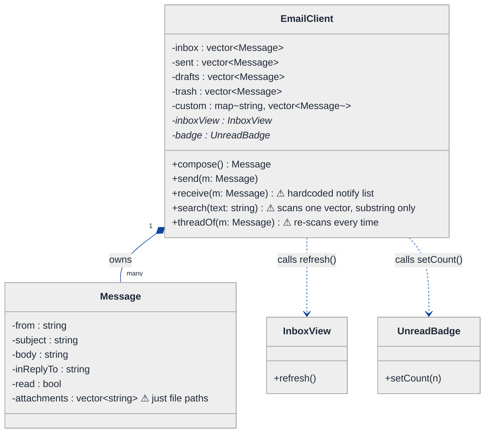
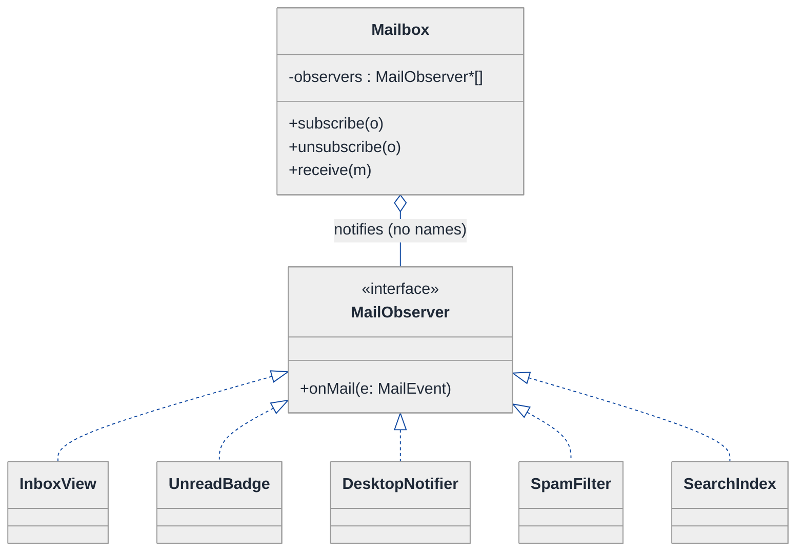
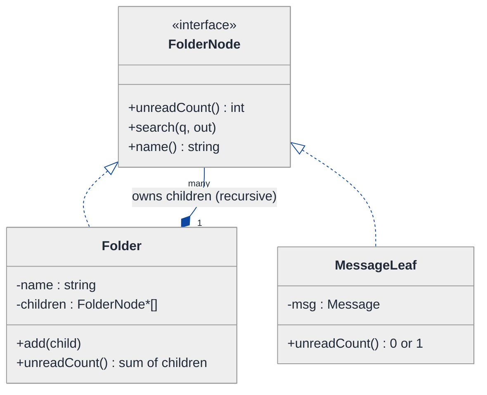
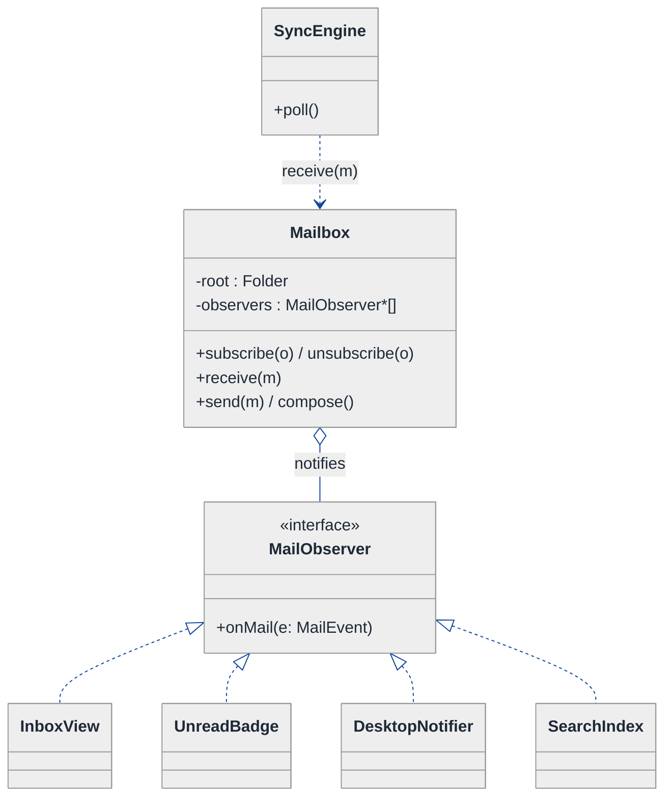
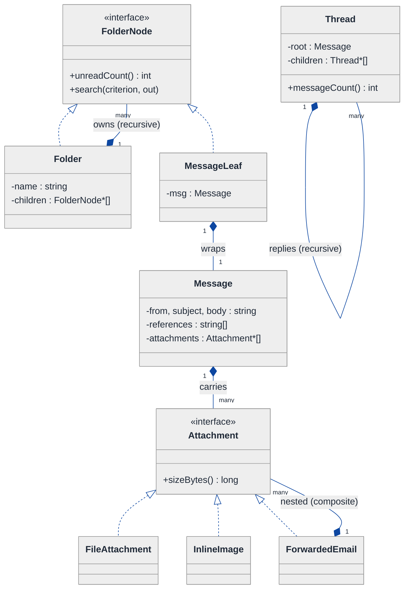
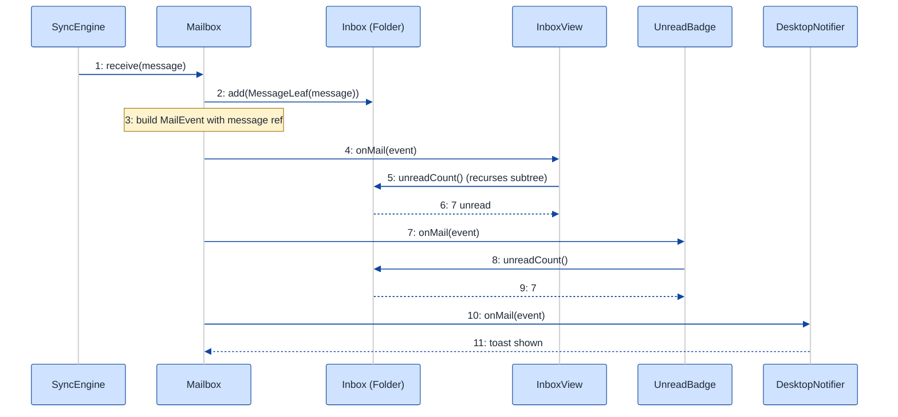

# Email Client — LLD Walkthrough

> **Difficulty:** Medium · **Time:** ~30 min · **Pattern focus:** Observer (UI/sync reactivity) + Composite (folders & threads)
>
> **Problem source(s):** GID `OB2`, bucket `Observer_Pattern`. Representative class-level email-client design question.
>
> **Diagrams:** inline mermaid (renders natively in GitHub / VS Code). No external sources, no PNGs.

---

## How to use this file

Paced for a candidate seeing the email-client problem for the first time. Reading time: ~30 minutes if you sketch each iteration by hand. **The lesson: don't reach for design patterns up front — DERIVE them. Build the naive design first, watch it break under three or four hypothetical changes, and reach for ONE pattern at a time to fix the most painful axis.**

**Map of this file (15 sections):**

1. Problem statement + clarifying questions
2. Plain-English restatement
3. Why this matters
4. Mental model
5. Try it yourself first
6. Entity & verb extraction
7. **Iteration 1: the naive design** — what we'd write first
8. **Where the naive design hurts** — four future requirements, one painful diff each
9. **Pivot 1: Observer for "new mail arrived"** — the most painful axis first
10. **Pivot 2: Composite for folders and threads** — the recursive tree axis
11. **Pivot 3: small Strategy/Composite cleanups** — search filters and attachment payloads
12. Final class diagram
13. Skeleton code (C++)
14. Key flow — sequence diagram
15. Extensibility re-check + anti-patterns + how to think aloud + self-check

---

## 1. Problem statement + clarifying questions

**Prompt (typical phrasing):** "Design an email client at the class level. It should support compose, send, receive, folder management (inbox, sent, drafts, trash, custom), search, attachments, and threading / conversation view."

**Clarifying questions to ask BEFORE drawing anything:**

1. **Online or offline-first?** Does the client talk live to a mail server (IMAP/SMTP), or sync into a local store that the UI reads from? (Determines where "new mail arrived" originates.)
2. **Who needs to react when mail arrives?** Just the inbox list view, or also an unread-count badge, desktop notifications, a spam filter, and a search index? (Smells like one event with many listeners.)
3. **Folders — flat or nested?** Can a custom folder contain sub-folders ("Work/Clients/Acme"), or is it one flat level?
4. **Threading rules?** Group by `Subject` + `In-Reply-To` / `References` headers? Can a thread span multiple folders? Does a thread count as one row or many?
5. **Attachments?** Inline images vs file attachments vs another email forwarded as an attachment (`.eml`)? Size limits?
6. **Search scope?** Single folder vs all folders; fields (from / subject / body / has-attachment); combinable filters (from:X AND unread)?
7. **Multi-account?** One mailbox or several (personal + work) merged into one unified inbox?
8. **Concurrency?** Background sync thread pushing new mail while the user reads — do views update live?

**Assumptions if interviewer dodges:** offline-first local store with a background sync engine; many independent UI/service listeners; nested custom folders; threading by `References` header and threads can span folders; file + inline + forwarded-email attachments; combinable search filters; single account for now (multi-account noted in §15); background sync thread that must update views live.

---

## 2. Plain-English restatement

We're building the in-memory object model behind a desktop mail app. The model must: let the user compose a draft and send it, receive incoming mail from a sync engine, file messages into folders (some built-in, some user-created and nestable), search across them, carry attachments, and group related messages into conversation threads. The hard part is not any single feature — it's that **one event (mail arrived) must fan out to many independent reactors**, and **two of our core structures (folders, threads) are recursive trees** that the rest of the code wants to treat uniformly. The design must add new reactors and new node types **without rewriting the core flow**.

---

## 3. Why this matters

This question probes whether you recognize two of the most common structural shapes in real software. First: a single state change that an open-ended set of subscribers must hear about — the canonical "don't let the producer hard-code its consumers" problem. Second: a part-whole hierarchy (folders within folders, replies within threads) that callers want to walk without special-casing leaves vs. branches. Candidates who hard-wire the inbox to "refresh the UI then update the badge then re-index" pass the demo and fail the design review. The senior bar is in DERIVING Observer and Composite from the pain, not naming them up front.

---

## 4. Mental model

An email client is a **bulletin board with a town crier**. The bulletin board is a tree of pinboards (folders) that can hold sub-pinboards or notes (messages); messages that reply to each other are pinned together as a thread (another little tree). The town crier is the sync engine: when a letter arrives it shouts once, and everyone who cares — the list view, the badge, the notifier, the indexer — reacts on their own. The crier does not know who is listening, and the listeners do not know about each other.

```
Real-world sketch (NOT a UML diagram yet):

        Sync engine (the "crier")
              │  "mail #42 arrived!"
   ┌──────────┼───────────┬───────────────┐
   ▼          ▼           ▼               ▼
[InboxView] [Badge]  [Notifier]   [SearchIndex]   ← independent listeners

   Folder tree (the "pinboards"):
     Inbox
     Sent
     Drafts
     Trash
     Work ─┬─ Clients ── Acme   ← nested custom folders
           └─ Receipts
                 each folder holds Messages + sub-Folders

   A Thread is itself a little tree of Messages (reply-to-reply).
```

The KEY insight: **emission vs. structure**. The "mail arrived" emission wants one-to-many decoupling (Observer). The folder/thread structure wants uniform part-whole recursion (Composite). Those are two different axes, and we'll bake each into the design separately.

---

## 5. Try it yourself first

> **Predict before reading on:**
>
> 1. List 5 nouns you'd promote to a class. List 3 nouns you'd leave as fields.
> 2. **If I told you that next quarter we'll add a desktop notifier, an unread-badge, and a spam filter — all reacting to incoming mail — what would change about how `Mailbox::receive()` is written?**
> 3. A custom folder can contain sub-folders. If "total unread count" must include all descendants, where does that recursion live — in the folder, or in a loop somewhere outside it?

---

## 6. Entity & verb extraction

> **Mini-refresher: noun → class, but not every noun.**
>
> Naive OOD promotes every noun to a class. Senior OOD promotes a noun only if it has both BEHAVIOR and STATE that need to live together. "Subject" stays a field on Message; "Folder" becomes a class because it owns children and answers questions about them.

**Nouns from the prompt:**

| Noun | Decision | Why |
|---|---|---|
| Mailbox / EmailClient | Class (top-level coordinator) | Owns folders, orchestrates send/receive |
| Folder | Class (composite tree node) | Holds messages AND sub-folders; reports counts |
| Message / Email | Class | Headers + body + attachments + lifecycle |
| Thread / Conversation | Class (tree of messages) | Groups reply-to-reply messages |
| Attachment | Class (abstract) + concrete kinds | File / inline / forwarded-email vary |
| SyncEngine | Class (event source) | Pushes "mail arrived" |
| Address (from/to) | Field on Message (`std::string`) | No behavior of its own |
| Subject, body, timestamp | Fields on Message | Data, not behavior |
| Search query / filter | Object (we'll examine in §11) | Combinable criteria |

**Verbs (and the class they live on):**

| Verb | Owner class (naive answer — we'll re-examine) |
|---|---|
| compose() | EmailClient → produces a draft Message |
| send(msg) | EmailClient (and SMTP transport) |
| receive(msg) | Mailbox / EmailClient |
| addFolder() / move(msg, folder) | Mailbox |
| unreadCount() | Folder |
| search(query) | Mailbox / Folder |
| threadOf(msg) | Mailbox |
| addAttachment(a) | Message |

**We have NOT introduced any design patterns yet.** Pure nouns + verbs.

---

## 7. <a id="iter-1"></a>Iteration 1: the naive design

Let's write the simplest thing that could possibly work. No design patterns — just classes with methods, enums, and a couple of `vector`s.



**Reader's tour (read top to bottom; ~60 seconds).**

1. **`EmailClient` is the root god-object.** It holds the four built-in folders as separate `vector<Message>` fields, plus a `map` for custom folders. It also holds raw pointers to the two UI things it currently knows about: `inboxView` and `badge`.

2. **`receive()` is the trouble zone (⚠).** When mail arrives, it pushes to the inbox vector, then *hard-codes* the reactions: `inboxView->refresh(); badge->setCount(...)`. The producer knows its consumers by name.

3. **Folders are not a type.** They're four named fields plus a map. There is no `Folder` class, so a custom folder can't contain a sub-folder — the map is flat.

4. **`search()` (⚠)** scans one vector for a substring. No multi-folder scope, no field selection, no combinable criteria.

5. **`threadOf()` (⚠)** re-scans every message comparing `inReplyTo` each call. Threads aren't modeled — they're recomputed.

6. **Attachments (⚠)** are just `vector<string>` file paths. No notion of inline vs. file vs. a forwarded email.

**What's deliberately missing.** No event/listener mechanism. No `Folder` tree. No `Thread` tree. No attachment hierarchy. No search-criteria objects. The naive design bakes a hardcoded answer for each axis into the methods that use them.

Skeleton code for the naive design (C++):

```cpp
#include <map>
#include <string>
#include <vector>

class InboxView   { public: void refresh() { /* redraw list */ } };
class UnreadBadge { public: void setCount(int n) { /* paint badge */ } };

struct Message {
    std::string from, subject, body, inReplyTo;
    bool read = false;
    std::vector<std::string> attachments;  // just file paths — will hurt
};

class EmailClient {
public:
    Message compose() { return Message{}; }
    void send(const Message& m) { sent_.push_back(m); /* SMTP elided */ }

    void receive(const Message& m) {
        inbox_.push_back(m);
        // hardcoded fan-out — every new reactor edits THIS method:
        inboxView_->refresh();
        badge_->setCount(unreadCount());
    }

    int unreadCount() const {
        int n = 0;
        for (const auto& m : inbox_) if (!m.read) ++n;
        return n;  // only counts inbox; custom folders ignored
    }

    std::vector<Message> search(const std::string& text) const {
        std::vector<Message> hits;            // scans ONE vector, substring only
        for (const auto& m : inbox_)
            if (m.subject.find(text) != std::string::npos) hits.push_back(m);
        return hits;
    }

    std::vector<Message> threadOf(const Message& root) const {
        std::vector<Message> out;             // re-scan every call
        for (const auto& m : inbox_)
            if (m.inReplyTo == root.subject) out.push_back(m);
        return out;
    }
private:
    std::vector<Message> inbox_, sent_, drafts_, trash_;
    std::map<std::string, std::vector<Message>> custom_;  // flat, can't nest
    InboxView*   inboxView_ = nullptr;
    UnreadBadge* badge_ = nullptr;
};
```

**This works.** It has zero design patterns. We can compose, send, receive, and crudely search. So what's wrong with it?

---

## 8. <a id="naive-pain"></a>Where the naive design hurts

The interviewer slides a piece of paper across the desk: "Here are four new requirements coming next quarter. Walk me through what changes."

### Change A: "Add a desktop notifier, a spam filter, and a search index — all react to incoming mail"

In the naive design:
- `EmailClient` gains three new raw-pointer fields (`notifier_`, `spamFilter_`, `searchIndex_`).
- `receive()` grows three new hardcoded lines: `notifier_->notify(m); spamFilter_->scan(m); searchIndex_->add(m);`.
- **Every new reactor edits `receive()` and adds a field.** The producer is welded to its consumers. Open/closed violation, dead center.

### Change B: "Nested custom folders — Work/Clients/Acme, and 'unread' must include all descendants"

In the naive design:
- The flat `map<string, vector<Message>>` can't express nesting at all.
- `unreadCount()` would need a recursive walk, but there's no tree to walk — folders aren't objects.
- **Touches the storage representation, `unreadCount`, `move`, and `search` — a structural rewrite, not a tweak.**

### Change C: "Conversation view — show a message with all its replies, nested, even across folders"

In the naive design:
- `threadOf()` does a flat one-level scan keyed on subject. Replies-to-replies are lost.
- Threads spanning folders can't work — `threadOf` only scans `inbox_`.
- **`threadOf` needs to become a recursive tree build over ALL folders; the current method can't be patched into that.**

### Change D: "Attachments can be inline images, files, or a forwarded .eml email"

In the naive design:
- `attachments` is `vector<string>`. An inline image has a content-id; a file has a MIME type and bytes; a forwarded email is itself a `Message`.
- Rendering code would `switch` on "does this path end in .eml?" — tag-driven branching.
- **Every attachment kind adds a branch wherever attachments are displayed or sized.**

### The pattern of pain

| Change | Files touched | Smell |
|---|---|---|
| A. New reactors | `EmailClient` fields + `receive()` | "Producer hard-codes every consumer; new listener = surgery." |
| B. Nested folders | storage + `unreadCount` + `move` + `search` | "No tree type; recursion has nowhere to live." |
| C. Conversation view | `threadOf` rewrite, all folders | "Flat scan can't express a recursive part-whole structure." |
| D. Attachment kinds | every attachment render/size site | "Tag-driven `switch` on a string; new kind = new branch." |

**Two axes of pain dominate:** one-to-many emission (who hears "mail arrived") and recursive part-whole structure (folders, threads, and arguably attachments).

> **Pivot question:** "What pattern lets a producer notify an open-ended set of listeners WITHOUT naming them? And what pattern lets callers treat a single node and a tree of nodes UNIFORMLY?"
>
> The answers are Observer and Composite. Let's introduce them one at a time, starting with the most painful axis: the hardcoded fan-out in `receive()`.

---

## 9. <a id="pivot-1"></a>Pivot 1: Observer for "new mail arrived"

> **Mini-refresher: Observer pattern.**
>
> A *subject* (the thing being watched) keeps a list of *observers* and exposes `subscribe()` / `unsubscribe()`. When its state changes, it loops the list calling a uniform `notify(event)` on each. The subject does NOT know the concrete observer types — only the interface. Listeners come and go without the subject ever changing.
>
> Quick example: a spreadsheet `Cell` is a subject; charts and formula cells subscribe. Edit the cell once, every dependent redraws itself.

**Why Observer fits "mail arrived."** Change A is the textbook trigger: one state change (a message lands in the inbox) must fan out to an open-ended, growing set of reactors that don't know about each other. The producer should emit one event; the consumers should opt in.

> **Mini-refresher: push vs pull, and `weak_ptr` for back-references.**
>
> *Push* hands the observer the changed data in `notify(const MailEvent&)`. *Pull* hands only "something changed" and the observer queries the subject back. Push is simpler and usually right when the event payload is small (here: the new message). For lifetime safety, if an observer also holds a pointer BACK to the subject, that back-pointer is a `std::weak_ptr` so neither keeps the other alive forever.

**The refactor (just the affected slice):**

```cpp
struct MailEvent { const Message* message; /* + folder, kind, etc. */ };

class MailObserver {                       // the observer interface
public:
    virtual ~MailObserver() = default;
    virtual void onMail(const MailEvent& e) = 0;   // push: event handed in
};

class InboxView : public MailObserver {
public:
    void onMail(const MailEvent&) override { /* redraw list */ }
};
class UnreadBadge : public MailObserver {
public:
    void onMail(const MailEvent&) override { /* recompute + paint */ }
};
// DesktopNotifier, SpamFilter, SearchIndex : public MailObserver — elided

class Mailbox {                            // the subject
public:
    void subscribe(std::shared_ptr<MailObserver> o)   { observers_.push_back(std::move(o)); }
    void unsubscribe(const std::shared_ptr<MailObserver>& o) { /* erase-remove, elided */ }

    void receive(Message m) {
        store(std::move(m));               // file it (Pivot 2 will route into the folder tree)
        MailEvent e{ &lastStored() };
        for (auto& o : observers_) o->onMail(e);   // fan-out — NO names hardcoded
    }
private:
    std::vector<std::shared_ptr<MailObserver>> observers_;
    // store(), lastStored() elided
};
```

**What changed — visualized.** Just the notification slice:



**Tour of the after-state.**

1. **`Mailbox` (the subject) holds `observers : MailObserver*[]`.** Open diamond (`◇`) — aggregation. The mailbox notifies them but doesn't own their lifecycle (the UI does).
2. **The `<<interface>>` is the whole decoupling.** `MailObserver` declares one method, `onMail(MailEvent)`. The mailbox only ever sees this type.
3. **Five concrete observers hang off it** — and the mailbox's code didn't grow by one line to add the fourth and fifth. Change A is now: write a class, call `subscribe()`. Done.
4. **`receive()` shrank to "store + loop-notify."** The list of reactions is data (the `observers_` vector), not code.

**Change A from §8 now lands cleanly.** Each new reactor is one new `MailObserver` subclass plus one `subscribe()` call at wiring time. No edit to `receive()`.

**Pattern-discrimination cheatsheet — Observer vs Mediator.**
- *Observer:* one subject broadcasts to many listeners; listeners don't talk to each other; flow is one-directional (subject → observers).
- *Mediator:* a hub coordinates many-to-many interactions BETWEEN colleagues (e.g., a chat room routing between users); colleagues talk through the hub in both directions.
- *Rule of thumb:* "one thing changed, many react" → Observer. "many things must coordinate with each other" → Mediator.

We chose Observer because the relationship is genuinely one-way fan-out — the badge and the notifier never need to coordinate with each other.

---

## 10. <a id="pivot-2"></a>Pivot 2: Composite for folders and threads

Changes B and C are still painful. Observer doesn't help — the variability here isn't *who reacts*, it's *the shape of the data*. Folders nest inside folders; replies nest inside replies. Both are part-whole trees the rest of the code wants to walk uniformly.

> **Mini-refresher: Composite pattern.**
>
> Define one *component* interface. A *leaf* implements it directly; a *composite* implements it by holding children (also components) and delegating to them recursively. Callers treat a single node and an entire subtree IDENTICALLY through the component interface — no "is this a leaf or a branch?" checks.
>
> Quick example: a filesystem `Node` with `size()`. A `File` returns its own bytes; a `Directory` returns the sum of `child.size()` over its children. `dir.size()` recurses for free.

**Why Composite fits folders.** A folder must answer `unreadCount()` and `search()` over *everything beneath it*, whether that's messages or sub-folders. Model `Folder` as a composite holding a list of children that are themselves folder nodes, and the recursion lives inside the node — Change B's "unread includes all descendants" becomes a one-line sum.

**The refactor (just the folder/thread slice):**

```cpp
class FolderNode {                         // the component
public:
    virtual ~FolderNode() = default;
    virtual int  unreadCount() const = 0;
    virtual void search(const std::string& q, std::vector<const Message*>& out) const = 0;
    virtual const std::string& name() const = 0;
};

class MessageLeaf : public FolderNode {    // a leaf: a single message
public:
    explicit MessageLeaf(Message m) : msg_(std::move(m)) {}
    int  unreadCount() const override { return msg_.read ? 0 : 1; }
    void search(const std::string& q, std::vector<const Message*>& out) const override {
        if (msg_.subject.find(q) != std::string::npos) out.push_back(&msg_);
    }
    const std::string& name() const override { return msg_.subject; }
private:
    Message msg_;
};

class Folder : public FolderNode {         // the composite: holds children
public:
    explicit Folder(std::string name) : name_(std::move(name)) {}
    void add(std::unique_ptr<FolderNode> child) { children_.push_back(std::move(child)); }

    int unreadCount() const override {     // recursion lives HERE
        int n = 0;
        for (const auto& c : children_) n += c->unreadCount();
        return n;
    }
    void search(const std::string& q, std::vector<const Message*>& out) const override {
        for (const auto& c : children_) c->search(q, out);   // depth-first, uniform
    }
    const std::string& name() const override { return name_; }
private:
    std::string name_;
    std::vector<std::unique_ptr<FolderNode>> children_;   // owns its subtree
};
```

`Thread` is the SAME shape on a different tree: a `ThreadNode` component, a root `Message`, and child `ThreadNode`s built from the `References` / `inReplyTo` headers. `messageCount()` and `flatten()` recurse exactly like `unreadCount()` does here. (Thread code elided — it mirrors `Folder`.)

**What changed — visualized.** The folder tree slice:



**Tour of the after-state.**

1. **One component interface, `FolderNode`.** Three operations every node answers: `unreadCount`, `search`, `name`.
2. **`MessageLeaf` is the leaf.** It IS-A `FolderNode` but has no children. `unreadCount()` returns 0 or 1.
3. **`Folder` is the composite.** Note the self-referential composition arrow: `Folder *-- FolderNode`, and `Folder` itself is a `FolderNode` — so a folder can hold folders. That single edge is what makes `Work/Clients/Acme` legal.
4. **Recursion lives in the node.** `Folder::unreadCount()` sums its children; each child either returns its own count (leaf) or recurses (sub-folder). The caller writes `inbox.unreadCount()` and never asks "is this a leaf?".

**Changes B and C from §8 now land cleanly.** Nested folders → just `add` a `Folder` into a `Folder`. Descendant unread count → the recursive `unreadCount` already does it. Conversation view → the same composite shape on `Thread`, built across folders because threading keys on headers, not on storage location.

**Pattern-discrimination cheatsheet — Composite vs Decorator.**
- *Composite:* a node holds MANY children of the component type; operations aggregate over the subtree (sum, search-all). Tree shape.
- *Decorator:* a wrapper holds exactly ONE wrapped component and ADDS behavior around it (e.g., an encrypted-attachment wrapper). Chain shape.
- *Rule of thumb:* "many children, aggregate down the tree" → Composite. "one wrapped thing, add a responsibility" → Decorator.

We chose Composite because folders and threads are genuinely one-to-many trees, not single-wrap chains.

---

## 11. <a id="pivot-3"></a>Pivot 3: small Strategy / Composite cleanups (search + attachments)

Changes A, B, C are solved. Change D (attachment kinds) and the broader search story remain.

**The remaining axes:**

| Axis | Pattern | One sentence why |
|---|---|---|
| Attachment kinds | (small) Composite + polymorphism | A file, an inline image, and a forwarded `.eml` all answer `sizeBytes()` / `render()`; a forwarded email is itself a tree of attachments |
| Search criteria | Strategy (composable) | `from:X`, `unread`, `hasAttachment` are predicates the caller combines with AND/OR |

```cpp
// ── Attachments: one interface, three leaves, one composite ─────────
class Attachment {
public:
    virtual ~Attachment() = default;
    virtual long sizeBytes() const = 0;
    virtual std::string mimeType() const = 0;
};
class FileAttachment   : public Attachment { /* bytes on disk */ };
class InlineImage      : public Attachment { /* content-id + bytes */ };
class ForwardedEmail   : public Attachment {        // composite: an email IS an attachment
public:
    long sizeBytes() const override {               // sum its own attachments
        long n = 0; for (auto& a : inner_) n += a->sizeBytes(); return n;
    }
    std::string mimeType() const override { return "message/rfc822"; }
private:
    std::vector<std::unique_ptr<Attachment>> inner_;
};

// ── Search: a composable predicate (Strategy) ───────────────────────
class SearchCriterion {
public:
    virtual ~SearchCriterion() = default;
    virtual bool matches(const Message& m) const = 0;
};
class FromIs        : public SearchCriterion { /* m.from == who_ */ };
class IsUnread      : public SearchCriterion { /* !m.read */ };
class AndCriterion  : public SearchCriterion {     // composite of predicates
public:
    explicit AndCriterion(std::vector<std::unique_ptr<SearchCriterion>> cs)
        : cs_(std::move(cs)) {}
    bool matches(const Message& m) const override {
        for (auto& c : cs_) if (!c->matches(m)) return false;
        return true;
    }
private:
    std::vector<std::unique_ptr<SearchCriterion>> cs_;
};
```

> **Mini-refresher: open/closed principle (the "O" in SOLID).**
>
> Software entities should be open for EXTENSION but closed for MODIFICATION. You add new behavior by adding new code (a new `SearchCriterion`, a new `Attachment` leaf), not by editing existing, tested code. Observer, Composite, and Strategy are all machinery for honoring open/closed on a particular axis of change.

**The lesson.** Once you recognize an axis — "many things answer one operation" → Composite/polymorphism; "a predicate the caller composes" → Strategy — subsequent design is cheap. `Folder::search(criterion)` now takes a `SearchCriterion&` and asks each `MessageLeaf` `criterion.matches(msg)`. Change D and combinable search both become "add one class."

---

## 12. <a id="fig-class-diagram"></a>Final class diagram

Showing the entire design in one diagram becomes a wall of boxes. Instead, two focused sub-views: the event side (Observer) and the structure side (Composite). The structural insight at the end ties them together.

### 12.1 The event side — Mailbox as subject, the reactors as observers



**Tour of 12.1.** The `SyncEngine` is the upstream trigger — its background poll calls `Mailbox::receive(m)`. The mailbox is the SUBJECT: it stores the message into its folder tree and loops its `observers` calling `onMail`. The four reactors are interchangeable through the `MailObserver` interface; adding a fifth never touches `Mailbox`. This is the entire answer to Change A.

### 12.2 The structure side — folders, threads, attachments as composites



**Tour of 12.2.**

1. **Three independent trees, one shape each.** `Folder` (recurses on `FolderNode`), `Thread` (recurses on `Thread`), and `ForwardedEmail` (recurses on `Attachment`). Each has the tell-tale self-referential composition edge.
2. **`MessageLeaf` bridges the folder tree to `Message`.** It wraps exactly one `Message` so a message can sit in the folder tree without `Message` itself having to know about folders.
3. **`Message` carries `Attachment[]`,** and `ForwardedEmail` is both an `Attachment` AND a holder of attachments — that's why forwarding an email "just works."
4. **`search` now takes a criterion,** so the same recursion serves every query (Pivot 3).

### Structural insight (ties 12.1 + 12.2 together)

| Concern | Pattern used | Why |
|---|---|---|
| **Emission** (mail arrived) | Observer, on Mailbox | Open-ended reactors; producer must not name consumers |
| **Folders** (nested, descendant counts) | Composite | Recursive part-whole; uniform walk |
| **Threads** (conversation view) | Composite | Same recursive shape, keyed on headers |
| **Attachments** (file/inline/forwarded) | Polymorphism + Composite | A forwarded email is itself an attachment tree |
| **Search** (combinable filters) | Strategy (composable criteria) | Caller picks/combines predicates |

The big lesson: **Observer decouples WHO reacts; Composite decouples HOW the data nests.** Emission and structure are orthogonal axes — solving each with the right pattern is what makes the design extensible. Inheritance appears only inside these pattern families (observer subtypes, node subtypes); everything else is composition.

---

## 13. Skeleton code (C++)

> Show the SHAPES, not the full impl. ~120 lines.

```cpp
#include <memory>
#include <string>
#include <vector>

// ── Domain data ─────────────────────────────────────────────────────
class Attachment;  // forward

struct Message {
    std::string from, subject, body;
    std::vector<std::string> references;           // threading headers
    bool read = false;
    std::vector<std::unique_ptr<Attachment>> attachments;
};

// ── Observer side ───────────────────────────────────────────────────
struct MailEvent { const Message* message; };

class MailObserver {
public:
    virtual ~MailObserver() = default;
    virtual void onMail(const MailEvent& e) = 0;   // push model
};

class InboxView : public MailObserver {
public:
    void onMail(const MailEvent&) override { /* redraw list */ }
};
class UnreadBadge : public MailObserver {
public:
    void onMail(const MailEvent&) override { /* recompute + paint */ }
};
// DesktopNotifier, SpamFilter, SearchIndex : public MailObserver — elided

// ── Composite side: folders ─────────────────────────────────────────
class SearchCriterion;  // forward (Strategy, §11)

class FolderNode {
public:
    virtual ~FolderNode() = default;
    virtual int  unreadCount() const = 0;
    virtual void search(const SearchCriterion& c,
                        std::vector<const Message*>& out) const = 0;
};

class MessageLeaf : public FolderNode {
public:
    explicit MessageLeaf(Message m) : msg_(std::move(m)) {}
    int  unreadCount() const override { return msg_.read ? 0 : 1; }
    void search(const SearchCriterion& c,
                std::vector<const Message*>& out) const override;     // matches → push
    const Message& message() const { return msg_; }
private:
    Message msg_;
};

class Folder : public FolderNode {
public:
    explicit Folder(std::string name) : name_(std::move(name)) {}
    void add(std::unique_ptr<FolderNode> child) { children_.push_back(std::move(child)); }
    int  unreadCount() const override {
        int n = 0; for (auto& c : children_) n += c->unreadCount(); return n;
    }
    void search(const SearchCriterion& c,
                std::vector<const Message*>& out) const override {
        for (auto& ch : children_) ch->search(c, out);                // depth-first
    }
private:
    std::string name_;
    std::vector<std::unique_ptr<FolderNode>> children_;               // owns subtree
};

// ── Composite side: threads (same shape, elided body) ───────────────
class Thread {
public:
    int messageCount() const {
        int n = 1; for (auto& c : children_) n += c->messageCount(); return n;
    }
private:
    Message root_;
    std::vector<std::unique_ptr<Thread>> children_;                   // reply tree
};

// ── The subject ─────────────────────────────────────────────────────
class Mailbox {
public:
    explicit Mailbox() : root_(std::make_unique<Folder>("root")) {}

    void subscribe(std::shared_ptr<MailObserver> o)   { observers_.push_back(std::move(o)); }
    void unsubscribe(const std::shared_ptr<MailObserver>& o);          // erase-remove, elided

    Message compose() { return Message{}; }
    void    send(Message m);                                           // SMTP transport, elided

    void receive(Message m) {
        const Message* stored = store(std::move(m));                   // route into folder tree
        MailEvent e{ stored };
        for (auto& o : observers_) o->onMail(e);                       // Observer fan-out
    }

    int unreadCount() const { return root_->unreadCount(); }           // Composite recursion
private:
    const Message* store(Message m);                                   // elided
    std::unique_ptr<Folder>                    root_;
    std::vector<std::shared_ptr<MailObserver>> observers_;
};
```

---

## 14. <a id="fig-sequence"></a>Key flow — sequence diagram

The flow that exercises both patterns: a background sync delivers a new message; the mailbox stores it into the folder tree and fans out to every observer.



**Tour of the flow. Read slowly — both patterns cooperate here.**

1. **SyncEngine calls `Mailbox::receive(message)`.** The background poll is the only producer; it neither knows nor cares who will react.
2. **Mailbox stores the message into the folder tree** by wrapping it in a `MessageLeaf` and `add`-ing it to the Inbox folder. **This is the Composite side** — the message becomes a node in a recursive structure.
3. **Mailbox builds one `MailEvent`** and then loops its observer list. **This is the Observer side** — note steps 4, 7, 10 are the SAME call (`onMail(event)`) to three different listeners. The mailbox's code does not branch per listener type.
4. **InboxView and UnreadBadge call `unreadCount()`** on the Inbox folder (steps 5, 8) — and that single call RECURSES the entire subtree, summing leaves and sub-folders. The caller never asks "leaf or branch?".
5. **DesktopNotifier just shows a toast** (step 10) — a listener that doesn't even read the tree. It coexists with the others because Observer makes them independent.

### The coupling that's NOT shown — and why it matters

You don't see `Mailbox` holding a `InboxView*` or `UnreadBadge*` field anywhere in this flow. The mailbox only ever sees the `MailObserver` interface. **Adding a spam filter or a sound effect is one new subscriber — the sequence above gains a step but `receive()`'s code does not change.** That invisibility of the concrete reactors is the whole point of Observer; the uniform `unreadCount()` recursion is the whole point of Composite.

---

## 15. Extensibility re-check + anti-patterns + how to think aloud + self-check

### Extensibility re-check

Revisit the four changes from [§8](#naive-pain). For each, name the SINGLE class that changes.

| Change | Naive design impact | Final design impact |
|---|---|---|
| A. New reactors | new field + line in `receive()` each | New `MailObserver` subclass + one `subscribe()`. Done. |
| B. Nested folders | storage + `unreadCount` + `move` + `search` | `Folder` is already a `FolderNode`; just `add` a sub-folder. Done. |
| C. Conversation view | rewrite `threadOf` | `Thread` is a composite; build from `references`. Done. |
| D. Attachment kinds | branch in every render/size site | New `Attachment` subclass. Done. |

Every change is exactly ONE new class in the final design. That's the open/closed principle in practice.

If a future requirement makes you change `Mailbox`, `Folder`, AND `Message` together — go back to §6 and re-identify variability points; you missed an axis.

### Common confusion + traps

1. **"Push or pull in `onMail`?"** Push the new message (small payload, every observer needs it). Pull when the event is "something big changed" and observers need different slices — then hand them only "changed" and let them query back.
2. **"Why `shared_ptr` for observers but `unique_ptr` for folder children?"** The folder OWNS its subtree exclusively → `unique_ptr`. Observers are owned by the UI and merely referenced by the mailbox; shared/weak ownership avoids dangling. (Use `weak_ptr` in the observer list if the mailbox must not keep dead views alive.)
3. **"Should `Message` know about `Folder`?"** No. `MessageLeaf` adapts a message into the folder tree so `Message` stays ignorant of where it lives. A message can be threaded across folders precisely because it doesn't depend on one.
4. **"Why not one enum `FolderType { INBOX, SENT, CUSTOM }`?"** Works until folders nest. The recursion has nowhere to live in an enum; Composite puts it on the node.
5. **"Observer ordering / re-entrancy?"** If one observer mutates the mailbox during `onMail` (e.g., spam filter moves the message), you can invalidate the loop. Snapshot the observer list before iterating, and document ordering as undefined unless you add priorities.

### Anti-patterns

- **"Producer hard-codes consumers"** — `receive()` calling `view->refresh(); badge->update()`. Use Observer; let listeners subscribe.
- **"Leaf vs branch `if`-ladders"** — `if (node.isFolder()) { for children ... } else { ... }` scattered everywhere. That's the smell Composite removes.
- **"God Mailbox"** — one class owning storage, transport, threading, search, and UI updates. Split the reactors out as observers; split structure into composites.
- **"Stringly-typed attachments"** — `vector<string>` of paths and a `switch` on the extension. Use an `Attachment` hierarchy.
- **"Polling observers"** — observers that re-poll the mailbox on a timer instead of subscribing. Defeats the point; you've reinvented pull-without-an-event.
- **"Synchronous heavy work in `onMail`"** — a `SearchIndex` doing a blocking re-index inside the notify loop stalls the sync thread. Hand off to a queue.

### How to think aloud

> "OK, email client. Let me clarify scope. [Asks 4-6 questions from §1.] Got it.
>
> Nouns: Mailbox, Folder, Message, Thread, Attachment, SyncEngine. Folder and Thread look recursive. Message has headers, body, attachments.
>
> I'll start NAIVE — no patterns. Mailbox holds four folder vectors plus a custom map; `receive()` pushes to inbox then calls refresh on the view and update on the badge directly; search scans one vector; threadOf does a flat scan; attachments are file-path strings.
>
> Now stress-test. Change A: add notifier + spam filter + search index reacting to mail — every one edits `receive()` and adds a field. Change B: nested folders with descendant unread — the flat map can't express it and there's no tree to recurse. Change C: conversation view across folders — flat threadOf can't. Change D: inline/file/forwarded attachments — tag-driven switch.
>
> Two axes: one-to-many emission, and recursive part-whole structure. Observer and Composite.
>
> Pivot 1: Observer. Mailbox becomes the subject with subscribe/notify; reactors implement `MailObserver::onMail`. `receive()` shrinks to store + loop-notify. New reactor = new subclass, no edit.
>
> Pivot 2: Composite. `FolderNode` interface; `MessageLeaf` and `Folder`; folder holds children of FolderNode, so it nests. `unreadCount` and `search` recurse inside the node. Thread is the same shape on the reply tree.
>
> Pivot 3: attachments become an `Attachment` hierarchy where ForwardedEmail is itself a composite; search becomes composable `SearchCriterion` predicates.
>
> Final: Mailbox is a subject aggregating observers; it owns a Folder composite tree; Message carries an Attachment tree; Thread mirrors Folder. All four future changes land as ONE new class each. That's open/closed."

### Self-check

> **Self-check — the question to ask next time.**
>
> When you see "design a [thing] where one event drives many reactions, and the data nests," before reaching for fields-and-loops, ask:
>
> > **"Is this an EMISSION that many independent things must hear (Observer), or a STRUCTURE that nests part-within-whole and callers walk uniformly (Composite)?"**
>
> Emission → Observer (decouple who reacts). Structure → Composite (decouple how it nests). If both — like an email client — use both; the two are orthogonal axes and the class diagram falls out for free.

---

## Cross-references

- **Parent topic manifest:** [`./EXTRACTED_QUESTIONS.md`](./EXTRACTED_QUESTIONS.md)
- **Vertical overview:** [`../../LEARNING.md`](../../LEARNING.md)
- **Template:** [`../../TEMPLATE-v2.md`](../../TEMPLATE-v2.md)
- **Canonical exemplar:** [`../Object_Oriented_Design/Parking_Lot.md`](../Object_Oriented_Design/Parking_Lot.md) — the gold-standard LLD walkthrough (Strategy + State)
- **Related LLD walkthroughs:**
  - State Pattern deep-dive (in `../State_Pattern/`)
  - Strategy Pattern deep-dive (in `../Strategy_Pattern/`)
  - Composite Pattern deep-dive (in `../Composite_Pattern/`)
- **Further reading:** <a href="https://refactoring.guru/design-patterns/observer" target="_blank" rel="noopener noreferrer">Observer pattern (refactoring.guru)</a> · <a href="https://refactoring.guru/design-patterns/composite" target="_blank" rel="noopener noreferrer">Composite pattern (refactoring.guru)</a>
