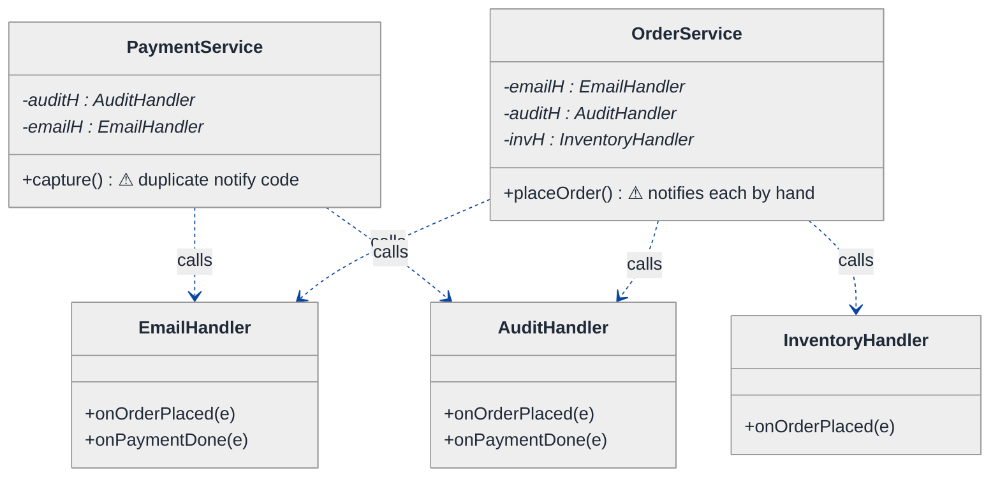
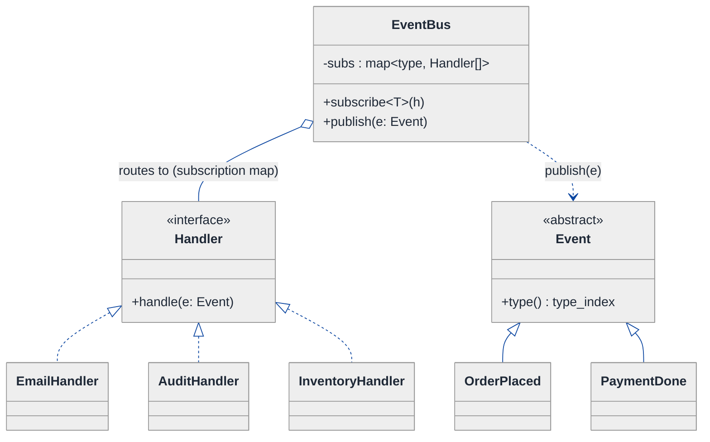
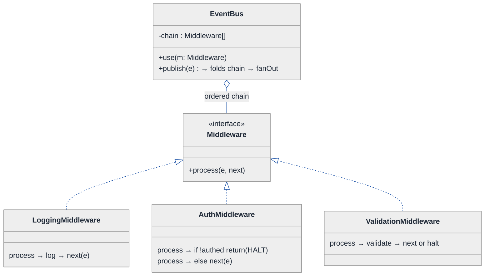
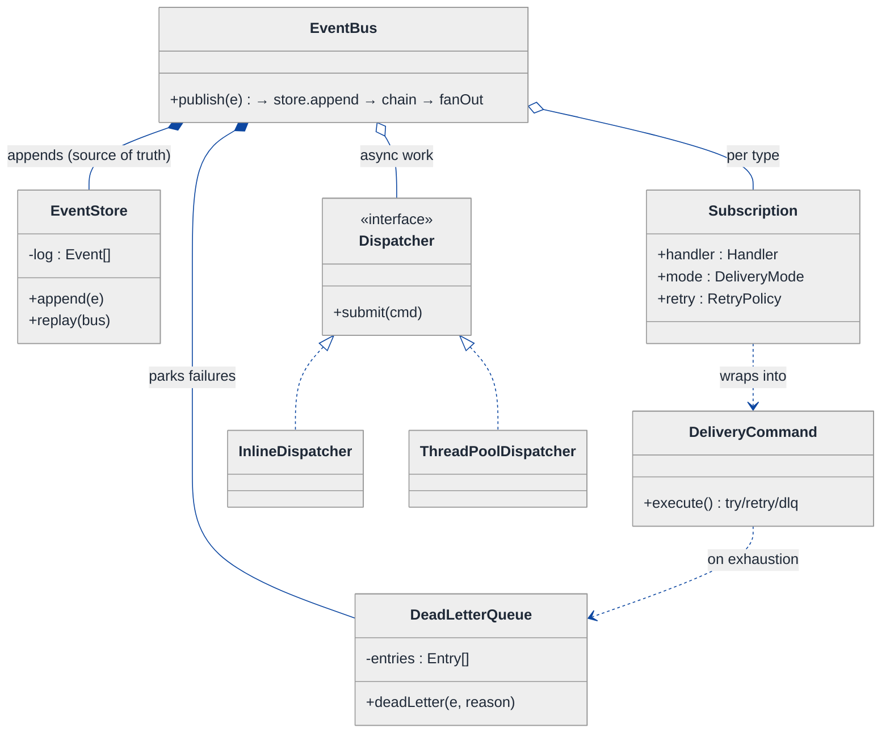
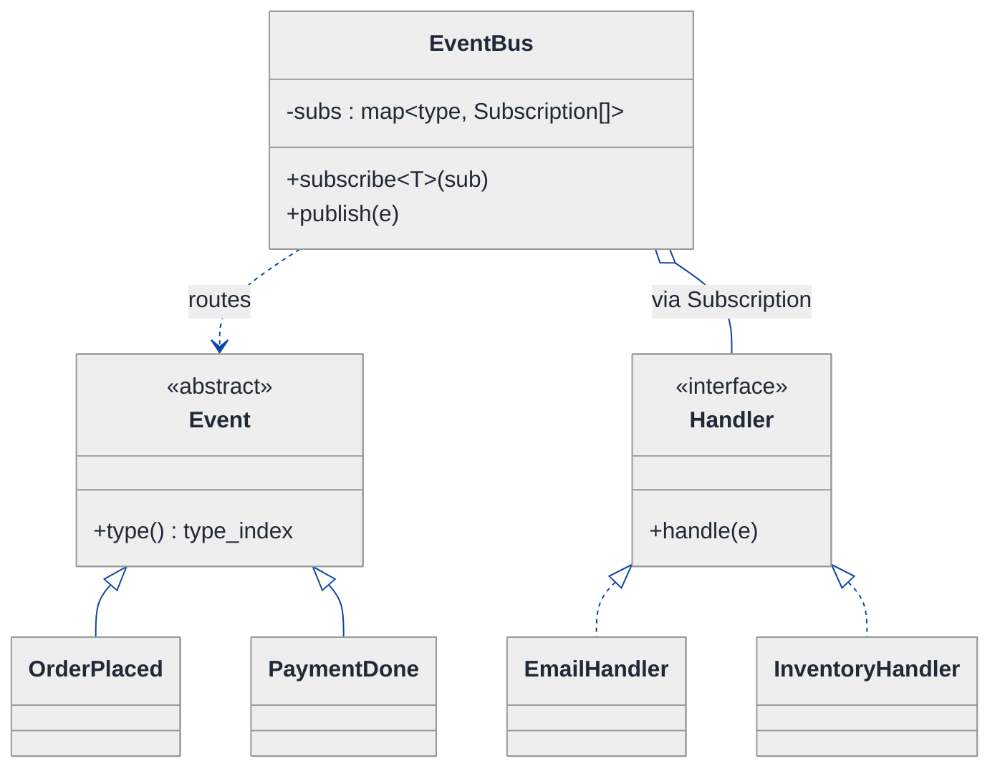
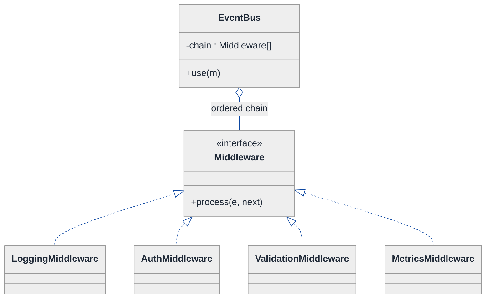
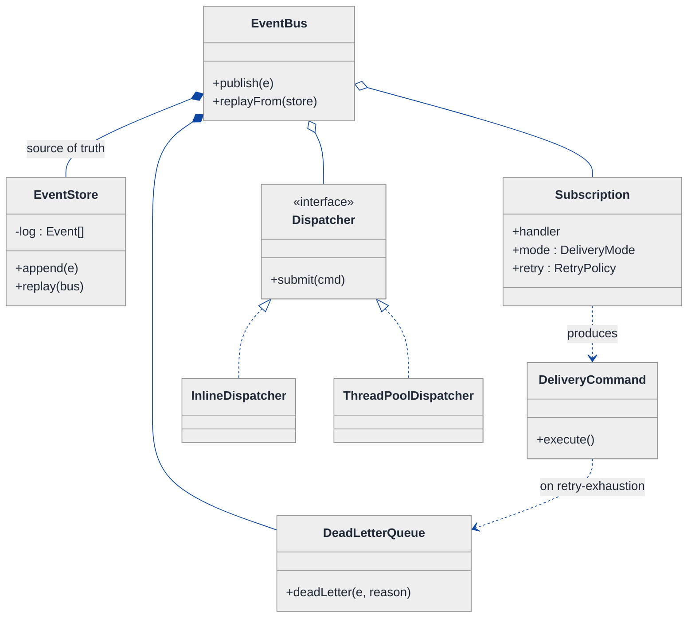
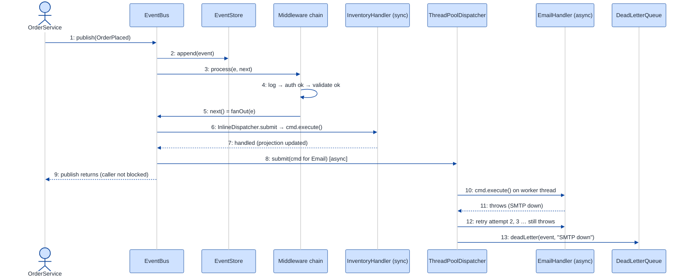
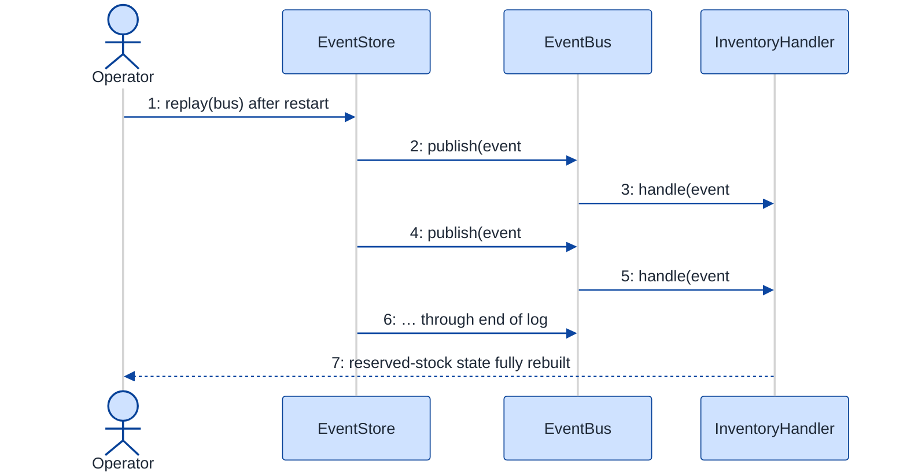

# Event-Driven Architecture Framework — LLD Walkthrough

> **Difficulty:** Hard · **Time:** ~45 min · **Pattern focus:** Mediator (event bus) + Chain of Responsibility (middleware) + Event Sourcing (the log) — with Observer, Command, and Strategy along for the ride
>
> **Problem source(s):** GID OB12, bucket `Observer_Pattern`. Representative of "design a pub-sub / event-bus framework" LLD rows in [`./EXTRACTED_QUESTIONS.md`](./EXTRACTED_QUESTIONS.md).
>
> **Diagrams:** inline mermaid (renders natively in GitHub / VS Code). Canonical theme block per [`../../../CONTINUATION.md`](../../../CONTINUATION.md) §3.

---

## How to use this file

Paced for a candidate who has seen the Observer pattern once and is now asked to build the grown-up version of it: a reusable **framework**, not a one-off notifier. Reading time: ~45 minutes if you sketch each iteration by hand.

**The lesson:** the interviewer says "Observer," but a framework with a *bus*, *middleware*, a *dead-letter queue*, and *event sourcing* is no longer plain Observer. Observer is the seed; Mediator is what it grows into when many publishers talk to many subscribers; Chain of Responsibility is what the middleware is; Event Sourcing is what makes the whole thing replayable. We will DERIVE each of those, one painful axis at a time — never assert them.

**Map of this file (15 sections):**

1. Problem statement + clarifying questions
2. Plain-English restatement
3. Why this matters
4. Mental model
5. Try it yourself first
6. Entity & verb extraction
7. **Iteration 1: the naive design** — direct Observer, publishers holding subscriber lists
8. **Where the naive design hurts** — five future requirements, one painful diff each
9. **Pivot 1: Mediator for the event bus** — break the publisher↔subscriber web
10. **Pivot 2: Chain of Responsibility for middleware** — cross-cutting concerns without surgery
11. **Pivot 3: Event Sourcing + Command for the log, DLQ, and sync/async dispatch**
12. Final UML class diagram (3 sub-views)
13. Skeleton code (C++17)
14. Key flow — sequence diagram
15. Extensibility re-check + anti-patterns + how to think aloud + self-check

---

## 1. Problem statement + clarifying questions

**Prompt (typical phrasing):** "Design an event-driven architecture framework with an event bus, event sourcing, handlers, a middleware chain, and a dead-letter queue. Support synchronous and asynchronous event processing."

**Clarifying questions to ask BEFORE drawing anything:**

1. **Topic model?** Do handlers subscribe by event *type* (one C++ type = one channel), by a string topic, or by a predicate filter? This decides the bus's routing key.
2. **Sync vs async — who chooses?** Is it a per-event property, a per-subscription property, or a bus-wide mode? (It matters a lot: per-subscription is the flexible answer.)
3. **Ordering & delivery guarantees?** In-order per topic? At-least-once, at-most-once, or exactly-once? Does a slow async handler block the publisher?
4. **What is event sourcing FOR here?** Audit log only, or is it the source of truth that we *replay* to rebuild handler state after a crash?
5. **Middleware scope?** Is the chain global (every event), per-topic, or per-handler? Can middleware *halt* propagation (like an auth gate) or only observe (like logging)?
6. **Dead-letter queue trigger?** A handler throwing once, throwing after N retries, or a poison-message detector? Who drains the DLQ?
7. **Failure isolation?** If handler B throws, do handlers C and D still run? (Almost always yes — one bad subscriber must not sink the others.)
8. **Threading model for async?** A single dispatcher thread, a thread pool, or one queue per topic?

**Assumptions if the interviewer dodges:** subscribe by event *type*; sync-vs-async is a **per-subscription** flag; in-order per topic, at-least-once delivery; event store is the **source of truth** and supports replay; middleware is a **global ordered chain that can halt propagation**; DLQ receives an event after a handler exhausts its retries; one handler throwing never blocks the others; async uses a bounded thread pool with one logical queue.

---

## 2. Plain-English restatement

We are building the plumbing that lets one part of a system announce "something happened" and lets any number of other parts react — without the announcer knowing who is listening. On top of that wiring we need four grown-up features: a **central bus** so publishers and subscribers never reference each other directly; a **middleware chain** that every event passes through (logging, auth, validation, metrics) before reaching handlers; an **append-only event log** that is the system's source of truth and can be replayed to rebuild state; and a **dead-letter queue** that catches events whose handlers keep failing. The framework must let a subscriber pick synchronous (run inline, caller waits) or asynchronous (queued, caller returns immediately) delivery, and adding a new event type, a new middleware, or a new handler must NOT require editing the bus.

---

## 3. Why this matters

This is the senior-bar version of the Observer question. Junior candidates wire a publisher straight to a list of observers and call it a day; that design collapses the moment you have many publishers, cross-cutting concerns, and durability requirements. The skill being probed is recognizing that "everyone-talks-to-everyone" is an **N×M coupling problem** (Mediator), that "every event needs the same pre-processing steps in order, some of which can stop the flow" is a **pipeline-with-veto problem** (Chain of Responsibility), and that "rebuild state after a crash" is a **log-as-truth problem** (Event Sourcing). It reappears in message brokers (Kafka, RabbitMQ), GUI frameworks, Redux/Flux front-ends, and microservice choreography. Deriving these correctly signals you can design *infrastructure*, not just *features*.

---

## 4. Mental model

An event-driven framework is a **post office**, not a phone network. In a phone network, every caller dials every recipient directly — N callers and M recipients means up to N×M wires. In a post office, everyone drops mail at one counter; the post office routes it. Senders never learn recipients' addresses.

```
Real-world sketch (NOT a UML diagram yet):

   Publishers                  THE BUS (post office)                Subscribers
   ──────────                  ─────────────────────                ───────────
   OrderSvc  ──drop──►  ┌───────────────────────────────┐  ──►  EmailHandler
   PaySvc    ──drop──►  │  middleware chain (sorting room) │  ──►  AuditHandler
   InvSvc    ──drop──►  │   [Log]→[Auth]→[Validate]→...    │  ──►  InventoryHandler
                        │                                  │  ──►  (async) ShipHandler
                        │  append to EVENT LOG (the ledger)│
                        │  on repeated failure → DEAD-LETTER│
                        └───────────────────────────────┘
```

The KEY insight from this picture: the bus is the **only** thing publishers and subscribers both know about. The sorting room (middleware) sees every letter and may refuse to forward one. The ledger (event log) records every letter that came through, so if the building burns down you can re-deliver from the ledger. Letters that bounce repeatedly go in a dead-letter bin for a human. Routing vs. processing vs. recording vs. failure-handling are four separable concerns — that separation is what we will bake into the design.

---

## 5. Try it yourself first

> **Predict before reading on:**
>
> 1. List 5 nouns you'd promote to a class. Which 2 nouns are tempting but should stay as data/fields?
> 2. **If the framework must support both "logging on every event" and "block events from unauthenticated publishers," where does that logic live? Does it belong inside each handler? Inside the bus? Somewhere else?**
> 3. If a handler crashes halfway and you restart the process, how would you get the handlers back to a correct state? What single design decision makes that possible — or impossible?

---

## 6. Entity & verb extraction

> **Mini-refresher: noun → class, but not every noun.**
>
> Naive OOD promotes every noun to a class. Senior OOD promotes a noun only if it has both BEHAVIOR and STATE that need to live together. "Topic name" usually stays a string field; "EventBus" becomes a class because it has routing behavior plus subscription state.

**Nouns from the prompt:**

| Noun | Decision | Why |
|---|---|---|
| EventBus | Class (central coordinator) | Owns subscriptions, routes events — the Mediator |
| Event | Class (abstract) + concrete subtypes | Carries payload + metadata; subtypes encode type |
| Handler (subscriber) | Interface + concrete impls | Behavior: react to an event |
| Middleware | Interface + concrete impls | Behavior: pre-process / veto an event |
| EventStore | Class | Append-only log; behavior: append + replay |
| DeadLetterQueue | Class | Holds failed events + failure context |
| Subscription | Class (small) | Binds handler + delivery mode + retry policy |
| Topic / event type | Field / `std::type_index` key | Routing key, not a class |
| Payload | Field inside an Event subtype | Plain data |

**Verbs (and the class they live on):**

| Verb | Owner class (naive answer — we'll re-examine) |
|---|---|
| publish(event) | EventBus |
| subscribe(handler) | EventBus |
| handle(event) | Handler |
| process(event, next) | Middleware |
| append(event) | EventStore |
| replay() | EventStore → EventBus |
| deadLetter(event, reason) | DeadLetterQueue |
| dispatch(event, mode) | EventBus (sync vs async) |

**We have NOT introduced any design patterns yet.** Pure nouns + verbs. The words "Mediator," "Chain of Responsibility," and "Event Sourcing" will be EARNED in §§9–11.

---

## 7. <a id="iter-1"></a>Iteration 1: the naive design

Let's write the simplest thing that could possibly work: the textbook Observer pattern. Each publisher keeps a list of subscribers and calls them directly.

> **Mini-refresher: Observer pattern.**
>
> A *subject* keeps a list of *observers* and notifies each one when its state changes. The subject calls `observer->update(...)`. The classic problem it solves: "let interested parties react without the subject hard-coding who they are." Quick example: a spreadsheet cell (subject) notifies every chart (observer) when its value changes.



**Reader's tour (read top to bottom; ~60 seconds).**

1. **Two publishers at the top — `OrderService`, `PaymentService`.** Each one holds *raw pointers to every handler it wants to notify*. `OrderService` knows about Email, Audit, AND Inventory. `PaymentService` knows about Audit and Email. There is no central anything.

2. **The dependency arrows are the smell.** Count them: 5 arrows for 2 publishers and 3 handlers. Every publisher↔handler relationship is a hard-coded wire. This is the N×M web the post-office model was supposed to avoid.

3. **Each handler has type-specific callbacks** (`onOrderPlaced`, `onPaymentDone`). Adding a new event type means adding a method to every interested handler AND wiring the publisher to call it.

4. **What's deliberately missing.** No bus. No middleware — so logging/auth would be copy-pasted into every publisher's notify code. No event log — a crash loses everything in flight. No DLQ — if `EmailHandler` throws, the publisher's loop dies and Audit/Inventory never run. No sync/async choice — everything is a blocking inline call.

Skeleton code for the naive design (C++17):

```cpp
#include <string>
#include <vector>

struct OrderPlaced  { std::string orderId; double total; };
struct PaymentDone  { std::string orderId; std::string txn; };

class EmailHandler {
public:
    void onOrderPlaced(const OrderPlaced& e) { /* send confirmation */ }
    void onPaymentDone(const PaymentDone& e) { /* send receipt */ }
};
class AuditHandler {
public:
    void onOrderPlaced(const OrderPlaced& e) { /* write audit row */ }
    void onPaymentDone(const PaymentDone& e) { /* write audit row */ }
};
class InventoryHandler {
public:
    void onOrderPlaced(const OrderPlaced& e) { /* reserve stock */ }
};

class OrderService {
public:
    OrderService(EmailHandler* em, AuditHandler* au, InventoryHandler* inv)
        : email_(em), audit_(au), inv_(inv) {}

    void placeOrder(const std::string& id, double total) {
        OrderPlaced e{id, total};
        // direct, hand-wired notification — no isolation, no log, no middleware
        audit_->onOrderPlaced(e);
        email_->onOrderPlaced(e);   // if this throws, inv_ never runs
        inv_->onOrderPlaced(e);
    }
private:
    EmailHandler*     email_;
    AuditHandler*     audit_;
    InventoryHandler* inv_;
};
// PaymentService looks almost identical — notify code is duplicated.
```

**This works.** It compiles, it notifies, it has zero infrastructure patterns. So what's wrong with it?

---

## 8. <a id="naive-pain"></a>Where the naive design hurts

The interviewer slides a piece of paper across the desk: "Here are five things coming next quarter. Walk me through what changes."

### Change A: "Add a `ShippingService` publisher and a `SmsHandler` subscriber, both interested in 3 existing event types"

In the naive design:
- The new publisher must take pointers to every handler it cares about in its constructor and replicate the notify loop.
- Every existing publisher that emits an event `SmsHandler` cares about must be edited to also hold + call `SmsHandler`.
- **The wiring grows as N×M. One new participant edits many existing classes.**

### Change B: "Log every event, and reject events from unauthenticated publishers, before any handler runs"

In the naive design:
- There is no single place every event passes through. So `log(e)` and `if (!authed) return;` get **copy-pasted into every publisher's notify method** (`OrderService::placeOrder`, `PaymentService::capture`, …).
- **A cross-cutting concern is now smeared across every publisher. Change the log format → edit every publisher.**

### Change C: "If a handler throws, the others must still run; after 3 failed retries, park the event for a human"

In the naive design:
- The notify loop is `a(); b(); c();` — if `b()` throws, `c()` never runs.
- Wrapping each call in try/catch + retry + "park it somewhere" logic must be **duplicated at every call site** in every publisher.
- **No dead-letter concept exists; failure handling is ad-hoc per publisher.**

### Change D: "Make email/SMS asynchronous (don't block the order flow), keep audit synchronous"

In the naive design:
- `placeOrder` is a straight sequence of blocking calls. To make email async you'd spawn a thread inside `placeOrder` — threading logic leaks into business logic.
- The choice of sync vs async is baked into the call site, not a property of the subscription.
- **Every publisher that notifies email now needs its own threading code.**

### Change E: "After a crash, rebuild the InventoryHandler's reserved-stock state"

In the naive design:
- Events were never recorded anywhere. They were transient method calls.
- **There is nothing to replay. The state is simply lost.** This is the most fundamental gap — the naive design has no source of truth.

### The pattern of pain

| Change | Files touched (naive) | Smell |
|---|---|---|
| A. New publisher/subscriber | Every related publisher + new class | "N×M coupling; participants reference each other directly." |
| B. Log + auth gate | Every publisher's notify method | "Cross-cutting concern copy-pasted; no single chokepoint." |
| C. Failure isolation + DLQ | Every notify call site | "Failure handling duplicated; one throw kills the rest." |
| D. Async for some handlers | Every publisher emitting that event | "Delivery mode baked into call site, not subscription." |
| E. Rebuild after crash | (impossible) | "No event log = no source of truth = no replay." |

**Three axes of pain dominate:** (1) *who-talks-to-whom* coupling, (2) *uniform pre-processing that can veto*, and (3) *durability + replay + failure parking + dispatch mode*.

> **Pivot question:** "What pattern turns an N×M web of direct references into a hub-and-spoke where participants only know one central object? What pattern threads every event through an ordered sequence of steps, any of which can stop the flow? And what pattern makes state rebuildable by treating an append-only log of events as the source of truth?"
>
> The answers are **Mediator**, **Chain of Responsibility**, and **Event Sourcing**. Let's introduce them one at a time, starting with the most painful axis: the coupling web.

---

## 9. <a id="pivot-1"></a>Pivot 1: Mediator for the event bus

> **Mini-refresher: Mediator pattern.**
>
> Instead of objects referencing each other directly, they all reference ONE mediator. The mediator owns the routing logic; each participant only knows "send to the mediator" or "the mediator will call me." It collapses an N×M reference web into N+M references to a single hub.
>
> Quick example: an air-traffic control tower. Planes don't coordinate with each other directly — every plane talks only to the tower, and the tower routes.

**Why Mediator fits the bus.** Change A's pain is pure coupling: publishers hold pointers to handlers. The variability is *the routing decision* — which handlers receive which event — and we want that decision in ONE place, not replicated in every publisher. A Mediator (the `EventBus`) becomes the only object both sides know: publishers call `bus.publish(e)`, handlers call `bus.subscribe<T>(h)`. Neither side references the other.

> **Pattern-discrimination cheatsheet — Observer vs Mediator.**
> - *Observer:* the subject holds its observer list and notifies them directly. Coupling is subject→observers. Great for one subject, a few observers.
> - *Mediator:* a third party holds ALL the wiring; subjects and observers both point at the mediator, never at each other. Great for many↔many.
> - *Rule of thumb:* if a publisher still has a `subscribers` list and loops over it → Observer. If a separate `EventBus` owns the subscription map and both sides depend only on the bus → Mediator. A framework with many publishers is a Mediator job; the textbook Observer is just the degenerate one-subject case.

**The refactor (just the affected slice — routing):**

```cpp
#include <functional>
#include <memory>
#include <typeindex>
#include <unordered_map>
#include <vector>

// Base event — gives us a polymorphic handle and a stable type key.
class Event {
public:
    virtual ~Event() = default;
    virtual std::type_index type() const = 0;   // routing key
};

template <class Derived>
class TypedEvent : public Event {
public:
    std::type_index type() const override { return std::type_index(typeid(Derived)); }
};

struct OrderPlaced : TypedEvent<OrderPlaced> { std::string orderId; double total; };
struct PaymentDone : TypedEvent<PaymentDone> { std::string orderId; std::string txn; };

// Handler interface — one method, framework-agnostic.
class Handler {
public:
    virtual ~Handler() = default;
    virtual void handle(const Event& e) = 0;
};

class EventBus {   // the Mediator
public:
    template <class T>
    void subscribe(std::shared_ptr<Handler> h) {
        subs_[std::type_index(typeid(T))].push_back(std::move(h));
    }

    void publish(const Event& e) {
        auto it = subs_.find(e.type());
        if (it == subs_.end()) return;            // no listeners — fine
        for (auto& h : it->second) h->handle(e);  // fan-out (failure isolation comes in Pivot 3)
    }
private:
    std::unordered_map<std::type_index,
                       std::vector<std::shared_ptr<Handler>>> subs_;
};
```

**What changed — visualized.** Just the routing slice:



**Tour of the after-state.**

1. **The center is now `EventBus`.** Every publisher calls `bus.publish(e)`; every handler is registered via `bus.subscribe<T>(h)`. The publishers no longer appear in the routing diagram at all — they depend only on `EventBus` and the `Event` types.

2. **The N×M web collapsed to N+M.** Each publisher knows one thing (the bus). Each handler knows one thing (the bus, at subscribe time). Adding `ShippingService` + `SmsHandler` (Change A) is now two `subscribe` calls and one `publish` call — **zero edits to existing classes.**

3. **`Event` became a polymorphic base** with a `type()` routing key (`std::type_index`). The bus routes on that key without knowing concrete types. `Handler` is a single-method interface — no per-event-type callback explosion.

4. **The subscription map is the mediator's private state.** `unordered_map<type_index, vector<Handler>>`. This is the one place routing lives. Change the routing policy (e.g., wildcard subscriptions) → edit the bus only.

**Change A from §8 now lands cleanly** — new participants are pure additions. The other four changes (B, C, D, E) are still painful: we have a hub, but it has no middleware, no failure isolation, no log, and no dispatch-mode choice. Those are the next two pivots.

---

## 10. <a id="pivot-2"></a>Pivot 2: Chain of Responsibility for middleware

Change B from §8 is still painful: logging and an auth gate must run on EVERY event before any handler, and the auth gate must be able to STOP an event. Mediator gave us a chokepoint (`publish`), but stuffing log + auth + validation + metrics directly into `publish()` would make it a god-method that we edit for every new cross-cutting concern — an open/closed violation.

> **Mini-refresher: Chain of Responsibility (CoR) pattern.**
>
> A request passes through a sequence of handler links. Each link decides: handle it and stop, handle it and pass on, or just pass on. Each link holds a reference to the `next` link. The caller fires the request at the head of the chain and doesn't know how many links there are.
>
> Quick example: an HTTP server's middleware stack — `auth → rate-limit → body-parse → route`. Auth can short-circuit with 401; the rest never run.

**Why CoR fits middleware.** The middleware requirement is "an ordered list of steps, each of which can either pass the event along or HALT it." That veto power is the discriminator: pure logging only observes, but the auth gate must be able to stop propagation. CoR models exactly this — each link calls `next` to continue, or simply returns to halt. The bus fires the event at the head of the chain; the *last* link's `next` is the actual fan-out to handlers.

> **Pattern-discrimination cheatsheet — Chain of Responsibility vs Decorator.**
> - *Decorator:* wraps an object to ADD behavior; every wrapper delegates to the inner one and the call ALWAYS reaches the core. No link can refuse to forward.
> - *CoR:* a link MAY refuse to forward (`return` instead of calling `next`), short-circuiting the chain.
> - *Rule of thumb:* if any step must be able to *stop* the request (auth, rate-limit, validation reject) → CoR. If every step must run and only augments → Decorator. We need the veto, so CoR.

**The refactor (just the middleware slice):**

```cpp
#include <functional>

// "next" is a continuation: call it to pass the event along; don't call it to halt.
using Next = std::function<void(const Event&)>;

class Middleware {
public:
    virtual ~Middleware() = default;
    // process the event, then optionally invoke next(e) to continue the chain.
    virtual void process(const Event& e, const Next& next) = 0;
};

class LoggingMiddleware : public Middleware {
public:
    void process(const Event& e, const Next& next) override {
        log("event " + demangle(e.type()) + " entering");
        next(e);                       // observe-only: always forwards
    }
private:
    void log(const std::string&) const { /* elided */ }
    std::string demangle(std::type_index) const { /* elided */ return {}; }
};

class AuthMiddleware : public Middleware {
public:
    explicit AuthMiddleware(AuthContext ctx) : ctx_(std::move(ctx)) {}
    void process(const Event& e, const Next& next) override {
        if (!ctx_.isAuthenticated()) return;   // HALT — chain stops, handlers never run
        next(e);
    }
private:
    AuthContext ctx_;
};
// ValidationMiddleware, MetricsMiddleware … elided (same shape)

// The bus composes the chain by folding the middleware list around the fan-out.
class EventBus {   // (extended)
public:
    void use(std::shared_ptr<Middleware> m) { chain_.push_back(std::move(m)); }

    void publish(const Event& e) {
        // The terminal step of the chain is the actual handler fan-out.
        Next terminal = [this](const Event& ev) { fanOut(ev); };
        // Fold middlewares in reverse so chain_[0] runs first.
        Next next = terminal;
        for (auto it = chain_.rbegin(); it != chain_.rend(); ++it) {
            auto mw = *it;
            Next downstream = next;
            next = [mw, downstream](const Event& ev) { mw->process(ev, downstream); };
        }
        next(e);   // fire the head of the chain
    }
private:
    void fanOut(const Event& e) { /* per-subscription dispatch — Pivot 3 */ }
    std::vector<std::shared_ptr<Middleware>> chain_;
    // subs_ map from Pivot 1 still here
};
```

**What changed — visualized.** Just the middleware slice:



**Tour of the after-state.**

1. **`EventBus` gained an ordered `chain_` of `Middleware`.** `use(m)` appends; order matters (logging first, auth second, validation third). The aggregation diamond marks "the bus holds the chain but middleware can be shared/constructed elsewhere."

2. **Each `Middleware` has ONE method: `process(e, next)`.** The `next` continuation is the link to the rest of the chain. Calling `next(e)` continues; *not* calling it halts. This is the whole CoR contract in one signature.

3. **`LoggingMiddleware` always forwards** (observe-only). **`AuthMiddleware` may `return` early** — that single `return` short-circuits every downstream link AND the handler fan-out. The auth veto from Change B is now one class, inserted with one `use()` call.

4. **The chain is folded in `publish()`.** Read the fold: the terminal step is the handler fan-out; we wrap each middleware around it in reverse so `chain_[0]` runs outermost. The bus's `publish` doesn't grow when you add middleware — you call `use()` once.

5. **Change B from §8 now lands cleanly.** Logging → one `LoggingMiddleware`. Auth gate → one `AuthMiddleware`. New cross-cutting concern (metrics, tracing, rate-limit) → one new `Middleware` + one `use()`. **No edits to `publish()`, no edits to publishers, no edits to handlers.** Open/closed.

---

## 11. <a id="pivot-3"></a>Pivot 3: Event Sourcing + Command for the log, DLQ, and sync/async dispatch

Changes C (failure isolation + DLQ), D (per-subscription sync/async), and E (rebuild after crash) remain. These are three faces of one idea: **the event must become a durable, first-class thing that the framework owns, records, and can re-deliver** — not a transient method argument.

> **Mini-refresher: Event Sourcing.**
>
> Instead of storing only the CURRENT state, you store the full ordered log of events that produced it. The log is the source of truth; current state is a *projection* you can recompute by replaying the log from the start (or a snapshot). Quick example: a bank account's balance isn't stored directly — it's the sum of an append-only ledger of deposits/withdrawals. Lose the balance, replay the ledger.

> **Mini-refresher: Command pattern.**
>
> Wrap "a thing to do + its data" into a first-class object with an `execute()` (and sometimes `undo()`). It lets you queue, log, retry, and re-run actions uniformly. Here, the unit we queue/retry/dead-letter is "(event, handler)" — that pair behaves like a Command.

**Why Event Sourcing for the log/replay (Change E).** The naive design had no source of truth, so replay was impossible. If the bus **appends every published event to an `EventStore` before fan-out**, the store becomes the ledger. Rebuilding `InventoryHandler` after a crash is then `store.replay(bus)` — re-publish the recorded events in order, and handlers recompute their projections. State is derived, never lost.

> **Pattern-discrimination cheatsheet — Event Sourcing vs CRUD-with-audit-log.**
> - *CRUD + audit log:* current state is the truth; the log is a side-record you write for compliance and can safely lose.
> - *Event Sourcing:* the log IS the truth; current state is a disposable projection you can always rebuild from the log.
> - *Rule of thumb:* if deleting the log loses nothing recoverable → audit log. If deleting the log means you can't reconstruct state → event sourcing. Replay-to-rebuild (Change E) demands the latter.

**Why Command + a dispatcher for failure isolation, DLQ, and sync/async (Changes C & D).** The unit of work is "(event, handler)". Wrap it so the dispatcher can: run it in a try/catch (isolation — one throw doesn't sink the others), retry per the subscription's policy, and on exhaustion route it to the `DeadLetterQueue`. Sync vs async becomes a property of the `Subscription`: a sync subscription runs the command inline; an async one enqueues it on a worker pool.

**The refactor (the durability + dispatch slice):**

```cpp
#include <chrono>
#include <deque>
#include <mutex>

enum class DeliveryMode { SYNC, ASYNC };

struct RetryPolicy { int maxAttempts = 3; };

// A Subscription binds a handler to HOW it should be delivered to.
struct Subscription {
    std::shared_ptr<Handler> handler;
    DeliveryMode             mode = DeliveryMode::SYNC;
    RetryPolicy              retry;
};

// Event store = the source of truth (Event Sourcing).
class EventStore {
public:
    void append(std::shared_ptr<const Event> e) {
        std::lock_guard<std::mutex> lk(m_);
        log_.push_back(std::move(e));
    }
    // Replay re-publishes every recorded event so projections rebuild.
    void replay(class EventBus& bus) const;     // defined after EventBus
private:
    mutable std::mutex                            m_;
    std::deque<std::shared_ptr<const Event>>      log_;
};

// Dead-letter queue: events whose handler exhausted retries.
class DeadLetterQueue {
public:
    struct Entry { std::shared_ptr<const Event> event; std::string reason; };
    void deadLetter(std::shared_ptr<const Event> e, const std::string& why) {
        std::lock_guard<std::mutex> lk(m_);
        entries_.push_back({std::move(e), why});
    }
    // drain()/inspect() for an operator … elided
private:
    std::mutex          m_;
    std::vector<Entry>  entries_;
};

// The unit of work — Command-like: "deliver this event to this handler".
class DeliveryCommand {
public:
    DeliveryCommand(std::shared_ptr<const Event> e, Subscription s, DeadLetterQueue& dlq)
        : event_(std::move(e)), sub_(std::move(s)), dlq_(dlq) {}
    void execute() {
        for (int attempt = 1; attempt <= sub_.retry.maxAttempts; ++attempt) {
            try { sub_.handler->handle(*event_); return; }   // success → done
            catch (const std::exception& ex) {
                if (attempt == sub_.retry.maxAttempts)
                    dlq_.deadLetter(event_, ex.what());      // exhausted → DLQ
            }
        }
    }
private:
    std::shared_ptr<const Event> event_;
    Subscription                 sub_;
    DeadLetterQueue&             dlq_;
};
```

> **Mini-refresher: Strategy (a cameo).** The async worker pool vs a single dispatcher thread is itself a swappable algorithm — a `Dispatcher` interface with `InlineDispatcher` (sync) and `ThreadPoolDispatcher` (async) implementations, picked by the subscription's `DeliveryMode`. Same shape as any Strategy: the bus picks which dispatcher to use; the dispatcher doesn't know its peers.

```cpp
class EventBus {   // (final form)
public:
    EventBus(std::shared_ptr<EventStore> store,
             std::shared_ptr<DeadLetterQueue> dlq,
             std::shared_ptr<class Dispatcher> async)
        : store_(std::move(store)), dlq_(std::move(dlq)), async_(std::move(async)) {}

    template <class T>
    void subscribe(Subscription sub) { subs_[std::type_index(typeid(T))].push_back(std::move(sub)); }
    void use(std::shared_ptr<Middleware> m) { chain_.push_back(std::move(m)); }

    void publish(std::shared_ptr<const Event> e) {
        store_->append(e);                    // Event Sourcing: record BEFORE delivery
        Next terminal = [this](const Event& ev) { fanOut(ev); };
        Next next = terminal;
        for (auto it = chain_.rbegin(); it != chain_.rend(); ++it) {
            auto mw = *it; Next down = next;
            next = [mw, down](const Event& ev) { mw->process(ev, down); };
        }
        next(*e);
    }
private:
    void fanOut(const Event& e);              // per-subscription sync/async — see §13
    std::unordered_map<std::type_index, std::vector<Subscription>> subs_;
    std::vector<std::shared_ptr<Middleware>>  chain_;
    std::shared_ptr<EventStore>               store_;
    std::shared_ptr<DeadLetterQueue>          dlq_;
    std::shared_ptr<class Dispatcher>         async_;
};
```

**What changed — visualized.** The durability + dispatch slice:



**Tour of the after-state.**

1. **`publish` appends to `EventStore` BEFORE fan-out.** The ledger records the event first, so even if every handler later crashes, the event survives. That single ordering decision is what makes Change E (replay-to-rebuild) possible. `replay(bus)` walks the log and re-publishes — projections recompute.

2. **`Subscription` now carries `mode` and `retry`.** Sync vs async (Change D) is a per-subscription property, not a publisher-side decision. The publisher still just calls `publish(e)`; the bus consults each subscription's mode at fan-out time.

3. **`DeliveryCommand` is the retry/isolation unit (Change C).** Its `execute()` wraps `handler->handle(e)` in try/catch with retries; on exhaustion it routes to the `DeadLetterQueue`. Because each handler runs inside its own command, one handler throwing never stops the others — failure is isolated per subscription.

4. **`Dispatcher` is a Strategy.** `InlineDispatcher` runs the command on the calling thread (sync); `ThreadPoolDispatcher` enqueues it (async). The bus owns both and picks based on `Subscription::mode`.

5. **Composition diamonds vs aggregation.** The bus *composes* its `EventStore` and `DeadLetterQueue` (filled diamonds — same lifetime, the bus owns them). It *aggregates* `Subscription`s, `Middleware`, and the `Dispatcher` (open diamonds — supplied from outside, possibly shared). That distinction is deliberate: the truth-of-record and the failure bin belong to the bus; the policy objects are injected.

**Changes C, D, and E from §8 now land cleanly.** Failure isolation + DLQ → `DeliveryCommand` + `DeadLetterQueue`, already generic. Async for some handlers → set `mode = ASYNC` on that subscription. Rebuild after crash → `store.replay(bus)`. None require editing publishers or handlers.

---

## 12. <a id="fig-class-diagram"></a>Final class diagram

One diagram for the whole framework is a wall of boxes. Here are **three focused sub-views**: routing, cross-cutting, durability. The structural insight at the end ties them together.

### 12.1 The routing core — Mediator + Observer roots



**Tour of 12.1.** The hub-and-spoke heart. `EventBus` is the Mediator: it routes `Event`s to `Handler`s through its subscription map. `Event` is a polymorphic base whose `type()` is the routing key; `Handler` is a one-method interface. The Observer pattern survives here in degenerate form — handlers are observers — but the *subject* role has moved out of the publishers and into the bus. Publishers don't appear because they depend only on the bus.

### 12.2 The cross-cutting pipeline — Chain of Responsibility



**Tour of 12.2.** The bus holds an ordered `chain_` of `Middleware`. Each link's `process(e, next)` either forwards (`next(e)`) or halts (`return`). The chain's terminal continuation is the handler fan-out from 12.1. Observe-only links (Logging, Metrics) always forward; gate links (Auth, Validation) may veto. Adding a cross-cutting concern is one new `Middleware` + one `use()` — the bus's `publish` never changes.

### 12.3 The durability + dispatch backbone — Event Sourcing, Command, DLQ, Strategy



**Tour of 12.3.**

1. **`EventStore` is composed by the bus (filled diamond) and is the source of truth.** `publish` appends before delivery; `replay(bus)` rebuilds projections.
2. **`Subscription` binds handler + delivery mode + retry policy.** Sync/async is data on the subscription, not control flow in the publisher.
3. **`DeliveryCommand` is the Command-shaped unit** the dispatcher runs; it owns the try/retry loop and routes to `DeadLetterQueue` on exhaustion.
4. **`Dispatcher` is a Strategy** with inline (sync) and thread-pool (async) implementations; the bus picks per subscription mode.
5. **`DeadLetterQueue` is composed by the bus (filled diamond)** — the failure bin shares the bus's lifetime.

### Structural insight (ties 12.1 + 12.2 + 12.3 together)

| Concern | Pattern used | Why |
|---|---|---|
| **Routing** (who receives what) | Mediator (EventBus), Observer roots | Collapses N×M publisher↔handler coupling into one hub |
| **Cross-cutting** (log, auth, validate, metrics) | Chain of Responsibility | Ordered steps, any of which can veto propagation |
| **Durability / replay** (rebuild after crash) | Event Sourcing (EventStore) | Append-only log is the source of truth; state is a projection |
| **Failure handling** ((event,handler) retries) | Command (DeliveryCommand) + DLQ | Isolates failures; parks poison events |
| **Sync vs async dispatch** | Strategy (Dispatcher) | Caller-picked algorithm per subscription |

The big lesson: **the interviewer said "Observer," but a framework is a Mediator with a CoR pipeline and an event-sourced log.** Observer is the *one-subject* degenerate case; the moment you have many publishers, cross-cutting concerns, and durability, each axis pulls in its own pattern. *Inheritance for event/handler identity, composition for every behavior axis.*

---

## 13. Skeleton code (C++17)

> Show the SHAPES, not the full impl. ~140 lines. Concrete classes are 1-2 per pattern; the rest are `// elided`.

```cpp
#include <chrono>
#include <deque>
#include <functional>
#include <memory>
#include <mutex>
#include <string>
#include <typeindex>
#include <unordered_map>
#include <vector>

// ── Forward declarations ────────────────────────────────────────────
class EventBus;   // mediator — defined below

// ── Event hierarchy (Observer roots) ────────────────────────────────
class Event {
public:
    virtual ~Event() = default;
    virtual std::type_index type() const = 0;
};
template <class D> class TypedEvent : public Event {
public:
    std::type_index type() const override { return std::type_index(typeid(D)); }
};
struct OrderPlaced : TypedEvent<OrderPlaced> { std::string orderId; double total; };
struct PaymentDone : TypedEvent<PaymentDone> { std::string orderId; std::string txn; };
// other event types elided

// ── Handler interface + a couple of concretes ───────────────────────
class Handler {
public:
    virtual ~Handler() = default;
    virtual void handle(const Event& e) = 0;
};
class InventoryHandler : public Handler {        // owns a rebuildable projection
public:
    void handle(const Event& e) override {
        if (e.type() == std::type_index(typeid(OrderPlaced)))
            reserved_ += static_cast<const OrderPlaced&>(e).total;  // toy projection
    }
private:
    double reserved_ = 0;   // recomputed by replay()
};
class EmailHandler : public Handler {
public:
    void handle(const Event& e) override { /* send mail; may throw */ }
};
// AuditHandler, SmsHandler … elided

// ── Middleware (Chain of Responsibility) ────────────────────────────
using Next = std::function<void(const Event&)>;
class Middleware {
public:
    virtual ~Middleware() = default;
    virtual void process(const Event& e, const Next& next) = 0;
};
class LoggingMiddleware : public Middleware {
public:
    void process(const Event& e, const Next& next) override { /* log */ next(e); }
};
class AuthMiddleware : public Middleware {
public:
    void process(const Event& e, const Next& next) override {
        if (!authed_) return;     // HALT — short-circuits chain + fan-out
        next(e);
    }
private:
    bool authed_ = true;
};
// ValidationMiddleware, MetricsMiddleware … elided

// ── Delivery policy ─────────────────────────────────────────────────
enum class DeliveryMode { SYNC, ASYNC };
struct RetryPolicy { int maxAttempts = 3; };
struct Subscription {
    std::shared_ptr<Handler> handler;
    DeliveryMode             mode = DeliveryMode::SYNC;
    RetryPolicy              retry{};
};

// ── Event Sourcing: the source-of-truth log ─────────────────────────
class EventStore {
public:
    void append(std::shared_ptr<const Event> e) {
        std::lock_guard<std::mutex> lk(m_); log_.push_back(std::move(e));
    }
    void replay(EventBus& bus) const;     // re-publishes the log; defined after EventBus
private:
    mutable std::mutex                       m_;
    std::deque<std::shared_ptr<const Event>> log_;
};

// ── Dead-letter queue ───────────────────────────────────────────────
class DeadLetterQueue {
public:
    struct Entry { std::shared_ptr<const Event> event; std::string reason; };
    void deadLetter(std::shared_ptr<const Event> e, const std::string& why) {
        std::lock_guard<std::mutex> lk(m_); entries_.push_back({std::move(e), why});
    }
private:
    std::mutex m_; std::vector<Entry> entries_;
};

// ── Command: the (event, handler) delivery unit with retry/DLQ ───────
class DeliveryCommand {
public:
    DeliveryCommand(std::shared_ptr<const Event> e, Subscription s, DeadLetterQueue& dlq)
        : event_(std::move(e)), sub_(std::move(s)), dlq_(dlq) {}
    void execute() {
        for (int attempt = 1; attempt <= sub_.retry.maxAttempts; ++attempt) {
            try { sub_.handler->handle(*event_); return; }
            catch (const std::exception& ex) {
                if (attempt == sub_.retry.maxAttempts) dlq_.deadLetter(event_, ex.what());
            }
        }
    }
private:
    std::shared_ptr<const Event> event_;
    Subscription                 sub_;
    DeadLetterQueue&             dlq_;
};

// ── Dispatcher (Strategy: sync vs async) ─────────────────────────────
class Dispatcher {
public:
    virtual ~Dispatcher() = default;
    virtual void submit(DeliveryCommand cmd) = 0;
};
class InlineDispatcher : public Dispatcher {        // SYNC
public:
    void submit(DeliveryCommand cmd) override { cmd.execute(); }
};
class ThreadPoolDispatcher : public Dispatcher {    // ASYNC — enqueue on worker pool
public:
    void submit(DeliveryCommand cmd) override { /* push to bounded queue; workers run execute() */ }
};

// ── EventBus: the Mediator that wires it all together ────────────────
class EventBus {
public:
    EventBus(std::shared_ptr<EventStore> store,
             std::shared_ptr<DeadLetterQueue> dlq,
             std::shared_ptr<Dispatcher> asyncDisp)
        : store_(std::move(store)), dlq_(std::move(dlq))
        , inline_(std::make_shared<InlineDispatcher>()), async_(std::move(asyncDisp)) {}

    template <class T> void subscribe(Subscription sub) {
        subs_[std::type_index(typeid(T))].push_back(std::move(sub));
    }
    void use(std::shared_ptr<Middleware> m) { chain_.push_back(std::move(m)); }

    void publish(std::shared_ptr<const Event> e) {
        store_->append(e);                                   // Event Sourcing first
        Next terminal = [this, e](const Event& ev) { fanOut(e); };
        Next next = terminal;
        for (auto it = chain_.rbegin(); it != chain_.rend(); ++it) {
            auto mw = *it; Next down = next;
            next = [mw, down](const Event& ev) { mw->process(ev, down); };
        }
        next(*e);                                            // fire chain head
    }

private:
    void fanOut(const std::shared_ptr<const Event>& e) {
        auto it = subs_.find(e->type());
        if (it == subs_.end()) return;
        for (const auto& sub : it->second) {
            DeliveryCommand cmd(e, sub, *dlq_);
            Dispatcher& d = (sub.mode == DeliveryMode::ASYNC) ? *async_ : *inline_;
            d.submit(std::move(cmd));                        // per-subscription sync/async
        }
    }
    std::unordered_map<std::type_index, std::vector<Subscription>> subs_;
    std::vector<std::shared_ptr<Middleware>>  chain_;
    std::shared_ptr<EventStore>      store_;
    std::shared_ptr<DeadLetterQueue> dlq_;
    std::shared_ptr<Dispatcher>      inline_;
    std::shared_ptr<Dispatcher>      async_;
};

// Replay re-publishes the recorded log so projections rebuild (deferred until EventBus complete):
inline void EventStore::replay(EventBus& bus) const {
    std::lock_guard<std::mutex> lk(m_);
    for (const auto& e : log_) bus.publish(e);   // in production: skip re-append / bypass middleware
}
```

---

## 14. <a id="fig-sequence"></a>Key flow — sequence diagram

This is the moment of truth — read across the swimlanes to see how the patterns COOPERATE.

### Phase 1 — publish (sync handler + async handler, with one failure)



**Tour of Phase 1 (publish). Read slowly — this is where all the patterns cooperate.**

1. **OrderService publishes `OrderPlaced` to the bus.** The publisher knows ONLY the bus (Mediator). It never references Inventory or Email.

2. **The bus appends to the EventStore FIRST.** Event Sourcing: record before delivery, so the event survives any later handler crash and can be replayed.

3. **The bus fires the event at the Middleware chain head.** Logging logs, Auth passes (authenticated), Validation passes. If Auth had failed, it would `return` here — steps 5-13 never happen. **The veto is invisible to publishers.**

4. **The chain's terminal continuation is `fanOut`.** Now the bus consults each subscription's mode.

5. **InventoryHandler is SYNC → `InlineDispatcher` runs `cmd.execute()` inline.** The bus waits for it; the projection updates on the calling thread.

6. **EmailHandler is ASYNC → the bus submits its command to the `ThreadPoolDispatcher` and returns.** `publish` returns to OrderService immediately (step 9) — the order flow is NOT blocked by email. This is Change D delivered: sync vs async is a per-subscription property the publisher never sees.

7. **On the worker thread, the email command throws (SMTP down).** `DeliveryCommand::execute` retries up to its policy, and on exhaustion routes the event to the `DeadLetterQueue` with a reason. **Crucially, this failure happened in isolation — InventoryHandler already succeeded and OrderService already returned.** Change C delivered.

### Phase 2 — replay after a crash (rebuild projections)



**Tour of Phase 2 (replay).** After a crash, `InventoryHandler::reserved_` is back to zero. The operator calls `store.replay(bus)`, which re-publishes every recorded event in order; the handler re-applies each to recompute its projection. **The state was never stored — it was always derived from the log.** That is the entire payoff of Event Sourcing (Change E). In production you'd start from a periodic snapshot and replay only the tail, and you'd bypass middleware / re-append during replay.

### The thing that's NOT shown — and why it matters

You don't see any publisher referencing a handler, and you don't see `if (mode == ASYNC)` inside `OrderService`. The Mediator hides the routing; the Strategy hides the dispatch choice; the CoR hides how many middleware steps ran (or whether one vetoed). **The publisher's entire world is `bus.publish(e)`.** That radical narrowing of what each participant must know is the whole point of the framework.

---

## 15. Extensibility re-check + anti-patterns + how to think aloud + self-check

### Extensibility re-check

Revisit the five changes from [§8](#naive-pain). For each, name what changes in the final design.

| Change | Naive design impact | Final design impact |
|---|---|---|
| A. New publisher/subscriber | Edit every related publisher | New `subscribe<T>()` + `publish()` calls. Zero existing edits. |
| B. Log + auth gate | Every publisher's notify method | New `Middleware` + one `use()`. Done. |
| C. Failure isolation + DLQ | Every notify call site | Already generic in `DeliveryCommand` + `DeadLetterQueue`. Zero edits. |
| D. Async for some handlers | Every publisher | Set `Subscription.mode = ASYNC`. One line of config. |
| E. Rebuild after crash | Impossible | `store.replay(bus)`. Free, given the event log. |

Every change is an addition or a config flip — never surgery in the bus, publishers, or handlers. That's open/closed in practice.

If a future requirement makes you change `EventBus`, `Middleware`, AND every handler together — go back to §6 and re-identify variability points; you missed an axis.

### Common confusion + traps

1. **"Isn't this just Observer with extra steps?"** No. Observer has the SUBJECT hold the observer list. The moment a third object (the bus) owns the routing for MANY subjects, it's Mediator. The framing distinction is what the interviewer is testing.

2. **"Why CoR for middleware and not Decorator?"** Because middleware must be able to HALT (auth reject). A Decorator chain always reaches the core. Veto power → CoR.

3. **"Why append to the store BEFORE running handlers?"** So the event is durable even if every handler crashes mid-flight. Append-after-success would lose in-flight events on a crash — defeating replay.

4. **"Should sync vs async be a bus-wide mode?"** No — it's per-subscription. Audit may need sync (must complete before the caller proceeds); email is fine async. Bus-wide loses that flexibility.

5. **"Why `shared_ptr<const Event>` and not `unique_ptr`?"** Because one event fans out to many handlers AND is held by the store AND may sit in a DLQ. Ownership is genuinely shared. Strategies and the chain stay `shared_ptr` for the same reason (registered once, used many times). Use `unique_ptr` only where ownership is truly exclusive.

### Anti-patterns

- **"God EventBus"** — stuffing logging, auth, persistence, threading all inline in `publish()`. Pull each into its collaborator (Middleware, EventStore, Dispatcher).
- **"Publisher keeps a subscriber list"** — that's Observer leaking back in; defeats the Mediator. Publishers know only the bus.
- **"Swallow-and-continue with no DLQ"** — catching handler exceptions and silently dropping the event. Park it in the DLQ with a reason instead.
- **"Audit log as truth's afterthought"** — treating the event store as a side-log you can lose. If you want replay, the log IS the truth (Event Sourcing), not a courtesy record.
- **"Async everywhere"** — making every handler async to look scalable, then losing ordering guarantees and inline error propagation where the caller actually needed them. Default to sync; opt into async per subscription.
- **"Raw owning pointers / manual `new`"** — leaking handlers and middleware. Use smart pointers for the registry.

### How to think aloud

> "Event-driven framework — bus, sourcing, handlers, middleware, DLQ, sync/async. Let me clarify scope. [Asks the §1 questions: topic model, who picks sync/async, delivery guarantees, what sourcing is FOR, middleware veto power, DLQ trigger.] Got it.
>
> Nouns: EventBus, Event, Handler, Middleware, EventStore, DeadLetterQueue, Subscription. Verbs: publish, subscribe, handle, process, append, replay, deadLetter, dispatch.
>
> I'll start with the NAIVE design: textbook Observer — each publisher holds pointers to its handlers and calls them directly. Works for one publisher; collapses into an N×M web with many.
>
> Stress-test. A: new participant edits everyone. B: log + auth copy-pasted everywhere. C: one throw kills the rest, no DLQ. D: async leaks threading into publishers. E: no log = no replay.
>
> Three axes: coupling, cross-cutting-with-veto, durability+dispatch.
>
> Pivot 1: Mediator. An EventBus owns the subscription map; publishers and handlers depend only on it. N×M → N+M.
>
> Pivot 2: Chain of Responsibility for middleware. Ordered links, each can forward or halt; auth vetoes by not calling next. The bus folds the chain so its publish never grows.
>
> Pivot 3: Event Sourcing for the log — append before delivery, replay to rebuild projections; Command (DeliveryCommand) for per-(event,handler) retry + DLQ isolation; Strategy (Dispatcher) for sync vs async, picked per subscription.
>
> Final: EventBus composes EventStore + DLQ, aggregates Subscriptions + Middleware + Dispatcher. All five future requirements land as additions or a config flip. That's open/closed."

### Self-check

> **Self-check — the question to ask next time.**
>
> When you see "design a framework where many things react to many events," before reaching for plain Observer, ask:
>
> > **"Is there ONE subject and a few observers (Observer), or MANY publishers and subscribers that must not know each other (Mediator)? Does every event need ordered pre-processing that can VETO (Chain of Responsibility)? And must state survive a crash by REPLAY (Event Sourcing)?"**
>
> One subject → Observer. Many ↔ many → Mediator. Veto pipeline → CoR. Replayable state → Event Sourcing. A real framework is usually all four at once — and each axis earns its own pattern.

---

## Cross-references

- **Parent topic manifest:** [`./EXTRACTED_QUESTIONS.md`](./EXTRACTED_QUESTIONS.md)
- **Vertical overview:** [`../../LEARNING.md`](../../LEARNING.md)
- **Template:** [`../../TEMPLATE-v2.md`](../../TEMPLATE-v2.md)
- **Canonical exemplar:** [`../Object_Oriented_Design/Parking_Lot.md`](../Object_Oriented_Design/Parking_Lot.md)
- **Mermaid theme block source:** [`../../../CONTINUATION.md`](../../../CONTINUATION.md) §3
- **Related v2 walkthroughs:**
  - Observer Pattern siblings (this bucket, `../Observer_Pattern/`)
  - Chain of Responsibility deep-dive (in `../Chain_of_Responsibility/`)
  - Command Pattern deep-dive (in `../Command_Pattern/`)
  - Strategy Pattern deep-dive (in `../Strategy_Pattern/`)
  - Further reading: <a href="https://martinfowler.com/eaaDev/EventSourcing.html" target="_blank" rel="noopener noreferrer">Martin Fowler — Event Sourcing</a>, <a href="https://refactoring.guru/design-patterns/mediator" target="_blank" rel="noopener noreferrer">Refactoring Guru — Mediator</a>
