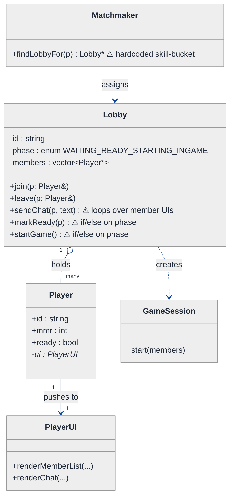
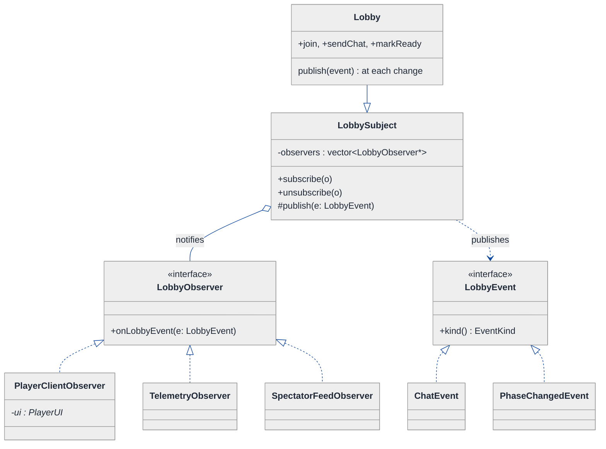
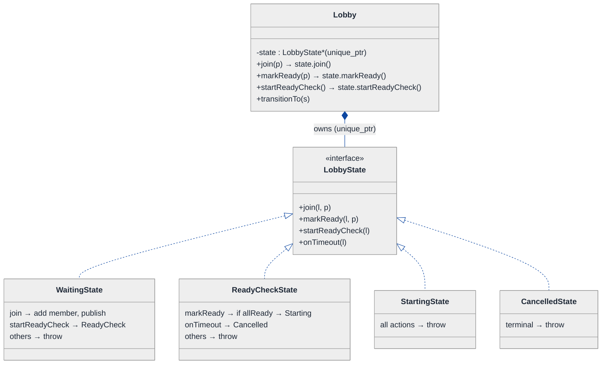
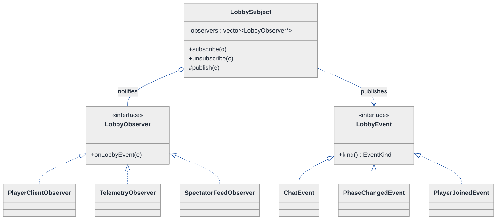
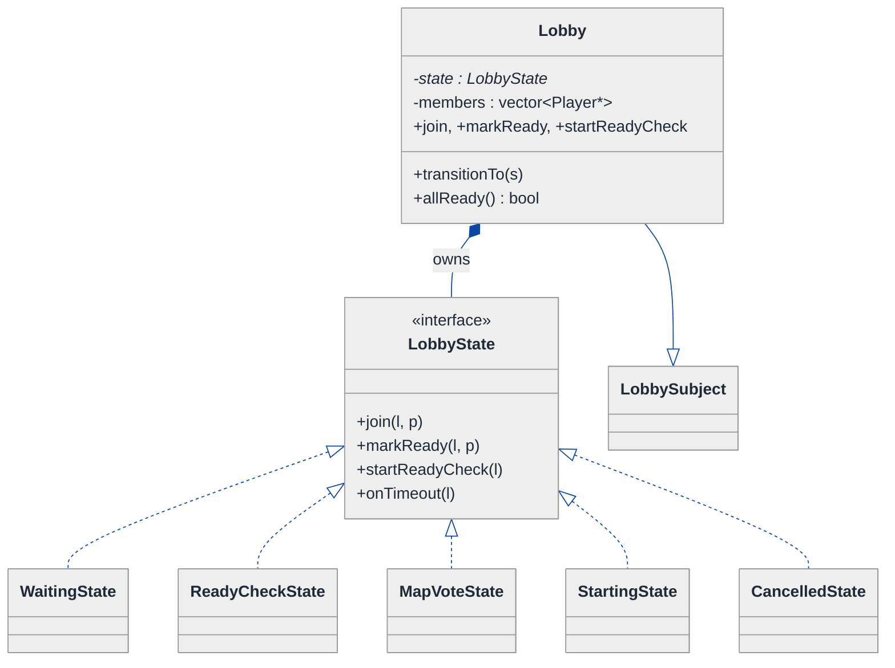
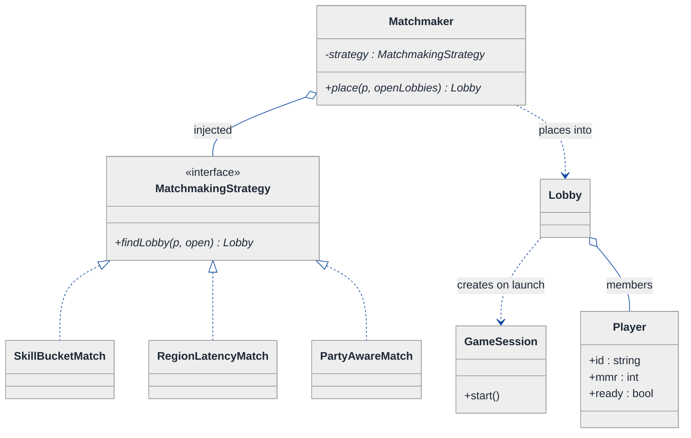
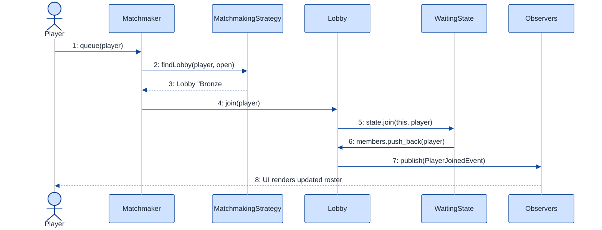
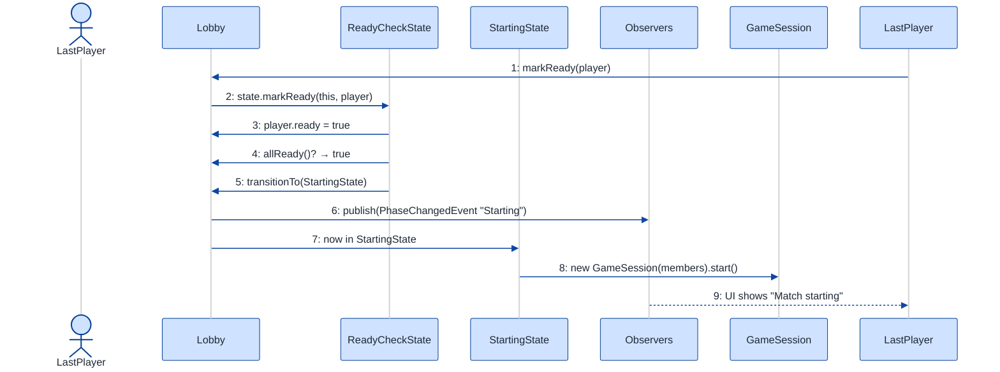

# Multi-Player Game Lobby — LLD Walkthrough

> **Difficulty:** Medium · **Time:** ~30 min · **Pattern focus:** Observer (lobby broadcast) + State (lobby lifecycle)
>
> **Problem source(s):** GID OB7 in [`./EXTRACTED_QUESTIONS.md`](./EXTRACTED_QUESTIONS.md), bucket `Observer_Pattern`.
>
> **Diagrams:** inline mermaid (renders natively in GitHub / VS Code). No external image artifacts.

---

## How to use this file

Paced for a candidate seeing the game-lobby problem for the first time. Reading time: ~30 minutes if you sketch each iteration by hand. **The lesson: a lobby is a tiny pub/sub hub wrapped around a state machine. Don't reach for those patterns up front — DERIVE them by building the naive design first, watching it break under three or four hypothetical changes, then reaching for ONE pattern at a time to fix the most painful axis.**

**Map of this file (15 sections):**

1. Problem statement + clarifying questions
2. Plain-English restatement
3. Why this matters
4. Mental model
5. Try it yourself first
6. Entity & verb extraction
7. **Iteration 1: the naive design** — what we'd write first
8. **Where the naive design hurts** — four future requirements, one painful diff each
9. **Pivot 1: Observer for lobby events** — the most painful axis first
10. **Pivot 2: State for the lobby lifecycle** — internal transitions, not external swaps
11. **Pivot 3: Strategy for matchmaking** — the last varying axis
12. Final UML class diagram
13. Skeleton code (C++)
14. Key flow — sequence diagram
15. Extensibility re-check + anti-patterns + how to think aloud + self-check

---

## 1. Problem statement + clarifying questions

**Prompt (typical phrasing):** "Design a multi-player online game lobby system supporting room creation, player matchmaking by skill level, a ready-check mechanism, in-lobby chat, and game session initialization."

**Clarifying questions to ask BEFORE drawing anything:**

1. **Room creation model?** Player-created custom rooms, or system-created rooms filled by a matchmaker, or both?
2. **Matchmaking criterion?** Just skill rating (ELO/MMR), or also region/latency, queue time, party size? Can it change per game mode?
3. **Ready-check semantics?** Does *everyone* have to ready up, or just a quorum? Is there a timeout? What happens to a player who never readies?
4. **Lobby lifecycle?** Is there an explicit phase sequence (waiting → ready-check → starting → in-game), and which actions are legal in each phase?
5. **Chat scope?** Lobby-local only, or persisted? Who receives a message — only current members?
6. **Who needs to be NOTIFIED of lobby changes?** Just the players' UIs? A spectator feed? A telemetry/analytics sink? A Discord bridge?
7. **Concurrency?** Can two players join the last open slot simultaneously? (We'll note thread-safety in §15, single-threaded otherwise.)
8. **Capacity / sizes?** Fixed team sizes (5v5) or variable? Min players to start?

**Assumptions if interviewer dodges:** both player-created and matchmade rooms; matchmaking by skill rating with pluggable criteria; ready-check requires *all* members within a timeout; an explicit lifecycle (Waiting → ReadyCheck → Starting → InGame, plus Cancelled); chat is lobby-local and ephemeral; multiple *kinds* of observers (player clients, telemetry, spectators) need notification; single-threaded for now.

---

## 2. Plain-English restatement

We're building the software behind the screen you sit in *after* clicking "Play" but *before* the match starts. A lobby gathers players, lets them chat, lets them mark themselves ready, and — once everyone's ready — kicks off the game session. Players are added either by creating/joining a room directly or by a matchmaker that groups people of similar skill. The lobby has a clear *lifecycle*: it starts open, runs a ready-check, then either launches or cancels. Every meaningful change (someone joined, someone chatted, the ready-check started) must be **pushed out to everyone watching** — and "everyone watching" is a growing list: player UIs today, telemetry and spectators tomorrow. The design must absorb new event-consumers, new lifecycle phases, and new matchmaking rules **without rewriting the core lobby**.

---

## 3. Why this matters

This question probes whether you recognize a *broadcast hub* and a *state machine* hiding inside an innocuous feature list. The naive instinct is to make the lobby hold a list of players and loop over them to push UI updates — which silently couples the lobby to one specific consumer (the player client) and to one hardcoded set of lifecycle rules. The senior move is to see two independent axes — *who gets told about changes* (Observer) and *what's legal right now* (State) — and decouple each. This exact shape recurs in chat rooms, collaborative editors, auction houses, and trading floors; nailing it here transfers everywhere.

---

## 4. Mental model

A lobby is a **noticeboard with a clipboard**. The noticeboard is the broadcast surface: anyone can pin themselves up as "interested," and whenever something happens, every pinned-up party gets a copy of the notice. The clipboard is the lifecycle: it has a current page (Waiting / ReadyCheck / Starting / InGame) and only certain pen-strokes are legal on each page.

```
Real-world sketch (NOT a UML diagram yet):

         ┌───────────────────────────────────────────────┐
         │   Lobby "Bronze Brawl #42"   [phase: ReadyCheck]│
         │                                                 │
         │   members: Ana(✓ready) Boris(✗) Chen(✓)         │
         │   chat:    Ana: "gl hf"    Chen: "rdy"          │
         └───────────────┬─────────────────────────────────┘
                         │  publishes events
        ┌────────────────┼─────────────────┬───────────────┐
        ▼                ▼                 ▼               ▼
   [Ana's UI]      [Boris's UI]      [Telemetry]     [Spectator feed]
   render list      render list       log metric      mirror state
```

The KEY insight from this picture: the lobby does NOT know *who* is listening or *how many* listeners there are — it just publishes. And the set of legal actions ("can I start the game?") depends entirely on which *page of the clipboard* is showing. Broadcast surface vs. lifecycle state — that's the separation we'll bake into the design.

---

## 5. Try it yourself first

> **Predict before reading on:**
>
> 1. List 5 nouns you'd promote to a class. List 3 nouns you'd leave as fields.
> 2. **If I told you that next month a telemetry service AND a Twitch spectator feed both need a live copy of every lobby event, what would change about how the lobby pushes updates?**
> 3. The action "start the game" is only legal once everyone's ready. Where do you put the rule that rejects "start" while players are still joining?

---

## 6. Entity & verb extraction

> **Mini-refresher: noun → class, but not every noun.**
>
> Naive OOD promotes every noun to a class. Senior OOD promotes a noun only if it has both BEHAVIOR and STATE that need to live together. "Skill rating" usually stays a field; "Lobby" becomes a class because it has lifecycle behavior + members it must coordinate.

**Nouns from the prompt:**

| Noun | Decision | Why |
|---|---|---|
| Lobby / Room | Class (the coordinator) | Owns members, runs lifecycle, broadcasts events |
| Player | Class | Has identity, skill rating, ready-flag |
| ChatMessage | Class (small value type) | Sender + text + timestamp; broadcast payload |
| LobbyEvent | Class hierarchy | The notice that gets broadcast (joined / left / chat / phase change) |
| Matchmaker | Class | Groups players into lobbies by some criterion |
| GameSession | Class | Created when the lobby launches |
| SkillRating (MMR) | Field on Player (`int`) | No behavior of its own |
| ReadyFlag | Field on Player (`bool`) | Just data |
| LobbyPhase | Was an enum — becomes a State hierarchy in §10 | Has phase-specific behavior |

**Verbs (and the class they live on):**

| Verb | Owner class (naive answer — we'll re-examine) |
|---|---|
| createRoom() / join(player) | Lobby |
| leave(player) | Lobby |
| sendChat(player, text) | Lobby |
| markReady(player) | Lobby |
| startReadyCheck() / startGame() | Lobby |
| findLobbyFor(player) | Matchmaker |
| notify(...) the watchers | Lobby (naive: hardcoded loop over player UIs) |

**We have NOT introduced any design patterns yet.** Pure nouns + verbs.

---

## 7. <a id="iter-1"></a>Iteration 1: the naive design

Let's write the simplest thing that could possibly work. No design patterns — just a `Lobby` class with methods, a `phase` enum, and a hardcoded loop that pushes updates to each player's UI.



**Reader's tour (read top to bottom; ~60 seconds).**

1. **At the top — `Lobby` is the root.** It holds a `phase` enum and a `members` vector, and exposes all the verbs from §6. Notice: NO list of "observers," NO state objects, NO matchmaking interface. Every decision lives inside these methods.

2. **The three warning markers (⚠) on Lobby.**
   - `sendChat` loops directly over `members` and calls each player's `ui->renderChat(...)`. The lobby is *welded* to `PlayerUI`.
   - `markReady` and `startGame` are guarded by `if (phase == ...)` ladders — the lifecycle rules are hardcoded conditionals.

3. **Player → PlayerUI (right side).** Each Player owns a pointer to its UI; the lobby reaches *through* the player to update the screen. This is the coupling that bites us in §8 change A.

4. **Matchmaker (left).** A single `findLobbyFor` with a hardcoded skill-bucket calculation. One algorithm, baked in.

5. **GameSession.** Created by `startGame()` once the (hardcoded) checks pass.

**What's deliberately missing.** No `LobbyObserver` interface — the lobby can only talk to `PlayerUI`. No `LobbyState` hierarchy — the phase is an enum interrogated by if/else. No `MatchmakingStrategy` — one bucketing rule, inline. The naive design doesn't even *acknowledge* that "who listens," "what's legal now," and "how to group players" are independent axes. That's what we'll expose, and fix, over the next four sections.

Skeleton code for the naive design (C++):

```cpp
#include <chrono>
#include <stdexcept>
#include <string>
#include <vector>

enum class LobbyPhase { WAITING, READY_CHECK, STARTING, IN_GAME };

class PlayerUI {
public:
    void renderMemberList(const std::vector<std::string>& names) { /* draw */ }
    void renderChat(const std::string& from, const std::string& text) { /* draw */ }
    void renderPhase(LobbyPhase p) { /* draw */ }
};

struct Player {
    std::string id;
    int         mmr   = 0;
    bool        ready = false;
    PlayerUI*   ui    = nullptr;   // lobby reaches through here
};

class GameSession {
public:
    explicit GameSession(std::vector<Player*> members) : members_(std::move(members)) {}
    void start() { /* spin up the match server */ }
private:
    std::vector<Player*> members_;
};

class Lobby {
public:
    explicit Lobby(std::string id) : id_(std::move(id)) {}

    void join(Player& p) {
        if (phase_ != LobbyPhase::WAITING)               // hardcoded rule
            throw std::runtime_error("Cannot join now");
        members_.push_back(&p);
        broadcastMemberList();                            // hardcoded fan-out
    }

    void sendChat(Player& p, const std::string& text) {
        for (auto* m : members_)                          // welded to PlayerUI
            m->ui->renderChat(p.id, text);
    }

    void markReady(Player& p) {
        if (phase_ != LobbyPhase::READY_CHECK)            // hardcoded rule
            throw std::runtime_error("Not in ready-check");
        p.ready = true;
        if (allReady()) startGame();
    }

    void startReadyCheck() {
        if (phase_ != LobbyPhase::WAITING)                // hardcoded rule
            throw std::runtime_error("Bad phase");
        phase_ = LobbyPhase::READY_CHECK;
        broadcastPhase();
    }

    void startGame() {
        if (phase_ != LobbyPhase::READY_CHECK || !allReady())  // hardcoded rule
            throw std::runtime_error("Not everyone ready");
        phase_ = LobbyPhase::STARTING;
        broadcastPhase();
        session_ = new GameSession(members_);
        session_->start();
        phase_ = LobbyPhase::IN_GAME;
        broadcastPhase();
    }

private:
    bool allReady() const {
        for (auto* m : members_) if (!m->ready) return false;
        return true;
    }
    void broadcastMemberList() {
        std::vector<std::string> names;
        for (auto* m : members_) names.push_back(m->id);
        for (auto* m : members_) m->ui->renderMemberList(names);   // welded
    }
    void broadcastPhase() {
        for (auto* m : members_) m->ui->renderPhase(phase_);       // welded
    }

    std::string          id_;
    LobbyPhase           phase_ = LobbyPhase::WAITING;
    std::vector<Player*> members_;
    GameSession*         session_ = nullptr;
};
```

**This works.** It has zero design patterns. Players join, chat, ready up, the game starts. So what's wrong with it?

---

## 8. <a id="naive-pain"></a>Where the naive design hurts

Now the interviewer slides a piece of paper across the desk: "Here are four things coming next quarter. Walk me through what changes."

### Change A: "Telemetry + a Twitch spectator feed both need every lobby event"

In the naive design:
- `sendChat`, `broadcastMemberList`, `broadcastPhase` each loop over `members_` and call `PlayerUI` methods.
- Telemetry isn't a member and has no `PlayerUI`. A spectator feed isn't a member either.
- You'd add `telemetry_->logChat(...)` and `spectatorFeed_->mirror(...)` calls **inside every one of those three methods**, plus new fields on Lobby.
- **Every new consumer means editing every broadcast site.** And the Lobby now depends on telemetry and spectator types directly.

### Change B: "A new lobby phase — `MAP_VOTE` between ready-check and starting"

In the naive design:
- Add `MAP_VOTE` to the `LobbyPhase` enum.
- Every method with an `if (phase_ == ...)` ladder (`join`, `markReady`, `startReadyCheck`, `startGame`) must be revisited to decide what's legal during MAP_VOTE.
- **The transition rules are smeared across four methods.** Miss one and you get an illegal-state bug (e.g., a player chatting their way into a map vote that hasn't validated readiness).

### Change C: "Ready-check timeout — auto-cancel if not everyone readies in 30s"

In the naive design:
- A new terminal-ish phase `CANCELLED` joins the enum.
- A timer callback must flip the phase and notify everyone — but the cancel rule ("only valid while in READY_CHECK") is another `if (phase_ == ...)` added to yet another method.
- **The lifecycle keeps sprawling.** Each new phase multiplies the if/else surface.

### Change D: "Matchmake by region + latency, not just skill — and per game mode"

In the naive design:
- `Matchmaker::findLobbyFor` has one hardcoded skill-bucket formula.
- Add `if (mode == RANKED) ... else if (mode == CASUAL) ...` with region/latency math inside.
- **Every new grouping rule is surgery in the same method.** Classic tag-driven branching.

### The pattern of pain

| Change | Files touched | Smell |
|---|---|---|
| A. Telemetry + spectators | every broadcast method in `Lobby` | "Lobby is welded to one consumer type; new consumers edit every fan-out site." |
| B. MAP_VOTE phase | `join` + `markReady` + `startReadyCheck` + `startGame` | "Lifecycle rules smeared across many `if (phase==)` ladders." |
| C. Ready-check timeout | another phase + more `if (phase==)` | "Enum + switch can't express a growing lifecycle cleanly." |
| D. Region/latency matchmaking | `Matchmaker::findLobbyFor` switch | "Tag-driven if/else; every new rule is surgery in one function." |

**Three axes of pain dominate:** *who gets notified* (broadcast coupling), *what's legal right now* (lifecycle), and *how to group players* (matchmaking algorithm).

> **Pivot question:** "What pattern lets a subject notify an open-ended set of listeners it doesn't know the concrete types of? What pattern handles 'a lifecycle with phase-specific behavior and internal transitions'? And what pattern swaps an algorithm the caller picks?"
>
> The answers are Observer, State, and Strategy. Let's introduce them one at a time, starting with the most painful axis: broadcast coupling.

---

## 9. <a id="pivot-1"></a>Pivot 1: Observer for lobby events

> **Mini-refresher: Observer pattern.**
>
> A *Subject* keeps a list of *Observers* and notifies all of them when something changes — but it only knows them through an abstract interface, never their concrete types. Observers `subscribe()` / `unsubscribe()`; the subject calls `onEvent(...)` on each. **Push** delivers the changed data in the call; **pull** delivers a thin "something changed" ping and the observer queries back. The subject is decoupled from *how many* and *what kind* of observers exist.
>
> Quick example: a spreadsheet `Cell` (subject) notifies every `Chart` and `Formula` (observers) that depend on it when its value changes — without knowing whether a chart, a formula, or a logger is listening.

**Why Observer fits the broadcast axis.** The lobby produces events (joined, left, chat, phase-changed). The *set of consumers* varies and grows (player UIs, telemetry, spectators, a Discord bridge). The lobby should not know their concrete types or count. That's textbook Observer: make `Lobby` a subject, define a `LobbyObserver` interface, and let consumers subscribe.

We'll use **push** with a small `LobbyEvent` hierarchy as the payload, so each observer can react to exactly the event types it cares about.

**The refactor (just the affected part):**

```cpp
// ── The event payload (a tiny hierarchy so observers can switch on kind) ──
enum class EventKind { PLAYER_JOINED, PLAYER_LEFT, CHAT, PHASE_CHANGED, READY_CHANGED };

struct LobbyEvent {
    virtual ~LobbyEvent() = default;
    virtual EventKind kind() const = 0;
};
struct ChatEvent : LobbyEvent {
    std::string from, text;
    EventKind kind() const override { return EventKind::CHAT; }
};
struct PhaseChangedEvent : LobbyEvent {
    std::string newPhase;
    EventKind kind() const override { return EventKind::PHASE_CHANGED; }
};
// PlayerJoined / PlayerLeft / ReadyChanged elided — same shape

// ── The Observer interface ──
class LobbyObserver {
public:
    virtual ~LobbyObserver() = default;
    virtual void onLobbyEvent(const LobbyEvent& e) = 0;
};

// ── Concrete observers — the lobby knows NONE of these types ──
class PlayerClientObserver : public LobbyObserver {
public:
    explicit PlayerClientObserver(PlayerUI* ui) : ui_(ui) {}
    void onLobbyEvent(const LobbyEvent& e) override {
        if (e.kind() == EventKind::CHAT) {
            const auto& c = static_cast<const ChatEvent&>(e);
            ui_->renderChat(c.from, c.text);
        }
        // ... handle other kinds, elided
    }
private:
    PlayerUI* ui_;
};

class TelemetryObserver : public LobbyObserver {     // Change A lands here
public:
    void onLobbyEvent(const LobbyEvent& e) override { /* increment a counter */ }
};
// SpectatorFeedObserver, DiscordBridgeObserver — elided, same shape

// ── The Subject side, mixed into Lobby ──
class LobbySubject {
public:
    void subscribe(LobbyObserver* o)   { observers_.push_back(o); }
    void unsubscribe(LobbyObserver* o) { /* erase-remove, elided */ }
protected:
    void publish(const LobbyEvent& e) {
        for (auto* o : observers_) o->onLobbyEvent(e);   // ONE fan-out site
    }
private:
    std::vector<LobbyObserver*> observers_;   // raw/weak — observers outlive or unsubscribe
};
```

Now `Lobby` derives from `LobbySubject`, and every place that used to loop over `PlayerUI` calls `publish(someEvent)` instead — **one fan-out site, zero knowledge of who's listening.**

**What changed — visualized.** Just the broadcast slice:



**Tour of the after-state.**

1. **`LobbySubject` is the new broadcast surface.** It holds `observers_` and a protected `publish()`. `Lobby` inherits it, so the lobby IS-A subject. Every former `m->ui->render...()` loop collapses into a single `publish(event)`.

2. **`LobbyObserver` is the interface the lobby talks to.** One method, `onLobbyEvent(const LobbyEvent&)`. The lobby never names `PlayerUI`, `Telemetry`, or `Spectator` — only this interface. The open diamond (`◇`) marks aggregation: the subject *references* observers but doesn't own their lifetime.

3. **Three concrete observers hang off the interface.** `PlayerClientObserver` adapts events back to `PlayerUI` calls; `TelemetryObserver` logs metrics; `SpectatorFeedObserver` mirrors state. **Change A from §8 is now: write one new observer class and `subscribe()` it. Zero edits to Lobby.**

4. **The `LobbyEvent` hierarchy is the push payload.** Each event carries its own data (`ChatEvent` has from/text; `PhaseChangedEvent` has the new phase). Observers switch on `kind()` and react to what they care about.

5. **Decoupling consequence.** The number and type of listeners can change at runtime via `subscribe`/`unsubscribe` with no change to the lobby's code.

**Push vs pull — which we chose and why.**
- *Push:* the subject sends the changed data inside the notification (our `LobbyEvent`). Observers get everything immediately; risk is sending more than some observers need.
- *Pull:* the subject sends a thin "changed" ping; each observer queries the subject for what it wants. Less data on the wire; more round-trips and tighter coupling to the subject's getters.
- *Rule of thumb:* small, well-typed payloads with many heterogeneous observers → push (ours). Large state where each observer needs a different slice → pull.

**Pattern-discrimination cheatsheet — Observer vs Mediator.**
- *Observer:* one subject broadcasts to many listeners; listeners don't talk back through the subject. Fan-out is the point.
- *Mediator:* a hub coordinates *bidirectional* many-to-many traffic between colleagues that would otherwise reference each other.
- *Rule of thumb:* if it's "one thing changed, tell everyone watching" → Observer. If it's "these N components must talk to each other and I want to centralize that wiring" → Mediator.

We chose Observer because the flow is one-directional fan-out: the lobby announces, watchers react. Players don't coordinate *through* the lobby's observer channel — they call lobby methods directly (`join`, `markReady`), which is plain delegation, not mediation.

---

## 10. <a id="pivot-2"></a>Pivot 2: State for the lobby lifecycle

Changes B and C from §8 are still painful — a new `MAP_VOTE` phase, a `CANCELLED` phase, and the `if (phase_ == ...)` ladders smeared across four methods. Observer doesn't help here because the variability isn't *who listens* — it's *what's legal right now and what comes next*.

> **Mini-refresher: State pattern.**
>
> Each lifecycle phase becomes its own class implementing a common interface. The context object (here, `Lobby`) delegates every action to its *current state* object, and THE STATE decides what's legal and what the next state is. Transitions are INTERNAL, driven by the events the context receives — not picked by an outside caller.

**Why State (not Strategy).** The phase isn't chosen by the caller — it's driven by what the lobby has been through. A `WaitingState` allows `join` and `startReadyCheck`. A `ReadyCheckState` allows `markReady` and (when everyone's ready) auto-advances. A `StartingState` allows nothing but the engine finishing. Calling `join()` during `Starting` isn't a config choice — it's *illegal*, and the state should reject it. The lifecycle is the lobby's own concern.

**The refactor (just the lifecycle part):**

```cpp
class Lobby;  // forward

class LobbyState {
public:
    virtual ~LobbyState() = default;
    virtual std::string name() const = 0;
    virtual void join(Lobby&, Player&)          { throw std::runtime_error("join illegal now"); }
    virtual void markReady(Lobby&, Player&)     { throw std::runtime_error("ready illegal now"); }
    virtual void startReadyCheck(Lobby&)        { throw std::runtime_error("ready-check illegal now"); }
    virtual void onTimeout(Lobby&)              { /* default: ignore */ }
};

class WaitingState : public LobbyState {
public:
    std::string name() const override { return "Waiting"; }
    void join(Lobby& l, Player& p) override;          // add member, publish PLAYER_JOINED
    void startReadyCheck(Lobby& l) override;          // → ReadyCheckState
};

class ReadyCheckState : public LobbyState {
public:
    std::string name() const override { return "ReadyCheck"; }
    void markReady(Lobby& l, Player& p) override;     // set ready; if allReady → StartingState
    void onTimeout(Lobby& l) override;                // Change C: → CancelledState
};

class StartingState : public LobbyState {             // engine spinning up; everything else illegal
public:
    std::string name() const override { return "Starting"; }
};

class CancelledState : public LobbyState {            // Change C terminal
public:
    std::string name() const override { return "Cancelled"; }
};
// MapVoteState (Change B) slots in between ReadyCheck and Starting — one new class

class Lobby : public LobbySubject {
public:
    Lobby() : state_(std::make_unique<WaitingState>()) {}
    void transitionTo(std::unique_ptr<LobbyState> s) {
        state_ = std::move(s);
        PhaseChangedEvent e; e.newPhase = state_->name();
        publish(e);                                   // Observer + State cooperate
    }
    // Public API now just delegates — NO if (phase==) anywhere
    void join(Player& p)        { state_->join(*this, p); }
    void markReady(Player& p)   { state_->markReady(*this, p); }
    void startReadyCheck()      { state_->startReadyCheck(*this); }
    void onTimeout()            { state_->onTimeout(*this); }

    // helpers the states use
    std::vector<Player*>& members() { return members_; }
    bool allReady() const { for (auto* m : members_) if (!m->ready) return false; return true; }
private:
    std::unique_ptr<LobbyState> state_;
    std::vector<Player*>        members_;
};

// State method bodies (deferred until Lobby is complete):
inline void WaitingState::join(Lobby& l, Player& p) {
    l.members().push_back(&p);
    PlayerJoinedEvent e; /* fill */ l_publish(l, e);  // publish via lobby, elided helper
}
inline void WaitingState::startReadyCheck(Lobby& l) {
    l.transitionTo(std::make_unique<ReadyCheckState>());
}
inline void ReadyCheckState::markReady(Lobby& l, Player& p) {
    p.ready = true;
    if (l.allReady()) l.transitionTo(std::make_unique<StartingState>());
}
inline void ReadyCheckState::onTimeout(Lobby& l) {
    l.transitionTo(std::make_unique<CancelledState>());   // Change C
}
```

**What changed — visualized.** Just the lifecycle slice:



**Tour of the after-state.**

1. **The `LobbyPhase` enum is gone.** It's replaced by a `state_` field of type `std::unique_ptr<LobbyState>` — the lobby OWNS its current state (filled diamond).

2. **Lobby's public methods became one-liners.** `join`, `markReady`, `startReadyCheck` each just delegate to the current state. **NO `if (phase == X)` branching anywhere on Lobby.**

3. **The interface declares the contract with safe defaults.** `LobbyState`'s base methods throw "illegal now" by default, so a concrete state only overrides the actions that ARE legal in its phase. `WaitingState` overrides `join` + `startReadyCheck`; everything else inherits the throwing default for free.

4. **Each state knows its own transitions.** `WaitingState::startReadyCheck` does `transitionTo(ReadyCheckState)`. `ReadyCheckState::markReady` advances to `StartingState` once `allReady()`. `ReadyCheckState::onTimeout` advances to `CancelledState`. **The transition logic lives WITH the state**, not in Lobby.

5. **Observer and State cooperate in `transitionTo`.** Every transition calls `publish(PhaseChangedEvent)` — so changing a phase automatically tells every watcher. The two patterns meet in one method.

**Changes B and C now land cleanly.** MAP_VOTE → one new `MapVoteState` class slotted between ReadyCheck and Starting (and `ReadyCheckState` transitions to it instead of Starting — one edited line). Timeout cancel → already shown via `CancelledState` + `onTimeout`. No four-method if/else sweep.

**Pattern-discrimination cheatsheet — State vs Strategy.**
- *Strategy:* the CALLER picks which algorithm to use; strategies are usually unaware of each other.
- *State:* the OBJECT picks its next state internally; states know about each other (each can `transitionTo` another).
- *Rule of thumb:* if `lobby.setX(variant)` is called externally → Strategy. If `lobby.handleEvent(e)` flips an internal phase → State.

The phase swap happens because of internal event flow (everyone readied → Starting), not because external code requested a specific phase. That's State.

---

## 11. <a id="pivot-3"></a>Pivot 3: Strategy for matchmaking

Changes A, B, C are solved. Change D (matchmake by region + latency, per game mode) is the last painful axis — and it's a different shape from the other two.

> **Mini-refresher: Strategy pattern.**
>
> Encapsulates an algorithm behind an interface so it can be swapped at runtime. The CALLER decides which strategy to use; the strategy doesn't know about its peers. Quick example: a `Sorter` takes a `CompareStrategy*`; pass `ByName` or `ByDate` and the sorter doesn't care.

**Why Strategy (not State, not Observer).** Matchmaking is an *algorithm*: given a player and a pool of open lobbies, return the best fit. It varies (skill-bucket, region+latency, party-aware) and the choice is made *externally* — by the game mode / server config, not by the matchmaker discovering it. That's textbook Strategy. It's not State (no lifecycle), and not Observer (no fan-out).

**The refactor (just the matchmaking slice):**

```cpp
class MatchmakingStrategy {
public:
    virtual ~MatchmakingStrategy() = default;
    virtual Lobby* findLobby(const Player& p, std::vector<Lobby*>& open) = 0;
};

class SkillBucketMatch : public MatchmakingStrategy {     // the old hardcoded rule, isolated
public:
    explicit SkillBucketMatch(int bandWidth) : band_(bandWidth) {}
    Lobby* findLobby(const Player& p, std::vector<Lobby*>& open) override {
        for (auto* l : open)
            if (std::abs(l->averageMmr() - p.mmr) <= band_) return l;
        return nullptr;   // caller creates a fresh lobby
    }
private:
    int band_;
};

class RegionLatencyMatch : public MatchmakingStrategy {   // Change D lands here
public:
    Lobby* findLobby(const Player& p, std::vector<Lobby*>& open) override {
        // prefer same region, then lowest latency, then skill band — elided
        return nullptr;
    }
};
// PartyAwareMatch, RankedStrictMatch — elided, same shape

class Matchmaker {
public:
    explicit Matchmaker(std::unique_ptr<MatchmakingStrategy> s) : strategy_(std::move(s)) {}
    Lobby* place(const Player& p, std::vector<Lobby*>& open) {
        return strategy_->findLobby(p, open);   // delegates; no if/else
    }
private:
    std::unique_ptr<MatchmakingStrategy> strategy_;   // injected per game mode
};
```

**The lesson.** Once we recognized "algorithm picked by the caller" as the pattern for matchmaking, Change D becomes: write one new `MatchmakingStrategy` subclass and inject it for that game mode. No edits to `Matchmaker`, no growing switch.

> **Mini-refresher: dependency injection.**
>
> Rather than `Matchmaker` constructing its own strategy with `new SkillBucketMatch(...)` (which welds it to one rule), the strategy is *passed in* at construction. The caller — game-mode config — decides. This is constructor injection: the dependency arrives through the constructor, so the class is testable (pass a fake) and configurable (pass any variant).

**Pattern-discrimination cheatsheet — Strategy vs a plain enum+switch.**
- *enum + switch:* fine for 2-3 fixed variants that never compose and rarely change.
- *Strategy:* the variants are open-ended, swapped at runtime, or independently testable.
- *Rule of thumb:* if you expect to add variants without touching existing code (open/closed), use Strategy.

> **Mini-refresher: Open/Closed Principle (the "O" in SOLID).**
>
> Software entities should be *open for extension, closed for modification*. Adding a new matchmaking rule, observer, or lobby phase should mean adding a class — not editing existing, tested classes. All three pivots above achieve exactly this.

---

## 12. <a id="fig-class-diagram"></a>Final class diagram

Drawing the whole design as one diagram becomes a wall of boxes. Instead, here are **three focused sub-views**, each addressing one axis. Read them in order; the structural insight at the end ties them together.

### 12.1 The broadcast surface — Observer



**Tour of 12.1.** `LobbySubject` holds the observer list and the single `publish()` fan-out. The open diamond (`◇`) to `LobbyObserver` is aggregation — the subject references observers but doesn't own them (they unsubscribe or outlive it). Three concrete observers and a `LobbyEvent` payload hierarchy complete the picture. New consumer = one new observer subclass.

### 12.2 The lifecycle — State



**Tour of 12.2.** `Lobby` owns exactly one `LobbyState` (filled diamond / `unique_ptr`) and ALSO inherits `LobbySubject` (the `--|>` arrow), so it's simultaneously a state machine and a broadcast source. Each concrete state overrides only the actions legal in its phase; the base throws by default. `MapVoteState` is shown slotted in (Change B) — adding it touched only one transition line.

### 12.3 The matchmaking policy + the launch — Strategy



**Tour of 12.3.** `Matchmaker` holds an injected `MatchmakingStrategy` (open diamond — aggregation; chosen per game mode). Concrete strategies isolate each grouping rule. The matchmaker places a `Player` into a `Lobby`; when the lobby's `StartingState` is reached it creates a `GameSession`. `Player` is plain data — identity, MMR, ready-flag — no behavior worth subclassing.

### Structural insight (ties 12.1 + 12.2 + 12.3 together)

| Concern | Pattern used | Why |
|---|---|---|
| **Who hears about changes** (UIs, telemetry, spectators) | Observer, `Lobby` IS-A subject | Open-ended consumer set; subject must not know concrete types |
| **What's legal right now** (Waiting → ReadyCheck → Starting / Cancelled) | State, OWNED by `Lobby` | Lobby controls its own transitions; states validate legal actions |
| **How to group players** (skill / region / party) | Strategy, INJECTED into `Matchmaker` | Game-mode config picks the algorithm; open-ended variants |
| **Match launch** (GameSession) | Plain creation from `StartingState` | One-shot; no variation worth a pattern |

The big lesson: **inheritance is used only for the state, observer, event, and strategy class families** — every "varies independently" axis becomes composition over an interface. *Inheritance for role families, composition for wiring.* And note where two patterns MEET: `Lobby::transitionTo` (State) calls `publish(PhaseChangedEvent)` (Observer) — a phase change is automatically broadcast.

---

## 13. Skeleton code (C++)

> Show the SHAPES, not the full impl. ~130 lines. `// elided` marks the labor.

```cpp
#include <cmath>
#include <memory>
#include <stdexcept>
#include <string>
#include <vector>

// ── Forward declarations ────────────────────────────────────────────
class Lobby;

// ── Domain data ─────────────────────────────────────────────────────
struct Player {
    std::string id;
    int         mmr   = 0;
    bool        ready = false;
};

// ── Observer side: events + interface + subject ─────────────────────
enum class EventKind { PLAYER_JOINED, PLAYER_LEFT, CHAT, PHASE_CHANGED, READY_CHANGED };

struct LobbyEvent { virtual ~LobbyEvent() = default; virtual EventKind kind() const = 0; };
struct ChatEvent : LobbyEvent {
    std::string from, text;
    EventKind kind() const override { return EventKind::CHAT; }
};
struct PhaseChangedEvent : LobbyEvent {
    std::string newPhase;
    EventKind kind() const override { return EventKind::PHASE_CHANGED; }
};
// PlayerJoinedEvent / ReadyChangedEvent — elided, same shape

class LobbyObserver {
public:
    virtual ~LobbyObserver() = default;
    virtual void onLobbyEvent(const LobbyEvent& e) = 0;
};

class LobbySubject {
public:
    void subscribe(LobbyObserver* o)   { observers_.push_back(o); }
    void unsubscribe(LobbyObserver* o) { /* erase-remove, elided */ }
protected:
    void publish(const LobbyEvent& e) const {
        for (auto* o : observers_) o->onLobbyEvent(e);   // single fan-out site
    }
private:
    std::vector<LobbyObserver*> observers_;   // non-owning; observers manage their own lifetime
};

class PlayerClientObserver : public LobbyObserver {
public:
    void onLobbyEvent(const LobbyEvent& e) override {
        if (e.kind() == EventKind::CHAT) { /* render via PlayerUI */ }
        // other kinds elided
    }
};
// TelemetryObserver, SpectatorFeedObserver — elided, same shape

// ── State side: interface + concrete states ─────────────────────────
class LobbyState {
public:
    virtual ~LobbyState() = default;
    virtual std::string name() const = 0;
    virtual void join(Lobby&, Player&)       { throw std::runtime_error("join illegal now"); }
    virtual void markReady(Lobby&, Player&)  { throw std::runtime_error("ready illegal now"); }
    virtual void startReadyCheck(Lobby&)     { throw std::runtime_error("ready-check illegal now"); }
    virtual void onTimeout(Lobby&)           { /* default ignore */ }
};

class WaitingState : public LobbyState {
public:
    std::string name() const override { return "Waiting"; }
    void join(Lobby& l, Player& p) override;
    void startReadyCheck(Lobby& l) override;
};
class ReadyCheckState : public LobbyState {
public:
    std::string name() const override { return "ReadyCheck"; }
    void markReady(Lobby& l, Player& p) override;
    void onTimeout(Lobby& l) override;
};
class StartingState  : public LobbyState { public: std::string name() const override { return "Starting"; } };
class CancelledState : public LobbyState { public: std::string name() const override { return "Cancelled"; } };
// MapVoteState — elided, slots between ReadyCheck and Starting

// ── The Lobby: a Subject AND a State machine ────────────────────────
class Lobby : public LobbySubject {
public:
    Lobby() : state_(std::make_unique<WaitingState>()) {}

    void join(Player& p)      { state_->join(*this, p); }
    void markReady(Player& p) { state_->markReady(*this, p); }
    void startReadyCheck()    { state_->startReadyCheck(*this); }
    void onTimeout()          { state_->onTimeout(*this); }

    void sendChat(const Player& p, const std::string& text) {
        ChatEvent e; e.from = p.id; e.text = text;
        publish(e);                                       // Observer
    }
    void transitionTo(std::unique_ptr<LobbyState> s) {
        state_ = std::move(s);
        PhaseChangedEvent e; e.newPhase = state_->name();
        publish(e);                                       // State + Observer meet
    }

    std::vector<Player*>& members()       { return members_; }
    bool allReady() const { for (auto* m : members_) if (!m->ready) return false; return true; }
    int  averageMmr() const { /* sum/size, elided */ return 0; }
private:
    std::unique_ptr<LobbyState> state_;
    std::vector<Player*>        members_;
};

// State bodies (after Lobby is complete):
inline void WaitingState::join(Lobby& l, Player& p)        { l.members().push_back(&p); /* publish PlayerJoined */ }
inline void WaitingState::startReadyCheck(Lobby& l)        { l.transitionTo(std::make_unique<ReadyCheckState>()); }
inline void ReadyCheckState::markReady(Lobby& l, Player& p){ p.ready = true; if (l.allReady()) l.transitionTo(std::make_unique<StartingState>()); }
inline void ReadyCheckState::onTimeout(Lobby& l)           { l.transitionTo(std::make_unique<CancelledState>()); }

// ── Strategy side: matchmaking ──────────────────────────────────────
class MatchmakingStrategy {
public:
    virtual ~MatchmakingStrategy() = default;
    virtual Lobby* findLobby(const Player& p, std::vector<Lobby*>& open) = 0;
};
class SkillBucketMatch : public MatchmakingStrategy {
public:
    explicit SkillBucketMatch(int band) : band_(band) {}
    Lobby* findLobby(const Player& p, std::vector<Lobby*>& open) override {
        for (auto* l : open) if (std::abs(l->averageMmr() - p.mmr) <= band_) return l;
        return nullptr;
    }
private:
    int band_;
};
// RegionLatencyMatch, PartyAwareMatch — elided, same shape

class Matchmaker {
public:
    explicit Matchmaker(std::unique_ptr<MatchmakingStrategy> s) : strategy_(std::move(s)) {}
    Lobby* place(const Player& p, std::vector<Lobby*>& open) { return strategy_->findLobby(p, open); }
private:
    std::unique_ptr<MatchmakingStrategy> strategy_;
};
```

---

## 14. <a id="fig-sequence"></a>Key flow — sequence diagram

Two phases. Phase 1: matchmaking + join. Phase 2: ready-check completes and the game launches — the moment Observer and State cooperate.

### Phase 1 — matchmake + join



**Tour of Phase 1.**

1. **Player queues; Matchmaker delegates to its injected Strategy.** The matchmaker doesn't compute fit itself — `findLobby` does. Skill-bucket vs region-latency look identical from this seat (Strategy).
2. **Strategy returns a fitting lobby.** If none fit, it returns null and the matchmaker creates a fresh lobby (elided).
3. **Matchmaker calls `lobby.join(player)`.** The lobby delegates to its current state — here `WaitingState`, which is the only state that permits joining.
4. **`WaitingState::join` adds the member, then the lobby publishes.** `publish(PlayerJoinedEvent)` fans out to every observer — the lobby has no idea whether one UI or also telemetry is listening.
5. **Observers render.** Each watcher reacts to the event it cares about. End of Phase 1.

### Phase 2 — ready-check completes + launch



**Tour of Phase 2. Read this slowly — it's where Observer and State cooperate.**

1. **The last player readies up.** `lobby.markReady(player)` delegates to the current `ReadyCheckState`. **If the lobby were already in `StartingState`, this same call would hit the base default and throw "ready illegal now" — no `if (phase==)` check needed.** The class hierarchy IS the validation.
2. **`ReadyCheckState::markReady` sets the flag and checks `allReady()`.** True now.
3. **The state transitions the lobby itself.** `transitionTo(StartingState)` — the *state* decides what's next, not the lobby and not the caller. That's the State pattern's core.
4. **`transitionTo` publishes a `PhaseChangedEvent`.** This is the meeting point: a State transition automatically triggers an Observer fan-out. Every UI, telemetry sink, and spectator feed learns the phase changed — through one `publish`.
5. **`StartingState` spins up the `GameSession`.** Match server launches; observers render "starting." Done.

### The validation that's NOT shown — and why it matters

You won't find `if (phase == READY_CHECK)` anywhere in this flow. That's the point of the State pattern: **illegal actions are made impossible by polymorphism**, not by runtime checks scattered through the code. Call `markReady` while `Starting`, and the call routes to the base `LobbyState::markReady` which throws — no enum comparison, no `if` ladder. And you won't find `telemetry->log(...)` next to `ui->render(...)` either; there's one `publish`, and the observer list decides who hears it.

---

## 15. Extensibility re-check + anti-patterns + how to think aloud + self-check

### Extensibility re-check

Revisit the four changes from [§8](#naive-pain). For each, name the SINGLE class that changes.

| Change | Naive design impact | Final design impact |
|---|---|---|
| A. Telemetry + spectator feed | every broadcast method edited | New `TelemetryObserver` / `SpectatorFeedObserver`; `subscribe()` it. Done. |
| B. MAP_VOTE phase | 4 methods' `if (phase==)` ladders | New `MapVoteState` class + one transition line edited. Done. |
| C. Ready-check timeout | another phase + more if/else | New `CancelledState` + `onTimeout` override. Done. |
| D. Region/latency matchmaking | `findLobbyFor` switch grows | New `RegionLatencyMatch : MatchmakingStrategy`; inject per mode. Done. |

Every change is essentially ONE new class. That's the open/closed principle in practice.

If a future requirement makes you change `Lobby`, the states, the observers, AND the matchmaker together — go back to §6 and re-identify the variability points; you missed one.

### Common confusion + traps

1. **"Should the Lobby store concrete `PlayerUI` pointers?"** No — that's the original coupling. The lobby talks only to `LobbyObserver`. A `PlayerClientObserver` adapts events to the UI.
2. **"Why a `LobbyEvent` hierarchy instead of separate `onJoin`/`onChat`/`onPhase` observer methods?"** Either works. A single `onLobbyEvent(LobbyEvent&)` keeps the interface stable as new event kinds appear (open/closed); fat interfaces with one method per event force every observer to implement methods it ignores (an Interface Segregation smell).
3. **"Why State instead of an enum + switch for phases?"** Works for 3 phases. Falls apart at 5-6 because the legal-action matrix becomes N² switches smeared across files.
4. **"Why is MatchmakingStrategy on the Matchmaker, not the Lobby?"** Matchmaking groups players *into* lobbies — it's a pre-lobby concern. The lobby just receives members.
5. **"Raw pointers in the observer list — is that a leak?"** The subject is *non-owning*: observers manage their own lifetime and must `unsubscribe()` before they die (or use `weak_ptr` if shared ownership is real). Storing owning `unique_ptr` here would wrongly tie observer lifetimes to the lobby.

### Anti-patterns

- **"God-class Lobby"** — the naive version that does broadcast, lifecycle, AND matchmaking inline. Split each axis into its own collaborator.
- **"Welded broadcast"** — looping over `members_` and calling a concrete UI. Use an observer interface and one `publish`.
- **"Enum-phase if/else sprawl"** — `if (phase==X)` ladders in every method. Use the State pattern.
- **"Tag-driven matchmaking"** — `if (mode==RANKED) ... else if ...` in one function. Use a Strategy interface.
- **"Observer re-entrancy bug"** — an observer that, inside `onLobbyEvent`, mutates the lobby and triggers another publish mid-iteration. Snapshot the observer list before iterating, or queue events.
- **"Owning observer list"** — storing `unique_ptr<LobbyObserver>` in the subject, coupling listener lifetimes to the subject. Keep the subject non-owning.

### How to think aloud

> "OK, game lobby. Let me clarify scope. [Asks the §1 questions.] Got it.
>
> Nouns: Lobby, Player, ChatMessage, Matchmaker, GameSession. Lobby coordinates members, runs a lifecycle, and broadcasts changes.
>
> I'll write the NAIVE design first — a Lobby with a `phase` enum, a `members` vector, and methods that loop over each player's UI to push updates. It works, zero patterns.
>
> Now stress-test it. Change A: telemetry and a spectator feed need every event — but they aren't members and have no UI, so I'd edit every broadcast site. Change B: a MAP_VOTE phase forces revisiting four `if (phase==)` ladders. Change C: a ready-check timeout adds yet another phase and more branches. Change D: region/latency matchmaking grows a switch.
>
> Three axes: who hears changes (broadcast coupling), what's legal now (lifecycle), and how to group players (algorithm).
>
> Pivot 1: Observer. Lobby becomes a Subject with a `LobbyObserver` interface and a `LobbyEvent` payload. New consumers = new observer subclasses, subscribed at runtime. One `publish` site.
>
> Pivot 2: State. The phase enum becomes a `LobbyState` hierarchy. Lobby delegates `join`/`markReady`/`startReadyCheck` to the current state; each state validates legal actions and decides its own transitions. New phase = new class.
>
> Pivot 3: Strategy. Matchmaking becomes a `MatchmakingStrategy` injected per game mode. New rule = new subclass.
>
> Final design: Lobby IS-A Subject and OWNS a State; the Matchmaker AGGREGATES a Strategy. Observer and State meet in `transitionTo`, which publishes a phase-change event. All four future requirements land as one new class each — open/closed."

### Self-check

> **Self-check — the question to ask next time.**
>
> When you see "a thing that has members, broadcasts changes, and moves through phases," before reaching for a list-of-listeners loop and a phase enum, ask:
>
> > **"Is this variation about WHO gets told (Observer), about WHAT'S LEGAL right now and what comes next (State), or about an ALGORITHM the caller picks (Strategy)?"**
>
> Fan-out → Observer. Lifecycle → State. Swappable algorithm → Strategy. A lobby is all three at once — and once you name the axis, the class diagram falls out for free.

---

## Cross-references

- **Parent topic manifest:** [`./EXTRACTED_QUESTIONS.md`](./EXTRACTED_QUESTIONS.md)
- **Vertical overview:** [`../../LEARNING.md`](../../LEARNING.md)
- **Template:** [`../../TEMPLATE-v2.md`](../../TEMPLATE-v2.md)
- **Canonical exemplar:** [`../Object_Oriented_Design/Parking_Lot.md`](../Object_Oriented_Design/Parking_Lot.md)
- **Related Observer_Pattern walkthroughs:**
  - [`./Auction_Countdown_Timer.md`](./Auction_Countdown_Timer.md) — Observer + timer-driven state
  - [`./Config_Hot_Reload.md`](./Config_Hot_Reload.md) — Observer for config change fan-out
  - [`./Email_Client.md`](./Email_Client.md) — Observer over a mailbox subject
  - [`./QA_Platform.md`](./QA_Platform.md) — Observer for notification feeds
- **Further reading:** <a href="https://refactoring.guru/design-patterns/observer" target="_blank" rel="noopener noreferrer">Observer pattern (Refactoring Guru)</a> · <a href="https://refactoring.guru/design-patterns/state" target="_blank" rel="noopener noreferrer">State pattern (Refactoring Guru)</a>
